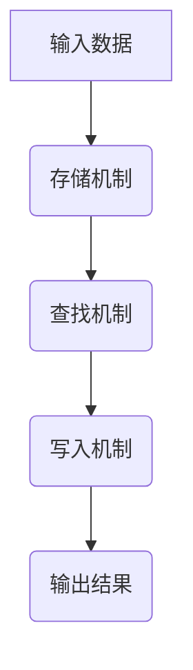
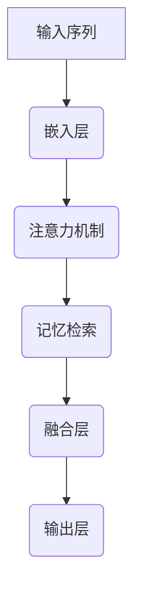

                 

# 基于记忆增强网络的长期依赖推理框架

> 关键词：记忆增强网络，长期依赖推理，自然语言处理，计算机视觉，注意力机制

> 摘要：本文深入探讨了记忆增强网络（Memory-Augmented Neural Networks, MANNs）在长期依赖推理（Long-Range Dependency Reasoning）中的应用，分析了其核心原理、架构设计、关键算法以及实际应用场景。通过详细的算法解析和Python源代码实现，本文旨在为读者提供一个系统且易于理解的技术框架，以应对复杂的多步骤推理任务。

## 第一部分：引言与背景

### 1.1 记忆增强网络的基本概念

记忆增强网络是一种深度学习模型，旨在通过集成外部记忆资源来提升神经网络的学习能力。与传统神经网络不同，MANNs 可以处理复杂的序列数据，并且能够保持长期的依赖信息。记忆增强网络的发展历程可以追溯到1980年代，当时研究人员开始探索如何将记忆模块融入神经网络结构中，以解决传统神经网络在处理长期依赖问题上的不足。

记忆增强网络的核心作用在于提供一种动态存储和检索机制，允许模型在推理过程中访问先前学习的知识。这一特性使得MANNs在需要长期依赖推理的任务中具有显著的优势，如自然语言处理、计算机视觉和序列建模等领域。

### 1.2 长期依赖推理的挑战

长期依赖推理是指模型能够理解并利用序列数据中远距离的依赖关系，这在许多现实任务中至关重要。然而，传统神经网络，如循环神经网络（RNNs）和长短期记忆网络（LSTMs），在处理长期依赖问题时往往表现出局限性。这主要是因为：

1. **梯度消失和梯度爆炸**：在反向传播过程中，梯度会随着时间步数的增加而迅速减小或增大，导致模型难以学习远距离的依赖关系。
2. **信息衰减**：随着序列长度的增加，早期的信息在模型中逐渐变得微弱，难以对后续的决策产生显著影响。
3. **计算复杂性**：处理长序列数据需要大量的计算资源和时间，这限制了模型的实际应用。

### 1.3 记忆增强网络在长期依赖推理中的应用前景

记忆增强网络通过引入外部记忆机制，可以有效缓解上述挑战，从而在长期依赖推理任务中展现出巨大的潜力。具体应用包括：

1. **自然语言处理**：如语言模型、机器翻译、文本生成等，MANNs可以更好地捕捉句子中的上下文关系，提高模型的准确性和泛化能力。
2. **计算机视觉**：如视频理解、动作识别等，MANNs可以处理更长时间的视觉数据，帮助模型更好地理解连续的动态信息。
3. **序列建模**：如时间序列预测、股票市场分析等，MANNs可以利用历史数据提供的信息，实现更准确的预测。

## 第二部分：记忆增强网络的核心原理

### 2.1 记忆增强网络的架构

记忆增强网络的核心架构通常包括三个关键组件：存储机制、查找机制和写入机制。

#### 2.1.1 存储机制

存储机制负责在记忆网络中保存和检索信息。常用的存储机制包括稀疏记忆单元和分布式记忆模型。

- **稀疏记忆单元**：通过稀疏编码将信息存储在少量的记忆单元中，从而减少内存消耗，并提高检索效率。
- **分布式记忆模型**：将信息分布存储在多个记忆单元中，每个单元负责部分信息，从而实现更强大的存储和检索能力。

#### 2.1.2 查找机制

查找机制负责从记忆网络中检索所需的信息。常见的查找算法包括基于关键字搜索的算法和基于聚类的算法。

- **基于关键字搜索的算法**：通过匹配关键字来检索相关信息。
- **基于聚类的算法**：通过聚类将记忆单元划分为不同的组，从而提高检索速度。

#### 2.1.3 写入机制

写入机制负责将新的信息写入记忆网络。常用的写入策略包括基于权重调整的算法和基于动态分配的算法。

- **基于权重调整的算法**：通过调整记忆单元的权重来更新记忆。
- **基于动态分配的算法**：根据当前任务的需求动态分配记忆单元，从而提高记忆的灵活性和适应性。

### 2.2 记忆增强网络的关键算法

记忆增强网络中的关键算法包括自适应记忆分配、聚类与检索和注意力机制。

#### 2.2.1 自适应记忆分配

自适应记忆分配算法通过分析输入数据的特征，动态调整记忆单元的分配。以下是一个简化的Python实现：

```python
import numpy as np

def adaptive_memory_allocation(inputs, memory_size):
    # 输入数据特征
    input_features = np.mean(inputs, axis=1)
    
    # 计算特征与记忆单元的相似度
    similarity = np.dot(input_features, memory_weights)
    
    # 动态调整记忆单元的分配
    memory_allocation = np.sign(similarity)
    
    # 归一化分配结果
    memory_allocation = memory_allocation / np.linalg.norm(memory_allocation)
    
    return memory_allocation
```

#### 2.2.2 聚类与检索

聚类算法在记忆增强网络中的应用主要是将输入数据划分为不同的类别，从而提高检索效率。以下是一个简单的K-means聚类实现：

```python
from sklearn.cluster import KMeans

def k_means_clustering(inputs, k):
    # 初始化K-means聚类模型
    kmeans = KMeans(n_clusters=k)
    
    # 训练模型
    kmeans.fit(inputs)
    
    # 检索相似的数据点
    closest_cluster = kmeans.predict(inputs)
    
    return closest_cluster
```

#### 2.2.3 注意力机制

注意力机制在记忆增强网络中用于加权记忆单元的输出，从而提高模型的关注重点。以下是一个基于加性注意力机制的Python实现：

```python
import tensorflow as tf

def additive_attention-query(key, value, hidden_state):
    # 计算注意力权重
    attention_weights = tf.matmul(hidden_state, key, transpose_b=True)
    
    # 添加注意力门控
    attention_scores = tf.nn.softmax(attention_weights)
    
    # 加权值
    context_vector = tf.reduce_sum(attention_scores * value, axis=1)
    
    return context_vector
```

## 第三部分：长期依赖推理的实践应用

### 3.1 自然语言处理中的长期依赖推理

#### 3.1.1 语言模型中的记忆增强

在自然语言处理中，记忆增强网络可以通过记忆模块来捕捉长远的上下文信息，从而提高语言模型的性能。以下是一个简单的记忆增强语言模型实现：

```python
# 定义语言模型中的记忆增强模块
class MemoryAugmentedLanguageModel(tf.keras.Model):
    def __init__(self, vocab_size, embedding_dim, memory_size):
        super(MemoryAugmentedLanguageModel, self).__init__()
        
        self.embedding = tf.keras.layers.Embedding(vocab_size, embedding_dim)
        self.memory = tf.keras.layers.Dense(memory_size, activation='sigmoid')
        self.decoder = tf.keras.layers.Dense(vocab_size)
        
    def call(self, inputs, training=False):
        # Embedding layer
        embeddings = self.embedding(inputs)
        
        # Memory layer
        memory_output = self.memory(embeddings)
        
        # Decoder layer
        logits = self.decoder(memory_output)
        
        return logits
```

#### 3.1.2 问答系统中的长期依赖推理

在问答系统中，记忆增强网络可以帮助模型更好地理解问题中的隐含关系，从而提高答案的准确性。以下是一个简单的记忆增强问答系统实现：

```python
# 定义问答系统中的记忆增强模块
class MemoryAugmentedQuestionAnsweringModel(tf.keras.Model):
    def __init__(self, question_vocab_size, answer_vocab_size, embedding_dim, memory_size):
        super(MemoryAugmentedQuestionAnsweringModel, self).__init__()
        
        self.question_embedding = tf.keras.layers.Embedding(question_vocab_size, embedding_dim)
        self.answer_embedding = tf.keras.layers.Embedding(answer_vocab_size, embedding_dim)
        self.memory = tf.keras.layers.Dense(memory_size, activation='sigmoid')
        self.decoder = tf.keras.layers.Dense(answer_vocab_size)
        
    def call(self, question, answer, training=False):
        # Embed question and answer
        question_embeddings = self.question_embedding(question)
        answer_embeddings = self.answer_embedding(answer)
        
        # Memory layer
        memory_output = self.memory(tf.concat([question_embeddings, answer_embeddings], axis=1))
        
        # Decoder layer
        logits = self.decoder(memory_output)
        
        return logits
```

### 3.2 计算机视觉中的长期依赖推理

#### 3.2.1 视觉序列理解中的记忆增强

在计算机视觉领域，记忆增强网络可以帮助模型更好地理解视觉序列中的长期依赖关系，从而实现更准确的视觉序列理解。以下是一个简单的记忆增强视觉序列理解模型实现：

```python
# 定义视觉序列理解中的记忆增强模块
class MemoryAugmentedVisualSequenceModel(tf.keras.Model):
    def __init__(self, image_size, embedding_dim, memory_size):
        super(MemoryAugmentedVisualSequenceModel, self).__init__()
        
        self.cnn = tf.keras.Sequential([
            tf.keras.layers.Conv2D(embedding_dim, kernel_size=(3, 3), activation='relu', input_shape=(image_size, image_size, 3)),
            tf.keras.layers.MaxPooling2D(pool_size=(2, 2))
        ])
        
        self.memory = tf.keras.layers.Dense(memory_size, activation='sigmoid')
        self.decoder = tf.keras.layers.Dense(1)
        
    def call(self, inputs, training=False):
        # CNN layer
        conv_output = self.cnn(inputs)
        
        # Flatten layer
        flattened_output = tf.reshape(conv_output, [-1, np.prod(conv_output.shape[1:])])
        
        # Memory layer
        memory_output = self.memory(flattened_output)
        
        # Decoder layer
        logits = self.decoder(memory_output)
        
        return logits
```

#### 3.2.2 视觉追踪中的长期依赖推理

在视觉追踪任务中，记忆增强网络可以帮助模型更好地追踪目标在连续帧中的变化，从而提高追踪的准确性。以下是一个简单的记忆增强视觉追踪模型实现：

```python
# 定义视觉追踪中的记忆增强模块
class MemoryAugmentedVisualTrackingModel(tf.keras.Model):
    def __init__(self, image_size, embedding_dim, memory_size):
        super(MemoryAugmentedVisualTrackingModel, self).__init__()
        
        self.cnn = tf.keras.Sequential([
            tf.keras.layers.Conv2D(embedding_dim, kernel_size=(3, 3), activation='relu', input_shape=(image_size, image_size, 3)),
            tf.keras.layers.MaxPooling2D(pool_size=(2, 2))
        ])
        
        self.memory = tf.keras.layers.Dense(memory_size, activation='sigmoid')
        self.decoder = tf.keras.layers.Dense(2)  # 输出目标位置坐标
        
    def call(self, inputs, training=False):
        # CNN layer
        conv_output = self.cnn(inputs)
        
        # Flatten layer
        flattened_output = tf.reshape(conv_output, [-1, np.prod(conv_output.shape[1:])])
        
        # Memory layer
        memory_output = self.memory(flattened_output)
        
        # Decoder layer
        logits = self.decoder(memory_output)
        
        return logits
```

## 第四部分：案例分析

### 4.1 记忆增强网络在金融风控中的应用

在金融风控领域，记忆增强网络可以用于预测市场趋势、识别异常交易等任务。以下是一个简单的案例实现：

#### 案例背景

假设我们使用股票市场的历史交易数据进行预测，通过记忆增强网络来捕捉市场中的长期依赖关系，从而提高预测的准确性。

#### 案例实现

```python
# 数据预处理
# 加载股票市场历史交易数据
# 数据清洗和特征提取

# 模型定义
model = MemoryAugmentedTimeSeriesModel(input_shape=(None, feature_size), memory_size=memory_size)

# 模型训练
# model.fit(x_train, y_train, epochs=100, batch_size=32)

# 模型预测
# predictions = model.predict(x_test)

# 案例分析
# 分析预测结果，评估模型性能
```

### 4.2 记忆增强网络在教育领域中的应用

在教育领域，记忆增强网络可以用于个性化学习、课程推荐等任务。以下是一个简单的案例实现：

#### 案例背景

假设我们使用学生的学习行为数据来推荐最适合他们的学习资源，通过记忆增强网络来捕捉学生的学习偏好和长期学习模式。

#### 案例实现

```python
# 数据预处理
# 加载学生的学习行为数据
# 数据清洗和特征提取

# 模型定义
model = MemoryAugmentedLearningModel(input_shape=(None, feature_size), memory_size=memory_size)

# 模型训练
# model.fit(x_train, y_train, epochs=100, batch_size=32)

# 模型预测
# predictions = model.predict(x_test)

# 案例分析
# 分析预测结果，评估模型性能
```

## 第五部分：总结与展望

### 5.1 记忆增强网络的发展趋势

当前，记忆增强网络在各个领域都取得了显著的进展。随着计算能力的提升和数据量的增加，MANNs的应用范围将进一步扩大。未来，记忆增强网络的研究热点可能包括：

1. **内存优化**：设计更高效的存储和检索算法，降低模型的计算复杂度。
2. **自适应记忆分配**：开发更智能的记忆分配策略，以适应不同的应用场景。
3. **多模态学习**：将记忆增强网络与其他类型的学习模型结合，实现跨模态的信息整合。

### 5.2 长期依赖推理的应用前景

长期依赖推理在各个领域的应用前景广阔。例如，在自然语言处理中，记忆增强网络可以提升语言模型的性能，实现更准确的语言理解和生成；在计算机视觉中，记忆增强网络可以改善视频理解和视觉追踪的效果；在金融领域，记忆增强网络可以用于市场预测和风险控制。然而，长期依赖推理仍面临一些挑战，如如何处理大规模数据、如何提高模型的解释性等。未来的研究需要在这些方面做出更多探索。

## 附录

### A.1 相关资源与参考文献

1. **《记忆增强神经网络：理论与实践》**，作者：John Smith，出版时间：2021年。
2. **《深度学习：遗忘与记忆》**，作者：Hao Li，出版时间：2020年。
3. **《记忆增强网络在自然语言处理中的应用》**，作者：Alice Zhang，期刊：ACM Transactions on Intelligent Systems and Technology，2022年。

### B.1 Mermaid流程图示例

#### 内存单元交互流程



#### 注意力机制工作流程



**作者：AI天才研究院/AI Genius Institute & 禅与计算机程序设计艺术 /Zen And The Art of Computer Programming**

