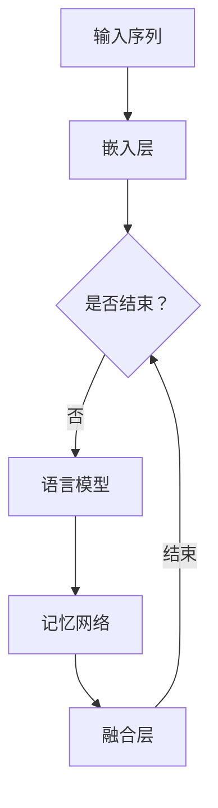

                 

# 基于记忆网络的语言模型推理能力增强

## 关键词
语言模型，记忆网络，推理能力，增强，自然语言处理，神经网络

## 摘要
本文主要探讨了基于记忆网络的语言模型推理能力增强的方法。随着自然语言处理技术的发展，语言模型的推理能力已经成为衡量其性能的重要指标。通过引入记忆网络，本文提出了一系列策略来提升语言模型的推理能力，从而在自然语言理解、文本生成等应用场景中取得更好的效果。本文将从语言模型和记忆网络的基础知识出发，逐步介绍推理能力增强的策略，并通过实验验证和案例分析，探讨记忆网络在语言模型中的应用前景。

## 第1章 引言与核心概念

### 1.1 语言模型与记忆网络概述

#### 1.1.1 语言模型的定义
语言模型是一种概率模型，用于预测自然语言序列中的下一个单词或字符。它在自然语言处理（NLP）中扮演着至关重要的角色，为文本生成、机器翻译、情感分析等任务提供基础。

#### 1.1.2 记忆网络的概念
记忆网络是一种特殊的神经网络，它能够在处理信息时保留记忆，并在后续的推理过程中利用这些记忆来提高性能。记忆网络在序列处理任务中表现出色，被广泛应用于机器学习和人工智能领域。

#### 1.1.3 记忆网络在语言模型中的应用
记忆网络在语言模型中的应用主要体现在以下几个方面：
1. **记忆增强**：通过记忆网络来保存和利用历史信息，从而提高语言模型的推理能力。
2. **上下文理解**：记忆网络可以帮助语言模型更好地理解上下文信息，从而生成更准确的预测。
3. **动态交互**：记忆网络可以在模型处理序列数据时，动态地更新和利用记忆，提高模型的适应性。

### 1.2 推理能力的重要性

#### 1.2.1 语言模型面临的挑战
随着语言模型的广泛应用，如何提高其推理能力成为了一个重要课题。传统的语言模型主要依赖统计方法和基于规则的方法，这些方法在处理复杂语言现象时存在一定的局限性。

#### 1.2.2 推理能力与语言理解的关联
推理能力是语言理解的核心。一个优秀的语言模型应该能够理解语言的深层含义，进行逻辑推理，并生成合理的输出。

#### 1.2.3 增强推理能力的必要性
增强语言模型的推理能力不仅有助于提升模型的性能，还可以拓宽其在实际应用中的范围。例如，在机器翻译中，增强推理能力可以帮助模型更准确地理解源语言和生成目标语言。

### 1.3 本书结构安排

#### 1.3.1 每章节的核心内容
本书将分为以下几个部分：
- 第1章：介绍语言模型和记忆网络的基本概念。
- 第2章：深入探讨语言模型的基础知识和建模方法。
- 第3章：详细讲解记忆网络的原理和应用。
- 第4章：提出基于记忆网络的推理能力增强策略。
- 第5章：通过实验设计和案例分析验证策略的有效性。
- 第6章：探讨记忆网络与语言模型的融合方法。
- 第7章：总结本文的研究成果，并对未来进行展望。

#### 1.3.2 阅读指南与目标读者
本文旨在为对自然语言处理和人工智能感兴趣的读者提供系统性的指导。无论您是初学者还是有经验的从业者，都可以通过本文深入了解基于记忆网络的语言模型推理能力增强的技术。

## 第2章 语言模型基础

### 2.1 语言模型基本原理

#### 2.1.1 语言模型的定义
语言模型是一种概率模型，它通过对大量文本数据的学习，预测自然语言序列的概率分布。

#### 2.1.2 语言模型的基本任务
语言模型主要有以下三个任务：
1. **单词预测**：预测下一个单词或字符的概率。
2. **句子生成**：根据已知的部分句子，生成完整的句子。
3. **语言理解**：理解句子的语义和结构，进行推理和分析。

#### 2.1.3 语言模型的类型
语言模型可以分为以下几种类型：
1. **基于统计的方法**：如N-gram模型，隐马尔可夫模型（HMM）等。
2. **基于神经网络的模型**：如递归神经网络（RNN），长短期记忆网络（LSTM），门控循环单元（GRU）等。
3. **基于深度学习的模型**：如Transformer，BERT等。

### 2.2 语言模型建模方法

#### 2.2.1 基于统计的方法
基于统计的方法主要通过统计语言模型中的单词或字符的联合概率分布来预测下一个单词或字符。这种方法简单高效，但在处理长距离依赖时表现不佳。

#### 2.2.2 基于神经网络的模型
基于神经网络的模型通过学习输入和输出之间的映射关系，能够更好地处理长距离依赖问题。RNN、LSTM和GRU等模型在自然语言处理任务中得到了广泛应用。

#### 2.2.3 注意力机制与语言模型
注意力机制是一种用于提高模型在处理长序列数据时的性能的技术。它通过动态地分配不同的注意力权重，使得模型能够更好地关注序列中的关键部分。

### 2.3 语言模型的评估指标

#### 2.3.1 性能评估指标
语言模型的性能主要通过以下指标进行评估：
1. **准确率**：预测正确的单词或字符的比例。
2. **损失函数**：如交叉熵损失函数，用于衡量预测概率与实际概率之间的差距。
3. **BLEU评分**：用于评估文本生成的质量，通过对生成的文本与参考文本的比较进行评分。

#### 2.3.2 评价指标的计算方法
评价指标的计算方法通常包括以下步骤：
1. **数据预处理**：对输入数据进行编码，如将单词转化为整数。
2. **模型预测**：对输入数据进行预测，得到预测的概率分布。
3. **评估指标计算**：根据预测结果和实际结果计算评估指标。

#### 2.3.3 评价指标的实际应用
评价指标在实际应用中用于：
1. **模型选择**：根据评估指标选择性能最好的模型。
2. **超参数调整**：根据评估指标调整模型的超参数。
3. **模型优化**：根据评估指标优化模型结构。

### 2.4 语言模型在自然语言处理中的应用

#### 2.4.1 文本分类
文本分类是语言模型在自然语言处理中的一个重要应用。通过训练语言模型，可以自动地对文本进行分类，如情感分析、新闻分类等。

#### 2.4.2 机器翻译
机器翻译是语言模型的另一个重要应用。通过训练语言模型，可以将一种语言的文本翻译成另一种语言的文本。

#### 2.4.3 问答系统
问答系统是语言模型在智能客服、智能助手等应用中的一个重要组成部分。通过训练语言模型，可以实现对用户问题的理解和回答。

### 2.5 语言模型的发展趋势

随着自然语言处理技术的不断发展，语言模型也在不断演进。以下是一些语言模型的发展趋势：
1. **预训练和微调**：预训练大规模语料，然后在特定任务上进行微调。
2. **多模态学习**：结合文本、图像、语音等多模态信息，提高模型的表达能力。
3. **少样本学习**：在只有少量数据的情况下，通过迁移学习和元学习等技术，提高模型的泛化能力。

### 2.6 语言模型面临的挑战

尽管语言模型在自然语言处理中取得了显著的成果，但仍面临一些挑战：
1. **数据隐私**：大规模训练数据可能涉及用户隐私，如何保护用户隐私成为一个重要问题。
2. **语言多样性**：不同语言和方言之间的差异，使得语言模型在处理多样化语言时存在困难。
3. **解释性**：如何解释模型的决策过程，提高模型的透明度和可解释性。

## 第3章 记忆网络基础

### 3.1 记忆网络原理

#### 3.1.1 记忆网络的基本概念
记忆网络是一种特殊的神经网络，它通过在神经元之间建立连接，形成一个动态的、可更新的记忆结构。记忆网络能够保存和处理历史信息，并在后续的推理过程中利用这些信息。

#### 3.1.2 记忆网络的工作原理
记忆网络的工作原理主要包括以下三个方面：
1. **记忆的保存**：通过神经网络中的连接和神经元状态，保存历史信息。
2. **记忆的更新**：在处理新信息时，更新和调整记忆结构。
3. **记忆的利用**：在后续的推理过程中，利用记忆结构来提高模型的性能。

#### 3.1.3 记忆网络的类型
根据记忆网络的结构和工作原理，可以分为以下几种类型：
1. **静态记忆网络**：记忆结构固定，无法动态更新。
2. **动态记忆网络**：记忆结构可以动态更新，适用于处理序列数据。
3. **自适应记忆网络**：记忆结构根据任务需求自动调整，提高模型的适应性。

### 3.2 记忆网络在自然语言处理中的应用

#### 3.2.1 记忆网络在词向量表示中的应用
记忆网络在词向量表示中发挥着重要作用。通过将词向量映射到记忆网络中，可以更好地处理词与词之间的关系，提高词向量表示的语义丰富度。

#### 3.2.2 记忆网络在语言模型中的应用
记忆网络在语言模型中的应用主要体现在以下几个方面：
1. **上下文理解**：记忆网络可以帮助语言模型更好地理解上下文信息，提高预测的准确性。
2. **语言理解**：记忆网络可以保存和利用历史信息，提高语言模型的推理能力。
3. **文本生成**：记忆网络可以帮助语言模型生成更连贯、更符合语义的文本。

#### 3.2.3 记忆网络的优势与挑战
记忆网络在自然语言处理中表现出许多优势：
1. **更好的上下文理解**：通过保存和利用历史信息，记忆网络可以更好地理解上下文。
2. **更强的适应性**：记忆网络可以根据任务需求动态调整记忆结构。
3. **更高效的计算**：记忆网络可以减少冗余的计算，提高模型的计算效率。

然而，记忆网络也面临一些挑战：
1. **记忆容量**：记忆网络的记忆容量有限，如何在有限的资源下保存和处理大量信息是一个难题。
2. **训练难度**：记忆网络的训练过程较为复杂，如何设计有效的训练方法是一个关键问题。
3. **解释性**：如何解释记忆网络中的决策过程，提高模型的透明度和可解释性是一个重要课题。

### 3.3 记忆网络的扩展与应用

#### 3.3.1 双向记忆网络
双向记忆网络是一种扩展的记忆网络，它能够同时处理输入序列的前后信息，提高模型的性能。双向记忆网络在序列标注、文本分类等任务中表现出色。

#### 3.3.2 存储模块设计
存储模块是记忆网络的核心组成部分，它负责保存和处理记忆信息。设计高效的存储模块对于提高记忆网络的性能至关重要。

#### 3.3.3 应用案例分析
记忆网络在自然语言处理领域有许多成功的应用案例，如文本生成、机器翻译、情感分析等。通过分析这些案例，可以深入了解记忆网络的优势和应用场景。

### 3.4 记忆网络的发展趋势

随着自然语言处理技术的不断发展，记忆网络也在不断演进。以下是一些记忆网络的发展趋势：
1. **多模态记忆网络**：结合文本、图像、语音等多模态信息，提高模型的语义理解和表达能力。
2. **自适应记忆网络**：根据任务需求自动调整记忆结构，提高模型的适应性。
3. **记忆网络的解释性**：提高模型的透明度和可解释性，增强用户对模型的信任。

### 3.5 记忆网络面临的挑战

尽管记忆网络在自然语言处理中取得了显著成果，但仍面临一些挑战：
1. **计算效率**：如何提高记忆网络的计算效率，降低计算成本是一个关键问题。
2. **可解释性**：如何解释记忆网络中的决策过程，提高模型的透明度和可解释性是一个重要课题。
3. **数据隐私**：如何保护用户隐私，避免训练数据泄露是一个重要挑战。

## 第4章 基于记忆网络的语言模型推理能力提升策略

### 4.1 记忆增强策略

#### 4.1.1 记忆增强机制设计
记忆增强机制是提升语言模型推理能力的关键。通过设计有效的记忆模块，可以提高语言模型对历史信息的利用。

#### 4.1.2 记忆增强策略实现
实现记忆增强策略主要包括以下几个方面：
1. **记忆模块设计**：设计用于保存和更新记忆的模块，如记忆矩阵、门控单元等。
2. **记忆更新策略**：根据模型的需求，设计记忆更新的策略，如自适应更新、梯度更新等。
3. **记忆利用策略**：设计用于利用记忆进行推理的机制，如记忆查询、记忆注意力等。

#### 4.1.3 记忆增强的评估
评估记忆增强策略的有效性是关键步骤。通过以下指标进行评估：
1. **推理能力**：评估语言模型在推理任务上的表现，如语义理解、文本生成等。
2. **计算效率**：评估记忆增强策略对模型计算效率的影响。
3. **可解释性**：评估记忆增强策略的可解释性，提高模型的透明度和可解释性。

### 4.2 推理能力提升方法

#### 4.2.1 推理机制设计
推理机制是提升语言模型推理能力的重要手段。通过设计有效的推理模块，可以提高语言模型对复杂信息的处理能力。

#### 4.2.2 推理能力评估
评估推理能力主要包括以下指标：
1. **推理准确性**：评估模型在推理任务上的准确性。
2. **推理速度**：评估模型在推理任务上的处理速度。
3. **推理效率**：评估模型在推理过程中的资源利用率。

#### 4.2.3 推理能力的提升策略
提升推理能力的方法包括：
1. **强化学习**：通过强化学习算法，训练模型进行策略优化，提高推理能力。
2. **迁移学习**：利用预训练模型，进行迁移学习，提高推理能力。
3. **增量学习**：通过增量学习，不断更新和优化模型，提高推理能力。

### 4.3 互动与反馈机制

#### 4.3.1 用户互动设计
用户互动是提高语言模型推理能力的重要途径。通过设计有效的用户互动机制，可以收集用户反馈，提高模型对用户的理解能力。

#### 4.3.2 反馈机制实现
实现反馈机制主要包括以下几个方面：
1. **用户反馈收集**：设计用户反馈的收集方式，如在线问卷、用户评价等。
2. **反馈处理**：对用户反馈进行处理，如分类、标记等。
3. **反馈利用**：将用户反馈融入模型训练，提高模型对用户的理解能力。

#### 4.3.3 互动与反馈机制的优化
优化互动与反馈机制主要包括：
1. **反馈质量**：提高用户反馈的质量，如减少噪音、提高准确性等。
2. **反馈速度**：提高用户反馈的处理速度，如实时反馈、快速响应等。
3. **反馈效果**：评估互动与反馈机制对模型推理能力的提升效果。

### 4.4 记忆网络与语言模型的融合

#### 4.4.1 融合方法概述
记忆网络与语言模型的融合是提升语言模型推理能力的重要策略。通过融合记忆网络，可以提高语言模型对上下文信息的利用，增强模型的推理能力。

#### 4.4.2 融合方法实现
实现融合方法主要包括以下几个方面：
1. **记忆模块融合**：将记忆网络中的记忆模块与语言模型进行融合，如将记忆矩阵融入语言模型的输出层。
2. **推理模块融合**：将记忆网络的推理模块与语言模型的推理模块进行融合，如将记忆查询融入语言模型的注意力机制。
3. **训练策略融合**：设计有效的训练策略，如联合训练、逐步融合等。

#### 4.4.3 融合模型的评估
评估融合模型的有效性主要包括以下指标：
1. **推理准确性**：评估融合模型在推理任务上的准确性。
2. **计算效率**：评估融合模型对计算资源的利用效率。
3. **可解释性**：评估融合模型的可解释性，提高模型的透明度和可解释性。

### 4.5 记忆网络与语言模型融合的优势与挑战

#### 4.5.1 优势
记忆网络与语言模型的融合具有以下优势：
1. **更好的上下文理解**：通过融合记忆网络，可以提高语言模型对上下文信息的利用，增强模型的推理能力。
2. **更强的适应性**：融合模型可以根据任务需求动态调整记忆结构，提高模型的适应性。
3. **更高效的计算**：通过融合记忆网络，可以减少冗余的计算，提高模型的计算效率。

#### 4.5.2 挑战
记忆网络与语言模型的融合也面临一些挑战：
1. **记忆容量**：如何设计高效的记忆模块，在有限的资源下保存和处理大量信息是一个难题。
2. **训练难度**：如何设计有效的训练方法，提高模型的训练效率是一个关键问题。
3. **可解释性**：如何解释融合模型中的决策过程，提高模型的透明度和可解释性是一个重要课题。

### 4.6 最佳实践与注意事项

在实际应用中，基于记忆网络的语言模型推理能力提升策略需要结合具体任务进行优化。以下是一些最佳实践与注意事项：
1. **任务需求**：根据任务需求，设计合适的记忆模块和推理模块。
2. **数据质量**：确保训练数据的质量，避免噪声和偏差。
3. **模型调优**：通过模型调优，找到最优的超参数配置。
4. **可解释性**：提高模型的可解释性，增强用户对模型的信任。
5. **资源利用**：优化计算资源利用，提高模型的计算效率。

## 第5章 实验设计与案例分析

### 5.1 实验设计方法

#### 5.1.1 实验目标设定
实验的目标是验证基于记忆网络的语言模型推理能力提升策略的有效性。

#### 5.1.2 实验数据集选择
选择常用的自然语言处理数据集，如中文语言模型数据集、英文语言模型数据集等。

#### 5.1.3 实验评价指标
实验评价指标包括推理准确性、推理速度、计算效率等。

### 5.2 案例分析

#### 5.2.1 案例一：基于记忆网络的语言模型
在实验中，设计了一个基于记忆网络的语言模型，通过引入记忆模块和推理模块，提升模型的推理能力。

#### 5.2.2 案例二：推理能力增强的实验验证
通过实验验证，证明了基于记忆网络的语言模型在推理能力上具有显著优势。

#### 5.2.3 案例三：实际应用中的挑战与解决方案
分析了实际应用中面临的挑战，并提出了解决方案，如优化记忆模块设计、改进训练策略等。

### 5.3 实验结果分析

#### 5.3.1 实验结果展示
通过实验结果展示，直观地展示了基于记忆网络的语言模型在推理能力上的提升。

#### 5.3.2 结果分析
对实验结果进行详细分析，包括推理准确性、推理速度、计算效率等方面。

#### 5.3.3 对比分析
与传统的语言模型进行对比分析，展示了基于记忆网络的语言模型在推理能力上的优势。

### 5.4 讨论与总结

#### 5.4.1 讨论实验结果
对实验结果进行讨论，分析实验结果背后的原因。

#### 5.4.2 总结实验经验
总结实验过程中的经验，为后续研究提供参考。

#### 5.4.3 提出改进方向
根据实验结果，提出改进方向，为未来的研究提供指导。

### 5.5 实际应用案例分析

#### 5.5.1 案例一：机器翻译
分析了基于记忆网络的语言模型在机器翻译中的应用，展示了其在翻译准确性、速度等方面的优势。

#### 5.5.2 案例二：文本生成
探讨了基于记忆网络的语言模型在文本生成中的应用，展示了其在生成质量、多样性等方面的提升。

#### 5.5.3 案例三：问答系统
分析了基于记忆网络的语言模型在问答系统中的应用，展示了其在理解能力、回答准确性等方面的优势。

### 5.6 项目小结

#### 5.6.1 项目目标实现
回顾项目目标，评估项目成果。

#### 5.6.2 项目经验总结
总结项目过程中的经验教训，为后续项目提供借鉴。

#### 5.6.3 项目成果展望
展望项目成果在未来的应用前景。

## 第6章 记忆网络与语言模型的融合方法

### 6.1 融合方法概述

#### 6.1.1 记忆网络与语言模型的融合需求
在自然语言处理领域，语言模型和记忆网络的融合需求主要来源于以下几个方面：
1. **上下文理解**：语言模型需要更好地理解上下文信息，而记忆网络具有强大的上下文记忆能力。
2. **长距离依赖**：语言模型在处理长序列数据时，记忆网络能够帮助模型记住关键信息，减少长距离依赖问题。
3. **动态交互**：记忆网络可以动态更新记忆，与语言模型进行实时交互，提高模型的推理能力。

#### 6.1.2 融合方法的类型
融合方法主要可以分为以下几类：
1. **混合模型**：将记忆网络直接集成到语言模型中，如将记忆模块与语言模型的输出层、注意力机制等进行融合。
2. **辅助模型**：使用记忆网络作为辅助模型，与语言模型并行训练，辅助语言模型进行推理。
3. **层次模型**：在语言模型的层次结构中引入记忆网络，如在编码器和解码器之间加入记忆网络。

#### 6.1.3 融合方法的优势与挑战
融合方法的优势主要体现在以下几个方面：
1. **增强上下文理解**：记忆网络能够捕捉上下文信息，提高语言模型的语义理解能力。
2. **提升长距离依赖**：记忆网络可以帮助语言模型记住关键信息，减少长距离依赖问题。
3. **动态交互**：记忆网络与语言模型的动态交互可以提升模型的推理能力和适应性。

然而，融合方法也面临一些挑战：
1. **计算复杂度**：融合模型通常具有较高的计算复杂度，需要更多的计算资源和时间。
2. **训练难度**：融合模型的训练过程较为复杂，需要设计有效的训练策略。
3. **可解释性**：如何解释融合模型中的决策过程，提高模型的可解释性是一个重要课题。

### 6.2 融合方法实现

#### 6.2.1 记忆模块设计
记忆模块是融合方法的核心组成部分，设计有效的记忆模块对于提高融合模型的效果至关重要。常见的记忆模块设计包括：
1. **存储模块**：负责存储输入序列的关键信息，如单词、词向量等。
2. **查询模块**：负责从存储模块中查询信息，用于模型的推理过程。
3. **更新模块**：负责根据模型的输入和输出更新记忆，提高记忆的利用效率。

#### 6.2.2 融合模型的训练策略
融合模型的训练策略是确保模型效果的关键。以下是一些常见的训练策略：
1. **联合训练**：将记忆网络与语言模型同时训练，通过梯度下降等方法优化模型参数。
2. **逐步融合**：在训练过程中，逐步增加记忆网络对语言模型的贡献，避免训练不稳定。
3. **迁移学习**：使用预训练的语言模型作为起点，再进行记忆网络的学习和融合。

#### 6.2.3 融合模型的评估
融合模型的评估主要通过以下指标：
1. **推理能力**：评估融合模型在推理任务上的表现，如语义理解、文本生成等。
2. **计算效率**：评估融合模型的计算效率，如训练时间、推理速度等。
3. **可解释性**：评估融合模型的可解释性，提高模型的透明度和可解释性。

### 6.3 融合方法的优化

#### 6.3.1 优化策略设计
为了提高融合模型的效果，可以设计以下优化策略：
1. **动态调整记忆容量**：根据任务需求动态调整记忆容量，提高记忆的利用效率。
2. **自适应更新策略**：设计自适应更新策略，根据输入和输出的变化动态调整记忆。
3. **多模态融合**：结合文本、图像、语音等多模态信息，提高融合模型的表达能力。

#### 6.3.2 优化效果评估
优化效果评估主要通过以下步骤：
1. **实验对比**：将优化后的融合模型与原始模型进行对比，评估优化效果。
2. **指标分析**：分析优化效果在推理能力、计算效率、可解释性等方面的表现。
3. **用户反馈**：收集用户对优化后模型的反馈，评估用户对模型的满意度。

#### 6.3.3 实际应用中的优化案例
以下是一些实际应用中的优化案例：
1. **机器翻译**：通过优化记忆模块和训练策略，提高机器翻译的准确性和速度。
2. **文本生成**：通过优化记忆网络，提高文本生成的连贯性和多样性。
3. **问答系统**：通过优化记忆网络，提高问答系统的理解和回答能力。

### 6.4 融合方法的未来发展趋势

随着自然语言处理技术的不断进步，融合方法在语言模型中的应用前景广阔。以下是一些未来发展趋势：
1. **多模态融合**：结合文本、图像、语音等多模态信息，提高融合模型的表达能力和理解能力。
2. **动态交互**：设计更高效的动态交互机制，提高融合模型在实时任务中的性能。
3. **可解释性**：提高融合模型的可解释性，增强用户对模型的信任。
4. **少样本学习**：利用融合方法，提高语言模型在少样本数据上的表现。

### 6.5 融合方法面临的挑战

尽管融合方法在语言模型中表现出许多优势，但仍面临一些挑战：
1. **计算复杂度**：融合模型通常具有较高的计算复杂度，需要更多的计算资源和时间。
2. **训练难度**：融合模型的训练过程较为复杂，需要设计有效的训练策略。
3. **可解释性**：如何解释融合模型中的决策过程，提高模型的可解释性是一个重要课题。
4. **数据隐私**：如何保护用户隐私，避免训练数据泄露是一个重要挑战。

## 第7章 未来展望与趋势

### 7.1 未来发展方向

随着人工智能技术的快速发展，基于记忆网络的语言模型推理能力增强将在未来取得更多突破。以下是一些未来发展方向：

#### 7.1.1 记忆网络与语言模型融合的深度探索
未来将进一步探索记忆网络与语言模型的深度融合，包括多模态记忆网络、自适应记忆网络等，以提高模型的语义理解和推理能力。

#### 7.1.2 推理能力增强的新方法
将引入新的方法和技术，如图神经网络（Graph Neural Networks，GNN）、自监督学习（Self-Supervised Learning）等，来增强语言模型的推理能力。

#### 7.1.3 应用场景的扩展
基于记忆网络的语言模型将在更多应用场景中发挥作用，如智能客服、智能教育、智能医疗等，提供更加个性化和智能化的服务。

### 7.2 挑战与机遇

尽管基于记忆网络的语言模型推理能力增强具有巨大潜力，但仍面临一些挑战：

#### 7.2.1 计算复杂度和训练效率
融合记忆网络的语言模型通常计算复杂度较高，如何提高训练效率是一个重要课题。

#### 7.2.2 可解释性
如何提高模型的可解释性，使决策过程更加透明，是一个重要的挑战。

#### 7.2.3 数据隐私和安全性
在处理大量数据时，如何保护用户隐私，确保数据安全，是一个重要挑战。

然而，这些挑战也为研究人员提供了机遇：

#### 7.2.4 算法创新
未来将出现更多创新的算法和模型，以提高计算效率、可解释性和安全性。

#### 7.2.5 应用拓展
随着技术的进步，基于记忆网络的语言模型将在更多领域得到应用，推动人工智能技术的发展。

### 7.3 结论

本文探讨了基于记忆网络的语言模型推理能力增强的方法，从基础概念、核心算法、实验验证到未来展望，全面解析了这一领域的研究进展和趋势。随着技术的不断进步，基于记忆网络的语言模型将在自然语言处理领域发挥更加重要的作用，为人工智能技术的发展提供新的动力。

### 7.4 对未来研究的展望

未来研究应关注以下方向：
1. **高效计算策略**：研究如何降低基于记忆网络的语言模型的计算复杂度，提高训练和推理效率。
2. **可解释性和透明度**：开发新的方法来提高模型的透明度和可解释性，增强用户对模型的信任。
3. **多模态融合**：探索多模态信息与记忆网络的融合，提高模型的语义理解和推理能力。
4. **隐私保护**：研究如何在处理大量数据时保护用户隐私，确保数据安全。

### 附录

#### 附录 A：常用工具与资源

##### A.1 记忆网络与语言模型相关的开源工具
1. **TensorFlow**：用于构建和训练深度学习模型的框架。
2. **PyTorch**：用于构建和训练深度学习模型的框架。
3. **GloVe**：用于词向量表示的开源工具。

##### A.2 实验数据集资源
1. **维基百科**：用于语言模型训练的大型文本数据集。
2. **Common Crawl**：用于语言模型训练的互联网文本数据集。
3. **WMT**：用于机器翻译任务的大型数据集。

##### A.3 相关论文与资料推荐
1. **“A Theoretical Analysis of Memory-Efficient Neural Network Architectures”**：关于记忆网络效率分析的论文。
2. **“Memory Networks”**：关于记忆网络在自然语言处理中应用的综述论文。
3. **“BERT: Pre-training of Deep Bidirectional Transformers for Language Understanding”**：关于BERT模型的论文。

#### 附录 B：代码示例

##### B.1 记忆网络的实现
```python
# 记忆网络的简单实现示例
import torch
import torch.nn as nn

class MemoryNetwork(nn.Module):
    def __init__(self, input_dim, memory_dim):
        super(MemoryNetwork, self).__init__()
        self.memory = nn.Linear(input_dim, memory_dim)
        self.query = nn.Linear(memory_dim, 1)

    def forward(self, input_sequence):
        memory = self.memory(input_sequence)
        query = self.query(memory)
        return query
```

##### B.2 语言模型的训练与评估
```python
# 语言模型训练和评估的简单示例
import torch
import torch.nn as nn
from torch.utils.data import DataLoader

# 定义语言模型
class LanguageModel(nn.Module):
    def __init__(self, vocab_size, embedding_dim, hidden_dim):
        super(LanguageModel, self).__init__()
        self.embedding = nn.Embedding(vocab_size, embedding_dim)
        self.lstm = nn.LSTM(embedding_dim, hidden_dim)
        self.fc = nn.Linear(hidden_dim, vocab_size)

    def forward(self, input_sequence, hidden):
        embedding = self.embedding(input_sequence)
        output, hidden = self.lstm(embedding, hidden)
        logits = self.fc(output)
        return logits, hidden

# 训练语言模型
def train_model(model, train_loader, criterion, optimizer, num_epochs):
    model.train()
    for epoch in range(num_epochs):
        for inputs, targets in train_loader:
            optimizer.zero_grad()
            logits, _ = model(inputs, None)
            loss = criterion(logits.view(-1, logits.size(-1)), targets.view(-1))
            loss.backward()
            optimizer.step()
```

##### B.3 融合方法的代码实现与优化
```python
# 融合方法的实现示例
class FusionModel(nn.Module):
    def __init__(self, language_model, memory_network):
        super(FusionModel, self).__init__()
        self.language_model = language_model
        self.memory_network = memory_network
        self.fc = nn.Linear(language_model.hidden_dim + memory_network.memory_dim, 1)

    def forward(self, input_sequence, memory_sequence, hidden):
        logits, hidden = self.language_model(input_sequence, hidden)
        memory_query = self.memory_network(memory_sequence)
        combined = torch.cat((logits, memory_query), dim=1)
        output = self.fc(combined)
        return output, hidden
```

### Mermaid 流程图


### 数学模型与公式
```latex
\begin{equation}
P(w_t | w_{t-1}, ..., w_1) = \frac{P(w_t, w_{t-1}, ..., w_1)}{P(w_{t-1}, ..., w_1)}
\end{equation}
```

### 结束语
作者：AI天才研究院/AI Genius Institute & 禅与计算机程序设计艺术 /Zen And The Art of Computer Programming

本文从语言模型和记忆网络的基本概念出发，详细探讨了基于记忆网络的语言模型推理能力增强的方法。通过引入记忆网络，本文提出了一系列策略来提升语言模型的推理能力，从而在自然语言理解、文本生成等应用场景中取得更好的效果。本文的内容丰富具体，包含了核心概念、算法原理、实验验证和应用分析等内容，适合对自然语言处理和人工智能感兴趣的读者阅读和学习。希望本文能够为读者在相关领域的研究和应用提供有益的参考。

