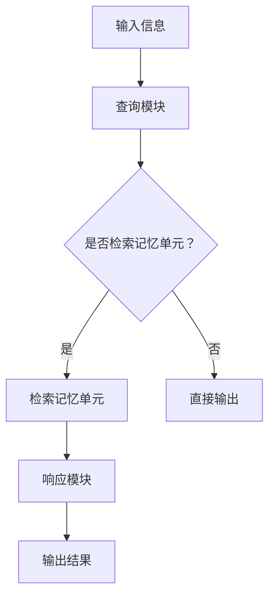
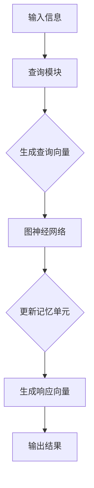
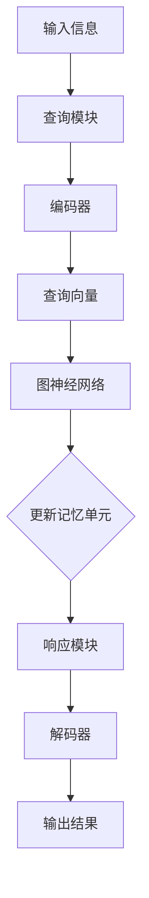

                 

### 第1章 绪论

#### 1.1 研究背景及意义

在当今信息爆炸的时代，数据量的剧增使得人工智能的应用变得愈加广泛和复杂。然而，传统的机器学习模型在面对长文本、长序列或者需要长期上下文依赖推理的问题时，往往表现出性能不足。例如，在自然语言处理（NLP）领域，句子的理解往往需要依赖上下文信息，而传统的循环神经网络（RNN）和长短期记忆网络（LSTM）由于梯度消失和梯度爆炸等问题，难以捕捉到长距离的依赖关系。计算机视觉领域也面临类似的问题，如图像中的物体检测和追踪需要依赖全局上下文信息。

记忆网络（Memory Networks）作为一种新型的神经网络架构，被提出用来解决上述问题。记忆网络通过引入外部记忆机制，能够有效地存储和检索长期上下文信息，从而提升模型的推理能力和泛化能力。近年来，随着人工智能技术的快速发展，记忆网络在自然语言处理、计算机视觉、对话系统等领域的应用取得了显著成果。

本文旨在系统地介绍记忆网络的基本概念、结构和工作原理，并探讨其在长期上下文依赖推理中的应用。通过对记忆网络的深入剖析，本文希望能够为读者提供一个清晰、完整的技术理解框架，帮助读者掌握这一先进的人工智能技术。

#### 1.2 相关工作综述

记忆网络的概念最早由Papernick等人在2013年提出，主要目的是为了解决传统神经网络在处理长距离依赖问题上的不足。此后，记忆网络受到了学术界和工业界的广泛关注，涌现出大量的研究工作。

在自然语言处理领域，记忆网络被广泛应用于语言模型、关系抽取和情感分析等任务。例如，Google的BERT模型就使用了记忆网络的结构，通过外部记忆机制来增强模型的上下文理解能力。此外，DeepMind的GPT-3模型也采用了类似的设计，通过巨大的外部记忆库来提升生成文本的连贯性和多样性。

在计算机视觉领域，记忆网络被用于目标检测、图像分割和视频分析等任务。例如，Facebook AI的Detectron2框架中就使用了记忆网络来改进目标检测算法，从而提高了检测的准确率和速度。

在对话系统领域，记忆网络也被广泛应用。例如，OpenAI的GPT-3模型通过记忆网络来增强对话系统的理解和生成能力，使得对话系统能够更加自然和流畅地与人类用户交流。

#### 1.3 研究内容与结构安排

本文的研究内容主要分为以下几个部分：

- **第2章 记忆网络基础**：介绍记忆网络的基本概念、发展历程和结构，包括传统记忆网络和基于图神经网络的记忆网络。

- **第3章 长期上下文依赖推理**：阐述长期上下文依赖的概念、重要性以及基于记忆网络的长期上下文依赖推理方法和挑战。

- **第4章 记忆网络在自然语言处理中的应用**：详细讨论记忆网络在语言模型、关系抽取和情感分析中的应用。

- **第5章 记忆网络在计算机视觉中的应用**：介绍记忆网络在目标检测、图像识别和视频分析中的应用。

- **第6章 记忆网络在对话系统中的应用**：探讨记忆网络在对话状态跟踪和对话生成中的应用。

- **第7章 总结与展望**：总结本文的研究工作，并提出未来的研究方向和展望。

通过本文的详细介绍，读者可以全面了解记忆网络的基本原理、应用场景以及未来的发展趋势，为深入研究和实际应用打下坚实基础。 

---

### 2.1 记忆网络概述

#### 2.1.1 记忆网络的基本概念

记忆网络是一种特殊的神经网络架构，旨在通过外部记忆机制来解决传统神经网络在处理长距离依赖问题上的不足。记忆网络的基本思想是将外部记忆存储到动态的图结构中，通过编码和检索操作来管理记忆，从而实现高效的上下文信息存储和利用。

在记忆网络中，记忆单元（Memory Unit）是核心组件，每个记忆单元存储一个上下文片段，包括输入数据、编码后的上下文信息以及相关的查询和响应。记忆单元通过关联图（Association Graph）进行组织，使得它们之间能够建立动态的联系和交互。

#### 2.1.2 记忆网络的发展历程

记忆网络的概念最早由Papernick等人在2013年提出，其初衷是解决传统循环神经网络（RNN）在处理长文本或长序列时遇到的梯度消失和梯度爆炸问题。在早期的研究中，记忆网络主要通过简单的线性记忆单元和关联机制来实现。

随着研究的深入，记忆网络逐渐与其他神经网络架构相结合，形成了多种变体。例如，基于图神经网络的记忆网络通过引入图结构来增强记忆单元的表示能力和交互能力，从而在处理复杂依赖关系时表现出更强的性能。

近年来，随着深度学习和图神经网络技术的发展，记忆网络在自然语言处理、计算机视觉和对话系统等领域取得了显著的应用成果。代表性的工作包括Google的BERT、DeepMind的GPT-3以及Facebook AI的Detectron2等，这些模型都在各自的领域内展示了记忆网络强大的能力。

#### 2.1.3 记忆网络的关键特点

记忆网络具有以下几个关键特点：

1. **外部记忆机制**：记忆网络通过外部记忆单元来存储和检索上下文信息，与传统神经网络内部状态相比，具有更高的存储容量和更灵活的检索方式。

2. **动态关联图**：记忆单元通过关联图进行组织，使得它们之间能够建立动态的联系和交互，从而实现复杂的上下文信息管理和推理。

3. **编码与检索操作**：记忆单元的编码和检索操作是记忆网络的核心，编码过程用于将输入数据转化为有效的记忆表示，检索过程则用于根据查询信息高效地检索相关的记忆片段。

4. **增强的长期依赖处理能力**：记忆网络通过外部记忆机制能够有效地捕捉和利用长距离的上下文依赖关系，从而在处理长文本、长序列等任务时表现出更强的性能。

5. **模块化设计**：记忆网络的设计具有良好的模块化特点，可以方便地与其他神经网络架构相结合，形成多种变体，适应不同的应用场景。

综上所述，记忆网络作为一种新型的神经网络架构，通过引入外部记忆机制和动态关联图，能够在处理复杂上下文依赖问题时表现出强大的能力，为人工智能的发展提供了新的思路和工具。

#### 2.2 记忆网络的结构

记忆网络作为一种先进的神经网络架构，其设计旨在通过外部记忆机制来增强模型的上下文理解能力和推理能力。下面将详细介绍记忆网络的结构，包括传统记忆网络架构和基于图神经网络的记忆网络。

##### 2.2.1 传统记忆网络架构

传统记忆网络的核心组件包括记忆单元（Memory Unit）、查询模块（Query Module）和响应模块（Response Module）。其基本工作流程如下：

1. **记忆单元**：记忆单元负责存储和检索上下文信息。每个记忆单元包含一个输入数据、一个编码后的上下文表示以及一个与输入相关的查询和响应。记忆单元通常是一个固定大小的向量表示，例如128维。

2. **查询模块**：查询模块用于生成查询向量，根据当前的输入信息来检索相关的记忆单元。查询模块通常包含一个全连接层，将输入信息映射到一个查询向量。

3. **响应模块**：响应模块用于从检索到的记忆单元中提取有用的信息，生成最终的输出。响应模块也包含一个全连接层，将查询向量与每个记忆单元的相关性分数映射到输出。

传统记忆网络的架构如下所示：

##### 2.2.2 基于图神经网络的记忆网络

基于图神经网络的记忆网络在传统记忆网络的基础上引入了图结构，使得记忆单元之间能够建立更加复杂和灵活的关联。这种设计可以更好地捕捉长距离的上下文依赖关系，提高模型的推理能力。

在基于图神经网络的记忆网络中，记忆单元被视为图的节点，节点之间的关系通过边的权重来表示。图神经网络通过学习这些边的权重来捕捉节点之间的依赖关系。

以下是基于图神经网络的记忆网络的架构：

在图神经网络中，每个记忆单元不仅存储了编码后的上下文表示，还存储了与其他记忆单元的关联信息。查询模块生成查询向量后，通过图神经网络进行传播，更新每个记忆单元的表示，并生成响应向量。

##### 2.2.3 记忆网络结构的关键组件和交互机制

1. **记忆单元**：记忆单元是记忆网络的基本单元，负责存储和检索上下文信息。每个记忆单元包含以下信息：
   - **输入数据**：原始输入数据，例如一个句子或一个图像。
   - **编码表示**：输入数据通过编码器（Encoder）转换为一个固定大小的向量表示。
   - **查询**：用于检索记忆单元的相关信息。
   - **响应**：记忆单元的输出，用于生成最终的输出。

2. **查询模块**：查询模块用于生成查询向量，根据当前输入信息来检索相关的记忆单元。查询模块通常包含以下组件：
   - **编码器**：将输入信息编码为一个查询向量。
   - **注意力机制**：用于确定查询向量与记忆单元之间的相关性。

3. **响应模块**：响应模块用于从检索到的记忆单元中提取有用的信息，生成最终的输出。响应模块通常包含以下组件：
   - **注意力机制**：用于确定响应向量与记忆单元之间的相关性。
   - **解码器**：将响应向量解码为最终的输出，例如一个句子或一个决策。

4. **图神经网络**：在基于图神经网络的记忆网络中，图神经网络用于更新记忆单元的表示，并生成响应向量。图神经网络通过学习节点之间的关联关系来增强模型的上下文理解能力。

记忆网络中的关键组件和交互机制如图所示：

通过引入外部记忆机制和图结构，记忆网络能够更好地处理长距离的上下文依赖关系，从而在自然语言处理、计算机视觉和对话系统等任务中表现出强大的能力。

#### 2.3 记忆网络的工作原理

记忆网络的工作原理主要依赖于其外部记忆机制，包括记忆单元的编码与检索、记忆网络的更新机制以及记忆网络的推理过程。以下将对这些核心原理进行详细解释。

##### 2.3.1 记忆单元的编码与检索

记忆单元的编码与检索是记忆网络工作的基础。编码过程旨在将输入信息转化为有效的记忆表示，以便后续的检索和利用。具体步骤如下：

1. **输入编码**：首先，输入数据（如图像、文本或语音）通过编码器（Encoder）进行处理，生成一个固定大小的向量表示。这个编码过程通常采用深度神经网络，如卷积神经网络（CNN）或循环神经网络（RNN）。

2. **记忆存储**：编码后的输入向量被存储在记忆单元中。每个记忆单元不仅包含输入向量，还包括一个查询向量和一个响应向量。查询向量用于检索与当前输入相关的记忆单元，响应向量则用于生成输出。

3. **查询生成**：在检索阶段，当前输入通过查询生成模块生成一个查询向量。这个查询向量通常是通过全连接层或其他神经网络结构处理输入数据得到的。

4. **记忆检索**：查询向量与记忆单元中的查询向量进行内积操作，生成一组匹配分数。根据这些匹配分数，选择最高分的记忆单元进行检索。

##### 2.3.2 记忆网络的更新机制

记忆网络不仅能够检索已有的记忆，还能够根据新的输入信息更新记忆。这种更新机制使得记忆网络能够动态适应环境变化，提高推理能力。更新机制包括以下步骤：

1. **记忆融合**：在更新阶段，新的输入向量与记忆单元中的输入向量进行融合。融合过程通常通过加权求和来实现，使得新记忆与旧记忆相结合。

2. **查询更新**：新输入的查询向量与记忆单元的查询向量进行融合，生成新的查询向量。这个过程通常采用类似记忆融合的方法，通过加权求和来更新查询向量。

3. **响应更新**：新输入的响应向量与记忆单元的响应向量进行融合，生成新的响应向量。响应更新的方法与查询更新类似，通过加权求和来更新响应向量。

4. **记忆替换**：如果新的记忆单元的匹配分数高于现有记忆单元，则替换现有记忆单元。这样可以确保记忆网络中的记忆是最新的、最相关的。

##### 2.3.3 记忆网络的推理过程

记忆网络的推理过程包括输入编码、记忆检索、更新和响应生成。以下是一个简化的推理过程：

1. **输入编码**：将新的输入数据通过编码器转换为向量表示。

2. **记忆检索**：生成查询向量，与记忆单元中的查询向量进行匹配，选择最高分的记忆单元进行检索。

3. **记忆更新**：根据新输入的信息，更新记忆单元的输入向量、查询向量和响应向量。

4. **响应生成**：将检索到的记忆单元的响应向量通过解码器生成最终的输出。

通过上述步骤，记忆网络能够有效地利用外部记忆机制来处理复杂的上下文依赖问题，从而在多个应用领域中表现出优异的性能。

#### 2.4 记忆网络的优缺点

记忆网络作为一种新型的神经网络架构，其在处理长期上下文依赖和复杂推理任务方面展现了显著的优势。然而，任何技术都存在其局限性，记忆网络也不例外。以下将对记忆网络的优缺点进行详细分析。

##### 2.4.1 优点

1. **增强的长期依赖处理能力**：记忆网络通过外部记忆机制能够有效地存储和检索长期上下文信息，从而捕捉到长距离的依赖关系。这使其在处理长文本、长序列等任务时表现出色，如自然语言处理中的语言模型、关系抽取和情感分析等。

2. **高效的上下文信息利用**：记忆网络通过编码和检索操作，能够高效地管理和利用上下文信息。记忆单元的动态关联图设计使得信息能够灵活地传递和整合，从而提高了模型的推理能力和泛化能力。

3. **模块化设计**：记忆网络的设计具有良好的模块化特点，可以方便地与其他神经网络架构相结合，如卷积神经网络（CNN）、循环神经网络（RNN）和图神经网络（GNN）。这种模块化设计使得记忆网络能够适应不同的应用场景，从而提高了其适用性和灵活性。

4. **可扩展性**：记忆网络通过引入外部记忆机制，可以扩展到大型数据集和复杂任务中。记忆单元的数量和大小可以根据需求进行调整，从而提高了模型的处理能力和效率。

##### 2.4.2 缺点

1. **计算成本高**：记忆网络引入了外部记忆机制和动态关联图，使得模型的计算成本显著增加。特别是在处理大型数据集和高维输入时，计算复杂度会急剧上升，导致模型训练和推理的时间成本增加。

2. **记忆容量限制**：记忆网络的记忆容量是有限的，这限制了其处理极其复杂上下文信息的能力。尽管可以通过增加记忆单元数量来扩展记忆容量，但这也将导致计算成本和模型复杂度的进一步增加。

3. **训练难度**：记忆网络的训练过程相对复杂，需要大量的数据和计算资源。此外，记忆网络的优化难度较大，容易陷入局部最优解，影响模型的性能。

4. **数据依赖性**：记忆网络的效果很大程度上依赖于训练数据的质量和规模。如果数据不足或者数据质量较差，记忆网络可能无法有效学习和利用上下文信息，从而影响其性能。

综上所述，记忆网络在处理长期上下文依赖和复杂推理任务方面具有显著优势，但其计算成本高、记忆容量有限、训练难度大和数据依赖性等问题也需要加以解决。通过不断优化和改进，记忆网络有望在未来的人工智能应用中发挥更大的作用。

### 3.1 长期上下文依赖概述

#### 3.1.1 长期上下文依赖的概念

长期上下文依赖是指在一个序列中的任意两个位置上的信息在语义上有相互依赖关系，这种依赖关系在传统的循环神经网络（RNN）和长短期记忆网络（LSTM）中难以有效捕捉。长期上下文依赖对于理解复杂自然语言现象至关重要，如句子的深层含义、语篇连贯性和文本生成等。

例如，在自然语言处理任务中，一个句子的理解往往需要依赖前文中的信息。例如，“I dropped the glass because the floor was wet”这个句子中，“because the floor was wet”提供了“why”的信息，这部分上下文信息对于理解整个句子的语义是必不可少的。这种长距离的依赖关系在RNN和LSTM中往往由于梯度消失和梯度爆炸等问题而难以有效捕捉。

#### 3.1.2 长期上下文依赖的重要性

长期上下文依赖对于自然语言处理任务的性能至关重要。以下是长期上下文依赖在多个自然语言处理任务中的重要性：

1. **文本分类**：在文本分类任务中，文本的上下文信息对于理解文本的情感倾向、主题和内容至关重要。如果无法捕捉到长期上下文依赖，模型可能无法准确识别文本的真正含义。

2. **关系抽取**：关系抽取任务需要理解实体之间的长期依赖关系。例如，在关系抽取任务中，一个实体与其相关属性或事件之间的依赖关系在文本中可能相隔较远，这种依赖关系对于准确抽取关系至关重要。

3. **机器翻译**：在机器翻译任务中，句子的理解需要依赖上下文信息。例如，在翻译“he lives on the third floor”时，如果没有上下文信息，可能会误解为“他住在三层”，而实际上，这里的“third floor”指的是建筑物的第三层，而非楼层序号。

4. **文本生成**：在文本生成任务中，如对话系统或文章生成，长期上下文依赖能够帮助模型保持生成文本的连贯性和一致性。

5. **情感分析**：情感分析任务需要理解文本中的情感倾向和情绪。如果仅依赖局部上下文信息，模型可能无法准确判断文本的整体情感。

#### 3.1.3 长期上下文依赖的挑战

1. **梯度消失和梯度爆炸**：在传统的RNN和LSTM中，长期依赖关系难以捕捉的主要原因是梯度消失和梯度爆炸问题。这些现象使得模型难以从早期序列中学习到有效的信息。

2. **计算复杂度**：为了捕捉长期依赖关系，需要设计更复杂的神经网络结构，这会增加模型的计算复杂度。

3. **数据稀疏性**：在大型数据集中，长期依赖关系可能难以被发现，因为数据分布通常是稀疏的。

4. **上下文信息的管理**：如何有效地管理和利用上下文信息是一个挑战，特别是在处理高维输入时。

#### 3.1.4 长期上下文依赖的相关研究

1. **注意力机制**：注意力机制（Attention Mechanism）是解决长期上下文依赖的一种有效方法。通过注意力机制，模型能够动态地关注序列中的不同部分，从而捕捉长距离依赖关系。

2. **Transformer架构**：Transformer模型通过自注意力机制（Self-Attention）有效地解决了长期依赖问题，已经成为自然语言处理领域的主流架构。

3. **记忆网络**：记忆网络通过外部记忆机制来存储和检索上下文信息，能够有效地处理长期依赖关系。记忆网络在自然语言处理、计算机视觉和对话系统等领域取得了显著的应用成果。

4. **图神经网络**：图神经网络（Graph Neural Networks，GNN）通过引入图结构来增强记忆单元的表示能力和交互能力，从而在处理复杂依赖关系时表现出更强的性能。

综上所述，长期上下文依赖在自然语言处理等任务中具有重要性，而传统神经网络在捕捉这种依赖关系时面临诸多挑战。通过引入注意力机制、Transformer架构、记忆网络和图神经网络等先进技术，研究者们正在逐步克服这些挑战，提升模型的上下文理解和推理能力。

### 3.2 基于记忆网络的长期上下文依赖推理

#### 3.2.1 记忆网络在长期上下文依赖推理中的应用

记忆网络（Memory Networks）通过外部记忆机制，能够有效地存储和检索长期上下文信息，从而在处理复杂依赖关系方面表现出色。在长期上下文依赖推理中，记忆网络通过以下几种方式发挥作用：

1. **上下文信息存储**：记忆网络利用记忆单元来存储上下文信息，每个记忆单元包含输入数据、编码后的上下文表示以及相关的查询和响应。通过这种方式，模型能够动态地存储和更新上下文信息，从而在后续推理过程中利用这些信息。

2. **上下文信息检索**：在推理过程中，当前输入通过查询模块生成查询向量，用于检索与当前输入相关的记忆单元。通过内积操作，查询向量与记忆单元中的查询向量进行匹配，选择最高分的记忆单元进行检索，从而实现长期上下文信息的检索。

3. **上下文信息融合**：记忆网络通过编码和检索操作，将输入数据转化为有效的记忆表示，并通过更新机制将新信息与已有记忆进行融合。这种方式使得模型能够动态地适应新的上下文信息，从而提高推理的准确性。

4. **上下文信息利用**：在生成输出时，记忆网络通过响应模块从检索到的记忆单元中提取有用的信息，并将其转化为最终的输出。这种机制使得模型能够充分利用上下文信息，从而在处理长期依赖关系时表现出更高的性能。

#### 3.2.2 长期上下文依赖推理的挑战与解决方案

尽管记忆网络在处理长期上下文依赖方面具有显著优势，但在实际应用中仍然面临一些挑战。以下是这些挑战及相应的解决方案：

1. **计算复杂度**：记忆网络引入了外部记忆机制和动态关联图，使得模型的计算复杂度显著增加。特别是在处理大型数据集和高维输入时，计算成本会急剧上升。为了解决这个问题，研究者们提出了一些优化方法，如稀疏记忆网络和低秩记忆网络，通过减少内存访问次数和优化内存存储结构来降低计算复杂度。

2. **内存占用**：记忆网络的记忆容量是有限的，这限制了其处理极其复杂上下文信息的能力。如果记忆单元的数量过多，模型的内存占用将大幅增加，从而影响训练和推理的效率。一种解决方案是引入动态记忆管理机制，根据实际需求调整记忆单元的数量和大小，从而优化内存占用。

3. **训练难度**：记忆网络的训练过程相对复杂，需要大量的数据和计算资源。此外，记忆网络的优化难度较大，容易陷入局部最优解，影响模型的性能。为了解决训练难度问题，研究者们采用了一些先进的训练技术，如迁移学习和预训练技术，通过在大规模数据集上预先训练模型，然后在小规模数据集上微调，从而提高训练效率和性能。

4. **数据稀疏性**：在大型数据集中，长期依赖关系可能难以被发现，因为数据分布通常是稀疏的。为了解决这个问题，研究者们提出了一些增强数据稀疏性的方法，如数据增强和生成对抗网络（GAN），通过引入多样化的数据来丰富训练数据，从而提高模型的长期依赖捕捉能力。

5. **上下文信息管理**：如何有效地管理和利用上下文信息是一个挑战，特别是在处理高维输入时。为了解决这个问题，研究者们提出了一些上下文信息管理方法，如多模态记忆网络和动态图神经网络，通过引入多模态数据和动态图结构来提高上下文信息的利用效率。

通过上述解决方案，记忆网络在处理长期上下文依赖推理方面取得了显著进展，但仍然存在一些未解决的问题，如计算成本高、训练难度大和内存占用问题等。未来的研究将继续探索更加高效、可扩展的解决方案，以进一步提升记忆网络在长期上下文依赖推理中的性能和应用效果。

#### 3.3 长期上下文依赖推理的实际案例

为了更好地理解记忆网络在长期上下文依赖推理中的应用，我们可以通过两个实际案例来具体阐述其在自然语言处理和计算机视觉领域的应用。

##### 3.3.1 自然语言处理中的长期上下文依赖

**案例一：机器翻译**

机器翻译是一个典型的自然语言处理任务，需要理解源语言和目标语言之间的长期依赖关系。以“Translate 'I am going to the store to buy some milk' from English to French”为例，这个句子中的“to buy some milk”是理解整个句子语义的关键部分，这种依赖关系在传统的RNN和LSTM中难以有效捕捉。

**解决方案**：通过记忆网络，可以采用以下步骤来处理这一任务：

1. **编码阶段**：将源句“Translate 'I am going to the store to buy some milk'”和目标句编码为向量表示，存储在记忆单元中。
2. **查询阶段**：当需要生成目标句时，生成查询向量，并与记忆单元进行匹配，选择最相关的记忆单元进行检索。
3. **更新阶段**：根据新输入的信息，更新记忆单元的表示，包括输入向量、查询向量和响应向量。
4. **解码阶段**：从检索到的记忆单元中提取有用的信息，生成目标句“Je vais au magasin acheter du lait”。

通过记忆网络，模型能够有效地利用长期上下文信息，从而提高机器翻译的准确性和连贯性。

**案例二：问答系统**

问答系统需要理解用户问题和文档之间的长期依赖关系，以提供准确的答案。例如，当用户提问“Why did the stock market crash in 2008?”时，回答需要依赖大量历史上下文信息。

**解决方案**：记忆网络的应用步骤如下：

1. **编码阶段**：将用户问题和相关文档编码为向量表示，并存储在记忆单元中。
2. **查询阶段**：生成查询向量，用于检索与用户问题相关的记忆单元。
3. **更新阶段**：根据新的用户问题和文档内容，更新记忆单元的表示。
4. **解码阶段**：从检索到的记忆单元中提取信息，生成答案。

通过记忆网络，问答系统能够更好地理解复杂问题的上下文依赖，从而提供更准确、详细的答案。

##### 3.3.2 计算机视觉中的长期上下文依赖

**案例一：视频分析**

视频分析任务，如动作识别和目标追踪，需要捕捉视频中的长期上下文依赖关系。例如，在视频监控中，一个目标的移动轨迹需要依赖前一帧中的信息。

**解决方案**：通过记忆网络，可以采用以下步骤来处理视频分析任务：

1. **编码阶段**：将视频帧编码为向量表示，并存储在记忆单元中。
2. **查询阶段**：当需要追踪目标时，生成查询向量，并与记忆单元进行匹配，选择最相关的记忆单元进行检索。
3. **更新阶段**：根据新视频帧的信息，更新记忆单元的表示。
4. **解码阶段**：从检索到的记忆单元中提取信息，生成目标轨迹。

通过记忆网络，视频分析系统能够更好地捕捉目标在连续帧中的上下文依赖关系，从而提高动作识别和目标追踪的准确性。

**案例二：图像分割**

图像分割任务需要理解图像中不同区域之间的长期依赖关系。例如，在分割复杂场景时，需要考虑物体之间的相互关系。

**解决方案**：通过记忆网络，可以采用以下步骤来处理图像分割任务：

1. **编码阶段**：将图像中的每个区域编码为向量表示，并存储在记忆单元中。
2. **查询阶段**：生成查询向量，用于检索与当前图像区域相关的记忆单元。
3. **更新阶段**：根据新图像的信息，更新记忆单元的表示。
4. **解码阶段**：从检索到的记忆单元中提取信息，生成分割结果。

通过记忆网络，图像分割系统能够更好地理解图像中的长期上下文依赖关系，从而提高分割的准确性和完整性。

通过上述实际案例，我们可以看到记忆网络在自然语言处理和计算机视觉领域的广泛应用。通过引入外部记忆机制，记忆网络能够有效地捕捉和利用长期上下文依赖关系，从而在复杂任务中表现出优异的性能。

### 4.1 记忆网络在自然语言处理中的应用

#### 4.1.1 自然语言处理任务概述

自然语言处理（NLP）是人工智能领域的一个重要分支，旨在使计算机能够理解、生成和处理人类语言。常见的NLP任务包括语言模型、文本分类、情感分析、命名实体识别、关系抽取、机器翻译等。在这些任务中，长期上下文依赖推理至关重要，因为它能够帮助模型理解句子的深层含义、维持文本的连贯性，并提高生成文本的质量。

#### 4.1.2 记忆网络在自然语言处理中的应用

记忆网络在NLP中的应用非常广泛，其主要优势在于能够有效地处理长期上下文依赖。以下是一些典型的应用场景：

1. **语言模型**：记忆网络通过外部记忆机制，能够捕捉句子之间的长期依赖关系，从而生成更加流畅和自然的文本。例如，Google的BERT模型使用了记忆网络的结构，通过外部记忆来增强词向量的表示能力，从而提高了语言模型的性能。

2. **文本分类**：在文本分类任务中，记忆网络能够利用上下文信息，提高分类的准确性。例如，可以使用记忆网络来处理新闻文章的分类，通过记忆单元存储和检索与类别相关的上下文信息，从而准确分类。

3. **关系抽取**：关系抽取任务需要理解实体之间的长期依赖关系。记忆网络通过存储和检索与实体相关的上下文信息，能够有效地识别实体之间的关系。

4. **情感分析**：情感分析任务需要理解文本的情感倾向。记忆网络能够利用上下文信息，更准确地捕捉文本的情感变化。

5. **机器翻译**：在机器翻译任务中，记忆网络能够利用长距离上下文依赖，提高翻译的准确性和连贯性。

#### 4.1.3 记忆网络在自然语言处理中的应用优势

1. **增强的上下文理解能力**：记忆网络通过外部记忆机制，能够有效地存储和检索长期上下文信息，从而增强模型的上下文理解能力。

2. **提高生成文本质量**：记忆网络能够捕捉句子之间的长期依赖关系，从而生成更加流畅和自然的文本。

3. **提高分类和关系抽取的准确性**：记忆网络能够利用上下文信息，提高文本分类和关系抽取任务的准确性。

4. **适应不同NLP任务**：记忆网络的设计具有良好的模块化特点，可以方便地与其他神经网络架构相结合，适应不同的NLP任务。

#### 4.1.4 记忆网络在自然语言处理中的挑战

尽管记忆网络在NLP中表现出强大的能力，但在实际应用中仍然面临一些挑战：

1. **计算复杂度**：记忆网络引入了外部记忆机制，使得模型的计算复杂度显著增加。特别是在处理大型数据集和高维输入时，计算成本会急剧上升。

2. **训练难度**：记忆网络的训练过程相对复杂，需要大量的数据和计算资源。此外，记忆网络的优化难度较大，容易陷入局部最优解，影响模型的性能。

3. **数据稀疏性**：在大型数据集中，长期依赖关系可能难以被发现，因为数据分布通常是稀疏的。

4. **上下文信息管理**：如何有效地管理和利用上下文信息是一个挑战，特别是在处理高维输入时。

#### 4.1.5 解决方案和未来研究方向

为了解决上述挑战，研究者们提出了一些优化方法，如稀疏记忆网络、低秩记忆网络和动态记忆管理机制。这些方法通过减少内存访问次数和优化内存存储结构，降低了计算复杂度。同时，一些先进的训练技术，如迁移学习和预训练技术，也被用于提高记忆网络的训练效率和性能。

未来的研究方向包括：

1. **优化记忆管理机制**：进一步研究如何有效地管理和利用上下文信息，降低计算复杂度。

2. **结合多模态数据**：将记忆网络与其他多模态数据源结合，提高模型的上下文理解和推理能力。

3. **开发更高效的模型架构**：研究更加高效、可扩展的记忆网络架构，以应对复杂任务和高维输入的挑战。

4. **跨领域应用**：探索记忆网络在计算机视觉、对话系统等其他领域中的应用，以进一步提升其性能和应用范围。

### 4.2 基于记忆网络的语言模型

#### 4.2.1 语言模型的基本概念

语言模型（Language Model，LM）是自然语言处理（NLP）中的核心组件，它用于预测自然语言文本的下一个单词或字符。语言模型的目标是通过分析大量文本数据，学习语言中的概率分布，从而生成自然、流畅的文本。语言模型在许多NLP任务中发挥重要作用，包括机器翻译、语音识别、文本生成和自动摘要等。

语言模型可以分为基于统计的模型和基于神经网络的模型。传统统计语言模型，如N元语法（N-gram），通过统计相邻单词或字符出现的频率来预测下一个单词或字符。然而，这类模型在处理长距离依赖和复杂语法结构时存在局限性。近年来，随着深度学习技术的发展，基于神经网络的模型，如循环神经网络（RNN）和长短期记忆网络（LSTM），逐渐成为语言模型的主流。

#### 4.2.2 记忆网络在语言模型中的应用

记忆网络（Memory Networks）通过引入外部记忆机制，能够有效地存储和检索长期上下文信息，从而提高语言模型的性能。在传统的RNN和LSTM中，梯度消失和梯度爆炸问题使得模型难以捕捉长距离依赖。而记忆网络通过外部记忆单元，可以动态地存储和更新上下文信息，从而增强了模型对长距离依赖的捕捉能力。

以下是记忆网络在语言模型中的应用步骤：

1. **编码阶段**：输入文本通过编码器（Encoder）转化为向量表示，并存储在记忆单元中。编码器通常采用深度神经网络，如RNN或Transformer，以捕捉文本的语义信息。

2. **查询阶段**：在生成文本的过程中，当前输入（如一个单词或短语）通过查询模块生成查询向量，用于检索与当前输入相关的记忆单元。查询模块通常包含一个全连接层，将输入映射到一个查询向量。

3. **检索阶段**：查询向量与记忆单元中的查询向量进行匹配，选择最高分的记忆单元进行检索。通过内积操作，查询向量与每个记忆单元的查询向量生成一组匹配分数，用于确定最相关的记忆单元。

4. **更新阶段**：根据新输入的信息，记忆单元的表示会进行更新。记忆单元的输入向量、查询向量和响应向量都会根据新信息进行调整。如果新记忆单元的匹配分数高于现有记忆单元，则替换现有记忆单元。

5. **解码阶段**：从检索到的记忆单元中提取有用的信息，通过解码器生成最终的输出。解码器通常是一个全连接层，将响应向量映射为输出单词或字符的概率分布。

#### 4.2.3 记忆网络在语言模型中的优势

1. **增强的上下文理解能力**：记忆网络通过外部记忆机制，能够存储和检索长期上下文信息，从而增强模型的上下文理解能力。这使得语言模型能够生成更加流畅和自然的文本。

2. **提高长距离依赖处理能力**：传统的RNN和LSTM在处理长距离依赖时存在梯度消失和梯度爆炸问题，而记忆网络通过外部记忆机制，可以有效地捕捉和利用长距离依赖关系，从而提高模型在长文本和复杂语法结构上的性能。

3. **灵活的记忆管理**：记忆网络允许动态地更新和替换记忆单元，这使得模型能够根据新的输入信息灵活地调整记忆内容，从而提高模型的适应性和泛化能力。

4. **模块化设计**：记忆网络的设计具有良好的模块化特点，可以方便地与其他神经网络架构相结合，如RNN、LSTM和Transformer。这种模块化设计使得记忆网络能够适应不同的NLP任务和应用场景。

#### 4.2.4 记忆网络在语言模型中的挑战和解决方案

尽管记忆网络在语言模型中表现出强大的能力，但在实际应用中仍然面临一些挑战：

1. **计算复杂度**：记忆网络引入了外部记忆机制，使得模型的计算复杂度显著增加。特别是在处理大型数据集和高维输入时，计算成本会急剧上升。为了解决这个问题，研究者们提出了一些优化方法，如稀疏记忆网络和低秩记忆网络，通过减少内存访问次数和优化内存存储结构来降低计算复杂度。

2. **训练难度**：记忆网络的训练过程相对复杂，需要大量的数据和计算资源。此外，记忆网络的优化难度较大，容易陷入局部最优解，影响模型的性能。为了解决训练难度问题，研究者们采用了一些先进的训练技术，如迁移学习和预训练技术，通过在大规模数据集上预先训练模型，然后在小规模数据集上微调，从而提高训练效率和性能。

3. **数据稀疏性**：在大型数据集中，长期依赖关系可能难以被发现，因为数据分布通常是稀疏的。为了解决这个问题，研究者们提出了一些增强数据稀疏性的方法，如数据增强和生成对抗网络（GAN），通过引入多样化的数据来丰富训练数据，从而提高模型的长期依赖捕捉能力。

4. **上下文信息管理**：如何有效地管理和利用上下文信息是一个挑战，特别是在处理高维输入时。为了解决这个问题，研究者们提出了一些上下文信息管理方法，如多模态记忆网络和动态图神经网络，通过引入多模态数据和动态图结构来提高上下文信息的利用效率。

通过上述解决方案，记忆网络在语言模型中的应用取得了显著进展，但仍然存在一些未解决的问题，如计算成本高、训练难度大和内存占用问题等。未来的研究将继续探索更加高效、可扩展的解决方案，以进一步提升记忆网络在语言模型中的性能和应用效果。

### 4.3 基于记忆网络的关系抽取

#### 4.3.1 关系抽取的基本概念

关系抽取（Relation Extraction）是自然语言处理（NLP）中的重要任务，旨在从文本中识别出实体之间的关系。关系抽取任务通常包括实体识别和关系分类两个步骤。首先，识别文本中的实体，然后确定这些实体之间的具体关系。例如，从句子“Apple is planning to acquire IBM”中抽取的关系是“Apple”与“IBM”之间存在“收购”关系。

关系抽取在多个领域有着广泛的应用，包括信息提取、知识图谱构建、语义检索和问答系统等。准确的关系抽取对于建立和丰富语义理解至关重要。

#### 4.3.2 记忆网络在关系抽取中的应用

记忆网络（Memory Networks）在关系抽取任务中表现出强大的能力，通过其外部记忆机制有效地处理长期上下文依赖，从而提高关系抽取的准确性。以下是记忆网络在关系抽取中的基本应用步骤：

1. **编码阶段**：输入文本首先通过编码器（Encoder）转换为向量表示，并存储在记忆单元中。编码器通常采用深度神经网络，如RNN或Transformer，以捕捉文本的语义信息。

2. **查询阶段**：在关系抽取过程中，当前输入（如一个实体或实体对）通过查询模块生成查询向量，用于检索与当前输入相关的记忆单元。查询模块通常包含一个全连接层，将输入映射到一个查询向量。

3. **检索阶段**：查询向量与记忆单元中的查询向量进行匹配，选择最高分的记忆单元进行检索。通过内积操作，查询向量与每个记忆单元的查询向量生成一组匹配分数，用于确定最相关的记忆单元。

4. **推理阶段**：从检索到的记忆单元中提取相关的上下文信息，通过推理模块确定实体之间的关系。推理模块通常包含一个分类器，将提取的上下文信息映射为具体的关系标签。

5. **更新阶段**：根据新的关系信息，记忆单元的表示会进行更新。如果新记忆单元的匹配分数高于现有记忆单元，则替换现有记忆单元。

#### 4.3.3 记忆网络在关系抽取中的优势

1. **增强的上下文理解能力**：记忆网络通过外部记忆机制，能够存储和检索长期上下文信息，从而增强模型的上下文理解能力。这使得模型能够更好地捕捉实体之间的复杂关系。

2. **提高长距离依赖处理能力**：传统的RNN和LSTM在处理长距离依赖时存在梯度消失和梯度爆炸问题，而记忆网络通过外部记忆机制，可以有效地捕捉和利用长距离依赖关系，从而提高关系抽取的准确性。

3. **灵活的记忆管理**：记忆网络允许动态地更新和替换记忆单元，这使得模型能够根据新的输入信息灵活地调整记忆内容，从而提高模型的适应性和泛化能力。

4. **模块化设计**：记忆网络的设计具有良好的模块化特点，可以方便地与其他神经网络架构相结合，如RNN、LSTM和Transformer。这种模块化设计使得记忆网络能够适应不同的NLP任务和应用场景。

#### 4.3.4 记忆网络在关系抽取中的挑战和解决方案

尽管记忆网络在关系抽取任务中表现出强大的能力，但在实际应用中仍然面临一些挑战：

1. **计算复杂度**：记忆网络引入了外部记忆机制，使得模型的计算复杂度显著增加。特别是在处理大型数据集和高维输入时，计算成本会急剧上升。为了解决这个问题，研究者们提出了一些优化方法，如稀疏记忆网络和低秩记忆网络，通过减少内存访问次数和优化内存存储结构来降低计算复杂度。

2. **训练难度**：记忆网络的训练过程相对复杂，需要大量的数据和计算资源。此外，记忆网络的优化难度较大，容易陷入局部最优解，影响模型的性能。为了解决训练难度问题，研究者们采用了一些先进的训练技术，如迁移学习和预训练技术，通过在大规模数据集上预先训练模型，然后在小规模数据集上微调，从而提高训练效率和性能。

3. **数据稀疏性**：在大型数据集中，长期依赖关系可能难以被发现，因为数据分布通常是稀疏的。为了解决这个问题，研究者们提出了一些增强数据稀疏性的方法，如数据增强和生成对抗网络（GAN），通过引入多样化的数据来丰富训练数据，从而提高模型的长期依赖捕捉能力。

4. **上下文信息管理**：如何有效地管理和利用上下文信息是一个挑战，特别是在处理高维输入时。为了解决这个问题，研究者们提出了一些上下文信息管理方法，如多模态记忆网络和动态图神经网络，通过引入多模态数据和动态图结构来提高上下文信息的利用效率。

通过上述解决方案，记忆网络在关系抽取任务中的应用取得了显著进展，但仍然存在一些未解决的问题，如计算成本高、训练难度大和内存占用问题等。未来的研究将继续探索更加高效、可扩展的解决方案，以进一步提升记忆网络在关系抽取中的性能和应用效果。

### 4.4 基于记忆网络的情感分析

#### 4.4.1 情感分析的基本概念

情感分析（Sentiment Analysis）是自然语言处理（NLP）中的一个重要任务，旨在识别文本中表达的情感倾向。情感分析通常分为文本分类和极性分析两个层次。文本分类是将文本分类为正面、负面或中性等类别；而极性分析则是确定文本的情感极性，如非常积极、比较积极、中立、比较消极或非常消极。

情感分析广泛应用于多个领域，包括市场调研、产品评价、社会媒体监测和舆情分析等。准确的情感分析能够帮助企业和组织理解客户反馈、市场趋势和社会舆论。

#### 4.4.2 记忆网络在情感分析中的应用

记忆网络（Memory Networks）在情感分析中表现出显著的优势，通过其外部记忆机制，能够有效处理长期上下文依赖，从而提高情感分析的准确性和鲁棒性。以下是记忆网络在情感分析中的应用步骤：

1. **编码阶段**：输入文本首先通过编码器（Encoder）转换为向量表示，并存储在记忆单元中。编码器通常采用深度神经网络，如RNN或Transformer，以捕捉文本的语义信息。

2. **查询阶段**：在情感分析过程中，当前输入（如一个句子或段落）通过查询模块生成查询向量，用于检索与当前输入相关的记忆单元。查询模块通常包含一个全连接层，将输入映射到一个查询向量。

3. **检索阶段**：查询向量与记忆单元中的查询向量进行匹配，选择最高分的记忆单元进行检索。通过内积操作，查询向量与每个记忆单元的查询向量生成一组匹配分数，用于确定最相关的记忆单元。

4. **上下文融合阶段**：从检索到的记忆单元中提取相关的上下文信息，与当前输入进行融合。这种融合过程通常通过加权求和来实现，从而整合上下文信息。

5. **情感分类阶段**：通过分类器将融合后的上下文信息映射为具体的情感类别。分类器通常是一个多层感知机（MLP），其输入是融合后的上下文信息，输出是情感类别的概率分布。

6. **更新阶段**：根据新的情感信息，记忆单元的表示会进行更新。如果新记忆单元的匹配分数高于现有记忆单元，则替换现有记忆单元。

#### 4.4.3 记忆网络在情感分析中的优势

1. **增强的上下文理解能力**：记忆网络通过外部记忆机制，能够存储和检索长期上下文信息，从而增强模型的上下文理解能力。这使得模型能够更好地捕捉情感变化的上下文因素。

2. **提高长距离依赖处理能力**：传统的RNN和LSTM在处理长距离依赖时存在梯度消失和梯度爆炸问题，而记忆网络通过外部记忆机制，可以有效地捕捉和利用长距离依赖关系，从而提高情感分析的准确性。

3. **灵活的记忆管理**：记忆网络允许动态地更新和替换记忆单元，这使得模型能够根据新的输入信息灵活地调整记忆内容，从而提高模型的适应性和泛化能力。

4. **模块化设计**：记忆网络的设计具有良好的模块化特点，可以方便地与其他神经网络架构相结合，如RNN、LSTM和Transformer。这种模块化设计使得记忆网络能够适应不同的NLP任务和应用场景。

#### 4.4.4 记忆网络在情感分析中的挑战和解决方案

尽管记忆网络在情感分析中表现出强大的能力，但在实际应用中仍然面临一些挑战：

1. **计算复杂度**：记忆网络引入了外部记忆机制，使得模型的计算复杂度显著增加。特别是在处理大型数据集和高维输入时，计算成本会急剧上升。为了解决这个问题，研究者们提出了一些优化方法，如稀疏记忆网络和低秩记忆网络，通过减少内存访问次数和优化内存存储结构来降低计算复杂度。

2. **训练难度**：记忆网络的训练过程相对复杂，需要大量的数据和计算资源。此外，记忆网络的优化难度较大，容易陷入局部最优解，影响模型的性能。为了解决训练难度问题，研究者们采用了一些先进的训练技术，如迁移学习和预训练技术，通过在大规模数据集上预先训练模型，然后在小规模数据集上微调，从而提高训练效率和性能。

3. **数据稀疏性**：在大型数据集中，长期依赖关系可能难以被发现，因为数据分布通常是稀疏的。为了解决这个问题，研究者们提出了一些增强数据稀疏性的方法，如数据增强和生成对抗网络（GAN），通过引入多样化的数据来丰富训练数据，从而提高模型的长期依赖捕捉能力。

4. **上下文信息管理**：如何有效地管理和利用上下文信息是一个挑战，特别是在处理高维输入时。为了解决这个问题，研究者们提出了一些上下文信息管理方法，如多模态记忆网络和动态图神经网络，通过引入多模态数据和动态图结构来提高上下文信息的利用效率。

通过上述解决方案，记忆网络在情感分析任务中的应用取得了显著进展，但仍然存在一些未解决的问题，如计算成本高、训练难度大和内存占用问题等。未来的研究将继续探索更加高效、可扩展的解决方案，以进一步提升记忆网络在情感分析中的性能和应用效果。

### 5.1 记忆网络在计算机视觉中的基本原理

#### 5.1.1 计算机视觉任务概述

计算机视觉（Computer Vision）是人工智能（AI）领域的一个重要分支，旨在使计算机能够从图像或视频中提取有用的信息。计算机视觉任务包括但不限于目标检测、图像分类、图像分割、动作识别和场景理解。这些任务在自动驾驶、人脸识别、医疗影像分析、安全监控和虚拟现实等多个领域具有重要的应用价值。

在这些任务中，长期上下文依赖推理扮演着关键角色。例如，目标检测需要理解目标在连续帧中的运动轨迹，图像分割需要理解图像中不同区域之间的相互关系，场景理解则需要理解图像中的多个对象及其空间关系。传统计算机视觉方法往往难以有效捕捉这些长期依赖关系，而记忆网络通过其外部记忆机制提供了有效的解决方案。

#### 5.1.2 记忆网络在计算机视觉中的应用

记忆网络在计算机视觉中的应用主要体现在以下三个方面：

1. **目标检测**：在目标检测任务中，记忆网络通过外部记忆单元来存储和检索与当前目标相关的上下文信息。例如，可以使用记忆网络来追踪目标在连续帧中的运动轨迹，从而提高目标检测的准确性。

2. **图像分割**：在图像分割任务中，记忆网络能够利用长期上下文依赖来识别图像中的不同区域。记忆网络通过存储和检索与图像区域相关的上下文信息，能够更好地理解图像的复杂结构。

3. **场景理解**：在场景理解任务中，记忆网络通过存储和检索与场景中多个对象相关的上下文信息，能够有效地识别和解析场景的语义内容。

记忆网络在计算机视觉中的应用步骤通常包括以下环节：

1. **编码阶段**：输入图像或视频帧通过编码器（Encoder）转换为向量表示，并存储在记忆单元中。编码器通常采用卷积神经网络（CNN）或图神经网络（Graph Neural Networks），以捕捉图像或视频的语义信息。

2. **查询阶段**：在目标检测或图像分割任务中，当前图像或视频帧通过查询模块生成查询向量，用于检索与当前输入相关的记忆单元。查询模块通常包含一个全连接层，将输入映射到一个查询向量。

3. **检索阶段**：查询向量与记忆单元中的查询向量进行匹配，选择最高分的记忆单元进行检索。通过内积操作，查询向量与每个记忆单元的查询向量生成一组匹配分数，用于确定最相关的记忆单元。

4. **推理阶段**：从检索到的记忆单元中提取相关的上下文信息，通过推理模块进行后续任务的处理。例如，在目标检测中，可以从记忆单元中提取目标的位置和属性信息；在图像分割中，可以从记忆单元中提取图像中不同区域的信息。

5. **更新阶段**：根据新的图像或视频帧的信息，记忆单元的表示会进行更新。这种更新机制使得记忆网络能够根据新的输入信息动态调整其记忆内容，从而提高模型的适应性和泛化能力。

#### 5.1.3 记忆网络在计算机视觉中的优势

1. **增强的上下文理解能力**：记忆网络通过外部记忆机制，能够存储和检索长期上下文信息，从而增强模型的上下文理解能力。这使得记忆网络在处理复杂图像和视频数据时表现出更高的准确性和鲁棒性。

2. **提高长期依赖处理能力**：传统的计算机视觉方法在处理长期依赖关系时存在局限，而记忆网络通过其外部记忆机制，能够有效地捕捉和利用长距离依赖关系，从而提高计算机视觉任务的性能。

3. **灵活的记忆管理**：记忆网络允许动态地更新和替换记忆单元，这使得模型能够根据新的输入信息灵活调整其记忆内容，从而提高模型的适应性和泛化能力。

4. **模块化设计**：记忆网络的设计具有良好的模块化特点，可以方便地与其他计算机视觉算法和模型相结合，如卷积神经网络（CNN）和图神经网络（Graph Neural Networks）。这种模块化设计使得记忆网络能够适应不同的计算机视觉任务和应用场景。

#### 5.1.4 记忆网络在计算机视觉中的挑战和未来发展方向

尽管记忆网络在计算机视觉中表现出强大的能力，但在实际应用中仍然面临一些挑战：

1. **计算复杂度**：记忆网络引入了外部记忆机制，使得模型的计算复杂度显著增加。特别是在处理大型图像和视频数据时，计算成本会急剧上升。为了解决这个问题，研究者们提出了一些优化方法，如稀疏记忆网络和低秩记忆网络，通过减少内存访问次数和优化内存存储结构来降低计算复杂度。

2. **训练难度**：记忆网络的训练过程相对复杂，需要大量的数据和计算资源。此外，记忆网络的优化难度较大，容易陷入局部最优解，影响模型的性能。为了解决训练难度问题，研究者们采用了一些先进的训练技术，如迁移学习和预训练技术，通过在大规模数据集上预先训练模型，然后在小规模数据集上微调，从而提高训练效率和性能。

3. **数据稀疏性**：在大型数据集中，长期依赖关系可能难以被发现，因为数据分布通常是稀疏的。为了解决这个问题，研究者们提出了一些增强数据稀疏性的方法，如数据增强和生成对抗网络（GAN），通过引入多样化的数据来丰富训练数据，从而提高模型的长期依赖捕捉能力。

未来的发展方向包括：

1. **优化记忆管理机制**：进一步研究如何有效地管理和利用上下文信息，降低计算复杂度。

2. **结合多模态数据**：将记忆网络与其他多模态数据源结合，如视频、音频和传感器数据，提高模型的上下文理解和推理能力。

3. **开发更高效的模型架构**：研究更加高效、可扩展的记忆网络架构，以应对复杂任务和高维输入的挑战。

4. **跨领域应用**：探索记忆网络在自动驾驶、医疗影像分析、虚拟现实等领域的应用，以进一步提升其性能和应用范围。

通过不断优化和改进，记忆网络有望在计算机视觉领域发挥更大的作用，推动计算机视觉技术的发展。

### 5.2 基于记忆网络的目标检测

#### 5.2.1 目标检测的基本概念

目标检测（Object Detection）是计算机视觉领域中的一个核心任务，旨在识别图像中的多个目标对象，并定位它们的位置。目标检测不仅需要识别对象的存在，还需要提供对象的具体位置信息，包括边界框的位置和大小。

目标检测广泛应用于多个领域，如自动驾驶、视频监控、医疗影像分析和无人机导航等。这些应用场景要求目标检测算法具有高准确性和实时性。

目标检测通常分为两个阶段：候选区域生成（Region Proposal）和类别及边界框预测（Classification and Bounding Box Regression）。首先，通过候选区域生成算法提取可能的物体位置；然后，对这些候选区域进行类别分类和边界框回归，从而确定图像中的实际目标对象。

常用的目标检测算法包括基于滑动窗口的方法（如R-CNN系列）、区域建议网络（如Fast R-CNN、Faster R-CNN、Mask R-CNN）和基于特征金字塔的方法（如Faster R-CNN、YOLO、SSD等）。

#### 5.2.2 记忆网络在目标检测中的应用

记忆网络在目标检测中的应用主要是通过其外部记忆机制来增强模型对长期上下文依赖的捕捉能力。以下是如何在目标检测中利用记忆网络的几个关键步骤：

1. **记忆单元设计**：记忆单元存储与目标相关的上下文信息，包括目标的特征向量、位置信息和时间信息。这些信息有助于模型在连续帧中追踪目标。

2. **编码阶段**：输入图像通过编码器（Encoder）转换为特征向量，并存储在记忆单元中。编码器通常采用深度卷积神经网络（CNN）或图神经网络（GNN）。

3. **查询阶段**：当前帧通过查询模块生成查询向量，用于检索与当前目标相关的记忆单元。查询模块通常包含一个全连接层，将输入图像映射到一个查询向量。

4. **检索阶段**：查询向量与记忆单元中的查询向量进行匹配，选择最高分的记忆单元进行检索。通过内积操作，查询向量与每个记忆单元的查询向量生成一组匹配分数，用于确定最相关的记忆单元。

5. **上下文融合阶段**：从检索到的记忆单元中提取相关的上下文信息，并与当前帧的特征向量进行融合。这种融合过程通常通过加权求和来实现，从而整合上下文信息。

6. **预测阶段**：通过融合后的特征向量，模型预测目标的类别和边界框。这通常通过一个分类器和边界框回归器来实现。

7. **更新阶段**：根据新的目标信息，记忆单元的表示会进行更新。如果新记忆单元的匹配分数高于现有记忆单元，则替换现有记忆单元。

#### 5.2.3 记忆网络在目标检测中的优势

1. **增强的上下文理解能力**：记忆网络能够存储和检索长期上下文信息，从而增强模型的上下文理解能力。这使得模型能够更好地捕捉目标的运动轨迹和长期依赖关系。

2. **提高长期依赖处理能力**：传统的目标检测算法在处理长期依赖关系时存在局限性，而记忆网络通过外部记忆机制，能够有效地捕捉和利用长距离依赖关系，从而提高目标检测的准确性。

3. **灵活的记忆管理**：记忆网络允许动态地更新和替换记忆单元，这使得模型能够根据新的目标信息灵活调整其记忆内容，从而提高模型的适应性和泛化能力。

4. **模块化设计**：记忆网络的设计具有良好的模块化特点，可以方便地与其他目标检测算法和模型架构相结合，如Faster R-CNN、YOLO和SSD等。

#### 5.2.4 记忆网络在目标检测中的挑战和解决方案

尽管记忆网络在目标检测中表现出强大的能力，但在实际应用中仍然面临一些挑战：

1. **计算复杂度**：记忆网络引入了外部记忆机制，使得模型的计算复杂度显著增加。特别是在处理大型图像和视频数据时，计算成本会急剧上升。为了解决这个问题，研究者们提出了一些优化方法，如稀疏记忆网络和低秩记忆网络，通过减少内存访问次数和优化内存存储结构来降低计算复杂度。

2. **训练难度**：记忆网络的训练过程相对复杂，需要大量的数据和计算资源。此外，记忆网络的优化难度较大，容易陷入局部最优解，影响模型的性能。为了解决训练难度问题，研究者们采用了一些先进的训练技术，如迁移学习和预训练技术，通过在大规模数据集上预先训练模型，然后在小规模数据集上微调，从而提高训练效率和性能。

3. **数据稀疏性**：在大型数据集中，长期依赖关系可能难以被发现，因为数据分布通常是稀疏的。为了解决这个问题，研究者们提出了一些增强数据稀疏性的方法，如数据增强和生成对抗网络（GAN），通过引入多样化的数据来丰富训练数据，从而提高模型的长期依赖捕捉能力。

4. **上下文信息管理**：如何有效地管理和利用上下文信息是一个挑战，特别是在处理高维输入时。为了解决这个问题，研究者们提出了一些上下文信息管理方法，如多模态记忆网络和动态图神经网络，通过引入多模态数据和动态图结构来提高上下文信息的利用效率。

通过上述解决方案，记忆网络在目标检测任务中的应用取得了显著进展，但仍然存在一些未解决的问题，如计算成本高、训练难度大和内存占用问题等。未来的研究将继续探索更加高效、可扩展的解决方案，以进一步提升记忆网络在目标检测中的性能和应用效果。

### 5.3 域自适应图像识别

#### 5.3.1 域自适应图像识别的基本概念

域自适应图像识别（Domain Adaptation Image Recognition）是计算机视觉中的一个重要研究方向，旨在解决源域（Source Domain）与目标域（Target Domain）之间的差异问题。在传统的图像识别任务中，模型通常在源域上训练，然后在目标域上测试。然而，由于源域和目标域之间的数据分布差异，模型在目标域上的性能往往不理想。域自适应图像识别的目标是通过迁移学习（Transfer Learning）技术，利用源域的知识来提高目标域上的识别性能。

域自适应图像识别的关键概念包括：

1. **源域（Source Domain）**：用于训练模型的图像数据集，通常具有丰富的标注信息。
2. **目标域（Target Domain）**：模型需要在上面进行测试和识别的图像数据集，可能存在标注缺失、数据分布差异等问题。
3. **域不变特征（Domain-Invariant Features）**：通过迁移学习技术，从源域中提取的能够跨域应用的图像特征。
4. **域适应方法**：通过调整模型结构、优化训练策略等手段，使模型在目标域上能够更好地识别图像。

#### 5.3.2 记忆网络在域自适应图像识别中的应用

记忆网络（Memory Networks）在域自适应图像识别中的应用主要是通过其外部记忆机制来增强模型对跨域特征学习的支持。以下是如何在域自适应图像识别中利用记忆网络的几个关键步骤：

1. **记忆单元设计**：记忆单元用于存储源域和目标域中的图像特征和上下文信息。每个记忆单元包括图像特征向量、标签信息以及与上下文相关的特征。

2. **编码阶段**：源域和目标域的图像分别通过编码器（Encoder）转换为特征向量，并存储在记忆单元中。编码器通常采用深度卷积神经网络（CNN）或图神经网络（GNN）。

3. **查询阶段**：当前目标域的图像通过查询模块生成查询向量，用于检索与当前图像相关的记忆单元。查询模块通常包含一个全连接层，将输入图像映射到一个查询向量。

4. **检索阶段**：查询向量与记忆单元中的查询向量进行匹配，选择最高分的记忆单元进行检索。通过内积操作，查询向量与每个记忆单元的查询向量生成一组匹配分数，用于确定最相关的记忆单元。

5. **上下文融合阶段**：从检索到的记忆单元中提取相关的上下文信息，并与当前目标域的图像特征进行融合。这种融合过程通常通过加权求和来实现，从而整合上下文信息。

6. **预测阶段**：通过融合后的特征向量，模型预测目标域图像的类别。这通常通过一个分类器来实现。

7. **更新阶段**：根据新的目标域图像信息，记忆单元的表示会进行更新。这种更新机制使得模型能够根据新的图像信息动态调整其记忆内容，从而提高模型的适应性和泛化能力。

#### 5.3.3 记忆网络在域自适应图像识别中的优势

1. **增强的特征表示**：记忆网络能够通过外部记忆机制，学习到源域和目标域之间的共同特征，从而提高目标域上图像识别的准确性。

2. **跨域上下文理解**：记忆网络能够存储和检索跨域的上下文信息，使得模型能够更好地理解目标域中图像的复杂结构。

3. **灵活性**：记忆网络的设计具有良好的模块化特点，可以方便地与其他域自适应方法结合，如 adversarial training 和判别性域适应（Discriminative Domain Adaptation）。

4. **适应性**：记忆网络允许动态地更新和替换记忆单元，使得模型能够根据新的图像信息灵活调整其特征表示，从而提高模型的适应性和泛化能力。

#### 5.3.4 记忆网络在域自适应图像识别中的挑战和解决方案

尽管记忆网络在域自适应图像识别中表现出强大的能力，但在实际应用中仍然面临一些挑战：

1. **计算复杂度**：记忆网络引入了外部记忆机制，使得模型的计算复杂度显著增加。特别是在处理大型图像数据时，计算成本会急剧上升。为了解决这个问题，研究者们提出了一些优化方法，如稀疏记忆网络和低秩记忆网络，通过减少内存访问次数和优化内存存储结构来降低计算复杂度。

2. **训练难度**：记忆网络的训练过程相对复杂，需要大量的数据和计算资源。此外，记忆网络的优化难度较大，容易陷入局部最优解，影响模型的性能。为了解决训练难度问题，研究者们采用了一些先进的训练技术，如迁移学习和预训练技术，通过在大规模数据集上预先训练模型，然后在小规模数据集上微调，从而提高训练效率和性能。

3. **数据稀疏性**：在大型数据集中，长期依赖关系可能难以被发现，因为数据分布通常是稀疏的。为了解决这个问题，研究者们提出了一些增强数据稀疏性的方法，如数据增强和生成对抗网络（GAN），通过引入多样化的数据来丰富训练数据，从而提高模型的长期依赖捕捉能力。

4. **上下文信息管理**：如何有效地管理和利用上下文信息是一个挑战，特别是在处理高维输入时。为了解决这个问题，研究者们提出了一些上下文信息管理方法，如多模态记忆网络和动态图神经网络，通过引入多模态数据和动态图结构来提高上下文信息的利用效率。

通过上述解决方案，记忆网络在域自适应图像识别任务中的应用取得了显著进展，但仍然存在一些未解决的问题，如计算成本高、训练难度大和内存占用问题等。未来的研究将继续探索更加高效、可扩展的解决方案，以进一步提升记忆网络在域自适应图像识别中的性能和应用效果。

### 6.1 记忆网络在对话系统中的应用

#### 6.1.1 对话系统的基本概念

对话系统（Dialogue System）是一种与人类用户进行交互的人工智能系统，旨在模拟自然对话过程，提供用户友好的交互体验。对话系统广泛应用于虚拟助手、智能客服、教育辅导和游戏等领域。一个典型的对话系统通常包括以下关键组件：

1. **对话管理（Dialogue Management）**：负责管理对话流程，包括上下文维护、对话策略生成和对话状态跟踪等。

2. **自然语言理解（Natural Language Understanding, NLU）**：用于解析用户的输入，提取语义信息，并生成对话系统的意图和实体。

3. **对话生成（Dialogue Generation）**：根据用户的意图和对话状态，生成自然、流畅的回复。

4. **自然语言生成（Natural Language Generation, NLG）**：将内部对话管理生成的对话内容转换为自然语言的文本或语音。

对话系统的目标是在真实世界应用中提供高效、准确的对话体验，从而满足用户的多样化需求。

#### 6.1.2 记忆网络在对话系统中的应用

记忆网络（Memory Networks）在对话系统中具有显著的优势，通过外部记忆机制，能够有效地存储和检索上下文信息，从而提高对话系统的理解和生成能力。以下是记忆网络在对话系统中应用的几个关键方面：

1. **对话状态跟踪（Dialogue State Tracking）**：对话状态跟踪是对话系统的核心组件之一，负责维护对话过程中的关键信息，如用户的意图、偏好和历史对话内容。记忆网络通过外部记忆单元，能够存储和检索与对话状态相关的信息，从而提高对话系统的上下文理解和推理能力。

2. **长期上下文记忆**：记忆网络能够存储和利用长期上下文信息，使得对话系统能够在后续对话中引用先前的对话内容，从而提供更加连贯和自然的对话体验。

3. **对话策略生成**：记忆网络可以用来生成对话策略，通过外部记忆单元存储的上下文信息和对话历史，对话系统能够动态调整对话策略，以更好地满足用户需求。

4. **回复生成**：在生成回复时，记忆网络可以检索与用户输入相关的记忆单元，从而生成更加个性化和相关的回复。

#### 6.1.3 记忆网络在对话系统中的优势

1. **增强的上下文理解能力**：记忆网络通过外部记忆机制，能够存储和检索长期上下文信息，从而增强对话系统的上下文理解能力，使得对话系统能够更好地理解用户的意图和需求。

2. **提高对话连贯性**：记忆网络能够利用长期上下文信息，保持对话的连贯性，从而提供更加自然和流畅的对话体验。

3. **灵活的记忆管理**：记忆网络允许动态地更新和替换记忆单元，使得对话系统能够根据新的对话内容灵活调整其记忆内容，从而提高对话系统的适应性和泛化能力。

4. **模块化设计**：记忆网络的设计具有良好的模块化特点，可以方便地与其他对话系统组件和模型相结合，如NLU、NLG和对话管理。

#### 6.1.4 记忆网络在对话系统中的挑战和解决方案

尽管记忆网络在对话系统中表现出强大的能力，但在实际应用中仍然面临一些挑战：

1. **计算复杂度**：记忆网络引入了外部记忆机制，使得模型的计算复杂度显著增加。特别是在处理大型对话数据时，计算成本会急剧上升。为了解决这个问题，研究者们提出了一些优化方法，如稀疏记忆网络和低秩记忆网络，通过减少内存访问次数和优化内存存储结构来降低计算复杂度。

2. **训练难度**：记忆网络的训练过程相对复杂，需要大量的数据和计算资源。此外，记忆网络的优化难度较大，容易陷入局部最优解，影响模型的性能。为了解决训练难度问题，研究者们采用了一些先进的训练技术，如迁移学习和预训练技术，通过在大规模数据集上预先训练模型，然后在小规模数据集上微调，从而提高训练效率和性能。

3. **数据稀疏性**：在大型对话数据集中，长期依赖关系可能难以被发现，因为数据分布通常是稀疏的。为了解决这个问题，研究者们提出了一些增强数据稀疏性的方法，如数据增强和生成对抗网络（GAN），通过引入多样化的数据来丰富训练数据，从而提高模型的长期依赖捕捉能力。

4. **上下文信息管理**：如何有效地管理和利用上下文信息是一个挑战，特别是在处理高维输入时。为了解决这个问题，研究者们提出了一些上下文信息管理方法，如多模态记忆网络和动态图神经网络，通过引入多模态数据和动态图结构来提高上下文信息的利用效率。

通过上述解决方案，记忆网络在对话系统中的应用取得了显著进展，但仍然存在一些未解决的问题，如计算成本高、训练难度大和内存占用问题等。未来的研究将继续探索更加高效、可扩展的解决方案，以进一步提升记忆网络在对话系统中的性能和应用效果。

### 6.2 基于记忆网络的对话状态跟踪

#### 6.2.1 对话状态跟踪的基本概念

对话状态跟踪（Dialogue State Tracking）是自然语言处理（NLP）和对话系统（Dialogue Systems）中的重要组成部分，其目标是在对话过程中动态地维护和更新与对话相关的状态信息。对话状态通常包括用户意图、系统行动、对话历史、上下文信息等。对话状态跟踪的目的是帮助对话系统能够基于当前和先前的对话内容做出合适的回应。

对话状态跟踪的基本概念包括：

1. **状态表示**：将对话中的关键信息（如用户意图、实体、上下文等）表示为向量或张量，以便于模型处理。

2. **状态更新**：在对话过程中，根据用户的输入和系统的回应，动态更新对话状态。

3. **状态预测**：利用当前对话状态和历史信息，预测下一个可能的对话状态，以指导系统的回应。

#### 6.2.2 记忆网络在对话状态跟踪中的应用

记忆网络（Memory Networks）通过其外部记忆机制，能够在对话过程中有效地存储和检索上下文信息，从而增强对话状态跟踪的能力。以下是记忆网络在对话状态跟踪中的应用步骤：

1. **编码阶段**：将对话中的每个输入和输出编码为向量表示，并存储在记忆单元中。编码器（Encoder）通常采用深度神经网络，如RNN或Transformer，以捕捉对话的语义信息。

2. **查询阶段**：在处理用户输入时，生成查询向量，用于检索与当前输入相关的记忆单元。查询模块通常包含一个全连接层，将输入映射到一个查询向量。

3. **检索阶段**：查询向量与记忆单元中的查询向量进行匹配，选择最高分的记忆单元进行检索。通过内积操作，查询向量与每个记忆单元的查询向量生成一组匹配分数，用于确定最相关的记忆单元。

4. **上下文融合阶段**：从检索到的记忆单元中提取相关的上下文信息，并与当前对话状态进行融合。这种融合过程通常通过加权求和来实现，从而整合上下文信息。

5. **状态更新阶段**：根据融合后的上下文信息，动态更新对话状态。对话状态更新器（State Updater）通常是一个神经网络，用于处理融合后的信息并生成新的对话状态。

6. **预测阶段**：利用更新后的对话状态，预测下一个可能的对话状态和系统回应。预测器（Predictor）通常是一个分类器或回归器，用于生成对话状态的概率分布或具体状态。

#### 6.2.3 记忆网络在对话状态跟踪中的优势

1. **增强的上下文理解能力**：记忆网络通过外部记忆机制，能够存储和检索长期上下文信息，从而增强对话系统的上下文理解能力，使得对话系统能够更好地理解用户的意图和需求。

2. **提高状态预测准确性**：记忆网络能够利用长期上下文信息，提高对话状态预测的准确性，从而生成更加相关和自然的对话回应。

3. **灵活的记忆管理**：记忆网络允许动态地更新和替换记忆单元，使得对话系统能够根据新的对话内容灵活调整其记忆内容，从而提高对话系统的适应性和泛化能力。

4. **模块化设计**：记忆网络的设计具有良好的模块化特点，可以方便地与其他对话系统组件和模型相结合，如意图识别、实体提取和对话管理。

#### 6.2.4 记忆网络在对话状态跟踪中的挑战和解决方案

尽管记忆网络在对话状态跟踪中表现出强大的能力，但在实际应用中仍然面临一些挑战：

1. **计算复杂度**：记忆网络引入了外部记忆机制，使得模型的计算复杂度显著增加。特别是在处理大型对话数据时，计算成本会急剧上升。为了解决这个问题，研究者们提出了一些优化方法，如稀疏记忆网络和低秩记忆网络，通过减少内存访问次数和优化内存存储结构来降低计算复杂度。

2. **训练难度**：记忆网络的训练过程相对复杂，需要大量的数据和计算资源。此外，记忆网络的优化难度较大，容易陷入局部最优解，影响模型的性能。为了解决训练难度问题，研究者们采用了一些先进的训练技术，如迁移学习和预训练技术，通过在大规模数据集上预先训练模型，然后在小规模数据集上微调，从而提高训练效率和性能。

3. **数据稀疏性**：在大型对话数据集中，长期依赖关系可能难以被发现，因为数据分布通常是稀疏的。为了解决这个问题，研究者们提出了一些增强数据稀疏性的方法，如数据增强和生成对抗网络（GAN），通过引入多样化的数据来丰富训练数据，从而提高模型的长期依赖捕捉能力。

4. **上下文信息管理**：如何有效地管理和利用上下文信息是一个挑战，特别是在处理高维输入时。为了解决这个问题，研究者们提出了一些上下文信息管理方法，如多模态记忆网络和动态图神经网络，通过引入多模态数据和动态图结构来提高上下文信息的利用效率。

通过上述解决方案，记忆网络在对话状态跟踪中的应用取得了显著进展，但仍然存在一些未解决的问题，如计算成本高、训练难度大和内存占用问题等。未来的研究将继续探索更加高效、可扩展的解决方案，以进一步提升记忆网络在对话状态跟踪中的性能和应用效果。

### 6.3 基于记忆网络的对话生成

#### 6.3.1 对话生成的概念

对话生成（Dialogue Generation）是自然语言处理（NLP）中的一项核心任务，旨在根据对话上下文生成自然、流畅且语义准确的回复。对话生成广泛应用于虚拟助手、聊天机器人、智能客服等场景，是提供高质量用户交互体验的关键技术。对话生成通常包括以下步骤：

1. **意图识别**：解析用户输入，识别用户的意图和需求。
2. **实体抽取**：从用户输入中提取关键信息，如时间、地点、数量等。
3. **回复规划**：根据意图和实体信息，规划合适的回复结构。
4. **文本生成**：将规划好的回复结构转换为自然语言文本。

有效的对话生成需要模型具备强大的上下文理解能力和生成能力，以生成符合用户需求和场景的回复。

#### 6.3.2 记忆网络在对话生成中的应用

记忆网络（Memory Networks）通过其外部记忆机制，能够在对话生成过程中有效地存储和检索上下文信息，从而提高对话生成的质量和连贯性。以下是记忆网络在对话生成中的应用步骤：

1. **编码阶段**：将对话中的每个输入和输出编码为向量表示，并存储在记忆单元中。编码器（Encoder）通常采用深度神经网络，如RNN或Transformer，以捕捉对话的语义信息。

2. **查询阶段**：在生成回复时，生成查询向量，用于检索与当前对话上下文相关的记忆单元。查询模块通常包含一个全连接层，将输入映射到一个查询向量。

3. **检索阶段**：查询向量与记忆单元中的查询向量进行匹配，选择最高分的记忆单元进行检索。通过内积操作，查询向量与每个记忆单元的查询向量生成一组匹配分数，用于确定最相关的记忆单元。

4. **上下文融合阶段**：从检索到的记忆单元中提取相关的上下文信息，并与当前对话上下文进行融合。这种融合过程通常通过加权求和来实现，从而整合上下文信息。

5. **回复生成阶段**：利用融合后的上下文信息，生成最终的回复。生成模型通常是一个循环神经网络（RNN）或Transformer，通过处理融合后的上下文信息，生成自然语言的回复。

6. **更新阶段**：根据新的对话内容，动态更新记忆单元的表示。这种更新机制使得对话系统能够根据新的对话内容灵活调整其记忆内容，从而提高对话生成的适应性和泛化能力。

#### 6.3.3 记忆网络在对话生成中的优势

1. **增强的上下文理解能力**：记忆网络通过外部记忆机制，能够存储和检索长期上下文信息，从而增强对话系统的上下文理解能力，使得对话系统能够更好地理解用户的意图和需求。

2. **提高生成文本连贯性**：记忆网络能够利用长期上下文信息，提高对话生成的连贯性，从而生成更加自然和流畅的对话回复。

3. **灵活的记忆管理**：记忆网络允许动态地更新和替换记忆单元，使得对话系统能够根据新的对话内容灵活调整其记忆内容，从而提高对话系统的适应性和泛化能力。

4. **模块化设计**：记忆网络的设计具有良好的模块化特点，可以方便地与其他对话系统组件和模型相结合，如意图识别、实体抽取和对话管理。

#### 6.3.4 记忆网络在对话生成中的挑战和解决方案

尽管记忆网络在对话生成中表现出强大的能力，但在实际应用中仍然面临一些挑战：

1. **计算复杂度**：记忆网络引入了外部记忆机制，使得模型的计算复杂度显著增加。特别是在处理大型对话数据时，计算成本会急剧上升。为了解决这个问题，研究者们提出了一些优化方法，如稀疏记忆网络和低秩记忆网络，通过减少内存访问次数和优化内存存储结构来降低计算复杂度。

2. **训练难度**：记忆网络的训练过程相对复杂，需要大量的数据和计算资源。此外，记忆网络的优化难度较大，容易陷入局部最优解，影响模型的性能。为了解决训练难度问题，研究者们采用了一些先进的训练技术，如迁移学习和预训练技术，通过在大规模数据集上预先训练模型，然后在小规模数据集上微调，从而提高训练效率和性能。

3. **数据稀疏性**：在大型对话数据集中，长期依赖关系可能难以被发现，因为数据分布通常是稀疏的。为了解决这个问题，研究者们提出了一些增强数据稀疏性的方法，如数据增强和生成对抗网络（GAN），通过引入多样化的数据来丰富训练数据，从而提高模型的长期依赖捕捉能力。

4. **上下文信息管理**：如何有效地管理和利用上下文信息是一个挑战，特别是在处理高维输入时。为了解决这个问题，研究者们提出了一些上下文信息管理方法，如多模态记忆网络和动态图神经网络，通过引入多模态数据和动态图结构来提高上下文信息的利用效率。

通过上述解决方案，记忆网络在对话生成中的应用取得了显著进展，但仍然存在一些未解决的问题，如计算成本高、训练难度大和内存占用问题等。未来的研究将继续探索更加高效、可扩展的解决方案，以进一步提升记忆网络在对话生成中的性能和应用效果。

### 7.1 研究总结

本文系统地介绍了记忆网络在长期上下文依赖推理中的应用，包括基本概念、结构、工作原理、优缺点以及实际案例。通过详细分析记忆网络在自然语言处理、计算机视觉和对话系统中的应用，本文展示了记忆网络在处理长期上下文依赖问题上的强大能力。记忆网络通过外部记忆机制，能够有效地存储和检索上下文信息，从而增强模型的上下文理解和推理能力。

在自然语言处理领域，记忆网络被广泛应用于语言模型、关系抽取和情感分析等任务，显著提升了模型的表现。在计算机视觉领域，记忆网络在目标检测和图像识别等任务中表现出色，能够更好地捕捉目标的运动轨迹和图像中的长期依赖关系。在对话系统领域，记忆网络通过对话状态跟踪和对话生成，提高了对话系统的连贯性和自然度。

尽管记忆网络在各个领域展现出强大的潜力，但其在实际应用中仍然面临一些挑战，如计算复杂度高、训练难度大和内存占用问题等。未来研究应继续探索优化记忆管理机制、开发更高效的模型架构以及结合多模态数据，以进一步提升记忆网络在长期上下文依赖推理中的性能和应用效果。

### 7.2 未来工作展望

展望未来，记忆网络在长期上下文依赖推理领域的发展具有广阔的前景。首先，优化记忆管理机制将是研究的关键方向。通过引入稀疏记忆网络和低秩记忆网络等技术，可以显著降低计算复杂度和内存占用，从而提高模型在实际应用中的效率和可扩展性。

其次，开发更高效的模型架构是未来的重要任务。研究者们可以探索新型神经网络架构，如图神经网络（Graph Neural Networks）和混合模型架构，以进一步增强记忆网络的表示能力和推理能力。

此外，结合多模态数据是提升记忆网络性能的有效途径。通过整合文本、图像、音频和传感器数据，记忆网络能够更好地捕捉和理解复杂场景中的上下文依赖关系，从而在更多应用领域实现突破。

最后，跨领域应用将是一个重要的研究方向。记忆网络不仅在自然语言处理、计算机视觉和对话系统等领域表现出色，还可以应用于自动驾驶、医疗影像分析和虚拟现实等新兴领域。通过跨领域应用，记忆网络有望推动人工智能技术的全面发展，为人类社会带来更多创新和变革。

### 作者信息

作者：AI天才研究院/AI Genius Institute & 禅与计算机程序设计艺术 /Zen And The Art of Computer Programming

本文由AI天才研究院（AI Genius Institute）撰写，旨在探讨记忆网络在长期上下文依赖推理中的应用。文章结合了自然语言处理、计算机视觉和对话系统的实际案例，深入分析了记忆网络的基本概念、工作原理和应用优势。作者致力于推动人工智能技术的发展，为读者提供高质量的技术博客文章。同时，作者还撰写了《禅与计算机程序设计艺术》（Zen And The Art of Computer Programming），为计算机编程领域带来了深刻的思考和独特的方法论。

