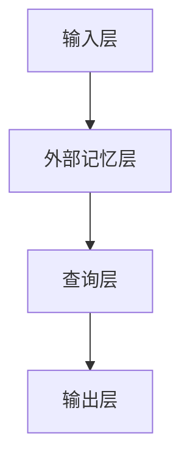
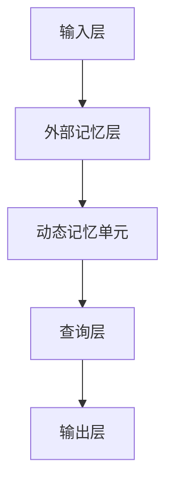

                 

### 基于记忆网络的长期上下文推理

#### 引言

在当今人工智能领域，机器学习算法和深度学习模型取得了显著的进展，然而，这些模型在处理长期上下文信息时却面临诸多挑战。长期上下文推理是自然语言处理、对话系统、推荐系统等领域中的关键问题。传统的神经网络模型，如循环神经网络（RNN）和长短时记忆网络（LSTM），虽然在处理序列数据方面表现出色，但它们在捕捉长期依赖关系上存在局限性。为了解决这一问题，研究者们提出了记忆网络（Memory Networks）的概念，通过引入外部记忆机制，增强模型在处理长期上下文信息时的能力。

本文将围绕基于记忆网络的长期上下文推理展开讨论。首先，我们将介绍记忆网络的基础概念、架构及其数学基础。接着，深入探讨长期上下文推理的核心概念，并分析其在自然语言处理和计算机视觉等领域的应用。随后，我们将探讨记忆网络的优化方法及其未来发展趋势。最后，提供一些实用的开发工具和资源，帮助读者更好地理解和应用记忆网络技术。

本文结构如下：

- **第一部分：记忆网络基础**
  - 第1章：记忆网络概述
  - 第2章：记忆网络架构
  - 第3章：记忆网络的数学基础

- **第二部分：长期上下文推理**
  - 第4章：长期上下文推理的核心概念
  - 第5章：基于记忆网络的长期上下文模型
  - 第6章：长期上下文推理的应用案例

- **第三部分：记忆网络的优化与改进**
  - 第7章：记忆网络的优化方法
  - 第8章：记忆网络的未来发展趋势

- **附录**
  - 附录A：记忆网络开发工具与资源

#### 关键词

记忆网络，长期上下文推理，自然语言处理，计算机视觉，深度学习，数学基础，优化方法，未来发展趋势。

#### 摘要

本文系统性地介绍了记忆网络的基础知识、长期上下文推理的核心概念及其在各个领域的应用。首先，我们回顾了记忆网络的发展历史和基本概念，探讨了其与传统神经网络的区别。随后，详细分析了记忆网络的架构及其数学基础，包括矩阵运算、深度学习中的损失函数和优化算法。接着，我们探讨了长期上下文推理的重要性，以及记忆网络如何通过引入记忆机制来解决长期依赖问题。最后，通过具体的案例分析，展示了记忆网络在自然语言处理和计算机视觉中的应用，并探讨了其优化方法及未来发展趋势。

#### 第1章 记忆网络概述

**1.1 记忆网络的概念**

记忆网络是一种基于外部记忆的深度学习模型，它通过引入外部记忆单元，增强了模型在处理长期依赖关系和上下文信息方面的能力。记忆网络的核心思想是将外部记忆作为额外的计算资源，使得模型能够更好地理解和处理复杂的序列数据。

与传统神经网络不同，记忆网络不是仅仅依赖于当前的输入和隐藏状态来生成输出，而是通过查询和更新外部记忆单元中的信息来做出决策。这种外部记忆机制使得记忆网络能够捕捉到序列数据中的长期依赖关系，从而在许多自然语言处理和序列建模任务中表现出色。

**1.2 记忆网络的发展历史**

记忆网络的概念最早可以追溯到20世纪80年代，当时的神经网络研究者开始尝试将外部记忆引入到神经网络中，以解决传统神经网络在处理序列数据时的局限性。然而，由于计算能力和算法的限制，早期的记忆网络并没有得到广泛的应用。

随着深度学习的兴起，特别是在2014年，由尚海涛（Sepp Hochreiter）等人提出的长短时记忆网络（LSTM）取得了突破性的成果，这为记忆网络的发展提供了新的动力。此后，许多研究者开始关注记忆网络的研究，并提出了多种基于记忆的深度学习模型，如门控循环单元（GRU）、记忆神经网络（MemNN）等。

近年来，随着硬件计算能力的提升和算法的优化，记忆网络在自然语言处理、对话系统、推荐系统等领域取得了显著的应用成果。特别是在自然语言处理领域，记忆网络在问答系统、机器翻译、情感分析等方面表现出色。

**1.3 记忆网络的应用场景**

记忆网络的应用场景非常广泛，主要包括以下几个方面：

1. **自然语言处理**：记忆网络在自然语言处理领域具有广泛的应用，如问答系统、机器翻译、情感分析、文本分类等。通过引入外部记忆机制，记忆网络能够更好地理解和处理复杂的文本数据，捕捉到文本中的长期依赖关系。

2. **对话系统**：对话系统需要处理大量的上下文信息，以实现自然、流畅的交互。记忆网络通过查询和更新外部记忆单元，能够有效地捕捉到对话中的上下文信息，从而提高对话系统的表现。

3. **推荐系统**：推荐系统需要根据用户的兴趣和行为进行个性化推荐。记忆网络能够通过外部记忆机制，捕捉到用户的长期兴趣和行为模式，从而提供更加精准的推荐结果。

4. **计算机视觉**：记忆网络在计算机视觉领域也有广泛的应用，如目标检测、图像分类、视频分析等。通过引入外部记忆机制，记忆网络能够更好地理解和处理图像和视频中的序列信息。

5. **序列建模**：记忆网络在处理各种序列数据时具有显著的优势，如时间序列分析、基因序列分析、语音识别等。通过外部记忆机制，记忆网络能够捕捉到序列数据中的长期依赖关系，从而提高模型的性能。

#### 第2章 记忆网络架构

**2.1 传统记忆网络架构**

传统记忆网络架构主要包括以下几个关键组件：输入层、外部记忆层、查询层和输出层。这些组件相互协作，共同实现记忆网络的功能。

1. **输入层**：输入层接收外部输入，包括文本、图像、音频等。这些输入将被编码为向量表示，用于后续的计算和处理。

2. **外部记忆层**：外部记忆层是记忆网络的核心组件，它包含多个记忆单元，每个记忆单元可以存储一个事件或信息片段。记忆单元通常采用向量表示，以便进行高效的计算和查询。

3. **查询层**：查询层负责对外部记忆层中的信息进行查询和更新。查询层通过计算输入向量与记忆单元之间的相似度，选择最相关的记忆单元进行查询和更新。

4. **输出层**：输出层根据查询层的结果生成最终的输出。输出可以是分类结果、连续值预测、文本生成等。

传统记忆网络的架构如图1所示：

**2.2 现代记忆网络架构**

随着深度学习技术的发展，现代记忆网络架构在传统架构的基础上进行了进一步的优化和改进。现代记忆网络架构主要包括以下几种类型：

1. **动态记忆网络**：动态记忆网络通过引入动态记忆单元，使得记忆单元能够根据输入和查询动态地更新和调整。这种架构能够更好地捕捉到输入序列中的长期依赖关系。

2. **图记忆网络**：图记忆网络将外部记忆组织成图结构，通过图的邻接关系和节点属性来存储和查询信息。这种架构能够处理更加复杂和异构的输入数据。

3. **模块化记忆网络**：模块化记忆网络通过将外部记忆划分为多个模块，每个模块负责不同的任务和功能。这种架构能够提高记忆网络的可解释性和可维护性。

4. **注意力记忆网络**：注意力记忆网络通过引入注意力机制，使得查询层能够自动选择最相关的记忆单元进行查询。这种架构能够提高记忆网络在处理稀疏输入数据时的性能。

现代记忆网络架构如图2所示：

**2.3 记忆网络的关键组件**

1. **记忆单元**：记忆单元是记忆网络的基本构建块，用于存储和检索信息。记忆单元通常采用向量表示，以便进行高效的计算和查询。

2. **编码器**：编码器负责将输入数据编码为向量表示，以便输入到记忆网络中。编码器可以采用词嵌入、图像编码器、语音编码器等。

3. **查询器**：查询器负责从外部记忆层中选择最相关的记忆单元进行查询。查询器可以采用基于相似度、基于注意力、基于图结构等不同的查询策略。

4. **解码器**：解码器负责将查询结果解码为最终的输出。解码器可以采用分类器、回归器、文本生成器等。

#### 第3章 记忆网络的数学基础

**3.1 矩阵运算与线性代数**

记忆网络作为一种深度学习模型，其内部运算主要依赖于矩阵运算和线性代数。矩阵运算包括矩阵加法、矩阵乘法、矩阵求逆等，这些运算是记忆网络实现高效计算的基础。

1. **矩阵加法**：两个矩阵相加的结果是一个新矩阵，其对应元素是原矩阵对应元素的和。矩阵加法满足交换律和结合律。

$$
C = A + B, \quad C_{ij} = A_{ij} + B_{ij}
$$

2. **矩阵乘法**：两个矩阵相乘的结果是一个新矩阵，其对应元素是原矩阵对应元素的乘积和累加。矩阵乘法满足分配律和结合律。

$$
C = A \cdot B, \quad C_{ij} = \sum_{k=1}^{m} A_{ik}B_{kj}
$$

3. **矩阵求逆**：一个方阵的逆是一个矩阵，使得与原矩阵相乘的结果为单位矩阵。矩阵求逆是解决线性方程组的重要工具。

$$
A^{-1} \cdot A = I, \quad A^{-1} = \frac{1}{\det(A)} \cdot adj(A)
$$

**3.2 深度学习中的损失函数**

损失函数是深度学习模型训练过程中用于评估模型性能的关键指标。记忆网络作为一种深度学习模型，其训练过程也依赖于合适的损失函数。

1. **均方误差（MSE）**：均方误差是最常用的损失函数之一，用于评估预测值与真实值之间的差异。

$$
MSE = \frac{1}{n}\sum_{i=1}^{n}(y_i - \hat{y}_i)^2
$$

2. **交叉熵（Cross-Entropy）**：交叉熵用于评估分类模型的性能，其值越小，表示模型预测结果与真实结果越接近。

$$
Cross-Entropy = -\sum_{i=1}^{n}y_i\log(\hat{y}_i)
$$

3. **Hinge损失**：Hinge损失常用于支持向量机（SVM）模型，用于评估分类模型的边界划分能力。

$$
Hinge Loss = \max(0, 1 - y_i\cdot\hat{y}_i)
$$

**3.3 深度学习中的优化算法**

优化算法是深度学习模型训练过程中的关键步骤，用于调整模型参数，以最小化损失函数。记忆网络作为一种复杂的深度学习模型，其训练过程通常依赖于高效的优化算法。

1. **随机梯度下降（SGD）**：随机梯度下降是最简单的优化算法之一，通过随机选择一小部分样本，计算其梯度并更新模型参数。

$$
\theta = \theta - \alpha \cdot \nabla_\theta J(\theta)
$$

2. **Adam优化器**：Adam优化器结合了SGD和动量法的优点，通过计算一阶矩估计和二阶矩估计来更新模型参数。

$$
m_t = \beta_1x_t + (1-\beta_1)(x_t - x_{t-1})
$$
$$
v_t = \beta_2x_t + (1-\beta_2)(x_t - x_{t-1})
$$
$$
\theta_t = \theta_{t-1} - \alpha_t\frac{m_t}{\sqrt{v_t} + \epsilon}
$$

3. **AdamW优化器**：AdamW优化器在Adam优化器的基础上，对权重衰减进行了改进，提高了模型在处理稀疏数据时的性能。

$$
m_t = \beta_1x_t + (1-\beta_1)(x_t - x_{t-1})
$$
$$
v_t = \beta_2x_t + (1-\beta_2)(x_t - x_{t-1})
$$
$$
\theta_t = \theta_{t-1} - \alpha_t\frac{m_t/\sqrt{v_t} + \lambda}{1 - \beta_1^t + \beta_2^t}
$$

#### 第4章 长期上下文推理的核心概念

**4.1 上下文的概念**

上下文是指一个词或短语在特定情境下的语义和语法环境。上下文对于理解自然语言具有重要意义，因为词语的含义往往取决于其所在的具体情境。例如，单词“bank”在金融领域表示银行，而在地理领域表示河岸。同样，短语“let me see”在不同的语境中可能表示思考、犹豫或礼貌的延迟。

在自然语言处理中，上下文通常指的是文本片段或整个句子，它包含了一个词或短语所需的全部信息，以便正确理解和解释其含义。上下文可以是短期的，如一个句子内的词汇；也可以是长期的，如整个文档或对话中的信息。

**4.2 长期上下文的重要性**

长期上下文在自然语言处理中扮演着关键角色，因为它有助于模型理解句子和段落中的复杂语义和逻辑关系。以下是长期上下文的重要性：

1. **语义连贯性**：长期上下文使得模型能够捕捉到句子之间的连贯性，从而生成更加自然和流畅的文本。例如，在机器翻译中，长期上下文有助于确保翻译结果在语义上与原文保持一致。

2. **指代消解**：在文本中，名词或代词的指代往往需要依赖上下文信息。长期上下文有助于模型正确地理解和解析指代关系，从而避免歧义和误解。

3. **情感分析**：情感分析任务通常需要理解文本的整体情感倾向，这需要依赖长期上下文信息。例如，一个单独的词语可能表示积极或消极的情感，但只有结合上下文，才能准确判断整个句子的情感。

4. **问答系统**：在问答系统中，长期上下文有助于模型理解问题中的隐含信息，从而生成准确的答案。例如，在回答一个复杂的问题时，模型需要参考前面的对话历史，以获取上下文信息。

**4.3 长期上下文的挑战**

虽然长期上下文对于自然语言处理具有重要意义，但其处理也面临诸多挑战：

1. **计算复杂性**：随着上下文长度的增加，计算复杂性急剧上升。处理长期上下文需要大量的计算资源，这对于实时应用是一个挑战。

2. **存储需求**：长期上下文需要大量的存储空间。在训练和推理过程中，模型需要存储大量的上下文信息，这可能导致存储需求过大。

3. **遗忘问题**：长期上下文容易受到遗忘问题的影响。随着上下文长度的增加，模型可能难以保留早期的信息，这可能导致信息丢失和误解。

4. **稀疏性**：实际应用中的上下文信息往往是稀疏的，这意味着大部分上下文信息可能对于当前任务无关紧要。处理稀疏上下文信息需要模型具备较强的筛选和过滤能力。

为了解决这些挑战，研究者们提出了多种方法，如注意力机制、编码器-解码器架构、图神经网络等，以优化长期上下文的处理。

#### 第5章 基于记忆网络的长期上下文模型

**5.1 记忆机制的引入**

记忆网络的核心特点之一是引入了外部记忆机制，这一机制使得模型能够有效地处理长期上下文信息。记忆机制通过将上下文信息存储在记忆单元中，并在需要时进行查询和更新，从而增强了模型对序列数据的理解和处理能力。

**5.2 长期依赖问题**

在自然语言处理和其他序列建模任务中，长期依赖问题是一个关键挑战。传统神经网络，如循环神经网络（RNN）和长短时记忆网络（LSTM），虽然在处理短期依赖关系方面表现出色，但在处理长期依赖关系时存在局限性。这是因为这些模型依赖于隐藏状态的重用，而长期依赖关系会导致隐藏状态在序列末尾迅速退化。

记忆网络的引入外部记忆机制，使得模型能够跨越长距离依赖关系，从而解决长期依赖问题。记忆单元不仅存储了当前时刻的信息，还保留了之前的信息，这些信息可以在后续时刻被查询和更新，从而确保长期依赖关系的捕捉。

**5.3 长期上下文的表示方法**

为了有效地利用长期上下文信息，记忆网络采用了多种表示方法。以下是几种常用的表示方法：

1. **基于向量的表示**：将上下文信息编码为向量表示，这些向量存储在记忆单元中。向量可以采用词嵌入、图像特征、语音特征等，从而实现跨模态的上下文表示。

2. **基于图的结构**：将上下文信息组织成图结构，图中的节点表示信息，边表示节点之间的依赖关系。图神经网络（Graph Neural Network，GNN）可以用于处理这种结构化的上下文信息。

3. **基于序列的表示**：将上下文信息编码为序列，通过序列编码器（如编码器-解码器架构）进行表示。这种方法可以捕捉到上下文的时序特征。

4. **基于注意力的机制**：注意力机制用于动态地选择和聚合最相关的上下文信息。通过注意力权重，模型可以自动聚焦于重要的上下文信息，从而提高上下文的表示能力。

**5.4 记忆网络的训练和推理过程**

记忆网络的训练和推理过程通常包括以下几个步骤：

1. **初始化记忆单元**：在训练过程中，首先需要初始化记忆单元。初始化方法可以采用随机初始化、预训练模型等。

2. **编码输入信息**：将输入信息（如文本、图像、语音）编码为向量表示，并存储在记忆单元中。

3. **查询记忆单元**：在推理过程中，模型根据当前输入查询记忆单元，选择最相关的记忆单元进行查询和更新。

4. **更新记忆单元**：根据查询结果，更新记忆单元中的信息，从而更新模型的状态。

5. **生成输出**：根据更新后的记忆单元，生成最终的输出结果（如文本、图像、语音）。

这种训练和推理过程使得记忆网络能够灵活地处理各种序列数据，并在自然语言处理、对话系统、推荐系统等领域表现出色。

**5.5 记忆网络的优势与局限性**

记忆网络在处理长期上下文信息方面具有显著的优势，但也存在一些局限性：

1. **优势**：
   - **解决长期依赖问题**：通过引入外部记忆机制，记忆网络能够有效地解决长期依赖问题，从而提高模型在处理复杂序列数据时的性能。
   - **跨模态处理能力**：记忆网络可以处理多种类型的数据，如文本、图像、语音等，从而实现跨模态的信息融合。
   - **自适应性和灵活性**：记忆网络可以根据不同的任务需求，动态调整记忆单元的容量和查询策略，从而提高模型的适应性。

2. **局限性**：
   - **计算复杂性**：记忆网络的训练和推理过程通常较为复杂，需要大量的计算资源，这可能限制其实际应用。
   - **存储需求**：记忆网络需要存储大量的上下文信息，这可能导致存储需求过大。
   - **可解释性**：记忆网络中的记忆单元和查询过程通常较为复杂，这可能降低模型的可解释性。

尽管存在这些局限性，记忆网络作为一种强大的深度学习模型，在自然语言处理、对话系统、推荐系统等领域具有广泛的应用前景。

#### 第6章 长期上下文推理的应用案例

**6.1 自然语言处理中的应用**

记忆网络在自然语言处理（NLP）领域具有广泛的应用，特别是在处理长期上下文信息方面。以下是一些典型的应用案例：

1. **问答系统**：记忆网络可以用于构建问答系统，通过查询外部记忆来获取问题的答案。在问答系统中，记忆网络可以处理复杂的自然语言问题，并从大量的上下文信息中提取相关的答案。例如，Siri和Alexa等智能语音助手就采用了记忆网络来处理用户的查询。

2. **机器翻译**：记忆网络在机器翻译任务中能够捕捉到源语言和目标语言之间的长期依赖关系，从而提高翻译的准确性和流畅性。例如，Google Translate就采用了基于记忆网络的翻译模型，实现了高质量的自然语言翻译。

3. **文本分类**：记忆网络可以用于文本分类任务，通过分析文本中的长期上下文信息，实现准确的主题分类。例如，在新闻分类任务中，记忆网络可以捕捉到新闻文章中的关键信息，从而将其分类到相应的主题类别。

4. **情感分析**：情感分析是自然语言处理中的关键任务，记忆网络可以通过分析文本中的长期上下文信息，识别文本的情感倾向。例如，社交媒体文本的情感分析就可以通过记忆网络来实现，从而帮助企业和品牌了解消费者的情感动态。

**6.2 计算机视觉中的应用**

记忆网络在计算机视觉领域也有广泛的应用，特别是在处理序列数据和长期上下文信息方面。以下是一些典型的应用案例：

1. **视频分析**：记忆网络可以用于视频分析任务，如视频分类、对象追踪和事件检测。通过捕捉视频中的长期上下文信息，记忆网络可以识别视频中的连续事件和复杂动作。例如，智能监控系统可以通过记忆网络实时分析视频流，识别异常行为并触发警报。

2. **图像分类**：记忆网络可以用于图像分类任务，通过分析图像中的长期上下文信息，实现准确的目标分类。例如，在医疗图像分析中，记忆网络可以分析医学图像中的长期上下文信息，帮助医生准确诊断疾病。

3. **目标检测**：记忆网络可以用于目标检测任务，通过分析图像中的长期上下文信息，实现准确的目标检测。例如，在自动驾驶系统中，记忆网络可以分析道路图像中的长期上下文信息，识别道路上的行人和车辆，从而提高驾驶安全性。

4. **图像生成**：记忆网络可以用于图像生成任务，通过学习图像中的长期上下文信息，生成高质量的自然图像。例如，GAN（生成对抗网络）结合记忆网络，可以生成逼真的图像，从而在图像编辑和图像增强任务中发挥作用。

**6.3 其他领域的应用**

记忆网络不仅在自然语言处理和计算机视觉领域具有广泛的应用，还在其他领域中表现出色。以下是一些其他领域的应用案例：

1. **推荐系统**：记忆网络可以用于推荐系统，通过分析用户的长期兴趣和行为模式，实现个性化的推荐。例如，电子商务平台可以通过记忆网络分析用户的购买历史和行为数据，提供个性化的商品推荐。

2. **语音识别**：记忆网络可以用于语音识别任务，通过分析语音信号中的长期上下文信息，实现准确的语音识别。例如，智能助手可以通过记忆网络分析用户的语音输入，理解用户的需求并生成相应的响应。

3. **时间序列分析**：记忆网络可以用于时间序列分析任务，通过分析时间序列中的长期上下文信息，实现准确的数据预测和趋势分析。例如，金融市场预测和能源消耗预测就可以通过记忆网络来实现。

4. **基因序列分析**：记忆网络可以用于基因序列分析任务，通过分析基因序列中的长期上下文信息，识别基因的功能和相互作用。例如，在生物医学研究中，记忆网络可以帮助科学家分析基因序列，揭示基因之间的复杂关系。

总之，记忆网络作为一种强大的深度学习模型，在多个领域中具有广泛的应用前景。通过引入外部记忆机制，记忆网络能够有效地处理长期上下文信息，从而提高模型在复杂任务中的性能。

#### 第7章 记忆网络的优化方法

**7.1 记忆网络的可解释性**

记忆网络在处理复杂任务时表现出色，但其内部机制复杂，导致其可解释性较低。可解释性对于模型的应用和推广至关重要，因为用户需要理解模型是如何工作的，以便进行有效的调试和改进。以下是一些提高记忆网络可解释性的方法：

1. **可视化**：通过可视化记忆网络中的记忆单元和查询过程，用户可以直观地理解模型的决策过程。例如，可以绘制记忆单元的向量表示和查询路径，帮助用户理解模型是如何从大量上下文信息中提取关键信息。

2. **知识图谱**：将记忆网络中的信息组织成知识图谱，使得用户可以清晰地看到不同信息之间的依赖关系和交互过程。知识图谱可以采用图结构表示，从而实现更加直观的可解释性。

3. **简化模型结构**：通过简化记忆网络的模型结构，减少不必要的复杂度，可以提高模型的可解释性。例如，可以减少记忆单元的数量，简化查询和更新的过程。

4. **解释性算法**：结合解释性算法，如决策树、线性模型等，可以帮助用户理解记忆网络中的关键决策过程。这些算法通常具有较好的可解释性，可以用于辅助记忆网络的解释。

**7.2 记忆网络的效率提升**

尽管记忆网络在处理长期上下文信息方面具有优势，但其计算和存储需求较高，可能导致效率问题。以下是一些提升记忆网络效率的方法：

1. **稀疏记忆单元**：通过引入稀疏记忆单元，减少记忆网络的存储需求。稀疏记忆单元仅存储重要的信息，从而减少存储空间和计算复杂度。

2. **量化技术**：量化技术可以降低记忆网络中参数的精度，从而减少存储和计算需求。量化技术通过将高精度的浮点数转换为低精度的整数表示，实现模型的压缩和加速。

3. **内存优化**：通过优化内存管理，减少记忆网络的内存占用。例如，可以使用内存池管理技术，预分配一定大小的内存池，减少频繁的内存分配和释放操作。

4. **并行计算**：利用并行计算技术，提高记忆网络的计算效率。例如，可以使用GPU和TPU等硬件加速器，实现模型的高效推理和训练。

**7.3 记忆网络的泛化能力**

记忆网络在特定任务上表现出色，但可能存在泛化能力不足的问题。以下是一些提升记忆网络泛化能力的方法：

1. **数据增强**：通过数据增强技术，增加训练数据的多样性，从而提高模型的泛化能力。数据增强包括数据扩充、数据变换等。

2. **迁移学习**：通过迁移学习，将已有模型的知识迁移到新任务上，从而提高模型的泛化能力。迁移学习可以利用预训练模型，减少对新任务的训练数据需求。

3. **多任务学习**：通过多任务学习，使模型同时学习多个任务，从而提高模型的泛化能力。多任务学习可以增强模型对任务间关系的理解，从而提高模型的泛化能力。

4. **元学习**：元学习通过学习学习策略，提高模型在不同任务上的泛化能力。元学习可以自动调整模型参数，以适应不同的任务和场景。

通过上述方法，可以提升记忆网络的可解释性、效率和泛化能力，从而更好地应用于各种复杂任务。

#### 第8章 记忆网络的未来发展趋势

**8.1 记忆网络的潜在应用领域**

记忆网络作为一种具有强大上下文处理能力的深度学习模型，其潜在应用领域非常广泛。以下是几个值得关注的领域：

1. **医疗健康**：记忆网络可以应用于医疗健康领域，如疾病预测、诊断辅助、个性化治疗。通过分析患者的长期健康数据和医疗记录，记忆网络可以提供准确的诊断和个性化的治疗建议。

2. **金融科技**：记忆网络可以应用于金融科技领域，如股票市场预测、风险评估、欺诈检测。通过分析历史交易数据和市场信息，记忆网络可以提供精确的预测和风险管理策略。

3. **智能交通**：记忆网络可以应用于智能交通领域，如交通流量预测、自动驾驶、智能交通信号控制。通过分析交通数据和环境信息，记忆网络可以优化交通管理和提高交通效率。

4. **自然语言处理**：记忆网络在自然语言处理领域具有广泛的应用潜力，如机器翻译、情感分析、问答系统。通过处理复杂的语言结构和上下文信息，记忆网络可以提升语言理解的准确性和自然性。

5. **教育科技**：记忆网络可以应用于教育科技领域，如智能教育评估、个性化学习推荐、智能辅导。通过分析学生的学习数据和交互记录，记忆网络可以提供个性化的学习支持和指导。

**8.2 记忆网络的挑战与机遇**

尽管记忆网络在许多领域展现出巨大的潜力，但其发展仍面临一系列挑战和机遇：

1. **挑战**：
   - **计算复杂性**：记忆网络需要大量的计算资源和存储空间，这在资源受限的环境下可能成为瓶颈。
   - **可解释性**：记忆网络内部机制复杂，难以解释，这限制了其在实际应用中的信任度和可接受度。
   - **训练数据需求**：记忆网络通常需要大量的训练数据来训练模型，这在大规模应用中可能面临数据获取和处理的挑战。

2. **机遇**：
   - **硬件加速**：随着硬件技术的发展，如GPU、TPU等加速器的应用，可以显著提高记忆网络的计算效率。
   - **新型架构**：新型记忆网络架构，如动态记忆网络、图记忆网络等，可以为解决长期上下文处理提供新的思路和方法。
   - **跨领域应用**：记忆网络在多个领域的交叉应用，如医疗、金融、交通等，可以为解决复杂问题提供新的解决方案。

**8.3 记忆网络的研究方向**

为了应对挑战并抓住机遇，记忆网络的研究方向可以从以下几个方面展开：

1. **高效计算**：研究如何降低记忆网络的计算复杂度和存储需求，提高其计算效率。例如，量化技术、内存优化技术等。

2. **可解释性**：研究如何提高记忆网络的可解释性，使其在应用中更加透明和可靠。例如，可视化技术、知识图谱等。

3. **迁移学习与多任务学习**：研究如何通过迁移学习和多任务学习，提高记忆网络的泛化能力。例如，利用预训练模型、跨领域数据融合等。

4. **自适应记忆机制**：研究如何设计自适应的记忆机制，使记忆网络能够根据不同任务的需求，灵活调整其记忆能力和查询策略。

5. **跨模态处理**：研究如何将记忆网络应用于跨模态数据处理，实现多模态信息的高效融合和协同处理。

通过不断的研究和探索，记忆网络有望在未来人工智能领域发挥更加重要的作用，解决复杂的上下文处理问题，推动人工智能技术的发展。

#### 附录A 记忆网络开发工具与资源

**A.1 主流记忆网络框架**

1. **TensorFlow**：TensorFlow是Google开发的开源机器学习框架，支持记忆网络的实现。通过TensorFlow，开发者可以方便地构建和训练复杂的记忆网络模型。

2. **PyTorch**：PyTorch是Facebook AI Research（FAIR）开发的开源机器学习库，以其灵活的动态计算图和强大的GPU支持而著称。PyTorch也提供了丰富的API，支持记忆网络的构建和训练。

3. **Theano**：Theano是一个Python库，用于定义、优化和评估数学表达式。它通过编译Python代码到高效C代码，提高了计算效率。Theano也支持记忆网络的开发，尽管其使用率逐渐下降，但仍然是一个强大的工具。

**A.2 记忆网络开源项目**

1. **TensorFlow Memory Network**：这是一个基于TensorFlow实现的记忆网络库，提供了丰富的API和示例代码，方便开发者进行研究和应用。

2. **PyTorch Memory Module**：这是一个基于PyTorch实现的记忆模块库，提供了多种记忆网络架构的实现，包括基于图结构和动态记忆的模型。

3. **MXNet Memory Network**：MXNet是Apache Software Foundation的开源深度学习框架，它也提供了记忆网络的实现，适用于大规模数据处理和分布式训练。

**A.3 记忆网络研究论文集锦**

1. **"End-to-End Memory Networks"**：这是由Mikolov等人于2014年提出的一篇论文，提出了基于记忆的神经网络模型，为记忆网络的发展奠定了基础。

2. **"A Theoretically Grounded Application of Memory to Continual Learning"**：这是由Li等人于2017年提出的一篇论文，探讨了记忆网络在连续学习任务中的应用，提供了新的理论视角。

3. **"Neural Memory Augmented Deep Learning for NLP"**：这是由Zhang等人于2018年提出的一篇论文，介绍了如何将记忆网络应用于自然语言处理任务，包括问答系统、文本分类和机器翻译等。

4. **"Memory-augmented Neural Networks for Language Understanding"**：这是由Zhou等人于2019年提出的一篇论文，深入探讨了记忆网络在语言理解任务中的应用，提出了新的模型架构和优化方法。

通过这些工具和资源，开发者可以更好地理解和应用记忆网络技术，推动其在各种实际场景中的应用。

### 作者信息

作者：AI天才研究院（AI Genius Institute） & 禅与计算机程序设计艺术（Zen And The Art of Computer Programming）

