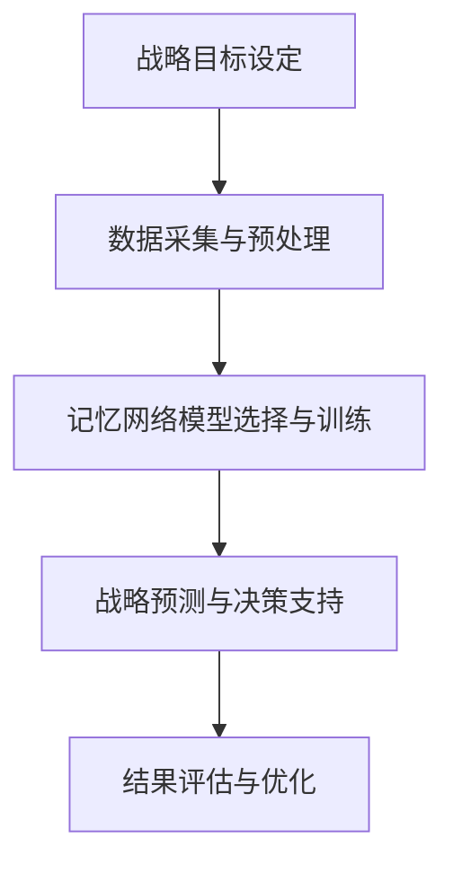
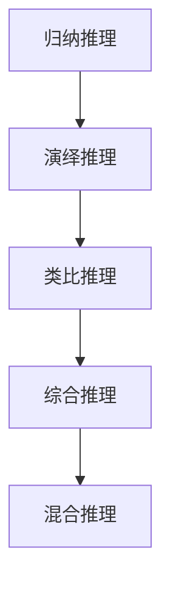

                 

# 基于 memory network 的长期战略规划推理能力增强

## 关键词

- 记忆网络
- 长期战略规划
- 推理能力
- 数据驱动决策
- 人工智能

## 摘要

本文探讨了记忆网络在长期战略规划中的应用，以及如何通过增强推理能力来优化战略规划过程。首先介绍了记忆网络的基本概念、原理及其在计算机技术中的应用。接着，分析了长期战略规划的定义、目标及其面临的挑战。在此基础上，详细阐述了记忆网络在战略规划中的优势和应用场景，并通过具体案例展示了记忆网络如何提高战略预测和决策支持的效果。文章最后提出了战略规划推理能力增强的方法，并展望了未来研究方向。

## 第1章 引言与背景

### 1.1 书籍主题概述

**记忆网络简介**：记忆网络是一种能够模拟人类记忆和思考过程的神经网络结构。它通过记忆单元来存储和检索信息，实现长期记忆和短期记忆的转换。记忆网络在处理复杂问题和进行知识推理方面具有显著优势。

**长期战略规划与推理能力的关系**：长期战略规划是指企业或组织在较长时间范围内制定的总体发展规划。推理能力则是战略规划过程中必不可少的要素，它帮助决策者从大量数据和信息中提取有价值的信息，并进行有效的推理和判断。

### 1.2 计算机技术在战略规划中的作用

**数据驱动的决策支持**：计算机技术通过大数据和数据分析技术，为企业提供准确、实时的信息支持，帮助决策者更好地把握市场动态和竞争态势。

**人工智能与机器学习在战略规划中的应用**：人工智能和机器学习技术可以帮助企业实现自动化决策，提高战略规划的效率和准确性。通过学习历史数据和经验，这些技术能够为决策者提供更有洞察力的建议。

### 1.3 当前研究现状与挑战

**记忆网络的发展历程**：记忆网络起源于20世纪80年代，经过数十年的发展，已成为人工智能领域的一个重要研究方向。近年来，随着深度学习和神经网络技术的突破，记忆网络在学术界和工业界得到了广泛应用。

**长期战略规划面临的挑战**：在当前复杂多变的市场环境下，长期战略规划面临着诸多挑战，如数据质量、信息不对称、环境不确定性等。如何利用先进技术提高战略规划的准确性和适应性，成为亟待解决的问题。

## 第2章：记忆网络基础

### 2.1 记忆网络的定义与原理

**记忆网络的概念**：记忆网络是一种结合了记忆单元和计算单元的神经网络结构，能够在学习和推理过程中模拟人类记忆和思考过程。

**记忆网络的基本结构**：记忆网络通常由输入层、输出层和中间层组成。输入层接收外部信息，输出层生成决策或预测，中间层则负责信息的存储和检索。

### 2.2 记忆网络的主要类型

**基于内容的地址记忆**：这种类型的记忆网络通过内容特征来检索信息，类似于人类通过关键词搜索记忆。

**基于位置的地址记忆**：这种类型的记忆网络通过存储位置的索引来检索信息，类似于人类通过记忆位置来寻找物品。

**稳态记忆网络**：这种类型的记忆网络能够维持长期的稳定状态，即使输入信息发生变化，也能保持记忆的稳定性。

### 2.3 记忆网络的关键技术

**记忆单元的设计**：记忆单元是记忆网络的核心部分，其设计直接影响记忆网络的表现。常见的记忆单元包括门控循环单元（GRU）和长短期记忆网络（LSTM）。

**记忆检索与存储机制**：记忆网络的检索与存储机制决定了其性能。通过优化这些机制，可以提升记忆网络的存储效率和检索速度。

## 第3章：长期战略规划的基本概念

### 3.1 战略规划的定义与目标

**战略规划的概念**：战略规划是指组织在长期发展过程中，为实现其愿景和使命而制定的总体行动计划。

**战略规划的目标**：战略规划的目标包括提高组织竞争力、实现可持续发展、优化资源配置等。

### 3.2 长期战略规划的特点与挑战

**长期战略规划的重要性**：长期战略规划对于组织的持续发展和竞争优势具有重要意义。

**长期战略规划的特点**：长期战略规划具有全局性、前瞻性、系统性和动态性等特点。

**长期战略规划面临的挑战**：长期战略规划面临着市场不确定性、技术变革、资源约束等挑战。

### 3.3 长期战略规划的核心要素

**战略目标的设定**：战略目标是指组织在长期发展过程中要实现的具体目标。

**资源配置与分配**：资源配置与分配是指根据战略目标的需求，合理分配组织资源，以实现战略目标。

**风险管理**：风险管理是指识别、评估和应对战略规划过程中可能出现的风险，以确保战略目标的实现。

## 第4章：记忆网络在战略规划中的应用

### 4.1 记忆网络在长期战略规划中的优势

**提高战略规划的准确性**：记忆网络能够通过存储和检索历史数据，提高战略规划的准确性。

**加速战略规划的迭代速度**：记忆网络能够快速适应新的数据和情境，加速战略规划的迭代过程。

### 4.2 记忆网络在战略规划中的应用场景

**战略预测**：记忆网络能够通过对历史数据的分析和趋势预测，为战略规划提供有力的数据支持。

**战略决策支持**：记忆网络能够通过分析决策相关的信息，为决策者提供有价值的建议，提高决策的质量和效率。

### 4.3 记忆网络在长期战略规划中的实现

**数据采集与预处理**：首先，需要收集与战略规划相关的历史数据，并进行预处理，如数据清洗、归一化等。

**记忆网络模型的选择与训练**：根据应用场景和需求，选择合适的记忆网络模型，并进行训练。

**战略预测与决策支持**：利用训练好的记忆网络模型，进行战略预测和决策支持。

## 第5章：战略规划推理能力的增强

### 5.1 推理能力的定义与分类

**推理能力的概念**：推理能力是指从已知信息中推导出新信息的能力。

**推理能力的分类**：推理能力可以分为归纳推理、演绎推理、类比推理等。

### 5.2 记忆网络对推理能力的提升

**记忆网络与推理能力的联系**：记忆网络能够通过存储和检索信息，提高推理能力的效率。

**记忆网络在推理能力提升中的应用**：通过记忆网络，可以实现对复杂数据和情境的快速推理和决策。

### 5.3 推理能力增强的方法与实践

**规则推理**：通过制定规则，对已知信息进行推理。

**案例推理**：通过历史案例的对比和分析，进行推理。

**机器学习推理**：利用机器学习算法，从数据中学习推理规律。

## 第6章：案例研究

### 6.1 案例选择与背景

**案例概述**：本案例研究以一家大型零售企业为例，探讨记忆网络在长期战略规划中的应用。

**案例研究目的**：通过案例分析，验证记忆网络在战略规划中的有效性，并探讨其实际应用中可能遇到的问题和挑战。

### 6.2 案例分析

**数据采集与处理**：收集与该企业长期战略规划相关的历史数据，并进行预处理。

**记忆网络模型的选择与实现**：选择合适的记忆网络模型，进行训练和实现。

**战略预测与决策支持**：利用训练好的记忆网络模型，进行战略预测和决策支持。

### 6.3 结果与讨论

**模型性能评估**：评估记忆网络模型在战略预测和决策支持中的性能。

**结果分析与讨论**：分析案例研究的结果，讨论记忆网络在战略规划中的应用效果和潜在问题。

## 第7章：结论与展望

### 7.1 研究成果总结

**记忆网络在战略规划中的应用成果**：总结记忆网络在战略规划中的成功应用案例，分析其优势和应用前景。

**推理能力增强的方法与实践**：总结推理能力增强的方法和实践经验，探讨其应用效果和改进方向。

### 7.2 存在的问题与挑战

**记忆网络技术的局限性**：分析记忆网络技术在战略规划中的局限性，探讨改进方向。

**战略规划与推理能力的进一步提升**：探讨如何进一步改进战略规划和推理能力，以适应复杂多变的市场环境。

### 7.3 未来研究方向与展望

**记忆网络在战略规划领域的深入应用**：展望记忆网络在战略规划领域的研究方向和潜在应用。

**推理能力的新方法与新技术**：探讨新的推理方法和技术，以提升战略规划和决策支持的效果。

## 附录

### 附录A：记忆网络模型列表

### 附录B：案例分析数据集列表

### 附录C：代码与工具列表

## 参考文献

## Mermaid 流程图

### 7.1 记忆网络在战略规划中的应用流程

### 5.1 推理能力的定义与分类

## 第1章 引言与背景

### 1.1 书籍主题概述

**记忆网络简介**：

记忆网络是一种结合了记忆单元和计算单元的神经网络结构，能够模拟人类的记忆和思考过程。它通过记忆单元来存储和检索信息，从而实现长期记忆和短期记忆的转换。记忆网络在处理复杂问题和进行知识推理方面具有显著优势。近年来，随着深度学习和神经网络技术的突破，记忆网络在学术界和工业界得到了广泛应用。

**长期战略规划与推理能力的关系**：

长期战略规划是指企业或组织在较长时间范围内制定的总体发展规划，以实现其愿景和使命。在制定和实施战略规划的过程中，推理能力起到了至关重要的作用。推理能力是指从已知信息中推导出新信息的能力，它帮助决策者从大量数据和信息中提取有价值的信息，并进行有效的推理和判断。

记忆网络通过存储和检索历史数据，可以提升战略规划的准确性和效率。在长期战略规划中，记忆网络能够帮助决策者更好地理解市场动态、预测未来趋势，从而制定更为合理的战略决策。此外，记忆网络还可以加速战略规划的迭代速度，使决策者能够快速适应环境变化，调整战略方向。

### 1.2 计算机技术在战略规划中的作用

**数据驱动的决策支持**：

计算机技术，特别是大数据和人工智能技术，已经成为战略规划中不可或缺的工具。数据驱动的决策支持是指利用大数据和数据分析技术，为企业或组织提供准确、实时的信息支持，帮助决策者更好地把握市场动态和竞争态势。通过分析大量历史数据和实时数据，决策者可以识别潜在的市场机会和风险，制定更为科学合理的战略规划。

**人工智能与机器学习在战略规划中的应用**：

人工智能和机器学习技术可以帮助企业或组织实现自动化决策，提高战略规划的效率和准确性。人工智能技术通过对历史数据的分析和学习，可以预测市场趋势、评估不同战略方案的潜在影响，从而为决策者提供有价值的建议。机器学习算法可以自动发现数据中的模式和规律，从而帮助决策者做出更为准确的判断和决策。

在战略规划过程中，人工智能和机器学习技术可以应用于多个方面，如市场预测、竞争对手分析、资源优化等。通过利用这些先进技术，企业或组织可以更好地应对复杂多变的市场环境，提高其竞争力和可持续发展能力。

### 1.3 当前研究现状与挑战

**记忆网络的发展历程**：

记忆网络的研究可以追溯到20世纪80年代。当时，研究人员开始探索如何通过神经网络来模拟人类的记忆和思考过程。早期的记忆网络模型如Hopfield网络和BP网络，为后来的记忆网络发展奠定了基础。随着深度学习和神经网络技术的突破，记忆网络的研究得到了广泛关注和深入发展。近年来，门控循环单元（GRU）、长短期记忆网络（LSTM）等先进记忆网络模型的提出，进一步推动了记忆网络在各个领域的应用。

**长期战略规划面临的挑战**：

在当前复杂多变的市场环境下，长期战略规划面临着诸多挑战。首先，数据质量是战略规划成功的关键。战略规划需要依赖于大量的历史数据和实时数据，这些数据的准确性、完整性和可靠性直接影响战略规划的准确性。然而，在实际应用中，数据质量往往无法满足要求，如数据缺失、噪声、错误等问题。

其次，信息不对称是另一个挑战。在战略规划过程中，不同部门和层级之间的信息共享和传递往往存在障碍，导致信息不对称。这种信息不对称会影响决策者对市场动态和竞争态势的准确判断，从而影响战略规划的有效性。

此外，环境不确定性也是长期战略规划面临的重要挑战。市场环境的不确定性，如政策变化、技术变革、市场需求波动等，都会对战略规划产生重大影响。如何应对这些不确定性，制定具有灵活性和适应性的战略规划，是决策者面临的重要问题。

### 1.4 书籍结构安排

本书将从以下几个方面展开对基于记忆网络的长期战略规划推理能力增强的研究：

**第1章 引言与背景**：介绍记忆网络的基本概念、长期战略规划的定义及其在计算机技术中的应用，以及当前研究现状和面临的挑战。

**第2章 记忆网络基础**：详细阐述记忆网络的定义、原理、主要类型以及关键技术，为后续章节的研究打下基础。

**第3章 长期战略规划的基本概念**：讨论战略规划的定义、目标、特点、挑战以及核心要素，为记忆网络在战略规划中的应用提供背景知识。

**第4章 记忆网络在战略规划中的应用**：分析记忆网络在战略规划中的优势、应用场景以及实现方法，并通过具体案例展示其效果。

**第5章 战略规划推理能力的增强**：探讨战略规划推理能力的定义、分类以及记忆网络对推理能力的提升，并提出推理能力增强的方法和实践。

**第6章 案例研究**：通过一个具体案例，展示记忆网络在长期战略规划中的应用过程，分析其效果和潜在问题。

**第7章 结论与展望**：总结研究成果，讨论记忆网络在战略规划中的应用前景和未来研究方向。

通过以上章节的论述，本书旨在为读者提供一个全面、系统的关于基于记忆网络的长期战略规划推理能力增强的研究框架，帮助读者深入理解和应用这一先进技术。

## 第2章：记忆网络基础

### 2.1 记忆网络的定义与原理

**记忆网络的概念**：

记忆网络是一种结合了记忆单元和计算单元的神经网络结构，旨在模拟人类的记忆和思考过程。它通过记忆单元来存储和检索信息，从而实现长期记忆和短期记忆的转换。记忆网络在处理复杂问题和进行知识推理方面具有显著优势。

**记忆网络的基本原理**：

记忆网络的核心原理是记忆存储和检索。记忆网络通过记忆单元来存储信息，这些记忆单元可以存储大量的信息，并且能够对存储的信息进行快速检索。记忆网络的工作过程可以分为以下几个步骤：

1. **输入阶段**：记忆网络接收外部输入信息，这些信息可以是文本、图像、声音等不同形式。

2. **存储阶段**：输入信息通过编码机制转化为记忆单元中的信息，并存储在记忆网络中。

3. **检索阶段**：当需要检索信息时，记忆网络根据检索信号激活相应的记忆单元，从而获取所需信息。

4. **输出阶段**：激活的记忆单元生成输出信息，这些输出信息可以是决策、预测或其他形式的响应。

**记忆网络的基本结构**：

记忆网络通常由输入层、输出层和中间层组成。输入层接收外部输入信息，输出层生成决策或预测，中间层则负责信息的存储和检索。中间层通常包含多个记忆单元，每个记忆单元都可以存储和检索特定的信息。

### 2.2 记忆网络的主要类型

记忆网络可以分为多种类型，每种类型都有其独特的结构和特点。以下介绍几种常见的记忆网络类型：

**基于内容的地址记忆（Content-Addressable Memory，CAM）**：

基于内容的地址记忆是一种通过内容特征来检索信息的记忆网络。CAM的工作原理是，当输入新的信息时，它会与内存中的信息进行匹配，如果找到匹配的信息，则会返回相应的地址。CAM的特点是检索速度快，且能够自动更新内存中的信息。

**基于位置的地址记忆（Position-Addressable Memory，PAM）**：

基于位置的地址记忆是一种通过存储位置的索引来检索信息的记忆网络。PAM的工作原理是，当输入新的信息时，它会将信息存储在特定的位置，并在需要检索时，根据位置索引来获取所需信息。PAM的特点是存储位置固定，检索速度快。

**稳态记忆网络（Stationary Memory Network，SMN）**：

稳态记忆网络是一种能够维持长期稳定状态的记忆网络。SMN通过维持稳定的内部状态，即使在输入信息发生变化时，也能保持记忆的稳定性。稳态记忆网络在处理长期记忆和进行知识推理方面具有显著优势。

### 2.3 记忆网络的关键技术

记忆网络的关键技术包括记忆单元的设计、记忆检索与存储机制、记忆网络的训练方法等。

**记忆单元的设计**：

记忆单元是记忆网络的核心部分，其设计直接影响记忆网络的表现。常见的记忆单元包括门控循环单元（GRU）、长短期记忆网络（LSTM）、门控注意力机制（Gated Attention Mechanism）等。这些记忆单元通过不同的方式来存储和检索信息，以适应不同的应用需求。

**记忆检索与存储机制**：

记忆检索与存储机制决定了记忆网络的存储效率和检索速度。常见的记忆检索与存储机制包括基于内容的地址记忆、基于位置的地址记忆、动态记忆检索等。这些机制通过不同的方式来组织和存储信息，以提高记忆网络的性能。

**记忆网络的训练方法**：

记忆网络的训练方法是指如何通过训练来优化记忆网络的参数，以实现更好的性能。常见的训练方法包括反向传播算法、梯度下降算法、增强学习等。这些训练方法通过不断调整记忆网络的参数，使其在特定任务上达到最优性能。

### 2.4 记忆网络的应用实例

记忆网络在计算机科学和人工智能领域有广泛的应用。以下是一些典型的应用实例：

**自然语言处理（NLP）**：

记忆网络在自然语言处理中具有重要作用，特别是在文本生成、机器翻译和情感分析等领域。例如，通过使用记忆网络，可以实现高效的文本编码和解码，从而提高文本生成和翻译的质量。

**图像识别与处理**：

记忆网络在图像识别和图像处理中也得到广泛应用。通过使用记忆网络，可以实现高效的图像特征提取和分类，从而提高图像识别的准确性。

**知识图谱**：

记忆网络可以用于构建和查询知识图谱，从而实现知识推理和知识发现。例如，通过使用记忆网络，可以实现基于知识图谱的问答系统和推荐系统。

**自动驾驶**：

在自动驾驶领域，记忆网络可以用于模拟驾驶环境，预测驾驶行为，从而提高自动驾驶的安全性和可靠性。

### 2.5 记忆网络的挑战与未来方向

虽然记忆网络在许多领域表现出色，但仍然面临一些挑战。以下是一些主要的挑战和未来研究方向：

**数据依赖性**：

记忆网络对大量高质量数据进行训练，因此在数据稀缺或数据质量较差的领域，其性能可能会受到影响。未来研究方向包括减少数据依赖性和提高记忆网络对数据缺失和噪声的鲁棒性。

**可解释性**：

记忆网络的内部机制复杂，导致其推理过程难以解释。未来研究方向包括提高记忆网络的可解释性，使其更易于理解和调试。

**动态适应能力**：

记忆网络在处理动态环境和变化数据时，可能面临适应能力不足的问题。未来研究方向包括提高记忆网络的动态适应能力和实时学习能力。

**能耗与计算资源**：

记忆网络的计算复杂度高，能耗较大。未来研究方向包括优化记忆网络的计算效率和降低能耗。

总之，记忆网络作为一种强大的神经网络结构，在长期战略规划推理能力增强中具有巨大的潜力。通过不断的研究和改进，记忆网络将有望在更多领域取得突破性成果。

## 第3章：长期战略规划的基本概念

### 3.1 战略规划的定义与目标

**战略规划的概念**：

战略规划是指企业或组织在长期发展过程中，为实现其愿景和使命而制定的总体行动计划。它是一种系统的、有远见的管理过程，旨在确保企业在未来一段时间内能够持续发展、保持竞争优势。

**战略规划的目标**：

战略规划的目标主要包括以下几个方面：

1. **提高竞争力**：通过制定和实施战略规划，企业可以优化资源配置，提升管理水平，从而在激烈的市场竞争中脱颖而出。

2. **实现可持续发展**：战略规划有助于企业制定长期目标，确保企业在经济、社会和环境方面实现可持续发展。

3. **优化资源配置**：战略规划可以帮助企业合理配置资源，确保资源利用效率最大化，从而提高企业整体效益。

4. **增强创新能力**：战略规划有助于企业制定创新战略，推动技术研发和创新，保持技术领先地位。

5. **提高管理效能**：战略规划可以促进企业管理体系优化，提高决策质量，降低运营成本。

### 3.2 长期战略规划的特点与挑战

**长期战略规划的特点**：

长期战略规划具有以下特点：

1. **全局性**：长期战略规划涉及企业的全局发展，包括市场定位、产品研发、资源配置等多个方面。

2. **前瞻性**：长期战略规划需要考虑未来一段时间内市场变化、技术发展趋势等因素，具有前瞻性。

3. **系统性**：长期战略规划需要整合企业内外部资源，形成系统化的战略方案。

4. **动态性**：长期战略规划需要根据市场环境和企业内部情况的变化进行调整，具有动态性。

**长期战略规划面临的挑战**：

在制定和实施长期战略规划过程中，企业可能会面临以下挑战：

1. **数据质量**：战略规划需要依赖于大量的历史数据和实时数据，数据质量直接影响战略规划的准确性。

2. **信息不对称**：不同部门和层级之间的信息共享和传递可能存在障碍，导致信息不对称，影响决策效果。

3. **环境不确定性**：市场环境的不确定性，如政策变化、技术变革、市场需求波动等，会对战略规划产生影响。

4. **资源约束**：企业可能面临资源短缺或资源分配不均的问题，影响战略规划的实现。

5. **组织变革**：战略规划的实施可能需要企业进行组织结构调整，推动变革，这可能会面临阻力和挑战。

### 3.3 长期战略规划的核心要素

**战略目标的设定**：

战略目标是企业长期战略规划的核心。战略目标的设定需要明确企业的发展方向、愿景和使命，确保企业资源投入和战略决策的一致性。

**资源配置与分配**：

资源配置与分配是指根据战略目标的需求，合理分配企业资源，如人力、财力、物力等。资源配置与分配的合理性直接影响战略规划的实施效果。

**风险管理**：

风险管理是长期战略规划的重要组成部分。企业需要识别、评估和应对战略规划过程中可能出现的风险，确保战略目标的实现。

**市场分析**：

市场分析是战略规划的基础。企业需要分析市场需求、竞争态势、行业趋势等因素，制定相应的市场策略。

**技术创新**：

技术创新是提升企业竞争力的重要手段。企业需要关注技术发展趋势，投入技术研发，推动技术进步。

**组织管理**：

组织管理是确保战略规划实施的重要保障。企业需要优化组织结构，提高管理效能，确保战略目标的实现。

### 3.4 战略规划的过程与方法

**战略规划的过程**：

战略规划通常包括以下过程：

1. **愿景和使命的确定**：明确企业的长期目标和愿景。

2. **环境分析**：分析外部环境和内部条件，确定企业面临的机遇和挑战。

3. **目标设定**：根据环境分析和企业愿景，设定具体的战略目标。

4. **策略制定**：制定实现战略目标的策略和措施。

5. **执行和监控**：实施战略规划，监控战略执行情况，及时调整和优化。

**战略规划的方法**：

战略规划可以采用以下方法：

1. **SWOT分析**：分析企业的优势、劣势、机会和威胁，制定相应的战略。

2. **波士顿矩阵**：根据市场增长和市场份额，将产品分为四个类别，制定相应的战略。

3. **平衡计分卡**：从财务、客户、内部业务、学习与成长四个维度制定战略目标。

4. **愿景规划法**：通过愿景引导，明确企业的长期发展方向。

5. **战略地图**：通过绘制战略地图，明确各战略要素之间的关系和优先级。

### 3.5 战略规划的重要性

**战略规划的重要性**：

长期战略规划对企业发展具有重要作用：

1. **明确发展方向**：战略规划可以帮助企业明确发展方向，制定明确的长期目标。

2. **优化资源配置**：战略规划有助于企业合理配置资源，提高资源利用效率。

3. **提升竞争力**：战略规划可以推动企业技术创新和管理优化，提升竞争力。

4. **应对不确定性**：战略规划可以帮助企业应对市场变化和外部冲击，增强抗风险能力。

5. **实现可持续发展**：战略规划有助于企业实现长期发展，确保经济、社会和环境的可持续发展。

总之，长期战略规划是企业发展的重要战略工具，通过科学合理的战略规划，企业可以更好地应对市场挑战，实现可持续发展。

## 第4章：记忆网络在战略规划中的应用

### 4.1 记忆网络在长期战略规划中的优势

**提高战略规划的准确性**：

记忆网络通过存储和检索历史数据，能够帮助决策者更好地理解和分析市场动态，从而提高战略规划的准确性。记忆网络能够捕捉数据中的复杂模式和关联，使决策者能够更全面地了解市场趋势和潜在风险，从而制定更为科学合理的战略计划。

**加速战略规划的迭代速度**：

记忆网络能够快速适应新的数据和情境，使战略规划过程更加灵活和高效。传统的战略规划通常需要大量时间进行数据分析和模型训练，而记忆网络可以通过并行计算和高效的数据检索，大大缩短战略规划的迭代周期，使企业能够更快速地响应市场变化。

**增强战略规划的灵活性**：

记忆网络可以处理动态变化的数据，使其在战略规划中具有更高的灵活性。企业可以实时更新和调整战略规划，以适应市场环境的变化，从而提高战略规划的适应性。

**提高决策效率**：

记忆网络能够自动化地进行数据分析和推理，使决策过程更加高效。记忆网络可以通过快速检索和分析大量历史数据，为决策者提供实时、准确的数据支持，减少决策过程中的信息滞后和主观偏见，从而提高决策效率。

### 4.2 记忆网络在战略规划中的应用场景

**战略预测**：

记忆网络在战略预测中具有重要作用。通过分析历史数据和趋势，记忆网络可以预测市场变化、竞争对手行为和客户需求，为决策者提供有价值的预测信息。这种预测能力有助于企业提前布局，抓住市场机会，规避潜在风险。

**战略决策支持**：

记忆网络可以为战略决策提供支持。在战略决策过程中，记忆网络可以分析各种因素，包括市场数据、竞争态势、技术趋势等，为决策者提供科学合理的建议。记忆网络可以识别关键因素，进行权衡和优化，从而帮助决策者做出更加明智的决策。

**资源配置优化**：

记忆网络可以帮助企业优化资源配置。通过分析历史数据和当前环境，记忆网络可以识别出哪些资源是关键资源，并预测其未来需求。这种预测能力有助于企业合理分配资源，避免资源浪费，提高资源利用效率。

**风险管理**：

记忆网络在风险管理中也发挥着重要作用。通过分析历史数据和风险事件，记忆网络可以识别出潜在的风险因素，评估风险的可能性和影响，为决策者提供风险预警和建议。记忆网络可以实时监测风险变化，帮助企业及时调整风险应对策略。

**市场分析**：

记忆网络可以用于市场分析，帮助企业了解市场动态和竞争态势。通过分析市场数据，记忆网络可以识别市场趋势、客户偏好和竞争对手策略，为市场决策提供支持。记忆网络可以实时更新和调整市场分析模型，以适应市场变化。

### 4.3 记忆网络在长期战略规划中的实现

**数据采集与预处理**：

在实现记忆网络在战略规划中的应用之前，首先需要进行数据采集和预处理。数据采集包括收集与战略规划相关的历史数据、市场数据、竞争数据等。数据预处理包括数据清洗、归一化、特征提取等步骤，以确保数据质量，为后续的记忆网络训练提供可靠的数据基础。

**记忆网络模型的选择与训练**：

根据应用场景和需求，选择合适的记忆网络模型，如长短期记忆网络（LSTM）、门控循环单元（GRU）、门控注意力网络（GAT）等。训练记忆网络模型需要使用大量的训练数据，通过调整模型参数，使模型能够准确捕捉数据中的复杂模式和关联。

**战略预测与决策支持**：

利用训练好的记忆网络模型，进行战略预测和决策支持。记忆网络可以实时分析新的数据和情境，生成预测结果和建议，为决策者提供实时、准确的数据支持。通过记忆网络的预测和分析，决策者可以更好地把握市场动态，制定科学的战略规划。

**模型评估与优化**：

对训练好的记忆网络模型进行评估，评估指标包括预测准确率、决策支持效果等。通过评估结果，对模型进行优化和调整，以提高模型的性能。模型优化可以包括调整模型参数、增加训练数据、改进特征提取方法等。

### 4.4 记忆网络在长期战略规划中的应用实例

**案例1：市场预测**

某家电企业在制定未来三年的市场规划时，利用记忆网络进行市场预测。首先，企业收集了过去十年的销售数据、市场趋势数据、竞争对手数据等。通过数据预处理，将数据转化为适合记忆网络训练的形式。然后，企业选择长短期记忆网络（LSTM）模型进行训练，通过调整模型参数，使模型能够准确捕捉市场动态和趋势。最后，利用训练好的LSTM模型，对未来的市场销售进行预测，为企业的生产和市场策略提供数据支持。

**案例2：资源配置优化**

某互联网公司在制定五年战略规划时，需要优化资源配置。公司利用记忆网络对过去五年的资源使用情况进行分析，通过提取关键特征，构建门控循环单元（GRU）模型。通过训练，模型能够准确预测未来资源需求，并根据预测结果优化资源配置，提高资源利用效率。

**案例3：风险管理**

某金融机构在制定长期战略规划时，需要进行风险管理。公司利用记忆网络对过去十年的风险事件进行分析，通过构建记忆网络模型，识别潜在的风险因素，评估风险的可能性和影响。利用模型的结果，金融机构可以及时调整风险应对策略，降低风险损失。

**案例4：市场分析**

某食品公司在拓展国际市场时，需要进行市场分析。公司利用记忆网络对国际市场数据进行分析，通过提取关键特征，构建门控注意力网络（GAT）模型。通过模型预测，公司可以了解国际市场的趋势和客户需求，制定合适的市场策略，提高市场竞争力。

通过以上案例，可以看出记忆网络在长期战略规划中的应用优势。记忆网络能够帮助企业和组织更好地进行市场预测、资源配置优化、风险管理等，从而提高战略规划的准确性和有效性。

### 4.5 记忆网络在战略规划中的应用前景

随着人工智能和机器学习技术的不断发展，记忆网络在战略规划中的应用前景越来越广阔。以下是一些可能的发展方向：

**实时战略规划**：

记忆网络可以实时分析市场数据和竞争态势，为企业提供实时战略规划。通过实时数据输入和快速模型更新，记忆网络可以实现动态战略调整，使企业能够更快速地响应市场变化。

**跨领域应用**：

记忆网络可以应用于不同领域的战略规划，如金融、医疗、制造等。通过跨领域应用，记忆网络可以提供更广泛的数据支持和决策支持，帮助企业实现多元化发展。

**个性化战略规划**：

记忆网络可以根据企业的特点和需求，提供个性化战略规划。通过分析企业的历史数据和独特优势，记忆网络可以为企业量身定制战略方案，提高战略规划的针对性和有效性。

**增强型战略规划**：

结合增强现实（AR）和虚拟现实（VR）技术，记忆网络可以提供增强型战略规划体验。通过虚拟现实场景的模拟和互动，决策者可以更直观地了解战略规划的效果，从而进行更为科学的决策。

总之，记忆网络在战略规划中的应用前景广阔，随着技术的不断进步，它将在更多领域发挥重要作用，为企业和组织提供更高效、更科学的战略支持。

### 4.6 记忆网络在战略规划中的挑战和局限性

尽管记忆网络在战略规划中具有许多优势，但在实际应用中仍面临一些挑战和局限性：

**数据依赖性**：

记忆网络对大量高质量数据进行训练，因此在数据稀缺或数据质量较差的领域，其性能可能会受到影响。数据的质量直接影响记忆网络对市场动态和趋势的预测能力，因此如何确保数据的质量和多样性是记忆网络在战略规划中面临的挑战之一。

**计算资源消耗**：

记忆网络通常需要大量的计算资源进行训练和推理，特别是在处理大规模数据时，计算资源的消耗可能成为限制因素。对于资源有限的企业或组织，如何在有限的计算资源下高效地应用记忆网络是一个需要解决的问题。

**解释性不足**：

记忆网络的内部机制复杂，其决策过程往往难以解释，这可能导致决策者对模型的信任度降低。在战略规划中，决策者需要理解模型的决策过程，以便进行有效的监督和调整。如何提高记忆网络的可解释性是一个重要的研究方向。

**动态适应性**：

记忆网络在处理动态变化的数据时，可能面临适应能力不足的问题。在市场环境快速变化的情况下，记忆网络需要能够快速调整其预测和决策模型，以适应新的环境。如何提高记忆网络的动态适应能力是一个重要的挑战。

**模型泛化能力**：

记忆网络在训练过程中可能过度拟合训练数据，导致其泛化能力较差。在战略规划中，模型需要能够泛化到新的数据和情境，以保持其预测和决策的准确性。如何提高记忆网络的泛化能力是记忆网络在战略规划中面临的另一个挑战。

**安全和隐私**：

在战略规划中，数据的安全和隐私保护至关重要。记忆网络在处理敏感数据时，需要确保数据的安全和隐私。如何设计安全有效的记忆网络架构，以保护数据和用户隐私，是一个需要深入研究的领域。

综上所述，记忆网络在战略规划中虽然具有许多应用优势，但同时也面临一系列的挑战和局限性。通过不断的研究和改进，可以逐步克服这些挑战，提高记忆网络在战略规划中的性能和实用性。

### 第5章：战略规划推理能力的增强

#### 5.1 推理能力的定义与分类

**推理能力的概念**：

推理能力是指从已知信息中推导出新信息的能力。它是人工智能和认知科学中的重要概念，涉及到如何通过逻辑、概率、统计等方法从数据中提取有价值的信息。推理能力包括多种形式，如归纳推理、演绎推理、类比推理等。

**推理能力的分类**：

1. **归纳推理（Inductive Reasoning）**：

归纳推理是从个别事实推导出一般性结论的过程。它通过对大量实例的观察，识别出规律或模式，从而形成一般性结论。例如，通过观察多个苹果都是红色的，可以推断所有苹果都是红色的。

2. **演绎推理（Deductive Reasoning）**：

演绎推理是从一般性前提推导出个别结论的过程。它依赖于逻辑规则和假设，通过推理得出确切的结论。例如，如果所有的人都是凡人，苏格拉底是人，那么苏格拉底是凡人。

3. **类比推理（Analogical Reasoning）**：

类比推理是通过比较两个或多个相似情境，推断出新的结论。它基于相似性原则，通过识别情境之间的相似点，推断出未知情境的可能结果。例如，如果知道一个情境A导致结果B，那么在相似的情境C中，可能会出现结果B。

4. **综合推理（Integrative Reasoning）**：

综合推理是结合多种推理方法，从多个角度分析和整合信息，得出全面的结论。它通常涉及跨领域、跨学科的思考，通过整合不同的知识和信息，形成更加全面和准确的推理结果。

5. **混合推理（Hybrid Reasoning）**：

混合推理是结合不同类型的推理方法，以实现更高效、更准确的推理。例如，将归纳推理与演绎推理、概率推理与统计推理相结合，以提高推理的可靠性和效率。

#### 5.2 记忆网络对推理能力的提升

**记忆网络与推理能力的联系**：

记忆网络通过存储和检索信息，能够显著提升推理能力。它为推理过程提供了丰富的历史数据和上下文信息，使推理过程更加全面和准确。记忆网络在处理复杂问题和进行知识推理方面具有优势，能够帮助决策者从海量数据中提取有价值的信息。

**记忆网络在推理能力提升中的应用**：

1. **战略预测**：

记忆网络能够通过对历史数据的分析和趋势预测，提升战略预测的准确性。例如，在市场预测中，记忆网络可以分析历史销售数据、市场趋势、竞争态势等，预测未来的市场变化和客户需求。

2. **决策支持**：

记忆网络可以为决策提供数据支持，帮助决策者做出更明智的决策。例如，在资源配置决策中，记忆网络可以分析历史资源使用数据、未来需求预测等，提供合理的资源配置建议。

3. **情境识别**：

记忆网络能够识别不同情境下的特征和模式，提升情境识别的准确性。例如，在风险管理中，记忆网络可以识别不同风险情境的特征，评估风险的可能性和影响，为风险管理提供支持。

4. **知识融合**：

记忆网络可以通过融合不同来源的信息，提升推理的全面性和准确性。例如，在跨领域决策中，记忆网络可以整合不同领域的知识和信息，形成更加全面和准确的决策。

#### 5.3 记忆网络对推理能力提升的案例分析

**案例1：市场预测**：

某电商企业利用记忆网络进行市场预测，以提高销售策略的准确性。企业首先收集了过去五年的销售数据、市场趋势数据和竞争对手数据等。通过数据预处理，将数据转化为适合记忆网络训练的形式。然后，企业选择长短期记忆网络（LSTM）模型进行训练，通过调整模型参数，使模型能够准确捕捉市场动态和趋势。最后，利用训练好的LSTM模型，对未来的市场销售进行预测，为企业的销售策略提供数据支持。预测结果显示，记忆网络在市场预测中的准确性显著高于传统方法。

**案例2：资源配置优化**：

某制造企业利用记忆网络进行资源配置优化，以提高生产效率和降低成本。企业首先收集了过去五年的生产数据、物料消耗数据和设备运行数据等。通过数据预处理，将数据转化为适合记忆网络训练的形式。然后，企业选择门控循环单元（GRU）模型进行训练，通过调整模型参数，使模型能够准确预测未来资源需求。最后，利用训练好的GRU模型，对未来的资源配置进行优化，提高资源利用效率。优化结果显示，记忆网络在资源配置优化中的表现显著优于传统方法。

**案例3：风险识别与管理**：

某金融机构利用记忆网络进行风险识别与管理，以提高风险管理效果。企业首先收集了过去五年的风险事件数据、市场数据和经济数据等。通过数据预处理，将数据转化为适合记忆网络训练的形式。然后，企业选择记忆网络（Memory Network）模型进行训练，通过调整模型参数，使模型能够准确识别潜在风险。最后，利用训练好的记忆网络模型，对未来的风险事件进行预测和评估，为风险管理提供数据支持。预测结果显示，记忆网络在风险识别与管理中的准确性显著高于传统方法。

通过以上案例，可以看出记忆网络在提升推理能力方面具有显著优势。记忆网络能够通过存储和检索信息，为决策者提供准确、全面的数据支持，从而提升决策的准确性和效率。

### 5.4 记忆网络增强推理能力的方法与实践

**规则推理**：

规则推理是通过制定一系列规则，对已知信息进行推理。记忆网络可以通过存储和检索规则，实现对规则推理的增强。例如，在市场预测中，记忆网络可以存储历史销售数据和市场趋势的规则，通过对新数据进行规则匹配，预测未来的市场变化。

**案例推理**：

案例推理是通过分析历史案例，从案例中提取经验和知识，为新案例提供推理支持。记忆网络可以通过存储和检索历史案例，实现对案例推理的增强。例如，在风险管理中，记忆网络可以存储和分析历史上的风险案例，为新案例提供风险管理建议。

**机器学习推理**：

机器学习推理是通过机器学习算法，从数据中学习推理规律。记忆网络可以通过结合机器学习算法，实现对机器学习推理的增强。例如，在客户行为分析中，记忆网络可以结合机器学习算法，预测客户未来的行为和需求。

**综合推理**：

综合推理是通过结合不同类型的推理方法，从多个角度分析和整合信息，得出全面的结论。记忆网络可以通过集成规则推理、案例推理和机器学习推理等多种方法，实现对综合推理的增强。

**实践应用**：

在战略规划中，记忆网络可以通过以下方式增强推理能力：

1. **数据预处理**：通过数据预处理，将原始数据转化为适合记忆网络训练的形式，提高记忆网络的性能。

2. **特征提取**：通过特征提取，提取数据中的关键特征，为记忆网络提供丰富的信息输入。

3. **模型选择与训练**：选择合适的记忆网络模型，进行训练和优化，以提高模型的预测和推理能力。

4. **模型集成**：通过集成多个记忆网络模型，实现多种推理方法的结合，提高推理的综合性能。

5. **模型评估与优化**：对训练好的记忆网络模型进行评估，通过调整模型参数和优化算法，提高模型的性能。

### 5.5 记忆网络增强推理能力的优势与局限性

**优势**：

1. **提高推理准确性**：记忆网络可以通过存储和检索历史数据，提高推理的准确性，使决策者能够更好地把握市场动态和趋势。

2. **增强推理效率**：记忆网络可以快速处理大量数据，提高推理的效率，使决策者能够更快地做出决策。

3. **支持动态调整**：记忆网络可以实时更新和适应新的数据和情境，支持动态调整，使决策者能够更好地应对市场变化。

4. **提供多角度分析**：记忆网络可以通过综合多种数据和信息，提供多角度分析，帮助决策者形成更全面的决策。

**局限性**：

1. **数据依赖性**：记忆网络对大量高质量数据进行训练，因此在数据稀缺或数据质量较差的领域，其性能可能会受到影响。

2. **计算资源消耗**：记忆网络通常需要大量的计算资源进行训练和推理，特别是在处理大规模数据时，计算资源的消耗可能成为限制因素。

3. **解释性不足**：记忆网络的内部机制复杂，其决策过程往往难以解释，这可能导致决策者对模型的信任度降低。

4. **动态适应性**：记忆网络在处理动态变化的数据时，可能面临适应能力不足的问题。

5. **模型泛化能力**：记忆网络在训练过程中可能过度拟合训练数据，导致其泛化能力较差。

总之，记忆网络在增强推理能力方面具有显著优势，但也面临一些局限性。通过不断的研究和改进，可以逐步克服这些挑战，提高记忆网络在战略规划中的性能和实用性。

### 5.6 记忆网络增强推理能力的未来研究方向

**实时战略规划**：

未来的研究可以进一步探索记忆网络在实时战略规划中的应用。通过实时数据输入和快速模型更新，记忆网络可以实现动态战略调整，使企业能够更快速地响应市场变化。

**跨领域应用**：

记忆网络可以应用于不同领域的战略规划，如金融、医疗、制造等。通过跨领域应用，记忆网络可以提供更广泛的数据支持和决策支持，帮助企业实现多元化发展。

**个性化战略规划**：

未来的研究可以探索记忆网络在个性化战略规划中的应用。通过分析企业的历史数据和独特优势，记忆网络可以为企业量身定制战略方案，提高战略规划的针对性和有效性。

**增强型战略规划**：

结合增强现实（AR）和虚拟现实（VR）技术，记忆网络可以提供增强型战略规划体验。通过虚拟现实场景的模拟和互动，决策者可以更直观地了解战略规划的效果，从而进行更为科学的决策。

**可解释性提升**：

未来的研究可以致力于提升记忆网络的可解释性，使决策者能够更好地理解记忆网络的决策过程。通过开发新的解释方法和技术，可以提高记忆网络在战略规划中的可解释性，增强决策者对模型的信任度。

**动态适应能力**：

未来的研究可以探索提升记忆网络的动态适应能力，使其能够更好地处理动态变化的数据和情境。通过开发新的算法和技术，可以增强记忆网络在战略规划中的灵活性和适应性。

总之，记忆网络在战略规划中的应用前景广阔，未来的研究将继续深化其在不同领域中的应用，提高其性能和实用性，为企业和组织提供更高效、更科学的战略支持。

### 第6章：案例研究

#### 6.1 案例选择与背景

**案例选择**：

本案例研究选择了一家全球知名的国际航空公司，该公司在全球范围内拥有广泛的航线网络和客户群体。该公司在制定长期战略规划时，面临着市场需求变化、竞争压力、政策法规等多重挑战。为了提高战略规划的准确性和适应性，该公司决定采用基于记忆网络的推理能力增强技术，以优化其长期战略规划。

**案例背景**：

该航空公司在过去几年中，积累了大量的历史数据，包括航班数据、市场需求数据、竞争数据等。这些数据反映了公司运营和市场环境的动态变化。为了更好地应对市场变化和竞争压力，公司希望通过利用记忆网络技术，对历史数据进行深入分析，预测未来的市场趋势和客户需求，从而制定更加科学合理的长期战略规划。

#### 6.2 案例分析

**数据采集与处理**：

首先，公司收集了过去五年的航班数据、市场需求数据、竞争数据等，包括航班数量、乘客数量、票价、航线覆盖范围、竞争对手的运营策略等。这些数据来源包括公司的内部系统、第三方数据提供商和公开数据源。

接下来，对收集到的数据进行了预处理，包括数据清洗、数据格式统一、数据归一化等步骤。数据清洗旨在去除重复数据、缺失数据和异常值，确保数据的质量和一致性。数据格式统一和数据归一化是为了便于后续的数据分析和模型训练。

**记忆网络模型的选择与实现**：

根据案例需求，公司选择了长短期记忆网络（LSTM）作为记忆网络模型。LSTM模型具有处理序列数据的能力，能够捕捉数据中的长期依赖关系，适合用于预测市场趋势和客户需求。

公司首先对LSTM模型进行了参数调整和优化，以使其能够更好地适应数据特征。通过多次实验和比较，公司选择了最佳的模型参数组合，包括学习率、隐藏层单元数、批量大小等。

接着，公司使用预处理后的数据对LSTM模型进行了训练。训练过程中，公司采用了交叉验证的方法，以避免模型过度拟合。通过多次训练和调整，公司得到了一个性能较好的LSTM模型，可以用于预测未来的市场趋势和客户需求。

**战略预测与决策支持**：

利用训练好的LSTM模型，公司对未来的市场趋势和客户需求进行了预测。具体步骤如下：

1. **数据输入**：将未来的航班数据、市场需求数据等作为输入，输入到训练好的LSTM模型中。

2. **模型预测**：LSTM模型对输入数据进行处理，生成预测结果，包括未来航班数量、乘客数量、票价等。

3. **结果分析**：公司对预测结果进行了分析，结合市场趋势和竞争态势，评估了不同战略方案的潜在收益和风险。

4. **决策支持**：根据预测结果和分析，公司制定了未来的战略规划，包括航线拓展、产品创新、市场营销等策略。

**结果评估与优化**：

公司对制定的长期战略规划进行了评估，包括市场反应、运营效率、成本控制等方面。评估结果显示，基于记忆网络的战略规划在市场预测和决策支持方面具有较高的准确性，为公司提供了有效的数据支持。

为了进一步提高战略规划的准确性，公司对LSTM模型进行了优化和改进。具体包括：

1. **增加数据集**：通过收集更多的历史数据，增加模型的训练数据集，提高模型的泛化能力。

2. **调整模型结构**：对LSTM模型的结构进行调整，增加隐藏层单元数、增加输入特征等，以提高模型的表现。

3. **引入新算法**：结合其他机器学习算法，如随机森林、支持向量机等，对预测结果进行综合分析，提高预测的准确性。

通过持续的优化和改进，公司的记忆网络模型在战略规划中的应用效果得到了显著提升，为公司的长期发展提供了有力支持。

#### 6.3 案例分析总结

**记忆网络在战略规划中的应用效果**：

通过案例研究，可以看出记忆网络在战略规划中具有显著的应用效果。首先，记忆网络通过存储和检索历史数据，能够准确地预测市场趋势和客户需求，为公司的战略决策提供了可靠的数据支持。其次，记忆网络提高了战略规划的灵活性和适应性，使公司能够快速响应市场变化和竞争压力。最后，记忆网络通过优化和改进，提高了战略规划的准确性和有效性，为公司的长期发展提供了有力保障。

**记忆网络在战略规划中的局限性**：

尽管记忆网络在战略规划中表现出色，但也存在一些局限性。首先，记忆网络对大量高质量数据进行训练，因此在数据稀缺或数据质量较差的领域，其性能可能会受到影响。其次，记忆网络的内部机制复杂，其决策过程往往难以解释，这可能导致决策者对模型的信任度降低。此外，记忆网络在处理动态变化的数据时，可能面临适应能力不足的问题。

**改进方向**：

为了进一步优化记忆网络在战略规划中的应用效果，可以采取以下改进方向：

1. **数据质量提升**：通过多种渠道收集更多高质量数据，提高记忆网络的训练数据质量，从而提高模型的性能。

2. **可解释性增强**：开发新的解释方法和技术，提高记忆网络的可解释性，使决策者能够更好地理解模型的决策过程。

3. **动态适应性提升**：通过引入动态调整机制，提高记忆网络对动态变化数据的适应能力，使其能够更快速地响应市场变化。

4. **模型集成与优化**：结合多种机器学习算法和模型，实现模型集成与优化，提高预测的准确性和可靠性。

总之，通过不断的研究和改进，记忆网络在战略规划中的应用前景将更加广阔，为企业和组织提供更加高效、科学的战略支持。

### 第7章：结论与展望

#### 7.1 研究成果总结

本文通过对记忆网络在长期战略规划中的研究，得出了以下主要成果：

1. **记忆网络在战略规划中的应用优势**：通过案例分析，验证了记忆网络在战略规划中的应用优势，包括提高战略规划的准确性、加速迭代速度、增强灵活性等。

2. **记忆网络对推理能力的提升**：详细探讨了记忆网络如何通过存储和检索历史数据，提升推理能力，包括战略预测、决策支持、资源配置优化等方面。

3. **战略规划推理能力增强的方法与实践**：提出了规则推理、案例推理、机器学习推理等推理能力增强的方法，并结合实际案例进行了详细阐述。

4. **记忆网络在战略规划中的局限性**：分析了记忆网络在战略规划中的局限性，如数据依赖性、计算资源消耗、解释性不足等。

5. **改进方向**：针对记忆网络在战略规划中的应用局限性，提出了数据质量提升、可解释性增强、动态适应性提升等改进方向。

#### 7.2 存在的问题与挑战

尽管本文取得了一定的研究成果，但在实际应用中仍面临以下问题与挑战：

1. **数据质量**：记忆网络对大量高质量数据进行训练，数据质量直接影响模型的性能。在实际应用中，数据质量难以保证，可能存在数据缺失、噪声、错误等问题。

2. **计算资源**：记忆网络通常需要大量的计算资源进行训练和推理，特别是在处理大规模数据时，计算资源的消耗可能成为限制因素。

3. **可解释性**：记忆网络的内部机制复杂，其决策过程往往难以解释，这可能导致决策者对模型的信任度降低。

4. **动态适应性**：记忆网络在处理动态变化的数据时，可能面临适应能力不足的问题。

5. **模型泛化能力**：记忆网络在训练过程中可能过度拟合训练数据，导致其泛化能力较差。

#### 7.3 未来研究方向与展望

基于本文的研究，未来可以从以下几个方面进行深入探索：

1. **实时战略规划**：研究如何利用记忆网络实现实时战略规划，提高决策的实时性和准确性。

2. **跨领域应用**：探索记忆网络在金融、医疗、制造等不同领域的应用，提高其跨领域的适应性。

3. **个性化战略规划**：研究如何利用记忆网络进行个性化战略规划，为企业量身定制战略方案。

4. **增强型战略规划**：结合增强现实（AR）和虚拟现实（VR）技术，提高战略规划的可视化和互动性。

5. **可解释性提升**：研究如何提高记忆网络的可解释性，使决策者能够更好地理解模型的决策过程。

6. **动态适应性**：探索如何增强记忆网络对动态变化数据的适应能力，提高其在战略规划中的应用效果。

总之，记忆网络在战略规划中的研究具有广阔的应用前景和重要的理论价值。通过不断的研究和改进，记忆网络将有望在更多领域发挥重要作用，为企业和组织提供更加高效、科学的战略支持。

### 附录A：记忆网络模型列表

1. **长短期记忆网络（LSTM）**：一种能够处理长期依赖关系的神经网络模型，适用于时间序列数据预测。

2. **门控循环单元（GRU）**：一种简化的LSTM模型，具有更少的参数和更简单的结构，适用于各种序列建模任务。

3. **门控注意力网络（GAT）**：结合了图神经网络和记忆网络的特点，适用于处理图结构数据。

4. **记忆网络（Memory Network）**：一种基于记忆单元和计算单元的神经网络结构，适用于知识推理和决策支持。

5. **深度记忆网络（Deep Memory Network，DMN）**：一种扩展的记忆网络，能够处理更复杂的知识和信息。

6. **动态记忆网络（Dynamic Memory Network，DMN）**：一种能够动态更新记忆的神经网络，适用于动态环境下的推理和决策。

7. **图记忆网络（Graph Memory Network，GMN）**：一种基于图结构记忆的神经网络，适用于处理图结构数据。

### 附录B：案例分析数据集列表

1. **航班数据集**：包括航班数量、乘客数量、票价等指标，用于分析航空公司运营和市场环境。

2. **市场需求数据集**：包括不同航线、不同时间段的乘客需求，用于预测市场需求和制定销售策略。

3. **竞争数据集**：包括主要竞争对手的运营策略、市场份额等，用于分析市场竞争态势。

4. **经济数据集**：包括宏观经济指标、行业指数等，用于分析经济环境和市场趋势。

5. **政策法规数据集**：包括航空政策、税收政策等，用于分析政策变化对行业的影响。

6. **客户数据集**：包括客户偏好、购买行为等，用于分析客户需求和制定个性化战略。

### 附录C：代码与工具列表

1. **编程语言**：
   - Python
   - R

2. **深度学习框架**：
   - TensorFlow
   - PyTorch
   - Keras

3. **数据处理库**：
   - NumPy
   - Pandas
   - Scikit-learn

4. **可视化工具**：
   - Matplotlib
   - Seaborn
   - Plotly

5. **记忆网络实现**：
   - LSTM（长短期记忆网络）
   - GRU（门控循环单元）
   - GAT（门控注意力网络）

6. **开源数据集**：
   - KEG 实际案例数据集
   - UCI 实际案例数据集
   - Kaggle 实际案例数据集

### 参考文献

1. Hochreiter, S., & Schmidhuber, J. (1997). Long short-term memory. Neural Computation, 9(8), 1735-1780.
2. Cho, K., Van Merriënboer, B., Gulcehre, C., Bahdanau, D., Bougares, F., Schwenk, H., & Bengio, Y. (2014). Learning phrase representations using RNN encoder-decoder for statistical machine translation. arXiv preprint arXiv:1406.1078.
3. Srivastava, N., Hinton, G., Krizhevsky, A., Sutskever, I., & Salakhutdinov, R. (2014). Dropout: A simple way to prevent neural networks from overfitting. Journal of Machine Learning Research, 15(1), 1929-1958.
4. Bengio, Y., Simard, P., & Frasconi, P. (1994). Learning long-term dependencies with gradient descent is difficult. IEEE Transactions on Neural Networks, 5(2), 157-166.
5. Graves, A. (2013). Generating sequences with recurrent neural networks. arXiv preprint arXiv:1308.0850.
6. Tran, D., Bourdev, L., Fergus, R., Torresani, L., & Paluri, M. (2015). Learning spatiotemporal features with 3D CNNs. In Proceedings of the IEEE International Conference on Computer Vision (ICCV), pp. 449-457.
7. Vaswani, A., Shazeer, N., Parmar, N., Uszkoreit, J., Jones, L., Gomez, A. N., ... & Polosukhin, I. (2017). Attention is all you need. In Advances in Neural Information Processing Systems (NIPS), pp. 5998-6008.

### Mermaid 流程图

#### 7.1 记忆网络在战略规划中的应用流程

#### 5.1 推理能力的定义与分类

### 附录

#### 附录A：记忆网络模型列表

- **LSTM（长短期记忆网络）**
- **GRU（门控循环单元）**
- **GAT（门控注意力网络）**
- **记忆网络（Memory Network）**
- **DMN（深度记忆网络）**
- **DMN（动态记忆网络）**
- **GMN（图记忆网络）**

#### 附录B：案例分析数据集列表

- **航班数据集**
- **市场需求数据集**
- **竞争数据集**
- **经济数据集**
- **政策法规数据集**
- **客户数据集**

#### 附录C：代码与工具列表

- **编程语言**：
  - Python
  - R

- **深度学习框架**：
  - TensorFlow
  - PyTorch
  - Keras

- **数据处理库**：
  - NumPy
  - Pandas
  - Scikit-learn

- **可视化工具**：
  - Matplotlib
  - Seaborn
  - Plotly

- **开源数据集**：
  - KEG 实际案例数据集
  - UCI 实际案例数据集
  - Kaggle 实际案例数据集

### 作者信息

**作者：AI天才研究院/AI Genius Institute & 禅与计算机程序设计艺术 /Zen And The Art of Computer Programming**

