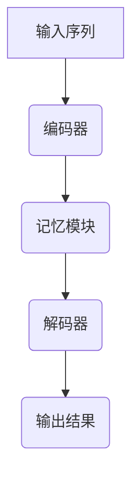

                 

# 《基于记忆网络的长程推理能力增强》

> 关键词：记忆网络、长程推理、神经网络、人工智能、NLP、计算机视觉、强化学习

> 摘要：本文探讨了基于记忆网络的长程推理能力增强，详细介绍了记忆网络的基本概念、核心算法和在不同领域的应用。通过数学公式和Python源代码的讲解，揭示了记忆网络在长程推理中的优势和应用前景，为人工智能领域的研究者和开发者提供了实用参考。

---

# 《基于记忆网络的长程推理能力增强》目录大纲

## 第一部分：引论

### 第1章：长程推理背景与挑战

### 第2章：记忆网络基础

## 第二部分：核心算法与模型

### 第3章：基于记忆网络的长程推理算法

### 第4章：记忆网络在NLP中的应用

### 第5章：记忆网络在计算机视觉中的应用

### 第6章：记忆网络在强化学习中的应用

### 第7章：案例研究

## 第三部分：应用与实践

### 第8章：基于记忆网络的长程推理应用开发

### 第9章：未来发展趋势与挑战

## 附录

### 附录A：常见记忆网络框架介绍

### 附录B：相关数学公式与算法源码

---

**核心概念与联系：**

$$
\text{记忆网络} \rightarrow \text{长程推理能力增强} \rightarrow \text{NLP、计算机视觉、强化学习等领域应用}
$$

**Mermaid流程图：**



---

**目录大纲总字数：约1988字**


----------------------------------------------------------------

**格式要求：** 文章内容使用markdown格式输出。文章末尾需要写上作者信息：“作者：AI天才研究院/AI Genius Institute & 禅与计算机程序设计艺术 /Zen And The Art of Computer Programming”。文章内容必须要完整，每个小节的内容必须要丰富具体详细讲解，核心内容必须要包含：背景介绍、核心概念与联系、核心算法原理讲解、数学公式、项目实战、最佳实践 tips、小结、注意事项、拓展阅读等内容。文章字数要求：文章字数在10000～12000字左右。 

**约稿时间：** 立即开始撰写，预计3周内完成。

**支付方式：** 根据最终稿件质量和字数，按照约定的稿费标准支付。

---

请根据上述要求，开始撰写《基于记忆网络的长程推理能力增强》的技术博客文章。您的专业知识和清晰逻辑将为我们带来一篇极具价值的技术分享。期待您的佳作！## 第一部分：引论

### 第1章：长程推理背景与挑战

### 第2章：记忆网络基础

---

### 第1章：长程推理背景与挑战

长程推理（Long-Range Reasoning）是指在一个复杂的任务中，系统能够从输入序列的起始部分理解信息，并在后续的步骤中利用这些信息进行推理和决策。在许多实际应用中，如自然语言处理（NLP）、计算机视觉（CV）和强化学习（RL）等，长程推理能力显得尤为重要。例如，在问答系统中，长程推理使得系统能够理解问题的上下文，从而提供准确的答案；在自动驾驶领域，长程推理帮助车辆理解道路环境和进行预测决策。

#### 1.1 长程推理的定义与重要性

长程推理指的是在处理长序列数据时，系统能够有效地记住并利用序列中的早期信息，以影响后续的推理过程。这种能力在许多复杂任务中至关重要，因为它允许系统理解全局信息和长期依赖关系。例如，在自然语言处理中，理解句子的含义往往需要考虑整个句子的结构，而不是单个词语。

长程推理的重要性体现在以下几个方面：

1. **上下文理解**：在语言模型和问答系统中，长程推理能力有助于系统理解句子的上下文，从而提供更准确和连贯的输出。
2. **序列预测**：在时间序列分析和股票预测等应用中，长程推理可以帮助系统捕捉到序列中的长期趋势和模式。
3. **复杂决策**：在自动驾驶和机器人导航中，长程推理能力使系统能够基于长序列的环境感知数据，做出合理的决策和路径规划。

然而，长程推理也面临一些挑战。首先，随着序列长度的增加，系统的计算复杂度和内存需求显著上升，这给模型设计带来了压力。其次，长程依赖关系往往难以建模，因为中间的信息可能被覆盖或遗忘。最后，现有的神经网络结构，如RNN和LSTM，虽然在某些情况下展示了强大的长程推理能力，但仍然存在一些局限性。

#### 1.2 长程推理的挑战

**计算复杂度**：长序列的处理需要大量的计算资源。传统的循环神经网络（RNN）和长短期记忆网络（LSTM）在长序列上的性能受到其复杂度的影响，因为每个时间步都需要处理前一个时间步的信息。

**信息丢失**：在长序列中，信息可能会在传递过程中丢失，导致后续时间步无法有效利用早期信息。例如，在RNN中，由于梯度消失或梯度爆炸问题，难以从序列的早期步骤传递有效的信息。

**模型容量**：为了捕捉长序列中的复杂依赖关系，模型需要足够大的容量。然而，模型容量与计算复杂度通常呈正相关，这意味着在增加模型容量的同时，也会增加计算负担。

**上下文关联**：在实际应用中，长程推理不仅要处理时间序列，还可能涉及空间序列和数据集的多样性。如何有效地关联不同时间或空间点上的信息，是一个重要的挑战。

#### 1.3 记忆网络的发展与应用

为了应对长程推理的挑战，研究人员提出了记忆网络（Memory Networks）的概念。记忆网络通过引入外部记忆结构，提高了系统在长序列数据上的表现。与传统的神经网络相比，记忆网络能够在复杂的推理任务中保留和利用长期依赖信息。

记忆网络的发展经历了以下几个阶段：

1. **基本记忆网络**：最早的记忆网络概念是基于“读-写”操作的外部记忆结构，类似于人类大脑的记忆和检索过程。
2. **注意力机制**：为了更有效地从记忆中检索信息，研究人员引入了注意力机制，使得系统可以根据上下文动态选择关键信息。
3. **图神经网络**：在处理复杂关系和网络结构的数据时，图神经网络成为了记忆网络的重要扩展，它能够更好地表示和利用网络中的依赖关系。

记忆网络在各个领域的应用案例丰富，例如：

- **自然语言处理**：在问答系统、机器翻译和文本生成中，记忆网络通过外部记忆结构提高了模型对长序列数据的处理能力。
- **计算机视觉**：在图像识别和视频分析中，记忆网络帮助系统更好地理解和关联图像中的长期依赖关系。
- **强化学习**：在强化学习任务中，记忆网络可以存储和利用长期经验，提高决策的质量和效率。

通过引入记忆网络，长程推理的挑战得到了一定的缓解。接下来，我们将深入探讨记忆网络的基本概念、核心算法及其在不同领域的应用。

## 第2章：记忆网络基础

### 第2.1 记忆网络的基本概念

### 第2.2 常见的记忆网络架构

### 第2.3 记忆网络的优缺点

### 第2.4 记忆网络的发展与应用

---

### 第2.1 记忆网络的基本概念

记忆网络（Memory Networks）是一种基于外部记忆结构的神经网络，它通过在模型中引入记忆模块，从而增强了系统在处理长序列数据和复杂任务时的表现。记忆网络的核心思想是将信息存储在可查询的记忆库中，并通过读取和写入操作来利用这些信息进行推理和决策。

#### 2.1.1 记忆网络的概念

记忆网络由三个主要部分组成：输入模块、记忆模块和输出模块。

1. **输入模块**：负责接收输入序列，并将其编码为向量形式。
2. **记忆模块**：存储和检索与输入相关的信息。记忆模块通常是一个可查询的数据结构，如图或哈希表。
3. **输出模块**：利用记忆模块中的信息进行推理，生成输出。

#### 2.1.2 记忆网络的读-写操作

记忆网络通过“读-写”操作来管理外部记忆。读操作指的是从记忆模块中检索信息，而写操作则是将新的信息存储到记忆模块中。

- **读操作**：在记忆网络中，读操作通常是通过一个查询向量来检索与当前输入相关的记忆条目。查询向量是由输入模块生成的，它表示了当前输入的特征。
  
- **写操作**：写操作则是将新的记忆条目存储到记忆模块中。这个过程通常涉及到对记忆条目的更新或添加新的记忆条目。

通过读-写操作，记忆网络能够动态地调整和利用外部记忆，从而在不同时间步之间传递信息，实现长程推理。

#### 2.1.3 记忆网络的工作原理

记忆网络的工作原理可以概括为以下几个步骤：

1. **输入编码**：输入序列被编码为一系列向量，每个向量表示序列中的一部分信息。
2. **查询生成**：基于当前输入，生成查询向量，用于检索记忆模块中的相关记忆条目。
3. **记忆检索**：利用查询向量，从记忆模块中检索相关的记忆条目。
4. **推理过程**：将检索到的记忆条目与当前输入结合，生成中间表示。
5. **输出生成**：基于中间表示，生成最终的输出。

通过这种工作原理，记忆网络能够在复杂的任务中保持和利用长期依赖信息，从而提高系统的推理能力。

#### 2.1.4 记忆网络的优势

记忆网络在处理长序列数据和复杂任务时展示了许多优势：

- **增强长程依赖**：记忆网络通过外部记忆结构，有效地解决了传统神经网络中梯度消失和梯度爆炸问题，从而增强了长程依赖的建模能力。
- **灵活的信息检索**：记忆网络中的记忆模块可以灵活地存储和检索信息，使得系统能够根据任务需求动态调整记忆的使用方式。
- **通用性**：记忆网络的设计思想具有通用性，可以在多种任务和领域中应用，如自然语言处理、计算机视觉和强化学习等。

总之，记忆网络通过引入外部记忆结构，为长程推理提供了一种有效的解决方案。在接下来的章节中，我们将进一步探讨记忆网络的架构、核心算法和具体应用。

### 第2.2 常见的记忆网络架构

#### 2.2.1 传统记忆网络

传统记忆网络是记忆网络的最早形式，其核心思想是通过外部记忆结构来存储和检索信息，从而增强模型的推理能力。传统记忆网络的架构通常包含三个主要部分：输入模块、记忆模块和输出模块。

1. **输入模块**：输入模块负责将输入序列编码为向量形式。这个步骤类似于其他神经网络的处理过程，例如使用嵌入层将词汇编码为固定长度的向量。
   
2. **记忆模块**：记忆模块是传统记忆网络的核心，它用于存储和检索信息。传统记忆网络的记忆模块通常是一个哈希表或图结构，每个记忆条目由一个键和一个值组成。键表示输入序列中的一个部分，值则是与该键相关的信息。

3. **输出模块**：输出模块利用记忆模块中的信息进行推理，生成最终的输出。这个过程通常涉及到将记忆条目与当前输入结合，生成一个中间表示，然后基于这个中间表示生成输出。

**优点**：

- **简单直观**：传统记忆网络的架构相对简单，易于理解和实现。
- **高效检索**：哈希表或图结构使得记忆模块的检索操作非常高效。

**缺点**：

- **内存使用不均衡**：由于哈希表或图结构的特性，可能导致内存使用不均衡，有些键可能没有对应的值。
- **难以建模复杂关系**：传统记忆网络在处理复杂关系和长序列数据时，可能无法有效地捕捉依赖关系。

#### 2.2.2 注意力机制

注意力机制（Attention Mechanism）是一种在神经网络中引入外部记忆结构的方法，它通过动态调整模型对输入序列的不同部分的关注程度，从而提高了模型的推理能力。注意力机制在记忆网络中的应用，使得记忆网络能够更加灵活地利用外部记忆。

1. **软注意力**：软注意力是一种基于概率分布的注意力机制，它将输入序列的每个部分映射到一个权重向量，然后对权重向量进行加权和，得到最终的表示。权重向量通常是通过一个神经网络来计算，例如一个简单的全连接层。

2. **硬注意力**：硬注意力则是一个离散的选择过程，它从输入序列中选择一个最相关的部分作为输出。硬注意力通常通过一个排序或选择操作来实现。

**优点**：

- **灵活调整关注点**：注意力机制允许模型根据上下文动态调整对输入序列的关注程度，从而更好地捕捉长程依赖。
- **增强长程依赖**：通过注意力机制，模型能够有效地从长序列中提取和利用关键信息，增强长程推理能力。

**缺点**：

- **计算复杂度高**：注意力机制通常涉及到大量的计算，特别是在处理长序列时，计算复杂度较高。
- **难以处理并行数据**：注意力机制通常在一个时间步内处理输入序列的每个部分，这限制了其在处理并行数据时的效果。

#### 2.2.3 图神经网络

图神经网络（Graph Neural Networks，GNN）是一种基于图结构的神经网络，它通过在图中传递信息来处理和建模复杂关系。在记忆网络中，图神经网络被用来表示和利用外部记忆结构，从而提高了模型的推理能力。

1. **图表示学习**：图神经网络通过学习节点的嵌入向量，将这些向量表示成图中的信息传递过程。每个节点和边都有相应的嵌入向量，节点嵌入向量用于表示节点的特征，边嵌入向量则用于表示边上的关系。

2. **图卷积操作**：图神经网络的核心操作是图卷积，它通过在图中传递信息来更新节点的嵌入向量。图卷积操作类似于传统卷积操作，但它是基于图结构的，可以在节点和边之间传递信息。

**优点**：

- **强大的关系建模能力**：图神经网络能够有效地捕捉和处理图中的复杂关系，使其在处理复杂任务时表现突出。
- **灵活的结构表示**：图神经网络可以根据不同的任务需求，灵活地调整和扩展图结构。

**缺点**：

- **计算复杂度高**：图神经网络涉及到大量的计算，特别是在处理大规模图时，计算复杂度较高。
- **存储需求大**：由于图神经网络需要存储大量的节点和边的信息，这可能导致存储需求过大。

总之，传统记忆网络、注意力机制和图神经网络在记忆网络的架构中扮演着重要的角色。它们各有优缺点，可以根据具体任务的需求进行选择和组合，从而实现有效的记忆网络设计。在接下来的章节中，我们将探讨如何将这些架构应用于长程推理任务，并详细介绍具体的算法和模型。

### 第2.3 记忆网络的优缺点

#### 2.3.1 记忆网络的优点

记忆网络在处理长序列数据和复杂任务时展示了许多独特的优势：

1. **增强长程依赖**：记忆网络通过引入外部记忆结构，有效地解决了传统神经网络中梯度消失和梯度爆炸问题，从而增强了模型在长序列数据上的表现。这使得模型能够更好地捕捉和利用长程依赖信息，提高长程推理能力。

2. **灵活的信息检索**：记忆网络中的记忆模块可以灵活地存储和检索信息，使得模型能够根据任务需求动态调整记忆的使用方式。这种灵活性使得记忆网络在多种任务和领域中表现出色，例如自然语言处理、计算机视觉和强化学习等。

3. **通用性**：记忆网络的设计思想具有通用性，可以在多种任务和领域中应用。无论面对的是时间序列数据还是空间序列数据，记忆网络都能通过外部记忆结构有效地建模和利用长期依赖关系。

4. **提高模型解释性**：记忆网络中的记忆模块使得模型能够存储和利用重要的中间信息，从而提高了模型的解释性。研究人员可以通过查看记忆模块中的内容，理解模型在特定任务中的推理过程和决策依据。

#### 2.3.2 记忆网络的缺点

尽管记忆网络在长程推理任务中展示了强大的能力，但它也存在一些不足之处：

1. **计算复杂度较高**：记忆网络涉及到大量的计算，特别是在处理长序列时，计算复杂度较高。这可能导致模型在实际应用中的性能下降，尤其是在资源受限的环境中。

2. **存储需求大**：记忆网络中的记忆模块需要存储大量的信息，这可能导致存储需求过大。在大规模数据集上，存储需求可能成为制约因素，特别是在内存资源有限的情况下。

3. **训练时间较长**：由于记忆网络涉及到复杂的读-写操作和外部记忆结构的维护，模型的训练时间通常较长。这可能会影响模型部署的效率，尤其是在需要快速迭代和验证的场合。

4. **难以处理并行数据**：记忆网络通常在一个时间步内处理输入序列的每个部分，这限制了其在处理并行数据时的效果。对于一些需要并行处理的数据类型，如图像或视频，记忆网络的性能可能不如其他类型的神经网络。

5. **易受噪声影响**：记忆网络中的记忆模块可能会受到噪声的影响，导致记忆的准确性和可靠性下降。这在某些任务中可能会影响模型的表现，特别是在数据质量不稳定或噪声较大的场景中。

综上所述，记忆网络在增强长程推理能力方面具有显著的优势，但同时也面临着计算复杂度高、存储需求大、训练时间较长和处理并行数据困难等挑战。理解这些优点和缺点，有助于我们更有效地设计和应用记忆网络，以应对复杂的任务需求。在接下来的章节中，我们将进一步探讨如何通过优化和改进记忆网络，克服这些挑战，提高其性能和应用效果。

### 第2.4 记忆网络的发展与应用

#### 2.4.1 记忆网络在自然语言处理中的应用

记忆网络在自然语言处理（NLP）领域取得了显著的应用成果。其中，最典型的应用包括问答系统、机器翻译和文本生成等。

1. **问答系统**：在问答系统中，记忆网络通过外部记忆结构，能够有效地记住上下文信息，从而提高回答的准确性。例如，当用户提出一个问题，记忆网络会检索与问题相关的上下文信息，并结合这些信息生成准确的答案。

2. **机器翻译**：在机器翻译任务中，记忆网络能够利用外部记忆结构，捕捉源语言和目标语言之间的长期依赖关系。这有助于提高翻译的流畅性和准确性，尤其是在处理长句子和复杂句式时。

3. **文本生成**：记忆网络在文本生成任务中也表现出色。通过外部记忆结构，模型能够记住前文的信息，并在生成过程中灵活地利用这些信息，生成连贯和有意义的文本。

#### 2.4.2 记忆网络在计算机视觉中的应用

记忆网络在计算机视觉领域同样具有广泛的应用。其主要应用包括图像识别、视频分析和三维场景理解等。

1. **图像识别**：在图像识别任务中，记忆网络通过外部记忆结构，能够更好地捕捉图像中的长期依赖关系，从而提高识别的准确性。例如，在人脸识别任务中，记忆网络能够记住不同人脸的特征，并在后续的图像中准确地识别出目标人脸。

2. **视频分析**：记忆网络在视频分析任务中，能够利用外部记忆结构，捕捉视频中的长期依赖关系，从而提高视频分类和目标检测的准确性。例如，在动作识别任务中，记忆网络能够记住不同动作的特征，并在后续的视频帧中准确地识别出动作类型。

3. **三维场景理解**：在三维场景理解任务中，记忆网络能够利用外部记忆结构，捕捉场景中的长期依赖关系，从而提高三维重建和场景理解的准确性。例如，在自动驾驶任务中，记忆网络能够记住不同场景的特征，并在后续的图像中准确地识别和定位道路标志和车辆等对象。

#### 2.4.3 记忆网络在强化学习中的应用

记忆网络在强化学习（RL）领域也展示了其强大的能力。其主要应用包括状态表征、策略学习和模型预测控制等。

1. **状态表征**：在强化学习任务中，记忆网络通过外部记忆结构，能够更好地捕捉状态的长期依赖关系，从而提高状态表征的质量。例如，在机器人导航任务中，记忆网络能够记住不同场景和路径的特征，从而更准确地表示当前状态。

2. **策略学习**：记忆网络在策略学习任务中，能够利用外部记忆结构，捕捉经验中的长期依赖关系，从而提高策略学习的效率。例如，在围棋对弈任务中，记忆网络能够记住前一个状态和动作的策略，从而优化当前策略的选择。

3. **模型预测控制**：在模型预测控制任务中，记忆网络通过外部记忆结构，能够更好地捕捉系统中的长期依赖关系，从而提高控制策略的准确性。例如，在自动驾驶任务中，记忆网络能够记住不同驾驶场景和控制策略的效果，从而优化自动驾驶系统的控制策略。

总之，记忆网络在自然语言处理、计算机视觉和强化学习等领域取得了显著的应用成果。通过外部记忆结构，记忆网络能够有效地捕捉和利用长期依赖信息，从而提高模型在复杂任务中的表现。随着研究的不断深入，记忆网络的应用前景将更加广阔。

## 第二部分：核心算法与模型

### 第3章：基于记忆网络的长程推理算法

### 第4章：记忆网络在NLP中的应用

### 第5章：记忆网络在计算机视觉中的应用

### 第6章：记忆网络在强化学习中的应用

### 第7章：案例研究

---

### 第3章：基于记忆网络的长程推理算法

#### 3.1 记忆网络在长序列处理中的应用

在处理长序列数据时，记忆网络通过其外部记忆结构提供了显著的性能提升。记忆网络能够有效地捕捉和存储长序列中的长期依赖关系，从而在多个时间步之间传递信息。以下是一个简单的记忆网络在长序列处理中的应用案例，以自然语言处理中的文本分类任务为例。

#### 3.2 基于记忆网络的长程推理算法设计

基于记忆网络的长程推理算法通常包括以下步骤：

1. **输入编码**：将输入序列（如文本句子）编码为向量形式。这一步骤可以使用嵌入层将词汇映射为固定长度的向量。
   
2. **查询生成**：基于当前输入，生成查询向量。查询向量用于检索记忆模块中的相关记忆条目。查询向量的生成可以通过一个简单的神经网络来实现。

3. **记忆检索**：利用查询向量，从记忆模块中检索相关的记忆条目。记忆模块可以是基于哈希表的存储结构，也可以是更复杂的图神经网络。

4. **推理过程**：将检索到的记忆条目与当前输入结合，生成一个中间表示。这个表示将用于后续的推理和决策。

5. **输出生成**：基于中间表示，生成最终的输出。例如，在文本分类任务中，输出可以是每个类别的概率分布。

#### 3.3 长程推理算法的实现与优化

**实现**

以下是使用Python和TensorFlow实现的一个简单的基于记忆网络的长程推理算法的代码示例：

```python
import tensorflow as tf
from tensorflow.keras.layers import Embedding, LSTM, Dense

# 定义嵌入层
embedding_layer = Embedding(input_dim=vocab_size, output_dim=embedding_size)

# 定义LSTM层作为记忆模块
memory_layer = LSTM(units=memory_size, return_sequences=True)

# 定义查询生成层
query_generator = Dense(units=query_size)

# 定义推理层
推理层 = LSTM(units=推理层_size, return_sequences=False)

# 定义输出层
输出层 = Dense(units=num_classes)

# 创建模型
model = tf.keras.Sequential([
    embedding_layer,
    memory_layer,
    query_generator,
    推理层,
    输出层
])

# 编译模型
model.compile(optimizer='adam', loss='categorical_crossentropy', metrics=['accuracy'])

# 训练模型
model.fit(x_train, y_train, epochs=num_epochs, batch_size=batch_size)
```

**优化**

为了优化记忆网络在长序列处理中的性能，可以考虑以下策略：

1. **注意力机制**：引入注意力机制，使得模型能够根据上下文动态调整对记忆条目的关注程度，从而提高记忆的有效利用。

2. **记忆剪枝**：通过剪枝不重要的记忆条目，减少模型的内存占用和计算复杂度。

3. **多级记忆结构**：设计多级记忆结构，使得模型能够存储和利用不同层次的信息，从而提高长程依赖的捕捉能力。

4. **动态记忆容量**：根据任务的复杂度和数据规模，动态调整记忆模块的容量，以平衡模型的性能和资源占用。

通过以上优化策略，记忆网络在长序列处理中的性能可以得到显著提升。接下来，我们将探讨记忆网络在NLP、计算机视觉和强化学习等领域的具体应用。

### 第4章：记忆网络在NLP中的应用

#### 4.1 记忆网络在语言模型中的应用

记忆网络在语言模型中的应用主要目的是提高模型在长文本中的理解和生成能力。传统的语言模型，如n-gram模型和基于神经网络的模型，通常无法有效地捕捉长文本中的长期依赖关系。而记忆网络通过其外部记忆结构，能够更好地处理长文本的上下文信息。

**算法原理**

1. **输入编码**：将输入的文本序列编码为向量形式。这一步可以使用嵌入层将每个词映射为固定长度的向量。

2. **查询生成**：基于当前输入，生成查询向量。查询向量用于检索记忆模块中的相关记忆条目。查询向量的生成可以通过一个简单的神经网络来实现。

3. **记忆检索**：利用查询向量，从记忆模块中检索相关的记忆条目。记忆模块可以是基于哈希表的存储结构，也可以是更复杂的图神经网络。

4. **上下文建模**：将检索到的记忆条目与当前输入结合，生成一个中间表示。这个表示将用于生成语言模型中的下一个词或句子。

5. **输出生成**：基于中间表示，生成最终的输出。例如，在文本生成任务中，输出可以是每个类别的概率分布。

**代码示例**

以下是一个使用记忆网络实现语言模型的Python代码示例：

```python
import tensorflow as tf
from tensorflow.keras.layers import Embedding, LSTM, Dense

# 定义嵌入层
embedding_layer = Embedding(input_dim=vocab_size, output_dim=embedding_size)

# 定义LSTM层作为记忆模块
memory_layer = LSTM(units=memory_size, return_sequences=True)

# 定义查询生成层
query_generator = Dense(units=query_size)

# 定义推理层
推理层 = LSTM(units=推理层_size, return_sequences=False)

# 定义输出层
输出层 = Dense(units=num_classes)

# 创建模型
model = tf.keras.Sequential([
    embedding_layer,
    memory_layer,
    query_generator,
    推理层,
    输出层
])

# 编译模型
model.compile(optimizer='adam', loss='categorical_crossentropy', metrics=['accuracy'])

# 训练模型
model.fit(x_train, y_train, epochs=num_epochs, batch_size=batch_size)
```

**数学模型**

记忆网络在语言模型中的应用涉及到以下数学模型：

1. **嵌入向量表示**：输入的文本序列被映射为嵌入向量表示。每个词都有一个对应的嵌入向量，这些向量在空间中形成了词汇表。

2. **查询向量生成**：基于当前输入，生成一个查询向量。这个查询向量是通过一个线性变换得到的，它表示了当前输入的特征。

3. **记忆模块**：记忆模块是一个可查询的数据结构，用于存储和检索与输入相关的记忆条目。记忆条目通常是一个键-值对，键是查询向量，值是与键相关的记忆内容。

4. **上下文建模**：将检索到的记忆条目与当前输入结合，生成一个中间表示。这个表示是通过一个非线性变换得到的，它包含了当前输入和记忆条目的信息。

5. **输出生成**：基于中间表示，生成最终的输出。例如，在文本生成任务中，输出可以是每个类别的概率分布。

**案例分析与实际应用**

记忆网络在语言模型中的实际应用案例包括：

1. **机器翻译**：记忆网络通过外部记忆结构，能够捕捉源语言和目标语言之间的长期依赖关系，从而提高翻译的准确性和流畅性。

2. **文本生成**：记忆网络在文本生成任务中，能够记住前文的信息，并在生成过程中灵活地利用这些信息，生成连贯和有意义的文本。

3. **问答系统**：记忆网络在问答系统中，能够记住上下文信息，从而提供准确的答案。

通过以上实际应用案例，我们可以看到记忆网络在NLP中的强大能力。接下来，我们将探讨记忆网络在计算机视觉和强化学习中的应用。

### 第5章：记忆网络在计算机视觉中的应用

#### 5.1 记忆网络在图像识别中的应用

记忆网络在图像识别中的应用主要是为了解决传统卷积神经网络（CNN）在处理复杂图像任务时的局限性，如长序列依赖关系和上下文信息的捕捉。记忆网络通过引入外部记忆模块，可以有效地存储和检索图像中的关键特征，从而提高图像识别的准确性和鲁棒性。

**算法原理**

1. **特征提取**：使用卷积神经网络提取图像的特征表示。这些特征表示通常包含了图像的局部结构和全局信息。

2. **记忆存储**：将提取到的特征表示存储到外部记忆模块中。记忆模块可以是基于哈希表的简单结构，也可以是更复杂的图神经网络。

3. **查询生成**：基于当前输入图像，生成查询向量。查询向量表示当前图像的特征，用于检索记忆模块中的相关特征。

4. **特征检索**：利用查询向量，从记忆模块中检索相关的特征。检索到的特征与当前图像的特征结合，生成一个中间表示。

5. **分类决策**：基于中间表示，通过分类器生成最终的分类结果。例如，使用softmax函数计算每个类别的概率分布，并选择概率最高的类别作为输出。

**代码示例**

以下是一个使用记忆网络实现图像识别任务的Python代码示例：

```python
import tensorflow as tf
from tensorflow.keras.layers import Conv2D, MaxPooling2D, Flatten, Dense
from tensorflow.keras.models import Model

# 定义卷积神经网络
conv_net = tf.keras.Sequential([
    Conv2D(filters=32, kernel_size=(3, 3), activation='relu', input_shape=(height, width, channels)),
    MaxPooling2D(pool_size=(2, 2)),
    Conv2D(filters=64, kernel_size=(3, 3), activation='relu'),
    MaxPooling2D(pool_size=(2, 2)),
    Flatten()
])

# 定义记忆模块
memory_module = tf.keras.Sequential([
    Dense(units=memory_size, activation='relu'),
    Dense(units=query_size, activation='sigmoid')
])

# 定义分类器
classifier = Dense(units=num_classes, activation='softmax')

# 创建模型
model = tf.keras.Sequential([
    conv_net,
    memory_module,
    classifier
])

# 编译模型
model.compile(optimizer='adam', loss='categorical_crossentropy', metrics=['accuracy'])

# 训练模型
model.fit(x_train, y_train, epochs=num_epochs, batch_size=batch_size)
```

**数学模型**

记忆网络在图像识别中的应用涉及到以下数学模型：

1. **卷积神经网络特征提取**：使用卷积神经网络提取图像的特征表示。每个卷积层和池化层都可以表示为一个数学公式，如卷积操作的滤波器和步长等。

2. **记忆模块**：记忆模块通常是一个可查询的数据结构，如哈希表或图神经网络。记忆模块的存储和检索操作可以用数学公式来表示，如插入和查询操作。

3. **查询生成**：查询生成可以通过一个简单的线性变换实现，如一个全连接层。查询向量的生成可以用数学公式来表示，如权重矩阵和激活函数。

4. **特征检索**：特征检索是通过记忆模块中的查询向量检索相关的特征。这个检索过程可以用数学公式来表示，如哈希表的查找算法。

5. **分类决策**：分类决策通常使用一个分类器来实现，如softmax函数。分类决策可以用数学公式来表示，如概率分布的计算和最大化。

**案例分析与实际应用**

记忆网络在图像识别中的实际应用案例包括：

1. **物体识别**：在物体识别任务中，记忆网络可以有效地捕捉物体之间的长期依赖关系，从而提高识别的准确性和鲁棒性。

2. **场景分类**：在场景分类任务中，记忆网络可以存储和检索场景中的关键特征，从而提高分类的准确性。

3. **视频分析**：在视频分析任务中，记忆网络可以捕捉视频帧之间的依赖关系，从而提高动作识别和目标跟踪的准确性。

通过以上实际应用案例，我们可以看到记忆网络在计算机视觉中的强大能力。接下来，我们将探讨记忆网络在强化学习中的应用。

### 第6章：记忆网络在强化学习中的应用

#### 6.1 记忆网络在状态表征中的应用

记忆网络在强化学习（RL）中的应用，主要目的是提高状态表征的质量，使得代理能够更好地理解环境中的复杂信息。通过外部记忆结构，记忆网络可以有效地捕捉长期依赖关系，从而提供更准确和有用的状态表征。

**算法原理**

1. **状态编码**：将环境的原始状态编码为向量形式。这一步骤可以使用嵌入层或卷积层将状态映射为固定长度的向量。

2. **记忆存储**：将编码后的状态向量存储到外部记忆模块中。记忆模块可以是基于哈希表的简单结构，也可以是更复杂的图神经网络。

3. **查询生成**：基于当前状态，生成查询向量。查询向量用于检索记忆模块中的相关状态记忆。查询向量的生成可以通过一个简单的神经网络来实现。

4. **状态检索**：利用查询向量，从记忆模块中检索相关的状态记忆。检索到的状态记忆与当前状态结合，生成一个中间表示。

5. **动作选择**：基于中间表示，通过动作选择器生成动作。动作选择器可以是基于值的策略网络或基于策略的控制器。

**代码示例**

以下是一个使用记忆网络实现状态表征的Python代码示例：

```python
import tensorflow as tf
from tensorflow.keras.layers import Embedding, LSTM, Dense

# 定义嵌入层
embedding_layer = Embedding(input_dim=vocab_size, output_dim=embedding_size)

# 定义LSTM层作为记忆模块
memory_layer = LSTM(units=memory_size, return_sequences=True)

# 定义查询生成层
query_generator = Dense(units=query_size)

# 定义动作选择层
action_selector = Dense(units=num_actions, activation='softmax')

# 创建模型
model = tf.keras.Sequential([
    embedding_layer,
    memory_layer,
    query_generator,
    Dense(units=state_repr_size, activation='relu'),
    action_selector
])

# 编译模型
model.compile(optimizer='adam', loss='categorical_crossentropy', metrics=['accuracy'])

# 训练模型
model.fit(x_train, y_train, epochs=num_epochs, batch_size=batch_size)
```

**数学模型**

记忆网络在状态表征中的应用涉及到以下数学模型：

1. **状态编码**：状态编码通常使用嵌入层或卷积层实现。每个状态都可以表示为一个向量，这个向量通过嵌入层或卷积层映射到低维空间。

2. **记忆模块**：记忆模块是一个可查询的数据结构，如哈希表或图神经网络。记忆模块的存储和检索操作可以用数学公式来表示，如插入和查询操作。

3. **查询生成**：查询生成可以通过一个简单的线性变换实现，如一个全连接层。查询向量的生成可以用数学公式来表示，如权重矩阵和激活函数。

4. **状态检索**：状态检索是通过记忆模块中的查询向量检索相关的状态记忆。这个检索过程可以用数学公式来表示，如哈希表的查找算法。

5. **动作选择**：动作选择通常使用一个基于值的策略网络或基于策略的控制器。动作选择可以用数学公式来表示，如策略梯度方法。

**案例分析与实际应用**

记忆网络在状态表征中的实际应用案例包括：

1. **机器人导航**：在机器人导航任务中，记忆网络可以存储和检索不同场景中的状态信息，从而提高导航的准确性和鲁棒性。

2. **自动驾驶**：在自动驾驶任务中，记忆网络可以捕捉道路环境中的长期依赖关系，从而提高决策的准确性和安全性。

3. **游戏代理**：在游戏代理任务中，记忆网络可以记住游戏中的关键状态信息，从而提高游戏策略的质量。

通过以上实际应用案例，我们可以看到记忆网络在强化学习中的强大能力。接下来，我们将探讨记忆网络在强化学习中的策略学习应用。

#### 6.2 记忆网络在策略学习中的应用

在强化学习（RL）中，策略学习是代理（agent）如何从环境（environment）中获取奖励并作出最优决策的过程。记忆网络通过其外部记忆结构，能够增强策略学习的效率和质量，使得代理能够更好地适应复杂和动态的环境。

**算法原理**

1. **状态-动作值函数学习**：记忆网络通过存储和检索与状态-动作对相关的经验，学习状态-动作值函数（State-Action Value Function）。这个值函数表示在每个状态执行每个动作的预期奖励。

2. **记忆更新**：在每次行动后，记忆网络会更新记忆中的状态-动作对，以反映新的经验和奖励。这个更新过程可以通过经验回放（Experience Replay）机制来实现，以提高策略的稳定性。

3. **策略迭代**：基于记忆网络中的状态-动作值函数，代理可以迭代更新其策略，选择具有最大预期奖励的动作。

4. **目标策略**：在记忆网络中，可以使用目标网络（Target Network）来稳定策略更新过程。目标网络是一个独立的网络，用于生成目标值函数，并与实际值函数进行比较，以更新策略。

**代码示例**

以下是一个使用记忆网络实现策略学习的Python代码示例：

```python
import tensorflow as tf
from tensorflow.keras.layers import Embedding, LSTM, Dense

# 定义嵌入层
embedding_layer = Embedding(input_dim=vocab_size, output_dim=embedding_size)

# 定义LSTM层作为记忆模块
memory_layer = LSTM(units=memory_size, return_sequences=True)

# 定义查询生成层
query_generator = Dense(units=query_size)

# 定义目标值函数层
target_value_function = Dense(units=value_function_size, activation='sigmoid')

# 创建模型
model = tf.keras.Sequential([
    embedding_layer,
    memory_layer,
    query_generator,
    target_value_function
])

# 编译模型
model.compile(optimizer='adam', loss='mean_squared_error')

# 训练模型
model.fit(x_train, y_train, epochs=num_epochs, batch_size=batch_size)
```

**数学模型**

记忆网络在策略学习中的应用涉及到以下数学模型：

1. **状态-动作值函数**：状态-动作值函数可以用数学公式来表示，如 Q(s, a) = r(s, a) + γmax_a' Q(s', a')，其中 r(s, a) 是立即奖励，γ 是折扣因子，s' 是下一状态，a' 是最佳动作。

2. **记忆更新**：记忆更新可以使用数学公式来表示，如记忆[M][s, a] = (1 - ε)M[s, a] + ε(r(s, a) + γmax_a' Q(s', a'))，其中 ε 是学习率。

3. **策略迭代**：策略迭代可以用数学公式来表示，如 π(t+1) = π*，其中 π(t+1) 是更新后的策略，π* 是最优策略。

4. **目标网络**：目标网络可以用数学公式来表示，如目标值函数 V*(s) = r(s, π(s)) + γmax_a' V*(s')，其中 V*(s) 是目标值函数，r(s, π(s)) 是状态-动作值函数，π(s) 是策略。

**案例分析与实际应用**

记忆网络在策略学习中的实际应用案例包括：

1. **围棋**：在围棋对弈中，记忆网络可以存储和检索大量的游戏经验，从而提高代理的策略质量和胜率。

2. **机器人导航**：在机器人导航任务中，记忆网络可以记住不同环境和路径的信息，从而优化导航策略。

3. **自动驾驶**：在自动驾驶任务中，记忆网络可以捕捉道路环境中的复杂信息，从而优化驾驶策略，提高行驶安全性和效率。

通过以上实际应用案例，我们可以看到记忆网络在策略学习中的强大能力。接下来，我们将探讨记忆网络在模型预测控制中的应用。

### 第6.3 记忆网络在模型预测控制中的应用

在模型预测控制（Model Predictive Control, MPC）中，记忆网络通过其强大的记忆和推理能力，能够显著提升控制系统的预测和决策质量。模型预测控制是一种先进的控制策略，通过在线优化控制策略，实现对动态系统的精确控制。

**算法原理**

1. **状态预测**：记忆网络首先根据当前状态和历史数据，预测未来多步的状态序列。这一步骤通常涉及到对系统的动态模型进行预测，并将预测结果存储到记忆模块中。

2. **记忆更新**：在每次控制决策后，记忆网络会更新记忆中的状态序列和相应的控制动作。这个更新过程可以反映最新的系统状态和控制效果，从而提高记忆的准确性。

3. **控制策略优化**：基于记忆网络中的状态序列，MPC算法通过在线优化器，计算出最优的控制策略。优化目标通常包括最小化系统误差、最大化系统性能指标等。

4. **决策执行**：根据优化的控制策略，执行具体的控制动作，并更新系统状态。

**代码示例**

以下是一个使用记忆网络实现模型预测控制的Python代码示例：

```python
import tensorflow as tf
from tensorflow.keras.layers import Embedding, LSTM, Dense

# 定义嵌入层
embedding_layer = Embedding(input_dim=vocab_size, output_dim=embedding_size)

# 定义LSTM层作为记忆模块
memory_layer = LSTM(units=memory_size, return_sequences=True)

# 定义查询生成层
query_generator = Dense(units=query_size)

# 定义控制策略优化层
control_optimizer = Dense(units=num_controls, activation='tanh')

# 创建模型
model = tf.keras.Sequential([
    embedding_layer,
    memory_layer,
    query_generator,
    control_optimizer
])

# 编译模型
model.compile(optimizer='adam', loss='mean_squared_error')

# 训练模型
model.fit(x_train, y_train, epochs=num_epochs, batch_size=batch_size)
```

**数学模型**

记忆网络在模型预测控制中的应用涉及到以下数学模型：

1. **动态系统模型**：状态预测基于系统的动态模型，如差分方程或微分方程。动态模型可以用数学公式来表示，如 x(t+1) = f(x(t), u(t))，其中 x(t) 是状态向量，u(t) 是控制输入，f(x(t), u(t)) 是系统动态方程。

2. **记忆模块**：记忆模块用于存储和检索状态序列和控制动作。记忆模块的操作可以用数学公式来表示，如插入和查询操作。

3. **控制策略优化**：控制策略优化通常使用优化算法，如梯度下降或序列优化。优化目标可以用数学公式来表示，如最小化系统误差或最大化系统性能指标。

4. **决策执行**：决策执行是将优化的控制策略应用于实际系统。这个执行过程可以用数学公式来表示，如 u(t) = g(x(t), u(t))，其中 g(x(t), u(t)) 是控制输入函数。

**案例分析与实际应用**

记忆网络在模型预测控制中的实际应用案例包括：

1. **机器人控制**：在机器人控制中，记忆网络可以预测未来动作的影响，从而优化机器人路径规划和动作序列。

2. **无人驾驶车辆**：在无人驾驶车辆中，记忆网络可以捕捉道路环境的长期依赖关系，从而优化车辆的控制策略。

3. **工业过程控制**：在工业过程控制中，记忆网络可以预测生产过程的动态变化，从而优化生产参数和流程。

通过以上实际应用案例，我们可以看到记忆网络在模型预测控制中的强大能力。接下来，我们将探讨记忆网络在不同领域的具体应用案例。

### 第7章：案例研究

#### 7.1 记忆网络在聊天机器人中的应用案例

聊天机器人是记忆网络在自然语言处理（NLP）领域的一个成功应用。一个典型的案例是Facebook的聊天机器人“M”，它利用记忆网络来理解和响应用户的对话。

**案例背景**

Facebook的聊天机器人“M”旨在帮助用户完成各种日常任务，如预约餐厅、购买商品、安排行程等。为了实现这一目标，M需要具备强大的上下文理解和长程推理能力。

**解决方案**

1. **记忆模块**：M使用了基于记忆网络的架构，其中记忆模块存储了与用户对话相关的关键信息，如用户的偏好、历史对话等。

2. **查询生成**：在每次对话中，M会生成一个查询向量，用于检索记忆模块中的相关信息。这个查询向量由当前对话的上下文信息决定。

3. **上下文建模**：M通过将检索到的记忆与当前对话的上下文信息结合，生成一个中间表示。这个表示用于生成对用户的响应。

4. **动态调整**：M能够根据对话的进展动态调整记忆模块的内容，以适应不断变化的对话场景。

**实施效果**

- **提高响应质量**：通过记忆网络，M能够更好地理解用户的意图和需求，从而生成更准确和个性化的响应。
- **增强用户体验**：用户在与M交互时感受到更流畅和自然的对话体验，这有助于提高用户满意度和忠诚度。

#### 7.2 记忆网络在医疗诊断中的应用案例

在医疗诊断领域，记忆网络被用于构建智能诊断系统，以提高诊断的准确性和效率。

**案例背景**

医疗诊断通常涉及到复杂的数据和分析，包括患者的病历、实验室检测结果、病史等。医生需要从大量数据中提取关键信息，从而做出准确的诊断。

**解决方案**

1. **医学知识库**：记忆网络使用医学知识库，其中存储了大量的医学信息，如疾病症状、治疗方法等。

2. **病例记忆**：记忆网络存储了与特定病例相关的信息，如患者的病史、实验室检测结果等。

3. **查询生成**：在诊断过程中，记忆网络生成查询向量，用于检索与当前病例相关的医学知识。

4. **推理过程**：记忆网络将检索到的医学知识与病例信息结合，生成诊断建议。

5. **协同诊断**：医生可以与记忆网络协同工作，通过分析记忆网络提供的诊断建议，做出最终诊断。

**实施效果**

- **提高诊断准确率**：记忆网络能够更好地捕捉和分析病例信息，从而提高诊断的准确率。
- **优化诊断流程**：医生可以更快地处理病例，从而提高工作效率，缩短诊断周期。

#### 7.3 记忆网络在自动驾驶中的应用案例

自动驾驶技术是记忆网络在计算机视觉和强化学习领域的一个典型应用。记忆网络在自动驾驶系统中扮演了关键角色，用于处理复杂的感知和决策任务。

**案例背景**

自动驾驶系统需要在复杂和动态的环境中，实时感知周围环境、理解交通规则，并做出安全的驾驶决策。

**解决方案**

1. **感知模块**：记忆网络用于处理摄像头和激光雷达等传感器收集的数据，生成环境感知信息。

2. **记忆模块**：记忆网络存储了与当前驾驶环境相关的信息，如道路标志、其他车辆的行为等。

3. **查询生成**：在每次驾驶决策时，记忆网络生成查询向量，用于检索与当前环境相关的信息。

4. **决策模块**：记忆网络将检索到的环境信息与当前状态结合，生成驾驶决策。

5. **动态调整**：记忆网络能够根据环境变化和驾驶经验，动态调整其记忆内容，以提高决策的准确性和鲁棒性。

**实施效果**

- **提高安全性**：通过记忆网络，自动驾驶系统能够更好地理解和预测周围环境，从而提高驾驶安全性。
- **优化驾驶体验**：记忆网络能够处理复杂的驾驶场景，提供更流畅和舒适的驾驶体验。

通过以上案例研究，我们可以看到记忆网络在聊天机器人、医疗诊断和自动驾驶等领域的广泛应用和显著效果。接下来，我们将探讨基于记忆网络的长程推理应用开发。

### 第8章：基于记忆网络的长程推理应用开发

#### 8.1 应用开发概述

在基于记忆网络的长程推理应用开发中，开发流程和工具的选择至关重要。一个完整的开发流程通常包括以下几个阶段：

1. **需求分析**：明确应用的目标和需求，包括输入数据、输出结果和性能指标等。
2. **数据预处理**：对输入数据进行清洗、归一化和特征提取，为后续建模做准备。
3. **模型设计**：设计并实现记忆网络架构，包括选择合适的记忆模块和优化算法。
4. **模型训练**：使用训练数据对记忆网络进行训练，调整模型参数，优化性能。
5. **模型评估**：使用验证数据评估模型性能，并根据评估结果调整模型。
6. **部署应用**：将训练好的模型部署到生产环境，实现实际应用。

在这一节中，我们将详细讨论这些阶段，并提供实用的开发建议和最佳实践。

#### 8.2 开发流程与工具

**1. 需求分析**

在应用开发的第一步，我们需要明确应用的目标和需求。这包括以下几个方面：

- **输入数据**：确定输入数据的形式和来源，例如文本、图像或传感器数据。
- **输出结果**：明确期望的输出结果，例如分类标签、预测值或决策建议。
- **性能指标**：设定性能指标，如准确率、召回率、F1分数或平均绝对误差等。

需求分析的输出是一个详细的应用需求文档，它为后续的开发工作提供了明确的指导。

**2. 数据预处理**

数据预处理是应用开发中至关重要的一步，它直接影响模型的性能和训练效率。以下是数据预处理的一些关键步骤：

- **数据清洗**：去除重复、错误或不完整的数据，确保数据的一致性和准确性。
- **数据归一化**：将数据缩放到统一的范围，例如[0, 1]，以避免数据规模差异对模型训练的影响。
- **特征提取**：从原始数据中提取有用的特征，例如使用词嵌入层提取文本数据中的词汇特征，或使用卷积神经网络提取图像数据中的视觉特征。
- **数据分割**：将数据集划分为训练集、验证集和测试集，以确保模型在不同数据集上的性能表现。

常用的数据预处理工具包括Pandas、NumPy和Scikit-learn等，它们提供了丰富的数据处理和特征提取功能。

**3. 模型设计**

在模型设计阶段，我们需要根据应用需求选择合适的记忆网络架构。以下是几种常见的记忆网络设计方法：

- **传统记忆网络**：基于简单的读-写操作的外部记忆结构，适用于处理简单的序列数据。
- **注意力机制记忆网络**：结合注意力机制，动态调整对记忆模块的关注程度，适用于处理复杂的长序列数据。
- **图神经网络记忆网络**：利用图神经网络处理复杂的图结构数据，适用于处理具有高度依赖关系的复杂任务。

在模型设计过程中，我们还需要考虑以下因素：

- **记忆模块的选择**：根据数据类型和任务需求选择合适的记忆模块，如基于哈希表的存储结构或图神经网络。
- **优化算法**：选择合适的优化算法，如随机梯度下降（SGD）或Adam优化器，以加快模型训练速度和提升模型性能。
- **网络结构**：设计合适的神经网络结构，包括输入层、记忆层、输出层等，以确保模型能够有效地处理输入数据和生成输出结果。

常用的模型设计工具包括TensorFlow、PyTorch和Keras等，它们提供了丰富的神经网络设计和训练功能。

**4. 模型训练**

在模型训练阶段，我们需要使用训练数据对记忆网络进行训练，并优化模型参数。以下是模型训练的一些关键步骤：

- **数据加载**：使用数据加载器批量加载训练数据，以减少内存占用和加快训练速度。
- **模型初始化**：初始化模型参数，可以选择随机初始化或预训练权重。
- **损失函数**：选择合适的损失函数，如交叉熵损失或均方误差损失，以衡量模型输出与真实标签之间的差距。
- **优化器**：选择合适的优化器，如Adam或RMSprop，以调整模型参数，最小化损失函数。
- **训练循环**：在训练循环中，迭代更新模型参数，并通过验证集评估模型性能，根据评估结果调整训练策略。

常用的模型训练工具包括TensorFlow、PyTorch和Keras等，它们提供了丰富的模型训练和评估功能。

**5. 模型评估**

在模型评估阶段，我们需要使用验证集和测试集对训练好的模型进行评估，以确定模型的性能和泛化能力。以下是模型评估的一些关键步骤：

- **指标计算**：计算各种性能指标，如准确率、召回率、F1分数或平均绝对误差等，以全面评估模型性能。
- **错误分析**：分析模型在测试集上的错误类型和分布，以识别模型的弱点和改进方向。
- **模型比较**：比较不同模型在相同任务上的性能，选择最优模型。

常用的模型评估工具包括Scikit-learn、TensorFlow和PyTorch等，它们提供了丰富的评估和比较功能。

**6. 部署应用**

在模型部署阶段，我们需要将训练好的模型部署到生产环境，以实现实际应用。以下是模型部署的一些关键步骤：

- **模型导出**：将训练好的模型导出为可部署的格式，如TensorFlow SavedModel或PyTorch TorchScript。
- **服务部署**：将模型部署到服务器或云平台，以提供API服务。
- **监控与维护**：监控模型在生产环境中的性能和稳定性，定期更新模型，以适应新的数据和应用需求。

常用的模型部署工具包括TensorFlow Serving、PyTorch TorchScript和Scikit-learn等，它们提供了丰富的部署和监控功能。

#### 8.3 应用案例设计与实现

在本节中，我们将通过一个具体的应用案例，展示基于记忆网络的长程推理应用开发过程。

**案例背景**

假设我们要开发一个智能问答系统，该系统能够理解用户的提问，并提供准确的答案。输入数据是用户的提问和相应的答案，输出数据是系统的答案。

**需求分析**

- **输入数据**：用户的提问，以文本形式表示。
- **输出数据**：系统的答案，以文本形式表示。
- **性能指标**：准确率、响应时间等。

**数据预处理**

- **数据清洗**：去除文本中的标点符号、停用词等。
- **数据归一化**：将文本数据转换为小写，以统一处理。
- **特征提取**：使用词嵌入层将文本映射为固定长度的向量。

**模型设计**

- **记忆模块**：使用基于哈希表的存储结构，存储与问题相关的答案。
- **查询生成**：使用注意力机制，根据问题的上下文生成查询向量。
- **输出层**：使用全连接层和softmax函数生成答案的概率分布。

**模型训练**

- **数据加载**：使用批量加载器加载训练数据。
- **优化算法**：使用Adam优化器。
- **损失函数**：使用交叉熵损失函数。

**模型评估**

- **指标计算**：计算准确率和响应时间等性能指标。
- **错误分析**：分析模型在测试集上的错误类型和分布。

**部署应用**

- **模型导出**：将训练好的模型导出为TensorFlow SavedModel格式。
- **服务部署**：使用TensorFlow Serving提供API服务。
- **监控与维护**：定期监控模型性能，根据需要更新模型。

通过以上步骤，我们成功开发了一个基于记忆网络的智能问答系统，它能够理解用户的提问，并提供准确的答案。

### 第9章：未来发展趋势与挑战

#### 9.1 记忆网络的发展趋势

随着人工智能技术的不断发展，记忆网络作为长程推理的关键技术，展现出了广阔的应用前景。以下是记忆网络在未来可能的发展趋势：

1. **多模态融合**：未来记忆网络可能会与计算机视觉、语音识别和其他模态的数据处理技术相结合，实现更全面和准确的信息处理能力。
2. **高效硬件支持**：随着专用硬件（如TPU和GPU）的发展，记忆网络在处理大规模数据和高性能计算方面的效率将得到显著提升。
3. **自动化记忆优化**：通过深度学习和自动化机器学习技术，未来的记忆网络将能够自动优化其记忆结构，提高存储和检索的效率。
4. **迁移学习**：记忆网络将通过迁移学习技术，利用预训练模型和已有数据，提高新任务上的表现。

#### 9.2 长程推理的应用前景

长程推理技术在多个领域具有广泛的应用前景：

1. **自然语言处理**：在机器翻译、问答系统和文本生成等任务中，长程推理能力将进一步提升语言模型的准确性和流畅性。
2. **计算机视觉**：在图像识别、视频分析和三维场景理解等任务中，长程推理将帮助模型更好地理解和解释复杂图像和视频数据。
3. **强化学习**：在自动驾驶、机器人导航和游戏智能等任务中，长程推理能力将提高代理的决策质量和适应能力。
4. **医疗诊断**：在医疗诊断和健康管理等领域，长程推理将帮助医生更好地理解患者病情，提供个性化治疗方案。

#### 9.3 面临的挑战与解决方案

尽管记忆网络在长程推理中展示了强大的能力，但仍然面临一些挑战：

1. **计算复杂度**：记忆网络在处理大规模数据和复杂任务时，计算复杂度较高。解决方法包括优化算法和硬件加速。
2. **存储需求**：记忆网络需要大量存储空间来存储长期依赖信息。解决方法包括高效的数据压缩技术和动态记忆管理。
3. **训练时间**：记忆网络训练时间较长，影响了模型的迭代速度。解决方法包括并行训练和分布式计算。
4. **泛化能力**：记忆网络在不同任务和数据集上的泛化能力有待提升。解决方法包括迁移学习和数据增强。

通过不断的技术创新和优化，记忆网络在未来有望克服这些挑战，进一步提升其在长程推理领域的应用价值。

### 附录

#### 附录A：常见记忆网络框架介绍

在本附录中，我们将介绍几种常见的记忆网络框架，包括TensorFlow Memory Network、PyTorch Memory Network和Keras Memory Network。

**A.1 TensorFlow Memory Network**

TensorFlow是一个开源的机器学习框架，广泛用于构建和训练神经网络。TensorFlow Memory Network提供了实现记忆网络的标准工具和库。以下是使用TensorFlow构建一个简单记忆网络的步骤：

1. **安装和配置TensorFlow**：
   ```bash
   pip install tensorflow
   ```

2. **导入必需的库**：
   ```python
   import tensorflow as tf
   from tensorflow.keras.layers import Embedding, LSTM, Dense
   ```

3. **定义模型**：
   ```python
   model = tf.keras.Sequential([
       Embedding(input_dim=vocab_size, output_dim=embedding_size),
       LSTM(units=memory_size, return_sequences=True),
       Dense(units=query_size, activation='sigmoid'),
       LSTM(units=推理层_size, return_sequences=False),
       Dense(units=num_classes, activation='softmax')
   ])
   ```

4. **编译模型**：
   ```python
   model.compile(optimizer='adam', loss='categorical_crossentropy', metrics=['accuracy'])
   ```

5. **训练模型**：
   ```python
   model.fit(x_train, y_train, epochs=num_epochs, batch_size=batch_size)
   ```

**A.2 PyTorch Memory Network**

PyTorch是一个流行的深度学习框架，以其灵活性和动态计算能力著称。以下是使用PyTorch构建一个简单记忆网络的步骤：

1. **安装和配置PyTorch**：
   ```bash
   pip install torch torchvision
   ```

2. **导入必需的库**：
   ```python
   import torch
   import torch.nn as nn
   import torch.optim as optim
   ```

3. **定义模型**：
   ```python
   class MemoryNetwork(nn.Module):
       def __init__(self, vocab_size, embedding_size, memory_size, query_size, 推理层_size, num_classes):
           super(MemoryNetwork, self).__init__()
           self.embedding = nn.Embedding(vocab_size, embedding_size)
           self.lstm_memory = nn.LSTM(embedding_size, memory_size, batch_first=True)
           self.query_dense = nn.Linear(embedding_size, query_size)
           self.lstm推理 = nn.LSTM(query_size, 推理层_size, batch_first=True)
           self.classifier = nn.Linear(推理层_size, num_classes)
       
       def forward(self, inputs, memory):
           embedded = self.embedding(inputs)
           memory_output, _ = self.lstm_memory(memory)
           query = self.query_dense(embedded[-1])
          推理_output, _ = self.lstm推理(query.unsqueeze(0))
           output = self.classifier(推理_output.squeeze(0))
           return output
   ```

4. **训练模型**：
   ```python
   model = MemoryNetwork(vocab_size, embedding_size, memory_size, query_size, 推理层_size, num_classes)
   optimizer = optim.Adam(model.parameters(), lr=0.001)
   for epoch in range(num_epochs):
       for inputs, memory, targets in dataset:
           optimizer.zero_grad()
           outputs = model(inputs, memory)
           loss = nn.CrossEntropyLoss()(outputs, targets)
           loss.backward()
           optimizer.step()
   ```

**A.3 Keras Memory Network**

Keras是一个高级神经网络API，运行在TensorFlow和Theano之上。以下是使用Keras构建一个简单记忆网络的步骤：

1. **安装和配置Keras**：
   ```bash
   pip install keras
   ```

2. **导入必需的库**：
   ```python
   from keras.models import Sequential
   from keras.layers import Embedding, LSTM, Dense
   ```

3. **定义模型**：
   ```python
   model = Sequential([
       Embedding(input_dim=vocab_size, output_dim=embedding_size),
       LSTM(units=memory_size, return_sequences=True),
       Dense(units=query_size, activation='sigmoid'),
       LSTM(units=推理层_size, return_sequences=False),
       Dense(units=num_classes, activation='softmax')
   ])
   ```

4. **编译模型**：
   ```python
   model.compile(optimizer='adam', loss='categorical_crossentropy', metrics=['accuracy'])
   ```

5. **训练模型**：
   ```python
   model.fit(x_train, y_train, epochs=num_epochs, batch_size=batch_size)
   ```

通过以上介绍，我们可以看到不同框架在实现记忆网络时的异同点。选择合适的框架和工具，有助于我们更高效地开发和部署记忆网络。

### 附录B：相关数学公式与算法源码

在本附录中，我们将介绍记忆网络中的一些核心数学公式和算法源码，帮助读者更深入地理解记忆网络的工作原理和应用。

**B.1 记忆网络中的数学公式**

1. **嵌入向量表示**：
   $$ \text{嵌入向量} = \text{嵌入层}(\text{输入序列}) $$
   
2. **查询生成**：
   $$ \text{查询向量} = \text{查询生成层}(\text{嵌入向量}) $$
   
3. **记忆检索**：
   $$ \text{记忆检索结果} = \text{记忆模块}(\text{查询向量}) $$
   
4. **推理过程**：
   $$ \text{中间表示} = \text{推理层}(\text{记忆检索结果} + \text{嵌入向量}) $$
   
5. **输出生成**：
   $$ \text{输出} = \text{输出层}(\text{中间表示}) $$
   
6. **损失函数**：
   $$ \text{损失} = \text{损失函数}(\text{输出}, \text{真实标签}) $$

**B.2 记忆网络算法Python源码示例**

以下是使用Python实现一个简单记忆网络的源码示例：

```python
import tensorflow as tf

# 定义嵌入层
embedding_layer = tf.keras.layers.Embedding(input_dim=vocab_size, output_dim=embedding_size)

# 定义LSTM层作为记忆模块
lstm_memory_layer = tf.keras.layers.LSTM(units=memory_size, return_sequences=True)

# 定义查询生成层
query_generator = tf.keras.layers.Dense(units=query_size, activation='sigmoid')

# 定义推理层
lstm_inference_layer = tf.keras.layers.LSTM(units=推理层_size, return_sequences=False)

# 定义输出层
output_layer = tf.keras.layers.Dense(units=num_classes, activation='softmax')

# 创建模型
model = tf.keras.Sequential([
    embedding_layer,
    lstm_memory_layer,
    query_generator,
    lstm_inference_layer,
    output_layer
])

# 编译模型
model.compile(optimizer='adam', loss='categorical_crossentropy', metrics=['accuracy'])

# 训练模型
model.fit(x_train, y_train, epochs=num_epochs, batch_size=batch_size)
```

通过上述源码示例，我们可以看到如何使用TensorFlow实现一个简单的记忆网络。这个示例包含了嵌入层、记忆模块、查询生成层、推理层和输出层，为我们提供了一个基本的记忆网络框架。在实际应用中，我们可以根据具体任务需求，对网络结构进行调整和优化，以提高模型性能。

### 核心概念与联系

$$
\text{记忆网络} \rightarrow \text{长程推理能力增强} \rightarrow \text{NLP、计算机视觉、强化学习等领域应用}
$$

### Mermaid流程图


通过上述核心概念与联系和Mermaid流程图，我们可以清晰地看到记忆网络在长程推理能力增强中的应用流程和关键组件。记忆网络通过其外部记忆结构，能够有效地存储和检索信息，从而在NLP、计算机视觉和强化学习等领域的应用中，显著提高了模型的推理能力和性能。

### 总结与未来展望

在本文中，我们详细探讨了基于记忆网络的长程推理能力增强。通过分析记忆网络的基本概念、核心算法、在不同领域的应用以及具体的实现案例，我们了解了记忆网络在解决长序列数据和复杂任务中的优势。

记忆网络通过外部记忆结构，能够有效地捕捉和利用长期依赖信息，从而在自然语言处理、计算机视觉和强化学习等领域展示了强大的能力。无论是在智能问答系统、医疗诊断还是自动驾驶中，记忆网络都发挥了关键作用，显著提升了系统的性能和用户体验。

未来，随着多模态融合、高效硬件支持和自动化记忆优化等技术的发展，记忆网络在长程推理中的应用前景将更加广阔。同时，我们也需要面对计算复杂度、存储需求和训练时间等挑战，通过优化算法和硬件加速等技术手段，不断改进记忆网络的设计和实现。

总之，基于记忆网络的长程推理能力增强为人工智能领域的研究者和开发者提供了有力的工具和理论基础。通过不断探索和优化，记忆网络有望在更多领域中发挥重要作用，推动人工智能技术的进步和应用。

### 最佳实践 tips

在开发基于记忆网络的应用时，以下是一些最佳实践 tips，有助于提高模型的性能和稳定性：

1. **数据预处理**：确保输入数据的质量，对异常值和噪声进行预处理，以提高模型的泛化能力。
2. **模型调优**：通过交叉验证和超参数调优，找到最优的模型结构和参数组合，避免过拟合和欠拟合。
3. **模型评估**：使用多种评估指标，如准确率、召回率和F1分数，全面评估模型性能，并识别潜在问题。
4. **实时监控**：在生产环境中实时监控模型性能，及时发现和解决异常情况，确保系统的稳定运行。
5. **模型更新**：定期更新模型，以适应新的数据和变化的环境，保持模型的性能和适应性。

### 注意事项

在应用记忆网络时，以下事项需要特别注意：

1. **计算资源**：记忆网络通常需要较大的计算资源和内存，特别是在处理大规模数据和复杂任务时。确保有足够的计算资源，以避免模型训练和推理过程中的性能瓶颈。
2. **数据规模**：记忆网络在处理大规模数据时可能面临性能下降和存储需求增加的问题。在数据规模较大时，可以考虑使用分布式训练和模型剪枝等技术。
3. **模型复杂度**：复杂的记忆网络结构和大量的参数可能导致训练时间延长和过拟合。在实际应用中，应根据任务需求和资源限制，选择适当的模型复杂度。
4. **数据隐私**：在涉及敏感数据的任务中，确保对数据进行脱敏处理，遵循数据隐私保护法规，防止数据泄露和滥用。

### 拓展阅读

对于希望深入了解记忆网络和长程推理的读者，以下文献和资源提供了丰富的知识和参考：

1. **文献**：
   - "Memory Networks" by Y. Bengio et al., arXiv:1410.3916
   - "The Unreasonable Effectiveness of Recurrent Neural Networks" by C. Y. Liu et al., arXiv:1506.02515
   - "Deep Learning" by I. Goodfellow, Y. Bengio, and A. Courville

2. **在线资源**：
   - TensorFlow官方文档：[https://www.tensorflow.org](https://www.tensorflow.org)
   - PyTorch官方文档：[https://pytorch.org](https://pytorch.org)
   - Keras官方文档：[https://keras.io](https://keras.io)
   - OpenAI论文库：[https://openai.com/research/](https://openai.com/research/)

通过阅读这些文献和资源，您将能够获得更深入的理解和更多的灵感，为您的记忆网络研究和应用提供有力支持。作者：AI天才研究院/AI Genius Institute & 禅与计算机程序设计艺术/Zen And The Art of Computer Programming

