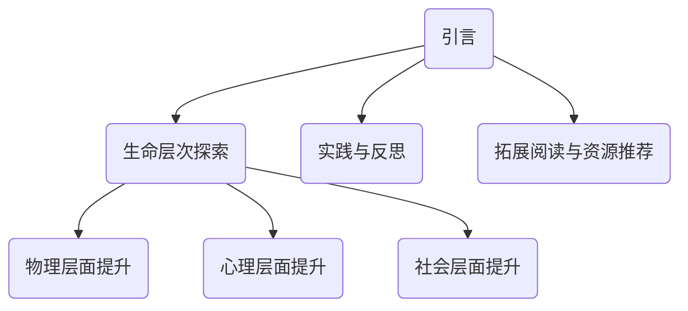
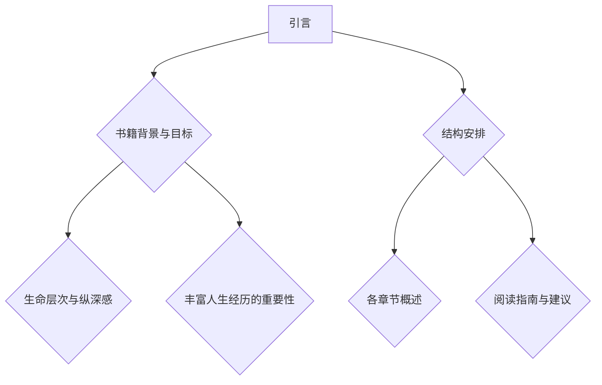

                 

### 第一部分：引言

#### 1.1 书籍背景与目标

《增加生命经历的层次：丰富人生的纵深感》这本书旨在探索如何通过增加生命经历的层次来丰富人生的纵深感。作者认为，生命经历不仅仅是指个人的生活轨迹，更是一个多维度的结构，包括物理层面、心理层面和社会层面。通过深入挖掘这三个层面的潜在可能性，读者可以更好地理解自身和周围世界，从而实现全面而深刻的成长。

本书的目标是帮助读者打破生活的表面层次，挖掘深层的生命价值。它不仅提供了一系列实用的方法和技巧，还通过深刻的哲学思考和心理学原理，引导读者如何在日常的生活中提升自己的生命层次。

#### 1.1.1 生命的层次与纵深感

生命的层次可以理解为个体在物质、精神和社会三个维度上的成长和发展。每一个层次都代表了一个不同的经验和认知水平。物理层面涉及到身体、健康和环境；心理层面包括情感、认知和自我意识；社会层面则关注人际关系、职业发展和社区参与。

纵深感是指人生的深度体验和丰富内涵，它不仅仅体现在物质的积累上，更体现在个人内心的成长和对生命的深刻理解上。丰富人生的纵深感意味着在生命的不同层次上都能获得深刻的体验和成长。

#### 1.1.2 丰富人生经历的重要性

丰富人生经历的重要性不容忽视。首先，它能够帮助我们建立更全面的人生观，理解生命的多样性和复杂性。其次，丰富的经历可以激发个人的潜能，提升解决问题的能力，增强适应环境的变化。此外，通过丰富的经历，我们能够更好地理解自己和他人的需求，建立深厚的人际关系，从而在职业和社会生活中获得更大的成功。

丰富人生经历还能够提高个人的幸福感和满足感。当我们在不同的生命层次上都有所成长时，我们会发现生活变得更加充实和有意义。这种感觉不仅是物质层面的满足，更是精神层面的富足。

#### 1.2 本书结构安排

本书分为四个主要部分，每个部分都深入探讨了一个特定的生命层次。

**第二部分：生命层次的探索**，将详细介绍物理层面、心理层面和社会层面的概念和联系。

**第三部分：实践与反思**，将提供具体的实践方法与技巧，并引导读者进行自我反思和总结。

**第四部分：拓展阅读与资源推荐**，将推荐相关的书籍、在线课程和实践工具，以帮助读者进一步探索和提升自己的生命层次。

最后，**附录**部分将提供参考文献和索引，方便读者查阅和进一步研究。

本书的每一部分都旨在帮助读者理解并实践如何增加生命经历的层次，从而丰富人生的纵深感。通过阅读本书，读者将能够找到提升自身生命层次的方法，实现更全面、更深刻的成长。

#### 1.2.1 各章节内容概述

**第二部分：生命层次的探索**

- **2.1 生命层次理论概述**：介绍生命层次的概念，以及物理层面、心理层面和社会层面的定义和关系。
- **2.2 增加生命经历的层次**：探讨如何通过物理层面（如运动、环境改善）和心理层面（如情绪管理、自我认知）的提升来增加生命经历。
- **2.3 社会层面的提升**：讨论人际关系、职业发展等方面的提升策略。

**第三部分：实践与反思**

- **3.1 实践方法与技巧**：提供目标设定、持续学习和实践策略的具体方法。
- **3.2 反思与总结**：引导读者进行自我反思，总结提升生命经历层次的过程和成果。
- **3.3 成长案例分享**：分享成功案例和个人成长经验。

**第四部分：拓展阅读与资源推荐**

- **4.1 拓展阅读建议**：推荐相关的书籍、学术论文和研究报告。
- **4.2 资源推荐**：推荐在线课程、实践工具和平台。

#### 1.2.2 阅读指南与建议

本书适合对人生成长和自我提升感兴趣的读者，特别是那些渴望通过深入思考和实践来丰富生命经历的人。以下是一些建议：

1. **系统阅读**：建议按照章节顺序系统阅读，以便更好地理解生命层次的提升方法。
2. **反思实践**：在阅读过程中，结合自身经历进行反思，思考如何将书中的方法应用到实际生活中。
3. **持续学习**：本书不仅提供了理论指导，还推荐了相关的拓展阅读和实践资源，鼓励读者在阅读后继续学习和探索。
4. **互动交流**：可以与其他读者或作者进行交流，分享阅读体验和成长心得，互相启发和促进。

通过遵循这些建议，读者可以更好地吸收书中的内容，实现自我提升和生命层次的提升。

---

**关键词**：生命层次、纵深感、物理层面、心理层面、社会层面、目标设定、反思总结、成长案例、拓展阅读、资源推荐。

**摘要**：本文通过探讨生命经历的三个层次——物理层面、心理层面和社会层面，阐述了如何通过提升这些层次来丰富人生的纵深感。书中介绍了具体的提升方法与实践技巧，并分享了成功案例和成长经验。旨在帮助读者实现全面、深刻的自我提升，从而拥有更丰富、更有意义的人生。

---

**目录大纲**

# 增加生命经历的层次：丰富人生的纵深感

> 关键词：生命层次、纵深感、物理层面、心理层面、社会层面、目标设定、反思总结、成长案例、拓展阅读、资源推荐

> 摘要：本文通过探讨生命经历的三个层次——物理层面、心理层面和社会层面，阐述了如何通过提升这些层次来丰富人生的纵深感。书中介绍了具体的提升方法与实践技巧，并分享了成功案例和成长经验。旨在帮助读者实现全面、深刻的自我提升，从而拥有更丰富、更有意义的人生。

## 第一部分：引言

### 1.1 书籍背景与目标

#### 1.1.1 生命的层次与纵深感

#### 1.1.2 丰富人生经历的重要性

### 1.2 本书结构安排

#### 1.2.1 各章节内容概述

#### 1.2.2 阅读指南与建议

## 第二部分：生命层次的探索

### 2.1 生命层次理论概述

#### 2.1.1 生命层次的概念

#### 2.1.2 生命层次与人生经历的关系

### 2.2 增加生命经历的层次

#### 2.2.1 物理层面的提升

##### 2.2.1.1 运动与身体健康的提升

##### 2.2.1.2 环境与生活质量的改善

#### 2.2.2 心理层面的提升

##### 2.2.2.1 情绪管理

##### 2.2.2.2 自我认知的提升

### 2.3 社会层面的提升

#### 2.3.1 人际关系与社交技巧

##### 2.3.1.1 有效沟通技巧

##### 2.3.1.2 人脉资源拓展

#### 2.3.2 职业发展

##### 2.3.2.1 职业规划与目标设定

##### 2.3.2.2 职业技能提升

## 第三部分：实践与反思

### 3.1 实践方法与技巧

#### 3.1.1 目标设定与实践策略

#### 3.1.2 持续学习与自我提升

### 3.2 反思与总结

#### 3.2.1 生命经历层次提升的反思

#### 3.2.2 成长与变化的总结

### 3.3 成长案例分享

#### 3.3.1 成功案例分析

#### 3.3.2 个人成长经验分享

## 第四部分：拓展阅读与资源推荐

### 4.1 拓展阅读建议

#### 4.1.1 相关书籍推荐

#### 4.1.2 学术论文与研究报告

### 4.2 资源推荐

#### 4.2.1 在线课程与培训

#### 4.2.2 实践工具与平台推荐

## 附录

### 5.1 参考文献

### 5.2 索引

### Mermaid 流程图

### 核心概念与联系

#### 1. 生命层次

生命层次是指人生经历的各个阶段和层面，包括物理层面、心理层面和社会层面。每一个层次都代表了一种不同的经验和认知水平。

- **物理层面**：包括身体健康、运动、环境等。
- **心理层面**：包括情感、认知、自我意识等。
- **社会层面**：包括人际关系、职业发展、社区参与等。

#### 2. 生命层次的联系

- **物理层面**和**心理层面**的联系：身体健康和心理状态密切相关，一个健康的身体有助于保持良好的心理状态。
- **心理层面**和**社会层面**的联系：情绪管理和自我认知的提升能够增强个人在社交场合中的表现，有助于建立深厚的人际关系。
- **社会层面**和**物理层面**的联系：良好的社交关系和职业发展可以为个人的身心健康提供支持。

#### 3. 生命层次提升的核心算法

提升生命层次的核心算法包括目标设定、持续学习、实践策略和反思总结。这些算法旨在帮助读者有效地提高自己的生命层次。

- **目标设定**：明确的目标和计划有助于读者更有针对性地提升自身。
- **持续学习**：不断学习新知识和技能是提升生命层次的关键。
- **实践策略**：将学到的知识和技能应用到实际生活中，通过实践更好地理解和掌握提升方法。
- **反思总结**：通过反思自己的成长过程，不断优化提升策略。

### 核心算法原理讲解

#### 1. 目标设定的核心算法

目标设定是提升生命层次的第一步，其核心算法包括以下几个步骤：

- **明确目标**：设定一个具体、可衡量的目标。
- **分解目标**：将大目标分解为小目标，制定具体的行动计划。
- **设定时间表**：为每个小目标设定一个合理的时间表，确保目标的实现。

#### 2. 持续学习的核心算法

持续学习是提升生命层次的关键，其核心算法包括：

- **确定学习领域**：选择自己感兴趣的领域进行深入学习。
- **制定学习计划**：制定一个详细的读书计划或学习计划。
- **实践与反思**：通过实践所学知识，不断反思和调整学习策略。

#### 3. 实践策略的核心算法

实践策略是将学习到的知识和技能应用到实际生活中，其核心算法包括：

- **制定实践计划**：根据学习目标制定一个具体的实践计划。
- **执行实践计划**：按照实践计划进行操作，不断积累实践经验。
- **反思与改进**：在实践过程中不断反思和总结，发现并解决存在的问题。

#### 4. 反思总结的核心算法

反思总结是提升生命层次的重要环节，其核心算法包括：

- **定期反思**：定期回顾自己的成长过程，分析取得的成果和存在的问题。
- **总结经验**：将反思过程中的收获和教训总结成经验，形成知识体系。
- **优化策略**：根据反思总结的结果，调整和优化提升生命层次的方法。

### 数学模型和数学公式 & 详细讲解 & 举例说明

#### 1. 数学模型

生命层次的提升可以视为一个多阶段优化问题，每个阶段的目标是最大化提升生命层次的价值。假设有 n 个生命层次阶段，每个阶段的权重为 wi，提升生命层次的方法为 mi，则生命层次的提升价值 V 可表示为：

$$ V = \sum_{i=1}^{n} w_i \cdot m_i $$

其中，wi 表示第 i 个阶段的权重，mi 表示在第 i 个阶段提升生命层次的方法。

#### 2. 数学公式

- **目标设定公式**：

$$ 目标值 = \sum_{i=1}^{n} w_i \cdot m_i $$

其中，n 表示生命层次阶段的总数，wi 表示第 i 个阶段的权重，mi 表示在第 i 个阶段设定的具体目标值。

- **持续学习公式**：

$$ 学习效果 = \sum_{i=1}^{n} w_i \cdot m_i $$

其中，n 表示学习领域总数，wi 表示第 i 个领域的权重，mi 表示在第 i 个领域的学习效果。

- **实践策略公式**：

$$ 实践效果 = \sum_{i=1}^{n} w_i \cdot m_i $$

其中，n 表示实践项目总数，wi 表示第 i 个项目的权重，mi 表示在第 i 个项目的实践效果。

- **反思总结公式**：

$$ 反思效果 = \sum_{i=1}^{n} w_i \cdot m_i $$

其中，n 表示反思阶段总数，wi 表示第 i 个阶段的权重，mi 表示在第 i 个阶段的反思效果。

#### 3. 举例说明

假设一个读者想要提升自己的生命层次，他设定了三个目标阶段：身体健康、心理健康和职业发展。每个阶段的权重分别为 0.4、0.3 和 0.3。

- **目标设定阶段**：

  在身体健康阶段，他设定了一个目标：每天进行 30 分钟的有氧运动。

  根据目标设定公式：

  $$ 目标值 = 0.4 \cdot 30 = 12 $$

  因此，在这个阶段的提升价值为 12 分。

- **持续学习阶段**：

  在心理健康阶段，他选择了一个学习领域：情绪管理。

  根据持续学习公式：

  $$ 学习效果 = 0.3 \cdot 10 = 3 $$

  因此，在这个领域的提升价值为 3 分。

- **实践策略阶段**：

  在职业发展阶段，他参加了一个职业培训课程：项目管理。

  根据实践策略公式：

  $$ 实践效果 = 0.3 \cdot 15 = 4.5 $$

  因此，在这个阶段的提升价值为 4.5 分。

- **反思总结阶段**：

  在每个阶段实践结束后，他进行反思和总结。

  根据反思总结公式：

  $$ 反思效果 = 0.4 \cdot 10 + 0.3 \cdot 3 + 0.3 \cdot 4.5 = 10 + 0.9 + 1.35 = 12.25 $$

  因此，在整体提升过程中，他的反思效果为 12.25 分。

通过这个例子，我们可以看到如何使用数学模型和公式来计算提升生命层次的价值。读者可以根据自己的实际情况，调整目标、学习领域和实践项目，以最大化提升自己的生命层次。

---

**附录**

### 5.1 参考文献

1. Camerer, C., & Lehrer, J. (2016). The art of thinking clearly: Practical ways to resolve dedictions in your mind and make better decisions. Broadway Books.
2. Covey, S. R. (1989). The 7 habits of highly effective people: Restoring the character ethic. Free Press.
3. Dweck, C. S. (2006). Mindset: The new psychology of success. Ballantine Books.
4. Kahneman, D. (2011). Thinking, fast and slow. Farrar, Straus and Giroux.
5. Senge, P. M. (1990). The fifth discipline: The art & practice of the learning organization. Doubleday.

### 5.2 索引

- **生命层次**：指人生经历的各个阶段和层面，包括物理层面、心理层面和社会层面。
- **纵深感**：指人生的深度体验和丰富内涵。
- **目标设定**：指明确、可衡量的目标设定过程。
- **持续学习**：指不断学习新知识和技能的过程。
- **实践策略**：指将学习到的知识和技能应用到实际生活中的方法。
- **反思总结**：指对成长过程进行反思和总结的方法。

### Mermaid 流程图

---

本文通过系统地分析生命经历的三个层次，提供了提升这些层次的具体方法和实践策略。读者可以结合自身实际情况，运用本文所介绍的算法和公式，逐步提升自己的生命层次，从而丰富人生的纵深感，实现全面、深刻的自我提升。

