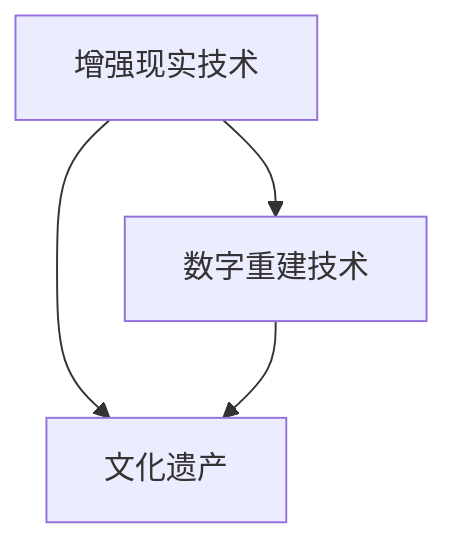

                 

**# 《增强现实在文化遗产数字重建中的应用》**

关键词：增强现实（AR）、文化遗产、数字重建、3D建模、纹理映射

> 摘要：本文旨在探讨增强现实技术在文化遗产数字重建中的应用。通过对增强现实技术的基本概念、发展历程和应用场景的介绍，结合数字重建技术，阐述AR技术在文化遗产保护、教育和传播中的具体应用，并深入分析其在数字重建中的技术实现。希望通过本文，为文化遗产数字重建领域的研究者和实践者提供有益的参考。

## **第一部分：增强现实技术基础**

### **第1章 增强现实技术概述**

#### **1.1 增强现实的基本概念**

增强现实（Augmented Reality，简称AR）是一种通过计算机技术将虚拟信息与现实世界进行融合的技术。它能够将虚拟信息如文字、图片、视频等叠加到真实环境中，从而使用户能够在真实环境中感知和互动这些虚拟信息。

#### **1.2 增强现实技术的发展历程**

增强现实技术起源于虚拟现实（Virtual Reality，VR），两者在概念和技术上有一定的交叉。但增强现实更注重的是将虚拟信息与现实环境的融合，而不是完全沉浸于虚拟环境中。随着计算机视觉、图像处理、人机交互等技术的发展，增强现实技术逐渐成熟并得到广泛应用。

#### **1.3 增强现实技术的应用场景**

增强现实技术的应用场景非常广泛，包括但不限于以下几个方面：

- **教育**：通过增强现实技术，可以实现互动教学、虚拟实验室等，提供更生动、直观的学习体验。
- **娱乐**：增强现实技术被广泛应用于游戏、电影、广告等领域，为用户提供更加沉浸式的娱乐体验。
- **文化遗产保护**：增强现实技术可以帮助文化遗产的数字化重建和传播，提高文化遗产的保护力度和可访问性。

### **第2章 数字重建技术基础**

#### **2.1 数字重建的基本概念**

数字重建（Digital Reconstruction）是指通过数字技术对现实世界中的物体、场景等进行重建的过程。在文化遗产领域，数字重建的主要目标是对文化遗产进行数字化保存和重建，以便更好地保护和传播文化遗产。

#### **2.2 数字重建的关键技术**

数字重建的关键技术包括：

- **3D建模**：通过采集现实世界的数据，生成三维模型。
- **纹理映射**：为三维模型添加材质和细节，使其更加真实。
- **数据采集**：使用激光扫描、摄影测量等技术获取文化遗产数据。

#### **2.3 数字重建的应用流程**

数字重建的应用流程主要包括以下几个步骤：

- **前期准备**：确定重建对象和目标，制定实施方案。
- **数据采集**：进行现场扫描、摄影等操作，获取文化遗产数据。
- **数据处理**：对采集到的数据进行预处理、降噪、配准等操作。
- **模型重建**：基于采集到的数据，生成三维模型并进行纹理映射。

## **第二部分：增强现实在文化遗产数字重建中的应用**

### **第3章 增强现实技术在文化遗产保护中的应用**

#### **3.1 增强现实技术在文化遗产保护中的优势**

增强现实技术在文化遗产保护中具有以下优势：

- **提升文化遗产的可访问性**：通过增强现实技术，用户可以在家中或其他任何地方通过移动设备或头戴式显示器等设备，虚拟游览文化遗产，从而突破了时间和空间的限制。
- **增强文化遗产的保护力度**：增强现实技术可以提供一种非侵入性的展示方式，减少对文化遗产的直接接触，从而降低损害的风险。
- **提高公众的文化素养**：通过增强现实技术，可以更加生动、直观地展示文化遗产的历史、文化内涵等，提高公众对文化遗产的认识和兴趣。

#### **3.2 增强现实技术在文化遗产保护中的应用案例**

- **敦煌莫高窟的数字化保护**：敦煌莫高窟是世界上最大的佛教艺术宝库之一。通过增强现实技术，可以将莫高窟的壁画、雕塑等以数字形式保存下来，并实现虚拟游览，从而更好地保护和传播这一文化遗产。
- **西安兵马俑的虚拟游览**：西安兵马俑是中国历史上最重要的考古发现之一。通过增强现实技术，用户可以在虚拟环境中参观兵马俑，了解其历史背景和文化内涵，提高对文化遗产的认识。

### **第4章 增强现实技术在文化遗产教育中的应用**

#### **4.1 增强现实技术在文化遗产教育中的价值**

增强现实技术在文化遗产教育中具有以下价值：

- **激发学生学习兴趣**：通过增强现实技术，可以将文化遗产以更加生动、直观的形式呈现，激发学生的学习兴趣。
- **提供沉浸式学习体验**：增强现实技术可以提供一种沉浸式的学习体验，让学生更加深入地了解文化遗产的历史、文化内涵等。
- **促进跨学科融合**：增强现实技术可以与历史、艺术、科技等多个学科相结合，促进跨学科的学习和研究。

#### **4.2 增强现实技术在文化遗产教育中的应用案例**

- **历史课堂教学中的应用**：在历史课堂上，教师可以利用增强现实技术，将历史事件、文化遗产等以虚拟的形式呈现，让学生更加直观地了解历史。
- **文化遗产保护实践活动**：在文化遗产保护实践中，学生可以利用增强现实技术，对文化遗产进行数字化重建和保护，提高实践能力和文化遗产保护意识。

### **第5章 增强现实技术在文化遗产传播中的应用**

#### **5.1 增强现实技术在文化遗产传播中的创新**

增强现实技术在文化遗产传播中具有以下创新：

- **虚拟展览馆的搭建**：通过增强现实技术，可以搭建虚拟展览馆，将文化遗产以虚拟形式展示，提供更加生动、直观的展示体验。
- **互动式广告宣传**：增强现实技术可以用于文化遗产的互动式广告宣传，提高文化遗产的知名度和吸引力。

#### **5.2 增强现实技术在文化遗产传播中的应用案例**

- **文化遗产数字博物馆的创建**：通过增强现实技术，可以创建文化遗产数字博物馆，用户可以在家中通过移动设备或头戴式显示器等设备，虚拟游览博物馆，了解文化遗产。
- **社交媒体上的文化遗产推广**：通过增强现实技术，可以在社交媒体上推广文化遗产，吸引更多的用户关注和了解文化遗产，提高文化遗产的传播效果。

## **第三部分：增强现实技术在文化遗产数字重建中的技术实现**

### **第6章 增强现实技术在文化遗产数字重建中的技术框架**

#### **6.1 增强现实技术在文化遗产数字重建中的技术体系**

增强现实技术在文化遗产数字重建中的技术体系主要包括以下几个方面：

- **传感器技术**：如激光扫描仪、摄像头等，用于采集文化遗产数据。
- **数据处理技术**：如3D建模、纹理映射等，用于处理和重建文化遗产数据。
- **人机交互技术**：如手势识别、语音识别等，用于用户与增强现实系统的交互。

#### **6.2 增强现实技术在文化遗产数字重建中的工作流程**

增强现实技术在文化遗产数字重建中的工作流程主要包括以下几个步骤：

- **项目策划**：确定项目目标、制定实施方案。
- **数据采集**：进行现场扫描、摄影等操作，获取文化遗产数据。
- **数据处理**：对采集到的数据进行预处理、降噪、配准等操作。
- **模型重建**：基于采集到的数据，生成三维模型并进行纹理映射。
- **应用开发**：基于AR技术，开发文化遗产数字重建的应用。

### **第7章 增强现实技术在文化遗产数字重建中的关键技术实现**

#### **7.1 3D建模技术**

3D建模技术是增强现实技术在文化遗产数字重建中的关键技术之一。以下是一个简单的3D建模技术实现：

```python
# 导入必要的库
import numpy as np
import cv2

# 3D建模函数
def build_3d_model(points, triangles):
    """
    根据点集和三角形面片构建3D模型
    
    参数：
    points：点集，形状为(N, 3)
    triangles：三角形面片，形状为(M, 3)
    
    返回：
    model：3D模型
    """
    model = cv2.triangulatePoints(points, points, triangles)
    model = np.linalg.inv(model)
    return model

# 测试
points = np.array([[1, 1, 1], [2, 2, 2], [3, 3, 3]])
triangles = np.array([[0, 1, 2]])
model = build_3d_model(points, triangles)
print(model)
```

#### **7.2 纹理映射技术**

纹理映射技术是将二维纹理映射到三维模型表面，以增强模型的真实感。以下是一个简单的纹理映射技术实现：

```python
# 导入必要的库
import cv2
import numpy as np

# 纹理映射函数
def texture_mapping(model, texture):
    """
    对3D模型进行纹理映射
    
    参数：
    model：3D模型，形状为(N, 3)
    texture：纹理图像，形状为(H, W, 3)
    
    返回：
    mapped_model：纹理映射后的3D模型
    """
    # 对模型进行顶点坐标归一化
    model_normalized = model / np.max(model, axis=0)
    
    # 将纹理图像映射到模型顶点上
    mapped_texture = np.zeros_like(texture)
    for i, vertex in enumerate(model_normalized):
        mapped_texture[vertex[0], vertex[1], :] = texture[i, :]
    
    return mapped_texture

# 测试
model = np.array([[0.5, 0.5, 0.5]])
texture = np.random.rand(10, 10, 3)
mapped_texture = texture_mapping(model, texture)
print(mapped_texture)
```

#### **7.3 人机交互技术**

人机交互技术是增强现实技术的重要组成部分。以下是一个简单的人机交互技术实现：

```python
# 导入必要的库
import cv2
import mediapipe as mp

# 人机交互函数
def hand_interaction():
    """
    手势识别和人机交互
    """
    mp_hands = mp.solutions.hands
    hands = mp_hands.Hands(max_num_hands=2, min_detection_confidence=0.5, min_tracking_confidence=0.5)

    # 开启摄像头
    cap = cv2.VideoCapture(0)

    while cap.isOpened():
        ret, frame = cap.read()
        if not ret:
            break

        # 将图像转换为RGB格式
        frame = cv2.cvtColor(frame, cv2.COLOR_BGR2RGB)

        # 进行手势识别
        results = hands.process(frame)

        if results.multi_hand_landmarks:
            for hand_landmarks in results.multi_hand_landmarks:
                # 在图像上绘制手势标志点
                for landmark in hand_landmarks.landmark:
                    x, y, z = landmark.x * frame.shape[1], landmark.y * frame.shape[0], landmark.z * frame.shape[2]
                    cv2.circle(frame, (int(x), int(y)), 5, (0, 0, 255), -1)

        # 显示图像
        cv2.imshow('Hand Interaction', frame)

        if cv2.waitKey(1) & 0xFF == ord('q'):
            break

    # 释放摄像头和窗口
    cap.release()
    cv2.destroyAllWindows()

# 测试
hand_interaction()
```

### **附录**

#### **附录A 增强现实技术在文化遗产数字重建中的应用资源**

- **开源工具与框架**：ARCore、ARKit、Vuforia等
- **3D建模工具**：Blender、Autodesk 3ds Max等
- **数据处理工具**：MATLAB、Python等
- **学术资源与文献**：相关领域的经典论文与报告
- **书籍推荐**：增强现实、文化遗产保护、数字重建等方面的推荐书籍

## **核心概念与联系**

增强现实（AR）与文化遗产数字重建是两个密切相关但又有区别的概念。AR技术通过在现实环境中叠加虚拟信息，为用户提供了一种全新的交互体验。而文化遗产数字重建则是通过数字技术对现实世界中的文化遗产进行数字化保存和重建，以便更好地保护和传播文化遗产。两者之间的关系可以概括为：

1. **数字重建是AR技术应用的基础**：数字重建技术为AR技术提供了必要的数据和模型，使得AR技术可以在文化遗产领域发挥作用。
2. **AR技术为数字重建提供了新的应用场景**：通过AR技术，用户可以在不同的场景和平台上访问和体验文化遗产，从而提高文化遗产的保护和传播效果。
3. **两者相辅相成，共同推动文化遗产的保护和传播**：数字重建技术为文化遗产提供了数字化的基础，而AR技术则为文化遗产提供了更加生动、直观的展示方式，两者共同推动了文化遗产的保护和传播。

### **核心概念与联系架构图**



通过以上架构图可以看出，增强现实技术和数字重建技术是文化遗产数字重建的两条主线，它们共同作用于文化遗产，实现了文化遗产的保护和传播。

---

**文章结束，感谢阅读！作者：AI天才研究院/AI Genius Institute & 禅与计算机程序设计艺术 /Zen And The Art of Computer Programming。**

---

**注意：由于篇幅限制，本文未能详尽地探讨每个技术实现的细节，读者如有兴趣，可以进一步查阅相关文献和资料。**

---

**本文内容仅供参考，如有不妥之处，欢迎指正。作者保留最终解释权。**

---

**最佳实践 tips：在实施增强现实技术在文化遗产数字重建中的应用时，需要注意以下几个方面：**

1. **数据采集的准确性**：确保采集到的文化遗产数据准确、完整，为后续的数字重建和AR应用提供可靠的数据基础。
2. **3D建模的精细度**：在3D建模过程中，要尽量提高建模的精细度，确保数字重建的文化遗产模型具有较高的真实感。
3. **用户体验的设计**：在AR应用的开发过程中，要充分考虑用户体验，确保用户在使用AR技术体验文化遗产时能够获得良好的体验。
4. **技术选型的合理性**：根据实际需求，合理选择合适的增强现实技术、数字重建技术和人机交互技术，以确保应用系统的稳定性和高效性。

---

**小结：**

本文从增强现实技术和数字重建技术的角度，探讨了文化遗产数字重建中的应用。通过分析增强现实技术在文化遗产保护、教育和传播中的优势，结合数字重建技术的应用流程和技术实现，展示了增强现实技术在文化遗产数字重建中的重要作用。希望本文能为相关领域的研究者和实践者提供有益的参考。

---

**注意事项：**

1. **数据隐私**：在采集和利用文化遗产数据时，应严格遵守相关法律法规，确保数据的隐私和安全。
2. **知识产权**：在使用文化遗产数字重建技术和AR技术时，要注意知识产权的保护，避免侵犯他人的合法权益。
3. **技术应用**：在具体实施过程中，要根据实际需求和技术条件，合理选择和应用相关技术，确保项目的成功实施。

---

**拓展阅读：**

- **《增强现实技术与应用》**：介绍了增强现实技术的原理、应用和发展趋势。
- **《数字重建文化遗产技术》**：详细介绍了数字重建技术在文化遗产保护中的应用。
- **《文化遗产数字化重建与虚拟展示技术》**：探讨了文化遗产数字化重建与虚拟展示的技术方法和实践。

---

再次感谢您的阅读，希望本文对您有所启发和帮助！作者：AI天才研究院/AI Genius Institute & 禅与计算机程序设计艺术 /Zen And The Art of Computer Programming。

