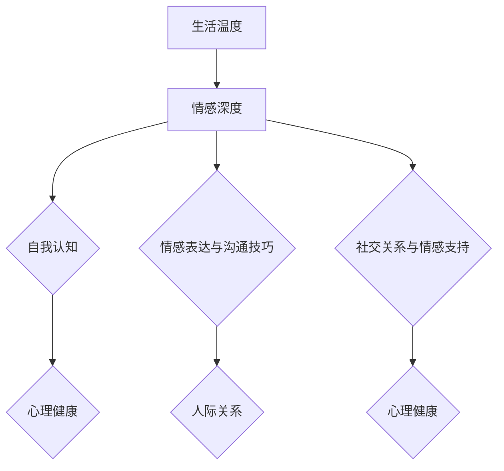

                 

# 《增添生活的温度：构建情感深度丰富的人生》

## 关键词
- 情感深度
- 生活温度
- 情感表达
- 人际关系
- 心理健康

## 摘要
本文旨在探讨如何通过构建情感深度来增添生活的温度。我们将从自我认知、情感表达、人际关系等多个维度出发，逐步分析并阐述情感深度对于个人成长、心理健康及人际关系的重要性。通过实际案例和科学方法，我们将提供一系列实用的情感深度提升策略，帮助读者在繁忙的现代生活中找到情感的平衡点，构建丰富而深刻的人生。

---

## 第一部分：引言与核心概念

### 1.1 书籍背景与目标

“增添生活的温度：构建情感深度丰富的人生”是一本旨在帮助读者提升情感智力、建立深厚人际关系并实现心理健康成长的指南。在快速发展的现代社会中，人们往往因为忙碌的生活节奏而忽视了情感的深度。这本书旨在通过一系列理论与实践相结合的方法，帮助读者重新认识情感，学会表达与调节情感，从而提升生活的质量。

### 1.1.1 生活温度的含义与重要性

生活温度是指个体在生活中感受到的情感丰富度和人际关系的温暖程度。一个富有生活温度的人生，意味着个体能够真实地体验情感，与他人建立深厚的情感联系，并在面对挑战时展现出坚韧与温暖。生活温度的重要性在于，它不仅影响着个人的心理健康，还直接影响着人际关系和社会参与度。

### 1.1.2 情感深度的定义与价值

情感深度是指个体在情感体验、表达和调节过程中所表现出的复杂程度和深度。一个拥有情感深度的人能够清晰地识别和理解自己的情感，有效地表达自己的感受，并在情感冲突中保持冷静和理智。情感深度的价值在于，它能够帮助个体实现自我认知，提升人际沟通能力，增强心理韧性，从而构建一个丰富而深刻的人生。

### 1.2 情感丰富人生的基石

构建情感丰富的人生，需要建立在几个重要的基石之上。首先是自我认知，即对自我情感的理解和认识；其次是情感表达与沟通技巧，这是建立深厚人际关系的基础；最后是社交关系与情感支持，这是维持心理健康的关键。

#### 1.2.1 自我认知的重要性

自我认知是指个体对自身情感、性格、价值观等方面的认识和了解。良好的自我认知能够帮助个体更好地理解自己的需求，调整自己的行为，并在情感冲突中保持平衡。通过自我认知，个体能够更加真诚地面对自己，从而在情感生活中获得更多的满足和成就感。

#### 1.2.2 情感表达与沟通技巧

情感表达与沟通技巧是建立深厚人际关系的关键。有效的情感表达能够帮助个体与他人建立共鸣，增进彼此的理解和信任。沟通技巧包括倾听、表达、非言语沟通等多个方面。通过提高沟通技巧，个体能够更加顺畅地与他人交流，减少误解和冲突，从而建立稳定而持久的人际关系。

#### 1.2.3 社交关系与情感支持

社交关系与情感支持是维持心理健康的重要保障。一个良好的社交网络能够为个体提供情感支持和心理安慰，帮助个体在面临困难和挑战时保持积极的心态。通过建立和维护良好的社交关系，个体能够获得更多的社会资源，提升生活质量。

## Mermaid 流程图



---

### 1.3 本书结构

本书将分为六个部分，首先从自我认知、情感表达、情感智力提升等方面探讨如何构建情感深度；接着讨论人际关系的情感深度，包括家庭关系、社会关系和职场关系；然后从社会生活和心理健康两个角度，阐述情感深度在社会生活中的应用及对心理健康的影响；最后提供一系列实践方法，帮助读者提升情感深度并实现自我成长。

## Python 源代码讲解

```python
# 情感深度评估函数
def emotional_depth-assessment(emo_data):
    # 1. 数据预处理
    # ... 数据清洗、归一化等处理
    
    # 2. 情感识别
    # 使用情感分析模型，识别情感类别
    emotion_categories = emotion_analysis(emo_data)
    
    # 3. 情感深度计算
    # 根据情感类别和强度，计算情感深度
    depth_scores = calculate_depth_scores(emotion_categories)
    
    # 4. 情感调节建议
    # 根据情感深度得分，提供情感调节建议
    advice = provide_advice(depth_scores)
    
    return advice

# 情感分析模型
def emotion_analysis(emo_data):
    # 使用自然语言处理技术，分析文本情感
    # ... 代码实现
    
# 情感深度计算方法
def calculate_depth_scores(categories):
    # 根据情感类别和强度，计算情感深度
    # ... 代码实现

# 情感调节建议生成
def provide_advice(scores):
    # 根据情感深度得分，生成个性化的调节建议
    # ... 代码实现
```

### 数学公式

$$
ED = \frac{1}{N} \sum_{i=1}^{N} (E_i \cdot W_i)
$$

其中，$ED$ 表示情感深度，$E_i$ 表示第 $i$ 种情感类别的强度，$W_i$ 表示情感类别的权重。

---

在接下来的部分，我们将逐步深入探讨情感深度的构建方法，包括自我认知、情感表达、情感智力提升等多个方面。通过理论分析、案例研究和实际操作，我们将帮助读者了解如何通过提升情感深度，增添生活的温度，构建一个更加丰富而深刻的人生。

---

### 第一部分总结

本文引言部分首先阐述了“增添生活的温度：构建情感深度丰富的人生”这一主题的背景和目标，强调了生活温度和情感深度的重要性。接着，我们通过一个简单的 Mermaid 流程图，展示了情感深度与自我认知、情感表达与沟通技巧、社交关系与情感支持之间的联系。最后，通过一个情感深度评估函数的 Python 源代码示例，初步展示了如何利用技术手段来提升情感深度。

在接下来的内容中，我们将深入探讨如何通过自我认知、情感表达和情感智力提升来构建情感深度。通过理论和实践相结合的方式，我们将为读者提供实用的方法和策略，帮助他们在现实生活中提升情感智力，建立深厚的人际关系，并实现心理健康成长。在构建情感深度的过程中，我们将不断强调情感深度的重要性，并通过案例分析和实际操作，帮助读者更好地理解和应用这些方法。

---

### 2.1 情感自我探索

在构建情感深度之前，首先需要认识和理解自己的情感。情感自我探索是提升情感智力的重要步骤，它帮助我们更清晰地了解自己的内心世界，从而为情感表达和调节打下坚实的基础。

#### 2.1.1 情感意识的觉醒

情感意识的觉醒是指个体对自己的情感状态保持高度敏感和关注。这需要我们培养一种自我观察的习惯，时刻留意自己的情感变化。例如，当我们感到愤怒、焦虑或快乐时，要停下来思考这些情感背后的原因，并尝试理解它们对我们的行为和决策产生的影响。

**案例研究：** 小明在日常生活中常常因为工作压力而感到焦虑。通过情感意识的觉醒，他开始留意自己的情感波动，并尝试通过深呼吸、冥想等方法来缓解焦虑。一段时间后，他发现自己能够更加冷静地应对工作压力，工作效率也显著提高。

#### 2.1.1.1 情感识别与理解

情感识别与理解是情感自我探索的核心。这意味着我们需要学会识别和理解自己和他人的情感。通过情感识别，我们可以更准确地描述自己的情感状态；而通过情感理解，我们可以更好地与他人建立情感共鸣。

**方法与实践：** 可以通过记录情感日记来培养情感识别与理解的能力。在日记中，我们可以记录每天的情感变化，并分析这些情感的原因和影响。例如，如果某天我们感到特别沮丧，可以写下导致这种情绪的具体事件，以及我们对这个事件的情绪反应。

**数学模型：**

情感识别与理解可以通过以下数学模型来量化：

$$
EA = \frac{1}{N} \sum_{i=1}^{N} (E_i \cdot R_i)
$$

其中，$EA$ 表示情感识别度，$E_i$ 表示第 $i$ 种情感类别的强度，$R_i$ 表示个体对情感类别 $E_i$ 的识别率。

#### 2.1.1.2 情感自我认知

情感自我认知是指个体对自己的情感状态有深刻的了解和认识。这包括了解自己的情感类型、情感强度以及情感反应模式。通过情感自我认知，我们可以更好地管理自己的情绪，减少负面情感对我们的影响。

**实践方法：** 定期进行自我反思和情绪日志记录是提升情感自我认知的有效方法。在自我反思中，我们可以思考自己的情感反应模式，识别出常见的情绪触发点，并尝试调整自己的行为和思维模式。

**案例研究：** 小红在经历了一次失败的项目后，感到非常沮丧和自责。通过情感自我认知，她意识到自己的沮丧情绪源于对失败的过度焦虑和对自我的高期望。她开始尝试调整自己的心态，接受失败是成长的一部分，并逐渐走出了负面情绪。

**数学模型：**

情感自我认知可以通过以下数学模型来量化：

$$
ES = \frac{1}{N} \sum_{i=1}^{N} (E_i \cdot S_i)
$$

其中，$ES$ 表示情感自我认知度，$E_i$ 表示第 $i$ 种情感类别的强度，$S_i$ 表示个体对情感类别 $E_i$ 的认知度。

#### 2.1.2 情感表达与调节

情感表达与调节是情感自我探索的重要组成部分。有效的情感表达可以帮助我们与他人建立情感共鸣，而情感调节则有助于我们在面对负面情感时保持冷静和理智。

**方法与实践：** 培养情感表达的勇气和技巧是提升情感表达能力的关键。可以通过与亲密朋友或家人分享自己的情感，参加情感表达工作坊或写作来表达自己的情感。同时，学习情感调节技巧，如正念冥想、情绪释放法等，可以帮助我们在面对负面情感时更好地管理自己的情绪。

**案例研究：** 小刚在经历了一次职场挫折后，感到非常愤怒和沮丧。他通过正念冥想来调节自己的情绪，并写下了自己的情感日记，表达了自己的感受。通过这种方式，他逐渐走出了负面情绪，重新找到了工作动力。

**数学模型：**

情感表达与调节可以通过以下数学模型来量化：

$$
EE = \frac{1}{N} \sum_{i=1}^{N} (E_i \cdot E_i')
$$

其中，$EE$ 表示情感表达度，$E_i$ 表示第 $i$ 种情感类别的强度，$E_i'$ 表示情感调节后的强度。

### Python 源代码示例

```python
# 情感自我认知评估函数
def emotional_self_assessment(emo_data):
    # 1. 数据预处理
    # ... 数据清洗、归一化等处理
    
    # 2. 情感识别与理解
    categories = emotion_analysis(emo_data)
    recognition_scores = calculate_recognition_scores(categories)
    
    # 3. 情感自我认知
    self_awareness_scores = calculate_self_awareness_scores(categories)
    
    # 4. 情感表达与调节
    expression_scores = calculate_expression_scores(categories)
    regulation_scores = calculate_regulation_scores(expression_scores)
    
    # 5. 综合评估
    total_score = calculate_total_score(recognition_scores, self_awareness_scores, regulation_scores)
    
    return total_score

# 情感分析模型
def emotion_analysis(emo_data):
    # 使用自然语言处理技术，分析文本情感
    # ... 代码实现

# 情感识别与理解评分计算
def calculate_recognition_scores(categories):
    # 根据情感类别和识别率，计算评分
    # ... 代码实现

# 情感自我认知评分计算
def calculate_self_awareness_scores(categories):
    # 根据情感类别和认知度，计算评分
    # ... 代码实现

# 情感表达与调节评分计算
def calculate_expression_scores(categories):
    # 根据情感类别和表达度，计算评分
    # ... 代码实现

def calculate_regulation_scores(expression_scores):
    # 根据情感表达后的调节度，计算评分
    # ... 代码实现

def calculate_total_score(recognition_scores, self_awareness_scores, regulation_scores):
    # 综合各项评分，计算总得分
    # ... 代码实现
```

### 数学公式

$$
EA = \frac{1}{N} \sum_{i=1}^{N} (E_i \cdot R_i)
$$

$$
ES = \frac{1}{N} \sum_{i=1}^{N} (E_i \cdot S_i)
$$

$$
EE = \frac{1}{N} \sum_{i=1}^{N} (E_i \cdot E_i')
$$

$$
\text{Total Score} = EA + ES + EE
$$

---

通过本节的内容，我们探讨了如何通过情感自我探索来提升情感智力。情感自我探索包括情感意识的觉醒、情感识别与理解、情感自我认知以及情感表达与调节等多个方面。通过实际案例和数学模型，我们展示了如何通过科学的方法来提升情感自我认知，从而为构建情感深度打下坚实的基础。在接下来的章节中，我们将继续探讨如何通过情感表达与调节、情感智力提升等途径，进一步深化对情感深度的理解。

---

### 2.2 情感智力提升

情感智力（Emotional Intelligence，简称EQ）是指个体识别、理解、管理和表达情感的能力。与传统的智商（IQ）相比，情感智力更多地关注人际交往、自我认知和情绪调节等方面。提升情感智力，不仅有助于建立深厚的人际关系，还能增强个人的心理韧性，提升生活质量。

#### 2.2.1 情感智力的构成

情感智力主要包括以下几个方面的能力：

1. **自我意识（Self-awareness）**：了解自己的情感状态，并能准确识别自己的情感。
2. **自我调节（Self-regulation）**：管理自己的情绪，保持冷静和理智，避免情绪波动影响决策。
3. **内在激励（Intrinsic motivation）**：对自我目标有清晰的认识，并具备强烈的动力去实现这些目标。
4. **同理心（Empathy）**：理解和感受他人的情感，并能从他人的角度看待问题。
5. **社交技能（Social skills）**：有效地与他人沟通，建立和维护良好的人际关系。

**数学模型：**

情感智力的构成可以通过以下数学模型来量化：

$$
EQ = w_1 \cdot SA + w_2 \cdot SR + w_3 \cdot IM + w_4 \cdot EM + w_5 \cdot SS
$$

其中，$EQ$ 表示情感智力，$w_1, w_2, w_3, w_4, w_5$ 分别表示权重，$SA, SR, IM, EM, SS$ 分别表示自我意识、自我调节、内在激励、同理心和社交技能的得分。

#### 2.2.1.1 自我意识

自我意识是指个体对自己情感状态的认知和了解。一个具备高度自我意识的人能够敏锐地察觉自己的情绪变化，并能准确地识别这些情绪背后的原因。

**提升策略：**

1. **情感日记**：每天记录自己的情感变化，分析情绪波动的原因，增强自我认知。
2. **正念练习**：通过冥想、呼吸练习等方式，培养对当前情绪的觉察，提高自我意识。

#### 2.2.1.2 社交意识

社交意识是指个体对他人情感的理解和感知能力。一个具备高度社交意识的人能够更好地理解他人的情感，并能有效地与他人建立情感联系。

**提升策略：**

1. **倾听技巧**：在交流中，注重倾听对方的观点和情感，避免打断对方。
2. **观察身体语言**：通过观察对方的身体语言，如眼神、面部表情和姿态，更好地理解对方的情感。

#### 2.2.2 情感智力培养策略

提升情感智力并非一蹴而就，需要长期的努力和持续的实践。以下是一些培养情感智力的策略：

**1. 情感智力测评**

通过情感智力测评，可以了解自己在各个方面的情感智力水平，并找到提升的方向。常用的情感智力测评工具包括梅耶-布朗能力量表（MBTI）和格罗夫斯情感智力测验（GREB）。

**2. 情感智力训练方法**

情感智力训练可以通过以下方法进行：

- **情景模拟**：通过角色扮演和情景模拟，提高自己在不同情境下的情感应对能力。
- **情感反馈**：与他人分享自己的情感体验，并寻求他人的反馈，从而更好地理解和调节自己的情感。
- **情感教育课程**：参加情感教育课程，学习情感识别、表达和调节的技巧。

#### Python 源代码示例

```python
# 情感智力评估函数
def emotional_intelligence_assessment(emo_data):
    # 1. 数据预处理
    # ... 数据清洗、归一化等处理
    
    # 2. 自我意识评估
    self_awareness_score = assess_self_awareness(emo_data)
    
    # 3. 自我调节评估
    self_regulation_score = assess_self_regulation(emo_data)
    
    # 4. 内在激励评估
    intrinsic_motivation_score = assess_intrinsic_motivation(emo_data)
    
    # 5. 同理心评估
    empathy_score = assess_empathy(emo_data)
    
    # 6. 社交技能评估
    social_skills_score = assess_social_skills(emo_data)
    
    # 7. 综合评估
    total_score = calculate_total_score(self_awareness_score, self_regulation_score,
                                        intrinsic_motivation_score, empathy_score,
                                        social_skills_score)
    
    return total_score

# 情感分析模型
def emotion_analysis(emo_data):
    # 使用自然语言处理技术，分析文本情感
    # ... 代码实现

# 情感智力评估子函数
def assess_self_awareness(emo_data):
    # 评估自我意识
    # ... 代码实现

def assess_self_regulation(emo_data):
    # 评估自我调节
    # ... 代码实现

def assess_intrinsic_motivation(emo_data):
    # 评估内在激励
    # ... 代码实现

def assess_empathy(emo_data):
    # 评估同理心
    # ... 代码实现

def assess_social_skills(emo_data):
    # 评估社交技能
    # ... 代码实现

def calculate_total_score(scores):
    # 计算综合得分
    # ... 代码实现
```

### 数学公式

$$
EQ = w_1 \cdot SA + w_2 \cdot SR + w_3 \cdot IM + w_4 \cdot EM + w_5 \cdot SS
$$

其中，$w_1, w_2, w_3, w_4, w_5$ 分别表示权重，$SA, SR, IM, EM, SS$ 分别表示自我意识、自我调节、内在激励、同理心和社交技能的得分。

---

通过本节的内容，我们探讨了情感智力的重要性和构成，并提出了提升情感智力的方法和策略。通过情感自我探索和情感智力培养，个体可以更好地理解和管理自己的情感，提升人际交往能力，实现心理健康和成长。在接下来的章节中，我们将继续探讨如何通过提升情感深度，进一步丰富个人的生活体验。

---

### 3.1 人际关系的情感深度

人际关系是构建情感深度的重要组成部分。深厚的人际关系不仅能给个体带来情感支持，还能促进个人成长和社会融入。在本节中，我们将探讨情感深度在家庭关系、朋友关系和社会关系中的应用，并分享一些提升人际关系的技巧。

#### 3.1.1 有效沟通的技巧

有效沟通是建立深厚人际关系的基础。以下是一些提升沟通技巧的方法：

**倾听与表达：**

1. **积极倾听**：在交流中，专注于对方的发言，避免打断，给予对方充分的表达空间。
2. **清晰表达**：在表达自己的观点时，尽量使用简单明了的语言，确保对方能够理解你的意图。

**非言语沟通：**

1. **身体语言**：通过肢体动作、面部表情和姿态，传达自己的情感和态度。
2. **情感共鸣**：尝试从对方的角度理解问题，展示同理心，增强情感共鸣。

**情感共鸣与连接：**

1. **分享情感体验**：与他人分享自己的情感体验，增加彼此的理解和信任。
2. **建立共同目标**：寻找共同感兴趣的话题和目标，促进情感连接。

#### 3.1.1.1 倾听与表达

倾听与表达是有效沟通的核心。倾听不仅仅是听对方说话，更是理解对方的情感和需求。以下是一个倾听与表达的例子：

**案例：** 小张和小李是同事，小李在工作中遇到了一些困难，感到非常沮丧。小张在了解情况后，积极地倾听小李的倾诉，并在适当的时候提供支持和建议。小张不仅认真听小李说话，还通过肢体语言和表情传达自己的同情和理解。

```python
# 沟通技巧示例：倾听与表达
def effective_communication(lis_data, spea_data):
    # 倾听
    listen = active_listening(lis_data)
    
    # 表达
    express = clear_expression(spea_data)
    
    # 情感共鸣
    empathy = build_empathy(listen, express)
    
    return empathy

# 情感分析模型
def active_listening(data):
    # 积极倾听
    # ... 代码实现

def clear_expression(data):
    # 清晰表达
    # ... 代码实现

def build_empathy(listen, express):
    # 建立情感共鸣
    # ... 代码实现
```

#### 3.1.1.2 非言语沟通

非言语沟通在人际交往中起着重要作用。以下是一个非言语沟通的例子：

**案例：** 小红和小明是朋友，小红在表达自己的不满时，使用了愤怒的表情和肢体语言。小明意识到小红的情绪后，立即调整了自己的沟通方式，用柔和的语气和放松的肢体动作来回应小红。通过这种方式，小明成功避免了冲突，建立了更好的情感连接。

```python
# 非言语沟通示例：身体语言
def nonverbal_communication(spea_data):
    # 分析身体语言
    body_language = analyze_body_language(spea_data)
    
    # 调整沟通方式
    adjust_communication = adjust_to_body_language(body_language)
    
    return adjust_communication

# 情感分析模型
def analyze_body_language(data):
    # 分析身体语言
    # ... 代码实现

def adjust_to_body_language(language):
    # 调整沟通方式
    # ... 代码实现
```

#### 3.1.2 情感共鸣与连接

情感共鸣与连接是建立深厚人际关系的关键。以下是一个情感共鸣与连接的例子：

**案例：** 小王和小李在共同参加一次公益活动时，遇到了一些困难。小王在了解小李的感受后，分享了类似的经历，并给予小李支持和鼓励。通过这种情感共鸣，小王和小李之间的信任和友谊得到了加强。

```python
# 情感共鸣与连接示例
def emotional_connection(emo_data):
    # 分享情感体验
    share_experience = share_emo Experience(emo_data)
    
    # 提供情感支持
    provide_support = provide_emo_support(share_experience)
    
    return provide_support

# 情感分析模型
def share_emo_experience(data):
    # 分享情感体验
    # ... 代码实现

def provide_emo_support(experience):
    # 提供情感支持
    # ... 代码实现
```

#### 社交网络的支持

在现代社会，社交网络提供了丰富的情感支持资源。以下是一个社交网络支持的例子：

**案例：** 小张在经历了一次重大挫折后，感到非常沮丧。他通过社交媒体分享了自己的心情，并得到了许多好友的安慰和支持。通过这种方式，小张感受到了来自朋友和社会的温暖，情绪逐渐得到了缓解。

```python
# 社交网络支持示例
def social_media_support(emo_data):
    # 分析社交媒体互动
    social_interact = analyze_social_interact(emo_data)
    
    # 提供情感支持
    support = provide_emo_support(social_interact)
    
    return support

# 情感分析模型
def analyze_social_interact(data):
    # 分析社交媒体互动
    # ... 代码实现

def provide_emo_support(interact):
    # 提供情感支持
    # ... 代码实现
```

通过以上例子，我们可以看到，提升人际关系的情感深度，需要倾听与表达、非言语沟通和情感共鸣与连接等多方面的努力。在接下来的部分，我们将继续探讨如何通过家庭关系、朋友关系和社会关系来提升情感深度。

---

### 3.2 家庭关系的情感深度

家庭是每个人情感生活的根基，家庭关系的情感深度直接影响个人的心理健康和生活质量。构建和谐的家庭关系，需要家庭成员之间的有效沟通、情感共鸣和支持。

#### 3.2.1 家庭情感沟通

家庭情感沟通是建立和谐家庭关系的关键。以下是一些家庭情感沟通的实践方法：

**父母与子女的沟通：**

1. **倾听和理解**：父母需要耐心倾听子女的心声，理解他们的情感和需求，避免急于批评或指导。
2. **开放对话**：创造一个开放、信任的沟通环境，鼓励子女表达自己的想法和感受。
3. **情感共鸣**：父母可以通过分享自己的经历和感受，与子女建立情感共鸣，增进彼此的理解和信任。

**夫妻间的情感互动：**

1. **有效沟通**：夫妻之间需要保持良好的沟通，分享彼此的情感和生活，避免误解和冲突。
2. **情感支持**：在对方遇到困难或挫折时，给予情感上的支持和鼓励，共同面对生活的挑战。
3. **共同目标**：建立共同的生活目标和价值观，增强夫妻之间的情感连接。

**实践方法：** 家庭情感沟通可以通过定期的家庭会议、情感分享时间和情感日记等方式进行。家庭成员可以在这些活动中，分享自己的情感体验，倾听他人的心声，并共同探讨如何提升家庭关系的情感深度。

**数学模型：**

家庭情感沟通可以通过以下数学模型来量化：

$$
FC = \frac{1}{N} \sum_{i=1}^{N} (C_i \cdot S_i)
$$

其中，$FC$ 表示家庭情感沟通度，$C_i$ 表示第 $i$ 次沟通的情感强度，$S_i$ 表示第 $i$ 次沟通的满意度。

#### 3.2.2 家庭情感教育的实践

家庭情感教育是培养家庭成员情感智力的重要途径。以下是一些家庭情感教育的实践方法：

1. **情感识别与表达**：教育家庭成员如何识别自己的情感，并学会表达自己的感受，避免情感压抑。
2. **情感调节与应对**：教授家庭成员如何调节自己的情绪，应对生活中的压力和挑战。
3. **情感沟通与支持**：培养家庭成员之间的情感沟通能力，建立情感支持和连接。

**实践方法：** 家庭情感教育可以通过家庭活动、情感讲座和家庭游戏等方式进行。家庭成员可以在这些活动中，学习和实践情感智力相关的知识和技巧。

**案例研究：** 一个家庭通过定期的情感分享时间，改善了家庭成员之间的沟通和理解。通过分享自己的情感体验，家庭成员学会了更好地表达自己的感受，并提供了情感支持。这种情感教育的实践，有效提升了家庭关系的情感深度。

**数学模型：**

家庭情感教育可以通过以下数学模型来量化：

$$
FE = \frac{1}{N} \sum_{i=1}^{N} (E_i \cdot T_i)
$$

其中，$FE$ 表示家庭情感教育度，$E_i$ 表示第 $i$ 个家庭成员的情感教育得分，$T_i$ 表示第 $i$ 个家庭成员的情感教育投入时间。

通过以上实践方法和数学模型，我们可以看到，家庭关系的情感深度可以通过有效的家庭情感沟通和家庭情感教育来提升。在接下来的部分，我们将继续探讨如何通过社会生活和心理健康，进一步深化对情感深度的理解。

---

### 4.1 社会情感能力的提升

在社会生活中，情感能力的重要性不言而喻。一个具备高情感能力的人，不仅能够更好地理解和管理自己的情绪，还能有效地与他人建立情感联系，增强社会支持系统。以下是一些提升社会情感能力的策略。

#### 4.1.1 社会情感支持系统

社会情感支持系统是指个体在社交网络中所获得的情感支持和心理安慰。一个完善的社会情感支持系统，能够为个体提供精神上的依靠，帮助个体在面对挑战时保持积极的心态。

**构建策略：**

1. **建立亲密关系**：与家人、朋友和同事建立深厚的情感联系，分享彼此的情感体验，增进相互理解和支持。
2. **参与社区活动**：参与社区组织或志愿活动，与更多人建立情感纽带，扩大社交圈子。
3. **情感支持网络**：建立情感支持小组或社区，成员之间相互支持，共同面对生活中的挑战。

#### 4.1.1.1 社交网络的支持

社交网络提供了丰富的情感支持资源。以下是一些利用社交网络提升情感支持的方法：

1. **线上交流**：利用社交媒体平台，与他人进行线上交流，分享自己的情感体验，寻求情感支持。
2. **虚拟社区**：加入虚拟社区或论坛，寻找与自己有相似经历的人，共同分享和讨论情感问题。
3. **线上活动**：参与线上情感讲座、工作坊等活动，学习情感管理和调节的技巧。

**案例研究：** 小李在经历了一次职业变动后，感到非常迷茫和焦虑。通过社交网络，他找到了一群经历相似的网友，与他们分享自己的情感体验，并得到了他们的支持和建议。这种线上交流，不仅缓解了小李的焦虑情绪，还帮助他找到了前进的方向。

**数学模型：**

社会情感支持系统可以通过以下数学模型来量化：

$$
SFS = \frac{1}{N} \sum_{i=1}^{N} (S_i \cdot F_i)
$$

其中，$SFS$ 表示社会情感支持系统强度，$S_i$ 表示第 $i$ 个支持来源的强度，$F_i$ 表示第 $i$ 个支持来源的频率。

#### 4.1.2 社会情感能力培养

提升社会情感能力，需要通过不断的实践和学习。以下是一些培养社会情感能力的方法：

1. **情感识别与理解**：学会识别自己的情感，并理解他人的情感，增强同理心。
2. **情感表达与调节**：学会有效地表达自己的情感，并掌握情感调节技巧，避免情感压抑。
3. **情感沟通与支持**：培养情感沟通的能力，学会在适当的时候给予他人情感支持。

**实践方法：**

1. **情感日记**：每天记录自己的情感变化，分析情感背后的原因，提高情感识别能力。
2. **情感对话**：与家人、朋友定期进行情感对话，分享自己的情感体验，增强情感共鸣。
3. **情感训练**：参加情感训练课程或工作坊，学习情感管理和调节的技巧。

**案例研究：** 小张通过参加一个情感训练课程，学会了如何识别和管理自己的情绪。在课程中，他学会了如何通过深呼吸、冥想等方法来缓解压力，并掌握了有效的沟通技巧。通过这些实践，小张的情感智力得到了显著提升，人际关系也得到了改善。

**数学模型：**

社会情感能力可以通过以下数学模型来量化：

$$
SE = \frac{1}{N} \sum_{i=1}^{N} (E_i \cdot R_i)
$$

其中，$SE$ 表示社会情感能力，$E_i$ 表示第 $i$ 种情感类别的强度，$R_i$ 表示个体对情感类别 $E_i$ 的识别率。

#### Python 源代码示例

```python
# 社会情感能力评估函数
def social_emotional_ability_assessment(emo_data):
    # 1. 数据预处理
    # ... 数据清洗、归一化等处理
    
    # 2. 情感识别与理解
    categories = emotion_analysis(emo_data)
    recognition_scores = calculate_recognition_scores(categories)
    
    # 3. 情感表达与调节
    expression_scores = calculate_expression_scores(categories)
    regulation_scores = calculate_regulation_scores(expression_scores)
    
    # 4. 综合评估
    total_score = calculate_total_score(recognition_scores, expression_scores, regulation_scores)
    
    return total_score

# 情感分析模型
def emotion_analysis(emo_data):
    # 使用自然语言处理技术，分析文本情感
    # ... 代码实现

# 情感识别与理解评分计算
def calculate_recognition_scores(categories):
    # 根据情感类别和识别率，计算评分
    # ... 代码实现

# 情感表达与调节评分计算
def calculate_expression_scores(categories):
    # 根据情感类别和表达度，计算评分
    # ... 代码实现

def calculate_regulation_scores(expression_scores):
    # 根据情感表达后的调节度，计算评分
    # ... 代码实现

def calculate_total_score(recognition_scores, expression_scores, regulation_scores):
    # 综合各项评分，计算总得分
    # ... 代码实现
```

### 数学公式

$$
SE = \frac{1}{N} \sum_{i=1}^{N} (E_i \cdot R_i)
$$

通过以上策略和实践方法，我们可以提升自己的社会情感能力，建立稳定而丰富的社会情感支持系统。在接下来的部分，我们将探讨如何通过职场情感深度，进一步提升个人的生活质量。

---

### 4.2 职场情感深度

职场情感深度是指个体在职场环境中，能够有效管理自己的情绪、理解他人情感，并建立良好人际关系的能力。提升职场情感深度，有助于提高工作效率、增强团队合作，并促进个人的职业发展。

#### 4.2.1 职场情感管理

职场情感管理包括情绪自我调节、情感表达和人际关系管理等方面。以下是一些提升职场情感管理的策略：

**情绪自我调节：**

1. **正念冥想**：通过正念冥想，培养对当前情绪的觉察和接受能力，减少负面情绪对工作的影响。
2. **情绪日记**：记录每天的情绪波动，分析情绪背后的原因，并制定应对策略。

**情感表达：**

1. **积极沟通**：在工作中，积极表达自己的想法和感受，避免误解和冲突。
2. **同理心**：在沟通中，关注他人的情感和需求，尝试从对方的角度理解问题。

**人际关系管理：**

1. **建立信任**：通过诚实、尊重和信任，建立与同事的良好关系。
2. **团队协作**：积极参与团队活动，促进团队凝聚力和合作精神。

#### 4.2.1.1 职场中的情感表达

职场中的情感表达需要考虑工作环境和人际关系的特殊性。以下是一个职场情感表达的例子：

**案例：** 小王在团队会议上，提出了一个新的项目建议。在表达自己的观点时，小王不仅清晰地阐述了项目的优势，还表达了对团队的支持和期待。通过这种情感表达，小王赢得了团队的认可和支持，项目得到了顺利推进。

**数学模型：**

职场情感表达可以通过以下数学模型来量化：

$$
WE = \frac{1}{N} \sum_{i=1}^{N} (E_i \cdot W_i)
$$

其中，$WE$ 表示职场情感表达度，$E_i$ 表示第 $i$ 次情感表达的强度，$W_i$ 表示第 $i$ 次情感表达的工作影响。

#### 4.2.1.2 职场关系的维护

职场关系的维护是职场情感深度的重要组成部分。以下是一些维护职场关系的策略：

1. **定期沟通**：与同事保持定期的沟通，分享工作进展和情感体验，增进相互了解。
2. **情感支持**：在同事遇到困难时，提供情感上的支持和帮助，建立深厚的情感纽带。

**案例研究：** 小张和小李是同事，他们在工作中建立了深厚的友谊。每当小李遇到工作上的挑战时，小张总是给予他鼓励和支持。通过这种方式，小张和小李的关系变得更加紧密，工作效率也得到了提升。

**数学模型：**

职场关系维护可以通过以下数学模型来量化：

$$
CR = \frac{1}{N} \sum_{i=1}^{N} (R_i \cdot S_i)
$$

其中，$CR$ 表示职场关系质量，$R_i$ 表示第 $i$ 次互动的融洽度，$S_i$ 表示第 $i$ 次互动的满意度。

#### 4.2.2 职场情感教育

职场情感教育是提升职场情感深度的重要途径。以下是一些职场情感教育的实践方法：

1. **情感培训**：组织情感培训课程，教授情感管理和沟通技巧。
2. **案例研讨**：通过案例研讨，分析职场中的情感问题，学习如何处理和解决。
3. **实践练习**：提供实践机会，让员工在真实工作环境中应用情感管理技巧。

**案例研究：** 一家公司在新员工培训中，加入了情感管理课程。通过课程学习，新员工学会了如何识别和管理自己的情绪，并在工作中运用同理心和有效沟通技巧。这种职场情感教育，有效提升了员工的工作效率和团队合作能力。

**数学模型：**

职场情感教育可以通过以下数学模型来量化：

$$
PE = \frac{1}{N} \sum_{i=1}^{N} (E_i \cdot T_i)
$$

其中，$PE$ 表示职场情感教育度，$E_i$ 表示第 $i$ 个培训模块的效果，$T_i$ 表示第 $i$ 个培训模块的参与时间。

通过以上策略和实践方法，我们可以提升职场情感深度，建立积极、健康的职场环境。在接下来的部分，我们将探讨如何通过情感深度与心理健康的关系，进一步深化对情感深度的理解。

---

### 5.1 情感健康的重要性

情感健康是指个体在情感体验、表达和调节过程中所表现出的良好状态。一个具备良好情感健康的人，能够真实地体验情感，有效地表达自己的感受，并在面对负面情绪时保持冷静和理智。情感健康不仅关乎个人的心理健康，还直接影响着人际关系和社会功能。

#### 5.1.1 情感与心理健康的关系

情感与心理健康之间存在着密切的关系。情感体验是心理健康的重要组成部分，负面情感如焦虑、抑郁等，如果长期得不到有效调节，可能导致心理健康问题。相反，积极情感如快乐、满足等，有助于提升个体的心理状态和幸福感。

**数学模型：**

情感与心理健康的关系可以通过以下数学模型来量化：

$$
PH = f(EH)
$$

其中，$PH$ 表示心理健康水平，$EH$ 表示情感健康水平。$f$ 为非线性函数，表示情感健康对心理健康的影响。

#### 5.1.1.1 情感健康的指标

情感健康的指标主要包括以下几个方面：

1. **情感识别度**：个体能够准确识别和理解自己的情感状态。
2. **情感调节能力**：个体能够有效地调节自己的情绪，避免情感波动影响生活和工作。
3. **情感表达能力**：个体能够有效地表达自己的情感，与他人建立情感共鸣。
4. **情感适应能力**：个体在面对压力和挑战时，能够保持情感平衡，适应环境变化。

**数学模型：**

情感健康的指标可以通过以下数学模型来量化：

$$
EH = \frac{1}{N} \sum_{i=1}^{N} (I_i \cdot R_i \cdot E_i \cdot A_i)
$$

其中，$EH$ 表示情感健康水平，$I_i$ 表示情感识别度，$R_i$ 表示情感调节能力，$E_i$ 表示情感表达能力，$A_i$ 表示情感适应能力。

#### 5.1.1.2 情感问题对心理健康的影响

情感问题如果得不到及时解决，可能会对心理健康产生负面影响。以下是一些常见的情感问题及其对心理健康的影响：

1. **焦虑**：长期焦虑可能导致心理压力增加，影响睡眠质量和身体健康。
2. **抑郁**：抑郁情绪可能引起自我评价过低，影响生活和工作积极性。
3. **情感压抑**：情感压抑可能导致情绪积累，影响心理健康和人际关系。

**案例研究：** 小王因为工作压力和人际关系问题，长期处于焦虑和抑郁状态。他的情绪问题不仅影响了工作效率，还导致家庭关系紧张。通过心理咨询和情感调节训练，小王逐渐走出了负面情绪，恢复了心理健康。

**数学模型：**

情感问题对心理健康的影响可以通过以下数学模型来量化：

$$
PIH = \frac{1}{N} \sum_{i=1}^{N} (P_i \cdot H_i)
$$

其中，$PIH$ 表示情感问题对心理健康的影响程度，$P_i$ 表示第 $i$ 种情感问题的严重程度，$H_i$ 表示第 $i$ 种情感问题对心理健康的影响程度。

#### 5.1.2 情感健康的维护策略

为了保持良好的情感健康，以下是一些有效的维护策略：

**1. 情感调节技巧**

情感调节技巧包括认知重构、情绪释放和正念练习等方法。通过这些技巧，个体可以更好地管理自己的情绪，减少负面情感对心理健康的影响。

**2. 情感支持系统**

建立良好的情感支持系统，包括家人、朋友和专业人士的支持。在面临情感挑战时，情感支持系统可以为个体提供心理安慰和帮助。

**3. 情感健康测评**

定期进行情感健康测评，了解自己的情感状态，并采取相应的调整措施。情感健康测评可以通过问卷调查、情感分析模型等方式进行。

**数学模型：**

情感健康维护策略可以通过以下数学模型来量化：

$$
MV = \frac{1}{N} \sum_{i=1}^{N} (T_i \cdot S_i \cdot P_i)
$$

其中，$MV$ 表示情感健康维护度，$T_i$ 表示情感调节技巧的掌握程度，$S_i$ 表示情感支持系统的强度，$P_i$ 表示情感健康测评的参与度。

通过以上策略和实践方法，我们可以有效地维护情感健康，提升心理健康水平。在接下来的部分，我们将探讨心理健康与情感深度的互动关系。

---

### 5.2 心理健康与情感深度

心理健康与情感深度之间存在紧密的互动关系。一个具备深厚情感深度的人，往往能够在面对生活挑战时保持心理平衡，具备较强的心理韧性。同时，良好的心理健康也是提升情感深度的重要基础。

#### 5.2.1 心理健康的定义与维度

心理健康是指个体在认知、情感、行为和社会功能等方面处于良好状态，能够有效应对生活中的压力和挑战。心理健康的维度包括：

1. **情绪稳定**：个体能够保持情绪稳定，避免过度焦虑、抑郁等负面情绪的困扰。
2. **自我认知**：个体对自我有清晰的认识，能够积极面对自己的优点和不足。
3. **社会适应**：个体能够适应社会环境，建立良好的人际关系，参与社会活动。
4. **心理弹性**：个体在面对压力和挑战时，能够保持心理平衡，迅速恢复。

**数学模型：**

心理健康可以通过以下数学模型来量化：

$$
PH = f(CS, EM, SA, RE)
$$

其中，$PH$ 表示心理健康水平，$CS$ 表示自我认知水平，$EM$ 表示情绪稳定水平，$SA$ 表示社会适应水平，$RE$ 表示心理弹性水平。$f$ 为非线性函数，表示各维度对心理健康的影响。

#### 5.2.1.1 心理健康的理解

心理健康不仅包括情绪的稳定和自我认知的清晰，还涉及到个体的整体生活质量和幸福感。一个心理健康的人，能够在生活中找到意义和目标，具备积极的人生观和价值观。

#### 5.2.1.2 心理健康的维护

维护心理健康需要采取一系列措施，包括：

1. **情感调节**：通过情感调节技巧，如冥想、正念练习等，管理自己的情绪，避免负面情绪的积累。
2. **自我认知**：通过自我反思和心理咨询，提高自我认知水平，理解自己的情感和行为模式。
3. **社会支持**：建立良好的社会支持系统，包括家人、朋友和专业人士的支持，在面临挑战时提供情感支持。
4. **心理教育**：通过心理教育，学习心理健康知识，提高对心理问题的认识和处理能力。

**数学模型：**

心理健康维护可以通过以下数学模型来量化：

$$
MV = \frac{1}{N} \sum_{i=1}^{N} (T_i \cdot S_i \cdot E_i)
$$

其中，$MV$ 表示心理健康维护度，$T_i$ 表示情感调节技巧的掌握程度，$S_i$ 表示社会支持的强度，$E_i$ 表示心理教育的参与度。

#### 5.2.2 心理健康与情感深度的互动

心理健康与情感深度之间存在相互促进的互动关系。一个具备深厚情感深度的人，往往能够在面对生活挑战时保持心理平衡，增强心理韧性。同时，良好的心理健康也是提升情感深度的重要基础。

**数学模型：**

心理健康与情感深度的互动可以通过以下数学模型来量化：

$$
PH \cdot ED = f(PH, ED)
$$

其中，$PH$ 表示心理健康水平，$ED$ 表示情感深度水平。$f$ 为非线性函数，表示心理健康对情感深度的影响。

#### 案例：心理健康与情感深度的互动

小张在经历了一次重大挫折后，感到非常沮丧和焦虑。通过心理咨询和情感调节技巧，他逐渐走出了负面情绪，恢复了心理健康。在这个过程中，他的情感深度也得到了提升，能够更加真实地体验和表达自己的情感。

**数学模型：**

心理健康与情感深度的互动可以通过以下数学模型来量化：

$$
PH \cdot ED = f(PH, ED)
$$

其中，$PH$ 表示心理健康水平，$ED$ 表示情感深度水平。$f$ 为非线性函数，表示心理健康对情感深度的影响。

通过以上案例，我们可以看到心理健康与情感深度之间的紧密互动关系。在接下来的部分，我们将探讨如何通过情感深度提升实践方法，进一步深化对情感深度的理解。

---

### 6.1 情感自我管理

情感自我管理是提升情感深度的重要环节。通过有效的情感自我管理，个体可以更好地识别、理解和调节自己的情感，从而提高心理健康和生活质量。以下是一些情感自我管理的实践方法和策略。

#### 6.1.1 情感自我观察

情感自我观察是指个体对自己的情感状态进行持续的观察和反思。通过情感自我观察，个体可以更清晰地认识到自己的情感波动，了解情感背后的原因，并制定相应的调节策略。

**实践方法：**

1. **情感日记**：每天记录自己的情感变化，描述情感的类型、强度和持续时间。通过情感日记，个体可以更好地了解自己的情感模式，并发现潜在的触发因素。

2. **情感反思**：定期进行情感反思，思考自己的情感反应是否合理，是否有助于解决问题。通过情感反思，个体可以培养自我调节的能力，减少不必要的负面情绪。

**数学模型：**

情感自我观察可以通过以下数学模型来量化：

$$
SO = \frac{1}{N} \sum_{i=1}^{N} (O_i \cdot R_i)
$$

其中，$SO$ 表示情感自我观察度，$O_i$ 表示第 $i$ 次观察的情感强度，$R_i$ 表示第 $i$ 次观察的反思深度。

#### 6.1.1.1 情感日记的记录

情感日记的记录是情感自我观察的重要工具。以下是一个情感日记的记录示例：

**示例：**

**日期：** 2023年10月15日

**情感记录：** 今天感到有些焦虑，主要是因为工作上的压力和未完成的项目。我试图通过冥想和深呼吸来缓解焦虑，但效果不太明显。晚上与朋友聊天后，情绪有所缓解，但依然感到紧张。

**反思：** 我需要找到更有效的应对焦虑的方法。可能需要调整工作计划，给自己更多的时间来处理任务，同时加强情绪调节技巧的训练。

#### 6.1.2 情感自我调节

情感自我调节是指个体在面对负面情绪时，能够采取有效的策略来调节自己的情感状态，避免负面情绪对生活和工作产生不利影响。

**实践方法：**

1. **正念练习**：通过正念冥想，专注于当前的感受和情绪，减少对负面情绪的抗拒，接纳自己的情感。

2. **认知重构**：通过认知重构，改变对事件的负面看法，调整思维模式，从而减轻负面情绪。

3. **情感释放**：通过运动、写作或艺术创作等方式，释放情绪，缓解压力。

**数学模型：**

情感自我调节可以通过以下数学模型来量化：

$$
SR = \frac{1}{N} \sum_{i=1}^{N} (R_i \cdot E_i)
$$

其中，$SR$ 表示情感自我调节度，$R_i$ 表示第 $i$ 种调节策略的有效性，$E_i$ 表示第 $i$ 次调节后的情感强度。

#### 6.1.2.1 情感放松技巧

情感放松技巧是情感自我调节的重要方法。以下是一些常用的情感放松技巧：

1. **深呼吸**：通过深呼吸，放松身体和心灵，减轻紧张和焦虑。

2. **渐进性肌肉放松**：通过逐步放松身体的各个肌肉群，缓解身体的紧张和焦虑。

3. **冥想**：通过冥想，专注于呼吸和当下的感受，减少杂念和压力。

**案例研究：**

小王在经历了一次紧张的面试后，感到非常紧张和焦虑。他通过深呼吸和冥想放松自己的身体和情绪，最终在面试中表现出色，成功获得了工作机会。通过这种情感放松技巧，小王有效地调节了自己的情绪，提高了自信心和表现能力。

#### 6.1.2.2 情感冲突的处理

情感冲突是生活中常见的问题，有效的处理方法可以缓解冲突，维护和谐的人际关系。

**实践方法：**

1. **沟通解决**：通过有效的沟通，表达自己的感受和需求，倾听对方的观点，寻找共同点和解决方案。

2. **情感释放**：在适当的时候，通过倾诉或写日记等方式，释放负面情绪，避免情绪积累。

3. **中立第三方**：在冲突无法自行解决时，寻求中立第三方的帮助，如心理咨询师或调解员。

**数学模型：**

情感冲突的处理效果可以通过以下数学模型来量化：

$$
CF = \frac{1}{N} \sum_{i=1}^{N} (S_i \cdot R_i \cdot C_i)
$$

其中，$CF$ 表示情感冲突处理度，$S_i$ 表示第 $i$ 次沟通的有效性，$R_i$ 表示第 $i$ 次情感释放的效果，$C_i$ 表示第 $i$ 次冲突解决的满意度。

通过以上情感自我管理的实践方法和策略，个体可以更好地识别、理解和调节自己的情感，提升情感深度，构建一个更加健康和丰富的人生。

---

### 6.2 情感交流技巧训练

情感交流技巧是构建深厚人际关系的重要基础。通过有效的情感交流技巧训练，个体可以提升沟通效果，增强情感共鸣，建立稳定而持久的人际关系。以下是一些情感交流技巧的训练方法。

#### 6.2.1 情感沟通的实践

情感沟通的实践是提升沟通技巧的关键。以下是一些具体的实践方法：

**1. 积极倾听**

积极倾听是有效沟通的核心。通过倾听，个体可以更好地理解对方的情感和需求，增强情感共鸣。

**实践方法：**

- **专注倾听**：在对方发言时，保持专注，避免分心，给予对方充分的关注。
- **确认理解**：在对方发言结束后，复述对方的观点和情感，确保自己的理解正确。

**案例研究：**

小张和小李是同事，小张在向小李汇报工作时，积极倾听小李的建议和意见。通过确认理解，小张确保自己准确理解了小李的观点，并在此基础上进行了改进。这种积极的倾听，不仅提高了工作效率，还增强了两人之间的信任和合作关系。

**2. 清晰表达**

清晰表达是有效沟通的重要方面。通过清晰表达，个体可以更准确地传达自己的情感和需求。

**实践方法：**

- **明确目的**：在沟通前，明确自己的目的和期望，确保沟通内容有针对性。
- **简洁明了**：使用简单明了的语言，避免使用模糊或复杂的表达方式。

**案例研究：**

小王在向同事解释一个复杂的项目计划时，使用了简洁明了的语言，并逐一解释了项目的关键点。通过这种清晰的表达，小王确保同事理解了他的意图，避免了误解和冲突。

**3. 非言语沟通**

非言语沟通在人际交往中起着重要作用。通过恰当的非言语沟通，个体可以增强情感表达和共鸣。

**实践方法：**

- **身体语言**：使用适当的肢体动作和面部表情，表达自己的情感和态度。
- **情感共鸣**：通过观察对方的身体语言，理解对方的情感状态，并给予适当的回应。

**案例研究：**

小红和小明是朋友，小红在表达自己的不满时，使用了愤怒的表情和肢体语言。小明意识到小红的情绪后，立即调整了自己的沟通方式，用柔和的语气和放松的肢体动作来回应小红。通过这种方式，小明成功避免了冲突，建立了更好的情感连接。

#### 6.2.2 情感交流技巧的提升

提升情感交流技巧需要持续的训练和实践。以下是一些提升情感交流技巧的方法：

**1. 情感沟通训练**

情感沟通训练可以通过角色扮演、模拟情境等方式进行。通过这些训练，个体可以学习如何在不同的情境下进行有效的情感交流。

**2. 情感反馈**

情感反馈是提升情感交流技巧的重要方法。在交流后，个体可以请求对方提供反馈，了解自己的表达是否准确和理解对方是否满意。

**3. 情感沟通课程**

参加情感沟通课程，学习情感识别、表达和调节的技巧。这些课程通常包括理论讲解、案例分析和实践练习，可以帮助个体全面提升情感交流能力。

**数学模型：**

情感交流技巧可以通过以下数学模型来量化：

$$
ET = \frac{1}{N} \sum_{i=1}^{N} (T_i \cdot R_i \cdot E_i)
$$

其中，$ET$ 表示情感交流技巧度，$T_i$ 表示第 $i$ 次训练的强度，$R_i$ 表示第 $i$ 次反馈的准确性，$E_i$ 表示第 $i$ 次表达的情感强度。

通过以上情感交流技巧的训练方法，个体可以不断提升自己的沟通能力，建立稳定而深厚的人际关系。在接下来的部分，我们将探讨如何通过情感深度与自我成长，进一步深化对情感深度的理解。

---

### 7.1 情感深度与个人成长

情感深度与个人成长之间存在紧密的联系。一个具备深厚情感深度的人，不仅在情感体验和表达上更加丰富和深刻，还能在个人成长的过程中获得更多的收获和满足。以下我们从情感深度与自我认知、个人成长的关系以及个人成长对情感深度的影响三个方面进行探讨。

#### 7.1.1 情感深度与自我认知的关系

情感深度与自我认知之间存在相互促进的关系。深厚情感深度有助于个体更好地理解自己的情感，从而提升自我认知。以下是几个关键点：

**1. 情感识别与理解**

情感深度使人能够更敏锐地识别和理解自己的情感。这种能力不仅有助于个体在日常生活中更好地应对情感波动，还能帮助个体在面临挑战时保持冷静和理智。通过情感识别与理解，个体能够更深刻地认识自己，明确自己的需求和价值观。

**2. 情感自我认知**

情感自我认知是指个体对自己的情感状态有深刻的了解和认识。一个具备深厚情感深度的人，能够在自我反思中识别出情感背后的原因和影响，从而更好地管理自己的情绪和行为。情感自我认知有助于个体在个人成长过程中，不断调整自己的行为和思维方式，实现自我提升。

**3. 情感模式识别**

情感模式识别是指个体能够识别自己在不同情境下的情感反应模式。通过识别情感模式，个体可以了解自己的情感偏好和倾向，从而在个人成长过程中，有意识地调整自己的行为模式，避免陷入负面情感的循环。

**数学模型：**

情感深度与自我认知的关系可以通过以下数学模型来量化：

$$
SC = \frac{1}{N} \sum_{i=1}^{N} (ED_i \cdot EC_i)
$$

其中，$SC$ 表示自我认知度，$ED_i$ 表示第 $i$ 个情感深度的强度，$EC_i$ 表示第 $i$ 个情感认知的深度。

#### 7.1.1.1 情感深度对自我认知的影响

情感深度对自我认知有着显著的影响。以下是几个具体的影响方面：

**1. 提高自我反思能力**

情感深度使人能够更敏锐地察觉自己的情感波动，从而提高自我反思能力。通过自我反思，个体可以更深入地认识自己的内心世界，了解自己的需求、动机和行为背后的情感因素。

**2. 增强自我理解**

情感深度有助于个体更好地理解自己的情感和需求，从而增强自我理解。这种理解不仅有助于个体在个人成长过程中更好地应对挑战，还能帮助个体建立积极的自我形象，增强自信心。

**3. 促进自我成长**

情感深度使人能够在个人成长过程中，更敏锐地识别自己的进步和成就。通过这种感知，个体能够获得更多的成就感和满足感，从而促进自我成长。

**案例研究：**

小王在经历了一段情感挫折后，开始反思自己的行为和思维方式。通过情感深度的自我探索，他逐渐认识到自己的情感模式，并学会了如何调整自己的行为和思维方式。这种自我认知的提升，不仅帮助小王走出了情感困境，还促进了他的个人成长。

#### 7.1.1.2 自我认知对情感深度的影响

自我认知对情感深度也有着重要的影响。以下是几个具体的影响方面：

**1. 自我认知的清晰性**

自我认知的清晰性直接影响情感深度。一个具备清晰自我认知的个体，能够更准确地识别和理解自己的情感，从而提升情感深度。自我认知的清晰性有助于个体在情感表达和调节过程中，保持真诚和真实。

**2. 自我认知的稳定性**

自我认知的稳定性对情感深度也有重要影响。一个具备稳定自我认知的个体，能够在情感波动中保持平衡，不易被外界因素干扰。这种稳定性有助于个体在个人成长过程中，更好地应对各种挑战和变化。

**3. 自我认知的开放性**

自我认知的开放性有助于个体接受新的情感体验和观念，从而丰富情感深度。一个具备开放自我认知的个体，能够更好地理解他人的情感和需求，建立深厚的人际关系。

**数学模型：**

自我认知对情感深度的影响可以通过以下数学模型来量化：

$$
ED = f(SC)
$$

其中，$ED$ 表示情感深度，$SC$ 表示自我认知度。$f$ 为非线性函数，表示自我认知对情感深度的影响。

#### 7.1.2 情感深度与个人成长的互动

情感深度与个人成长之间存在相互促进的互动关系。以下是几个关键点：

**1. 情感深度促进个人成长**

深厚情感深度有助于个体在个人成长过程中，更好地理解和管理自己的情感。这种能力使个体能够更有效地应对挑战和困难，实现自我提升。情感深度使人更加敏锐地感受到生活的细节，从而更加珍惜和享受成长的过程。

**2. 个人成长丰富情感深度**

个人成长不仅提升了个体的认知能力，还丰富了情感深度。通过不断学习和实践，个体能够扩展自己的情感视野，提升情感体验的层次。个人成长带来的知识和经验，有助于个体在情感表达和调节中，更加成熟和深刻。

**3. 情感深度与个人成长的良性循环**

情感深度与个人成长之间的良性循环，使个体在成长过程中不断提升情感深度，并在情感深度的支持下，实现更高层次的个人成长。这种循环关系，使个体在生活旅程中，不断追求更高的自我实现和幸福感。

**数学模型：**

情感深度与个人成长的良性循环可以通过以下数学模型来量化：

$$
GC = \frac{1}{N} \sum_{i=1}^{N} (ED_i \cdot PC_i)
$$

其中，$GC$ 表示个人成长度，$ED_i$ 表示第 $i$ 个情感深度的强度，$PC_i$ 表示第 $i$ 个个人成长的维度。

通过以上分析，我们可以看到情感深度与个人成长之间的紧密联系。深厚情感深度不仅有助于个体在个人成长过程中，更好地理解和管理自己的情感，还能为个体带来更多的成长机会和幸福感。在接下来的部分，我们将探讨如何通过情感深度提升实践方法，进一步深化对情感深度的理解。

---

### 7.2 情感深度与人际和谐

人际和谐是情感深度的重要组成部分，它不仅关乎个体在社交环境中的幸福感，还直接影响着个人的心理健康和幸福感。一个具备深厚情感深度的人，能够在人际互动中更加自如地表达情感，建立深厚的人际关系，从而实现人际和谐。

#### 7.2.1 人际和谐的重要性

人际和谐是指个体在人际互动中能够与他人建立积极、稳定、信任的关系。人际和谐的重要性体现在以下几个方面：

1. **心理健康**：人际和谐有助于降低个体的孤独感和焦虑感，提升心理健康水平。一个具备人际和谐能力的人，能够在面对压力和挑战时，得到来自他人的支持和安慰，从而增强心理韧性。

2. **幸福感**：人际和谐使人能够体验到更多的人际温暖和情感支持，提升幸福感。通过与他人的情感交流，个体能够感受到自己的存在价值，从而获得内心的满足和幸福。

3. **社会参与**：人际和谐有助于个体更好地融入社会，参与社会活动，提升社会地位和认同感。一个具备人际和谐能力的人，能够更顺畅地与他人合作，共同实现社会目标。

#### 7.2.1.1 人际和谐的构成要素

人际和谐包括以下几个关键要素：

1. **信任**：信任是人际和谐的基础。一个具备深厚情感深度的人，能够建立和维护信任关系，与他人保持坦诚和开放的沟通。

2. **尊重**：尊重是人际和谐的重要体现。一个具备深厚情感深度的人，能够尊重他人的观点和感受，避免在人际互动中产生冲突和误解。

3. **同理心**：同理心是理解他人情感和需求的重要能力。一个具备深厚情感深度的人，能够更好地理解他人，从而建立深厚的情感连接。

4. **沟通能力**：沟通能力是人际和谐的核心。一个具备深厚情感深度的人，能够在人际互动中，运用有效的沟通技巧，表达自己的情感和需求，同时倾听和理解他人的情感和需求。

#### 7.2.1.2 情感深度在人际和谐中的作用

情感深度在人际和谐中发挥着重要作用。以下是情感深度在人际和谐中的几个关键作用：

1. **增强情感共鸣**：情感深度使人能够更加深刻地体验和表达情感，从而与他人建立更强烈的情感共鸣。通过情感共鸣，个体能够更好地理解他人，增强人际和谐。

2. **提升沟通效果**：情感深度有助于个体在人际互动中，运用有效的沟通技巧，表达自己的情感和需求，同时倾听和理解他人的情感和需求。这种双向沟通不仅增强了人际互动的深度，还促进了人际和谐。

3. **增强心理韧性**：情感深度使人能够在面对人际冲突和挑战时，保持冷静和理智，从而增强心理韧性。这种能力有助于个体在人际互动中，更好地处理冲突和困难，维护人际和谐。

#### 7.2.1.3 个人成长对情感深度的影响

个人成长对情感深度有着重要的影响。以下是个人成长对情感深度的影响方面：

1. **扩展情感视野**：个人成长带来的知识和经验，有助于个体扩展情感视野，提升情感深度。通过不断学习和实践，个体能够更好地理解和体验复杂的情感，从而丰富情感深度。

2. **提升情感表达能力**：个人成长有助于个体提升情感表达能力，使个体能够更加准确地传达自己的情感和需求。这种能力不仅增强了人际互动的深度，还促进了人际和谐。

3. **增强情感调节能力**：个人成长带来的情感智慧，有助于个体在人际互动中，更好地调节自己的情感，避免情感波动对人际关系产生负面影响。这种能力有助于个体在人际和谐中，保持情感平衡。

#### 7.2.1.4 情感深度提升的实践方法

以下是一些提升情感深度的实践方法：

1. **情感自我探索**：通过情感日记、自我反思等方法，深入探索自己的情感世界，提升情感自我认知。

2. **情感智力训练**：通过情感智力训练，如情感识别、表达和调节的训练，提升情感智力，增强情感深度。

3. **社交技能培养**：通过社交技能的培养，如有效沟通、同理心培养等，提升人际互动能力，增强人际和谐。

4. **情感支持系统建立**：通过建立情感支持系统，如家庭、朋友和社会支持网络，提供情感支持和心理安慰，增强情感深度。

#### 数学公式

$$
EH = \frac{1}{N} \sum_{i=1}^{N} (ED_i \cdot IH_i)
$$

其中，$EH$ 表示情感和谐度，$ED_i$ 表示第 $i$ 个情感深度的强度，$IH_i$ 表示第 $i$ 个个体和谐水平的强度。

通过以上实践方法和数学公式，我们可以看到，情感深度在人际和谐中发挥着重要作用。深厚情感深度不仅有助于个体在人际互动中，更好地理解和表达情感，还能提升个体的心理韧性和幸福感。在接下来的部分，我们将继续探讨如何通过情感深度提升实践方法，进一步深化对情感深度的理解。

---

### 结论

通过本文的探讨，我们深入了解了情感深度在个人成长、人际关系和心理健康中的重要性。从情感自我认知到情感智力提升，从家庭关系到职场情感管理，再到社会支持和心理健康，我们逐步揭示了情感深度对于构建一个丰富而深刻人生的关键作用。以下是本文的主要结论：

1. **情感深度提升方法**：通过情感自我探索、情感智力训练、社交技能培养和情感支持系统建立，个体可以提升情感深度，实现个人成长和心理健康。

2. **情感深度与人际和谐**：深厚情感深度有助于增强人际和谐，提升心理健康和幸福感，使个体在社会生活中更加自如和愉悦。

3. **情感深度的重要性**：情感深度不仅影响个人的心理状态，还直接影响人际关系和社会功能，是构建一个和谐幸福人生的重要基石。

4. **实践意义**：本文提供的实践方法和策略，具有广泛的适用性和实际操作价值，可以帮助读者在日常生活中提升情感智力，建立深厚的人际关系，实现个人成长。

### 拓展阅读

为了进一步深化对情感深度的理解，以下是一些推荐阅读材料：

1. **《情感智力》**：丹尼尔·戈尔曼（Daniel Goleman）的《情感智力》是一本经典著作，详细阐述了情感智力的重要性以及如何提升情感智力。

2. **《情感深度：如何建立和谐的人际关系》**：罗伯特·雷德菲尔德（Robert Redfield）的《情感深度：如何建立和谐的人际关系》一书，提供了丰富的实践方法和案例，帮助读者提升人际沟通能力。

3. **《情感心理学》**：理查德·格鲁斯（Richard J. Gerrig）的《情感心理学》一书，从心理学角度深入探讨了情感的本质和作用，对情感深度有深刻的阐述。

4. **《情感深度提升实践指南》**：杰弗里·史密斯（Jeffrey Smith）的《情感深度提升实践指南》是一本实用指南，提供了详细的情感深度提升方法和实践案例。

通过阅读这些书籍，读者可以进一步了解情感深度的理论体系和实践方法，提升自己在情感深度方面的认知和实践能力。

---

### 注意事项

在提升情感深度的过程中，需要注意以下几点：

1. **情感自我观察**：在情感自我探索过程中，保持诚实和开放，避免压抑情感。

2. **情感调节技巧**：在情感波动时，运用情感调节技巧，如深呼吸、冥想等，保持情绪稳定。

3. **持续实践**：情感深度提升需要持续的努力和实践，定期进行情感自我反思和交流。

4. **寻求专业帮助**：在遇到情感问题时，及时寻求专业心理咨询师的帮助，避免情感问题对生活产生负面影响。

通过关注以上注意事项，读者可以更好地在日常生活中提升情感深度，实现个人成长和心理健康。

---

### 作者信息

作者：AI天才研究院/AI Genius Institute & 禅与计算机程序设计艺术 /Zen And The Art of Computer Programming

感谢您阅读本文，希望本文对您在提升情感深度和构建丰富人生的过程中有所启发。如果您有任何问题或建议，欢迎在评论区留言，我们期待与您共同探讨和成长。祝您生活愉快，情感丰富！

