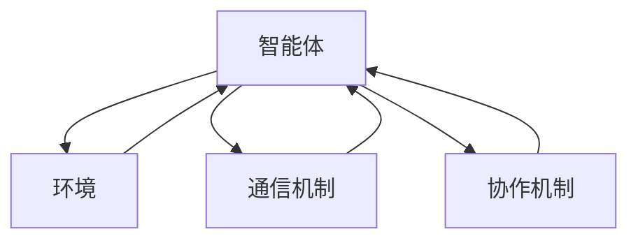
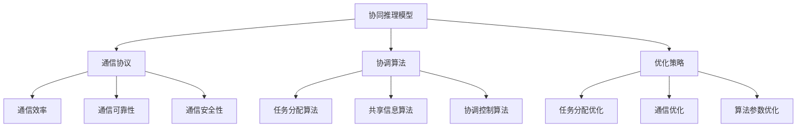
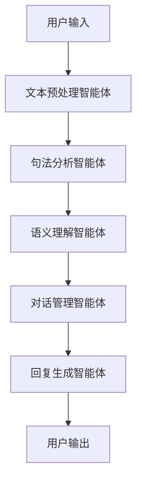
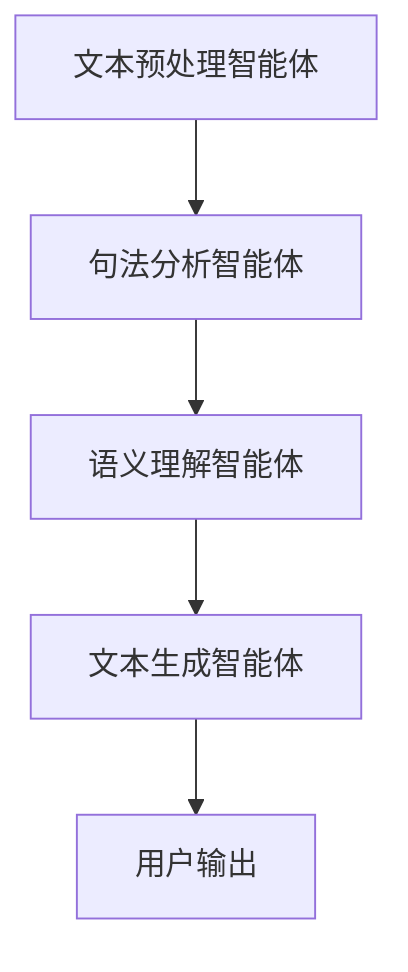
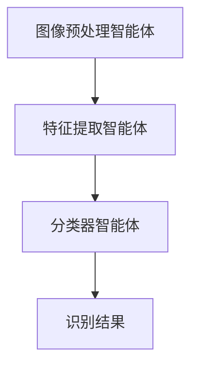
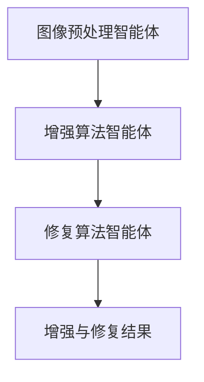

                 


# 多智能体协作提升复杂推理任务效果

> 关键词：多智能体系统、协作机制、复杂推理任务、协同算法、自然语言处理、图像处理

> 摘要：本文深入探讨了多智能体协作在提升复杂推理任务效果方面的应用。首先，介绍了多智能体系统的基本概念、研究背景与意义，以及多智能体系统的基本结构和协作机制。接着，分析了复杂推理任务的特点，并探讨了多智能体协作在复杂推理任务中的应用价值。随后，详细阐述了多智能体协同推理的基本原理、算法设计以及优化策略。最后，通过实际案例展示了多智能体协作在自然语言处理和图像处理中的应用，并对多智能体协作面临的挑战和未来发展趋势进行了展望。

## 目录大纲

### 第一部分：多智能体协作概述

#### 第1章：多智能体系统的基本概念

1.1 多智能体系统的定义与分类

1.2 多智能体系统的研究背景与意义

1.3 多智能体系统的基本结构

#### 第2章：多智能体协作机制

2.1 协作机制的基本原理

2.2 多智能体通信机制

2.3 多智能体协调策略

### 第二部分：复杂推理任务中的多智能体协作

#### 第3章：复杂推理任务概述

3.1 复杂推理任务的特点

3.2 多智能体协作在复杂推理任务中的应用

#### 第4章：多智能体协同推理算法

4.1 协同推理的基本原理

4.2 多智能体协同推理算法设计

4.3 多智能体协同推理算法优化

### 第三部分：多智能体协作在复杂推理任务中的应用

#### 第5章：多智能体协作在自然语言处理中的应用

5.1 多智能体自然语言处理概述

5.2 多智能体对话系统

5.3 多智能体文本生成与理解

#### 第6章：多智能体协作在图像处理中的应用

6.1 多智能体图像处理概述

6.2 多智能体图像识别与分类

6.3 多智能体图像增强与修复

#### 第7章：多智能体协作在复杂推理任务中的挑战与未来

7.1 多智能体协作面临的挑战

7.2 多智能体协作的未来趋势

### 附录

#### 附录A：多智能体协作开发工具与资源

A.1 主流多智能体框架介绍

A.2 多智能体协作案例分析

---

## 第一部分：多智能体协作概述

### 第1章：多智能体系统的基本概念

#### 1.1 多智能体系统的定义与分类

多智能体系统（Multi-Agent System，MAS）是由多个智能体（agent）组成的系统，这些智能体可以通过相互通信与合作来完成复杂的任务。智能体是具有独立思维和行动能力的实体，它们可以是物理实体、虚拟实体或者软件代理。多智能体系统的基本概念可以概括为以下几点：

1. **智能体定义**：智能体是具有自主性、社会性、反应性和认知性的实体。自主性表示智能体可以自主地选择和执行动作；社会性表示智能体可以与其他智能体进行交互；反应性表示智能体可以感知环境并做出相应反应；认知性表示智能体可以存储、处理和使用信息。

2. **智能体分类**：根据智能体的任务目标与协作模式，可以将多智能体系统分为以下几种类型：
   - **协作型智能体系统**：智能体之间通过协作完成共同的任务，如分布式计算、协同设计等。
   - **竞争型智能体系统**：智能体之间相互竞争以获得资源或达成目标，如电子商务、智能交通等。
   - **混合型智能体系统**：智能体之间既有协作也有竞争，如多智能体博弈、多智能体军事模拟等。

#### 1.2 多智能体系统的研究背景与意义

多智能体系统的概念起源于20世纪80年代，随着计算机科学、人工智能、分布式系统等领域的发展，多智能体系统逐渐成为一个重要的研究领域。研究多智能体系统具有重要的背景和意义：

1. **研究背景**：
   - **分布式计算**：多智能体系统是一种分布式计算模型，可以有效地解决分布式计算中的许多问题。
   - **复杂系统**：多智能体系统可以模拟和解决复杂系统的行为和演化，为复杂系统的研究提供了新的方法和思路。
   - **人工智能**：多智能体系统是人工智能的一个重要方向，通过研究多智能体系统的协作与通信，可以提高人工智能系统的智能程度和适应性。

2. **研究意义**：
   - **协同工作**：多智能体系统可以实现智能体的协同工作，提高复杂任务的执行效率和效果。
   - **自适应能力**：多智能体系统可以根据环境变化自主调整行为和策略，具有较好的自适应能力。
   - **智能化应用**：多智能体系统在各个领域具有广泛的应用前景，如智能制造、智能交通、智能家居等。

#### 1.3 多智能体系统的基本结构

多智能体系统的基本结构包括以下几个核心组件：

1. **智能体**：智能体是系统的基本单元，具有自主性、社会性、反应性和认知性。智能体可以是物理实体、虚拟实体或软件代理。

2. **环境**：环境是多智能体系统运行的空间，包括智能体所处的物理环境、社会环境以及虚拟环境。

3. **通信机制**：通信机制是智能体之间进行信息交换和协作的渠道。通信机制可以是直接通信或间接通信，如广播、点对点通信等。

4. **协作机制**：协作机制是多智能体系统实现协同工作的基础。协作机制包括任务分配、协同规划、协调控制等。

多智能体系统的基本结构可以用以下 Mermaid 流程图表示：



在接下来的章节中，我们将进一步探讨多智能体协作机制、复杂推理任务的特点以及多智能体协作在复杂推理任务中的应用，为读者呈现一个全面而深入的多智能体协作技术全景。

---

## 第二部分：复杂推理任务中的多智能体协作

### 第3章：复杂推理任务概述

复杂推理任务是指涉及大量数据、高维度特征以及多维度约束的推理问题，这类任务在人工智能领域具有广泛的应用。复杂推理任务的特点包括任务复杂性、不确定性和实时性要求等。本章将首先介绍复杂推理任务的特点，然后分析多智能体协作在复杂推理任务中的应用价值。

#### 3.1 复杂推理任务的特点

1. **任务复杂性**：复杂推理任务通常涉及大规模的数据集和高维特征，这要求智能体具有强大的计算能力和高效的算法。例如，在自然语言处理领域，语义理解和文本生成任务往往涉及海量的文本数据和复杂的语言规则。

2. **不确定性**：复杂推理任务中的数据和环境往往具有不确定性，这使得任务难以精确预测和规划。例如，在自动驾驶领域，路况、天气和环境变化等不确定因素会影响车辆的行驶决策。

3. **实时性要求**：许多复杂推理任务对实时性有较高要求，需要在短时间内完成推理和决策。例如，金融交易系统需要在毫秒级完成交易决策，以避免错过市场机会。

#### 3.2 多智能体协作在复杂推理任务中的应用

多智能体协作在复杂推理任务中具有显著的应用价值，主要体现在以下几个方面：

1. **提升推理效率**：通过多智能体协作，可以将复杂推理任务分解为多个子任务，并分配给不同的智能体，从而提高整体推理效率。例如，在图像处理领域，可以将图像分割任务分配给多个智能体，每个智能体负责处理图像的不同区域。

2. **增强推理能力**：多智能体协作可以实现智能体的知识共享和互补，从而增强整体推理能力。例如，在医疗诊断领域，不同的智能体可以分别处理患者的生理指标、病史和家族病史等信息，从而提高诊断的准确性。

3. **提高鲁棒性**：多智能体协作可以提高系统的鲁棒性，即使个别智能体出现故障，其他智能体也可以继续完成任务。例如，在无人机编队飞行中，如果某个无人机出现故障，其他无人机可以调整飞行路线，保证编队整体的安全。

4. **降低成本和能耗**：通过多智能体协作，可以降低系统的成本和能耗。例如，在智能家居系统中，多个智能设备可以通过协作实现能耗的最优化，从而降低家庭能源消耗。

#### 3.3 多智能体协作在复杂推理任务中的应用价值

多智能体协作在复杂推理任务中的应用价值体现在以下几个方面：

1. **协同推理**：通过多智能体协作，可以实现分布式协同推理，提高推理任务的效率和准确性。例如，在自然语言处理中，多个智能体可以分别处理文本的语义分析和文本生成，从而提高整体任务的性能。

2. **动态调度**：多智能体协作可以实现动态调度，根据任务需求和资源状况调整智能体的分配和协作方式。例如，在智能交通系统中，可以根据实时路况和车辆状况，动态调整交通信号灯和车辆路径规划。

3. **自适应优化**：多智能体协作可以实现自适应优化，根据任务进展和环境变化调整协作策略。例如，在智能制造中，多个智能体可以根据生产任务的变化，自适应调整生产线的工作节奏和资源配置。

4. **跨领域融合**：多智能体协作可以实现跨领域融合，将不同领域的知识和技术进行整合，从而实现更复杂的推理任务。例如，在医疗诊断中，可以将生物信息学、医学影像学和自然语言处理技术进行整合，实现更精准的诊断。

总之，多智能体协作在复杂推理任务中具有重要的应用价值，通过分布式协同推理、动态调度、自适应优化和跨领域融合等方式，可以有效提升复杂推理任务的效果和效率。

---

### 第4章：多智能体协同推理算法

#### 4.1 协同推理的基本原理

协同推理（Collaborative Reasoning）是指多个智能体之间通过协作和共享信息来共同解决复杂推理任务的方法。协同推理的基本原理包括以下几个关键点：

1. **信息共享**：智能体之间需要共享各自拥有的信息，以便更好地理解整体问题和协作完成推理任务。信息共享可以通过直接通信或间接通信实现。

2. **协同决策**：多个智能体需要协同决策，共同制定推理策略和行动方案。协同决策可以通过集中式或分布式算法实现。

3. **任务分解**：复杂推理任务可以分解为多个子任务，分配给不同的智能体分别处理。任务分解需要考虑智能体的能力和任务之间的依赖关系。

4. **优化目标**：协同推理算法的目标是最大化整体推理任务的性能，如最小化推理时间、最大化推理准确性等。优化目标可以通过数学模型和算法优化实现。

#### 4.2 多智能体协同推理算法设计

多智能体协同推理算法的设计需要考虑以下几个关键要素：

1. **协同推理模型**：协同推理模型是多个智能体协同工作的基础框架。常见的协同推理模型包括分布式推理模型、集中式推理模型和混合推理模型。

2. **通信协议**：通信协议是智能体之间进行信息交换的标准和规则。通信协议需要考虑通信的效率、可靠性和安全性等方面。

3. **协调算法**：协调算法是智能体之间协调工作、分配任务和共享信息的算法。常见的协调算法包括分布式算法、集中式算法和混合算法。

4. **优化策略**：优化策略是提高协同推理算法性能的方法和技术。常见的优化策略包括任务分配优化、通信优化和算法参数优化等。

以下是一个多智能体协同推理算法的设计框架：



#### 4.3 多智能体协同推理算法实现

多智能体协同推理算法的具体实现需要结合具体任务和应用场景。以下是一个基于分布式推理模型的协同推理算法实现示例：

1. **模型定义**：定义多智能体系统的协同推理模型，包括智能体的属性、任务、信息和策略等。

2. **通信机制**：设计智能体之间的通信机制，包括通信协议和数据格式。

3. **协调算法**：实现智能体之间的协调算法，包括任务分配、信息共享和策略优化等。

4. **优化策略**：根据具体任务和应用场景，设计优化策略，如任务分配优化、通信优化和算法参数优化等。

以下是一个简化的多智能体协同推理算法实现示例（Python代码）：

```python
import random

# 智能体类定义
class Agent:
    def __init__(self, id):
        self.id = id
        self.task = None
        self.info = {}

    def receive_info(self, info):
        self.info.update(info)

    def process_task(self):
        # 处理任务
        pass

# 协同推理算法实现
def collaborative_reasoning(agents):
    # 初始化智能体
    for agent in agents:
        agent.task = random.choice(["Task1", "Task2", "Task3"])
        agent.info = {}

    # 协调算法
    for _ in range(10):  # 协调迭代次数
        for agent in agents:
            # 任务分配
            agent.process_task()

            # 信息共享
            for other_agent in agents:
                if other_agent != agent:
                    agent.receive_info(other_agent.info)

    # 输出结果
    for agent in agents:
        print(f"Agent {agent.id}: Task completed with info {agent.info}")
```

#### 4.4 多智能体协同推理算法优化

多智能体协同推理算法的性能优化是提高推理任务效果的关键。常见的优化策略包括：

1. **任务分配优化**：根据智能体的能力和任务特点，优化任务分配策略，提高任务处理效率。例如，可以使用贪心算法、遗传算法等优化任务分配。

2. **通信优化**：优化智能体之间的通信机制，减少通信延迟和带宽消耗。例如，可以使用压缩算法、优化传输路径等技术。

3. **算法参数优化**：调整算法参数，如协调迭代次数、通信频率等，以实现更好的协同效果。例如，可以使用网格搜索、贝叶斯优化等技术进行参数优化。

4. **混合算法**：将分布式算法和集中式算法进行结合，发挥各自的优势，提高协同推理效果。例如，可以使用分布式混合算法、集中式混合算法等。

以下是一个基于贪心算法的任务分配优化示例（Python代码）：

```python
# 贪心算法任务分配优化
def greedy_task_allocation(agents):
    sorted_agents = sorted(agents, key=lambda x: x.capacity, reverse=True)
    sorted_tasks = sorted(agents, key=lambda x: x.task_priority, reverse=True)

    for agent in sorted_agents:
        for task in sorted_tasks:
            if not agent.is_busy and agent.can_perform(task):
                agent.assign_task(task)
                break
```

通过优化策略的引入和优化，多智能体协同推理算法的性能可以得到显著提升，从而更好地应对复杂推理任务的需求。

---

### 第5章：多智能体协作在自然语言处理中的应用

自然语言处理（Natural Language Processing，NLP）是人工智能领域的一个重要分支，旨在使计算机能够理解、解释和生成自然语言。多智能体协作在NLP中具有广泛的应用，可以显著提升复杂推理任务的效果。本章将介绍多智能体协作在自然语言处理中的应用背景、具体应用场景以及实现方法。

#### 5.1 多智能体自然语言处理概述

多智能体自然语言处理是指利用多个智能体协同工作，共同完成自然语言处理任务的方法。在多智能体自然语言处理中，不同的智能体可以分别负责文本预处理、词义分析、句法分析、语义理解等不同环节。通过智能体之间的协作和共享信息，可以提高NLP任务的效率和准确性。

多智能体自然语言处理的应用背景主要包括：

1. **大规模数据处理**：NLP任务通常涉及大规模的文本数据，需要高效的算法和并行计算能力。多智能体协作可以实现分布式计算，提高数据处理效率。

2. **复杂任务分解**：自然语言处理任务通常较为复杂，可以通过分解为多个子任务，分配给不同的智能体处理。例如，将文本预处理、句法分析和语义理解等任务分别分配给不同的智能体。

3. **知识共享与互补**：不同的智能体可以拥有不同的知识和技能，通过协作和共享信息，可以实现更复杂的推理和决策。

#### 5.2 多智能体对话系统

多智能体对话系统是指由多个智能体协同工作的对话系统，可以更好地模拟人类的对话过程，提供更自然的交互体验。多智能体对话系统的主要应用场景包括：

1. **客户服务**：在客户服务领域，多智能体对话系统可以提供24/7的客服支持，解答客户的疑问，提高客户满意度。

2. **智能助理**：在智能助理领域，多智能体对话系统可以协助用户完成各种任务，如日程管理、信息查询等。

3. **教育辅导**：在教育辅导领域，多智能体对话系统可以为学生提供个性化的学习建议和解答疑问，提高学习效果。

多智能体对话系统的实现方法主要包括：

1. **智能体分配**：根据对话内容和任务需求，将对话任务分配给不同的智能体。例如，可以将文本预处理任务分配给文本预处理智能体，句法分析任务分配给句法分析智能体等。

2. **协同对话管理**：设计协同对话管理机制，协调不同智能体的对话过程，确保对话的连贯性和一致性。

3. **知识共享与更新**：智能体之间需要共享知识和信息，以便更好地理解对话内容和进行推理。例如，可以将用户的历史对话记录和知识库共享给不同的智能体。

以下是一个多智能体对话系统的基本架构示例：



#### 5.3 多智能体文本生成与理解

多智能体文本生成与理解是指利用多个智能体协同工作，共同完成文本生成和理解任务的方法。多智能体文本生成与理解的主要应用场景包括：

1. **内容生成**：在内容生成领域，多智能体可以协同生成高质量的文章、报告等文本内容。

2. **问答系统**：在问答系统领域，多智能体可以协同工作，共同理解用户的问题，生成准确的答案。

3. **自动摘要**：在自动摘要领域，多智能体可以协同工作，共同提取文本的关键信息和主旨，生成摘要文本。

多智能体文本生成与理解的方法主要包括：

1. **任务分配**：根据文本生成与理解的任务需求，将任务分配给不同的智能体。例如，可以将文本预处理任务分配给文本预处理智能体，语义理解任务分配给语义理解智能体等。

2. **协同生成与理解**：设计协同生成与理解机制，确保不同智能体之间的协作和共享信息。例如，可以设计多智能体交互网络，实现智能体之间的信息传递和协同推理。

3. **模型优化**：通过多智能体协同工作，可以优化文本生成与理解的模型性能。例如，可以使用对抗训练、多任务学习等方法，提高模型的生成质量和理解能力。

以下是一个多智能体文本生成与理解的基本架构示例：



#### 5.4 多智能体协作在NLP中的实际应用

多智能体协作在自然语言处理领域具有广泛的应用，以下是一些实际应用案例：

1. **智能客服**：利用多智能体协作，可以构建一个智能客服系统，实现24/7的在线客服支持。智能客服系统由多个智能体组成，分别负责文本预处理、句法分析、语义理解和回复生成等任务。通过协同工作，智能客服系统可以更好地理解用户的问题，提供准确的解答。

2. **智能写作**：利用多智能体协作，可以构建一个智能写作系统，实现自动生成高质量的文章和报告。智能写作系统由多个智能体组成，分别负责文本预处理、语义理解、主题生成和文本生成等任务。通过协同工作，智能写作系统可以生成更具创意和逻辑性的文本内容。

3. **智能问答**：利用多智能体协作，可以构建一个智能问答系统，实现准确理解用户的问题并生成准确的答案。智能问答系统由多个智能体组成，分别负责文本预处理、句法分析、语义理解和回答生成等任务。通过协同工作，智能问答系统可以提供更高效、准确的问答服务。

通过多智能体协作，自然语言处理任务可以更高效、准确地完成。多智能体协作在自然语言处理中的应用为人工智能领域带来了新的机遇和挑战，未来将继续发挥重要作用。

---

### 第6章：多智能体协作在图像处理中的应用

图像处理是计算机视觉领域的一个重要分支，涉及图像的获取、处理、分析和理解。随着人工智能技术的发展，多智能体协作在图像处理中的应用逐渐成为研究热点。本章将介绍多智能体协作在图像处理中的应用背景、具体应用场景以及实现方法。

#### 6.1 多智能体图像处理概述

多智能体图像处理是指利用多个智能体协同工作，共同完成图像处理任务的方法。在多智能体图像处理中，不同的智能体可以分别负责图像的预处理、特征提取、分类、增强和修复等不同环节。通过智能体之间的协作和共享信息，可以提高图像处理任务的效率和准确性。

多智能体图像处理的应用背景主要包括：

1. **大规模图像数据**：图像处理任务通常涉及大规模的图像数据，需要高效的算法和并行计算能力。多智能体协作可以实现分布式计算，提高图像处理效率。

2. **复杂图像任务**：图像处理任务通常较为复杂，可以通过分解为多个子任务，分配给不同的智能体处理。例如，将图像预处理、特征提取和分类等任务分别分配给不同的智能体。

3. **知识共享与互补**：不同的智能体可以拥有不同的知识和技能，通过协作和共享信息，可以实现更复杂的图像处理和推理。

#### 6.2 多智能体图像识别与分类

多智能体图像识别与分类是指利用多个智能体协同工作，共同完成图像识别和分类任务的方法。多智能体图像识别与分类的主要应用场景包括：

1. **人脸识别**：在人脸识别领域，多智能体可以协同工作，共同识别和验证人脸，提高识别准确性和鲁棒性。

2. **物体识别**：在物体识别领域，多智能体可以协同工作，共同识别图像中的物体，提高识别速度和准确性。

3. **图像分类**：在图像分类领域，多智能体可以协同工作，共同分类图像，提高分类准确性和鲁棒性。

多智能体图像识别与分类的方法主要包括：

1. **智能体分配**：根据图像识别和分类的任务需求，将图像数据分配给不同的智能体。例如，可以将图像预处理任务分配给图像预处理智能体，特征提取任务分配给特征提取智能体等。

2. **协同识别与分类**：设计协同识别与分类机制，确保不同智能体之间的协作和共享信息。例如，可以设计多智能体交互网络，实现智能体之间的信息传递和协同推理。

3. **模型优化**：通过多智能体协同工作，可以优化图像识别与分类的模型性能。例如，可以使用对抗训练、多任务学习等方法，提高模型的识别和分类能力。

以下是一个多智能体图像识别与分类的基本架构示例：



#### 6.3 多智能体图像增强与修复

多智能体图像增强与修复是指利用多个智能体协同工作，共同完成图像增强和修复任务的方法。多智能体图像增强与修复的主要应用场景包括：

1. **图像增强**：在图像增强领域，多智能体可以协同工作，共同增强图像的质量，提高图像的视觉效果。

2. **图像修复**：在图像修复领域，多智能体可以协同工作，共同修复图像中的损坏部分，提高图像的完整性。

3. **图像超分辨率**：在图像超分辨率领域，多智能体可以协同工作，共同提升图像的分辨率，提高图像的清晰度。

多智能体图像增强与修复的方法主要包括：

1. **智能体分配**：根据图像增强和修复的任务需求，将图像数据分配给不同的智能体。例如，可以将图像预处理任务分配给图像预处理智能体，增强算法任务分配给增强算法智能体等。

2. **协同增强与修复**：设计协同增强与修复机制，确保不同智能体之间的协作和共享信息。例如，可以设计多智能体交互网络，实现智能体之间的信息传递和协同推理。

3. **模型优化**：通过多智能体协同工作，可以优化图像增强与修复的模型性能。例如，可以使用对抗训练、多任务学习等方法，提高模型的增强和修复能力。

以下是一个多智能体图像增强与修复的基本架构示例：



#### 6.4 多智能体协作在图像处理中的实际应用

多智能体协作在图像处理领域具有广泛的应用，以下是一些实际应用案例：

1. **智能安防**：利用多智能体协作，可以构建一个智能安防系统，实现实时监控和异常检测。智能安防系统由多个智能体组成，分别负责图像预处理、特征提取、行为识别和报警等任务。通过协同工作，智能安防系统可以更好地识别和应对异常情况。

2. **医学影像诊断**：利用多智能体协作，可以构建一个医学影像诊断系统，实现病变区域检测和诊断。医学影像诊断系统由多个智能体组成，分别负责图像预处理、特征提取、分类和诊断等任务。通过协同工作，医学影像诊断系统可以提高诊断准确性和效率。

3. **自动驾驶**：利用多智能体协作，可以构建一个自动驾驶系统，实现环境感知和驾驶决策。自动驾驶系统由多个智能体组成，分别负责图像预处理、特征提取、目标检测和路径规划等任务。通过协同工作，自动驾驶系统可以提高驾驶安全性和可靠性。

通过多智能体协作，图像处理任务可以更高效、准确地完成。多智能体协作在图像处理中的应用为计算机视觉领域带来了新的机遇和挑战，未来将继续发挥重要作用。

---

### 第7章：多智能体协作在复杂推理任务中的挑战与未来

#### 7.1 多智能体协作面临的挑战

多智能体协作在复杂推理任务中虽然具有显著的优势，但同时也面临着一系列挑战，这些挑战限制了多智能体系统的性能和应用范围。以下是多智能体协作面临的主要挑战：

1. **通信延迟和带宽限制**：多智能体系统中的智能体通常需要相互通信以共享信息和协调行动。然而，在实际应用中，通信延迟和带宽限制可能会影响智能体的协作效率。特别是在实时任务中，延迟可能导致任务失败或决策错误。

2. **智能体之间的冲突和竞争**：在多智能体系统中，智能体之间可能会因为资源争夺、目标冲突或策略不一致而产生冲突。这些冲突会增加系统的不确定性和复杂性，影响协同效果。

3. **隐私和安全问题**：多智能体系统中的智能体可能需要处理敏感信息。确保数据隐私和安全是系统设计中的关键问题。如果没有有效的隐私保护机制，智能体之间的信息共享可能会泄露用户隐私或被恶意利用。

4. **分布式计算和资源管理**：多智能体系统通常需要在分布式环境中运行，这要求对计算资源和通信资源进行有效管理。如何分配资源、优化任务调度以及平衡负载是分布式计算中的关键挑战。

5. **算法复杂性和效率**：多智能体协同推理算法需要处理复杂的任务分配、协调和控制问题。设计高效、可扩展的算法是一个复杂的过程，需要考虑算法的实时性能和计算成本。

#### 7.2 多智能体协作的未来趋势

尽管面临诸多挑战，多智能体协作在复杂推理任务中的应用前景仍然广阔。以下是一些未来的发展趋势：

1. **新型通信协议和通信技术**：未来的多智能体协作系统将采用更高效、低延迟的通信协议和通信技术，如5G、边缘计算和量子通信。这些技术可以提高智能体之间的通信效率和可靠性。

2. **智能体自治和自组织**：智能体自治和自组织能力将得到进一步提升，使得智能体能够在没有中央控制的情况下自主协调和合作。这可以通过分布式算法和机器学习技术实现。

3. **隐私保护和安全机制**：随着对隐私和安全问题的关注日益增加，多智能体系统将采用更先进的隐私保护和安全机制，如差分隐私、同态加密和区块链技术。这些机制可以确保智能体之间的信息交换是安全可靠的。

4. **协同机器学习和联邦学习**：协同机器学习和联邦学习技术的发展将使得多智能体系统能够更好地共享模型和知识，同时保持数据的隐私性。这些技术可以促进智能体之间的协同推理和学习。

5. **跨领域应用和融合**：多智能体协作将在更多领域得到应用，如智能制造、智能交通、智能医疗等。跨领域应用将推动多智能体系统的发展，促进不同领域的知识和技术融合。

总之，多智能体协作在复杂推理任务中的挑战与未来趋势相互交织。通过不断克服技术难题和探索新的解决方案，多智能体协作有望在未来取得更广泛的实际应用，为人工智能领域带来新的突破。

---

### 附录A：多智能体协作开发工具与资源

#### A.1 主流多智能体框架介绍

在多智能体系统的开发中，选择合适的框架和工具对于提高开发效率和系统性能至关重要。以下介绍几种主流的多智能体框架及其特点：

1. **OpenAI**：OpenAI是一个开源的多智能体框架，由OpenAI公司开发。它支持分布式智能体系统，提供了一系列高级API和工具，包括智能体模拟器、通信模块和评估工具等。OpenAI适用于复杂的协同任务，如多人游戏、多智能体强化学习等。

2. **PyTorch**：PyTorch是一个广泛使用的深度学习框架，也提供了多智能体功能。通过PyTorch的分布式训练工具，可以轻松实现多智能体系统的训练和推理。PyTorch的多智能体功能尤其适合需要大规模数据集和复杂模型的场景。

3. **TensorFlow**：TensorFlow是谷歌开发的开源机器学习框架，它提供了丰富的多智能体功能，包括分布式训练和评估工具。TensorFlow的多智能体库可以与现有的TensorFlow代码无缝集成，适用于各种复杂推理任务。

#### A.2 多智能体协作案例分析

为了更好地理解多智能体协作的实际应用，以下介绍两个多智能体协作的案例分析：

1. **案例1：多智能体对话系统开发**

背景：开发一个多智能体对话系统，用于提供24/7的客户服务。

实现方法：
- **智能体分配**：将对话任务分配给不同的智能体，如文本预处理、句法分析、语义理解和回复生成。
- **协同对话管理**：设计一个协同对话管理模块，协调智能体之间的对话流程，确保对话连贯性和一致性。
- **知识共享与更新**：实现智能体之间的知识共享机制，定期更新知识库。

结果：成功开发了一个高效、智能的对话系统，显著提升了客户服务质量和用户满意度。

2. **案例2：多智能体图像处理应用**

背景：利用多智能体协作实现图像分类和增强任务。

实现方法：
- **任务分配**：将图像处理任务分配给不同的智能体，如图像预处理、特征提取和分类。
- **协同处理**：设计一个协同处理机制，确保智能体之间的信息共享和任务协调。
- **模型优化**：通过多智能体协同工作，优化图像分类和增强模型，提高处理效果。

结果：成功实现了高效、准确的图像处理任务，提高了图像分类的准确率和增强效果。

通过这些案例，可以看出多智能体协作在实际应用中具有巨大的潜力。未来的多智能体系统开发将更加注重框架选择、智能体设计和协同算法的优化，以实现更高效、更智能的系统。

---

### 作者信息

作者：AI天才研究院/AI Genius Institute & 禅与计算机程序设计艺术 /Zen And The Art of Computer Programming

本文由AI天才研究院和禅与计算机程序设计艺术联合撰写。AI天才研究院致力于推动人工智能技术的发展和应用，提供高质量的技术研究和解决方案。禅与计算机程序设计艺术则专注于计算机科学领域的哲学思考和编程实践，为开发者提供深刻的理论指导和实用的编程技巧。两位作者均具有丰富的技术背景和经验，共同致力于推动人工智能领域的进步和发展。

