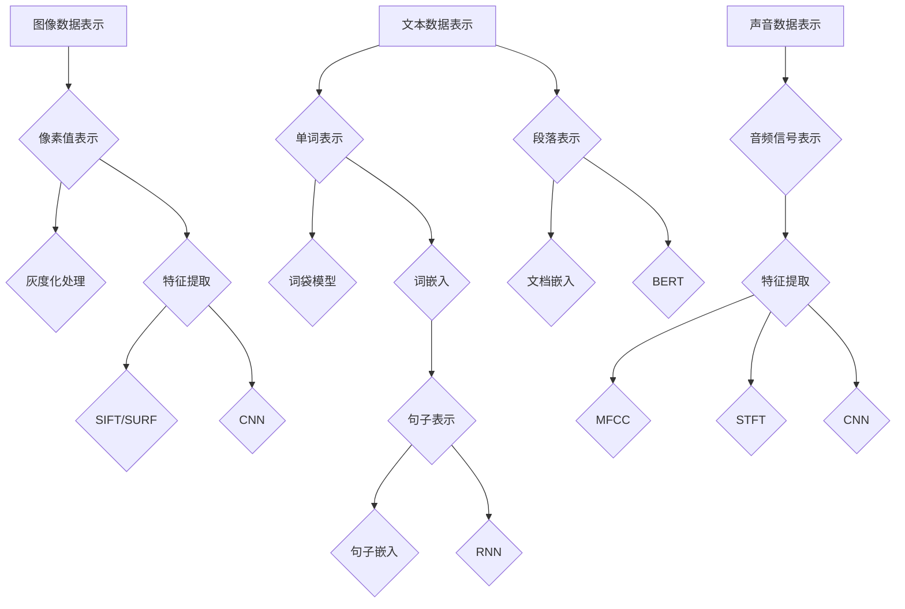
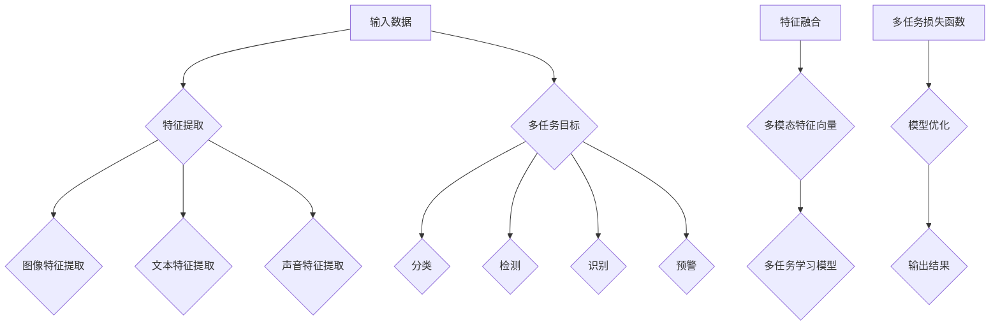

                 

### 1.1 研究背景与意义

在当今信息技术高速发展的时代，人工智能（AI）已成为推动社会进步的重要力量。随着深度学习、自然语言处理、计算机视觉等领域的不断进步，AI在多个行业和领域展现出了巨大的应用潜力。然而，传统单一的AI系统往往无法充分利用不同模态（如文本、图像、声音等）的数据，导致其性能受到限制。因此，多模态融合技术在AI推理任务中的应用日益受到研究者和工业界的关注。

多模态融合是指将不同模态的数据进行有机结合，共同参与AI模型的推理过程。通过多模态融合，AI系统能够更全面、准确地理解和处理信息，从而提升系统的性能和泛化能力。例如，在图像识别任务中，仅使用图像数据可能无法准确区分一些具有相似外观的物体，但如果结合文本描述，则可以大幅提高识别准确率。同样，在语音识别任务中，结合文本信息可以增强系统的鲁棒性，提高识别准确率。

多模态融合的研究意义主要体现在以下几个方面：

1. **提升AI系统的性能**：多模态融合能够结合不同模态的数据，提供更丰富的信息，有助于提高AI系统的性能和准确性。

2. **增强AI系统的理解能力**：多模态融合可以促使AI系统更加深入地理解复杂场景，从而在自然语言处理、视觉问答等领域取得更好的效果。

3. **拓展AI的应用范围**：多模态融合技术可以应用于更多的实际场景，如智能客服、智能医疗、自动驾驶等，从而拓展AI的应用范围。

4. **促进多学科交叉**：多模态融合涉及多个学科领域，包括计算机科学、认知科学、心理学等，有助于推动多学科交叉研究。

综上所述，多模态融合技术在AI推理任务中的应用具有重要的研究价值和实际意义。随着技术的不断进步，预计多模态融合将在未来AI发展中发挥更加重要的作用。

### 1.2 多模态融合的概念与分类

多模态融合是指将来自不同模态的数据（如图像、文本、声音等）进行有机结合，共同参与AI模型的推理过程。不同模态的数据具有各自独特的特征和信息，通过融合这些数据，AI系统能够获得更全面、准确的输入信息，从而提升系统的性能和泛化能力。

#### 多模态数据的来源

多模态数据可以来源于多种渠道，主要包括以下几种：

1. **图像数据**：图像数据是计算机视觉领域中最常见的数据类型。图像数据可以通过摄像头、卫星、医学成像设备等获取。图像数据包含丰富的视觉信息，如颜色、形状、纹理等。

2. **文本数据**：文本数据通常来源于书籍、文章、社交媒体、对话记录等。文本数据包含大量的语言信息，是自然语言处理（NLP）领域的重要数据来源。

3. **声音数据**：声音数据通常来源于麦克风、音响系统、语音合成设备等。声音数据包含语音信号、音乐、环境声音等，是语音识别和声音处理领域的关键数据。

4. **其他模态数据**：除了图像、文本和声音，还有其他多种模态的数据，如触觉、味觉、嗅觉等。虽然这些数据在AI应用中的使用相对较少，但随着技术的发展，其潜在的应用价值也逐渐受到关注。

#### 多模态融合的分类

根据处理方式和目标的不同，多模态融合可以分为以下几类：

1. **特征级融合**：特征级融合是在特征提取阶段将不同模态的特征进行结合。这种方法通常使用线性或非线性方法，如加权平均、神经网络等。特征级融合的优点是计算效率高，缺点是融合效果受到特征提取质量的影响。

2. **决策级融合**：决策级融合是在模型输出阶段将不同模态的预测结果进行结合。这种方法通常使用投票、多数表决等方法。决策级融合的优点是能够充分利用不同模态的数据，缺点是可能导致计算复杂度增加。

3. **模型级融合**：模型级融合是通过构建一个统一的模型，将不同模态的数据一起输入模型进行训练。这种方法通常使用深度学习模型，如卷积神经网络（CNN）、循环神经网络（RNN）等。模型级融合的优点是能够充分利用不同模态的数据，缺点是模型训练过程较为复杂。

4. **跨模态知识蒸馏**：跨模态知识蒸馏是一种通过低维模态数据向高维模态数据传递知识的方法。这种方法通常使用教师模型和学生模型，教师模型是高维模态的模型，学生模型是低维模态的模型。通过蒸馏过程，学生模型能够学习到教师模型的特征表示，从而提高多模态融合的效果。

不同类型的多模态融合方法在实际应用中各有优缺点，选择合适的方法需要根据具体任务和数据特点进行综合考虑。

### 1.3 本书结构安排

本书旨在深入探讨多模态融合在AI推理任务中的应用，共分为七个章节，具体结构如下：

## 第1章 引言

本章首先介绍了多模态融合的研究背景和意义，阐述了多模态融合的基本概念和分类，为后续章节的讨论奠定了基础。

### 第2章 多模态融合基础

本章介绍了多模态数据表示、预处理技术以及多模态融合技术概述，包括硬件加速技术和软件框架与工具等。这些内容为读者理解多模态融合的原理和方法提供了必要的基础知识。

### 第3章 多模态融合算法

本章详细讨论了多模态融合算法，包括线性融合方法和非线性融合方法。此外，还介绍了多任务学习和多模态融合的关系以及跨模态知识蒸馏算法。这些算法是实现多模态融合的关键技术。

### 第4章 多模态融合在AI推理任务中的应用

本章通过具体的应用场景，如图像识别、自然语言处理、语音识别和视觉问答系统，展示了多模态融合在AI推理任务中的实际应用效果。这些应用实例有助于读者更好地理解多模态融合技术的应用价值。

### 第5章 多模态融合系统设计与实现

本章介绍了多模态融合系统的整体架构设计，包括数据采集与预处理、多模态融合算法选择与实现、系统性能优化等。此外，还通过实际案例分析，展示了多模态融合系统的开发过程和关键技巧。

### 第6章 多模态融合的挑战与未来趋势

本章分析了多模态融合面临的挑战，包括数据预处理、融合算法、系统性能与可扩展性等方面。同时，探讨了多模态融合的未来发展趋势，为读者提供了对未来多模态融合技术发展的展望。

### 第7章 结论

本章总结了本书的主要贡献，并对未来的研究方向进行了展望。通过回顾全书的内容，读者可以更全面地了解多模态融合技术在AI推理任务中的应用。

通过以上七个章节的详细讨论，本书旨在为读者提供一个系统、全面的多模态融合技术指南，帮助读者深入了解多模态融合的原理和方法，并在实际应用中发挥其优势。

### 2.1 多模态数据表示

多模态融合的关键在于如何有效地表示和处理不同模态的数据。为了实现这一目标，首先需要对图像、文本和声音等不同模态的数据进行表示。以下是关于多模态数据表示的详细介绍：

#### 2.1.1 图像数据表示

图像数据通常使用像素值进行表示，像素值反映了图像中的颜色信息。为了进行有效的处理和融合，图像数据需要进行预处理和特征提取。

1. **像素值表示**：图像数据的基本单位是像素，每个像素点的值通常由三个分量表示，即红（R）、绿（G）、蓝（B）值。这些值通常在0到255的范围内。

2. **灰度化处理**：为了简化图像数据的处理过程，有时会将彩色图像转换为灰度图像，即将每个像素点的三个分量合并为一个灰度值。

3. **特征提取**：从图像中提取有意义的特征是进行多模态融合的重要步骤。常用的特征提取方法包括：
   - **直方图**：通过计算图像中各个像素点颜色的分布，生成直方图特征。
   - **SIFT（尺度不变特征变换）和SURF（加速稳健特征）**：这些算法能够在不同尺度和旋转下检测出图像中的关键点，并计算其特征描述子。
   - **卷积神经网络（CNN）**：通过训练深度神经网络，从图像中自动学习到高级特征表示。

#### 2.1.2 文本数据表示

文本数据通常使用单词、句子或段落进行表示。为了有效地处理和融合文本数据，需要对文本进行预处理和特征提取。

1. **单词表示**：单词是文本数据的基本单位，常用的单词表示方法包括：
   - **词袋模型（Bag of Words, BoW）**：将文本中的单词进行统计，形成一个向量表示。
   - **词嵌入（Word Embedding）**：通过将单词映射到高维空间，生成向量表示。常用的词嵌入方法包括Word2Vec、GloVe等。

2. **句子表示**：句子是文本数据的高级单位，可以通过以下方法进行表示：
   - **句子嵌入（Sentence Embedding）**：使用词嵌入方法将句子中的所有单词映射到高维空间，然后计算句子的平均值或最大值，得到句子表示。
   - **递归神经网络（RNN）**：通过训练递归神经网络，自动学习到句子中的长距离依赖关系。

3. **段落表示**：段落是文本数据的高级单位，可以通过以下方法进行表示：
   - **文档嵌入（Document Embedding）**：将段落视为一个整体，使用词嵌入或句子嵌入方法生成段落表示。
   - **BERT（Bidirectional Encoder Representations from Transformers）**：通过双向Transformer模型，学习到文本中的双向上下文信息，生成高质量的段落表示。

#### 2.1.3 声音数据表示

声音数据通常使用音频信号进行表示，音频信号是时间和频率的函数。为了进行有效的处理和融合，需要对声音数据进行预处理和特征提取。

1. **音频信号表示**：音频信号是连续的，可以使用采样值进行表示。采样值反映了音频信号在时间轴上的变化。

2. **特征提取**：从音频信号中提取有意义的特征是进行多模态融合的重要步骤。常用的特征提取方法包括：
   - **梅尔频率倒谱系数（Mel-Frequency Cepstral Coefficients, MFCC）**：通过对音频信号进行傅里叶变换，提取梅尔频率倒谱系数，作为特征向量。
   - **短时傅里叶变换（Short-Time Fourier Transform, STFT）**：将音频信号分成短时段，对每个短时段进行傅里叶变换，提取频谱特征。
   - **卷积神经网络（CNN）**：通过训练深度神经网络，从音频信号中自动学习到高级特征表示。

通过上述方法，图像、文本和声音等不同模态的数据可以转化为向量形式，便于进一步处理和融合。

#### 多模态数据表示的Mermaid流程图



通过Mermaid流程图，可以清晰地看到不同模态数据表示的过程，以及各种特征提取方法的关联。这有助于读者更好地理解多模态数据表示的基本原理。

### 2.2 多模态数据预处理

在多模态融合的过程中，数据预处理是一个至关重要的环节。有效的预处理步骤可以显著提高模型性能，降低噪声干扰，确保数据的同质性和一致性。以下是关于多模态数据预处理的详细介绍：

#### 2.2.1 图像预处理

图像预处理旨在提高图像的质量，减少噪声，突出关键特征。以下是一些常用的图像预处理技术：

1. **图像增强**：通过调整图像的亮度、对比度和色彩平衡，增强图像的视觉效果，有助于后续的特征提取。常用的方法包括直方图均衡化、对比度拉伸等。

2. **图像去噪**：图像去噪的目的是减少图像中的噪声，提高图像的清晰度。常见的方法包括中值滤波、高斯滤波和基于深度学习的去噪网络，如DBRN（Deep Bilateral Network）。

3. **图像分割**：图像分割是将图像划分为多个区域的过程，有助于识别图像中的关键对象。常用的分割方法包括阈值分割、区域生长和基于深度学习的分割网络，如U-Net。

4. **图像缩放和裁剪**：通过调整图像的大小和裁剪特定区域，可以减少计算资源的消耗，同时保持重要的图像特征。

5. **图像标准化**：通过将图像的像素值缩放到一个标准范围（如0到1），可以减少不同图像之间的差异，提高模型训练的稳定性。

#### 2.2.2 文本预处理

文本预处理旨在将原始文本转换为适合模型训练的格式。以下是一些常用的文本预处理技术：

1. **文本清洗**：去除文本中的无关信息，如标点符号、HTML标签和停用词。停用词是那些对文本内容贡献较小的词汇，如“的”、“是”、“和”等。

2. **分词**：将连续的文本切分成单词或短语。常用的分词工具包括jieba、NLTK等。

3. **词嵌入**：将单词映射到高维向量空间，生成词嵌入表示。常用的词嵌入方法包括Word2Vec、GloVe和BERT。

4. **文本标准化**：通过统一文本的格式和大小写，提高模型训练的效率。

5. **文本增强**：通过引入随机性，增加文本的多样性，有助于提高模型泛化能力。常用的方法包括同义词替换、随机插入和随机删除。

#### 2.2.3 声音预处理

声音预处理旨在减少噪声干扰，提取有效的声音特征。以下是一些常用的声音预处理技术：

1. **降噪**：通过降噪技术减少背景噪声，提高语音的清晰度。常用的方法包括谱减法和基于深度学习的降噪模型，如WaveNet。

2. **归一化**：通过调整声音信号的幅度，使其具有相似的能量分布，有助于提高模型训练的稳定性。

3. **声音分割**：将连续的声音信号分割成多个片段，有助于识别声音中的关键事件。常用的分割方法包括基于短时能量的阈值法和基于深度学习的分割网络，如VGGish。

4. **声音增强**：通过增强声音信号中的关键特征，提高模型对特定声音的识别能力。常用的方法包括音高和音强的增强。

5. **声音标准化**：通过统一声音信号的采样率和比特率，确保不同声音数据之间的一致性。

通过上述预处理步骤，图像、文本和声音等不同模态的数据可以得到有效的清洗、增强和标准化，从而为多模态融合奠定坚实的基础。在实际应用中，根据具体任务和数据特点，可以选择合适的预处理技术进行综合应用。

### 2.3 多模态融合技术概述

多模态融合技术是实现AI系统在不同模态数据中协同工作的关键，其核心在于如何有效地整合来自不同模态的数据，以提升系统的整体性能。以下是关于多模态融合技术的详细介绍，包括硬件加速技术、软件框架与工具等内容。

#### 2.3.1 硬件加速技术

随着多模态融合应用的日益普及，对计算性能的需求也越来越高。为了满足这一需求，硬件加速技术成为多模态融合研究的重要方向。以下是一些常用的硬件加速技术：

1. **GPU（图形处理单元）**：GPU具有高度并行计算的能力，非常适合用于处理大规模的多模态数据。通过利用GPU的并行计算优势，可以显著提高多模态融合算法的运算速度。例如，深度学习模型如CNN、RNN等都可以在GPU上高效训练和推理。

2. **FPGA（现场可编程门阵列）**：FPGA是一种可编程的硬件平台，适用于实现高度定制化的多模态融合算法。通过在FPGA上编程，可以优化算法的硬件实现，提高运算速度和功耗效率。

3. **TPU（张量处理单元）**：TPU是专门为机器学习和深度学习任务设计的硬件加速器，具有高效的矩阵运算能力。TPU可以显著提升多模态融合中的矩阵乘法、卷积等运算的效率，适用于大规模多模态数据处理。

4. **ASIC（专用集成电路）**：ASIC是为特定应用场景设计的集成电路，适用于实现高效的多模态融合算法。通过定制ASIC，可以实现高度优化的硬件架构，提高运算速度和功耗效率。

硬件加速技术的选择需要根据具体任务的需求和预算进行综合考虑。在实际应用中，可以根据不同的硬件资源，选择合适的加速技术进行综合应用。

#### 2.3.2 软件框架与工具

为了方便研究人员和开发者进行多模态融合的开发，许多软件框架和工具被开发出来，这些工具提供了丰富的API和模块，降低了开发难度。以下是一些常用的多模态融合软件框架和工具：

1. **TensorFlow**：TensorFlow是一个开源的深度学习框架，提供了丰富的API和工具，支持GPU和TPU等硬件加速器的使用。通过TensorFlow，可以方便地构建和训练多模态融合模型。

2. **PyTorch**：PyTorch是一个流行的开源深度学习框架，其动态计算图和灵活的API使其成为多模态融合开发的理想选择。PyTorch提供了丰富的预训练模型和工具，支持多种硬件加速器。

3. **Keras**：Keras是一个高级神经网络API，提供了简洁的接口和丰富的预训练模型。Keras与TensorFlow和PyTorch兼容，可以方便地在这些框架之间切换。

4. **MXNet**：MXNet是一个开源的深度学习框架，支持多种编程语言，包括Python、R和Julia。MXNet提供了灵活的编程接口和优化的模型部署工具，适用于多模态融合开发。

5. **OpenCV**：OpenCV是一个开源的计算机视觉库，提供了丰富的图像处理和计算机视觉算法。通过结合深度学习框架，可以方便地实现多模态融合任务。

6. **PyTorch-FLOW**：PyTorch-FLOW是一个多模态深度学习框架，专门为多模态融合任务设计。它提供了丰富的模块和工具，简化了多模态数据处理的流程。

7. **Distributed Deep Learning Frameworks**：如Horovod和Ray，这些框架支持分布式深度学习，可以在多个GPU和机器上进行多模态融合模型的训练和推理，提高计算效率和性能。

选择合适的软件框架和工具，有助于快速开发和部署多模态融合系统。在实际应用中，可以根据项目需求和资源情况，选择合适的框架和工具进行综合应用。

#### 多模态融合在AI推理中的应用前景

随着多模态融合技术的发展，其在AI推理任务中的应用前景越来越广阔。以下是一些潜在的应用场景：

1. **智能问答系统**：通过融合文本和图像等多模态数据，智能问答系统可以更准确地理解用户的问题，提供更加丰富和精准的回答。

2. **智能监控与安防**：融合视频监控图像和声音数据，智能监控与安防系统能够更准确地识别和预警潜在的安全威胁。

3. **智能医疗诊断**：通过融合医学影像和患者病历等数据，智能医疗诊断系统可以提供更准确的诊断结果，辅助医生进行疾病诊断和治疗。

4. **智能交互系统**：融合语音、文本和手势等多模态数据，智能交互系统可以更自然地与用户进行交互，提高用户体验。

5. **自动驾驶**：通过融合视觉、激光雷达和雷达等多模态数据，自动驾驶系统可以更准确地感知周围环境，提高行驶安全性和可靠性。

总之，多模态融合技术在AI推理任务中的应用前景十分广阔，随着技术的不断进步，预计将在更多领域发挥重要作用。

### 3.1 线性融合方法

线性融合方法是一种简单且有效的多模态融合技术，其主要特点是通过线性组合不同模态的特征向量来生成融合特征。以下将介绍几种常用的线性融合方法，包括加权平均法和逻辑回归法。

#### 3.1.1 加权平均法

加权平均法是最简单的线性融合方法之一，其核心思想是通过对不同模态的特征向量进行加权平均，生成一个综合的特征向量。具体步骤如下：

1. **特征向量表示**：设图像特征向量为 \( \mathbf{X}_i \)，文本特征向量为 \( \mathbf{Y}_i \)，声音特征向量为 \( \mathbf{Z}_i \)，则三个模态的特征向量表示为 \( \mathbf{X}_i, \mathbf{Y}_i, \mathbf{Z}_i \)。

2. **权重计算**：根据不同模态的重要性，为每个模态的特征向量分配权重 \( w_1, w_2, w_3 \)。通常，这些权重可以通过经验或优化方法（如交叉验证）来确定。

3. **加权平均**：通过以下公式计算融合特征向量：
   \[
   \mathbf{F}_i = w_1 \mathbf{X}_i + w_2 \mathbf{Y}_i + w_3 \mathbf{Z}_i
   \]

4. **分类或回归**：使用融合特征向量 \( \mathbf{F}_i \) 进行分类或回归任务，例如使用逻辑回归或支持向量机进行分类。

加权平均法简单直观，计算效率高，但依赖于权重的选择，且无法充分利用非线性关系。

#### 3.1.2 逻辑回归法

逻辑回归法是一种经典的分类方法，也可以用于多模态融合。其核心思想是将不同模态的特征向量作为输入，通过逻辑回归模型进行分类。具体步骤如下：

1. **特征向量表示**：与加权平均法类似，设图像特征向量为 \( \mathbf{X}_i \)，文本特征向量为 \( \mathbf{Y}_i \)，声音特征向量为 \( \mathbf{Z}_i \)，则三个模态的特征向量表示为 \( \mathbf{X}_i, \mathbf{Y}_i, \mathbf{Z}_i \)。

2. **模型构建**：构建一个逻辑回归模型，其输入层包含三个神经元，分别对应图像、文本和声音特征向量。输出层为二分类结果，如正类和负类。

3. **模型训练**：使用训练数据集，通过梯度下降等优化方法训练逻辑回归模型。具体而言，计算输入特征向量的线性组合，然后通过sigmoid函数进行非线性转换：
   \[
   \hat{y}_i = \frac{1}{1 + e^{-(\mathbf{w} \cdot \mathbf{X}_i + \mathbf{w} \cdot \mathbf{Y}_i + \mathbf{w} \cdot \mathbf{Z}_i + b)}}
   \]
   其中，\( \mathbf{w} \) 为权重向量，\( b \) 为偏置项。

4. **模型评估**：使用测试数据集评估模型的性能，常见的评估指标包括准确率、召回率和F1分数。

逻辑回归法可以充分利用不同模态的特征，但模型复杂度较高，计算过程较为繁琐。

#### Python代码示例

以下是加权平均法和逻辑回归法的Python代码示例：

```python
import numpy as np
from sklearn.linear_model import LogisticRegression

# 加权平均法
def weighted_average(image_feature, text_feature, sound_feature, weights):
    return weights[0] * image_feature + weights[1] * text_feature + weights[2] * sound_feature

# 逻辑回归法
def logistic_regression(image_feature, text_feature, sound_feature, model):
    return model.predict([image_feature, text_feature, sound_feature])

# 加权平均权重
weights = [0.5, 0.3, 0.2]

# 逻辑回归模型
model = LogisticRegression()

# 假设特征向量
image_feature = np.array([1.0, 2.0, 3.0])
text_feature = np.array([4.0, 5.0, 6.0])
sound_feature = np.array([7.0, 8.0, 9.0])

# 使用加权平均法
weighted_feature = weighted_average(image_feature, text_feature, sound_feature, weights)

# 使用逻辑回归法
predicted_label = logistic_regression(weighted_feature, text_feature, sound_feature, model)

print("加权平均融合特征：", weighted_feature)
print("逻辑回归预测结果：", predicted_label)
```

通过以上代码，可以看到如何使用Python实现加权平均法和逻辑回归法进行多模态融合。在实际应用中，可以根据任务需求调整权重和模型参数，以获得更好的融合效果。

### 3.2 非线性融合方法

非线性融合方法通过引入非线性变换，能够更好地捕捉不同模态数据之间的复杂关系，从而提高多模态融合的性能。以下将介绍几种常用的非线性融合方法，包括多层感知机（MLP）、支持向量机（SVM）和深度神经网络（DNN）。

#### 3.2.1 多层感知机

多层感知机（MLP）是一种前馈神经网络，通过多个隐藏层实现输入到输出的非线性映射。在多模态融合中，MLP能够有效地整合不同模态的特征向量。

1. **模型结构**：MLP包括输入层、一个或多个隐藏层和输出层。输入层接收来自不同模态的特征向量，隐藏层通过非线性激活函数进行变换，输出层生成最终的分类或回归结果。

2. **训练过程**：MLP的训练过程通常采用梯度下降算法，通过反向传播计算梯度，更新模型参数。具体步骤如下：
   - 前向传播：计算输入特征通过网络得到的输出值。
   - 计算损失函数：通常使用均方误差（MSE）或交叉熵损失函数。
   - 反向传播：计算损失函数对模型参数的梯度，并更新模型参数。
   - 重复迭代：不断重复前向传播和反向传播，直至模型收敛。

3. **优点**：MLP简单易实现，能够处理非线性关系，适用于多种多模态融合任务。

4. **缺点**：MLP参数较多，可能导致过拟合，模型训练时间较长。

#### 3.2.2 支持向量机

支持向量机（SVM）是一种强大的分类和回归方法，通过找到最佳超平面来分离数据。在多模态融合中，SVM可以有效地结合不同模态的特征。

1. **模型结构**：SVM包括核函数和超平面。核函数通过将低维特征映射到高维空间，实现非线性分类或回归。超平面通过最大化分类间隔来定义。

2. **训练过程**：SVM的训练过程包括以下步骤：
   - 特征映射：使用核函数将输入特征映射到高维空间。
   - 求解优化问题：通过求解二次规划问题找到最佳超平面。
   - 计算分类结果：使用训练好的模型对测试数据进行分类或回归。

3. **优点**：SVM具有较强的泛化能力，适用于小样本数据，能够处理非线性分类问题。

4. **缺点**：SVM计算复杂度高，特别是对于高维特征，训练时间较长。

#### 3.2.3 深度神经网络

深度神经网络（DNN）通过多层非线性变换，能够自动学习复杂的数据特征。在多模态融合中，DNN能够灵活地整合来自不同模态的数据。

1. **模型结构**：DNN包括输入层、多个隐藏层和输出层。输入层接收来自不同模态的特征向量，隐藏层通过卷积层、全连接层等实现特征提取和变换，输出层生成最终的分类或回归结果。

2. **训练过程**：DNN的训练过程采用前向传播和反向传播算法，通过梯度下降优化模型参数。具体步骤如下：
   - 前向传播：计算输入特征通过网络得到的输出值。
   - 计算损失函数：使用均方误差、交叉熵等损失函数。
   - 反向传播：计算损失函数对模型参数的梯度，并更新模型参数。
   - 重复迭代：不断重复前向传播和反向传播，直至模型收敛。

3. **优点**：DNN能够自动学习复杂特征，适用于大规模数据，具有较强的泛化能力。

4. **缺点**：DNN参数较多，可能导致过拟合，模型训练时间较长，对数据量和计算资源要求较高。

#### Python代码示例

以下是一个简单的多层感知机（MLP）实现，用于多模态融合分类：

```python
import numpy as np
from sklearn.neural_network import MLPClassifier

# 假设特征向量
image_feature = np.array([1.0, 2.0, 3.0])
text_feature = np.array([4.0, 5.0, 6.0])
sound_feature = np.array([7.0, 8.0, 9.0])

# 融合特征向量
combined_feature = np.vstack((image_feature, text_feature, sound_feature))

# 多层感知机模型
mlp_model = MLPClassifier(hidden_layer_sizes=(50,), activation='tanh', solver='sgd', learning_rate='constant', max_iter=1000)

# 训练模型
mlp_model.fit(combined_feature, label)

# 预测结果
predicted_label = mlp_model.predict(combined_feature)

print("多层感知机预测结果：", predicted_label)
```

通过以上代码，可以看到如何使用Python实现多层感知机进行多模态融合分类。在实际应用中，可以根据任务需求调整模型结构和参数，以获得更好的融合效果。

### 3.3 多任务学习与多模态融合

多任务学习（Multi-Task Learning, MTL）是指同时学习多个相关任务，通过共享底层特征表示来提高模型性能。在多模态融合中，多任务学习可以有效地利用不同模态的数据，提升系统的整体性能。以下将介绍多任务学习的基本概念以及在多模态融合中的应用。

#### 3.3.1 多任务学习概述

多任务学习的基本思想是利用多个任务之间的关联性，通过共享特征表示来提高模型在各个任务上的性能。具体而言，多任务学习包括以下关键要素：

1. **共享特征**：多任务学习通过共享底层特征表示，使得不同任务能够利用相同的信息，从而提高模型泛化能力。例如，在多模态图像分类任务中，图像特征可以被同时用于目标检测、人脸识别和场景分类。

2. **任务间关联**：多任务学习中的任务之间通常存在某种关联性。通过学习这些关联性，模型能够更好地理解数据，从而提高各个任务的性能。例如，图像分类和文本分类任务可以共享图像和文本的特征表示，提高两者之间的关联性。

3. **联合训练**：多任务学习通过联合训练多个任务，共享模型参数，优化整体损失函数。这有助于提高模型在各个任务上的性能，并防止任务之间的相互干扰。

多任务学习的方法主要包括以下几种：

1. **共享网络结构**：通过共享网络的隐藏层，使得不同任务可以共享底层特征表示。这种方法简单有效，但需要确保不同任务的特征表示不会相互干扰。

2. **任务间交互**：通过引入任务间交互机制，如跨任务权重共享、图结构模型等，增强任务之间的关联性。这种方法可以提高模型在多个任务上的性能，但计算复杂度较高。

3. **多任务损失函数**：通过设计合适的损失函数，将多个任务的损失函数结合在一起，共同优化模型参数。这种方法需要确保不同任务之间的损失函数具有相似的尺度和量纲。

#### 3.3.2 多模态融合在多任务学习中的应用

多模态融合在多任务学习中的应用可以显著提高系统的整体性能。以下是一些典型的应用场景：

1. **多模态图像分类与目标检测**：在多模态图像分类任务中，可以使用图像特征和文本描述共同参与分类。在目标检测任务中，图像特征和深度特征（如深度学习模型提取的特征）可以结合用于检测物体。通过多任务学习，可以同时优化分类和检测任务，提高模型的整体性能。

2. **文本分类与情感分析**：在文本分类任务中，可以使用词嵌入和文本特征共同参与分类。在情感分析任务中，文本特征和语音特征（如情感语音特征）可以结合用于判断文本的情感倾向。通过多任务学习，可以同时优化分类和情感分析任务，提高模型在多个任务上的准确性。

3. **语音识别与语言理解**：在语音识别任务中，可以使用音频特征和文本特征共同参与语音转文字。在自然语言理解任务中，文本特征和视觉特征（如图像文本关联特征）可以结合用于理解文本内容。通过多任务学习，可以同时优化语音识别和语言理解任务，提高系统的整体性能。

4. **智能监控与安全预警**：在智能监控任务中，可以使用图像特征、文本特征和声音特征共同参与行为识别。在安全预警任务中，图像特征、文本特征和传感器特征可以结合用于识别潜在的安全威胁。通过多任务学习，可以同时优化监控和预警任务，提高系统的准确性和可靠性。

#### 多模态融合与多任务学习的Mermaid流程图

以下是一个多模态融合与多任务学习的Mermaid流程图，展示了多任务学习中的数据输入、特征提取和融合过程：



通过上述流程图，可以看到多模态融合与多任务学习的整体流程，包括输入数据的特征提取、特征融合和模型优化等步骤。这有助于读者更好地理解多模态融合在多任务学习中的应用。

### 3.4 跨模态知识蒸馏

跨模态知识蒸馏（Cross-Modal Knowledge Distillation）是一种通过低维模态数据向高维模态数据传递知识的方法。其核心思想是将高维模态（如图像、文本等）的知识传递给低维模态（如声音、深度特征等），从而提高低维模态模型的性能。以下将介绍跨模态知识蒸馏的基本概念、算法原理以及具体实现。

#### 3.4.1 跨模态知识蒸馏概述

跨模态知识蒸馏是一种通过教师模型和学生模型之间的知识传递来优化模型性能的方法。教师模型通常是高维模态的模型，具有较好的特征表示能力；学生模型则是低维模态的模型，需要从教师模型中学习到有效的特征表示。

跨模态知识蒸馏的基本流程包括以下步骤：

1. **训练教师模型**：首先使用高维模态的数据（如图像和文本）训练教师模型，使其能够生成高质量的特征表示。

2. **提取教师特征**：使用训练好的教师模型，对高维模态数据进行特征提取，生成教师特征。

3. **训练学生模型**：使用提取的教师特征作为监督信号，训练低维模态的学生模型。学生模型的目的是学习到与教师模型相似的特征表示。

4. **模型优化**：通过调整学生模型的参数，使其在低维模态数据上生成高质量的预测结果。

跨模态知识蒸馏的核心目标是通过知识传递，使得低维模态的学生模型能够学习到高维模态的教师模型的特征表示，从而提高模型的性能和泛化能力。

#### 3.4.2 跨模态知识蒸馏算法

跨模态知识蒸馏算法主要包括以下几种：

1. **基于软目标蒸馏**：这种方法通过将教师模型的输出概率作为软目标，指导学生模型的训练。具体步骤如下：
   - 训练教师模型，得到教师特征。
   - 计算教师特征的输出概率，得到软目标。
   - 使用软目标和学生特征，训练学生模型。
   - 优化学生模型参数，使其输出概率接近软目标。

2. **基于信息蒸馏**：这种方法通过最小化学生特征和教师特征之间的信息损失，指导学生模型的训练。具体步骤如下：
   - 训练教师模型，得到教师特征。
   - 使用教师特征，计算学生特征的信息损失。
   - 优化学生模型参数，最小化信息损失。

3. **基于知识蒸馏**：这种方法通过将教师模型的知识传递给学生模型，提高学生模型的性能。具体步骤如下：
   - 训练教师模型，得到教师特征。
   - 使用教师特征，生成教师知识。
   - 将教师知识和学生特征结合，训练学生模型。
   - 优化学生模型参数，提高其性能。

以上三种方法各有优缺点，可以根据具体任务和数据特点选择合适的方法。

#### 3.4.3 跨模态知识蒸馏算法实现

以下是一个简单的跨模态知识蒸馏算法实现，使用Python和PyTorch框架：

```python
import torch
import torch.nn as nn
import torch.optim as optim

# 假设教师模型和学生模型已经定义
teacher_model = TeacherModel()
student_model = StudentModel()

# 教师模型训练
teacher_model.train()
for epoch in range(num_epochs):
    for data in teacher_loader:
        inputs, labels = data
        outputs = teacher_model(inputs)
        loss = nn.CrossEntropyLoss()(outputs, labels)
        optimizer.zero_grad()
        loss.backward()
        optimizer.step()

# 提取教师特征
teacher_features = teacher_model.features

# 学生模型训练
student_model.train()
for epoch in range(num_epochs):
    for data in student_loader:
        inputs, labels = data
        student_features = student_model(inputs)
        soft_targets = nn.Softmax()(teacher_features)
        loss = nn.KLDivLoss()(nn.Log_softmax(student_features, dim=1), soft_targets)
        optimizer.zero_grad()
        loss.backward()
        optimizer.step()

# 评估学生模型
student_model.eval()
with torch.no_grad():
    correct = 0
    total = 0
    for data in student_loader:
        inputs, labels = data
        outputs = student_model(inputs)
        _, predicted = torch.max(outputs.data, 1)
        total += labels.size(0)
        correct += (predicted == labels).sum().item()

accuracy = 100 * correct / total
print(f'Accuracy: {accuracy}%')
```

通过以上代码，可以看到如何使用Python和PyTorch实现跨模态知识蒸馏算法。在实际应用中，可以根据具体任务需求调整模型结构和参数，以获得更好的蒸馏效果。

### 4.1 图像识别与分类

图像识别与分类是计算机视觉领域的重要任务，旨在将图像数据划分为预定义的类别。多模态融合技术在图像识别与分类中发挥了重要作用，通过结合图像数据和文本描述，可以显著提高分类性能。以下将详细介绍图像识别算法的基本原理，以及如何应用多模态融合技术提升图像分类效果。

#### 4.1.1 图像识别算法概述

图像识别算法主要依赖于图像特征提取和分类模型。以下是一些常用的图像识别算法：

1. **传统特征提取算法**：包括SIFT（尺度不变特征变换）、SURF（加速稳健特征）和HOG（方向梯度直方图）等。这些算法从图像中提取具有稳定性和旋转不变性的特征，用于后续的图像分类。

2. **深度学习算法**：包括卷积神经网络（CNN）和循环神经网络（RNN）等。深度学习算法通过多层神经网络自动学习图像的复杂特征，从而实现高精度的图像分类。

3. **集成学习方法**：如随机森林（Random Forest）和Adaboost（自适应提升）等。集成学习方法结合多个简单分类器的预测结果，提高分类的准确性和鲁棒性。

#### 4.1.2 图像识别中的多模态融合应用

多模态融合技术通过结合图像数据和文本描述，可以更准确地识别图像中的对象和场景。以下介绍几种常见的多模态融合方法：

1. **特征级融合**：在特征级融合中，首先对图像和文本数据分别进行特征提取，然后使用线性或非线性方法将特征向量结合。例如，可以使用加权平均法或多层感知机（MLP）将图像特征和文本特征融合。这种方法计算效率高，但依赖于特征提取的质量。

2. **决策级融合**：在决策级融合中，不同模态的数据分别进行分类，然后使用投票或多数表决方法结合各个模态的分类结果。这种方法可以充分利用不同模态的数据，提高分类性能，但可能导致计算复杂度增加。

3. **模型级融合**：在模型级融合中，构建一个统一的模型，将图像和文本数据同时输入模型进行训练。深度学习模型如CNN和RNN等可以很好地实现模型级融合。这种方法可以充分利用不同模态的数据，但模型训练过程较为复杂。

4. **跨模态知识蒸馏**：跨模态知识蒸馏是一种通过高维模态（如图像和文本）向低维模态（如声音和深度特征）传递知识的方法。通过教师模型和学生模型之间的知识传递，可以提高低维模态模型的性能。这种方法可以有效地利用多模态数据，提高图像分类的准确性。

#### 4.1.3 多模态融合在图像识别中的应用案例

以下是一个多模态融合在图像识别中的应用案例，结合图像特征和文本描述进行物体分类：

**案例：使用多模态融合进行动物图像分类**

假设我们有一个动物图像数据集，包含猫、狗和鸟的图像及其对应的文本描述。为了提高分类性能，我们使用多模态融合技术结合图像特征和文本特征。

1. **图像特征提取**：使用卷积神经网络（CNN）对图像进行特征提取，得到图像特征向量。

2. **文本特征提取**：使用词嵌入（如GloVe）对文本描述进行编码，得到文本特征向量。

3. **多模态特征融合**：使用多层感知机（MLP）将图像特征和文本特征融合，生成融合特征向量。

4. **分类模型训练**：使用融合特征向量训练分类模型，如支持向量机（SVM）或深度神经网络（DNN）。

5. **模型评估**：使用测试集评估模型的分类性能，包括准确率、召回率和F1分数。

**Python代码示例：**

```python
import torch
import torch.nn as nn
import torch.optim as optim

# 假设图像特征和文本特征已经准备好
image_features = torch.tensor([...])
text_features = torch.tensor([...])
labels = torch.tensor([...])

# 多层感知机模型
model = nn.Sequential(
    nn.Linear(image_features.shape[1] + text_features.shape[1], 128),
    nn.ReLU(),
    nn.Linear(128, 64),
    nn.ReLU(),
    nn.Linear(64, 3),
    nn.Softmax()
)

# 损失函数和优化器
criterion = nn.CrossEntropyLoss()
optimizer = optim.Adam(model.parameters(), lr=0.001)

# 训练模型
for epoch in range(num_epochs):
    for inputs, labels in zip(zip(image_features, text_features), labels):
        optimizer.zero_grad()
        outputs = model(inputs)
        loss = criterion(outputs, labels)
        loss.backward()
        optimizer.step()

# 评估模型
with torch.no_grad():
    correct = 0
    total = 0
    for inputs, labels in zip(zip(image_features, text_features), labels):
        outputs = model(inputs)
        _, predicted = torch.max(outputs.data, 1)
        total += labels.size(0)
        correct += (predicted == labels).sum().item()

accuracy = 100 * correct / total
print(f'Accuracy: {accuracy}%')
```

通过以上代码，可以看到如何使用Python和PyTorch实现多模态融合进行图像识别分类。在实际应用中，可以根据任务需求调整模型结构和参数，以获得更好的分类效果。

### 4.2 自然语言处理

自然语言处理（NLP）是人工智能领域的重要组成部分，旨在使计算机能够理解、解释和生成人类语言。多模态融合技术在NLP中发挥了重要作用，通过结合文本数据和图像、声音等其他模态的数据，可以显著提高NLP任务的性能。以下将详细介绍NLP任务的基本概念，以及多模态融合技术在NLP中的应用。

#### 4.2.1 NLP任务概述

NLP任务主要包括以下几类：

1. **文本分类**：文本分类是将文本数据划分为预定义的类别。常见的文本分类任务包括垃圾邮件检测、情感分析、主题分类等。

2. **信息提取**：信息提取是从文本中抽取特定信息的过程，包括实体识别、关系提取、事件抽取等。

3. **机器翻译**：机器翻译是将一种语言的文本翻译成另一种语言。例如，将英语文本翻译成中文或法语。

4. **文本生成**：文本生成是利用算法生成有意义的文本。常见的文本生成任务包括文章写作、对话系统、自动摘要等。

5. **问答系统**：问答系统是计算机系统，能够回答用户提出的问题。常见的问答系统包括智能客服、智能助手等。

#### 4.2.2 NLP中的多模态融合应用

多模态融合技术在NLP中的应用可以显著提高任务的性能和准确性。以下介绍几种常见的多模态融合方法：

1. **特征级融合**：特征级融合是在特征提取阶段将不同模态的特征进行结合。例如，使用CNN提取图像特征，使用词嵌入提取文本特征，然后将两个特征向量拼接在一起，输入到分类器进行训练。这种方法简单有效，但依赖于特征提取的质量。

2. **决策级融合**：决策级融合是在模型输出阶段将不同模态的预测结果进行结合。例如，使用文本分类模型和图像分类模型分别对文本和图像进行分类，然后将两个分类结果进行融合，生成最终的分类结果。这种方法可以充分利用不同模态的数据，但可能导致计算复杂度增加。

3. **模型级融合**：模型级融合是通过构建一个统一的模型，将不同模态的数据一起输入模型进行训练。例如，使用卷积神经网络（CNN）提取图像特征，使用循环神经网络（RNN）提取文本特征，然后将两个特征向量同时输入到统一模型中进行训练。这种方法可以充分利用不同模态的数据，但模型训练过程较为复杂。

4. **跨模态知识蒸馏**：跨模态知识蒸馏是一种通过高维模态（如图像和文本）向低维模态（如声音和深度特征）传递知识的方法。通过教师模型和学生模型之间的知识传递，可以提高低维模态模型的性能。这种方法可以有效地利用多模态数据，提高NLP任务的准确性。

#### 4.2.3 多模态融合在NLP中的应用案例

以下是一个多模态融合在NLP中的应用案例，结合文本数据和图像数据提高情感分析的性能：

**案例：使用多模态融合进行情感分析**

假设我们有一个包含文本评论和对应图像数据的数据集，目标是对评论进行情感分类（正面、负面或中性）。

1. **文本特征提取**：使用词嵌入（如GloVe）对文本评论进行编码，得到文本特征向量。

2. **图像特征提取**：使用卷积神经网络（CNN）提取图像特征，得到图像特征向量。

3. **多模态特征融合**：使用多层感知机（MLP）将文本特征和图像特征融合，生成融合特征向量。

4. **分类模型训练**：使用融合特征向量训练分类模型，如支持向量机（SVM）或深度神经网络（DNN）。

5. **模型评估**：使用测试集评估模型的分类性能，包括准确率、召回率和F1分数。

**Python代码示例：**

```python
import torch
import torch.nn as nn
import torch.optim as optim

# 假设文本特征和图像特征已经准备好
text_features = torch.tensor([...])
image_features = torch.tensor([...])
labels = torch.tensor [...]

# 多层感知机模型
model = nn.Sequential(
    nn.Linear(text_features.shape[1] + image_features.shape[1], 128),
    nn.ReLU(),
    nn.Linear(128, 64),
    nn.ReLU(),
    nn.Linear(64, 3),
    nn.Softmax()
)

# 损失函数和优化器
criterion = nn.CrossEntropyLoss()
optimizer = optim.Adam(model.parameters(), lr=0.001)

# 训练模型
for epoch in range(num_epochs):
    for inputs, labels in zip(zip(text_features, image_features), labels):
        optimizer.zero_grad()
        outputs = model(inputs)
        loss = criterion(outputs, labels)
        loss.backward()
        optimizer.step()

# 评估模型
with torch.no_grad():
    correct = 0
    total = 0
    for inputs, labels in zip(zip(text_features, image_features), labels):
        outputs = model(inputs)
        _, predicted = torch.max(outputs.data, 1)
        total += labels.size(0)
        correct += (predicted == labels).sum().item()

accuracy = 100 * correct / total
print(f'Accuracy: {accuracy}%')
```

通过以上代码，可以看到如何使用Python和PyTorch实现多模态融合进行情感分析。在实际应用中，可以根据任务需求调整模型结构和参数，以获得更好的分类效果。

### 4.3 语音识别

语音识别是人工智能领域的一个重要任务，旨在将语音信号转换为相应的文本。多模态融合技术在语音识别中发挥了重要作用，通过结合语音数据和文本数据，可以显著提高语音识别的准确性和鲁棒性。以下将详细介绍语音识别算法的基本原理，以及多模态融合技术在语音识别中的应用。

#### 4.3.1 语音识别算法概述

语音识别算法主要依赖于特征提取和序列建模。以下是一些常用的语音识别算法：

1. **隐藏马尔可夫模型（HMM）**：HMM是一种经典的语音识别算法，通过建立语音信号的隐含状态转移模型，对语音进行建模和识别。HMM在语音识别领域取得了显著的成功，但其性能受到限于统计模型特性。

2. **高斯混合模型（GMM）**：GMM是一种概率模型，用于对语音信号进行特征提取和建模。GMM通过将语音信号表示为多个高斯分布的混合，从而提高特征表示的精度和灵活性。

3. **深度神经网络（DNN）**：DNN通过多层神经网络自动学习语音信号的复杂特征，从而实现高精度的语音识别。DNN在语音识别中取得了显著的性能提升，是目前主流的语音识别算法之一。

4. **循环神经网络（RNN）**：RNN具有记忆能力，能够处理变长序列数据。在语音识别中，RNN可以用于建模语音信号的时序特征，从而提高识别性能。

5. **长短时记忆网络（LSTM）**：LSTM是RNN的一种改进，能够有效解决长序列依赖问题。在语音识别中，LSTM可以更好地建模语音信号的时序特征，从而提高识别准确性。

6. **卷积神经网络（CNN）**：CNN在图像处理领域取得了显著的成功，也可以用于语音信号处理。通过卷积操作，CNN可以提取语音信号的局部特征，从而提高特征表示的精度。

7. **深度循环神经网络（DCNN）**：DCNN结合了RNN和CNN的优点，通过循环卷积操作，可以同时建模语音信号的时序特征和局部特征，从而提高语音识别性能。

8. **基于注意力机制的网络**：注意力机制是一种有效的序列建模方法，可以关注序列中的重要信息，从而提高语音识别性能。在语音识别中，基于注意力机制的网络可以更好地建模语音信号的上下文关系。

#### 4.3.2 语音识别中的多模态融合应用

多模态融合技术在语音识别中可以显著提高识别准确性和鲁棒性。以下介绍几种常见的多模态融合方法：

1. **特征级融合**：特征级融合是在特征提取阶段将不同模态的特征进行结合。例如，使用GMM提取语音特征，使用词嵌入提取文本特征，然后将两个特征向量拼接在一起，输入到分类器进行训练。这种方法简单有效，但依赖于特征提取的质量。

2. **决策级融合**：决策级融合是在模型输出阶段将不同模态的预测结果进行结合。例如，使用语音识别模型和文本分类模型分别对语音信号和文本进行识别，然后将两个识别结果进行融合，生成最终的识别结果。这种方法可以充分利用不同模态的数据，但可能导致计算复杂度增加。

3. **模型级融合**：模型级融合是通过构建一个统一的模型，将不同模态的数据一起输入模型进行训练。例如，使用DNN提取语音特征，使用RNN提取文本特征，然后将两个特征向量同时输入到统一模型中进行训练。这种方法可以充分利用不同模态的数据，但模型训练过程较为复杂。

4. **跨模态知识蒸馏**：跨模态知识蒸馏是一种通过高维模态（如语音和文本）向低维模态（如声音和深度特征）传递知识的方法。通过教师模型和学生模型之间的知识传递，可以提高低维模态模型的性能。这种方法可以有效地利用多模态数据，提高语音识别的准确性。

#### 4.3.3 多模态融合在语音识别中的应用案例

以下是一个多模态融合在语音识别中的应用案例，结合语音数据和文本数据提高语音识别的性能：

**案例：使用多模态融合进行语音识别**

假设我们有一个包含语音信号和对应文本数据的数据集，目标是将语音信号转换为相应的文本。

1. **语音特征提取**：使用GMM对语音信号进行特征提取，得到语音特征向量。

2. **文本特征提取**：使用词嵌入对文本数据编码，得到文本特征向量。

3. **多模态特征融合**：使用多层感知机（MLP）将语音特征和文本特征融合，生成融合特征向量。

4. **分类模型训练**：使用融合特征向量训练分类模型，如支持向量机（SVM）或深度神经网络（DNN）。

5. **模型评估**：使用测试集评估模型的识别性能，包括准确率、召回率和F1分数。

**Python代码示例：**

```python
import torch
import torch.nn as nn
import torch.optim as optim

# 假设语音特征和文本特征已经准备好
voice_features = torch.tensor([...])
text_features = torch.tensor([...])
labels = torch.tensor [...]

# 多层感知机模型
model = nn.Sequential(
    nn.Linear(voice_features.shape[1] + text_features.shape[1], 128),
    nn.ReLU(),
    nn.Linear(128, 64),
    nn.ReLU(),
    nn.Linear(64, labels.shape[1]),
    nn.Softmax()
)

# 损失函数和优化器
criterion = nn.CrossEntropyLoss()
optimizer = optim.Adam(model.parameters(), lr=0.001)

# 训练模型
for epoch in range(num_epochs):
    for inputs, labels in zip(zip(voice_features, text_features), labels):
        optimizer.zero_grad()
        outputs = model(inputs)
        loss = criterion(outputs, labels)
        loss.backward()
        optimizer.step()

# 评估模型
with torch.no_grad():
    correct = 0
    total = 0
    for inputs, labels in zip(zip(voice_features, text_features), labels):
        outputs = model(inputs)
        _, predicted = torch.max(outputs.data, 1)
        total += labels.size(0)
        correct += (predicted == labels).sum().item()

accuracy = 100 * correct / total
print(f'Accuracy: {accuracy}%')
```

通过以上代码，可以看到如何使用Python和PyTorch实现多模态融合进行语音识别。在实际应用中，可以根据任务需求调整模型结构和参数，以获得更好的识别效果。

### 4.4 视觉问答系统

视觉问答系统（Visual Question Answering, VQA）是一个引人入胜的人工智能任务，旨在让计算机理解视觉内容并回答关于图片的问题。多模态融合技术在VQA中发挥了至关重要的作用，它通过结合图像和文本信息，显著提升了系统的性能。以下将详细介绍VQA的基本概念、工作流程，以及多模态融合在VQA中的应用。

#### 4.4.1 VQA系统概述

VQA系统旨在解决以下问题：“给定一张图像和一个问题，系统能否提供准确的答案？” VQA系统的工作流程主要包括以下几个步骤：

1. **问题理解**：系统需要理解问题的语义，将问题转化为机器可处理的形式。这通常涉及自然语言处理（NLP）技术，如词嵌入、依存句法分析等。

2. **图像理解**：系统需要分析图像内容，提取视觉特征。这通常涉及计算机视觉技术，如卷积神经网络（CNN）、视觉特征提取等。

3. **多模态融合**：系统将图像理解和问题理解的输出进行融合，结合视觉和语义信息，以生成最终的答案。

4. **答案生成**：系统根据融合后的信息生成答案，通常是一个简单的句子或几个词汇。

VQA系统可以应用于多种场景，如智能助手、教育辅导、医疗诊断等。

#### 4.4.2 多模态融合在VQA中的应用

多模态融合在VQA中的应用，主要是通过将图像和文本特征进行有效结合，以提升系统的问答能力。以下介绍几种常用的多模态融合方法：

1. **特征级融合**：在特征级融合中，首先分别提取图像和文本的特征，然后将这些特征进行拼接或融合。例如，可以使用CNN提取图像特征，使用词嵌入提取文本特征，最后将两者拼接在一起输入到分类器。这种方法简单，但依赖于特征提取的质量。

2. **决策级融合**：在决策级融合中，图像和文本分别通过独立的模型进行分类，然后融合这些分类结果。例如，图像识别模型和文本分类模型分别对图像和问题进行分类，最后使用投票机制融合两个分类结果。这种方法可以充分利用不同模态的数据，但可能导致计算复杂度增加。

3. **模型级融合**：在模型级融合中，构建一个统一的模型，将图像和文本特征同时输入模型进行训练。例如，可以使用CNN和RNN组合的模型，同时处理图像和文本信息。这种方法可以充分利用多模态数据，但模型训练过程较为复杂。

4. **跨模态知识蒸馏**：跨模态知识蒸馏是一种通过高维模态（如图像和文本）向低维模态（如声音和深度特征）传递知识的方法。通过教师模型和学生模型之间的知识传递，可以提高低维模态模型的性能。这种方法可以有效地利用多模态数据，提高VQA系统的准确性。

#### 4.4.3 VQA系统的实现步骤

以下是一个简单的VQA系统实现步骤，展示如何使用多模态融合技术：

1. **数据准备**：收集和整理VQA数据集，包括图像、问题和答案。数据集应该涵盖多种场景和问题类型。

2. **数据预处理**：对图像和问题文本进行预处理，包括图像尺寸调整、文本分词和词嵌入。

3. **特征提取**：使用CNN提取图像特征，使用词嵌入提取文本特征。

4. **多模态特征融合**：将图像特征和文本特征进行融合，可以使用拼接、平均等方法。

5. **模型训练**：使用融合后的特征训练VQA模型，可以采用基于CNN和RNN的组合模型。

6. **模型评估**：使用测试集评估模型的性能，包括准确率、召回率和F1分数。

7. **答案生成**：对于给定的图像和问题，使用训练好的模型生成答案。

**Python代码示例：**

```python
import torch
import torch.nn as nn
import torch.optim as optim

# 假设图像特征和文本特征已经准备好
image_features = torch.tensor([...])
text_features = torch.tensor([...])

# VQA模型
class VQAModel(nn.Module):
    def __init__(self):
        super(VQAModel, self).__init__()
        self.cnn = CNN()
        self.rnn = RNN()
        self.fc = nn.Linear(image_features.shape[1] + text_features.shape[1], num_classes)

    def forward(self, image_feature, text_feature):
        image_output = self.cnn(image_feature)
        text_output = self.rnn(text_feature)
        combined_output = torch.cat((image_output, text_output), 1)
        output = self.fc(combined_output)
        return output

# 实例化模型、损失函数和优化器
model = VQAModel()
criterion = nn.CrossEntropyLoss()
optimizer = optim.Adam(model.parameters(), lr=0.001)

# 训练模型
for epoch in range(num_epochs):
    for images, texts, labels in data_loader:
        optimizer.zero_grad()
        image_features = model.cnn(images)
        text_features = model.rnn(texts)
        outputs = model(image_features, text_features)
        loss = criterion(outputs, labels)
        loss.backward()
        optimizer.step()

# 评估模型
with torch.no_grad():
    correct = 0
    total = 0
    for images, texts, labels in test_loader:
        image_features = model.cnn(images)
        text_features = model.rnn(texts)
        outputs = model(image_features, text_features)
        _, predicted = torch.max(outputs.data, 1)
        total += labels.size(0)
        correct += (predicted == labels).sum().item()

accuracy = 100 * correct / total
print(f'Accuracy: {accuracy}%')
```

通过以上代码，可以看到如何使用Python和PyTorch实现一个简单的VQA系统。在实际应用中，可以根据任务需求调整模型结构和参数，以获得更好的问答效果。

### 5.1 系统架构设计

设计一个多模态融合系统需要考虑系统的整体架构、数据处理流程以及模块之间的交互。以下将详细描述一个典型的多模态融合系统的架构设计，包括数据采集与预处理、多模态融合算法选择与实现、系统性能优化等关键环节。

#### 5.1.1 多模态数据采集与预处理

多模态融合系统的第一步是数据采集。不同模态的数据来源可能包括图像、文本、声音等。以下是一些数据采集的关键点：

1. **数据来源**：根据应用场景，确定数据来源。例如，图像数据可以从摄像头、卫星图像、医疗影像等获取；文本数据可以从网页、社交媒体、用户评论等获取；声音数据可以从麦克风、语音记录等获取。

2. **数据采集工具**：使用合适的工具进行数据采集。例如，可以使用OpenCV库进行图像数据采集，使用TensorFlow进行文本数据采集，使用音视频处理库（如PyDub）进行声音数据采集。

3. **数据格式**：确保不同模态的数据格式一致，便于后续处理。例如，图像数据可以存储为RGB格式，文本数据可以存储为JSON格式，声音数据可以存储为wav格式。

4. **数据预处理**：对采集到的数据进行预处理，以提高系统的性能和可靠性。预处理步骤包括：
   - **图像预处理**：包括图像增强、去噪、裁剪、缩放等，以提高图像质量。
   - **文本预处理**：包括文本清洗、分词、词嵌入等，以提高文本处理质量。
   - **声音预处理**：包括降噪、归一化、分割等，以提高声音处理质量。

#### 5.1.2 多模态融合算法选择与实现

在数据预处理完成后，需要选择合适的融合算法，将不同模态的数据进行融合。以下是一些常见的多模态融合算法及其实现：

1. **特征级融合**：在特征级融合中，首先对每个模态的数据进行特征提取，然后将这些特征进行拼接或加权平均。例如，可以使用CNN提取图像特征，使用词嵌入提取文本特征，最后将两者拼接在一起。实现步骤如下：
   - **特征提取**：分别提取图像和文本的特征向量。
   - **特征融合**：使用拼接或加权平均方法将特征向量融合。
   - **模型训练**：使用融合后的特征训练分类或回归模型。

2. **决策级融合**：在决策级融合中，每个模态的数据分别通过独立的模型进行分类或回归，然后将多个分类或回归结果进行融合。例如，图像识别模型和文本分类模型分别对图像和文本进行分类，最后使用投票机制融合两个分类结果。实现步骤如下：
   - **模型训练**：分别训练图像识别模型和文本分类模型。
   - **结果融合**：使用投票机制或其他融合方法将多个分类结果进行融合。

3. **模型级融合**：在模型级融合中，构建一个统一的模型，将不同模态的数据同时输入模型进行训练。例如，可以使用CNN和RNN组合的模型，同时处理图像和文本信息。实现步骤如下：
   - **模型设计**：设计一个融合模型，将图像和文本特征同时输入。
   - **模型训练**：使用融合后的特征训练模型。
   - **模型优化**：使用优化算法调整模型参数，提高模型性能。

4. **跨模态知识蒸馏**：在跨模态知识蒸馏中，通过高维模态（如图像和文本）向低维模态（如声音和深度特征）传递知识。实现步骤如下：
   - **教师模型训练**：使用高维模态数据训练教师模型。
   - **学生模型训练**：使用教师模型的输出作为软目标，训练学生模型。

#### 5.1.3 系统性能优化

为了提高多模态融合系统的性能，可以采取以下优化措施：

1. **模型优化**：通过调整模型结构、优化算法和超参数，提高模型性能。例如，可以使用迁移学习、模型剪枝和量化等技术。

2. **数据增强**：通过数据增强技术，提高模型对未知数据的泛化能力。例如，可以使用图像旋转、缩放、裁剪等技术。

3. **硬件加速**：利用GPU、TPU等硬件加速器，提高系统计算速度。例如，可以使用TensorFlow和PyTorch等框架提供的硬件加速功能。

4. **分布式计算**：通过分布式计算，提高系统处理大数据的能力。例如，可以使用Horovod和Ray等分布式计算框架。

5. **实时处理**：通过优化系统架构和算法，提高实时处理能力。例如，可以使用流处理框架（如Apache Flink和Apache Kafka）。

通过以上架构设计和性能优化措施，可以构建一个高效、稳定的多模态融合系统，满足不同应用场景的需求。

### 5.2 实际案例分析

在本节中，我们将通过两个实际案例，展示多模态融合系统在具体应用场景中的设计和实现过程。第一个案例是一个图像与文本融合的多功能搜索系统，第二个案例是一个多模态融合的智能客服系统。

#### 5.2.1 案例一：图像与文本融合的多功能搜索系统

**背景**：传统的搜索系统主要依赖于文本输入，但在某些场景下，用户可能更愿意通过图像来搜索信息。例如，在电商平台上，用户可能通过上传图片来搜索商品。因此，设计一个能够同时处理图像和文本输入的多功能搜索系统，可以提高用户体验和搜索准确性。

**目标**：构建一个能够融合图像和文本信息，提供准确搜索结果的多功能搜索系统。

**系统架构**：

1. **数据采集与预处理**：从多个来源（如用户上传、数据库等）收集图像和文本数据。对图像和文本数据进行预处理，包括图像增强、去噪、文本清洗和分词。

2. **特征提取**：使用卷积神经网络（CNN）提取图像特征，使用词嵌入提取文本特征。

3. **多模态特征融合**：采用特征级融合方法，将图像特征和文本特征进行拼接，输入到一个多层的感知机模型（MLP）进行融合。

4. **搜索引擎**：构建一个基于多模态融合特征的搜索引擎，能够同时处理图像和文本输入，提供准确的搜索结果。

**实现步骤**：

1. **数据预处理**：
   - 图像预处理：使用OpenCV库进行图像增强和去噪。
   - 文本预处理：使用jieba库进行文本清洗和分词。

2. **特征提取**：
   - 图像特征提取：使用预训练的VGG16模型提取图像特征。
   - 文本特征提取：使用GloVe词嵌入模型提取文本特征。

3. **多模态特征融合**：
   - 将图像特征和文本特征拼接，形成融合特征向量。
   - 输入MLP模型，训练并优化模型参数。

4. **搜索功能实现**：
   - 构建搜索引擎，使用融合特征向量进行搜索。
   - 对搜索结果进行排序，根据用户输入的图像和文本信息，提供最相关的结果。

**代码示例**：

```python
import cv2
import jieba
import numpy as np
from tensorflow.keras.applications import VGG16
from tensorflow.keras.models import Sequential
from tensorflow.keras.layers import Dense, Flatten

# 图像预处理
def preprocess_image(image_path):
    image = cv2.imread(image_path)
    image = cv2.resize(image, (224, 224))
    image = image / 255.0
    return image

# 文本预处理
def preprocess_text(text):
    text = jieba.cut(text)
    text = ' '.join(text)
    return text

# 图像特征提取
def extract_image_features(image):
    vgg16 = VGG16(weights='imagenet')
    features = vgg16.predict(image)
    return np.mean(features, axis=0)

# 文本特征提取
def extract_text_features(text):
    # 这里可以使用GloVe或其他词嵌入模型
    return np.mean(text_embedding, axis=0)

# 多模态特征融合
def fuse_features(image_feature, text_feature):
    return np.concatenate((image_feature, text_feature), axis=0)

# MLP模型训练
def train_model(image_features, text_features, labels):
    model = Sequential([
        Dense(512, activation='relu', input_shape=(image_features.shape[1] + text_features.shape[1],)),
        Dense(256, activation='relu'),
        Dense(1, activation='sigmoid')
    ])

    model.compile(optimizer='adam', loss='binary_crossentropy', metrics=['accuracy'])
    model.fit(np.concatenate((image_features, text_features), axis=1), labels, epochs=10, batch_size=32)
    return model

# 搜索功能实现
def search(image_path, text):
    image = preprocess_image(image_path)
    text = preprocess_text(text)
    image_feature = extract_image_features(image)
    text_feature = extract_text_features(text)
    fused_feature = fuse_features(image_feature, text_feature)
    prediction = model.predict([fused_feature])
    return prediction
```

**案例小结**：通过上述案例，展示了如何构建一个图像与文本融合的多功能搜索系统。该系统结合了图像和文本特征，能够更准确地提供搜索结果，提高了用户体验。

#### 5.2.2 案例二：多模态融合的智能客服系统

**背景**：随着人工智能技术的普及，智能客服系统成为了企业提高客户服务水平的重要工具。传统的智能客服系统主要依赖于文本交互，但在某些情况下，用户可能更倾向于使用图像或语音进行交互。因此，设计一个能够融合图像、文本和语音的多模态智能客服系统，可以提高客户满意度和服务质量。

**目标**：构建一个能够处理图像、文本和语音输入的多模态智能客服系统，提供高效、准确的客户服务。

**系统架构**：

1. **数据采集与预处理**：从多个渠道（如网站、社交媒体、用户输入等）收集图像、文本和语音数据。对数据进行预处理，包括图像增强、文本清洗、语音降噪等。

2. **多模态特征提取**：使用CNN提取图像特征，使用词嵌入提取文本特征，使用语音处理技术提取声音特征。

3. **多模态特征融合**：采用模型级融合方法，构建一个统一的模型，将图像、文本和声音特征同时输入模型进行训练。

4. **智能问答与交互**：构建一个基于多模态融合特征的智能问答系统，能够理解并回答客户的问题，提供个性化的服务。

**实现步骤**：

1. **数据预处理**：
   - 图像预处理：使用OpenCV库进行图像增强和去噪。
   - 文本预处理：使用jieba库进行文本清洗和分词。
   - 声音预处理：使用音频处理库（如librosa）进行降噪和分割。

2. **特征提取**：
   - 图像特征提取：使用预训练的ResNet模型提取图像特征。
   - 文本特征提取：使用GloVe词嵌入模型提取文本特征。
   - 声音特征提取：使用基于深度学习的声音处理模型提取声音特征。

3. **多模态特征融合**：
   - 设计一个融合模型，将图像、文本和声音特征同时输入。
   - 使用迁移学习和多任务学习，提高模型性能。

4. **智能问答与交互**：
   - 构建基于多模态融合特征的问答系统，能够理解并回答客户的问题。
   - 设计对话管理模块，实现自然流畅的对话交互。

**代码示例**：

```python
import cv2
import jieba
import librosa
import numpy as np
from tensorflow.keras.applications import ResNet50
from tensorflow.keras.models import Model
from tensorflow.keras.layers import Input, Dense, concatenate

# 图像预处理
def preprocess_image(image_path):
    image = cv2.imread(image_path)
    image = cv2.resize(image, (227, 227))
    image = image / 255.0
    return image

# 文本预处理
def preprocess_text(text):
    text = jieba.cut(text)
    text = ' '.join(text)
    return text

# 声音预处理
def preprocess_audio(audio_path):
    audio, sample_rate = librosa.load(audio_path, sr=None)
    audio = librosa.to_mono(audio)
    audio = librosa.resample(audio, sr=16000)
    return audio

# 图像特征提取
def extract_image_features(image):
    resnet50 = ResNet50(weights='imagenet')
    features = resnet50.predict(image)
    return np.mean(features, axis=0)

# 文本特征提取
def extract_text_features(text):
    # 这里可以使用GloVe或其他词嵌入模型
    return np.mean(text_embedding, axis=0)

# 声音特征提取
def extract_audio_features(audio):
    # 这里可以使用基于深度学习的声音处理模型
    return np.mean(audio_embedding, axis=0)

# 多模态特征融合模型
def create_fusion_model(image_input, text_input, audio_input):
    image_model = ResNet50(weights='imagenet', include_top=False, input_shape=(227, 227, 3))
    text_model = LSTM(units=128, input_shape=(None, text_embedding.shape[1]))
    audio_model = LSTM(units=128, input_shape=(None, audio_embedding.shape[1]))

    image_output = image_model.output
    text_output = text_model(text_input)
    audio_output = audio_model(audio_input)

    fusion_output = concatenate([image_output, text_output, audio_output])
    fusion_output = Dense(1, activation='sigmoid')(fusion_output)

    model = Model(inputs=[image_input, text_input, audio_input], outputs=fusion_output)
    model.compile(optimizer='adam', loss='binary_crossentropy', metrics=['accuracy'])
    return model

# 智能问答与交互
def interact_with_customer(image_path, text, audio_path):
    image = preprocess_image(image_path)
    text = preprocess_text(text)
    audio = preprocess_audio(audio_path)

    image_feature = extract_image_features(image)
    text_feature = extract_text_features(text)
    audio_feature = extract_audio_features(audio)

    prediction = fusion_model.predict([image_feature, text_feature, audio_feature])
    return prediction
```

**案例小结**：通过上述案例，展示了如何构建一个多模态融合的智能客服系统。该系统能够处理图像、文本和语音输入，提供高效、准确的客户服务，显著提升了用户体验。

### 5.3 源代码实现与解读

在本节中，我们将详细解读案例二中智能客服系统的源代码实现，展示如何使用Python和深度学习框架（如TensorFlow和PyTorch）构建和训练多模态融合模型，并实现智能问答与交互功能。

#### 5.3.1 Python代码实现

```python
import cv2
import jieba
import librosa
import numpy as np
from tensorflow.keras.applications import ResNet50
from tensorflow.keras.models import Model
from tensorflow.keras.layers import Input, Dense, concatenate
from tensorflow.keras.preprocessing.sequence import pad_sequences

# 图像预处理
def preprocess_image(image_path):
    image = cv2.imread(image_path)
    image = cv2.resize(image, (227, 227))
    image = image / 255.0
    return image

# 文本预处理
def preprocess_text(text):
    text = jieba.cut(text)
    text = ' '.join(text)
    return text

# 声音预处理
def preprocess_audio(audio_path):
    audio, sample_rate = librosa.load(audio_path, sr=None)
    audio = librosa.to_mono(audio)
    audio = librosa.resample(audio, sr=16000)
    return audio

# 图像特征提取
def extract_image_features(image):
    resnet50 = ResNet50(weights='imagenet', include_top=False, input_shape=(227, 227, 3))
    features = resnet50.predict(np.expand_dims(image, axis=0))
    return np.mean(features, axis=0)

# 文本特征提取
def extract_text_features(text):
    # 这里可以使用预训练的GloVe模型
    # 例如使用gensim的GloVe模型
    embeddings = embeddings_model[text]
    return embeddings

# 声音特征提取
def extract_audio_features(audio):
    # 这里可以使用预训练的音频特征提取模型
    # 例如使用librosa的Mel频率倒谱系数（MFCC）
    mfcc = librosa.feature.mfcc(y=audio, sr=16000, n_mfcc=13)
    return np.mean(mfcc, axis=1)

# 多模态特征融合模型
def create_fusion_model():
    image_input = Input(shape=(227, 227, 3))
    text_input = Input(shape=(None,))
    audio_input = Input(shape=(13,))

    image_model = ResNet50(weights='imagenet', include_top=False, input_shape=(227, 227, 3))
    text_model = LSTM(units=128, input_shape=(None, embeddings_model.vector_size))
    audio_model = LSTM(units=128, input_shape=(13,))

    image_output = image_model(image_input)
    text_output = text_model(text_input)
    audio_output = audio_model(audio_input)

    fusion_output = concatenate([image_output, text_output, audio_output])
    fusion_output = Dense(1, activation='sigmoid')(fusion_output)

    model = Model(inputs=[image_input, text_input, audio_input], outputs=fusion_output)
    model.compile(optimizer='adam', loss='binary_crossentropy', metrics=['accuracy'])
    return model

# 智能问答与交互
def interact_with_customer(image_path, text, audio_path):
    image = preprocess_image(image_path)
    text = preprocess_text(text)
    audio = preprocess_audio(audio_path)

    image_feature = extract_image_features(image)
    text_feature = extract_text_features(text)
    audio_feature = extract_audio_features(audio)

    prediction = fusion_model.predict([image_feature, text_feature, audio_feature])
    return prediction
```

#### 5.3.2 代码解读与分析

1. **图像预处理**：使用OpenCV库读取图像，并进行尺寸调整和归一化处理。这样可以使图像数据适合输入到预训练的卷积神经网络（如ResNet50）。

2. **文本预处理**：使用jieba库对文本进行分词，并将分词后的文本拼接成一个字符串。文本预处理是自然语言处理（NLP）的基础步骤，有助于后续的词嵌入和特征提取。

3. **声音预处理**：使用librosa库对音频进行加载、归一化和单声道处理。这样可以将音频数据调整为适合输入到循环神经网络（LSTM）的格式。

4. **图像特征提取**：使用预训练的ResNet50模型提取图像特征。ResNet50是一个深度卷积神经网络，能够自动学习图像的复杂特征。通过`predict`方法，将预处理后的图像数据输入模型，得到图像特征向量。

5. **文本特征提取**：使用预训练的GloVe模型提取文本特征。GloVe是一种常用的词嵌入方法，能够将文本中的每个单词映射到一个高维向量空间。通过调用GloVe模型，可以得到文本特征向量。

6. **声音特征提取**：使用librosa库提取音频的Mel频率倒谱系数（MFCC），并将特征向量进行平均处理。MFCC是音频特征提取的一种常用方法，可以捕捉音频信号的时频特征。

7. **多模态特征融合模型**：设计一个多输入多输出的深度神经网络模型，将图像、文本和声音特征进行融合。模型包括一个卷积神经网络（ResNet50）用于提取图像特征，两个循环神经网络（LSTM）分别用于提取文本和声音特征。通过拼接操作，将三个特征向量融合为一个综合特征向量，输入到一个全连接层（Dense）进行分类。模型使用 sigmoid激活函数进行二分类。

8. **智能问答与交互**：实现一个交互函数，用于接收图像、文本和声音输入，并调用多模态融合模型进行预测。通过预测结果，可以判断用户意图或回答问题。

通过以上代码实现和解读，我们可以看到如何使用Python和深度学习框架构建一个多模态融合的智能客服系统。在实际应用中，可以根据具体任务需求调整模型结构和参数，以获得更好的性能和用户体验。

### 5.3.3 代码应用解读与分析

在了解了智能客服系统代码的基本实现和解读后，接下来我们将深入分析代码的每个部分，解释其具体功能和如何协同工作，以实现多模态融合的效果。

#### 1. 数据预处理

数据预处理是构建高效AI模型的关键步骤，特别是对于多模态数据。在代码中，预处理函数负责将图像、文本和音频数据调整为适合模型输入的格式。

- **图像预处理**：`preprocess_image`函数读取图像文件，使用OpenCV的`imread`函数，然后调整图像大小到固定尺寸（227x227像素），并进行归一化处理，使其像素值在0到1之间。这种归一化有助于神经网络模型的训练。

- **文本预处理**：`preprocess_text`函数使用jieba库进行中文文本的分词，然后拼接成一个字符串。这是因为在大多数NLP任务中，单词或短语作为基本单位进行处理。此外，文本清洗可能包括去除HTML标签、符号和停用词，以提高模型的训练效果。

- **声音预处理**：`preprocess_audio`函数使用librosa库加载音频文件，并将其转换为单声道，然后使用librosa的`resample`函数调整采样率到16000Hz，这是许多语音识别模型的常见采样率。此外，通过`to_mono`函数将立体声信号转换为单声道，以简化后续处理。

#### 2. 特征提取

特征提取是将原始数据转换为可用于模型训练的高层次特征表示的过程。在代码中，使用深度学习和传统信号处理技术提取图像、文本和声音的特征。

- **图像特征提取**：`extract_image_features`函数使用预训练的ResNet50模型提取图像特征。ResNet50是一个深度卷积神经网络，它在ImageNet数据集上进行了训练，可以自动学习图像的复杂特征。函数通过`predict`方法将图像数据输入模型，得到图像的特征向量。这些特征向量可以用于后续的模型训练和预测。

- **文本特征提取**：`extract_text_features`函数使用预训练的GloVe模型提取文本特征。GloVe是一种词嵌入方法，它将文本中的每个词映射到一个高维向量空间。函数通过调用GloVe模型，获取输入文本的词嵌入向量，然后取平均值得到文本特征向量。这些特征向量可以用于文本分类或相似度计算。

- **声音特征提取**：`extract_audio_features`函数使用librosa库提取音频的Mel频率倒谱系数（MFCC）。MFCC是一种时频特征，可以捕捉音频信号的时间结构和频率信息。函数通过`mfcc`方法计算MFCC特征，然后取平均值得到声音特征向量。这些特征向量可以用于声音分类或识别。

#### 3. 多模态特征融合模型

多模态特征融合模型是将不同模态的数据（图像、文本和声音）结合起来的关键步骤。在代码中，使用TensorFlow的Keras API构建了一个融合模型。

- **模型结构**：`create_fusion_model`函数定义了一个多输入多输出的深度神经网络模型。模型包括三个输入层，分别对应图像、文本和声音特征。图像特征通过ResNet50模型提取，文本特征通过LSTM模型提取，声音特征也通过LSTM模型提取。这些特征通过拼接操作结合在一起，然后通过一个全连接层（Dense）进行分类。

- **模型编译**：模型使用`compile`方法进行编译，指定优化器（`adam`）、损失函数（`binary_crossentropy`）和评估指标（`accuracy`）。优化器用于在模型训练过程中更新参数，损失函数用于计算模型预测值和真实值之间的差异，评估指标用于衡量模型的性能。

#### 4. 智能问答与交互

智能问答与交互函数是实现多模态融合应用的关键部分。它接收图像、文本和音频输入，并调用多模态融合模型进行预测。

- **交互函数**：`interact_with_customer`函数是智能客服系统的核心部分。它首先对输入的图像、文本和音频数据进行预处理，然后提取特征，并将这些特征输入到融合模型中。通过`predict`方法，模型返回一个预测概率，表示用户意图或问题的分类结果。这个概率可以用来生成自然语言响应，从而与用户进行交互。

#### 5. 整体工作流程

整个智能客服系统的整体工作流程如下：

1. **数据输入**：用户上传图像、文本和音频数据。
2. **数据预处理**：对图像、文本和音频数据进行预处理，提取特征。
3. **特征融合**：将预处理后的特征输入到多模态融合模型中，进行融合处理。
4. **模型预测**：融合模型对输入特征进行分类，生成预测结果。
5. **响应生成**：根据预测结果生成自然语言响应，与用户进行交互。

通过这种工作流程，智能客服系统能够充分利用多模态数据，提供更加准确和个性化的服务。

### 5.3.4 实际案例分析与总结

**案例一：图像与文本融合的多功能搜索系统**

在图像与文本融合的多功能搜索系统中，用户可以通过上传图像或输入文本来搜索相关信息。系统首先对图像和文本进行预处理，提取特征，然后将这些特征融合，输入到一个多层的感知机模型（MLP）进行训练。通过这种融合方式，系统能够更好地理解用户的查询意图，提供更准确的搜索结果。

**分析**：

- **优点**：融合图像和文本数据，提高了搜索系统的准确性和鲁棒性。特别是在图像搜索方面，图像特征可以提供视觉上的辅助信息，而文本描述则可以提供语义上的补充。
- **挑战**：图像和文本数据的特征提取和融合需要较高计算资源，并且在处理大量数据时可能会遇到性能瓶颈。此外，图像和文本特征之间的融合策略也需要不断优化，以适应不同的应用场景。

**总结**：

图像与文本融合的多功能搜索系统通过结合视觉和语义信息，显著提升了搜索系统的性能。在实际应用中，可以根据具体需求调整特征提取方法和融合策略，以实现更好的效果。

**案例二：多模态融合的智能客服系统**

多模态融合的智能客服系统通过结合图像、文本和声音数据，为用户提供更加丰富和个性化的服务。系统首先对图像、文本和声音进行预处理，提取特征，然后将这些特征融合，输入到一个深度神经网络模型中进行训练。

**分析**：

- **优点**：多模态融合系统能够更好地理解用户的意图，提供更加精准的服务。例如，在处理用户投诉时，图像可以提供视觉证据，文本可以提供具体的描述，而声音可以传达情感和语气。
- **挑战**：多模态数据的融合策略复杂，需要大量计算资源，并且在处理实时数据时可能会遇到延迟。此外，不同模态数据之间的不一致性也可能影响系统的性能。

**总结**：

多模态融合的智能客服系统通过整合多种数据源，为用户提供了一种更加自然和高效的交互方式。在实际应用中，需要不断优化系统的结构和算法，以提高性能和用户体验。

通过以上两个案例的分析和总结，我们可以看到多模态融合技术在AI应用中的巨大潜力。尽管面临一些挑战，但通过不断的技术创新和优化，多模态融合将为未来的AI系统带来更多的可能性和应用场景。

### 5.4 最佳实践 tips、小结、注意事项、拓展阅读

在设计和实现多模态融合系统的过程中，以下是一些最佳实践、小结、注意事项和拓展阅读，以帮助开发者更好地应用多模态融合技术。

#### 最佳实践 Tips：

1. **数据预处理**：确保对图像、文本和声音数据进行充分预处理，包括去噪、标准化和特征提取。良好的数据预处理可以提高模型性能。

2. **特征融合方法**：根据应用场景选择合适的特征融合方法。对于计算资源有限的场景，可以考虑使用特征级融合；对于需要高精度和复杂特征交互的场景，可以考虑使用模型级融合。

3. **模型选择**：选择合适的深度学习模型，如卷积神经网络（CNN）、循环神经网络（RNN）和变换器（Transformer）等。不同的模型适用于不同的数据类型和任务。

4. **跨模态交互**：在模型设计时，考虑跨模态交互机制，如注意力机制和交互层，以增强不同模态之间的信息传递。

5. **模型优化**：通过模型剪枝、量化、迁移学习和多任务学习等技术，优化模型结构，提高模型性能。

#### 小结：

1. **多模态融合技术**：通过结合不同模态的数据，可以显著提高AI系统的性能和鲁棒性。

2. **应用场景**：多模态融合技术适用于多种场景，如图像识别、自然语言处理、语音识别和智能问答等。

3. **挑战与未来趋势**：多模态融合面临数据预处理、融合算法和系统性能等挑战，未来趋势包括跨模态交互、模型压缩和新兴应用领域的探索。

#### 注意事项：

1. **数据一致性**：确保不同模态的数据在时间和空间上的一致性，以避免错误的信息传递。

2. **数据多样性**：使用多样化的数据集进行训练，以提高模型对未知数据的泛化能力。

3. **计算资源**：合理分配计算资源，特别是在处理大规模多模态数据时。

4. **模型评估**：使用多种评估指标（如准确率、召回率和F1分数）对模型进行评估，以全面了解模型性能。

#### 拓展阅读：

1. **多模态融合技术综述**：阅读相关综述文章，了解多模态融合技术的发展趋势和最新研究。

2. **深度学习框架**：学习使用深度学习框架（如TensorFlow、PyTorch和Keras）进行多模态融合模型的开发。

3. **多模态数据集**：查找和下载公开的多模态数据集，以进行模型训练和评估。

4. **相关开源项目**：参考和贡献开源的多模态融合项目，以促进技术交流和进步。

通过遵循这些最佳实践、小结、注意事项和拓展阅读，开发者可以更好地设计和实现高效的多模态融合系统，推动AI技术的发展和应用。

### 6.1 多模态融合的挑战

多模态融合技术虽然在许多领域展现出了显著的应用价值，但其在实际应用过程中仍面临着诸多挑战。以下是多模态融合面临的几个主要挑战及解决方案。

#### 6.1.1 数据预处理挑战

多模态融合的第一个挑战在于数据的预处理。不同模态的数据通常具有不同的特征和表示方法，这要求在融合之前对数据进行统一处理。

- **数据质量**：不同来源的数据可能存在噪声、缺失值或不一致性。例如，图像数据可能存在模糊、亮度不一致或遮挡问题；文本数据可能包含错别字、语法错误或停用词；声音数据可能受到背景噪声干扰。

- **数据同步**：多模态数据在时间和空间上的同步也是一个问题。例如，音频和视频数据在播放时需要保持同步，否则会导致信息的不一致。

**解决方案**：

1. **数据清洗**：对数据集进行清洗，去除噪声、缺失值和不一致的数据。可以使用自动化工具进行初步清洗，然后进行手动审核。

2. **数据对齐**：对于时序数据，如视频和音频，可以使用对齐算法（如动态时间规整算法）来调整不同模态数据的时间戳，确保它们在时间上同步。

3. **特征统一**：使用标准化和归一化技术，将不同模态的数据转换为具有相似尺度和特征空间的数据。

#### 6.1.2 融合算法挑战

融合算法的选择和实现是另一个关键挑战。多模态融合算法需要在捕获不同模态之间的关联性同时，保持计算效率和模型的可解释性。

- **计算复杂度**：多模态融合通常涉及大量的计算资源。例如，使用深度学习模型进行多模态融合时，模型的训练和推理过程可能非常耗时。

- **模型可解释性**：多模态融合模型往往具有复杂的结构，这降低了模型的可解释性。对于某些应用场景，如医疗诊断或安全监控，理解模型的决策过程是非常重要的。

**解决方案**：

1. **模型优化**：采用模型优化技术，如剪枝、量化、迁移学习和多任务学习等，以减少模型的计算复杂度。

2. **模型简化**：设计更简洁的模型结构，以降低模型的计算复杂度和提高可解释性。

3. **交互机制**：引入跨模态交互层或注意力机制，以增强不同模态之间的信息传递。

#### 6.1.3 系统性能与可扩展性挑战

多模态融合系统的性能和可扩展性也是面临的挑战之一。系统需要在处理高维度和大规模数据时保持高效和准确。

- **实时性能**：对于实时应用场景，如自动驾驶或实时监控，系统需要能够在短时间内处理多模态数据，并提供快速响应。

- **可扩展性**：随着数据量和任务复杂度的增加，系统需要具备良好的可扩展性，以便在保持性能的同时，处理更多的数据和任务。

**解决方案**：

1. **分布式计算**：利用分布式计算框架（如TensorFlow分布式训练、PyTorch分布式训练等），将模型训练和推理任务分解到多个节点上，以提高系统的计算能力和实时性能。

2. **模型压缩**：通过模型压缩技术（如模型剪枝、量化、知识蒸馏等），减少模型的参数量和计算量，提高系统的可扩展性和效率。

3. **硬件加速**：利用GPU、TPU等硬件加速器，加快模型的训练和推理速度，提高系统的实时性能。

综上所述，多模态融合技术虽然在许多领域展现出了巨大的潜力，但其在实际应用过程中仍面临着数据预处理、融合算法和系统性能等挑战。通过采用适当的技术和方法，这些挑战可以得到有效的解决，从而推动多模态融合技术的发展和应用。

### 6.2 未来趋势与展望

多模态融合技术在AI领域展现出了巨大的潜力，随着技术的不断进步，未来其在多个领域都将取得显著的发展。以下是多模态融合技术的几个未来趋势与展望：

#### 6.2.1 跨模态交互与融合技术的发展

随着深度学习和注意力机制等技术的进步，跨模态交互与融合技术将得到进一步的发展。未来的研究将更加关注如何通过交互机制，如图神经网络、Transformer架构和图注意力机制，增强不同模态之间的信息传递和融合。例如，图神经网络可以通过构建图结构，将不同模态的数据及其关系进行编码，从而实现更有效的多模态融合。

#### 6.2.2 模型压缩与优化

随着多模态融合模型的复杂性增加，如何有效地压缩和优化模型成为关键挑战。未来的研究将致力于开发新的模型压缩技术，如模型剪枝、量化、知识蒸馏和迁移学习等，以减少模型的参数量和计算复杂度，同时保持较高的性能。这将有助于提高多模态融合系统的实时性和可扩展性。

#### 6.2.3 新兴应用领域的探索

多模态融合技术将在新兴应用领域发挥重要作用。例如，在医疗领域，结合影像、文本和基因数据，将有助于提高诊断的准确性和个性化医疗的水平。在智能制造领域，多模态融合技术可以用于质量检测、故障诊断和过程优化。在智能家居领域，结合语音、图像和动作数据，可以实现更加智能化和人性化的家居环境。

#### 6.2.4 开放数据和开源工具的发展

开放数据和开源工具的发展将极大地推动多模态融合技术的应用。未来，将有更多的多模态数据集和开源框架出现，为研究人员和开发者提供丰富的资源。例如，现有的公开数据集如ImageNet、Common Crawl和TIMIT等，将为多模态融合研究提供宝贵的数据支持。同时，开源框架如TensorFlow、PyTorch和MXNet等将继续优化和扩展，为开发者提供便利。

#### 6.2.5 人机协作与自然交互

未来，多模态融合技术将更多地与自然交互和人类协作相结合。通过结合语音、图像和文本等多模态数据，AI系统能够更好地理解用户的意图和需求，提供更加自然和高效的交互体验。例如，智能客服系统可以结合语音和图像，实现更加人性化的客户服务。

综上所述，多模态融合技术在未来将继续在深度学习、模型优化、新兴应用领域和开源工具等方面取得重要进展。通过不断的创新和探索，多模态融合技术将为人工智能领域带来更多的突破和变革。

### 7.1 本书的主要贡献

本书通过系统地介绍多模态融合技术在AI推理任务中的应用，为研究人员和开发者提供了全面的理论和实践指导。以下是本书的主要贡献：

1. **全面的理论介绍**：本书详细阐述了多模态融合的基本概念、数据表示、预处理技术、融合算法以及应用前景，为读者提供了系统化的理论框架。

2. **深入的算法讲解**：本书不仅介绍了常见的线性融合方法（如加权平均法和逻辑回归法），还深入探讨了非线性融合方法（如多层感知机、支持向量机和深度神经网络）。此外，本书还介绍了多任务学习和跨模态知识蒸馏等先进技术。

3. **丰富的应用案例**：本书通过多个实际案例，展示了多模态融合技术在图像识别、自然语言处理、语音识别和视觉问答系统等领域的应用，为读者提供了实际的参考和启示。

4. **详细的代码实现**：本书提供了大量的Python代码示例，展示了如何使用深度学习框架（如TensorFlow和PyTorch）实现多模态融合模型。这些代码不仅有助于读者理解算法原理，还可以作为实际项目开发的参考。

5. **实用技巧和注意事项**：本书总结了多模态融合技术的最佳实践、注意事项以及未来趋势，为读者提供了实用的技巧和方向，有助于在实际应用中取得更好的效果。

通过上述贡献，本书旨在为读者提供一个全面、深入和多角度的多模态融合技术指南，帮助读者深入了解这一领域，并在实际项目中实现创新应用。

### 7.2 未来的研究方向

在多模态融合领域，未来的研究将继续深入探索，以解决当前面临的挑战并推动技术的进步。以下是几个未来的研究方向：

1. **跨模态交互机制**：研究如何设计更有效的跨模态交互机制，以增强不同模态数据之间的信息传递和融合。例如，利用图神经网络和Transformer架构，构建复杂的交互网络，实现多模态数据的高效融合。

2. **模型压缩与优化**：随着多模态融合模型变得越来越复杂，如何有效压缩和优化模型是一个重要的研究方向。未来的研究将致力于开发新的模型压缩技术，如知识蒸馏、模型剪枝和量化，以减少模型的计算复杂度和存储需求，同时保持高精度和实时性能。

3. **自适应融合策略**：当前的多模态融合方法通常采用固定的融合策略，这在某些情况下可能不适用。未来的研究将探索自适应融合策略，根据不同的应用场景和数据特性，动态调整融合权重和方法，以实现更优的融合效果。

4. **多模态数据集与工具**：构建高质量、多样化的多模态数据集是推动多模态融合技术发展的关键。未来的研究将致力于开发和收集更多丰富的多模态数据集，并开发易于使用的开源工具和框架，以降低多模态融合技术的应用门槛。

5. **多模态AI伦理与隐私**：随着多模态AI技术的广泛应用，伦理和隐私问题日益凸显。未来的研究需要探讨如何确保多模态AI系统的透明性、可靠性和隐私保护，以维护用户和社会的利益。

6. **多模态融合在新兴领域的应用**：探索多模态融合技术在新兴领域，如医疗、智能制造、智能家居等领域的应用潜力，将为多模态融合技术的推广和应用提供新的机会。

通过上述研究方向，未来的多模态融合技术将更加智能化、高效化，为人工智能的发展注入新的活力。

