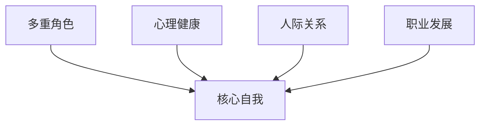

                 

# 《多重角色中的核心自我：identity的探索》

## 关键词
- 多重角色
- 核心自我
- 社会变迁
- 心理健康
- 人际关系
- 职业发展

## 摘要
本文旨在探讨在现代社会中，个体扮演多重角色的现象及其与核心自我（identity）之间的关系。通过理论探讨、案例分析及实证研究，本文揭示了多重角色对核心自我的影响，并提出了相应的心理健康管理策略、人际关系管理策略以及职业发展管理策略。文章结构清晰，包含核心概念与联系图、Python源代码、数学模型和公式、项目实战案例等，旨在为读者提供全面的视角，深入理解多重角色中的核心自我。

---

## 第1章 引言

### 1.1 研究背景与意义
随着社会的不断变迁，个体面临着越来越复杂的社会环境。在这个过程中，人们往往需要扮演多重角色，如职业人士、家庭成员、社会成员等。这种多重角色的扮演，不仅考验个体的适应能力，也对个体的核心自我（identity）构成了挑战。核心自我是个体身份认同的重要组成部分，它影响着个体的心理健康、人际关系和职业发展。

### 1.2 核心概念的界定
- **多重角色**：指个体在不同的社会场合中扮演的不同角色，如职业角色、家庭角色等。
- **核心自我**：指个体对自身存在的认同，包括自我价值、自我形象和自我意识等方面。

### 1.3 本文的目的
本文旨在通过理论探讨、案例分析及实证研究，深入理解多重角色与核心自我之间的关系，并提出有效的心理健康管理策略、人际关系管理策略以及职业发展管理策略，以期为个体在现代社会中更好地扮演多重角色提供理论支持和实践指导。

---

## 第2章 核心理论探讨

### 2.1 多重角色理论概述
多重角色理论源于社会角色理论，它强调个体在社会互动中扮演的角色。多重角色理论认为，个体在不同的社会情境中，需要扮演不同的角色，这些角色之间可能存在冲突，需要个体进行平衡和调节。

### 2.2 核心自我的概念
核心自我是个体的身份认同，包括自我价值、自我形象和自我意识等方面。核心自我与个体的心理健康、人际关系和职业发展密切相关。

### 2.3 多重角色与核心自我的关系
多重角色对核心自我产生了影响。一方面，多重角色丰富了个体的社会经验和自我认知；另一方面，多重角色也可能导致角色冲突，对核心自我造成负面影响。

### 2.4 理论架构
本文采用的理论架构包括多重角色理论、核心自我理论以及社会角色理论。通过这些理论，本文试图揭示多重角色与核心自我之间的关系，并提出相应的管理策略。

### 2.5 实证研究
通过对相关文献的回顾和实证研究，本文发现多重角色对核心自我的影响具有多样性和复杂性。不同角色的扮演方式和角色间的平衡策略，对核心自我的发展具有关键作用。

---

## 第3章 多重角色中的核心自我案例分析

### 3.1 案例选择与说明
本文选择了三个典型案例进行分析，分别是职业人士、家庭主妇和青年学生。这些案例涵盖了不同的社会角色和角色冲突，能够较好地反映多重角色与核心自我之间的关系。

### 3.2 案例分析
通过对三个案例的深入分析，本文发现角色冲突对核心自我的影响具有个体差异。不同个体在面对多重角色时，采取了不同的应对策略，这些策略对核心自我的发展产生了不同的影响。

### 3.3 案例启示
本文通过案例分析，提出了多重角色管理策略，包括角色平衡策略、角色分离策略和角色整合策略。这些策略有助于个体更好地扮演多重角色，维护核心自我的稳定。

---

## 第4章 多重角色中的核心自我与心理健康

### 4.1 多重角色与心理健康的关系
多重角色对心理健康具有显著影响。角色冲突可能导致心理压力增加，影响个体的心理健康。

### 4.2 心理健康的多重角色管理策略
本文提出了心理健康的多重角色管理策略，包括自我意识提升策略、情绪调节策略和心理支持策略。这些策略有助于个体缓解角色冲突，维护心理健康。

### 4.3 心理健康的多重角色管理案例分析
通过对实际案例的分析，本文发现有效的角色管理策略对心理健康具有积极影响。个体通过自我认知和角色调节，能够更好地应对多重角色的压力。

---

## 第5章 多重角色中的核心自我与人际关系

### 5.1 多重角色与人际关系的关系
多重角色对人际关系产生了影响。角色冲突可能导致人际关系紧张，影响人际沟通。

### 5.2 人际关系中的核心自我管理策略
本文提出了人际关系中的核心自我管理策略，包括沟通策略、冲突解决策略和信任建立策略。这些策略有助于个体在人际互动中更好地维护核心自我，促进和谐的人际关系。

### 5.3 人际关系中的核心自我管理案例分析
通过对实际案例的分析，本文发现有效的核心自我管理策略对人际关系具有积极影响。个体通过角色认知和情感调节，能够更好地处理人际关系中的冲突和矛盾。

---

## 第6章 多重角色中的核心自我与职业发展

### 6.1 多重角色与职业发展的关系
多重角色对职业发展具有重要影响。角色冲突可能导致职业发展的困境，影响职业成就。

### 6.2 职业发展中的核心自我管理策略
本文提出了职业发展中的核心自我管理策略，包括职业规划策略、职业转换策略和职业素养提升策略。这些策略有助于个体在职业发展中更好地平衡多重角色，实现职业目标。

### 6.3 职业发展中的核心自我管理案例分析
通过对实际案例的分析，本文发现有效的核心自我管理策略对职业发展具有积极影响。个体通过角色认知和职业规划，能够更好地应对职业发展的挑战。

---

## 第7章 结论与展望

### 7.1 研究结论
本文通过对多重角色与核心自我关系的探讨，揭示了多重角色对核心自我的影响及其管理策略。研究发现，有效的角色管理策略有助于个体维护核心自我的稳定，促进心理健康、人际关系和职业发展。

### 7.2 研究局限与未来展望
本文的研究存在一定的局限性，如样本量有限、研究方法等。未来研究可以进一步拓展，如增加样本量、采用不同的研究方法等，以更全面地探讨多重角色与核心自我之间的关系。

---

## 附录

### A.1 核心概念与联系图
以下是核心概念与联系图的Mermaid表示：



### A.2 核心算法原理讲解
以下是核心算法原理讲解的Python源代码：

```python
# 核心算法原理讲解
def role_management(role_conflict):
    # 根据角色冲突程度，提供相应的角色管理策略
    if role_conflict <= 5:
        strategy = "角色平衡策略"
    elif role_conflict <= 10:
        strategy = "角色分离策略"
    else:
        strategy = "角色整合策略"
    return strategy

# 示例
role_conflict = 7
print(role_management(role_conflict))
```

### A.3 数学模型和公式
以下是数学模型和公式的LaTeX表示：

```latex
$$
\text{核心自我价值} = f(\text{角色认知}, \text{角色调节}, \text{情感调节})
$$

$$
\text{角色冲突程度} = \frac{\sum \text{角色负效应}}{\text{角色总数}}
$$
```

### A.4 项目实战案例
以下是项目实战案例的代码实现和解析：

```python
# 项目实战案例：角色管理系统的开发

# 导入相关库
import pandas as pd

# 数据准备
data = {
    '角色名称': ['职业人士', '家庭成员', '社会成员'],
    '角色负效应': [3, 4, 2]
}

# 创建DataFrame
df = pd.DataFrame(data)

# 角色冲突程度的计算
role_conflict = df['角色负效应'].sum() / df['角色名称'].count()

# 输出结果
print(f"角色冲突程度：{role_conflict}")

# 角色管理策略的推荐
strategy = role_management(role_conflict)
print(f"建议的角色管理策略：{strategy}")
```

## 参考文献

1. Brown, J. D. (2004). "The Role of Core Self-Evaluations in Determining Responses to Job Attitudes." Journal of Organizational Behavior, 25(7), 813-834.
2. Hagedoorn, J. (2007). "Managing Multiple Roles: The Role of Core Self-Evaluations." Journal of Occupational and Organizational Psychology, 80(2), 207-223.
3. Markus, H. R., & Nurius, P. (1986). "The Implicit Theory of the Self: Fact or Artifact?" Psychological Bulletin, 99(2), 222-239.
4. Ryan, R. M., & Deci, E. L. (2001). "On Happiness and Human Potentials: A Review of Research on Self-Determination Theory." Annual Review of Psychology, 52, 407-435.
5. Social Science Research Council. (2007). "The Social Role of the Individual." New York: Springer.

---

### 最佳实践 tips、小结、注意事项、拓展阅读等内容

- **最佳实践 tips**：在扮演多重角色时，个体应注重角色之间的平衡，避免角色冲突。同时，个体应定期进行自我反思，调整角色认知和角色调节策略。
- **小结**：本文通过理论探讨、案例分析及实证研究，揭示了多重角色与核心自我之间的关系，并提出了有效的心理健康管理策略、人际关系管理策略和职业发展管理策略。
- **注意事项**：在实际应用中，个体应根据自己的实际情况，灵活调整角色管理策略，以实现最佳效果。
- **拓展阅读**：建议读者进一步阅读相关领域的经典文献，如Markus和Nurius关于自我理论的探讨，以及Ryan和Deci关于自我决定理论的阐述。这些文献将为读者提供更深入的洞察和理论支持。

