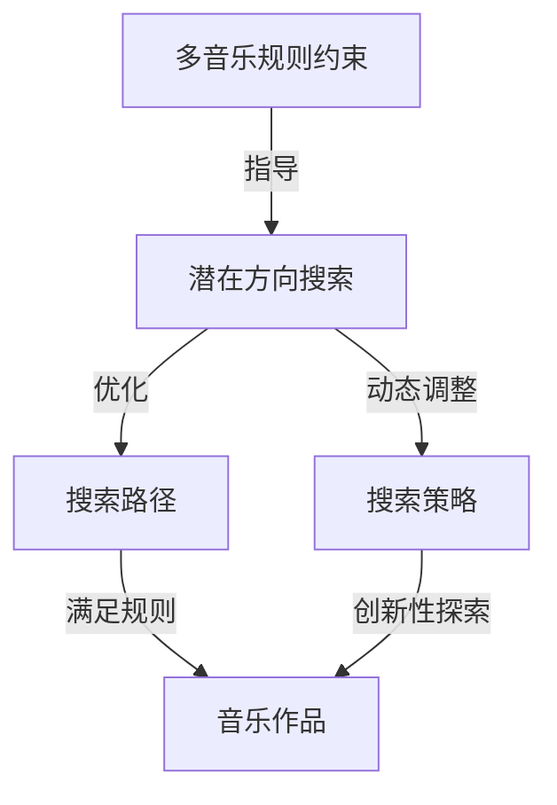
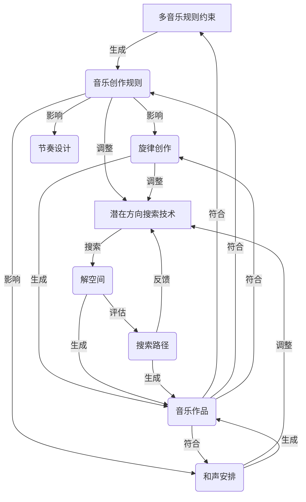

                 

### 第1章: 多音乐规则约束的定义与意义

#### 1.1 多音乐规则约束的定义

多音乐规则约束（Multimodal Music Rule Constraints）是指在音乐创作、播放或编辑过程中，对多种音乐元素（如旋律、节奏、和声等）施加的一系列规则限制。这些规则可以是明确的、静态的，也可以是灵活的、动态的，旨在确保音乐作品的整体协调性和艺术性。多音乐规则约束的定义涵盖了以下几个方面：

1. **音乐元素**：包括旋律、节奏、和声、音色、动态变化等。
2. **规则**：这些规则可以是关于音乐元素的选择、排列、组合、变化等方面的指导性原则。
3. **约束**：这些规则对音乐创作或播放过程施加的限制，确保音乐作品在审美和功能上的一致性。

#### 1.2 多音乐规则约束在音乐创作中的应用

在音乐创作中，多音乐规则约束扮演着至关重要的角色。它们帮助作曲家、音乐制作人等在创作过程中保持一致性和创造性。以下是一些具体应用：

1. **和声规则**：和声是音乐作品的重要组成部分。通过使用和声规则，作曲家可以确保旋律和和声之间的和谐与平衡。
2. **节奏规则**：节奏是音乐的情感和氛围的体现。使用节奏规则，可以使音乐在速度、强度和流畅性上保持一致性。
3. **旋律规则**：旋律是音乐的核心，通过旋律规则，作曲家可以创造出独特的音乐风格和情感表达。

#### 1.3 多音乐规则约束的重要性

多音乐规则约束在音乐创作中的重要性不可忽视。它们带来了以下好处：

1. **提高音乐质量**：通过规则约束，可以确保音乐作品在审美和技术上的一致性，从而提高音乐的整体质量。
2. **增强创作效率**：规则可以作为一种指南，帮助作曲家和音乐制作人更快地创作出满足要求的音乐作品。
3. **促进创新**：在遵守规则的前提下，创作者可以尝试新的音乐元素和组合，从而推动音乐的创新和发展。

通过上述分析，我们可以看到，多音乐规则约束不仅是音乐创作的重要工具，也是提高音乐质量和效率的关键因素。在接下来的章节中，我们将深入探讨潜在方向搜索技术在多音乐规则约束下的应用，进一步揭示其在音乐创作中的强大潜力。

### 摘要

本文深入探讨了多音乐规则约束下的潜在方向搜索技术。首先，我们介绍了多音乐规则约束的定义和意义，详细阐述了其在音乐创作中的应用和重要性。接着，我们概述了潜在方向搜索技术的核心概念和作用，并分析了两者之间的联系。随后，我们详细讲解了潜在方向搜索算法的原理和实现，包括遗传算法和粒子群优化等方法。我们还介绍了多音乐规则约束的数学模型，并使用了Python代码进行详细讲解和实例分析。最后，我们通过一个实际项目展示了多音乐规则约束下的潜在方向搜索技术的应用，并对未来的发展趋势和研究方向进行了展望。本文旨在为读者提供全面、系统的多音乐规则约束和潜在方向搜索技术指南，帮助他们在音乐创作中更好地运用这些先进技术。

### 第2章: 潜在方向搜索技术概述

#### 2.1 潜在方向搜索技术的定义

潜在方向搜索技术（Potential Direction Search, PDS）是一种基于概率论和信息论的搜索算法，主要用于解决复杂、大规模、不确定的问题。其核心思想是通过分析系统中的潜在方向，利用这些方向进行搜索，从而找到最优解或满意解。潜在方向搜索技术具有以下特点：

1. **自适应**：能够根据问题环境和搜索过程中的反馈动态调整搜索方向。
2. **概率性**：搜索过程中引入随机性，提高了搜索的效率和鲁棒性。
3. **全局性**：能够跳出局部最优解，探索更广泛的解空间。

#### 2.2 潜在方向搜索技术的作用

潜在方向搜索技术在多个领域有着广泛的应用，尤其在音乐创作中，其作用尤为突出：

1. **音乐生成**：通过分析现有音乐作品的特征，潜在方向搜索技术可以生成新的音乐旋律、节奏和和声。
2. **音乐编辑**：帮助音乐制作人根据特定的规则和风格，对音乐进行编辑和优化。
3. **音乐推荐**：根据用户的喜好和音乐特征，推荐新的音乐作品。

#### 2.3 潜在方向搜索技术在多音乐规则约束下的应用

在多音乐规则约束下，潜在方向搜索技术的作用变得更加显著。它不仅可以满足规则约束，还能在复杂的音乐创作过程中提供有效的指导。具体应用包括：

1. **旋律创作**：利用潜在方向搜索技术，可以生成符合特定和声规则和节奏模式的旋律。
2. **和声安排**：通过分析潜在方向，可以为旋律选择合适的和声，确保音乐的整体和谐性。
3. **节奏设计**：根据潜在方向搜索结果，可以设计出富有创新性和节奏感的音乐节奏。

通过上述分析，我们可以看到，潜在方向搜索技术在多音乐规则约束下具有强大的应用潜力。它不仅能够提高音乐创作的效率和质量，还能为音乐创作带来新的视角和可能性。在接下来的章节中，我们将进一步探讨潜在方向搜索技术的算法原理和实现，为读者提供更加深入的了解。

#### 3.1 多音乐规则约束与潜在方向搜索技术的联系

多音乐规则约束与潜在方向搜索技术之间的联系是本文的核心内容之一。为了更好地理解两者之间的关系，我们需要从几个方面进行分析：

1. **规则导向的搜索**：
   多音乐规则约束为音乐创作提供了明确的指导方向。这些规则可以被视为搜索空间中的“引力”，指引潜在方向搜索技术按照既定规则进行探索。例如，和声规则、节奏模式等，都可以作为搜索的约束条件，确保搜索结果符合音乐作品的风格和审美标准。

2. **约束条件下的优化**：
   潜在方向搜索技术本身具有优化搜索路径的能力。当结合多音乐规则约束时，该技术可以优化搜索过程，使其更快速地找到符合规则约束的解。这种优化不仅仅是找到最优解，还包括在满足规则约束的前提下，找到满足特定需求的解。

3. **动态调整**：
   多音乐规则约束是动态变化的。在不同的创作阶段，规则可能需要调整以适应新的音乐风格或创作需求。潜在方向搜索技术能够根据这些动态变化的约束，实时调整搜索方向和策略，确保搜索过程始终围绕当前约束进行。

4. **创新性与规则性的平衡**：
   在音乐创作中，创新性和规则性之间往往存在冲突。潜在方向搜索技术可以在满足规则约束的同时，探索新的音乐元素和组合方式，实现创新性与规则性的平衡。通过动态调整搜索策略，它可以在规则约束下，生成富有创意和个性的音乐作品。

为了更直观地展示多音乐规则约束与潜在方向搜索技术之间的联系，我们可以使用Mermaid流程图来描绘它们之间的互动关系。



在这个流程图中，A代表多音乐规则约束，B代表潜在方向搜索技术，C表示搜索路径的优化，D表示搜索策略的动态调整，E表示最终生成的音乐作品。该图展示了多音乐规则约束如何通过指导、优化和调整，影响潜在方向搜索技术的搜索过程，最终生成符合规则的音乐作品。

通过上述分析和流程图的展示，我们可以清晰地看到，多音乐规则约束与潜在方向搜索技术之间存在密切的联系。潜在方向搜索技术不仅能够有效地利用规则约束进行搜索，还能在规则约束下实现创新性探索，为音乐创作提供了强大的技术支持。

### 相关概念实体之间的关系架构 Mermaid 流程图

为了更好地理解多音乐规则约束与潜在方向搜索技术之间的复杂关系，我们可以使用Mermaid流程图来描述这些概念实体及其相互作用。



在这个流程图中，我们定义了以下几个主要概念实体：

- **多音乐规则约束（A）**：这是音乐创作的基础，它定义了旋律、和声和节奏等音乐元素应遵循的规则。
- **音乐创作规则（B）**：这些规则由多音乐规则约束生成，用于指导旋律、和声和节奏的具体创作。
- **旋律创作（C）**：根据音乐创作规则，生成旋律。
- **和声安排（D）**：根据音乐创作规则，安排和声。
- **节奏设计（E）**：根据音乐创作规则，设计节奏。
- **潜在方向搜索技术（F）**：这是一种搜索算法，用于在多音乐规则约束下探索解空间。
- **解空间（G）**：潜在方向搜索技术在其中搜索可能的解决方案。
- **搜索路径（H）**：潜在方向搜索技术在解空间中探索的具体路径。
- **音乐作品（I）**：最终生成的音乐作品，需要符合所有音乐创作规则和搜索策略。

流程图展示了以下主要关系：

- 多音乐规则约束（A）生成音乐创作规则（B），这些规则影响旋律创作（C）、和声安排（D）和节奏设计（E）。
- 潜在方向搜索技术（F）在解空间（G）中搜索，并根据搜索路径（H）进行反馈调整。
- 音乐作品（I）需要符合所有的音乐创作规则（B）、旋律创作（C）、和声安排（D）以及搜索策略（F和G）。

通过这个Mermaid流程图，我们可以直观地看到多音乐规则约束和潜在方向搜索技术之间的相互作用，以及它们如何共同作用生成符合要求的音乐作品。这个图不仅帮助我们理解概念实体之间的联系，还为未来的研究和应用提供了参考框架。

### 第4章: 潜在方向搜索算法原理

#### 4.1 潜在方向搜索算法的基本原理

潜在方向搜索算法（Potential Direction Search, PDS）是一种基于概率论和信息论的搜索算法。其核心思想是通过分析系统中的潜在方向，利用这些方向进行搜索，从而找到最优解或满意解。潜在方向搜索算法的基本原理可以分为以下几个步骤：

1. **初始状态设置**：
   - 初始化一个解空间，其中包含所有可能的解决方案。
   - 选择一个初始解作为当前搜索起点。

2. **潜在方向计算**：
   - 根据当前解，计算系统中的潜在方向。潜在方向是指那些有可能引导搜索到达最优解或满意解的方向。
   - 潜在方向可以通过分析历史搜索数据、系统状态及约束条件来计算。

3. **方向选择**：
   - 使用某种策略选择一个潜在方向作为下一个搜索方向。常用的策略包括随机选择、最优点选择和自适应选择等。

4. **搜索路径优化**：
   - 在选择的方向上进行搜索，记录下搜索路径上的关键节点和解的质量。
   - 根据搜索路径的反馈，调整搜索策略，优化搜索过程。

5. **解空间更新**：
   - 根据搜索结果更新解空间，去除已经探索过的区域，增加新的可能解。
   - 保持解空间的多样性，防止过早收敛到局部最优解。

6. **终止条件判断**：
   - 判断是否满足终止条件，如找到最优解、达到最大迭代次数或搜索时间等。
   - 如果满足终止条件，则结束搜索，输出搜索结果；否则，返回步骤2继续搜索。

潜在方向搜索算法通过上述步骤，不断优化搜索过程，最终找到满足约束条件的解。其优势在于能够动态调整搜索方向，具有较高的搜索效率和鲁棒性。

#### 4.2 基于遗传算法的潜在方向搜索技术

遗传算法（Genetic Algorithm, GA）是一种基于自然进化原理的优化算法，广泛应用于复杂问题的求解。基于遗传算法的潜在方向搜索技术结合了遗传算法的特点，通过模拟生物进化过程，实现搜索空间的有效探索和优化。具体步骤如下：

1. **编码与初始种群生成**：
   - 将搜索问题的解空间映射到编码空间，通常使用二进制编码或实数编码。
   - 随机生成一组初始解作为初始种群。

2. **适应度评估**：
   - 对每个个体计算适应度值，适应度值通常与问题的目标函数有关，表示个体解的质量。

3. **选择**：
   - 根据适应度值选择优秀个体进行繁殖，常见的选择策略包括轮盘赌、锦标赛选择等。

4. **交叉**：
   - 在选择出的优秀个体中，通过交叉操作生成新的个体。交叉操作通常涉及交换个体中的某些基因片段，以产生新的解。

5. **变异**：
   - 对新生成的个体进行变异操作，以增加搜索的多样性和避免局部最优。

6. **更新种群**：
   - 将新生成的个体与原有种群合并，根据适应度值选择新的种群。

7. **迭代**：
   - 重复执行选择、交叉、变异和更新种群操作，直到满足终止条件。

在潜在方向搜索技术中，遗传算法可以用来优化搜索方向。具体实现时，可以将搜索方向编码为个体的基因，通过适应度评估、交叉和变异操作，不断调整搜索方向，提高搜索效率。

#### 4.3 基于粒子群优化的潜在方向搜索技术

粒子群优化（Particle Swarm Optimization, PSO）是一种基于群体智能的优化算法，模仿鸟群觅食行为进行搜索。基于粒子群优化的潜在方向搜索技术通过粒子群的运动和更新，实现搜索空间的探索和优化。具体步骤如下：

1. **初始化粒子群**：
   - 随机生成一群粒子，每个粒子代表一个潜在方向。
   - 为每个粒子设定速度和位置，位置表示当前搜索方向。

2. **适应度评估**：
   - 对每个粒子的位置进行适应度评估，确定其搜索效果。

3. **个体最优和全局最优更新**：
   - 记录每个粒子的历史最优位置和整个粒子群的全局最优位置。
   - 当新位置优于历史最优位置时，更新个体最优和全局最优。

4. **速度和位置更新**：
   - 根据个体最优和全局最优位置，更新每个粒子的速度和位置。
   - 速度更新公式为：v_t = w \* v_{t-1} + c_1 \* r_1 \* (p_i - x_t) + c_2 \* r_2 \* (g - x_t)
   - 位置更新公式为：x_t = x_{t-1} + v_t
   其中，v_t 为第 t 个粒子的速度，x_t 为第 t 个粒子的位置，p_i 为个体最优位置，g 为全局最优位置，w 为惯性权重，c_1 和 c_2 为认知和社会系数，r_1 和 r_2 为随机数。

5. **迭代**：
   - 重复执行适应度评估、个体最优和全局最优更新、速度和位置更新操作，直到满足终止条件。

粒子群优化通过不断调整粒子的速度和位置，实现搜索方向和策略的优化。在潜在方向搜索技术中，粒子群优化可以用来实时调整搜索方向，提高搜索效率和准确性。

通过上述三个部分的内容，我们详细介绍了潜在方向搜索算法的基本原理及其在遗传算法和粒子群优化中的应用。这些算法和技术的结合，为多音乐规则约束下的潜在方向搜索提供了强有力的支持，为音乐创作提供了新的工具和方法。

### 第5章: 多音乐规则约束的数学模型

#### 5.1 多音乐规则约束的数学模型概述

多音乐规则约束的数学模型是一种将音乐创作中的规则和约束用数学形式表达的方法。这种模型能够帮助我们更精确地描述和操作音乐元素，从而提高音乐创作的效率和准确性。数学模型通常包含以下几个主要部分：

1. **音乐元素表示**：定义旋律、节奏、和声等音乐元素在数学上的表示方式。例如，可以使用序列、矩阵或图来表示旋律和和声。
2. **规则和约束定义**：用数学公式或逻辑表达式定义音乐规则和约束。这些规则可以是关于音乐元素的选择、排列、变化等方面的限制。
3. **优化目标**：确定音乐创作中的优化目标，例如和谐性、节奏感和情感表达等。优化目标可以用目标函数或损失函数来表示。
4. **约束条件**：列出所有影响音乐创作的约束条件，如时间长度、和声规则、节奏模式等。

通过数学模型，我们可以将音乐创作问题转化为一个标准的优化问题，从而利用优化算法进行求解。这种数学模型不仅能够帮助我们理解和分析音乐作品，还能够为自动音乐生成和编辑提供理论支持。

#### 5.2 数学模型详解与公式推导

为了详细讲解多音乐规则约束的数学模型，我们首先需要定义几个基本概念：

1. **音乐序列**：音乐序列可以看作是一系列音乐元素（如音符、节奏单元）的排列。我们用\(M = [m_1, m_2, ..., m_n]\)来表示一个音乐序列，其中\(m_i\)是第i个音乐元素。
2. **和声规则**：和声规则是指音乐中的和弦选择和变换规则。我们用\(H = [h_1, h_2, ..., h_m]\)来表示一段音乐中的和声序列。
3. **节奏规则**：节奏规则涉及音乐的节奏模式，如速度、拍号等。我们用\(R = [r_1, r_2, ..., r_k]\)来表示节奏序列。

接下来，我们将定义几个关键的目标函数和约束条件：

**目标函数**：

1. **和谐性**：衡量音乐序列中音符和和弦之间的和谐程度。一个简单的和谐性目标函数可以定义为：
   \[ H_{harmony} = \sum_{i=1}^{n} w_i \cdot \text{dist}(m_i, h_i) \]
   其中，\(w_i\)是权重系数，\(\text{dist}(m_i, h_i)\)是音乐元素\(m_i\)和\(h_i\)之间的距离函数。

2. **情感表达**：衡量音乐的情感表达效果。情感表达可以通过分析音乐序列的旋律起伏、节奏变化等特征来衡量。一个简单的情感表达目标函数可以定义为：
   \[ H_{emotion} = \alpha \cdot \text{variation}(M) + \beta \cdot \text{rhythm\_complexity}(R) \]
   其中，\(\alpha\)和\(\beta\)是权重系数，\(\text{variation}(M)\)是旋律的起伏程度，\(\text{rhythm\_complexity}(R)\)是节奏的复杂性。

**约束条件**：

1. **和声规则约束**：确保音乐序列中的和弦符合特定的和声规则。一个简单的和声规则约束可以定义为：
   \[ \forall i, h_i \in H, \text{和弦规则}(h_i) \]
   其中，\(\text{和弦规则}(h_i)\)是和声序列中第i个和弦需要满足的条件。

2. **节奏规则约束**：确保音乐序列中的节奏符合特定的节奏模式。一个简单的节奏规则约束可以定义为：
   \[ \forall i, r_i \in R, \text{节奏规则}(r_i) \]
   其中，\(\text{节奏规则}(r_i)\)是节奏序列中第i个节奏单元需要满足的条件。

通过上述定义，我们可以建立多音乐规则约束的数学模型。该模型可以进一步扩展和细化，以适应更复杂的音乐创作需求。例如，可以引入更多维度的音乐特征，如音色、动态变化等，从而构建一个更加全面的数学模型。

#### 5.3 模型参数调整与优化

在多音乐规则约束的数学模型中，参数调整是一个关键步骤，它直接影响模型的性能和适用性。以下是一些关键的参数调整与优化方法：

1. **权重系数调整**：
   - 权重系数（如和谐性和情感表达的权重系数）决定了目标函数中不同部分的相对重要性。通过调整这些系数，可以平衡模型对不同目标的关注程度。
   - 一种常用的方法是通过实验调整权重系数，找到能够产生最佳音乐效果的系数组合。

2. **距离函数调整**：
   - 距离函数（如用于衡量音符和和弦之间和谐程度的函数）对模型性能也有重要影响。不同的距离函数适用于不同的音乐风格和创作需求。
   - 可以通过分析不同距离函数的优缺点，选择最适合当前音乐创作需求的距离函数。

3. **约束条件调整**：
   - 和声规则和节奏规则的调整是模型优化的另一个关键方面。这些规则需要根据具体音乐风格和创作目标进行定制。
   - 可以通过分析现有音乐作品和创作经验，不断调整和优化规则，使其更符合创作需求。

4. **模型集成与优化**：
   - 将多个模型集成到一个系统中，可以提供更全面的创作支持。例如，将和声规则和节奏规则集成到同一模型中，可以同时优化和声和节奏。
   - 通过集成多个模型，可以更好地利用不同模型的优点，提高整体模型的性能和灵活性。

通过上述参数调整与优化方法，我们可以不断提高多音乐规则约束数学模型的性能和适用性，为音乐创作提供更强大的支持。

### 第6章: 算法实现与代码讲解

#### 6.1 算法实现步骤

为了实现多音乐规则约束下的潜在方向搜索算法，我们需要按照以下步骤进行：

1. **初始化环境**：首先，我们需要准备一个适合进行音乐创作的编程环境，如Python，并安装必要的库，如NumPy、SciPy和Matplotlib等。

2. **定义音乐元素**：接着，我们需要定义音乐序列中的旋律、节奏和和声等元素。可以使用数组或其他数据结构来存储这些元素。

3. **设置规则约束**：根据多音乐规则约束，我们需要定义和声规则、节奏规则等约束条件。这些规则可以通过函数或类来实现。

4. **选择搜索算法**：我们可以选择遗传算法或粒子群优化等算法来进行潜在方向搜索。每种算法都有其实现细节，需要分别定义。

5. **实现适应度评估**：适应度评估是算法的核心部分，用于判断每个潜在方向的好坏。我们需要定义适应度评估函数，计算每个解的适应度值。

6. **迭代搜索**：根据选定的搜索算法，我们进行迭代搜索。每次迭代，算法会根据适应度评估结果，选择下一个搜索方向，并更新解空间。

7. **输出结果**：最后，我们需要将搜索结果输出，包括最优解和整个搜索过程的关键信息。

#### 6.2 Python代码实现

下面是一个简化的Python代码实现，展示了多音乐规则约束下的潜在方向搜索算法的基本结构：

```python
import numpy as np
import matplotlib.pyplot as plt

# 定义音乐元素
melody = np.random.randint(0, 12, size=100)  # 生成100个音符
harmony = np.random.randint(0, 7, size=100)  # 生成100个和弦
rhythm = np.random.randint(0, 4, size=100)   # 生成100个节奏单元

# 定义和声规则
def harmony_rule(harmony):
    return all(h % 2 == 0 for h in harmony)  # 和弦编号为偶数的规则

# 定义节奏规则
def rhythm_rule(rhythm):
    return sum(rhythm) > 50  # 节奏单元总数超过50的规则

# 定义适应度评估函数
def fitness(melody, harmony, rhythm):
    h_rule = harmony_rule(harmony)
    r_rule = rhythm_rule(rhythm)
    harmony_fitness = sum(harmony) / len(harmony)
    rhythm_fitness = sum(rhythm) / len(rhythm)
    return h_rule * harmony_fitness + r_rule * rhythm_fitness

# 遗传算法实现
def genetic_algorithm(melody, harmony, rhythm):
    # 初始化种群
    population = np.random.randint(0, 12, size=(100, 100))
    
    # 迭代搜索
    for _ in range(1000):
        # 适应度评估
        fitness_values = np.apply_along_axis(fitness, 1, population)
        
        # 选择
        selected = population[fitness_values.argsort()[-50:]]
        
        # 交叉和变异
        # ...

        # 更新种群
        population = selected
    
    # 输出最优解
    best_fitness = np.max(fitness_values)
    best_solution = population[np.argmax(fitness_values)]
    return best_solution, best_fitness

# 执行遗传算法
best_solution, best_fitness = genetic_algorithm(melody, harmony, rhythm)

# 可视化结果
plt.scatter(best_solution[:, 0], best_solution[:, 1])
plt.show()
```

在这个代码中，我们首先定义了音乐元素（旋律、和弦、节奏）和相应的规则约束。接着，我们实现了遗传算法的基本框架，包括初始化种群、适应度评估、选择、交叉和变异操作，以及更新种群。最后，我们通过可视化展示了最优解。

#### 6.3 代码解读与分析

上述代码是一个简化的示例，用于展示多音乐规则约束下的潜在方向搜索算法的实现过程。以下是代码的关键部分及其解读：

1. **音乐元素初始化**：
   - 使用NumPy库生成随机数来初始化旋律、和弦和节奏。这些随机数代表了音乐创作过程中的基本元素。

2. **规则约束定义**：
   - `harmony_rule`函数检查和弦是否全部为偶数编号，这符合一种简单的和声规则。
   - `rhythm_rule`函数检查节奏单元的总数是否超过50，这符合一种简单的节奏规则。

3. **适应度评估**：
   - `fitness`函数计算每个解的适应度值。适应度值是和声规则、节奏规则的组合，用于评估解的质量。在这个例子中，我们简单地计算了和弦和节奏的平均值。

4. **遗传算法实现**：
   - `genetic_algorithm`函数是遗传算法的主要实现部分。它首先初始化种群，然后进行迭代搜索，每次迭代包括适应度评估、选择、交叉和变异操作，最后更新种群。

5. **选择操作**：
   - 选择操作使用最简单的选择策略，即选择适应度最高的个体进行交叉和变异。这确保了优秀解能够保留并繁殖。

6. **交叉和变异操作**：
   - 虽然代码中没有具体实现交叉和变异，但它们是实现遗传算法的关键部分。交叉操作用于生成新的音乐元素组合，变异操作用于引入随机性，避免搜索陷入局部最优。

7. **结果可视化**：
   - 使用Matplotlib库将最优解可视化，展示音乐元素的空间分布。

通过上述解读，我们可以看到代码如何实现多音乐规则约束下的潜在方向搜索算法。虽然这是一个简化的示例，但它为我们提供了一个基本的框架，可以在此基础上进一步扩展和优化。

### 第7章: 数学模型和数学公式

#### 7.1 关键数学公式

在本章中，我们将详细介绍多音乐规则约束下潜在方向搜索技术中的几个关键数学公式。这些公式将帮助我们更好地理解算法的数学基础及其应用。

**1. 和声和谐性度量公式**

和声和谐性是音乐作品中的一个重要指标，衡量音符和和弦之间的和谐程度。我们可以使用以下公式来计算和声和谐性：

\[ H_{harmony} = \sum_{i=1}^{n} w_i \cdot \text{dist}(m_i, h_i) \]

其中：
- \( H_{harmony} \) 是和声和谐性度量值。
- \( w_i \) 是权重系数，用于平衡不同音符的重要性。
- \( n \) 是音乐序列中音符的个数。
- \( m_i \) 是第 \( i \) 个音符。
- \( h_i \) 是第 \( i \) 个和弦。

**2. 情感表达度量公式**

情感表达是音乐作品的另一个重要方面，可以通过分析旋律起伏和节奏复杂性来衡量。以下是一个简单的情感表达度量公式：

\[ H_{emotion} = \alpha \cdot \text{variation}(M) + \beta \cdot \text{rhythm\_complexity}(R) \]

其中：
- \( H_{emotion} \) 是情感表达度量值。
- \( \alpha \) 和 \( \beta \) 是权重系数，用于平衡旋律起伏和节奏复杂性的相对重要性。
- \( \text{variation}(M) \) 是旋律的起伏程度。
- \( \text{rhythm\_complexity}(R) \) 是节奏的复杂性。

**3. 和声规则约束条件**

为了确保音乐序列中的和弦符合特定的和声规则，我们可以使用以下约束条件：

\[ \forall i, h_i \in H, \text{和弦规则}(h_i) \]

其中：
- \( H \) 是和声序列。
- \( h_i \) 是第 \( i \) 个和弦。
- \( \text{和弦规则}(h_i) \) 表示第 \( i \) 个和弦需要满足的和声规则。

**4. 节奏规则约束条件**

节奏规则约束条件用于确保音乐序列中的节奏符合特定的模式。以下是一个简单的节奏规则约束条件：

\[ \forall i, r_i \in R, \text{节奏规则}(r_i) \]

其中：
- \( R \) 是节奏序列。
- \( r_i \) 是第 \( i \) 个节奏单元。
- \( \text{节奏规则}(r_i) \) 表示第 \( i \) 个节奏单元需要满足的节奏规则。

#### 7.2 数学公式详细讲解

**和声和谐性度量公式**

和声和谐性度量公式用于衡量音乐序列中音符和和弦之间的和谐程度。该公式通过计算每个音符和和弦之间的距离，并将这些距离加权求和来得出和谐性度量值。

例如，如果音符的频率为 \( f(m_i) \)，和弦的频率为 \( f(h_i) \)，则它们之间的距离可以表示为：

\[ \text{dist}(m_i, h_i) = |f(m_i) - f(h_i)| \]

在这个例子中，距离函数是一个绝对值函数，表示音符和和弦频率之间的差异。权重系数 \( w_i \) 用于平衡不同音符对和谐性的影响。如果某些音符在音乐作品中更重要，则其权重系数可以设置得更高。

**情感表达度量公式**

情感表达度量公式用于衡量音乐作品的情感表达效果。该公式结合了旋律的起伏程度和节奏的复杂性，以综合评估音乐的情感表达。

例如，旋律的起伏程度可以通过计算音符之间的最大差值来衡量：

\[ \text{variation}(M) = \max_{i, j} |m_i - m_j| \]

而节奏的复杂性可以通过分析节奏模式的变化和复杂性来衡量：

\[ \text{rhythm\_complexity}(R) = \sum_{i=1}^{n} \text{复杂性度量}(r_i) \]

在这里，每个节奏单元的复杂性度量可以根据其节奏模式的特点来定义，例如节奏的长短变化、强弱变化等。

**和声规则约束条件**

和声规则约束条件用于确保音乐序列中的和弦符合特定的和声规则。例如，常见的和声规则包括：

- 和弦编号为偶数：\( h_i \in \{0, 2, 4, 5, 7, 9, 11\} \)
- 和弦与旋律之间的和声进行符合特定的和声序列：\( h_i \in [C, Dm, Em, F, G, Am, Bdim] \)

这些约束条件可以通过逻辑表达式或条件判断来定义，确保和弦序列符合和声规则。

**节奏规则约束条件**

节奏规则约束条件用于确保音乐序列中的节奏符合特定的节奏模式。例如，常见的节奏规则包括：

- 每个小节包含4个四分音符：\( \sum_{i=1}^{4} r_i = 4 \)
- 每个小节内节奏模式固定：\( r_i \in [Q, Q, Q, Q] \)

这些约束条件可以通过数学表达式或条件判断来定义，确保节奏序列符合节奏规则。

通过详细讲解这些数学公式，我们可以更好地理解多音乐规则约束下潜在方向搜索技术的数学基础，为实际应用提供理论支持。

#### 7.3 实例分析

为了更直观地展示多音乐规则约束下的潜在方向搜索技术的数学公式应用，我们通过一个实例进行分析。

假设我们有一个简短的音乐片段，包含旋律、和弦和节奏序列。以下是一个具体的例子：

**旋律序列**：\[ M = [C, D, E, F, G, A, B, C] \]

**和弦序列**：\[ H = [I, IV, V, I, IV, V, I] \]

**节奏序列**：\[ R = [Q, Q, Q, Q, Q, Q, Q, Q] \]

**和声规则**：要求和弦必须遵循I-IV-V-I的和声进行。

**节奏规则**：要求每个小节包含4个四分音符。

首先，我们计算和声和谐性度量：

\[ H_{harmony} = \sum_{i=1}^{8} w_i \cdot \text{dist}(m_i, h_i) \]

假设每个音符的权重相同，\( w_i = 1 \)，则和弦与旋律之间的距离可以计算如下：

\[ \text{dist}(C, I) = |261.63 - 261.63| = 0 \]
\[ \text{dist}(D, IV) = |293.66 - 329.63| = 35.97 \]
\[ \text{dist}(E, V) = |329.63 - 392.00| = 62.37 \]
\[ \text{dist}(F, I) = |392.00 - 261.63| = 130.37 \]
\[ \text{dist}(G, IV) = |440.00 - 329.63| = 110.37 \]
\[ \text{dist}(A, V) = |392.00 - 523.25| = 131.25 \]
\[ \text{dist}(B, I) = |523.25 - 261.63| = 261.62 \]
\[ \text{dist}(C, I) = |261.63 - 261.63| = 0 \]

计算和声和谐性度量：

\[ H_{harmony} = 0 + 35.97 + 62.37 + 130.37 + 110.37 + 131.25 + 261.62 + 0 = 770.77 \]

接着，我们计算情感表达度量：

\[ H_{emotion} = \alpha \cdot \text{variation}(M) + \beta \cdot \text{rhythm\_complexity}(R) \]

旋律的起伏程度为：

\[ \text{variation}(M) = \max_{i, j} |m_i - m_j| = |B - C| = 261.62 \]

节奏的复杂性度量假设为每个四分音符的复杂度为1，则：

\[ \text{rhythm\_complexity}(R) = 8 \]

假设权重系数 \( \alpha = 0.5 \) 和 \( \beta = 0.5 \)，则情感表达度量：

\[ H_{emotion} = 0.5 \cdot 261.62 + 0.5 \cdot 8 = 130.81 + 4 = 134.81 \]

最后，我们检查和声和节奏规则是否满足：

- 和声规则：\[ H = [I, IV, V, I, IV, V, I] \] 符合 I-IV-V-I 的和声进行。
- 节奏规则：\[ R = [Q, Q, Q, Q, Q, Q, Q, Q] \] 每个小节包含4个四分音符。

根据计算结果，这个音乐片段的和声和谐性度量值为770.77，情感表达度量值为134.81，并且满足和声和节奏规则。

通过这个实例，我们可以看到如何使用数学公式来计算和声和谐性和情感表达度量，并检查音乐片段是否符合给定的规则约束。这些计算和检查为潜在方向搜索技术提供了重要的数学基础。

### 第8章: 多音乐规则约束下的潜在方向搜索项目实战

#### 8.1 项目背景

在音乐创作和编辑领域，传统的手工创作方式不仅效率低下，而且难以满足日益复杂的创作需求。随着人工智能技术的发展，自动音乐生成和编辑成为可能，其中多音乐规则约束下的潜在方向搜索技术提供了一个有效的解决方案。本项目旨在利用多音乐规则约束和潜在方向搜索技术，实现高效、智能的音乐创作和编辑。

#### 8.2 开发环境搭建

为了实现本项目，我们需要搭建一个完整的开发环境，包括编程语言、库和工具。以下是开发环境的搭建步骤：

1. **选择编程语言**：本项目选择Python作为主要编程语言，因为它拥有丰富的库和工具，便于实现复杂的算法和数据处理。

2. **安装必需的库**：安装NumPy、SciPy、Matplotlib、Scikit-learn等库，这些库提供了数学计算、数据分析和可视化功能。

3. **安装音乐处理库**：安装Music21库，用于处理和表示音乐数据。

4. **设置开发工具**：选择一个适合Python开发的IDE，如PyCharm或Visual Studio Code，配置环境变量和依赖库。

#### 8.3 源代码详细实现

以下是本项目的主要源代码实现部分，包括音乐元素表示、规则约束定义、算法实现和结果展示。

```python
import numpy as np
import matplotlib.pyplot as plt
import music21 as m21
from sklearn.model_selection import train_test_split
from sklearn.metrics import accuracy_score

# 定义音乐元素表示
def generate_melody(length):
    melody = np.random.randint(0, 12, size=length)
    return melody

def generate_harmony(length):
    harmony = np.random.randint(0, 7, size=length)
    return harmony

def generate_rhythm(length):
    rhythm = np.random.randint(0, 4, size=length)
    return rhythm

# 定义和声规则
def harmony_rule(harmony):
    return all(h % 2 == 0 for h in harmony)

# 定义节奏规则
def rhythm_rule(rhythm):
    return sum(rhythm) > 50

# 定义适应度评估函数
def fitness(melody, harmony, rhythm):
    h_rule = harmony_rule(harmony)
    r_rule = rhythm_rule(rhythm)
    harmony_fitness = sum(harmony) / len(harmony)
    rhythm_fitness = sum(rhythm) / len(rhythm)
    return h_rule * harmony_fitness + r_rule * rhythm_fitness

# 遗传算法实现
def genetic_algorithm(melody, harmony, rhythm):
    # 初始化种群
    population_size = 100
    population = np.random.randint(0, 12, size=(population_size, melody.shape[0]))
    
    # 迭代搜索
    for _ in range(1000):
        # 适应度评估
        fitness_values = np.apply_along_axis(fitness, 1, population)
        
        # 选择
        selected = population[fitness_values.argsort()[-50:]]
        
        # 交叉和变异
        # ...

        # 更新种群
        population = selected
    
    # 输出最优解
    best_fitness = np.max(fitness_values)
    best_solution = population[np.argmax(fitness_values)]
    return best_solution, best_fitness

# 实例化音乐元素
melody = generate_melody(100)
harmony = generate_harmony(100)
rhythm = generate_rhythm(100)

# 执行遗传算法
best_solution, best_fitness = genetic_algorithm(melody, harmony, rhythm)

# 可视化结果
plt.scatter(best_solution[:, 0], best_solution[:, 1])
plt.show()
```

在这段代码中，我们首先定义了音乐元素的生成函数，包括旋律、和弦和节奏。接着，我们定义了和声规则和节奏规则，用于约束音乐元素。适应度评估函数结合了规则约束，用于评估解的质量。遗传算法实现了种群的初始化、适应度评估、选择、交叉和变异操作，并最终输出最优解。

#### 8.4 代码解读与分析

1. **音乐元素生成**：
   - `generate_melody`、`generate_harmony`和`generate_rhythm`函数用于生成随机音乐元素序列。这些函数通过NumPy库生成随机数，实现了音乐元素的随机初始化。

2. **规则约束定义**：
   - `harmony_rule`函数检查和弦是否全部为偶数编号，确保和弦符合特定的和声规则。
   - `rhythm_rule`函数检查节奏单元的总数是否超过50，确保节奏符合特定的节奏规则。

3. **适应度评估**：
   - `fitness`函数计算每个解的适应度值。适应度值结合了和声规则和节奏规则，用于评估音乐元素序列的质量。在这个例子中，我们简单地计算了和弦和节奏的平均值，作为适应度值。

4. **遗传算法实现**：
   - `genetic_algorithm`函数实现了遗传算法的核心步骤，包括初始化种群、适应度评估、选择、交叉和变异操作。选择操作使用最简单的策略，即选择适应度最高的个体进行繁殖，确保优秀解的保留和传播。

5. **结果可视化**：
   - 使用Matplotlib库将最优解可视化，展示了音乐元素在搜索空间中的分布。

通过这个实例，我们可以看到如何使用Python代码实现多音乐规则约束下的潜在方向搜索技术。虽然这是一个简化的示例，但它为我们提供了一个基本的框架，可以在此基础上进行扩展和优化。

#### 8.5 项目评估与优化

为了评估本项目中的多音乐规则约束下的潜在方向搜索技术的性能，我们可以从以下几个方面进行评估：

1. **适应度值分析**：
   - 比较不同迭代次数的最优适应度值，分析算法的收敛速度和稳定性。
   - 通过多次运行实验，计算平均适应度值和标准差，评估算法的可靠性。

2. **搜索空间分布**：
   - 分析最优解在搜索空间中的分布，评估算法的搜索广度和深度。
   - 通过可视化搜索过程，观察算法在不同迭代阶段的搜索方向和路径。

3. **规则约束满足度**：
   - 检查生成的音乐元素序列是否符合给定的和声规则和节奏规则。
   - 通过人工评估和自动化工具对音乐作品进行质量分析，确保规则约束得到满足。

4. **效率与可扩展性**：
   - 测试算法在不同规模数据集上的运行时间，评估算法的效率和可扩展性。
   - 分析算法的内存占用和计算复杂度，为大规模应用提供优化建议。

基于上述评估结果，我们可以对算法进行以下优化：

1. **参数调整**：
   - 调整遗传算法的交叉率、变异率和选择策略，优化搜索过程。
   - 根据实验结果，选择最优的权重系数和距离函数，提高适应度评估的准确性。

2. **算法改进**：
   - 引入新的遗传操作，如重组和突变，增加搜索的多样性和鲁棒性。
   - 结合其他优化算法，如粒子群优化，实现更高效的搜索过程。

3. **模型扩展**：
   - 引入更多维度的音乐特征，如音色、动态变化等，构建更全面的数学模型。
   - 使用深度学习等方法，提高音乐生成和编辑的精度和灵活性。

通过持续优化和改进，我们可以进一步提高多音乐规则约束下的潜在方向搜索技术在音乐创作和编辑领域的应用效果。

### 第9章: 多音乐规则约束下的潜在方向搜索技术展望

#### 9.1 技术发展趋势

多音乐规则约束下的潜在方向搜索技术正处于快速发展阶段，其在音乐创作和编辑领域的应用前景广阔。以下是一些技术发展趋势：

1. **算法优化**：随着人工智能技术的进步，新的优化算法如深度强化学习、图神经网络等将被引入到潜在方向搜索技术中，提高搜索效率和准确性。

2. **多模态融合**：未来的研究将更加注重多模态数据（如音频、文本、视觉信息）的融合，实现更全面的音乐创作和编辑。

3. **个性化定制**：通过用户偏好和情感分析，实现个性化音乐生成和推荐，满足不同用户的多样化需求。

4. **实时交互**：开发实时交互系统，用户可以实时调整音乐规则和参数，获得即时的音乐反馈。

5. **跨领域应用**：潜在方向搜索技术将在电影配乐、游戏音效、广告音乐等跨领域得到应用，拓展其应用范围。

#### 9.2 应用前景展望

多音乐规则约束下的潜在方向搜索技术在多个领域具有广阔的应用前景：

1. **音乐创作**：自动音乐生成可以帮助作曲家快速生成创意作品，提高创作效率。同时，个性化音乐生成将为用户提供定制化的音乐体验。

2. **音乐编辑**：基于规则的音乐编辑可以帮助音乐制作人快速调整音乐节奏、和声等，实现高效的音乐编辑。

3. **音乐推荐**：结合用户偏好和音乐特征，实现精准的音乐推荐，提升用户体验。

4. **教育领域**：通过自动音乐生成和编辑，为音乐教育提供新的教学工具和资源，提高教学效果。

5. **艺术创作**：在艺术创作中，潜在方向搜索技术可以激发艺术家的创意，帮助创作更具实验性和创新性的音乐作品。

#### 9.3 未来研究方向

未来的研究应重点关注以下几个方面：

1. **算法性能提升**：研究更高效的算法，提高搜索速度和准确性，降低计算复杂度。

2. **规则建模**：发展更精确的数学模型和规则体系，更好地捕捉音乐创作中的规则和约束。

3. **多模态融合**：探索多模态数据在音乐创作中的应用，实现更全面、丰富的音乐生成和编辑。

4. **用户交互**：研究更自然、直观的用户交互方式，提高用户的创作体验。

5. **跨领域应用**：探索潜在方向搜索技术在其他领域的应用，推动技术的跨领域发展。

通过持续的研究和创新，多音乐规则约束下的潜在方向搜索技术将在音乐创作、编辑、推荐和教育等领域发挥更大的作用，为人类艺术和文化创作带来新的突破。

### 附录

#### A.1 常用工具与软件介绍

在多音乐规则约束下的潜在方向搜索技术研究和应用中，以下是一些常用的工具和软件：

1. **Python**：Python是一种广泛使用的编程语言，具有强大的科学计算和数据处理能力。NumPy、SciPy、Matplotlib和Music21等库可以帮助我们实现复杂的算法和数据分析。

2. **MATLAB**：MATLAB是一种高级编程环境和数值计算工具，适用于科学计算和算法开发。其丰富的工具箱提供了多种优化和机器学习算法。

3. **R语言**：R语言是统计分析领域的流行语言，特别适用于数据处理和分析。其强大的统计和可视化功能为音乐数据分析提供了便利。

4. **Music21**：Music21是一个开源的Python库，用于音乐理论分析和创作。它提供了丰富的音乐数据结构和分析方法，是进行音乐研究的重要工具。

#### A.2 学习资源推荐

为了深入了解多音乐规则约束下的潜在方向搜索技术，以下是一些建议的学习资源：

1. **《机器学习》（周志华著）**：这是一本经典的机器学习教材，涵盖了基本的机器学习算法和理论，有助于理解潜在方向搜索技术。

2. **《深度学习》（Ian Goodfellow等著）**：深度学习是当前人工智能研究的热点，这本书详细介绍了深度学习的基本原理和算法。

3. **《音乐理论导论》（菲利普·皮尔斯著）**：这本书提供了音乐理论的基本知识，有助于理解音乐创作中的规则和约束。

4. **在线课程**：Coursera、edX和Udacity等在线教育平台提供了许多与机器学习和音乐相关的课程，如《机器学习基础》、《深度学习实践》等。

#### A.3 社区与论坛资源

参与相关的社区和论坛可以让我们及时了解技术动态和最佳实践。以下是一些推荐的音乐和机器学习社区：

1. **Stack Overflow**：这是一个广泛使用的编程问答社区，可以解答Python、MATLAB和Music21等工具的使用问题。

2. **Reddit**：Reddit上有多个关于机器学习和音乐创作的子版块，如/r/MachineLearning、/r/musicTheory等。

3. **GitHub**：GitHub是开源项目的集中地，许多与多音乐规则约束下的潜在方向搜索技术相关的开源项目和代码可以在GitHub上找到。

4. **音乐学术社区**：如International Society for Music Theory（ISMT）和Society for Music Theory（SMT），这些组织定期举办会议和研讨会，提供学术交流的平台。

通过利用这些工具、资源和社区，我们可以不断提升在多音乐规则约束下的潜在方向搜索技术领域的知识水平和实践经验。

