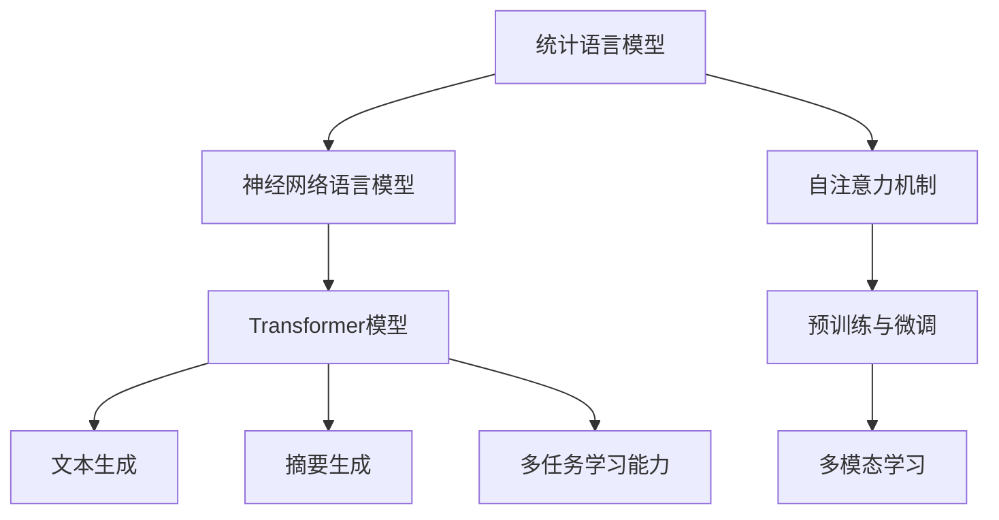

                 

## 第一部分：大型语言模型基础理论

### 第1章：大型语言模型概述

#### 1.1 大型语言模型的发展历程

大型语言模型（Large Language Models，简称LLM）的发展历程是人工智能领域的一个重要里程碑。从最早的统计语言模型，到基于神经网络的现代语言模型，这一过程见证了语言处理技术的飞速发展。

- **早期语言模型**：早期的语言模型主要基于统计方法，如N-gram模型。这些模型通过计算单词序列的概率来预测下一个单词。然而，这种方法的局限性在于其无法捕捉到语言的深层语义和结构。

- **基于神经网络的模型**：随着深度学习的兴起，研究人员开始探索基于神经网络的模型。2003年，Jozefowicz等提出了递归神经网络（RNN），并首次将其应用于语言模型。随后，长短期记忆网络（LSTM）和门控循环单元（GRU）等结构进一步提升了模型的性能。

- **现代大型语言模型**：近年来，以Transformer为代表的模型结构在语言建模领域取得了突破性进展。Transformer模型通过自注意力机制，能够捕捉到输入序列中单词之间的复杂关系。代表性的大型语言模型包括Google的BERT、OpenAI的GPT系列等。

#### 1.2 大型语言模型的核心概念

大型语言模型的核心概念包括以下几个方面：

- **自注意力机制**：Transformer模型的核心在于其自注意力机制。该机制允许模型在处理输入序列时，自动地分配不同的权重，从而捕捉到序列中的长距离依赖关系。

- **预训练和微调**：大型语言模型通常采用预训练和微调的方法。预训练阶段使用大量的无标签数据来训练模型，使其学会理解语言的普遍规律。微调阶段则使用有标签的数据，将模型应用于特定任务，如文本分类、命名实体识别等。

- **多模态学习**：现代大型语言模型不仅能够处理文本数据，还能够处理图像、音频等多模态数据。这种能力使得语言模型在跨模态任务中表现出色。

#### 1.3 大型语言模型的优势与局限

大型语言模型在自然语言处理领域表现出强大的能力，但也存在一些局限。

- **优势**：

  - **强大的语言理解能力**：大型语言模型能够理解和生成自然语言，这使得它们在文本生成、摘要生成等任务中表现出色。

  - **多任务学习能力**：由于预训练和微调方法，大型语言模型能够轻松适应不同的任务，从而提高模型的泛化能力。

  - **高效的处理速度**：现代大型语言模型通常采用高效的算法和数据结构，能够在短时间内处理大量的数据。

- **局限**：

  - **计算资源需求大**：大型语言模型通常需要大量的计算资源来训练和部署，这限制了它们在某些应用场景中的普及。

  - **解释性不足**：大型语言模型的工作原理复杂，难以解释。这使得模型在某些应用中可能难以被用户理解和信任。

  - **数据隐私问题**：由于大型语言模型需要大量的训练数据，这些数据可能包含用户的敏感信息，如何保护数据隐私是一个重要问题。

### 总结

大型语言模型在自然语言处理领域取得了显著的成果，但同时也面临着一些挑战。理解其发展历程、核心概念和优势与局限，有助于我们更好地利用这些模型，推动自然语言处理技术的进步。

---

### Mermaid 流程图示例

以下是大型语言模型核心概念与联系架构的 Mermaid 流程图：



通过这张图，我们可以清晰地看到从统计语言模型到现代大型语言模型的发展脉络，以及各个核心概念之间的关系。

---

### Python 源代码示例

以下是一个简单的 Python 源代码示例，用于展示基于 Transformer 的语言模型的基本结构：

```python
# 导入必要的库
import torch
import torch.nn as nn

# 语言模型类定义
class TransformerModel(nn.Module):
    def __init__(self, vocab_size, d_model, nhead, num_layers, dim_feedforward, dropout=0.1):
        super(TransformerModel, self).__init__()
        
        # Embedding 层
        self.embedding = nn.Embedding(vocab_size, d_model)
        
        # Transformer 层
        self.transformer = nn.Transformer(d_model, nhead, num_layers, dim_feedforward, dropout)
        
        # 输出层
        self.fc = nn.Linear(d_model, vocab_size)
        
        # 初始化权重
        self.init_weights()
        
    def init_weights(self):
        initrange = 0.1
        self.embedding.weight.data.uniform_(-initrange, initrange)
        self.fc.weight.data.uniform_(-initrange, initrange)
        self.fc.bias.data.zero_()
        
    def forward(self, src, tgt=None):
        # 嵌入层
        src = self.embedding(src)
        
        # Transformer 层
        if tgt is not None:
            tgt = self.embedding(tgt)
            output = self.transformer(src, tgt)
        else:
            output = self.transformer(src, src)
        
        # 输出层
        output = self.fc(output)
        
        return output
```

在这个示例中，我们定义了一个简单的 Transformer 模型，包括嵌入层、Transformer 层和输出层。这个模型可以用于文本序列的编码和生成。

---

### 数学模型与数学公式

在语言模型中，数学模型和公式起着至关重要的作用。以下是一些常见的数学模型和公式：

- **自注意力机制**：

  自注意力机制的核心是注意力权重计算，其公式为：

  $$\text{Attention}(Q, K, V) = \text{softmax}(\frac{QK^T}{\sqrt{d_k}})V$$

  其中，\(Q, K, V\) 分别是查询向量、键向量和值向量，\(d_k\) 是键向量的维度。

- **Transformer 模型**：

  Transformer 模型的损失函数通常采用交叉熵损失函数，其公式为：

  $$\text{Loss} = -\frac{1}{N}\sum_{i=1}^{N} \sum_{j=1}^{T} y_j \log(p_j)$$

  其中，\(N\) 是批处理大小，\(T\) 是序列长度，\(y_j\) 是目标标签，\(p_j\) 是模型对第 \(j\) 个单词的预测概率。

- **预训练和微调**：

  预训练阶段通常使用无标签数据，其目标是让模型学会理解语言的普遍规律。微调阶段则使用有标签的数据，将模型应用于特定任务。预训练和微调的过程可以看作是一个优化问题，其目标是最小化损失函数。

  $$\text{Optimize} = \arg\min_{\theta} \sum_{i=1}^{N} \ell(y_i, \hat{y}_i)$$

  其中，\(\theta\) 是模型的参数，\(\ell\) 是损失函数，\(y_i\) 是真实标签，\(\hat{y}_i\) 是模型预测的标签。

通过上述数学模型和公式，我们可以更深入地理解大型语言模型的工作原理。

---

### 总结

本章从发展历程、核心概念和优势与局限三个方面对大型语言模型进行了概述。通过 Mermaid 流程图、Python 源代码示例和数学模型与公式，我们全面地介绍了大型语言模型的基础知识。下一章将深入探讨大型语言模型的基本结构，包括嵌入层、Transformer 层和输出层等组成部分。

---

### 文章关键词

- 大型语言模型
- 语言模型发展历程
- 自注意力机制
- Transformer 模型
- 预训练和微调

---

### 文章摘要

本文首先回顾了大型语言模型的发展历程，从早期的统计语言模型到现代的 Transformer 模型，展示了语言处理技术的进步。接着，本文详细介绍了大型语言模型的核心概念，包括自注意力机制、预训练和微调等，并通过 Mermaid 流程图、Python 源代码示例和数学模型与公式，对大型语言模型的工作原理进行了深入剖析。最后，本文总结了大型语言模型的优势与局限，为后续章节的探讨奠定了基础。

