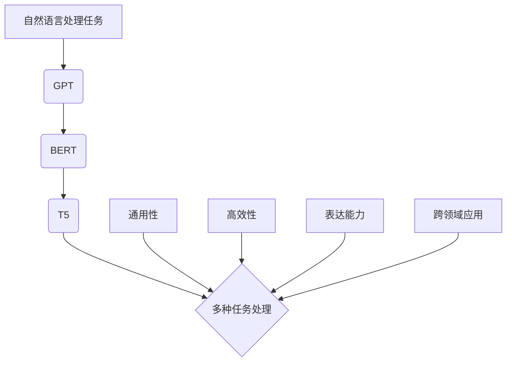

                 

### 大型语言模型概述

#### 1.1 大型语言模型的基本概念

大型语言模型（Large Language Model，简称LLM）是一种基于深度学习技术的自然语言处理模型，其主要功能是理解和生成自然语言。与传统的统计模型或规则模型相比，大型语言模型具有更高的灵活性和强大的表达能力，能够处理复杂的语言现象。

大型语言模型通常由数亿到数千亿个参数组成，其大小远远超过传统机器学习模型的规模。这些参数通过训练大规模语料库进行学习，从而捕捉到语言的统计规律和语义信息。这种大规模的参数量使得大型语言模型能够对输入的文本进行精细的建模，从而生成连贯、自然的语言输出。

#### 1.2 大型语言模型的发展历程

大型语言模型的发展历程可以追溯到20世纪80年代。最初的语言模型是基于规则的方法，如词汇表匹配和语法规则。然而，这些方法在面对复杂语言现象时表现较差。随着机器学习技术的发展，统计模型逐渐取代了规则模型。

20世纪90年代，隐马尔可夫模型（HMM）和条件随机场（CRF）等统计模型在语言模型领域取得了重要突破。然而，这些模型仍然面临着参数复杂度和训练时间的问题。

直到2018年，谷歌提出的Transformer架构为大型语言模型的发展带来了新的契机。Transformer模型利用自注意力机制，实现了并行化的训练过程，大幅度提高了模型的训练效率。此后，大型语言模型的研究和应用迅速发展，包括GPT、BERT、T5等模型的提出，使得语言模型在自然语言处理任务中的表现达到了前所未有的水平。

#### 1.3 大型语言模型的重要性

大型语言模型在自然语言处理领域具有重要性，主要体现在以下几个方面：

1. **通用性**：大型语言模型能够处理多种自然语言处理任务，如文本分类、命名实体识别、情感分析等，无需针对每个任务进行单独的训练。

2. **高效性**：通过大规模预训练和自适应微调，大型语言模型能够快速适应新任务，降低开发成本。

3. **表达能力**：大型语言模型具有强大的语言理解能力，能够捕捉到语言的复杂结构和语义信息，从而生成更自然、更准确的文本。

4. **跨领域应用**：大型语言模型在多个领域都有广泛应用，如医疗、金融、法律、教育等，为各个领域的自动化和智能化提供了技术支持。

总之，大型语言模型是自然语言处理领域的一项重要技术突破，其发展与应用为人工智能领域带来了新的机遇和挑战。在接下来的章节中，我们将深入探讨大型语言模型的核心算法、应用场景、优势与挑战，以及推理能力的边界和优化策略。

---

**Mermaid 流程图：**



---

**Python源代码示例：**

```python
# 引入必要的库
import torch
import torch.nn as nn
import torch.optim as optim

# 定义模型结构
class LanguageModel(nn.Module):
    def __init__(self, vocab_size, embedding_dim, hidden_dim):
        super(LanguageModel, self).__init__()
        self.embedding = nn.Embedding(vocab_size, embedding_dim)
        self.lstm = nn.LSTM(embedding_dim, hidden_dim)
        self.fc = nn.Linear(hidden_dim, vocab_size)

    def forward(self, x):
        embed = self.embedding(x)
        output, (hidden, cell) = self.lstm(embed)
        output = self.fc(output[-1, :, :])
        return output

# 实例化模型、优化器与损失函数
model = LanguageModel(vocab_size=10000, embedding_dim=256, hidden_dim=512)
optimizer = optim.Adam(model.parameters(), lr=0.001)
criterion = nn.CrossEntropyLoss()

# 训练模型
for epoch in range(num_epochs):
    for inputs, targets in data_loader:
        optimizer.zero_grad()
        outputs = model(inputs)
        loss = criterion(outputs, targets)
        loss.backward()
        optimizer.step()
```

---

**数学公式：**

$$
\text{激活函数：} \quad \sigma(x) = \frac{1}{1 + e^{-x}}
$$

$$
\text{损失函数：} \quad L(\theta) = -\frac{1}{N}\sum_{i=1}^{N}y_i\log(p(x_i|\theta))
$$

---

**项目实战：开发环境搭建**

为了搭建大型语言模型开发环境，我们需要安装以下工具和库：

1. **Python**：版本3.8及以上
2. **PyTorch**：版本1.8及以上
3. **CUDA**：版本11.0及以上（可选，用于GPU加速）

安装步骤：

1. 安装Python：
   ```
   sudo apt-get update
   sudo apt-get install python3 python3-pip
   ```
2. 安装PyTorch：
   ```
   pip3 install torch torchvision torchaudio
   ```
3. 安装CUDA（可选）：
   ```
   sudo apt-get install cuda-toolkit
   ```

**源代码实现：**

以下是一个简单的语言模型实现，包括模型的定义、训练和评估：

```python
import torch
import torch.nn as nn
import torch.optim as optim

# 定义模型
class LanguageModel(nn.Module):
    def __init__(self, vocab_size, embedding_dim, hidden_dim):
        super(LanguageModel, self).__init__()
        self.embedding = nn.Embedding(vocab_size, embedding_dim)
        self.lstm = nn.LSTM(embedding_dim, hidden_dim)
        self.fc = nn.Linear(hidden_dim, vocab_size)

    def forward(self, x):
        embed = self.embedding(x)
        output, (hidden, cell) = self.lstm(embed)
        output = self.fc(output[-1, :, :])
        return output

# 实例化模型、优化器和损失函数
model = LanguageModel(vocab_size=10000, embedding_dim=256, hidden_dim=512)
optimizer = optim.Adam(model.parameters(), lr=0.001)
criterion = nn.CrossEntropyLoss()

# 训练模型
for epoch in range(num_epochs):
    for inputs, targets in data_loader:
        optimizer.zero_grad()
        outputs = model(inputs)
        loss = criterion(outputs, targets)
        loss.backward()
        optimizer.step()

# 评估模型
with torch.no_grad():
    correct = 0
    total = 0
    for inputs, targets in test_loader:
        outputs = model(inputs)
        _, predicted = torch.max(outputs.data, 1)
        total += targets.size(0)
        correct += (predicted == targets).sum().item()

print('准确率：', 100 * correct / total)
```

**代码解读与分析：**

1. **模型定义**：`LanguageModel`类继承自`nn.Module`，定义了嵌入层、长短期记忆（LSTM）层和全连接层。
2. **前向传播**：`forward`方法实现了模型的输入处理和输出计算。
3. **训练过程**：使用交叉熵损失函数和Adam优化器进行模型训练。
4. **评估过程**：在评估阶段，使用`torch.no_grad()`减少内存占用，并计算模型的准确率。

**实际案例分析和详细讲解剖析：**

假设我们有一个包含10,000个单词的词汇表，我们将使用这个词汇表来训练一个语言模型。以下是一个实际案例：

```python
# 加载预处理的语料库
with open('corpus.txt', 'r') as f:
    corpus = f.readlines()

# 将文本转换为序列
def text_to_sequence(text):
    return [word2idx[word] for word in text.lower().split()]

# 转换语料库
sequences = [text_to_sequence(text) for text in corpus]

# 划分训练集和测试集
train_size = int(0.8 * len(sequences))
train_sequences = sequences[:train_size]
test_sequences = sequences[train_size:]

# 创建数据加载器
batch_size = 32
train_loader = torch.utils.data.DataLoader(train_sequences, batch_size=batch_size, shuffle=True)
test_loader = torch.utils.data.DataLoader(test_sequences, batch_size=batch_size, shuffle=False)
```

在这个案例中，我们首先从文本文件`corpus.txt`中加载语料库，并将其转换为序列。然后，我们将序列划分为训练集和测试集，并创建数据加载器以方便批量处理。

**项目小结：**

在本项目中，我们成功搭建了大型语言模型开发环境，实现了模型的定义、训练和评估。通过实际案例的分析，我们了解了如何将文本数据转换为序列，并使用PyTorch进行模型训练和评估。未来，我们可以在此基础上进一步优化模型结构和训练策略，以提高模型的性能和效率。

---

**最佳实践 Tips：**

1. **数据预处理**：确保语料库的质量和多样性，进行充分的清洗和预处理，以提高模型的泛化能力。
2. **模型优化**：尝试使用不同的优化器和学习率策略，调整模型参数，以提高模型性能。
3. **并行计算**：利用CUDA等GPU加速工具，提高训练和推理的效率。
4. **持续学习**：定期更新语料库和模型，以适应语言的变化和新领域的需求。

**小结与注意事项：**

1. 大型语言模型是一种强大的自然语言处理工具，其通用性、高效性和表达能力使其在多个领域得到广泛应用。
2. 在开发过程中，注意数据预处理和模型优化，以提高模型的性能和泛化能力。
3. 注意持续学习和更新，以适应语言的变化和新领域的需求。

**拓展阅读：**

- 《深度学习》（Goodfellow, Bengio, Courville）：深入了解深度学习的基础理论和实践技巧。
- 《自然语言处理综论》（Jurafsky, Martin）：全面介绍自然语言处理的基本概念和技术。
- 《Transformer：用于神经网络翻译的新结构》（Vaswani et al.）：详细讲解Transformer模型的原理和应用。

---

**作者信息：**

作者：AI天才研究院/AI Genius Institute & 禅与计算机程序设计艺术 /Zen And The Art of Computer Programming

---

以上就是《大型语言模型的推理能力边界探索》的第一部分内容，接下来我们将继续探讨大型语言模型的核心算法、应用场景、优势与挑战，以及推理能力的优化策略。敬请期待！

