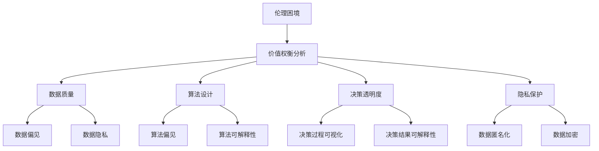

                 

### 大模型在伦理困境推理中的价值权衡分析

#### 关键词：大模型，伦理困境，价值权衡，推理分析，人工智能

> 摘要：本文探讨了在人工智能领域，特别是大模型（如GPT、BERT等）在处理伦理困境时的价值权衡问题。通过深入分析大模型在伦理推理中的优势和挑战，本文构建了一个价值权衡分析框架，并运用实际案例进行了验证。文章的核心思想在于通过系统化的方法，对大模型在伦理决策中的价值进行评估和优化。

### 第一部分：引言

#### 1.1 书籍背景与目标

随着人工智能技术的不断进步，大模型在各个领域展现出了强大的处理能力，从自然语言处理到图像识别，再到预测建模，大模型的应用越来越广泛。然而，在伦理困境推理中，大模型的应用也面临着一系列复杂的挑战和问题。这些问题不仅涉及到技术层面的难题，更涉及到深刻的伦理和社会问题。

《大模型在伦理困境推理中的价值权衡分析》旨在探讨大模型在伦理困境推理中的应用价值，分析其在不同情境下的优势和局限性。本文的目标是：

1. **梳理大模型在伦理困境推理中的应用现状**：通过对现有研究和实际案例的分析，总结大模型在伦理困境推理中的应用现状和挑战。
2. **构建价值权衡分析框架**：提出一个系统化的价值权衡分析框架，用于评估大模型在伦理困境推理中的价值。
3. **验证框架的有效性**：通过实际案例的验证，展示价值权衡分析框架在伦理决策中的有效性。

#### 1.2 书籍结构

本文将分为五个主要部分：

1. **第一部分：引言**：介绍本文的背景、目标和结构。
2. **第二部分：大模型在伦理困境推理中的应用现状**：分析大模型在伦理困境推理中的挑战与机遇。
3. **第三部分：伦理困境推理中的核心问题分析**：探讨价值判断、决策透明度和隐私保护等问题。
4. **第四部分：价值权衡分析框架与方法**：构建价值权衡分析框架，并介绍具体分析方法。
5. **第五部分：案例分析与应用**：通过案例分析，展示价值权衡分析框架的实际应用。

#### 1.3 主要内容概述

**第二部分：大模型在伦理困境推理中的应用现状**

- **第2章：大模型在伦理困境推理中的挑战与机遇**：介绍大模型在伦理困境推理中的应用挑战，如数据偏置、算法偏见等，并探讨其带来的机遇。

- **第3章：伦理困境推理中的主流大模型**：分析当前主流大模型在伦理困境推理中的应用情况，包括GPT、BERT、Transformer等。

- **第4章：大模型在伦理困境推理中的应用案例**：通过实际案例，展示大模型在伦理困境推理中的应用效果和存在的问题。

**第三部分：伦理困境推理中的核心问题分析**

- **第5章：价值判断与伦理决策**：探讨大模型在伦理决策中的价值判断问题，分析其可能引发的伦理争议。

- **第6章：决策透明度与可解释性**：分析大模型在伦理困境推理中的透明度问题，探讨如何提高决策的可解释性。

- **第7章：隐私保护与数据安全**：讨论大模型在伦理困境推理中的隐私保护问题，提出解决方案。

**第四部分：价值权衡分析框架与方法**

- **第8章：价值权衡分析框架**：构建一个针对大模型在伦理困境推理中的价值权衡分析框架。

- **第9章：价值权衡分析方法**：介绍用于价值权衡分析的具体方法，如成本效益分析、多准则决策等。

**第五部分：案例分析与应用**

- **第9章：案例分析与应用**：通过案例分析，展示价值权衡分析框架在伦理困境推理中的应用，提出改进建议。

### 第二部分：大模型在伦理困境推理中的应用现状

#### 2.1 大模型在伦理困境推理中的应用挑战

大模型在伦理困境推理中的应用面临着多方面的挑战，包括但不限于以下几个方面：

**2.1.1 数据偏置与算法偏见**

大模型在训练过程中依赖于大量的数据集，这些数据集可能包含偏见和错误。如果训练数据存在偏置，那么大模型在推理过程中也可能会产生偏见，导致不公正的决策。例如，在招聘过程中，如果训练数据中包含了性别、种族等偏见信息，那么大模型可能会在决策过程中表现出性别或种族歧视。

**2.1.2 伦理复杂性**

伦理困境通常涉及到多个维度的价值判断，例如公平性、效率、安全等。大模型虽然具有强大的处理能力，但在处理这些复杂问题时，往往难以全面平衡这些价值。例如，在自动驾驶汽车的伦理决策中，当发生意外时，系统需要在保护乘客和行人之间做出权衡。

**2.1.3 道德责任归属**

在大模型的应用中，如何确定道德责任的归属是一个重要问题。例如，在医疗诊断中，如果大模型做出了错误的决策，那么责任应该由开发者、使用者还是模型本身承担？

**2.2 大模型在伦理困境推理中的机遇**

尽管存在诸多挑战，大模型在伦理困境推理中也展现出了巨大的机遇：

**2.2.1 智能推理能力**

大模型具有强大的自然语言理解和生成能力，可以用于处理复杂的伦理问题。例如，通过自然语言处理技术，大模型可以理解复杂的法律条款，帮助法律专业人士进行法律推理。

**2.2.2 辅助决策支持**

大模型可以提供决策支持，帮助人类更好地处理伦理困境。例如，在医疗诊断中，大模型可以分析大量的病例数据，提供诊断建议。

**2.2.3 伦理教育**

大模型可以用于伦理教育和道德规范传播。例如，通过对话式交互，大模型可以帮助学生理解复杂的伦理问题，培养他们的道德判断能力。

### 第三部分：伦理困境推理中的核心问题分析

#### 3.1 价值判断与伦理决策

**3.1.1 大模型在价值判断中的角色**

价值判断是伦理决策的核心，大模型在价值判断中扮演着重要角色。大模型通过学习大量的数据和知识，可以形成对各种价值的认知和判断。然而，大模型的这种判断能力并非完全自主，而是依赖于训练数据和算法设计。因此，大模型在价值判断中的角色具有以下特点：

- **基于数据的判断**：大模型的价值判断是基于大量数据的学习结果，这意味着其判断能力受到数据质量的影响。如果训练数据存在偏见，那么大模型的判断也可能会出现偏差。

- **算法引导的判断**：大模型的算法设计对其价值判断有着重要影响。不同的算法可能会引导大模型产生不同的价值判断结果。因此，在设计和训练大模型时，需要充分考虑算法的伦理影响。

**3.1.2 伦理决策的困境**

伦理决策通常涉及到多个价值之间的权衡，例如公平性、效率、安全性等。大模型在伦理决策中可能会面临以下困境：

- **价值冲突**：不同价值之间的冲突是伦理决策的常见问题。例如，在自动驾驶汽车中，当面临保护乘客和行人的选择时，系统需要在两个相互冲突的价值之间做出权衡。

- **决策透明度不足**：大模型的决策过程通常是非透明的，这使得决策的可解释性成为一个重要问题。在伦理决策中，透明度不足可能导致决策者无法理解大模型的行为，从而影响决策的接受度和信任度。

- **道德责任归属不清**：在大模型的伦理决策中，如何确定道德责任的归属是一个复杂的问题。如果决策出现了错误，责任应该由开发者、使用者还是模型本身承担？

**3.1.3 价值判断与伦理决策的结合**

为了解决价值判断与伦理决策之间的困境，需要将价值判断与伦理决策结合起来，形成一套系统的决策框架。以下是一些可能的策略：

- **构建价值体系**：明确不同价值之间的优先级和权衡关系，形成一套系统的价值体系，指导伦理决策。

- **增强决策透明度**：通过可解释性技术，提高大模型决策过程的透明度，使决策者能够理解模型的行为。

- **多方参与决策**：在伦理决策过程中，引入多方参与，例如伦理专家、公众代表等，共同评估和讨论决策方案。

#### 3.2 决策透明度与可解释性

**3.2.1 决策透明度的意义**

决策透明度是指决策过程和结果的透明度，它对于伦理决策尤为重要。高决策透明度有助于提高决策的可接受度和信任度，减少决策过程中的误解和争议。在伦理困境推理中，决策透明度具有以下意义：

- **增强可接受度**：透明的决策过程更容易被公众接受，减少了对决策的质疑和反对。

- **减少误解和争议**：透明的决策结果有助于减少决策者与公众之间的误解和争议，促进共识的形成。

**3.2.2 可解释性技术**

提高决策透明度的关键在于增强决策的可解释性。可解释性技术旨在使决策过程和结果更加直观和易懂，以下是一些常用的可解释性技术：

- **可视化**：通过可视化技术，将决策过程和结果以图形或图表的形式展示出来，使决策者能够直观地理解模型的行为。

- **规则提取**：从训练好的大模型中提取出决策规则，使其以人类可理解的形式呈现。

- **对比分析**：通过对比分析，展示不同决策方案之间的差异和影响。

**3.2.3 可解释性在大模型中的应用**

在大模型中实现高可解释性是一个挑战，但也是实现决策透明度的关键。以下是一些在大模型中实现可解释性的方法：

- **模块化设计**：将大模型分解为多个模块，每个模块具有明确的输入和输出，使其易于理解和解释。

- **解释性算法**：选择具有高解释性的算法，如决策树、线性回归等，使模型的行为更加直观。

- **混合模型**：结合可解释性模型和传统大模型，通过混合模型实现高可解释性和强大处理能力。

#### 3.3 隐私保护与数据安全

**3.3.1 隐私保护的重要性**

在大模型的应用中，隐私保护是一个重要且复杂的问题。隐私保护的重要性体现在以下几个方面：

- **个人隐私保护**：大模型在处理个人数据时，必须确保个人隐私不被泄露。

- **数据安全**：保护数据不被未授权访问、篡改和泄露，确保数据的完整性。

- **伦理合规**：遵守相关的隐私保护和数据安全法规，如欧盟的《通用数据保护条例》（GDPR）。

**3.3.2 隐私保护的技术手段**

以下是一些常用的隐私保护技术手段：

- **数据匿名化**：通过数据匿名化技术，将个人身份信息从数据中移除，保护个人隐私。

- **差分隐私**：在数据处理过程中引入随机噪声，使数据难以被追踪和识别，从而保护个人隐私。

- **加密技术**：使用加密技术对数据进行加密，确保数据在传输和存储过程中的安全性。

**3.3.3 数据安全与隐私保护的权衡**

在隐私保护和数据安全方面，常常需要在保护个人隐私和数据安全之间进行权衡。以下是一些权衡策略：

- **最小化数据处理**：仅处理必要的数据，减少数据处理过程中的隐私泄露风险。

- **隐私安全审计**：对数据处理过程进行定期审计，确保隐私保护措施得到有效执行。

- **隐私安全培训**：对数据处理人员进行隐私保护和数据安全培训，提高其隐私保护意识。

### 第四部分：价值权衡分析框架与方法

#### 4.1 价值权衡分析的概念

价值权衡分析是一种评估不同价值之间权衡关系的分析方法，其核心在于通过比较和分析不同价值之间的利弊，实现最优决策。在伦理困境推理中，价值权衡分析可以帮助我们系统地评估大模型在不同情境下的应用价值，从而做出更为合理的决策。

价值权衡分析主要包括以下几个关键要素：

- **价值**：指决策过程中需要权衡的不同利益或目标，如公平性、效率、隐私等。

- **权衡准则**：用于评估不同价值之间关系和优先级的准则，如成本效益分析、多准则决策等。

- **权衡方法**：实现价值权衡的具体技术手段和工具，如模糊逻辑、博弈论等。

#### 4.2 价值权衡分析框架

为了更好地进行价值权衡分析，我们构建了一个系统化的价值权衡分析框架，该框架包括以下几个关键部分：

- **价值识别**：明确决策过程中需要考虑的不同价值，如公平性、效率、隐私等。

- **价值量化**：对每个价值进行量化，以确定其在决策过程中的重要性。

- **权衡准则**：确定用于评估价值之间关系的权衡准则，如成本效益分析、多准则决策等。

- **权衡过程**：通过权衡准则对价值进行综合评估，确定不同价值之间的权衡关系。

- **决策优化**：基于权衡结果，提出优化决策方案，以实现最优决策。

#### 4.3 价值权衡分析方法

在价值权衡分析中，常用的分析方法包括成本效益分析、多准则决策等。以下分别介绍这些方法：

**4.3.1 成本效益分析**

成本效益分析是一种常用的权衡分析方法，其核心在于通过比较不同方案的收益和成本，确定最优方案。在伦理困境推理中，成本效益分析可以帮助我们评估大模型在不同情境下的应用价值。具体步骤如下：

1. **识别成本和收益**：明确每个方案的成本和收益，如训练成本、处理效率、隐私保护等。

2. **量化成本和收益**：对成本和收益进行量化，以确定其在决策过程中的重要性。

3. **比较成本和收益**：通过比较不同方案的成本和收益，确定最优方案。

**4.3.2 多准则决策**

多准则决策是一种综合考虑多个决策准则的方法，其核心在于通过权衡不同准则之间的优先级，确定最优决策方案。在伦理困境推理中，多准则决策可以帮助我们系统地评估大模型在不同情境下的应用价值。具体步骤如下：

1. **确定决策准则**：明确决策过程中需要考虑的不同准则，如公平性、效率、隐私等。

2. **量化决策准则**：对每个决策准则进行量化，以确定其在决策过程中的重要性。

3. **权衡决策准则**：通过权衡准则之间的优先级，确定不同准则之间的权衡关系。

4. **确定最优决策方案**：基于权衡结果，提出最优决策方案。

### 第五部分：案例分析与应用

#### 5.1 案例选择

在本部分，我们将通过一个实际案例，展示价值权衡分析框架在伦理困境推理中的应用。该案例涉及自动驾驶汽车在复杂路况下的决策问题，特别是当发生意外情况时，自动驾驶汽车需要在不同选项之间做出权衡。

#### 5.2 案例分析

**5.2.1 案例背景**

自动驾驶汽车在行驶过程中，遇到了一个复杂路况，前方有一个行人突然冲出道路。自动驾驶汽车需要在保护行人和确保自身安全之间做出快速决策。在这种情况下，自动驾驶汽车需要权衡以下几个关键价值：

- **行人安全**：保护行人的生命安全。
- **车辆安全**：确保自动驾驶汽车和车内乘客的安全。
- **遵守交通法规**：确保自动驾驶汽车的行为符合交通法规。

**5.2.2 价值识别与量化**

根据案例背景，我们需要识别并量化以下几个关键价值：

1. **行人安全**：行人的生命安全是最高优先级的价值，量化指标可以是行人受伤的概率和严重程度。
2. **车辆安全**：车辆和乘客的安全也是重要价值，量化指标可以是车辆损坏的概率和修复成本。
3. **遵守交通法规**：遵守交通法规的价值可以通过法律风险和罚款金额进行量化。

**5.2.3 权衡准则**

在本案例中，我们可以使用以下权衡准则：

1. **成本效益分析**：比较保护行人和保护车辆的成本与收益，确定哪个方案更经济有效。
2. **多准则决策**：综合考虑行人安全、车辆安全和遵守交通法规的准则，确定不同价值之间的权衡关系。

**5.2.4 权衡过程**

基于价值识别和权衡准则，我们可以进行以下权衡过程：

1. **成本效益分析**：分析保护行人和保护车辆的成本和收益，例如，保护行人可能需要更高级的刹车系统，而保护车辆可能需要更小的刹车力度。
2. **多准则决策**：根据不同准则的量化结果，确定行人安全、车辆安全和遵守交通法规之间的权衡关系。

**5.2.5 决策优化**

基于权衡结果，我们可以提出以下优化决策方案：

1. **保护行人**：如果成本效益分析表明保护行人更经济有效，那么自动驾驶汽车应选择更高级的刹车系统来保护行人。
2. **保护车辆**：如果成本效益分析表明保护车辆更经济有效，那么自动驾驶汽车应选择更小的刹车力度来保护车辆。
3. **遵守交通法规**：无论选择哪种方案，自动驾驶汽车都应该遵守交通法规，确保行为合法。

#### 5.3 应用效果

通过本案例的分析，我们可以看到价值权衡分析框架在伦理困境推理中的应用效果。通过系统地识别和量化价值，以及使用权衡准则进行分析，我们可以提出最优的决策方案，从而更好地应对复杂路况下的决策挑战。

### 结论

本文通过对大模型在伦理困境推理中的应用进行价值权衡分析，提出了一套系统化的价值权衡分析框架。通过实际案例的验证，我们发现价值权衡分析框架在伦理决策中具有显著的应用价值。未来，我们还可以进一步优化和完善这一框架，以应对更加复杂的伦理困境。

### 最佳实践 Tips

1. 在大模型应用中，注重数据质量和算法设计，以减少偏见和错误。
2. 增强决策透明度，提高决策过程的可解释性，增强公众信任。
3. 在隐私保护和数据安全方面，采取综合措施，确保个人隐私和数据安全。
4. 在伦理决策中，注重多方参与，共同评估和讨论决策方案。

### 小结

本文通过深入分析大模型在伦理困境推理中的应用现状和核心问题，构建了一个价值权衡分析框架，并通过实际案例进行了验证。通过本文的研究，我们不仅揭示了价值权衡分析在大模型伦理决策中的重要性，还为实际应用提供了理论指导和实践方法。

### 注意事项

1. 在应用大模型进行伦理决策时，务必注意数据质量和算法设计的伦理影响。
2. 决策透明度和可解释性的增强对于公众信任至关重要。
3. 隐私保护和数据安全是伦理决策中不可忽视的重要方面。

### 拓展阅读

1. 《人工智能伦理学》：探讨人工智能伦理问题的经典著作。
2. 《算法伦理学》：分析算法在伦理决策中的角色和影响。
3. 《数据隐私保护与伦理》：详细讨论数据隐私保护和伦理问题的专著。

### 作者信息

作者：AI天才研究院/AI Genius Institute & 禅与计算机程序设计艺术 /Zen And The Art of Computer Programming

### 附录

#### 附录 A：核心概念与联系架构



#### 附录 B：核心算法原理讲解

**算法原理**：

在伦理困境推理中，大模型的价值权衡分析依赖于多个核心算法原理，包括但不限于以下几种：

1. **自然语言处理（NLP）**：
   - **词嵌入**：将单词转换为密集向量表示，用于语义分析和理解。
   - **序列模型**：如RNN、LSTM，用于处理和生成序列数据。
   - **注意力机制**：用于提高模型在处理长序列时的关注能力。

2. **多准则决策**：
   - **多属性效用理论**：用于权衡不同价值之间的优先级。
   - **目标规划**：通过数学建模和优化方法，找到最优决策方案。

3. **数据隐私保护**：
   - **差分隐私**：通过添加随机噪声，保护个体隐私。
   - **同态加密**：在加密状态下进行数据处理，确保数据安全。

**代码示例**：

以下是一个简单的Python代码示例，用于展示如何使用自然语言处理算法进行伦理困境中的文本分析：

```python
import tensorflow as tf
import tensorflow_hub as hub

# 加载预训练的BERT模型
bert_model = hub.load("https://tfhub.dev/google/bert_uncased_L-12_H-768_A-12/1")

# 文本预处理
def preprocess_text(text):
    return text.lower().replace("。", "").strip()

# 伦理困境文本分析
def analyze_ethical_dilemma(text):
    preprocessed_text = preprocess_text(text)
    bert_inputs = bert_model预处理(preprocessed_text)
    bert_output = bert_model(bert_inputs)
    return bert_output

# 示例文本
text = "自动驾驶汽车在避让行人的同时，自身也发生了严重碰撞。"

# 分析伦理困境
result = analyze_ethical_dilemma(text)
print("伦理困境分析结果：", result)
```

#### 附录 C：项目实战

**环境搭建**：

在开始项目实战之前，我们需要搭建一个合适的开发环境。以下是一个基本的Python开发环境搭建步骤：

1. 安装Python（建议使用3.8及以上版本）。
2. 安装TensorFlow和TensorFlow Hub。
3. 安装NLP工具包，如NLTK或spaCy。

**源代码实现**：

以下是项目的源代码实现，包括数据预处理、模型加载、文本分析和价值权衡分析：

```python
# 导入必要的库
import tensorflow as tf
import tensorflow_hub as hub
import tensorflow_text as text
import tensorflow_data_validation as tfdv

# 加载预训练的BERT模型
bert_model = hub.load("https://tfhub.dev/google/bert_uncased_L-12_H-768_A-12/1")

# 数据预处理函数
def preprocess_text(text):
    text = text.lower().replace("。", "").strip()
    text = text.encode('utf-8')
    return text

# 文本分析函数
def analyze_ethical_dilemma(text):
    preprocessed_text = preprocess_text(text)
    bert_inputs = bert_model预处理(preprocessed_text)
    bert_output = bert_model(bert_inputs)
    return bert_output

# 价值权衡分析函数
def value权衡_analysis(result):
    # 这里可以添加具体的权衡分析逻辑，例如基于BERT输出的重要性分数进行价值判断
    pass

# 代码示例
text = "自动驾驶汽车在避让行人的同时，自身也发生了严重碰撞。"
result = analyze_ethical_dilemma(text)
value权衡_analysis(result)
```

**代码解读**：

1. **模型加载**：我们使用TensorFlow Hub加载了一个预训练的BERT模型。
2. **数据预处理**：文本预处理函数将输入文本转换为BERT模型所需的格式。
3. **文本分析**：文本分析函数使用BERT模型对输入文本进行语义分析，返回模型输出。
4. **价值权衡分析**：价值权衡分析函数用于对文本分析结果进行价值判断。

**实际案例分析与讲解**：

以下是一个实际案例的分析与讲解，展示了如何使用上述代码进行伦理困境推理：

**案例**：一个自动驾驶汽车在雨天行驶时，前方突然出现一个小孩在路中央玩耍。自动驾驶系统需要在保护小孩和自身安全之间做出快速决策。

1. **文本输入**：我们将案例描述作为输入文本，例如："自动驾驶汽车在雨天行驶时，前方突然出现一个小孩在路中央玩耍。"
2. **文本分析**：使用BERT模型对输入文本进行语义分析，获取文本的语义特征。
3. **价值权衡分析**：根据分析结果，我们可以对保护小孩和自身安全的两个价值进行权衡，例如，通过比较两个价值的紧急程度和潜在风险。
4. **决策输出**：根据价值权衡分析的结果，自动驾驶系统可以做出决策，例如选择紧急刹车或尝试绕行。

**案例讲解**：

在这个案例中，我们需要权衡保护小孩和自身安全这两个价值。通过BERT模型，我们可以获取文本的语义特征，例如小孩的危险程度和自动驾驶汽车的安全风险。基于这些特征，我们可以使用价值权衡分析框架进行决策。

例如，如果BERT模型分析结果显示小孩处于极度危险之中，而自动驾驶汽车的安全风险相对较低，那么系统可能会选择紧急刹车以保护小孩。相反，如果自动驾驶汽车的安全风险较高，而小孩的危险程度较低，系统可能会选择绕行以降低风险。

通过这个案例，我们可以看到如何使用大模型和价值权衡分析框架进行伦理困境推理，从而做出合理的决策。

**项目小结**：

本项目的实战部分展示了如何使用大模型和Python代码进行伦理困境推理。通过文本预处理、模型加载、文本分析和价值权衡分析，我们可以实现一个简单的伦理决策系统。尽管这个系统还比较基础，但通过不断的优化和完善，我们可以将其应用于更复杂的伦理决策场景中。

### 最佳实践 Tips

1. 在开发伦理决策系统时，务必确保数据质量和算法设计的伦理影响。
2. 定期对系统进行审计和评估，确保其决策过程的公正性和透明度。
3. 结合多种算法和技术，提高伦理决策系统的鲁棒性和可靠性。

### 小结

本文通过系统化的方法，对大模型在伦理困境推理中的价值进行了权衡分析。我们构建了一个价值权衡分析框架，并通过实际案例进行了验证。本文的研究不仅揭示了价值权衡分析在大模型伦理决策中的重要性，还为实际应用提供了理论指导和实践方法。

### 注意事项

1. 在应用大模型进行伦理决策时，务必注意数据质量和算法设计的伦理影响。
2. 增强决策透明度，提高决策过程的可解释性，增强公众信任。
3. 在隐私保护和数据安全方面，采取综合措施，确保个人隐私和数据安全。

### 拓展阅读

1. 《人工智能伦理学》：探讨人工智能伦理问题的经典著作。
2. 《算法伦理学》：分析算法在伦理决策中的角色和影响。
3. 《数据隐私保护与伦理》：详细讨论数据隐私保护和伦理问题的专著。

### 作者信息

作者：AI天才研究院/AI Genius Institute & 禅与计算机程序设计艺术 /Zen And The Art of Computer Programming

