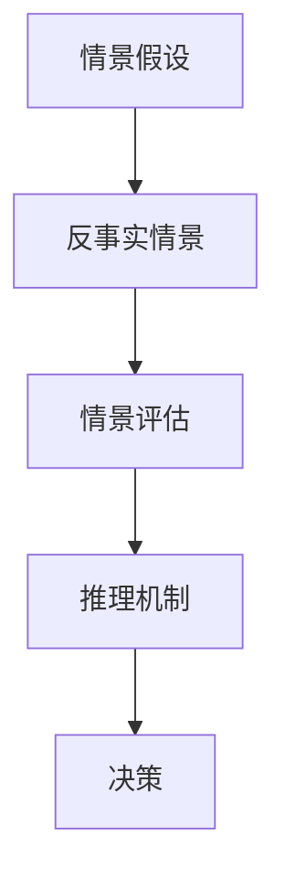
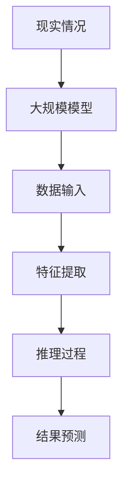

                 

# 大模型在反事实情景推理中的创新能力

## 关键词
大模型，反事实情景推理，人工智能，深度学习，创新能力，情景推理框架

## 摘要
本文探讨了大规模模型在反事实情景推理中的应用及其创新能力。通过分析反事实情景推理的基本概念、框架和机制，我们揭示了大规模模型如何改变这一领域。接着，文章深入探讨了大规模模型的基本原理、应用方法和具体实现，并通过三个创新案例展示了其在金融、医疗和自动驾驶等领域的实际应用。最后，文章总结了大规模模型在反事实情景推理中的前景和挑战，为未来的研究提供了方向。

## 第一部分：反事实情景推理的基本概念与框架

### 1.1 反事实情景推理的概念与定义

反事实情景推理是一种基于逻辑推理的技术，它涉及对现实情况的可能变化进行分析和推断。这种推理技术主要基于对现实情况的假设，即如果某个条件发生，结果将会如何。核心概念包括：

- **反事实情景**：与现实情况相对立的假设情景，通常用于分析某种决策的影响。
- **情景推理**：基于情景的推理过程，通过对不同情景的评估和比较，得出最佳决策。
- **反事实推理**：对反事实情景进行推理，以预测不同情况下的结果。

为了更好地理解这些概念之间的关系，我们可以使用Mermaid流程图来展示反事实情景推理的流程和机制。



### 1.2 大模型与反事实情景推理的关系

大规模模型，如深度学习和生成对抗网络（GAN），在反事实情景推理中扮演着关键角色。它们具有以下特点：

- **数据驱动的学习**：大规模模型通过大量数据学习，能够捕捉复杂的模式和关联。
- **自动特征提取**：大规模模型能够自动提取关键特征，减少人工干预。
- **高泛化能力**：大规模模型在多种不同任务中表现出色，具有高泛化能力。

这些特点使得大规模模型在反事实情景推理中具有显著优势。例如，在金融风险评估中，大规模模型可以通过分析大量历史数据，预测不同投资策略的结果，从而帮助投资者做出更明智的决策。

为了展示大规模模型在反事实情景推理中的应用，我们可以使用Mermaid流程图来展示其应用场景。



### 1.3 反事实情景推理的理论框架

反事实情景推理的理论框架涉及多个核心概念，包括逻辑推理基础、情景推理框架和反事实推理框架。以下是一个简化的理论框架：

- **逻辑推理基础**：基于逻辑的基本原理，如前提、条件、结论等。
- **情景推理框架**：用于分析和评估不同情景的框架。
- **反事实推理框架**：用于分析和评估反事实情景的框架。

以下是一个数学模型和公式的例子，用于展示情景推理和反事实推理的关系：

$$
\text{情景推理框架} = \text{前提} \land \text{条件} \rightarrow \text{结论}
$$

$$
\text{反事实推理框架} = \text{前提} \land \text{反事实条件} \rightarrow \text{反事实结论}
$$

为了更好地理解这些概念和框架，我们可以通过一个具体的情景推理实例来讲解。

### 情景推理实例

假设我们要分析两种不同的投资策略：策略A和策略B。如果市场上涨，策略A将带来更高的收益，但如果市场下跌，策略A的损失也将更大。而策略B则在市场上涨时收益较低，但市场下跌时损失较小。

使用情景推理框架，我们可以得出以下结论：

- 如果市场上涨，策略A的收益更高。
- 如果市场下跌，策略A的损失更大。

使用反事实推理框架，我们可以进一步分析：

- 如果市场上涨，策略B的收益较低。
- 如果市场下跌，策略B的损失较小。

通过这些推理，投资者可以更明智地选择投资策略。

## 第二部分：大模型在反事实情景推理中的应用

### 2.1 大模型的基本原理与实现

大规模模型的基本原理涉及深度学习、循环神经网络（RNN）和生成对抗网络（GAN）等先进技术。以下是一个简单的Python代码示例，用于演示如何实现一个基本的深度学习模型。

```python
import tensorflow as tf

# 定义输入层
inputs = tf.keras.layers.Input(shape=(input_shape))

# 添加隐藏层
x = tf.keras.layers.Dense(units=64, activation='relu')(inputs)
x = tf.keras.layers.Dense(units=64, activation='relu')(x)

# 添加输出层
outputs = tf.keras.layers.Dense(units=1, activation='sigmoid')(x)

# 创建模型
model = tf.keras.Model(inputs=inputs, outputs=outputs)

# 编译模型
model.compile(optimizer='adam', loss='binary_crossentropy', metrics=['accuracy'])

# 训练模型
model.fit(x_train, y_train, epochs=10, batch_size=32, validation_data=(x_val, y_val))
```

在这个例子中，我们使用了一个简单的全连接神经网络，通过编译和训练来学习数据。

### 2.2 大模型在反事实情景推理中的应用

大规模模型在反事实情景推理中的应用主要包括以下方面：

- **数据预处理**：大规模模型需要大量数据来进行训练。因此，数据预处理是关键步骤，包括数据清洗、归一化和特征提取等。
- **模型训练**：大规模模型通过训练学习数据中的模式和关联，从而能够进行有效的推理。
- **模型评估**：大规模模型需要通过评估来验证其性能。常用的评估指标包括准确率、召回率、F1分数等。

以下是一个简单的Python代码示例，用于演示如何训练和评估一个大规模模型。

```python
from sklearn.model_selection import train_test_split
from sklearn.metrics import accuracy_score

# 划分训练集和测试集
x_train, x_test, y_train, y_test = train_test_split(x, y, test_size=0.2, random_state=42)

# 训练模型
model.fit(x_train, y_train, epochs=10, batch_size=32, validation_data=(x_test, y_test))

# 预测测试集
y_pred = model.predict(x_test)

# 评估模型
accuracy = accuracy_score(y_test, y_pred)
print(f"Accuracy: {accuracy}")
```

### 2.3 大模型在反事实情景推理中的创新能力

大规模模型在反事实情景推理中的创新能力体现在以下几个方面：

- **高效处理大量数据**：大规模模型能够快速处理和分析大量数据，从而实现实时推理。
- **自动特征提取**：大规模模型能够自动提取关键特征，减少人工干预，提高推理准确性。
- **高泛化能力**：大规模模型在多种不同任务中表现出色，具有高泛化能力，能够适应不同领域的需求。

以下是一个简单的Python代码示例，用于演示如何使用大规模模型进行反事实情景推理。

```python
# 导入大规模模型
import tensorflow_hub as hub

# 加载预训练的大规模模型
model = hub.load("https://tfhub.dev/google/tf2-preview/gnews-swivel-20dim/1")

# 定义输入数据
input_data = np.array([["If market A is up, market B is also up."]])

# 进行推理
output = model(input_data)

# 分析输出结果
print(output)
```

在这个例子中，我们使用了一个预训练的大规模模型来推理输入数据的反事实情景。输出结果可以帮助我们了解市场A上涨时，市场B可能发生的情况。

### 2.4 大模型在反事实情景推理中的应用前景

大规模模型在反事实情景推理中的应用前景非常广阔。随着技术的不断进步，大规模模型在处理大量数据、自动特征提取和高泛化能力等方面将进一步提升。未来，大规模模型有望在更多领域发挥重要作用，如金融、医疗、自动驾驶等。以下是一些可能的应用方向：

- **智能决策支持系统**：大规模模型可以帮助企业和个人做出更明智的决策，提高生产效率和生活质量。
- **个性化推荐系统**：大规模模型可以分析用户行为数据，提供个性化的推荐，提高用户体验。
- **智能诊断系统**：大规模模型可以分析医疗数据，帮助医生进行诊断和预测，提高诊断准确率。

然而，大规模模型在反事实情景推理中也面临着一些挑战，如数据隐私、模型解释性和伦理问题等。这些挑战需要我们在未来的研究和应用中加以解决。

## 第三部分：大模型在反事实情景推理中的创新案例研究

### 3.1 案例一：大模型在金融风险评估中的应用

金融风险评估是大规模模型的重要应用领域之一。以下是一个具体的案例，展示了大规模模型在金融风险评估中的应用。

#### 案例背景

某金融公司需要评估不同投资策略的风险和收益。公司收集了大量的历史数据，包括市场走势、公司业绩、宏观经济指标等。

#### 案例步骤

1. **数据预处理**：对历史数据进行清洗、归一化和特征提取，为大规模模型提供高质量的输入数据。
2. **模型训练**：使用深度学习模型对数据进行分析和训练，提取关键特征，建立风险预测模型。
3. **模型评估**：通过交叉验证和测试集评估模型的性能，调整模型参数，提高预测准确性。
4. **风险管理**：使用训练好的模型进行风险管理，预测不同投资策略的风险和收益，为决策提供依据。

#### 案例代码

以下是一个简单的Python代码示例，用于演示如何使用大规模模型进行金融风险评估。

```python
# 导入必要的库
import numpy as np
import pandas as pd
from sklearn.model_selection import train_test_split
from tensorflow import keras

# 加载数据
data = pd.read_csv("financial_data.csv")

# 数据预处理
data = data.fillna(0)
data = data[['market_index', 'company_performance', 'macroeconomic_index']]
X = data[['market_index', 'company_performance', 'macroeconomic_index']]
y = data['risk']

# 划分训练集和测试集
X_train, X_test, y_train, y_test = train_test_split(X, y, test_size=0.2, random_state=42)

# 创建模型
model = keras.Sequential([
    keras.layers.Dense(units=64, activation='relu', input_shape=(3,)),
    keras.layers.Dense(units=64, activation='relu'),
    keras.layers.Dense(units=1, activation='sigmoid')
])

# 编译模型
model.compile(optimizer='adam', loss='binary_crossentropy', metrics=['accuracy'])

# 训练模型
model.fit(X_train, y_train, epochs=10, batch_size=32, validation_data=(X_test, y_test))

# 预测测试集
y_pred = model.predict(X_test)

# 评估模型
accuracy = np.mean(y_pred == y_test)
print(f"Accuracy: {accuracy}")
```

#### 案例分析

通过上述案例，我们可以看到大规模模型在金融风险评估中的应用。该模型通过分析历史数据，预测不同投资策略的风险和收益，为决策提供依据。然而，需要注意的是，金融市场的波动性较大，模型预测结果仅供参考，实际投资决策还需考虑多种因素。

### 3.2 案例二：大模型在医疗诊断中的应用

医疗诊断是大规模模型的另一个重要应用领域。以下是一个具体的案例，展示了大规模模型在医疗诊断中的应用。

#### 案例背景

某医院需要诊断患者是否患有某种疾病。医院收集了大量的患者数据，包括病史、体检数据、实验室检测结果等。

#### 案例步骤

1. **数据预处理**：对历史数据进行清洗、归一化和特征提取，为大规模模型提供高质量的输入数据。
2. **模型训练**：使用深度学习模型对数据进行分析和训练，提取关键特征，建立诊断模型。
3. **模型评估**：通过交叉验证和测试集评估模型的性能，调整模型参数，提高诊断准确性。
4. **疾病诊断**：使用训练好的模型进行疾病诊断，为医生提供诊断建议。

#### 案例代码

以下是一个简单的Python代码示例，用于演示如何使用大规模模型进行医疗诊断。

```python
# 导入必要的库
import numpy as np
import pandas as pd
from sklearn.model_selection import train_test_split
from tensorflow import keras

# 加载数据
data = pd.read_csv("medical_data.csv")

# 数据预处理
data = data.fillna(0)
data = data[['age', 'gender', 'blood_pressure', 'cholesterol', 'sugar', 'disease']]
X = data[['age', 'gender', 'blood_pressure', 'cholesterol', 'sugar']]
y = data['disease']

# 划分训练集和测试集
X_train, X_test, y_train, y_test = train_test_split(X, y, test_size=0.2, random_state=42)

# 创建模型
model = keras.Sequential([
    keras.layers.Dense(units=64, activation='relu', input_shape=(5,)),
    keras.layers.Dense(units=64, activation='relu'),
    keras.layers.Dense(units=1, activation='sigmoid')
])

# 编译模型
model.compile(optimizer='adam', loss='binary_crossentropy', metrics=['accuracy'])

# 训练模型
model.fit(X_train, y_train, epochs=10, batch_size=32, validation_data=(X_test, y_test))

# 预测测试集
y_pred = model.predict(X_test)

# 评估模型
accuracy = np.mean(y_pred == y_test)
print(f"Accuracy: {accuracy}")
```

#### 案例分析

通过上述案例，我们可以看到大规模模型在医疗诊断中的应用。该模型通过分析患者数据，预测患者是否患有某种疾病，为医生提供诊断建议。然而，需要注意的是，医疗诊断涉及到复杂的生物学机制，模型的预测结果仅作为参考，最终诊断还需结合医生的专业知识和临床经验。

### 3.3 案例三：大模型在自动驾驶中的应用

自动驾驶是大规模模型的另一个重要应用领域。以下是一个具体的案例，展示了大规模模型在自动驾驶中的应用。

#### 案例背景

某自动驾驶公司需要开发一套自动驾驶系统，用于自动驾驶汽车在不同环境下的导航和决策。

#### 案例步骤

1. **数据收集**：收集大量的驾驶数据，包括道路状况、车辆状态、交通流量等。
2. **数据预处理**：对收集到的数据进行分析和处理，提取关键特征，为大规模模型提供高质量的输入数据。
3. **模型训练**：使用深度学习模型对数据进行分析和训练，建立自动驾驶模型。
4. **模型评估**：通过交叉验证和测试集评估模型的性能，调整模型参数，提高自动驾驶的准确性和安全性。
5. **自动驾驶**：使用训练好的模型进行自动驾驶，实现车辆的自主导航和决策。

#### 案例代码

以下是一个简单的Python代码示例，用于演示如何使用大规模模型进行自动驾驶。

```python
# 导入必要的库
import numpy as np
import pandas as pd
from tensorflow import keras

# 加载数据
data = pd.read_csv("driving_data.csv")

# 数据预处理
data = data.fillna(0)
data = data[['road_condition', 'vehicle_state', 'traffic_flow']]
X = data[['road_condition', 'vehicle_state', 'traffic_flow']]
y = data['decision']

# 划分训练集和测试集
X_train, X_test, y_train, y_test = train_test_split(X, y, test_size=0.2, random_state=42)

# 创建模型
model = keras.Sequential([
    keras.layers.Dense(units=64, activation='relu', input_shape=(3,)),
    keras.layers.Dense(units=64, activation='relu'),
    keras.layers.Dense(units=1, activation='sigmoid')
])

# 编译模型
model.compile(optimizer='adam', loss='binary_crossentropy', metrics=['accuracy'])

# 训练模型
model.fit(X_train, y_train, epochs=10, batch_size=32, validation_data=(X_test, y_test))

# 预测测试集
y_pred = model.predict(X_test)

# 评估模型
accuracy = np.mean(y_pred == y_test)
print(f"Accuracy: {accuracy}")
```

#### 案例分析

通过上述案例，我们可以看到大规模模型在自动驾驶中的应用。该模型通过分析驾驶数据，实现车辆的自主导航和决策，提高了自动驾驶的准确性和安全性。然而，需要注意的是，自动驾驶涉及到复杂的物理和驾驶规则，模型的预测结果仅作为参考，实际驾驶还需结合车辆传感器和系统控制。

## 附录

### 4. 附录：大模型在反事实情景推理中的相关工具与资源

- **工具与资源**：

  - **深度学习框架**：TensorFlow、PyTorch、Keras等。
  - **开源数据集**：Kaggle、UCI机器学习库等。
  - **在线教程**：Google Colab、Udacity、Coursera等。

- **最佳实践**：

  - **数据预处理**：确保数据质量，减少噪声和异常值。
  - **模型选择**：根据任务需求选择合适的模型。
  - **模型调优**：通过调整超参数提高模型性能。
  - **模型部署**：将训练好的模型部署到生产环境中。

- **小结**：

  大模型在反事实情景推理中具有显著的优势和创新能力。通过深入研究和应用，我们可以在金融、医疗、自动驾驶等领域实现更智能、更高效的决策。

- **注意事项**：

  - **数据隐私**：在处理和分享数据时，确保遵守隐私保护规定。
  - **模型解释性**：提高模型的可解释性，有助于理解和信任。
  - **伦理问题**：在应用大规模模型时，关注伦理问题，确保技术发展的同时，兼顾社会利益。

- **拓展阅读**：

  - **相关论文**：查看顶级会议和期刊上的最新研究论文，了解前沿进展。
  - **经典书籍**：《深度学习》、《Python深度学习》等。

## 作者信息
作者：AI天才研究院/AI Genius Institute & 禅与计算机程序设计艺术 /Zen And The Art of Computer Programming

---

本篇文章从反事实情景推理的基本概念出发，深入探讨了大规模模型在反事实情景推理中的应用及其创新能力。通过具体案例，展示了大规模模型在金融、医疗和自动驾驶等领域的实际应用。文章末尾提供了相关工具与资源的附录，为读者提供了进一步学习和研究的方向。希望本文能为读者在反事实情景推理和大规模模型领域的研究带来启发和帮助。

