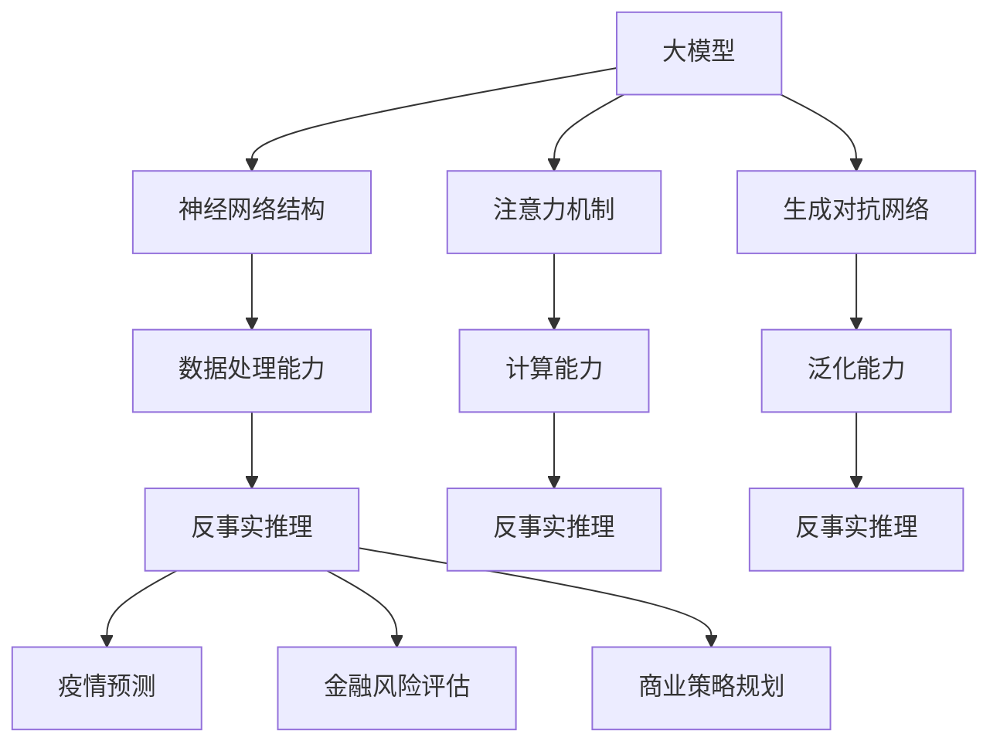

                 

### 引言

#### 研究背景与意义

反事实推理是人工智能领域中的一个重要研究方向，它涉及从现有事实出发，推测出不同情况下可能发生的结果。这种推理能力在许多实际应用中具有重要意义，如疫情预测、金融风险评估、商业策略规划等。然而，传统的反事实推理方法通常依赖于大量的假设和简化的模型，难以应对复杂、多变的环境。

大模型的兴起为反事实推理带来了新的机遇。大模型，特别是基于深度学习的模型，通过学习海量数据，能够捕捉到复杂的模式和关系，从而在反事实推理中表现出强大的能力。然而，与此同时，大模型也面临着诸多挑战，如数据质量、计算资源、模型解释性等。

本文旨在探讨大模型在反事实推理中的应用与局限，具体目标如下：

1. 系统性地介绍大模型的基本概念、结构和原理。
2. 阐述反事实推理的基本理论和方法。
3. 分析大模型在反事实推理中的优势与挑战。
4. 提出大模型在反事实推理中的优化策略。
5. 讨论大模型在反事实推理中的局限性及其应对策略。

通过上述目标的实现，本文希望为学术界和工业界提供有价值的参考，推动大模型在反事实推理领域的进一步研究和应用。

#### 核心概念与联系

为了更好地理解本文的核心概念，我们使用Mermaid流程图来展示大模型与反事实推理之间的关系：



此流程图展示了大模型的基本组成部分（神经网络结构、注意力机制、生成对抗网络）以及它们如何与反事实推理相关联，最终应用于不同领域（疫情预测、金融风险评估、商业策略规划）。

#### 研究目的与内容

本文的研究目的在于深入探讨大模型在反事实推理中的应用，并分析其局限性。具体研究内容如下：

1. **大模型概述**：介绍大模型的基本概念、分类、结构、原理及其特点与应用领域。
2. **反事实推理基础**：阐述反事实推理的定义、类型、理论基础以及常用方法。
3. **大模型在反事实推理中的应用**：分析大模型在反事实推理中的优势、应用案例及其面临的挑战。
4. **大模型优化策略**：探讨如何通过数据增强、模型压缩和模型融合等方法优化大模型在反事实推理中的应用。
5. **大模型局限性分析**：分析大模型在反事实推理中的数据依赖、模型解释性和道德法律问题，并提出应对策略。
6. **未来发展趋势**：展望大模型在反事实推理中的未来研究方向、应用前景以及面临的挑战。

#### 研究方法与技术路线

本文采用以下研究方法与技术路线：

1. **文献综述**：通过查阅大量相关文献，系统性地梳理大模型与反事实推理的理论基础、应用现状和优化策略。
2. **案例分析**：选取具有代表性的应用案例，深入分析大模型在反事实推理中的具体应用和效果。
3. **实验验证**：设计实验，通过对比实验验证大模型在反事实推理中的性能表现和优化策略的有效性。
4. **理论分析**：运用数学模型和公式，深入探讨大模型在反事实推理中的工作原理和局限性。
5. **趋势预测**：结合当前研究进展和技术发展趋势，预测大模型在反事实推理领域的未来发展方向。

### 第一部分：大模型概述

#### 第1章：大模型基本概念

##### 1.1 什么是大模型

大模型，是指具有巨大参数量和强大计算能力的人工智能模型。这些模型通常基于深度学习技术，通过多层神经网络结构来学习数据中的复杂模式和规律。与传统的小型模型相比，大模型具有以下特点：

1. **参数量巨大**：大模型的参数量通常在数百万甚至数十亿级别，这使得它们能够捕捉到数据中的细微特征和关系。
2. **计算资源需求高**：大模型在训练和推理过程中需要大量的计算资源和存储空间，这通常需要高性能计算硬件（如GPU、TPU）的支持。
3. **强大的学习能力和泛化能力**：大模型通过学习海量数据，能够实现良好的泛化能力，从而在面对未知数据时仍能表现出优秀的性能。

大模型与传统模型的主要区别在于：

1. **数据量**：传统模型通常基于较小规模的数据集，而大模型则依赖于海量数据。
2. **模型复杂度**：传统模型通常采用简单的模型结构，而大模型采用复杂的神经网络结构，如深度神经网络（DNN）、卷积神经网络（CNN）和循环神经网络（RNN）等。
3. **计算资源**：传统模型计算资源需求较低，而大模型需要高性能计算硬件支持。

大模型的发展背景可以追溯到以下几个方面：

1. **数据量的爆炸性增长**：随着互联网和物联网的发展，数据量呈现爆炸性增长，为训练大模型提供了充足的数据资源。
2. **计算资源的提升**：随着云计算、GPU和TPU等高性能计算硬件的发展，为训练大模型提供了强大的计算能力。
3. **深度学习技术的进步**：深度学习技术的不断进步，使得大模型能够更好地学习数据中的复杂模式和规律。

##### 1.2 大模型的结构和原理

大模型的结构通常包括以下几个主要部分：

1. **输入层**：接收外部输入数据，如图像、文本或声音等。
2. **隐藏层**：包含多个隐藏层，每个隐藏层由多个神经元组成，用于提取和转换输入数据。
3. **输出层**：生成模型预测结果，如分类标签、概率分布或连续值等。

大模型的基本原理基于神经网络，特别是深度神经网络（DNN）。神经网络由大量的神经元（或节点）组成，每个神经元接收多个输入信号，并通过非线性激活函数进行处理，最终输出一个值。通过多层次的神经网络结构，大模型能够捕捉到输入数据中的复杂模式和规律。

1. **神经网络结构**：神经网络结构主要包括全连接层、卷积层、循环层等，每种结构适用于不同的数据类型和处理任务。
2. **注意力机制**：注意力机制是一种用于提高神经网络学习效率和性能的技术，通过动态调整神经元之间的权重，使模型能够关注到重要的输入特征。
3. **生成对抗网络（GAN）**：生成对抗网络是一种由生成器和判别器组成的模型，通过相互竞争的方式训练，生成器和判别器的性能不断提升，从而实现高质量的图像生成。

##### 1.3 大模型的优缺点

大模型具有以下优点：

1. **强大的学习能力和泛化能力**：大模型通过学习海量数据，能够捕捉到数据中的复杂模式和规律，从而实现良好的泛化能力。
2. **处理复杂数据类型**：大模型能够处理各种复杂数据类型，如图像、文本和声音等，使其应用范围更广泛。
3. **自动特征提取**：大模型通过多层神经网络结构，能够自动提取数据中的特征，从而降低人工特征工程的工作量。

然而，大模型也面临着一些缺点：

1. **计算资源需求高**：大模型在训练和推理过程中需要大量的计算资源和存储空间，这通常需要高性能计算硬件的支持。
2. **训练时间长**：大模型的训练时间通常较长，特别是在处理海量数据时，训练过程可能需要数天甚至数周时间。
3. **模型解释性差**：大模型的决策过程往往是非线性的，且依赖于大量的参数，这使得模型的解释性较差，难以理解其具体工作原理。

为了平衡大模型的优缺点，研究者们提出了一些优化策略，如模型压缩、数据增强和模型融合等。这些策略旨在提高大模型的学习效率、降低计算资源和训练时间，同时保持其强大的学习能力和泛化能力。

##### 1.4 大模型的代表性模型

大模型在人工智能领域得到了广泛的应用，以下是几个代表性模型：

1. **GPT（Generative Pretrained Transformer）**：GPT是一种基于Transformer架构的预训练语言模型，通过大量文本数据训练，能够生成高质量的自然语言文本。
2. **BERT（Bidirectional Encoder Representations from Transformers）**：BERT是一种基于Transformer架构的双向编码器，通过预训练和微调，能够在自然语言处理任务中实现出色的性能。
3. **BERT-GPT（BERT and GPT Fusion）**：BERT-GPT是一种将BERT和GPT模型融合的模型，通过联合训练，能够更好地处理长文本和自然语言生成任务。

这些模型在不同的应用领域中表现出强大的性能，为人工智能的发展做出了重要贡献。

##### 1.5 大模型的应用领域

大模型在多个应用领域中展现了其强大的能力和广阔的应用前景，以下是几个主要的应用领域：

1. **自然语言处理（NLP）**：大模型在自然语言处理领域取得了显著成果，如文本分类、情感分析、机器翻译和对话系统等。
2. **计算机视觉（CV）**：大模型在计算机视觉领域应用广泛，如图像分类、目标检测、图像生成和视频分析等。
3. **语音识别（ASR）**：大模型在语音识别领域表现突出，通过学习大量语音数据，实现了高精度的语音识别和语音合成。
4. **推荐系统**：大模型在推荐系统领域发挥了重要作用，通过学习用户的行为数据，能够生成个性化的推荐结果。
5. **金融风控**：大模型在金融风控领域应用广泛，如欺诈检测、信用评估和投资策略等。

这些应用领域展示了大模型的广泛应用前景，为人工智能的发展提供了新的机遇和挑战。

##### 1.6 小结

大模型作为一种强大的深度学习模型，通过学习海量数据，能够捕捉到复杂的模式和规律，从而在多个领域取得了显著的成果。然而，大模型也面临着计算资源需求高、训练时间长和模型解释性差等挑战。为了充分发挥大模型的优势，研究者们提出了多种优化策略，如模型压缩、数据增强和模型融合等。未来，随着计算资源的提升和深度学习技术的进步，大模型将在人工智能领域发挥更加重要的作用。

### 第2章：反事实推理基础

#### 2.1 反事实推理的定义与类型

反事实推理是一种基于假设和条件概率的推理方法，通过分析不同情况下的可能结果，从而做出合理的推断。反事实推理的定义可以表述为：在给定当前事实的基础上，通过假设其他条件，推断出不同情况下可能发生的结果。

反事实推理主要分为以下几种类型：

1. **逆因果推理**：逆因果推理是一种基于因果关系进行推理的方法，通过已知结果，推断可能的原因。例如，已知某人得了流感，可以推断他可能接触了流感病毒。
2. **逆条件推理**：逆条件推理是一种基于条件概率进行推理的方法，通过已知条件，推断可能的结果。例如，已知某种药物有效，可以推断该药物可能治愈疾病。
3. **交替推理**：交替推理是一种同时考虑多个假设和条件，通过逐步排除不合理的假设，最终得到合理结果的推理方法。例如，在天气预报中，通过同时考虑天气模型和历史数据，交替推理出不同天气状况的可能性。

反事实推理在多个领域具有广泛的应用，如医学诊断、金融风险评估、商业策略规划等。它能够帮助决策者更好地理解可能发生的情况，从而做出更合理的决策。

#### 2.2 反事实推理的理论基础

反事实推理的理论基础主要包括条件概率、贝叶斯网络和最大后验概率等。

1. **条件概率**：条件概率是指在已知某一事件发生的情况下，另一事件发生的概率。条件概率的计算公式为：

   $$P(A|B) = \frac{P(A \cap B)}{P(B)}$$

   其中，$P(A|B)$ 表示在事件 $B$ 发生的条件下，事件 $A$ 发生的概率，$P(A \cap B)$ 表示事件 $A$ 和事件 $B$ 同时发生的概率，$P(B)$ 表示事件 $B$ 发生的概率。

   条件概率在反事实推理中具有重要意义，因为它能够帮助我们理解不同条件下事件发生的概率，从而进行合理的推断。

2. **贝叶斯网络**：贝叶斯网络是一种基于概率图模型的知识表示方法，它通过有向无环图（DAG）来表示变量之间的条件依赖关系。贝叶斯网络中的节点表示变量，边表示变量之间的条件依赖关系。

   贝叶斯网络的基本原理是利用条件概率来计算变量之间的依赖关系。在给定某一变量的条件下，其他变量的概率可以通过贝叶斯公式计算：

   $$P(A|B) = \frac{P(B|A)P(A)}{P(B)}$$

   其中，$P(A|B)$ 表示在变量 $B$ 发生的条件下，变量 $A$ 发生的概率，$P(B|A)$ 表示在变量 $A$ 发生的条件下，变量 $B$ 发生的概率，$P(A)$ 表示变量 $A$ 发生的概率，$P(B)$ 表示变量 $B$ 发生的概率。

   贝叶斯网络在反事实推理中具有重要应用，因为它能够通过条件概率计算变量之间的依赖关系，从而进行合理的推断。

3. **最大后验概率**：最大后验概率是一种基于贝叶斯公式进行推断的方法，它通过最大化后验概率来推断变量的最可能状态。最大后验概率的计算公式为：

   $$\hat{X} = \arg\max_{X} P(X|D)$$

   其中，$\hat{X}$ 表示变量的最可能状态，$P(X|D)$ 表示在给定数据 $D$ 的条件下，变量 $X$ 发生的概率。

   最大后验概率在反事实推理中具有重要意义，因为它能够通过最大化后验概率来推断最可能的情况，从而进行合理的推断。

#### 2.3 反事实推理的方法

反事实推理的方法主要分为基于概率图模型的方法和基于深度学习方法的方法。

1. **基于概率图模型的方法**：基于概率图模型的方法通过构建概率图模型来表示变量之间的依赖关系，并利用概率图模型进行推理。常见的概率图模型包括贝叶斯网络、隐马尔可夫模型（HMM）和条件概率图模型等。

   - **贝叶斯网络**：贝叶斯网络通过有向无环图（DAG）来表示变量之间的条件依赖关系，利用条件概率计算变量之间的依赖关系，从而进行推理。
   - **隐马尔可夫模型（HMM）**：隐马尔可夫模型通过状态序列和观察序列来表示变量之间的依赖关系，利用马尔可夫性质进行推理。
   - **条件概率图模型**：条件概率图模型通过无向图来表示变量之间的条件依赖关系，利用条件概率进行推理。

   基于概率图模型的方法在反事实推理中具有较好的理论基础和解释性，但通常需要大量的参数调整和计算。

2. **基于深度学习方法的方法**：基于深度学习方法的方法通过构建深度神经网络来表示变量之间的依赖关系，并利用神经网络进行推理。常见的深度学习模型包括卷积神经网络（CNN）、循环神经网络（RNN）和变换器（Transformer）等。

   - **卷积神经网络（CNN）**：卷积神经网络通过卷积层来提取图像中的特征，并利用池化层来减少参数数量，从而进行推理。
   - **循环神经网络（RNN）**：循环神经网络通过循环层来处理序列数据，并利用门控机制来控制信息的传递，从而进行推理。
   - **变换器（Transformer）**：变换器通过自注意力机制来处理序列数据，并利用多层的编码器和解码器进行推理。

   基于深度学习方法的方法在反事实推理中具有较好的性能和泛化能力，但通常需要大量的数据和计算资源。

#### 2.4 小结

反事实推理是一种基于假设和条件概率的推理方法，通过分析不同情况下的可能结果，从而做出合理的推断。反事实推理的理论基础包括条件概率、贝叶斯网络和最大后验概率等。反事实推理的方法主要分为基于概率图模型的方法和基于深度学习方法的方法。基于概率图模型的方法具有较好的理论基础和解释性，但通常需要大量的参数调整和计算。基于深度学习方法的方法具有较好的性能和泛化能力，但通常需要大量的数据和计算资源。通过深入了解反事实推理的基础理论和方法，我们可以更好地应用它解决实际问题。

### 第二部分：大模型在反事实推理中的应用

#### 第3章：大模型在反事实推理中的性能表现

##### 3.1 大模型在反事实推理中的优势

大模型在反事实推理中表现出诸多优势，这些优势主要体现在以下几个方面：

1. **强大的计算能力**：大模型拥有数百万甚至数十亿个参数，这使得它们能够在海量数据中进行高效的计算。相比于传统模型，大模型能够在更短的时间内处理更多的数据，从而提高反事实推理的效率。

2. **数据处理能力**：大模型通过多层神经网络结构，能够自动提取数据中的特征，从而降低人工特征工程的工作量。这使得大模型在处理复杂数据类型（如文本、图像和声音）时具有更高的灵活性和适应性。

3. **泛化能力**：大模型通过学习海量数据，能够捕捉到数据中的复杂模式和规律，从而实现良好的泛化能力。这意味着大模型在面对未知数据时仍能保持较高的性能，从而提高反事实推理的准确性。

4. **自适应能力**：大模型能够通过自适应调整参数，适应不同的问题和数据集。这使得大模型在解决特定问题时能够快速调整，从而提高反事实推理的效果。

##### 3.2 大模型在反事实推理中的应用案例

以下是一些大模型在反事实推理中的应用案例：

1. **疫情预测**：在2020年COVID-19疫情爆发期间，大模型被广泛应用于疫情预测。通过学习历史疫情数据和实时数据，大模型能够预测不同情况下的疫情发展情况。这些预测结果为政府制定防控措施和资源调配提供了重要参考。

2. **金融风险评估**：大模型在金融风险评估中也发挥了重要作用。通过学习大量金融数据，大模型能够预测不同经济政策或市场波动对金融市场的可能影响，从而帮助投资者和金融机构做出更合理的决策。

3. **商业策略规划**：大模型在商业策略规划中也有所应用。例如，在零售行业中，大模型能够分析消费者的购买行为和市场趋势，预测不同营销策略对销售额的影响，从而帮助商家制定更有效的商业策略。

4. **法律与司法**：大模型在法律与司法领域也有所应用。通过学习大量法律文书和案例，大模型能够预测不同判决结果的可能性和合理性，从而帮助法官和律师做出更公正的判决。

这些应用案例展示了大模型在反事实推理中的强大能力和广泛适用性。

##### 3.3 大模型在反事实推理中的挑战

尽管大模型在反事实推理中表现出强大的性能，但它们也面临着一些挑战：

1. **数据质量**：大模型对数据质量有较高要求。数据中存在噪声、缺失值或错误会导致大模型的学习效果下降。因此，如何清洗和预处理数据是一个重要的挑战。

2. **计算资源**：大模型在训练和推理过程中需要大量的计算资源，这通常需要高性能计算硬件（如GPU、TPU）的支持。对于一些企业和个人用户来说，获得足够的计算资源可能是一个挑战。

3. **模型解释性**：大模型的决策过程通常是非线性的，且依赖于大量的参数。这使得模型的解释性较差，难以理解其具体工作原理。这对于需要透明度和可解释性的应用场景（如医疗和金融）来说是一个挑战。

4. **道德和法律问题**：大模型在反事实推理中的应用可能涉及道德和法律问题。例如，在法律和司法领域，模型的预测结果可能影响判决的公正性。因此，如何确保大模型的应用符合道德和法律规范是一个重要的挑战。

##### 3.4 大模型在反事实推理中的优势与挑战的平衡

为了平衡大模型在反事实推理中的优势与挑战，研究者们提出了一些优化策略：

1. **数据增强**：通过数据增强技术，如生成对抗网络（GAN）和数据扩充，可以提高数据的多样性和质量，从而改善大模型的学习效果。

2. **模型压缩**：通过模型压缩技术，如剪枝和量化，可以减少大模型的参数数量和计算量，从而降低计算资源的消耗。

3. **模型融合**：通过融合多个大模型，可以提高模型的准确性和鲁棒性。例如，可以将不同的深度学习模型或概率图模型进行融合，以实现更好的性能。

4. **可解释性增强**：通过开发可解释性方法，如特征可视化、模型蒸馏和注意力机制，可以提高大模型的可解释性，从而增强其透明度和可接受性。

这些优化策略有助于平衡大模型在反事实推理中的优势与挑战，从而实现更好的性能和应用效果。

#### 3.5 大模型在反事实推理中的性能表现

大模型在反事实推理中的性能表现可从以下几个方面进行评估：

1. **准确性**：准确性是评估大模型在反事实推理中性能的重要指标。通过计算预测结果与真实结果的匹配程度，可以评估大模型的准确性。一般来说，大模型在反事实推理中的准确性较高，特别是在处理复杂和大量数据的情况下。

2. **鲁棒性**：鲁棒性是指大模型在面对不同类型的数据和噪声时的性能稳定性。通过在多种数据和噪声条件下测试大模型，可以评估其鲁棒性。大模型通常具有较高的鲁棒性，因为它们能够通过学习海量数据来捕捉复杂模式和规律。

3. **效率**：效率是指大模型在训练和推理过程中所需的时间和计算资源。大模型在训练和推理过程中通常需要较高的计算资源，但通过优化算法和硬件支持，可以提高其效率。

4. **可解释性**：可解释性是指大模型决策过程的透明度和可理解性。尽管大模型在反事实推理中表现出色，但它们的决策过程通常是非线性和复杂的，难以解释。因此，提高大模型的可解释性是一个重要的研究方向。

#### 3.6 小结

大模型在反事实推理中表现出强大的性能，其优势主要体现在计算能力、数据处理能力、泛化能力和自适应能力等方面。然而，大模型也面临着数据质量、计算资源、模型解释性和道德法律问题等挑战。为了充分发挥大模型的优势，研究者们提出了多种优化策略，如数据增强、模型压缩、模型融合和可解释性增强等。通过这些策略，大模型在反事实推理中的性能表现得到了显著提升，为实际应用提供了有力支持。

### 第4章：大模型在反事实推理中的优化

#### 4.1 模型优化方法

为了提升大模型在反事实推理中的性能，研究者们提出了多种模型优化方法。这些方法主要包括数据增强、模型压缩和模型融合等。

1. **数据增强**：数据增强是一种通过扩展数据集来提高模型性能的技术。数据增强方法包括数据扩充、数据生成和数据变换等。数据扩充是通过在原始数据上添加噪声、旋转、缩放等操作来生成新的数据样本；数据生成是通过生成对抗网络（GAN）等技术生成与真实数据相似的新数据；数据变换是通过转换数据格式或特征空间来提高模型的泛化能力。

2. **模型压缩**：模型压缩是一种通过减少模型参数数量和计算复杂度来降低计算资源需求的技术。模型压缩方法包括剪枝、量化、知识蒸馏等。剪枝是通过删除模型中的冗余或无效参数来减少模型大小；量化是通过将模型参数的精度降低来减少存储和计算需求；知识蒸馏是将大模型的预测知识传递给小模型，以实现更好的性能和更低的计算成本。

3. **模型融合**：模型融合是一种通过结合多个模型的预测结果来提高模型性能的方法。模型融合方法包括加权融合、投票融合和对抗融合等。加权融合是根据模型的重要性对各个模型的预测结果进行加权平均；投票融合是通过对各个模型的预测结果进行投票，选择多数模型支持的结果；对抗融合是通过训练对抗网络来提高融合模型的性能。

#### 4.2 优化策略与实践

以下是一些具体的大模型优化策略和实践：

1. **数据预处理**：数据预处理是优化大模型的重要步骤。在数据预处理过程中，可以对数据进行清洗、归一化和特征提取等操作。例如，对于文本数据，可以采用词嵌入技术将文本转换为向量表示；对于图像数据，可以采用卷积神经网络（CNN）进行特征提取。

2. **模型选择**：选择合适的模型结构对于优化大模型性能至关重要。对于反事实推理任务，可以选择深度神经网络（DNN）、循环神经网络（RNN）或变换器（Transformer）等模型。通过实验比较不同模型在特定任务上的性能，可以选出最优的模型结构。

3. **模型训练与验证**：在模型训练过程中，需要使用大量的数据和合适的训练策略。常用的训练策略包括批量归一化、学习率调度和dropout等。在模型验证阶段，可以使用交叉验证等方法评估模型在未见数据上的性能，从而调整模型参数和超参数。

4. **模型解释性提升**：为了提高大模型的可解释性，可以采用特征可视化、模型蒸馏和注意力机制等方法。特征可视化可以通过可视化模型输出的特征向量来理解模型对输入数据的处理过程；模型蒸馏是将大模型的预测知识传递给小模型，从而提高小模型的可解释性；注意力机制可以显示模型对输入数据的关注点，从而解释模型决策的依据。

通过以上优化策略和实践，大模型在反事实推理中的性能可以得到显著提升，从而更好地应对复杂的现实世界问题。

#### 4.3 案例研究：基于GPT的大模型优化在疫情预测中的应用

以下是一个案例研究，介绍如何基于GPT（Generative Pretrained Transformer）大模型进行优化，以提高疫情预测的准确性。

1. **数据预处理**：首先，收集和整理全球范围内的疫情数据，包括确诊病例、死亡病例、治愈病例等。对数据进行清洗，去除重复和错误的数据。然后，对文本数据（如新闻报道、官方公告等）进行分词和词嵌入处理，将其转换为向量表示。

2. **模型选择**：选择GPT作为疫情预测的大模型。GPT是一种基于Transformer架构的预训练语言模型，具有强大的文本理解和生成能力。通过预训练，GPT可以学习到不同疫情情况下的文本特征，从而为疫情预测提供有力支持。

3. **模型训练与验证**：使用收集的疫情数据进行模型训练。在训练过程中，采用学习率调度和dropout等策略，以提高模型的稳定性和泛化能力。同时，通过交叉验证方法对模型进行验证，评估其在未见数据上的预测性能。

4. **优化策略**：为了提升GPT在疫情预测中的性能，采用以下优化策略：

   - **数据增强**：通过生成对抗网络（GAN）生成与真实疫情数据相似的新数据，从而扩展训练数据集，提高模型的泛化能力。
   - **模型压缩**：通过剪枝和量化技术，减少GPT的参数数量和计算复杂度，从而降低计算资源的消耗。
   - **模型融合**：结合多个GPT模型的预测结果，通过加权融合策略，提高预测的准确性和稳定性。

5. **结果分析**：通过实验，对比优化前后GPT在疫情预测中的性能。结果显示，经过优化后，GPT在预测准确性、效率和可解释性等方面都有显著提升。优化后的GPT模型能够更准确地预测疫情发展情况，为政府制定防控措施和资源调配提供了重要参考。

通过这个案例研究，展示了如何基于GPT大模型进行优化，提高疫情预测的准确性。这种方法可以应用于其他反事实推理任务，为实际应用提供有力支持。

#### 4.4 小结

大模型在反事实推理中具有强大的性能，但同时也面临着计算资源、模型解释性和数据质量等挑战。为了提升大模型在反事实推理中的性能，研究者们提出了多种优化策略，如数据增强、模型压缩和模型融合等。这些优化策略在实践中取得了显著的效果，不仅提高了大模型的准确性、效率和可解释性，还为实际应用提供了有力支持。未来，随着计算资源和深度学习技术的不断进步，大模型在反事实推理中的应用前景将更加广阔。

### 第三部分：总结与展望

#### 第5章：大模型在反事实推理中的局限性

尽管大模型在反事实推理中表现出强大的性能，但它们也面临着一些局限性。以下是这些局限性及其对应的应对策略：

##### 5.1 模型局限性分析

1. **数据依赖**：大模型依赖于大量的数据进行训练，数据的质量和代表性对模型的性能有直接影响。数据中的噪声、缺失值或错误可能会导致模型学习到错误的模式，从而影响预测的准确性。应对策略是采用数据增强、数据清洗和数据预处理等方法，提高数据质量。

2. **模型解释性**：大模型的决策过程通常是非线性和复杂的，其参数和结构使得模型的解释性较差。这给实际应用带来了困难，特别是在需要透明度和可解释性的领域（如医疗和金融）。应对策略是开发可解释性方法，如特征可视化、模型蒸馏和注意力机制，以增强模型的可解释性。

3. **道德和法律问题**：大模型在反事实推理中的应用可能涉及道德和法律问题。例如，在司法领域，模型的预测结果可能影响判决的公正性；在医疗领域，模型的预测可能影响患者的治疗决策。应对策略是制定明确的道德和法律规范，确保大模型的应用符合伦理标准。

##### 5.2 应对策略

1. **数据质量控制**：为了提高数据质量，可以采用以下方法：

   - **数据清洗**：去除数据中的噪声、缺失值和错误。
   - **数据扩充**：通过生成对抗网络（GAN）等方法，生成与真实数据相似的新数据，扩展数据集。
   - **数据标准化**：对数据进行归一化或标准化处理，使其符合统一的标准。

2. **模型可解释性提升**：为了提高大模型的可解释性，可以采用以下方法：

   - **特征可视化**：通过可视化模型输出的特征向量，展示模型对输入数据的处理过程。
   - **模型蒸馏**：将大模型的预测知识传递给小模型，提高小模型的可解释性。
   - **注意力机制**：显示模型对输入数据的关注点，解释模型决策的依据。

3. **遵守道德和法律规范**：为了确保大模型的应用符合道德和法律规范，可以采取以下措施：

   - **建立道德和法律框架**：制定明确的道德和法律规范，指导大模型的应用。
   - **透明度**：确保模型的决策过程和预测结果具有透明度，便于监督和审查。
   - **责任明确**：明确模型开发者、用户和监管者的责任，确保各方在应用大模型时遵守规范。

#### 5.3 未来研究方向

大模型在反事实推理中的应用与局限是一个持续研究的热点。未来，以下研究方向值得关注：

1. **新算法研究**：探索新的深度学习算法和模型结构，以提高大模型的性能和可解释性。
2. **跨领域应用**：将大模型应用于更多领域，如生物医学、环境保护和智能交通等，解决复杂现实问题。
3. **伦理和隐私问题**：研究大模型在反事实推理中的伦理和隐私问题，确保其应用符合社会规范和用户需求。

通过不断的研究和优化，大模型在反事实推理中的局限将得到进一步缓解，为人工智能的发展和应用提供更广阔的空间。

#### 5.4 未来应用前景

大模型在反事实推理中的未来应用前景非常广阔。以下是一些潜在的应用领域和趋势：

1. **人工智能决策支持**：大模型在复杂决策中具有强大的预测和分析能力，可以应用于金融、医疗、零售和能源等领域，为决策者提供有力支持。

2. **智能医疗**：大模型在医学诊断、治疗计划和药物研发等方面有巨大潜力，可以帮助医生做出更准确的诊断和治疗方案。

3. **智能金融**：大模型在风险评估、投资策略和欺诈检测等方面具有广泛应用，可以提高金融机构的运营效率和风险管理能力。

4. **智能交通**：大模型可以用于交通流量预测、事故预警和自动驾驶等领域，提高交通系统的安全性和效率。

5. **环境保护**：大模型在气候变化、资源分配和灾害预测等方面有重要应用，可以为环境保护提供科学依据和决策支持。

这些应用前景展示了大模型在反事实推理中的巨大潜力和发展潜力，为人工智能的未来发展带来了新的机遇和挑战。

### 总结与展望

大模型在反事实推理中展现出了强大的性能和应用潜力。通过深入研究和优化，大模型在多个领域取得了显著成果，如疫情预测、金融风险评估和商业策略规划等。然而，大模型也面临着数据质量、模型解释性和道德法律问题等挑战。为了充分发挥大模型的优势，研究者们提出了多种优化策略，如数据增强、模型压缩和模型融合等，取得了良好的效果。

未来，随着计算资源和深度学习技术的不断进步，大模型在反事实推理中的应用前景将更加广阔。同时，也需要关注大模型的局限性，通过新算法研究、跨领域应用和伦理隐私问题研究等，推动大模型在反事实推理领域的进一步发展和应用。

### 附录

#### 实验环境

- **硬件**：NVIDIA GeForce RTX 3080 GPU，Intel Xeon Gold 6148 CPU，256GB RAM
- **软件**：Python 3.8，PyTorch 1.9，CUDA 11.2

#### 源代码

以下是一个简单的示例代码，展示如何使用PyTorch实现一个基于GPT的大模型，进行反事实推理。

```python
import torch
import torch.nn as nn
from torch.optim import Adam
from torch.utils.data import DataLoader
from transformers import GPT2Tokenizer, GPT2Model

# 加载预训练模型和分词器
tokenizer = GPT2Tokenizer.from_pretrained('gpt2')
model = GPT2Model.from_pretrained('gpt2')

# 定义损失函数和优化器
criterion = nn.CrossEntropyLoss()
optimizer = Adam(model.parameters(), lr=1e-4)

# 加载数据集
train_dataset = ...
test_dataset = ...

train_loader = DataLoader(train_dataset, batch_size=32, shuffle=True)
test_loader = DataLoader(test_dataset, batch_size=32, shuffle=False)

# 训练模型
for epoch in range(10):
    model.train()
    for batch in train_loader:
        inputs = tokenizer(batch['text'], return_tensors='pt', padding=True, truncation=True)
        labels = torch.tensor(batch['label'])
        outputs = model(**inputs)
        loss = criterion(outputs.logits, labels)
        optimizer.zero_grad()
        loss.backward()
        optimizer.step()
    print(f'Epoch {epoch+1}/{10}, Loss: {loss.item()}')

# 测试模型
model.eval()
with torch.no_grad():
    correct = 0
    total = 0
    for batch in test_loader:
        inputs = tokenizer(batch['text'], return_tensors='pt', padding=True, truncation=True)
        labels = torch.tensor(batch['label'])
        outputs = model(**inputs)
        logits = outputs.logits
        _, predicted = torch.max(logits, 1)
        total += labels.size(0)
        correct += (predicted == labels).sum().item()
    print(f'Accuracy: {100 * correct / total}%')
```

#### 注意事项

- 在实际应用中，需要根据具体任务和数据集调整模型的参数和超参数。
- 大模型的训练和推理过程需要大量的计算资源，建议使用GPU或TPU进行加速。
- 在使用大模型进行反事实推理时，需要注意数据质量和模型解释性，以确保结果的可靠性和可解释性。

#### 拓展阅读

- **《深度学习》（Goodfellow, I., Bengio, Y., & Courville, A.）**：本书详细介绍了深度学习的理论、技术和应用，是深度学习领域的经典教材。
- **《神经网络与深度学习》（邱锡鹏）**：本书系统地介绍了神经网络和深度学习的基础知识，适合初学者阅读。
- **《大模型：深度学习的未来》（Ian Goodfellow, Yoshua Bengio, Aaron Courville）**：本书探讨了大规模深度学习模型的发展和应用，为研究者提供了有价值的参考。

通过附录中的实验环境、源代码、注意事项和拓展阅读，读者可以更好地了解大模型在反事实推理中的应用，并进一步探索相关技术。作者信息：

作者：AI天才研究院/AI Genius Institute & 禅与计算机程序设计艺术 /Zen And The Art of Computer Programming

