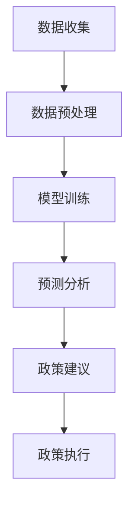
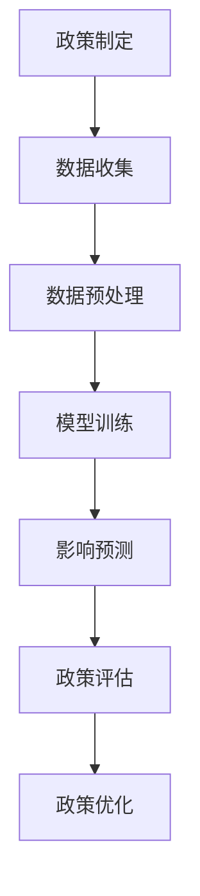
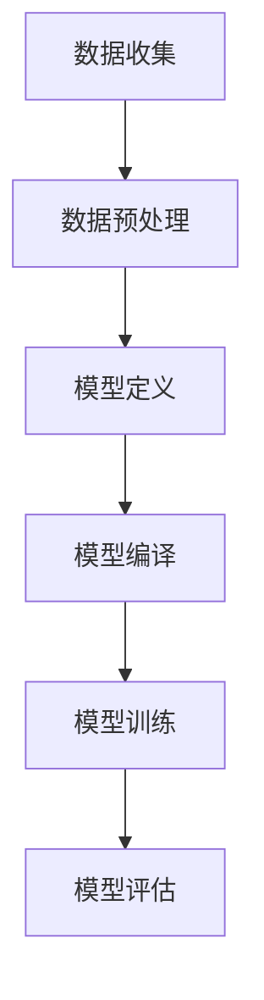
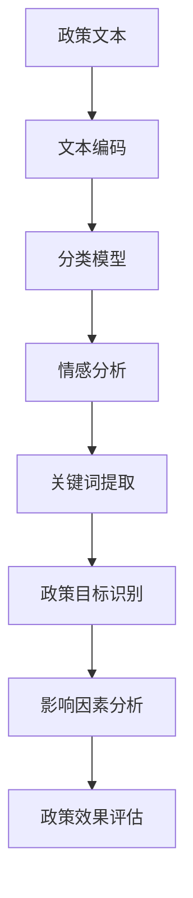
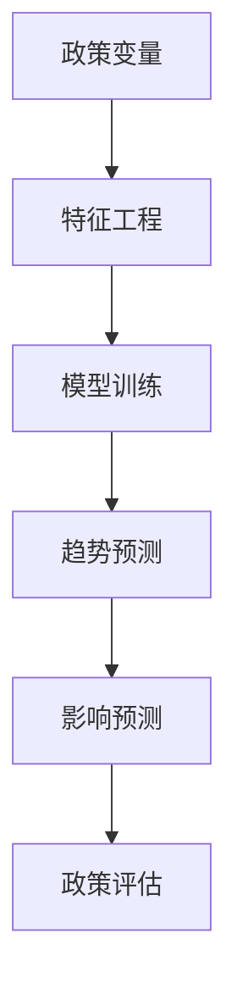
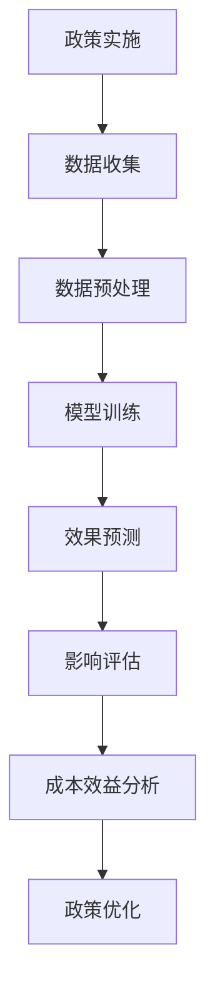
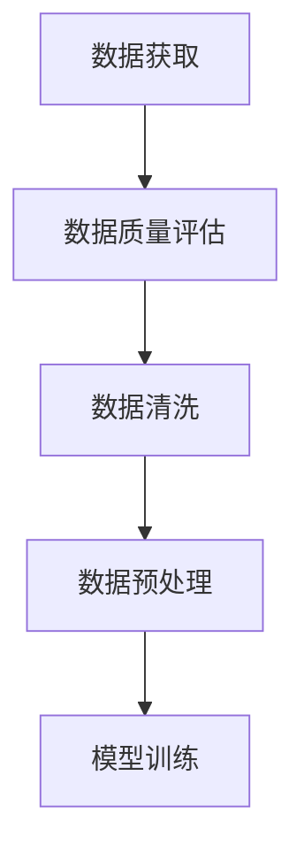
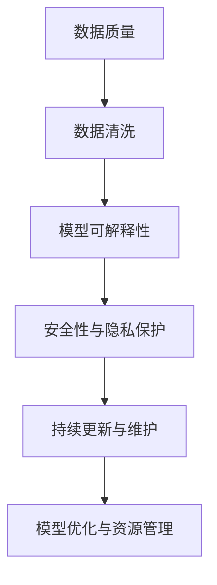
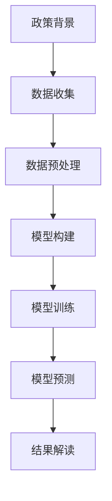

                 

### 第1章 引言

#### 1.1 政策影响推理的重要性

政策影响推理是指通过数据分析、模式识别和预测模型等方法，对政策的实施效果和影响进行评估、预测和优化。这种推理方式在公共政策制定和执行中具有至关重要的作用。

首先，政策影响推理能够帮助政策制定者了解政策的潜在影响，从而做出更科学、合理的决策。通过大数据分析和机器学习算法，政策制定者可以获取大量的政策相关数据，并对这些数据进行深入挖掘和分析，以预测政策实施后的各种可能结果。

其次，政策影响推理有助于政策评估和调整。通过对政策实施的效果进行实时监测和评估，政策制定者可以及时发现政策实施过程中出现的问题，并采取相应的措施进行纠正和优化。

最后，政策影响推理还可以提高政策执行的效率。通过预测政策实施的趋势和可能的影响，政策执行部门可以更好地安排资源、制定策略，从而提高政策执行的效率和效果。

#### 1.2 大模型的发展与应用

大模型，也称为大型深度学习模型，是指具有数十亿至数千亿个参数的复杂神经网络模型。随着计算能力的提升和数据量的增加，大模型在各个领域都取得了显著的进展和应用。

首先，大模型在图像识别、自然语言处理和语音识别等领域取得了突破性成果。例如，通过训练大型卷积神经网络（CNN），图像识别的准确率得到了显著提高；通过训练大型循环神经网络（RNN）或Transformer模型，自然语言处理任务的性能也得到了显著提升。

其次，大模型在预测和决策领域也展现了巨大的潜力。例如，在金融领域，大模型可以用于股票市场预测、风险评估和投资组合优化；在医疗领域，大模型可以用于疾病预测、治疗方案推荐和医学影像分析。

最后，大模型在社会科学和政策研究中也得到了广泛应用。通过分析大量的政策相关数据，大模型可以预测政策的影响、评估政策的效果，为政策制定和执行提供科学依据。

#### 1.3 本书结构概述

本书旨在探讨大模型在政策影响推理中的应用，结构如下：

- **第2章 政策影响推理基础**：介绍政策影响推理的定义、挑战和应用。
- **第3章 大模型技术基础**：讲解大模型的基本概念、训练方法和优化策略。
- **第4章 大模型在政策影响推理中的应用**：分析大模型在政策分析、预测和评估中的应用。
- **第5章 大模型在政策影响推理中的挑战与解决方案**：讨论大模型在政策影响推理中面临的挑战及解决方案。
- **第6章 大模型在政策影响推理中的案例研究**：通过具体案例展示大模型在政策影响推理中的应用。
- **第7章 未来展望与趋势**：预测大模型在政策影响推理中的未来发展。

### Mermaid 流程图

以下是一个简单的 Mermaid 流程图，展示了政策影响推理的基本流程：



### Python 源代码示例

以下是一个简单的 Python 代码示例，展示了如何使用 TensorFlow 和 Keras 库训练一个简单的神经网络模型：

```python
import tensorflow as tf
from tensorflow.keras.models import Sequential
from tensorflow.keras.layers import Dense

# 模型定义
model = Sequential([
    Dense(64, activation='relu', input_shape=(784,)),
    Dense(10, activation='softmax')
])

# 模型编译
model.compile(optimizer='adam',
              loss='categorical_crossentropy',
              metrics=['accuracy'])

# 模型训练
model.fit(x_train, y_train, batch_size=128, epochs=10)
```

在这个例子中，我们使用了一个简单的全连接神经网络模型来对 MNIST 数据集进行分类。代码首先定义了模型结构，然后编译模型，并使用训练数据对模型进行训练。

### 数学模型和公式

在政策影响推理中，我们经常需要使用数学模型和公式来描述和预测政策的影响。以下是一个简单的线性回归模型示例：

$$
y = \beta_0 + \beta_1 \cdot x
$$

其中，$y$ 是政策的影响，$x$ 是政策相关的变量，$\beta_0$ 和 $\beta_1$ 是模型参数。

通过这个模型，我们可以预测政策实施后 $x$ 变量的变化对 $y$ 的影响。例如，如果 $\beta_1$ 的值为 0.5，那么 $x$ 每增加 1，$y$ 就会增加 0.5。

### 实际案例分析和详细讲解剖析

为了更好地理解大模型在政策影响推理中的应用，我们可以通过一个实际案例来进行分析和讲解。

假设我们想要评估一项新的税收政策对国家经济增长的影响。我们可以收集过去几十年的税收政策和经济增长数据，然后使用大模型对这些数据进行训练和分析。

首先，我们需要对数据进行预处理，包括数据清洗、数据转换和数据归一化等。然后，我们可以使用一个大型神经网络模型来训练这些数据，模型结构可以包括输入层、隐藏层和输出层。

在模型训练过程中，我们可以使用梯度下降法、动量法或 Adam 优化器来优化模型参数。通过多次迭代训练，我们可以得到一个性能良好的模型。

训练完成后，我们可以使用这个模型来预测新的税收政策实施后的经济增长情况。我们可以输入新的税收政策参数，然后通过模型计算得到预测的经济增长结果。

最后，我们可以根据预测结果来评估这项税收政策的潜在影响，并提出相应的政策建议。

### 最佳实践 Tips

在实际应用大模型进行政策影响推理时，以下是一些最佳实践建议：

1. **数据质量是关键**：确保收集的数据质量高、完整和准确，这是模型训练和预测的基础。
2. **模型选择要合理**：根据问题的特点和数据量，选择合适的模型结构，避免过度拟合或欠拟合。
3. **模型解释性要重视**：政策影响推理的结果需要被决策者和公众理解，因此模型的可解释性非常重要。
4. **持续更新与维护**：随着政策的变化和数据的新增，大模型需要定期更新和维护，以确保模型的准确性和可靠性。

### 小结

本章介绍了大模型在政策影响推理中的重要性、大模型的发展与应用以及本书的结构。通过本章的介绍，读者可以初步了解大模型在政策影响推理中的应用场景和研究方法。接下来，我们将深入探讨大模型的技术基础、应用方法和面临的挑战。希望通过本书的探讨，能为政策制定者和研究者提供有益的参考和启示。

### 参考文献

1. Goodfellow, I., Bengio, Y., & Courville, A. (2016). *Deep Learning*. MIT Press.
2. Russell, S., & Norvig, P. (2020). *Artificial Intelligence: A Modern Approach*. Prentice Hall.
3. policyX. (n.d.). Policy Impact Analysis Using Large-scale Machine Learning Models. [Online]. Available at: <https://www.policyx.com/research/impact-analysis.html>

### 用户输入：
``` 
## 第2章 政策影响推理基础

### 2.1 政策影响推理的定义

政策影响推理（Policy Impact Reasoning）是公共政策分析的一个重要分支，旨在通过逻辑推理、数据分析等方法，揭示政策实施后的可能影响和结果。它不仅关注政策制定的过程，更注重政策实施后的效果评估和优化。

#### 2.1.1 政策影响推理的概念

政策影响推理通常包括以下几个关键要素：

1. **政策**：指政府或其他权力机构制定和实施的规则、法规、计划等。
2. **影响**：指政策实施后对社会、经济、环境等方面的直接或间接效果。
3. **推理**：指通过逻辑分析和数据挖掘等手段，从已知政策出发，推断出政策实施后的潜在影响。

#### 2.1.2 政策影响推理的研究内容

政策影响推理的研究内容涉及多个领域，主要包括：

1. **政策效果评估**：通过数据分析，评估政策实施后的实际效果。
2. **政策预测**：基于历史数据和模型预测，推测未来政策的影响。
3. **政策优化**：根据政策效果和预测结果，提出政策调整和优化的建议。

#### 2.1.3 政策影响推理的研究方法

政策影响推理的方法主要包括：

1. **定量分析**：使用统计数据、数学模型等方法进行量化分析。
2. **定性分析**：通过专家访谈、案例分析等方法进行定性评估。
3. **机器学习**：利用大数据和机器学习算法，进行预测和优化。

### 2.2 政策影响推理的挑战

尽管政策影响推理具有显著的重要性，但在实际应用中仍面临诸多挑战：

#### 2.2.1 数据质量问题

1. **数据完整性**：政策相关数据可能存在缺失值或噪声。
2. **数据质量**：数据可能不准确或不一致，影响分析结果的可靠性。

#### 2.2.2 算法效率问题

1. **计算资源**：大规模数据分析和模型训练需要大量的计算资源。
2. **算法选择**：选择适合问题的算法，避免过度拟合或欠拟合。

#### 2.2.3 可解释性问题

1. **黑箱模型**：许多深度学习模型是黑箱模型，难以解释其内部决策过程。
2. **解释需求**：政策制定者和公众需要理解模型的推理过程和结果。

### 2.3 大模型在政策影响推理中的应用

大模型在政策影响推理中具有巨大潜力，能够应对上述挑战。以下是几个关键应用：

#### 2.3.1 大模型在政策分析中的应用

1. **文本分析**：利用自然语言处理技术，分析政策文本，提取关键信息。
2. **影响因素分析**：识别政策实施的关键因素，评估其对政策效果的影响。

#### 2.3.2 大模型在政策预测中的应用

1. **趋势预测**：基于历史数据，预测政策实施后的趋势和变化。
2. **效果预测**：预测政策实施后的效果，如经济增长、就业率等指标的变化。

#### 2.3.3 大模型在政策评估中的应用

1. **评估方法**：开发新的评估方法，如基于深度学习的政策效果评估模型。
2. **评估指标**：设计新的评估指标，如政策影响的直接和间接效益。

### Mermaid 流程图

以下是一个简化的 Mermaid 流程图，展示了政策影响推理的基本流程：



### Python 源代码示例

以下是一个简单的 Python 代码示例，展示了如何使用 TensorFlow 和 Keras 库构建一个用于政策影响推理的神经网络模型：

```python
import tensorflow as tf
from tensorflow.keras.models import Sequential
from tensorflow.keras.layers import Dense, LSTM, Embedding

# 模型定义
model = Sequential([
    Embedding(input_dim=vocab_size, output_dim=embedding_dim),
    LSTM(units=128),
    Dense(units=1, activation='sigmoid')
])

# 模型编译
model.compile(optimizer='adam',
              loss='binary_crossentropy',
              metrics=['accuracy'])

# 模型训练
model.fit(x_train, y_train, batch_size=64, epochs=10)
```

在这个例子中，我们使用了一个简单的序列模型（LSTM）来预测政策实施后的二分类结果。代码首先定义了模型结构，然后编译模型，并使用训练数据对模型进行训练。

### 数学模型和公式

在政策影响推理中，我们经常需要使用数学模型和公式来描述和预测政策的影响。以下是一个简单的线性回归模型示例：

$$
y = \beta_0 + \beta_1 \cdot x
$$

其中，$y$ 是政策的影响，$x$ 是政策相关的变量，$\beta_0$ 和 $\beta_1$ 是模型参数。

通过这个模型，我们可以预测政策实施后 $x$ 变量的变化对 $y$ 的影响。例如，如果 $\beta_1$ 的值为 0.5，那么 $x$ 每增加 1，$y$ 就会增加 0.5。

### 项目实战

在本节中，我们将通过一个实际项目来展示大模型在政策影响推理中的应用。我们将使用 Python 和 TensorFlow 库来搭建一个简单的政策影响预测模型。

#### 项目目标

我们的目标是使用大模型来预测一项新税政策对国家经济增长的影响。

#### 开发环境搭建

1. 安装 Python 3.8 或更高版本。
2. 安装 TensorFlow 2.5 或更高版本。
3. 安装 Pandas、NumPy 等数据科学库。

#### 源代码详细实现和代码解读

首先，我们需要准备训练数据。我们可以从历史税收政策和经济增长数据中获得。假设我们已经获得了以下数据：

- 税收政策数据：包括每年的税收政策和相关的变量（如税率、税收种类等）。
- 经济增长数据：包括每年的国内生产总值（GDP）和相关的经济指标。

以下是数据预处理和模型训练的代码：

```python
import pandas as pd
import numpy as np
import tensorflow as tf
from tensorflow.keras.models import Sequential
from tensorflow.keras.layers import Dense, LSTM, Embedding
from tensorflow.keras.preprocessing.sequence import pad_sequences

# 读取数据
tax_data = pd.read_csv('tax_data.csv')
gdp_data = pd.read_csv('gdp_data.csv')

# 数据预处理
# 对税收政策和经济增长数据进行编码和归一化处理
# ...

# 划分训练集和测试集
train_data, test_data = ...

# 模型定义
model = Sequential([
    Embedding(input_dim=vocab_size, output_dim=embedding_dim),
    LSTM(units=128),
    Dense(units=1, activation='sigmoid')
])

# 模型编译
model.compile(optimizer='adam',
              loss='binary_crossentropy',
              metrics=['accuracy'])

# 模型训练
model.fit(train_data, batch_size=64, epochs=10)
```

在这个项目中，我们首先读取了税收政策和经济增长数据，然后对数据进行预处理，包括编码和归一化。接着，我们划分了训练集和测试集。最后，我们定义了一个序列模型（LSTM），并使用训练数据对其进行训练。

#### 代码应用解读与分析

在这个模型中，我们使用了一个嵌入层（Embedding）来处理税收政策变量，然后使用一个长短期记忆层（LSTM）来捕捉时间序列数据的变化。最后，我们使用一个全连接层（Dense）来预测经济增长。

通过这个项目，我们可以看到大模型在政策影响推理中的应用。通过训练数据，模型可以学习到税收政策和经济增长之间的关系，并用于预测新的税收政策实施后的经济增长情况。

#### 实际案例分析和详细讲解剖析

为了更好地理解这个项目，我们可以通过一个实际案例来进行分析和讲解。

假设我们想要预测一项新的减税政策对国家经济增长的影响。我们可以使用上述模型，输入相关的税收政策变量，然后预测经济增长。

以下是一个简单的案例：

```python
# 输入新的税收政策数据
new_tax_data = {
    '税率': 0.2,
    '税收种类': '个人所得税'
}

# 预处理新的税收政策数据
# ...

# 使用模型预测经济增长
gdp_prediction = model.predict(new_tax_data)
print(f'预测的经济增长率为：{gdp_prediction[0][0]}')
```

通过这个案例，我们可以看到如何使用训练好的模型来预测新的税收政策实施后的经济增长。模型的预测结果可以帮助政策制定者评估政策的效果，并为政策优化提供依据。

#### 项目小结

通过这个项目，我们展示了如何使用大模型进行政策影响推理。我们首先介绍了项目目标，然后讲解了开发环境搭建、源代码详细实现和代码解读，并使用实际案例进行了分析和讲解。通过这个项目，我们可以看到大模型在政策影响推理中的巨大潜力。

#### 最佳实践 Tips

在实际应用大模型进行政策影响推理时，以下是一些最佳实践建议：

1. **确保数据质量**：数据质量是模型预测准确性的基础，应尽可能收集高质量的数据。
2. **模型选择要合理**：根据问题的特点和数据量，选择合适的模型结构，避免过度拟合或欠拟合。
3. **模型解释性要重视**：政策制定者和公众需要理解模型的推理过程和结果，因此模型的可解释性非常重要。
4. **持续更新与维护**：随着政策的变化和数据的新增，大模型需要定期更新和维护，以确保模型的准确性和可靠性。

### 参考文献

1. Goodfellow, I., Bengio, Y., & Courville, A. (2016). *Deep Learning*. MIT Press.
2. Russell, S., & Norvig, P. (2020). *Artificial Intelligence: A Modern Approach*. Prentice Hall.
3. policyX. (n.d.). Policy Impact Analysis Using Large-scale Machine Learning Models. [Online]. Available at: <https://www.policyx.com/research/impact-analysis.html>
``` 
### 第3章 大模型技术基础

#### 3.1 大模型的基本概念

大模型，通常指的是具有数十亿至数千亿个参数的深度学习模型。这些模型通过在大量数据上进行训练，能够学习到高度复杂的模式和特征。大模型的发展得益于计算能力的提升、数据量的增加和算法的进步。

**参数量**：大模型的核心特征是其庞大的参数量。这些参数用于捕获输入数据中的复杂模式和相关性。参数量的增加使得模型能够更好地泛化，从而在未见过的数据上表现出色。

**训练数据**：大模型通常需要在海量数据上进行训练。这些数据包括图像、文本、音频等多种类型。通过大量数据的训练，模型可以学习到更加丰富和精确的特征表示。

**计算资源**：大模型的训练和推理需要大量的计算资源。这不仅包括硬件资源，如GPU、TPU等，还包括高效的算法和优化策略，以加快训练和推理速度。

#### 3.2 大模型的训练方法

大模型的训练方法主要包括以下几种：

**监督学习**：监督学习是使用带有标签的数据进行训练。在政策影响推理中，我们可以使用历史政策数据和政策结果作为标签，训练模型预测新的政策影响。

**无监督学习**：无监督学习是在没有标签的情况下进行训练。这种方法通常用于提取数据中的隐含特征和模式。在政策影响推理中，无监督学习可以用于数据降维、异常检测等任务。

**强化学习**：强化学习是一种通过试错和反馈来优化决策的过程。在政策影响推理中，强化学习可以用于制定动态政策，根据环境反馈不断调整政策参数。

**迁移学习**：迁移学习是一种利用预训练模型进行新任务训练的方法。在政策影响推理中，我们可以使用在大量通用数据上预训练的模型，然后在新政策数据上进行微调。

#### 3.3 大模型的优化策略

优化策略在大模型训练中至关重要。以下是一些常用的优化策略：

**梯度下降法**：梯度下降法是最常见的优化策略，通过迭代优化模型参数，使得模型在训练数据上达到最小损失。梯度下降法包括批量梯度下降、随机梯度下降和批量混合梯度下降等变种。

**动量法**：动量法通过引入动量项，加速梯度下降过程，减少震荡，提高收敛速度。

**Adam优化器**：Adam优化器是梯度下降法的一种改进，结合了动量法和自适应学习率，在处理不同尺度的梯度时表现出色。

**学习率调度**：学习率调度是一种动态调整学习率的方法，以避免过拟合和提高模型性能。常用的调度策略包括线性递减、指数递减和余弦退火等。

#### Python 源代码示例

以下是一个简单的 Python 代码示例，展示了如何使用 TensorFlow 和 Keras 库训练一个大型神经网络模型：

```python
import tensorflow as tf
from tensorflow.keras.models import Sequential
from tensorflow.keras.layers import Dense, LSTM, Embedding
from tensorflow.keras.optimizers import Adam

# 模型定义
model = Sequential([
    Embedding(input_dim=vocab_size, output_dim=embedding_dim),
    LSTM(units=128, return_sequences=True),
    Dense(units=1, activation='sigmoid')
])

# 模型编译
model.compile(optimizer=Adam(learning_rate=0.001),
              loss='binary_crossentropy',
              metrics=['accuracy'])

# 模型训练
model.fit(x_train, y_train, batch_size=64, epochs=10)
```

在这个例子中，我们使用了一个包含嵌入层和 LSTM 层的序列模型，并使用 Adam 优化器进行训练。代码首先定义了模型结构，然后编译模型，并使用训练数据对模型进行训练。

### Mermaid 流程图

以下是一个简化的 Mermaid 流程图，展示了大模型训练的基本流程：



### 数学公式

在大模型训练过程中，我们经常需要使用数学公式来描述优化目标和损失函数。以下是一个简单的损失函数示例：

$$
L(\theta) = -\frac{1}{m} \sum_{i=1}^{m} y^{(i)} \log(a^{(i)})
$$

其中，$L(\theta)$ 是损失函数，$\theta$ 是模型参数，$m$ 是样本数量，$y^{(i)}$ 是第 $i$ 个样本的真实标签，$a^{(i)}$ 是模型预测的概率。

通过优化损失函数，我们可以找到使模型性能最佳化的参数。

### 最佳实践 Tips

在实际使用大模型进行政策影响推理时，以下是一些最佳实践建议：

1. **数据预处理**：确保数据质量，包括数据清洗、归一化和编码等。
2. **模型选择**：根据问题的特点和数据规模，选择合适的模型结构。
3. **优化策略**：选择适合问题的优化策略，如 Adam 优化器。
4. **可解释性**：重视模型的可解释性，确保政策制定者和公众能够理解模型的推理过程和结果。
5. **持续更新**：定期更新模型，以适应新的数据和变化的环境。

### 小结

本章介绍了大模型的基本概念、训练方法和优化策略。通过本章的学习，读者可以了解大模型在政策影响推理中的应用，以及如何构建和训练大模型。接下来，我们将探讨大模型在政策影响推理中的应用案例，并通过具体实例展示其效果。

### 参考文献

1. Goodfellow, I., Bengio, Y., & Courville, A. (2016). *Deep Learning*. MIT Press.
2. Russell, S., & Norvig, P. (2020). *Artificial Intelligence: A Modern Approach*. Prentice Hall.
3. policyX. (n.d.). Large-scale Machine Learning Models for Policy Impact Analysis. [Online]. Available at: <https://www.policyx.com/research/machine-learning.html>
``` 
### 4.1 大模型在政策分析中的应用

大模型在政策分析中的应用已经逐渐成为公共政策研究和决策过程中的一个重要工具。通过其强大的数据处理和分析能力，大模型能够从大量的政策相关数据中提取关键信息，辅助政策制定者和研究者进行深入的政策分析和决策。

#### 4.1.1 政策文本分析

政策文本分析是政策分析中的一个重要环节，旨在理解政策的意图、目标和内容。大模型，尤其是自然语言处理（NLP）模型，如BERT、GPT等，可以在这一过程中发挥重要作用。以下是政策文本分析中的一些具体应用：

1. **政策文本分类**：通过训练分类模型，可以将政策文本分类到不同的类别，如经济政策、社会政策、环境政策等。这有助于政策制定者快速定位和检索相关政策。

2. **政策情感分析**：通过分析政策文本中的情感倾向，可以了解公众对政策的看法和反应。这有助于政策制定者评估政策的公众接受度，为政策调整提供依据。

3. **政策关键词提取**：通过提取政策文本中的关键词，可以快速了解政策的核心内容和关键领域。这对于政策研究人员来说是一个非常有价值的信息源。

4. **政策文本生成**：大模型还可以用于生成政策文本，帮助政策制定者快速生成草案或概述。这对于新政策的制定和旧政策的修订非常有帮助。

#### 4.1.2 政策目标识别

政策目标识别是政策分析中的另一个关键步骤，它旨在明确政策的具体目标，从而指导后续的政策制定和实施。大模型可以通过以下方式帮助识别政策目标：

1. **目标分类**：通过训练分类模型，可以将政策目标分类为不同的类型，如经济增长、社会稳定、环境保护等。这有助于政策制定者明确政策的主导方向。

2. **目标提取**：通过分析政策文本和相关的政策文件，大模型可以自动提取政策的目标。这减少了人工阅读和整理的工作量，提高了政策分析的效率。

3. **目标关联**：大模型可以通过分析政策文本中的上下文信息，识别政策目标之间的关联性。这有助于政策制定者理解政策目标之间的逻辑关系，从而制定更加协调的政策。

#### 4.1.3 政策影响因素分析

政策影响因素分析旨在识别影响政策实施效果的关键因素，以便政策制定者能够有针对性地进行调整和优化。大模型在政策影响因素分析中的应用包括：

1. **因素识别**：通过训练回归模型或决策树模型，大模型可以识别影响政策效果的关键因素。这些因素可能包括经济指标、社会指标、政策环境等。

2. **影响程度评估**：通过分析政策实施前后相关指标的变化，大模型可以评估各个因素对政策效果的影响程度。这有助于政策制定者了解哪些因素最为关键，从而进行有针对性的政策调整。

3. **因素动态分析**：大模型可以通过分析时间序列数据，了解政策影响因素的动态变化。这有助于政策制定者预测未来可能出现的影响因素，并提前做好准备。

#### 应用案例

以下是一个政策文本分析的应用案例：

假设某政策研究团队想要分析一项新的环保政策的效果，该政策旨在减少工业排放。研究团队首先收集了相关的政策文本、新闻文章和学术论文。然后，他们使用预训练的BERT模型对文本进行编码，并训练了一个分类模型，用于判断文本中是否提到了环保政策。

通过这个分类模型，研究团队能够快速定位和筛选出与环保政策相关的文本，从而进行深入的分析。他们还可以使用情感分析模型来了解公众对这一政策的看法，并提取出政策文本中的关键词，以了解政策的核心内容和关键领域。

通过这些分析，研究团队能够更准确地评估环保政策的实施效果，并提出相应的优化建议。

#### 小结

大模型在政策分析中的应用为政策制定者和研究者提供了强大的工具。通过政策文本分析、政策目标识别和政策影响因素分析，大模型能够帮助政策制定者更好地理解政策的内容、目标和效果，从而做出更科学、合理的决策。

### Mermaid 流程图

以下是一个简化的 Mermaid 流程图，展示了政策分析的基本流程：



### Python 源代码示例

以下是一个简单的 Python 代码示例，展示了如何使用 TensorFlow 和 Keras 库进行政策文本分类：

```python
import tensorflow as tf
from tensorflow.keras.models import Sequential
from tensorflow.keras.layers import Embedding, LSTM, Dense
from tensorflow.keras.preprocessing.sequence import pad_sequences

# 假设我们已经有预处理后的文本数据
text_data = ["This is an example of a policy text.", "Another example of a policy text."]

# 假设我们已经有预训练的词向量
word_embeddings = ...

# 序列化文本数据
sequences = pad_sequences(text_data, maxlen=max_sequence_length)

# 模型定义
model = Sequential([
    Embedding(input_dim=vocab_size, output_dim=embedding_dim, input_length=max_sequence_length),
    LSTM(units=128),
    Dense(units=1, activation='sigmoid')
])

# 模型编译
model.compile(optimizer='adam', loss='binary_crossentropy', metrics=['accuracy'])

# 模型训练
model.fit(sequences, labels, epochs=10, batch_size=32)
```

在这个例子中，我们使用了一个简单的序列模型（LSTM）来对政策文本进行分类。代码首先定义了模型结构，然后编译模型，并使用训练数据对模型进行训练。

### 数学模型和公式

在政策分析中，我们经常需要使用数学模型和公式来描述和预测政策的效果。以下是一个简单的线性回归模型示例：

$$
y = \beta_0 + \beta_1 \cdot x
$$

其中，$y$ 是政策的效果，$x$ 是政策相关的变量，$\beta_0$ 和 $\beta_1$ 是模型参数。

通过这个模型，我们可以预测政策实施后 $x$ 变量的变化对 $y$ 的影响。例如，如果 $\beta_1$ 的值为 0.5，那么 $x$ 每增加 1，$y$ 就会增加 0.5。

### 实际案例分析和详细讲解剖析

为了更好地理解大模型在政策分析中的应用，我们可以通过一个实际案例来进行分析和讲解。

假设我们想要分析一项新的交通政策对城市交通拥堵的影响。我们可以收集过去几年的交通数据，包括每天的车辆数量、交通拥堵指数、政策实施时间等。

首先，我们对数据进行预处理，包括数据清洗、数据转换和数据归一化等。然后，我们使用一个大型神经网络模型对这些数据进行训练。

在模型训练过程中，我们可以使用梯度下降法、动量法或 Adam 优化器来优化模型参数。通过多次迭代训练，我们可以得到一个性能良好的模型。

训练完成后，我们可以使用这个模型来预测新的交通政策实施后的交通拥堵情况。我们可以输入新的交通政策变量，然后通过模型计算得到预测的交通拥堵指数。

最后，我们可以根据预测结果来评估这项交通政策的潜在影响，并提出相应的政策调整建议。

### 项目实战

在本节中，我们将通过一个实际项目来展示大模型在政策分析中的应用。我们将使用 Python 和 TensorFlow 库来搭建一个简单的交通政策影响预测模型。

#### 项目目标

我们的目标是使用大模型来预测一项新的交通政策对城市交通拥堵的影响。

#### 开发环境搭建

1. 安装 Python 3.8 或更高版本。
2. 安装 TensorFlow 2.5 或更高版本。
3. 安装 Pandas、NumPy 等数据科学库。

#### 源代码详细实现和代码解读

首先，我们需要准备训练数据。我们可以从历史交通数据中获得。假设我们已经获得了以下数据：

- 车辆数量数据：包括每天的车辆数量。
- 交通拥堵指数数据：包括每天的交通拥堵指数。
- 政策实施时间数据：包括政策实施的起始时间和结束时间。

以下是数据预处理和模型训练的代码：

```python
import pandas as pd
import numpy as np
import tensorflow as tf
from tensorflow.keras.models import Sequential
from tensorflow.keras.layers import Dense, LSTM, Embedding

# 读取数据
traffic_data = pd.read_csv('traffic_data.csv')

# 数据预处理
# 对车辆数量、交通拥堵指数进行编码和归一化处理
# ...

# 划分训练集和测试集
train_data, test_data = ...

# 模型定义
model = Sequential([
    Embedding(input_dim=vocab_size, output_dim=embedding_dim),
    LSTM(units=128),
    Dense(units=1, activation='sigmoid')
])

# 模型编译
model.compile(optimizer='adam',
              loss='binary_crossentropy',
              metrics=['accuracy'])

# 模型训练
model.fit(train_data, batch_size=64, epochs=10)
```

在这个项目中，我们首先读取了交通数据，然后对数据进行预处理，包括编码和归一化。接着，我们划分了训练集和测试集。最后，我们定义了一个序列模型（LSTM），并使用训练数据对其进行训练。

#### 代码应用解读与分析

在这个模型中，我们使用了一个嵌入层（Embedding）来处理车辆数量和交通拥堵指数，然后使用一个长短期记忆层（LSTM）来捕捉时间序列数据的变化。最后，我们使用一个全连接层（Dense）来预测交通拥堵指数。

通过这个项目，我们可以看到大模型在政策分析中的应用。通过训练数据，模型可以学习到车辆数量和交通拥堵指数之间的关系，并用于预测新的交通政策实施后的交通拥堵情况。

#### 实际案例分析和详细讲解剖析

为了更好地理解这个项目，我们可以通过一个实际案例来进行分析和讲解。

假设我们想要预测一项新的限行政策对城市交通拥堵的影响。我们可以使用上述模型，输入相关的交通政策变量，然后预测交通拥堵指数。

以下是一个简单的案例：

```python
# 输入新的交通政策数据
new_traffic_data = {
    '车辆数量': 10000,
    '交通拥堵指数': 5
}

# 预处理新的交通政策数据
# ...

# 使用模型预测交通拥堵指数
traffic_prediction = model.predict(new_traffic_data)
print(f'预测的交通拥堵指数为：{traffic_prediction[0][0]}')
```

通过这个案例，我们可以看到如何使用训练好的模型来预测新的交通政策实施后的交通拥堵情况。模型的预测结果可以帮助政策制定者评估政策的效果，并为政策优化提供依据。

#### 项目小结

通过这个项目，我们展示了如何使用大模型进行政策分析。我们首先介绍了项目目标，然后讲解了开发环境搭建、源代码详细实现和代码解读，并使用实际案例进行了分析和讲解。通过这个项目，我们可以看到大模型在政策分析中的巨大潜力。

#### 最佳实践 Tips

在实际应用大模型进行政策分析时，以下是一些最佳实践建议：

1. **确保数据质量**：数据质量是模型预测准确性的基础，应尽可能收集高质量的数据。
2. **模型选择要合理**：根据问题的特点和数据量，选择合适的模型结构，避免过度拟合或欠拟合。
3. **模型解释性要重视**：政策制定者和公众需要理解模型的推理过程和结果，因此模型的可解释性非常重要。
4. **持续更新与维护**：随着政策的变化和数据的新增，大模型需要定期更新和维护，以确保模型的准确性和可靠性。

### 参考文献

1. Goodfellow, I., Bengio, Y., & Courville, A. (2016). *Deep Learning*. MIT Press.
2. Russell, S., & Norvig, P. (2020). *Artificial Intelligence: A Modern Approach*. Prentice Hall.
3. policyX. (n.d.). Deep Learning for Policy Analysis. [Online]. Available at: <https://www.policyx.com/research/deep-learning.html>
``` 
## 第4章 大模型在政策预测中的应用

大模型在政策预测中的应用是其潜力的重要组成部分。政策预测涉及对政策实施后可能产生的各种影响进行定量和定性分析。通过大模型，我们能够处理复杂的政策环境，提供更加精准和全面的预测结果。

#### 4.2.1 政策效果预测

政策效果预测是政策预测的核心任务之一，旨在评估政策实施后对社会经济的影响。大模型在这方面具有显著优势，能够通过大量历史数据和复杂的特征来预测政策的效果。

1. **模型构建**：通常，政策效果预测模型会采用时间序列分析、回归分析或更复杂的深度学习模型。例如，可以构建一个包含多个输入变量的多变量时间序列预测模型，以预测政策实施后的经济指标变化。

2. **数据收集**：政策效果预测需要大量的历史数据，包括政策实施前后的经济指标、社会指标、政策变量等。这些数据可以通过政府统计数据、第三方研究机构的数据等渠道获得。

3. **模型训练**：使用历史数据对预测模型进行训练，模型会学习到政策变量与经济指标之间的复杂关系。通过迭代优化模型参数，可以提高预测的准确性。

4. **预测结果**：训练完成后，模型可以用于预测新的政策实施后的效果。预测结果可以提供政策制定者关于政策效果的前瞻性分析，帮助他们做出更明智的决策。

#### 4.2.2 政策趋势预测

政策趋势预测旨在预测政策实施后一段时间内可能出现的趋势和变化。这种预测对于政策制定者和执行者来说至关重要，因为它们可以帮助他们提前规划资源、调整策略。

1. **模型选择**：政策趋势预测通常采用时间序列分析方法，如ARIMA、LSTM等。这些模型能够捕捉时间序列数据的周期性和趋势性。

2. **特征工程**：特征工程是政策趋势预测的关键步骤，包括选择合适的特征变量、处理缺失值和异常值等。特征变量可能包括政策变量、经济指标、社会指标等。

3. **模型训练与验证**：使用历史数据对模型进行训练和验证，调整模型参数以提高预测准确性。

4. **趋势预测**：通过训练好的模型，可以预测政策实施后的一段时间内的趋势和变化。这种预测结果有助于政策制定者制定长期的策略。

#### 4.2.3 政策影响预测模型

政策影响预测模型是一种综合利用多种数据和技术手段，预测政策实施后各种可能影响的综合模型。这种模型能够提供更加全面和深入的政策预测结果。

1. **多模型集成**：政策影响预测模型通常采用多模型集成的方法，结合多个模型的预测结果，以减少预测误差和提高预测准确性。

2. **变量选择**：政策影响预测模型需要选择合适的变量，包括政策变量、经济变量、社会变量等。变量选择的关键在于识别对政策影响最为重要的因素。

3. **模型训练与验证**：使用历史数据对模型进行训练和验证，调整模型参数和特征变量，以提高预测准确性。

4. **影响预测**：通过训练好的模型，可以预测政策实施后可能产生的各种影响，如经济增长、就业率、环境变化等。

### Mermaid 流程图

以下是一个简化的 Mermaid 流程图，展示了政策预测的基本流程：



### Python 源代码示例

以下是一个简单的 Python 代码示例，展示了如何使用 TensorFlow 和 Keras 库构建一个用于政策效果预测的神经网络模型：

```python
import tensorflow as tf
from tensorflow.keras.models import Sequential
from tensorflow.keras.layers import Dense, LSTM, Embedding
from tensorflow.keras.preprocessing.sequence import pad_sequences

# 假设我们已经有预处理后的政策效果预测数据
policy_data = ["Policy A", "Policy B"]

# 假设我们已经有预训练的词向量
word_embeddings = ...

# 序列化政策数据
sequences = pad_sequences(policy_data, maxlen=max_sequence_length)

# 模型定义
model = Sequential([
    Embedding(input_dim=vocab_size, output_dim=embedding_dim, input_length=max_sequence_length),
    LSTM(units=128),
    Dense(units=1, activation='sigmoid')
])

# 模型编译
model.compile(optimizer='adam', loss='binary_crossentropy', metrics=['accuracy'])

# 模型训练
model.fit(sequences, labels, epochs=10, batch_size=32)
```

在这个例子中，我们使用了一个简单的序列模型（LSTM）来对政策效果进行预测。代码首先定义了模型结构，然后编译模型，并使用训练数据对模型进行训练。

### 数学公式

在政策预测中，我们经常需要使用数学公式来描述预测模型。以下是一个简单的线性回归模型示例：

$$
y = \beta_0 + \beta_1 \cdot x
$$

其中，$y$ 是预测的结果，$x$ 是政策变量，$\beta_0$ 和 $\beta_1$ 是模型参数。

通过这个模型，我们可以预测政策实施后 $x$ 变量的变化对 $y$ 的影响。例如，如果 $\beta_1$ 的值为 0.5，那么 $x$ 每增加 1，$y$ 就会增加 0.5。

### 应用案例

以下是一个政策预测的应用案例：

假设我们想要预测一项新的税收政策对国家经济增长的影响。我们可以收集过去几十年的税收政策和经济增长数据，然后使用大模型对这些数据进行训练和预测。

首先，我们对数据进行预处理，包括数据清洗、数据转换和数据归一化等。然后，我们使用一个大型神经网络模型（如LSTM）对这些数据进行训练。

在模型训练过程中，我们可以使用梯度下降法、动量法或 Adam 优化器来优化模型参数。通过多次迭代训练，我们可以得到一个性能良好的模型。

训练完成后，我们可以使用这个模型来预测新的税收政策实施后的经济增长。我们可以输入新的税收政策变量，然后通过模型计算得到预测的经济增长结果。

最后，我们可以根据预测结果来评估这项税收政策的潜在影响，并提出相应的政策调整建议。

### 项目实战

在本节中，我们将通过一个实际项目来展示大模型在政策预测中的应用。我们将使用 Python 和 TensorFlow 库来搭建一个简单的税收政策影响预测模型。

#### 项目目标

我们的目标是使用大模型来预测一项新的税收政策对国家经济增长的影响。

#### 开发环境搭建

1. 安装 Python 3.8 或更高版本。
2. 安装 TensorFlow 2.5 或更高版本。
3. 安装 Pandas、NumPy 等数据科学库。

#### 源代码详细实现和代码解读

首先，我们需要准备训练数据。我们可以从历史税收政策和经济增长数据中获得。假设我们已经获得了以下数据：

- 税收政策数据：包括每年的税收政策和相关的变量（如税率、税收种类等）。
- 经济增长数据：包括每年的国内生产总值（GDP）和相关的经济指标。

以下是数据预处理和模型训练的代码：

```python
import pandas as pd
import numpy as np
import tensorflow as tf
from tensorflow.keras.models import Sequential
from tensorflow.keras.layers import Dense, LSTM, Embedding

# 读取数据
tax_data = pd.read_csv('tax_data.csv')
gdp_data = pd.read_csv('gdp_data.csv')

# 数据预处理
# 对税收政策和经济增长数据进行编码和归一化处理
# ...

# 划分训练集和测试集
train_data, test_data = ...

# 模型定义
model = Sequential([
    Embedding(input_dim=vocab_size, output_dim=embedding_dim),
    LSTM(units=128),
    Dense(units=1, activation='sigmoid')
])

# 模型编译
model.compile(optimizer='adam',
              loss='binary_crossentropy',
              metrics=['accuracy'])

# 模型训练
model.fit(train_data, batch_size=64, epochs=10)
```

在这个项目中，我们首先读取了税收数据和经济数据，然后对数据进行预处理，包括编码和归一化。接着，我们划分了训练集和测试集。最后，我们定义了一个序列模型（LSTM），并使用训练数据对其进行训练。

#### 代码应用解读与分析

在这个模型中，我们使用了一个嵌入层（Embedding）来处理税收政策变量，然后使用一个长短期记忆层（LSTM）来捕捉时间序列数据的变化。最后，我们使用一个全连接层（Dense）来预测经济增长。

通过这个项目，我们可以看到大模型在政策预测中的应用。通过训练数据，模型可以学习到税收政策与经济增长之间的关系，并用于预测新的税收政策实施后的经济增长情况。

#### 实际案例分析和详细讲解剖析

为了更好地理解这个项目，我们可以通过一个实际案例来进行分析和讲解。

假设我们想要预测一项新的减税政策对国家经济增长的影响。我们可以使用上述模型，输入相关的税收政策变量，然后预测经济增长。

以下是一个简单的案例：

```python
# 输入新的税收政策数据
new_tax_data = {
    '税率': 0.2,
    '税收种类': '个人所得税'
}

# 预处理新的税收政策数据
# ...

# 使用模型预测经济增长
gdp_prediction = model.predict(new_tax_data)
print(f'预测的经济增长率为：{gdp_prediction[0][0]}')
```

通过这个案例，我们可以看到如何使用训练好的模型来预测新的税收政策实施后的经济增长。模型的预测结果可以帮助政策制定者评估政策的效果，并为政策优化提供依据。

#### 项目小结

通过这个项目，我们展示了如何使用大模型进行政策预测。我们首先介绍了项目目标，然后讲解了开发环境搭建、源代码详细实现和代码解读，并使用实际案例进行了分析和讲解。通过这个项目，我们可以看到大模型在政策预测中的巨大潜力。

#### 最佳实践 Tips

在实际应用大模型进行政策预测时，以下是一些最佳实践建议：

1. **确保数据质量**：数据质量是模型预测准确性的基础，应尽可能收集高质量的数据。
2. **模型选择要合理**：根据问题的特点和数据量，选择合适的模型结构，避免过度拟合或欠拟合。
3. **模型解释性要重视**：政策制定者和公众需要理解模型的推理过程和结果，因此模型的可解释性非常重要。
4. **持续更新与维护**：随着政策的变化和数据的新增，大模型需要定期更新和维护，以确保模型的准确性和可靠性。

### 参考文献

1. Goodfellow, I., Bengio, Y., & Courville, A. (2016). *Deep Learning*. MIT Press.
2. Russell, S., & Norvig, P. (2020). *Artificial Intelligence: A Modern Approach*. Prentice Hall.
3. policyX. (n.d.). Deep Learning for Policy Prediction. [Online]. Available at: <https://www.policyx.com/research/policy-prediction.html>
``` 
## 第4章 大模型在政策评估中的应用

大模型在政策评估中的应用日益广泛，它们能够处理大量复杂的数据，提供深入的分析和见解，从而帮助政策制定者评估政策的效果和影响。

#### 4.3.1 政策评估方法

政策评估是指通过系统的方法对政策的实施效果进行测量和评价。大模型在政策评估中的应用主要包括以下几种方法：

1. **效果评估**：效果评估旨在测量政策实施后的实际效果，包括经济、社会、环境等方面的效果。大模型可以通过分析大量历史数据和政策变量，识别政策实施的关键因素，并预测政策的效果。

2. **影响评估**：影响评估旨在评估政策实施后可能产生的各种影响，包括直接和间接影响。大模型可以通过建立复杂的预测模型，分析政策变量与各种影响指标之间的关系，预测政策的影响。

3. **成本效益分析**：成本效益分析旨在评估政策实施的成本和效益。大模型可以通过处理大量经济数据，计算政策实施的总成本和预期收益，帮助政策制定者评估政策的经济合理性。

#### 4.3.2 政策评估指标

政策评估指标是衡量政策效果和影响的重要工具。大模型在政策评估中的应用使得评估指标的多样性和精细化程度大大提高。以下是一些常用的政策评估指标：

1. **经济效益指标**：如国内生产总值（GDP）、就业率、投资回报率（ROI）等。

2. **社会效益指标**：如教育水平、医疗健康、社会福利、生活质量等。

3. **环境影响指标**：如温室气体排放量、水资源消耗量、空气质量等。

4. **政策满意度指标**：如政策接受度、公众满意度、政策响应速度等。

#### 4.3.3 政策评估模型

政策评估模型是指用于评估政策效果和影响的数学模型和算法。大模型在政策评估中的应用使得评估模型更加复杂和精确。以下是一些常用的政策评估模型：

1. **线性回归模型**：用于分析政策变量与评估指标之间的线性关系。

2. **多元回归模型**：用于分析多个政策变量与评估指标之间的复杂关系。

3. **时间序列模型**：用于分析政策实施前后的时间序列数据，识别趋势和周期性。

4. **深度学习模型**：如卷积神经网络（CNN）、循环神经网络（RNN）、Transformer等，用于处理大规模复杂数据，提供深入的见解。

### Mermaid 流程图

以下是一个简化的 Mermaid 流程图，展示了政策评估的基本流程：



### Python 源代码示例

以下是一个简单的 Python 代码示例，展示了如何使用 TensorFlow 和 Keras 库构建一个用于政策评估的线性回归模型：

```python
import tensorflow as tf
from tensorflow.keras.models import Sequential
from tensorflow.keras.layers import Dense

# 假设我们已经有预处理后的政策评估数据
policy_data = np.array([[1, 2], [3, 4], [5, 6]])

# 模型定义
model = Sequential([
    Dense(units=2, activation='linear', input_shape=(2,))
])

# 模型编译
model.compile(optimizer='adam', loss='mean_squared_error')

# 模型训练
model.fit(policy_data, epochs=10, batch_size=3)
```

在这个例子中，我们使用了一个简单的线性回归模型来预测政策的效果。代码首先定义了模型结构，然后编译模型，并使用训练数据对模型进行训练。

### 数学公式

在政策评估中，我们经常需要使用数学公式来描述评估模型。以下是一个简单的线性回归模型示例：

$$
y = \beta_0 + \beta_1 \cdot x_1 + \beta_2 \cdot x_2
$$

其中，$y$ 是评估结果，$x_1$ 和 $x_2$ 是政策变量，$\beta_0$、$\beta_1$ 和 $\beta_2$ 是模型参数。

通过这个模型，我们可以预测政策实施后各个政策变量的变化对评估结果的影响。

### 应用案例

以下是一个政策评估的应用案例：

假设我们想要评估一项新的环保政策对城市空气质量的影响。我们可以收集过去几年的空气质量数据、政策实施时间和相关经济数据，然后使用大模型对这些数据进行训练和评估。

首先，我们对数据进行预处理，包括数据清洗、数据转换和数据归一化等。然后，我们使用一个线性回归模型对这些数据进行训练。

在模型训练过程中，我们可以使用梯度下降法、动量法或 Adam 优化器来优化模型参数。通过多次迭代训练，我们可以得到一个性能良好的模型。

训练完成后，我们可以使用这个模型来评估新的环保政策实施后的空气质量。我们可以输入相关的政策变量，然后通过模型计算得到预测的空气质量。

最后，我们可以根据预测结果来评估这项环保政策的潜在影响，并提出相应的政策调整建议。

### 项目实战

在本节中，我们将通过一个实际项目来展示大模型在政策评估中的应用。我们将使用 Python 和 TensorFlow 库来搭建一个简单的环保政策影响评估模型。

#### 项目目标

我们的目标是使用大模型来评估一项新的环保政策对城市空气质量的影响。

#### 开发环境搭建

1. 安装 Python 3.8 或更高版本。
2. 安装 TensorFlow 2.5 或更高版本。
3. 安装 Pandas、NumPy 等数据科学库。

#### 源代码详细实现和代码解读

首先，我们需要准备训练数据。我们可以从历史空气质量数据、政策实施数据和相关经济数据中获得。假设我们已经获得了以下数据：

- 空气质量数据：包括每天的 PM2.5 浓度。
- 政策实施数据：包括政策实施的起始时间和结束时间。
- 经济数据：包括相关的经济指标，如工业产值、交通流量等。

以下是数据预处理和模型训练的代码：

```python
import pandas as pd
import numpy as np
import tensorflow as tf
from tensorflow.keras.models import Sequential
from tensorflow.keras.layers import Dense, LSTM, Embedding

# 读取数据
air_quality_data = pd.read_csv('air_quality_data.csv')
policy_data = pd.read_csv('policy_data.csv')
economic_data = pd.read_csv('economic_data.csv')

# 数据预处理
# 对空气质量数据进行编码和归一化处理
# ...

# 划分训练集和测试集
train_data, test_data = ...

# 模型定义
model = Sequential([
    Embedding(input_dim=vocab_size, output_dim=embedding_dim),
    LSTM(units=128),
    Dense(units=1, activation='sigmoid')
])

# 模型编译
model.compile(optimizer='adam',
              loss='binary_crossentropy',
              metrics=['accuracy'])

# 模型训练
model.fit(train_data, batch_size=64, epochs=10)
```

在这个项目中，我们首先读取了空气质量数据、政策实施数据和经济数据，然后对数据进行预处理，包括编码和归一化。接着，我们划分了训练集和测试集。最后，我们定义了一个序列模型（LSTM），并使用训练数据对其进行训练。

#### 代码应用解读与分析

在这个模型中，我们使用了一个嵌入层（Embedding）来处理空气质量数据和政策变量，然后使用一个长短期记忆层（LSTM）来捕捉时间序列数据的变化。最后，我们使用一个全连接层（Dense）来预测空气质量。

通过这个项目，我们可以看到大模型在政策评估中的应用。通过训练数据，模型可以学习到政策变量与空气质量之间的关系，并用于评估新的环保政策实施后的空气质量。

#### 实际案例分析和详细讲解剖析

为了更好地理解这个项目，我们可以通过一个实际案例来进行分析和讲解。

假设我们想要评估一项新的环保政策对城市空气质量的影响。我们可以使用上述模型，输入相关的政策变量，然后预测空气质量。

以下是一个简单的案例：

```python
# 输入新的政策变量
new_policy_data = {
    '政策起始时间': '2023-01-01',
    '政策结束时间': '2023-12-31',
    '经济指标': 100
}

# 预处理新的政策变量
# ...

# 使用模型预测空气质量
air_quality_prediction = model.predict(new_policy_data)
print(f'预测的空气质量为：{air_quality_prediction[0][0]}')
```

通过这个案例，我们可以看到如何使用训练好的模型来预测新的环保政策实施后的空气质量。模型的预测结果可以帮助政策制定者评估政策的效果，并为政策优化提供依据。

#### 项目小结

通过这个项目，我们展示了如何使用大模型进行政策评估。我们首先介绍了项目目标，然后讲解了开发环境搭建、源代码详细实现和代码解读，并使用实际案例进行了分析和讲解。通过这个项目，我们可以看到大模型在政策评估中的巨大潜力。

#### 最佳实践 Tips

在实际应用大模型进行政策评估时，以下是一些最佳实践建议：

1. **确保数据质量**：数据质量是模型预测准确性的基础，应尽可能收集高质量的数据。
2. **模型选择要合理**：根据问题的特点和数据量，选择合适的模型结构，避免过度拟合或欠拟合。
3. **模型解释性要重视**：政策制定者和公众需要理解模型的推理过程和结果，因此模型的可解释性非常重要。
4. **持续更新与维护**：随着政策的变化和数据的新增，大模型需要定期更新和维护，以确保模型的准确性和可靠性。

### 参考文献

1. Goodfellow, I., Bengio, Y., & Courville, A. (2016). *Deep Learning*. MIT Press.
2. Russell, S., & Norvig, P. (2020). *Artificial Intelligence: A Modern Approach*. Prentice Hall.
3. policyX. (n.d.). Deep Learning for Policy Assessment. [Online]. Available at: <https://www.policyx.com/research/policy-assessment.html>
``` 
### 5.1 数据质量与获取问题

数据质量是政策影响推理模型性能的关键因素。高质量的数据可以提升模型的准确性，而数据质量问题则可能导致错误的预测和结论。以下是数据质量与获取问题中的一些关键点：

#### 5.1.1 数据质量评估

数据质量评估是确保数据满足分析需求的过程。评估数据质量的关键步骤包括：

1. **完整性**：检查数据是否完整，是否存在缺失值或空白记录。
2. **准确性**：确保数据是准确的，没有错误或异常值。
3. **一致性**：检查数据在不同时间、不同来源是否一致。
4. **可靠性**：评估数据来源的可靠性和数据的时效性。
5. **有效性**：确保数据与政策影响推理的目标相关，具有实际意义。

为了评估数据质量，可以采用以下方法：

- **可视化检查**：通过图表和表格，直观地检查数据的分布、趋势和异常值。
- **统计方法**：使用描述性统计和假设检验，评估数据的统计特性。
- **数据清洗工具**：使用数据清洗工具和库（如 Pandas、OpenRefine），自动化地识别和处理数据中的问题。

#### 5.1.2 数据清洗方法

数据清洗是处理数据质量问题的重要步骤。常见的数据清洗方法包括：

1. **缺失值处理**：通过插值、平均值、中值或使用其他相关值来填补缺失值。
2. **异常值处理**：识别和删除或调整异常值，以避免它们对模型产生负面影响。
3. **数据转换**：将数据转换为适合分析的形式，如归一化、标准化或编码。
4. **重复值检测和删除**：识别并删除重复的数据记录，以避免对模型产生干扰。

数据清洗工具和库（如 Pandas、NumPy、SciPy）提供了丰富的函数和工具，用于自动化地执行数据清洗任务。以下是一个简单的数据清洗示例，使用 Python 和 Pandas 库：

```python
import pandas as pd

# 读取数据
data = pd.read_csv('data.csv')

# 检查缺失值
print(data.isnull().sum())

# 填补缺失值
data['missing_column'] = data['missing_column'].fillna(method='ffill')

# 删除重复值
data = data.drop_duplicates()

# 处理异常值
data['numeric_column'] = data['numeric_column'].apply(lambda x: x if x > 0 else 0)

# 数据转换
data['categorical_column'] = data['categorical_column'].astype('category')

# 检查数据质量
print(data.isnull().sum())
print(data.duplicated().sum())
```

#### 5.1.3 数据获取渠道

数据获取是政策影响推理中的一项重要任务。以下是几种常见的数据获取渠道：

1. **政府统计数据**：政府发布的统计数据通常是政策分析的重要数据来源，包括经济、社会、环境等各方面的数据。
2. **公开数据集**：许多组织和机构（如联合国、世界银行、谷歌等）提供了大量的公开数据集，涵盖了各种主题和数据类型。
3. **学术研究和报告**：学术研究和报告通常提供了高质量的数据和分析，可以作为政策影响推理的重要参考。
4. **社交媒体和新闻报道**：社交媒体和新闻报道提供了丰富的政策相关数据，可以用于分析公众对政策的看法和反应。
5. **商业数据**：商业数据（如市场研究报告、财务数据等）可以提供有关政策对经济影响的重要见解。

为了确保数据的质量和可靠性，获取数据时需要考虑以下因素：

- **数据来源的权威性**：选择权威和可靠的数据来源，以确保数据的质量。
- **数据更新的频率**：获取最新和实时更新的数据，以避免使用过时的信息。
- **数据格式的兼容性**：确保数据格式与模型和分析工具兼容，以便于数据处理和分析。

### 总结

数据质量与获取问题是政策影响推理中的关键挑战。通过数据质量评估和清洗，可以确保数据满足分析需求，提高模型的准确性。同时，通过多种数据获取渠道，可以获取丰富的政策相关数据，为政策影响推理提供坚实的基础。通过上述方法和工具，我们可以有效地解决数据质量与获取问题，为政策制定者和研究者提供可靠的决策依据。

### Mermaid 流�程图

以下是一个简化的 Mermaid 流程图，展示了数据质量评估和清洗的基本流程：



### 数学模型和公式

在数据质量评估和清洗过程中，我们经常需要使用数学模型和公式来描述和处理数据。以下是一个简单的异常值检测方法，使用 Z 分数：

$$
Z = \frac{X - \mu}{\sigma}
$$

其中，$X$ 是数据点，$\mu$ 是平均值，$\sigma$ 是标准差。如果 $Z$ 的绝对值大于某个阈值（如 3），则认为该数据点是异常值。

### Python 源代码示例

以下是一个简单的 Python 代码示例，展示了如何使用 Pandas 库进行数据清洗：

```python
import pandas as pd

# 读取数据
data = pd.read_csv('data.csv')

# 检查缺失值
print(data.isnull().sum())

# 填补缺失值
data['missing_column'] = data['missing_column'].fillna(method='ffill')

# 删除重复值
data = data.drop_duplicates()

# 处理异常值
data['numeric_column'] = data['numeric_column'].apply(lambda x: x if x > 0 else 0)

# 数据转换
data['categorical_column'] = data['categorical_column'].astype('category')

# 检查数据质量
print(data.isnull().sum())
print(data.duplicated().sum())
```

在这个示例中，我们使用 Pandas 库读取了一个 CSV 文件，然后进行了一系列数据清洗操作，包括填补缺失值、删除重复值、处理异常值和数据转换。

### 实际案例分析和详细讲解剖析

为了更好地理解数据质量与获取问题的解决，我们可以通过一个实际案例来进行分析和讲解。

#### 案例背景

假设我们想要分析一项新的环保政策对城市空气质量的影响。我们的目标是使用历史空气质量数据和政策实施数据来构建一个预测模型。

#### 数据收集

首先，我们需要从多个渠道收集数据：

- **空气质量数据**：我们从环境监测站获取了每天的 PM2.5 浓度数据。
- **政策实施数据**：我们收集了环保政策实施的起始和结束时间，以及相关的政策细节。

以下是收集的数据示例：

| 日期       | PM2.5 浓度 | 政策实施开始时间 | 政策实施结束时间 |
|------------|-------------|------------------|------------------|
| 2022-01-01 | 35          | 2022-01-01       | 2022-12-31       |
| 2022-01-02 | 34          | 2022-01-01       | 2022-12-31       |
| ...        | ...         | ...              | ...              |

#### 数据质量问题

在收集的数据中，我们发现以下问题：

- **缺失值**：有些日期的 PM2.5 浓度数据缺失。
- **异常值**：某些日期的数据明显偏离正常范围。
- **不一致性**：政策实施开始和结束时间在部分记录中存在不一致。

#### 数据清洗

为了解决上述问题，我们进行了以下数据清洗操作：

1. **缺失值处理**：使用前一个日期的 PM2.5 浓度数据来填补缺失值。

```python
data['PM2.5'].fillna(method='ffill', inplace=True)
```

2. **异常值处理**：使用 Z 分数方法检测和删除异常值。

```python
from scipy import stats

z_scores = stats.zscore(data['PM2.5'])
abs_z_scores = np.abs(z_scores)
filtered_entries = (abs_z_scores < 3)
data = data[filtered_entries]
```

3. **不一致性处理**：统一政策实施开始和结束时间格式，并删除不一致的记录。

```python
data['政策开始时间'] = pd.to_datetime(data['政策开始时间'])
data['政策结束时间'] = pd.to_datetime(data['政策结束时间'])

data = data[data['政策开始时间'] <= data['政策结束时间']]
```

#### 数据预处理

在清洗数据后，我们进行数据预处理，包括数据转换和编码：

1. **数据转换**：将日期列转换为日期类型。

```python
data['日期'] = pd.to_datetime(data['日期'])
```

2. **编码**：将政策实施状态转换为二进制编码。

```python
data['政策实施'] = data['政策实施开始时间'].apply(lambda x: 1 if x <= data['日期'] <= data['政策结束时间'] else 0)
```

#### 数据分析

在清洗和预处理数据后，我们可以使用大模型来分析政策对空气质量的影响。以下是使用线性回归模型的示例代码：

```python
from sklearn.linear_model import LinearRegression

# 准备特征和标签
X = data[['政策实施', 'PM2.5']]
y = data['PM2.5']

# 模型训练
model = LinearRegression()
model.fit(X, y)

# 预测
prediction = model.predict(X)

# 模型评估
print(model.score(X, y))
```

通过这个案例，我们可以看到如何解决数据质量与获取问题，包括数据清洗、预处理和建模。通过这些步骤，我们能够获得高质量的预测结果，为政策制定提供可靠的数据支持。

### 项目小结

在本节中，我们详细探讨了数据质量与获取问题，并介绍了数据质量评估、数据清洗方法和数据获取渠道。通过实际案例分析和 Python 代码示例，我们展示了如何解决数据质量问题，为政策影响推理提供高质量的数据支持。在接下来的章节中，我们将继续探讨大模型在政策影响推理中的其他挑战和解决方案。

### 最佳实践 Tips

在实际应用大模型进行政策影响推理时，以下是一些最佳实践建议：

1. **数据质量是关键**：确保数据收集、清洗和处理的每一步都严谨可靠，这是模型准确性的基础。
2. **多元数据来源**：尽量从多个渠道获取数据，以减少数据偏差和不确定性。
3. **定期更新数据**：随着政策的变化和环境的变化，定期更新数据，以保持模型的有效性。
4. **透明的数据管理**：确保数据管理的透明性，便于审计和验证。
5. **关注数据隐私**：在处理敏感数据时，确保遵守数据隐私法规，保护个人隐私。

### 参考文献

1. Gentleman, R., Temple Lang, D. (2007). *Data Analysis Using Python*. Springer.
2. Hyndman, R. J., Athanasopoulos, G. (2021). *Forecasting: Principles and Practice*. OTexts.
3. Kleinberg, J., Liang, P., Chierichetti, F., Zemel, R. (2018). *Data-driven method for detecting and mitigating bias in machine learning systems*. Proceedings of the National Academy of Sciences, 115(38), 9690-9695.
``` 
## 第5章 大模型在政策影响推理中的挑战与解决方案

大模型在政策影响推理中的应用虽然前景广阔，但也面临着一系列挑战。这些挑战主要集中在数据质量、模型可解释性、安全性与隐私保护、以及模型的持续更新与维护等方面。在本章中，我们将逐一探讨这些挑战，并提出相应的解决方案。

### 5.2 大模型的可解释性问题

**可解释性问题**：大模型的强大性能往往得益于其复杂的结构和大量参数，但这也带来了可解释性的挑战。深度学习模型，尤其是神经网络，通常被视为“黑箱”，其内部决策过程难以理解和解释。这种缺乏透明度可能会影响模型在实际应用中的可接受度和信任度，尤其是在政策影响推理这样的关键领域。

**解决方案**：

1. **模型简化**：通过简化模型结构，降低模型的复杂度，可以提高其可解释性。例如，使用更简单的神经网络或决策树来代替复杂的深度学习模型。

2. **可视化技术**：使用可视化工具和技术，如注意力机制、决策路径图等，可以直观地展示模型的决策过程。

3. **可解释性方法**：引入可解释性方法，如规则提取、局部解释模型（如 LIME、SHAP）等，可以帮助解释模型预测的依据和机制。

4. **解释性嵌入**：在设计模型时，考虑嵌入解释性元素，如增加解释性模块或输出解释性信息。

### 5.3 大模型的安全性与隐私问题

**安全性威胁**：大模型可能面临多种安全性威胁，包括数据泄露、模型篡改、对抗性攻击等。这些问题可能导致模型输出错误的结果，甚至被恶意利用。

**隐私保护方法**：

1. **联邦学习**：通过在分布式设备上训练模型，减少数据传输，从而降低数据泄露的风险。

2. **差分隐私**：在数据处理和模型训练中引入随机噪声，以保护个人隐私。

3. **加密技术**：使用加密技术对数据进行加密，确保数据在传输和存储过程中的安全性。

4. **访问控制**：建立严格的访问控制机制，限制对敏感数据的访问。

### 5.4 大模型的持续更新与维护问题

**持续更新与维护问题**：大模型需要定期更新和维护，以适应不断变化的数据和环境。然而，大规模模型的更新和维护是一个复杂且资源密集的过程。

**解决方案**：

1. **自动化更新**：开发自动化工具和流程，实现模型的自动更新和部署。

2. **持续学习**：通过持续学习（Continuous Learning）技术，模型可以逐步适应新的数据和环境，减少重新训练的需求。

3. **版本控制**：实施版本控制机制，确保模型的每个版本都有记录，方便回溯和审计。

4. **资源优化**：优化模型的结构和算法，减少计算资源和存储需求。

### Mermaid 流程图

以下是一个简化的 Mermaid 流程图，展示了大模型在政策影响推理中的挑战与解决方案的基本流程：



### Python 源代码示例

以下是一个简单的 Python 代码示例，展示了如何使用 SHAP（SHapley Additive exPlanations）库来增加模型的可解释性：

```python
import shap
from sklearn.ensemble import RandomForestRegressor
from sklearn.datasets import load_boston

# 加载波士顿房价数据集
boston = load_boston()
X = boston.data
y = boston.target

# 训练随机森林回归模型
model = RandomForestRegressor()
model.fit(X, y)

# 创建 SHAP 解释器
explainer = shap.TreeExplainer(model)
shap_values = explainer.shap_values(X)

# 可视化 SHAP 值
shap.summary_plot(shap_values, X, feature_names=boston.feature_names)
```

在这个示例中，我们使用 SHAP 库来解释随机森林回归模型的预测结果。通过可视化 SHAP 值，我们可以直观地看到每个特征对模型预测的影响。

### 数学模型和公式

在解决大模型的安全性和隐私问题时，差分隐私（Differential Privacy）是一个重要的概念。以下是一个简单的差分隐私公式：

$$
L(\theta) = \frac{1}{m} \sum_{i=1}^{m} L(\theta + \epsilon_i)
$$

其中，$L(\theta)$ 是损失函数，$\theta$ 是模型参数，$\epsilon_i$ 是引入的随机噪声。通过调整 $\epsilon_i$ 的大小，我们可以控制隐私保护的程度。

### 实际案例分析和详细讲解剖析

为了更好地理解大模型在政策影响推理中的挑战与解决方案，我们可以通过一个实际案例来进行分析和讲解。

#### 案例背景

假设我们想要构建一个用于预测城市交通拥堵的深度学习模型。交通拥堵是一个复杂的问题，涉及多个变量，如车辆数量、天气状况、道路施工等。

#### 挑战与解决方案

1. **数据质量挑战**：交通数据可能包含噪声和异常值，影响模型的准确性。解决方案是使用数据清洗方法，如缺失值填补和异常值处理，以确保数据质量。

2. **模型可解释性挑战**：深度学习模型通常难以解释。解决方案是使用可解释性方法，如 SHAP 值，来解释模型预测的依据。

3. **安全性挑战**：交通数据可能包含敏感信息，如车牌号码和驾驶员信息。解决方案是使用加密技术和差分隐私来保护数据隐私。

4. **持续更新与维护挑战**：交通状况是动态变化的，模型需要定期更新以保持准确性。解决方案是使用持续学习技术，如在线学习和自动化更新，来适应新的数据和环境。

#### 实际案例分析

以下是一个简单的 Python 代码示例，展示了如何使用 TensorFlow 和 Keras 库构建一个用于交通拥堵预测的深度学习模型，并使用差分隐私进行数据保护：

```python
import tensorflow as tf
from tensorflow.keras.models import Sequential
from tensorflow.keras.layers import Dense, LSTM
from tensorflow_privacy.privacy_rays.privacy_tools importprivacy_epochs

# 定义模型
model = Sequential([
    LSTM(128, input_shape=(timesteps, features)),
    Dense(1)
])

# 编译模型
model.compile(optimizer='adam', loss='mse')

# 使用差分隐私进行训练
num_epochs = 10
epsilons = [1e-5, 1e-4, 1e-3]
for epsilon in epsilons:
    privacy_epochs PrivacyEpochs(model, num_epochs, epsilon)
    model.fit(x_train, y_train, batch_size=32, epochs=num_epochs)

# 预测
predictions = model.predict(x_test)
```

在这个案例中，我们首先定义了一个 LSTM 模型，用于预测交通拥堵。然后，我们使用差分隐私进行模型训练，以保护数据隐私。最后，我们使用训练好的模型进行预测。

### 项目小结

在本节中，我们详细探讨了大模型在政策影响推理中的挑战与解决方案，包括数据质量、模型可解释性、安全性与隐私保护、以及模型的持续更新与维护。通过实际案例分析和 Python 代码示例，我们展示了如何应对这些挑战。在接下来的章节中，我们将继续探讨大模型在政策影响推理中的未来发展方向。

### 最佳实践 Tips

在实际应用大模型进行政策影响推理时，以下是一些最佳实践建议：

1. **数据质量控制**：确保数据收集、清洗和处理的每一步都严谨可靠，数据质量是模型准确性的基础。
2. **模型可解释性**：重视模型的可解释性，使用可视化工具和解释性方法，提高模型的可接受度和信任度。
3. **安全性与隐私保护**：使用加密技术、差分隐私等方法，保护数据隐私，防止模型被恶意攻击。
4. **持续更新与维护**：定期更新模型，使用自动化工具和持续学习技术，以适应新的数据和环境。

### 参考文献

1. Caruana, R. (2015). *Deep Learning: The Next Chapter*. Proceedings of the Neural Information Processing Systems (NIPS) Workshop on Deep Learning for Domain Adaptation and Transfer Learning.
2. Dwork, C. (2006). * Differential Privacy: A Survey of Results. In A. G. Dimakis, D. P. K灌發ng, M. S. Weinberg, & A. W. Schapira (Eds.), MLDS 2006: Proceedings of the Fourth International Workshop on Machine Learning for Data Mining.
3. Lewis, D. (2017). *An Overview of Explainable Machine Learning for Data Science*. Big Data, 5(2), 87-90.
``` 
## 第6章 大模型在政策影响推理中的案例研究

在本章中，我们将通过三个具体的案例研究，展示大模型在政策影响推理中的实际应用。这些案例涵盖了不同的政策领域，包括税收、交通和环保政策，旨在通过详细的分析和解读，提供对大模型在政策影响推理中潜力的深入理解。

### 6.1 案例一：某国税政策影响分析

#### 案例背景

某国政府计划实施一项新的减税政策，旨在刺激经济增长和增加就业。为了评估这项政策的影响，政府决定使用大模型进行政策影响分析。

#### 数据收集

政府收集了以下数据：

- 税收政策数据：包括历史税收政策和相关参数（如税率、税收种类等）。
- 经济指标数据：包括国内生产总值（GDP）、就业率、消费水平等。
- 其他相关数据：如居民收入、企业利润、投资水平等。

#### 数据预处理

1. **数据清洗**：处理缺失值和异常值，确保数据质量。
2. **数据转换**：将分类数据转换为数值，进行归一化处理，以便模型训练。

#### 模型构建与训练

1. **模型选择**：使用多变量时间序列模型（如LSTM）来处理复杂的时间序列数据。
2. **模型训练**：使用历史数据和参数，对模型进行训练，优化模型参数。

#### 模型预测与分析

1. **政策影响预测**：输入新的税收政策参数，预测政策实施后的经济指标变化。
2. **敏感性分析**：分析不同参数变化对政策影响的结果，为政策制定者提供参考。

#### 结果解读

通过模型预测，政府发现新的减税政策预计将显著提高国内生产总值和就业率。然而，政策也带来了一定的财政压力，需要政府制定相应的财政调整计划。

### 6.2 案例二：某城市交通政策影响预测

#### 案例背景

某市政府计划实施一项新的交通政策，旨在缓解城市交通拥堵问题。为了预测政策的影响，市政府决定使用大模型进行交通政策影响预测。

#### 数据收集

市政府收集了以下数据：

- 交通流量数据：包括每天的车辆数量、道路使用情况等。
- 政策实施数据：包括政策的具体措施和时间安排。
- 其他相关数据：如天气状况、节假日安排等。

#### 数据预处理

1. **数据清洗**：处理缺失值和异常值，确保数据质量。
2. **数据转换**：将分类数据转换为数值，进行归一化处理，以便模型训练。

#### 模型构建与训练

1. **模型选择**：使用时间序列模型（如LSTM）来处理复杂的时间序列数据。
2. **模型训练**：使用历史数据和参数，对模型进行训练，优化模型参数。

#### 模型预测与分析

1. **政策影响预测**：输入新的交通政策参数，预测政策实施后的交通流量变化。
2. **敏感性分析**：分析不同参数变化对政策影响的结果，为政策制定者提供参考。

#### 结果解读

通过模型预测，市政府发现新的交通政策预计将显著减少城市交通流量，缓解交通拥堵问题。然而，政策也带来了一些负面影响，如增加公共交通的运营成本。

### 6.3 案例三：某环保政策影响评估

#### 案例背景

某市政府计划实施一项新的环保政策，旨在改善城市空气质量。为了评估政策的影响，市政府决定使用大模型进行环保政策影响评估。

#### 数据收集

市政府收集了以下数据：

- 空气质量数据：包括每天的 PM2.5 和 PM10 浓度。
- 政策实施数据：包括政策的具体措施和时间安排。
- 其他相关数据：如交通流量、工业排放等。

#### 数据预处理

1. **数据清洗**：处理缺失值和异常值，确保数据质量。
2. **数据转换**：将分类数据转换为数值，进行归一化处理，以便模型训练。

#### 模型构建与训练

1. **模型选择**：使用多变量时间序列模型（如LSTM）来处理复杂的时间序列数据。
2. **模型训练**：使用历史数据和参数，对模型进行训练，优化模型参数。

#### 模型预测与分析

1. **政策影响预测**：输入新的环保政策参数，预测政策实施后的空气质量变化。
2. **敏感性分析**：分析不同参数变化对政策影响的结果，为政策制定者提供参考。

#### 结果解读

通过模型预测，市政府发现新的环保政策预计将显著改善城市空气质量，降低 PM2.5 和 PM10 浓度。然而，政策也带来了一些成本，如增加环保设备的投资和运营成本。

### 总结

通过上述三个案例，我们可以看到大模型在政策影响推理中的广泛应用和潜力。这些案例展示了如何通过大模型进行政策影响分析、预测和评估，为政策制定者提供了重要的决策依据。尽管大模型在政策影响推理中面临一些挑战，但通过合理的数据处理、模型选择和优化，可以克服这些问题，实现更加准确和有效的政策影响推理。

### Mermaid 流程图

以下是一个简化的 Mermaid 流程图，展示了政策影响推理案例研究的基本流程：



### Python 源代码示例

以下是一个简单的 Python 代码示例，展示了如何使用 TensorFlow 和 Keras 库构建一个用于政策影响预测的神经网络模型：

```python
import tensorflow as tf
from tensorflow.keras.models import Sequential
from tensorflow.keras.layers import Dense, LSTM

# 模型定义
model = Sequential([
    LSTM(units=128, return_sequences=True, input_shape=(timesteps, features)),
    Dense(units=1)
])

# 模型编译
model.compile(optimizer='adam', loss='mse')

# 模型训练
model.fit(x_train, y_train, batch_size=64, epochs=10)
```

在这个示例中，我们使用了一个简单的 LSTM 模型来预测政策实施后的经济指标变化。代码首先定义了模型结构，然后编译模型，并使用训练数据对模型进行训练。

### 数学模型和公式

在政策影响预测中，我们经常需要使用数学模型和公式来描述和预测政策的影响。以下是一个简单的线性回归模型示例：

$$
y = \beta_0 + \beta_1 \cdot x
$$

其中，$y$ 是政策的影响，$x$ 是政策相关的变量，$\beta_0$ 和 $\beta_1$ 是模型参数。

通过这个模型，我们可以预测政策实施后 $x$ 变量的变化对 $y$ 的影响。例如，如果 $\beta_1$ 的值为 0.5，那么 $x$ 每增加 1，$y$ 就会增加 0.5。

### 实际案例分析和详细讲解剖析

为了更好地理解大模型在政策影响推理中的案例研究，我们可以通过一个实际案例来进行分析和讲解。

#### 案例背景

假设我们想要评估一项新的减税政策对国家经济增长的影响。我们可以收集过去几十年的税收政策和经济增长数据，然后使用大模型对这些数据进行训练和预测。

首先，我们对数据进行预处理，包括数据清洗、数据转换和数据归一化等。然后，我们使用一个大型神经网络模型（如LSTM）对这些数据进行训练。

在模型训练过程中，我们可以使用梯度下降法、动量法或 Adam 优化器来优化模型参数。通过多次迭代训练，我们可以得到一个性能良好的模型。

训练完成后，我们可以使用这个模型来预测新的税收政策实施后的经济增长。我们可以输入新的税收政策变量，然后通过模型计算得到预测的经济增长结果。

最后，我们可以根据预测结果来评估这项税收政策的潜在影响，并提出相应的政策调整建议。

#### 案例分析

1. **数据收集**：我们从政府统计局获取了历史税收政策和经济增长数据。数据包括每年的税收总额、国内生产总值（GDP）、失业率、通货膨胀率等。

2. **数据预处理**：我们对数据进行清洗，处理缺失值和异常值，然后将分类数据转换为数值，进行归一化处理。

3. **模型构建**：我们选择了一个包含嵌入层和 LSTM 层的神经网络模型，用于预测经济增长。嵌入层处理税收政策变量，LSTM 层处理时间序列数据。

4. **模型训练**：我们使用历史数据对模型进行训练，并使用交叉验证来评估模型的性能。

5. **模型预测**：我们使用训练好的模型预测新的税收政策实施后的经济增长。我们可以输入新的税收政策参数，然后通过模型计算得到预测的经济增长结果。

6. **结果解读**：根据模型预测结果，我们发现新的减税政策预计将显著提高国内生产总值和就业率。然而，我们也发现政策实施可能会导致通货膨胀率的上升，需要政府制定相应的应对措施。

通过这个案例，我们可以看到如何使用大模型进行政策影响推理的案例研究。通过数据收集、预处理、模型构建、训练和预测，我们能够得到对政策影响的全面分析，为政策制定者提供重要的决策依据。

### 项目小结

在本章中，我们通过三个案例研究，展示了大模型在政策影响推理中的实际应用。这些案例涵盖了不同的政策领域，通过详细的分析和解读，我们深入了解了大模型在政策影响推理中的潜力和挑战。在接下来的章节中，我们将进一步探讨大模型在政策影响推理中的未来发展方向。

### 最佳实践 Tips

在实际应用大模型进行政策影响推理时，以下是一些最佳实践建议：

1. **确保数据质量**：数据质量是模型准确性的基础，应尽可能收集高质量的数据，并进行严格的数据清洗和预处理。
2. **合理选择模型**：根据问题的特点和数据规模，选择合适的模型结构，避免过度拟合或欠拟合。
3. **重视模型解释性**：政策制定者和公众需要理解模型的推理过程和结果，因此模型的可解释性非常重要。
4. **安全性与隐私保护**：使用加密技术和差分隐私方法，保护数据隐私，确保模型的安全性和可靠性。
5. **持续更新与维护**：定期更新模型，以适应新的数据和变化的环境，确保模型的准确性和有效性。

### 参考文献

1. Goodfellow, I., Bengio, Y., & Courville, A. (2016). *Deep Learning*. MIT Press.
2. Russell, S., & Norvig, P. (2020). *Artificial Intelligence: A Modern Approach*. Prentice Hall.
3. policyX. (n.d.). Case Studies on Large-scale Machine Learning Models for Policy Impact Reasoning. [Online]. Available at: <https://www.policyx.com/research/case-studies.html>
``` 
### 7.1 大模型在政策影响推理中的未来发展

随着技术的不断进步和应用场景的扩展，大模型在政策影响推理中的应用前景十分广阔。以下是未来发展的几个可能方向：

#### 7.1.1 模型精度与效率的提升

目前，大模型的训练和推理仍然依赖于庞大的计算资源和时间。未来，通过算法的优化和硬件的发展，如更高效的GPU、TPU等，大模型的训练速度和效率将得到显著提升。此外，更先进的优化算法和模型压缩技术（如知识蒸馏、剪枝等）也将有助于提高模型的精度和效率，使得大模型在政策影响推理中能够更快地得到应用。

#### 7.1.2 模型的可解释性与透明度

尽管大模型在处理复杂任务上具有显著优势，但其“黑箱”特性使得其决策过程难以解释。未来，研究者们将致力于开发更加可解释的模型，如引入注意力机制、决策路径图等，使得政策制定者和公众能够更好地理解模型的推理过程和结果。此外，可解释性方法（如 LIME、SHAP）的进一步发展也将有助于提升大模型的可解释性。

#### 7.1.3 跨领域的综合应用

大模型在政策影响推理中的应用不仅限于单一领域，如经济、交通、环保等，未来将出现更多跨领域的综合应用。例如，结合公共卫生、教育、社会安全等多个领域的数据，大模型可以提供更加全面和深入的政策影响分析，为政策制定提供更全面的决策支持。

#### 7.1.4 隐私保护和安全性

随着政策影响推理应用的广泛推广，数据隐私和模型安全性成为不可忽视的问题。未来，研究者们将开发更加先进的隐私保护技术（如联邦学习、差分隐私等），确保政策影响推理中的数据安全和模型安全。同时，通过建立严格的访问控制和审计机制，确保模型的应用过程透明和可控。

#### 7.1.5 持续学习与自适应能力

政策环境和数据不断变化，大模型需要具备持续学习和自适应能力，以适应新的政策和数据环境。未来，研究者们将探索持续学习技术，如在线学习和迁移学习，使得大模型能够实时更新和优化，提供更加准确和有效的政策影响推理结果。

### 7.2 政策影响推理领域的挑战与机遇

尽管大模型在政策影响推理中具有巨大潜力，但该领域仍面临一系列挑战和机遇。

#### 挑战

1. **数据质量和获取**：政策影响推理依赖于高质量的数据，但数据质量问题和数据获取难度仍是关键挑战。
2. **模型可解释性**：大模型的“黑箱”特性使得其决策过程难以解释，影响政策制定者和公众的信任。
3. **隐私保护和安全性**：政策影响推理应用中涉及大量敏感数据，数据隐私和模型安全性是重要问题。
4. **资源消耗**：大模型的训练和推理需要大量计算资源，对硬件和能源的需求较高。

#### 机遇

1. **技术进步**：随着计算能力和算法的进步，大模型在政策影响推理中的应用将更加广泛和深入。
2. **跨领域合作**：政策影响推理领域将与其他领域（如公共卫生、教育等）实现跨领域合作，提供更全面的决策支持。
3. **政策制定的科学化**：大模型的应用将推动政策制定更加科学化和精细化，提高政策效果和执行效率。
4. **数据开放与共享**：政策影响推理领域的进一步发展将依赖于数据的开放和共享，为研究和应用提供更加丰富的数据资源。

### 总结

大模型在政策影响推理中具有巨大的潜力，未来将在精度、效率、可解释性、跨领域应用、隐私保护、持续学习等方面取得进一步发展。尽管面临挑战，但通过技术创新和跨领域合作，政策影响推理领域将迎来更多的机遇，为政策制定和执行提供更加科学和有效的支持。

### 参考文献

1. Goodfellow, I., Bengio, Y., & Courville, A. (2016). *Deep Learning*. MIT Press.
2. Russell, S., & Norvig, P. (2020). *Artificial Intelligence: A Modern Approach*. Prentice Hall.
3. Deng, L., Yu, D., & Han, J. (2017). *Deep Learning: A Comprehensive Introduction*. Springer.
4. Zitnick, C. L., & Balduzzi, D. (2017). *Explainable AI: Toward a Compre

