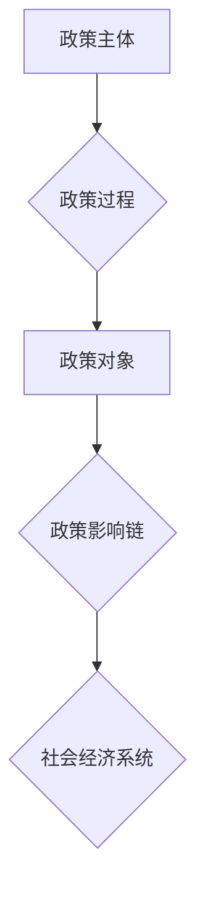

                 

# 大模型在政策影响链推理中的潜力探索

> 关键词：大模型、政策影响链推理、深度学习、人工智能、预测分析

> 摘要：本文探讨了大模型在政策影响链推理中的潜力。通过介绍大模型的基本原理和应用场景，分析政策影响链推理的关键概念和方法，展示大模型在政策影响预测和政策模拟中的实际应用，本文旨在揭示大模型在公共政策分析中的重要作用。

---

## 引言

### 1.1 大模型与政策影响链推理

大模型，尤其是深度学习模型，已经在各个领域展现出强大的能力。从自然语言处理到计算机视觉，再到时间序列预测，大模型的应用极大地推动了人工智能技术的发展。与此同时，政策影响链推理作为一个跨学科的领域，旨在理解政策对社会经济系统的影响，并预测这些影响的连锁反应。大模型的潜力在于其能够通过海量数据的处理和复杂的模式识别，提供更为精确和全面的预测分析。

### 1.2 本书的目的与结构

本书的主要目的是探讨大模型在政策影响链推理中的潜力，并展示如何将这一技术应用于实际问题。全书分为三个主要部分：

1. **大模型基础**：介绍大模型的基本原理、核心架构以及训练与评估方法。
2. **政策影响链推理**：探讨政策影响链推理的基本概念、构成要素和面临的挑战。
3. **大模型在政策影响链推理中的应用**：展示大模型在政策影响预测和政策模拟中的实际应用，并通过具体案例进行深入分析。

## 第一部分：大模型基础

### 第1章：大模型的基本原理

#### 1.1 大模型的概念

大模型通常指的是参数数量在数百万甚至数十亿量级的神经网络模型。这些模型可以处理复杂的数据集，提取高度抽象的特征，从而实现强大的预测和分类能力。

#### 1.2 大模型的核心架构

大模型的核心架构通常包括输入层、隐藏层和输出层。每一层都通过激活函数和权重参数实现数据的非线性变换。典型的深度神经网络结构如卷积神经网络（CNN）和循环神经网络（RNN）等，都在大模型中得到了广泛应用。

#### 1.3 大模型的训练与评估

大模型的训练是一个迭代的过程，通过优化算法（如梯度下降、Adam等）调整模型的参数，使其在训练数据上达到最优性能。评估模型性能的指标包括准确率、召回率、F1分数等。

### 第2章：大模型的应用场景

#### 2.1 自然语言处理

自然语言处理（NLP）是大模型的重要应用场景之一。通过训练大规模的神经网络模型，可以实现对文本数据的理解和生成，包括机器翻译、情感分析、文本分类等。

#### 2.2 计算机视觉

计算机视觉（CV）是另一个大模型的重要应用领域。通过训练卷积神经网络（CNN），可以实现图像分类、目标检测、图像分割等任务。

#### 2.3 时间序列预测

时间序列预测是大模型在经济学、金融学等领域的应用之一。通过训练循环神经网络（RNN）或其变种，如长短期记忆网络（LSTM），可以实现对时间序列数据的预测。

## 第二部分：政策影响链推理

### 第3章：政策影响链推理的基本概念

#### 3.1 政策影响链的定义

政策影响链是指一系列政策实施后，在社会、经济、环境等各个领域产生的连锁反应。这种连锁反应通常涉及多个变量和复杂的相互作用。

#### 3.2 政策影响链的构成要素

政策影响链的构成要素包括政策主体、政策对象和政策过程。政策主体是制定和实施政策的行为者，政策对象是政策的目标和影响的对象，政策过程是政策从制定到实施的整个过程。

#### 3.3 政策影响链推理的挑战

政策影响链推理面临的主要挑战包括复杂性、不确定性和数据稀缺性。复杂性在于政策影响链涉及多个变量和多层关系，不确定性在于政策效果受多种因素影响，数据稀缺性则限制了模型训练的数据量。

### 第4章：大模型在政策影响链推理中的应用

#### 4.1 大模型在政策影响预测中的作用

大模型能够通过处理复杂、多维度的数据，提取有用信息，进行模式识别，从而在政策影响预测中发挥作用。例如，通过训练大规模的神经网络模型，可以预测某一政策实施后对社会经济系统的影响。

#### 4.2 大模型在政策模拟中的应用

大模型不仅可以用于政策影响预测，还可以用于政策模拟。通过模拟不同的政策情景，可以评估政策的效果，为政策制定提供依据。

## 第三部分：技术实现与工具

### 第5章：大模型在政策影响链推理中的技术实现

#### 5.1 技术框架

在政策影响链推理中，常用的深度学习框架包括TensorFlow和PyTorch。这些框架提供了丰富的工具和函数，使得大模型的训练和部署变得更加容易。

#### 5.2 模型选择与优化

在选择大模型时，需要根据具体的应用场景和数据特点进行选择。同时，通过调整超参数和优化算法，可以提高模型的性能。

### 第6章：大模型在政策影响链推理中的工具应用

#### 6.1 数据收集与预处理

在政策影响链推理中，数据的收集和预处理至关重要。需要从多个来源收集数据，并进行清洗、转换和归一化，以确保数据的可靠性和一致性。

#### 6.2 模型训练与评估

通过使用训练数据集训练大模型，并在验证数据集上评估模型性能，可以确保模型的有效性和准确性。

## 结论

大模型在政策影响链推理中具有巨大的潜力。通过处理海量数据和复杂的模式，大模型能够提供精确的政策影响预测和政策模拟。随着技术的不断进步，大模型在公共政策分析中的应用将越来越广泛，为政策制定和评估提供强有力的支持。

---

### 附录

#### 6.1 Mermaid 流程图



#### 6.2 Python 源代码示例

```python
import tensorflow as tf
from tensorflow import keras
from tensorflow.keras import layers

# 定义模型
model = keras.Sequential([
    layers.Dense(64, activation='relu', input_shape=(784,)),
    layers.Dense(64, activation='relu'),
    layers.Dense(10, activation='softmax')
])

# 编译模型
model.compile(
    optimizer='adam',
    loss='categorical_crossentropy',
    metrics=['accuracy'],
)

# 训练模型
model.fit(train_images, train_labels, epochs=5)
```

#### 6.3 数学公式

$$
\text{损失函数} = \frac{1}{N} \sum_{i=1}^{N} -y_{i} \log(p_{i})
$$

$$
\text{准确率} = \frac{N_{\text{预测正确}}}{N_{\text{总样本}}}
$$

---

**作者：AI天才研究院/AI Genius Institute & 禅与计算机程序设计艺术 /Zen And The Art of Computer Programming**

