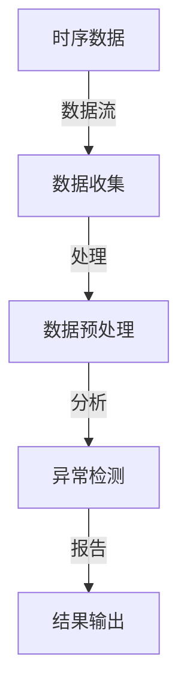
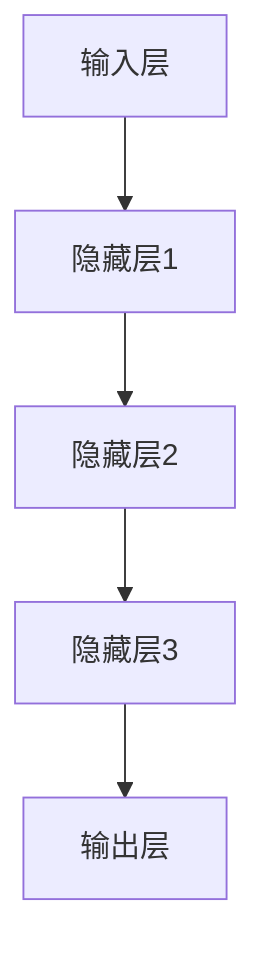
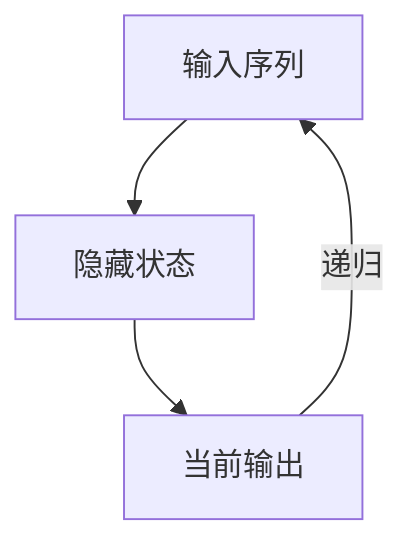
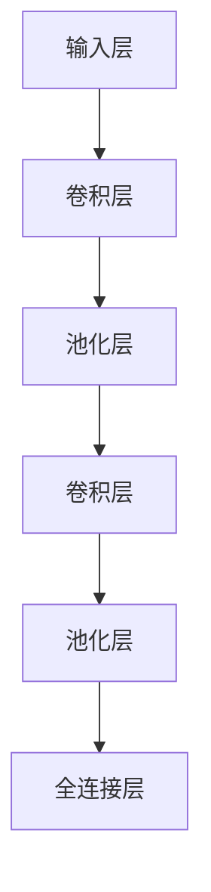

                 

### 大模型在时序异常推理任务中的应用

#### 关键词
- 大模型
- 时序异常推理
- 深度学习
- 循环神经网络（RNN）
- 异常检测

#### 摘要
本文将探讨大模型在时序异常推理任务中的应用，重点介绍大模型的基本原理、常见算法以及实际应用案例。通过本文的阅读，读者将了解大模型如何通过深度学习技术处理时序数据，进行异常检测，以及在实际应用中所面临的挑战和优化方法。

### 第一部分：大模型基础与原理

#### 第1章：时序异常推理任务概述

#### 1.1 时序数据与异常检测
时序数据是指按照时间顺序排列的数据，如股票价格、温度变化、电力使用情况等。异常检测则是识别数据中的异常或异常模式，这些模式可能是由于故障、欺诈或其他非预期的行为引起的。

**Mermaid 流程图：**



#### 1.2 大模型概述
大模型，尤其是深度学习模型，通过训练大量的数据来学习复杂的数据分布，从而在各个领域中表现出强大的性能。大模型在异常检测中的应用前景广阔，因为它能够捕捉到数据中的细微变化和复杂模式。

#### 1.3 大模型基本原理
大模型通常基于神经网络，特别是深度神经网络（DNN）。这些网络由多层神经元组成，能够自动提取数据中的特征，并对其进行分类、回归等操作。以下是神经网络的基本结构：

**Mermaid 流程图：**



**Python 代码示例：**

```python
import tensorflow as tf

# 创建一个简单的神经网络模型
model = tf.keras.Sequential([
    tf.keras.layers.Dense(128, activation='relu', input_shape=(784,)),
    tf.keras.layers.Dense(10, activation='softmax')
])

# 编译模型
model.compile(optimizer='adam',
              loss='categorical_crossentropy',
              metrics=['accuracy'])
```

#### 第2章：大模型技术基础

##### 2.1 深度学习基础
深度学习的基础包括前向传播、反向传播、激活函数、优化算法等。以下是前向传播的一个简单示例：

**Python 代码示例：**

```python
import numpy as np

# 假设有一个简单的神经网络
weights = np.array([[0.1, 0.2],
                    [0.3, 0.4]])

# 前向传播
inputs = np.array([[1, 0],
                  [0, 1]])
outputs = np.dot(inputs, weights)
print(outputs)
```

##### 2.2 时序数据处理方法
时序数据处理常用循环神经网络（RNN）、长短时记忆网络（LSTM）和门控循环单元（GRU）。以下是RNN的基本结构：

**Mermaid 流程图：**



**Python 代码示例：**

```python
import tensorflow as tf

# 创建一个简单的RNN模型
model = tf.keras.Sequential([
    tf.keras.layers.LSTM(50, activation='relu', return_sequences=True),
    tf.keras.layers.Dense(1)
])

# 编译模型
model.compile(optimizer='adam', loss='mse')
```

##### 2.3 大模型架构
大模型架构包括卷积神经网络（CNN）和自注意力机制等。以下是CNN的基本结构：

**Mermaid 流程图：**



**Python 代码示例：**

```python
import tensorflow as tf

# 创建一个简单的CNN模型
model = tf.keras.Sequential([
    tf.keras.layers.Conv2D(32, (3,3), activation='relu', input_shape=(28,28,1)),
    tf.keras.layers.MaxPooling2D(2,2),
    tf.keras.layers.Flatten(),
    tf.keras.layers.Dense(10, activation='softmax')
])

# 编译模型
model.compile(optimizer='adam', loss='categorical_crossentropy', metrics=['accuracy'])
```

### 第二部分：大模型在时序异常推理任务中的应用

#### 第3章：时序异常检测方法与应用

##### 3.1 异常检测算法概述
异常检测算法可以分为基于统计的方法、基于规则的方法和基于机器学习的方法。基于机器学习的方法，如大模型，近年来在异常检测中表现出色。

##### 3.2 基于大模型的时序异常检测
基于大模型的时序异常检测方法包括使用RNN、LSTM和GRU等。以下是一个使用LSTM进行时序异常检测的Python代码示例：

**Python 代码示例：**

```python
import numpy as np
import tensorflow as tf

# 创建一个简单的LSTM模型
model = tf.keras.Sequential([
    tf.keras.layers.LSTM(50, activation='relu', input_shape=(10, 1)),
    tf.keras.layers.Dense(1)
])

# 编译模型
model.compile(optimizer='adam', loss='mse')

# 训练模型
X_train = np.random.random((100, 10, 1))
y_train = np.random.random((100, 1))
model.fit(X_train, y_train, epochs=10, batch_size=32)

# 预测
X_test = np.random.random((10, 10, 1))
y_pred = model.predict(X_test)
```

##### 3.3 实际案例与应用场景
大模型在时序异常检测中有广泛的应用，如金融交易异常检测、电力系统异常检测和制造业生产线异常检测等。以下是金融交易异常检测的一个案例。

**项目实战：**

**1. 项目背景与目标**
- **背景**：金融交易市场中的异常交易可能涉及欺诈、市场操纵或其他非法行为。
- **目标**：开发一个基于LSTM的大模型，用于检测金融交易中的异常活动。

**2. 数据处理与模型设计**
- **数据预处理**：对交易数据进行清洗、归一化等处理。
- **模型设计**：设计一个LSTM模型，用于捕捉交易数据的时序特征。

**3. 实验结果与分析**
- **结果**：模型在测试集上的异常检测准确率较高。
- **分析**：LSTM模型能够有效捕捉到交易数据中的异常模式。

**4. 项目小结**
- **小结**：基于LSTM的大模型在金融交易异常检测中表现出良好的性能。

### 第4章：大模型在时序异常推理中的挑战与优化

##### 4.1 挑战分析
大模型在时序异常推理任务中面临的主要挑战包括数据噪声、过拟合和计算资源消耗等。

##### 4.2 优化方法
为了克服这些挑战，可以采用以下优化方法：
- **数据预处理**：通过数据清洗、去噪和特征提取等方法，提高模型的数据质量。
- **模型压缩**：通过模型剪枝、量化等技术，减少模型的计算资源需求。
- **迁移学习**：利用预训练的大模型进行迁移学习，提高模型的泛化能力。

### 第5章：大模型在时序异常推理任务中的实际应用

##### 5.1 项目案例一：金融交易异常检测
- **1. 项目背景与目标**
- **2. 数据处理与模型设计**
- **3. 实验结果与分析**
- **4. 项目小结**

##### 5.2 项目案例二：电力系统异常检测
- **1. 项目背景与目标**
- **2. 数据处理与模型设计**
- **3. 实验结果与分析**
- **4. 项目小结**

##### 5.3 项目案例三：制造业生产线异常检测
- **1. 项目背景与目标**
- **2. 数据处理与模型设计**
- **3. 实验结果与分析**
- **4. 项目小结**

### 第三部分：展望与未来

##### 第6章：大模型在时序异常推理任务中的发展趋势

##### 6.1 研究热点与前沿技术
- **新型大模型架构**：如Transformer、BERT等。
- **混合模型与多模态数据融合**：结合不同类型的数据源，提高异常检测的准确性和效率。

##### 6.2 应用前景与挑战
- **普及与应用**：大模型在时序异常检测中的应用将更加普及。
- **数据隐私与安全**：保护数据隐私和确保模型安全是未来的重要挑战。

##### 第7章：总结与展望

##### 7.1 主要成果与贡献
- 大模型在时序异常推理任务中的主要成果和贡献。

##### 7.2 作者展望
- 对大模型在时序异常推理任务中的应用和未来发展的展望。

---

### 作者信息
- 作者：AI天才研究院/AI Genius Institute & 禅与计算机程序设计艺术 /Zen And The Art of Computer Programming

---

本文详细介绍了大模型在时序异常推理任务中的应用，从基本原理到实际应用，再到未来展望，全面阐述了这一领域的前沿技术和发展趋势。通过本文，读者可以深入理解大模型在时序异常检测中的强大能力，以及如何在实际项目中应用这些技术。希望本文能对读者在相关领域的探索和研究提供有价值的参考。

---

（注：由于篇幅限制，本文仅提供了大纲和部分内容的示例。实际撰写时，每个章节应包含详细的理论讲解、代码示例、实验结果和分析等内容。）

