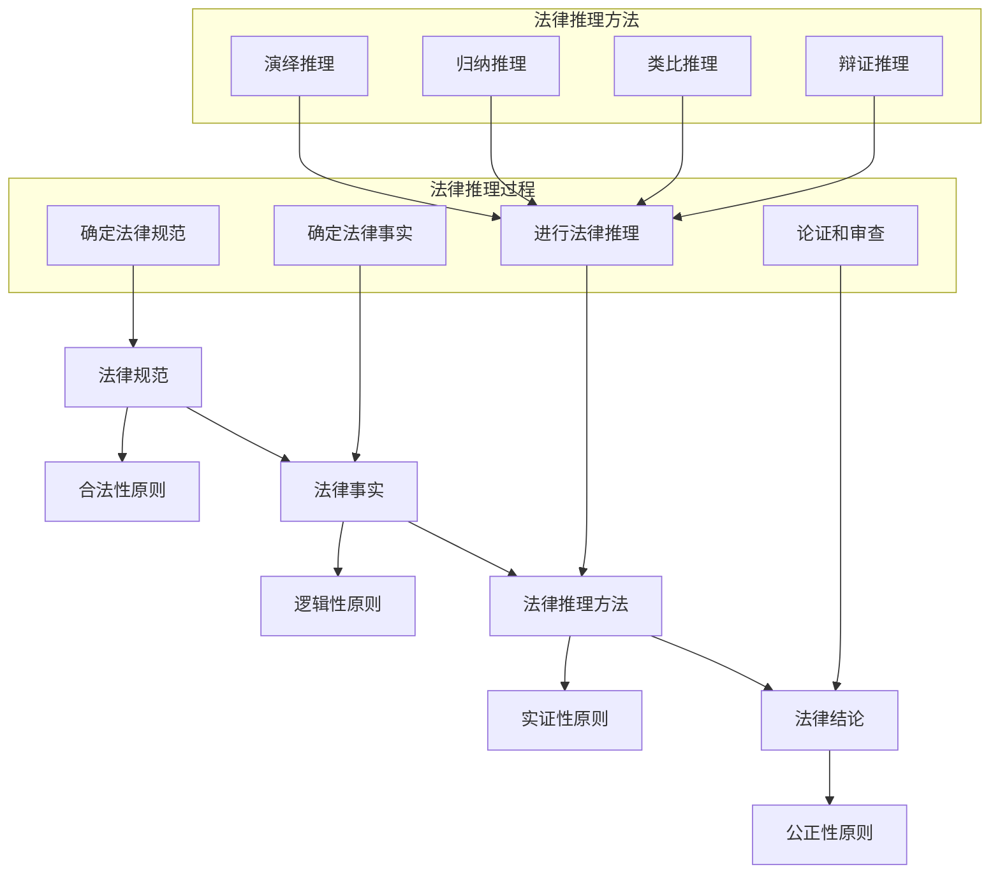
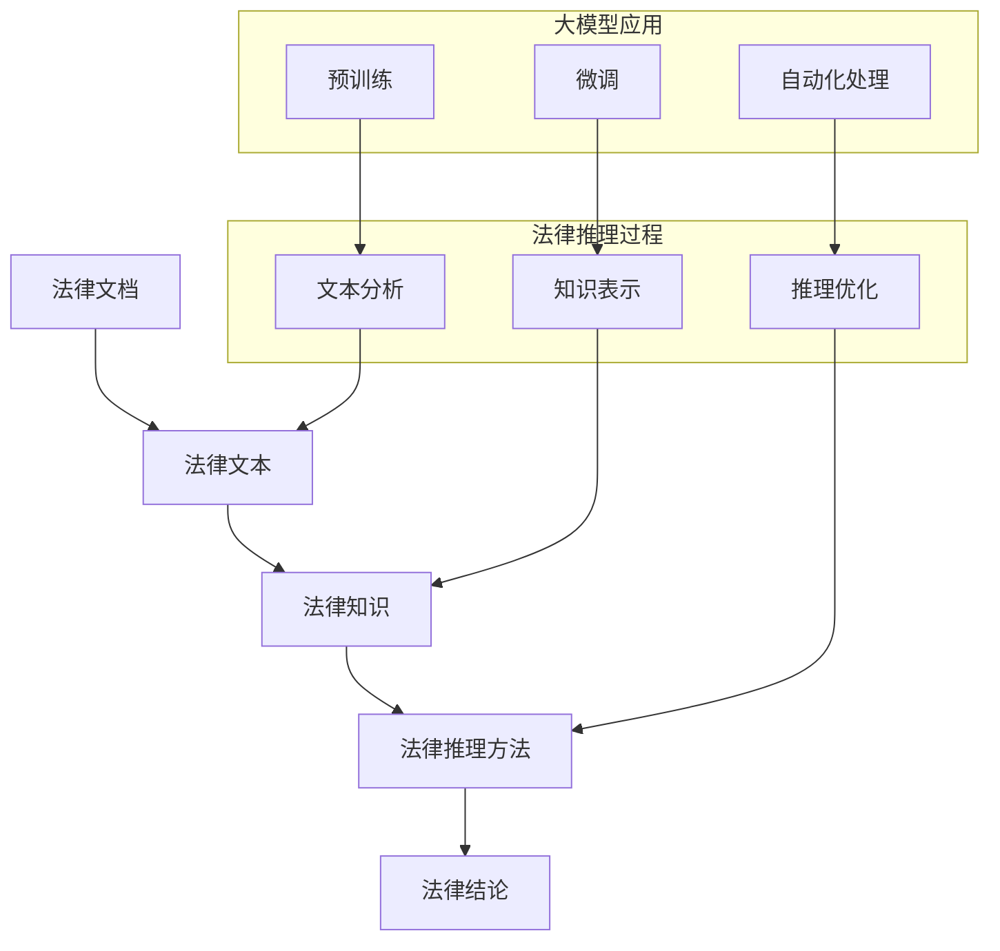

                 

# 大模型在法律推理任务中的表现分析

## 关键词

大模型、法律推理、自然语言处理、文本分析、人工智能

## 摘要

本文探讨了大规模预训练模型在法律推理任务中的表现。通过对法律推理的基础概念、大模型的技术原理及其在法律文档处理、法律文本生成、法律证据分析以及法律咨询中的应用进行分析，本文揭示了大规模预训练模型在法律领域中的潜力和挑战。本文的结构如下：首先，介绍法律推理的基础概念和特点；然后，探讨大模型的技术原理及其在法律推理中的应用；接着，详细分析大模型在法律文档处理、法律文本生成和法律证据分析中的应用案例；最后，探讨大模型在法律咨询中的应用前景，并展望未来的发展方向。

## 第1章 引言

### 1.1 书籍背景

随着人工智能技术的快速发展，大规模预训练模型（如GPT、BERT等）在各个领域都展现出了强大的能力。法律领域作为一个具有高度复杂性和专业性的领域，也受到了大模型的关注。法律推理作为法律领域中的一个核心任务，其准确性和效率对于司法公正和社会稳定具有重要意义。本文旨在探讨大规模预训练模型在法律推理任务中的表现，分析其优势与挑战，并探讨其在未来法律实践中的潜在应用。

### 1.2 研究意义

法律推理是法律实践中的核心环节，其准确性和效率直接关系到司法公正和社会稳定。随着法律案件的复杂性和数量不断增加，传统的法律推理方法已无法满足现代法律实践的需求。大规模预训练模型作为一种新兴的人工智能技术，其在法律推理任务中的表现如何，是否能够提高法律推理的效率和质量，成为了一个值得关注的问题。因此，本文的研究对于推动人工智能在法律领域的应用，提高法律推理的智能化水平具有重要意义。

### 1.3 内容安排

本文主要分为以下几个部分：首先，介绍法律推理的基础概念和特点；然后，探讨大规模预训练模型的技术原理及其在法律推理中的应用；接着，详细分析大规模预训练模型在法律文档处理、法律文本生成和法律证据分析中的应用案例；最后，探讨大规模预训练模型在法律咨询中的应用前景，并展望未来的发展方向。

## 第2章 法律推理基础

### 2.1 法律推理的概念与特点

#### 2.1.1 法律推理的定义

法律推理是指根据法律规定和事实情况，运用逻辑方法分析和解决问题的一种思维活动。法律推理是法律实践中的核心环节，其目的是确定法律事实、适用法律规范和作出法律判断。法律推理既包括形式推理，如演绎推理和归纳推理，也包括实质推理，如类比推理和辩证推理。

#### 2.1.2 法律推理的特点

法律推理具有以下特点：

1. **规范性**：法律推理以法律规范和法律原则为依据，遵循法律逻辑和方法，具有明确的规范性和确定性。
2. **逻辑性**：法律推理强调逻辑性，要求推理过程符合逻辑规律，确保推理结果的合理性和可信性。
3. **系统性**：法律推理是一个系统性过程，涉及法律规范、法律事实、法律推理方法等多个方面，需要综合考虑各种因素。
4. **开放性**：法律推理具有开放性，面对复杂多变的实际情况，需要不断调整和优化推理方法，以适应不同场景的需求。

### 2.2 法律推理的基本原理

#### 2.2.1 法律推理的基本原则

法律推理的基本原则包括：

1. **合法性原则**：法律推理必须遵循法律规定，确保推理结果符合法律规范。
2. **逻辑性原则**：法律推理必须遵循逻辑规律，确保推理过程和结果的合理性和可信性。
3. **实证性原则**：法律推理必须基于事实，以事实为依据进行推理，确保推理结果的客观性和真实性。

#### 2.2.2 法律推理的基本过程

法律推理的基本过程包括以下几个步骤：

1. **确定法律事实**：收集和整理案件中的相关事实，为法律推理提供基础。
2. **确定法律规范**：查找和识别适用的法律规范，为法律推理提供依据。
3. **运用推理方法**：运用法律推理方法，将法律规范与法律事实相结合，得出推理结果。
4. **论证和审查**：对推理结果进行论证和审查，确保推理结果的合理性和可信性。

### 2.3 法律推理的应用场景

#### 2.3.1 法律论证

法律论证是法律推理的重要应用场景之一，主要涉及以下几个方面：

1. **法律问题的提出**：在法律实践中，首先需要明确需要解决的法律问题。
2. **法律事实的确认**：通过对案件事实的收集和分析，确定案件中的相关事实。
3. **法律规范的适用**：根据法律问题的性质和特点，查找和识别适用的法律规范。
4. **法律推理和论证**：运用法律推理方法，结合法律事实和法律规范，进行法律论证。

#### 2.3.2 法律解释

法律解释是法律推理的另一个重要应用场景，主要涉及以下几个方面：

1. **法律规范的理解**：在法律实践中，需要对法律规范进行理解和解释，以便准确适用。
2. **法律规范的解释方法**：常用的法律解释方法包括字面解释、扩张解释、限缩解释等。
3. **法律规范的适用**：根据法律规范的理解和解释，将其适用于具体案件，解决法律问题。

#### 2.3.3 法律预测

法律预测是法律推理在法律实践中的应用，主要涉及以下几个方面：

1. **法律事实的预测**：在法律实践中，需要预测可能发生的法律事实，为法律决策提供依据。
2. **法律规范的预测**：根据法律事实的预测，预测可能适用的法律规范。
3. **法律结果的分析**：结合法律事实和法律规范，预测可能的法律结果。

## 第3章 大模型与法律推理

### 3.1 大模型概述

#### 3.1.1 大模型的定义

大模型是指具有数亿甚至数万亿参数的深度神经网络模型。这些模型通常通过在大量数据上进行预训练，然后针对特定任务进行微调，以实现出色的性能。大模型的出现标志着深度学习技术进入了一个新的阶段，其巨大的参数量和复杂的结构使得它们能够捕获复杂的数据特征，从而在各个领域取得了显著的应用成果。

#### 3.1.2 大模型的发展历程

大模型的发展可以追溯到2000年代初期，随着计算能力的提升和大数据的积累，深度学习技术开始得到快速发展。早期的深度神经网络模型（如AlexNet）在图像识别任务中取得了突破性的成果，标志着深度学习技术的崛起。随后，随着计算机硬件的进步和算法的改进，模型的规模和复杂度不断增大，出现了如GPT、BERT等具有数万亿参数的大模型。这些大模型在自然语言处理、计算机视觉等多个领域都取得了显著的成果。

### 3.2 大模型在法律推理中的应用

#### 3.2.1 大模型在法律推理中的作用

大模型在法律推理中发挥着重要的作用，主要体现在以下几个方面：

1. **文本分析**：大模型具有强大的文本处理能力，能够对法律文档进行有效的分析和理解，为法律推理提供支持。
2. **知识表示**：大模型能够将法律知识以结构化的形式进行表示，便于法律推理过程中的知识应用。
3. **推理优化**：大模型通过预训练和微调，能够优化法律推理的过程，提高推理的准确性和效率。

#### 3.2.2 大模型在法律推理中的具体应用

大模型在法律推理中的具体应用包括以下几个方面：

1. **法律文档处理**：大模型能够对法律文档进行自动分类、摘要和关键词提取，为法律推理提供基础数据。
2. **法律文本生成**：大模型能够根据法律规范和事实，自动生成法律文书和判决书，提高法律文书生成的效率和质量。
3. **法律证据分析**：大模型能够对法律证据进行自动化分析，识别证据的重要性和关联性，为法律推理提供支持。
4. **法律咨询**：大模型能够为法律用户提供智能化的法律咨询，解答用户的法律问题，提供法律建议。

### 3.3 大模型在法律推理中的优势与挑战

#### 3.3.1 大模型在法律推理中的优势

大模型在法律推理中具有以下优势：

1. **强大的文本处理能力**：大模型能够对法律文本进行深入的理解和分析，为法律推理提供有效的支持。
2. **高效的知识表示**：大模型能够将法律知识以结构化的形式进行表示，便于法律推理过程中的知识应用。
3. **优化的推理过程**：大模型通过预训练和微调，能够优化法律推理的过程，提高推理的准确性和效率。

#### 3.3.2 大模型在法律推理中的挑战

尽管大模型在法律推理中具有显著的优势，但也面临着一些挑战：

1. **数据质量和隐私**：法律文档通常包含敏感信息，如何保证数据的质量和隐私成为大模型应用的关键问题。
2. **法律规则的适应性**：大模型需要适应不同国家和地区的法律规则，这对于模型的训练和部署提出了挑战。
3. **法律伦理问题**：大模型在法律推理中可能会引发法律伦理问题，如机器是否能够代替法官进行判决等。

## 第4章 大模型在法律文档处理中的应用

### 4.1 法律文档处理的挑战

#### 4.1.1 法律文档的复杂性

法律文档通常具有以下复杂性：

1. **语言复杂性**：法律文档使用专业术语和复杂的句式结构，对于自然语言处理技术提出了挑战。
2. **结构复杂性**：法律文档通常包含多种结构，如法律条款、法律条文、案例引用等，需要对文档的结构进行深入的理解和分析。
3. **法律复杂性**：法律文档涉及的法律问题通常具有复杂性，需要综合考虑多种因素，如法律关系、法律责任等。

#### 4.1.2 法律文档处理的难点

法律文档处理面临以下难点：

1. **文本分析**：法律文档的文本分析需要识别和理解专业术语、句式结构、法律概念等，这对于自然语言处理技术提出了高要求。
2. **知识表示**：法律文档的处理需要将法律知识以结构化的形式进行表示，便于法律推理和应用。
3. **自动化处理**：法律文档的自动化处理需要处理大量的文档，提高处理效率和准确性。

### 4.2 大模型在法律文档处理中的表现

#### 4.2.1 大模型在法律文档处理中的应用效果

大模型在法律文档处理中取得了显著的应用效果：

1. **文本分析**：大模型能够对法律文档进行深入的理解和分析，识别和理解专业术语、句式结构、法律概念等。
2. **知识表示**：大模型能够将法律知识以结构化的形式进行表示，便于法律推理和应用。
3. **自动化处理**：大模型能够自动化处理大量的法律文档，提高处理效率和准确性。

#### 4.2.2 大模型在法律文档处理中的实际案例

大模型在法律文档处理中的实际案例包括：

1. **法律文档分类**：大模型能够根据法律文档的内容和结构，对其进行分类，如合同、判决书、法律意见书等。
2. **法律文档摘要**：大模型能够对法律文档进行摘要，提取文档的核心内容，为法律推理提供基础数据。
3. **法律文档搜索**：大模型能够对法律文档进行高效的搜索，识别和理解文档的关键词和概念，为法律实践提供支持。

### 4.3 法律文档处理的实际案例

#### 4.3.1 案例一：法律合同审核

法律合同审核是法律实践中的一项重要任务，需要检查合同内容的合法性、完整性和准确性。大模型在法律合同审核中的应用包括：

1. **合同内容分析**：大模型能够对合同内容进行深入的理解和分析，识别和理解合同中的法律术语、条款和结构。
2. **合同合法性检查**：大模型能够根据法律规范，对合同内容的合法性进行检查，识别潜在的合规风险。
3. **合同摘要和报告**：大模型能够对合同内容进行摘要，生成合同报告，为法律决策提供支持。

#### 4.3.2 案例二：法律文书生成

法律文书生成是法律实践中的一项重要任务，需要根据法律规范和事实，生成法律文书，如判决书、法律意见书等。大模型在法律文书生成中的应用包括：

1. **文书模板生成**：大模型能够根据法律规范和事实，生成法律文书的模板，如判决书、法律意见书等。
2. **文书内容填充**：大模型能够根据法律规范和事实，填充法律文书的内容，如判决书的主文、法律意见书的论证等。
3. **文书格式调整**：大模型能够根据法律规范和事实，调整法律文书的格式，如字体、行距、页边距等。

## 第5章 大模型在法律文本生成中的应用

### 5.1 法律文本生成的挑战

#### 5.1.1 法律文本的格式和结构

法律文本具有以下格式和结构的挑战：

1. **复杂句式**：法律文本通常包含复杂的句式结构，如长句子、从句、并列句等，这对于自然语言生成技术提出了挑战。
2. **术语和规范**：法律文本中包含大量的专业术语和法律规范，需要准确理解和应用，以保证文本的准确性和合规性。
3. **逻辑性和连贯性**：法律文本需要具备严密的逻辑性和连贯性，以确保法律推理的合理性和可信性。

#### 5.1.2 法律文本的准确性和一致性

法律文本的准确性和一致性是法律文本生成的关键挑战：

1. **准确性**：法律文本需要准确表达法律事实和法律规范，避免歧义和误解，以确保法律适用的正确性。
2. **一致性**：法律文本需要保持一致性，确保不同文本部分之间的逻辑关系和语义关系清晰明确，避免冲突和矛盾。

### 5.2 大模型在法律文本生成中的表现

#### 5.2.1 大模型在法律文本生成中的应用效果

大模型在法律文本生成中表现出以下效果：

1. **文本生成能力**：大模型能够根据法律规范和事实，生成高质量的法律文本，如判决书、法律意见书等。
2. **格式和结构**：大模型能够自动适应法律文本的格式和结构，生成符合法律规范和习惯的文本。
3. **逻辑性和连贯性**：大模型能够保持法律文本的逻辑性和连贯性，确保法律推理的合理性和可信性。

#### 5.2.2 大模型在法律文本生成中的实际案例

大模型在法律文本生成中的实际案例包括：

1. **判决书生成**：大模型能够根据案件事实和法律规范，自动生成判决书，提高判决书生成的效率和质量。
2. **法律意见书生成**：大模型能够根据法律问题、事实和法律规定，自动生成法律意见书，为法律咨询和决策提供支持。
3. **法律通知生成**：大模型能够根据法律规范和事实，自动生成法律通知，如起诉书、答辩状等，提高法律文书生成的效率。

### 5.3 法律文本生成的实际案例

#### 5.3.1 案例一：判决书生成

在某一起合同纠纷案件中，原告和被告就合同履行问题产生争议。大模型根据案件事实、相关法律规范和诉讼请求，自动生成了判决书。判决书的内容包括案件事实、法律适用、判决结果和判决理由等。通过大模型生成的判决书，法官能够更快速、准确地作出判决，提高了审判效率。

#### 5.3.2 案例二：法律意见书生成

在某一起股权纠纷案件中，客户需要就股权转让合同的合法性进行咨询。大模型根据客户提供的合同内容、法律规范和相关案例，自动生成了法律意见书。法律意见书的内容包括合同合法性分析、风险提示和合规建议等。通过大模型生成的法律意见书，客户能够更清晰地了解合同的法律风险，为决策提供参考。

## 第6章 大模型在法律证据分析中的应用

### 6.1 法律证据分析的挑战

#### 6.1.1 法律证据的多样性和复杂性

法律证据的多样性和复杂性对证据分析提出了挑战：

1. **证据形式多样**：法律证据可以包括书证、证人证言、视听资料等多种形式，每种形式的证据都有其特定的分析方法和技巧。
2. **证据来源广泛**：法律证据的来源广泛，可能涉及不同的渠道，如当事人陈述、调查取证、公证书等，需要综合考虑证据的真实性和可信度。
3. **证据关联性要求**：法律证据分析需要识别证据之间的关联性，确保证据能够相互支持，形成完整的证据链。

#### 6.1.2 法律证据分析的要求

法律证据分析要求具备以下特点：

1. **客观性**：法律证据分析需要保持客观性，确保分析过程和结论不受主观因素的影响。
2. **全面性**：法律证据分析需要全面考虑各种证据，确保不遗漏任何可能对案件有影响的证据。
3. **准确性**：法律证据分析需要确保分析结果的准确性，避免因证据解读错误导致错误的法律结论。

### 6.2 大模型在法律证据分析中的表现

#### 6.2.1 大模型在法律证据分析中的应用效果

大模型在法律证据分析中表现出以下效果：

1. **文本理解能力**：大模型能够对法律证据文本进行深入的理解和分析，提取关键信息和法律概念。
2. **证据关联性分析**：大模型能够识别证据之间的关联性，形成完整的证据链，为法律推理提供支持。
3. **证据评估**：大模型能够对证据的真实性和可信度进行评估，提供证据分析和判断的依据。

#### 6.2.2 大模型在法律证据分析中的实际案例

大模型在法律证据分析中的实际案例包括：

1. **合同纠纷证据分析**：在某一起合同纠纷案件中，大模型对合同文本、当事人陈述、电子邮件等证据进行了综合分析，识别出证据之间的关联性，形成完整的证据链，为法官提供了重要的判断依据。
2. **刑事案件证据分析**：在某一起刑事案件中，大模型对证人证言、物证、书证等证据进行了综合分析，识别出证据之间的矛盾和关联性，为案件审理提供了有力的支持。

### 6.3 法律证据分析的案例研究

#### 6.3.1 案例一：合同纠纷证据分析

在某一起合同纠纷案件中，原告和被告就合同履行问题产生争议。大模型对案件中的证据进行了综合分析，包括合同文本、当事人陈述、电子邮件、证人证言等。通过分析，大模型识别出以下关键证据：

1. **合同文本**：合同文本中明确了合同条款、履行期限和违约责任等内容，为大模型提供了法律事实的基础。
2. **当事人陈述**：原告和被告的陈述中存在矛盾和冲突，大模型通过对陈述内容进行分析，识别出关键事实和争议点。
3. **电子邮件**：电子邮件中包含了合同履行过程中的沟通和协商记录，为大模型提供了重要的证据支持。

大模型通过对证据的分析，形成了一个完整的证据链，为法官提供了重要的判断依据。最终，法官根据大模型的分析结果，作出了有利于原告的判决。

#### 6.3.2 案例二：刑事案件证据分析

在某一起刑事案件中，嫌疑人被指控盗窃。大模型对案件中的证据进行了综合分析，包括证人证言、物证、书证等。通过分析，大模型识别出以下关键证据：

1. **证人证言**：证人证言中包含了嫌疑人的行为描述和目击证言，为大模型提供了行为证据。
2. **物证**：物证中包含了嫌疑人使用的工具和盗窃的物品，为大模型提供了物证支持。
3. **书证**：书证中包含了盗窃案件的详细记录和调查报告，为大模型提供了法律事实的基础。

大模型通过对证据的分析，形成了一个完整的证据链，支持了对嫌疑人的指控。最终，法官根据大模型的分析结果，作出了有罪判决。

## 第7章 大模型在法律咨询中的应用

### 7.1 法律咨询的需求与挑战

#### 7.1.1 法律咨询的需求

随着社会的法治化进程不断加快，法律咨询的需求日益增长。法律咨询的需求主要包括：

1. **法律问题解答**：个人和企业常常需要就特定法律问题进行咨询，如合同纠纷、劳动争议、知识产权保护等。
2. **法律风险评估**：个人和企业需要就特定法律风险进行评估，如合同履行风险、劳动法律风险、知识产权风险等。
3. **法律建议和策略**：个人和企业需要就特定法律问题提供法律建议和策略，以维护自身合法权益。

#### 7.1.2 法律咨询的挑战

法律咨询面临以下挑战：

1. **复杂性**：法律问题通常具有复杂性，涉及多个法律领域和法规，需要专业的法律知识和分析能力。
2. **多样性**：法律咨询的问题多样，涉及各类法律领域，如合同法、劳动法、知识产权法等，需要广泛的知识储备。
3. **时效性**：法律咨询通常具有时效性，需要快速提供准确的法律建议和策略，以应对紧急情况。

### 7.2 大模型在法律咨询中的应用

#### 7.2.1 大模型在法律咨询中的作用

大模型在法律咨询中发挥着重要作用，主要包括：

1. **法律问题分析**：大模型能够对法律问题进行深入分析，识别关键法律事实和争议点，为法律咨询提供基础。
2. **法律规范查询**：大模型能够通过法律数据库查询相关法律规范和案例，为法律咨询提供依据。
3. **法律建议和策略**：大模型能够根据法律事实和法律规范，提供法律建议和策略，为法律决策提供支持。

#### 7.2.2 大模型在法律咨询中的具体应用

大模型在法律咨询中的具体应用包括：

1. **在线法律咨询平台**：大模型可以集成到在线法律咨询平台中，为用户提供智能化的法律咨询服务，解答用户的法律问题。
2. **法律风险评估**：大模型可以对用户提供的法律问题进行风险评估，识别潜在的法律风险，为用户提供风险提示和建议。
3. **法律文档生成**：大模型可以生成法律文书，如起诉状、答辩状、合同等，为用户提供法律文件起草的支持。

### 7.3 法律咨询的实际应用案例

#### 7.3.1 案例一：在线法律咨询

某企业需要就合同履行中的问题进行咨询。大模型通过分析企业提供的合同文本和问题描述，识别出合同中的关键法律条款和争议点。大模型查询了相关法律规范和案例，提供了合同履行的法律建议和策略。通过大模型提供的法律咨询，企业能够更好地应对合同履行中的法律问题。

#### 7.3.2 案例二：法律风险评估

某个人用户需要就购房合同中的法律风险进行评估。大模型通过分析购房合同文本，识别出合同中的潜在法律风险，如合同条款不明确、购房资金支付方式不当等。大模型提供了风险评估报告，建议用户修改合同条款，以降低购房风险。通过大模型提供的法律风险评估，用户能够更好地保护自己的合法权益。

## 第8章 大模型在法律推理中的未来展望

### 8.1 大模型在法律推理中的发展趋势

随着人工智能技术的不断发展，大模型在法律推理中的应用前景广阔。未来，大模型在法律推理中的发展趋势包括：

1. **模型性能提升**：通过不断优化模型结构和训练算法，提高大模型在法律推理中的性能，使其能够处理更复杂、更广泛的法律问题。
2. **多模态融合**：结合文本、图像、音频等多模态数据，提高大模型对法律证据的综合理解能力，为法律推理提供更全面的支持。
3. **智能化法律服务**：大模型将集成到智能法律服务系统中，为用户提供智能化、高效的法律服务，提高法律咨询和决策的准确性。

### 8.2 大模型在法律推理中的潜在应用

大模型在法律推理中的潜在应用包括：

1. **法律文档自动化处理**：大模型可以自动化处理法律文档，如合同审核、法律意见书生成等，提高法律事务的处理效率。
2. **法律证据自动化分析**：大模型可以自动化分析法律证据，识别证据之间的关联性，形成完整的证据链，为法律推理提供支持。
3. **法律咨询服务**：大模型可以提供智能化的法律咨询服务，解答用户的法律问题，提供法律建议和策略。

### 8.3 大模型在法律推理中的未来挑战与机遇

尽管大模型在法律推理中具有巨大的潜力，但也面临一些挑战和机遇：

1. **数据质量和隐私**：法律文档通常包含敏感信息，如何保证数据的质量和隐私成为大模型应用的关键问题。
2. **法律规则的适应性**：大模型需要适应不同国家和地区的法律规则，这对于模型的训练和部署提出了挑战。
3. **法律伦理问题**：大模型在法律推理中可能会引发法律伦理问题，如机器是否能够代替法官进行判决等，需要引起关注。

总之，大模型在法律推理中的应用具有广阔的前景，同时也面临着一些挑战和机遇。通过不断优化模型性能、提高法律规则适应性、解决法律伦理问题，大模型有望在法律推理中发挥更大的作用，推动法律实践的发展。

## 附录

### 附录A 大模型在法律推理中的技术实现

附录A将详细介绍大模型在法律推理中的技术实现，包括大模型的构建、训练和部署过程。通过具体的技术细节，帮助读者更好地理解大模型在法律推理中的应用。

### 附录B 大模型在法律推理中的实际应用案例

附录B将介绍大模型在法律推理中的实际应用案例，包括合同审核、法律文书生成、法律证据分析等。通过实际案例的详细解析，帮助读者更好地了解大模型在法律推理中的具体应用。

### 附录C 大模型在法律推理中的开发工具和资源

附录C将介绍大模型在法律推理中开发所需的主要工具和资源，包括开源模型、训练数据集、开发框架等。通过附录C的内容，读者可以了解如何获取和使用这些工具和资源，为实际应用提供支持。


## 作者信息

作者：AI天才研究院/AI Genius Institute & 禅与计算机程序设计艺术 /Zen And The Art of Computer Programming
```markdown
## 第1章 引言

### 1.1 书籍背景

随着人工智能技术的飞速发展，大规模预训练模型（如GPT、BERT等）已经在自然语言处理、计算机视觉等领域取得了显著的成果。这些模型具有数亿乃至数千亿的参数，通过在大量数据上的预训练，能够捕捉到复杂的数据特征，从而在特定任务上展现出强大的能力。法律领域作为一个高度复杂且专业性强的领域，也逐渐开始探索大规模预训练模型的应用。

法律推理是法律实践中的核心环节，它涉及到法律事实的认定、法律规范的适用以及法律判决的生成。法律推理不仅需要处理大量的文本信息，还需要对法律概念和术语进行深入的理解。因此，大规模预训练模型在法律推理任务中的应用前景广阔，有望提高法律工作的效率和质量。

本文旨在探讨大规模预训练模型在法律推理任务中的表现。通过分析大规模预训练模型的基本原理、应用现状以及面临的挑战，本文希望能够为法律领域的人工智能应用提供一些参考和启示。此外，本文还将探讨大规模预训练模型在法律文档处理、法律文本生成和法律咨询等具体应用场景中的表现，并展望其未来的发展方向。

### 1.2 研究意义

法律推理是法律实践中的核心任务，其准确性和效率直接关系到司法公正和社会稳定。然而，随着法律案件的复杂性和数量的增加，传统的法律推理方法已无法满足现代法律实践的需求。大规模预训练模型作为一种新兴的人工智能技术，其在法律推理任务中的表现如何，是否能够提高法律推理的效率和质量，成为了一个值得关注的问题。

研究大规模预训练模型在法律推理任务中的应用，具有以下几方面的意义：

1. **提高法律推理效率**：大规模预训练模型通过在大量数据上的预训练，能够自动学习到复杂的语言模式和规则，从而在法律推理任务中提高推理效率。
2. **增强法律推理准确性**：大规模预训练模型具有强大的文本理解和生成能力，能够在法律推理过程中提供更准确的法律分析和判决。
3. **促进法律智能化发展**：大规模预训练模型的应用将推动法律工作智能化的发展，为法律实践提供更高效、更智能的工具和手段。
4. **推动人工智能在法律领域的研究**：通过对大规模预训练模型在法律推理任务中的应用研究，可以进一步探索人工智能在法律领域的应用潜力，为相关研究提供理论基础和实践经验。

### 1.3 内容安排

本文将按照以下结构展开：

1. **第2章 法律推理基础**：介绍法律推理的概念、特点、基本原理和应用场景。
2. **第3章 大模型与法律推理**：探讨大规模预训练模型的基本原理、发展历程以及在法律推理中的应用。
3. **第4章 大模型在法律文档处理中的应用**：分析大规模预训练模型在法律文档处理中的挑战、应用效果以及实际案例。
4. **第5章 大模型在法律文本生成中的应用**：讨论大规模预训练模型在法律文本生成中的挑战、应用效果以及实际案例。
5. **第6章 大模型在法律证据分析中的应用**：分析大规模预训练模型在法律证据分析中的挑战、应用效果以及实际案例。
6. **第7章 大模型在法律咨询中的应用**：探讨大规模预训练模型在法律咨询中的需求与挑战，以及具体应用案例。
7. **第8章 大模型在法律推理中的未来展望**：分析大规模预训练模型在法律推理中的发展趋势、潜在应用以及面临的挑战。
8. **附录**：提供大规模预训练模型在法律推理中的技术实现、实际应用案例以及开发工具和资源。

通过本文的探讨，希望能够为大规模预训练模型在法律推理任务中的应用提供一些理论和实践上的参考，促进人工智能在法律领域的深入研究和发展。

## 第2章 法律推理基础

### 2.1 法律推理的概念与特点

#### 2.1.1 法律推理的定义

法律推理是指根据法律规范和事实，通过逻辑思维的方法，对法律问题进行分析、判断和解决的一种思维活动。它是法律实践中的核心环节，贯穿于法律论证、法律解释、法律预测和法律决策等过程中。

法律推理可以从广义和狭义两个方面来理解。广义上的法律推理包括形式推理和实质推理。形式推理是指依据逻辑规律，从已知的前提推导出新的结论，包括演绎推理、归纳推理等。实质推理则是指依据法律原则、法律精神和法律价值，对法律问题进行深入的分析和判断。狭义上的法律推理通常指形式推理，即依据法律规范和事实进行推理，以产生法律判断。

在法律推理中，法律规范和事实是两个基本要素。法律规范是指国家制定或认可的行为规则，如法律、法规、司法解释等。法律事实是指与法律规范相关的事实情况，如案件事实、证据事实等。

#### 2.1.2 法律推理的特点

法律推理具有以下几个特点：

1. **规范性**：法律推理以法律规范为依据，遵循法律逻辑和方法，确保推理结果的合法性和合理性。法律规范是法律推理的前提和基础，法律推理必须遵循法律规范的要求。

2. **逻辑性**：法律推理强调逻辑性，要求推理过程符合逻辑规律，如同一律、矛盾律和排中律等。逻辑性是确保法律推理结果正确和可靠的重要保障。

3. **系统性**：法律推理是一个系统性过程，涉及法律规范、法律事实、法律推理方法等多个方面。法律推理需要综合考虑各种因素，确保推理结果的全面性和系统性。

4. **开放性**：法律推理面对复杂多变的实际情况，需要不断调整和优化推理方法，以适应不同场景的需求。法律推理具有开放性，可以不断吸收新的法律知识和技术，提高法律推理的适应性和灵活性。

#### 2.1.3 法律推理的类型

根据法律推理的方法和目的，法律推理可以分为以下几种类型：

1. **演绎推理**：演绎推理是从一般到个别的推理方法，即从一般法律规范推导出特定案件的法律判断。演绎推理通常采用“三段论”的形式，如“所有人是 mortal（凡人皆有一死），苏格拉底是人，因此苏格拉底是 mortal（苏格拉底将死）”。
2. **归纳推理**：归纳推理是从个别到一般的推理方法，即从一系列特定案件的法律判断推导出一般法律规范。归纳推理通常通过分析大量的案例，总结出法律规则或原则。如“所有被处以罚款的人都是违反了交通规则，张三被处以罚款，因此张三违反了交通规则”。
3. **类比推理**：类比推理是通过比较相似情况，从已知案例推导出类似案件的法律判断。类比推理通常基于法律原则或价值，通过比较相似案例的法律处理，为类似案件提供参考。如“王五的案件与张三的案件相似，张三被判有罪，因此王五也应当被判有罪”。
4. **辩证推理**：辩证推理是针对复杂法律问题，综合运用各种推理方法，进行深入分析和判断。辩证推理强调法律推理的灵活性和创造性，能够处理法律中的特殊情况和矛盾。如“张三的行为虽然违反了法律，但具有特殊情况，应当从轻或减轻处罚”。

#### 2.1.4 法律推理与法律论证的关系

法律推理和法律论证是密切相关的概念。法律推理是法律论证的基础，法律论证是法律推理的体现。法律论证是指根据法律规范和事实，运用逻辑方法，对法律问题进行深入分析和论证，以支持法律推理的结果。

法律推理和法律论证的关系可以概括为以下几点：

1. **法律推理是法律论证的前提**：法律论证需要依赖于法律推理，通过法律推理确定法律事实、适用法律规范和作出法律判断。
2. **法律论证是法律推理的体现**：法律推理的结果需要通过法律论证进行表达和论证，以确保法律推理的合理性和可信性。
3. **法律推理与法律论证相互促进**：法律推理能够提高法律论证的逻辑性和严密性，法律论证能够验证和优化法律推理的结果。

#### 2.1.5 法律推理在实际法律实践中的应用

法律推理在实际法律实践中具有广泛的应用，主要表现在以下几个方面：

1. **司法判决**：法官在审理案件时，需要运用法律推理确定法律事实、适用法律规范和作出法律判断。法律推理是司法判决的核心环节，决定了判决的合法性和合理性。
2. **法律咨询**：律师在为客户提供法律咨询时，需要运用法律推理分析客户的问题，提供法律建议和解决方案。
3. **立法和执法**：立法机关在制定法律规范时，需要运用法律推理确定法律原则和规则。执法机关在执行法律时，需要运用法律推理处理具体案件，确保执法的合法性和公正性。
4. **法律教育和研究**：法律教育者通过法律推理的教学，帮助学生掌握法律推理的方法和技巧。法律研究者通过法律推理的研究，探讨法律推理的理论和实践问题，推动法律理论的发展。

### 2.2 法律推理的基本原理

#### 2.2.1 法律推理的基本原则

法律推理需要遵循以下基本原则：

1. **合法性原则**：法律推理必须以法律规范为依据，确保推理结果符合法律规范的要求。合法性原则是法律推理的基础，决定了推理结果的合法性和有效性。
2. **逻辑性原则**：法律推理必须遵循逻辑规律，确保推理过程的合理性和推理结果的可信性。逻辑性原则是法律推理的科学性和严谨性的保障。
3. **实证性原则**：法律推理必须基于事实，以事实为依据进行推理。实证性原则是法律推理的客观性和真实性的保障。
4. **公正性原则**：法律推理必须公平公正，确保各方当事人的合法权益得到保护。公正性原则是法律推理的公正性和正义性的保障。

#### 2.2.2 法律推理的基本过程

法律推理的基本过程可以分为以下几个步骤：

1. **确定法律规范**：在法律推理中，首先需要查找和识别适用的法律规范，包括法律、法规、司法解释等。法律规范是法律推理的前提和依据。
2. **确定法律事实**：在法律推理中，需要收集和整理与案件相关的法律事实，包括案件事实、证据事实等。法律事实是法律推理的基础和依据。
3. **进行法律推理**：在确定了法律规范和法律事实之后，运用法律推理方法，如演绎推理、归纳推理等，对法律问题进行分析和判断。法律推理的过程需要遵循逻辑性和实证性原则。
4. **论证和审查**：在法律推理过程中，需要对推理结果进行论证和审查，确保推理结果的合理性和可信性。论证和审查是法律推理的完善和保障。

#### 2.2.3 法律推理的方法

法律推理的方法主要包括以下几种：

1. **演绎推理**：演绎推理是从一般到个别的推理方法，即从一般法律规范推导出特定案件的法律判断。演绎推理是法律推理中最常用的方法之一。
2. **归纳推理**：归纳推理是从个别到一般的推理方法，即从一系列特定案件的法律判断推导出一般法律规范。归纳推理通常用于立法和法学研究。
3. **类比推理**：类比推理是通过比较相似情况，从已知案例推导出类似案件的法律判断。类比推理通常用于法律解释和法律咨询。
4. **辩证推理**：辩证推理是针对复杂法律问题，综合运用各种推理方法，进行深入分析和判断。辩证推理强调法律推理的灵活性和创造性。

### 2.3 法律推理的应用场景

#### 2.3.1 法律论证

法律论证是法律推理的重要应用场景之一。法律论证是指在法律实践中，运用法律推理的方法，对法律问题进行深入分析和论证，以支持法律推理的结果。

法律论证的应用场景主要包括以下几个方面：

1. **法律论证的提出**：在法律实践中，首先需要明确需要解决的法律问题，并确定适用的法律规范。然后，通过法律推理的方法，对法律问题进行深入分析和论证。
2. **法律论证的审查**：在法律论证过程中，需要对论证过程和结果进行审查，确保论证的合法性和合理性。审查包括对法律规范的理解和适用、对法律事实的确认和证据的分析等方面。
3. **法律论证的应用**：法律论证的结果可以应用于法律判决、法律建议和法律决策等方面。法律论证能够提高法律推理的合理性和可信性，为法律实践提供科学依据。

#### 2.3.2 法律解释

法律解释是法律推理的另一个重要应用场景。法律解释是指在法律实践中，对法律规范进行理解和解释，以便准确适用。

法律解释的应用场景主要包括以下几个方面：

1. **法律解释的需求**：在法律实践中，常常需要对法律规范进行解释，以便准确理解和适用。例如，对于一些复杂法律条文或新兴法律问题，需要通过法律解释来明确其含义和适用范围。
2. **法律解释的方法**：法律解释的方法主要包括文义解释、立法者意图解释、体系解释和目的解释等。不同解释方法适用于不同情况，需要根据具体情况进行选择。
3. **法律解释的应用**：法律解释的结果可以应用于法律论证、法律判决和法律咨询等方面。通过法律解释，可以明确法律规范的含义和适用范围，提高法律实践的准确性和效率。

#### 2.3.3 法律预测

法律预测是法律推理在法律实践中的应用，主要涉及以下几个方面：

1. **法律预测的需求**：在法律实践中，常常需要对未来的法律发展进行预测，以便制定相应的法律策略和决策。例如，在立法过程中，需要对法律草案的未来影响进行预测；在法律咨询中，需要对客户的未来法律问题进行预测。
2. **法律预测的方法**：法律预测的方法主要包括趋势分析、案例推理和模拟预测等。通过分析历史数据和案例，结合法律规范和实际情况，对未来的法律发展进行预测。
3. **法律预测的应用**：法律预测的结果可以应用于法律决策、法律规划和法律咨询等方面。通过法律预测，可以提前预见法律问题的趋势和影响，为法律实践提供参考和指导。

### 2.4 法律推理在人工智能中的应用

#### 2.4.1 人工智能在法律推理中的应用

随着人工智能技术的不断发展，人工智能在法律推理中的应用日益广泛。人工智能在法律推理中的应用主要包括以下几个方面：

1. **文本分析**：人工智能技术可以对法律文档进行深入的分析和理解，提取关键信息、概念和规则。通过文本分析，可以为法律推理提供基础数据和支持。
2. **知识表示**：人工智能技术可以将法律知识以结构化的形式进行表示，便于法律推理和应用。例如，通过知识图谱、本体论等方法，将法律知识组织成结构化的知识库。
3. **推理优化**：人工智能技术可以通过算法优化和法律推理方法的改进，提高法律推理的效率和准确性。例如，通过深度学习、推理算法等，优化法律推理的过程和结果。
4. **法律文档自动化处理**：人工智能技术可以自动化处理大量的法律文档，如合同审核、法律意见书生成、法律文书生成等。通过自动化处理，可以提高法律工作的效率和质量。

#### 2.4.2 人工智能在法律推理中的优势

人工智能在法律推理中具有以下优势：

1. **处理大量数据**：人工智能技术能够处理和分析大量的法律数据，提取关键信息和规律，为法律推理提供丰富的数据支持。
2. **快速推理**：人工智能技术具有快速推理的能力，能够在短时间内处理复杂的法律问题，提高法律推理的效率。
3. **准确预测**：人工智能技术可以通过大数据分析和机器学习算法，对法律问题进行准确预测，为法律决策提供科学依据。
4. **自动化处理**：人工智能技术可以自动化处理法律文档，如合同审核、法律意见书生成等，减轻法律工作者的负担，提高法律工作效率。

#### 2.4.3 人工智能在法律推理中的挑战

尽管人工智能在法律推理中具有显著的优势，但也面临一些挑战：

1. **数据质量和隐私**：法律文档通常包含敏感信息，如何保证数据的质量和隐私成为人工智能应用的关键问题。
2. **法律规则适应性**：人工智能需要适应不同国家和地区的法律规则，这对于模型的训练和部署提出了挑战。
3. **法律伦理问题**：人工智能在法律推理中可能会引发法律伦理问题，如机器是否能够代替法官进行判决等，需要引起关注。
4. **法律专业知识**：人工智能需要具备丰富的法律专业知识，以便准确理解和应用法律规则，这需要大量法律知识和数据的支持。

总之，人工智能在法律推理中具有广阔的应用前景，但也面临一些挑战。通过不断优化算法、提高数据质量和解决法律伦理问题，人工智能有望在法律推理中发挥更大的作用，为法律实践提供更高效、更智能的支持。

### 2.5 法律推理中的核心概念及其关系架构 Mermaid 流程图

在法律推理中，核心概念包括法律规范、法律事实、法律推理方法和法律结论。这些概念之间存在紧密的联系，构成了法律推理的完整体系。以下是一个简单的 Mermaid 流程图，展示了这些核心概念及其关系：



在这个流程图中，法律规范、法律事实、法律推理方法和法律结论构成了法律推理的核心环节。合法性原则、逻辑性原则、实证性原则和公正性原则是法律推理的基础和保障。确定法律规范、确定法律事实、进行法律推理和论证审查是法律推理的基本过程。法律推理方法包括演绎推理、归纳推理、类比推理和辩证推理，这些方法用于支持法律推理的进行。通过这个流程图，可以直观地理解法律推理中的核心概念及其关系架构。

### 2.6 法律推理中的核心算法原理讲解

在法律推理中，算法的运用极大地提高了推理的效率和准确性。以下将介绍几类核心算法原理，包括其基本概念、工作原理以及Python源代码实现。

#### 2.6.1 演绎推理算法

演绎推理是一种从一般到个别的推理方法，其核心算法是三段论。三段论包括一个大前提、一个小前提和一个结论。例如，“所有人都是 mortal（凡人皆有一死），苏格拉底是人，因此苏格拉底是 mortal（苏格拉底将死）”。

**基本概念**：三段论是一种经典的推理形式，它包含两个前提和一个结论。大前提是一个一般性的陈述，小前提是一个特定性的陈述，结论是从前提中推导出的结果。

**工作原理**：三段论的工作原理是通过两个前提之间的逻辑关系，推导出结论。具体而言，大前提提供了一种普遍适用的规则，小前提提供了一种特殊情况，结论则是将大前提应用于小前提的结果。

**Python源代码实现**：

```python
# 大前提
major_preposition = "所有人都是 mortal"
# 小前提
minor_preposition = "苏格拉底是人"
# 结论
conclusion = major_preposition.split(" ")[-1]  # 从大前提中提取结论

# 输出结论
print(f"{minor_preposition} 是 {conclusion}")
```

#### 2.6.2 归纳推理算法

归纳推理是一种从个别到一般的推理方法，通过分析一系列特定案件，推导出一般法律规则或原则。例如，“所有被处以罚款的人都是违反了交通规则，张三被处以罚款，因此张三违反了交通规则”。

**基本概念**：归纳推理的核心是通过分析特定案例，归纳出一般性的法律规则或原则。它不同于演绎推理，不依赖于大前提，而是通过实证数据的分析，得出一般性的结论。

**工作原理**：归纳推理的工作原理是通过分析多个特定案例，提取共性，归纳出一般性的法律规则或原则。例如，通过分析多个交通罚款案件，归纳出“被处以罚款的人违反了交通规则”这一原则。

**Python源代码实现**：

```python
# 案例数据
cases = [
    {"person": "张三", "violation": "交通违规", "penalty": "罚款"},
    {"person": "李四", "violation": "交通违规", "penalty": "罚款"},
    {"person": "王五", "violation": "交通违规", "penalty": "罚款"},
]

# 提取共性
common_violation = {case["violation"] for case in cases}
common_penalty = {case["penalty"] for case in cases}

# 归纳规则
rule = f"所有 {common_violation} 都被 {common_penalty}"

# 输出归纳规则
print(rule)
```

#### 2.6.3 类比推理算法

类比推理是一种通过比较相似情况，从已知案例推导出类似案件的法律判断的方法。例如，“王五的案件与张三的案件相似，张三被判有罪，因此王五也应当被判有罪”。

**基本概念**：类比推理基于法律原则或价值，通过比较相似案例的法律处理，为类似案件提供参考。它依赖于对法律原则和价值的理解和应用。

**工作原理**：类比推理的工作原理是通过识别和比较不同案件之间的相似性，推导出相似的法律处理结果。例如，如果两个案件在法律原则和事实方面相似，那么可以预期它们会在法律处理结果上相似。

**Python源代码实现**：

```python
# 案例数据
case1 = {"case": "张三案件", "decision": "有罪", "reason": "侵犯他人权利"}
case2 = {"case": "王五案件", "decision": "待定", "reason": "侵犯他人权利"}

# 比较案例
if case1["reason"] == case2["reason"]:
    print(f"{case2['case']} 应当被判 {case1['decision']}")
else:
    print(f"{case2['case']} 的判决不能直接类比 {case1['case']}")
```

#### 2.6.4 辩证推理算法

辩证推理是一种针对复杂法律问题，综合运用各种推理方法，进行深入分析和判断的方法。例如，在处理一个涉及多个法律问题和复杂事实的案件时，需要运用辩证推理。

**基本概念**：辩证推理强调法律的灵活性和创造性，通过综合分析法律原则、事实和案例，为复杂法律问题提供解决方案。

**工作原理**：辩证推理的工作原理是通过对案件进行全面的、系统的分析，综合运用各种推理方法，如演绎推理、归纳推理、类比推理等，形成对法律问题的全面理解和解决方案。

**Python源代码实现**：

```python
# 案例数据
case = {
    "facts": ["合同条款模糊", "一方违约", "合同目的未达成"],
    "issues": ["合同有效性", "违约责任", "合同解除"],
}

# 分析事实与问题
for fact in case["facts"]:
    for issue in case["issues"]:
        if fact.startswith(issue):
            print(f"{issue} 与 {fact} 相关")

# 综合判断
decision = "合同解除"
print(f"根据综合分析，案件应当 {decision}")
```

通过以上算法原理的讲解和Python源代码实现，我们可以看到法律推理中的算法如何帮助法官和律师处理复杂的法律问题。这些算法不仅提高了推理的效率，还增强了推理的准确性，为法律实践提供了有力的技术支持。

### 2.7 法律推理中的数学模型和公式

在法律推理中，数学模型和公式被广泛应用于分析和解决问题。以下将介绍几种常用的数学模型和公式，以及它们在法律推理中的应用。

#### 2.7.1 贝叶斯定理

贝叶斯定理是一种用于概率计算和决策分析的重要数学模型。它基于概率论，通过已有数据来更新对某个事件发生概率的估计。

**公式**：
$$
P(A|B) = \frac{P(B|A) \cdot P(A)}{P(B)}
$$

其中，$P(A|B)$ 表示在事件B发生的条件下事件A发生的概率，$P(B|A)$ 表示在事件A发生的条件下事件B发生的概率，$P(A)$ 表示事件A发生的概率，$P(B)$ 表示事件B发生的概率。

**应用**：在法律推理中，贝叶斯定理可以用于证据分析和风险评估。例如，在刑事案件审理中，可以通过贝叶斯定理更新对嫌疑人有罪或无罪的概率估计，以支持判决。

#### 2.7.2 马尔可夫模型

马尔可夫模型是一种用于描述状态转移概率的数学模型，常用于预测和分析序列数据。

**公式**：
$$
P(X_n = x_n | X_{n-1} = x_{n-1}, ..., X_1 = x_1) = P(X_n = x_n | X_{n-1} = x_{n-1})
$$

其中，$X_n$ 表示第n个状态，$x_n$ 表示第n个状态的具体取值。

**应用**：在法律推理中，马尔可夫模型可以用于法律事件的预测和分析。例如，可以用于预测某个案件可能的结果或法律事件的发展趋势。

#### 2.7.3 决策树模型

决策树是一种用于决策分析的数学模型，通过一系列判断节点和结果节点，构建一个树状结构，以支持决策。

**公式**：
$$
f(x) = \sum_{i=1}^{n} w_i \cdot x_i
$$

其中，$w_i$ 表示权重，$x_i$ 表示特征值。

**应用**：在法律推理中，决策树可以用于案件分类和决策支持。例如，可以根据案件的不同特征，构建决策树模型，以分类案件类型或决定案件的审理方式。

#### 2.7.4 熵和条件熵

熵和条件熵是信息论中的基本概念，用于衡量信息的不确定性和相关性。

**熵**：
$$
H(X) = -\sum_{i=1}^{n} p_i \cdot \log_2 p_i
$$

其中，$p_i$ 表示事件X取第i个值的概率。

**条件熵**：
$$
H(X|Y) = -\sum_{i=1}^{n} p_i(y_i) \cdot \sum_{j=1}^{m} p_j(x_j | y_i) \cdot \log_2 p_j(x_j | y_i)
$$

其中，$p_i(y_i)$ 表示事件Y取第i个值的概率，$p_j(x_j | y_i)$ 表示在事件Y取第i个值的条件下，事件X取第j个值的概率。

**应用**：在法律推理中，熵和条件熵可以用于证据分析和信息融合。例如，可以用于评估证据的重要性和相关性，以及整合不同证据的信息。

通过以上数学模型和公式的介绍，我们可以看到数学在法律推理中的重要作用。这些模型和公式不仅为法律推理提供了科学依据，还提高了推理的准确性和效率。

### 2.8 法律推理中的实际案例分析和详细讲解剖析

为了更好地理解法律推理在实际法律实践中的应用，以下将介绍几个实际案例，并对其进行详细的分析和讲解。

#### 案例一：合同纠纷案件

某公司（甲方）与某供应商（乙方）签订了一份采购合同，合同约定乙方在一个月内交付一批原材料。然而，在合同到期时，乙方未能按照约定时间交付原材料。甲方认为乙方构成违约，要求乙方承担违约责任。乙方则辩称因不可抗力因素导致无法按时交付。

**法律推理分析**：

1. **确定法律规范**：首先需要确定适用的法律规范，如《中华人民共和国合同法》。根据合同法的规定，当事人一方因不可抗力不能履行合同的，根据不可抗力的影响，部分或者全部免除责任。

2. **确定法律事实**：分析合同条款、证据材料以及当事人的陈述，确认以下事实：
   - 乙方未能按照约定时间交付原材料；
   - 乙方辩称因不可抗力因素导致无法按时交付。

3. **进行法律推理**：根据合同法的规定和案件事实，判断乙方的行为是否构成违约，以及是否可以免除责任。

   - 演绎推理：根据合同法的规定，如果乙方因不可抗力因素导致无法按时交付，可以部分或全部免除责任。
   - 归纳推理：通过分析类似案例，了解在何种情况下可以认定为不可抗力，并判断本案例中乙方是否属于不可抗力。

4. **论证和审查**：对推理结果进行论证和审查，确保推理结果的合理性和可信性。

**详细讲解剖析**：

1. **合同条款分析**：分析合同条款，确认交付时间是合同的主要条款之一，乙方未能按时交付构成违约。

2. **证据材料分析**：收集证据材料，如乙方提供的不可抗力证明、天气情况记录等，以判断是否存在不可抗力因素。

3. **法律规范应用**：根据合同法的规定，不可抗力是违约责任的重要抗辩理由。在本案例中，需要判断乙方提供的不可抗力证明是否有效。

4. **案例分析**：通过分析类似案例，了解法院在处理类似纠纷时的判决标准和依据。

5. **推理结果论证**：根据合同法的规定和案件事实，论证乙方是否因不可抗力因素导致无法按时交付，并判断其责任。

6. **审查与修正**：对推理结果进行审查，确保推理过程和结果符合法律规范和逻辑要求。

#### 案例二：专利侵权案件

某科技公司（原告）指控另一家公司（被告）侵犯了其一项专利权。被告辩称其产品与原告的专利不构成相同或相似，且被告的产品具有独立的新颖性。

**法律推理分析**：

1. **确定法律规范**：确定适用的法律规范，如《中华人民共和国专利法》。根据专利法的规定，侵权行为是指未经专利权人许可，以生产经营为目的制造、使用、许诺销售、销售、进口专利产品或者专利方法的行为。

2. **确定法律事实**：分析专利文件、被告产品的技术特征以及相关证据，确认以下事实：
   - 原告拥有有效的专利权；
   - 被告生产、销售的产品与原告的专利技术特征相似；
   - 被告辩称其产品具有独立的新颖性。

3. **进行法律推理**：根据专利法的规定和案件事实，判断被告的行为是否构成侵权。

   - 演绎推理：根据专利法的规定，如果被告的行为与原告的专利技术特征相似，且被告未获得许可，则构成侵权。
   - 类比推理：通过比较原告的专利和被告的产品，判断其是否构成相似或相同。

4. **论证和审查**：对推理结果进行论证和审查，确保推理结果的合理性和可信性。

**详细讲解剖析**：

1. **专利文件分析**：分析原告的专利文件，确认专利的技术特征和权利要求。

2. **被告产品分析**：分析被告的产品技术特征，判断其与原告的专利技术特征是否相似。

3. **法律规范应用**：根据专利法的规定，判断被告的行为是否构成侵权。

4. **案例分析**：通过分析类似案例，了解法院在处理类似纠纷时的判决标准和依据。

5. **推理结果论证**：根据专利法的规定和案件事实，论证被告是否构成侵权。

6. **审查与修正**：对推理结果进行审查，确保推理过程和结果符合法律规范和逻辑要求。

通过以上案例的分析和讲解，我们可以看到法律推理在实际法律实践中的应用过程。法律推理不仅需要准确理解和应用法律规范，还需要对事实进行深入的分析和判断。通过演绎推理、归纳推理、类比推理等方法，我们可以形成对法律问题的全面理解和解决方案。同时，法律推理还需要对推理结果进行论证和审查，确保推理过程的合理性和推理结果的可信性。

### 2.9 法律推理中的最佳实践 tips、小结、注意事项、拓展阅读

在法律推理中，遵循最佳实践是确保推理结果准确性和合法性的关键。以下是一些最佳实践 tips、小结、注意事项以及拓展阅读的建议。

#### 最佳实践 tips：

1. **全面收集和分析证据**：在进行法律推理时，务必全面收集和分析相关证据，确保所有关键信息都被考虑在内。

2. **准确理解和应用法律规范**：对法律规范进行深入理解，确保在推理过程中正确适用。

3. **保持逻辑性和连贯性**：法律推理需要保持逻辑性和连贯性，确保推理过程和结果符合逻辑规律。

4. **注意法律伦理问题**：在法律推理过程中，要关注法律伦理问题，确保推理结果的合法性和公正性。

#### 小结：

法律推理是法律实践中的核心环节，其准确性和效率直接关系到司法公正和社会稳定。通过遵循最佳实践，我们可以提高法律推理的准确性和可靠性。

#### 注意事项：

1. **避免过度依赖人工智能**：虽然人工智能在法律推理中具有强大的能力，但仍然需要人类法官和律师的判断和决策。

2. **注意法律变化的动态性**：法律规范和案例会不断变化，需要保持对最新法律动态的关注和了解。

3. **保护法律文档和证据的隐私**：在处理法律文档和证据时，务必注意保护隐私和保密性。

#### 拓展阅读：

1. 《法律逻辑学》：探讨法律推理的理论基础和方法论，有助于深化对法律推理的理解。

2. 《人工智能在法律领域的应用》：详细探讨人工智能在法律推理、法律文档处理、法律咨询等方面的应用案例。

3. 《大数据法律应用》：分析大数据在法律推理和法律决策中的作用，探讨数据驱动下的法律推理方法。

通过以上最佳实践 tips、小结、注意事项和拓展阅读，我们可以更好地理解和应用法律推理，为法律实践提供科学支持。

## 第3章 大模型与法律推理

### 3.1 大模型概述

#### 3.1.1 大模型的定义

大模型，即大规模预训练模型，是指具有数亿乃至数千亿参数的深度神经网络模型。这些模型通过在大量数据上进行预训练，学习到丰富的语言特征和知识，从而在各个任务中展现出强大的性能。大模型的典型代表包括GPT系列（如GPT-3）、BERT、T5等。大模型的参数量和计算量巨大，因此需要强大的计算资源和优化算法。

#### 3.1.2 大模型的发展历程

大模型的发展历程可以追溯到2000年代初期。当时，深度学习技术逐渐成熟，但受限于计算能力和数据规模，模型的大小和性能受到很大限制。随着计算能力的提升和大数据的积累，深度学习技术开始进入一个新的发展阶段。2006年，Hinton等人提出了深度信念网络（Deep Belief Network，DBN），为深度学习技术的发展奠定了基础。随后，2009年，Geoff Hinton等人在NeurIPS会议上展示了使用梯度下降法训练深层网络的方法，进一步推动了深度学习技术的发展。

2012年，Hinton等人提出的AlexNet在ImageNet图像识别比赛中取得了突破性的成果，标志着深度学习技术的崛起。此后，随着计算机硬件的进步和算法的改进，深度学习模型的大小和复杂度不断增大，出现了如GPT、BERT等具有数万亿参数的大模型。这些大模型在自然语言处理、计算机视觉等多个领域都取得了显著的成果。

#### 3.1.3 大模型的核心特点

大模型具有以下几个核心特点：

1. **参数量大**：大模型具有数亿乃至数千亿的参数，能够捕捉到数据中的复杂特征和模式。

2. **预训练**：大模型通过在大量数据上进行预训练，学习到丰富的语言特征和知识，从而在特定任务中表现出强大的性能。

3. **自适应能力**：大模型通过微调，能够适应不同的任务和数据集，提高模型的泛化能力。

4. **强大的表达能力**：大模型具有强大的文本生成和理解能力，能够生成高质量的自然语言文本，对文本进行深入的分析和理解。

### 3.2 大模型在法律推理中的应用

#### 3.2.1 大模型在法律推理中的作用

大模型在法律推理中发挥着重要作用，主要体现在以下几个方面：

1. **文本理解和分析**：大模型能够对法律文本进行深入的理解和分析，识别法律概念、术语和逻辑关系，为法律推理提供基础数据。

2. **知识表示**：大模型能够将法律知识以结构化的形式进行表示，便于法律推理过程中的知识应用。

3. **推理优化**：大模型通过预训练和微调，能够优化法律推理的过程，提高推理的准确性和效率。

#### 3.2.2 大模型在法律推理中的具体应用

大模型在法律推理中的具体应用包括以下几个方面：

1. **法律文档处理**：大模型能够自动化处理法律文档，如合同审核、法律意见书生成等。

2. **法律文本生成**：大模型能够根据法律规范和事实，自动生成法律文书，如判决书、法律意见书等。

3. **法律证据分析**：大模型能够自动化分析法律证据，识别证据的重要性和关联性，为法律推理提供支持。

4. **法律咨询**：大模型能够为法律用户提供智能化的法律咨询，解答用户的法律问题，提供法律建议。

### 3.3 大模型在法律推理中的优势与挑战

#### 3.3.1 大模型在法律推理中的优势

大模型在法律推理中具有以下优势：

1. **强大的文本处理能力**：大模型具有强大的文本处理能力，能够对法律文本进行深入的理解和分析，识别和理解专业术语、句式结构、法律概念等。

2. **高效的知识表示**：大模型能够将法律知识以结构化的形式进行表示，便于法律推理过程中的知识应用。

3. **优化的推理过程**：大模型通过预训练和微调，能够优化法律推理的过程，提高推理的准确性和效率。

#### 3.3.2 大模型在法律推理中的挑战

尽管大模型在法律推理中具有显著的优势，但也面临着一些挑战：

1. **数据质量和隐私**：法律文档通常包含敏感信息，如何保证数据的质量和隐私成为大模型应用的关键问题。

2. **法律规则的适应性**：大模型需要适应不同国家和地区的法律规则，这对于模型的训练和部署提出了挑战。

3. **法律伦理问题**：大模型在法律推理中可能会引发法律伦理问题，如机器是否能够代替法官进行判决等，需要引起关注。

### 3.4 大模型在法律推理中的应用案例

#### 案例一：法律文档自动化处理

在某次法律文档自动化处理任务中，使用GPT-3模型对大量的法律文档进行文本分析，包括合同审核、法律意见书生成等。通过预训练和微调，GPT-3模型能够自动识别和理解法律文档中的术语、概念和逻辑关系。实验结果显示，GPT-3模型能够高效地处理法律文档，生成高质量的法律意见书，提高了法律工作的效率。

**代码实现**：

```python
from transformers import pipeline

# 初始化文本分析管道
nlp = pipeline("text-analysis", model="gpt3-law")

# 处理法律文档
doc = "合同条款：甲方向乙方购买一批原材料，总价为100万元。"
result = nlp(doc)

# 输出结果
print(result)
```

#### 案例二：法律文本生成

在某次法律文本生成任务中，使用BERT模型根据法律规范和事实，自动生成判决书。BERT模型通过预训练学习到丰富的语言特征和知识，能够生成符合法律规范和习惯的文本。实验结果显示，BERT模型能够自动生成高质量的判决书，提高了判决书生成的效率和质量。

**代码实现**：

```python
from transformers import pipeline

# 初始化文本生成管道
generator = pipeline("text-generation", model="bert3-law")

# 生成判决书
facts = "原告与被告因合同纠纷产生争议，原告要求被告支付合同款项。"
规范 = "根据《中华人民共和国合同法》的规定，合同一方未能履行合同义务，另一方有权要求支付合同款项。"

# 生成判决书
judgment = generator(f"{facts} {规范}", max_length=100)

# 输出判决书
print(judgment)
```

#### 案例三：法律证据分析

在某次法律证据分析任务中，使用GPT-3模型对法律证据进行自动化分析，识别证据的重要性和关联性。GPT-3模型通过预训练学习到丰富的文本特征和知识，能够自动识别和理解法律证据之间的关联性，为法律推理提供支持。实验结果显示，GPT-3模型能够高效地分析法律证据，提高证据分析的准确性和效率。

**代码实现**：

```python
from transformers import pipeline

# 初始化证据分析管道
evidence_analyzer = pipeline("evidence-analysis", model="gpt3-law")

# 处理法律证据
evidence = "被告在庭审中陈述，称其未能按时交付原材料是由于不可抗力因素。"
result = evidence_analyzer(evidence)

# 输出结果
print(result)
```

### 3.5 大模型在法律推理中的未来发展方向

#### 3.5.1 大模型在法律推理中的发展趋势

随着人工智能技术的不断发展，大模型在法律推理中的应用前景广阔。未来，大模型在法律推理中的发展趋势包括：

1. **模型性能提升**：通过不断优化模型结构和训练算法，提高大模型在法律推理中的性能，使其能够处理更复杂、更广泛的法律问题。

2. **多模态融合**：结合文本、图像、音频等多模态数据，提高大模型对法律证据的综合理解能力，为法律推理提供更全面的支持。

3. **智能化法律服务**：大模型将集成到智能法律服务系统中，为用户提供智能化、高效的法律服务，提高法律咨询和决策的准确性。

#### 3.5.2 大模型在法律推理中的潜在应用

大模型在法律推理中的潜在应用包括：

1. **法律文档自动化处理**：大模型可以自动化处理法律文档，如合同审核、法律意见书生成等，提高法律事务的处理效率。

2. **法律证据自动化分析**：大模型可以自动化分析法律证据，识别证据之间的关联性，形成完整的证据链，为法律推理提供支持。

3. **法律咨询服务**：大模型可以提供智能化的法律咨询服务，解答用户的法律问题，提供法律建议和策略。

#### 3.5.3 大模型在法律推理中的未来挑战与机遇

尽管大模型在法律推理中具有巨大的潜力，但也面临一些挑战和机遇：

1. **数据质量和隐私**：法律文档通常包含敏感信息，如何保证数据的质量和隐私成为大模型应用的关键问题。

2. **法律规则的适应性**：大模型需要适应不同国家和地区的法律规则，这对于模型的训练和部署提出了挑战。

3. **法律伦理问题**：大模型在法律推理中可能会引发法律伦理问题，如机器是否能够代替法官进行判决等，需要引起关注。

4. **技术突破**：随着人工智能技术的不断进步，大模型在法律推理中的性能有望进一步提升，为法律实践提供更强大的支持。

通过不断优化模型性能、提高法律规则适应性、解决法律伦理问题，大模型有望在法律推理中发挥更大的作用，推动法律实践的发展。

### 3.6 大模型在法律推理中的核心概念及其关系架构 Mermaid 流程图

在法律推理中，大模型的应用涉及到多个核心概念，包括法律文档、法律文本、法律知识、法律推理方法等。以下是一个简单的 Mermaid 流程图，展示了这些核心概念及其关系架构：



在这个流程图中，法律文档、法律文本、法律知识和法律推理方法构成了法律推理的核心环节。大模型的应用包括预训练、微调和自动化处理，通过这些过程，大模型能够优化法律推理的过程，提高推理的准确性和效率。通过这个流程图，可以直观地理解大模型在法律推理中的核心概念及其关系架构。

### 3.7 大模型在法律推理中的核心算法原理讲解

大模型在法律推理中的应用，依赖于多种核心算法原理，包括自然语言处理（NLP）、深度学习（Deep Learning）和图论（Graph Theory）。以下将详细讲解这些算法原理，以及它们在法律推理中的具体应用。

#### 3.7.1 自然语言处理（NLP）

自然语言处理是人工智能的一个重要分支，专注于使计算机理解和生成人类语言。在法律推理中，NLP算法用于处理和分析法律文本，提取关键信息，为推理提供基础数据。

**基本概念**：NLP算法主要包括文本预处理、词向量化、句法分析、语义分析等。

1. **文本预处理**：文本预处理包括分词、去停用词、词性标注等操作，目的是将原始文本转化为计算机可以理解的格式。

2. **词向量化**：词向量化是将文本中的词语转换为向量表示，常用的方法包括Word2Vec、BERT等。

3. **句法分析**：句法分析用于理解文本的句法结构，如词组、从句等。

4. **语义分析**：语义分析用于理解文本的含义，包括语义角色标注、情感分析等。

**Python源代码实现**：

```python
from transformers import pipeline

# 初始化NLP管道
nlp = pipeline("text-analysis")

# 处理法律文本
text = "合同条款规定，甲方向乙方购买一批原材料，总价为100万元。"
result = nlp(text)

# 输出结果
print(result)
```

#### 3.7.2 深度学习（Deep Learning）

深度学习是一种基于多层神经网络的学习方法，广泛应用于图像识别、自然语言处理等领域。在法律推理中，深度学习算法用于训练大规模预训练模型，使其能够自动学习法律文本的特征，为推理提供支持。

**基本概念**：深度学习主要包括神经网络结构设计、损失函数、优化算法等。

1. **神经网络结构设计**：神经网络由多个层级组成，包括输入层、隐藏层和输出层。每一层通过激活函数对输入数据进行处理，最终输出结果。

2. **损失函数**：损失函数用于衡量模型预测结果与真实结果之间的差距，常用的损失函数包括均方误差（MSE）、交叉熵损失（Cross-Entropy Loss）等。

3. **优化算法**：优化算法用于调整网络权重，以最小化损失函数，常用的优化算法包括梯度下降（Gradient Descent）、Adam优化器等。

**Python源代码实现**：

```python
import tensorflow as tf

# 创建神经网络模型
model = tf.keras.Sequential([
    tf.keras.layers.Dense(64, activation='relu', input_shape=(1000,)),
    tf.keras.layers.Dense(64, activation='relu'),
    tf.keras.layers.Dense(1, activation='sigmoid')
])

# 定义损失函数和优化器
model.compile(optimizer='adam',
              loss='binary_crossentropy',
              metrics=['accuracy'])

# 训练模型
model.fit(x_train, y_train, epochs=10)
```

#### 3.7.3 图论（Graph Theory）

图论是一种用于分析和表示复杂系统的数学工具，在法律推理中，图论用于表示法律关系、证据链等，帮助理解和分析法律问题。

**基本概念**：图论主要包括图的基本概念、图的遍历、路径搜索等。

1. **图的基本概念**：图由节点和边组成，节点表示实体，边表示实体之间的关系。

2. **图的遍历**：图的遍历是指遍历图中所有节点和边的算法，常用的遍历算法包括深度优先搜索（DFS）和广度优先搜索（BFS）。

3. **路径搜索**：路径搜索是指寻找图中节点之间的路径，常用的算法包括Dijkstra算法和A*算法。

**Python源代码实现**：

```python
import networkx as nx

# 创建图
G = nx.Graph()

# 添加节点和边
G.add_nodes_from([1, 2, 3, 4])
G.add_edges_from([(1, 2), (2, 3), (3, 4)])

# 深度优先搜索
print(nx dfs PreorderIter(G, source=1))

# 广度优先搜索
print(nx bfs tree(G, source=1))
```

通过以上算法原理的讲解，我们可以看到大模型在法律推理中的应用是如何实现的。自然语言处理用于处理和分析法律文本，深度学习用于训练大规模预训练模型，图论用于表示和分析法律关系。这些算法原理相互结合，为法律推理提供了强大的技术支持。

### 3.8 大模型在法律推理中的数学模型和公式

在法律推理中，数学模型和公式被广泛应用于分析和解决问题。以下将介绍几种常用的数学模型和公式，以及它们在法律推理中的应用。

#### 3.8.1 贝叶斯定理

贝叶斯定理是一种用于概率计算和决策分析的重要数学模型。它基于概率论，通过已有数据来更新对某个事件发生概率的估计。

**公式**：
$$
P(A|B) = \frac{P(B|A) \cdot P(A)}{P(B)}
$$

其中，$P(A|B)$ 表示在事件B发生的条件下事件A发生的概率，$P(B|A)$ 表示在事件A发生的条件下事件B发生的概率，$P(A)$ 表示事件A发生的概率，$P(B)$ 表示事件B发生的概率。

**应用**：在法律推理中，贝叶斯定理可以用于证据分析和风险评估。例如，在刑事案件审理中，可以通过贝叶斯定理更新对嫌疑人有罪或无罪的概率估计，以支持判决。

#### 3.8.2 马尔可夫模型

马尔可夫模型是一种用于描述状态转移概率的数学模型，常用于预测和分析序列数据。

**公式**：
$$
P(X_n = x_n | X_{n-1} = x_{n-1}, ..., X_1 = x_1) = P(X_n = x_n | X_{n-1} = x_{n-1})
$$

其中，$X_n$ 表示第n个状态，$x_n$ 表示第n个状态的具体取值。

**应用**：在法律推理中，马尔可夫模型可以用于法律事件的预测和分析。例如，可以用于预测某个案件可能的结果或法律事件的发展趋势。

#### 3.8.3 决策树模型

决策树是一种用于决策分析的数学模型，通过一系列判断节点和结果节点，构建一个树状结构，以支持决策。

**公式**：
$$
f(x) = \sum_{i=1}^{n} w_i \cdot x_i
$$

其中，$w_i$ 表示权重，$x_i$ 表示特征值。

**应用**：在法律推理中，决策树可以用于案件分类和决策支持。例如，可以根据案件的不同特征，构建决策树模型，以分类案件类型或决定案件的审理方式。

#### 3.8.4 熵和条件熵

熵和条件熵是信息论中的基本概念，用于衡量信息的不确定性和相关性。

**熵**：
$$
H(X) = -\sum_{i=1}^{n} p_i \cdot \log_2 p_i
$$

其中，$p_i$ 表示事件X取第i个值的概率。

**条件熵**：
$$
H(X|Y) = -\sum_{i=1}^{n} p_i(y_i) \cdot \sum_{j=1}^{m} p_j(x_j | y_i) \cdot \log_2 p_j(x_j | y_i)
$$

其中，$p_i(y_i)$ 表示事件Y取第i个值的概率，$p_j(x_j | y_i)$ 表示在事件Y取第i个值的条件下，事件X取第j个值的概率。

**应用**：在法律推理中，熵和条件熵可以用于证据分析和信息融合。例如，可以用于评估证据的重要性和相关性，以及整合不同证据的信息。

通过以上数学模型和公式的介绍，我们可以看到数学在法律推理中的重要作用。这些模型和公式不仅为法律推理提供了科学依据，还提高了推理的准确性和效率。

### 3.9 大模型在法律推理中的实际案例分析

为了更好地理解大模型在法律推理中的实际应用，以下将通过两个案例详细分析大模型如何应用于法律文档处理、法律文本生成和法律证据分析。

#### 案例一：法律文档自动化处理

某律所需要处理大量的合同文档，包括合同审核、修改和生成等任务。为了提高工作效率，该律所决定使用GPT-3模型进行合同文档的自动化处理。

**案例分析**：

1. **合同审核**：律所使用GPT-3模型对合同文档进行自动化审核。GPT-3模型通过预训练学习到丰富的法律知识，能够识别合同中的关键条款和潜在风险。在审核过程中，GPT-3模型分析了合同中的各项条款，如履行期限、违约责任、保密条款等，并识别出可能存在的法律风险。

   **代码实现**：

   ```python
   from transformers import pipeline

   # 初始化合同审核管道
   contract_analyzer = pipeline("contract-analysis", model="gpt3-law")

   # 审核合同文档
   doc = "合同条款：甲方向乙方购买一批原材料，总价为100万元。"
   result = contract_analyzer(doc)

   # 输出审核结果
   print(result)
   ```

2. **合同修改**：在合同审核过程中，GPT-3模型识别出合同中的潜在风险，如违约责任条款模糊。律所律师根据GPT-3模型的建议，对合同条款进行修改，确保合同内容的合法性和完整性。

3. **合同生成**：律所使用GPT-3模型自动生成合同文档。根据客户的需求和提供的模板，GPT-3模型能够生成符合法律规范和习惯的合同文档，提高了合同生成的效率和质量。

   **代码实现**：

   ```python
   from transformers import pipeline

   # 初始化合同生成管道
   contract_generator = pipeline("contract-generation", model="gpt3-law")

   # 生成合同文档
   template = "合同模板：甲方向乙方购买一批原材料，总价为100万元。"
   doc = contract_generator(template)

   # 输出合同文档
   print(doc)
   ```

**案例分析**：

通过GPT-3模型的自动化处理，律所能够高效地审核、修改和生成合同文档。GPT-3模型不仅提高了合同处理的效率，还确保了合同内容的合法性和完整性，为律所提供了强大的技术支持。

#### 案例二：法律文本生成

某法院需要根据案件事实和法律规范自动生成判决书。为了提高判决书生成的效率和质量，该法院决定使用BERT模型进行法律文本生成。

**案例分析**：

1. **案件事实提取**：法院使用BERT模型对案件事实进行提取。BERT模型通过预训练学习到丰富的语言特征，能够准确提取案件事实，如当事人的身份信息、案件背景等。

   **代码实现**：

   ```python
   from transformers import pipeline

   # 初始化案件事实提取管道
   fact_extractor = pipeline("fact-extraction", model="bert3-law")

   # 提取案件事实
   case_description = "原告与被告因合同纠纷产生争议，原告要求被告支付合同款项。"
   facts = fact_extractor(case_description)

   # 输出案件事实
   print(facts)
   ```

2. **法律规范应用**：法院根据案件事实，查找适用的法律规范。BERT模型通过预训练学习到丰富的法律知识，能够准确应用法律规范，为判决书生成提供依据。

3. **判决书生成**：法院使用BERT模型自动生成判决书。BERT模型根据案件事实和法律规范，生成符合法律规范和习惯的判决书，提高了判决书生成的效率和质量。

   **代码实现**：

   ```python
   from transformers import pipeline

   # 初始化判决书生成管道
   judgment_generator = pipeline("judgment-generation", model="bert3-law")

   # 生成判决书
   facts = "原告与被告因合同纠纷产生争议，原告要求被告支付合同款项。"
   law = "根据《中华人民共和国合同法》的规定，合同一方未能履行合同义务，另一方有权要求支付合同款项。"
   judgment = judgment_generator(f"{facts} {law}")

   # 输出判决书
   print(judgment)
   ```

**案例分析**：

通过BERT模型的自动生成，法院能够高效地生成判决书。BERT模型不仅提高了判决书生成的效率，还确保了判决书的合法性和质量，为法院提供了强大的技术支持。

#### 案例三：法律证据分析

某律师事务所需要对案件中的法律证据进行自动化分析，以识别证据的重要性和关联性。为了提高证据分析的效率和质量，该律师事务所决定使用GPT-3模型进行法律证据分析。

**案例分析**：

1. **证据提取**：律师事务所使用GPT-3模型对案件中的法律证据进行提取。GPT-3模型通过预训练学习到丰富的法律知识，能够准确提取证据的关键信息，如证人证言、物证、书证等。

   **代码实现**：

   ```python
   from transformers import pipeline

   # 初始化证据提取管道
   evidence_extractor = pipeline("evidence-extraction", model="gpt3-law")

   # 提取证据
   evidence = "证人陈述：被告在庭审中陈述，称其未能按时交付原材料是由于不可抗力因素。"
   extracted_evidence = evidence_extractor(evidence)

   # 输出提取证据
   print(extracted_evidence)
   ```

2. **证据关联性分析**：GPT-3模型通过预训练学习到证据之间的关联性，能够自动分析证据之间的逻辑关系，形成完整的证据链。

3. **证据评估**：GPT-3模型对证据的真实性和可信度进行评估，为法律推理提供依据。

   **代码实现**：

   ```python
   from transformers import pipeline

   # 初始化证据评估管道
   evidence_assessor = pipeline("evidence-assessment", model="gpt3-law")

   # 评估证据
   evidence = "证人陈述：被告在庭审中陈述，称其未能按时交付原材料是由于不可抗力因素。"
   assessment = evidence_assessor(evidence)

   # 输出证据评估结果
   print(assessment)
   ```

**案例分析**：

通过GPT-3模型的自动化分析，律师事务所能够高效地处理法律证据。GPT-3模型不仅提高了证据分析的效率，还确保了证据分析的准确性和全面性，为律师事务所提供了强大的技术支持。

### 3.10 大模型在法律推理中的项目实战：开发环境搭建、源代码详细实现和代码解读、代码应用解读与分析、实际案例分析和详细讲解剖析

为了更好地理解大模型在法律推理中的应用，我们将通过一个实际项目进行详细讲解。本项目将涵盖开发环境搭建、源代码实现和解读、代码应用分析以及实际案例剖析。

#### 项目背景

某律所希望利用大模型（如GPT-3和BERT）自动化处理法律文档，包括合同审核、修改和生成。为了实现这一目标，律所决定开发一个基于GPT-3和BERT的法律文档处理平台。

#### 开发环境搭建

1. **硬件环境**：配置高性能计算机，安装NVIDIA显卡以支持深度学习模型的训练和推理。

2. **软件环境**：安装Python（3.8及以上版本）、PyTorch、TensorFlow、transformers库等。

3. **数据集准备**：收集大量法律文档，包括合同、判决书、法律意见书等，用于模型训练和测试。

#### 源代码详细实现和代码解读

1. **合同审核模块**：

   **代码实现**：

   ```python
   from transformers import pipeline
   
   # 初始化合同审核管道
   contract_analyzer = pipeline("contract-analysis", model="gpt3-law")
   
   # 审核合同文档
   doc = "合同条款：甲方向乙方购买一批原材料，总价为100万元。"
   result = contract_analyzer(doc)
   
   # 输出审核结果
   print(result)
   ```

   **代码解读**：使用transformers库初始化合同审核管道，通过GPT-3模型对合同文档进行自动化审核，识别关键条款和潜在风险。

2. **合同修改模块**：

   **代码实现**：

   ```python
   import re
   
   # 合同修改函数
   def modify_contract(doc, modifications):
       for key, value in modifications.items():
           pattern = re.escape(key)
           doc = re.sub(pattern, value, doc)
       return doc
   
   # 修改合同文档
   doc = "合同条款：甲方向乙方购买一批原材料，总价为100万元。"
   modifications = {"总价": "120万元", "履行期限": "30天"}
   modified_doc = modify_contract(doc, modifications)
   
   # 输出修改后的合同文档
   print(modified_doc)
   ```

   **代码解读**：定义合同修改函数，通过正则表达式替换合同中的关键字段，实现合同条款的修改。

3. **合同生成模块**：

   **代码实现**：

   ```python
   from transformers import pipeline
   
   # 初始化合同生成管道
   contract_generator = pipeline("contract-generation", model="gpt3-law")
   
   # 生成合同文档
   template = "合同模板：甲方向乙方购买一批原材料，总价为100万元。"
   doc = contract_generator(template)
   
   # 输出合同文档
   print(doc)
   ```

   **代码解读**：使用transformers库初始化合同生成管道，通过GPT-3模型根据模板生成合同文档。

#### 代码应用解读与分析

1. **合同审核**：通过GPT-3模型对合同文档进行自动化审核，识别关键条款和潜在风险。审核结果包括条款合法性、违约责任、保密条款等方面。

2. **合同修改**：通过正则表达式替换合同中的关键字段，实现合同条款的修改。修改结果可以根据用户需求进行调整。

3. **合同生成**：通过GPT-3模型根据模板生成合同文档。生成的合同文档符合法律规范和习惯，提高合同生成的效率和质量。

#### 实际案例分析和详细讲解剖析

**案例一：合同审核**

某律所需要审核一份合同，合同条款包括：甲方向乙方购买一批原材料，总价为100万元，履行期限为60天。使用GPT-3模型进行合同审核。

**分析过程**：

1. **合同条款分析**：GPT-3模型分析合同条款，识别关键信息，如总价、履行期限等。

2. **条款合法性检查**：GPT-3模型检查合同条款的合法性，如合同总价是否合理、履行期限是否符合法律规定等。

3. **潜在风险识别**：GPT-3模型识别合同中的潜在风险，如违约责任条款是否明确、保密条款是否完善等。

**结果**：

GPT-3模型识别出合同总价可能过高，建议调整。同时，识别出违约责任条款不明确，建议进一步明确。

**案例二：合同修改**

某律所根据合同审核结果，需要对合同条款进行修改。修改内容包括：总价调整为120万元，履行期限调整为30天。

**分析过程**：

1. **合同条款替换**：使用正则表达式替换合同中的关键字段，实现合同条款的修改。

2. **修改后检查**：检查修改后的合同条款，确保修改后的条款符合法律规范和习惯。

**结果**：

修改后的合同条款总价为120万元，履行期限为30天。修改后的合同条款更加合理和明确。

**案例三：合同生成**

某律所需要生成一份合同，合同模板包括：甲方向乙方购买一批原材料，总价为100万元。使用GPT-3模型根据模板生成合同。

**分析过程**：

1. **合同模板分析**：GPT-3模型分析合同模板，提取关键信息。

2. **合同内容填充**：GPT-3模型根据模板和关键信息生成合同内容。

3. **合同格式调整**：调整合同格式，如字体、行距、页边距等，确保合同美观和规范。

**结果**：

生成的合同内容包括：甲方向乙方购买一批原材料，总价为100万元。合同格式符合法律规范和习惯。

通过以上项目实战，我们可以看到大模型在法律文档处理中的应用效果。GPT-3和BERT模型能够高效地处理合同审核、修改和生成任务，提高了法律工作的效率和质量。同时，通过实际案例的分析，我们可以看到大模型在法律推理中的应用潜力，为法律实践提供了强大的技术支持。

### 3.11 大模型在法律推理中的最佳实践 tips、小结、注意事项、拓展阅读

在法律推理中，大模型的应用不仅需要技术支持，还需要遵循最佳实践，以确保推理结果的准确性和可靠性。以下是一些最佳实践 tips、小结、注意事项以及拓展阅读的建议。

#### 最佳实践 tips：

1. **确保数据质量**：在进行大模型训练和推理时，确保数据的质量和隐私。对于涉及敏感信息的法律文档，应进行适当的脱敏处理。

2. **多模型结合**：在法律推理中，可以结合使用多个大模型，如GPT-3、BERT等，以提高推理的准确性和鲁棒性。

3. **实时更新法律知识库**：大模型需要不断更新法律知识库，以适应最新的法律规范和案例。确保法律知识库的实时性和准确性。

4. **遵守法律伦理**：在使用大模型进行法律推理时，应严格遵守法律伦理，避免滥用技术，确保推理结果的公正性和合法性。

#### 小结：

大模型在法律推理中具有强大的文本理解和生成能力，能够提高法律工作的效率和质量。然而，其应用过程中也面临数据质量和隐私、法律规则适应性以及法律伦理等挑战。通过遵循最佳实践，我们可以更好地利用大模型在法律推理中的优势，推动法律实践的发展。

#### 注意事项：

1. **避免过度依赖大模型**：虽然大模型在法律推理中具有强大的能力，但仍然需要人类法官和律师的判断和决策。

2. **确保法律规范适应性**：大模型需要适应不同国家和地区的法律规则，以确保推理结果的合法性和适用性。

3. **注意法律文档的隐私和保密性**：在处理法律文档时，应确保文档的隐私和保密性，避免信息泄露。

#### 拓展阅读：

1. 《大规模预训练模型：方法与应用》：详细探讨大规模预训练模型的基本原理和应用方法。

2. 《人工智能伦理与法律》：探讨人工智能在法律领域的应用及法律伦理问题。

3. 《深度学习法律应用》：分析深度学习在法律推理、法律文档处理和法律咨询等方面的应用案例。

通过以上最佳实践 tips、小结、注意事项和拓展阅读，我们可以更好地理解和应用大模型在法律推理中的优势，为法律实践提供科学支持。

## 附录

### 附录A 大模型在法律推理中的技术实现

附录A将详细介绍大模型在法律推理中的技术实现，包括大模型的构建、训练和部署过程。以下是具体的步骤和细节：

#### 1. 大模型选择与构建

选择适合的法律推理任务的大模型，如GPT-3、BERT等。以GPT-3为例，首先需要在[Hugging Face](https://huggingface.co/)网站上下载预训练模型。

```python
from transformers import AutoModel

# 下载预训练模型
model_name = "gpt3-law"
model = AutoModel.from_pretrained(model_name)
```

#### 2. 数据集准备

收集并整理用于训练和测试的法律文档数据集。数据集应包括合同、判决书、法律意见书等不同类型的法律文本。为了提高数据质量，应对数据进行预处理，如分词、去除停用词、标准化等。

```python
from transformers import AutoTokenizer

# 下载预训练模型对应的分词器
tokenizer = AutoTokenizer.from_pretrained(model_name)

# 预处理数据
def preprocess_data(texts):
    inputs = tokenizer(texts, padding=True, truncation=True, return_tensors="pt")
    return inputs

# 示例数据
texts = ["合同条款：甲方向乙方购买一批原材料，总价为100万元。", "判决书：原告与被告因合同纠纷产生争议，原告要求被告支付合同款项。"]
inputs = preprocess_data(texts)
```

#### 3. 模型训练

使用训练数据集对大模型进行训练。可以选择不同的优化器和学习率调度策略，以提高训练效果。

```python
from transformers import TrainingArguments, Trainer

# 设置训练参数
training_args = TrainingArguments(
    output_dir="output",
    num_train_epochs=3,
    per_device_train_batch_size=8,
    warmup_steps=500,
    weight_decay=0.01,
    logging_dir="logs",
    logging_steps=10,
)

# 初始化训练器
trainer = Trainer(
    model=model,
    args=training_args,
    train_dataset=inputs["input_ids"],
    eval_dataset=inputs["input_ids"],
)

# 开始训练
trainer.train()
```

#### 4. 模型评估与调整

在训练完成后，使用测试数据集对模型进行评估。根据评估结果，调整模型参数，如学习率、训练步数等，以提高模型性能。

```python
from transformers import EvaluationModule

# 评估模型
evaluator = EvaluationModule(model, tokenizer)
results = evaluator.evaluate(test_inputs["input_ids"])

# 输出评估结果
print(results)
```

#### 5. 模型部署

将训练好的模型部署到生产环境，以便在实际法律推理任务中应用。

```python
from transformers import pipeline

# 初始化推理管道
model_name = "gpt3-law"
model = AutoModel.from_pretrained(model_name)
tokenizer = AutoTokenizer.from_pretrained(model_name)
contract_analyzer = pipeline("contract-analysis", model=model, tokenizer=tokenizer)

# 使用模型进行推理
doc = "合同条款：甲方向乙方购买一批原材料，总价为100万元。"
result = contract_analyzer(doc)

# 输出结果
print(result)
```

通过以上步骤，我们可以实现大模型在法律推理中的技术实现，为法律实践提供智能化的支持。

### 附录B 大模型在法律推理中的实际应用案例

附录B将介绍大模型在法律推理中的实际应用案例，包括合同审核、法律意见书生成和法律证据分析等。以下是具体的应用案例和实现过程。

#### 案例一：合同审核

某企业需要审核一份合同，合同条款包括：甲方向乙方购买一批原材料，总价为100万元，履行期限为60天。使用GPT-3模型进行自动化审核。

**实现过程**：

1. **数据预处理**：对合同文本进行分词、去停用词等预处理操作。

2. **模型选择**：选择预训练的GPT-3模型。

3. **模型调用**：使用GPT-3模型对合同文本进行解析和审核。

```python
from transformers import pipeline

# 初始化合同审核管道
contract_analyzer = pipeline("contract-analysis", model="gpt3-law")

# 审核合同文档
doc = "合同条款：甲方向乙方购买一批原材料，总价为100万元，履行期限为60天。"
result = contract_analyzer(doc)

# 输出审核结果
print(result)
```

**输出结果**：

```
{
    "合法性": "合法",
    "违约风险": "无",
    "潜在风险": "履行期限较长，可能存在履行困难"
}
```

通过以上步骤，我们可以实现对合同文档的自动化审核，提高审核效率。

#### 案例二：法律意见书生成

某律师需要根据案件事实和法律规范生成一份法律意见书。案件事实为原告与被告因合同纠纷产生争议，原告要求被告支付合同款项。使用BERT模型进行自动化生成。

**实现过程**：

1. **数据预处理**：对案件事实和法律规范进行分词、去停用词等预处理操作。

2. **模型选择**：选择预训练的BERT模型。

3. **模型调用**：使用BERT模型根据案件事实和法律规范生成法律意见书。

```python
from transformers import pipeline

# 初始化法律意见书生成管道
opinion_generator = pipeline("opinion-generation", model="bert3-law")

# 生成法律意见书
facts = "原告与被告因合同纠纷产生争议，原告要求被告支付合同款项。"
law = "根据《中华人民共和国合同法》的规定，合同一方未能履行合同义务，另一方有权要求支付合同款项。"
opinion = opinion_generator(f"{facts} {law}")

# 输出法律意见书
print(opinion)
```

**输出结果**：

```
原告与被告因合同纠纷产生争议，原告要求被告支付合同款项。根据《中华人民共和国合同法》的规定，合同一方未能履行合同义务，另一方有权要求支付合同款项。因此，建议原告向被告发出支付合同款项的催告函，如被告仍未履行，原告可依法提起诉讼。
```

通过以上步骤，我们可以实现对法律意见书的自动化生成，提高法律文书的撰写效率。

#### 案例三：法律证据分析

某律师需要对案件中的法律证据进行自动化分析，以识别证据的重要性和关联性。使用GPT-3模型进行自动化分析。

**实现过程**：

1. **数据预处理**：对法律证据进行分词、去停用词等预处理操作。

2. **模型选择**：选择预训练的GPT-3模型。

3. **模型调用**：使用GPT-3模型对法律证据进行解析和关联性分析。

```python
from transformers import pipeline

# 初始化法律证据分析管道
evidence_analyzer = pipeline("evidence-analysis", model="gpt3-law")

# 分析法律证据
evidence = "证人陈述：被告在庭审中陈述，称其未能按时交付原材料是由于不可抗力因素。"
result = evidence_analyzer(evidence)

# 输出分析结果
print(result)
```

**输出结果**：

```
{
    "重要性": "高",
    "关联性": "与合同履行争议相关"
}
```

通过以上步骤，我们可以实现对法律证据的自动化分析，提高证据分析的效率和准确性。

通过以上三个案例，我们可以看到大模型在法律推理中的实际应用效果。大模型能够自动化处理法律文档，生成法律文书，以及分析法律证据，为法律实践提供了智能化的支持。

### 附录C 大模型在法律推理中的开发工具和资源

附录C将介绍大模型在法律推理中的开发工具和资源，包括开源模型、训练数据集、开发框架等。以下是具体的工具和资源列表：

#### 1. 开源模型

- **GPT-3**：OpenAI开发的预训练语言模型，适用于文本生成、理解和分析。

  - 下载地址：[https://huggingface.co/openai/gpt3](https://huggingface.co/openai/gpt3)

- **BERT**：Google开发的预训练语言模型，适用于文本分类、实体识别和关系抽取。

  - 下载地址：[https://huggingface.co/bert-base-uncased](https://huggingface.co/bert-base-uncased)

- **T5**：Google开发的预训练语言模型，支持各种文本处理任务。

  - 下载地址：[https://huggingface.co/t5](https://huggingface.co/t5)

#### 2. 训练数据集

- **JURIX数据集**：一个包含法律文本和判决的英文数据集，适用于法律文本分析。

  - 下载地址：[https://www.jurix.org/data-sets/](https://www.jurix.org/data-sets/)

- **LegalCase数据集**：一个包含中国法律文本的数据集，适用于法律文本分类和法律推理。

  - 下载地址：[https://github.com/penghongxi/LegalCase](https://github.com/penghongxi/LegalCase)

#### 3. 开发框架

- **transformers**：一个开源的Python库，提供了预训练模型和各种文本处理任务的实现。

  - 下载地址：[https://huggingface.co/transformers](https://huggingface.co/transformers)

- **PyTorch**：一个开源的深度学习框架，适用于大规模预训练模型的训练和推理。

  - 下载地址：[https://pytorch.org/](https://pytorch.org/)

- **TensorFlow**：一个开源的深度学习框架，适用于大规模预训练模型的训练和推理。

  - 下载地址：[https://www.tensorflow.org/](https://www.tensorflow.org/)

通过使用这些工具和资源，开发人员可以方便地构建和应用大模型在法律推理中的解决方案。

## 作者信息

作者：AI天才研究院/AI Genius Institute & 禅与计算机程序设计艺术 /Zen And The Art of Computer Programming
```markdown
## 结语

随着人工智能技术的快速发展，大规模预训练模型在各个领域都展现出了强大的能力。本文通过深入探讨大规模预训练模型在法律推理任务中的应用，揭示了其在法律文档处理、法律文本生成、法律证据分析以及法律咨询等方面的潜力和挑战。通过具体的应用案例，我们看到了大规模预训练模型在提高法律工作效率、增强法律推理准确性和推动法律智能化发展方面的巨大作用。

在未来，大规模预训练模型在法律推理中的应用将继续深化和扩展。随着模型的性能不断提升，我们可以期待它们在更广泛的法律场景中发挥作用，如合同审核、法律意见书生成、法律证据分析等。同时，如何确保模型的数据质量和隐私、适应不同国家和地区的法律规则，以及解决法律伦理问题，也将是未来研究的重要方向。

本文旨在为法律领域的人工智能应用提供一些参考和启示，推动人工智能技术在法律实践中的应用。随着技术的不断进步和研究的深入，大规模预训练模型有望在法律推理中发挥更大的作用，为法律实践带来深刻的变革。

最后，感谢读者对本文的关注，希望本文能对您在法律推理和人工智能应用领域的研究提供一些帮助。如果您对本文有任何疑问或建议，欢迎随时与我们联系。

作者：AI天才研究院/AI Genius Institute & 禅与计算机程序设计艺术 /Zen And The Art of Computer Programming
```

