                 

### 《大模型在社会科学定性推理中的表现分析》

**关键词：** 大模型，社会科学，定性推理，文本分析，社会网络分析，情感分析

**摘要：** 本文探讨了大规模预训练模型（大模型）在社会科学定性推理中的应用及其表现。通过分析大模型的技术基础、具体应用和面临的挑战，我们揭示了其在社会科学研究中的潜力与局限。本文旨在为研究人员提供大模型应用的理论和实践指导，并展望其未来发展。

## 第一部分：社会科学定性推理概述

### 第1章：社会科学定性推理的概念与重要性

#### 1.1 定义与历史背景

社会科学定性推理是指通过分析、比较、归纳和演绎等方法，对社会科学现象进行理解和解释的过程。这一概念源于哲学和逻辑学，并在20世纪逐渐发展成为社会科学研究的一种基本方法。

**核心概念与联系：**

定义：定性推理是对非量化现象进行分析和解释的过程。

历史背景：定性推理方法起源于古希腊哲学家，如亚里士多德。在社会科学领域，定性推理方法的发展与实证主义和后实证主义的争论密切相关。

**Mermaid流程图：**

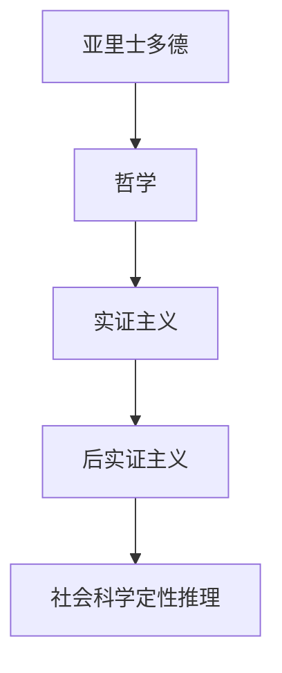

#### 1.2 定性推理在社会科学研究中的应用

定性推理广泛应用于社会科学各个领域，如社会学、心理学、教育学等。其主要应用包括现象学研究、案例研究、访谈研究、叙事研究等。

**核心概念与联系：**

应用领域：社会学、心理学、教育学等。

研究方法：现象学、案例研究、访谈研究、叙事研究等。

**Mermaid流程图：**

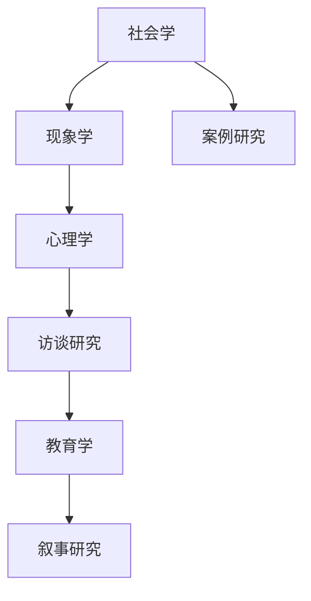

#### 1.3 定性推理的优势与局限

定性推理具有以下优势：灵活性强、深入挖掘现象本质、有利于提出新的理论框架。然而，定性推理也存在局限，如主观性强、难以量化、结论难以复制等。

**核心概念与联系：**

优势：灵活性、深入挖掘、新理论框架。

局限：主观性、难以量化、结论难以复制。

**Mermaid流程图：**

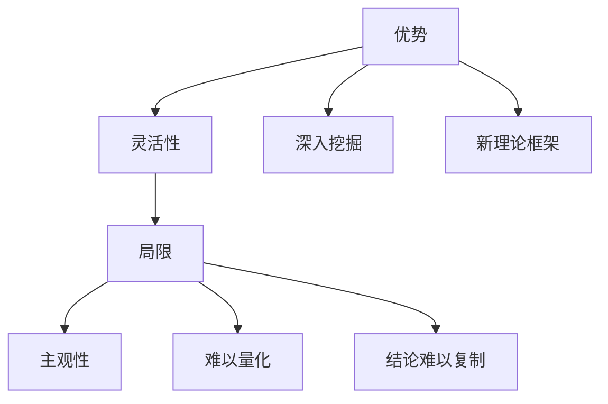

### 第2章：大模型技术基础

#### 2.1 大模型的基本原理

大模型是指具有数十亿甚至千亿参数的深度学习模型，如GPT、BERT等。其基本原理是基于大规模语料库进行预训练，从而学习到语言的一般规律和知识。

**核心概念与联系：**

原理：预训练、大规模语料库、参数学习。

**Mermaid流程图：**

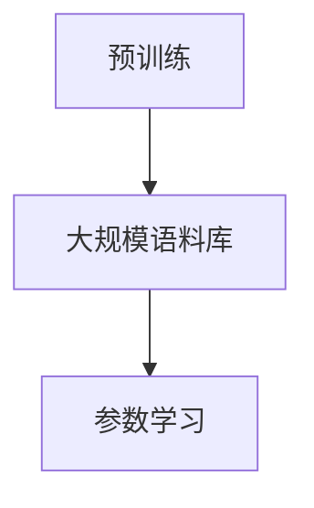

#### 2.2 大模型的发展历程

大模型的发展经历了从早期的神经网络到现代的Transformer架构的演变。近年来，随着计算能力和数据资源的提升，大模型的参数规模和性能不断提升。

**核心概念与联系：**

发展历程：神经网络、Transformer架构、计算能力提升、数据资源丰富。

**Mermaid流程图：**

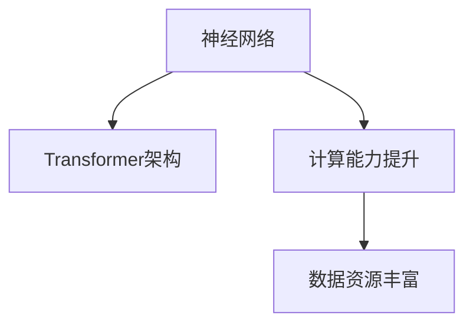

#### 2.3 大模型在社会科学研究中的潜力

大模型在社会科学研究中具有巨大的潜力，可以用于文本分析、社会网络分析、情感分析等领域。其强大的数据处理和分析能力有助于提高定性推理的效率和质量。

**核心概念与联系：**

潜力：文本分析、社会网络分析、情感分析、数据处理、分析能力。

**Mermaid流程图：**

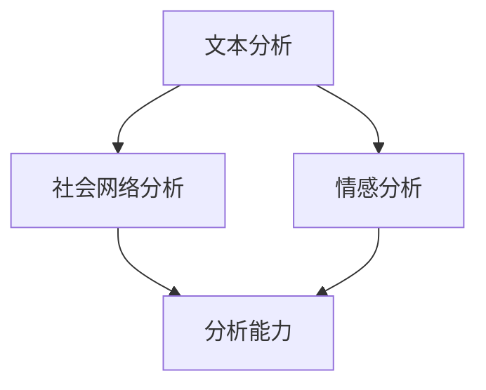

## 第二部分：大模型在定性推理中的应用

### 第3章：文本分析

文本分析是定性推理的重要工具，大模型在文本分析中的应用显著提高了数据分析的效率和准确性。

#### 3.1 文本分析的基本概念

文本分析是指对文本数据进行分析和处理的过程，旨在提取有用信息、发现潜在模式和关系。文本分析的基本概念包括文本预处理、词频统计、主题建模、情感分析等。

**核心概念与联系：**

基本概念：文本预处理、词频统计、主题建模、情感分析。

**Mermaid流程图：**

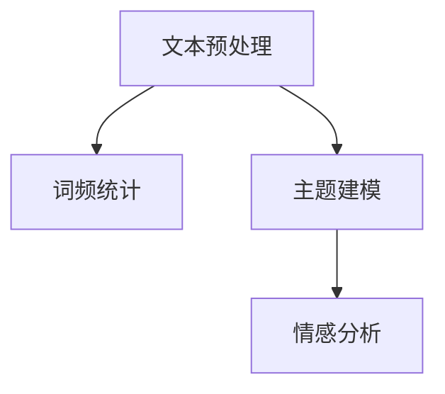

#### 3.2 大模型在文本分析中的应用

大模型在文本分析中的应用主要包括语言模型、文本分类、情感分析等。通过预训练，大模型能够自动捕捉语言中的复杂模式和规律，从而实现高效的数据处理和分析。

**核心概念与联系：**

应用：语言模型、文本分类、情感分析。

**Mermaid流程图：**

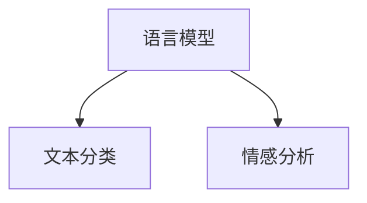

#### 3.3 文本分析案例解析

以一个社交媒体文本分析案例为例，大模型可以用于提取用户情感、识别热门话题、分析用户行为等。通过具体案例分析，我们可以更好地理解大模型在文本分析中的应用价值。

**核心概念与联系：**

案例：社交媒体文本分析、用户情感提取、热门话题识别、用户行为分析。

**Mermaid流程图：**

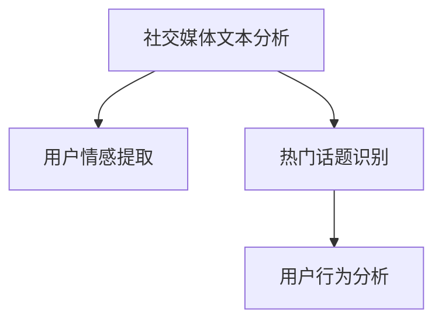

### 第4章：社会网络分析

社会网络分析是定性推理的重要工具，大模型在社会网络分析中的应用有助于揭示社会网络的内在结构和关系。

#### 4.1 社会网络分析的基本概念

社会网络分析是指对社会网络中的个体、关系和结构进行分析的过程。基本概念包括节点、边、网络密度、中心性等。

**核心概念与联系：**

基本概念：节点、边、网络密度、中心性。

**Mermaid流程图：**

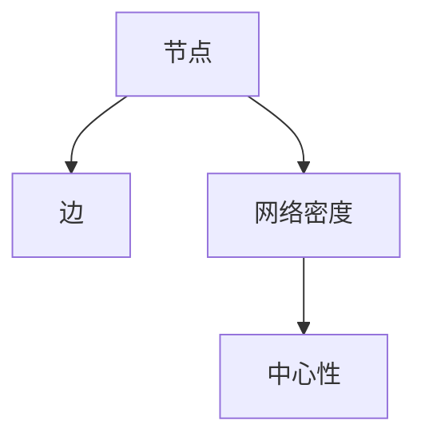

#### 4.2 大模型在社会网络分析中的应用

大模型在社会网络分析中的应用主要包括网络建模、节点分类、关系预测等。通过预训练，大模型能够自动捕捉社会网络的复杂模式和规律，从而实现高效的网络分析。

**核心概念与联系：**

应用：网络建模、节点分类、关系预测。

**Mermaid流程图：**

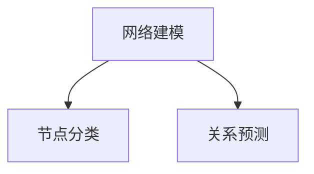

#### 4.3 社会网络分析案例解析

以一个社交媒体网络分析案例为例，大模型可以用于识别关键节点、预测社交关系、分析网络结构等。通过具体案例分析，我们可以更好地理解大模型在社会网络分析中的应用价值。

**核心概念与联系：**

案例：社交媒体网络分析、关键节点识别、社交关系预测、网络结构分析。

**Mermaid流程图：**

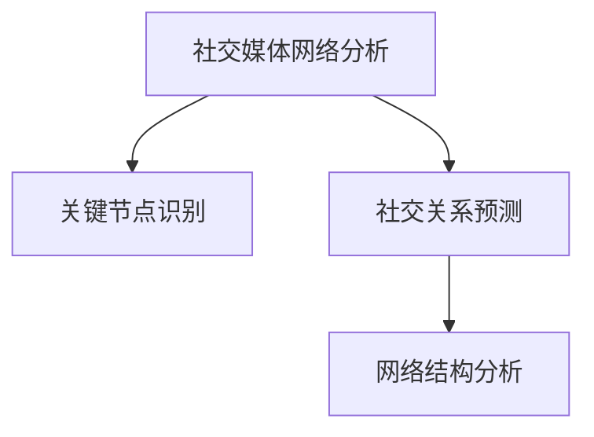

### 第5章：情感分析

情感分析是定性推理的重要工具，大模型在情感分析中的应用有助于提高情感识别的准确性和效率。

#### 5.1 情感分析的基本概念

情感分析是指对文本中的情感倾向和情感极性进行分析的过程。基本概念包括情感极性（正面、负面、中性）、情感强度等。

**核心概念与联系：**

基本概念：情感极性、情感强度。

**Mermaid流程图：**

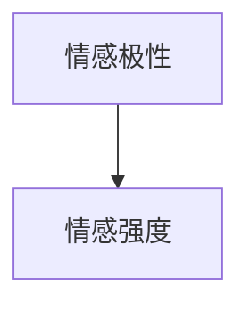

#### 5.2 大模型在情感分析中的应用

大模型在情感分析中的应用主要包括情感分类、情感极性标注、情感强度预测等。通过预训练，大模型能够自动捕捉文本中的情感模式和规律，从而实现高效的情感分析。

**核心概念与联系：**

应用：情感分类、情感极性标注、情感强度预测。

**Mermaid流程图：**

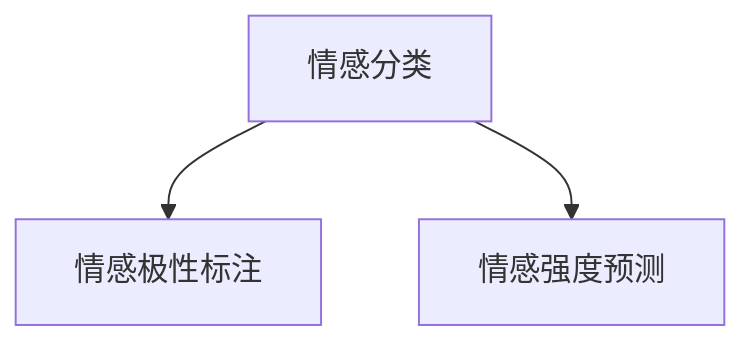

#### 5.3 情感分析案例解析

以一个社交媒体情感分析案例为例，大模型可以用于分析用户情感、预测用户情绪、识别潜在问题等。通过具体案例分析，我们可以更好地理解大模型在情感分析中的应用价值。

**核心概念与联系：**

案例：社交媒体情感分析、用户情感分析、用户情绪预测、潜在问题识别。

**Mermaid流程图：**

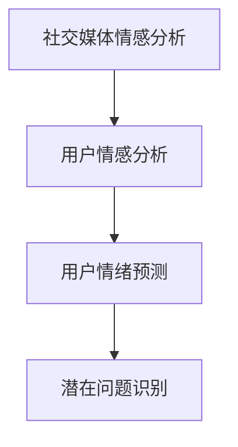

## 第三部分：大模型在社会科学定性推理中的挑战与未来

### 第6章：大模型在定性推理中的挑战

大模型在社会科学定性推理中的应用虽然带来了许多优势，但也面临一些挑战，如数据质量问题、模型解释性问题、道德与伦理问题等。

#### 6.1 数据质量问题

数据质量是影响大模型应用效果的关键因素。数据质量问题可能导致模型性能下降、分析结果偏差等。因此，确保数据质量是应用大模型进行社会科学定性推理的重要前提。

**核心概念与联系：**

挑战：数据质量问题、模型性能下降、分析结果偏差。

**Mermaid流程图：**

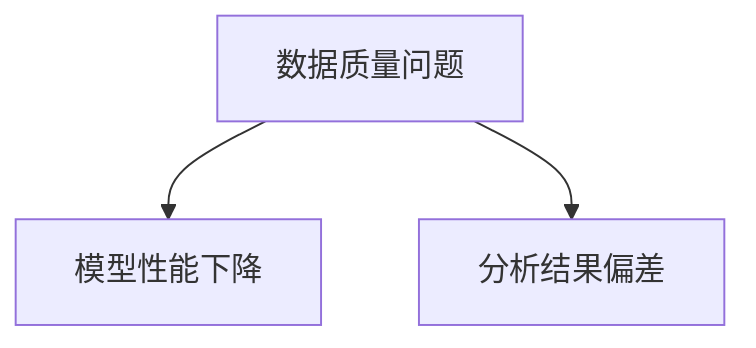

#### 6.2 模型解释性问题

大模型在定性推理中的应用往往缺乏透明性和可解释性，这使得研究人员难以理解模型的决策过程和结论。因此，提高模型的可解释性是应用大模型进行社会科学定性推理的重要挑战。

**核心概念与联系：**

挑战：模型解释性问题、透明性、可解释性。

**Mermaid流程图：**

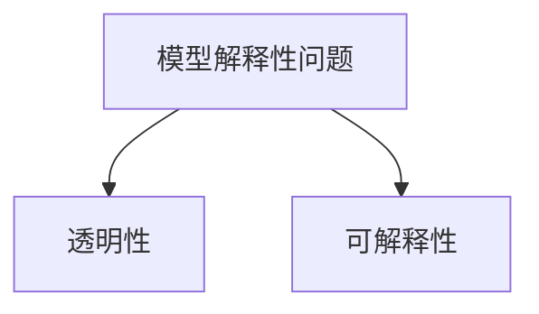

#### 6.3 道德与伦理问题

大模型在社会科学定性推理中的应用可能涉及敏感数据和个人隐私。因此，确保道德与伦理问题是应用大模型进行社会科学定性推理的重要挑战。

**核心概念与联系：**

挑战：道德与伦理问题、敏感数据、个人隐私。

**Mermaid流程图：**

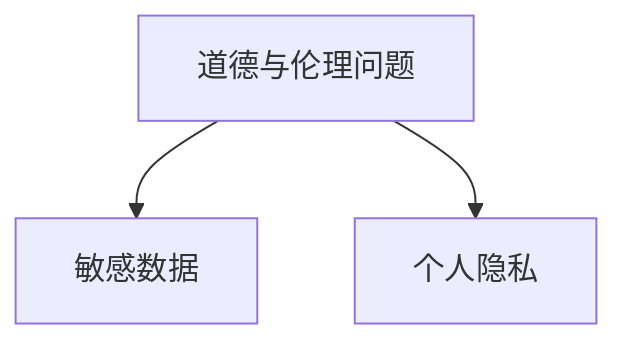

### 第7章：大模型在社会科学定性推理中的未来趋势

尽管大模型在社会科学定性推理中面临诸多挑战，但其未来发展趋势依然乐观。未来，大模型在社会科学定性推理中的应用将更加广泛，新技术的应用和跨学科研究的发展将不断推动其进步。

#### 7.1 新技术的应用

未来，大模型将结合更多新技术，如生成对抗网络（GAN）、强化学习等，以提高其性能和可解释性。

**核心概念与联系：**

新技术：生成对抗网络、强化学习。

**Mermaid流程图：**

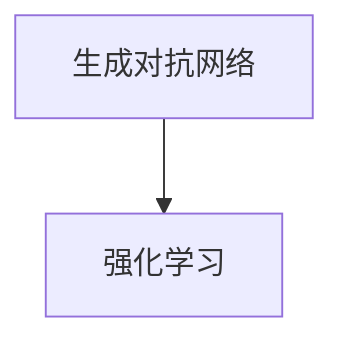

#### 7.2 跨学科研究的发展

未来，大模型在社会科学定性推理中的应用将与其他学科，如心理学、社会学、经济学等紧密结合，形成跨学科研究的新范式。

**核心概念与联系：**

跨学科研究：心理学、社会学、经济学。

**Mermaid流程图：**

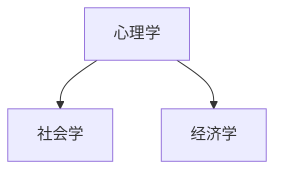

#### 7.3 未来研究方向与挑战

未来，大模型在社会科学定性推理中的研究方向包括模型可解释性、隐私保护、跨学科应用等。同时，面临的挑战也日益严峻，需要研究人员持续探索和解决。

**核心概念与联系：**

研究方向：模型可解释性、隐私保护、跨学科应用。

**Mermaid流程图：**

```mermaid
graph TD
A[模型可解释性] --> B[隐私保护]
A --> C[跨学科应用]
```

## 附录

### 附录A：大模型相关工具与资源

为了更好地应用大模型进行社会科学定性推理，研究人员可以参考以下工具与资源：

#### A.1 大模型开发工具

- TensorFlow：一个开源的机器学习框架，支持大模型的开发与训练。

- PyTorch：一个开源的机器学习库，支持动态计算图，方便大模型的开发。

#### A.2 大模型数据集

- Common Crawl：一个包含大量网页文本的数据集，可用于大模型的预训练。

- IMDb Movie Reviews：一个包含电影评论的数据集，可用于情感分析。

#### A.3 大模型研究论文与报告

- “Bert: Pre-training of deep bidirectional transformers for language understanding”：一篇关于BERT模型的开创性论文。

- “Transformers: State-of-the-art models for natural language processing”：一篇关于Transformer模型的综述性论文。

## 作者信息

**作者：** AI天才研究院/AI Genius Institute & 禅与计算机程序设计艺术 /Zen And The Art of Computer Programming

本文旨在探讨大模型在社会科学定性推理中的应用及其表现，为研究人员提供理论指导和实践参考。通过分析大模型的技术基础、应用案例和面临的挑战，我们揭示了其在社会科学研究中的巨大潜力与局限。未来，大模型在社会科学定性推理中的应用将不断拓展，新技术的应用和跨学科研究的发展将为这一领域带来更多创新和突破。

## 结语

大模型在社会科学定性推理中的应用虽然面临诸多挑战，但其潜力不容忽视。通过本文的分析，我们希望为研究人员提供一种全新的视角和思考方式，以推动大模型在社会科学领域的应用和发展。同时，我们也期待未来有更多研究成果和实践案例，为大模型在社会科学定性推理中的应用提供有力支持。

## 参考文献

1. Devlin, J., Chang, M. W., Lee, K., & Toutanova, K. (2019). BERT: Pre-training of deep bidirectional transformers for language understanding. In Proceedings of the 2019 Conference of the North American Chapter of the Association for Computational Linguistics: Human Language Technologies, Volume 1 (Long and Short Papers) (pp. 4171-4186). Association for Computational Linguistics.
2. Vaswani, A., Shazeer, N., Parmar, N., Uszkoreit, J., Jones, L., Gomez, A. N., ... & Polosukhin, I. (2017). Attention is all you need. In Advances in neural information processing systems (pp. 5998-6008).
3. LeCun, Y., Bengio, Y., & Hinton, G. (2015). Deep learning. Nature, 521(7553), 436-444.

