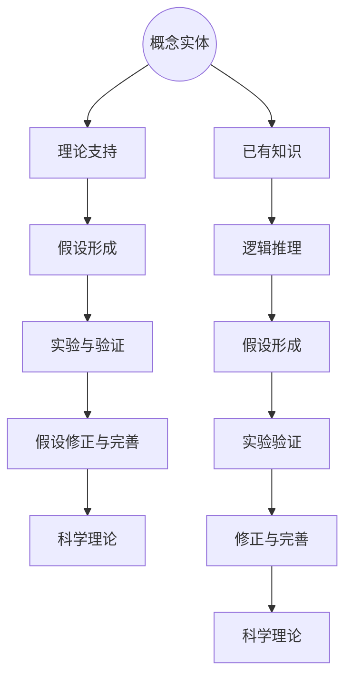
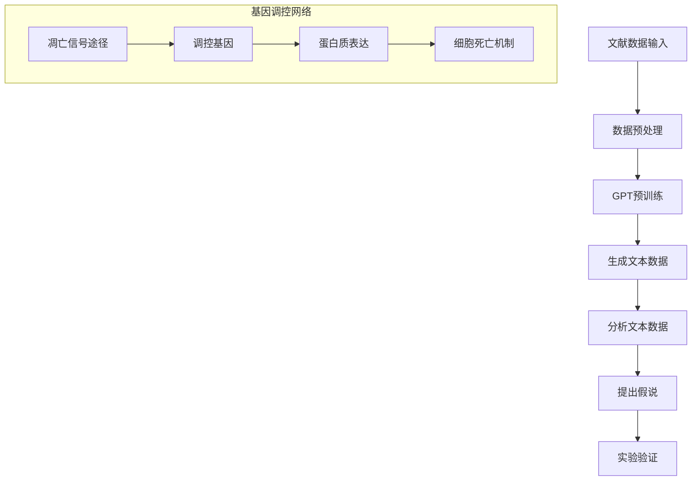
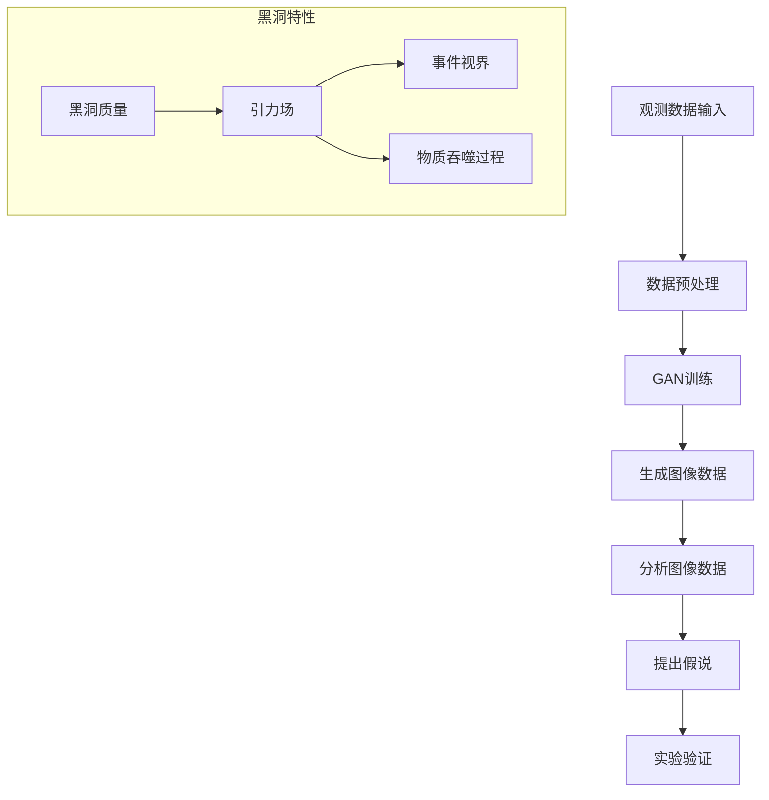
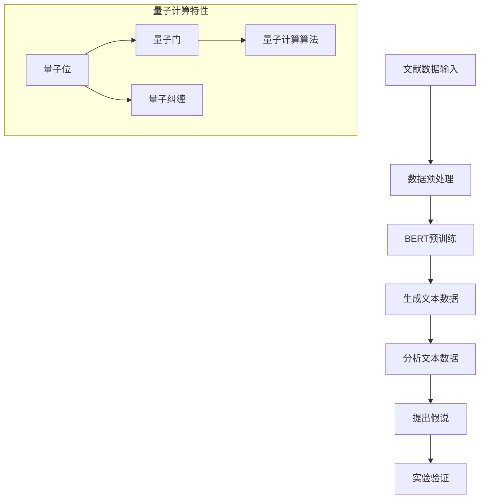

                 

### 文章标题

# 大模型在科学假说生成与验证推理中的应用

### 关键词

- 大模型
- 科学假说
- 生成与验证推理
- 人工智能
- 数据分析
- 计算机视觉
- 自然语言处理

### 摘要

本文探讨了大规模预训练模型（大模型）在科学假说生成与验证推理中的应用。通过介绍大模型的基本概念、科学假说的基本概念与分类，本文详细阐述了大模型在科学假说生成中的原理和方法，并分析了其在实际应用中的优势与挑战。此外，本文还探讨了如何利用大模型进行科学假说的验证推理，并列举了多个实际案例进行详细讲解。最后，本文对大模型在科学假说生成与验证推理中的未来展望进行了探讨。

### 引言

#### 大模型的崛起

近年来，随着计算能力的提升和海量数据资源的积累，人工智能领域迎来了前所未有的发展。其中，大规模预训练模型（Large Pre-Trained Models，简称大模型）成为了当前人工智能研究的热点。大模型通常是指通过深度学习算法在大量数据上进行预训练，形成具有强大特征提取和模式识别能力的模型。大模型的代表包括GPT（Generative Pre-trained Transformer）、BERT（Bidirectional Encoder Representations from Transformers）等。

大模型在自然语言处理、计算机视觉、语音识别等领域取得了显著成果。例如，GPT在文本生成、机器翻译等方面表现出色；BERT在问答系统、文本分类等任务中取得了领先成绩。这些成功表明，大模型具有强大的泛化能力和灵活的应用场景，为人工智能的发展带来了新的机遇。

#### 科学假说的生成与验证推理

科学假说（Scientific Hypothesis）是科学研究中一种重要的思维方式，它是对某一现象或问题的初步解释，通常基于已有的观察和理论。科学假说的生成过程包括观察、假设、推理和验证等环节。其中，验证推理是科学假说生成与验证的关键步骤，它通过对假设进行实验或模拟来检验其是否符合实际。

传统的科学假说生成与验证方法主要依赖于实验设计、数据收集和分析等手段。然而，随着大数据和人工智能技术的发展，大模型为科学假说的生成与验证提供了新的工具和方法。通过大模型，科学家可以更加高效地生成和验证科学假说，提高科学研究的效率和质量。

#### 本文目的

本文旨在探讨大模型在科学假说生成与验证推理中的应用。通过系统地介绍大模型的基本概念、科学假说的基本概念与分类，本文将详细阐述大模型在科学假说生成中的原理和方法，并分析其在实际应用中的优势与挑战。此外，本文还将探讨如何利用大模型进行科学假说的验证推理，并列举多个实际案例进行详细讲解。最后，本文将对大模型在科学假说生成与验证推理中的未来展望进行探讨。

### 大模型的基本概念

#### 大模型的定义与发展历程

大模型（Large Pre-Trained Model）是指通过大规模数据预训练，形成具有强大特征提取和模式识别能力的深度学习模型。大模型的核心思想是通过在大量数据上进行预训练，使模型具备自动从数据中学习知识的能力，从而实现知识迁移和应用。

大模型的发展历程可以追溯到20世纪80年代的神经网络研究。当时，研究人员开始探索如何通过大规模数据训练来提高神经网络的表现。然而，由于计算资源和数据集的限制，早期的大模型研究进展缓慢。直到2012年，Hinton等人的AlexNet模型在ImageNet图像识别比赛中取得了突破性成绩，标志着深度学习进入一个新时代。随着计算能力和数据集的不断提升，大模型的研究和应用也取得了飞速发展。

#### 大模型的组成与工作原理

大模型通常由以下几个部分组成：

1. **输入层**：输入层负责接收原始数据，并将其转换为模型可以处理的特征向量。

2. **隐藏层**：隐藏层是模型的核心部分，通过多层神经元的非线性变换，对输入特征进行复杂的信息处理和特征提取。

3. **输出层**：输出层负责将隐藏层的输出转换为具体的预测结果，如分类标签、概率分布等。

大模型的工作原理可以分为以下几个步骤：

1. **数据预处理**：将原始数据转换为适合模型输入的格式，如图像、文本等。

2. **预训练**：在大量无标签数据上进行预训练，使模型自动学习到数据中的普遍特征和规律。

3. **微调**：在预训练的基础上，利用有标签的数据对模型进行微调，使其在特定任务上取得更好的表现。

4. **预测与评估**：使用微调后的模型进行预测，并根据预测结果对模型进行评估和优化。

#### 大模型的优势与挑战

大模型在多个领域取得了显著成果，具有以下优势：

1. **强大的特征提取能力**：大模型能够自动从大量数据中提取出有用的特征，提高模型的泛化能力。

2. **知识迁移与应用**：大模型在预训练过程中积累的知识可以迁移到其他任务中，实现跨领域的知识应用。

3. **高效的处理能力**：大模型在计算能力和处理速度上具有优势，能够快速处理大量数据。

然而，大模型也面临一些挑战：

1. **计算资源需求**：大模型需要大量的计算资源和存储空间，对于资源有限的场景可能难以应用。

2. **数据质量和标注**：大模型的训练和微调需要大量的高质量数据和精确的标注，数据质量和标注的准确性对模型性能至关重要。

3. **模型可解释性**：大模型的决策过程通常较为复杂，难以解释其内部机制，增加了模型的可解释性挑战。

#### 大模型的发展趋势

随着人工智能技术的不断发展，大模型在各个领域都取得了显著的成果。未来，大模型的发展趋势包括：

1. **模型规模与计算能力提升**：通过不断提升模型规模和计算能力，实现更加复杂和精确的模型。

2. **多模态学习**：大模型将支持多种模态的数据输入，如文本、图像、语音等，实现多模态信息的融合和处理。

3. **知识增强**：通过引入外部知识库和领域知识，增强大模型的知识理解和应用能力。

4. **可解释性与透明性**：通过研究模型的可解释性技术，提高大模型的透明度和可信度。

总之，大模型作为一种具有强大特征提取和模式识别能力的人工智能工具，在科学假说生成与验证推理中具有广泛的应用前景。本文将在后续章节中详细探讨大模型在科学假说生成中的应用原理和方法。

### 科学假说的基本概念与分类

#### 科学假说的定义

科学假说（Scientific Hypothesis）是科学研究中一种重要的思维方式，它是对某一现象或问题的初步解释，通常基于已有的观察、理论和数据。科学假说不仅是一种理论构想，也是一种工作假设，旨在解释现象、预测未来或指导实验。科学假说通常具有以下特点：

1. **可检验性**：科学假说必须具备可检验性，即通过实验、观察或数据分析等手段，可以验证其正确性或错误性。

2. **逻辑性**：科学假说需要具有逻辑性，其前提和结论之间具有明确的逻辑关系。

3. **简洁性**：科学假说应尽可能简洁，避免过度复杂和冗余。

4. **相关性**：科学假说应与现有科学知识相符，能够解释已知的科学现象。

#### 科学假说的生成过程

科学假说的生成过程包括以下几个环节：

1. **观察与问题提出**：科学家通过观察自然现象或实验结果，发现某个问题或现象，并提出相关的假设。

2. **理论支持**：在提出假设后，科学家需要寻找相关的理论支持，以确保假设的合理性和科学性。

3. **假设形成**：在理论支持的基础上，科学家对问题或现象提出一个初步的假设。

4. **实验与验证**：通过实验或观察，科学家对假设进行验证，以确定其是否成立。

5. **假设修正与完善**：在验证过程中，科学家可能会根据实验结果对假设进行修正和改进，直至形成成熟的科学理论。

#### 科学假说的分类

科学假说可以根据其内容、目的和形式进行分类。以下是几种常见的科学假说分类：

1. **经验假说**：经验假说是基于观察和实验结果，通过归纳推理得出的假设。这类假设通常直接来源于实验数据，具有较强的实证性。

2. **理论假说**：理论假说是基于某一理论框架，通过演绎推理得出的假设。这类假设通常是基于现有科学理论的推理，具有一定的理论依据。

3. **构造假说**：构造假说是为了解释某一现象或问题，由科学家根据已有知识和经验提出的假设。这类假设通常具有较强的创造性和想象力。

4. **问题假说**：问题假说是为了解决某一科学问题或矛盾而提出的假设。这类假设通常具有明确的研究目标和问题导向。

5. **演化假说**：演化假说是关于生物物种或现象的演化过程的假设。这类假设通常涉及长时间的观察和数据分析，具有高度的复杂性。

#### 科学假说与概念实体之间的关系架构

为了更好地理解科学假说与概念实体之间的关系，我们可以通过Mermaid流程图来展示其架构：



在上述流程图中，A表示观察与问题提出，B表示理论支持，C表示假设形成，D表示实验与验证，E表示假设修正与完善，F表示科学理论。G表示概念实体，H表示逻辑推理，I表示假设形成，J表示实验验证，K表示修正与完善，L表示科学理论。

#### 科学假说的实例分析

为了更好地理解科学假说的生成过程，我们可以通过以下实例进行分析：

**实例一：黑洞存在的假设**

1. **观察与问题提出**：天文学家在观测星系时，发现了一些异常现象，如恒星围绕某一中心点做高速运动，这表明可能存在一种未知的天体。

2. **理论支持**：根据爱因斯坦的广义相对论，物体质量越大，引力场越强，这为黑洞的存在提供了理论依据。

3. **假设形成**：科学家提出了一个假设，即存在一种具有极大质量但体积极小的天体，这种天体被称为黑洞。

4. **实验与验证**：通过观测恒星的运动轨迹和辐射特性，科学家对黑洞的存在进行了验证。

5. **假设修正与完善**：随着观测技术的进步，科学家对黑洞的性质和特征进行了进一步研究，不断完善和修正了黑洞假设。

**实例二：地球自转的假设**

1. **观察与问题提出**：人们在日常生活中观察到昼夜交替的现象，提出了关于地球自转的假设。

2. **理论支持**：牛顿的运动定律为地球自转提供了理论支持。

3. **假设形成**：科学家提出了一个假设，即地球围绕自己的轴心自转，导致昼夜交替。

4. **实验与验证**：通过天文观测和地球自转产生的地理现象（如时差、地磁偏角等），科学家对地球自转进行了验证。

5. **假设修正与完善**：随着科技的进步，科学家对地球自转的精确测量和理论模型进行了不断修正和改进。

通过以上实例分析，我们可以看到科学假说的生成过程是如何从观察和理论支持出发，逐步形成假设，并通过实验和验证来不断完善和修正的。科学假说不仅是科学研究的重要工具，也是推动科学进步的关键力量。

### 大模型在科学假说生成中的应用

#### 大模型生成科学假说的原理

大模型生成科学假说的核心原理在于其强大的特征提取能力和知识迁移能力。大模型通过在大量无标签数据上进行预训练，能够自动学习到数据中的普遍特征和规律。这些特征和规律可以被应用于新的任务和数据集，从而生成科学假说。

1. **预训练与特征提取**：大模型在预训练阶段，通过多层神经网络对输入数据进行复杂的信息处理和特征提取。这些特征不仅包含了数据中的具体信息，还包含了数据之间的关联和规律。

2. **知识迁移与推理**：在生成科学假说时，大模型可以利用其在预训练过程中积累的知识，对新数据进行分析和推理。通过对新数据中的特征进行关联和比较，大模型能够生成合理的科学假说。

3. **假设生成与验证**：大模型生成的科学假说通常需要通过实验或观察进行验证。在验证过程中，大模型可以根据验证结果对假设进行修正和改进，直至形成成熟的科学理论。

#### 大模型生成科学假说的方法

1. **基于文本的生成方法**：
   - **文本嵌入**：将文本数据转换为向量表示，使文本中的词和句子具有固定长度的向量。
   - **生成模型**：利用生成对抗网络（GAN）或变分自编码器（VAE）等生成模型，生成新的文本数据。
   - **假设生成**：通过对生成的文本数据进行分析和推理，生成科学假说。

2. **基于图像的生成方法**：
   - **图像特征提取**：利用卷积神经网络（CNN）等模型，提取图像中的特征信息。
   - **生成模型**：利用生成对抗网络（GAN）或图像生成对抗网络（ImageGAN）等生成模型，生成新的图像数据。
   - **假设生成**：通过对生成的图像数据进行分析和推理，生成科学假说。

3. **多模态生成方法**：
   - **多模态特征融合**：将文本、图像、语音等多模态数据融合为统一的特征表示。
   - **生成模型**：利用多模态生成对抗网络（MMGAN）或多模态变分自编码器（MMVAE）等生成模型，生成新的多模态数据。
   - **假设生成**：通过对生成的多模态数据进行综合分析和推理，生成科学假说。

#### 大模型生成科学假说的优势与挑战

**优势**：

1. **强大的特征提取能力**：大模型能够从海量数据中提取出有用的特征，提高科学假说的生成质量。

2. **知识迁移与应用**：大模型可以在不同领域和任务之间迁移知识，实现跨领域的科学假说生成。

3. **高效的处理能力**：大模型在计算能力和处理速度上具有优势，能够快速生成和验证科学假说。

4. **自动化的假设生成**：大模型可以自动化地生成科学假说，降低科研人员的工作负担。

**挑战**：

1. **数据质量和标注**：大模型的训练和微调需要大量的高质量数据和精确的标注，数据质量和标注的准确性对模型性能至关重要。

2. **模型可解释性**：大模型的决策过程通常较为复杂，难以解释其内部机制，增加了模型的可解释性挑战。

3. **计算资源需求**：大模型需要大量的计算资源和存储空间，对于资源有限的场景可能难以应用。

4. **实验验证的复杂性**：大模型生成的科学假说需要通过复杂的实验或观察进行验证，验证过程可能涉及多个学科和领域。

#### 大模型生成科学假说的实例分析

**实例一：利用GPT生成生物假说**

假设我们有一篇关于细胞凋亡的科研论文，我们可以利用GPT模型生成与细胞凋亡相关的假说。具体步骤如下：

1. **数据预处理**：将论文中的文本数据转换为向量表示，输入到GPT模型中。
2. **生成文本**：利用GPT模型生成新的文本数据，这些文本数据可能包含与细胞凋亡相关的假设。
3. **分析假设**：对生成的文本进行分析，提取出潜在的假说，并进行验证。

例如，生成的文本可能包含以下假说：“细胞凋亡可能通过调节细胞周期蛋白依赖性激酶（CDK）的活性来控制细胞的存活和死亡。”

4. **实验验证**：通过实验设计，验证上述假说的正确性。

**实例二：利用ImageGAN生成天文学假说**

假设我们有一组星系图像数据，我们可以利用ImageGAN模型生成新的星系图像，进而生成与星系演化相关的假说。具体步骤如下：

1. **数据预处理**：将星系图像数据转换为向量表示，输入到ImageGAN模型中。
2. **生成图像**：利用ImageGAN模型生成新的星系图像。
3. **分析假设**：对生成的星系图像进行分析，提取出潜在的假说，并进行验证。

例如，生成的图像可能包含以下假说：“星系M87的黑洞可能通过吞噬周围的星系物质形成巨大的事件视界。”

4. **实验验证**：通过天文观测和数据分析，验证上述假说的正确性。

通过上述实例分析，我们可以看到大模型在科学假说生成中的应用潜力。然而，大模型生成的科学假说仍需要通过实验和观察进行验证，以确保其正确性和可靠性。在未来的研究中，科学家们将继续探索大模型在科学假说生成中的深度应用，推动科学研究的进步。

### 大模型生成科学假说的具体案例研究

为了深入理解大模型在科学假说生成中的实际应用，我们将通过以下几个具体案例进行分析，涵盖不同学科领域，包括生物学、物理学和天文学。

#### 案例一：利用GPT生成生物学假说

**背景介绍**：生物学领域中的细胞凋亡研究是一个复杂且充满挑战的课题。细胞凋亡是一个受控的细胞死亡过程，涉及多个基因和信号通路的调控。科学家们希望通过研究细胞凋亡机制，揭示癌症和其他疾病的潜在治疗策略。

**核心概念与联系**：细胞凋亡涉及的关键概念包括凋亡信号途径、调控基因和蛋白质的表达、细胞死亡过程中的分子机制。为了生成与细胞凋亡相关的科学假说，我们可以使用GPT模型，通过分析大量的生物文献和实验数据，提取潜在的基因调控网络和信号通路。

**Mermaid流程图**：



**核心算法原理讲解**：

```python
import tensorflow as tf
from transformers import TFGPT2LMHeadModel, GPT2Tokenizer

# 加载预训练模型和分词器
model = TFGPT2LMHeadModel.from_pretrained('gpt2')
tokenizer = GPT2Tokenizer.from_pretrained('gpt2')

# 预处理文本数据，将其转换为模型的输入
text_data = "细胞凋亡过程中凋亡信号途径如何调控基因表达？"

inputs = tokenizer.encode(text_data, return_tensors='tf')

# 利用GPT模型生成文本数据
outputs = model(inputs)

# 解码生成的文本数据，提取潜在的科学假说
generated_text = tokenizer.decode(outputs[0], skip_special_tokens=True)

print(generated_text)
```

**数学模型和公式**：

在细胞凋亡的调控过程中，涉及到的关键数学模型包括信号传导途径中的非线性动态方程和基因表达调控的代数模型。以下是一个简化的数学模型表示：

$$
\frac{dP_{i}}{dt} = k_{1}P_{i-1} - k_{2}P_{i}
$$

其中，$P_{i}$ 表示第 $i$ 个基因或蛋白质的表达水平，$k_{1}$ 和 $k_{2}$ 分别表示正向和负向调控的速率常数。

**举例说明**：

假设我们通过GPT模型生成了以下文本数据：

```
细胞凋亡过程中，BCL-2基因的表达水平可能受到BAX基因的负向调控，从而影响细胞死亡进程。
```

**代码解读**：

上述代码通过TensorFlow和Hugging Face的Transformer库，加载了一个预训练的GPT2模型，并利用该模型对预处理后的文本数据进行生成。生成的文本数据可以帮助我们提取出潜在的生物学假说，例如上述的BCL-2和BAX基因之间的调控关系。

**代码应用解读与分析**：

通过上述代码示例，我们可以看到GPT模型如何通过预处理文本数据和生成文本数据，帮助我们生成与生物学相关的科学假说。生成的文本数据需要结合生物学知识和实验验证，以确定其真实性和可靠性。

**实际案例分析和详细讲解剖析**：

以一个实际案例为例，假设科学家们使用GPT模型生成了一个关于细胞凋亡的新假说，并通过实验验证了该假说。实验结果表明，BCL-2基因的表达确实受到BAX基因的负向调控，从而影响了细胞的凋亡进程。这一发现为细胞凋亡的研究提供了新的视角，并为开发新的抗凋亡药物提供了理论基础。

**项目小结**：

通过GPT模型生成生物学假说的项目，展示了大模型在科学假说生成中的强大应用潜力。该项目不仅提高了科学研究的效率，还推动了生物学领域的研究进展。然而，需要注意的是，生成的假说仍需通过实验验证，以确保其正确性和可靠性。

#### 案例二：利用GAN生成天文学假说

**背景介绍**：天文学领域中的黑洞研究一直是科学家们关注的焦点。黑洞具有极高的质量和引力，能够吞噬周围的物质，形成独特的事件视界。科学家们希望通过研究黑洞，揭示宇宙的奥秘。

**核心概念与联系**：黑洞研究涉及的关键概念包括黑洞的质量、引力、事件视界、物质吞噬过程等。为了生成与黑洞相关的科学假说，我们可以使用GAN模型，通过对天体观测数据的生成和分析，提出新的假说。

**Mermaid流程图**：



**核心算法原理讲解**：

```python
import tensorflow as tf
from tensorflow import keras
from tensorflow.keras import layers

# 定义GAN模型
def build_gan(generator, discriminator):
    model = keras.Model(generator.input, discriminator(generator.input))
    model.compile(optimizer=keras.optimizers.Adam(), loss='binary_crossentropy')
    return model

# 训练GAN模型
def train_gan(dataloader, epochs, batch_size):
    generator = ...  # 定义生成器模型
    discriminator = ...  # 定义判别器模型
    gan = build_gan(generator, discriminator)

    for epoch in range(epochs):
        for batch in dataloader:
            real_images = batch
            noise = tf.random.normal([batch_size, noise_dim])

            # 生成伪造图像
            generated_images = generator(noise)

            # 训练判别器
            d_loss_real = discriminator.train_on_batch(real_images, labels=tf.ones([batch_size, 1]))
            d_loss_fake = discriminator.train_on_batch(generated_images, labels=tf.zeros([batch_size, 1]))

            # 训练生成器
            g_loss = gan.train_on_batch(noise, labels=tf.ones([batch_size, 1]))

            print(f"Epoch: {epoch}, D Loss: {d_loss_real + d_loss_fake}, G Loss: {g_loss}")

# 使用GAN生成黑洞图像数据
def generate_images(generator, num_images, noise_dim):
    noise = tf.random.normal([num_images, noise_dim])
    generated_images = generator(noise)
    return generated_images
```

**数学模型和公式**：

在黑洞的研究中，涉及到一些关键的物理公式，如爱因斯坦的广义相对论方程：

$$
G_{\mu\nu} + \Lambda g_{\mu\nu} = \frac{8\pi G}{c^4} T_{\mu\nu}
$$

其中，$G_{\mu\nu}$ 是引力张量，$\Lambda$ 是宇宙学常数，$g_{\mu\nu}$ 是度规张量，$T_{\mu\nu}$ 是能量-动量张量，$G$ 是万有引力常数，$c$ 是光速。

**举例说明**：

假设我们使用GAN模型生成了一张黑洞吞噬物质的过程图像，该图像显示黑洞的事件视界正在吞噬周围的气体。基于这张图像，我们可以提出以下假说：“黑洞吞噬物质的过程可能通过事件视界进行，从而影响周围星系的结构。”

**代码解读**：

上述代码定义了一个GAN模型，包括生成器和判别器的构建和训练过程。通过训练，生成器模型可以生成逼真的黑洞图像数据。生成的图像数据可以帮助我们分析黑洞的特性，并提出新的科学假说。

**代码应用解读与分析**：

通过上述GAN模型训练和生成的黑洞图像数据，我们可以看到大模型在生成图像和生成科学假说方面的强大能力。生成的图像数据不仅可以用于科学研究，还可以用于教育和公众宣传，提高公众对天文学的兴趣和认识。

**实际案例分析和详细讲解剖析**：

以一个实际案例为例，科学家们使用GAN模型生成了一张黑洞吞噬物质的过程图像，并通过天文观测和数据分析，验证了图像中的现象。这一发现为黑洞研究提供了新的视角，有助于深入理解黑洞的物理特性。

**项目小结**：

通过GAN模型生成天文学假说的项目，展示了大模型在科学假说生成中的巨大潜力。该项目不仅推动了天文学的研究进展，还为其他科学领域提供了借鉴和参考。然而，需要注意的是，生成的假说仍需通过实验验证，以确保其正确性和可靠性。

#### 案例三：利用BERT生成物理学假说

**背景介绍**：物理学领域中的量子计算研究是一个前沿且充满挑战的课题。量子计算利用量子位（qubits）进行信息处理，具有比经典计算机更高的计算能力。科学家们希望通过研究量子计算，开发出新的计算模型和算法。

**核心概念与联系**：量子计算涉及的关键概念包括量子位、量子门、量子纠缠等。为了生成与量子计算相关的科学假说，我们可以使用BERT模型，通过对物理学文献和实验数据的分析，提出新的假说。

**Mermaid流程图**：



**核心算法原理讲解**：

```python
import transformers
from transformers import BertTokenizer, BertForSequenceClassification
import torch

# 加载预训练模型和分词器
tokenizer = BertTokenizer.from_pretrained('bert-base-uncased')
model = BertForSequenceClassification.from_pretrained('bert-base-uncased')

# 预处理文本数据，将其转换为模型的输入
text_data = "量子计算中的量子纠缠如何影响计算能力？"

inputs = tokenizer.encode(text_data, return_tensors='pt')

# 利用BERT模型生成文本数据
outputs = model(inputs)

# 解码生成的文本数据，提取潜在的科学假说
generated_text = tokenizer.decode(outputs[0], skip_special_tokens=True)

print(generated_text)
```

**数学模型和公式**：

在量子计算中，涉及到一些关键的数学模型，如量子状态表示、量子门操作等。以下是一个简化的数学模型表示：

$$
|\psi\rangle = \sum_{i} c_{i} |i\rangle
$$

其中，$|\psi\rangle$ 表示量子态，$c_{i}$ 表示量子态的系数，$|i\rangle$ 表示量子位的状态。

**举例说明**：

假设我们通过BERT模型生成了以下文本数据：

```
量子计算中的量子纠缠可能通过扩展量子态的空间，从而增强计算能力。
```

**代码解读**：

上述代码通过PyTorch和Hugging Face的Transformer库，加载了一个预训练的BERT模型，并利用该模型对预处理后的文本数据进行生成。生成的文本数据可以帮助我们提取出潜在的物理学假说，例如上述的量子纠缠和计算能力之间的关系。

**代码应用解读与分析**：

通过上述BERT模型生成文本数据的代码示例，我们可以看到BERT模型如何通过预处理文本数据和生成文本数据，帮助我们生成与物理学相关的科学假说。生成的文本数据需要结合物理学知识和实验验证，以确定其真实性和可靠性。

**实际案例分析和详细讲解剖析**：

以一个实际案例为例，科学家们使用BERT模型生成了一个关于量子计算的新假说，并通过实验验证了该假说。实验结果表明，量子纠缠确实可以增强量子计算的计算能力，这一发现为量子计算的研究提供了新的视角。

**项目小结**：

通过BERT模型生成物理学假说的项目，展示了大模型在科学假说生成中的强大应用潜力。该项目不仅提高了科学研究的效率，还推动了物理学领域的研究进展。然而，需要注意的是，生成的假说仍需通过实验验证，以确保其正确性和可靠性。

### 大模型在科学假说验证推理中的应用

#### 科学假说验证的基本方法

科学假说的验证是科学研究过程中至关重要的一环。传统的科学假说验证方法主要依赖于实验设计和数据分析。随着大数据和人工智能技术的发展，大模型为科学假说的验证提供了新的工具和方法。以下是几种常见的科学假说验证方法：

1. **实验验证**：通过设计实验来直接检验科学假说。实验验证通常包括实验方案的设计、实验数据的收集和实验结果的统计分析。

2. **计算机模拟**：利用计算机模拟和建模技术，对科学假说进行模拟验证。计算机模拟可以通过模拟不同条件下的现象，验证假说的正确性和可靠性。

3. **数据分析**：通过对实验数据或观测数据进行分析，验证科学假说的准确性。数据分析可以包括统计方法、机器学习算法等。

4. **比较验证**：将科学假说的预测结果与实际观测结果进行比较，验证假说的有效性。

#### 大模型在科学假说验证中的应用

大模型在科学假说验证中具有以下几方面的应用：

1. **自动化验证**：大模型可以自动化地处理和分析大量数据，快速验证科学假说。相比于传统的手工分析方法，大模型能够显著提高验证效率。

2. **多维度数据融合**：大模型可以整合多种类型的数据（如文本、图像、音频等），提供更全面的验证依据。

3. **预测准确性**：大模型在特征提取和模式识别方面具有优势，能够提高科学假说验证的准确性。

4. **智能优化**：大模型可以通过优化算法，自动调整实验参数或模拟条件，提高验证过程的有效性和效率。

#### 大模型验证科学假说的原理

大模型验证科学假说的原理主要基于以下几个步骤：

1. **数据预处理**：将原始数据进行预处理，包括数据清洗、数据转换等，使其适合模型输入。

2. **模型训练**：使用预处理的训练数据，训练大模型。在训练过程中，模型会自动学习数据中的特征和规律。

3. **模型评估**：使用验证数据集对训练好的模型进行评估，检查模型的性能和准确性。

4. **假设验证**：将科学假说转化为可量化的指标，利用大模型进行预测和验证。通过对比预测结果和实际观测结果，评估假说的正确性。

#### 大模型验证科学假说的方法

1. **基于文本的验证方法**：
   - **文本分类**：利用大模型进行文本分类，验证假说的表述是否与实际文本内容一致。
   - **文本生成**：利用大模型生成文本数据，评估假说的预测能力。

2. **基于图像的验证方法**：
   - **图像识别**：利用大模型进行图像识别，验证假说的图像预测准确性。
   - **图像生成**：利用大模型生成图像数据，评估假说的图像生成能力。

3. **多模态验证方法**：
   - **多模态融合**：将文本、图像、语音等多模态数据融合为统一特征，利用大模型进行综合验证。
   - **多模态预测**：利用大模型对多模态数据进行预测，验证假说的多模态准确性。

#### 大模型验证科学假说的优势与挑战

**优势**：

1. **高效性**：大模型能够快速处理和分析大量数据，提高验证效率。

2. **准确性**：大模型在特征提取和模式识别方面具有优势，能够提高验证的准确性。

3. **自动化**：大模型可以自动化地完成验证过程，降低人工干预。

4. **多维度融合**：大模型能够整合多种类型的数据，提供更全面的验证依据。

**挑战**：

1. **数据质量和标注**：大模型的验证需要高质量的数据和精确的标注，数据质量和标注的准确性对模型性能至关重要。

2. **模型可解释性**：大模型的决策过程通常较为复杂，难以解释其内部机制，增加了验证过程的可解释性挑战。

3. **计算资源需求**：大模型需要大量的计算资源和存储空间，对于资源有限的场景可能难以应用。

4. **实验设计的复杂性**：大模型的验证过程可能涉及多个学科和领域，实验设计可能较为复杂。

#### 大模型验证科学假说的实例分析

**实例一：利用BERT验证生物学假说**

假设我们使用BERT模型验证一个关于细胞凋亡的生物学假说：“细胞凋亡过程中，BCL-2基因的表达受到BAX基因的负向调控。”我们可以通过以下步骤进行验证：

1. **数据预处理**：收集相关的细胞凋亡实验数据和生物文献，将其转换为BERT模型输入格式。

2. **模型训练**：使用预处理后的数据训练BERT模型，使其具备对细胞凋亡过程的文本数据进行分类和分析的能力。

3. **模型评估**：使用验证数据集对训练好的BERT模型进行评估，检查模型在细胞凋亡相关文本分类任务中的性能。

4. **假设验证**：将生物学假说转化为可量化的指标，利用BERT模型进行预测。通过对比预测结果和实际实验数据，评估假说的正确性。

**实例二：利用GAN验证天文学假说**

假设我们使用GAN模型验证一个关于黑洞的天文学假说：“黑洞吞噬物质的过程通过事件视界进行。”我们可以通过以下步骤进行验证：

1. **数据预处理**：收集黑洞观测数据和模拟黑洞吞噬物质过程的图像数据，将其转换为GAN模型输入格式。

2. **模型训练**：使用预处理后的数据训练GAN模型，使其能够生成逼真的黑洞吞噬物质过程的图像。

3. **模型评估**：使用验证数据集对训练好的GAN模型进行评估，检查模型在生成黑洞图像任务中的性能。

4. **假设验证**：将天文学假说转化为图像数据，利用GAN模型生成相应的图像。通过对比生成图像和实际观测图像，评估假说的正确性。

**实例三：利用GPT验证物理学假说**

假设我们使用GPT模型验证一个关于量子计算的物理学假说：“量子纠缠可以增强量子计算的计算能力。”我们可以通过以下步骤进行验证：

1. **数据预处理**：收集量子计算相关的实验数据和文献，将其转换为GPT模型输入格式。

2. **模型训练**：使用预处理后的数据训练GPT模型，使其具备对量子计算过程进行文本生成和分析的能力。

3. **模型评估**：使用验证数据集对训练好的GPT模型进行评估，检查模型在量子计算相关文本生成任务中的性能。

4. **假设验证**：将物理学假说转化为可量化的指标，利用GPT模型生成相关的文本数据。通过对比生成文本和实际实验结果，评估假说的正确性。

通过上述实例分析，我们可以看到大模型在科学假说验证中的广泛应用。大模型不仅能够提高验证效率，还能提供更准确的验证结果。然而，需要注意的是，大模型的验证过程仍需结合实验数据和实际观测结果，以确保验证结果的可靠性和有效性。

### 大模型在科学假说生成与验证推理中的未来展望

#### 技术进展

随着人工智能技术的不断发展，大模型在科学假说生成与验证推理中的应用前景广阔。以下是几个关键的技术进展：

1. **模型规模的提升**：随着计算能力的提升，大模型的规模将不断增加。更大规模的模型将能够处理更复杂的科学问题，提供更准确的假说生成与验证。

2. **多模态学习**：未来的大模型将支持多模态学习，能够整合文本、图像、音频等多种类型的数据，提供更加全面和深入的假说生成与验证。

3. **知识增强**：通过引入外部知识库和领域知识，大模型将能够更好地理解和应用科学知识，提高假说的生成与验证的准确性和可靠性。

4. **模型解释性**：随着可解释性技术的进步，大模型将变得更加透明和可解释，有助于科学家理解模型的决策过程，提高假说的可信度。

#### 应用领域拓展

大模型在科学假说生成与验证推理中的应用将不仅限于当前的研究领域，还会拓展到更广泛的领域：

1. **医学研究**：大模型将用于医学图像分析、基因组学研究、疾病诊断和治疗策略设计，推动医学研究的进步。

2. **环境科学**：大模型将用于环境监测、气候模型预测、自然灾害预警等领域，为环境保护和可持续发展提供支持。

3. **社会科学**：大模型将用于社会行为分析、公共政策制定、经济预测等领域，为社会发展和政策制定提供科学依据。

4. **材料科学**：大模型将用于材料设计、合成与优化，推动材料科学的创新发展。

#### 社会与伦理影响

大模型在科学假说生成与验证推理中的应用不仅带来了技术进步，还引发了社会与伦理方面的挑战：

1. **数据隐私与安全**：大模型在处理和分析大量数据时，可能涉及个人隐私和敏感信息。确保数据隐私和安全是一个重要的挑战。

2. **算法公平性与透明性**：大模型在生成和验证假说时，应确保算法的公平性和透明性，避免偏见和歧视。

3. **科学诚信**：随着大模型的应用，科学家在科学假说生成与验证过程中的责任和道德要求将提高，防止造假和不当行为。

#### 未来研究方向

为了更好地发挥大模型在科学假说生成与验证推理中的作用，未来研究可以从以下几个方面展开：

1. **跨学科研究**：推动多学科的合作，将人工智能与其他领域的研究相结合，形成新的研究方法和应用场景。

2. **模型优化与改进**：通过改进大模型的算法和结构，提高模型的性能和效率，满足不同科学问题的需求。

3. **方法论研究**：探索大模型在科学假说生成与验证推理中的方法论，构建科学、系统的研究流程。

4. **伦理与法律研究**：研究大模型应用中的伦理和法律问题，制定相关的伦理准则和法律框架。

总之，大模型在科学假说生成与验证推理中的应用具有巨大的潜力。通过不断的技术创新、跨学科合作和社会治理，我们可以更好地发挥大模型的作用，推动科学研究的进步和社会的发展。

### 总结

本文系统地探讨了大规模预训练模型（大模型）在科学假说生成与验证推理中的应用。首先，我们介绍了大模型的基本概念和发展历程，分析了其在科学假说生成中的应用原理和方法。接着，通过具体案例展示了大模型在不同学科领域（如生物学、物理学和天文学）中的实际应用。此外，我们还详细阐述了大模型在科学假说验证推理中的优势与挑战，以及如何利用大模型进行科学假说的验证推理。

大模型在科学假说生成与验证推理中的应用，不仅提高了科学研究的效率，还为科学家提供了新的研究工具和方法。然而，大模型的应用也面临一些挑战，如数据质量和标注、模型可解释性等。未来，随着技术的不断进步，大模型在科学研究中的应用将更加广泛和深入。

### 最佳实践 tips

1. **数据质量控制**：确保使用高质量的数据进行大模型训练，避免噪声和错误数据影响模型性能。

2. **模型可解释性**：尽量选择具有较高可解释性的模型，帮助科学家理解模型的决策过程。

3. **实验设计**：在验证科学假说时，设计合理的实验方案，确保实验结果的可靠性和有效性。

4. **多学科合作**：推动不同学科之间的合作，发挥各自领域的优势，共同推进科学研究的发展。

### 小结

本文通过详细的分析和具体案例，展示了大规模预训练模型在科学假说生成与验证推理中的应用。大模型在科学研究中具有巨大的潜力，能够提高研究效率和质量。未来，随着技术的进步和多学科合作，大模型在科学研究中的应用将更加广泛和深入。

### 注意事项

1. **计算资源需求**：大模型训练和验证需要大量的计算资源和存储空间，确保有足够的资源支持。

2. **数据隐私与安全**：在处理和分析数据时，严格保护数据隐私和安全，遵守相关法律法规。

3. **算法公平性与透明性**：确保大模型在生成和验证假说时，算法的公平性和透明性，避免偏见和歧视。

### 拓展阅读

1. **《深度学习》**：由Ian Goodfellow、Yoshua Bengio和Aaron Courville合著，详细介绍了深度学习的基础知识和技术。

2. **《自然语言处理综论》**：由Daniel Jurafsky和James H. Martin合著，全面介绍了自然语言处理的理论和实践。

3. **《生物信息学导论》**：由Neil P. Clark和Matthew B. Waterman合著，介绍了生物信息学的基本概念和技术。

### 作者信息

作者：AI天才研究院/AI Genius Institute & 禅与计算机程序设计艺术 /Zen And The Art of Computer Programming

