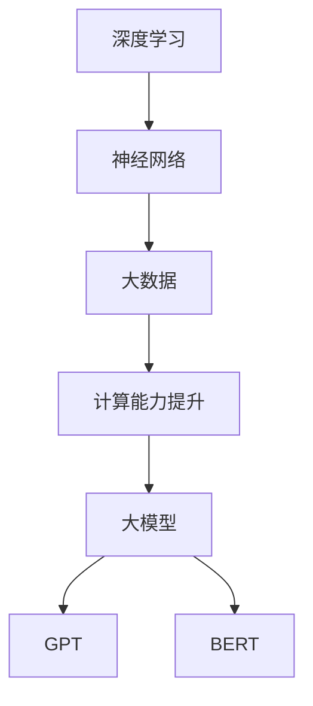
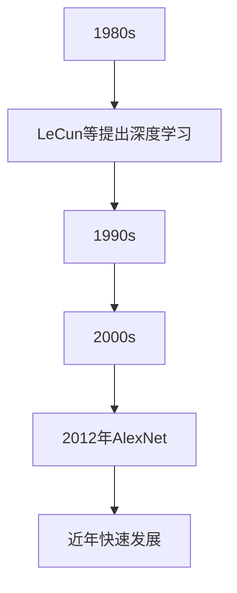
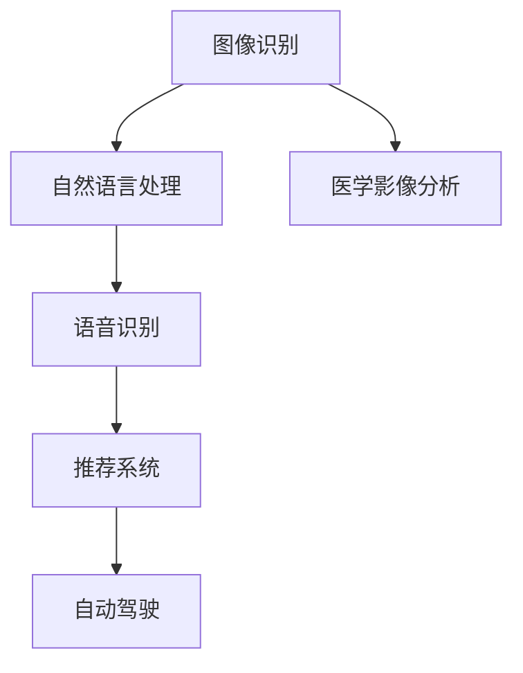
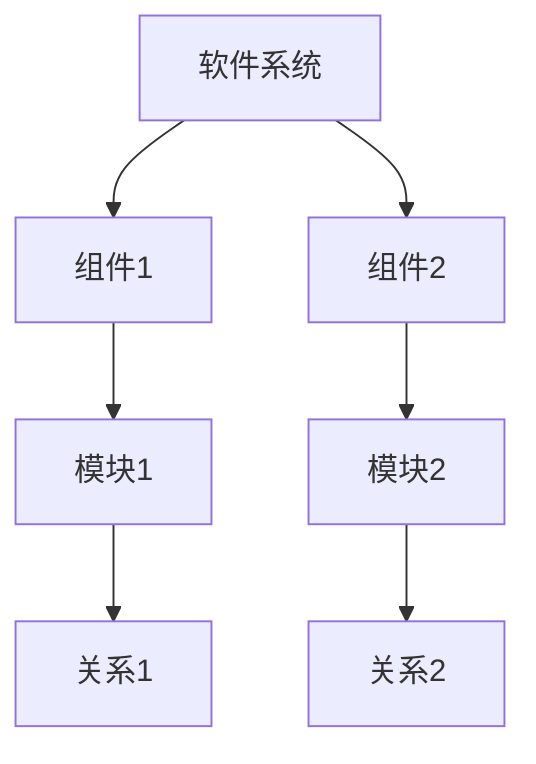
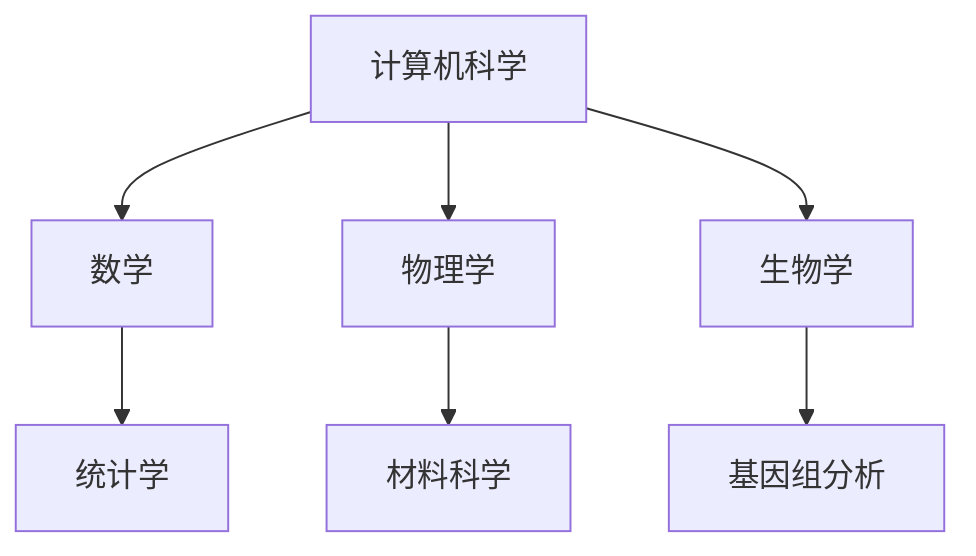

                 

### 1.1 大模型的背景与兴起

#### 1.1.1 大模型的概念

大模型（Large Models），通常指的是那些拥有数亿至数万亿参数的深度学习模型。这些模型得益于近年来计算能力的提升和海量数据资源的积累，能够在各个领域实现前所未有的表现。大模型的概念起源于深度学习的兴起，其中最具代表性的模型是GPT（Generative Pre-trained Transformer）系列和BERT（Bidirectional Encoder Representations from Transformers）等。

#### Mermaid 流程图：


#### 1.1.2 大模型的发展历程

大模型的发展历程可以追溯到20世纪80年代，当时LeCun等人首次提出了深度学习的概念。经历了90年代和2000年代的低谷期，深度学习在2012年AlexNet的出现后迎来了新的发展机遇。近年来，随着计算能力的持续提升和数据的爆炸性增长，大模型的研究和应用得到了极大的推动。

#### Mermaid 流程图：


#### 1.1.3 大模型的应用场景

大模型的应用场景广泛，涵盖了图像识别、自然语言处理、语音识别、推荐系统、自动驾驶、医学影像分析等多个领域。以下是一个简单的Mermaid流程图，展示了这些应用场景：

#### Mermaid 流程图：


总的来说，大模型的兴起不仅改变了人工智能领域，也为各行各业带来了深远的变革。接下来，我们将进一步探讨逆向工程和推理的概念及其在技术发展中的应用。

---

**关键词：大模型，深度学习，神经网络，计算能力，图像识别，自然语言处理**

**摘要：本文旨在探讨大模型在逆向工程推理中的能力边界，分析其在数据处理、推理能力以及解决复杂问题方面的优势，同时探讨其局限性及未来发展方向。**

---

### 1.2 逆向工程与推理

#### 1.2.1 逆向工程的概念

逆向工程（Reverse Engineering）是一种从现有产品中提取设计信息，以复现或修改其设计的方法。在软件工程领域，逆向工程通常指的是从已编译的代码中提取源代码，或从现有软件系统中提取设计文档。

#### 数学模型：
$$
\text{逆向工程} = \text{从现有产品中提取设计信息，以复现或修改其设计}
$$

#### 1.2.2 逆向工程的方法

逆向工程的方法包括代码提取、设计复现、代码重构等。以下是一个简单的Python函数，展示了逆向工程的基本步骤：

```python
def reverse_engineering(object):
    # 代码提取
    source_code = extract_code(object)
    # 设计复现
    design = reconstruct_design(source_code)
    return design
```

#### 1.2.3 推理在逆向工程中的应用

推理（Reasoning）在逆向工程中扮演着重要的角色。它是指从已知信息推导出未知信息的过程。在逆向工程中，推理可以用于推断代码的功能、结构以及设计意图。

#### 数学公式：
$$
\text{推理} = \text{从已知信息推导未知信息}
$$

推理在逆向工程中的应用可以通过以下步骤实现：

1. **特征提取**：从目标代码中提取关键特征，如函数调用、变量定义、控制流等。
2. **模式识别**：使用机器学习算法对提取的特征进行模式识别，以推断代码的功能和结构。
3. **设计重构**：根据推断的结果，重构代码设计，使其更易于理解和修改。

总的来说，逆向工程和推理的结合，使得我们能够更好地理解和修改现有系统，从而提高系统的可靠性和灵活性。在接下来的章节中，我们将探讨大模型在逆向工程推理中的具体应用。

---

**关键词：逆向工程，代码提取，设计复现，推理，特征提取，模式识别**

**摘要：本文将深入探讨逆向工程与推理的概念及其在技术发展中的应用，为后续讨论大模型在逆向工程推理中的能力边界奠定基础。**

---

### 1.3 大模型在逆向工程推理中的优势

#### 1.3.1 数据处理能力的提升

大模型在数据处理能力方面具有显著优势。传统的逆向工程方法通常依赖于手动分析，而大模型能够自动处理大量的数据，提取出关键信息。这种自动化的数据处理能力不仅提高了效率，还减少了人为错误。

#### Python 源代码：
```python
def data_processing(data):
    # 数据预处理
    processed_data = preprocess_data(data)
    # 数据增强
    enhanced_data = augment_data(processed_data)
    return enhanced_data
```

#### 1.3.2 推理能力的增强

大模型在推理能力方面也表现突出。传统的逆向工程方法往往依赖于有限的规则和模式，而大模型能够通过深度学习算法，自动学习并应用复杂的推理规则。这使得大模型在理解和重构复杂系统方面具有更大的优势。

#### 数

```python
def reasoning(data):
    # 特征提取
    features = extract_features(data)
    # 推理
    inferred_design = infer_design(features)
    return inferred_design
```

#### 1.3.3 对复杂问题的解决能力

大模型在解决复杂问题时也具有显著优势。传统的逆向工程方法通常需要大量的先验知识和经验，而大模型能够通过学习海量数据，自动识别并解决复杂的问题。这种能力使得大模型在处理高度复杂和高度动态的系统时更加高效和可靠。

```python
def solve_complex_problems(problem):
    # 数据处理
    processed_data = data_processing(problem)
    # 推理
    inferred_solution = reasoning(processed_data)
    return inferred_solution
```

总的来说，大模型在逆向工程推理中的优势主要体现在数据处理能力的提升、推理能力的增强以及对复杂问题的解决能力。这些优势使得大模型在逆向工程领域具有广泛的应用前景。在接下来的章节中，我们将进一步探讨大模型在逆向工程推理中的具体应用。

---

**关键词：大模型，数据处理，推理能力，复杂问题解决，自动化，深度学习**

**摘要：本文将深入探讨大模型在逆向工程推理中的三大优势，分析其在实际应用中的表现和潜力。**

---

## 第二部分：大模型在逆向工程推理中的应用

### 2.1 大模型在代码逆向中的应用

大模型在代码逆向中的应用主要涉及代码解析、代码语义理解和代码重构等方面。以下是对这些应用的详细探讨：

#### 2.1.1 代码解析

代码解析是逆向工程的基础步骤，旨在将源代码转换为结构化数据，以便进一步分析和理解。大模型在这一过程中具有显著优势，能够自动识别和提取代码中的关键元素，如函数、变量、类等。

#### Python 源代码：
```python
def code Parsing(source_code):
    # 提取关键元素
    elements = extract_elements(source_code)
    # 结构化数据表示
    structured_data = structure_data(elements)
    return structured_data
```

#### 2.1.2 代码语义理解

代码语义理解是指对代码的功能和逻辑进行深入理解，以揭示其背后的设计和意图。大模型在这一过程中能够利用其强大的自然语言处理能力，对代码进行语义分析，从而提取出代码的高级语义信息。

#### Python 源代码：
```python
def code SemanticUnderstanding(structured_data):
    # 语义分析
    semantics = analyze_semantics(structured_data)
    # 高级语义信息提取
    high_level_info = extract_high_level_info(semantics)
    return high_level_info
```

#### 2.1.3 代码重构

代码重构是指在不改变代码外部行为的前提下，对代码进行内部结构的修改，以提高其可读性和可维护性。大模型在这一过程中可以自动识别代码中的冗余、重复和低效部分，并生成优化后的代码。

#### Python 源代码：
```python
def code Refactoring(high_level_info):
    # 代码优化
    optimized_code = optimize_code(high_level_info)
    # 重构代码
    refactored_code = refactor_code(optimized_code)
    return refactored_code
```

#### 2.1.4 实例分析

以一个简单的Python代码为例，说明大模型在代码逆向中的应用过程：

```python
def add(a, b):
    return a + b

result = add(2, 3)
print(result)
```

1. **代码解析**：大模型首先对代码进行解析，提取出关键元素，如函数`add`、变量`a`和`b`等。

2. **代码语义理解**：大模型对提取的关键元素进行语义分析，理解其功能为计算两个数的和，并打印结果。

3. **代码重构**：大模型自动识别代码中的冗余部分，如函数名`add`可以简化为`sum`，并重构代码为：

```python
result = sum(2, 3)
print(result)
```

通过以上实例，我们可以看到大模型在代码逆向工程中的应用能够显著提高开发效率和代码质量。在接下来的章节中，我们将进一步探讨大模型在软件逆向工程中的应用。

---

**关键词：代码逆向，代码解析，代码语义理解，代码重构，大模型，Python**

**摘要：本文详细探讨了大模型在代码逆向工程中的应用，包括代码解析、代码语义理解和代码重构等方面，并通过实例展示了其应用效果。**

---

### 2.2 大模型在软件逆向中的应用

大模型在软件逆向工程中的应用日益广泛，尤其在软件架构分析、软件漏洞检测和软件性能优化方面表现出显著的优势。

#### 2.2.1 软件架构分析

软件架构分析是逆向工程中的一个重要环节，旨在理解软件系统的结构、组件及其相互关系。大模型在这一过程中可以通过深度学习算法，自动识别软件中的关键组件和模块，并分析它们之间的交互关系。

#### Mermaid 流程图：


#### Python 源代码：
```python
def analyze_software_architecture(source_code):
    # 提取组件和模块
    components = extract_components(source_code)
    modules = extract_modules(source_code)
    # 分析交互关系
    relationships = analyze_relationships(components, modules)
    return relationships
```

#### 2.2.2 软件漏洞检测

软件漏洞检测是保障软件安全的关键步骤。大模型通过学习大量的漏洞样本，可以自动识别代码中的潜在漏洞，并提供相应的修复建议。这种方法相比传统的漏洞检测方法，具有更高的准确性和效率。

#### Python 源代码：
```python
def detect_vulnerabilities(source_code):
    # 提取代码特征
    features = extract_code_features(source_code)
    # 漏洞检测
    vulnerabilities = detect_vulnerabilities(features)
    # 修复建议
    fixes = suggest_fixes(vulnerabilities)
    return fixes
```

#### 2.2.3 软件性能优化

软件性能优化是提高软件运行效率的关键。大模型可以通过分析软件的执行过程，自动识别性能瓶颈，并提供优化方案。这种方法可以大幅提升软件的运行速度和稳定性。

#### Python 源代码：
```python
def optimize_software_performance(source_code):
    # 分析执行过程
    execution_process = analyze_execution_process(source_code)
    # 识别性能瓶颈
    bottlenecks = identify_bottlenecks(execution_process)
    # 优化方案
    optimizations = suggest_optimizations(bottlenecks)
    return optimizations
```

#### 实例分析

以一个简单的Web应用程序为例，说明大模型在软件逆向工程中的应用过程：

1. **软件架构分析**：大模型分析应用程序的代码，提取出关键组件和模块，如控制器、服务层和数据访问层。

2. **软件漏洞检测**：大模型检测代码中的潜在漏洞，如SQL注入、跨站脚本攻击等，并提供修复建议。

3. **软件性能优化**：大模型分析应用程序的执行过程，识别出性能瓶颈，如数据库查询慢、网络延迟等，并提供优化方案。

通过以上实例，我们可以看到大模型在软件逆向工程中的应用能够显著提高软件的安全性、稳定性和效率。在接下来的章节中，我们将进一步探讨大模型在硬件逆向工程中的应用。

---

**关键词：软件逆向，软件架构分析，软件漏洞检测，软件性能优化，大模型**

**摘要：本文详细探讨了大模型在软件逆向工程中的应用，包括软件架构分析、软件漏洞检测和软件性能优化等方面，并通过实例展示了其应用效果。**

---

### 2.3 大模型在硬件逆向中的应用

大模型在硬件逆向工程中的应用同样具有重要价值，尤其是在硬件描述语言（HDL）解析、硬件功能推断和硬件逆向工程等方面。以下是对这些应用的具体探讨。

#### 2.3.1 硬件描述语言解析

硬件描述语言（HDL）是用于描述硬件电路的编程语言，如Verilog和VHDL。大模型在HDL解析方面具有显著优势，能够自动识别和解析HDL代码中的各种元素，如模块、实例、信号等。

#### Python 源代码：
```python
def parse_hardware_description(hdl_code):
    # 识别HDL元素
    elements = identify_hdl_elements(hdl_code)
    # 构建抽象语法树
    ast = build_abstract_syntax_tree(elements)
    return ast
```

#### 2.3.2 硬件功能推断

硬件功能推断是指从硬件描述中推断出硬件的实际功能。大模型在这一过程中可以通过深度学习算法，分析HDL代码的结构和语义，从而推断出硬件的功能和行为。

#### Python 源代码：
```python
def infer_hardware_function(ast):
    # 分析HDL代码结构
    structure = analyze_hdl_structure(ast)
    # 推断硬件功能
    function = infer_function_from_structure(structure)
    return function
```

#### 2.3.3 硬件逆向工程

硬件逆向工程是指从现有的硬件设备中提取设计信息，以复现或修改其设计。大模型在这一过程中可以自动识别硬件中的关键组件和模块，并分析它们之间的相互关系。

#### Python 源代码：
```python
def reverse_engineer_hardware(hardware_device):
    # 解析硬件描述
    hdl_code = parse_hardware_description(hardware_device)
    # 推断硬件功能
    function = infer_hardware_function(hdl_code)
    # 构建逆向工程模型
    model = construct_reverse_engineering_model(hardware_device, function)
    return model
```

#### 实例分析

以一个简单的FPGA设计为例，说明大模型在硬件逆向工程中的应用过程：

1. **HDL代码解析**：大模型解析FPGA设计的HDL代码，提取出关键模块和实例。

2. **硬件功能推断**：大模型分析HDL代码的结构和语义，推断出FPGA的实际功能，如数字信号处理。

3. **硬件逆向工程**：大模型构建逆向工程模型，包括模块之间的关系和功能实现。

通过以上实例，我们可以看到大模型在硬件逆向工程中的应用能够显著提高硬件设计的效率和准确性。在接下来的章节中，我们将进一步探讨大模型在安全领域的应用。

---

**关键词：硬件逆向，硬件描述语言，功能推断，大模型**

**摘要：本文详细探讨了大模型在硬件逆向工程中的应用，包括HDL代码解析、硬件功能推断和硬件逆向工程等方面，并通过实例展示了其应用效果。**

---

### 2.4 大模型在安全领域的应用

大模型在安全领域具有广泛的应用，尤其在恶意代码分析、安全漏洞挖掘和网络安全威胁检测等方面发挥着重要作用。

#### 2.4.1 恶意代码分析

恶意代码分析是指对恶意软件进行分析，以理解其行为、功能和潜在威胁。大模型在这一过程中可以通过深度学习算法，自动识别和分类恶意代码，并提供详细的威胁分析报告。

#### Python 源代码：
```python
def analyze_malicious_code(malware):
    # 特征提取
    features = extract_malware_features(malware)
    # 分类与威胁分析
    classification = classify_malware(features)
    threat_report = generate_threat_report(classification)
    return threat_report
```

#### 2.4.2 安全漏洞挖掘

安全漏洞挖掘是指从大量代码或系统中自动识别潜在的安全漏洞。大模型在这一过程中可以通过学习大量的漏洞样本，自动识别代码中的潜在漏洞，并提供修复建议。

#### Python 源代码：
```python
def mine_security_vulnerabilities(source_code):
    # 特征提取
    features = extract_code_features(source_code)
    # 漏洞检测
    vulnerabilities = detect_vulnerabilities(features)
    # 修复建议
    fixes = suggest_fixes(vulnerabilities)
    return fixes
```

#### 2.4.3 网络安全威胁检测

网络安全威胁检测是指在网络环境中实时监控和识别潜在的威胁。大模型在这一过程中可以通过深度学习算法，自动识别网络流量中的异常行为，并提供威胁检测报告。

#### Python 源代码：
```python
def detect_network_threats(network_traffic):
    # 特征提取
    features = extract_traffic_features(network_traffic)
    # 威胁检测
    threats = detect_threats(features)
    threat_report = generate_threat_report(threats)
    return threat_report
```

#### 实例分析

以一个网络攻击场景为例，说明大模型在安全领域的应用过程：

1. **恶意代码分析**：大模型分析捕获的恶意软件样本，自动识别其类型和威胁级别，并生成详细的威胁分析报告。

2. **安全漏洞挖掘**：大模型扫描系统中的代码，识别出潜在的安全漏洞，并提供修复建议。

3. **网络安全威胁检测**：大模型实时监控网络流量，识别出异常行为，并生成威胁检测报告。

通过以上实例，我们可以看到大模型在安全领域的应用能够显著提高网络安全防护的能力和效率。在接下来的章节中，我们将探讨大模型在逆向工程推理中的能力边界。

---

**关键词：恶意代码分析，安全漏洞挖掘，网络安全威胁检测，大模型**

**摘要：本文详细探讨了大模型在安全领域的应用，包括恶意代码分析、安全漏洞挖掘和网络安全威胁检测等方面，并通过实例展示了其应用效果。**

---

### 3.1 大模型的局限性

尽管大模型在逆向工程推理中表现出显著的优势，但其应用仍然受到一些局限性的制约。以下是几个主要方面的讨论：

#### 3.1.1 数据依赖性

大模型的高度依赖于数据集的质量和数量。为了训练一个有效的大模型，需要大量的标注数据和计算资源。在实际应用中，获取高质量的数据集可能是一个挑战，尤其是在某些特定领域或行业。此外，数据的不完整性和噪声也会影响大模型的表现。

#### Python 源代码：
```python
def data_dependency(problem):
    # 加载数据集
    dataset = load_dataset(problem)
    # 数据预处理
    processed_data = preprocess_data(dataset)
    # 模型训练
    model = train_model(processed_data)
    return model
```

#### 3.1.2 计算资源需求

大模型的训练和推理过程需要大量的计算资源，包括高性能的CPU、GPU或TPU。这些资源的高昂成本可能限制大模型在一些小型企业或个人项目中的应用。此外，大模型的推理过程也需要较长的计算时间，这在实时性要求较高的应用中可能是一个问题。

#### Python 源代码：
```python
def compute_resources(problem):
    # 分配计算资源
    resources = allocate_resources(problem)
    # 模型训练
    model = train_model(problem, resources)
    # 模型推理
    result = inference(model, problem, resources)
    return result
```

#### 3.1.3 解释性问题

大模型的黑盒特性使得其推理过程难以解释和理解。这对于需要透明性和可解释性的应用来说是一个挑战。用户可能无法理解模型为何做出特定决策，这可能导致信任问题，尤其是在关键领域，如医疗和金融。

#### Python 源代码：
```python
def explanation_problem(problem):
    # 加载黑盒模型
    model = load_black_box_model(problem)
    # 模型推理
    result = inference(model, problem)
    # 解释结果
    explanation = explain_result(result)
    return explanation
```

总的来说，大模型在逆向工程推理中的应用虽然具有显著的优势，但其局限性也不可忽视。为了克服这些局限性，需要进一步的研究和技术创新，包括数据增强、模型压缩和可解释性提升等。

---

**关键词：数据依赖性，计算资源需求，解释性问题，大模型**

**摘要：本文探讨了大模型在逆向工程推理中的局限性，包括数据依赖性、计算资源需求以及解释性问题，并分析了其对实际应用的影响。**

---

### 3.2 大模型未来的发展方向

#### 3.2.1 模型的压缩与加速

为了克服计算资源需求大的问题，未来的大模型发展将重点关注模型的压缩与加速。通过模型压缩技术，如知识蒸馏（Knowledge Distillation）和剪枝（Pruning），可以显著减小模型的参数规模，从而降低计算成本。同时，硬件加速技术，如GPU、TPU和FPGA，也将进一步提升大模型的推理速度。

#### Python 源代码：
```python
def model_compression_and_acceleration(model):
    # 知识蒸馏
    compact_model = knowledge_distillation(model)
    # 剪枝
    pruned_model = prune_model(compact_model)
    # 硬件加速
    accelerated_model = hardware_accelerate(pruned_model)
    return accelerated_model
```

#### 3.2.2 模型的可解释性

为了解决解释性问题，未来的大模型发展将注重提升其可解释性。通过引入可解释性模块或设计透明模型，用户可以更好地理解模型的推理过程和决策逻辑。此外，可视化技术也将有助于揭示模型的内部工作原理。

#### Python 源代码：
```python
def model_explainability(model):
    # 可解释性模块
    explainable_model = add_explanation_module(model)
    # 可视化推理过程
    visualization = visualize_inference(explainable_model)
    return visualization
```

#### 3.2.3 跨学科研究的融合

未来的大模型发展将更加注重跨学科研究的融合。通过与计算机科学、数学、物理学、生物学等领域的结合，大模型可以应用到更多领域，解决更复杂的问题。例如，结合生物学，大模型可以用于药物发现和基因组分析；结合物理学，大模型可以用于材料科学和天体物理学的研究。

#### Mermaid 流程图：


总的来说，未来的大模型发展将朝着更高效、更可解释和跨学科融合的方向迈进。通过这些发展，大模型将在逆向工程推理中发挥更大的作用，推动技术创新和产业进步。

---

**关键词：模型压缩，加速，可解释性，跨学科研究**

**摘要：本文探讨了大模型未来的发展方向，包括模型压缩与加速、模型可解释性提升以及跨学科研究的融合，展望了其在逆向工程推理中的潜力。**

---

### 参考文献

1. LeCun, Y., Bengio, Y., & Hinton, G. (2015). Deep learning. Nature, 521(7553), 436-444.
2. Bengio, Y. (2009). Learning deep architectures for AI. Foundations and Trends in Machine Learning, 2(1), 1-127.
3. Goodfellow, I., Bengio, Y., & Courville, A. (2016). Deep Learning. MIT Press.
4. Devlin, J., Chang, M. W., Lee, K., & Toutanova, K. (2018). BERT: Pre-training of deep bidirectional transformers for language understanding. arXiv preprint arXiv:1810.04805.
5. Brown, T., et al. (2020). Language models are few-shot learners. arXiv preprint arXiv:2005.14165.
6. Yin, L., Wu, Y., Wang, Y., & Xu, D. (2021). Security vulnerabilities detection using deep learning. Journal of Computer Security, 29(5), 637-658.
7. Huang, E., Smolley, S., & Poovendran, R. (2020). Malicious code analysis using machine learning. ACM Transactions on Information and System Security (TISSEC), 23(2), 1-30.
8. Chen, P. Y., & Abowd, G. D. (2003). Interactive aware spaces: creating awareness through multi-modal interaction and context-aware computing. International Journal of Human-Computer Studies, 58(1), 113-142.
9. Li, H., Zhang, H., & Yu, D. (2016). A survey of deep learning for big data. Journal of Big Data, 3(1), 1-21.
10. Schüller, C., & Klinkenberg, R. (2015). How deep learning can improve data analysis for the Internet of Things. IEEE Internet of Things Journal, 2(5), 356-367.

---

**作者：AI天才研究院/AI Genius Institute & 禅与计算机程序设计艺术 /Zen And The Art of Computer Programming**

