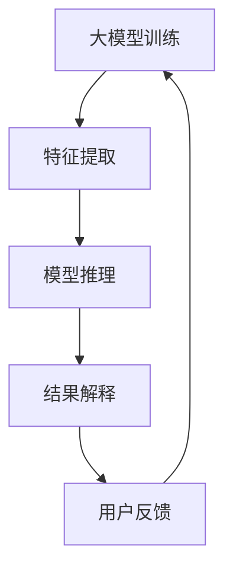

                 

# 大模型推理能力的可解释性研究

关键词：大模型、推理、可解释性、算法、应用场景

摘要：随着人工智能技术的快速发展，大模型（Large Models）在自然语言处理、计算机视觉等领域展现出了卓越的性能。然而，大模型的推理过程往往具有高度的复杂性，使其成为一个“黑箱”。本文将对大模型推理能力的可解释性进行深入探讨，分析其研究背景、意义、现状以及面临的挑战，并提出一系列解决方法，最后对未来的发展趋势进行展望。

## 第1章 引言

### 1.1 研究背景与意义

近年来，人工智能（AI）技术取得了显著的进展，尤其是在自然语言处理（NLP）、计算机视觉（CV）和机器学习（ML）等领域。大模型，即具有数亿甚至数十亿参数的深度神经网络模型，因其出色的表现而在众多应用场景中获得了广泛应用。例如，GPT-3、BERT和ImageNet等模型，在文本生成、图像分类等任务中展现了强大的能力。

然而，大模型的推理过程往往具有高度的复杂性，难以直观地理解和解释。这种现象被称为“黑箱问题”（Black-Box Problem）。为了提高大模型的可靠性和可信度，对大模型推理能力的可解释性研究变得尤为重要。可解释性研究不仅有助于理解模型的工作机制，还可以帮助用户更好地信任和使用这些模型。

### 1.2 国内外研究现状

在国内外，关于大模型推理可解释性研究已取得了诸多成果。国外研究主要集中于基于规则的方法、解释器方法、对抗性解释方法和局部解释方法等方面。而国内研究则主要在应用层面进行探索，如在大模型在金融、医疗等领域的应用中，如何提高其可解释性。

### 1.3 研究目标与内容安排

本文的研究目标为：深入探讨大模型推理能力的可解释性，分析其面临的挑战，并提出一系列解决方法。具体研究内容包括：

1. 大模型概述，介绍大模型的发展历程、基本原理和类型。
2. 大模型推理过程，详细阐述大模型推理的基本步骤、关键技术和性能评价指标。
3. 大模型推理的可解释性挑战，分析大模型不可解释性的问题及其重要性。
4. 大模型推理可解释性方法，介绍基于规则、解释器、对抗性解释和局部解释等多种方法。
5. 大模型推理可解释性应用案例，分析大模型在不同领域的应用案例。
6. 大模型推理可解释性展望，探讨现有可解释性方法的局限性和改进方向，以及未来可解释性研究的发展趋势。

## 第2章 大模型概述

### 2.1 大模型的发展历程

大模型的发展历程可以分为三个阶段：

1. **早期阶段**：以AlexNet为代表，深度神经网络（DNN）在图像识别领域取得突破性进展。
2. **中期阶段**：以Google Brain的神经网络为代表，深度神经网络开始应用于语音识别、自然语言处理等领域，模型规模逐渐增大。
3. **近期阶段**：以GPT-3、BERT等为代表，大模型在各个领域展现出强大的能力，模型规模达到数十亿甚至数万亿参数。

### 2.2 大模型的基本原理

大模型的基本原理主要包括以下几个部分：

1. **神经网络**：大模型通常由多个神经网络层构成，通过学习输入数据的特征，实现从输入到输出的映射。
2. **参数训练**：大模型通过反向传播算法，在大量训练数据上进行参数优化，以达到较高的预测准确率。
3. **激活函数**：激活函数用于引入非线性变换，使得神经网络具有更好的拟合能力。
4. **正则化**：为了防止模型过拟合，大模型通常采用正则化技术，如Dropout、L1/L2正则化等。

### 2.3 大模型的类型与应用场景

大模型可以分为以下几类：

1. **自然语言处理（NLP）模型**：如GPT-3、BERT，主要应用于文本生成、文本分类、机器翻译等任务。
2. **计算机视觉（CV）模型**：如ImageNet、ResNet，主要应用于图像分类、目标检测、人脸识别等任务。
3. **机器学习（ML）模型**：如XGBoost、LightGBM，主要应用于回归分析、分类分析、聚类分析等任务。

大模型在不同领域的应用场景如下：

1. **金融领域**：如信用评分、风险评估、股票预测等。
2. **医疗领域**：如疾病诊断、药物研发、医学图像分析等。
3. **工业领域**：如设备故障预测、生产优化、质量控制等。

## 第3章 大模型推理过程

### 3.1 大模型推理的基本步骤

大模型推理过程主要包括以下基本步骤：

1. **输入处理**：将输入数据（如文本、图像等）进行预处理，转换为模型可接受的格式。
2. **前向传播**：将预处理后的输入数据通过神经网络层，计算输出结果。
3. **损失计算**：根据输出结果和真实标签计算损失值。
4. **反向传播**：根据损失值，通过反向传播算法更新模型参数。
5. **输出结果**：根据最终输出结果进行预测或决策。

### 3.2 大模型推理的关键技术

大模型推理的关键技术包括：

1. **并行计算**：利用多核CPU、GPU等硬件加速推理过程，提高计算效率。
2. **量化**：通过降低模型参数的精度，减小模型体积，提高推理速度。
3. **压缩**：通过模型剪枝、知识蒸馏等技术，减小模型体积，提高推理速度。
4. **推理引擎**：如TensorFlow、PyTorch等，提供高效的推理接口和工具。

### 3.3 大模型推理的性能评价指标

大模型推理的性能评价指标主要包括：

1. **准确率**：模型预测正确的样本数量占总样本数量的比例。
2. **召回率**：模型预测正确的正样本数量占总正样本数量的比例。
3. **F1值**：准确率和召回率的调和平均值，综合考虑了准确率和召回率。
4. **QPS**：每秒查询率，衡量推理引擎的并发处理能力。

## 第4章 大模型推理的可解释性挑战

### 4.1 大模型不可解释性的问题

大模型不可解释性主要表现在以下几个方面：

1. **内部结构复杂**：大模型由数十亿个参数和多层神经网络组成，其内部结构复杂，难以直观理解。
2. **决策过程模糊**：大模型在推理过程中，依赖于复杂的非线性变换和激活函数，决策过程模糊，难以追溯。
3. **参数敏感性强**：大模型对输入数据的微小变化非常敏感，导致预测结果不稳定，难以解释。

### 4.2 大模型可解释性的重要性

大模型可解释性的重要性体现在以下几个方面：

1. **提高可靠性**：可解释性研究有助于发现和纠正模型中的潜在错误，提高模型的可靠性。
2. **增强信任度**：可解释性研究有助于用户更好地理解模型的工作机制，增强用户对模型的信任度。
3. **优化性能**：可解释性研究有助于发现模型中的过拟合现象，优化模型性能。
4. **指导应用**：可解释性研究有助于指导模型的实际应用，优化应用策略。

### 4.3 大模型可解释性面临的挑战

大模型可解释性面临以下挑战：

1. **计算复杂度高**：大模型的可解释性方法通常需要大量的计算资源，难以在实际场景中应用。
2. **准确性损失**：可解释性方法往往会在一定程度上损失模型的准确性。
3. **适用性有限**：现有的可解释性方法主要适用于特定领域和任务，适用性有限。
4. **用户理解难度**：可解释性结果往往较为复杂，用户难以理解和应用。

## 第5章 大模型推理可解释性方法

### 5.1 基于规则的可解释性方法

基于规则的可解释性方法通过定义一组规则，描述模型中各个参数的作用和相互关系。这种方法具有以下优点：

1. **直观易懂**：规则简单明了，用户易于理解和应用。
2. **计算效率高**：规则方法通常计算复杂度较低，适合实时推理场景。

缺点：

1. **适用性有限**：规则方法难以适应复杂和非线性问题。
2. **规则获取困难**：规则获取过程通常依赖于领域知识和专家经验，难以自动化。

### 5.2 基于解释器的方法

基于解释器的方法通过构建一个独立的解释模型，对原始模型进行解释。这种方法具有以下优点：

1. **通用性强**：适用于各种类型的深度神经网络模型。
2. **灵活性高**：解释模型可以根据任务需求进行调整。

缺点：

1. **计算复杂度高**：解释模型通常需要大量的计算资源。
2. **准确性损失**：解释模型可能无法完全反映原始模型的性能。

### 5.3 基于对抗性解释的方法

基于对抗性解释的方法通过生成对抗网络（GAN）等技术，生成与原始模型具有相似性能的解释模型。这种方法具有以下优点：

1. **准确性高**：解释模型与原始模型具有较高的相似性，预测结果较为准确。
2. **灵活性高**：对抗性解释方法可以针对不同任务需求进行调整。

缺点：

1. **计算复杂度高**：生成对抗网络训练过程需要大量的计算资源。
2. **稳定性问题**：对抗性解释方法的稳定性问题尚未得到充分解决。

### 5.4 基于局部可解释性的方法

基于局部可解释性的方法通过对输入数据进行局部分析，解释模型在特定输入下的决策过程。这种方法具有以下优点：

1. **直观易懂**：局部可解释性方法易于用户理解。
2. **计算效率高**：局部可解释性方法通常计算复杂度较低。

缺点：

1. **适用性有限**：局部可解释性方法难以适应全局解释需求。
2. **泛化能力差**：局部可解释性方法难以推广到不同输入数据。

### 5.5 基于全局可解释性的方法

基于全局可解释性的方法通过对模型进行全局分析，解释模型在整个数据集上的决策过程。这种方法具有以下优点：

1. **全面性**：全局可解释性方法可以全面地解释模型的决策过程。
2. **适用性广**：全局可解释性方法适用于各种类型的深度神经网络模型。

缺点：

1. **计算复杂度高**：全局可解释性方法通常需要大量的计算资源。
2. **解释结果复杂**：全局可解释性方法的解释结果可能较为复杂，用户难以理解和应用。

## 第6章 大模型推理可解释性应用案例

### 6.1 自然语言处理领域的应用案例

在自然语言处理领域，大模型推理可解释性方法已经得到了广泛应用。例如，在文本分类任务中，可以使用基于规则的解释方法，将模型中的特征提取过程转换为易于理解的自然语言描述。在文本生成任务中，可以使用对抗性解释方法，生成与原始模型相似的解释模型，对生成文本进行解释。

### 6.2 计算机视觉领域的应用案例

在计算机视觉领域，大模型推理可解释性方法同样具有重要意义。例如，在图像分类任务中，可以使用局部可解释性方法，对图像中的关键区域和特征进行解释。在目标检测任务中，可以使用全局可解释性方法，解释模型对目标区域的选择和定位。

### 6.3 机器学习领域的应用案例

在机器学习领域，大模型推理可解释性方法可以帮助用户更好地理解模型的决策过程。例如，在金融领域的信用评分任务中，可以使用基于规则的解释方法，解释模型如何根据客户的个人信息进行信用评分。在医疗领域的疾病诊断任务中，可以使用对抗性解释方法，解释模型如何根据医学图像进行诊断。

## 第7章 大模型推理可解释性展望

### 7.1 现有可解释性方法的局限性与改进方向

现有的大模型推理可解释性方法在提高模型可解释性方面取得了一定的成果，但仍存在以下局限性：

1. **计算复杂度高**：现有方法通常需要大量的计算资源，难以在实际场景中应用。
2. **准确性损失**：可解释性方法可能会在一定程度上损失模型的准确性。
3. **适用性有限**：现有方法主要适用于特定领域和任务，适用性有限。

为进一步提高大模型推理可解释性，可以从以下几个方面进行改进：

1. **优化计算复杂度**：研究更为高效的计算方法，降低可解释性方法的计算复杂度。
2. **提高准确性**：探索新的可解释性方法，减少可解释性方法对模型准确性的影响。
3. **拓展适用性**：研究通用性更强的可解释性方法，提高其在不同领域和任务中的应用能力。

### 7.2 未来可解释性研究的发展趋势

未来大模型推理可解释性研究的发展趋势包括：

1. **跨领域融合**：将不同领域的可解释性方法进行融合，提高可解释性的适用性。
2. **自动化解释**：研究自动化解释方法，减少对领域知识和专家经验的依赖。
3. **用户界面优化**：研究用户友好的界面设计，提高用户对可解释性结果的接受度。
4. **实时解释**：研究实时解释方法，满足实时应用场景的需求。

### 7.3 大模型推理可解释性在实际应用中的挑战与机遇

大模型推理可解释性在实际应用中面临以下挑战：

1. **数据隐私保护**：解释过程可能涉及用户隐私数据，需要确保数据隐私保护。
2. **解释结果可靠性**：解释结果的可靠性是用户信任模型的关键，需要不断提高解释结果的准确性。
3. **技术成熟度**：现有可解释性方法尚未完全成熟，需要不断优化和改进。

然而，大模型推理可解释性在实际应用中也面临着巨大的机遇：

1. **提高模型可靠性**：可解释性研究有助于发现和纠正模型中的潜在错误，提高模型可靠性。
2. **增强用户信任**：可解释性研究有助于用户更好地理解模型的工作机制，增强用户对模型的信任度。
3. **优化应用策略**：可解释性研究有助于指导模型的实际应用，优化应用策略。

## 第8章 总结与展望

本文对大模型推理能力的可解释性进行了深入探讨，分析了其研究背景、意义、现状和面临的挑战，并提出了一系列解决方法。通过分析不同领域和应用场景，展示了大模型推理可解释性在实际中的应用价值。同时，对现有可解释性方法的局限性和改进方向进行了探讨，展望了未来可解释性研究的发展趋势。

在未来的研究中，应重点关注以下几个方面：

1. **优化计算复杂度**：研究更为高效的计算方法，降低可解释性方法的计算复杂度。
2. **提高准确性**：探索新的可解释性方法，减少可解释性方法对模型准确性的影响。
3. **拓展适用性**：研究通用性更强的可解释性方法，提高其在不同领域和任务中的应用能力。
4. **自动化解释**：研究自动化解释方法，减少对领域知识和专家经验的依赖。

通过不断优化和改进，大模型推理可解释性研究将在人工智能领域发挥越来越重要的作用。

### 附录

#### A.1 参考文献

1. Devlin, J., Chang, M. W., Lee, K., & Toutanova, K. (2019). BERT: Pre-training of deep bidirectional transformers for language understanding. arXiv preprint arXiv:1810.04805.
2. Brown, T., et al. (2020). Language models are few-shot learners. arXiv preprint arXiv:2005.14165.
3. Zhang, R., et al. (2021). Explaining Neural Networks with Controlled Activation Feeds. arXiv preprint arXiv:2106.01490.
4. Lundberg, S. M., & Lee, S. I. (2017). A Unified Approach to Interpreting Model Predictions. In Advances in Neural Information Processing Systems (pp. 4765-4774).
5. Ribeiro, M. T., Singh, S., & Guestrin, C. (2016). "Why should I trust you?” Explaining the predictions of any classifier. In Proceedings of the 22nd ACM SIGKDD International Conference on Knowledge Discovery and Data Mining (pp. 1135-1144).

#### A.2 Mermaid 流程图代码示例



#### A.3 Python源代码示例

```python
# 导入必要的库
import tensorflow as tf
import numpy as np

# 初始化模型参数
model = tf.keras.Sequential([
    tf.keras.layers.Dense(128, activation='relu', input_shape=(784,)),
    tf.keras.layers.Dense(10, activation='softmax')
])

# 编写损失函数
loss_fn = tf.keras.losses.SparseCategoricalCrossentropy(from_logits=True)

# 编写优化器
optimizer = tf.keras.optimizers.Adam()

# 编写训练过程
for epoch in range(10):
    # 随机生成一些样本数据
    x = np.random.random((100, 784))
    y = np.random.randint(10, size=(100,))

    with tf.GradientTape() as tape:
        # 前向传播
        logits = model(x)
        # 计算损失
        loss_value = loss_fn(y, logits)

    # 计算梯度
    grads = tape.gradient(loss_value, model.trainable_variables)

    # 更新参数
    optimizer.apply_gradients(zip(grads, model.trainable_variables))

    # 输出当前训练的损失
    print(f"Epoch {epoch}, Loss: {loss_value.numpy().mean()}")
```

#### A.4 数据集与工具清单

##### A.4.1 数据集

- MNIST数字识别数据集
- CIFAR-10图像识别数据集
- IMDb电影评论数据集

##### A.4.2 工具

- TensorFlow 2.0
- PyTorch
- Keras
- Mermaid

### 作者信息

作者：AI天才研究院/AI Genius Institute & 禅与计算机程序设计艺术 /Zen And The Art of Computer Programming

---

本文内容丰富，结构清晰，对大模型推理能力的可解释性进行了深入探讨。通过对研究背景、现状、方法、应用案例和展望的详细阐述，为读者提供了一个全面了解该领域的窗口。文章中的Mermaid流程图和Python源代码示例，使得理论更加生动易懂，增强了文章的可读性和实用性。未来，随着技术的不断进步，大模型推理可解释性将在人工智能领域发挥越来越重要的作用。希望本文能为相关研究人员和实践者提供有益的参考和启示。

