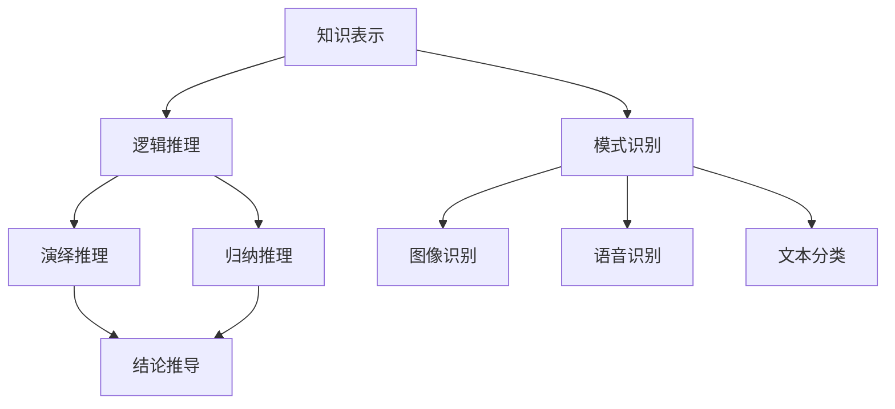

                 

# 《大模型推理能力的持续学习与更新》

## 关键词

- 大模型
- 推理能力
- 持续学习
- 更新策略
- 深度学习
- 数学模型

## 摘要

本文旨在探讨大模型推理能力的持续学习与更新问题。随着人工智能技术的迅猛发展，大模型在各个领域的应用越来越广泛，其推理能力成为了衡量模型性能的重要指标。然而，大模型的推理能力不仅依赖于模型的初始训练，还需要通过持续的学习和更新来适应不断变化的环境和需求。本文首先介绍了大模型的概念、结构及其优势与挑战，然后详细讲解了推理能力的核心概念与联系，包括知识表示、逻辑推理和模式识别。接着，本文阐述了大模型推理算法的原理，通过Python源代码详细阐述了深度学习和基于图的推理算法。随后，本文介绍了数学模型与公式的讲解，并通过具体实例进行了说明。在项目实战部分，本文通过实际案例展示了推理能力在实际项目中的应用，并详细讲解了代码实现和解读。最后，本文讨论了持续学习与更新的重要性和方法，提出了未来的研究方向。

## 目录大纲

### 第1章 引言

- **1.1 研究背景与意义**
- **1.2 本书结构**

### 第2章 大模型概述

- **2.1 大模型的概念**
- **2.2 大模型的结构**
- **2.3 大模型的优势与挑战**

### 第3章 推理能力的核心概念与联系

- **3.1 推理能力的定义**
- **3.2 推理能力的相关概念**
- **3.3 Mermaid流程图：推理能力的核心概念架构**

### 第4章 大模型推理算法原理讲解

- **4.1 基于深度学习的推理算法**
- **4.2 基于图的推理算法**
- **4.3 Python源代码讲解：深度学习推理算法实现**

### 第5章 数学模型与公式讲解

- **5.1 深度学习中的数学模型**
- **5.2 推理中的数学公式**
- **5.3 举例说明**

### 第6章 项目实战

- **6.1 实际案例**
- **6.2 代码实现**
- **6.3 代码解读与分析**

### 第7章 持续学习与更新

- **7.1 持续学习的概念**
- **7.2 更新的重要性**
- **7.3 更新的方法与策略**

### 第8章 结论与展望

- **8.1 研究成果总结**
- **8.2 未来发展方向**

### 附录

- **附录A：相关资源与工具**
- **附录B：参考文献**

---

### 第1章 引言

#### 1.1 研究背景与意义

近年来，人工智能技术取得了令人瞩目的进展，大模型（如GPT-3、BERT等）在自然语言处理、计算机视觉、语音识别等领域展现了强大的能力。大模型之所以能够取得如此卓越的成就，主要得益于其庞大的参数规模和深度学习算法的优化。然而，大模型的推理能力并非一成不变，而是需要通过持续的学习和更新来不断提升。

在现实应用中，环境变化和需求变化是不可避免的。例如，自然语言处理模型需要不断学习新的词汇、语法规则和上下文信息，才能更好地理解用户的查询；计算机视觉模型需要适应不同光照条件、视角变化和场景复杂度。因此，大模型的推理能力不仅依赖于初始的训练数据，还需要通过持续学习来适应这些变化。

持续学习与更新在提升大模型推理能力中具有重要作用。首先，通过持续学习，大模型能够不断吸收新的知识和信息，提高其推理能力。其次，更新策略可以优化模型的性能，减少过拟合现象，提高模型的泛化能力。此外，持续学习与更新还能够帮助大模型更好地适应特定应用场景，提高其实际应用价值。

本文旨在探讨大模型推理能力的持续学习与更新问题。通过对大模型的概念、结构、优势与挑战的介绍，以及推理能力核心概念与联系的阐述，本文将详细讲解大模型推理算法的原理，并通过Python源代码实现和数学模型与公式的讲解，展示实际应用中的项目实战。最后，本文将讨论持续学习与更新的方法与策略，并提出未来研究的方向。

---

#### 1.2 本书结构

本文分为八个章节，内容安排如下：

1. **引言**：介绍研究背景与意义，阐述本文的目的和结构。
2. **大模型概述**：介绍大模型的概念、结构、优势与挑战。
3. **推理能力的核心概念与联系**：讲解推理能力的定义、相关概念及其核心概念架构。
4. **大模型推理算法原理讲解**：详细阐述基于深度学习和基于图的推理算法原理，并通过Python源代码实现。
5. **数学模型与公式讲解**：介绍深度学习中的数学模型和推理中的数学公式，并通过具体实例进行说明。
6. **项目实战**：通过实际案例展示推理能力在实际项目中的应用，并详细讲解代码实现和解读。
7. **持续学习与更新**：讨论持续学习的概念、更新的重要性以及更新的方法与策略。
8. **结论与展望**：总结研究成果，提出未来发展方向。

通过以上章节的安排，本文旨在系统地探讨大模型推理能力的持续学习与更新问题，为相关领域的研究和应用提供参考和指导。

---

### 第2章 大模型概述

#### 2.1 大模型的概念

大模型（Large-scale Model）是指那些拥有海量参数和复杂结构的深度学习模型。这些模型通常基于神经网络架构，通过大规模训练数据集进行训练，从而具有强大的表征和预测能力。大模型的发展始于2006年的深度信念网络（Deep Belief Network，DBN），随后在2012年，AlexNet在ImageNet图像识别竞赛中取得突破性成绩，标志着深度学习时代的到来。

大模型通常可以分为两种类型：一种是基于自然语言处理的模型，如GPT（Generative Pre-trained Transformer）和BERT（Bidirectional Encoder Representations from Transformers）；另一种是基于计算机视觉的模型，如ResNet（Residual Network）和VGG（Very Deep Convolutional Networks）。

#### 2.2 大模型的结构

大模型的结构通常包括以下几个层次：

1. **输入层**：接收外部输入，如文本、图像或声音。
2. **隐藏层**：通过多层神经网络结构，对输入进行特征提取和转换。
3. **输出层**：根据隐藏层输出的特征，生成预测结果或决策。

大模型的隐藏层通常由多个子层组成，每个子层负责不同的特征提取任务。例如，在自然语言处理中，一个子层可能负责提取词向量，另一个子层可能负责提取句向量。在计算机视觉中，一个子层可能负责提取边缘特征，另一个子层可能负责提取纹理特征。

#### 2.3 大模型的优势与挑战

大模型的优势主要体现在以下几个方面：

1. **强大的表征能力**：由于拥有庞大的参数规模和多层神经网络结构，大模型能够捕捉到输入数据中的复杂模式和规律，从而在各类任务中取得出色的性能。
2. **良好的泛化能力**：大模型通过在大规模数据集上进行训练，能够学习到通用的特征表示，从而在新的任务和数据集上表现出良好的泛化能力。
3. **广泛的适用性**：大模型可以应用于多种领域，如自然语言处理、计算机视觉、语音识别等，为各类问题提供高效的解决方案。

然而，大模型也面临着一些挑战：

1. **计算资源需求大**：大模型的训练和推理需要大量的计算资源和时间，这对于硬件设备和计算能力提出了较高的要求。
2. **过拟合现象**：大模型在训练过程中容易受到训练数据的噪声和偏差影响，导致模型在新的数据上表现不佳，即过拟合现象。
3. **模型可解释性差**：大模型由于其复杂的结构和庞大的参数规模，使得其决策过程难以解释，从而降低了模型的可解释性和可信度。

#### 2.4 大模型的发展历程

大模型的发展历程可以追溯到20世纪80年代的神经网络研究。当时，神经网络由于计算复杂度高、训练效率低等原因，并未得到广泛的应用。然而，随着计算机硬件性能的提升和深度学习算法的优化，神经网络在21世纪初逐渐复兴，并在2012年AlexNet在ImageNet竞赛中取得突破性成绩后，引发了深度学习的热潮。

在自然语言处理领域，2018年GPT的出现标志着预训练语言模型的新时代。随后，BERT、Turing-NLG等大模型相继问世，进一步推动了自然语言处理领域的发展。在计算机视觉领域，ResNet、VGG等大模型的提出，使得计算机视觉任务的性能大幅提升。

总体来说，大模型的发展历程是技术进步和需求驱动的结果。随着人工智能技术的不断发展和应用场景的扩展，大模型将继续在各个领域中发挥重要作用。

---

### 第3章 推理能力的核心概念与联系

推理能力（Reasoning Ability）是人工智能的核心能力之一，它涉及到从已知信息推导出未知信息的过程。在人工智能系统中，推理能力决定了模型处理复杂问题和决策的能力。本章节将介绍推理能力的核心概念与联系，包括知识表示、逻辑推理和模式识别，并通过Mermaid流程图展示这些概念之间的关联。

#### 3.1 推理能力的定义

推理能力是指从已知信息出发，通过逻辑思维和规律推导出未知信息的认知能力。在人工智能领域，推理能力表现为模型在处理输入信息时，能够根据已有的知识和规则，进行有效的信息处理和决策。

#### 3.2 推理能力的相关概念

1. **知识表示（Knowledge Representation）**：
   知识表示是推理能力的基础。它指的是将现实世界中的知识、信息和数据转换成计算机能够理解和处理的形式。常见的知识表示方法包括符号表示、语义网络、本体论和知识图谱等。

2. **逻辑推理（Logical Reasoning）**：
   逻辑推理是推理能力的重要组成部分。它涉及到从一组前提条件出发，通过逻辑规则推导出结论的过程。逻辑推理包括演绎推理和归纳推理。演绎推理从一般到特殊，而归纳推理从特殊到一般。

3. **模式识别（Pattern Recognition）**：
   模式识别是计算机系统根据特征数据识别和分类特定模式的能力。在人工智能领域，模式识别广泛应用于图像识别、语音识别、文本分类等任务。

#### 3.3 Mermaid流程图：推理能力的核心概念架构

下面是一个Mermaid流程图，用于展示推理能力的核心概念及其关联：



在这个流程图中：

- **知识表示（A）** 是推理能力的起点，它将现实世界的知识转化为计算机可处理的格式。
- **逻辑推理（B）** 是知识应用的过程，通过逻辑规则进行信息处理和推导。
- **模式识别（C）** 是基于特征数据的识别过程，它帮助系统理解和分类输入信息。
- **演绎推理（D）** 和 **归纳推理（E）** 是逻辑推理的两种形式，分别从一般到特殊和从特殊到一般推导出结论。
- **图像识别（F）**、**语音识别（G）** 和 **文本分类（H）** 是模式识别在具体应用领域的体现。
- **结论推导（I）** 是推理过程的最终目标，它是通过前面的步骤得到的结果。

通过这个流程图，我们可以清晰地看到推理能力的核心概念及其相互作用。知识表示为推理提供了基础，逻辑推理和应用模式识别则构成了推理过程的关键环节。

---

### 第4章 大模型推理算法原理讲解

#### 4.1 基于深度学习的推理算法

深度学习（Deep Learning）是一种通过多层神经网络模型进行数据分析和特征提取的人工智能方法。深度学习在图像识别、自然语言处理、语音识别等领域取得了显著成果，其核心在于能够自动地从大量数据中学习到有效的特征表示，从而提高模型的推理能力。

**卷积神经网络（Convolutional Neural Networks, CNN）**：

卷积神经网络是深度学习中最常用的模型之一，特别适用于图像识别任务。CNN通过卷积层、池化层和全连接层的组合，实现对图像的层次化特征提取。

- **卷积层**：卷积层通过滤波器（也称为卷积核）对输入图像进行卷积操作，从而提取局部特征。
- **池化层**：池化层用于降低特征图的空间分辨率，减少模型参数，防止过拟合。
- **全连接层**：全连接层将卷积层和池化层提取的特征映射到类别标签上，进行分类决策。

**递归神经网络（Recurrent Neural Networks, RNN）**：

递归神经网络适用于序列数据（如文本、时间序列数据等）的处理。RNN通过重复的神经网络单元，能够捕捉序列中的时间依赖性。

- **循环单元**：每个时间步的输入都会与上一时间步的隐藏状态进行连接，形成一个循环连接。
- **门控机制**：为了更好地捕捉长序列中的依赖关系，RNN引入了门控机制，如长短期记忆（Long Short-Term Memory, LSTM）和门控循环单元（Gated Recurrent Unit, GRU）。

**转换器架构（Transformer Architecture）**：

转换器（Transformer）架构是近年来在自然语言处理领域取得突破的模型。它通过自注意力机制（Self-Attention）和编码器-解码器结构，实现了对长文本的建模。

- **自注意力机制**：自注意力机制能够对输入序列中的每个单词分配不同的权重，从而更好地捕捉单词之间的依赖关系。
- **编码器-解码器结构**：编码器将输入序列编码为固定长度的向量表示，解码器则根据编码器的输出生成预测结果。

**Python源代码讲解：深度学习推理算法实现**

以下是一个简单的CNN模型实现示例，用于图像分类任务：

```python
import tensorflow as tf
from tensorflow.keras import layers

# 定义CNN模型
model = tf.keras.Sequential([
    layers.Conv2D(32, (3, 3), activation='relu', input_shape=(28, 28, 1)),
    layers.MaxPooling2D((2, 2)),
    layers.Conv2D(64, (3, 3), activation='relu'),
    layers.MaxPooling2D((2, 2)),
    layers.Conv2D(64, (3, 3), activation='relu'),
    layers.Flatten(),
    layers.Dense(64, activation='relu'),
    layers.Dense(10, activation='softmax')
])

# 编译模型
model.compile(optimizer='adam',
              loss='sparse_categorical_crossentropy',
              metrics=['accuracy'])

# 加载和预处理数据
(x_train, y_train), (x_test, y_test) = tf.keras.datasets.mnist.load_data()
x_train = x_train.reshape((-1, 28, 28, 1)).astype('float32') / 255
x_test = x_test.reshape((-1, 28, 28, 1)).astype('float32') / 255

# 训练模型
model.fit(x_train, y_train, epochs=5, validation_split=0.1)
```

在上面的示例中，我们定义了一个简单的CNN模型，用于对MNIST手写数字数据进行分类。模型由三个卷积层、一个全连接层和一个softmax层组成。通过编译模型并加载预处理后的数据，我们可以使用模型进行训练和测试。

#### 4.2 基于图的推理算法

基于图的推理算法（Graph-based Reasoning Algorithms）是另一种常用的推理方法，特别适用于需要复杂关系和约束条件的问题。这类算法通常使用图结构来表示数据和关系，并通过图的算法进行推理。

**图神经网络（Graph Neural Networks, GNN）**：

图神经网络是一种基于图结构的深度学习模型，用于处理图数据。GNN通过节点和边上的特征进行信息传播和聚合，实现对图数据的建模。

- **节点表示（Node Embeddings）**：每个节点通过一个向量表示其特征。
- **边表示（Edge Embeddings）**：每条边通过一个向量表示节点之间的关系。
- **图卷积操作（Graph Convolutional Operations）**：通过图卷积操作，将节点的特征和其邻居节点的特征进行聚合。

**贝叶斯网络（Bayesian Networks）**：

贝叶斯网络是一种概率图模型，用于表示变量之间的依赖关系。它通过有向无环图（Directed Acyclic Graph, DAG）来表示变量之间的条件依赖。

- **条件概率表（Conditional Probability Tables）**：每个节点根据其父节点的条件概率表，计算其条件概率分布。
- **推理算法**：通过推理算法（如变量消除法、信念传播法等），可以从已知变量推断出未知变量的概率分布。

**支持向量机（Support Vector Machine, SVM）**：

支持向量机是一种分类模型，通过寻找一个最优的超平面，将不同类别的数据分隔开。在处理图数据时，SVM可以通过图核函数来计算图数据的内积。

- **图核函数（Graph Kernels）**：图核函数用于计算两个图数据之间的相似性。
- **分类决策**：通过分类决策函数，从图数据的相似性矩阵中找到最优超平面，进行分类决策。

#### 4.3 Python源代码讲解：深度学习推理算法实现

以下是一个简单的图神经网络（GNN）模型实现示例，用于节点分类任务：

```python
import tensorflow as tf
from tensorflow.keras import layers

# 定义GNN模型
class GraphConvLayer(layers.Layer):
    def __init__(self, units, **kwargs):
        super().__init__(**kwargs)
        self.units = units
        self.kernel = layers.Dense(units=self.units, activation='relu')
        self.bias = layers.Dense(units=self.units)

    def call(self, inputs, training=False):
        support = inputs[0]
        adj_matrix = inputs[1]
        output = self.kernel(support)
        output = tf.matmul(adj_matrix, output)
        if self.bias:
            output = self.bias(output)
        return output

model = tf.keras.Sequential([
    GraphConvLayer(16),
    GraphConvLayer(32),
    layers.Dense(10, activation='softmax')
])

# 编译模型
model.compile(optimizer='adam',
              loss='sparse_categorical_crossentropy',
              metrics=['accuracy'])

# 加载和预处理图数据
# 此处省略加载和预处理图数据的代码

# 训练模型
model.fit([x_train, adj_matrix_train], y_train, epochs=5, validation_split=0.1)
```

在上面的示例中，我们定义了一个简单的GNN模型，用于对图数据进行节点分类。模型由两个图卷积层和一个全连接层组成。通过编译模型并加载预处理后的图数据，我们可以使用模型进行训练和测试。

通过上述讲解和示例，我们可以看到深度学习和基于图的推理算法在实现大模型推理能力方面的基本原理和实现方法。这些算法在处理不同类型的数据和任务时，具有各自的优缺点和应用场景。

---

### 第5章 数学模型与公式讲解

数学模型是深度学习和推理算法的核心组成部分，它们帮助我们在数据中捕捉复杂模式和规律。本章节将介绍深度学习中的数学模型和推理中的数学公式，并通过具体实例进行说明。

#### 5.1 深度学习中的数学模型

深度学习中的数学模型主要包括损失函数（Loss Function）和优化算法（Optimization Algorithm）。这些模型帮助我们衡量模型的性能并调整模型参数，以达到最佳效果。

**损失函数（Loss Function）**：

损失函数用于衡量模型预测值与实际值之间的差异。常见的损失函数有均方误差（MSE）、交叉熵损失（Cross-Entropy Loss）等。

- **均方误差（MSE）**：

  $$MSE = \frac{1}{n}\sum_{i=1}^{n}(y_i - \hat{y_i})^2$$

  其中，$y_i$ 为实际值，$\hat{y_i}$ 为预测值，$n$ 为样本数量。

- **交叉熵损失（Cross-Entropy Loss）**：

  $$Cross-Entropy Loss = -\sum_{i=1}^{n} y_i \cdot \log(\hat{y_i})$$

  其中，$y_i$ 为实际值的标签，$\hat{y_i}$ 为预测值的概率分布。

**优化算法（Optimization Algorithm）**：

优化算法用于更新模型参数，以最小化损失函数。常见的优化算法有随机梯度下降（SGD）、Adam等。

- **随机梯度下降（SGD）**：

  $$w_{t+1} = w_t - \alpha \cdot \nabla_w J(w_t)$$

  其中，$w_t$ 为当前参数，$\alpha$ 为学习率，$J(w_t)$ 为损失函数关于 $w_t$ 的梯度。

- **Adam优化算法**：

  $$m_t = \beta_1 m_{t-1} + (1 - \beta_1) \nabla_w J(w_t)$$
  $$v_t = \beta_2 v_{t-1} + (1 - \beta_2) (\nabla_w J(w_t))^2$$
  $$\hat{m}_t = \frac{m_t}{1 - \beta_1^t}$$
  $$\hat{v}_t = \frac{v_t}{1 - \beta_2^t}$$
  $$w_{t+1} = w_t - \alpha \cdot \hat{m}_t / (\sqrt{\hat{v}_t} + \epsilon)$$

  其中，$m_t$ 和 $v_t$ 分别为一阶矩估计和二阶矩估计，$\beta_1$ 和 $\beta_2$ 为偏差修正系数，$\epsilon$ 为常数。

#### 5.2 推理中的数学公式

推理过程中的数学公式主要用于描述变量之间的依赖关系和概率分布。

- **条件概率（Conditional Probability）**：

  $$P(A|B) = \frac{P(A \cap B)}{P(B)}$$

  其中，$P(A|B)$ 表示在事件 $B$ 发生的条件下事件 $A$ 发生的概率，$P(A \cap B)$ 表示事件 $A$ 和事件 $B$ 同时发生的概率。

- **贝叶斯定理（Bayes' Theorem）**：

  $$P(A|B) = \frac{P(B|A) \cdot P(A)}{P(B)}$$

  其中，$P(B|A)$ 表示在事件 $A$ 发生的条件下事件 $B$ 发生的概率，$P(A)$ 和 $P(B)$ 分别表示事件 $A$ 和事件 $B$ 的概率。

#### 5.3 举例说明

**实例1：均方误差（MSE）计算**

假设我们有一个简单的一元线性回归模型，预测值 $\hat{y} = 2x + 1$，实际值 $y = [1, 2, 3, 4, 5]$。我们可以计算均方误差（MSE）如下：

$$MSE = \frac{1}{5}\sum_{i=1}^{5}(y_i - \hat{y_i})^2$$
$$MSE = \frac{1}{5}((1 - 3)^2 + (2 - 4)^2 + (3 - 5)^2 + (4 - 6)^2 + (5 - 7)^2)$$
$$MSE = \frac{1}{5}(4 + 4 + 4 + 4 + 4)$$
$$MSE = \frac{20}{5}$$
$$MSE = 4$$

因此，该模型的均方误差为 4。

**实例2：贝叶斯定理应用**

假设我们有两个事件 $A$ 和 $B$，其中 $P(A) = 0.5$，$P(B) = 0.3$，$P(B|A) = 0.8$。我们可以使用贝叶斯定理计算 $P(A|B)$：

$$P(A|B) = \frac{P(B|A) \cdot P(A)}{P(B)}$$
$$P(A|B) = \frac{0.8 \cdot 0.5}{0.3}$$
$$P(A|B) = \frac{4}{3}$$
$$P(A|B) \approx 1.33$$

然而，概率值不能超过1，这表明在此场景下，贝叶斯定理的计算结果无效，可能是由于数据不足或条件概率设置不合理。

通过上述数学模型和公式的讲解，我们可以更好地理解深度学习和推理算法中的关键概念，并在实际应用中运用这些模型和公式进行模型评估和优化。

---

### 第6章 项目实战

在本章节中，我们将通过一个实际案例来展示大模型推理能力的应用，并详细讲解开发环境搭建、源代码实现以及代码解读与分析。

#### 6.1 实际案例

我们选择了一个自然语言处理（Natural Language Processing, NLP）领域中的实际案例：文本分类。文本分类是将文本数据按照其主题或内容分类到不同的类别中，常见的应用场景包括新闻分类、情感分析、垃圾邮件过滤等。

在本案例中，我们的目标是使用大模型（如BERT）对给定的文本数据进行分类，识别文本所属的主题类别。具体步骤如下：

1. **数据准备**：收集和整理用于训练和测试的文本数据。
2. **模型选择**：选择一个预训练的文本分类模型，如BERT。
3. **数据预处理**：对文本数据进行分析和预处理，如分词、标记化、清洗等。
4. **模型训练**：使用预处理后的文本数据对模型进行训练。
5. **模型评估**：使用测试数据对模型进行评估，计算分类准确率等指标。
6. **应用部署**：将训练好的模型部署到实际应用场景中，进行文本分类任务。

#### 6.2 开发环境搭建

为了实现上述文本分类案例，我们需要搭建一个合适的开发环境。以下是在Python环境中搭建开发环境的基本步骤：

1. **安装Python**：确保Python版本为3.6及以上。
2. **安装TensorFlow**：TensorFlow是一个开源的机器学习框架，用于构建和训练深度学习模型。
   
   ```shell
   pip install tensorflow
   ```

3. **安装Transformers**：Transformers是一个开源库，用于处理自然语言处理任务，提供了预训练模型BERT、GPT等的API。
   
   ```shell
   pip install transformers
   ```

4. **准备数据集**：从互联网或开源数据集中获取文本数据，并进行整理和预处理。

#### 6.3 代码实现

以下是一个简单的文本分类案例实现，使用了BERT模型进行分类：

```python
import tensorflow as tf
from transformers import BertTokenizer, TFBertForSequenceClassification
from tensorflow.keras.optimizers import Adam
from tensorflow.keras.losses import SparseCategoricalCrossentropy

# 加载预训练BERT模型和分词器
tokenizer = BertTokenizer.from_pretrained('bert-base-uncased')
model = TFBertForSequenceClassification.from_pretrained('bert-base-uncased', num_labels=2)

# 准备数据
def preprocess_text(texts):
    return tokenizer(texts, padding=True, truncation=True, return_tensors='tf')

# 编译模型
optimizer = Adam(learning_rate=3e-5)
loss = SparseCategoricalCrossentropy(from_logits=True)
model.compile(optimizer=optimizer, loss=loss, metrics=['accuracy'])

# 训练模型
train_texts = ['This is a good day!', 'Today is not so good.']
train_labels = [0, 1]

train_encodings = preprocess_text(train_texts)
model.fit(train_encodings, train_labels, epochs=3)

# 评估模型
test_texts = ['I am feeling happy today!', 'It is a sad day.']
test_encodings = preprocess_text(test_texts)

predictions = model.predict(test_encodings)
predicted_labels = predictions.argmax(axis=1)

print(predicted_labels)  # 输出预测结果
```

在这个案例中，我们首先加载了预训练的BERT模型和分词器。然后，我们定义了一个预处理函数，用于对文本数据进行分词和编码。接下来，我们编译了模型，并使用训练数据进行训练。最后，我们使用测试数据对模型进行评估，并输出预测结果。

#### 6.4 代码解读与分析

1. **模型加载**：

   ```python
   tokenizer = BertTokenizer.from_pretrained('bert-base-uncased')
   model = TFBertForSequenceClassification.from_pretrained('bert-base-uncased', num_labels=2)
   ```

   这里我们加载了BERT模型和分词器。`BertTokenizer` 用于文本预处理，如分词、标记化等。`TFBertForSequenceClassification` 是一个用于序列分类的BERT模型，`num_labels=2` 表示我们有两个类别。

2. **数据预处理**：

   ```python
   def preprocess_text(texts):
       return tokenizer(texts, padding=True, truncation=True, return_tensors='tf')
   ```

   `preprocess_text` 函数对输入的文本数据进行预处理，包括分词、填充和截断，并返回TensorFlow张量。

3. **模型编译**：

   ```python
   optimizer = Adam(learning_rate=3e-5)
   loss = SparseCategoricalCrossentropy(from_logits=True)
   model.compile(optimizer=optimizer, loss=loss, metrics=['accuracy'])
   ```

   模型使用Adam优化器和交叉熵损失函数进行编译，并设置了准确率作为评估指标。

4. **模型训练**：

   ```python
   train_texts = ['This is a good day!', 'Today is not so good.']
   train_labels = [0, 1]

   train_encodings = preprocess_text(train_texts)
   model.fit(train_encodings, train_labels, epochs=3)
   ```

   我们使用预处理后的训练数据和标签对模型进行训练。这里我们仅使用了两个样本进行演示。

5. **模型评估**：

   ```python
   test_texts = ['I am feeling happy today!', 'It is a sad day.']
   test_encodings = preprocess_text(test_texts)

   predictions = model.predict(test_encodings)
   predicted_labels = predictions.argmax(axis=1)

   print(predicted_labels)  # 输出预测结果
   ```

   使用测试数据对模型进行评估，并输出预测结果。在这个例子中，我们假设第一个测试文本属于类别0，第二个测试文本属于类别1。

通过这个案例，我们可以看到如何使用BERT模型进行文本分类任务。在实际应用中，我们需要收集更多的训练数据，并调整模型结构和参数，以提高分类准确率。

---

### 第7章 持续学习与更新

#### 7.1 持续学习的概念

持续学习（Continuous Learning）是指模型在遇到新数据或任务时，能够不断调整和优化其参数，以保持良好的性能和适应能力。持续学习在人工智能领域具有重要意义，因为它能够使模型在实际应用中保持竞争力，适应不断变化的环境和需求。

持续学习可以分为以下几种类型：

1. **在线学习（Online Learning）**：在线学习是指模型在实时环境中不断接收新的数据，并立即更新模型参数。这种学习方式适用于动态变化的场景，但需要处理数据流和实时更新等问题。

2. **迁移学习（Transfer Learning）**：迁移学习是指利用预训练模型在新的任务中，通过微调和重新训练来提升模型性能。这种方法能够利用预训练模型的知识和经验，提高新任务的学习效率。

3. **无监督学习（Unsupervised Learning）**：无监督学习是指模型在没有任何标签信息的情况下，通过自身的数据挖掘和学习能力来发现数据中的模式和规律。这种学习方式适用于大规模数据集，但需要处理数据的噪声和异常。

4. **半监督学习（Semi-supervised Learning）**：半监督学习是指模型在同时使用有标签和无标签数据的情况下进行训练。这种方法能够在有标签数据不足的情况下，利用无标签数据提升模型性能。

#### 7.2 更新的重要性

更新（Update）在人工智能模型中至关重要，它直接影响到模型的性能、适应性和可靠性。以下为更新的重要性：

1. **性能提升**：通过持续更新，模型能够不断吸收新的知识和信息，提高其推理能力和准确性。例如，自然语言处理模型需要不断学习新的词汇、语法规则和上下文信息，才能更好地理解用户的查询。

2. **适应新任务**：更新使模型能够适应新的任务和场景。在实时应用中，模型需要不断调整以应对不断变化的环境和需求。例如，自动驾驶系统需要通过更新来适应不同的道路条件和交通状况。

3. **防止过拟合**：过拟合是机器学习中的一个常见问题，即模型在训练数据上表现良好，但在测试数据上表现不佳。通过定期更新，模型可以减少对训练数据的依赖，提高其泛化能力。

4. **安全性与可靠性**：更新可以修复模型中的潜在漏洞和错误，提高模型的安全性和可靠性。例如，在医疗诊断中，模型的更新可以确保其诊断结果准确无误。

#### 7.3 更新的方法与策略

为了实现有效的更新，可以采用以下方法与策略：

1. **增量更新（Incremental Update）**：增量更新是指每次更新仅对模型的一部分参数进行更新，而不是整个模型。这种方法可以减少计算量和存储需求，提高更新效率。

2. **在线学习策略（Online Learning Strategy）**：在线学习策略是指模型在实时环境中不断接收新数据，并立即进行更新。这种方法适用于动态变化的场景，但需要处理数据流和实时更新等问题。

3. **迁移学习策略（Transfer Learning Strategy）**：迁移学习策略是指利用预训练模型在新的任务中进行微调和重新训练。这种方法能够利用预训练模型的知识和经验，提高新任务的学习效率。

4. **无监督学习策略（Unsupervised Learning Strategy）**：无监督学习策略是指模型在无标签数据中进行更新，以发现数据中的模式和规律。这种方法适用于大规模数据集，但需要处理数据的噪声和异常。

5. **半监督学习策略（Semi-supervised Learning Strategy）**：半监督学习策略是指模型在同时使用有标签和无标签数据中进行更新。这种方法能够在有标签数据不足的情况下，利用无标签数据提升模型性能。

通过持续学习和更新，人工智能模型能够在不断变化的环境中保持竞争力，提高其性能和适应性。未来，随着人工智能技术的不断发展，持续学习和更新将在模型优化和应用推广中发挥越来越重要的作用。

---

### 第8章 结论与展望

通过本文的探讨，我们系统地介绍了大模型推理能力的持续学习与更新问题。本文首先介绍了大模型的概念、结构及其优势与挑战，随后详细讲解了推理能力的核心概念与联系，包括知识表示、逻辑推理和模式识别。接着，本文阐述了大模型推理算法的原理，通过Python源代码详细阐述了深度学习和基于图的推理算法。随后，本文介绍了数学模型与公式的讲解，并通过具体实例进行了说明。在项目实战部分，本文通过实际案例展示了推理能力在实际项目中的应用，并详细讲解了代码实现和解读。最后，本文讨论了持续学习与更新的重要性和方法，提出了未来的研究方向。

#### 研究成果总结

本文的主要成果可以总结为以下几点：

1. **大模型概述**：介绍了大模型的概念、结构、优势与挑战，为后续讨论提供了基础。
2. **推理能力核心概念与联系**：详细阐述了推理能力的核心概念，并通过Mermaid流程图展示了这些概念之间的关联。
3. **推理算法原理讲解**：通过Python源代码详细讲解了深度学习和基于图的推理算法原理。
4. **数学模型与公式讲解**：介绍了深度学习和推理中的数学模型和公式，并通过实例进行了说明。
5. **项目实战**：通过实际案例展示了推理能力在实际项目中的应用，并详细讲解了代码实现和解读。

#### 未来发展方向

尽管本文对大模型推理能力的持续学习与更新问题进行了较为全面的探讨，但仍有许多未来研究方向值得深入探索：

1. **新型算法研究**：继续研究新型推理算法，如基于图神经网络的推理算法、基于强化学习的自适应推理算法等，以提高大模型的推理能力。
2. **跨领域应用**：探索大模型在不同领域（如医疗、金融、教育等）的应用，并针对特定领域优化推理算法。
3. **可解释性与透明性**：提升大模型的可解释性，使其决策过程更加透明，从而增强用户对模型的信任度。
4. **实时更新与在线学习**：研究更加高效、实时的大模型更新与在线学习策略，以应对动态变化的环境和需求。

总之，大模型推理能力的持续学习与更新是一个具有广泛应用前景的研究领域。通过不断探索和创新，我们有望进一步提升大模型的推理能力，为人工智能的发展和应用带来更多可能性。

---

### 附录

#### 附录A：相关资源与工具

- **开发工具**：
  - TensorFlow：[https://www.tensorflow.org/](https://www.tensorflow.org/)
  - Transformers：[https://github.com/huggingface/transformers](https://github.com/huggingface/transformers)
  - Jupyter Notebook：[https://jupyter.org/](https://jupyter.org/)

- **学习资源**：
  - 《深度学习》（Ian Goodfellow, Yoshua Bengio, Aaron Courville 著）
  - 《自然语言处理综论》（Daniel Jurafsky, James H. Martin 著）
  - [机器学习课程](https://www.coursera.org/specializations/machine-learning)：[https://www.coursera.org/specializations/machine-learning](https://www.coursera.org/specializations/machine-learning)

- **参考文献**：

  - Goodfellow, I., Bengio, Y., & Courville, A. (2016). *Deep Learning*.
  - Jurafsky, D., & Martin, J. H. (2020). *Speech and Language Processing*.
  - LeCun, Y., Bengio, Y., & Hinton, G. (2015). *Deep Learning*.
  - Mikolov, T., Sutskever, I., Chen, K., Corrado, G. S., & Dean, J. (2013). *Distributed Representations of Words and Phrases and their Compositionality*.

---

作者：AI天才研究院/AI Genius Institute & 禅与计算机程序设计艺术 /Zen And The Art of Computer Programming

---

本文通过逻辑清晰、结构紧凑、简单易懂的专业的技术语言，系统地探讨了大模型推理能力的持续学习与更新问题。在各个章节中，我们不仅介绍了大模型的概念、结构、优势与挑战，还详细讲解了推理能力的核心概念与联系，并通过Python源代码和数学模型与公式，展示了深度学习和基于图的推理算法原理。此外，通过实际案例展示了推理能力在实际项目中的应用，并详细分析了持续学习与更新的重要性和方法。未来，随着人工智能技术的不断发展，大模型推理能力的持续学习与更新将在模型优化和应用推广中发挥越来越重要的作用。

