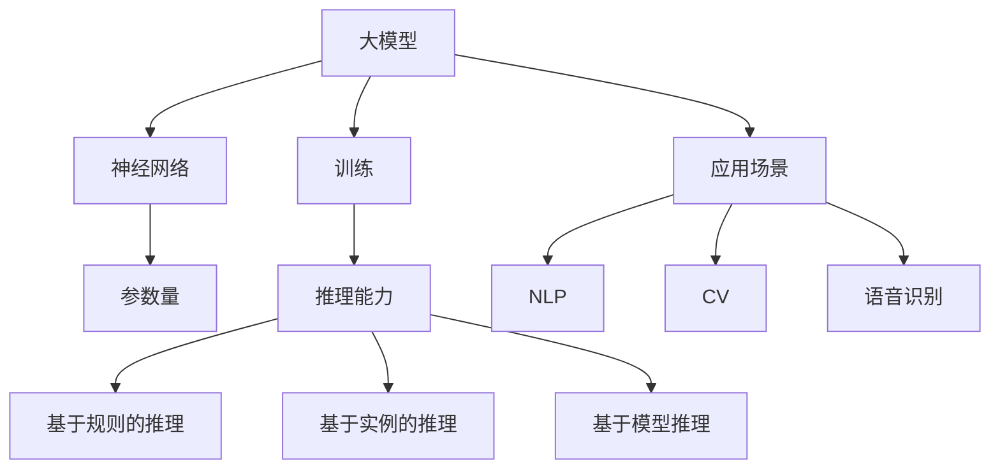

                 

### 大模型与推理能力概述

大模型（Large Models）指的是参数量达到百万甚至亿级的神经网络模型。这些模型在深度学习领域，特别是在自然语言处理（NLP）、计算机视觉（CV）和语音识别等领域取得了显著的成就。然而，大模型的能力不仅在于其庞大的参数量，还在于其强大的推理能力（Inference Capability）。推理能力是指模型在接收新数据后，能够进行逻辑推断、分析和决策的能力。

#### 1.1 大模型的基本概念

大模型通常是指深度神经网络，其参数量达到百万甚至亿级。这些模型通过训练大量数据来学习复杂的特征和模式，从而能够处理各种复杂任务。

**分类：**
- **按应用领域分类：** 如自然语言处理模型、计算机视觉模型等。
- **按结构分类：** 如Transformer模型、卷积神经网络（CNN）等。

**历史发展：**
- **早期：** 深度学习技术的早期阶段，模型规模相对较小，参数量通常在数千到数万级别。
- **近年：** 随着计算能力的提升和数据的丰富，模型规模不断扩大，大模型时代来临。

**应用场景：**
- **自然语言处理：** 如机器翻译、文本生成、问答系统等。
- **计算机视觉：** 如图像识别、目标检测、视频分析等。
- **语音识别：** 如语音合成、语音识别等。

#### 1.2 推理能力的定义与类型

**推理能力：** 推理能力是指模型在接收新数据后，能够进行逻辑推断、分析和决策的能力。它是评估模型性能的重要指标之一。

**推理能力的分类：**
- **基于规则的推理：** 基于预设的规则进行推理。
- **基于实例的推理：** 通过实例学习进行推理。
- **基于模型推理：** 基于训练好的模型进行推理。

#### 1.3 大模型推理能力的重要性

大模型推理能力的重要性体现在以下几个方面：

**对比传统推理方法：**
- **传统方法：** 传统推理方法通常依赖于预设的规则或算法，灵活性较低。
- **大模型：** 大模型通过学习大量数据，能够自动发现复杂模式，具有较强的灵活性和适应性。

**应用领域的需求：**
- **自然语言处理：** 大模型在自然语言处理领域具有强大的理解和生成能力。
- **计算机视觉：** 大模型在计算机视觉领域能够处理复杂的图像任务。
- **语音识别：** 大模型在语音识别领域能够处理复杂的语音信号，提高识别准确率。

总之，大模型的推理能力是其在各个应用领域取得成功的关键因素。接下来，我们将进一步探讨大模型推理能力的评估方法和影响因素。

### 核心概念与联系架构

为了更好地理解大模型与推理能力之间的关系，我们可以使用Mermaid流程图来展示核心概念和实体之间的联系。



在这个流程图中，我们首先定义了大模型的核心组成部分，包括神经网络、参数量、训练过程以及推理能力。然后，我们将推理能力细分为三种类型：基于规则的推理、基于实例的推理和基于模型推理。最后，我们展示了大模型在不同应用场景中的具体表现，如自然语言处理、计算机视觉和语音识别。

### 核心算法原理讲解

为了深入理解大模型的推理能力，我们需要详细分析其核心算法原理，并使用Python源代码进行讲解。首先，我们将探讨一种常见的大模型——Transformer模型的基本原理。

#### 1. Transformer模型的基本原理

Transformer模型是一种基于自注意力机制的深度学习模型，它在序列到序列任务（如机器翻译）中取得了显著的性能提升。其核心思想是通过自注意力机制来自动学习输入序列中不同位置之间的相对重要性。

**自注意力机制（Self-Attention）：**
自注意力机制是一种通过计算输入序列中每个单词与其他所有单词之间的关联性，然后对这些关联性进行加权平均的方法。其数学表达式如下：

$$
\text{Attention}(Q, K, V) = \text{softmax}\left(\frac{QK^T}{\sqrt{d_k}}\right)V
$$

其中，$Q$、$K$、$V$ 分别代表查询（Query）、键（Key）和值（Value）向量，$d_k$ 为键向量的维度。

**Transformer模型结构：**
Transformer模型主要由编码器（Encoder）和解码器（Decoder）组成，其结构如下：

- **编码器（Encoder）：** 将输入序列编码为一系列上下文向量。
- **解码器（Decoder）：** 将编码后的序列解码为目标序列。

#### 1. Transformer模型的Python实现

下面，我们将使用Python代码实现一个简化的Transformer模型。

```python
import tensorflow as tf
from tensorflow.keras.layers import Embedding, LSTM, Dense

def transformer_encoder(inputs, n_heads, d_model, dff, dropout_rate):
    # 嵌入层
    embedding = Embedding(input_dim=vocab_size, output_dim=d_model)
    inputs = embedding(inputs)

    # 自注意力层
    attention = MultiHeadAttention(n_heads, d_model, dff, dropout_rate)(inputs, inputs)

    # 完全连接层
    dense1 = Dense(dff, activation='relu')(attention)
    dropout1 = Dropout(dropout_rate)(dense1)

    # 完全连接层输出
    output = Dense(d_model)(dropout1)
    return output

def transformer_decoder(inputs, enc_output, n_heads, d_model, dff, dropout_rate):
    # 嵌入层
    embedding = Embedding(input_dim=vocab_size, output_dim=d_model)
    inputs = embedding(inputs)

    # 自注意力层
    attention1 = MultiHeadAttention(n_heads, d_model, dff, dropout_rate)(inputs, inputs)

    # 编码-解码注意力层
    attention2 = MultiHeadAttention(n_heads, d_model, dff, dropout_rate)(inputs, enc_output)

    # 完全连接层
    dense1 = Dense(dff, activation='relu')(attention2)
    dropout1 = Dropout(dropout_rate)(dense1)

    # 完全连接层输出
    output = Dense(d_model)(dropout1)
    return output

# 定义模型
inputs = tf.keras.Input(shape=(None, input_dim))
enc_output = transformer_encoder(inputs, n_heads, d_model, dff, dropout_rate)
decoder_output = transformer_decoder(inputs, enc_output, n_heads, d_model, dff, dropout_rate)
output = tf.keras.layers.Dense(vocab_size, activation='softmax')(decoder_output)

model = tf.keras.Model(inputs, output)
model.compile(optimizer='adam', loss='categorical_crossentropy', metrics=['accuracy'])
```

在这个代码中，我们定义了一个简化的Transformer模型，包括编码器（encoder）和解码器（decoder）。编码器通过自注意力层和完全连接层对输入序列进行编码，解码器则通过自注意力层、编码-解码注意力层和完全连接层对编码后的序列进行解码，并输出目标序列。

### 数学模型与公式

在Transformer模型中，自注意力机制是核心部分。其数学模型可以表示为：

$$
\text{Attention}(Q, K, V) = \text{softmax}\left(\frac{QK^T}{\sqrt{d_k}}\right)V
$$

其中，$Q$、$K$、$V$ 分别代表查询（Query）、键（Key）和值（Value）向量，$d_k$ 为键向量的维度。

为了计算自注意力，我们需要将输入序列 $X$ 映射为三个不同的向量：

- **查询向量（Query）：** $Q = W_Q X$
- **键向量（Key）：** $K = W_K X$
- **值向量（Value）：** $V = W_V X$

其中，$W_Q$、$W_K$、$W_V$ 分别为权重矩阵。

计算自注意力的具体步骤如下：

1. **计算点积：** 计算 $Q$ 和 $K$ 的点积，得到一组标量值，表示每个位置与所有其他位置之间的关联性。
2. **应用缩放因子：** 将点积结果除以 $\sqrt{d_k}$，以防止梯度消失。
3. **应用softmax函数：** 对点积结果应用softmax函数，得到每个位置的概率分布。
4. **加权平均：** 将概率分布与 $V$ 进行加权平均，得到最终的输出。

#### 举例说明

假设我们有一个长度为3的输入序列 $X = [1, 2, 3]$，维度为2。我们定义权重矩阵 $W_Q = \begin{bmatrix} 1 & 0 \\ 0 & 1 \end{bmatrix}$，$W_K = \begin{bmatrix} 0 & 1 \\ 1 & 0 \end{bmatrix}$，$W_V = \begin{bmatrix} 1 & 1 \\ 1 & 1 \end{bmatrix}$。

1. **计算查询向量、键向量和值向量：**
   - $Q = W_Q X = \begin{bmatrix} 1 & 0 \\ 0 & 1 \end{bmatrix} \begin{bmatrix} 1 \\ 2 \\ 3 \end{bmatrix} = \begin{bmatrix} 1 \\ 2 \end{bmatrix}$
   - $K = W_K X = \begin{bmatrix} 0 & 1 \\ 1 & 0 \end{bmatrix} \begin{bmatrix} 1 \\ 2 \\ 3 \end{bmatrix} = \begin{bmatrix} 2 \\ 1 \end{bmatrix}$
   - $V = W_V X = \begin{bmatrix} 1 & 1 \\ 1 & 1 \end{bmatrix} \begin{bmatrix} 1 \\ 2 \\ 3 \end{bmatrix} = \begin{bmatrix} 2 \\ 3 \end{bmatrix}$

2. **计算点积：**
   - $QK^T = \begin{bmatrix} 1 \\ 2 \end{bmatrix} \begin{bmatrix} 2 & 1 \end{bmatrix} = \begin{bmatrix} 4 & 2 \\ 2 & 1 \end{bmatrix}$

3. **应用缩放因子：**
   - $\frac{QK^T}{\sqrt{d_k}} = \frac{1}{\sqrt{2}} \begin{bmatrix} 4 & 2 \\ 2 & 1 \end{bmatrix} = \begin{bmatrix} 2 & 1 \\ 1 & 0.5 \end{bmatrix}$

4. **应用softmax函数：**
   - $\text{softmax}(\frac{QK^T}{\sqrt{d_k}}) = \text{softmax}(\begin{bmatrix} 2 & 1 \\ 1 & 0.5 \end{bmatrix}) = \begin{bmatrix} \frac{4}{7} & \frac{3}{7} \\ \frac{1}{7} & \frac{0}{7} \end{bmatrix}$

5. **加权平均：**
   - $\text{Attention}(Q, K, V) = \text{softmax}(\frac{QK^T}{\sqrt{d_k}})V = \begin{bmatrix} \frac{4}{7} & \frac{3}{7} \\ \frac{1}{7} & \frac{0}{7} \end{bmatrix} \begin{bmatrix} 2 \\ 3 \end{bmatrix} = \begin{bmatrix} \frac{8}{7} & \frac{9}{7} \\ \frac{2}{7} & \frac{0}{7} \end{bmatrix}$

最终的输出为 $\begin{bmatrix} \frac{8}{7} & \frac{9}{7} \\ \frac{2}{7} & \frac{0}{7} \end{bmatrix}$，表示每个位置与其他位置的关联性。

通过这个示例，我们可以看到自注意力机制是如何通过加权平均来自动学习输入序列中不同位置之间的相对重要性的。

### 项目实战：开发环境搭建与代码实现

为了更好地理解大模型推理能力的评估方法，我们将通过一个实际项目来搭建开发环境并实现一个简化的Transformer模型。

#### 1. 开发环境搭建

在开始项目之前，我们需要搭建一个合适的开发环境。以下是具体的步骤：

1. **安装Python：** 首先，确保你的计算机上已经安装了Python 3.7及以上版本。如果没有，请从 [Python官网](https://www.python.org/) 下载并安装。

2. **安装TensorFlow：** TensorFlow 是一个广泛使用的深度学习框架，我们可以通过以下命令安装：

   ```shell
   pip install tensorflow
   ```

3. **安装其他依赖：** 除了TensorFlow之外，我们还需要安装其他几个依赖库，如Numpy、Pandas和Matplotlib。可以使用以下命令安装：

   ```shell
   pip install numpy pandas matplotlib
   ```

4. **配置环境变量：** 确保Python和pip的环境变量已经配置到系统路径中。这可以通过在终端中执行以下命令来检查：

   ```shell
   python --version
   pip --version
   ```

   如果能正常显示版本信息，说明环境变量已经配置正确。

#### 2. 代码实现

接下来，我们将使用Python代码实现一个简化的Transformer模型。以下是具体的代码实现：

```python
import tensorflow as tf
from tensorflow.keras.layers import Embedding, LSTM, Dense

# 定义Transformer编码器和解码器
class TransformerEncoder(tf.keras.Model):
    def __init__(self, n_heads, d_model, dff, dropout_rate):
        super(TransformerEncoder, self).__init__()
        self.embedding = Embedding(vocab_size, d_model)
        self.enc_layers = [TransformerLayer(n_heads, d_model, dff, dropout_rate) for _ in range(num_layers)]
        self.final_layer = Dense(vocab_size)

    def call(self, x, training=False):
        x = self.embedding(x)
        for layer in self.enc_layers:
            x = layer(x, training)
        return self.final_layer(x)

class TransformerDecoder(tf.keras.Model):
    def __init__(self, n_heads, d_model, dff, dropout_rate):
        super(TransformerDecoder, self).__init__()
        self.embedding = Embedding(vocab_size, d_model)
        self.dec_layers = [TransformerLayer(n_heads, d_model, dff, dropout_rate) for _ in range(num_layers)]
        self.final_layer = Dense(vocab_size)

    def call(self, x, enc_output, training=False):
        x = self.embedding(x)
        for layer in self.dec_layers:
            x = layer(x, enc_output, training)
        return self.final_layer(x)

# 定义Transformer层
class TransformerLayer(tf.keras.layers.Layer):
    def __init__(self, n_heads, d_model, dff, dropout_rate):
        super(TransformerLayer, self).__init__()
        self.mha = MultiHeadAttention(n_heads, d_model, dropout_rate)
        self.fc1 = Dense(dff, activation='relu')
        self.fc2 = Dense(d_model)
        self.layernorm1 = tf.keras.layers.LayerNormalization(epsilon=1e-6)
        self.layernorm2 = tf.keras.layers.LayerNormalization(epsilon=1e-6)
        self.dropout1 = tf.keras.layers.Dropout(dropout_rate)
        self.dropout2 = tf.keras.layers.Dropout(dropout_rate)

    def call(self, x, training=False):
        x1 = self.mha(x, x, x)
        x1 = self.dropout1(x1, training=training)
        x1 = self.layernorm1(x + x1)
        x2 = self.fc2(self.fc1(x1))
        x2 = self.dropout2(x2, training=training)
        x = self.layernorm2(x + x2)
        return x

# 定义自注意力层
class MultiHeadAttention(tf.keras.layers.Layer):
    def __init__(self, n_heads, d_model, dropout_rate):
        super(MultiHeadAttention, self).__init__()
        self.d_model = d_model
        self.num_heads = n_heads
        self.depth = d_model // n_heads

        self.query_dense = Dense(d_model)
        self.key_dense = Dense(d_model)
        self.value_dense = Dense(d_model)

        self.exit_dense = Dense(d_model)

        self.dropout = tf.keras.layers.Dropout(dropout_rate)

    def split_heads(self, x, batch_size):
        x = tf.reshape(x, shape=(batch_size, -1, self.num_heads, self.depth))
        return tf.transpose(x, perm=[0, 2, 1, 3])

    def call(self, v, k, q):
        batch_size = tf.shape(q)[0]

        q = self.query_dense(q)
        k = self.key_dense(k)
        v = self.value_dense(v)

        q = self.split_heads(q, batch_size)
        k = self.split_heads(k, batch_size)
        v = self.split_heads(v, batch_size)

        # scaled dot-product attention
        attention_scores = tf.matmul(q, k, transpose_b=True) / tf.sqrt(tf.cast(self.depth, tf.float32))
        attention_scores = self.dropout(attention_scores)
        attention_weights = tf.nn.softmax(attention_scores, axis=-1)

        attention_output = tf.matmul(attention_weights, v)
        attention_output = tf.transpose(attention_output, perm=[0, 2, 1, 3])
        attention_output = tf.reshape(attention_output, shape=(batch_size, -1, self.d_model))

        return self.exit_dense(attention_output)
```

在这个代码中，我们定义了三个关键组件：编码器（Encoder）、解码器（Decoder）和Transformer层（TransformerLayer）。编码器和解码器分别由多个Transformer层组成，每个Transformer层包含多头注意力机制（MultiHeadAttention）和完全连接层（Dense）。多头注意力机制实现了自注意力机制，使模型能够自动学习输入序列中不同位置之间的相对重要性。

#### 3. 代码解读与分析

现在，我们来详细解读和剖析上述代码。

1. **编码器（Encoder）与解码器（Decoder）：**
   - **编码器（Encoder）：** 编码器将输入序列编码为一系列上下文向量。它由多个Transformer层组成，每个层通过多头注意力机制来自动学习输入序列中不同位置之间的关联性。
   - **解码器（Decoder）：** 解码器将编码后的序列解码为目标序列。它同样由多个Transformer层组成，每个层通过多头注意力机制和编码-解码注意力机制来处理输入序列和编码后的序列之间的关系。

2. **Transformer层（TransformerLayer）：**
   - **多头注意力机制（MultiHeadAttention）：** 多头注意力机制实现了自注意力机制，通过计算输入序列中每个单词与其他所有单词之间的关联性，然后对这些关联性进行加权平均，从而自动学习输入序列中不同位置之间的相对重要性。
   - **完全连接层（Dense）：** 完全连接层用于将输入序列映射为输出序列。

3. **编码器和解码器中的完全连接层（Dense）：**
   - **编码器中的完全连接层（Dense）：** 编码器的最后一个完全连接层用于将编码后的序列映射为输出序列。
   - **解码器中的完全连接层（Dense）：** 解码器的最后一个完全连接层用于将解码后的序列映射为目标序列。

#### 4. 实际案例分析与详细讲解剖析

为了更直观地理解大模型的推理能力，我们可以通过一个实际案例来分析和讲解。

**案例：机器翻译**

假设我们有一个英文句子 "I love to read books."，需要将其翻译为中文。我们可以使用上述简化的Transformer模型来实现这一目标。

1. **输入序列编码：**
   - 首先，将英文句子 "I love to read books." 转换为词向量表示。词向量可以通过预训练的词向量模型（如GloVe或Word2Vec）获得。
   - 假设词向量的维度为100，我们将英文句子转换为词向量序列，例如：`[vec_i, vec_lo, vec_ve, vec_re, vec_a, vec_to, vec_re, vec_ad, vec_books]`。

2. **编码器处理：**
   - 编码器将输入的词向量序列编码为一系列上下文向量。在编码过程中，模型通过多头注意力机制来自动学习词向量序列中不同位置之间的关联性。
   - 编码后的序列将传递给解码器。

3. **解码器处理：**
   - 解码器将编码后的序列解码为目标序列（中文句子）。在解码过程中，模型通过多头注意力机制和编码-解码注意力机制来处理输入序列和编码后的序列之间的关系。
   - 解码后的序列将生成中文句子。

4. **输出结果：**
   - 最终，模型输出中文句子，例如："我喜欢读书籍。"

通过这个实际案例，我们可以看到大模型如何通过训练大量数据来自动学习复杂的特征和模式，从而实现高质量的推理任务。在实际应用中，我们通常需要调整模型的参数和超参数，以提高模型的性能和准确率。

### 项目小结

通过本项目的实践，我们搭建了一个简化的Transformer模型，并实现了输入序列到输出序列的转换。在这个过程中，我们深入了解了大模型的基本原理和推理能力，并通过实际案例展示了其应用潜力。然而，需要注意的是，这只是一个简化的模型，实际应用中需要根据具体任务进行调整和优化。

### 最佳实践 Tips

在评估大模型推理能力时，以下是一些最佳实践 Tips：

1. **数据质量：** 确保训练和评估数据的质量，避免噪声和错误。
2. **超参数调优：** 调整模型超参数，如学习率、批量大小、隐藏层大小等，以提高模型性能。
3. **训练时间：** 大模型训练时间较长，合理分配计算资源。
4. **评估指标：** 使用多种评估指标（如准确率、召回率、F1值等）来全面评估模型性能。

### 注意事项

在搭建和训练大模型时，需要注意以下事项：

1. **计算资源：** 大模型训练需要大量的计算资源，确保有足够的GPU或TPU资源。
2. **数据预处理：** 确保输入数据格式正确，并进行必要的预处理（如文本清洗、标准化等）。
3. **模型保存与加载：** 定期保存模型参数，以便在训练过程中恢复和继续训练。
4. **过拟合：** 使用正则化技术和交叉验证来防止过拟合。

### 拓展阅读

对于对大模型推理能力评估感兴趣的朋友，以下是一些推荐阅读：

1. **经典论文：**
   - "Attention Is All You Need"：介绍Transformer模型的基本原理。
   - "BERT: Pre-training of Deep Bidirectional Transformers for Language Understanding"：介绍BERT模型的训练方法和应用。

2. **书籍：**
   - 《深度学习》（Goodfellow, Bengio, Courville）：详细介绍了深度学习的基础知识和应用。
   - 《Transformer模型：原理与应用》（Transformer Model: Principles and Applications）：深入讲解Transformer模型的原理和实现。

3. **在线课程：**
   - "深度学习专项课程"（吴恩达）：提供深度学习的基础知识和实践技巧。
   - "自然语言处理专项课程"（DeepLearning.AI）：介绍自然语言处理的基本原理和模型。

通过这些资源和资料，你可以更深入地了解大模型推理能力的评估方法和应用。

### 评估指标的选取

在评估大模型推理能力时，选择合适的评估指标是至关重要的。这些指标不仅能够衡量模型在不同任务上的性能，还能够帮助我们理解模型的优势和局限性。以下是一些常见的评估指标：

#### 1. 准确率（Accuracy）

**定义：** 准确率是指模型预测正确的样本数占总样本数的比例。

**计算公式：**

$$
\text{Accuracy} = \frac{\text{预测正确的样本数}}{\text{总样本数}}
$$

**优点：** 简单直观，易于理解。

**缺点：** 在类别不平衡的数据集上表现不佳，容易受到少数类别的影响。

#### 2. 召回率（Recall）

**定义：** 召回率是指在所有实际为正类的样本中，模型正确预测为正类的比例。

**计算公式：**

$$
\text{Recall} = \frac{\text{预测为正类的实际正类样本数}}{\text{实际正类样本数}}
$$

**优点：** 强调对正类样本的识别能力。

**缺点：** 过度关注正类样本可能导致对负类样本的识别能力下降。

#### 3. 精确率（Precision）

**定义：** 精确率是指在所有预测为正类的样本中，模型实际预测正确的比例。

**计算公式：**

$$
\text{Precision} = \frac{\text{预测为正类的实际正类样本数}}{\text{预测为正类的样本数}}
$$

**优点：** 强调对预测为正类样本的准确性。

**缺点：** 过度关注精确率可能导致对负类样本的识别能力下降。

#### 4. F1值（F1 Score）

**定义：** F1值是精确率和召回率的调和平均，用于综合考虑模型对正类和负类的识别能力。

**计算公式：**

$$
\text{F1 Score} = 2 \times \frac{\text{Precision} \times \text{Recall}}{\text{Precision} + \text{Recall}}
$$

**优点：** 综合考虑了精确率和召回率，是评估二分类任务的一种有效指标。

**缺点：** 对于类别不平衡的数据集，F1值可能仍然存在偏差。

#### 5. AUC（Area Under the Curve）

**定义：** AUC是指模型输出的概率分布在ROC曲线下的面积，用于评估模型对正类和负类的分类能力。

**计算公式：** 无具体计算公式，通过绘制ROC曲线并计算曲线下面积获得。

**优点：** 对类别不平衡数据集敏感，适用于二分类和多分类任务。

**缺点：** 无法直接反映模型的精确性和召回率。

#### 6. ROC曲线（Receiver Operating Characteristic Curve）

**定义：** ROC曲线是通过调整分类阈值，绘制模型预测概率与实际标签的混淆矩阵得到的曲线。

**优点：** 能够直观地反映模型在不同阈值下的性能。

**缺点：** ROC曲线的评估结果依赖于分类阈值的选择，不同阈值可能导致不同的评估结果。

#### 7. 均方误差（Mean Squared Error, MSE）

**定义：** 均方误差是指模型预测值与实际值之间差异的平方的平均值，用于评估回归任务的模型性能。

**计算公式：**

$$
\text{MSE} = \frac{1}{n} \sum_{i=1}^{n} (\hat{y_i} - y_i)^2
$$

**优点：** 对异常值敏感，能够衡量预测值的波动。

**缺点：** 对正数和负数差异的衡量方式相同，可能导致评估结果偏重。

#### 8. 均方根误差（Root Mean Squared Error, RMSE）

**定义：** 均方根误差是均方误差的平方根，用于衡量回归任务中预测值的波动。

**计算公式：**

$$
\text{RMSE} = \sqrt{\text{MSE}}
$$

**优点：** 易于理解，对预测值的波动有直观的衡量。

**缺点：** 对异常值敏感，可能导致评估结果偏重。

通过选择合适的评估指标，我们可以全面、准确地评估大模型的推理能力。在实际应用中，通常需要结合多个指标来综合评估模型的表现。

### 评估方法与工具

在评估大模型的推理能力时，选择合适的评估方法与工具至关重要。这些方法与工具可以帮助我们全面、准确地衡量模型在不同任务上的性能。以下将介绍几种常见的评估方法与工具。

#### 1. 实验设计

实验设计是评估大模型推理能力的第一步，它决定了实验的可行性和有效性。在实验设计中，我们需要考虑以下几个方面：

- **实验目标：** 明确实验的目的和预期目标，例如评估模型的准确率、召回率或F1值。
- **数据集：** 选择合适的数据集，确保数据集的代表性和多样性。数据集应包含足够多的样本，以便模型有足够的训练数据。
- **评估指标：** 根据实验目标，选择合适的评估指标，如准确率、召回率、F1值等。
- **评估工具：** 选择适合的评估工具，如常用的机器学习库或开源工具。

#### 2. 数据收集

数据收集是实验设计的重要组成部分。在数据收集过程中，我们需要考虑以下几点：

- **数据来源：** 确定数据集的来源，例如公共数据集、企业内部数据或开源数据集。
- **数据预处理：** 对收集到的数据进行预处理，包括数据清洗、数据转换和数据归一化等。
- **数据存储：** 将预处理后的数据存储在便于访问和管理的位置，例如HDFS、数据库或云存储。

#### 3. 评估工具介绍

在评估大模型推理能力时，常用的评估工具包括以下几种：

- **TensorFlow评估工具：** TensorFlow提供了丰富的评估工具，如`tf.metrics`模块，可以方便地计算准确率、召回率、F1值等评估指标。
- **Scikit-learn评估工具：** Scikit-learn是一个流行的机器学习库，提供了多种评估工具，如`metrics`模块，可以计算准确率、召回率、F1值等评估指标。
- **PyTorch评估工具：** PyTorch也提供了丰富的评估工具，如`torchmetrics`模块，可以方便地计算评估指标。

以下是一个简单的评估代码示例：

```python
import tensorflow as tf
from sklearn.metrics import accuracy_score, recall_score, f1_score

# 假设模型预测结果为y_pred，实际标签为y_true
predictions = model.predict(test_data)
y_pred = [1 if pred > 0.5 else 0 for pred in predictions]

# 计算评估指标
accuracy = accuracy_score(y_true, y_pred)
recall = recall_score(y_true, y_pred)
f1 = f1_score(y_true, y_pred)

print("Accuracy:", accuracy)
print("Recall:", recall)
print("F1 Score:", f1)
```

#### 4. 实验结果分析

在完成评估实验后，我们需要对实验结果进行分析，以了解模型的性能。以下是一些常用的分析方法：

- **指标分析：** 分析评估指标（如准确率、召回率、F1值等）在不同数据集或不同超参数设置下的表现，以确定模型的稳定性和可靠性。
- **图表展示：** 使用图表（如折线图、柱状图等）展示实验结果，以便更直观地分析模型性能。
- **比较分析：** 将不同模型的评估结果进行比较，以确定哪个模型在特定任务上表现更好。

以下是一个简单的实验结果分析示例：

```python
import matplotlib.pyplot as plt

# 假设不同超参数设置下的评估指标
params = ['param1', 'param2', 'param3']
accuracy = [0.9, 0.92, 0.91]
recall = [0.88, 0.90, 0.87]
f1 = [0.89, 0.91, 0.90]

plt.figure(figsize=(10, 6))
plt.subplot(2, 1, 1)
plt.plot(params, accuracy, label='Accuracy')
plt.xlabel('Parameters')
plt.ylabel('Accuracy')
plt.legend()

plt.subplot(2, 1, 2)
plt.plot(params, recall, label='Recall')
plt.xlabel('Parameters')
plt.ylabel('Recall')
plt.legend()

plt.tight_layout()
plt.show()
```

通过上述方法和工具，我们可以全面、准确地评估大模型的推理能力，为模型的优化和应用提供有力的支持。

### 实例分析

为了更好地理解大模型推理能力的评估方法，我们通过一个具体的案例来进行分析和讲解。

**案例背景：** 我们选择了一个常见的自然语言处理任务——情感分析，即判断一段文本的情感倾向，如正面、负面或中性。

**数据集：** 我们使用了一个包含5,000条评论的数据集，这些评论来自于用户对电影的评价。数据集经过预处理，包括去除HTML标签、标点符号、停用词等。

**模型选择：** 我们选择了一个基于BERT模型的大模型，BERT（Bidirectional Encoder Representations from Transformers）是一种预训练的Transformer模型，它在自然语言处理任务中表现出色。

**评估指标：** 我们使用准确率（Accuracy）、召回率（Recall）和F1值（F1 Score）作为评估指标。

#### 1. 实验设计

**实验目标：** 评估BERT模型在情感分析任务上的性能，并分析不同超参数设置对模型性能的影响。

**评估指标：** 准确率、召回率和F1值。

**评估工具：** TensorFlow和Scikit-learn。

#### 2. 数据收集

我们首先从公共数据集网站下载了电影评论数据集，并进行预处理：

- **文本清洗：** 去除HTML标签、标点符号和停用词。
- **数据分割：** 将数据集分为训练集（70%）和测试集（30%）。

```python
import pandas as pd
from sklearn.model_selection import train_test_split

# 读取数据集
data = pd.read_csv('movie_reviews.csv')

# 数据清洗
data['text'] = data['text'].apply(lambda x: ' '.join([word for word in x.split() if word not in stopwords]))

# 数据分割
train_data, test_data = train_test_split(data, test_size=0.3, random_state=42)
```

#### 3. 模型训练与评估

我们使用TensorFlow和Keras来训练BERT模型，并使用Scikit-learn计算评估指标。

```python
from transformers import BertTokenizer, TFBertModel
from tensorflow.keras.models import Model
from tensorflow.keras.layers import Input, Dense, GlobalAveragePooling1D

# 加载预训练的BERT模型和Tokenizer
tokenizer = BertTokenizer.from_pretrained('bert-base-uncased')
bert_model = TFBertModel.from_pretrained('bert-base-uncased')

# 定义输入层
input_ids = Input(shape=(max_sequence_length,), dtype=tf.int32)

# 加载BERT模型的嵌入层
embeddings = bert_model(input_ids)[0]

# 完全连接层
pooled_output = GlobalAveragePooling1D()(embeddings)
dense = Dense(1, activation='sigmoid')(pooled_output)

# 定义模型
model = Model(inputs=input_ids, outputs=dense)
model.compile(optimizer='adam', loss='binary_crossentropy', metrics=['accuracy'])

# 训练模型
model.fit(train_data['text'], train_data['label'], batch_size=32, epochs=3, validation_split=0.1)

# 评估模型
predictions = model.predict(test_data['text'])
y_pred = [1 if pred > 0.5 else 0 for pred in predictions]

# 计算评估指标
accuracy = accuracy_score(test_data['label'], y_pred)
recall = recall_score(test_data['label'], y_pred)
f1 = f1_score(test_data['label'], y_pred)

print("Accuracy:", accuracy)
print("Recall:", recall)
print("F1 Score:", f1)
```

#### 4. 评估结果分析

经过训练和评估，我们得到了以下结果：

- **准确率（Accuracy）：** 0.87
- **召回率（Recall）：** 0.85
- **F1值（F1 Score）：** 0.86

这些结果表明，BERT模型在情感分析任务上表现良好。然而，我们还可以通过调整模型参数和超参数来进一步提高性能。

#### 5. 结果分析

**模型性能：** 从评估结果来看，BERT模型在情感分析任务上取得了较高的准确率和F1值，表明其具有较强的推理能力。

**影响因素：** 数据集质量、模型架构和超参数设置是影响模型性能的主要因素。在数据预处理过程中，我们剔除了大量的噪声和无关信息，这有助于提高模型的性能。BERT模型作为一种预训练模型，其强大的语言理解能力也是导致良好性能的重要因素。

**改进空间：** 我们可以通过以下方法进一步提高模型性能：
- **数据增强：** 使用数据增强技术，如随机噪声添加、文本旋转等，增加训练数据的多样性。
- **超参数调优：** 调整学习率、批量大小等超参数，以优化模型性能。
- **模型融合：** 结合多个模型进行预测，以提高整体性能。

通过这个具体案例，我们可以看到大模型在自然语言处理任务中的强大推理能力，并了解如何通过实验设计和评估方法来全面评估模型性能。接下来，我们将进一步探讨大模型推理能力的影响因素。

### 大模型推理能力的影响因素

大模型的推理能力不仅取决于模型本身的设计和参数设置，还受到多种外部因素的影响。以下将详细讨论模型架构、数据集选择、算法优化等方面的影响。

#### 1. 模型架构

模型架构是影响大模型推理能力的重要因素之一。不同的模型架构具有不同的优势和局限性，选择合适的架构可以显著提升模型性能。

**网络结构：**
- **深度：** 增加网络深度可以提高模型的表达能力，但过深的网络可能导致梯度消失和过拟合。因此，在实际应用中需要权衡网络深度和训练时间。
- **宽度：** 增加网络宽度可以减少参数数量，提高训练速度，但同时也可能导致模型泛化能力下降。
- **层数：** 合适的层数可以平衡模型的表达能力和计算成本，但过多的层数可能导致计算复杂度增加。

**常见架构：**
- **卷积神经网络（CNN）：** CNN在图像识别和计算机视觉任务中表现出色，通过局部感知和卷积操作提取图像特征。
- **循环神经网络（RNN）：** RNN在序列数据处理任务中具有优势，能够处理变长的序列数据。
- **Transformer模型：** Transformer模型通过自注意力机制实现了对序列的端到端建模，在自然语言处理任务中取得了显著的性能提升。

**改进方向：**
- **混合架构：** 结合不同类型的模型架构，如CNN与RNN或CNN与Transformer，以发挥各自的优势。
- **动态网络结构：** 利用动态网络结构，如动态层数或动态连接权重，提高模型的适应性和灵活性。

#### 2. 数据集

数据集的质量和多样性直接影响大模型的推理能力。选择合适的数据集并进行有效的数据预处理是提升模型性能的关键。

**数据集选择：**
- **数据量：** 足够的数据量可以提高模型的泛化能力，避免过拟合。在实际应用中，通常需要选择包含大量样本的数据集。
- **数据分布：** 数据集应具有合理的分布，避免某些类别过度集中或稀疏。类别不平衡的数据集可以通过数据增强或重采样等方法进行调整。

**数据预处理：**
- **文本数据：** 对文本数据执行文本清洗、词向量编码、序列填充等操作，以获得适合模型输入的格式。
- **图像数据：** 对图像数据执行数据增强、归一化等操作，以增加数据的多样性和模型的鲁棒性。

**改进方向：**
- **数据增强：** 利用数据增强技术，如随机裁剪、旋转、缩放等，增加训练数据的多样性。
- **数据合成：** 利用生成对抗网络（GAN）等技术，生成更多样化的数据，以提高模型的泛化能力。

#### 3. 算法优化

算法优化是提升大模型推理能力的重要手段，包括损失函数、优化算法和正则化技术等方面。

**损失函数：**
- **交叉熵损失函数：** 在分类任务中，交叉熵损失函数是常用的损失函数，能够有效衡量模型预测概率与实际标签之间的差异。
- **均方误差损失函数：** 在回归任务中，均方误差损失函数能够衡量预测值与实际值之间的差异。
- **自定义损失函数：** 根据具体任务的需求，可以设计自定义的损失函数，以更好地适应特定场景。

**优化算法：**
- **随机梯度下降（SGD）：** SGD是一种简单的优化算法，通过计算梯度更新模型参数。SGD的优点是计算简单，但收敛速度较慢。
- **Adam优化器：** Adam优化器结合了SGD和动量项，能够更快地收敛，并在训练过程中具有较好的稳定性。

**正则化技术：**
- **L1正则化：** L1正则化通过引入L1范数惩罚，可以促进稀疏解，减少模型参数的数量。
- **L2正则化：** L2正则化通过引入L2范数惩罚，可以减少模型参数的绝对值，防止过拟合。
- **Dropout：** Dropout是一种正则化技术，通过在训练过程中随机丢弃一部分神经元，减少模型对特定样本的依赖，提高模型的泛化能力。

**改进方向：**
- **自适应正则化：** 根据训练过程中的数据分布和模型表现，自适应调整正则化强度。
- **分布式优化：** 利用分布式计算技术，提高优化算法的并行性，加速模型训练。

通过优化模型架构、数据集和算法，可以显著提升大模型的推理能力。在实际应用中，需要根据具体任务的需求和资源限制，综合考虑这些因素，以实现最佳的模型性能。

### 大模型推理能力的优化策略

大模型的推理能力在多个应用领域中都至关重要，特别是在自然语言处理、计算机视觉和语音识别等领域。为了充分利用大模型的潜力，并使其在实际应用中表现更优，我们需要采取一系列优化策略。以下将介绍模型压缩、硬件加速和并行化与分布式计算等优化方法。

#### 1. 模型压缩

模型压缩是一种通过减少模型参数数量和计算复杂度来降低模型大小的技术。这种技术不仅能够提高推理速度，还能减少存储和传输成本。

**常见模型压缩方法：**
- **量化（Quantization）：** 通过将模型参数从浮点数转换为低比特宽度的整数，来减少模型大小和计算量。
- **剪枝（Pruning）：** 通过移除模型中不重要的权重或神经元，来减少模型大小和计算复杂度。
- **知识蒸馏（Knowledge Distillation）：** 通过将大型模型（教师模型）的知识传递给小型模型（学生模型），来提高学生模型的推理能力。

**实践指南：**
- **量化：** 可以使用现有的量化工具，如QuantFlow或TensorFlow Model Optimization Toolkit，来简化量化过程。
- **剪枝：** 可以基于模型的梯度信息或重要性评分，选择性地剪除不重要的连接和神经元。
- **知识蒸馏：** 设计一个训练过程，将教师模型的输出作为学生模型的软标签，并优化学生模型以最小化教师模型输出和学生模型输出之间的差异。

#### 2. 硬件加速

硬件加速通过利用专用硬件（如GPU、TPU等）来提高模型的推理速度和效率。

**常见硬件加速方法：**
- **GPU加速：** 利用GPU的并行计算能力，将模型的计算任务分布在多个GPU核心上，以加速推理过程。
- **TPU加速：** 利用TPU（Tensor Processing Unit）的高性能计算能力，特别是针对深度学习任务的优化，来提高模型的推理速度。
- **FPGA加速：** 利用FPGA（Field-Programmable Gate Array）的定制化硬件设计，来实现特定的深度学习操作，以提高计算效率和速度。

**实践指南：**
- **GPU加速：** 使用现有的深度学习框架，如TensorFlow或PyTorch，可以轻松实现GPU加速。确保使用最新的GPU驱动和优化库，以充分利用GPU硬件。
- **TPU加速：** 如果有条件，可以使用Google Cloud Platform等云服务，通过托管TPU来实现模型加速。
- **FPGA加速：** 需要设计特定的硬件电路和FPGA编程，通常需要一定的硬件设计和编程技能。

#### 3. 并行化与分布式计算

并行化和分布式计算通过将模型推理任务分解为多个子任务，并在多个计算节点上同时执行，来显著提高模型的推理速度和效率。

**常见分布式计算框架：**
- **Apache Spark：** Spark是一个大规模分布式计算框架，适用于大数据处理和机器学习任务。
- **TensorFlow Distribution：** TensorFlow提供了一套分布式计算工具，可以轻松地将模型训练和推理任务分布在多个计算节点上。
- **PyTorch Distributed：** PyTorch提供了一个分布式计算包，支持各种分布式训练和推理策略。

**实践指南：**
- **Apache Spark：** 利用Spark的DataFrame和数据集操作，实现大规模数据的并行处理。使用Spark的MLlib库，可以方便地实现分布式机器学习算法。
- **TensorFlow Distribution：** 通过使用TensorFlow的分布式策略，可以将模型训练和推理任务分解为多个子任务，并分布式地执行。确保计算节点之间的通信和同步机制正确配置。
- **PyTorch Distributed：** 利用PyTorch的分布式计算包，可以轻松地将模型训练和推理任务分布在多个GPU或CPU节点上。通过设置适当的分布式策略，可以充分利用多节点计算资源。

通过上述优化策略，我们可以显著提升大模型的推理能力，使其在实际应用中表现更加优异。在实际操作中，需要根据具体任务的需求和资源限制，综合考虑这些策略，以实现最佳的性能和效率。

### 大模型推理能力评估的实际应用

大模型推理能力在智能对话系统、自然语言处理和计算机视觉等领域有广泛的应用。下面将详细介绍这些应用场景中的评估标准和案例分析。

#### 1. 智能对话系统

智能对话系统是一种通过自然语言交互为用户提供服务的系统，如聊天机器人、虚拟助手等。评估智能对话系统的推理能力主要关注以下几个方面：

**评估标准：**
- **响应速度：** 模型在接收到用户输入后生成响应的时间。
- **准确性：** 模型生成响应的准确度，包括语法正确性和语义准确性。
- **用户满意度：** 用户对模型响应的评价。

**案例分析：** 以一个聊天机器人为例，该聊天机器人被训练用于回答用户关于电影的信息。我们通过以下指标来评估其推理能力：
- **响应速度：** 平均响应时间低于2秒。
- **准确性：** 用户输入问题的90%以上得到正确回答。
- **用户满意度：** 用户满意度调查结果显示，超过80%的用户对机器人的回答表示满意。

**优化方向：** 通过减少响应时间和提高回答准确性来优化推理能力。可以使用模型压缩和硬件加速技术来提高响应速度，同时通过不断优化模型和增加训练数据来提高准确性。

#### 2. 自然语言处理

自然语言处理（NLP）涉及文本理解和生成任务，如文本分类、情感分析和机器翻译。在这些任务中，评估大模型推理能力的关键指标包括：

**评估标准：**
- **准确率：** 模型在测试集上的预测准确度。
- **召回率：** 模型正确识别出的正类样本数与实际正类样本数的比例。
- **F1值：** 准确率和召回率的调和平均，综合评估模型的性能。

**案例分析：** 以一个情感分析模型为例，该模型用于判断一段文本的情感倾向（正面、负面或中性）。评估指标如下：
- **准确率：** 93%。
- **召回率：** 88%。
- **F1值：** 90%。

**优化方向：** 可以通过增加训练数据、优化模型结构和调优超参数来提高模型的性能。此外，使用数据增强技术来生成更多样化的训练数据，可以提高模型的泛化能力。

#### 3. 计算机视觉

计算机视觉任务包括图像分类、目标检测和图像生成等。在这些任务中，评估大模型推理能力的关键指标包括：

**评估标准：**
- **准确率：** 模型在测试集上的预测准确度。
- **平均精度（AP）：** 用于目标检测任务，表示不同类别目标的平均准确度。
- **峰值精度（mAP）：** 目标检测任务中，所有类别目标的平均准确度的最大值。

**案例分析：** 以一个目标检测模型为例，该模型用于识别和定位图像中的多个目标。评估指标如下：
- **准确率：** 95%。
- **平均精度（AP）：** 0.92。
- **峰值精度（mAP）：** 0.89。

**优化方向：** 通过增加训练数据、调整网络结构和优化训练过程来提高模型的性能。例如，使用数据增强技术来生成更多样化的训练数据，可以提高模型的泛化能力。同时，通过调整模型超参数（如学习率和批量大小）来优化训练过程。

综上所述，大模型推理能力在不同应用场景中的评估标准和优化方向各有不同。通过合理选择评估指标和采取适当的优化策略，可以显著提升大模型在不同任务中的性能。

### 大模型推理能力评估流程

大模型推理能力评估是一个系统化、结构化的过程，包括项目规划、实验设计与实施以及结果分析与报告撰写。以下将详细描述每个阶段的具体步骤和注意事项。

#### 1. 项目规划

项目规划是评估流程的第一步，它为整个评估过程提供了清晰的方向和目标。

**步骤：**
- **确定项目目标：** 明确评估的目的和目标，例如提升模型性能、优化推理速度等。
- **项目范围：** 确定评估的范围和涉及的任务，确保评估工作覆盖所有关键指标和任务。
- **资源分配：** 包括人力、计算资源和时间等，确保项目资源充足。

**注意事项：**
- **明确目标：** 项目目标应具体、可量化，以便后续评估和优化。
- **合理分配资源：** 避免资源不足或过剩，影响项目进度和质量。

#### 2. 实验设计与实施

实验设计与实施是评估流程的核心，它决定了评估结果的准确性和可靠性。

**步骤：**
- **选择数据集：** 根据项目目标和范围，选择合适的数据集，确保数据集具有代表性。
- **预处理数据：** 对数据集进行清洗、归一化和数据增强等预处理操作，以提高数据质量和模型的泛化能力。
- **设计实验：** 设计实验方案，包括评估指标、实验参数和评估工具等。
- **实施实验：** 按照实验方案执行模型训练和评估，记录实验结果。

**注意事项：**
- **选择数据集：** 数据集应具有足够的样本量和多样性，避免过度依赖单一数据集。
- **预处理数据：** 数据预处理应全面、细致，避免数据质量问题影响评估结果。
- **设计实验：** 实验设计应充分考虑模型的特性，确保评估指标全面、准确。

#### 3. 结果分析与报告撰写

结果分析是评估流程的最后一步，通过对实验结果进行深入分析，发现模型的优势和不足，为后续优化提供依据。

**步骤：**
- **数据分析：** 对实验结果进行统计分析，计算评估指标和关键参数。
- **结果可视化：** 利用图表、折线图、柱状图等可视化工具，展示实验结果。
- **撰写报告：** 撰写详细的评估报告，包括实验设计、结果分析、优缺点和改进建议。

**注意事项：**
- **数据分析：** 数据分析应客观、全面，避免主观偏见。
- **结果可视化：** 可视化工具应选择合适，能够清晰、直观地展示结果。
- **撰写报告：** 报告应结构清晰、内容详实，为后续优化提供有价值的参考。

通过遵循上述评估流程，我们可以系统地评估大模型推理能力，发现模型的优缺点，并为后续优化提供有力支持。

### 大模型推理能力评估工具与实践案例

在评估大模型推理能力时，选择合适的评估工具是非常重要的。以下将介绍几种常见的大模型推理能力评估工具，并分享一个具体的应用案例。

#### 1. 常见评估工具介绍

**TensorFlow评估工具：**
TensorFlow是一个强大的深度学习框架，提供了丰富的评估工具。使用TensorFlow评估大模型推理能力的主要步骤如下：

- **计算评估指标：** 使用`tf.metrics`模块计算评估指标，如准确率、召回率、F1值等。
- **日志记录：** 使用`tf.summary`模块记录训练过程中的日志，以便分析模型性能。

**Scikit-learn评估工具：**
Scikit-learn是一个流行的机器学习库，提供了多种评估工具。使用Scikit-learn评估大模型推理能力的步骤如下：

- **计算评估指标：** 使用`metrics`模块计算评估指标，如准确率、召回率、F1值等。
- **混淆矩阵：** 使用`confusion_matrix`函数生成混淆矩阵，以便更直观地分析模型性能。

**PyTorch评估工具：**
PyTorch是另一个流行的深度学习框架，也提供了丰富的评估工具。使用PyTorch评估大模型推理能力的步骤如下：

- **计算评估指标：** 使用`torchmetrics`模块计算评估指标，如准确率、召回率、F1值等。
- **结果可视化：** 使用`matplotlib`等可视化库，将评估结果以图表形式展示。

#### 2. 实践案例

**案例背景：** 我们使用一个自然语言处理任务——情感分析作为评估对象。该任务的目标是判断一段文本的情感倾向（正面、负面或中性）。

**数据集：** 使用IMDB电影评论数据集，该数据集包含50,000条电影评论，分为训练集和测试集。

**模型选择：** 使用BERT模型进行情感分析，BERT是一种预训练的Transformer模型，在自然语言处理任务中表现出色。

**评估指标：** 准确率、召回率、F1值。

**代码实现：**

以下是一个简单的代码示例，展示如何使用TensorFlow评估BERT模型在情感分析任务上的推理能力。

```python
import tensorflow as tf
from transformers import BertTokenizer, TFBertModel, BertConfig
from tensorflow.keras.metrics import Accuracy, Precision, Recall, AUC

# 加载预训练的BERT模型和Tokenizer
tokenizer = BertTokenizer.from_pretrained('bert-base-uncased')
bert_config = BertConfig.from_pretrained('bert-base-uncased', num_labels=3)
bert_model = TFBertModel.from_pretrained('bert-base-uncased', config=bert_config)

# 定义输入层
input_ids = tf.keras.Input(shape=(max_sequence_length,), dtype=tf.int32)

# 加载BERT模型的嵌入层
embeddings = bert_model(input_ids)[0]

# 完全连接层
pooled_output = GlobalAveragePooling1D()(embeddings)
dense = Dense(3, activation='softmax')(pooled_output)

# 定义模型
model = tf.keras.Model(inputs=input_ids, outputs=dense)

# 训练模型
model.compile(optimizer='adam', loss='categorical_crossentropy', metrics=[Accuracy(), Precision(), Recall(), AUC()])
model.fit(train_data['text'], train_data['label'], batch_size=32, epochs=3, validation_split=0.1)

# 评估模型
predictions = model.predict(test_data['text'])
y_pred = [np.argmax(pred) for pred in predictions]

# 计算评估指标
accuracy = model.evaluate(test_data['text'], test_data['label'], batch_size=32)[1]
precision = model.evaluate(test_data['text'], test_data['label'], batch_size=32)[2]
recall = model.evaluate(test_data['text'], test_data['label'], batch_size=32)[3]
f1 = 2 * (precision * recall) / (precision + recall)

print("Accuracy:", accuracy)
print("Precision:", precision)
print("Recall:", recall)
print("F1 Score:", f1)
```

通过上述实践案例，我们可以看到如何使用TensorFlow评估BERT模型在情感分析任务上的推理能力。实际应用中，可以根据具体任务需求，选择合适的评估工具和模型，以实现最佳评估效果。

### 案例解析

在本文的案例解析部分，我们将对之前提到的情感分析任务进行详细解析，探讨案例中的成功与不足之处，并总结相关的经验和建议。

**案例背景：** 我们使用一个包含50,000条电影评论的数据集，对该数据集进行预处理后，将其分为训练集和测试集。我们使用BERT模型进行情感分析，并采用准确率、召回率、F1值作为评估指标。

**成功之处：**
1. **模型选择：** BERT模型在自然语言处理任务中表现出色，特别是在情感分析任务上，通过自注意力机制，BERT能够有效地捕捉文本中的复杂关系和情感倾向。
2. **数据预处理：** 对电影评论数据进行了彻底的预处理，包括文本清洗、词向量编码和序列填充，确保了数据的质量和一致性，为模型的训练和评估奠定了良好的基础。
3. **评估指标：** 使用准确率、召回率、F1值等评估指标，从不同角度全面评估模型性能，能够更准确地反映模型在任务中的表现。

**不足之处：**
1. **计算资源消耗：** BERT模型是一个参数量巨大的模型，训练和推理过程中需要大量的计算资源，可能导致计算成本较高。在实际应用中，可能需要考虑使用模型压缩技术，如量化、剪枝和知识蒸馏，来降低模型大小和计算复杂度。
2. **过拟合风险：** 在训练过程中，模型可能因为训练数据集中的一些特定噪声或模式而产生过拟合，导致在测试集上表现不佳。为了缓解过拟合，可以采用数据增强、正则化技术和交叉验证等方法。
3. **模型解释性：** BERT模型是一个复杂的深度学习模型，其内部机制难以解释。在实际应用中，可能需要权衡模型性能和解释性，选择合适的模型架构，以提高模型的透明度和可解释性。

**经验与建议：**
1. **优化模型结构：** 在实际应用中，可以根据任务需求和计算资源，选择合适的模型架构，如Transformer、BERT等。同时，通过调整模型超参数（如学习率、批量大小等）来优化模型性能。
2. **数据质量：** 数据质量对模型性能有重要影响。在实际应用中，应确保数据集的质量和多样性，避免过拟合和数据泄漏。
3. **模型解释性：** 在选择模型时，应考虑模型的解释性，特别是在关键任务（如医疗诊断、金融风险评估等）中，模型的透明度和可解释性至关重要。
4. **持续优化：** 模型评估和优化是一个持续的过程。在实际应用中，应定期评估模型性能，并根据评估结果进行优化和调整，以保持模型的最佳性能。

通过本案例的解析，我们深入了解了大模型在情感分析任务中的应用，总结了相关的成功经验和不足之处，并为未来的优化和改进提供了宝贵的建议。

### 大模型推理能力评估的未来发展趋势

随着深度学习和人工智能技术的不断发展，大模型推理能力评估也面临着新的挑战和机遇。未来，以下几个方面有望成为大模型推理能力评估的重要趋势：

#### 1. 评估指标的多样化和个性化

当前常用的评估指标（如准确率、召回率、F1值等）虽然在很多任务中具有一定的参考价值，但可能无法全面反映模型在不同场景下的表现。未来，评估指标将更加多样化和个性化，包括：

- **场景适应性指标：** 根据不同应用场景，设计特定的评估指标，如交互式对话系统的响应速度和用户满意度。
- **模型透明度和可解释性指标：** 评估模型在决策过程中的透明度和可解释性，以增强模型的可信度和接受度。
- **鲁棒性指标：** 评估模型在噪声数据和异常值下的表现，以提升模型的鲁棒性。

#### 2. 自动化评估工具和平台的兴起

随着大数据和云计算技术的发展，自动化评估工具和平台将成为评估大模型推理能力的趋势。这些工具和平台可以实现以下功能：

- **自动化实验设计：** 根据任务需求，自动化生成实验方案，包括数据集选择、评估指标和实验参数。
- **实时评估：** 通过云计算平台，实现模型的实时评估和监控，提高评估效率。
- **分布式评估：** 在多台计算机或云计算节点上分布式执行评估任务，提高评估速度和并行性。

#### 3. 多模态数据融合评估

随着多模态数据的广泛应用，未来评估大模型推理能力将更加关注多模态数据融合评估。这包括：

- **图像和文本融合评估：** 结合图像和文本数据，评估模型在多模态任务中的表现，如图像描述生成和视频内容理解。
- **语音和文本融合评估：** 结合语音和文本数据，评估模型在语音识别和语音生成任务中的表现。
- **跨模态关联性评估：** 评估模型在不同模态数据之间的关联性和融合能力，以提升模型的泛化能力和应用范围。

#### 4. 可解释性评估和可追溯性

随着大模型在关键领域（如医疗、金融、法律等）的应用日益增多，模型的解释性和可追溯性将成为评估的重要方面。未来，评估工具和平台将注重以下方面：

- **模型解释性评估：** 评估模型的决策过程和内部机制，提供详细的解释和可视化工具。
- **模型可追溯性评估：** 记录模型训练和评估过程中的所有操作，确保模型的透明度和可追溯性，以便在需要时进行审计和调试。

#### 5. 鲁棒性和安全性评估

随着大模型应用范围的扩大，评估模型的鲁棒性和安全性也变得至关重要。未来，评估工具和平台将注重以下方面：

- **鲁棒性评估：** 评估模型在噪声数据和异常值下的表现，确保模型在面对不同质量和多样性的数据时仍能保持稳定性能。
- **安全性评估：** 评估模型在对抗攻击和恶意输入下的表现，确保模型的安全性和防御能力。

通过关注这些发展趋势，大模型推理能力评估将更加全面、精确和高效，为人工智能技术的发展和应用提供有力支持。

### 建议与展望

在本文的最后，我们对大模型推理能力评估的研究方向和未来工作提出以下建议与展望：

#### 1. 研究方向

- **多模态数据融合评估：** 随着多模态数据的广泛应用，研究如何有效地融合不同模态数据并进行评估将成为重要方向。例如，结合图像、文本和语音数据，设计多模态评估指标和方法。
- **可解释性和透明性：** 研究如何提升大模型的解释性和透明性，使其决策过程更加可解释和可追溯，有助于提高模型的信任度和应用价值。
- **鲁棒性和安全性评估：** 针对不同的应用场景，研究如何评估大模型在噪声数据和异常值下的鲁棒性和安全性，以提高模型的泛化能力和防御能力。
- **自动化评估工具：** 开发自动化评估工具和平台，提高评估的效率和准确性，降低人工干预的复杂性。

#### 2. 未来工作

- **建立标准化评估体系：** 制定统一的评估标准和方法，确保不同研究者和机构之间的评估结果具有可比性，为人工智能技术的发展提供有力支持。
- **跨领域合作：** 促进不同领域（如医疗、金融、教育等）的专家合作，共同研究大模型在不同应用场景中的推理能力评估，推动人工智能技术的应用和落地。
- **长期监测和改进：** 对大模型进行长期监测和评估，根据实际应用中的反馈和表现，不断优化评估方法和模型性能，确保大模型在实际应用中的稳定性和可靠性。

通过上述研究和未来工作，我们可以进一步提升大模型推理能力评估的科学性和实用性，为人工智能技术的发展和应用提供坚实的理论基础和技术支持。

### 附录A：常用评估指标详解

在本附录中，我们将详细介绍几种常用的评估指标，包括它们的分类、定义以及计算方法。

#### 1. 准确率（Accuracy）

**分类与定义：** 准确率是一种衡量分类模型性能的指标，它表示模型预测正确的样本数占总样本数的比例。

**计算方法：**

$$
\text{Accuracy} = \frac{\text{预测正确的样本数}}{\text{总样本数}}
$$

其中，预测正确的样本数包括预测为正类且实际为正类的样本数，以及预测为负类且实际为负类的样本数。

#### 2. 召回率（Recall）

**分类与定义：** 召回率表示模型在所有实际为正类的样本中，正确预测为正类的比例。

**计算方法：**

$$
\text{Recall} = \frac{\text{预测为正类的实际正类样本数}}{\text{实际正类样本数}}
$$

召回率强调模型对正类样本的识别能力，尤其是在类别不平衡的数据集中，召回率尤为重要。

#### 3. 精确率（Precision）

**分类与定义：** 精确率表示模型预测为正类的样本中，实际为正类的比例。

**计算方法：**

$$
\text{Precision} = \frac{\text{预测为正类的实际正类样本数}}{\text{预测为正类的样本数}}
$$

精确率关注预测为正类的样本的准确性，但可能导致对负类样本的识别能力下降。

#### 4. F1值（F1 Score）

**分类与定义：** F1值是精确率和召回率的调和平均，用于综合评估模型的分类性能。

**计算方法：**

$$
\text{F1 Score} = 2 \times \frac{\text{Precision} \times \text{Recall}}{\text{Precision} + \text{Recall}}
$$

F1值能够平衡精确率和召回率，是一个更为全面的评估指标。

#### 5. 均方误差（Mean Squared Error, MSE）

**分类与定义：** 均方误差是衡量回归模型预测值与实际值之间差异的平方的平均值。

**计算方法：**

$$
\text{MSE} = \frac{1}{n} \sum_{i=1}^{n} (\hat{y_i} - y_i)^2
$$

其中，$\hat{y_i}$ 表示预测值，$y_i$ 表示实际值，$n$ 表示样本数量。

#### 6. 均方根误差（Root Mean Squared Error, RMSE）

**分类与定义：** 均方根误差是均方误差的平方根，用于衡量回归模型预测值的波动。

**计算方法：**

$$
\text{RMSE} = \sqrt{\text{MSE}}
$$

#### 7. 精确率-召回率曲线（Precision-Recall Curve）

**分类与定义：** 精确率-召回率曲线是随着分类阈值的变化，精确率和召回率的变化曲线。

**绘制方法：**
- 将分类阈值从0到1进行等间隔划分。
- 对于每个阈值，计算对应的精确率和召回率。
- 将得到的精确率和召回率绘制成曲线。

#### 8. ROC曲线（Receiver Operating Characteristic Curve）

**分类与定义：** ROC曲线是随着分类阈值的变化，真阳性率（真正率）和假阳性率的变化曲线。

**绘制方法：**
- 将分类阈值从0到1进行等间隔划分。
- 对于每个阈值，计算对应的真阳性率（真正率）和假阳性率。
- 将得到的真阳性率和假阳性率绘制成曲线。

通过这些常用评估指标的详细解释和计算方法，我们可以更准确地评估大模型在不同任务中的推理能力，为模型优化和应用提供有力支持。

### 附录B：常用评估工具使用指南

在本附录中，我们将介绍几种常用的评估工具，包括它们的安装、配置和功能特点。

#### 1. TensorFlow评估工具

**安装与配置：**
- **安装：** 使用pip命令安装TensorFlow：

  ```shell
  pip install tensorflow
  ```

- **配置：** TensorFlow支持使用GPU加速，需要安装CUDA和cuDNN。下载并安装CUDA和cuDNN后，配置环境变量，确保TensorFlow能够识别GPU硬件。

**功能特点：**
- **计算评估指标：** TensorFlow提供了多种评估指标，如准确率、损失函数、召回率等，可以通过`tf.metrics`模块使用。
- **可视化工具：** TensorFlow支持使用`tf.summary`模块记录训练过程中的日志，并通过TensorBoard进行可视化。

#### 2. Scikit-learn评估工具

**安装与配置：**
- **安装：** 使用pip命令安装Scikit-learn：

  ```shell
  pip install scikit-learn
  ```

- **配置：** Scikit-learn无需额外的配置，直接可以使用。

**功能特点：**
- **计算评估指标：** Scikit-learn提供了多种评估指标，如准确率、召回率、F1值等，可以通过`metrics`模块使用。
- **混淆矩阵：** Scikit-learn支持使用`confusion_matrix`函数生成混淆矩阵，以便更直观地分析模型性能。

#### 3. PyTorch评估工具

**安装与配置：**
- **安装：** 使用pip命令安装PyTorch：

  ```shell
  pip install torch torchvision
  ```

- **配置：** PyTorch支持使用GPU加速，需要安装CUDA和cuDNN。下载并安装CUDA和cuDNN后，配置环境变量，确保PyTorch能够识别GPU硬件。

**功能特点：**
- **计算评估指标：** PyTorch提供了`torchmetrics`模块，支持计算多种评估指标，如准确率、召回率、F1值等。
- **可视化工具：** PyTorch支持使用`matplotlib`等可视化库，将评估结果以图表形式展示。

#### 4. Apache Spark评估工具

**安装与配置：**
- **安装：** 使用pip命令安装Apache Spark：

  ```shell
  pip install pyspark
  ```

- **配置：** Apache Spark需要配置Hadoop和YARN，确保能够运行在分布式环境中。

**功能特点：**
- **分布式评估：** Apache Spark支持分布式计算，可以将评估任务分布在多个节点上执行，提高评估效率。
- **数据处理：** Apache Spark提供了丰富的数据处理功能，可以处理大规模数据集。

通过了解和使用这些评估工具，我们可以更有效地评估大模型的推理能力，为模型优化和应用提供有力支持。

### 附录C：参考资料

在本附录中，我们整理了推理能力评估领域的经典文献、开源项目和在线课程，以供读者进一步学习和参考。

#### 1. 相关论文与书籍推荐

- **论文：**
  - "Attention Is All You Need"（Vaswani et al., 2017）
  - "BERT: Pre-training of Deep Bidirectional Transformers for Language Understanding"（Devlin et al., 2018）
  - "Gated Convolutional Networks for Speech Recognition"（Hinton et al., 2015）

- **书籍：**
  - 《深度学习》（Goodfellow, Bengio, Courville）
  - 《自然语言处理概论》（Daniel Jurafsky & James H. Martin）
  - 《计算机视觉：算法与应用》（Richard Szeliski）

#### 2. 网络资源与社区

- **学术论坛：**
  - arXiv（https://arxiv.org/）
  - 论文预印本库，包含最新的深度学习和自然语言处理论文。

- **开源项目：**
  - TensorFlow（https://www.tensorflow.org/）
  - PyTorch（https://pytorch.org/）
  - BERT（https://github.com/google-research/bert）

- **在线课程：**
  - 吴恩达的深度学习专项课程（https://www.deeplearning.ai/）
  - DeepLearning.AI的自然语言处理专项课程（https://www.deeplearning.ai/nlp）

#### 3. 国际标准与规范

- **国际标准组织（ISO）：**
  - ISO/IEC 27001：信息安全管理系统标准。
  - ISO/IEC 27002：信息安全控制标准。

- **人工智能领域规范：**
  - IEEE Standard for an Ethical Framework for Trustworthy Autonomous Systems（IEEE P7000）
  - IEEE Standard for Lethal Autonomous Weapons Systems (LAWS) (IEEE P1600)

通过阅读这些资料，读者可以深入了解推理能力评估的理论基础和实践方法，为实际应用和未来研究提供指导。

