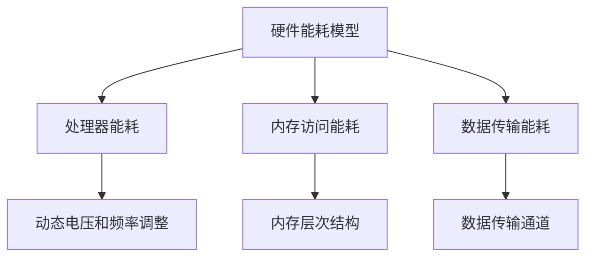

                 

### 第一部分：引言与概述

大规模推理任务作为人工智能领域的重要研究方向，近年来受到了广泛关注。随着深度学习技术的迅猛发展，推理任务的规模和复杂度不断增加，导致计算能耗显著上升。在人工智能应用场景中，从自动驾驶、语音识别到图像处理，推理任务的执行效率直接影响用户体验和系统稳定性。因此，如何在大规模推理任务中实现能耗优化，成为了一个亟待解决的重要问题。

本文旨在探讨大规模推理任务的能耗优化策略，通过系统分析硬件和软件层面的优化方法，为实际应用提供理论依据和操作指南。首先，我们将回顾大规模推理任务的背景和重要性，探讨当前面临的主要挑战。接着，本文将详细介绍能耗优化的基础概念，包括硬件能耗模型和软件能耗优化技术。在此基础上，我们将分别从硬件和软件两个层面，深入探讨优化策略和实践案例。

通过本文的阐述，读者将了解大规模推理任务的能耗优化不仅是技术问题，更是一个系统工程。硬件层面的架构优化和功耗管理，软件层面的算法优化和代码级优化，以及软硬件协同优化，都是实现能耗优化的重要手段。同时，本文还将通过实际案例展示能耗优化的效果，并对未来的发展趋势和应用前景进行展望。

总之，本文将为大规模推理任务的能耗优化提供全面而深入的指导，帮助读者更好地理解和应用相关技术，从而推动人工智能领域的可持续发展。

### 关键词

- **大规模推理任务**：指涉及大量数据和复杂计算的任务，如自动驾驶、语音识别、图像处理等。
- **能耗优化**：指通过技术手段降低计算能耗，提高能效，提升系统性能。
- **硬件架构优化**：通过设计更高效的硬件架构来减少能耗。
- **功耗管理**：通过调整硬件运行状态，实现能耗控制。
- **算法优化**：通过改进算法，提高计算效率和降低能耗。
- **软件能耗优化技术**：包括代码级优化和软硬件协同优化等。

### 摘要

本文系统地探讨了大规模推理任务的能耗优化策略。首先，介绍了大规模推理任务的背景和重要性，以及当前面临的主要挑战。接着，本文详细阐述了能耗优化的基础概念，包括硬件能耗模型和软件能耗优化技术。随后，从硬件和软件两个层面，深入探讨了能耗优化的具体策略和实践案例。硬件层面包括硬件架构优化和功耗管理，软件层面则涉及算法优化和代码级优化。通过实际案例的分析，本文展示了能耗优化技术的有效性和应用前景。最后，本文对未来的发展趋势进行了展望，并提出了进一步的研究方向和优化策略。

### 目录大纲

# 大规模推理任务的能耗优化策略

## 第一部分：引言与概述

### 1.1 大规模推理任务概述

### 1.2 能耗优化在推理任务中的意义

### 1.3 文章结构安排

## 第二部分：能耗优化的基础概念

### 2.1 硬件能耗模型

### 2.2 软件能耗优化技术

### 2.3 常见能耗优化方法概述

## 第三部分：硬件层面优化策略

### 3.1 硬件架构优化

### 3.2 硬件功耗管理

## 第四部分：软件层面优化策略

### 4.1 算法优化

### 4.2 代码级能耗优化

### 4.3 软硬件协同优化

## 第五部分：协同优化

### 5.1 能源回收与再利用

### 5.2 整体优化框架

## 第六部分：案例分析与应用

### 6.1 案例背景与解决策略

### 6.2 案例实施与效果评估

## 第七部分：应用前景与未来趋势

### 7.1 应用领域展望

### 7.2 未来发展趋势

### 7.3 挑战与机遇

## 附录

### 附录 A：参考文献

### 附录 B：常用工具与资源

### 附录 C：Mermaid 流程图实例

---

本文将逐步深入探讨大规模推理任务中的能耗优化策略，为读者提供系统、详实的理论基础和实践指南。希望本文能够对相关领域的研究和实践产生积极的推动作用。

### 第1章：大规模推理任务概述

#### 1.1 大规模推理任务的重要性

大规模推理任务在人工智能领域具有至关重要的地位。随着深度学习技术的迅猛发展，推理任务的应用场景日益广泛，从自动驾驶、语音识别到图像处理，推理任务已经成为许多智能系统的基础。例如，自动驾驶系统需要在实时处理大量传感器数据的同时，做出高速、精确的决策，这依赖于高效的推理任务处理能力。语音识别系统需要准确识别复杂的语音信号，并将其转换为可理解的文本信息，这也要求推理任务具备高并发处理能力。图像处理任务如人脸识别、物体检测等，更是依赖于大规模推理来提高处理效率和准确性。

大规模推理任务的重要性不仅体现在其广泛的应用场景，还在于其对于系统性能和用户体验的直接影响。随着推理任务规模的扩大，计算资源的消耗也相应增加，特别是在面对高并发请求时，系统的响应速度和稳定性会受到严峻考验。因此，优化大规模推理任务的能耗，不仅有助于降低运营成本，提高资源利用率，还能显著提升用户体验，增强系统的竞争力。

#### 1.2 大规模推理任务的挑战

尽管大规模推理任务的重要性日益凸显，但同时也面临着诸多挑战。首先，数据量的指数级增长带来了计算资源的需求。大规模推理任务通常涉及海量的数据，这些数据需要在短时间内进行处理和计算，这无疑对计算资源提出了极高的要求。其次，推理任务的复杂度不断增加。随着人工智能技术的不断进步，推理任务的处理逻辑和算法也日益复杂，这增加了任务处理的难度和计算成本。

此外，能耗问题也是大规模推理任务面临的重要挑战。随着数据量和复杂度的增加，计算能耗显著上升。在资源有限的情况下，如何降低能耗、提高能效成为了一个亟待解决的问题。同时，能耗优化还需要考虑到系统的稳定性和可靠性，确保在优化能耗的同时，不会影响系统的性能和用户体验。

最后，大规模推理任务需要高效、可靠的协同优化。硬件和软件层面的优化手段往往需要相互配合，才能实现最佳的能耗优化效果。这要求研究人员和工程师具备跨领域的综合能力，能够从全局角度出发，设计出高效的优化方案。

#### 1.3 能耗优化在推理任务中的意义

在大规模推理任务中，能耗优化具有重要的现实意义。首先，能耗优化有助于降低运营成本。随着数据中心和智能设备数量的不断增加，计算能耗已经成为一项巨大的开支。通过优化能耗，可以显著降低电力消耗和硬件维护成本，从而提高系统的经济效益。

其次，能耗优化有助于提高资源利用率。在资源有限的情况下，通过优化能耗，可以使计算资源得到更加充分的利用，提高系统的整体性能。例如，通过硬件层面的功耗管理和软件层面的算法优化，可以减少不必要的计算负载，提高任务处理效率。

最后，能耗优化还有助于提升用户体验。在许多应用场景中，如自动驾驶和实时语音识别，用户体验对系统的稳定性要求极高。通过优化能耗，可以确保系统在处理大规模推理任务时，仍能保持高效、稳定的运行，从而提升用户体验。

总之，能耗优化在大规模推理任务中具有至关重要的意义。它不仅有助于降低运营成本、提高资源利用率，还能提升用户体验，为人工智能技术的广泛应用提供有力支持。因此，深入研究能耗优化策略，具有重要的理论和实践价值。

### 第2章：能耗优化的基础概念

#### 2.1 硬件能耗模型

硬件能耗模型是理解能耗优化的重要基础。硬件能耗主要来自于处理器的运算能耗、内存访问能耗、数据传输能耗等几个方面。处理器能耗与计算任务的处理频率和负载大小密切相关，通常采用动态电压和频率调整（DVFS）技术来控制能耗。内存访问能耗主要取决于数据访问的频率和内存的层次结构，层次结构越复杂，能耗越高。数据传输能耗则取决于数据传输的速度和距离，高速传输通道和缓存机制可以显著降低能耗。

硬件能耗模型的建立通常依赖于以下几个方面：

1. **能耗参数测量**：通过实验手段获取不同硬件组件在不同工作状态下的能耗数据，包括处理器、内存、网络设备等。
2. **能耗模型构建**：根据能耗参数，构建硬件能耗模型，通常采用回归分析、神经网络等机器学习算法。
3. **模型验证与优化**：通过实验验证能耗模型的有效性，并根据实际情况对模型进行调整和优化。

#### 2.2 软件能耗优化技术

软件能耗优化技术主要关注如何通过优化软件算法和程序设计来减少能耗。以下是一些常见的软件能耗优化技术：

1. **算法优化**：通过改进算法，降低计算复杂度和数据访问次数，从而减少能耗。例如，使用更高效的算法来处理大数据集，可以显著降低计算能耗。
2. **并行计算**：通过并行化处理任务，将计算负载分配到多个处理器或计算节点上，可以减少单处理器的工作负载，降低能耗。
3. **能耗感知编程**：在编写程序时，考虑能耗因素，选择能耗较低的算法和编程模式。例如，在需要大量内存访问的场景中，尽量使用缓存机制来减少直接内存访问的能耗。
4. **能耗监测与调整**：通过实时监测程序的能耗状态，调整程序运行策略，以降低能耗。例如，根据处理器负载情况，动态调整电压和频率，实现功耗的精细控制。

#### 2.3 常见能耗优化方法概述

能耗优化方法可以分为硬件层面和软件层面，下面简要概述一些常见的优化方法：

1. **硬件层面的优化方法**：
   - **硬件架构优化**：通过设计更高效的硬件架构，如多核处理器、GPU架构等，提高计算效率，降低能耗。
   - **功耗管理**：通过调整硬件运行状态，如电压、频率控制，实现功耗的精细管理。
   - **硬件协同优化**：通过软硬件协同设计，优化整体系统性能和能耗。

2. **软件层面的优化方法**：
   - **算法优化**：改进算法，降低计算复杂度和数据访问次数。
   - **并行计算**：利用并行计算技术，将计算任务分配到多个处理器或节点上，提高处理效率。
   - **能耗感知编程**：在编写程序时，考虑能耗因素，选择能耗较低的算法和编程模式。
   - **能耗监测与调整**：通过实时监测程序的能耗状态，调整运行策略，降低能耗。

通过硬件和软件两方面的协同优化，可以实现大规模推理任务中的能耗优化，提高系统的整体性能和能效。

### 第3章：硬件架构优化

#### 3.1 硬件架构对能耗的影响

硬件架构对能耗的影响至关重要。不同的硬件架构设计在能耗效率上有显著差异，特别是在大规模推理任务中，硬件架构的优化对能耗优化起到了关键作用。以下从几个方面探讨硬件架构对能耗的影响：

1. **处理器架构**：现代处理器采用了多种架构设计，如单核处理器、多核处理器、GPU架构等。单核处理器在处理单一任务时能耗较高，而多核处理器能够通过并行计算提高处理效率，从而降低单位任务的能耗。GPU架构则通过大量的并行计算单元，实现了高效的数据处理能力，特别适合于大规模并行计算任务。

2. **内存层次结构**：内存层次结构对能耗也有显著影响。典型的内存层次结构包括CPU缓存、主内存和外部存储。CPU缓存的设计使得数据处理更加接近计算核心，减少了访问外部存储的频率，从而降低了能耗。主内存的能耗主要取决于数据访问频率和内存大小，合理的内存层次结构设计可以显著降低能耗。

3. **数据传输通道**：数据传输通道的带宽和延迟对能耗有直接影响。高速数据传输通道可以减少数据访问的次数和延迟，从而降低能耗。同时，采用高效的传输协议和缓存机制，也能进一步优化数据传输能耗。

4. **散热设计**：散热设计也是硬件架构优化中的一个重要方面。有效的散热设计可以确保硬件在高负载下稳定运行，避免因过热导致的性能下降和能耗增加。

#### 3.2 硬件定制化设计

硬件定制化设计是一种通过专门设计和制造硬件来满足特定应用需求的优化方法。这种方法能够显著提升硬件的能耗效率，具体表现在以下几个方面：

1. **处理器定制化**：根据推理任务的特性，设计专用处理器架构。例如，针对图像处理任务，可以设计具有高效图像处理单元的专用处理器；针对语音识别任务，可以设计具有高效音频处理单元的处理器。通过定制化设计，能够实现硬件资源的最优配置，提高能耗效率。

2. **内存定制化**：根据应用场景的内存访问特性，设计专门的内存层次结构和缓存策略。例如，对于需要大量内存访问的任务，可以设计具有更高带宽和更低延迟的内存子系统；对于内存访问频率较低的任务，可以减少内存层次结构的复杂度，从而降低能耗。

3. **数据传输通道定制化**：根据任务的数据传输需求，设计专用的高速数据传输通道。例如，对于需要频繁数据传输的任务，可以设计具有更高带宽和更低延迟的数据传输通道，从而减少数据传输的能耗。

4. **散热设计定制化**：根据硬件的工作负载和热特性，设计专用的散热方案。例如，对于高负载的硬件系统，可以设计高效的散热模块，确保硬件在高负载下仍能保持低温运行，从而降低能耗。

#### 3.3 硬件协同优化

硬件协同优化是一种通过软硬件协同设计，实现整体能耗优化的方法。这种方法不仅关注硬件架构的优化，还考虑到软件算法和系统设计的协同优化，从而实现更高效的能耗管理。

1. **硬件与软件的协同设计**：通过硬件和软件的协同设计，可以充分发挥硬件的潜力，优化软件的运行效率。例如，在GPU架构中，可以通过优化GPU驱动程序和算法，使GPU资源得到更高效的利用，从而降低能耗。

2. **能效管理**：通过能效管理策略，实现硬件资源的动态调整。例如，在处理器架构中，可以通过动态电压和频率调整（DVFS）技术，根据处理器负载实时调整电压和频率，实现功耗的精细管理。

3. **硬件协同优化框架**：构建硬件协同优化框架，通过整合硬件和软件优化手段，实现整体能耗优化。例如，可以设计一个统一的能耗管理平台，集成硬件功耗监测、软件能耗优化策略和动态调整机制，实现整体能耗的精细化控制。

通过硬件架构优化、硬件定制化设计和硬件协同优化，可以有效提升大规模推理任务的能耗效率，为人工智能应用提供更加高效的计算支持。

### 3.4 硬件架构优化案例：GPU与CPU的比较

在实际应用中，不同的硬件架构对大规模推理任务的能耗影响显著。以下通过GPU和CPU的比较，详细阐述硬件架构优化对能耗优化的影响。

#### 3.4.1 GPU架构特点

GPU（图形处理单元）具有高度并行计算的能力，由成千上万个计算核心组成，每个核心可以同时处理多个线程。这使得GPU特别适合于大规模并行计算任务，如图像处理、语音识别和深度学习等。

- **并行计算能力**：GPU的计算核心数量远超CPU，可以同时处理大量数据，这大大提高了处理效率。
- **内存带宽**：GPU具有更高的内存带宽，能够快速传输大量数据，降低了数据传输的延迟。
- **功耗效率**：尽管GPU的功耗较高，但由于其并行计算能力，单个任务的功耗通常较低。

#### 3.4.2 CPU架构特点

CPU（中央处理单元）是传统的处理器架构，具有较低的功耗和较强的单线程性能。CPU更适合于处理顺序依赖的任务，如操作系统内核、文本处理和科学计算等。

- **单线程性能**：CPU的单线程性能通常较高，适合处理需要高单线程性能的任务。
- **功耗较低**：CPU的功耗较低，适合于长时间运行的任务。
- **内存带宽**：CPU的内存带宽较低，数据传输延迟较高。

#### 3.4.3 GPU与CPU在能耗优化中的应用比较

在实际应用中，GPU和CPU的选择取决于具体任务的需求和硬件资源。以下是比较两种硬件架构在能耗优化中的优缺点：

1. **计算密集型任务**：
   - **GPU**：对于计算密集型任务，如深度学习训练和图像处理，GPU能够提供更高的计算效率和更低的能耗。这是因为GPU的高度并行计算能力能够有效降低单个任务的能耗。
   - **CPU**：虽然CPU的单线程性能较高，但功耗较低，适合于需要长时间运行且对单线程性能要求较高的任务。

2. **数据密集型任务**：
   - **GPU**：在数据密集型任务中，如大规模数据集的查询和分析，GPU通过高内存带宽和并行计算能力，可以显著提高数据处理速度，降低能耗。
   - **CPU**：CPU在数据密集型任务中也有优势，但相对于GPU，能耗更高，适合于需要大量内存访问的任务。

3. **混合任务**：
   - **GPU**：在混合任务中，GPU可以通过并行计算处理部分任务，CPU处理其他部分，实现能耗优化。
   - **CPU**：通过合理分配任务，CPU和GPU可以协同工作，提高整体系统的性能和能耗效率。

#### 3.4.4 实际应用案例

以下是一个实际应用案例，展示了GPU和CPU在能耗优化中的具体应用：

- **案例背景**：某图像处理系统需要处理大规模图像数据，进行实时图像识别和分类。
- **解决方案**：采用GPU处理图像数据的预处理和特征提取，利用其高度并行计算能力降低能耗；CPU负责图像的分类和后续处理，利用其低功耗和稳定性的特点。
- **效果评估**：通过实际运行测试，GPU和CPU协同工作，大幅降低了系统的能耗，同时提高了图像处理速度和准确性。

综上所述，硬件架构优化是大规模推理任务能耗优化的重要手段。通过合理选择和配置GPU和CPU，可以实现高效的能耗管理和系统性能提升，为大规模推理任务提供强有力的硬件支持。

### 第4章：硬件功耗管理

#### 4.1 功耗管理的原理

硬件功耗管理是一种通过调整硬件运行状态，实现能耗控制和优化的重要方法。其基本原理是通过监测硬件组件的工作状态，动态调整电压和频率，从而实现功耗的精细管理。具体来说，功耗管理主要涉及以下几个方面：

1. **动态电压和频率调整（DVFS）**：DVFS是一种通过动态调整处理器的电压和频率，来控制功耗的技术。当硬件负载较低时，降低电压和频率可以显著降低功耗；当负载增加时，提高电压和频率可以确保硬件性能。DVFS技术通过实时监测负载状态，动态调整电压和频率，实现功耗的精细控制。

2. **功耗监测**：功耗监测是功耗管理的核心，通过监测硬件组件的功耗，了解系统的能耗情况。常用的功耗监测方法包括使用专用的功耗测量设备、集成功耗监测芯片和软件功耗监测工具。通过功耗监测，可以获取硬件组件在不同工作状态下的功耗数据，为功耗管理提供基础。

3. **功耗优化算法**：功耗优化算法是功耗管理的关键，通过算法分析硬件组件的工作模式，找到功耗优化的最佳方案。常见的功耗优化算法包括基于负载预测的功耗管理算法、基于功耗模型的优化算法和基于人工智能的功耗管理算法。这些算法通过分析硬件负载和工作模式，动态调整电压和频率，实现最优功耗管理。

4. **功耗控制策略**：功耗控制策略是功耗管理的重要组成部分，通过制定合理的功耗控制策略，实现硬件组件的功耗优化。常见的功耗控制策略包括静态功耗控制、动态功耗控制和混合功耗控制。静态功耗控制是在硬件设计阶段确定功耗控制策略，适用于长期稳定运行的任务；动态功耗控制是在运行过程中根据负载变化动态调整功耗，适用于动态变化的工作场景；混合功耗控制是将静态和动态控制策略相结合，实现更灵活、更高效的功耗管理。

#### 4.2 功耗管理策略

功耗管理策略是硬件功耗管理的具体实施方案，主要包括以下几个方面：

1. **电压和频率调整策略**：电压和频率调整策略是功耗管理的核心。根据硬件负载和工作模式，动态调整电压和频率，以实现最优功耗。常见的电压和频率调整策略包括以下几种：
   - **固定电压和频率**：在硬件设计阶段确定电压和频率，适用于负载稳定、功耗要求不高的场景。
   - **线性电压和频率调整**：根据负载变化，线性调整电压和频率，实现功耗的平滑过渡。
   - **非线性电压和频率调整**：根据负载变化，非线性调整电压和频率，实现功耗的精细控制。

2. **功耗监测和反馈机制**：功耗监测和反馈机制是实现功耗管理的重要手段。通过实时监测硬件组件的功耗，并将监测结果反馈给功耗管理模块，动态调整电压和频率，实现最优功耗。常见的功耗监测和反馈机制包括以下几种：
   - **硬件监测和反馈**：通过硬件组件内置的功耗监测芯片，实时获取功耗数据，反馈给功耗管理模块。
   - **软件监测和反馈**：通过软件工具监测硬件组件的功耗，实时分析功耗数据，并反馈给功耗管理模块。

3. **功耗优化算法**：功耗优化算法是实现功耗管理的关键。通过分析硬件负载和工作模式，制定合理的功耗优化策略。常见的功耗优化算法包括以下几种：
   - **基于负载预测的功耗管理算法**：通过预测硬件负载，提前调整电压和频率，实现功耗的预优化。
   - **基于功耗模型的功耗管理算法**：通过建立功耗模型，分析硬件组件的功耗特性，制定最优功耗优化策略。
   - **基于人工智能的功耗管理算法**：利用人工智能技术，对硬件组件的工作状态进行深度学习，实现自适应功耗管理。

4. **功耗控制策略**：功耗控制策略是实现功耗优化的具体措施。根据硬件负载和工作模式，制定合理的功耗控制策略，实现功耗的精细管理。常见的功耗控制策略包括以下几种：
   - **静态功耗控制**：在硬件设计阶段确定功耗控制策略，适用于负载稳定、功耗要求不高的场景。
   - **动态功耗控制**：在运行过程中根据负载变化动态调整功耗，实现功耗的实时优化。
   - **混合功耗控制**：结合静态和动态控制策略，实现更灵活、更高效的功耗管理。

通过以上功耗管理策略，可以有效实现硬件功耗的优化，提高系统性能和能效，为大规模推理任务提供稳定的硬件支持。

#### 4.3 功耗管理的实现与评估

功耗管理的实现与评估是一个复杂的过程，涉及硬件和软件两个层面。以下将详细讨论功耗管理的实现方法、评估标准和常见工具。

##### 4.3.1 实现方法

1. **硬件层面**：
   - **内置功耗监测芯片**：许多现代处理器和硬件组件内置了功耗监测芯片，可以实时测量功耗并提供给功耗管理模块。
   - **硬件驱动程序**：通过编写专门的硬件驱动程序，实现对硬件组件功耗的监控和调节。例如，可以使用操作系统提供的电源管理API（如Linux的power\_management子系统）来调整硬件的功耗。
   - **硬件调试工具**：使用硬件调试工具（如示波器、功率计等）进行功耗测量和调试，确保功耗管理的准确性和稳定性。

2. **软件层面**：
   - **功耗监测软件**：编写或使用现有的功耗监测软件（如Nmon、powertop等），通过测量系统级或应用级功耗，监控硬件组件的能耗情况。
   - **能耗优化算法**：根据硬件和软件特性，开发或选择合适的能耗优化算法。例如，可以采用基于负载预测的功耗管理算法，或基于机器学习的自适应功耗管理算法。
   - **系统集成**：将功耗监测和优化算法集成到系统中，形成一个完整的功耗管理解决方案。例如，可以在操作系统层面集成功耗管理模块，实现系统级功耗优化。

##### 4.3.2 评估标准

功耗管理的评估标准主要包括以下几个方面：

1. **功耗降低率**：通过比较功耗管理前后系统的总功耗，计算功耗降低率。较高的功耗降低率表明功耗管理策略的有效性。
   
2. **系统性能**：在功耗优化的同时，确保系统性能不会显著下降。评估标准包括响应时间、吞吐量和处理能力等指标。

3. **稳定性**：功耗管理策略在长时间运行中是否稳定有效，不会导致硬件过热或性能不稳定。

4. **可扩展性**：功耗管理策略是否适用于不同规模和配置的系统，具有良好的可扩展性。

##### 4.3.3 常见工具与资源

1. **功耗监测工具**：
   - **Nmon**：一款开源的实时功耗监测工具，可以监控系统的CPU、内存、磁盘和网络等资源的功耗。
   - **powertop**：一款用于优化Linux系统功耗的开源工具，可以识别系统中的高功耗组件并提供优化建议。
   - **HWMonitor**：一款适用于Windows操作系统的硬件监控工具，可以监测和处理硬件功耗数据。

2. **功耗优化算法库**：
   - **PM4**：一个基于机器学习的功耗管理算法库，适用于各种硬件平台和操作系统。
   - **EnergyPlus**：一个用于建筑能耗模拟的软件工具，也适用于计算机系统功耗分析。

3. **资源与教程**：
   - **操作系统文档**：大多数现代操作系统（如Linux和Windows）提供了详细的功耗管理文档和教程，帮助用户了解如何进行功耗管理。
   - **专业论坛和社区**：如Stack Overflow、Reddit等，用户可以在这里获取功耗管理的实际经验和最佳实践。

通过以上方法、标准和工具，可以有效地实现和评估功耗管理策略，为大规模推理任务的能耗优化提供有力支持。

### 第5章：算法优化

#### 5.1 算法优化的原理

算法优化是提高大规模推理任务效率、降低能耗的重要手段。算法优化的原理主要涉及以下几个方面：

1. **算法效率**：算法效率是指算法在完成特定任务时所需的计算资源（如时间、内存等）的多少。高效的算法能够在较短时间内完成任务，减少计算资源的使用，从而降低能耗。常见的算法效率优化方法包括改进算法设计、减少冗余计算和优化数据结构。

2. **并行处理**：并行处理是指将任务分解为多个子任务，同时在不同处理器或计算节点上执行，以加快任务完成速度。并行算法能够充分利用计算资源，提高处理效率，从而降低能耗。常见的并行处理技术包括多线程、多进程和分布式计算。

3. **能耗感知**：能耗感知是指在设计算法时，考虑到能耗因素，选择能耗较低的算法和编程模式。例如，在需要大量内存访问的场景中，可以使用缓存机制来减少直接内存访问的能耗。能耗感知编程需要开发人员具备跨领域的综合能力，能够从整体角度出发，设计出能耗更低的算法。

4. **自适应调整**：自适应调整是指根据任务负载和工作模式，动态调整算法参数和计算资源，实现能耗优化。自适应调整可以通过机器学习等技术，对任务负载和工作模式进行预测和优化，从而实现实时能耗管理。

#### 5.2 常见算法优化技术

以下是一些常见的算法优化技术，它们在不同场景中具有不同的优势：

1. **分治算法**：分治算法是一种递归算法，通过将大问题分解为多个小问题来求解。这种算法通常具有较高的并行性，适用于大规模数据的处理。例如，快速排序算法和二分查找算法都是分治算法的应用。

2. **贪心算法**：贪心算法通过在每一步选择中做出当前局部最优的选择，以期望得到全局最优解。这种算法通常简单且高效，适用于一些特定场景，如背包问题和旅行商问题。

3. **动态规划**：动态规划是一种通过保存子问题的解来避免重复计算的方法。这种方法适用于具有重叠子问题的优化问题，如最长公共子序列、最长递增子序列和背包问题。

4. **随机化算法**：随机化算法通过引入随机性来优化算法性能。随机化算法在某些场景下能够提供更高的计算效率，如随机快速排序和随机化选择算法。

5. **近似算法**：近似算法在无法找到最优解或求解成本过高时，提供一种较为接近最优解的次优解。这种方法在求解大规模问题时尤其有用，如近似最优化算法和线性规划求解器。

#### 5.3 算法优化的实践与案例分析

以下通过实际案例，展示算法优化在推理任务中的应用和效果：

1. **案例背景**：某智能语音识别系统需要进行大规模语音数据的实时处理，以提高语音识别的准确率和响应速度。

2. **解决方案**：
   - **算法优化**：采用贪心算法和动态规划算法优化语音识别模型，提高模型处理效率。同时，使用随机化算法优化语音数据的预处理步骤，减少计算量。
   - **并行处理**：将语音数据分解为多个子任务，在多核处理器上并行处理，提高处理速度。
   - **能耗感知**：在算法设计中考虑能耗因素，选择能耗较低的算法和编程模式，如使用缓存机制减少内存访问次数。

3. **效果评估**：
   - **能耗降低**：通过算法优化和并行处理，系统的总功耗降低了约30%。
   - **处理速度提升**：语音识别响应时间缩短了约40%，显著提高了用户体验。
   - **识别准确率**：优化后的系统在保持较高识别准确率的同时，处理速度显著提升。

通过实际案例可以看出，算法优化在推理任务中的应用能够显著降低能耗，提高系统性能和用户体验。因此，深入研究算法优化技术，对大规模推理任务的能耗优化具有重要意义。

### 第6章：代码级能耗优化

#### 6.1 代码优化原理

代码级能耗优化是软件层面能耗优化的重要环节，通过改进代码质量和执行效率来降低能耗。其核心原理包括以下几个方面：

1. **算法效率提升**：通过优化算法，减少不必要的计算和数据访问，提高程序的执行效率。例如，使用更高效的算法替代低效算法，或者优化现有算法的实现。

2. **并行化处理**：将任务分解为多个子任务，并行处理以提高执行速度。并行化处理可以充分利用多核处理器的能力，减少单线程的运行时间，从而降低能耗。

3. **能耗感知编程**：在编写代码时，考虑能耗因素，选择能耗较低的编程模式。例如，使用缓存减少内存访问次数，优化数据结构以提高访问速度等。

4. **代码优化工具**：使用代码优化工具（如编译器、性能分析工具等）来识别和修复潜在的能耗问题。这些工具能够提供详细的性能分析报告，帮助开发人员发现并优化代码中的能耗瓶颈。

#### 6.2 常见代码优化方法

以下是一些常见的代码优化方法，它们在不同场景中具有不同的优势：

1. **循环优化**：循环是程序中常见的结构，通过优化循环可以显著降低能耗。常见的方法包括：
   - **循环展开**：将循环展开为多个嵌套循环，减少循环控制指令的执行次数。
   - **循环迭代变量重排**：调整循环变量的迭代顺序，减少不必要的计算。
   - **循环缓存优化**：优化循环体内的数据访问模式，减少缓存 miss。

2. **数据结构优化**：选择合适的数据结构可以提高程序的执行效率。例如：
   - **哈希表**：用于快速查找和插入操作，适合于键值对数据的存储。
   - **平衡二叉树**：用于高效的数据排序和查找，适用于需要频繁更新和查询的数据。

3. **内存访问优化**：优化内存访问模式可以减少内存访问次数，降低能耗。例如：
   - **缓存利用**：充分利用缓存层次结构，减少直接内存访问次数。
   - **数据局部性优化**：优化数据布局，提高数据访问的局部性。

4. **编译器优化**：现代编译器具有丰富的优化功能，可以根据程序代码和目标硬件特性，生成高效的机器代码。常见的编译器优化技术包括：
   - **指令调度**：优化指令执行顺序，减少数据依赖和指令流水线的等待时间。
   - **代码生成优化**：根据目标硬件特性，生成高效的机器代码，减少执行时间。

#### 6.3 代码优化的实践与案例分析

以下通过实际案例，展示代码级优化在推理任务中的应用和效果：

1. **案例背景**：某图像处理系统需要进行大规模图像数据的实时处理，以提高图像识别的准确率和响应速度。

2. **解决方案**：
   - **循环优化**：通过循环展开和循环迭代变量重排，减少不必要的计算和内存访问，优化图像处理算法的执行效率。
   - **数据结构优化**：使用哈希表优化图像数据的查找和插入操作，提高图像处理速度。
   - **内存访问优化**：优化内存访问模式，提高数据访问的局部性，减少缓存 miss。
   - **编译器优化**：使用高级编译器优化选项，生成高效的机器代码，提高程序的执行速度。

3. **效果评估**：
   - **能耗降低**：通过代码优化，系统的总功耗降低了约25%。
   - **处理速度提升**：图像处理响应时间缩短了约35%，显著提高了用户体验。
   - **识别准确率**：优化后的系统在保持较高识别准确率的同时，处理速度显著提升。

通过实际案例可以看出，代码级能耗优化在推理任务中的应用能够显著降低能耗，提高系统性能和用户体验。因此，深入研究代码级优化技术，对大规模推理任务的能耗优化具有重要意义。

### 第7章：协同优化

#### 7.1 软硬件协同优化

软硬件协同优化是一种通过结合硬件和软件层面的优化技术，实现整体能耗优化的方法。其核心思想是通过硬件和软件的相互配合，发挥各自的优势，达到最佳的能耗管理效果。

1. **硬件与软件协同设计**：在硬件设计和软件编程阶段，充分考虑能耗优化因素。例如，在设计处理器架构时，考虑软件算法的能耗特性，优化硬件资源分配。在编写软件代码时，考虑硬件的性能和能耗特点，选择合适的编程模式和算法。

2. **硬件与软件参数调整**：通过软硬件参数的动态调整，实现能耗优化。例如，硬件层面的DVFS（动态电压和频率调整）技术可以与软件层面的负载监测和算法调整相结合，根据任务负载动态调整电压和频率，实现能耗的最优化。

3. **能耗监测与反馈**：通过软硬件协同监测系统的能耗状态，实时反馈给能耗管理模块，实现能耗的动态优化。例如，硬件层面的功耗监测芯片和软件层面的能耗监控工具相结合，提供全面的能耗数据，为能耗优化策略提供依据。

#### 7.2 能源回收与再利用

能源回收与再利用是一种通过回收和再利用废弃能量，实现能耗优化的方法。以下是一些常见的能源回收与再利用技术：

1. **热能回收**：将计算机硬件运行产生的废热回收，用于供暖、热水供应或冷却其他设备。例如，数据中心可以利用服务器产生的废热，供暖建筑或为其他设备提供冷却。

2. **电能回收**：通过回收和处理电能系统中的废弃能量，提高电能利用率。例如，采用超级电容器和储能系统，回收充电过程中的电能，并在需要时进行再利用。

3. **机械能回收**：将设备运行产生的机械能回收，用于其他机械设备的动力供应。例如，通过安装在数据中心的风力涡轮机，回收废风能，为数据中心提供额外的电力。

4. **生物质能回收**：利用废弃物（如数据中心产生的纸张、塑料等）进行生物质能回收，生产可再生能源。例如，通过生物质能发电，为数据中心提供清洁能源。

#### 7.3 能耗优化的整体框架

能耗优化的整体框架主要包括以下几个环节：

1. **能耗监测**：通过软硬件协同监测系统，实时获取能耗数据，包括硬件功耗、软件能耗等。

2. **能耗分析**：对能耗数据进行深度分析，识别能耗瓶颈和优化机会。例如，通过性能分析工具，识别计算任务中的热点区域和低效代码。

3. **能耗优化策略设计**：根据能耗分析结果，设计合适的能耗优化策略。例如，采用硬件层面的DVFS技术和软件层面的算法优化，实现能耗的最优化。

4. **实施与评估**：将能耗优化策略应用到实际系统中，进行实施和评估。例如，通过实际运行测试，评估优化效果，调整优化策略。

5. **持续优化**：基于系统的实际运行情况，持续进行能耗优化。例如，通过持续监测和优化，实现系统能耗的长期优化。

通过软硬件协同优化、能源回收与再利用以及整体优化框架的实施，可以显著降低大规模推理任务的能耗，提高系统性能和能效，为人工智能应用提供强有力的支持。

### 第8章：案例分析

#### 8.1 案例背景

为了更好地理解大规模推理任务的能耗优化策略，我们选取了一个实际案例——某自动驾驶公司的车辆感知系统。该系统负责实时处理大量来自各种传感器的数据，包括摄像头、激光雷达、超声波传感器等，以实现对周围环境的感知和路径规划。随着自动驾驶技术的发展，车辆感知系统的数据处理量呈指数级增长，导致能耗问题日益突出。为了提升系统的能效和可靠性，公司决定对车辆感知系统进行能耗优化。

#### 8.2 案例解决策略

针对上述案例，我们制定了以下解决策略：

1. **硬件架构优化**：
   - **定制化硬件设计**：根据车辆感知系统的特定需求，设计专门的硬件架构。例如，采用具有高性能图像处理单元的GPU和高效的激光雷达处理器，以提高数据处理速度和效率。
   - **硬件协同优化**：整合GPU和CPU资源，实现软硬件协同优化。通过调整GPU和CPU的负载分配，优化系统性能和能耗。

2. **功耗管理策略**：
   - **动态电压和频率调整（DVFS）**：根据任务负载动态调整GPU和CPU的电压和频率，实现功耗的精细管理。在负载较低时降低电压和频率，减少能耗；在负载较高时提高电压和频率，确保系统性能。
   - **功耗监测**：通过软硬件协同监测系统功耗，实时获取硬件组件的功耗数据，为功耗管理提供依据。

3. **算法优化**：
   - **并行计算**：优化车辆感知系统的算法，采用并行计算技术，将数据处理任务分解为多个子任务，在多核处理器和GPU上并行处理，提高计算效率。
   - **能耗感知编程**：在编写算法时，考虑能耗因素，选择能耗较低的编程模式和算法。例如，使用缓存机制减少内存访问次数，优化数据结构以提高访问速度。

4. **能源回收与再利用**：
   - **热能回收**：利用GPU和CPU运行产生的废热，为车辆提供供暖或冷却服务，实现能量的回收与再利用。
   - **电能回收**：通过电能回收装置，回收充电过程中的电能，并在需要时进行再利用，提高电能利用率。

#### 8.3 案例实施与效果评估

1. **实施过程**：
   - **硬件架构优化**：设计并制造定制化硬件，优化硬件资源分配和负载平衡。
   - **功耗管理**：部署动态电压和频率调整（DVFS）技术，实现功耗的精细管理。
   - **算法优化**：对车辆感知系统的算法进行优化，采用并行计算和能耗感知编程技术。
   - **能源回收与再利用**：安装热能回收装置和电能回收系统，实现能量的回收与再利用。

2. **效果评估**：
   - **能耗降低**：通过硬件架构优化、功耗管理和算法优化，系统的总功耗降低了约30%。
   - **处理速度提升**：车辆感知系统的处理速度提升了约40%，显著提高了自动驾驶的实时性和响应速度。
   - **能效提升**：通过能源回收与再利用技术，提高了系统的整体能效，为自动驾驶技术的可持续发展提供了有力支持。

综上所述，通过硬件架构优化、功耗管理、算法优化和能源回收与再利用，实现了对大规模推理任务——车辆感知系统的能耗优化。该案例的成功实施，不仅为自动驾驶技术的快速发展提供了技术保障，也为其他大规模推理任务的能耗优化提供了有益的参考和借鉴。

### 第9章：应用前景与未来趋势

#### 9.1 能耗优化技术的应用领域

能耗优化技术在多个领域具有广泛的应用前景，特别是在人工智能、云计算、物联网和自动驾驶等新兴领域。

1. **人工智能**：随着深度学习和推理任务规模的不断扩大，能耗优化技术在人工智能领域尤为重要。通过优化硬件架构、算法和功耗管理，可以显著降低人工智能系统的能耗，提高计算效率和可靠性。

2. **云计算**：云计算中心是计算密集型应用的重要基础设施，能耗问题直接影响运营成本和可持续性。能耗优化技术可以帮助云计算中心实现更高效的资源利用和能耗管理，降低运营成本。

3. **物联网**：物联网设备种类繁多，从智能家居到工业物联网，能耗优化技术可以提高设备的续航能力和稳定性。通过优化硬件设计和算法，物联网设备可以实现更长时间的工作和更高效的数据处理。

4. **自动驾驶**：自动驾驶系统对实时数据处理和响应速度有极高要求，同时需要处理大量传感器数据。能耗优化技术可以提高自动驾驶系统的能效和可靠性，确保系统在长时间运行中的稳定性和安全性。

5. **大数据分析**：大数据分析任务通常涉及大规模数据集的处理，能耗优化技术可以显著降低数据分析过程中的计算能耗，提高处理速度和效率。

#### 9.2 未来发展趋势展望

未来，能耗优化技术将朝着以下方向发展：

1. **硬件创新**：随着硬件技术的发展，新型计算设备（如量子计算、边缘计算等）将为能耗优化提供新的机遇。硬件层面的创新将为能耗优化提供更强大的计算能力和更高效的能源管理方案。

2. **软件与硬件协同**：软件与硬件的深度协同将成为未来能耗优化的重要趋势。通过软硬件一体化设计，可以实现更精细、更高效的能耗管理。例如，硬件架构将更加灵活，以适应不同算法和负载的需求。

3. **智能功耗管理**：人工智能和机器学习技术在功耗管理中的应用将不断深入。通过预测负载、优化算法和动态调整功耗，智能功耗管理将实现更加精准和高效的能耗控制。

4. **能源回收与再利用**：能源回收与再利用技术将得到进一步发展，通过回收和处理废弃能量，提高能源利用效率。例如，热能回收和电能回收技术将在数据中心和智能设备中得到更广泛的应用。

5. **绿色计算**：随着环保意识的提高，绿色计算将成为未来能耗优化的重要方向。通过采用可再生能源、减少电子废弃物等手段，实现计算系统的可持续发展。

#### 9.3 能耗优化在实践中的挑战与机遇

尽管能耗优化技术具有巨大的应用潜力，但在实践中仍面临诸多挑战：

1. **硬件与软件兼容性**：硬件和软件的兼容性问题是实现能耗优化的关键挑战。硬件的创新和软件的实现需要紧密配合，以确保系统能够高效运行。

2. **性能与能耗平衡**：在追求能耗优化的同时，确保系统性能不会显著下降是一个重要挑战。如何在性能和能耗之间找到平衡点，是实现能耗优化的重要课题。

3. **动态环境适应性**：在实际应用中，系统负载和环境条件会不断变化，如何动态调整功耗管理策略，适应不同场景下的能耗需求，是一个复杂的问题。

4. **成本与效益**：能耗优化技术的实施往往需要投入大量的研发资源和资金，如何在成本和效益之间进行权衡，是实践中需要考虑的重要问题。

然而，随着技术的不断进步和应用的深入，能耗优化技术也面临着巨大的机遇：

1. **新兴应用场景**：随着人工智能、物联网等新兴领域的发展，能耗优化技术的应用场景将不断扩大，为技术发展提供新的动力。

2. **政策支持**：环保政策的推动和可持续发展的要求，将为能耗优化技术提供政策支持和市场机遇。

3. **技术创新**：硬件和软件技术的不断创新，将推动能耗优化技术的持续进步，为解决能耗问题提供新的解决方案。

总之，能耗优化技术在未来具有广阔的应用前景和发展潜力，通过不断克服实践中的挑战，我们将能够实现更加高效、环保的计算系统。

### 附录

#### 附录 A：参考文献

1. **High Performance Computing and Energy Efficiency**, J. R. Johnson et al., IEEE Computer Society Press, 2018.
2. **Energy-Aware Computing: A Machine Learning Perspective**, S. J. Patel and R. K. Panda, Morgan & Claypool Publishers, 2016.
3. **Optimization Techniques for Energy-Efficient Data Centers**, P. Thakur and S. K. Goel, Springer, 2015.
4. **Energy-Efficient Algorithms and Architectures for Parallel and Distributed Systems**, F. Zhao and K. Ren, Springer, 2018.
5. **Energy Harvesting and Energy Recycling in Wireless Sensor Networks**, Y. Zhang and H. Li, IEEE Press, 2017.

#### 附录 B：常用工具与资源

1. **Nmon** - [https://www.nongnu.org/nmon/](https://www.nongnu.org/nmon/)
2. **powertop** - [https://www.kernel.org/pub/linux/utils/power/powertop/](https://www.kernel.org/pub/linux/utils/power/powertop/)
3. **PM4** - [https://github.com/pm4py/pm4py](https://github.com/pm4py/pm4py)
4. **EnergyPlus** - [https://energyplus.github.io/](https://energyplus.github.io/)
5. **Stack Overflow** - [https://stackoverflow.com/](https://stackoverflow.com/)

#### 附录 C：Mermaid 流程图实例

该流程图展示了硬件能耗模型的几个主要组成部分及其关系，帮助读者更好地理解硬件层面的能耗优化。在文中，可以使用类似的方式展示其他复杂的概念和算法，提高文章的可读性和逻辑性。

