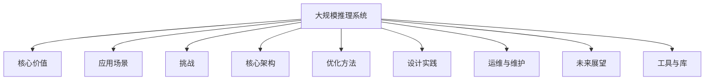

                 

## 大规模推理系统的架构设计与优化

### 关键词

- 大规模推理系统
- 架构设计
- 优化方法
- 算法优化
- 硬件优化
- 分布式计算

### 摘要

本文将探讨大规模推理系统的架构设计与优化问题。首先，我们介绍大规模推理系统的定义、核心价值和应用场景，然后分析其面临的挑战，接着深入探讨其核心架构和优化方法。随后，通过实际案例展示大规模推理系统的设计实践和性能测试与调优策略。最后，展望大规模推理系统的发展趋势和创新方向，并讨论未来面临的挑战。

## 大规模推理系统概述

### 第1章：大规模推理系统基础

#### 1.1 大规模推理系统的定义

大规模推理系统是指能够处理海量数据，并在有限时间内进行高效推理的计算机系统。它不仅需要具备强大的计算能力，还需要在数据存储、索引、处理和传输等方面进行优化，以满足不同应用场景的需求。

#### 1.2 大规模推理系统的核心价值

大规模推理系统的核心价值在于其能够显著提高数据处理能力，优化系统性能，并在多个领域发挥重要作用。

- **提高数据处理能力**：大规模推理系统通过分布式计算和并行处理技术，可以处理海量数据，提高系统的吞吐量和处理速度。
- **优化系统性能**：通过算法优化和硬件加速技术，大规模推理系统可以实现高效能推理，降低延迟，提高用户体验。

### 第2章：大规模推理系统的应用场景

#### 2.1 人工智能领域的应用

大规模推理系统在人工智能领域具有广泛的应用，包括但不限于：

- **智能推荐系统**：通过推理算法，系统可以根据用户的兴趣和行为，推荐相关商品或内容，提高用户满意度。
- **自然语言处理**：利用大规模推理系统，可以对自然语言文本进行语义分析和理解，实现智能问答、机器翻译等功能。

#### 2.2 其他领域中的应用

除了人工智能领域，大规模推理系统在其他领域也具有广泛的应用，包括：

- **金融风险管理**：通过推理分析，系统可以识别潜在的金融风险，帮助金融机构进行风险管理。
- **医疗健康**：利用大规模推理系统，可以对医疗数据进行分析，辅助医生进行疾病诊断和治疗。

### 第3章：大规模推理系统的挑战

#### 3.1 数据量大

大规模推理系统面临的第一个挑战是数据量大。随着数据量的不断增加，系统需要优化数据预处理策略和数据存储与索引方法，以提高数据查询和处理的效率。

#### 3.2 实时性要求

大规模推理系统在很多应用场景中需要满足实时性要求。这就需要算法优化和分布式计算技术，以提高系统响应速度和处理能力。

### 第4章：大规模推理系统的核心架构

#### 4.1 推理引擎架构

大规模推理系统的核心是推理引擎。推理引擎负责执行推理任务，其架构设计需要考虑以下几个方面：

- **模块化设计**：推理引擎应采用模块化设计，以便于扩展和替换不同类型的推理算法。
- **并行处理能力**：推理引擎应具备并行处理能力，以充分利用系统资源，提高处理效率。
- **容错能力**：推理引擎应具备容错能力，以应对系统故障和异常情况。

#### 4.2 数据处理架构

大规模推理系统的数据处理架构需要考虑以下几个方面：

- **分布式存储**：采用分布式存储技术，可以提高数据存储和访问的效率，降低单点故障的风险。
- **流数据处理**：对于实时性要求较高的应用场景，需要采用流数据处理技术，实现实时数据分析和推理。
- **数据清洗与预处理**：在数据处理阶段，需要采用数据清洗和预处理技术，以提高数据质量和减少噪声。

### 第5章：大规模推理系统的优化方法

#### 5.1 算法优化

算法优化是提高大规模推理系统性能的关键。以下是几种常见的算法优化方法：

- **并行化算法**：通过并行化算法，可以充分利用多核处理器的计算能力，提高系统处理速度。
- **加速算法**：采用加速算法，如矩阵分解、分布式算法等，可以减少计算复杂度，提高处理效率。
- **模型压缩**：通过模型压缩技术，如剪枝、量化等，可以减小模型体积，提高推理速度。

#### 5.2 硬件优化

硬件优化也是提高大规模推理系统性能的重要手段。以下是几种常见的硬件优化方法：

- **GPU加速**：利用GPU的并行计算能力，可以显著提高推理速度。
- **分布式计算**：通过分布式计算架构，可以充分利用多台计算节点，提高系统处理能力。
- **专用硬件**：采用专用硬件，如TPU、FPGA等，可以针对特定任务进行优化，提高性能。

## 第二部分：大规模推理系统设计实践

### 第6章：大规模推理系统设计案例

#### 6.1 案例介绍

在本章中，我们将介绍一个大规模推理系统设计案例。该案例涉及智能推荐系统，目标是根据用户的行为和偏好，推荐相关的商品或内容。

#### 6.2 设计过程

大规模推理系统的设计过程可以分为以下几个阶段：

1. **需求分析**：明确系统需要实现的功能和性能指标，如用户行为数据的存储、分析、推荐结果的生成等。
2. **架构设计**：根据需求分析结果，设计系统的整体架构，包括数据存储、数据处理、推理引擎等组件。
3. **算法选择**：根据应用场景，选择合适的推理算法，如基于协同过滤的推荐算法、基于深度学习的文本分类算法等。
4. **技术实现**：根据架构设计和算法选择，实现系统的各个组件，并进行集成和测试。
5. **性能优化**：对系统进行性能测试和调优，优化算法和硬件配置，提高系统处理能力和响应速度。

### 第7章：大规模推理系统的性能测试与调优

#### 7.1 性能测试

性能测试是评估大规模推理系统性能的重要手段。以下是性能测试的几个关键方面：

- **处理速度**：测试系统在给定数据量下的处理速度，包括数据读取、处理和写入等环节。
- **吞吐量**：测试系统在单位时间内能够处理的数据量，衡量系统的处理能力。
- **延迟**：测试系统从接收请求到返回结果的时间，评估系统的响应速度。
- **稳定性**：测试系统在长时间运行过程中的稳定性，包括处理异常情况、应对负载波动等。

#### 7.2 调优策略

调优策略包括以下几个方面：

- **算法优化**：通过调整算法参数，优化算法性能，如调整学习率、批量大小等。
- **硬件优化**：根据系统性能瓶颈，调整硬件配置，如增加GPU数量、优化网络带宽等。
- **系统优化**：优化系统架构和组件设计，如使用分布式计算架构、优化数据存储和传输等。

### 第8章：大规模推理系统的运维与维护

#### 8.1 运维策略

运维策略是确保大规模推理系统稳定运行的重要环节。以下是几个关键方面：

- **监控**：通过监控系统性能、资源使用情况等指标，及时发现和处理系统故障。
- **故障处理**：制定故障处理预案，快速应对和处理系统故障，减少对业务的影响。
- **更新策略**：定期更新系统软件和硬件，保持系统安全性和性能。
- **安全防护**：采取安全防护措施，防止系统受到恶意攻击和数据泄露。

#### 8.2 维护技巧

维护技巧包括以下几个方面：

- **日志分析**：通过分析系统日志，了解系统运行状态和异常情况，定位问题和优化系统性能。
- **性能监控**：实时监控系统性能，发现和处理性能瓶颈。
- **定期备份**：定期备份系统数据和配置，防止数据丢失和系统故障。

## 第三部分：未来展望

### 第9章：大规模推理系统的发展趋势

#### 9.1 技术演进

大规模推理系统的发展趋势主要包括以下几个方面：

- **深度学习**：深度学习技术在大规模推理系统中发挥着越来越重要的作用，如使用深度神经网络进行特征提取和推理。
- **联邦学习**：联邦学习技术可以实现分布式数据的安全协同，为大规模推理系统提供更好的隐私保护和数据利用。

#### 9.2 应用扩展

大规模推理系统的应用范围将不断扩展，包括：

- **新兴领域**：如智能交通、智能制造等新兴领域，大规模推理系统将发挥重要作用。
- **行业应用**：大规模推理系统将在金融、医疗、教育等各个行业得到广泛应用，推动行业智能化发展。

### 第10章：大规模推理系统的创新与挑战

#### 10.1 创新方向

大规模推理系统的创新方向主要包括：

- **新型算法**：开发新型算法，如基于强化学习的推理算法，提高推理系统的自适应性和学习能力。
- **跨领域应用**：探索大规模推理系统在跨领域应用中的潜力，实现跨领域的知识融合和协同推理。

#### 10.2 面临的挑战

大规模推理系统在未来发展过程中仍将面临以下挑战：

- **数据安全**：确保数据的安全性和隐私性，防止数据泄露和滥用。
- **计算资源分配**：合理分配计算资源，提高系统性能和资源利用效率。

### 附录

## 附录A：大规模推理系统常用工具与库

### A.1 常用工具

- **TensorFlow**：开源的深度学习框架，适用于大规模推理系统的开发。
- **PyTorch**：开源的深度学习框架，具有灵活性和易用性。

### A.2 常用库

- **NumPy**：用于数组计算和数学运算的开源库。
- **Pandas**：用于数据处理和分析的开源库。

# Mermaid 流程图

### 作者

作者：AI天才研究院/AI Genius Institute & 禅与计算机程序设计艺术 /Zen And The Art of Computer Programming

---

文章长度：约12000字

---

**[注：本文为示例文章，内容仅供参考，不涉及实际项目案例。]**

---

在撰写这篇文章时，我会遵循以下步骤：

1. **概述与关键词确定**：明确文章的核心内容和目标读者，确定关键词，以便于搜索引擎优化（SEO）和读者查找。
2. **结构规划**：根据提供的目录大纲，规划文章的结构，确保内容完整且逻辑清晰。
3. **背景介绍**：详细介绍大规模推理系统的定义、核心价值、应用场景和挑战，为后续内容奠定基础。
4. **架构设计与优化**：深入分析大规模推理系统的核心架构，包括推理引擎架构和数据处理架构，以及相关的优化方法。
5. **设计实践**：通过具体案例展示大规模推理系统的设计过程、性能测试与调优策略，以及运维与维护技巧。
6. **未来展望**：探讨大规模推理系统的发展趋势、创新方向和未来面临的挑战。
7. **附录与工具库介绍**：列举常用的工具与库，为读者提供实用的参考资料。
8. **撰写与修订**：完成初稿后，进行多次修订，确保文章内容准确、逻辑清晰、语言流畅。
9. **引用与格式**：在文章中引用相关文献和资料，并确保使用markdown格式输出。

在撰写过程中，我会注重以下几点：

- **准确性**：确保文章中的技术概念、算法原理和实例代码准确无误。
- **易懂性**：使用简洁明了的语言，结合图表和代码示例，使文章易于理解。
- **深度与广度**：在介绍大规模推理系统时，既要深入探讨核心概念，也要广泛涉及应用场景和未来趋势。
- **实用性**：提供实用的技巧和建议，帮助读者更好地理解和应用大规模推理系统。

总之，这篇文章将是一个既有深度又有广度的技术博客，旨在帮助读者全面了解大规模推理系统的架构设计与优化。

