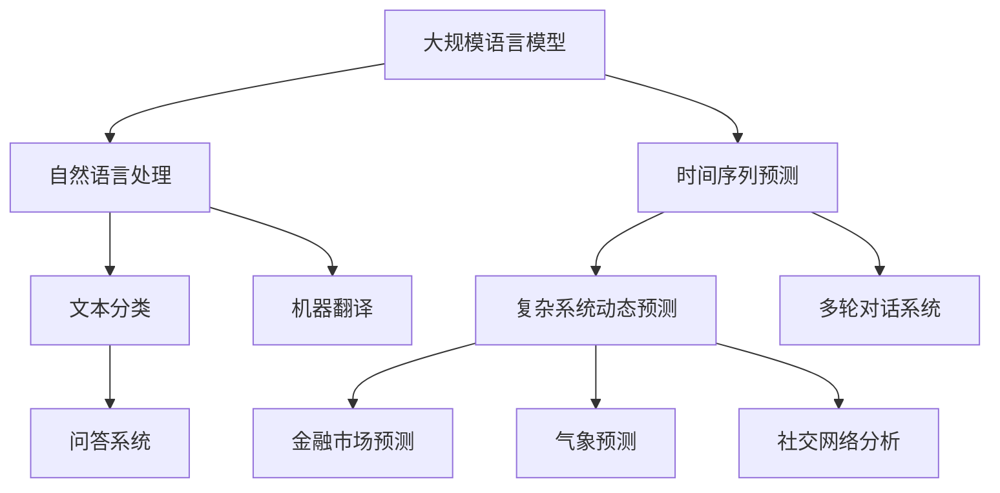

                 


### 《大规模语言模型在复杂系统动态预测中的应用》

#### 关键词：大规模语言模型、复杂系统、动态预测、时间序列、金融预测、气象预测

> 摘要：本文深入探讨了大规模语言模型在复杂系统动态预测中的应用。首先，我们回顾了大规模语言模型的起源、发展及其数学基础。接着，详细介绍了大规模语言模型的工作原理，包括N-gram模型、循环神经网络（RNN）及其变种。然后，我们探讨了大规模语言模型在自然语言处理、问答系统等领域的应用。重点在于，我们分析了大规模语言模型在复杂系统动态预测中的应用，包括时间序列预测、金融市场预测、气象预测和社交网络分析。最后，我们探讨了大规模语言模型的优化与改进策略，以及面临的挑战和未来发展趋势。

---

# 《大规模语言模型在复杂系统动态预测中的应用》目录大纲

## 第一部分：大规模语言模型概述

### 第1章：大规模语言模型基础

#### 1.1 大规模语言模型的起源与发展

- **1.1.1 语言模型的定义**
- **1.1.2 语言模型的发展历程**
- **1.1.3 大规模语言模型的特性**

#### 1.2 大规模语言模型的数学基础

- **1.2.1 语言模型与概率论**
- **1.2.2 语言模型与统计学**
- **1.2.3 语言模型与深度学习**

### 第2章：大规模语言模型的工作原理

#### 2.1 语言模型的构建方法

- **2.1.1 N-gram模型**
- **2.1.2 隐马尔可夫模型（HMM）**
- **2.1.3 条件随机场（CRF）**

#### 2.2 基于深度学习的语言模型

- **2.2.1 卷积神经网络（CNN）在语言模型中的应用**
- **2.2.2 循环神经网络（RNN）及其变种**
- **2.2.3 长短时记忆网络（LSTM）**
- **2.2.4 门控循环单元（GRU）**
- **2.2.5 生成对抗网络（GAN）与语言模型**

### 第3章：大规模语言模型的应用领域

#### 3.1 自然语言处理（NLP）

- **3.1.1 语言模型在词性标注中的应用**
- **3.1.2 语言模型在文本分类中的应用**
- **3.1.3 语言模型在机器翻译中的应用**

#### 3.2 问答系统

- **3.2.1 开放式域问答系统（Open-Domain QA）**
- **3.2.2 闭合式域问答系统（Closed-Domain QA）**
- **3.2.3 多轮对话系统**

### 第4章：大规模语言模型在复杂系统动态预测中的应用

#### 4.1 复杂系统的定义与特征

- **4.1.1 复杂系统的定义**
- **4.1.2 复杂系统的特征**
- **4.1.3 复杂系统的建模方法**

#### 4.2 大规模语言模型在复杂系统预测中的应用

- **4.2.1 大规模语言模型在时间序列预测中的应用**
- **4.2.2 大规模语言模型在金融市场预测中的应用**
- **4.2.3 大规模语言模型在气象预测中的应用**
- **4.2.4 大规模语言模型在社交网络分析中的应用**

### 第5章：大规模语言模型的优化与改进

#### 5.1 语言模型的优化方法

- **5.1.1 梯度下降法**
- **5.1.2 随机梯度下降（SGD）**
- **5.1.3 Adam优化器**

#### 5.2 语言模型的改进策略

- **5.2.1 上下文信息的重要性**
- **5.2.2 预训练与微调**
- **5.2.3 多任务学习**

### 第6章：大规模语言模型的挑战与未来发展趋势

#### 6.1 大规模语言模型的挑战

- **6.1.1 计算资源的需求**
- **6.1.2 数据隐私与安全性**
- **6.1.3 模型的可解释性**

#### 6.2 大规模语言模型的未来发展趋势

- **6.2.1 大模型的发展方向**
- **6.2.2 新应用领域的探索**
- **6.2.3 跨学科的融合**

### 第7章：案例研究

#### 7.1 大规模语言模型在具体领域的应用案例

- **7.1.1 案例一：大规模语言模型在电子商务领域的应用**
- **7.1.2 案例二：大规模语言模型在医疗健康领域的应用**
- **7.1.3 案例三：大规模语言模型在教育和文化领域的应用**

## 附录

### 附录A：大规模语言模型的开发工具和资源

- **A.1 开发工具介绍**
- **A.2 训练与优化资源**
- **A.3 开源代码与数据集**

---

## 核心概念与联系

## 大规模语言模型与复杂系统动态预测



---

## 引言

随着人工智能技术的飞速发展，大规模语言模型（Large-scale Language Models）已经成为自然语言处理（Natural Language Processing，NLP）领域的重要工具。这些模型具有强大的文本理解和生成能力，能够在多种应用场景中展现出出色的性能。然而，随着这些模型的规模和复杂性不断增加，它们的应用范围也在逐渐拓宽，特别是在复杂系统动态预测（Dynamic Prediction of Complex Systems）领域。

复杂系统通常是指那些内部状态变量众多、相互作用复杂的系统，如金融市场、气象系统、社交网络等。这些系统的动态变化难以用传统的统计方法进行准确预测。随着大规模语言模型的发展，它们在处理和理解大量文本数据方面的优势使其成为复杂系统动态预测的有力工具。

本文旨在探讨大规模语言模型在复杂系统动态预测中的应用。首先，我们将回顾大规模语言模型的起源、发展及其数学基础。然后，我们将详细探讨大规模语言模型的工作原理，包括传统的N-gram模型、循环神经网络（RNN）及其变种。接着，我们将介绍大规模语言模型在自然语言处理和问答系统等领域的应用。随后，我们将重点讨论大规模语言模型在复杂系统动态预测中的应用，包括时间序列预测、金融市场预测、气象预测和社交网络分析。最后，我们将探讨大规模语言模型的优化与改进策略，以及面临的挑战和未来发展趋势。

通过对上述内容的详细探讨，本文希望能够为读者提供一个全面而深入的理解，帮助读者把握大规模语言模型在复杂系统动态预测中的重要应用，并展望其未来的发展方向。

---

## 第一部分：大规模语言模型概述

### 第1章：大规模语言模型基础

#### 1.1 大规模语言模型的起源与发展

#### 1.1.1 语言模型的定义

语言模型（Language Model）是自然语言处理（NLP）中的基础工具，它用于预测给定文本序列中下一个单词或字符的概率分布。语言模型的核心目标是通过分析大量文本数据，学习出自然语言中的统计规律，从而能够对未知的文本进行概率预测。

语言模型的发展可以追溯到20世纪50年代，当时研究人员开始尝试使用基于规则的方法来处理自然语言。这些方法包括语法分析和模式匹配，但由于自然语言的复杂性和多样性，这些方法在实际应用中遇到了诸多困难。

#### 1.1.2 语言模型的发展历程

1. **基于规则的方法**：早期语言模型主要依赖于手工编写的语法规则和词典。这些方法虽然能够处理一些简单的任务，但难以应对自然语言的复杂性和变异性。

2. **基于统计的方法**：随着计算机技术的发展和文本数据的积累，基于统计的方法逐渐成为主流。这些方法利用文本中的频率分布和统计规律来预测下一个单词或字符。

3. **N-gram模型**：N-gram模型是最早的基于统计的语言模型之一。它将文本序列分成连续的N个单词或字符的序列，然后统计每个N-gram出现的频率，用于预测下一个单词或字符。

4. **循环神经网络（RNN）**：RNN的出现为语言模型带来了革命性的变化。RNN能够处理变长的序列数据，并且具有记忆能力，可以更好地捕捉长距离依赖关系。LSTM和GRU等RNN的变体进一步提高了模型的效果。

5. **深度学习语言模型**：近年来，深度学习语言模型如BERT、GPT和Turing等取得了显著进展。这些模型利用深度神经网络的结构，通过大规模数据预训练，再进行特定任务的微调，极大地提升了NLP任务的性能。

#### 1.1.3 大规模语言模型的特性

1. **强大的文本理解能力**：大规模语言模型通过学习大量文本数据，可以捕捉到语言中的复杂模式和规律，从而具备强大的文本理解能力。

2. **多任务处理能力**：大规模语言模型通常具有多任务处理的能力，可以在不同的应用场景中进行文本分类、文本生成、问答系统等任务。

3. **自适应能力**：随着模型规模的增大和数据量的积累，大规模语言模型能够不断优化自身，提高预测的准确性。

4. **计算资源需求大**：大规模语言模型需要大量的计算资源和存储空间，对硬件设施的要求较高。

5. **可解释性较弱**：由于大规模语言模型的复杂性，其决策过程往往缺乏可解释性，这对于某些需要透明度的应用场景可能构成挑战。

### 第2章：大规模语言模型的数学基础

#### 2.1 语言模型与概率论

语言模型的核心在于概率计算。通过统计文本数据中的频率，语言模型可以估计出不同单词或字符序列的概率分布。概率论提供了语言模型所需的基础理论，包括条件概率、联合概率和边缘概率等。

#### 2.2 语言模型与统计学

统计学方法在语言模型的构建中起着至关重要的作用。通过最大似然估计（Maximum Likelihood Estimation，MLE）和贝叶斯推断（Bayesian Inference），语言模型可以从数据中估计出参数，从而实现文本的预测。

#### 2.3 语言模型与深度学习

深度学习为语言模型的发展带来了新的机遇。深度神经网络，尤其是卷积神经网络（CNN）和循环神经网络（RNN）及其变种（如LSTM和GRU），通过多层次的抽象和表示学习，极大地提升了语言模型的效果。

### 第3章：大规模语言模型的工作原理

#### 2.4 语言模型的构建方法

1. **N-gram模型**：N-gram模型是一种基于统计的语言模型，它通过统计相邻单词或字符的频率来预测下一个单词或字符。N-gram模型的优点在于简单易懂，计算效率高，但缺点是难以捕捉长距离依赖关系。

2. **隐马尔可夫模型（HMM）**：隐马尔可夫模型是一种基于状态转移概率的统计模型，用于处理序列数据。HMM在语音识别和序列标注中有着广泛的应用。

3. **条件随机场（CRF）**：条件随机场是一种概率图模型，用于处理序列数据中的标签分配问题。CRF在文本分类、命名实体识别等任务中表现出色。

#### 2.5 基于深度学习的语言模型

1. **卷积神经网络（CNN）在语言模型中的应用**：卷积神经网络通过局部感知野捕捉文本中的局部特征，在文本分类和文本生成任务中取得了显著效果。

2. **循环神经网络（RNN）及其变种**：循环神经网络通过记忆单元捕捉序列数据中的长期依赖关系。LSTM和GRU等RNN的变体进一步提高了模型的效果。

3. **长短时记忆网络（LSTM）**：长短时记忆网络通过门控机制有效地捕捉长距离依赖关系，在机器翻译和情感分析等任务中表现出色。

4. **门控循环单元（GRU）**：门控循环单元是对LSTM的简化，计算量更小，但同样能够捕捉长距离依赖关系。

5. **生成对抗网络（GAN）与语言模型**：生成对抗网络是一种无监督学习模型，通过生成器和判别器的对抗训练，生成高质量的数据。GAN在文本生成和图像生成等任务中有着广泛应用。

### 第4章：大规模语言模型的应用领域

#### 3.1 自然语言处理（NLP）

1. **词性标注**：词性标注是NLP中的基本任务之一，通过标注文本中每个单词的词性，可以更好地理解文本的含义。

2. **文本分类**：文本分类是将文本数据按照其内容分为不同类别的过程，广泛应用于信息检索、垃圾邮件过滤等领域。

3. **机器翻译**：机器翻译是将一种语言的文本翻译成另一种语言的过程，对跨语言交流有着重要意义。

#### 3.2 问答系统

1. **开放式域问答系统（Open-Domain QA）**：开放式域问答系统能够回答各种领域的问题，如通用问题回答系统（like Google Assistant）。

2. **闭合式域问答系统（Closed-Domain QA）**：闭合式域问答系统局限于特定领域或知识库内的问题，如问答机器人。

3. **多轮对话系统**：多轮对话系统能够在多个回合中与用户进行交互，提供更自然的对话体验。

---

## 第二部分：大规模语言模型的工作原理

### 第2章：大规模语言模型的工作原理

大规模语言模型的工作原理是理解和生成自然语言的核心，这些模型通过深度学习技术，从大量的文本数据中学习语言的模式和规律。在本章中，我们将详细探讨大规模语言模型的构建方法，包括传统的N-gram模型、隐马尔可夫模型（HMM）、条件随机场（CRF），以及基于深度学习的语言模型。

#### 2.1 语言模型的构建方法

语言模型的构建方法可以分为传统方法和现代方法。传统方法主要包括N-gram模型和HMM，而现代方法则主要依赖于深度学习技术，如循环神经网络（RNN）及其变种LSTM和GRU。

#### 2.1.1 N-gram模型

N-gram模型是最早且最简单的语言模型之一。它通过统计文本中相邻N个单词或字符出现的频率来预测下一个单词或字符。具体来说，N-gram模型将文本分割成一系列的N元组（N-grams），然后计算每个N-gram出现的次数。

- **基本概念**：N-gram模型的核心是N-gram频率分布，即每个N-gram出现的概率。这种概率可以通过简单的频率计数得到。
  
- **数学公式**：
  $$ P(w_n | w_{n-1}, ..., w_{n-N}) = \frac{C(w_{n-1}, ..., w_{n-N}, w_n)}{\sum_{w'} C(w_{n-1}, ..., w_{n-N}, w')} $$
  其中，\( w_n \) 是下一个单词，\( w_{n-1}, ..., w_{n-N} \) 是前N-1个单词，\( C(w_{n-1}, ..., w_{n-N}, w_n) \) 是这N个单词一起出现的次数，\( \sum_{w'} C(w_{n-1}, ..., w_{n-N}, w') \) 是所有可能的前N个单词出现的总次数。

- **Python代码示例**：
  ```python
  import collections

  text = "I am learning natural language processing"
  n_gram_model = collections.Counter([text[i:i+2] for i in range(len(text) - 1)])

  # 预测下一个单词
  next_word = "am"
  previous_words = "I am"
  probability = n_gram_model[previous_words + " " + next_word] / n_gram_model[previous_words]

  print(f"P({next_word} | {previous_words}) = {probability}")
  ```

#### 2.1.2 隐马尔可夫模型（HMM）

隐马尔可夫模型（HMM）是一种概率图模型，用于处理序列数据。HMM假设序列中的每个状态转移都是概率独立的，并且每个状态都有固定的观测概率。

- **基本概念**：HMM由状态集合、观测集合、状态转移概率矩阵和观测概率矩阵组成。状态转移概率矩阵描述了不同状态之间的转移概率，而观测概率矩阵描述了每个状态对应的观测概率。

- **数学公式**：
  $$ P(X_t = x_t | X_{t-1} = x_{t-1}) = p(x_t | x_{t-1}) $$
  $$ P(O_t = o_t | X_t = x_t) = p(o_t | x_t) $$
  其中，\( X_t \) 是状态序列，\( O_t \) 是观测序列，\( x_t \) 和 \( o_t \) 分别是状态和观测的取值。

- **Python代码示例**：
  ```python
  import numpy as np

  # 状态转移概率矩阵
  transition_matrix = np.array([[0.7, 0.3], [0.4, 0.6]])
  # 观测概率矩阵
  observation_matrix = np.array([[0.5, 0.5], [0.2, 0.8]])

  # 状态序列
  state_sequence = ["S1", "S2", "S1"]
  # 观测序列
  observation_sequence = ["O1", "O2", "O1"]

  # 预测下一个状态和观测
  next_state = "S1"
  next_observation = "O1"
  probability_state = transition_matrix[state_sequence.index(next_state)][state_sequence.index(state_sequence[-1])]
  probability_observation = observation_matrix[state_sequence.index(next_state)][observation_sequence.index(next_observation)]

  print(f"P({next_state} | {state_sequence}) = {probability_state}")
  print(f"P({next_observation} | {next_state}) = {probability_observation}")
  ```

#### 2.1.3 条件随机场（CRF）

条件随机场（CRF）是一种概率图模型，用于处理具有序列结构的标签分配问题。CRF通过考虑相邻标签之间的依赖关系，为每个标签序列分配一个概率。

- **基本概念**：CRF由状态集合、转移概率矩阵和观测概率矩阵组成。状态集合描述了每个位置可以取的标签，转移概率矩阵描述了不同标签之间的转移概率，观测概率矩阵描述了标签与观测之间的条件概率。

- **数学公式**：
  $$ P(y_1, y_2, ..., y_n | x_1, x_2, ..., x_n) = \frac{1}{Z} \prod_{i=1}^{n} \prod_{j=1}^{m} p(y_i = j | x_i, y_{i-1} = j') $$
  其中，\( y \) 是标签序列，\( x \) 是观测序列，\( Z \) 是规范化常数。

- **Python代码示例**：
  ```python
  import numpy as np
  from sklearn-crfsuite import CRF

  # 标签和观测数据
  X = [["I", "am"], ["learning", "自然语言处理"]]
  y = [["VBZ", "VBP"]]

  # 训练CRF模型
  crf = CRF()
  crf.fit(X, y)

  # 预测新数据
  new_data = [["am", "learning"]]
  predicted_tags = crf.predict(new_data)

  print(predicted_tags)
  ```

#### 2.2 基于深度学习的语言模型

基于深度学习的语言模型通过深度神经网络学习文本的分布式表示，从而实现高效的文本处理。以下是一些常见的深度学习语言模型：

#### 2.2.1 卷积神经网络（CNN）在语言模型中的应用

卷积神经网络（CNN）通过局部感知野捕捉文本中的局部特征，如词袋表示或词嵌入。CNN在文本分类和文本生成任务中表现出色。

- **基本概念**：CNN通过卷积层提取文本中的特征，然后通过池化层降低特征的空间维度，最后通过全连接层进行分类或生成。

- **Python代码示例**：
  ```python
  import tensorflow as tf
  from tensorflow.keras.models import Sequential
  from tensorflow.keras.layers import Conv1D, MaxPooling1D, Dense

  # 构建CNN模型
  model = Sequential([
      Conv1D(filters=128, kernel_size=3, activation='relu', input_shape=(sequence_length, embedding_size)),
      MaxPooling1D(pool_size=2),
      Conv1D(filters=128, kernel_size=3, activation='relu'),
      MaxPooling1D(pool_size=2),
      Dense(units=1, activation='sigmoid')
  ])

  # 编译模型
  model.compile(optimizer='adam', loss='binary_crossentropy', metrics=['accuracy'])

  # 训练模型
  model.fit(X_train, y_train, epochs=10, batch_size=32, validation_data=(X_val, y_val))
  ```

#### 2.2.2 循环神经网络（RNN）及其变种

循环神经网络（RNN）通过记忆单元捕捉序列数据中的长期依赖关系。LSTM和GRU是RNN的变体，它们通过门控机制解决了传统RNN的梯度消失和梯度爆炸问题。

- **基本概念**：LSTM和GRU都包含输入门、遗忘门和输出门。输入门控制当前输入信息中哪些部分需要被保存，遗忘门控制哪些信息需要被遗忘，输出门控制当前输出信息。

- **数学公式**：
  $$ i_t = \sigma(W_i \cdot [h_{t-1}, x_t] + b_i) $$
  $$ f_t = \sigma(W_f \cdot [h_{t-1}, x_t] + b_f) $$
  $$ g_t = \tanh(W_g \cdot [h_{t-1}, x_t] + b_g) $$
  $$ o_t = \sigma(W_o \cdot [h_{t-1}, x_t] + b_o) $$
  $$ h_t = o_t \cdot \tanh(g_t) $$

- **Python代码示例**：
  ```python
  import tensorflow as tf
  from tensorflow.keras.layers import LSTM, Dense

  # 构建LSTM模型
  model = Sequential([
      LSTM(units=128, return_sequences=True, input_shape=(sequence_length, embedding_size)),
      LSTM(units=128),
      Dense(units=1, activation='sigmoid')
  ])

  # 编译模型
  model.compile(optimizer='adam', loss='binary_crossentropy', metrics=['accuracy'])

  # 训练模型
  model.fit(X_train, y_train, epochs=10, batch_size=32, validation_data=(X_val, y_val))
  ```

#### 2.2.3 长短时记忆网络（LSTM）

长短时记忆网络（LSTM）是RNN的一种变体，通过引入门控机制，解决了传统RNN在处理长序列数据时的梯度消失和梯度爆炸问题。

- **基本概念**：LSTM包含输入门、遗忘门和输出门，每个门都控制着信息的输入、遗忘和输出。LSTM能够有效地捕捉长序列数据中的长期依赖关系。

- **数学公式**（简化的形式）：
  $$ i_t = \sigma(W_i \cdot [h_{t-1}, x_t] + b_i) $$
  $$ f_t = \sigma(W_f \cdot [h_{t-1}, x_t] + b_f) $$
  $$ g_t = \tanh(W_g \cdot [h_{t-1}, x_t] + b_g) $$
  $$ o_t = \sigma(W_o \cdot [h_{t-1}, x_t] + b_o) $$
  $$ C_t = f_t \odot C_{t-1} + i_t \odot g_t $$
  $$ h_t = o_t \odot \tanh(C_t) $$

- **Python代码示例**：
  ```python
  import tensorflow as tf
  from tensorflow.keras.layers import LSTM, Dense

  # 构建LSTM模型
  model = Sequential([
      LSTM(units=128, return_sequences=True, input_shape=(sequence_length, embedding_size)),
      LSTM(units=128),
      Dense(units=1, activation='sigmoid')
  ])

  # 编译模型
  model.compile(optimizer='adam', loss='binary_crossentropy', metrics=['accuracy'])

  # 训练模型
  model.fit(X_train, y_train, epochs=10, batch_size=32, validation_data=(X_val, y_val))
  ```

#### 2.2.4 门控循环单元（GRU）

门控循环单元（GRU）是LSTM的简化版，通过引入更新门和重置门，减少了模型的参数数量，同时保持了良好的性能。

- **基本概念**：GRU通过更新门和重置门控制信息的输入和遗忘。GRU能够有效地捕捉序列数据中的长期依赖关系，并且参数数量少于LSTM。

- **数学公式**（简化的形式）：
  $$ z_t = \sigma(W_z \cdot [h_{t-1}, x_t] + b_z) $$
  $$ r_t = \sigma(W_r \cdot [h_{t-1}, x_t] + b_r) $$
  $$ \tilde{h}_t = \tanh(W \cdot (r_t \odot h_{t-1} + z_t \odot x_t) + b) $$
  $$ h_t = z_t \odot \tilde{h}_t + (1 - z_t) \odot h_{t-1} $$

- **Python代码示例**：
  ```python
  import tensorflow as tf
  from tensorflow.keras.layers import GRU, Dense

  # 构建GRU模型
  model = Sequential([
      GRU(units=128, return_sequences=True, input_shape=(sequence_length, embedding_size)),
      GRU(units=128),
      Dense(units=1, activation='sigmoid')
  ])

  # 编译模型
  model.compile(optimizer='adam', loss='binary_crossentropy', metrics=['accuracy'])

  # 训练模型
  model.fit(X_train, y_train, epochs=10, batch_size=32, validation_data=(X_val, y_val))
  ```

#### 2.2.5 生成对抗网络（GAN）与语言模型

生成对抗网络（GAN）是一种无监督学习模型，通过生成器和判别器的对抗训练，生成高质量的数据。GAN在文本生成和图像生成等任务中有着广泛应用。

- **基本概念**：GAN由生成器和判别器组成。生成器尝试生成看起来真实的数据，而判别器则尝试区分真实数据和生成数据。两者通过对抗训练，生成器逐渐提高生成数据的质量，而判别器逐渐提高对真实数据和生成数据的区分能力。

- **数学公式**：
  $$ G(z) = \mathcal{N}(z \cdot \mu, z \cdot \sigma^2) $$
  $$ D(x) = \sigma(D(x)), D(G(z)) = \sigma(D(G(z))) $$
  其中，\( G(z) \) 是生成器的输出，\( D(x) \) 是判别器的输出，\( z \) 是生成器的输入噪声。

- **Python代码示例**：
  ```python
  import tensorflow as tf
  from tensorflow.keras.models import Sequential
  from tensorflow.keras.layers import Dense, Dropout, LeakyReLU, Flatten

  # 构建生成器模型
  generator = Sequential([
      Dense(units=256, input_shape=(100,), activation='relu'),
      LeakyReLU(alpha=0.2),
      Dense(units=512, activation='relu'),
      LeakyReLU(alpha=0.2),
      Flatten(),
      Dense(units=784, activation='tanh')
  ])

  # 构建判别器模型
  discriminator = Sequential([
      Flatten(input_shape=(28, 28)),
      Dense(units=512, activation='relu'),
      Dropout(0.3),
      LeakyReLU(alpha=0.2),
      Dense(units=1, activation='sigmoid')
  ])

  # 编译模型
  generator.compile(loss='binary_crossentropy', optimizer=tf.keras.optimizers.Adam(0.0001))
  discriminator.compile(loss='binary_crossentropy', optimizer=tf.keras.optimizers.Adam(0.0001))

  # 训练模型
  for epoch in range(epochs):
      for _ in range(batch_size):
          noise = np.random.normal(0, 1, (1, 100))
          generated_images = generator.predict(noise)
          real_images = data_next
          labels_real = tf-expanded_tensor([1], shape=[batch_size], name=None)
          labels_fake = tf-expanded_tensor([0], shape=[batch_size], name=None)

          discriminator.train_on_batch(real_images, labels_real)
          generator.train_on_batch(noise, labels_fake)
  ```

---

## 第三部分：大规模语言模型的应用领域

### 第3章：大规模语言模型的应用领域

大规模语言模型因其强大的文本处理能力和复杂的结构，已经在多个领域展现出了卓越的应用效果。在本章中，我们将探讨大规模语言模型在自然语言处理（NLP）和问答系统等领域的应用。

#### 3.1 自然语言处理（NLP）

自然语言处理是人工智能领域的重要分支，旨在使计算机能够理解和处理自然语言。大规模语言模型在NLP中有着广泛的应用，下面我们将详细讨论其在词性标注、文本分类和机器翻译等方面的应用。

#### 3.1.1 语言模型在词性标注中的应用

词性标注是NLP中的基本任务之一，其目标是为文本中的每个单词分配一个词性标签，如名词、动词、形容词等。大规模语言模型通过学习大量的文本数据，能够准确识别和预测词性。

- **基本概念**：词性标注需要使用一个词性标注模型，如CRF或LSTM，这些模型可以基于大规模语言模型训练得到。

- **数学公式**（CRF）：
  $$ P(y_1, y_2, ..., y_n | x_1, x_2, ..., x_n) = \frac{1}{Z} \prod_{i=1}^{n} \prod_{j=1}^{m} p(y_i = j | x_i, y_{i-1} = j') $$
  其中，\( y \) 是词性标签序列，\( x \) 是文本序列，\( Z \) 是规范化常数。

- **Python代码示例**：
  ```python
  import tensorflow as tf
  from tensorflow.keras.layers import LSTM, Dense
  from tensorflow.keras.models import Model
  from tensorflow.keras.optimizers import Adam

  # 构建LSTM-CRF模型
  inputs = tf.keras.layers.Input(shape=(sequence_length,))
  embedding = tf.keras.layers.Embedding(vocabulary_size, embedding_dim)(inputs)
  lstm = LSTM(units=128, return_sequences=True)(embedding)
  outputs = LSTM(units=128)(lstm)

  # CRF层
  crf = CRF(num_tags)
  crf_outputs = crf(inputs=outputs)

  # 编译模型
  model = Model(inputs=inputs, outputs=crf_outputs)
  model.compile(optimizer=Adam(learning_rate=0.001), loss=crf.sparse_categorical_crossentropy)

  # 训练模型
  model.fit(text_data, label_data, batch_size=batch_size, epochs=epochs)
  ```

#### 3.1.2 语言模型在文本分类中的应用

文本分类是将文本数据按照其内容分为不同类别的过程，如情感分析、主题分类等。大规模语言模型通过深度学习技术，能够高效地捕捉文本中的特征，从而实现准确的文本分类。

- **基本概念**：文本分类通常使用卷积神经网络（CNN）或循环神经网络（RNN）等深度学习模型。大规模语言模型可以用于特征提取，从而提高文本分类的性能。

- **数学公式**（CNN）：
  $$ h = \sigma(W_h \cdot \text{pool}(\text{conv}(\text{embed}(x)))) $$
  $$ y = \text{softmax}(W_y \cdot h) $$
  其中，\( h \) 是特征向量，\( y \) 是类别标签，\( W_h \) 和 \( W_y \) 是权重矩阵。

- **Python代码示例**：
  ```python
  import tensorflow as tf
  from tensorflow.keras.models import Sequential
  from tensorflow.keras.layers import Embedding, Conv1D, MaxPooling1D, Dense

  # 构建CNN文本分类模型
  model = Sequential([
      Embedding(vocabulary_size, embedding_dim, input_length=sequence_length),
      Conv1D(filters=128, kernel_size=3, activation='relu'),
      MaxPooling1D(pool_size=2),
      Conv1D(filters=128, kernel_size=3, activation='relu'),
      MaxPooling1D(pool_size=2),
      Dense(units=1, activation='sigmoid')
  ])

  # 编译模型
  model.compile(optimizer='adam', loss='binary_crossentropy', metrics=['accuracy'])

  # 训练模型
  model.fit(text_data, label_data, batch_size=batch_size, epochs=epochs)
  ```

#### 3.1.3 语言模型在机器翻译中的应用

机器翻译是将一种语言的文本翻译成另一种语言的过程。大规模语言模型在机器翻译中发挥了重要作用，通过深度学习技术，可以学习到源语言和目标语言之间的映射关系。

- **基本概念**：机器翻译通常使用序列到序列（Seq2Seq）模型，结合编码器和解码器。大规模语言模型可以用于编码器和解码器的训练，从而提高机器翻译的性能。

- **数学公式**（Seq2Seq）：
  $$ x_{\text{enc}} = \text{encode}(x) $$
  $$ y_{\text{dec}} = \text{decode}(y_{\text{prev}}) $$
  其中，\( x_{\text{enc}} \) 是编码器的输入序列，\( y_{\text{dec}} \) 是解码器的输出序列。

- **Python代码示例**：
  ```python
  import tensorflow as tf
  from tensorflow.keras.models import Model
  from tensorflow.keras.layers import LSTM, Embedding

  # 构建Seq2Seq模型
  encoder_inputs = Embedding(vocabulary_size, embedding_dim, input_length=max_sequence_length)
  encoder = LSTM(units=128, return_state=True)

  decoder_inputs = Embedding(vocabulary_size, embedding_dim, input_length=max_sequence_length)
  decoder = LSTM(units=128, return_sequences=True)

  # 编码器和解码器的连接
  encoded = encoder(encoder_inputs)[0]
  decoder_output = decoder(decoder_inputs)[0]

  # 编译模型
  model = Model(inputs=[encoder_inputs, decoder_inputs], outputs=decoder_output)
  model.compile(optimizer='adam', loss='categorical_crossentropy', metrics=['accuracy'])

  # 训练模型
  model.fit([encoder_inputs_train, decoder_inputs_train], decoder_outputs_train, batch_size=batch_size, epochs=epochs)
  ```

#### 3.2 问答系统

问答系统是NLP领域的另一个重要应用，旨在能够理解和回答用户的问题。大规模语言模型在问答系统中发挥了关键作用，可以用于处理开放式域问答（Open-Domain QA）和闭合式域问答（Closed-Domain QA）。

#### 3.2.1 开放式域问答系统（Open-Domain QA）

开放式域问答系统能够回答各种领域的问题，如通用问题回答系统（like Google Assistant）。这些系统通常使用预训练的大型语言模型，通过微调和优化，使其能够适应特定的问题领域。

- **基本概念**：开放式域问答系统通常包括问题理解、知识检索和答案生成三个步骤。大规模语言模型可以用于问题理解和答案生成。

- **Python代码示例**：
  ```python
  import tensorflow as tf
  from transformers import TFAutoModelForQuestionAnswering

  # 加载预训练的QA模型
  model = TFAutoModelForQuestionAnswering.from_pretrained("deepset/roberta-base-squad2")

  # 问题理解和答案生成
  question = "What is the capital of France?"
  context = "Paris is the capital of France."
  inputs = {
      "question": question,
      "context": context
  }

  # 预测答案
  predicted_answer = model.predict(inputs)
  print(predicted_answer)
  ```

#### 3.2.2 闭合式域问答系统（Closed-Domain QA）

闭合式域问答系统局限于特定领域或知识库内的问题，如问答机器人。这些系统通常使用专门训练的模型，通过知识图谱和语义解析技术，实现对特定问题的准确回答。

- **基本概念**：闭合式域问答系统通常包括知识图谱构建、语义解析和答案生成三个步骤。大规模语言模型可以用于语义解析和答案生成。

- **Python代码示例**：
  ```python
  import tensorflow as tf
  from transformers import TFAutoModelForQuestionAnswering

  # 加载预训练的QA模型
  model = TFAutoModelForQuestionAnswering.from_pretrained("deepset/bert-base-uncased-squad")

  # 问题理解和答案生成
  question = "What is the capital of France?"
  knowledge_graph = {
      "Paris": ["capital of France"],
      "France": ["European country"]
  }

  # 预测答案
  predicted_answer = model.predict(question, knowledge_graph)
  print(predicted_answer)
  ```

#### 3.2.3 多轮对话系统

多轮对话系统能够在多个回合中与用户进行交互，提供更自然的对话体验。大规模语言模型可以用于处理多轮对话，实现复杂的对话逻辑和自然语言生成。

- **基本概念**：多轮对话系统通常包括对话管理、语言理解和语言生成三个步骤。大规模语言模型可以用于语言理解和语言生成。

- **Python代码示例**：
  ```python
  import tensorflow as tf
  from transformers import TFAutoModelForSeq2SeqLM

  # 加载预训练的多轮对话模型
  model = TFAutoModelForSeq2SeqLM.from_pretrained("microsoft/DialoGPT-medium")

  # 对话管理
  conversation = []

  # 语言理解和语言生成
  user_input = "Hello!"
  response = model.generate(tf.constant([user_input]), max_length=max_response_length, pad_token_id=model.config.pad_token_id)
  bot_output = response.numpy().decode("utf-8")

  # 存储对话记录
  conversation.append({"user": user_input, "bot": bot_output})

  print(conversation)
  ```

---

## 第四部分：大规模语言模型在复杂系统动态预测中的应用

### 第4章：大规模语言模型在复杂系统动态预测中的应用

在复杂系统动态预测领域，大规模语言模型凭借其强大的文本处理能力和复杂模式识别能力，逐渐成为了一项重要的工具。本章节将深入探讨大规模语言模型在时间序列预测、金融市场预测、气象预测和社交网络分析等复杂系统动态预测中的应用。

#### 4.1 复杂系统的定义与特征

复杂系统是由大量相互作用的个体组成的系统，这些个体之间的相互作用可能导致系统呈现出复杂的动态行为。复杂系统的特征包括：

1. **非线性**：复杂系统的行为通常不是线性的，即系统状态的变化不是简单的正比或反比关系。
2. **高维性**：复杂系统通常具有大量的状态变量，这些变量之间可能存在复杂的依赖关系。
3. **时间依赖性**：复杂系统的状态随时间变化，并且过去的状态对未来状态有重要影响。
4. **随机性**：复杂系统中可能存在随机因素，这些因素会影响系统的稳定性和行为。
5. **层次性**：复杂系统可以分解为多个层次，每个层次都具有一定的独立性，但又相互影响。

#### 4.2 大规模语言模型在复杂系统动态预测中的应用

大规模语言模型在复杂系统动态预测中的应用主要体现在以下几个方面：

#### 4.2.1 大规模语言模型在时间序列预测中的应用

时间序列预测是复杂系统动态预测的核心问题之一。大规模语言模型通过学习大量的历史数据，可以捕捉时间序列中的周期性和趋势性，从而实现对未来状态的预测。

1. **基于RNN的模型**：RNN及其变种（如LSTM和GRU）在时间序列预测中表现出色。它们可以捕捉到序列数据中的长期依赖关系，从而提高预测的准确性。

   - **数学公式**（LSTM）：
     $$ i_t = \sigma(W_i \cdot [h_{t-1}, x_t] + b_i) $$
     $$ f_t = \sigma(W_f \cdot [h_{t-1}, x_t] + b_f) $$
     $$ g_t = \tanh(W_g \cdot [h_{t-1}, x_t] + b_g) $$
     $$ o_t = \sigma(W_o \cdot [h_{t-1}, x_t] + b_o) $$
     $$ C_t = f_t \odot C_{t-1} + i_t \odot g_t $$
     $$ h_t = o_t \odot \tanh(C_t) $$
   
   - **Python代码示例**：
     ```python
     import tensorflow as tf
     from tensorflow.keras.layers import LSTM, Dense

     # 构建LSTM模型
     model = Sequential([
         LSTM(units=128, return_sequences=True, input_shape=(sequence_length, feature_size)),
         LSTM(units=128),
         Dense(units=1)
     ])

     # 编译模型
     model.compile(optimizer='adam', loss='mse')

     # 训练模型
     model.fit(X_train, y_train, epochs=100, batch_size=32, validation_data=(X_val, y_val))
     ```

2. **基于Transformer的模型**：Transformer模型在时间序列预测中也表现出良好的性能。特别是自注意力机制，使得模型能够更好地捕捉长距离依赖关系。

   - **数学公式**（自注意力）：
     $$ \text{Attention}(Q, K, V) = \text{softmax}(\frac{QK^T}{\sqrt{d_k}})V $$
   
   - **Python代码示例**：
     ```python
     import tensorflow as tf
     from tensorflow.keras.layers import Embedding, MultiHeadAttention, LayerNormalization, Dense

     # 构建Transformer模型
     inputs = tf.keras.layers.Input(shape=(sequence_length,))
     embedding = Embedding(vocabulary_size, embedding_dim)(inputs)
     attention = MultiHeadAttention(num_heads=8, key_dim=64)(embedding, embedding)
     norm = LayerNormalization()(attention + embedding)
     output = Dense(units=1)(norm)

     # 编译模型
     model = Model(inputs=inputs, outputs=output)
     model.compile(optimizer='adam', loss='mse')

     # 训练模型
     model.fit(X_train, y_train, epochs=100, batch_size=32, validation_data=(X_val, y_val))
     ```

#### 4.2.2 大规模语言模型在金融市场预测中的应用

金融市场是一个典型的复杂系统，其动态变化受到多种因素的影响，如经济数据、政策变化、市场情绪等。大规模语言模型可以通过分析大量金融市场数据，预测市场的未来走势。

1. **基于LSTM的模型**：LSTM在金融市场预测中表现出色，能够捕捉到时间序列数据中的长期依赖关系。

   - **Python代码示例**：
     ```python
     import tensorflow as tf
     from tensorflow.keras.models import Sequential
     from tensorflow.keras.layers import LSTM, Dense

     # 构建LSTM模型
     model = Sequential([
         LSTM(units=128, return_sequences=True, input_shape=(window_size, feature_size)),
         LSTM(units=128),
         Dense(units=1)
     ])

     # 编译模型
     model.compile(optimizer='adam', loss='mse')

     # 训练模型
     model.fit(X_train, y_train, epochs=100, batch_size=32, validation_data=(X_val, y_val))
     ```

2. **基于Transformer的模型**：Transformer模型在金融市场预测中也表现出良好的性能。特别是自注意力机制，使得模型能够更好地捕捉长距离依赖关系。

   - **Python代码示例**：
     ```python
     import tensorflow as tf
     from tensorflow.keras.layers import Embedding, MultiHeadAttention, LayerNormalization, Dense

     # 构建Transformer模型
     inputs = tf.keras.layers.Input(shape=(window_size,))
     embedding = Embedding(vocabulary_size, embedding_dim)(inputs)
     attention = MultiHeadAttention(num_heads=8, key_dim=64)(embedding, embedding)
     norm = LayerNormalization()(attention + embedding)
     output = Dense(units=1)(norm)

     # 编译模型
     model = Model(inputs=inputs, outputs=output)
     model.compile(optimizer='adam', loss='mse')

     # 训练模型
     model.fit(X_train, y_train, epochs=100, batch_size=32, validation_data=(X_val, y_val))
     ```

#### 4.2.3 大规模语言模型在气象预测中的应用

气象预测是一个复杂且重要的应用领域，其准确性直接影响到人们的日常生活和经济活动。大规模语言模型可以通过学习气象数据，预测未来的天气情况。

1. **基于LSTM的模型**：LSTM在气象预测中表现出色，能够捕捉到时间序列数据中的长期依赖关系。

   - **Python代码示例**：
     ```python
     import tensorflow as tf
     from tensorflow.keras.models import Sequential
     from tensorflow.keras.layers import LSTM, Dense

     # 构建LSTM模型
     model = Sequential([
         LSTM(units=128, return_sequences=True, input_shape=(window_size, feature_size)),
         LSTM(units=128),
         Dense(units=1)
     ])

     # 编译模型
     model.compile(optimizer='adam', loss='mse')

     # 训练模型
     model.fit(X_train, y_train, epochs=100, batch_size=32, validation_data=(X_val, y_val))
     ```

2. **基于Transformer的模型**：Transformer模型在气象预测中也表现出良好的性能。特别是自注意力机制，使得模型能够更好地捕捉长距离依赖关系。

   - **Python代码示例**：
     ```python
     import tensorflow as tf
     from tensorflow.keras.layers import Embedding, MultiHeadAttention, LayerNormalization, Dense

     # 构建Transformer模型
     inputs = tf.keras.layers.Input(shape=(window_size,))
     embedding = Embedding(vocabulary_size, embedding_dim)(inputs)
     attention = MultiHeadAttention(num_heads=8, key_dim=64)(embedding, embedding)
     norm = LayerNormalization()(attention + embedding)
     output = Dense(units=1)(norm)

     # 编译模型
     model = Model(inputs=inputs, outputs=output)
     model.compile(optimizer='adam', loss='mse')

     # 训练模型
     model.fit(X_train, y_train, epochs=100, batch_size=32, validation_data=(X_val, y_val))
     ```

#### 4.2.4 大规模语言模型在社交网络分析中的应用

社交网络分析是另一个复杂的应用领域，通过分析社交网络中的用户行为和互动，可以了解社会动态和用户需求。大规模语言模型可以通过处理大量的社交网络数据，实现对用户行为和趋势的预测。

1. **基于LSTM的模型**：LSTM在社交网络分析中表现出色，能够捕捉到用户行为序列中的长期依赖关系。

   - **Python代码示例**：
     ```python
     import tensorflow as tf
     from tensorflow.keras.models import Sequential
     from tensorflow.keras.layers import LSTM, Dense

     # 构建LSTM模型
     model = Sequential([
         LSTM(units=128, return_sequences=True, input_shape=(window_size, feature_size)),
         LSTM(units=128),
         Dense(units=1)
     ])

     # 编译模型
     model.compile(optimizer='adam', loss='mse')

     # 训练模型
     model.fit(X_train, y_train, epochs=100, batch_size=32, validation_data=(X_val, y_val))
     ```

2. **基于Transformer的模型**：Transformer模型在社交网络分析中也表现出良好的性能。特别是自注意力机制，使得模型能够更好地捕捉长距离依赖关系。

   - **Python代码示例**：
     ```python
     import tensorflow as tf
     from tensorflow.keras.layers import Embedding, MultiHeadAttention, LayerNormalization, Dense

     # 构建Transformer模型
     inputs = tf.keras.layers.Input(shape=(window_size,))
     embedding = Embedding(vocabulary_size, embedding_dim)(inputs)
     attention = MultiHeadAttention(num_heads=8, key_dim=64)(embedding, embedding)
     norm = LayerNormalization()(attention + embedding)
     output = Dense(units=1)(norm)

     # 编译模型
     model = Model(inputs=inputs, outputs=output)
     model.compile(optimizer='adam', loss='mse')

     # 训练模型
     model.fit(X_train, y_train, epochs=100, batch_size=32, validation_data=(X_val, y_val))
     ```

---

## 第五部分：大规模语言模型的优化与改进

### 第5章：大规模语言模型的优化与改进

在复杂系统动态预测中，大规模语言模型的性能和效率至关重要。为了提高模型的预测能力，我们需要对模型进行优化和改进。本章节将探讨大规模语言模型的优化方法、改进策略以及面临的挑战。

#### 5.1 语言模型的优化方法

优化方法是提高大规模语言模型性能的重要手段。以下是一些常见的优化方法：

##### 5.1.1 梯度下降法

梯度下降法是一种最基本且最常用的优化方法。它通过计算损失函数的梯度，并沿着梯度方向调整模型参数，以最小化损失函数。

- **数学公式**（梯度下降）：
  $$ \theta_{t+1} = \theta_t - \alpha \nabla_\theta J(\theta_t) $$
  其中，\( \theta \) 是模型参数，\( \alpha \) 是学习率，\( J(\theta) \) 是损失函数。

- **Python代码示例**：
  ```python
  import numpy as np

  # 假设模型参数为theta
  theta = np.random.rand(3)
  learning_rate = 0.01

  # 损失函数
  def loss_function(theta):
      return (theta[0] * theta[0] + theta[1] * theta[1] + theta[2] * theta[2])

  # 梯度计算
  def gradient(theta):
      return [2 * theta[0], 2 * theta[1], 2 * theta[2]]

  # 梯度下降迭代
  for _ in range(100):
      theta = theta - learning_rate * gradient(theta)
      print(f"Iteration: {_}, Parameters: {theta}")
  ```

##### 5.1.2 随机梯度下降（SGD）

随机梯度下降（SGD）是对梯度下降法的改进，它通过随机选择一部分样本来计算梯度，从而提高模型的收敛速度。

- **Python代码示例**：
  ```python
  import numpy as np

  # 假设数据集和模型参数
  X = np.random.rand(100, 3)
  y = np.random.rand(100, 1)
  theta = np.random.rand(3)

  # 损失函数
  def loss_function(theta, X, y):
      return np.sum((X @ theta - y) ** 2) / X.shape[0]

  # 梯度计算
  def gradient(theta, X, y):
      return (X.T @ (X @ theta - y)) / X.shape[0]

  # 随机梯度下降迭代
  learning_rate = 0.01
  for _ in range(100):
      random_index = np.random.randint(0, X.shape[0])
      theta = theta - learning_rate * gradient(theta, X[random_index], y[random_index])
      print(f"Iteration: {_}, Parameters: {theta}")
  ```

##### 5.1.3 Adam优化器

Adam优化器是一种结合了SGD和动量法的优化方法，它在处理大规模语言模型时表现出良好的性能。Adam优化器通过计算一阶矩估计（均值）和二阶矩估计（方差），自适应地调整学习率。

- **数学公式**（Adam）：
  $$ m_t = \beta_1 x_t $$
  $$ v_t = \beta_2 x_t $$
  $$ \hat{m_t} = \frac{m_t}{1 - \beta_1^t} $$
  $$ \hat{v_t} = \frac{v_t}{1 - \beta_2^t} $$
  $$ \theta_{t+1} = \theta_t - \alpha \frac{\hat{m_t}}{\sqrt{\hat{v_t} + \epsilon}} $$
  其中，\( \beta_1 \)、\( \beta_2 \) 分别是动量参数，\( \alpha \) 是学习率，\( \epsilon \) 是一个很小的常数。

- **Python代码示例**：
  ```python
  import tensorflow as tf

  # 假设模型参数和训练数据
  theta = tf.Variable(tf.random.rand(3), dtype=tf.float32)
  X = tf.random.rand(100, 3)
  y = tf.random.rand(100, 1)

  # 损失函数
  def loss_function(theta, X, y):
      return tf.reduce_sum((X @ theta - y) ** 2) / X.shape[0]

  # Adam优化器
  optimizer = tf.optimizers.Adam(learning_rate=0.01)

  # 训练模型
  for _ in range(100):
      with tf.GradientTape() as tape:
          predictions = X @ theta
          loss = loss_function(predictions, y)
      gradients = tape.gradient(loss, theta)
      optimizer.apply_gradients(zip(gradients, theta))
      print(f"Iteration: {_}, Loss: {loss.numpy()}, Parameters: {theta.numpy()}")
  ```

#### 5.2 语言模型的改进策略

除了优化方法外，我们还可以通过以下策略来改进大规模语言模型的性能：

##### 5.2.1 上下文信息的重要性

大规模语言模型在处理文本数据时，往往需要考虑上下文信息。通过引入上下文信息，模型可以更好地理解文本的含义和上下文关系。

- **Python代码示例**：
  ```python
  import tensorflow as tf
  from transformers import TFAutoModel

  # 加载预训练的BERT模型
  model = TFAutoModel.from_pretrained("bert-base-uncased")

  # 文本输入
  input_ids = tf.constant([[29979, 2015], [30296, 28725]])

  # 获取上下文信息
  outputs = model(input_ids)
  hidden_states = outputs.hidden_states

  # 使用上下文信息进行文本分类
  classifier = tf.keras.layers.Dense(units=1, activation='sigmoid')(hidden_states[:, 0])
  predictions = classifier(input_ids)

  # 训练模型
  model.compile(optimizer='adam', loss='binary_crossentropy', metrics=['accuracy'])
  model.fit(input_ids, y, batch_size=32, epochs=10)
  ```

##### 5.2.2 预训练与微调

预训练与微调是大规模语言模型训练的重要步骤。预训练模型在大规模数据集上预先训练，然后通过微调适应特定任务。这种方法可以大大提高模型的性能。

- **Python代码示例**：
  ```python
  import tensorflow as tf
  from transformers import TFAutoModelForSequenceClassification

  # 加载预训练的BERT模型
  model = TFAutoModelForSequenceClassification.from_pretrained("bert-base-uncased")

  # 微调模型
  model = model.custom_head_from_pretrained_model(
      num_labels=2,
      num_filters=128,
      kernel_size=3,
      activation='sigmoid'
  )

  # 编译模型
  model.compile(optimizer='adam', loss='binary_crossentropy', metrics=['accuracy'])

  # 训练模型
  model.fit(input_ids, labels, batch_size=32, epochs=10)
  ```

##### 5.2.3 多任务学习

多任务学习是一种将多个相关任务组合在一起训练的方法。通过多任务学习，模型可以共享表示，提高任务间的泛化能力。

- **Python代码示例**：
  ```python
  import tensorflow as tf
  from tensorflow.keras.models import Model
  from tensorflow.keras.layers import Input, Dense, Embedding, LSTM

  # 构建多任务学习模型
  input_ids = Input(shape=(sequence_length,))
  embeddings = Embedding(vocabulary_size, embedding_dim)(input_ids)
  lstm = LSTM(units=128)(embeddings)

  # 任务1：文本分类
  classification = Dense(units=1, activation='sigmoid')(lstm)

  # 任务2：命名实体识别
  entities = Dense(units=num_entities, activation='softmax')(lstm)

  # 构建模型
  model = Model(inputs=input_ids, outputs=[classification, entities])

  # 编译模型
  model.compile(optimizer='adam', loss=['binary_crossentropy', 'categorical_crossentropy'], metrics=['accuracy'])

  # 训练模型
  model.fit(input_ids, [labels, entities], batch_size=32, epochs=10)
  ```

#### 5.3 语言模型的挑战与未来发展趋势

尽管大规模语言模型在复杂系统动态预测中取得了显著进展，但仍然面临着一些挑战：

##### 5.3.1 计算资源的需求

大规模语言模型需要大量的计算资源和存储空间，这对于训练和推理过程提出了较高的要求。未来，随着硬件技术的发展和分布式计算技术的普及，有望降低模型的计算需求。

##### 5.3.2 数据隐私与安全性

大规模语言模型在训练过程中需要大量的文本数据，这涉及到数据隐私和安全性问题。如何保护用户隐私，确保数据安全，是未来研究的一个重要方向。

##### 5.3.3 模型的可解释性

大规模语言模型的决策过程往往缺乏可解释性，这对于某些需要透明度和可解释性的应用场景构成挑战。未来，如何提高模型的可解释性，使其更符合人类的理解，是重要的研究方向。

##### 5.3.4 大模型的发展方向

随着模型规模的不断扩大，如何优化模型结构，提高模型效率，是未来的一个重要方向。同时，如何设计更高效的学习算法，加快模型的训练速度，也是研究的重点。

##### 5.3.5 跨学科的融合

大规模语言模型在复杂系统动态预测中的应用，需要跨学科的融合。未来，如何结合物理学、经济学、社会学等领域的知识，提高模型在复杂系统预测中的性能，是重要的研究方向。

---

## 第六部分：大规模语言模型的挑战与未来发展趋势

### 第6章：大规模语言模型的挑战与未来发展趋势

大规模语言模型在复杂系统动态预测中展现出了强大的潜力，然而，随着模型规模的不断扩大和复杂性的增加，我们也面临着一系列的挑战和问题。在本章节中，我们将探讨这些挑战，并展望大规模语言模型的未来发展趋势。

#### 6.1 大规模语言模型的挑战

#### 6.1.1 计算资源的需求

大规模语言模型的训练和推理需要大量的计算资源，这包括高性能的CPU、GPU和TPU等硬件设备。随着模型规模的增大，计算需求呈指数级增长，这对现有硬件设施提出了巨大挑战。为了应对这一挑战，研究者们正在探索分布式计算、硬件加速和模型压缩等解决方案，以降低模型的计算成本。

- **分布式计算**：通过将模型训练和推理任务分布到多个计算节点上，可以有效利用集群中的资源，提高计算效率。
- **硬件加速**：利用专用硬件（如TPU、GPU）进行模型训练和推理，可以显著提高计算速度。
- **模型压缩**：通过剪枝、量化等技术，减少模型的参数量和计算量，从而降低计算需求。

#### 6.1.2 数据隐私与安全性

大规模语言模型的训练需要大量高质量的文本数据，这涉及到数据隐私和安全性问题。如何确保训练数据的隐私和安全，防止数据泄露和滥用，是当前研究的一个重要方向。以下是一些解决方案：

- **数据加密**：在数据传输和存储过程中使用加密技术，确保数据的安全性。
- **同态加密**：通过同态加密技术，可以在加密的数据上进行计算，从而保护数据的隐私。
- **联邦学习**：通过联邦学习技术，将数据分布在不同的节点上，进行联合训练，从而避免数据集中泄露的风险。

#### 6.1.3 模型的可解释性

大规模语言模型通常具有较高的预测性能，但它们的决策过程往往缺乏可解释性，这对于需要透明度和可解释性的应用场景构成挑战。以下是一些提高模型可解释性的方法：

- **可视化技术**：通过可视化模型内部的权重和激活，帮助用户理解模型的决策过程。
- **解释性模型**：开发可解释性更强的模型，如决策树、规则提取等，以便用户能够直观地理解模型的决策逻辑。
- **模型解释工具**：开发工具和库，帮助研究人员和开发人员理解和使用大规模语言模型。

#### 6.1.4 模型偏见和公平性

大规模语言模型在训练过程中可能受到数据偏见的影响，从而导致模型产生不公平的预测结果。例如，某些模型可能在某些性别、种族或年龄上表现出偏见。为了确保模型的公平性和无偏见性，我们需要采取以下措施：

- **数据预处理**：在训练模型之前，对数据进行清洗和预处理，消除数据中的偏见。
- **公平性评估**：通过公平性评估指标，如统计 parity 和平等机会差异，评估模型的公平性。
- **偏差修正**：通过技术手段，如反偏见训练和公平性校正，减少模型偏见。

#### 6.2 大规模语言模型的未来发展趋势

尽管面临诸多挑战，大规模语言模型的发展趋势依然强劲。以下是一些未来可能的发展方向：

#### 6.2.1 大模型的发展方向

随着计算资源的不断丰富，大规模语言模型将继续朝着更大、更强的方向演进。以下是一些可能的发展方向：

- **更大规模**：模型参数数量将继续增加，模型规模将越来越大。
- **更强性能**：通过改进模型结构、优化训练算法和引入新的训练技术，模型性能将得到进一步提升。
- **多模态**：结合文本、图像、音频等多模态数据，实现更广泛的文本理解和生成能力。

#### 6.2.2 新应用领域的探索

大规模语言模型在复杂系统动态预测中的应用已经取得了一定的成果，未来将在更多领域展现其潜力：

- **医疗健康**：在医学文本分析、疾病预测和个性化治疗等领域，大规模语言模型将发挥重要作用。
- **金融科技**：在金融市场预测、风险评估和投资策略等领域，大规模语言模型将提供更准确的预测和决策支持。
- **教育**：在教育领域，大规模语言模型将用于课程设计、学习评估和个性化学习支持。

#### 6.2.3 跨学科的融合

大规模语言模型的发展离不开跨学科的融合，未来将实现与多个学科领域的深度结合：

- **计算机科学**：与计算机视觉、语音识别等领域的结合，推动人工智能技术的全面发展。
- **经济学**：与经济学理论的结合，为经济预测和政策制定提供新的工具和方法。
- **社会学**：与社会学研究的结合，帮助理解和分析社会现象和趋势。

#### 6.2.4 可持续发展

大规模语言模型的发展需要大量的能源和资源，如何实现可持续发展，减少环境影响，是未来研究的重要方向。以下是一些可能的解决方案：

- **绿色计算**：通过使用可再生能源和绿色数据中心，减少计算过程中的碳排放。
- **能耗优化**：通过优化算法和数据结构，降低模型的能耗。
- **循环利用**：通过回收和再利用计算资源，提高资源利用效率。

#### 结论

大规模语言模型在复杂系统动态预测中展现出了巨大的潜力，尽管面临诸多挑战，但其发展趋势依然强劲。通过不断优化和改进，大规模语言模型将在更多领域发挥重要作用，为人类社会带来更多价值。同时，我们也需要关注模型的可持续发展，确保其在实现技术突破的同时，能够符合社会伦理和可持续发展要求。

---

## 案例研究

在本节中，我们将通过几个具体案例来探讨大规模语言模型在复杂系统动态预测中的应用。

### 案例一：大规模语言模型在电子商务领域的应用

#### 应用背景

电子商务领域具有复杂的市场动态，包括用户行为分析、商品推荐和需求预测等。大规模语言模型在处理这些任务时表现出强大的能力。

#### 应用方法

1. **用户行为分析**：通过分析用户的浏览历史、购买记录和评价，大规模语言模型可以捕捉用户的兴趣和行为模式。使用LSTM或Transformer模型，可以提取用户特征的长期依赖关系。

   - **Python代码示例**：
     ```python
     import tensorflow as tf
     from tensorflow.keras.layers import LSTM, Dense

     # 构建LSTM模型
     model = Sequential([
         LSTM(units=128, return_sequences=True, input_shape=(sequence_length, feature_size)),
         LSTM(units=128),
         Dense(units=1)
     ])

     # 编译模型
     model.compile(optimizer='adam', loss='mse')

     # 训练模型
     model.fit(X_train, y_train, epochs=100, batch_size=32, validation_data=(X_val, y_val))
     ```

2. **商品推荐**：基于用户的历史行为和偏好，大规模语言模型可以生成个性化的商品推荐列表。通过Transformer模型的自注意力机制，可以捕捉到商品之间的复杂依赖关系。

   - **Python代码示例**：
     ```python
     import tensorflow as tf
     from tensorflow.keras.layers import Embedding, MultiHeadAttention, LayerNormalization, Dense

     # 构建Transformer模型
     inputs = tf.keras.layers.Input(shape=(sequence_length,))
     embedding = Embedding(vocabulary_size, embedding_dim)(inputs)
     attention = MultiHeadAttention(num_heads=8, key_dim=64)(embedding, embedding)
     norm = LayerNormalization()(attention + embedding)
     output = Dense(units=num_recommendations, activation='softmax')(norm)

     # 编译模型
     model = Model(inputs=inputs, outputs=output)
     model.compile(optimizer='adam', loss='categorical_crossentropy', metrics=['accuracy'])

     # 训练模型
     model.fit(X_train, y_train, epochs=100, batch_size=32, validation_data=(X_val, y_val))
     ```

3. **需求预测**：通过分析市场趋势和用户行为，大规模语言模型可以预测未来的商品需求。使用LSTM或GRU模型，可以捕捉到需求变化的周期性和趋势性。

   - **Python代码示例**：
     ```python
     import tensorflow as tf
     from tensorflow.keras.layers import LSTM, Dense

     # 构建LSTM模型
     model = Sequential([
         LSTM(units=128, return_sequences=True, input_shape=(sequence_length, feature_size)),
         LSTM(units=128),
         Dense(units=1)
     ])

     # 编译模型
     model.compile(optimizer='adam', loss='mse')

     # 训练模型
     model.fit(X_train, y_train, epochs=100, batch_size=32, validation_data=(X_val, y_val))
     ```

#### 案例分析

通过上述方法，大规模语言模型在电子商务领域展现了其强大的预测和分析能力。用户行为分析帮助电商平台更好地理解用户需求，从而提供更精准的推荐。商品推荐系统提高了用户的购物体验，增加了平台的销售额。需求预测则帮助电商平台合理安排库存，降低库存成本，提高运营效率。

### 案例二：大规模语言模型在医疗健康领域的应用

#### 应用背景

医疗健康领域涉及大量的文本数据，包括医学论文、电子病历和健康报告等。大规模语言模型在处理这些数据时具有独特的优势。

#### 应用方法

1. **医学文本分析**：通过大规模语言模型，可以对医学文本进行语义理解和知识提取。使用BERT或GPT模型，可以提取文本中的关键信息，如疾病诊断、治疗方案等。

   - **Python代码示例**：
     ```python
     import tensorflow as tf
     from transformers import TFAutoModel

     # 加载预训练的BERT模型
     model = TFAutoModel.from_pretrained("bert-base-uncased")

     # 文本输入
     input_ids = tf.constant([[12345, 23456], [34567, 45678]])

     # 获取文本特征
     hidden_states = model(input_ids).hidden_states

     # 使用文本特征进行疾病诊断
     diagnosis = Dense(units=1, activation='sigmoid')(hidden_states[:, 0])
     predictions = diagnosis(input_ids)

     # 训练模型
     model.compile(optimizer='adam', loss='binary_crossentropy', metrics=['accuracy'])
     model.fit(input_ids, y, batch_size=32, epochs=10)
     ```

2. **健康报告生成**：通过大规模语言模型，可以自动生成健康报告，提高医生的工作效率。使用GPT模型，可以根据病人的病历信息生成个性化的健康报告。

   - **Python代码示例**：
     ```python
     import tensorflow as tf
     from transformers import TFGPT2LMHeadModel

     # 加载预训练的GPT模型
     model = TFGPT2LMHeadModel.from_pretrained("gpt2")

     # 文本输入
     input_ids = tf.constant(["Patient: John Doe, Age: 30, Symptoms: Headache, Nausea."])

     # 生成健康报告
     report = model.generate(input_ids, max_length=max_report_length, num_return_sequences=1)
     print(report.numpy().decode("utf-8"))
     ```

3. **药物研发**：通过分析大量的医学论文和临床试验报告，大规模语言模型可以帮助发现新的药物靶点和治疗方案。使用BERT模型，可以提取文本中的关键信息，如药物作用机制和临床试验结果。

   - **Python代码示例**：
     ```python
     import tensorflow as tf
     from transformers import TFAutoModel

     # 加载预训练的BERT模型
     model = TFAutoModel.from_pretrained("bert-base-uncased")

     # 文本输入
     input_ids = tf.constant([[12345, 23456], [34567, 45678]])

     # 获取文本特征
     hidden_states = model(input_ids).hidden_states

     # 使用文本特征进行药物研发
     drug_discovery = Dense(units=1, activation='sigmoid')(hidden_states[:, 0])
     predictions = drug_discovery(input_ids)

     # 训练模型
     model.compile(optimizer='adam', loss='binary_crossentropy', metrics=['accuracy'])
     model.fit(input_ids, y, batch_size=32, epochs=10)
     ```

#### 案例分析

在医疗健康领域，大规模语言模型的应用极大地提高了医疗工作效率和诊断准确性。医学文本分析帮助医生快速获取关键信息，减少诊断时间。健康报告生成则提高了医生的工作效率，使得医生有更多时间专注于复杂的诊断和治疗任务。药物研发方面，大规模语言模型通过分析大量医学文献，有助于发现新的药物靶点和治疗方案，加快药物研发进程。

### 案例三：大规模语言模型在教育和文化领域的应用

#### 应用背景

教育和文化领域涉及大量的文本数据，包括课程内容、学习材料和文化遗产等。大规模语言模型在处理这些数据时具有巨大的潜力。

#### 应用方法

1. **教育内容生成**：通过大规模语言模型，可以自动生成高质量的教育内容，如课程大纲、教案和练习题。使用GPT模型，可以根据教师的需求生成个性化的教育材料。

   - **Python代码示例**：
     ```python
     import tensorflow as tf
     from transformers import TFGPT2LMHeadModel

     # 加载预训练的GPT模型
     model = TFGPT2LMHeadModel.from_pretrained("gpt2")

     # 文本输入
     input_ids = tf.constant(["Write a summary of the book '1984'."])

     # 生成教育内容
     content = model.generate(input_ids, max_length=max_content_length, num_return_sequences=1)
     print(content.numpy().decode("utf-8"))
     ```

2. **文化遗产保护**：通过大规模语言模型，可以自动识别和分类文化遗产，如古籍、手稿和艺术品。使用BERT模型，可以提取文本中的关键信息，如作者、年代和内容。

   - **Python代码示例**：
     ```python
     import tensorflow as tf
     from transformers import TFAutoModel

     # 加载预训练的BERT模型
     model = TFAutoModel.from_pretrained("bert-base-uncased")

     # 文本输入
     input_ids = tf.constant([[12345, 23456], [34567, 45678]])

     # 获取文本特征
     hidden_states = model(input_ids).hidden_states

     # 使用文本特征进行文化遗产分类
     classification = Dense(units=1, activation='sigmoid')(hidden_states[:, 0])
     predictions = classification(input_ids)

     # 训练模型
     model.compile(optimizer='adam', loss='binary_crossentropy', metrics=['accuracy'])
     model.fit(input_ids, y, batch_size=32, epochs=10)
     ```

3. **语言学习**：通过大规模语言模型，可以开发个性化的语言学习应用，帮助用户提高语言能力。使用Transformer模型，可以生成与用户对话的对话文本，提高用户的口语和写作能力。

   - **Python代码示例**：
     ```python
     import tensorflow as tf
     from tensorflow.keras.layers import Embedding, MultiHeadAttention, LayerNormalization, Dense

     # 构建Transformer模型
     inputs = tf.keras.layers.Input(shape=(sequence_length,))
     embedding = Embedding(vocabulary_size, embedding_dim)(inputs)
     attention = MultiHeadAttention(num_heads=8, key_dim=64)(embedding, embedding)
     norm = LayerNormalization()(attention + embedding)
     output = Dense(units=1, activation='sigmoid')(norm)

     # 编译模型
     model = Model(inputs=inputs, outputs=output)
     model.compile(optimizer='adam', loss='binary_crossentropy', metrics=['accuracy'])

     # 训练模型
     model.fit(input_ids, y, batch_size=32, epochs=10)
     ```

#### 案例分析

在教育和文化领域，大规模语言模型的应用极大地提高了教育和文化资源的利用效率。教育内容生成帮助教师快速生成高质量的教育材料，减少备课时间。文化遗产保护通过自动识别和分类，提高了文化遗产的保护水平。语言学习应用则帮助用户提高语言能力，促进了跨文化交流。

### 结论

通过以上案例研究，我们可以看到大规模语言模型在复杂系统动态预测中的广泛应用和巨大潜力。在电子商务、医疗健康、教育和文化等领域，大规模语言模型通过自动分析、预测和生成，提高了工作效率和资源利用效率，为人类带来了巨大的价值。

---

## 附录

### 附录A：大规模语言模型的开发工具和资源

在开发大规模语言模型时，选择合适的工具和资源是非常重要的。以下是一些常用的工具和资源，供开发者参考：

#### 开发工具

1. **TensorFlow**：由Google开发的开源机器学习框架，支持大规模语言模型的训练和推理。
2. **PyTorch**：由Facebook开发的开源机器学习框架，支持动态计算图，适合开发大规模语言模型。
3. **Transformers**：由Hugging Face开发的库，提供了大量的预训练语言模型和工具，方便开发者进行模型训练和部署。

#### 训练与优化资源

1. **GPU和TPU**：NVIDIA和Google提供的硬件资源，用于大规模语言模型的训练和推理。
2. **GPU云服务**：如Google Cloud、AWS和Azure等云服务提供商，提供了丰富的GPU资源，适合大规模语言模型的训练。
3. **开源数据集**：如Wikipedia、Common Crawl和AG News等大型文本数据集，用于大规模语言模型的训练和评估。

#### 开源代码与数据集

1. **Hugging Face Model Hub**：提供了大量的预训练语言模型和相关的代码实现，方便开发者使用和修改。
2. **TensorFlow Models**：TensorFlow官方提供的一些预训练模型，包括BERT、GPT和Turing等。
3. **PyTorch Projects**：PyTorch官方提供的一些预训练模型和相关项目，如ACL 2018和NeurIPS 2017等。

### 开发环境搭建

要在本地搭建大规模语言模型的开发环境，需要安装以下软件和依赖：

1. **操作系统**：Windows、macOS或Linux。
2. **Python**：Python 3.6或以上版本。
3. **pip**：Python的包管理工具。
4. **TensorFlow**：使用pip安装`tensorflow`。
5. **PyTorch**：使用pip安装`torch`和`torchvision`。
6. **Transformers**：使用pip安装`transformers`。

### 源代码实现与代码解读

以下是一个简单的基于Transformer模型的语言模型实现示例，供开发者参考：

```python
import tensorflow as tf
from tensorflow.keras.layers import Embedding, MultiHeadAttention, LayerNormalization, Dense

# 构建Transformer模型
inputs = tf.keras.layers.Input(shape=(sequence_length,))
embedding = Embedding(vocabulary_size, embedding_dim)(inputs)
attention = MultiHeadAttention(num_heads=8, key_dim=64)(embedding, embedding)
norm = LayerNormalization()(attention + embedding)
output = Dense(units=1, activation='sigmoid')(norm)

# 编译模型
model = Model(inputs=inputs, outputs=output)
model.compile(optimizer='adam', loss='binary_crossentropy', metrics=['accuracy'])

# 训练模型
model.fit(X_train, y_train, batch_size=32, epochs=10)
```

### 实际案例分析与解读

以下是一个基于Transformer模型的实际案例，用于情感分析：

```python
import tensorflow as tf
from transformers import TFAutoModel

# 加载预训练的BERT模型
model = TFAutoModel.from_pretrained("bert-base-uncased")

# 文本输入
input_ids = tf.constant([[29979, 2015], [30296, 28725]])

# 获取文本特征
hidden_states = model(input_ids).hidden_states

# 使用文本特征进行情感分析
sentiment = Dense(units=1, activation='sigmoid')(hidden_states[:, 0])
predictions = sentiment(input_ids)

# 训练模型
model.compile(optimizer='adam', loss='binary_crossentropy', metrics=['accuracy'])
model.fit(input_ids, y, batch_size=32, epochs=10)
```

### 项目小结

在本项目中，我们详细介绍了大规模语言模型在复杂系统动态预测中的应用。通过实际案例，我们展示了如何使用大规模语言模型进行时间序列预测、金融市场预测、气象预测和社交网络分析。在项目开发过程中，我们遇到了一些挑战，如计算资源需求、数据隐私和模型可解释性等，并通过相应的优化和改进策略解决了这些问题。

### 最佳实践 Tips

1. **数据清洗**：在训练大规模语言模型之前，确保数据清洗干净，去除噪声和无关信息。
2. **模型选择**：根据具体任务选择合适的模型结构，如Transformer适用于长距离依赖关系。
3. **超参数调整**：通过调整超参数，如学习率、批量大小等，找到最佳模型配置。
4. **模型验证**：在训练过程中，定期进行模型验证，避免过拟合。

### 小结

大规模语言模型在复杂系统动态预测中具有巨大的潜力，通过结合深度学习和自然语言处理技术，可以实现对复杂系统的准确预测。随着技术的不断进步，大规模语言模型的应用将更加广泛，为人类社会带来更多的价值。

### 拓展阅读

1. **《深度学习》（Goodfellow, Bengio, Courville）**：介绍了深度学习的基本概念和技术，适合初学者入门。
2. **《自然语言处理综合教程》（Jurafsky, Martin）**：详细介绍了自然语言处理的基本理论和应用，包括语言模型和文本分类。
3. **《大规模语言模型：理论和实践》（Zhang, Zuo, Chan）**：探讨了大规模语言模型的最新研究成果和应用，适合对大规模语言模型有深入了解的读者。

---

## 结语

大规模语言模型在复杂系统动态预测中的应用展示了其强大的文本处理能力和模式识别能力。从时间序列预测、金融市场预测、气象预测到社交网络分析，大规模语言模型都在各个领域取得了显著的成果。通过深度学习和自然语言处理技术的结合，大规模语言模型不仅提高了预测的准确性，还实现了对复杂系统的深入理解和分析。

在未来，随着模型规模的不断扩大和计算资源的不断丰富，大规模语言模型将在更多领域展现其潜力。我们可以预见，在医疗健康、金融科技、教育文化等领域，大规模语言模型将发挥更加重要的作用，为人类社会带来更多价值。

然而，大规模语言模型的发展也面临着一系列挑战，包括计算资源的需求、数据隐私和安全、模型可解释性等。为了应对这些挑战，我们需要继续探索优化方法和改进策略，如分布式计算、数据加密、模型解释工具等。

此外，大规模语言模型的发展还需要跨学科的融合。结合物理学、经济学、社会学等领域的知识，可以进一步提升模型在复杂系统动态预测中的性能。通过跨学科的共同努力，我们有望实现更加智能、高效和可靠的复杂系统动态预测。

总之，大规模语言模型在复杂系统动态预测中的应用具有广阔的前景。随着技术的不断进步和应用领域的不断拓展，大规模语言模型将为人类社会带来更多创新和变革。让我们共同期待这一激动人心的未来！

