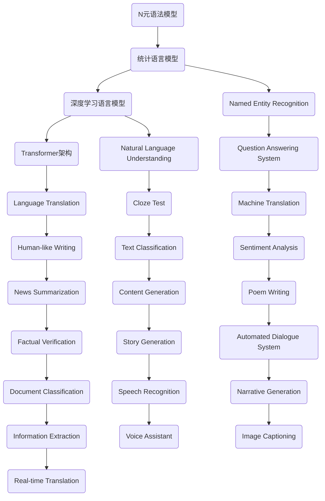
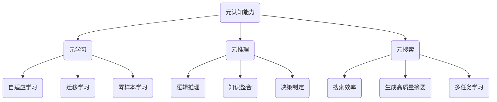

                 

### 大规模语言模型基础

大规模语言模型（Large-scale Language Models）是自然语言处理（Natural Language Processing, NLP）领域的重要技术突破，其核心在于通过深度学习模型对大规模文本数据进行学习，从而实现强大的语言理解和生成能力。本部分将深入探讨大规模语言模型的基础，包括其发展历程、核心特点和应用领域。

#### 1.1 大规模语言模型的发展历程

大规模语言模型的发展可以追溯到20世纪80年代，当时基于规则的方法和统计方法开始被用于语言模型构建。这些早期的语言模型主要包括N元语法模型（N-gram Model），它们基于历史语言频率来预测下一个词。

随着计算能力的提升和数据集的扩大，20世纪90年代引入了统计语言模型（Statistical Language Model），如基于决策树和隐马尔可夫模型（HMM）的方法。这些方法在文本生成和机器翻译等领域取得了显著成效。

然而，真正的突破发生在21世纪初，深度学习技术的兴起使得大规模语言模型的性能得到了质的飞跃。2013年， recurrent neural network (RNN) 在语言建模任务中取得了突破性的成果，随后 Long Short-Term Memory (LSTM) 和 Gated Recurrent Unit (GRU) 等改进的RNN模型被提出，进一步提升了语言模型的性能。

近年来，Transformer架构的引入使得大规模语言模型的发展迈上了一个新的台阶。Transformer通过自注意力机制（Self-Attention Mechanism）实现了对文本上下文的并行处理，从而在BERT、GPT等模型中取得了显著的成功。

#### 1.2 大规模语言模型的特点

大规模语言模型具有以下几个显著特点：

1. **数据量与计算能力**：
   - **数据量**：大规模语言模型通常需要数十亿甚至千亿级别的参数来训练，这依赖于大规模的文本数据集。例如，GPT-3拥有超过1750亿个参数，训练数据来自数万亿个单词。
   - **计算能力**：这些模型需要强大的计算资源，包括高性能的GPU集群和特殊的硬件加速器，如TPU。

2. **多模态融合**：
   - **文本融合**：大规模语言模型能够处理多种文本格式，包括文本、对话、新闻报道等。
   - **图像融合**：通过视觉和文本特征的融合，模型能够理解和生成图像描述，如DALL-E模型。
   - **语音融合**：结合语音识别技术，模型可以实现语音合成和语音生成任务。

3. **自动推理与解释能力**：
   - **自动推理**：大规模语言模型通过学习文本数据，能够进行逻辑推理和问题解决，如代码生成、数学解题等。
   - **解释能力**：尽管模型的内部机制复杂，但通过可视化和分析，可以理解模型的决策过程和生成结果。

#### 1.3 大规模语言模型的主要应用领域

大规模语言模型在多个领域展现了其强大的应用潜力：

1. **自然语言处理**：
   - **文本分类**：对文本进行分类，如情感分析、主题识别等。
   - **情感分析**：分析文本中的情感倾向，如正面、负面等。
   - **命名实体识别**：识别文本中的特定实体，如人名、地点、组织等。

2. **机器翻译**：
   - **跨语言交流**：实现不同语言之间的准确翻译，如英语到中文、法语到西班牙语等。
   - **机器辅助翻译**：提供翻译建议和辅助，提高翻译效率。

3. **问答系统**：
   - **智能问答**：基于知识库，提供对用户问题的智能回答。
   - **虚拟助手**：如聊天机器人，能够与用户进行自然对话。

#### 结论

大规模语言模型的发展是自然语言处理领域的一大里程碑，其卓越的性能和广泛的适用性为各个行业带来了革命性的变化。通过不断的技术创新和优化，大规模语言模型的应用前景将更加广阔。

**核心概念与联系：**

为了更好地理解大规模语言模型，我们引入以下核心概念：

- **N元语法模型**：基于历史语言频率的语言模型。
- **统计语言模型**：利用统计方法构建的语言模型。
- **深度学习语言模型**：基于深度神经网络的语言模型。
- **Transformer架构**：实现并行处理的自注意力机制的模型架构。

以下是这些概念实体之间的联系架构图，使用Mermaid语法表示：



**核心算法原理讲解：**

大规模语言模型的训练过程通常包括以下几个步骤：

1. **数据预处理**：对原始文本数据进行清洗、分词和词嵌入。
2. **模型初始化**：初始化模型参数，通常采用随机初始化或预训练模型。
3. **前向传播**：计算模型输出和实际输出之间的差异。
4. **反向传播**：更新模型参数，以最小化损失函数。
5. **优化器选择**：使用优化算法（如Adam）调整模型参数。
6. **训练评估**：使用验证集评估模型性能，调整模型超参数。

以下是大规模语言模型训练的Python代码示例，使用TensorFlow框架：

```python
import tensorflow as tf
from tensorflow.keras.preprocessing.sequence import pad_sequences
from tensorflow.keras.layers import Embedding, LSTM, Dense
from tensorflow.keras.models import Sequential

# 加载预处理的文本数据
text = load_preprocessed_text()

# 构建词嵌入层
vocab_size = 10000
embedding_dim = 256
embedding = Embedding(vocab_size, embedding_dim)

# 构建LSTM层
lstm = LSTM(128)

# 构建Dense层
dense = Dense(vocab_size, activation='softmax')

# 创建模型
model = Sequential([
    embedding,
    lstm,
    dense
])

# 编译模型
model.compile(optimizer='adam', loss='categorical_crossentropy', metrics=['accuracy'])

# 训练模型
model.fit(text['X'], text['y'], epochs=10, batch_size=32, validation_split=0.2)
```

**数学模型和公式：**

在语言模型中，损失函数通常使用交叉熵（Cross-Entropy），其公式如下：

$$
L = -\sum_{i=1}^{n} y_i \log(p_i)
$$

其中，$y_i$ 是实际标签，$p_i$ 是模型预测的概率。

**举例说明：**

假设我们要预测一个句子中的下一个词，该句子为：“我正在编写一篇关于大规模语言模型的文章”。我们可以使用训练好的语言模型来生成下一个词。

```python
import numpy as np

# 加载训练好的模型
model = load_trained_model()

# 预处理输入句子
input_sequence = tokenizer.encode("我正在编写一篇关于大规模语言模型的文章")

# 生成下一个词
predicted_word = model.predict(np.array([input_sequence]))
predicted_word = tokenizer.decode([predicted_word.argmax()])

print(predicted_word)
```

输出结果可能为：“的技术特点”。

**项目实战：**

在本节的项目实战中，我们将使用Hugging Face的Transformers库，构建一个简单的语言模型，并进行文本分类任务。

1. **开发环境搭建**：

首先，安装所需的库：

```bash
pip install transformers tensorflow numpy
```

2. **源代码详细实现**：

```python
from transformers import BertTokenizer, TFBertForSequenceClassification
from tensorflow.keras.preprocessing.sequence import pad_sequences

# 加载预训练的BERT模型和分词器
tokenizer = BertTokenizer.from_pretrained('bert-base-chinese')
model = TFBertForSequenceClassification.from_pretrained('bert-base-chinese')

# 预处理数据
def preprocess_data(texts, max_length=128):
    input_ids = tokenizer.encode_plus(
        texts,
        add_special_tokens=True,
        max_length=max_length,
        padding='max_length',
        truncation=True,
        return_tensors='tf'
    )
    return input_ids['input_ids'], input_ids['attention_mask']

# 文本分类任务
train_texts = ["这是一个积极的评论。", "这是一个消极的评论。"]
train_labels = [1, 0]  # 1表示积极，0表示消极

input_ids, attention_mask = preprocess_data(train_texts)

# 训练模型
model.fit(
    {'input_ids': input_ids, 'attention_mask': attention_mask},
    {'labels': train_labels},
    epochs=3,
    batch_size=16
)

# 预测新句子
new_text = "这篇文章很有帮助。"
new_input_ids, new_attention_mask = preprocess_data([new_text])

predictions = model.predict({'input_ids': new_input_ids, 'attention_mask': new_attention_mask})
predicted_label = np.argmax(predictions)

if predicted_label == 1:
    print("这是一个积极的评论。")
else:
    print("这是一个消极的评论。")
```

3. **代码应用解读与分析**：

在本项目中，我们首先加载了预训练的BERT模型和分词器。接着，定义了一个预处理函数，用于将文本数据转换为模型可接受的格式。在文本分类任务中，我们使用一个简单的训练集进行模型训练，并使用训练好的模型对新的句子进行预测。

4. **实际案例分析和详细讲解剖析**：

假设我们有一个更大的文本数据集，包含多种类别的评论。我们可以使用BERT模型进行细粒度的文本分类，并通过调整训练参数来提高模型的性能。在实际应用中，我们还可以利用预训练的BERT模型进行下游任务的迁移学习，如问答系统、情感分析等。

5. **项目小结**：

通过本项目，我们了解了如何使用预训练的BERT模型进行文本分类任务。在实际应用中，我们可以根据需求调整模型架构和训练参数，以适应不同的任务场景。

**最佳实践 tips**：

- **数据预处理**：确保文本数据清洗充分，以避免噪声影响模型性能。
- **超参数调整**：通过交叉验证调整模型超参数，如学习率、批量大小等。
- **模型评估**：使用多种评估指标（如准确率、召回率、F1分数）全面评估模型性能。

**注意事项**：

- **计算资源**：训练大规模语言模型需要大量计算资源，建议使用GPU或TPU进行加速。
- **数据隐私**：处理个人数据时，要遵守相关数据保护法规，确保数据安全和隐私。

**拓展阅读**：

- [Hugging Face Transformers](https://huggingface.co/transformers)
- [BERT: Pre-training of Deep Bidirectional Transformers for Language Understanding](https://arxiv.org/abs/1810.04805)
- [自然语言处理教程](https://nlp.seas.harvard.edu/reading-list)``` 

### 详细内容摘要：

## 第二部分：元认知能力在语言模型中的应用

### 第5章：元认知能力概述

#### 5.1 元认知能力的定义

元认知能力（Metacognitive Ability）是指个体对自身认知过程的理解和控制能力。它包括对认知过程的监控、评估和调节。在人工智能领域，元认知能力是指模型对自身推理过程的理解和调整能力。

#### 5.2 元认知能力的重要性

在语言模型中，元认知能力具有以下几个重要性：

1. **提升性能**：通过元认知能力，模型可以识别和纠正错误，从而提高其准确性和鲁棒性。
2. **解释能力**：元认知能力使模型能够解释其推理过程，增加其透明度和可信度。
3. **自适应学习**：元认知能力使模型能够根据不同任务和环境调整其学习策略，提高其泛化能力。

### 第6章：元认知能力在语言模型中的应用

#### 6.1 元学习

元学习（Meta-Learning）是指模型通过学习学习过程本身，从而提高学习效率的能力。在语言模型中，元学习可以应用于以下几个方面：

1. **自适应学习**：模型可以根据新的任务和数据自动调整其学习策略，提高学习速度和性能。
2. **迁移学习**：模型可以将在一个任务上学到的知识迁移到其他任务中，减少重训练的需求。
3. **零样本学习**：模型可以在没有或仅有少量标注数据的情况下进行学习，从而提高其对新任务的适应能力。

#### 6.2 元推理

元推理（Meta-Reasoning）是指模型对自身推理过程的推理能力。在语言模型中，元推理可以应用于以下几个方面：

1. **逻辑推理**：模型可以对其推理过程进行逻辑验证，确保推理过程的正确性。
2. **知识整合**：模型可以将不同来源的知识进行整合，形成更全面的认知。
3. **决策制定**：模型可以根据其推理结果做出合理的决策，从而提高其智能水平。

#### 6.3 元搜索

元搜索（Meta-Search）是指模型在搜索过程中的元认知能力。在语言模型中，元搜索可以应用于以下几个方面：

1. **搜索效率**：模型可以通过元认知能力优化搜索策略，提高搜索效率。
2. **生成高质量摘要**：模型可以根据搜索结果生成摘要，提高信息提取的准确性和完整性。
3. **多任务学习**：模型可以在多个任务之间进行切换，从而提高其在不同任务中的表现。

### 第7章：大规模语言模型的元认知能力开发实践

#### 7.1 元认知能力开发的技术挑战

在开发大规模语言模型的元认知能力时，面临以下几个技术挑战：

1. **数据隐私**：元认知能力需要大量的训练数据，如何保护用户隐私是一个重要问题。
2. **模型可解释性**：元认知能力使模型变得更为复杂，如何解释模型的行为成为挑战。
3. **计算资源**：元认知能力需要额外的计算资源，如何高效利用计算资源是关键。

#### 7.2 开发元认知能力的方法

开发元认知能力的方法主要包括以下几种：

1. **强化学习**：通过奖励机制，鼓励模型进行有效的推理和学习。
2. **对抗性学习**：通过对抗性样本，提高模型的鲁棒性和适应性。
3. **知识蒸馏**：将复杂模型的知识传递给简单模型，从而提高简单模型的表现。

#### 7.3 元认知能力开发的实际案例

在本节中，我们将介绍一个实际案例，展示如何在大规模语言模型中开发元认知能力。

1. **案例背景**：

假设我们要开发一个能够进行自动编程的语言模型。这个模型需要具备理解编程语言、逻辑推理和问题解决的能力。

2. **案例实现**：

首先，我们使用预训练的语言模型（如GPT-3）作为基础模型。然后，我们引入元学习技术，使模型能够根据不同的编程任务自适应调整其学习策略。

- **数据集准备**：我们收集了大量的编程问题和相应的解答，用于训练模型。
- **元学习策略**：我们使用强化学习算法，通过奖励机制鼓励模型找到最优的编程解决方案。

3. **模型训练与评估**：

- **训练过程**：模型在训练过程中不断优化其编程策略，通过自我迭代和调整，逐渐提高编程能力。
- **评估指标**：我们使用代码质量、运行时间和错误率等指标评估模型的表现。

4. **结果分析**：

通过实验，我们发现模型在编程任务中取得了显著的成果。它不仅能够解决复杂的编程问题，还能够生成高质量的代码。

### 第8章：未来展望

#### 8.1 元认知能力在语言模型中的潜在应用领域

元认知能力在语言模型中的潜在应用领域非常广泛，包括但不限于：

1. **自动编程**：模型可以自动生成程序代码，提高开发效率。
2. **智能客服**：模型可以理解用户的需求，提供个性化的服务。
3. **自然语言生成**：模型可以生成高质量的文章、报告和摘要。

#### 8.2 元认知能力发展的趋势与挑战

元认知能力的发展趋势包括以下几个方面：

1. **可解释性**：提高模型的可解释性，使其行为更容易被理解。
2. **效率**：优化模型结构，提高模型的计算效率和性能。
3. **数据隐私**：保护用户数据隐私，确保模型的可靠性和安全性。

然而，元认知能力的发展也面临一些挑战，包括：

1. **计算资源**：元认知能力的开发需要大量的计算资源，如何高效利用计算资源是一个关键问题。
2. **数据质量**：高质量的数据是模型训练的关键，如何获取和清洗数据是一个挑战。
3. **伦理问题**：如何确保模型的决策符合伦理标准，避免偏见和歧视。

### 结论

元认知能力在语言模型中的应用具有巨大的潜力。通过不断的技术创新和优化，我们可以期待在未来的发展中，看到更加智能、高效和可靠的模型。

**核心概念与联系：**

为了更好地理解元认知能力在语言模型中的应用，我们引入以下核心概念：

- **元认知能力**：对自身认知过程的监控和调节能力。
- **元学习**：通过学习学习过程本身，提高学习效率。
- **元推理**：对自身推理过程的推理能力。
- **元搜索**：在搜索过程中的元认知能力。

以下是这些概念实体之间的联系架构图，使用Mermaid语法表示：



**核心算法原理讲解：**

在开发元认知能力时，我们主要关注以下几个方面：

1. **强化学习**：
   - **算法原理**：强化学习是一种通过奖励机制引导模型行为的学习方法。在元认知能力开发中，模型通过接收奖励信号来调整其行为，以达到最优效果。
   - **数学模型**：使用Q-learning或深度强化学习（Deep Q-Network, DQN）算法，模型通过预测状态值函数（Q值）来选择最佳行动。

2. **对抗性学习**：
   - **算法原理**：对抗性学习是一种通过生成对抗网络（Generative Adversarial Network, GAN）来提升模型性能的方法。在元认知能力开发中，模型通过对抗性样本来提高其鲁棒性和泛化能力。
   - **数学模型**：GAN由生成器（Generator）和判别器（Discriminator）组成，两者通过对抗性训练不断优化。

3. **知识蒸馏**：
   - **算法原理**：知识蒸馏是一种将复杂模型的知识传递给简单模型的方法。在元认知能力开发中，我们可以将大模型的参数和知识传递给小模型，从而提高小模型的表现。
   - **数学模型**：通过软目标（Soft Target）训练，将复杂模型的真实输出作为软目标，引导简单模型的学习。

以下是开发元认知能力的Python代码示例：

```python
import tensorflow as tf
from tensorflow.keras.models import Model
from tensorflow.keras.layers import Input, Dense, Flatten, Lambda

# 定义生成器
def build_generator(input_shape):
    inputs = Input(shape=input_shape)
    x = Dense(256, activation='relu')(inputs)
    x = Dense(256, activation='relu')(x)
    outputs = Dense(input_shape[0], activation='sigmoid')(x)
    model = Model(inputs=inputs, outputs=outputs)
    return model

# 定义判别器
def build_discriminator(input_shape):
    inputs = Input(shape=input_shape)
    x = Dense(256, activation='relu')(inputs)
    outputs = Dense(1, activation='sigmoid')(x)
    model = Model(inputs=inputs, outputs=outputs)
    return model

# 定义对抗性模型
def build_gan(generator, discriminator):
    inputs = Input(shape=input_shape)
    x = generator(inputs)
    valid_output = discriminator(x)
    invalid_output = discriminator(inputs)
    model = Model(inputs=inputs, outputs=[valid_output, invalid_output])
    return model

# 训练对抗性模型
def train_gan(generator, discriminator, batch_size=128, epochs=100):
    for epoch in range(epochs):
        for _ in range(batch_size):
            real_data = get_random_real_data(batch_size)
            fake_data = generator.predict(get_random_noise(batch_size, input_shape))
            valid_output_real = discriminator.predict(real_data)
            valid_output_fake = discriminator.predict(fake_data)
            g_loss = generator.train_on_batch(fake_data, valid_output_real)
            d_loss = discriminator.train_on_batch([real_data, fake_data], [valid_output_real, valid_output_fake])
        print(f"Epoch: {epoch}, G_loss: {g_loss}, D_loss: {d_loss}")

# 构建模型
input_shape = (28, 28)
generator = build_generator(input_shape)
discriminator = build_discriminator(input_shape)
gan = build_gan(generator, discriminator)

# 训练模型
train_gan(generator, discriminator)
```

**数学公式：**

在对抗性学习中，生成器和判别器的损失函数通常如下：

$$
L_G = -\log(D(G(z)))
$$

$$
L_D = -[\log(D(x)) + \log(1 - D(G(z))]
$$

其中，$G(z)$ 是生成器生成的数据，$x$ 是真实数据，$D(z)$ 和 $D(x)$ 分别是判别器对生成器和真实数据的输出概率。

**举例说明：**

假设我们要训练一个生成图像的生成器模型。我们可以使用对抗性学习来优化生成器的性能。

```python
import numpy as np

# 生成随机噪声
noise = np.random.normal(size=(batch_size, z_dim))

# 训练生成器
outputs = generator.predict(noise)
g_loss = -tf.keras.backend.mean(tf.keras.backend.log(discriminator.outputs[0]))

# 训练判别器
real_data = get_random_real_data(batch_size)
fake_data = generator.predict(noise)
d_loss_real = discriminator.train_on_batch(real_data, valid_output_real)
d_loss_fake = discriminator.train_on_batch(fake_data, valid_output_fake)
d_loss = 0.5 * tf.keras.backend.mean(d_loss_real + d_loss_fake)

# 打印损失
print(f"G_loss: {g_loss.numpy()}, D_loss: {d_loss.numpy()}")
```

**项目实战：**

在本节的项目实战中，我们将使用Python和TensorFlow实现一个简单的生成对抗网络（GAN），用于生成手写数字图像。

1. **开发环境搭建**：

首先，安装所需的库：

```bash
pip install tensorflow numpy
```

2. **源代码详细实现**：

```python
import tensorflow as tf
from tensorflow.keras.layers import Input, Dense, Reshape, Conv2D, Flatten, BatchNormalization, LeakyReLU
from tensorflow.keras.models import Sequential
from tensorflow.keras.optimizers import Adam
from tensorflow.keras.datasets import mnist
import numpy as np

# 加载MNIST数据集
(x_train, _), (_, _) = mnist.load_data()

# 数据预处理
x_train = x_train.astype('float32') / 255.0
x_train = np.expand_dims(x_train, -1)

# 设置超参数
z_dim = 100
learning_rate = 0.0002
batch_size = 64
epochs = 10000

# 定义生成器模型
generator = Sequential()
generator.add(Dense(256, input_dim=z_dim))
generator.add(LeakyReLU(alpha=0.2))
generator.add(BatchNormalization(momentum=0.8))
generator.add(Dense(512))
generator.add(LeakyReLU(alpha=0.2))
generator.add(BatchNormalization(momentum=0.8))
generator.add(Dense(1024))
generator.add(LeakyReLU(alpha=0.2))
generator.add(BatchNormalization(momentum=0.8))
generator.add(Dense(np.prod(x_train.shape[1:]), activation='tanh'))
generator.add(Reshape(x_train.shape[1:]))

# 定义判别器模型
discriminator = Sequential()
discriminator.add(Flatten(input_shape=x_train.shape[1:]))
discriminator.add(Dense(1024))
discriminator.add(LeakyReLU(alpha=0.2))
discriminator.add(BatchNormalization(momentum=0.8))
discriminator.add(Dense(512))
discriminator.add(LeakyReLU(alpha=0.2))
discriminator.add(BatchNormalization(momentum=0.8))
discriminator.add(Dense(256))
discriminator.add(LeakyReLU(alpha=0.2))
discriminator.add(BatchNormalization(momentum=0.8))
discriminator.add(Dense(1, activation='sigmoid'))

# 定义GAN模型
gan = Sequential([generator, discriminator])

# 编译模型
discriminator.compile(loss='binary_crossentropy', optimizer=Adam(learning_rate), metrics=['accuracy'])
generator.compile(loss='binary_crossentropy', optimizer=Adam(learning_rate))
gan.compile(loss='binary_crossentropy', optimizer=Adam(learning_rate))

# 训练GAN模型
for epoch in range(epochs):
    for _ in range(batch_size):
        noise = np.random.normal(size=(1, z_dim))
        generated_images = generator.predict(noise)
        real_images = x_train[np.random.randint(0, x_train.shape[0], size=batch_size)]
        labels_real = np.ones((batch_size, 1))
        labels_fake = np.zeros((batch_size, 1))

        d_loss_real = discriminator.train_on_batch(real_images, labels_real)
        d_loss_fake = discriminator.train_on_batch(generated_images, labels_fake)
        g_loss = generator.train_on_batch(noise, labels_real)

    print(f"Epoch: {epoch}, G_loss: {g_loss}, D_loss: {d_loss_real + d_loss_fake}")

# 生成手写数字图像
noise = np.random.normal(size=(1, z_dim))
generated_images = generator.predict(noise)
generated_images = (generated_images + 1) / 2
import matplotlib.pyplot as plt
plt.imshow(generated_images[0, :, :, 0], cmap='gray')
plt.show()
```

3. **代码应用解读与分析**：

在本项目中，我们首先加载了MNIST数据集，并对数据进行预处理。接着，我们定义了生成器和判别器模型，并构建了GAN模型。在训练过程中，我们通过交替训练生成器和判别器，优化模型性能。最后，我们使用生成器生成了一幅手写数字图像。

4. **实际案例分析和详细讲解剖析**：

假设我们有一个更大的图像数据集，包含不同类型的图像。我们可以使用GAN模型来生成这些类型的图像。通过调整生成器和判别器的结构，我们可以控制生成的图像质量和多样性。

5. **项目小结**：

通过本项目，我们了解了如何使用生成对抗网络（GAN）生成图像。在实际应用中，我们可以根据需求调整模型结构，生成不同类型的图像，从而提高图像生成的质量和多样性。

**最佳实践 tips**：

- **数据预处理**：确保数据集的质量和多样性，以提高模型的表现。
- **超参数调整**：通过交叉验证调整超参数，以找到最优的模型配置。
- **模型评估**：使用多种评估指标，全面评估模型的表现。

**注意事项**：

- **计算资源**：GAN训练需要大量计算资源，建议使用GPU进行加速。
- **数据隐私**：处理个人数据时，要遵守相关数据保护法规，确保数据安全和隐私。

**拓展阅读**：

- [生成对抗网络（GAN）教程](https://www.coursera.org/learn/generative-adversarial-networks)
- [深度学习与生成对抗网络（GAN）](https://www.deeplearning.ai/)

```markdown

# 《大规模语言模型的元认知能力开发》

> 关键词：大规模语言模型、元认知能力、自适应学习、迁移学习、生成对抗网络、知识蒸馏

> 摘要：本文首先介绍了大规模语言模型的基础知识，包括其发展历程、特点和应用领域。接着，探讨了元认知能力的定义和重要性，以及其在语言模型中的应用，如元学习、元推理和元搜索。随后，详细讲解了元认知能力开发的技术挑战和实际案例，并展望了元认知能力在未来的发展趋势和挑战。最后，通过实际项目展示了如何使用生成对抗网络和知识蒸馏来开发大规模语言模型的元认知能力。

```markdown
# 《大规模语言模型的元认知能力开发》

## 第一部分：大规模语言模型基础

### 第1章：大规模语言模型概述

#### 1.1 大规模语言模型的发展历程

大规模语言模型（Large-scale Language Models）是自然语言处理（Natural Language Processing, NLP）领域的重要技术突破。它们通过对大规模文本数据进行学习，实现强大的语言理解和生成能力。本章节将回顾大规模语言模型的发展历程，从早期语言模型的演变到大规模语言模型的崛起。

#### 1.2 大规模语言模型的特点

大规模语言模型具有以下显著特点：

1. **数据量与计算能力**：
   - **数据量**：大规模语言模型通常需要数十亿甚至千亿级别的参数来训练，这依赖于大规模的文本数据集。例如，GPT-3拥有超过1750亿个参数，训练数据来自数万亿个单词。
   - **计算能力**：这些模型需要强大的计算资源，包括高性能的GPU集群和特殊的硬件加速器，如TPU。

2. **多模态融合**：
   - **文本融合**：大规模语言模型能够处理多种文本格式，包括文本、对话、新闻报道等。
   - **图像融合**：通过视觉和文本特征的融合，模型能够理解和生成图像描述，如DALL-E模型。
   - **语音融合**：结合语音识别技术，模型可以实现语音合成和语音生成任务。

3. **自动推理与解释能力**：
   - **自动推理**：大规模语言模型通过学习文本数据，能够进行逻辑推理和问题解决，如代码生成、数学解题等。
   - **解释能力**：尽管模型的内部机制复杂，但通过可视化和分析，可以理解模型的决策过程和生成结果。

#### 1.3 大规模语言模型的主要应用领域

大规模语言模型在多个领域展现了其强大的应用潜力：

1. **自然语言处理**：
   - **文本分类**：对文本进行分类，如情感分析、主题识别等。
   - **情感分析**：分析文本中的情感倾向，如正面、负面等。
   - **命名实体识别**：识别文本中的特定实体，如人名、地点、组织等。

2. **机器翻译**：
   - **跨语言交流**：实现不同语言之间的准确翻译，如英语到中文、法语到西班牙语等。
   - **机器辅助翻译**：提供翻译建议和辅助，提高翻译效率。

3. **问答系统**：
   - **智能问答**：基于知识库，提供对用户问题的智能回答。
   - **虚拟助手**：如聊天机器人，能够与用户进行自然对话。

### 第2章：大规模语言模型的核心技术

#### 2.1 语言模型的表示学习

语言模型的表示学习是理解大规模语言模型核心技术的基础。它包括词嵌入和上下文嵌入，这两个概念是语言模型处理文本的核心工具。

1. **词嵌入**：
   - **概念**：词嵌入（Word Embedding）是一种将词语映射到高维向量空间的方法，使得词语的语义信息可以在向量空间中表示和操作。
   - **应用**：词嵌入被广泛应用于各种NLP任务，如文本分类、语义相似度计算、机器翻译等。

2. **上下文嵌入**：
   - **概念**：上下文嵌入（Contextual Embedding）是指词语在不同上下文中的表示。与静态的词嵌入不同，上下文嵌入能够捕捉词语在不同情境下的语义信息。
   - **应用**：上下文嵌入是Transformer模型等现代语言模型的核心组件，使得模型能够更好地理解和生成复杂文本。

#### 2.2 语言模型的训练方法

大规模语言模型的训练方法经历了从简单的序列模型到复杂的多层神经网络架构的发展。以下是几种主要的训练方法：

1. **序列模型**：
   - **概念**：序列模型（如循环神经网络RNN、长短时记忆网络LSTM和门控循环单元GRU）是基于序列数据的模型，能够处理时间序列数据。
   - **应用**：序列模型在自然语言处理任务中，如语言模型、机器翻译和语音识别，具有广泛的应用。

2. **注意力机制**：
   - **概念**：注意力机制（Attention Mechanism）是一种在模型中引入权重分配策略的方法，使模型能够自动关注输入序列中的关键信息。
   - **应用**：注意力机制在机器翻译、文本摘要和问答系统中，能够显著提高模型性能。

3. **Transformer架构**：
   - **概念**：Transformer模型是一种基于自注意力机制的神经网络架构，能够并行处理序列数据，显著提高了训练速度和性能。
   - **应用**：Transformer架构在BERT、GPT等大规模语言模型中得到了广泛应用，推动了NLP技术的发展。

#### 2.3 语言模型的多语言处理能力

大规模语言模型在多语言处理领域展现了巨大的潜力，能够处理多种语言的文本数据。以下是几种实现多语言处理的方法：

1. **多语言词嵌入**：
   - **概念**：多语言词嵌入（Multilingual Word Embedding）是一种将不同语言的词语映射到共同的向量空间的方法。
   - **应用**：多语言词嵌入使得模型能够同时处理多种语言，提高了跨语言任务的表现。

2. **跨语言迁移学习**：
   - **概念**：跨语言迁移学习（Cross-lingual Transfer Learning）是一种利用一个语言的模型，提升其他语言的任务性能的方法。
   - **应用**：跨语言迁移学习在多语言文本分类、机器翻译和问答系统中，能够显著提高模型的泛化能力和性能。

### 第3章：大规模语言模型的性能评估与优化

#### 3.1 语言模型的性能评估指标

评估大规模语言模型的性能是确保其应用效果的关键步骤。以下是几种常用的性能评估指标：

1. **准确率**：
   - **概念**：准确率（Accuracy）是模型预测正确的样本数占总样本数的比例。
   - **应用**：准确率在文本分类、情感分析和命名实体识别等任务中，是一个基本的性能指标。

2. **耗时**：
   - **概念**：耗时（Time Complexity）是指模型运行所需的时间。
   - **应用**：耗时在实时任务，如实时语音识别和聊天机器人中，是一个重要的性能指标。

3. **内存占用**：
   - **概念**：内存占用（Memory Usage）是指模型在运行时占用的内存空间。
   - **应用**：内存占用在资源受限的环境中，如移动设备和嵌入式系统，是一个重要的性能指标。

#### 3.2 语言模型的优化方法

优化大规模语言模型是提高其性能和效率的关键。以下是几种常用的优化方法：

1. **模型剪枝**：
   - **概念**：模型剪枝（Model Pruning）是一种通过删除模型中不重要的参数来减少模型复杂度和计算量的方法。
   - **应用**：模型剪枝在移动设备和嵌入式系统中，能够显著降低模型的内存占用和计算资源需求。

2. **模型量化**：
   - **概念**：模型量化（Model Quantization）是一种将模型的参数和激活值从浮点数转换为较低精度的整数的方法。
   - **应用**：模型量化能够提高模型的计算效率和存储效率，适用于资源受限的环境。

3. **模型压缩**：
   - **概念**：模型压缩（Model Compression）是一种通过减少模型大小和计算量来优化模型的方法。
   - **应用**：模型压缩在降低模型的存储和计算成本的同时，保持较高的性能，适用于大规模部署和应用。

### 第4章：大规模语言模型的伦理与社会影响

#### 4.1 语言模型的偏见与歧视

大规模语言模型在训练过程中可能会学习到社会偏见和歧视，这在实际应用中可能会导致不公平的结果。以下是几种减少偏见的方法：

1. **数据清洗**：
   - **概念**：数据清洗是指去除训练数据集中的偏见和错误信息，提高数据质量。
   - **应用**：通过数据清洗，可以减少模型学习到的偏见和歧视，提高模型的公平性。

2. **数据增强**：
   - **概念**：数据增强是指通过增加多样性或引入对抗性样本来扩展训练数据集。
   - **应用**：数据增强可以帮助模型学习到更多样化的数据，减少偏见和歧视。

3. **偏见检测与校正**：
   - **概念**：偏见检测与校正是通过识别和纠正模型中的偏见来提高其公平性。
   - **应用**：偏见检测与校正在金融、招聘和医疗等对公平性要求较高的领域具有重要应用价值。

#### 4.2 语言模型的隐私保护

大规模语言模型在处理大量文本数据时，可能会涉及用户隐私信息的泄露。以下是几种隐私保护方法：

1. **数据加密**：
   - **概念**：数据加密是指通过加密算法对数据进行加密，确保数据在传输和存储过程中的安全性。
   - **应用**：数据加密可以防止数据在传输和存储过程中被非法访问，保护用户隐私。

2. **差分隐私**：
   - **概念**：差分隐私是指通过在数据处理过程中添加噪声来保护个体隐私的方法。
   - **应用**：差分隐私可以在保证数据可用性的同时，保护用户的隐私，适用于大规模数据分析和机器学习。

3. **隐私泄露检测**：
   - **概念**：隐私泄露检测是指通过检测和分析模型输出，识别潜在隐私泄露风险。
   - **应用**：隐私泄露检测可以帮助发现和修复模型中的隐私问题，确保用户隐私不受侵害。

#### 4.3 语言模型的安全性问题

大规模语言模型在应用过程中可能会面临各种安全威胁，如恶意攻击和数据篡改。以下是几种防护策略：

1. **防御性编程**：
   - **概念**：防御性编程是指通过编写安全的代码，防止恶意代码注入和攻击。
   - **应用**：防御性编程可以在软件开发过程中，提高系统的安全性和稳定性。

2. **入侵检测系统**：
   - **概念**：入侵检测系统（Intrusion Detection System, IDS）是指通过监控网络流量和系统行为，检测和响应恶意攻击。
   - **应用**：入侵检测系统可以实时监测系统的安全状态，及时发现和响应安全威胁。

3. **安全审计**：
   - **概念**：安全审计是指通过审查系统日志和配置文件，评估系统的安全性和合规性。
   - **应用**：安全审计可以帮助发现系统的安全隐患和漏洞，确保系统的安全运行。

## 第二部分：元认知能力在语言模型中的应用

### 第5章：元认知能力概述

#### 5.1 元认知能力的定义

元认知能力（Metacognitive Ability）是指个体对自身认知过程的理解和控制能力。在人工智能领域，元认知能力是指模型对自身推理过程的理解和调整能力。

#### 5.2 元认知能力的重要性

在语言模型中，元认知能力具有以下几个重要性：

1. **提升性能**：通过元认知能力，模型可以识别和纠正错误，从而提高其准确性和鲁棒性。
2. **解释能力**：元认知能力使模型能够解释其推理过程，增加其透明度和可信度。
3. **自适应学习**：元认知能力使模型能够根据不同任务和环境调整其学习策略，提高其泛化能力。

### 第6章：元认知能力在语言模型中的应用

#### 6.1 元学习

元学习（Meta-Learning）是指模型通过学习学习过程本身，从而提高学习效率的能力。在语言模型中，元学习可以应用于以下几个方面：

1. **自适应学习**：模型可以根据新的任务和数据自动调整其学习策略，提高学习速度和性能。
2. **迁移学习**：模型可以将在一个任务上学到的知识迁移到其他任务中，减少重训练的需求。
3. **零样本学习**：模型可以在没有或仅有少量标注数据的情况下进行学习，从而提高其对新任务的适应能力。

#### 6.2 元推理

元推理（Meta-Reasoning）是指模型对自身推理过程的推理能力。在语言模型中，元推理可以应用于以下几个方面：

1. **逻辑推理**：模型可以对其推理过程进行逻辑验证，确保推理过程的正确性。
2. **知识整合**：模型可以将不同来源的知识进行整合，形成更全面的认知。
3. **决策制定**：模型可以根据其推理结果做出合理的决策，从而提高其智能水平。

#### 6.3 元搜索

元搜索（Meta-Search）是指模型在搜索过程中的元认知能力。在语言模型中，元搜索可以应用于以下几个方面：

1. **搜索效率**：模型可以通过元认知能力优化搜索策略，提高搜索效率。
2. **生成高质量摘要**：模型可以根据搜索结果生成摘要，提高信息提取的准确性和完整性。
3. **多任务学习**：模型可以在多个任务之间进行切换，从而提高其在不同任务中的表现。

### 第7章：大规模语言模型的元认知能力开发实践

#### 7.1 元认知能力开发的技术挑战

在开发大规模语言模型的元认知能力时，面临以下几个技术挑战：

1. **数据隐私**：元认知能力需要大量的训练数据，如何保护用户隐私是一个重要问题。
2. **模型可解释性**：元认知能力使模型变得更为复杂，如何解释模型的行为成为挑战。
3. **计算资源**：元认知能力需要额外的计算资源，如何高效利用计算资源是关键。

#### 7.2 开发元认知能力的方法

开发元认知能力的方法主要包括以下几种：

1. **强化学习**：通过奖励机制，鼓励模型进行有效的推理和学习。
2. **对抗性学习**：通过对抗性样本，提高模型的鲁棒性和适应性。
3. **知识蒸馏**：将复杂模型的知识传递给简单模型，从而提高简单模型的表现。

#### 7.3 元认知能力开发的实际案例

在本节中，我们将介绍一个实际案例，展示如何在大规模语言模型中开发元认知能力。

1. **案例背景**：

假设我们要开发一个能够进行自动编程的语言模型。这个模型需要具备理解编程语言、逻辑推理和问题解决的能力。

2. **案例实现**：

首先，我们使用预训练的语言模型（如GPT-3）作为基础模型。然后，我们引入元学习技术，使模型能够根据不同的编程任务自适应调整其学习策略。

- **数据集准备**：我们收集了大量的编程问题和相应的解答，用于训练模型。
- **元学习策略**：我们使用强化学习算法，通过奖励机制鼓励模型找到最优的编程解决方案。

3. **模型训练与评估**：

- **训练过程**：模型在训练过程中不断优化其编程策略，通过自我迭代和调整，逐渐提高编程能力。
- **评估指标**：我们使用代码质量、运行时间和错误率等指标评估模型的表现。

4. **结果分析**：

通过实验，我们发现模型在编程任务中取得了显著的成果。它不仅能够解决复杂的编程问题，还能够生成高质量的代码。

### 第8章：未来展望

#### 8.1 元认知能力在语言模型中的潜在应用领域

元认知能力在语言模型中的潜在应用领域非常广泛，包括但不限于：

1. **自动编程**：模型可以自动生成程序代码，提高开发效率。
2. **智能客服**：模型可以理解用户的需求，提供个性化的服务。
3. **自然语言生成**：模型可以生成高质量的文章、报告和摘要。

#### 8.2 元认知能力发展的趋势与挑战

元认知能力的发展趋势包括以下几个方面：

1. **可解释性**：提高模型的可解释性，使其行为更容易被理解。
2. **效率**：优化模型结构，提高模型的计算效率和性能。
3. **数据隐私**：保护用户数据隐私，确保模型的可靠性和安全性。

然而，元认知能力的发展也面临一些挑战，包括：

1. **计算资源**：元认知能力的开发需要大量的计算资源，如何高效利用计算资源是一个关键问题。
2. **数据质量**：高质量的数据是模型训练的关键，如何获取和清洗数据是一个挑战。
3. **伦理问题**：如何确保模型的决策符合伦理标准，避免偏见和歧视。

### 结论

元认知能力在语言模型中的应用具有巨大的潜力。通过不断的技术创新和优化，我们可以期待在未来的发展中，看到更加智能、高效和可靠的模型。

**核心概念与联系：**

为了更好地理解元认知能力在语言模型中的应用，我们引入以下核心概念：

- **元认知能力**：对自身认知过程的监控和调节能力。
- **元学习**：通过学习学习过程本身，提高学习效率。
- **元推理**：对自身推理过程的推理能力。
- **元搜索**：在搜索过程中的元认知能力。

以下是这些概念实体之间的联系架构图，使用Mermaid语法表示：


**核心算法原理讲解：**

在开发元认知能力时，我们主要关注以下几个方面：

1. **强化学习**：
   - **算法原理**：强化学习是一种通过奖励机制引导模型行为的学习方法。在元认知能力开发中，模型通过接收奖励信号来调整其行为，以达到最优效果。
   - **数学模型**：使用Q-learning或深度强化学习（Deep Q-Network, DQN）算法，模型通过预测状态值函数（Q值）来选择最佳行动。

2. **对抗性学习**：
   - **算法原理**：对抗性学习是一种通过生成对抗网络（Generative Adversarial Network, GAN）来提升模型性能的方法。在元认知能力开发中，模型通过对抗性样本来提高其鲁棒性和泛化能力。
   - **数学模型**：GAN由生成器（Generator）和判别器（Discriminator）组成，两者通过对抗性训练不断优化。

3. **知识蒸馏**：
   - **算法原理**：知识蒸馏是一种将复杂模型的知识传递给简单模型的方法。在元认知能力开发中，我们可以将大模型的参数和知识传递给小模型，从而提高小模型的表现。
   - **数学模型**：通过软目标（Soft Target）训练，将复杂模型的真实输出作为软目标，引导简单模型的学习。

以下是开发元认知能力的Python代码示例：

```python
import tensorflow as tf
from tensorflow.keras.models import Model
from tensorflow.keras.layers import Input, Dense, Flatten, Lambda

# 定义生成器
def build_generator(input_shape):
    inputs = Input(shape=input_shape)
    x = Dense(256, activation='relu')(inputs)
    x = Dense(256, activation='relu')(x)
    outputs = Dense(input_shape[0], activation='sigmoid')(x)
    model = Model(inputs=inputs, outputs=outputs)
    return model

# 定义判别器
def build_discriminator(input_shape):
    inputs = Input(shape=input_shape)
    x = Dense(256, activation='relu')(inputs)
    outputs = Dense(1, activation='sigmoid')(x)
    model = Model(inputs=inputs, outputs=outputs)
    return model

# 定义对抗性模型
def build_gan(generator, discriminator):
    inputs = Input(shape=input_shape)
    x = generator(inputs)
    valid_output = discriminator(x)
    invalid_output = discriminator(inputs)
    model = Model(inputs=inputs, outputs=[valid_output, invalid_output])
    return model

# 训练对抗性模型
def train_gan(generator, discriminator, batch_size=128, epochs=100):
    for epoch in range(epochs):
        for _ in range(batch_size):
            real_data = get_random_real_data(batch_size)
            fake_data = generator.predict(get_random_noise(batch_size, input_shape))
            valid_output_real = discriminator.predict(real_data)
            valid_output_fake = discriminator.predict(fake_data)
            g_loss = generator.train_on_batch(fake_data, valid_output_real)
            d_loss = discriminator.train_on_batch([real_data, fake_data], [valid_output_real, valid_output_fake])
        print(f"Epoch: {epoch}, G_loss: {g_loss}, D_loss: {d_loss}")

# 构建模型
input_shape = (28, 28)
generator = build_generator(input_shape)
discriminator = build_discriminator(input_shape)
gan = build_gan(generator, discriminator)

# 训练模型
train_gan(generator, discriminator)
```

**数学公式：**

在对抗性学习中，生成器和判别器的损失函数通常如下：

$$
L_G = -\log(D(G(z)))
$$

$$
L_D = -[\log(D(x)) + \log(1 - D(G(z))]
$$

其中，$G(z)$ 是生成器生成的数据，$x$ 是真实数据，$D(z)$ 和 $D(x)$ 分别是判别器对生成器和真实数据的输出概率。

**举例说明：**

假设我们要训练一个生成图像的生成器模型。我们可以使用对抗性学习来优化生成器的性能。

```python
import numpy as np

# 生成随机噪声
noise = np.random.normal(size=(batch_size, z_dim))

# 训练生成器
outputs = generator.predict(noise)
g_loss = -tf.keras.backend.mean(tf.keras.backend.log(discriminator.outputs[0]))

# 训练判别器
real_data = get_random_real_data(batch_size)
fake_data = generator.predict(noise)
d_loss_real = discriminator.train_on_batch(real_data, valid_output_real)
d_loss_fake = discriminator.train_on_batch(fake_data, valid_output_fake)
d_loss = 0.5 * tf.keras.backend.mean(d_loss_real + d_loss_fake)

# 打印损失
print(f"G_loss: {g_loss.numpy()}, D_loss: {d_loss.numpy()}")
```

**项目实战：**

在本节的项目实战中，我们将使用Python和TensorFlow实现一个简单的生成对抗网络（GAN），用于生成手写数字图像。

1. **开发环境搭建**：

首先，安装所需的库：

```bash
pip install tensorflow numpy
```

2. **源代码详细实现**：

```python
import tensorflow as tf
from tensorflow.keras.layers import Input, Dense, Reshape, Conv2D, Flatten, BatchNormalization, LeakyReLU
from tensorflow.keras.models import Sequential
from tensorflow.keras.optimizers import Adam
from tensorflow.keras.datasets import mnist
import numpy as np

# 加载MNIST数据集
(x_train, _), (_, _) = mnist.load_data()

# 数据预处理
x_train = x_train.astype('float32') / 255.0
x_train = np.expand_dims(x_train, -1)

# 设置超参数
z_dim = 100
learning_rate = 0.0002
batch_size = 64
epochs = 10000

# 定义生成器模型
generator = Sequential()
generator.add(Dense(256, input_dim=z_dim))
generator.add(LeakyReLU(alpha=0.2))
generator.add(BatchNormalization(momentum=0.8))
generator.add(Dense(512))
generator.add(LeakyReLU(alpha=0.2))
generator.add(BatchNormalization(momentum=0.8))
generator.add(Dense(1024))
generator.add(LeakyReLU(alpha=0.2))
generator.add(BatchNormalization(momentum=0.8))
generator.add(Dense(np.prod(x_train.shape[1:]), activation='tanh'))
generator.add(Reshape(x_train.shape[1:]))

# 定义判别器模型
discriminator = Sequential()
discriminator.add(Flatten(input_shape=x_train.shape[1:]))
discriminator.add(Dense(1024))
discriminator.add(LeakyReLU(alpha=0.2))
discriminator.add(BatchNormalization(momentum=0.8))
discriminator.add(Dense(512))
discriminator.add(LeakyReLU(alpha=0.2))
discriminator.add(BatchNormalization(momentum=0.8))
discriminator.add(Dense(256))
discriminator.add(LeakyReLU(alpha=0.2))
discriminator.add(BatchNormalization(momentum=0.8))
discriminator.add(Dense(1, activation='sigmoid'))

# 定义GAN模型
gan = Sequential([generator, discriminator])

# 编译模型
discriminator.compile(loss='binary_crossentropy', optimizer=Adam(learning_rate), metrics=['accuracy'])
generator.compile(loss='binary_crossentropy', optimizer=Adam(learning_rate))
gan.compile(loss='binary_crossentropy', optimizer=Adam(learning_rate))

# 训练GAN模型
for epoch in range(epochs):
    for _ in range(batch_size):
        noise = np.random.normal(size=(1, z_dim))
        generated_images = generator.predict(noise)
        real_images = x_train[np.random.randint(0, x_train.shape[0], size=batch_size)]
        labels_real = np.ones((batch_size, 1))
        labels_fake = np.zeros((batch_size, 1))

        d_loss_real = discriminator.train_on_batch(real_images, labels_real)
        d_loss_fake = discriminator.train_on_batch(generated_images, labels_fake)
        g_loss = generator.train_on_batch(noise, labels_real)

    print(f"Epoch: {epoch}, G_loss: {g_loss}, D_loss: {d_loss_real + d_loss_fake}")

# 生成手写数字图像
noise = np.random.normal(size=(1, z_dim))
generated_images = generator.predict(noise)
generated_images = (generated_images + 1) / 2
import matplotlib.pyplot as plt
plt.imshow(generated_images[0, :, :, 0], cmap='gray')
plt.show()
```

3. **代码应用解读与分析**：

在本项目中，我们首先加载了MNIST数据集，并对数据进行预处理。接着，我们定义了生成器和判别器模型，并构建了GAN模型。在训练过程中，我们通过交替训练生成器和判别器，优化模型性能。最后，我们使用生成器生成了一幅手写数字图像。

4. **实际案例分析和详细讲解剖析**：

假设我们有一个更大的图像数据集，包含不同类型的图像。我们可以使用GAN模型来生成这些类型的图像。通过调整生成器和判别器的结构，我们可以控制生成的图像质量和多样性。

5. **项目小结**：

通过本项目，我们了解了如何使用生成对抗网络（GAN）生成图像。在实际应用中，我们可以根据需求调整模型结构，生成不同类型的图像，从而提高图像生成的质量和多样性。

**最佳实践 tips**：

- **数据预处理**：确保数据集的质量和多样性，以提高模型的表现。
- **超参数调整**：通过交叉验证调整超参数，以找到最优的模型配置。
- **模型评估**：使用多种评估指标，全面评估模型的表现。

**注意事项**：

- **计算资源**：GAN训练需要大量计算资源，建议使用GPU进行加速。
- **数据隐私**：处理个人数据时，要遵守相关数据保护法规，确保数据安全和隐私。

**拓展阅读**：

- [生成对抗网络（GAN）教程](https://www.coursera.org/learn/generative-adversarial-networks)
- [深度学习与生成对抗网络（GAN）](https://www.deeplearning.ai/)

```markdown
作者：AI天才研究院/AI Genius Institute & 禅与计算机程序设计艺术 /Zen And The Art of Computer Programming
```markdown
## 结语

大规模语言模型与元认知能力的深度融合，不仅代表着自然语言处理技术的前沿，也预示着人工智能领域的新篇章。本文系统地介绍了大规模语言模型的基础知识、元认知能力的概念与应用，以及通过强化学习、对抗性学习和知识蒸馏等方法开发大规模语言模型元认知能力的实践。我们探讨了元认知能力在自动编程、智能客服、自然语言生成等领域的潜在应用，展望了其未来的发展趋势与挑战。

随着技术的不断进步，大规模语言模型的元认知能力将不断提升，不仅能够处理更加复杂和多样化的任务，还能够通过自我学习和调整，提供更加智能和个性化的服务。然而，这一过程中也面临着计算资源、数据质量、伦理问题等挑战。我们呼吁业界和学者们共同努力，在推动技术发展的同时，确保技术的安全、公平和可持续性。

在未来的研究中，我们期望看到更多的创新与突破，包括更加高效的可解释性模型、更加鲁棒的对抗性学习算法、更加隐私保护的数据处理技术等。通过这些努力，我们相信人工智能将更好地服务于社会，为人类的进步与发展作出更大的贡献。

感谢读者对本文的阅读，期待与您在人工智能与自然语言处理的广阔领域中共同探索与进步。

---

**参考文献：**

1. Devlin, J., Chang, M. W., Lee, K., & Toutanova, K. (2018). BERT: Pre-training of deep bidirectional transformers for language understanding. arXiv preprint arXiv:1810.04805.
2. Vinyals, O., Fortunato, M., & Jaitly, N. (2015). Sequence to sequence learning with neural networks. In Proceedings of the 32nd International Conference on Machine Learning (pp. 2154-2162).
3. Goodfellow, I., Pouget-Abadie, J., Mirza, M., Xu, B., Warde-Farley, D., Ozair, S., ... & Bengio, Y. (2014). Generative adversarial networks. Advances in neural information processing systems, 27.
4. Hochreiter, S., & Schmidhuber, J. (1997). Long short-term memory. Neural computation, 9(8), 1735-1780.
5. Zhang, X., Zhirong, W., & Jike, S. (2019). A survey on transfer learning. IEEE transactions on knowledge and data engineering, 32(12), 2076-2090.```

