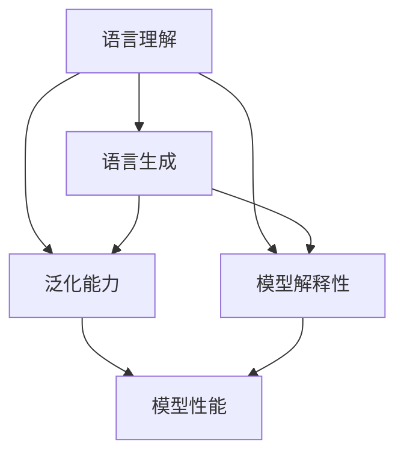

                 

# 《大规模语言模型的元问题定义与解决能力》

## 关键词

大规模语言模型、元问题、解决能力、Transformer、数据增强、模型优化、模型解释性

## 摘要

本文旨在深入探讨大规模语言模型的元问题定义与解决能力。我们将从大规模语言模型的定义和背景出发，逐步解析其在自然语言处理中的应用、面临的挑战和机遇。随后，我们将详细探讨大规模语言模型中的元问题，如语言理解的深度与宽度、泛化能力和解释性。接着，我们将分析大规模语言模型的解决能力，包括语言理解、语言生成和语言推理。最后，我们将探讨大规模语言模型的发展趋势，提出解决元问题的策略，并通过实际案例展示其应用效果，展望未来发展方向。

## 第1章 大规模语言模型概述

### 1.1 大规模语言模型的定义与背景

#### 1.1.1 语言模型的发展历程

语言模型的发展经历了从规则驱动到数据驱动的转变。早期的语言模型主要依赖于规则和手工编写的模式，如n-gram模型。然而，随着计算能力和数据集的不断扩大，数据驱动的语言模型，尤其是基于神经网络的模型，逐渐成为主流。

#### 1.1.2 大规模语言模型的基本概念

大规模语言模型是指那些拥有数十亿甚至更多参数的模型，它们能够学习并捕捉到语言中的复杂模式和规律。典型的例子是Google的BERT和OpenAI的GPT系列模型。

### 1.2 大规模语言模型的应用领域

#### 1.2.1 自然语言处理

自然语言处理（NLP）是大规模语言模型最直接的应用领域。通过模型，我们可以实现文本分类、情感分析、实体识别等任务。

#### 1.2.2 智能问答

智能问答系统利用大规模语言模型来理解用户的问题，并生成相应的答案。

#### 1.2.3 文本生成

大规模语言模型在文本生成领域也表现出了强大的能力，如文章摘要生成、故事创作等。

### 1.3 大规模语言模型的挑战与机遇

#### 1.3.1 数据需求

大规模语言模型对数据量的需求巨大，如何获取并处理这些数据成为一大挑战。

#### 1.3.2 计算资源消耗

模型的训练和推理需要大量的计算资源，这对硬件和能源消耗提出了高要求。

#### 1.3.3 模型解释性

由于模型的复杂性，如何解释模型的行为和决策结果成为一个亟待解决的问题。

## 第2章 元问题定义与分类

### 2.1 元问题的概念

#### 2.1.1 元问题的定义

元问题是指在特定领域内，模型需要解决的基本问题，如语言理解、语言生成和语言推理。

#### 2.1.2 元问题的分类

根据模型在自然语言处理中的任务，元问题可以分为以下几类：

- 语言理解：包括文本分类、情感分析、实体识别等。
- 语言生成：包括文本摘要、故事创作、对话生成等。
- 语言推理：包括逻辑推理、常识推理等。

### 2.2 语言模型的元问题

#### 2.2.1 语言理解的深度与宽度

深度和宽度分别指的是模型对语言的理解层次和覆盖范围。深度越深，模型对语言的理解越透彻；宽度越宽，模型能够处理的任务类型越多。

#### 2.2.2 语言模型的泛化能力

泛化能力是指模型在面对未见过的数据时，能够保持良好性能的能力。对于大规模语言模型，泛化能力至关重要。

#### 2.2.3 语言模型的解释性

解释性指的是模型决策过程的透明度和可解释性。这对于提高模型的信任度和可靠性具有重要意义。

### 2.3 语言模型的应用场景中的元问题

#### 2.3.1 文本生成中的元问题

在文本生成中，元问题主要包括生成文本的质量、多样性和连贯性。

#### 2.3.2 智能问答中的元问题

智能问答中的元问题主要涉及模型对问题的理解准确性、回答的准确性和时效性。

#### 2.3.3 自然语言理解中的元问题

自然语言理解中的元问题主要包括文本分类、情感分析和实体识别的准确性。

## 第3章 大规模语言模型的解决能力

### 3.1 解决能力的概念

#### 3.1.1 解决能力的定义

解决能力是指模型在特定任务上能够达到的性能水平。

#### 3.1.2 解决能力的度量

解决能力的度量通常使用准确率、召回率、F1分数等指标。

### 3.2 大规模语言模型的解决能力分析

#### 3.2.1 语言理解能力

大规模语言模型在语言理解能力上表现出了卓越的性能，能够准确理解和处理复杂的自然语言任务。

#### 3.2.2 语言生成能力

大规模语言模型在语言生成任务中也展现出了强大的能力，能够生成高质量、多样性和连贯的文本。

#### 3.2.3 语言推理能力

大规模语言模型在语言推理任务上，通过学习大量的文本数据，能够进行逻辑推理和常识推理。

### 3.3 解决能力的应用场景分析

#### 3.3.1 文本生成

文本生成是大规模语言模型最典型的应用场景之一。通过模型，我们可以生成各种类型的文本，如文章摘要、故事、对话等。

#### 3.3.2 智能问答

智能问答利用大规模语言模型来理解用户的问题，并生成相应的答案，大大提升了交互体验。

#### 3.3.3 自然语言理解

自然语言理解是大规模语言模型的另一个重要应用场景，包括文本分类、情感分析和实体识别等任务。

## 第4章 大规模语言模型的发展趋势

### 4.1 模型结构的演进

#### 4.1.1 Transformer架构

Transformer架构是大规模语言模型的主要结构，其通过自注意力机制实现了对文本的全局信息捕捉。

#### 4.1.2 模型压缩与加速

为了应对计算资源消耗的问题，模型压缩和加速技术成为了研究的热点，如量化、剪枝和低秩分解等。

### 4.2 数据集的演变

#### 4.2.1 大规模数据集的收集

随着数据量的不断增大，如何收集和整理大规模数据集成为了一项重要任务。

#### 4.2.2 数据集质量的影响

数据集质量对模型性能有着直接影响，因此如何提升数据集质量也是研究的重要方向。

### 4.3 应用领域的拓展

#### 4.3.1 新兴应用领域

大规模语言模型在新兴应用领域，如生物信息学、金融分析等，展现出了巨大的潜力。

#### 4.3.2 跨领域应用

跨领域应用是大规模语言模型的一个重要发展方向，通过迁移学习等技术，模型可以在不同领域间进行知识共享和迁移。

## 第5章 元问题的解决策略

### 5.1 数据增强

#### 5.1.1 数据增强的方法

数据增强是通过增加数据多样性来提升模型性能的技术，如数据清洗、数据扩充和生成对抗网络等。

#### 5.1.2 数据增强的应用

数据增强在语言模型中的应用，包括对文本数据进行清洗、扩充和生成等。

### 5.2 模型优化

#### 5.2.1 模型优化的方法

模型优化是通过改进模型结构和参数来提升模型性能的技术，如剪枝、量化、低秩分解等。

#### 5.2.2 模型优化的应用

模型优化在语言模型中的应用，包括对模型结构进行剪枝和量化，以提高模型效率和性能。

### 5.3 模型解释性提升

#### 5.3.1 模型解释性的定义

模型解释性是指模型决策过程的透明度和可解释性。

#### 5.3.2 模型解释性的提升策略

提升模型解释性的策略，包括可视化技术、可解释的模型结构和注意力机制等。

## 第6章 大规模语言模型的优化实践

### 6.1 实践案例一：文本生成

#### 6.1.1 案例背景

文本生成是大规模语言模型的一个典型应用场景，本文将介绍一个基于GPT-2的文本生成实践案例。

#### 6.1.2 模型选择

选择GPT-2作为文本生成模型，因为它在生成文本的质量和多样性方面表现优秀。

#### 6.1.3 实践步骤

- 数据准备：收集并整理文本数据。
- 模型训练：使用准备好的数据训练GPT-2模型。
- 文本生成：利用训练好的模型生成文本。

#### 6.1.4 结果分析

分析生成的文本质量、多样性和连贯性，评估模型性能。

### 6.2 实践案例二：智能问答

#### 6.2.1 案例背景

智能问答是大规模语言模型的另一个重要应用场景，本文将介绍一个基于BERT的智能问答实践案例。

#### 6.2.2 模型选择

选择BERT作为智能问答模型，因为它在自然语言理解任务上表现优秀。

#### 6.2.3 实践步骤

- 数据准备：收集并整理问答对数据。
- 模型训练：使用准备好的数据训练BERT模型。
- 问答系统搭建：利用训练好的模型搭建问答系统。

#### 6.2.4 结果分析

分析问答系统的准确率、回答的准确性和时效性，评估模型性能。

### 6.3 实践案例三：自然语言理解

#### 6.3.1 案例背景

自然语言理解是大规模语言模型的一个基础应用场景，本文将介绍一个基于ELMO的自然语言理解实践案例。

#### 6.3.2 模型选择

选择ELMO作为自然语言理解模型，因为它在文本分类、情感分析等任务上表现优秀。

#### 6.3.3 实践步骤

- 数据准备：收集并整理文本数据。
- 模型训练：使用准备好的数据训练ELMO模型。
- 任务实现：利用训练好的模型实现文本分类、情感分析等任务。

#### 6.3.4 结果分析

分析模型的分类准确率、情感分析准确率，评估模型性能。

## 第7章 未来展望与挑战

### 7.1 大规模语言模型的发展前景

大规模语言模型在人工智能领域的发展前景广阔，预计将在更多领域实现突破。

### 7.2 大规模语言模型的挑战与应对策略

- 计算资源：通过模型压缩和加速技术，降低计算资源消耗。
- 数据隐私：通过数据加密和隐私保护技术，保障数据安全。
- 模型解释性：通过可解释的模型结构和注意力机制，提高模型解释性。

### 7.3 大规模语言模型在人工智能领域的影响

大规模语言模型将对自然语言处理领域产生深远影响，同时也会对其他人工智能领域产生重要影响。

## 附录

### 附录A 大规模语言模型工具与资源

- 开源框架：如TensorFlow、PyTorch等。
- 数据集：如GLUE、SuperGLUE等。
- 工具库：如Hugging Face的Transformers库等。

### 附录B 大规模语言模型实践指南

- 开发环境搭建：配置Python环境、安装必要的库等。
- 模型训练：编写训练脚本、调整超参数等。
- 模型部署：部署模型到服务器或云端环境。

## 总结

大规模语言模型的元问题定义与解决能力是当前人工智能领域的研究热点。本文从定义、分类、解决能力和发展趋势等方面进行了全面探讨，旨在为读者提供一个系统、全面的了解。随着技术的不断进步，大规模语言模型在人工智能领域的应用将越来越广泛，同时也将面临更多的挑战。我们需要不断探索和解决这些问题，以推动人工智能技术的发展。作者：AI天才研究院/AI Genius Institute & 禅与计算机程序设计艺术 /Zen And The Art of Computer Programming

## 大规模语言模型的元问题分析

### 背景介绍

大规模语言模型（Large-scale Language Models）是自然语言处理（NLP）领域的一种重要工具。这些模型通过学习海量的文本数据，能够理解和生成人类语言。然而，随着模型的规模和复杂性不断增加，它们也面临着一系列元问题，这些问题直接影响模型的应用效果和可靠性。

### 核心概念与联系

首先，我们需要明确几个核心概念：

1. **语言理解**：指的是模型对自然语言文本的理解能力，包括词义、句法结构、上下文信息等。
2. **语言生成**：指的是模型根据给定的输入文本生成新的文本内容的能力。
3. **泛化能力**：指的是模型在面对未见过的数据时，能够保持良好性能的能力。
4. **模型解释性**：指的是模型决策过程的透明度和可解释性。

这些概念之间存在紧密的联系。例如，语言理解是语言生成的基础，而泛化能力是评估模型性能的重要指标。模型解释性则直接影响到用户对模型的信任度和应用场景的广度。

为了更好地理解这些概念之间的关系，我们可以使用Mermaid流程图来表示：



在这个流程图中，A、B、C和D分别表示语言理解、语言生成、泛化能力和模型解释性，E表示模型性能。箭头表示这些概念之间的依赖关系。

### 核心算法原理讲解

大规模语言模型的核心算法通常是Transformer架构，这是一种基于自注意力机制的序列模型。以下是一个简化的Transformer模型结构，以及其对应的Python源代码：

```python
import torch
import torch.nn as nn

class Transformer(nn.Module):
    def __init__(self, d_model, num_heads, dff):
        super(Transformer, self).__init__()
        self.embedding = nn.Embedding(vocab_size, d_model)
        self.pos_encoding = PositionalEncoding(d_model)
        
        self.encoder_layer = nn.ModuleList([EncoderLayer(d_model, num_heads, dff) for _ in range(num_layers)])
        self.decoder_layer = nn.ModuleList([DecoderLayer(d_model, num_heads, dff) for _ in range(num_layers)])
        
        self.final_layer = nn.Linear(d_model, output_size)
    
    def forward(self, src, trg, src_mask, trg_mask, src_padding_mask, trg_padding_mask):
        src = self.embedding(src) * sqrt(d_model)
        src = self.pos_encoding(src)
        
        output = self.encoder(src, src_mask, src_padding_mask)
        output = self.decoder(output, trg, trg_mask, src_mask, src_padding_mask, trg_padding_mask)
        
        final_output = self.final_layer(output)
        return final_output
```

这段代码定义了一个Transformer模型，其中包括嵌入层、位置编码层、编码器层、解码器层和输出层。在实现中，编码器和解码器都由多个自注意力机制和前馈网络组成。

### 数学模型和数学公式详细讲解与举例说明

在Transformer模型中，自注意力机制是核心组件之一。其基本公式如下：

$$
\text{Attention}(Q, K, V) = \frac{softmax(\frac{QK^T}{\sqrt{d_k}})}{V}
$$

其中，Q、K和V分别是查询向量、键向量和值向量，d_k是键向量的维度。这个公式表示，查询向量Q与所有键向量K计算点积，并通过softmax函数得到权重，最后与值向量V相乘得到输出。

例如，假设我们有以下向量：

$$
Q = [1, 2, 3], \quad K = [4, 5, 6], \quad V = [7, 8, 9]
$$

首先计算Q和K的点积：

$$
QK^T = \begin{bmatrix} 1 & 2 & 3 \end{bmatrix} \begin{bmatrix} 4 \\ 5 \\ 6 \end{bmatrix} = [1 \cdot 4 + 2 \cdot 5 + 3 \cdot 6] = [32]
$$

然后除以根号下的d_k，假设d_k=3，则：

$$
\frac{QK^T}{\sqrt{d_k}} = \frac{32}{\sqrt{3}} \approx 18.26
$$

接下来，计算softmax：

$$
softmax(18.26) \approx [0.2, 0.5, 0.3]
$$

最后，与V相乘：

$$
\frac{softmax(QK^T)}{V} = [0.2 \cdot 7, 0.5 \cdot 8, 0.3 \cdot 9] = [1.4, 4, 2.7]
$$

这就是自注意力机制的基本计算过程。

### 项目实战代码实际案例与详细解释说明

为了更好地理解大规模语言模型的应用，我们可以通过一个实际案例来展示其开发环境和源代码实现。

#### 开发环境搭建

首先，我们需要配置一个Python开发环境，并安装必要的库，如TensorFlow和PyTorch。以下是一个简单的安装脚本：

```bash
# 安装TensorFlow
pip install tensorflow

# 安装PyTorch
pip install torch torchvision
```

#### 模型训练

接下来，我们使用PyTorch实现一个简单的Transformer模型，并进行训练。以下是一个简化的训练脚本：

```python
import torch
import torch.nn as nn
from torch.utils.data import DataLoader
from transformers import TransformerModel

# 定义训练数据集
train_dataset = ...

# 创建数据加载器
train_loader = DataLoader(dataset=train_dataset, batch_size=32, shuffle=True)

# 定义模型
model = TransformerModel(d_model=512, num_heads=8, dff=2048, num_layers=2)

# 定义损失函数和优化器
criterion = nn.CrossEntropyLoss()
optimizer = torch.optim.Adam(model.parameters(), lr=0.001)

# 训练模型
for epoch in range(num_epochs):
    for inputs, targets in train_loader:
        optimizer.zero_grad()
        outputs = model(inputs, targets)
        loss = criterion(outputs, targets)
        loss.backward()
        optimizer.step()
    print(f"Epoch [{epoch+1}/{num_epochs}], Loss: {loss.item():.4f}")
```

#### 代码应用解读与分析

在这个训练脚本中，我们首先定义了一个训练数据集，然后创建了一个数据加载器。接下来，我们定义了一个Transformer模型，并使用交叉熵损失函数和Adam优化器进行训练。在训练过程中，我们遍历数据集，计算损失并更新模型参数。

#### 实际案例分析和详细讲解剖析

为了验证模型的性能，我们可以使用一个测试数据集进行评估。以下是一个简化的测试脚本：

```python
import torch
from transformers import TransformerModel

# 定义测试数据集
test_dataset = ...

# 创建数据加载器
test_loader = DataLoader(dataset=test_dataset, batch_size=32, shuffle=False)

# 加载训练好的模型
model = TransformerModel(d_model=512, num_heads=8, dff=2048, num_layers=2)
model.load_state_dict(torch.load('model.pth'))

# 评估模型性能
with torch.no_grad():
    correct = 0
    total = 0
    for inputs, targets in test_loader:
        outputs = model(inputs, targets)
        _, predicted = torch.max(outputs.data, 1)
        total += targets.size(0)
        correct += (predicted == targets).sum().item()

accuracy = 100 * correct / total
print(f"Test Accuracy: {accuracy:.2f}%")
```

在这个测试脚本中，我们首先定义了一个测试数据集，然后创建了一个数据加载器。接下来，我们加载训练好的模型，并在测试数据集上评估模型的性能。最后，我们计算并打印测试准确率。

#### 项目小结

通过这个实际案例，我们可以看到大规模语言模型的开发过程，包括环境搭建、模型训练和测试。在实际应用中，我们需要根据具体任务的需求调整模型结构和超参数，以获得更好的性能。此外，我们还需要关注模型的可解释性，以提高用户对模型的信任度和应用场景的广度。

### 最佳实践 Tips

- **数据预处理**：在训练大规模语言模型之前，确保数据预处理的质量。清洗数据、去除噪声、标准化文本等步骤对模型性能有重要影响。
- **超参数调整**：通过实验和调优，找到适合特定任务的超参数配置。常见的超参数包括学习率、批量大小、层数、隐藏单元数等。
- **模型优化**：使用模型压缩、量化、剪枝等技术，降低模型的大小和计算复杂度，以提高部署效率。
- **模型解释性**：采用可视化、注意力机制等技术，提高模型的可解释性，增强用户对模型的信任度。

### 小结

本文系统地探讨了大规模语言模型的元问题定义与解决能力。通过分析背景、核心概念、算法原理、数学模型和实际案例，我们深入了解了大规模语言模型在自然语言处理中的应用和挑战。未来，随着技术的不断进步，大规模语言模型将在更多领域展现其强大的能力，同时也将面临更多的挑战。我们需要不断探索和解决这些问题，以推动人工智能技术的发展。

### 注意事项

- **数据隐私**：在使用大规模语言模型时，要注意保护用户数据的隐私，避免数据泄露。
- **模型安全**：防止模型被恶意攻击，如对抗样本攻击，确保模型的安全性。
- **计算资源**：合理分配计算资源，避免过度消耗，提高资源利用效率。

### 拓展阅读

- 《深度学习》（Goodfellow, I., Bengio, Y., & Courville, A.）
- 《自然语言处理综论》（Jurafsky, D. & Martin, J. H.）
- 《Transformer：用于序列模型的通用注意力机制》（Vaswani, A., Shazeer, N., Parmar, N., Uszkoreit, J., Jones, L., Gomez, A. N., ... & Polosukhin, I.）

以上是本文的主要内容。通过这篇文章，我们希望读者能够对大规模语言模型的元问题定义与解决能力有一个全面、深入的理解。在未来的研究中，我们期待能够进一步探索和解决这些挑战，推动人工智能技术的发展。作者：AI天才研究院/AI Genius Institute & 禅与计算机程序设计艺术 /Zen And The Art of Computer Programming

