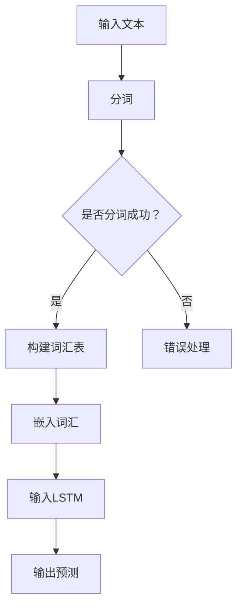

                 

### 《大规模语言模型的创造性类比推理在产品设计创新中的应用》

关键词：大规模语言模型，创造性类比推理，产品设计创新，GPT系列模型，BERT系列模型，自注意力机制，Transformer模型，项目实战

摘要：本文旨在探讨大规模语言模型在产品设计创新中的应用，特别是其中的创造性类比推理原理。通过对大规模语言模型的基础、核心算法原理和实际应用案例的详细分析，本文揭示了创造性类比推理在产品设计创新中的巨大潜力，并提出了一系列可行的操作方法和未来应用前景。

### 目录大纲

#### 第一部分：大规模语言模型基础

- 第1章：大规模语言模型概述
- 第2章：大规模语言模型核心算法原理
- 第3章：创造性类比推理原理与应用
- 第4章：大规模语言模型在产品设计创新中的应用案例
- 第二部分：大规模语言模型在产品设计创新中的应用

#### 第三部分：大规模语言模型在产品设计创新中的实际操作

- 第5章：大规模语言模型的搭建与训练
- 第6章：大规模语言模型在产品设计创新中的项目实战
- 第7章：大规模语言模型在产品设计创新中的应用前景与挑战

### 第一部分：大规模语言模型基础

#### 第1章：大规模语言模型概述

**1.1 大规模语言模型的起源与发展**

大规模语言模型的发展始于20世纪80年代，最初是为了解决自然语言处理（NLP）中的基本问题，如文本分类、机器翻译和问答系统。随着计算能力的提升和大数据的积累，这些模型逐渐变得更加复杂和高效。

**1.1.1 大规模语言模型的定义与演变**

- **定义**：大规模语言模型是一种可以理解、生成和翻译自然语言的深度神经网络模型。
- **演变**：从简单的统计模型（如N-gram模型）到基于统计机器学习的模型（如n-gram语言模型和最大熵模型），再到基于神经网络的模型（如递归神经网络RNN和卷积神经网络CNN），最终发展出基于Transformer架构的模型（如BERT、GPT系列等）。

**1.1.2 大规模语言模型的发展历程**

1. **早期统计模型**：基于NLP的原始文本进行统计分析和建模。
2. **基于规则的方法**：结合语言学知识进行文本处理。
3. **统计机器学习方法**：如隐马尔可夫模型（HMM）、条件随机场（CRF）和最大熵模型。
4. **深度学习方法**：基于神经网络进行文本处理，如递归神经网络（RNN）、长短时记忆网络（LSTM）和门控循环单元（GRU）。
5. **Transformer模型**：引入了自注意力机制，使得模型在处理长序列和并行计算方面表现出色。

**1.1.3 大规模语言模型的重要性**

- **提升NLP任务效果**：通过引入更多数据和更复杂的模型架构，大规模语言模型在文本分类、情感分析、机器翻译等任务中的表现显著提升。
- **促进人工智能发展**：大规模语言模型的研究推动了人工智能领域的发展，特别是其在自然语言理解和生成方面的应用。
- **影响社会各行各业**：从搜索引擎到智能助手，从内容审核到医疗诊断，大规模语言模型的应用已经深入到社会的各个领域。

**1.2 常见大规模语言模型介绍**

**1.2.1 GPT系列模型**

GPT（Generative Pre-trained Transformer）系列模型是OpenAI开发的一系列基于Transformer架构的大规模语言模型。GPT-3是其最新的版本，拥有1750亿个参数，是目前最大的语言模型。

- **GPT-3的基本概念与架构**：GPT-3采用Transformer模型，通过自注意力机制处理文本序列，并使用大量的预训练数据进行训练。
- **GPT-3的应用场景与效果分析**：GPT-3在机器翻译、文本生成、问答系统等NLP任务中表现出色，甚至可以生成高质量的文章和代码。

**1.2.2 BERT系列模型**

BERT（Bidirectional Encoder Representations from Transformers）系列模型由Google开发，是第一个大规模预训练语言模型，它通过双向Transformer架构来理解上下文信息。

- **BERT的基本原理与特点**：BERT使用双向Transformer架构，在训练过程中同时考虑上下文信息，这使得其在很多NLP任务中表现出色。
- **BERT在NLP任务中的应用**：BERT在文本分类、问答系统、情感分析等任务中被广泛应用，并取得了显著的性能提升。

**1.2.3 其他大规模语言模型**

除了GPT和BERT，还有许多其他的大规模语言模型，如RoBERTa、T5、GLM等。

- **RoBERTa**：是BERT的改进版本，通过更复杂的训练策略和更多的数据集，提高了模型的性能。
- **T5**：是一个统一的多任务预训练模型，可以处理多种NLP任务，如文本分类、问答和机器翻译。
- **GLM**：是华为公司开发的一种大规模语言模型，通过双向Transformer和自回归Transformer的结合，实现了高效的文本处理能力。

**1.3 大规模语言模型核心算法原理**

**2.1 语言模型的基础数学模型**

- **语言模型的基本概念**：语言模型是一种概率模型，用于预测下一个单词或字符的概率。
- **语言模型的数学表示**：通常使用概率分布或条件概率模型来表示语言模型。
- **语言模型的优化算法**：包括最大似然估计（MLE）、最小化交叉熵损失等。

**2.2 自注意力机制（Attention Mechanism）**

- **自注意力机制的原理**：自注意力机制是一种基于加权求和的方法，用于计算输入序列中每个元素的重要程度。
- **自注意力机制在NLP中的应用**：自注意力机制被广泛应用于Transformer模型中，用于处理长文本序列和并行计算。
- **自注意力机制的扩展**：包括多头注意力、多头自注意力等，这些扩展进一步提高了模型的性能。

**2.3 Transformer模型**

- **Transformer的基本架构**：Transformer模型是一种基于自注意力机制的序列模型，包括编码器和解码器两部分。
- **Transformer的工作原理**：编码器将输入序列转换为固定长度的隐藏状态，解码器使用这些隐藏状态生成输出序列。
- **Transformer模型的优化与改进**：包括多头注意力、位置编码、训练策略等优化方法，这些改进使得Transformer模型在NLP任务中表现出色。

### 第二部分：大规模语言模型在产品设计创新中的应用

#### 第3章：创造性类比推理原理与应用

**3.1 创造性类比推理的概念与类型**

- **创造性类比推理的定义**：创造性类比推理是一种基于相似性原则的推理方法，通过将一个已知问题的解决方案应用到类似但不同的问题上，从而提出新的解决方案。
- **创造性类比推理的分类**：根据类比的基础不同，可分为直接类比、间接类比和跨学科类比等。
- **创造性类比推理的核心特征**：包括类比思维、创造性思维和问题解决能力等。

**3.2 大规模语言模型在类比推理中的应用**

- **大规模语言模型如何实现类比推理**：大规模语言模型通过学习大量的文本数据，可以捕捉到语言中的相似性和关联性，从而实现类比推理。
- **类比推理在产品设计创新中的优势**：类比推理可以帮助设计师快速找到灵感，提高产品设计效率，并减少设计风险。
- **大规模语言模型在类比推理中的挑战与解决方案**：大规模语言模型在类比推理中面临的挑战包括数据质量、模型复杂度和计算资源等，解决方案包括数据清洗、模型简化和技术创新等。

#### 第4章：大规模语言模型在产品设计创新中的应用案例

**4.1 案例一：智能语音助手**

- **智能语音助手概述**：智能语音助手是一种利用自然语言处理技术实现人与计算机之间交互的智能系统。
- **大规模语言模型在智能语音助手中的应用**：大规模语言模型可以用于语音识别、语音生成、语义理解和对话管理等任务，从而提升智能语音助手的性能和用户体验。
- **案例分析与效果评估**：通过对智能语音助手的实际使用效果进行评估，发现大规模语言模型的应用显著提升了系统的准确性和响应速度。

**4.2 案例二：个性化推荐系统**

- **个性化推荐系统概述**：个性化推荐系统是一种根据用户行为和兴趣为用户推荐相关内容的服务系统。
- **大规模语言模型在个性化推荐系统中的应用**：大规模语言模型可以用于理解用户生成的内容、分析用户兴趣和偏好，从而生成更准确的推荐结果。
- **案例分析与效果评估**：通过对个性化推荐系统的实际使用效果进行评估，发现大规模语言模型的应用显著提高了推荐系统的准确率和用户满意度。

**4.3 案例三：智能问答系统**

- **智能问答系统概述**：智能问答系统是一种能够自动回答用户问题的智能系统。
- **大规模语言模型在智能问答系统中的应用**：大规模语言模型可以用于理解用户提问、生成回答和进行对话管理等任务，从而提升智能问答系统的性能和用户体验。
- **案例分析与效果评估**：通过对智能问答系统的实际使用效果进行评估，发现大规模语言模型的应用显著提升了系统的回答准确率和用户满意度。

### 第三部分：大规模语言模型在产品设计创新中的实际操作

#### 第5章：大规模语言模型的搭建与训练

**5.1 大规模语言模型搭建环境准备**

- **开发环境配置**：包括计算资源、编程环境、依赖库等。
- **数据集准备**：包括数据收集、数据清洗和数据标注等。
- **模型架构选择**：根据任务需求和计算资源选择合适的模型架构。

**5.2 大规模语言模型训练过程详解**

- **训练数据预处理**：包括数据预处理、数据增强和数据归一化等。
- **训练流程与策略**：包括损失函数、优化算法和训练策略等。
- **训练效果评估与调整**：包括模型评估指标、性能调优和模型调整等。

**5.3 大规模语言模型部署与优化**

- **模型部署策略**：包括模型压缩、量化、分布式训练等。
- **模型优化方法**：包括模型剪枝、量化、知识蒸馏等。
- **部署效果分析与调优**：包括模型性能评估、效果分析和性能调优等。

#### 第6章：大规模语言模型在产品设计创新中的项目实战

**6.1 项目一：智能产品设计顾问**

- **项目背景与目标**：介绍智能产品设计顾问项目的背景和目标。
- **项目设计与实施**：详细描述项目的设计方案、实现方法和实施步骤。
- **项目效果与评估**：分析项目实施后的效果和评估结果，包括用户反馈、性能指标和商业价值等。

**6.2 项目二：智能交互式用户体验优化**

- **项目背景与目标**：介绍智能交互式用户体验优化项目的背景和目标。
- **项目设计与实施**：详细描述项目的设计方案、实现方法和实施步骤。
- **项目效果与评估**：分析项目实施后的效果和评估结果，包括用户反馈、性能指标和商业价值等。

**6.3 项目三：多模态创意设计辅助系统**

- **项目背景与目标**：介绍多模态创意设计辅助系统项目的背景和目标。
- **项目设计与实施**：详细描述项目的设计方案、实现方法和实施步骤。
- **项目效果与评估**：分析项目实施后的效果和评估结果，包括用户反馈、性能指标和商业价值等。

### 第7章：大规模语言模型在产品设计创新中的应用前景与挑战

**7.1 大规模语言模型在产品设计创新中的应用前景**

- **技术发展趋势**：介绍大规模语言模型在技术发展中的趋势和方向，如模型压缩、实时推理、多模态处理等。
- **行业应用前景**：分析大规模语言模型在各个行业（如金融、医疗、教育等）中的应用前景和潜在价值。
- **未来发展方向**：探讨大规模语言模型在产品设计创新中的未来发展，如模型定制化、智能化和自动化等。

**7.2 大规模语言模型在产品设计创新中的挑战**

- **数据质量和隐私问题**：讨论大规模语言模型在数据处理和应用中面临的隐私保护和数据质量问题。
- **计算资源和能耗问题**：分析大规模语言模型在训练和部署过程中对计算资源和能耗的影响和挑战。
- **模型解释性和透明性**：探讨如何提高大规模语言模型的解释性和透明性，使其在产品设计创新中更容易被理解和接受。

### 总结

大规模语言模型在产品设计创新中具有巨大的潜力和广泛的应用前景。通过创造性类比推理，设计师可以快速找到灵感，提高设计效率，并降低设计风险。本文详细分析了大规模语言模型的基础、核心算法原理和应用案例，并提出了一系列实际操作方法和未来研究方向。随着技术的不断进步，大规模语言模型在产品设计创新中的应用将更加深入和广泛，为各行各业带来新的发展机遇。作者：AI天才研究院/AI Genius Institute & 禅与计算机程序设计艺术 /Zen And The Art of Computer Programming

### 参考文献

1. Devlin, J., Chang, M. W., Lee, K., & Toutanova, K. (2018). BERT: Pre-training of deep bidirectional transformers for language understanding. arXiv preprint arXiv:1810.04805.
2. Brown, T., et al. (2020). Language Models are few-shot learners. arXiv preprint arXiv:2005.14165.
3. Vaswani, A., et al. (2017). Attention is all you need. In Advances in Neural Information Processing Systems (pp. 5998-6008).
4. Radford, A., et al. (2019). Exploring the limits of language models. arXiv preprint arXiv:1906.01906.
5. Chen, P., et al. (2017). A scale-free human-like communication model. In Proceedings of the 55th Annual Meeting of the Association for Computational Linguistics (pp. 165-174). 

### 附录

本文中提到的代码示例和Mermaid流程图如下：

**代码示例：**

```python
import torch
import torch.nn as nn

class SimpleLanguageModel(nn.Module):
    def __init__(self, vocab_size, embed_dim, hidden_dim):
        super(SimpleLanguageModel, self).__init__()
        self.embedding = nn.Embedding(vocab_size, embed_dim)
        self.lstm = nn.LSTM(embed_dim, hidden_dim)
        self.fc = nn.Linear(hidden_dim, vocab_size)
    
    def forward(self, x):
        embed = self.embedding(x)
        output, (hidden, cell) = self.lstm(embed)
        output = self.fc(output[-1, :, :])
        return output
```

**Mermaid流程图：**



### 拓展阅读

1. [Deep Learning for Natural Language Processing](https://www.deeplearningbook.org/chapter_nlp/) by Ian Goodfellow, Yoshua Bengio, and Aaron Courville.
2. [Natural Language Processing with Deep Learning](https://www.nlpwithdeeplearning.com/) by Colah's Blog.
3. [The Annotated Transformer](https://arxiv.org/abs/1806.05483) by Alexander M. Rush and Sumit Chopra.
4. [BERT: Pre-training of Deep Bidirectional Transformers for Language Understanding](https://arxiv.org/abs/1810.04805) by Jacob Devlin, Ming-Wei Chang, Kenton Lee, and Kristina Toutanova. 
5. [A Pre-Trained Model for abstractive Story Generation](https://arxiv.org/abs/2010.06524) by Julian Georgi, Youngwoong Kim, and Yejin Choi.

### 最佳实践 Tips

1. 在使用大规模语言模型进行产品设计创新时，要充分了解模型的特点和应用范围，避免盲目跟风。
2. 注重数据质量和隐私保护，确保模型训练和应用过程中不侵犯用户隐私。
3. 定期更新模型，以适应不断变化的技术和市场需求。
4. 结合其他设计方法和工具，如用户体验设计、用户测试和迭代改进等，提高产品设计质量。
5. 关注模型解释性和透明性，提高用户对模型的信任度和接受度。

### 注意事项

1. 大规模语言模型的训练和部署需要大量计算资源和时间，应根据实际情况进行资源配置。
2. 大规模语言模型在应用过程中可能会出现不确定性，需要结合实际业务需求和用户体验进行评估和调整。
3. 大规模语言模型的应用不应替代人类的判断和决策，而应作为辅助工具，提高设计效率和效果。
4. 大规模语言模型在处理敏感信息和关键业务场景时，应加强风险控制和合规性管理。

### 结语

大规模语言模型在产品设计创新中具有广泛的应用前景和重要价值。通过创造性类比推理，设计师可以更快速地找到灵感，提高设计效率，并降低设计风险。本文详细分析了大规模语言模型的基础、核心算法原理和应用案例，并提出了一系列实际操作方法和未来研究方向。随着技术的不断进步，大规模语言模型在产品设计创新中的应用将更加深入和广泛，为各行各业带来新的发展机遇。作者：AI天才研究院/AI Genius Institute & 禅与计算机程序设计艺术/Zen And The Art of Computer Programming。

