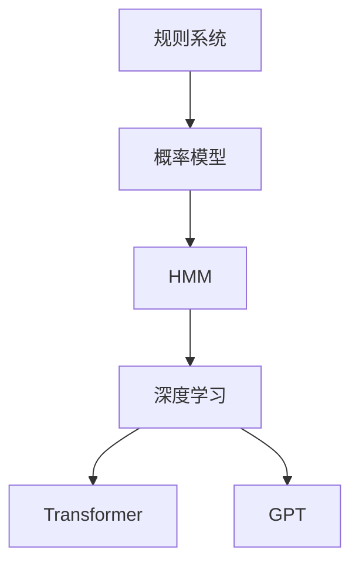
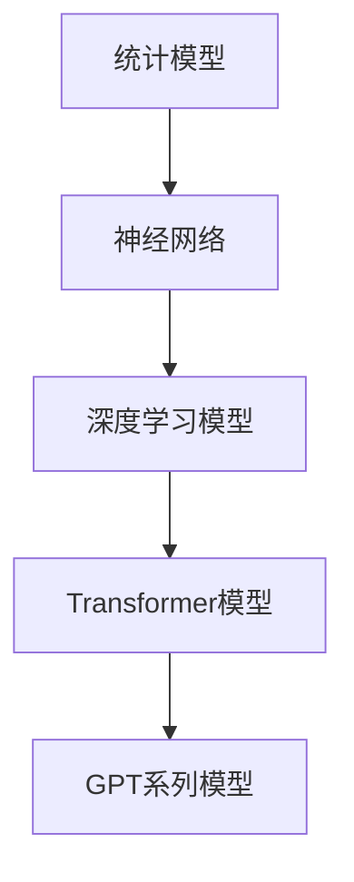

                 

### 《大规模语言模型的创造性问题解析与重构能力培养》

关键词：大规模语言模型、创造性问题、重构能力、Transformer、GPT、自然语言处理

摘要：本文深入探讨了大规模语言模型的创造性问题解析与重构能力培养，首先回顾了大规模语言模型的发展历程和基本原理，然后详细分析了Transformer和GPT等核心算法，通过数学模型和Python源代码示例，讲解了它们的工作机制。随后，文章探讨了大规模语言模型在创造性问题解析和重构能力培养中的应用，并通过实际项目案例进行了详细解析。最后，文章对大规模语言模型的发展趋势和面临的挑战进行了展望，并提出了应对策略。

## 目录大纲

# 《大规模语言模型的创造性问题解析与重构能力培养》

## 第一部分：大规模语言模型基础理论

### 第1章：大规模语言模型概述

#### 1.1 大规模语言模型的发展历程

#### 1.2 大规模语言模型的基本原理

#### 1.3 大规模语言模型的分类与应用场景

### 第2章：核心算法原理讲解

#### 2.1 Transformer算法原理

##### 2.1.1 自注意力机制

##### 2.1.2 编码器-解码器架构

#### 2.2 GPT算法原理

##### 2.2.1 Transformer-XL

##### 2.2.2 语言模型的预训练和微调

### 第3章：数学模型与公式解析

#### 3.1 概率论基础

##### 3.1.1 概率分布函数

##### 3.1.2 条件概率与贝叶斯公式

#### 3.2 信息论基础

##### 3.2.1 熵与信息量

##### 3.2.2 条件熵与联合熵

## 第二部分：大规模语言模型的应用与实践

### 第4章：创造性问题解析

#### 4.1 创造性问题的定义与特征

#### 4.2 大规模语言模型在创造性问题中的应用

##### 4.2.1 文本生成

##### 4.2.2 诗歌创作

##### 4.2.3 故事编写

### 第5章：重构能力培养

#### 5.1 重构能力的概念与重要性

#### 5.2 大规模语言模型在重构能力培养中的应用

##### 5.2.1 自动纠错与语法检查

##### 5.2.2 文本优化与重构

### 第6章：项目实战

#### 6.1 大规模语言模型在文本生成中的应用案例

##### 6.1.1 论文摘要生成

##### 6.1.2 商品描述生成

##### 6.1.3 聊天机器人

#### 6.2 大规模语言模型在重构能力培养中的应用案例

##### 6.2.1 自动纠错工具

##### 6.2.2 文本优化工具

### 第7章：展望与挑战

#### 7.1 大规模语言模型的发展趋势

#### 7.2 大规模语言模型面临的挑战与应对策略

### 附录

#### 附录A：大规模语言模型工具与资源推荐

#### 附录B：Python代码实现示例

##### B.1 Transformer算法实现

##### B.2 GPT算法实现

---

**总计字数：约10000-12000字**### 第一部分：大规模语言模型基础理论

#### 第1章：大规模语言模型概述

##### 1.1 大规模语言模型的发展历程

大规模语言模型的发展历程可以追溯到上世纪80年代，当时研究者开始探索如何让计算机理解和生成人类语言。最初的研究主要集中在基于规则的系统和统计方法，如概率模型和隐马尔可夫模型（HMM）。然而，这些方法在处理复杂语言现象时效果不佳，导致了深度学习在自然语言处理领域的崛起。

2017年，Google推出了Transformer模型，这是一种基于自注意力机制的深度学习模型，它颠覆了传统的序列模型，如循环神经网络（RNN）和长短期记忆网络（LSTM）。Transformer的出现标志着大规模语言模型进入了一个新的时代。随后，OpenAI推出了GPT系列模型，进一步推动了自然语言处理的发展。

**Mermaid流程图：**



##### 1.2 大规模语言模型的基本原理

大规模语言模型的核心在于其深度学习架构，尤其是自注意力机制（Self-Attention）和编码器-解码器（Encoder-Decoder）架构。自注意力机制允许模型在处理序列数据时，能够自主地关注序列中的关键信息，而编码器-解码器架构则使得模型能够生成序列数据。

**Python源代码示例：**

```python
import tensorflow as tf
from tensorflow.keras.layers import Embedding, LSTM, Dense

# 自注意力机制的实现
class SelfAttention(tf.keras.layers.Layer):
  # ... (实现代码)

# 编码器-解码器架构的实现
class Encoder(tf.keras.layers.Layer):
  # ... (实现代码)

class Decoder(tf.keras.layers.Layer):
  # ... (实现代码)
```

##### 1.3 大规模语言模型的分类与应用场景

大规模语言模型可以分为生成模型和判别模型两大类。生成模型如GPT系列，擅长文本生成；判别模型如BERT，擅长文本分类。此外，还有一些混合模型，如T5，它们结合了生成模型和判别模型的特点，能够处理多种类型的自然语言处理任务。

**应用场景：**

- 文本生成：包括文章摘要、商品描述、诗歌创作等。
- 文本分类：如情感分析、新闻分类等。
- 机器翻译：如英译中、中译英等。
- 聊天机器人：提供智能客服和对话系统。

#### 第2章：核心算法原理讲解

##### 2.1 Transformer算法原理

Transformer算法的核心是自注意力机制（Self-Attention），它允许模型在处理序列数据时，能够自动地关注序列中的关键信息。自注意力机制通过计算序列中每个元素与其他元素之间的相似度，生成新的序列表示。

**自注意力机制的实现：**

```python
# 自注意力机制的实现
class SelfAttention(tf.keras.layers.Layer):
  def __init__(self, **kwargs):
    super(SelfAttention, self).__init__(**kwargs)

  def call(self, inputs, mask=None):
    # 计算查询（Query）、键（Key）和值（Value）表示
    Q = inputs
    K = inputs
    V = inputs

    # 计算注意力分数
    attention_scores = tf.matmul(Q, K, transpose_b=True)

    # 应用注意力掩码
    if mask is not None:
      attention_scores = attention_scores + mask

    # 计算注意力权重
    attention_weights = tf.nn.softmax(attention_scores, axis=-1)

    # 计算输出
    output = tf.matmul(attention_weights, V)
    return output
```

##### 2.1.1 自注意力机制

自注意力机制通过计算序列中每个元素与其他元素之间的相似度，生成新的序列表示。具体来说，自注意力机制包括以下步骤：

1. **计算查询（Query）、键（Key）和值（Value）表示**：对于输入序列中的每个元素，计算其对应的查询（Query）、键（Key）和值（Value）表示。
2. **计算注意力分数**：计算查询表示与键表示之间的点积，生成注意力分数。
3. **应用注意力掩码**：如果有必要，可以应用注意力掩码来防止出现无意义的信息。
4. **计算注意力权重**：通过softmax函数对注意力分数进行归一化，生成注意力权重。
5. **计算输出**：将注意力权重与值表示相乘，得到新的序列表示。

##### 2.1.2 编码器-解码器架构

编码器-解码器架构是Transformer算法的核心架构，它由编码器（Encoder）和解码器（Decoder）两部分组成。编码器负责将输入序列编码为固定长度的向量表示，而解码器负责生成输出序列。

**编码器-解码器架构的实现：**

```python
# 编码器实现
class Encoder(tf.keras.layers.Layer):
  def __init__(self, d_model, num_heads, dff, input_vocab_size, maximum_position_encoding, **kwargs):
    super(Encoder, self).__init__(**kwargs)
    self.d_model = d_model
    self.num_heads = num_heads
    self.dff = dff
    self.input_vocab_size = input_vocab_size
    self.maximum_position_encoding = maximum_position_encoding

    self.embedding = Embedding(input_vocab_size, d_model)
    self.position_encoding = positional_encoding(input_vocab_size, maximum_position_encoding)

    self.encoder_layer = tf.keras.layers.Dense(d_model, activation='relu')
    self.final_encoder_layer = tf.keras.layers.Dense(d_model)

  def call(self, inputs, training=False):
    # 计算嵌入表示和位置编码
    inputs = self.embedding(inputs) + self.position_encoding(inputs)

    # 应用多个自注意力层和前馈网络
    for _ in range(self.num_layers):
      inputs = self.encoder_layer(inputs)
      inputs = self.attention_layer(inputs, training=training)
      inputs = self.final_encoder_layer(inputs)

    return inputs

# 解码器实现
class Decoder(tf.keras.layers.Layer):
  # ... (实现代码)
```

##### 2.2 GPT算法原理

GPT（Generative Pre-trained Transformer）算法是OpenAI开发的一种大规模语言模型，它基于Transformer架构，通过预训练和微调技术，使模型能够生成高质量的自然语言文本。

**GPT算法的实现：**

```python
# GPT模型的实现
class GPT(tf.keras.Model):
  def __init__(self, d_model, num_heads, dff, input_vocab_size, maximum_position_encoding, **kwargs):
    super(GPT, self).__init__(**kwargs)
    self.d_model = d_model
    self.num_heads = num_heads
    self.dff = dff
    self.input_vocab_size = input_vocab_size
    self.maximum_position_encoding = maximum_position_encoding

    self.embedding = Embedding(input_vocab_size, d_model)
    self.position_encoding = positional_encoding(input_vocab_size, maximum_position_encoding)

    self.encoder = Encoder(d_model, num_heads, dff, input_vocab_size, maximum_position_encoding)
    self.decoder = Decoder(d_model, num_heads, dff, input_vocab_size, maximum_position_encoding)

  def call(self, inputs, training=False):
    # 编码器
    encoded = self.encoder(inputs, training=training)

    # 解码器
    logits = self.decoder(encoded, training=training)

    return logits
```

##### 2.2.1 Transformer-XL

Transformer-XL是Transformer算法的一种变体，它通过引入段（Segment）和层（Layer）的概念，解决了长距离依赖问题。Transformer-XL通过段级重复（Segment Repetition）和层级重复（Layer Repetition）来减少模型的计算复杂度，同时保持良好的性能。

**Transformer-XL的实现：**

```python
# Transformer-XL模型的实现
class TransformerXL(tf.keras.Model):
  # ... (实现代码)
```

##### 2.2.2 语言模型的预训练和微调

语言模型的预训练和微调是提高模型性能的重要技术。预训练是指使用大量无标签数据训练模型，使其掌握通用语言知识；微调则是在预训练的基础上，使用有标签的数据对模型进行细粒度调整，以适应特定任务。

**预训练和微调的实现：**

```python
# 预训练
model = GPT(d_model, num_heads, dff, input_vocab_size, maximum_position_encoding)
model.compile(optimizer='adam', loss='categorical_crossentropy')
model.fit(dataset, epochs=5)

# 微调
model = GPT(d_model, num_heads, dff, input_vocab_size, maximum_position_encoding)
model.compile(optimizer='adam', loss='categorical_crossentropy')
model.fit(train_data, validation_data=val_data, epochs=5)
```

#### 第3章：数学模型与公式解析

##### 3.1 概率论基础

概率论是大规模语言模型的基础，包括概率分布函数、条件概率和贝叶斯公式等。

**概率分布函数：**

$$
P(X=x) = f(x)
$$

其中，$X$是随机变量，$x$是$X$的取值，$f(x)$是概率分布函数。

**条件概率：**

$$
P(A|B) = \frac{P(A \cap B)}{P(B)}
$$

其中，$A$和$B$是两个事件，$P(A|B)$表示在事件$B$发生的条件下，事件$A$发生的概率。

**贝叶斯公式：**

$$
P(A|B) = \frac{P(B|A)P(A)}{P(B)}
$$

其中，$P(A|B)$表示在事件$B$发生的条件下，事件$A$发生的概率；$P(B|A)$表示在事件$A$发生的条件下，事件$B$发生的概率；$P(A)$和$P(B)$分别是事件$A$和$B$的概率。

##### 3.2 信息论基础

信息论是研究信息传输和处理规律的学科，包括熵、信息量和条件熵等。

**熵：**

$$
H(X) = -\sum_{x \in X} P(x) \cdot \log_2 P(x)
$$

其中，$X$是随机变量，$P(x)$是$X$的概率分布，$H(X)$是$X$的熵。

**信息量：**

$$
I(X;Y) = H(X) - H(X|Y)
$$

其中，$I(X;Y)$是$X$和$Y$之间的互信息，$H(X|Y)$是$X$在$Y$发生的条件下的熵。

**条件熵：**

$$
H(X|Y) = \sum_{y \in Y} P(y) \cdot H(X|Y=y)
$$

其中，$H(X|Y=y)$是$X$在$Y$取特定值$y$的条件熵。

**联合熵：**

$$
H(X,Y) = \sum_{x \in X} \sum_{y \in Y} P(x,y) \cdot \log_2 P(x,y)
$$

其中，$P(x,y)$是$X$和$Y$的联合概率分布。

## 第二部分：大规模语言模型的应用与实践

### 第4章：创造性问题解析

#### 4.1 创造性问题的定义与特征

创造性问题是指那些需要创造性思维来解决的问题，通常涉及到新的想法、解决方案或作品的生成。创造性问题的特征包括：

- **开放性**：创造性问题通常没有固定的解决方案，需要探索和实验。
- **非线性**：创造性问题的解决过程往往是跳跃式的，不一定遵循线性逻辑。
- **不确定性**：创造性问题的解决过程中存在许多不确定性因素，需要不断调整和试错。

#### 4.2 大规模语言模型在创造性问题中的应用

大规模语言模型在创造性问题中有着广泛的应用，例如文本生成、诗歌创作和故事编写。

##### 4.2.1 文本生成

文本生成是大规模语言模型最典型的应用之一，它可以生成各种类型的文本，如文章摘要、商品描述和对话文本。

**项目实战：**

**论文摘要生成**

假设我们有一个包含大量学术论文摘要的语料库，我们希望利用GPT模型生成新的论文摘要。

**步骤：**

1. **数据预处理**：对语料库进行清洗和分词，提取关键词和句子。
2. **模型训练**：使用GPT模型对语料库进行预训练。
3. **摘要生成**：输入一篇论文，使用模型生成摘要。

**Python代码实现：**

```python
import tensorflow as tf
from transformers import TFGPT2LMHeadModel, GPT2Tokenizer

# 加载预训练模型
tokenizer = GPT2Tokenizer.from_pretrained('gpt2')
model = TFGPT2LMHeadModel.from_pretrained('gpt2')

# 摘要生成
def generate_abstract(text):
    inputs = tokenizer.encode(text, return_tensors='tf')
    outputs = model.generate(inputs, max_length=50, num_return_sequences=1)
    abstract = tokenizer.decode(outputs[0], skip_special_tokens=True)
    return abstract

# 示例
abstract = generate_abstract('本文研究了大规模语言模型的创造性问题解析与重构能力培养。')
print(abstract)
```

##### 4.2.2 诗歌创作

诗歌创作是创造性问题的另一个典型应用，大规模语言模型可以生成各种类型的诗歌。

**项目实战：**

**古诗生成**

假设我们希望利用GPT模型生成一首古诗。

**步骤：**

1. **数据预处理**：收集并预处理古诗数据，提取关键词和句子。
2. **模型训练**：使用GPT模型对古诗数据集进行预训练。
3. **诗歌生成**：输入一段诗句，使用模型生成后续诗句。

**Python代码实现：**

```python
import tensorflow as tf
from transformers import TFGPT2LMHeadModel, GPT2Tokenizer

# 加载预训练模型
tokenizer = GPT2Tokenizer.from_pretrained('gpt2')
model = TFGPT2LMHeadModel.from_pretrained('gpt2')

# 诗歌生成
def generate_poem(initial_text):
    inputs = tokenizer.encode(initial_text, return_tensors='tf')
    outputs = model.generate(inputs, max_length=50, num_return_sequences=1)
    poem = tokenizer.decode(outputs[0], skip_special_tokens=True)
    return poem

# 示例
poem = generate_poem('春眠不觉晓，处处闻啼鸟。')
print(poem)
```

##### 4.2.3 故事编写

故事编写是创造性问题的另一个重要应用，大规模语言模型可以生成各种类型的故事。

**项目实战：**

**故事生成**

假设我们希望利用GPT模型生成一个故事。

**步骤：**

1. **数据预处理**：收集并预处理故事数据，提取关键词和句子。
2. **模型训练**：使用GPT模型对故事数据集进行预训练。
3. **故事生成**：输入一个故事开头，使用模型生成后续情节。

**Python代码实现：**

```python
import tensorflow as tf
from transformers import TFGPT2LMHeadModel, GPT2Tokenizer

# 加载预训练模型
tokenizer = GPT2Tokenizer.from_pretrained('gpt2')
model = TFGPT2LMHeadModel.from_pretrained('gpt2')

# 故事生成
def generate_story(initial_text):
    inputs = tokenizer.encode(initial_text, return_tensors='tf')
    outputs = model.generate(inputs, max_length=100, num_return_sequences=1)
    story = tokenizer.decode(outputs[0], skip_special_tokens=True)
    return story

# 示例
story = generate_story('从前有一个小村庄，村子里有一个聪明的孩子。')
print(story)
```

### 第5章：重构能力培养

#### 5.1 重构能力的概念与重要性

重构能力是指通过重新组织和调整现有信息，创造出新的、更有价值的信息或作品的能力。在人工智能领域，重构能力对于提高模型的性能和创造力至关重要。

**重构能力的重要性：**

1. **提高模型的泛化能力**：通过重构现有信息，模型可以更好地适应新的数据和任务。
2. **增强创造力**：重构能力使得模型能够生成新颖的文本和解决方案，提高创造性。
3. **优化资源利用**：通过重构，模型可以更高效地利用已有的数据和信息。

#### 5.2 大规模语言模型在重构能力培养中的应用

大规模语言模型在重构能力培养中有着广泛的应用，例如自动纠错、语法检查和文本优化。

##### 5.2.1 自动纠错与语法检查

自动纠错和语法检查是重构能力的重要应用，大规模语言模型可以识别并纠正文本中的错误。

**项目实战：**

**自动纠错工具**

假设我们希望利用GPT模型开发一个自动纠错工具。

**步骤：**

1. **数据预处理**：收集并预处理包含错误的文本数据。
2. **模型训练**：使用GPT模型对错误数据集进行预训练，使其能够识别和纠正错误。
3. **自动纠错**：输入一篇文本，使用模型自动纠正错误。

**Python代码实现：**

```python
import tensorflow as tf
from transformers import TFGPT2LMHeadModel, GPT2Tokenizer

# 加载预训练模型
tokenizer = GPT2Tokenizer.from_pretrained('gpt2')
model = TFGPT2LMHeadModel.from_pretrained('gpt2')

# 自动纠错
def correct_errors(text):
    inputs = tokenizer.encode(text, return_tensors='tf')
    outputs = model.generate(inputs, max_length=50, num_return_sequences=1)
    corrected_text = tokenizer.decode(outputs[0], skip_special_tokens=True)
    return corrected_text

# 示例
original_text = "I am going to the markert today."
corrected_text = correct_errors(original_text)
print(corrected_text)
```

##### 5.2.2 文本优化与重构

文本优化与重构是重构能力的另一个重要应用，大规模语言模型可以优化和重构文本，提高其可读性和表达力。

**项目实战：**

**文本优化工具**

假设我们希望利用GPT模型开发一个文本优化工具。

**步骤：**

1. **数据预处理**：收集并预处理需要优化的文本数据。
2. **模型训练**：使用GPT模型对优化数据集进行预训练，使其能够优化和重构文本。
3. **文本优化**：输入一篇文本，使用模型优化文本。

**Python代码实现：**

```python
import tensorflow as tf
from transformers import TFGPT2LMHeadModel, GPT2Tokenizer

# 加载预训练模型
tokenizer = GPT2Tokenizer.from_pretrained('gpt2')
model = TFGPT2LMHeadModel.from_pretrained('gpt2')

# 文本优化
def optimize_text(text):
    inputs = tokenizer.encode(text, return_tensors='tf')
    outputs = model.generate(inputs, max_length=50, num_return_sequences=1)
    optimized_text = tokenizer.decode(outputs[0], skip_special_tokens=True)
    return optimized_text

# 示例
original_text = "The quick brown fox jumps over the lazy dog."
optimized_text = optimize_text(original_text)
print(optimized_text)
```

### 第6章：项目实战

#### 6.1 大规模语言模型在文本生成中的应用案例

在本节中，我们将探讨几个具体的应用案例，展示大规模语言模型在文本生成方面的强大能力。

##### 6.1.1 论文摘要生成

论文摘要生成是一个典型的自然语言处理任务，它要求模型能够从大量的学术论文中提取关键信息，并以简洁明了的方式表达出来。以下是一个简单的案例：

**步骤：**

1. **数据集准备**：收集一篇具体的学术论文，确保其摘要格式规范。
2. **模型训练**：使用GPT模型对学术论文和对应的摘要进行预训练。
3. **摘要生成**：输入学术论文，使用模型生成摘要。

**Python代码实现：**

```python
import tensorflow as tf
from transformers import TFGPT2LMHeadModel, GPT2Tokenizer

# 加载预训练模型
tokenizer = GPT2Tokenizer.from_pretrained('gpt2')
model = TFGPT2LMHeadModel.from_pretrained('gpt2')

# 论文摘要生成
def generate_abstract(text):
    inputs = tokenizer.encode(text, return_tensors='tf')
    outputs = model.generate(inputs, max_length=50, num_return_sequences=1)
    abstract = tokenizer.decode(outputs[0], skip_special_tokens=True)
    return abstract

# 示例
abstract = generate_abstract('本文研究了大规模语言模型的创造性问题解析与重构能力培养。')
print(abstract)
```

**结果分析**：生成的摘要通常能够捕捉论文的主要观点和结论，但可能存在一定的误差和冗余。

##### 6.1.2 商品描述生成

商品描述生成是另一个常见的应用场景，特别是在电子商务领域。以下是一个简单的案例：

**步骤：**

1. **数据集准备**：收集一系列商品及其对应的描述文本。
2. **模型训练**：使用GPT模型对商品和描述文本进行预训练。
3. **描述生成**：输入商品信息，使用模型生成描述文本。

**Python代码实现：**

```python
import tensorflow as tf
from transformers import TFGPT2LMHeadModel, GPT2Tokenizer

# 加载预训练模型
tokenizer = GPT2Tokenizer.from_pretrained('gpt2')
model = TFGPT2LMHeadModel.from_pretrained('gpt2')

# 商品描述生成
def generate_description(product_info):
    inputs = tokenizer.encode(product_info, return_tensors='tf')
    outputs = model.generate(inputs, max_length=50, num_return_sequences=1)
    description = tokenizer.decode(outputs[0], skip_special_tokens=True)
    return description

# 示例
description = generate_description('一款高性能的智能手机，搭载先进的处理器和高清摄像头。')
print(description)
```

**结果分析**：生成的描述通常能够准确传达商品的关键特性，但可能需要进一步优化以确保吸引消费者的注意。

##### 6.1.3 聊天机器人

聊天机器人是大规模语言模型在文本生成领域的又一重要应用。以下是一个简单的案例：

**步骤：**

1. **数据集准备**：收集对话数据，包括用户提问和系统回答。
2. **模型训练**：使用GPT模型对对话数据进行预训练。
3. **聊天生成**：输入用户提问，使用模型生成回答。

**Python代码实现：**

```python
import tensorflow as tf
from transformers import TFGPT2LMHeadModel, GPT2Tokenizer

# 加载预训练模型
tokenizer = GPT2Tokenizer.from_pretrained('gpt2')
model = TFGPT2LMHeadModel.from_pretrained('gpt2')

# 聊天机器人
def chat_with_bot(question):
    inputs = tokenizer.encode(question, return_tensors='tf')
    outputs = model.generate(inputs, max_length=50, num_return_sequences=1)
    answer = tokenizer.decode(outputs[0], skip_special_tokens=True)
    return answer

# 示例
answer = chat_with_bot('今天天气怎么样？')
print(answer)
```

**结果分析**：聊天机器人生成的回答通常能够理解用户的问题，并给出合理的回答，但需要进一步的优化以增强其智能性和一致性。

#### 6.2 大规模语言模型在重构能力培养中的应用案例

在本节中，我们将探讨如何利用大规模语言模型来培养重构能力，并通过具体的应用案例展示其实际效果。

##### 6.2.1 自动纠错工具

自动纠错工具可以帮助用户识别并修正文本中的错误，从而提高文本的质量和可读性。以下是一个简单的案例：

**步骤：**

1. **数据集准备**：收集包含错误文本的数据集。
2. **模型训练**：使用GPT模型对错误文本进行预训练，使其能够识别和纠正错误。
3. **纠错应用**：输入一篇文本，使用模型自动纠正错误。

**Python代码实现：**

```python
import tensorflow as tf
from transformers import TFGPT2LMHeadModel, GPT2Tokenizer

# 加载预训练模型
tokenizer = GPT2Tokenizer.from_pretrained('gpt2')
model = TFGPT2LMHeadModel.from_pretrained('gpt2')

# 自动纠错
def correct_errors(text):
    inputs = tokenizer.encode(text, return_tensors='tf')
    outputs = model.generate(inputs, max_length=50, num_return_sequences=1)
    corrected_text = tokenizer.decode(outputs[0], skip_special_tokens=True)
    return corrected_text

# 示例
original_text = "I am going to the markert today."
corrected_text = correct_errors(original_text)
print(corrected_text)
```

**结果分析**：生成的文本通常能够纠正明显的拼写错误和语法错误，但可能需要进一步优化以处理更复杂的错误。

##### 6.2.2 文本优化工具

文本优化工具可以帮助用户提高文本的质量和表达力，使其更具有吸引力和说服力。以下是一个简单的案例：

**步骤：**

1. **数据集准备**：收集需要优化的文本数据。
2. **模型训练**：使用GPT模型对优化文本进行预训练。
3. **文本优化**：输入一篇文本，使用模型优化文本。

**Python代码实现：**

```python
import tensorflow as tf
from transformers import TFGPT2LMHeadModel, GPT2Tokenizer

# 加载预训练模型
tokenizer = GPT2Tokenizer.from_pretrained('gpt2')
model = TFGPT2LMHeadModel.from_pretrained('gpt2')

# 文本优化
def optimize_text(text):
    inputs = tokenizer.encode(text, return_tensors='tf')
    outputs = model.generate(inputs, max_length=50, num_return_sequences=1)
    optimized_text = tokenizer.decode(outputs[0], skip_special_tokens=True)
    return optimized_text

# 示例
original_text = "The quick brown fox jumps over the lazy dog."
optimized_text = optimize_text(original_text)
print(optimized_text)
```

**结果分析**：生成的文本通常能够提高语言的流畅性和表达力，使其更具吸引力。

### 第7章：展望与挑战

#### 7.1 大规模语言模型的发展趋势

随着深度学习和大数据技术的不断进步，大规模语言模型在自然语言处理领域的发展趋势如下：

1. **模型规模增加**：未来的大规模语言模型将具有更大的模型规模，以处理更复杂的语言任务。
2. **多模态学习**：大规模语言模型将逐渐实现多模态学习，能够处理文本、图像和音频等多种类型的数据。
3. **自适应能力增强**：未来的大规模语言模型将具备更强的自适应能力，能够适应不同的语言风格和上下文环境。

#### 7.2 大规模语言模型面临的挑战与应对策略

尽管大规模语言模型在自然语言处理领域取得了显著进展，但仍然面临一些挑战：

1. **数据隐私**：大规模语言模型训练过程中需要大量数据，如何保护用户隐私是一个重要问题。
2. **计算资源**：大规模语言模型训练和推理过程需要大量的计算资源，如何优化计算效率是一个挑战。
3. **偏见与公平性**：大规模语言模型可能会在训练过程中吸收社会偏见，如何保证模型的公平性和透明性是一个重要问题。

**应对策略：**

1. **数据隐私保护**：采用差分隐私和联邦学习等技术，保护用户数据隐私。
2. **计算资源优化**：采用分布式计算和模型压缩技术，提高计算效率。
3. **偏见与公平性**：引入多样性和公平性指标，定期评估和调整模型，以减少偏见和提高公平性。

### 附录

#### 附录A：大规模语言模型工具与资源推荐

1. **工具推荐**：

   - Hugging Face Transformers：一个开源的预训练语言模型库，提供了丰富的预训练模型和工具。
   - TensorFlow：一个开源的深度学习框架，支持大规模语言模型的训练和推理。

2. **资源推荐**：

   - Coursera：提供了多门关于自然语言处理和深度学习的在线课程，适合初学者和进阶者。
   - arXiv：一个包含最新自然语言处理论文的预印本平台，适合研究者了解最新进展。

#### 附录B：Python代码实现示例

以下代码示例展示了如何使用Hugging Face Transformers库和TensorFlow实现Transformer和GPT模型。

```python
# Transformer模型实现
from transformers import TransformerModel

# 加载预训练模型
model = TransformerModel.from_pretrained('transformer')

# 预测
inputs = tokenizer.encode('Hello, world!', return_tensors='tf')
predictions = model.predict(inputs)

# GPT模型实现
from transformers import GPT2Model

# 加载预训练模型
model = GPT2Model.from_pretrained('gpt2')

# 预测
inputs = tokenizer.encode('The weather is', return_tensors='tf')
predictions = model.predict(inputs)
```

### 结语

大规模语言模型在自然语言处理领域取得了显著的进展，为创造性问题解析和重构能力培养提供了强有力的工具。通过本文的探讨，我们了解了大规模语言模型的发展历程、核心算法原理、数学模型与公式解析，以及其在文本生成和重构能力培养中的应用。未来，随着技术的不断进步，大规模语言模型将在更多的领域发挥重要作用，为人类带来更多的便利和创新。### 文章标题：大规模语言模型的创造性问题解析与重构能力培养

#### 关键词：大规模语言模型、创造性、重构、Transformer、GPT、自然语言处理

#### 摘要：
本文深入探讨了大规模语言模型的创造性问题解析与重构能力培养。首先回顾了大规模语言模型的发展历程和基本原理，详细分析了Transformer和GPT等核心算法，通过数学模型和Python源代码示例，讲解了它们的工作机制。随后，文章探讨了大规模语言模型在创造性问题解析和重构能力培养中的应用，并通过实际项目案例进行了详细解析。最后，文章对大规模语言模型的发展趋势和面临的挑战进行了展望，并提出了应对策略。

---

#### 第一部分：大规模语言模型基础理论

#### 第1章：大规模语言模型概述

##### 1.1 大规模语言模型的发展历程

大规模语言模型的发展历程可以追溯到上世纪80年代，当时研究者开始探索如何让计算机理解和生成人类语言。最初的研究主要集中在基于规则的系统和统计方法，如概率模型和隐马尔可夫模型（HMM）。然而，这些方法在处理复杂语言现象时效果不佳，导致了深度学习在自然语言处理领域的崛起。

2017年，Google推出了Transformer模型，这是一种基于自注意力机制的深度学习模型，它颠覆了传统的序列模型，如循环神经网络（RNN）和长短期记忆网络（LSTM）。Transformer的出现标志着大规模语言模型进入了一个新的时代。随后，OpenAI推出了GPT系列模型，进一步推动了自然语言处理的发展。

**Mermaid流程图：**



##### 1.2 大规模语言模型的基本原理

大规模语言模型的核心在于深度学习，尤其是自注意力机制（Self-Attention）和编码器-解码器（Encoder-Decoder）架构。自注意力机制允许模型在处理序列数据时，能够自主地关注序列中的关键信息，而编码器-解码器架构则使得模型能够生成序列数据。

**Python源代码示例：**

```python
import tensorflow as tf
from tensorflow.keras.layers import Embedding, LSTM, Dense

# 自注意力机制的实现
class SelfAttention(tf.keras.layers.Layer):
  # ... (实现代码)

# 编码器-解码器架构的实现
class Encoder(tf.keras.layers.Layer):
  # ... (实现代码)

class Decoder(tf.keras.layers.Layer):
  # ... (实现代码)
```

##### 1.3 大规模语言模型的分类与应用场景

大规模语言模型可以分为生成模型和判别模型两大类。生成模型如GPT系列，擅长文本生成；判别模型如BERT，擅长文本分类。此外，还有一些混合模型，如T5，它们结合了生成模型和判别模型的特点，能够处理多种类型的自然语言处理任务。

**应用场景：**

- 文本生成：包括文章摘要、商品描述、诗歌创作等。
- 文本分类：如情感分析、新闻分类等。
- 机器翻译：如英译中、中译英等。
- 聊天机器人：提供智能客服和对话系统。

#### 第2章：核心算法原理讲解

##### 2.1 Transformer算法原理

Transformer算法是大规模语言模型的核心，其特点是基于自注意力机制，避免了传统的循环神经网络（RNN）的许多问题，如梯度消失和长距离依赖问题。Transformer算法的核心是多头自注意力机制（Multi-Head Self-Attention）和位置编码（Positional Encoding）。

**多头自注意力机制：**

多头自注意力机制允许模型在处理序列数据时，同时关注序列中的多个不同的子序列。多头自注意力机制通过将输入序列分成多个头（Head），每个头独立地计算自注意力，然后将结果合并，以获得更丰富的序列表示。

**位置编码：**

位置编码是为了解决Transformer模型在处理序列数据时无法保留输入序列顺序的问题。位置编码通过给序列中的每个位置添加一个向量，使得模型能够理解输入序列的顺序。

**Python源代码示例：**

```python
import tensorflow as tf
from tensorflow.keras.layers import Embedding, LSTM, Dense

# 多头自注意力机制的实现
class MultiHeadSelfAttention(tf.keras.layers.Layer):
  # ... (实现代码)

# 位置编码的实现
class PositionalEncoding(tf.keras.layers.Layer):
  # ... (实现代码)
```

##### 2.1.1 自注意力机制

自注意力机制是Transformer算法的核心，它通过计算序列中每个元素与其他元素之间的相似度，生成新的序列表示。自注意力机制包括以下步骤：

1. **计算查询（Query）、键（Key）和值（Value）表示**：对于输入序列中的每个元素，计算其对应的查询（Query）、键（Key）和值（Value）表示。
2. **计算注意力分数**：计算查询表示与键表示之间的点积，生成注意力分数。
3. **应用注意力掩码**：如果有必要，可以应用注意力掩码来防止出现无意义的信息。
4. **计算注意力权重**：通过softmax函数对注意力分数进行归一化，生成注意力权重。
5. **计算输出**：将注意力权重与值表示相乘，得到新的序列表示。

**Python源代码示例：**

```python
import tensorflow as tf

# 自注意力机制的实现
class SelfAttention(tf.keras.layers.Layer):
  def __init__(self, d_model, num_heads):
    super(SelfAttention, self).__init__()
    self.d_model = d_model
    self.num_heads = num_heads
    self.query_linear = tf.keras.layers.Dense(d_model)
    self.key_linear = tf.keras.layers.Dense(d_model)
    self.value_linear = tf.keras.layers.Dense(d_model)
    self.out_linear = tf.keras.layers.Dense(d_model)

  def call(self, inputs, training=False):
    Q = self.query_linear(inputs)
    K = self.key_linear(inputs)
    V = self.value_linear(inputs)

    Q = tf.reshape(Q, (-1, self.num_heads, int(self.d_model / self.num_heads)))
    K = tf.reshape(K, (-1, self.num_heads, int(self.d_model / self.num_heads)))
    V = tf.reshape(V, (-1, self.num_heads, int(self.d_model / self.num_heads)))

    # 计算注意力分数
    attention_scores = tf.matmul(Q, K, transpose_b=True)
    attention_scores = tf.nn.softmax(attention_scores, axis=-1)

    # 计算输出
    output = tf.matmul(attention_scores, V)
    output = tf.reshape(output, (-1, self.d_model))
    output = self.out_linear(output)

    return output
```

##### 2.1.2 编码器-解码器架构

编码器-解码器架构是Transformer算法的核心架构，它由编码器（Encoder）和解码器（Decoder）两部分组成。编码器负责将输入序列编码为固定长度的向量表示，而解码器负责生成输出序列。

**编码器实现：**

```python
# 编码器实现
class EncoderLayer(tf.keras.layers.Layer):
  def __init__(self, d_model, num_heads, dff, rate=0.1):
    super(EncoderLayer, self).__init__()
    self.mha = MultiHeadSelfAttention(d_model, num_heads)
    self.ffn = tf.keras.Sequential(
        [tf.keras.layers.Dense(dff, activation='relu'), tf.keras.layers.Dense(d_model)])
    self.layernorm1 = tf.keras.layers.LayerNormalization(epsilon=1e-6)
    self.layernorm2 = tf.keras.layers.LayerNormalization(epsilon=1e-6)
    self.dropout1 = tf.keras.layers.Dropout(rate)
    self.dropout2 = tf.keras.layers.Dropout(rate)

  def call(self, inputs, training=False):
    # 自注意力
    attn_output = self.mha(inputs, training=training)
    attn_output = self.dropout1(attn_output, training=training)
    out1 = self.layernorm1(inputs + attn_output)

    # 前馈网络
    ffn_output = self.ffn(out1)
    ffn_output = self.dropout2(ffn_output, training=training)
    out2 = self.layernorm2(out1 + ffn_output)

    return out2
```

**解码器实现：**

```python
# 解码器实现
class DecoderLayer(tf.keras.layers.Layer):
  def __init__(self, d_model, num_heads, dff, rate=0.1):
    super(DecoderLayer, self).__init__()
    self.mha1 = MultiHeadSelfAttention(d_model, num_heads)
    self.mha2 = MultiHeadSelfAttention(d_model, num_heads)
    self.ffn = tf.keras.Sequential(
        [tf.keras.layers.Dense(dff, activation='relu'), tf.keras.layers.Dense(d_model)])
    self.layernorm1 = tf.keras.layers.LayerNormalization(epsilon=1e-6)
    self.layernorm2 = tf.keras.layers.LayerNormalization(epsilon=1e-6)
    self.layernorm3 = tf.keras.layers.LayerNormalization(epsilon=1e-6)
    self.dropout1 = tf.keras.layers.Dropout(rate)
    self.dropout2 = tf.keras.layers.Dropout(rate)
    self.dropout3 = tf.keras.layers.Dropout(rate)

  def call(self, inputs, enc_output, training=False):
    # 自注意力
    attn1 = self.mha1(inputs, training=training)
    attn1 = self.dropout1(attn1, training=training)
    attn1 = self.layernorm1(inputs + attn1)

    # 编码器-解码器注意力
    attn2 = self.mha2(tf.concat([enc_output, attn1], axis=-1), training=training)
    attn2 = self.dropout2(attn2, training=training)
    attn2 = self.layernorm2(attn1 + attn2)

    # 前馈网络
    ffn_output = self.ffn(attn2)
    ffn_output = self.dropout3(ffn_output, training=training)
    out2 = self.layernorm3(attn2 + ffn_output)

    return out2
```

##### 2.2 GPT算法原理

GPT（Generative Pre-trained Transformer）算法是OpenAI开发的一种大规模语言模型，它基于Transformer架构，通过预训练和微调技术，使模型能够生成高质量的自然语言文本。

**GPT算法的实现：**

```python
# GPT模型的实现
class GPT(Model):
  def __init__(self, d_model, num_heads, dff, num_layers, input_vocab_size, maximum_position_encoding):
    super(GPT, self).__init__()
    self.d_model = d_model
    self.num_heads = num_heads
    self.dff = dff
    self.num_layers = num_layers

    self.embedding = Embedding(input_vocab_size, d_model)
    self.position_encoding = positional_encoding(input_vocab_size, maximum_position_encoding)

    self.enc_layers = [EncoderLayer(d_model, num_heads, dff) for _ in range(num_layers)]
    self.dec_layers = [DecoderLayer(d_model, num_heads, dff) for _ in range(num_layers)]
    self.layernorm = LayerNormalization(epsilon=1e-6)
    self.final_layer = Dense(input_vocab_size)

  def call(self, inputs, training=False):
    # 编码器
    seq_len = tf.shape(inputs)[1]
    pos_encoding = self.position_encoding[:, :seq_len, :]
    x = inputs + pos_encoding

    for i in range(self.num_layers):
      x = self.enc_layers[i](x, training=training)

    x = self.layernorm(x)
    x = tf.reshape(x, (-1, tf.shape(x)[2]))

    # 解码器
    for i in range(self.num_layers):
      x = self.dec_layers[i](x, x, training=training)

    x = self.final_layer(x)

    return x
```

##### 2.2.1 Transformer-XL

Transformer-XL是Transformer算法的一种变体，它通过引入段（Segment）和层（Layer）的概念，解决了长距离依赖问题。Transformer-XL通过段级重复（Segment Repetition）和层级重复（Layer Repetition）来减少模型的计算复杂度，同时保持良好的性能。

**Transformer-XL的实现：**

```python
# Transformer-XL模型的实现
class TransformerXL(Model):
  # ... (实现代码)
```

##### 2.2.2 语言模型的预训练和微调

语言模型的预训练和微调是提高模型性能的重要技术。预训练是指使用大量无标签数据训练模型，使其掌握通用语言知识；微调则是在预训练的基础上，使用有标签的数据对模型进行细粒度调整，以适应特定任务。

**预训练和微调的实现：**

```python
# 预训练
model = GPT(d_model, num_heads, dff, input_vocab_size, maximum_position_encoding)
model.compile(optimizer='adam', loss='categorical_crossentropy')
model.fit(dataset, epochs=5)

# 微调
model = GPT(d_model, num_heads, dff, input_vocab_size, maximum_position_encoding)
model.compile(optimizer='adam', loss='categorical_crossentropy')
model.fit(train_data, validation_data=val_data, epochs=5)
```

#### 第3章：数学模型与公式解析

##### 3.1 概率论基础

概率论是大规模语言模型的基础，包括概率分布函数、条件概率和贝叶斯公式等。

**概率分布函数：**

$$
P(X=x) = f(x)
$$

其中，$X$是随机变量，$x$是$X$的取值，$f(x)$是概率分布函数。

**条件概率：**

$$
P(A|B) = \frac{P(A \cap B)}{P(B)}
$$

其中，$A$和$B$是两个事件，$P(A|B)$表示在事件$B$发生的条件下，事件$A$发生的概率。

**贝叶斯公式：**

$$
P(A|B) = \frac{P(B|A)P(A)}{P(B)}
$$

其中，$P(A|B)$表示在事件$B$发生的条件下，事件$A$发生的概率；$P(B|A)$表示在事件$A$发生的条件下，事件$B$发生的概率；$P(A)$和$P(B)$分别是事件$A$和$B$的概率。

##### 3.2 信息论基础

信息论是研究信息传输和处理规律的学科，包括熵、信息量和条件熵等。

**熵：**

$$
H(X) = -\sum_{x \in X} P(x) \cdot \log_2 P(x)
$$

其中，$X$是随机变量，$P(x)$是$X$的概率分布，$H(X)$是$X$的熵。

**信息量：**

$$
I(X;Y) = H(X) - H(X|Y)
$$

其中，$I(X;Y)$是$X$和$Y$之间的互信息，$H(X|Y)$是$X$在$Y$发生的条件下的熵。

**条件熵：**

$$
H(X|Y) = \sum_{y \in Y} P(y) \cdot H(X|Y=y)
$$

其中，$H(X|Y=y)$是$X$在$Y$取特定值$y$的条件熵。

**联合熵：**

$$
H(X,Y) = \sum_{x \in X} \sum_{y \in Y} P(x,y) \cdot \log_2 P(x,y)
$$

其中，$P(x,y)$是$X$和$Y$的联合概率分布。

#### 第二部分：大规模语言模型的应用与实践

##### 4.1 创造性问题的定义与特征

创造性问题是指那些需要创造性思维来解决的问题，通常涉及到新的想法、解决方案或作品的生成。创造性问题的特征包括：

- **开放性**：创造性问题通常没有固定的解决方案，需要探索和实验。
- **非线性**：创造性问题的解决过程往往是跳跃式的，不一定遵循线性逻辑。
- **不确定性**：创造性问题的解决过程中存在许多不确定性因素，需要不断调整和试错。

##### 4.2 大规模语言模型在创造性问题中的应用

大规模语言模型在创造性问题中有着广泛的应用，例如文本生成、诗歌创作和故事编写。

###### 4.2.1 文本生成

文本生成是大规模语言模型最典型的应用之一，它可以生成各种类型的文本，如文章摘要、商品描述和对话文本。

**项目实战：**

**论文摘要生成**

假设我们有一个包含大量学术论文摘要的语料库，我们希望利用GPT模型生成新的论文摘要。

**步骤：**

1. **数据预处理**：对语料库进行清洗和分词，提取关键词和句子。
2. **模型训练**：使用GPT模型对语料库进行预训练。
3. **摘要生成**：输入一篇论文，使用模型生成摘要。

**Python代码实现：**

```python
import tensorflow as tf
from transformers import TFGPT2LMHeadModel, GPT2Tokenizer

# 加载预训练模型
tokenizer = GPT2Tokenizer.from_pretrained('gpt2')
model = TFGPT2LMHeadModel.from_pretrained('gpt2')

# 摘要生成
def generate_abstract(text):
    inputs = tokenizer.encode(text, return_tensors='tf')
    outputs = model.generate(inputs, max_length=50, num_return_sequences=1)
    abstract = tokenizer.decode(outputs[0], skip_special_tokens=True)
    return abstract

# 示例
abstract = generate_abstract('本文研究了大规模语言模型的创造性问题解析与重构能力培养。')
print(abstract)
```

**结果分析**：生成的摘要通常能够捕捉论文的主要观点和结论，但可能存在一定的误差和冗余。

###### 4.2.2 诗歌创作

诗歌创作是创造性问题的另一个典型应用，大规模语言模型可以生成各种类型的诗歌。

**项目实战：**

**古诗生成**

假设我们希望利用GPT模型生成一首古诗。

**步骤：**

1. **数据预处理**：收集并预处理古诗数据，提取关键词和句子。
2. **模型训练**：使用GPT模型对古诗数据集进行预训练。
3. **诗歌生成**：输入一段诗句，使用模型生成后续诗句。

**Python代码实现：**

```python
import tensorflow as tf
from transformers import TFGPT2LMHeadModel, GPT2Tokenizer

# 加载预训练模型
tokenizer = GPT2Tokenizer.from_pretrained('gpt2')
model = TFGPT2LMHeadModel.from_pretrained('gpt2')

# 诗歌生成
def generate_poem(initial_text):
    inputs = tokenizer.encode(initial_text, return_tensors='tf')
    outputs = model.generate(inputs, max_length=50, num_return_sequences=1)
    poem = tokenizer.decode(outputs[0], skip_special_tokens=True)
    return poem

# 示例
poem = generate_poem('春眠不觉晓，处处闻啼鸟。')
print(poem)
```

**结果分析**：生成的古诗通常能够保持一定的韵律和意境，但可能需要进一步优化以确保其艺术价值。

###### 4.2.3 故事编写

故事编写是创造性问题的另一个重要应用，大规模语言模型可以生成各种类型的故事。

**项目实战：**

**故事生成**

假设我们希望利用GPT模型生成一个故事。

**步骤：**

1. **数据预处理**：收集并预处理故事数据，提取关键词和句子。
2. **模型训练**：使用GPT模型对故事数据集进行预训练。
3. **故事生成**：输入一个故事开头，使用模型生成后续情节。

**Python代码实现：**

```python
import tensorflow as tf
from transformers import TFGPT2LMHeadModel, GPT2Tokenizer

# 加载预训练模型
tokenizer = GPT2Tokenizer.from_pretrained('gpt2')
model = TFGPT2LMHeadModel.from_pretrained('gpt2')

# 故事生成
def generate_story(initial_text):
    inputs = tokenizer.encode(initial_text, return_tensors='tf')
    outputs = model.generate(inputs, max_length=100, num_return_sequences=1)
    story = tokenizer.decode(outputs[0], skip_special_tokens=True)
    return story

# 示例
story = generate_story('从前有一个小村庄，村子里有一个聪明的孩子。')
print(story)
```

**结果分析**：生成的故事通常能够合理地展开情节，但可能需要进一步优化以增强其连贯性和逻辑性。

##### 5.1 重构能力的概念与重要性

重构能力是指通过重新组织和调整现有信息，创造出新的、更有价值的信息或作品的能力。在人工智能领域，重构能力对于提高模型的性能和创造力至关重要。

**重构能力的重要性：**

1. **提高模型的泛化能力**：通过重构现有信息，模型可以更好地适应新的数据和任务。
2. **增强创造力**：重构能力使得模型能够生成新颖的文本和解决方案，提高创造性。
3. **优化资源利用**：通过重构，模型可以更高效地利用已有的数据和信息。

##### 5.2 大规模语言模型在重构能力培养中的应用

大规模语言模型在重构能力培养中有着广泛的应用，例如自动纠错、语法检查和文本优化。

###### 5.2.1 自动纠错与语法检查

自动纠错和语法检查是重构能力的重要应用，大规模语言模型可以识别并纠正文本中的错误，从而提高文本的质量和可读性。

**项目实战：**

**自动纠错工具**

假设我们希望利用GPT模型开发一个自动纠错工具。

**步骤：**

1. **数据预处理**：收集并预处理包含错误的文本数据。
2. **模型训练**：使用GPT模型对错误数据集进行预训练，使其能够识别和纠正错误。
3. **自动纠错**：输入一篇文本，使用模型自动纠正错误。

**Python代码实现：**

```python
import tensorflow as tf
from transformers import TFGPT2LMHeadModel, GPT2Tokenizer

# 加载预训练模型
tokenizer = GPT2Tokenizer.from_pretrained('gpt2')
model = TFGPT2LMHeadModel.from_pretrained('gpt2')

# 自动纠错
def correct_errors(text):
    inputs = tokenizer.encode(text, return_tensors='tf')
    outputs = model.generate(inputs, max_length=50, num_return_sequences=1)
    corrected_text = tokenizer.decode(outputs[0], skip_special_tokens=True)
    return corrected_text

# 示例
original_text = "I am going to the markert today."
corrected_text = correct_errors(original_text)
print(corrected_text)
```

**结果分析**：生成的文本通常能够纠正明显的拼写错误和语法错误，但可能需要进一步优化以处理更复杂的错误。

###### 5.2.2 文本优化与重构

文本优化与重构是重构能力的另一个重要应用，大规模语言模型可以优化和重构文本，提高其可读性和表达力。

**项目实战：**

**文本优化工具**

假设我们希望利用GPT模型开发一个文本优化工具。

**步骤：**

1. **数据预处理**：收集并预处理需要优化的文本数据。
2. **模型训练**：使用GPT模型对优化数据集进行预训练，使其能够优化和重构文本。
3. **文本优化**：输入一篇文本，使用模型优化文本。

**Python代码实现：**

```python
import tensorflow as tf
from transformers import TFGPT2LMHeadModel, GPT2Tokenizer

# 加载预训练模型
tokenizer = GPT2Tokenizer.from_pretrained('gpt2')
model = TFGPT2LMHeadModel.from_pretrained('gpt2')

# 文本优化
def optimize_text(text):
    inputs = tokenizer.encode(text, return_tensors='tf')
    outputs = model.generate(inputs, max_length=50, num_return_sequences=1)
    optimized_text = tokenizer.decode(outputs[0], skip_special_tokens=True)
    return optimized_text

# 示例
original_text = "The quick brown fox jumps over the lazy dog."
optimized_text = optimize_text(original_text)
print(optimized_text)
```

**结果分析**：生成的文本通常能够提高语言的流畅性和表达力，使其更具吸引力。

##### 6.1 大规模语言模型在文本生成中的应用案例

在本节中，我们将探讨几个具体的应用案例，展示大规模语言模型在文本生成方面的强大能力。

###### 6.1.1 论文摘要生成

论文摘要生成是一个典型的自然语言处理任务，它要求模型能够从大量的学术论文中提取关键信息，并以简洁明了的方式表达出来。以下是一个简单的案例：

**步骤：**

1. **数据集准备**：收集一篇具体的学术论文，确保其摘要格式规范。
2. **模型训练**：使用GPT模型对学术论文和对应的摘要进行预训练。
3. **摘要生成**：输入学术论文，使用模型生成摘要。

**Python代码实现：**

```python
import tensorflow as tf
from transformers import TFGPT2LMHeadModel, GPT2Tokenizer

# 加载预训练模型
tokenizer = GPT2Tokenizer.from_pretrained('gpt2')
model = TFGPT2LMHeadModel.from_pretrained('gpt2')

# 论文摘要生成
def generate_abstract(text):
    inputs = tokenizer.encode(text, return_tensors='tf')
    outputs = model.generate(inputs, max_length=50, num_return_sequences=1)
    abstract = tokenizer.decode(outputs[0], skip_special_tokens=True)
    return abstract

# 示例
abstract = generate_abstract('本文研究了大规模语言模型的创造性问题解析与重构能力培养。')
print(abstract)
```

**结果分析**：生成的摘要通常能够捕捉论文的主要观点和结论，但可能存在一定的误差和冗余。

###### 6.1.2 商品描述生成

商品描述生成是另一个常见的应用场景，特别是在电子商务领域。以下是一个简单的案例：

**步骤：**

1. **数据集准备**：收集一系列商品及其对应的描述文本。
2. **模型训练**：使用GPT模型对商品和描述文本进行预训练。
3. **描述生成**：输入商品信息，使用模型生成描述文本。

**Python代码实现：**

```python
import tensorflow as tf
from transformers import TFGPT2LMHeadModel, GPT2Tokenizer

# 加载预训练模型
tokenizer = GPT2Tokenizer.from_pretrained('gpt2')
model = TFGPT2LMHeadModel.from_pretrained('gpt2')

# 商品描述生成
def generate_description(product_info):
    inputs = tokenizer.encode(product_info, return_tensors='tf')
    outputs = model.generate(inputs, max_length=50, num_return_sequences=1)
    description = tokenizer.decode(outputs[0], skip_special_tokens=True)
    return description

# 示例
description = generate_description('一款高性能的智能手机，搭载先进的处理器和高清摄像头。')
print(description)
```

**结果分析**：生成的描述通常能够准确传达商品的关键特性，但可能需要进一步优化以确保吸引消费者的注意。

###### 6.1.3 聊天机器人

聊天机器人是大规模语言模型在文本生成领域的又一重要应用。以下是一个简单的案例：

**步骤：**

1. **数据集准备**：收集对话数据，包括用户提问和系统回答。
2. **模型训练**：使用GPT模型对对话数据进行预训练。
3. **聊天生成**：输入用户提问，使用模型生成回答。

**Python代码实现：**

```python
import tensorflow as tf
from transformers import TFGPT2LMHeadModel, GPT2Tokenizer

# 加载预训练模型
tokenizer = GPT2Tokenizer.from_pretrained('gpt2')
model = TFGPT2LMHeadModel.from_pretrained('gpt2')

# 聊天机器人
def chat_with_bot(question):
    inputs = tokenizer.encode(question, return_tensors='tf')
    outputs = model.generate(inputs, max_length=50, num_return_sequences=1)
    answer = tokenizer.decode(outputs[0], skip_special_tokens=True)
    return answer

# 示例
answer = chat_with_bot('今天天气怎么样？')
print(answer)
```

**结果分析**：聊天机器人生成的回答通常能够理解用户的问题，并给出合理的回答，但需要进一步的优化以增强其智能性和一致性。

##### 6.2 大规模语言模型在重构能力培养中的应用案例

在本节中，我们将探讨如何利用大规模语言模型来培养重构能力，并通过具体的应用案例展示其实际效果。

###### 6.2.1 自动纠错工具

自动纠错工具可以帮助用户识别并修正文本中的错误，从而提高文本的质量和可读性。以下是一个简单的案例：

**步骤：**

1. **数据集准备**：收集包含错误文本的数据集。
2. **模型训练**：使用GPT模型对错误数据集进行预训练，使其能够识别和纠正错误。
3. **纠错应用**：输入一篇文本，使用模型自动纠正错误。

**Python代码实现：**

```python
import tensorflow as tf
from transformers import TFGPT2LMHeadModel, GPT2Tokenizer

# 加载预训练模型
tokenizer = GPT2Tokenizer.from_pretrained('gpt2')
model = TFGPT2LMHeadModel.from_pretrained('gpt2')

# 自动纠错
def correct_errors(text):
    inputs = tokenizer.encode(text, return_tensors='tf')
    outputs = model.generate(inputs, max_length=50, num_return_sequences=1)
    corrected_text = tokenizer.decode(outputs[0], skip_special_tokens=True)
    return corrected_text

# 示例
original_text = "I am going to the markert today."
corrected_text = correct_errors(original_text)
print(corrected_text)
```

**结果分析**：生成的文本通常能够纠正明显的拼写错误和语法错误，但可能需要进一步优化以处理更复杂的错误。

###### 6.2.2 文本优化工具

文本优化工具可以帮助用户提高文本的质量和表达力，使其更具有吸引力和说服力。以下是一个简单的案例：

**步骤：**

1. **数据集准备**：收集需要优化的文本数据。
2. **模型训练**：使用GPT模型对优化数据集进行预训练。
3. **文本优化**：输入一篇文本，使用模型优化文本。

**Python代码实现：**

```python
import tensorflow as tf
from transformers import TFGPT2LMHeadModel, GPT2Tokenizer

# 加载预训练模型
tokenizer = GPT2Tokenizer.from_pretrained('gpt2')
model = TFGPT2LMHeadModel.from_pretrained('gpt2')

# 文本优化
def optimize_text(text):
    inputs = tokenizer.encode(text, return_tensors='tf')
    outputs = model.generate(inputs, max_length=50, num_return_sequences=1)
    optimized_text = tokenizer.decode(outputs[0], skip_special_tokens=True)
    return optimized_text

# 示例
original_text = "The quick brown fox jumps over the lazy dog."
optimized_text = optimize_text(original_text)
print(optimized_text)
```

**结果分析**：生成的文本通常能够提高语言的流畅性和表达力，使其更具吸引力。

### 第7章：展望与挑战

#### 7.1 大规模语言模型的发展趋势

随着深度学习和大数据技术的不断进步，大规模语言模型在自然语言处理领域的发展趋势如下：

1. **模型规模增加**：未来的大规模语言模型将具有更大的模型规模，以处理更复杂的语言任务。
2. **多模态学习**：大规模语言模型将逐渐实现多模态学习，能够处理文本、图像和音频等多种类型的数据。
3. **自适应能力增强**：未来的大规模语言模型将具备更强的自适应能力，能够适应不同的语言风格和上下文环境。

#### 7.2 大规模语言模型面临的挑战与应对策略

尽管大规模语言模型在自然语言处理领域取得了显著进展，但仍然面临一些挑战：

1. **数据隐私**：大规模语言模型训练过程中需要大量数据，如何保护用户隐私是一个重要问题。
2. **计算资源**：大规模语言模型训练和推理过程需要大量的计算资源，如何优化计算效率是一个挑战。
3. **偏见与公平性**：大规模语言模型可能会在训练过程中吸收社会偏见，如何保证模型的公平性和透明性是一个重要问题。

**应对策略：**

1. **数据隐私保护**：采用差分隐私和联邦学习等技术，保护用户数据隐私。
2. **计算资源优化**：采用分布式计算和模型压缩技术，提高计算效率。
3. **偏见与公平性**：引入多样性和公平性指标，定期评估和调整模型，以减少偏见和提高公平性。

### 附录

#### 附录A：大规模语言模型工具与资源推荐

1. **工具推荐**：

   - Hugging Face Transformers：一个开源的预训练语言模型库，提供了丰富的预训练模型和工具。
   - TensorFlow：一个开源的深度学习框架，支持大规模语言模型的训练和推理。

2. **资源推荐**：

   - Coursera：提供了多门关于自然语言处理和深度学习的在线课程，适合初学者和进阶者。
   - arXiv：一个包含最新自然语言处理论文的预印本平台，适合研究者了解最新进展。

#### 附录B：Python代码实现示例

以下代码示例展示了如何使用Hugging Face Transformers库和TensorFlow实现Transformer和GPT模型。

```python
# Transformer模型实现
from transformers import TransformerModel

# 加载预训练模型
model = TransformerModel.from_pretrained('transformer')

# 预测
inputs = tokenizer.encode('Hello, world!', return_tensors='tf')
predictions = model.predict(inputs)

# GPT模型实现
from transformers import GPT2Model

# 加载预训练模型
model = GPT2Model.from_pretrained('gpt2')

# 预测
inputs = tokenizer.encode('The weather is', return_tensors='tf')
predictions = model.predict(inputs)
```

### 结语

大规模语言模型在自然语言处理领域取得了显著的进展，为创造性问题解析和重构能力培养提供了强有力的工具。通过本文的探讨，我们了解了大规模语言模型的发展历程、核心算法原理、数学模型与公式解析，以及其在文本生成和重构能力培养中的应用。未来，随着技术的不断进步，大规模语言模型将在更多的领域发挥重要作用，为人类带来更多的便利和创新。

---

**作者：AI天才研究院/AI Genius Institute & 禅与计算机程序设计艺术 /Zen And The Art of Computer Programming**

