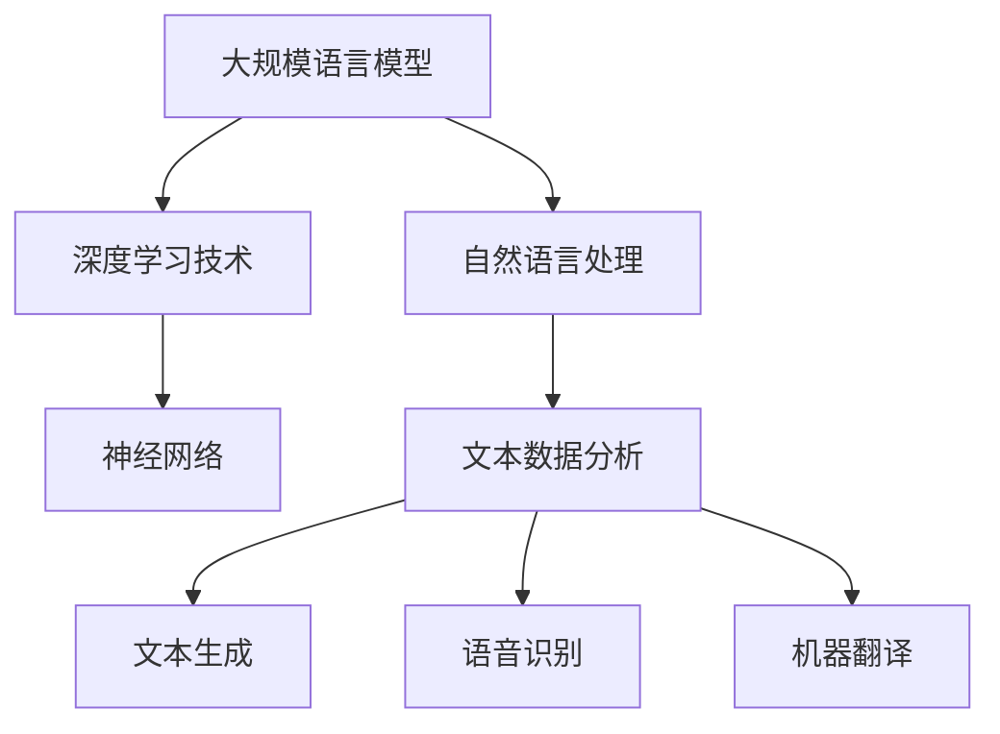
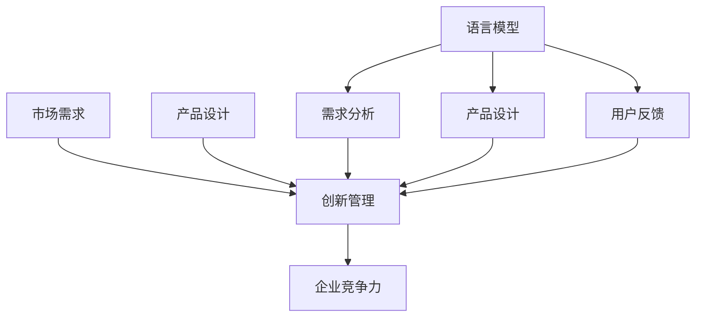
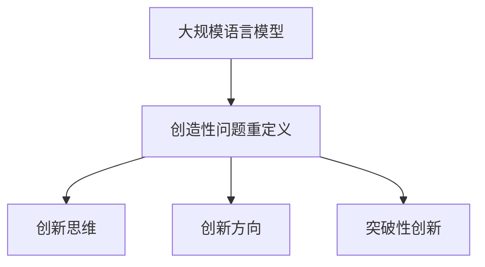
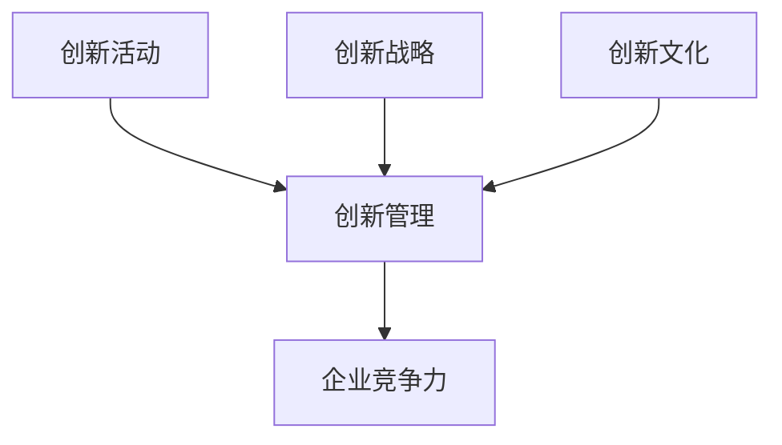
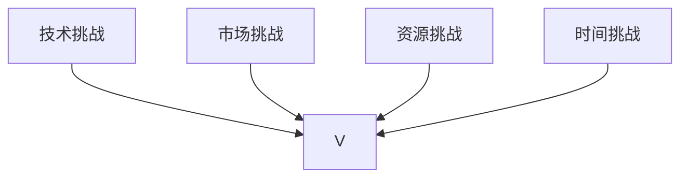
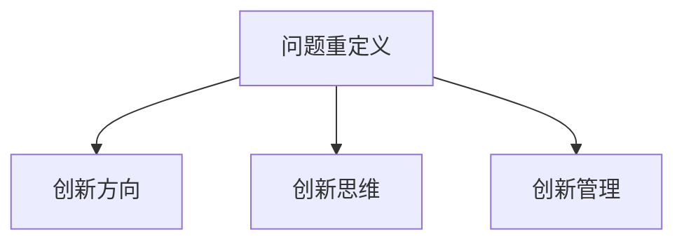

                 

### 第一部分：引言与核心概念

#### 第1章：大规模语言模型概述

##### 1.1 大规模语言模型的定义

**定义：** 大规模语言模型是一种基于深度学习的自然语言处理（NLP）技术，它通过学习海量文本数据，预测自然语言中的单词、短语或句子的概率分布。

**联系与架构：**

**核心概念与联系：**

- **深度学习技术**：结合多层神经网络结构，提升模型预测准确性和泛化能力。
- **自然语言处理**：处理人类语言数据的工程和科学，涉及语音识别、文本分析、机器翻译等。
- **神经网络**：由大量节点组成的计算模型，通过调整权重和偏置来实现数据拟合。

##### 1.2 语言模型在创新管理中的应用背景

**背景：** 在当前全球化、信息化的时代，创新管理成为企业保持竞争力的重要手段。而语言模型在提高创新效率、发现潜在需求、优化产品设计等方面具有巨大潜力。

**联系与架构：**

**核心概念与联系：**

- **创新管理**：涉及市场研究、产品设计、用户反馈等环节，旨在提高企业创新效率和产品竞争力。
- **市场需求**：影响创新决策和产品设计的重要因素。
- **语言模型**：通过文本数据分析和处理，为创新管理提供决策支持。

##### 1.3 创造性问题重定义能力解析

**定义：** 创造性问题重定义能力是指通过重新定义问题，激发创新思维，引导创新方向，实现突破性创新。

**联系与架构：**

**核心概念与联系：**

- **创造性问题重定义**：通过改变问题表述，激发新的想法和解决方案。
- **创新思维**：引导创新活动，推动创新过程。
- **创新方向**：确保创新活动与市场需求和战略目标一致。
- **突破性创新**：通过重新定义问题，实现重大突破。

### 第2章：创新管理中的核心问题

##### 2.1 创新管理的基本概念

**定义：** 创新管理是指企业为提高竞争力，通过系统化、制度化的方式管理和推动创新活动的过程。

**联系与架构：**

**核心概念与联系：**

- **创新活动**：包括新产品开发、新技术应用、业务模式创新等。
- **创新战略**：明确创新目标和方向，制定相应的战略规划和措施。
- **创新文化**：形成创新氛围，激发员工的创新潜能。

##### 2.2 创新过程中的挑战

**挑战：** 创新过程中可能面临技术、市场、资源等多方面的挑战。

**联系与架构：**

**核心概念与联系：**

- **技术挑战**：技术限制、技术成熟度等。
- **市场挑战**：市场需求、竞争环境等。
- **资源挑战**：人力、资金、资源整合等。
- **时间挑战**：时间压力、项目进度等。

##### 2.3 问题重定义与创新管理

**定义：** 问题重定义是一种创新策略，通过重新定义问题，引导创新方向，实现突破性创新。

**联系与架构：**

**核心概念与联系：**

- **问题重定义**：通过改变问题的表述，引导创新思维和方向。
- **创新思维**：激发新的想法和解决方案。
- **创新管理**：确保创新活动的有效推进。

### 总结

本部分介绍了大规模语言模型的定义、应用背景及创造性问题重定义能力的解析，同时探讨了创新管理的基本概念、核心问题以及问题重定义在创新管理中的应用。接下来，我们将进一步深入探讨大规模语言模型的技术基础和应用场景，以期为创新管理提供更有力的支持。

---

**作者：AI天才研究院/AI Genius Institute & 禅与计算机程序设计艺术 /Zen And The Art of Computer Programming**

---

[下一部分：第二部分：大规模语言模型技术基础](#第二部分大规模语言模型技术基础)

