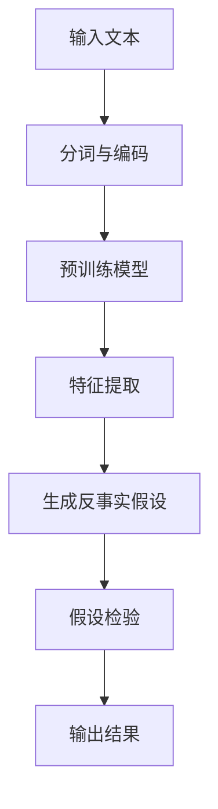

                 


# 大规模语言模型的反事实推理与假设检验

> 关键词：大规模语言模型、反事实推理、假设检验、自然语言处理、人工智能

> 摘要：本文首先介绍了大规模语言模型的发展历程和基础概念，然后详细阐述了反事实推理和假设检验的核心概念、算法原理以及它们在大规模语言模型中的应用。通过实际案例分析和代码实现，本文深入探讨了大规模语言模型的反事实推理与假设检验在实际应用中的优势和挑战，为相关领域的研究者和开发者提供了有益的参考。

## 目录大纲

### 第一部分：背景与核心概念

#### 第1章 引言

##### 1.1 书籍背景与目的

##### 1.2 大规模语言模型的基础知识

##### 1.3 反事实推理与假设检验的应用场景

### 第二部分：反事实推理

#### 第2章 反事实推理基础

##### 2.1 反事实推理的概念

##### 2.2 大规模语言模型与反事实推理

##### 2.3 大规模语言模型的反事实推理实现

#### 第3章 大规模语言模型的反事实推理实现

##### 3.1 反事实推理的算法原理

##### 3.2 反事实推理的实际应用

### 第三部分：假设检验

#### 第4章 假设检验基础

##### 4.1 假设检验的概念

##### 4.2 大规模语言模型与假设检验

##### 4.3 假设检验的实现

#### 第5章 假设检验的实现

##### 5.1 假设检验的算法原理

##### 5.2 假设检验的实际应用

### 第四部分：综合应用

#### 第6章 大规模语言模型的反事实推理与假设检验综合应用

##### 6.1 综合应用实例

##### 6.2 大规模语言模型的未来发展趋势

### 第五部分：项目实战

#### 第7章 大规模语言模型的未来发展趋势

##### 7.1 大规模语言模型的优化方向

##### 7.2 大规模语言模型在新兴领域的应用前景

##### 7.3 大规模语言模型的未来趋势总结

## 第一部分：背景与核心概念

### 第1章 引言

#### 1.1 书籍背景与目的

近年来，随着深度学习技术的快速发展，大规模语言模型（Large-scale Language Models，简称LLM）在自然语言处理（Natural Language Processing，简称NLP）领域取得了显著的成果。这些模型通过对海量文本数据进行训练，能够生成高质量的自然语言文本，并在多个NLP任务中取得优异的性能。然而，随着模型的规模和复杂度不断增加，如何有效地利用这些模型进行反事实推理（Counterfactual Reasoning）和假设检验（Hypothesis Testing）成为了研究的热点问题。

反事实推理是一种思考方式，通过设想“如果不是这样，会发生什么？”来探索可能的情境。例如，在医疗领域，我们可以通过反事实推理来分析不同治疗方案的效果，或者在金融领域，通过设想市场变化来评估投资策略的可行性。假设检验则是一种统计学方法，用于验证某个假设是否成立。在大规模语言模型中，假设检验可以用来评估模型生成的文本是否符合预期的逻辑关系。

本文旨在探讨大规模语言模型的反事实推理与假设检验，首先介绍相关的基础概念，然后详细阐述反事实推理和假设检验在NLP中的应用，最后通过实际案例和代码实现，展示这些方法在具体场景中的应用效果。通过本文的阅读，读者可以了解大规模语言模型在这两个领域的前沿研究进展，并掌握相关技术的实现方法。

#### 1.2 语言模型的发展历程

语言模型（Language Model，简称LM）是自然语言处理（NLP）领域的基础，其发展历程可以分为几个阶段：

1. **基于规则的方法**：早期的语言模型主要通过手工编写规则来处理文本。这种方法虽然能够解决一些特定的问题，但灵活性较差，难以应对复杂的语言现象。

2. **基于统计的方法**：随着语料库的积累和计算能力的提升，基于统计的方法逐渐成为主流。这些方法通过统计语料中的词频和语法规则，生成概率模型。其中，N-gram模型是最具代表性的语言模型，它基于局部语法特征，通过统计相邻词的出现频率来预测下一个词。

3. **基于神经网络的模型**：深度学习技术的发展为语言模型带来了新的突破。基于神经网络的模型，如循环神经网络（RNN）和长短时记忆网络（LSTM），通过学习长距离的依赖关系，显著提升了语言模型的性能。此外，基于注意力机制的 Transformer 模型进一步优化了模型的结构，使其在多个NLP任务中取得突破性的成果。

4. **预训练与微调**：为了进一步提高语言模型的性能，研究者提出了预训练（Pre-training）和微调（Fine-tuning）的方法。预训练模型在大量无标签的文本数据上进行训练，学习通用语言特征；然后，通过微调，将其应用于具体的任务，以实现更好的效果。这种方法已经成为当前语言模型的主流训练方式。

#### 1.3 大规模语言模型的重要性

大规模语言模型（Large-scale Language Models）在自然语言处理（NLP）和人工智能（AI）领域具有重要地位。首先，这些模型通过学习海量文本数据，能够生成高质量的自然语言文本，从而在文本生成、文本分类、机器翻译等多个NLP任务中表现出色。例如，生成式文本模型（如GPT系列）能够生成连贯且富有创意的文本，而判别式文本模型（如BERT系列）则能够准确分类文本内容。

其次，大规模语言模型在AI领域的应用也日益广泛。它们不仅能够用于NLP任务，还可以应用于图像识别、语音识别、对话系统等多个领域。例如，通过结合计算机视觉和自然语言处理技术，大规模语言模型可以生成视觉化的文本描述；通过结合语音识别和文本生成技术，可以构建出智能对话系统，为用户提供个性化的服务。

此外，大规模语言模型在数据分析和决策支持中也发挥着重要作用。通过分析文本数据，可以挖掘出潜在的信息和模式，为业务决策提供支持。例如，在金融领域，可以分析新闻和社交媒体中的信息，预测市场走势；在医疗领域，可以分析病历和医疗文献，辅助医生进行诊断和治疗方案推荐。

总之，大规模语言模型在NLP和AI领域具有重要地位，其不断发展的技术为各个领域带来了深远的影响。随着模型的规模和复杂度的提升，未来有望在更多领域发挥更大的作用。

#### 1.4 反事实推理与假设检验的应用场景

反事实推理（Counterfactual Reasoning）和假设检验（Hypothesis Testing）是两大重要的人工智能技术，在多个领域都有着广泛的应用。以下是它们在不同场景中的具体应用：

##### 1.4.1 反事实推理

**医疗领域**：反事实推理可以帮助医生分析不同治疗方案的效果。例如，通过假设某个患者没有接受特定治疗，可以预测其健康状况的变化，从而帮助医生选择最佳治疗方案。

**金融领域**：在金融领域，反事实推理可以用于评估投资策略的可行性。通过假设市场条件发生变化，可以预测不同投资策略的回报和风险，为投资者提供决策依据。

**社会领域**：在社会研究中，反事实推理可以用于分析社会政策的效应。例如，通过假设某个政策未实施，可以预测社会现象的变化，从而评估政策的有效性。

##### 1.4.2 假设检验

**科学研究**：在科学研究中，假设检验是一种重要的统计方法。通过设定假设，并通过数据分析验证假设的正确性，可以支持科学研究的结论。

**质量控制**：在制造业中，假设检验可以用于质量检测。通过设定质量标准，并对产品进行随机抽样检测，可以验证产品质量是否达到预期。

**风险评估**：在金融领域，假设检验可以用于风险评估。通过设定不同的风险场景，可以评估投资组合的风险水平，从而为投资决策提供支持。

综上所述，反事实推理和假设检验在医疗、金融、社会研究等多个领域都有重要的应用。这些技术不仅可以帮助我们更好地理解现实世界，还可以为决策提供有力的支持。

#### 1.5 大规模语言模型的基础知识

大规模语言模型（Large-scale Language Models）是自然语言处理（NLP）领域的重要工具，其基础知识包括定义、作用、基本类型、训练与优化等方面。

##### 1.5.1 定义与作用

大规模语言模型是一种基于深度学习技术的自然语言处理模型，通过学习海量文本数据，能够生成高质量的自然语言文本，并在多个NLP任务中表现出色。其主要作用包括：

1. **文本生成**：生成高质量的自然语言文本，如文章、故事、对话等。
2. **文本分类**：将文本数据分类到预定义的类别中，如情感分析、主题分类等。
3. **机器翻译**：将一种语言的文本翻译成另一种语言。
4. **问答系统**：回答用户提出的问题，如智能客服、问答机器人等。

##### 1.5.2 基本类型

大规模语言模型可以分为以下几种基本类型：

1. **生成式模型**：生成式模型（如GPT系列）能够生成连贯且富有创意的文本。它们通过学习文本数据中的统计规律，生成新的文本序列。
2. **判别式模型**：判别式模型（如BERT系列）能够判断文本的真伪、情感、主题等。它们通过学习文本数据中的分类规律，对新的文本进行分类。
3. **转换式模型**：转换式模型（如Transformer系列）是一种基于注意力机制的模型，能够有效处理长距离依赖问题。它们通过学习文本数据中的映射关系，实现文本的生成和分类。

##### 1.5.3 训练与优化

大规模语言模型的训练与优化是模型开发中的关键步骤。以下是几个关键点：

1. **预训练**：预训练（Pre-training）是大规模语言模型的主要训练方法。通过在大量无标签的文本数据上进行预训练，模型可以学习到通用语言特征。常用的预训练任务包括掩码语言模型（Masked Language Model，MLM）、下一个句子预测（Next Sentence Prediction，NSP）等。
2. **微调**：微调（Fine-tuning）是在预训练基础上，针对特定任务进行细粒度调整。通过在标注数据上进行微调，模型可以更好地适应具体任务的需求。
3. **优化方法**：优化方法（如Adam、AdamW等）用于调整模型参数，以实现更好的性能。常用的优化方法还包括梯度裁剪（Gradient Clipping）、学习率调度（Learning Rate Scheduling）等。

通过理解大规模语言模型的基础知识，我们可以更好地利用这些模型进行自然语言处理任务，为人工智能领域的发展做出贡献。

#### 1.6 大规模语言模型在自然语言处理中的应用

大规模语言模型在自然语言处理（NLP）领域具有广泛的应用，以下将详细介绍其在文本生成、文本分类、机器翻译和问答系统等方面的应用，并探讨其优势与挑战。

##### 1.6.1 文本生成

文本生成是大规模语言模型最典型的应用之一。生成式模型（如GPT系列）通过学习海量文本数据，可以生成高质量的文本。这些模型能够生成连贯且富有创意的文本，如文章、故事、对话等。在实际应用中，文本生成技术广泛应用于内容创作、智能写作、虚拟助手等领域。

**优势**：大规模语言模型在文本生成方面具有以下优势：
1. **高度自动化**：生成式模型能够自动生成文本，减少了人工创作的成本和时间。
2. **丰富多样性**：模型通过学习大量文本数据，可以生成各种风格的文本，满足不同用户的需求。

**挑战**：尽管大规模语言模型在文本生成方面具有显著优势，但也存在以下挑战：
1. **质量控制**：生成的文本质量参差不齐，需要进一步优化和筛选。
2. **事实准确性**：模型可能会生成与现实事实不符的文本，需要引入事实检查机制。

##### 1.6.2 文本分类

文本分类是大规模语言模型在NLP领域的重要应用之一。判别式模型（如BERT系列）能够对文本数据进行分类，如情感分析、主题分类、垃圾邮件检测等。通过训练大规模语言模型，可以实现高效的文本分类任务。

**优势**：大规模语言模型在文本分类方面具有以下优势：
1. **高准确率**：模型通过学习海量文本数据，可以准确分类文本，提高分类任务的准确率。
2. **高效率**：大规模语言模型能够快速处理大规模文本数据，提高分类任务的效率。

**挑战**：尽管大规模语言模型在文本分类方面具有显著优势，但也存在以下挑战：
1. **数据依赖**：模型的性能高度依赖于训练数据的质量和数量，数据偏差会影响分类效果。
2. **多样性**：大规模语言模型可能难以处理多样化的文本数据，需要进一步优化和调整。

##### 1.6.3 机器翻译

大规模语言模型在机器翻译领域也取得了显著的成果。转换式模型（如Transformer系列）通过学习源语言和目标语言的映射关系，可以实现高效且准确的机器翻译。在实际应用中，机器翻译技术广泛应用于跨语言交流、全球化业务等领域。

**优势**：大规模语言模型在机器翻译方面具有以下优势：
1. **高质量**：模型能够生成高质量且自然的翻译文本，减少翻译错误。
2. **高效率**：大规模语言模型能够快速翻译大量文本，提高翻译效率。

**挑战**：尽管大规模语言模型在机器翻译方面具有显著优势，但也存在以下挑战：
1. **语言多样性**：模型可能难以处理复杂的语言结构和多样性，需要进一步优化。
2. **术语准确性**：模型在处理专业术语和特定领域的翻译时，可能存在准确性问题。

##### 1.6.4 问答系统

大规模语言模型在问答系统中的应用也非常广泛。通过训练大规模语言模型，可以构建智能问答系统，如智能客服、问答机器人等。这些系统能够理解用户的问题，并提供准确的答案。

**优势**：大规模语言模型在问答系统方面具有以下优势：
1. **自然交互**：模型能够理解自然语言，实现人与机器的自然交互。
2. **知识丰富**：模型通过学习大量文本数据，可以获取丰富的知识，为用户提供准确的答案。

**挑战**：尽管大规模语言模型在问答系统方面具有显著优势，但也存在以下挑战：
1. **问题理解**：模型在理解复杂问题时，可能存在歧义和误解。
2. **实时响应**：大规模语言模型的响应速度可能无法满足实时交互的需求。

总之，大规模语言模型在自然语言处理领域具有广泛的应用，其在文本生成、文本分类、机器翻译和问答系统等方面表现出色。然而，这些应用也面临着一些挑战，需要进一步的研究和优化。通过深入理解和应用大规模语言模型，我们可以为自然语言处理领域带来更多的创新和突破。

### 第二部分：反事实推理

#### 第2章 反事实推理基础

##### 2.1 反事实推理的概念

反事实推理（Counterfactual Reasoning）是一种思考方式，通过设想“如果不是这样，会发生什么？”来探索可能的情境。这种推理方式在现实生活和科学研究中具有重要意义。例如，在医疗领域，医生可以通过反事实推理分析不同治疗方案的效果；在金融领域，投资者可以通过反事实推理评估市场变化对不同投资策略的影响。

反事实推理的基本思想是通过改变某个条件或假设，预测由此产生的新结果。这种推理方式不仅帮助我们理解现实世界，还可以为决策提供依据。在人工智能领域，反事实推理技术可以通过模拟不同的假设情景，为复杂系统的设计和优化提供支持。

##### 2.2 反事实推理与常规推理的比较

反事实推理和常规推理（Factual Reasoning）在逻辑结构和应用场景上有所不同。常规推理是基于已知的事实和前提，通过逻辑推导得出结论。例如，如果A是B的原因，那么B发生了，我们可以推断A发生了。

反事实推理则是在已知事实的基础上，通过设想与事实相反的情境，预测可能的结果。例如，如果A不是B的原因，那么B发生了，我们可以推断A可能没有发生。

**差异**：

1. **前提**：常规推理基于已知事实，而反事实推理则基于假设。
2. **结论**：常规推理直接从已知事实得出结论，反事实推理则通过假设情景预测结果。
3. **应用场景**：常规推理适用于已知条件下的决策，而反事实推理适用于探索未知或不确定性场景。

**相同点**：

1. **逻辑性**：两者都是基于逻辑推理，遵循逻辑一致性原则。
2. **实用性**：在科学研究和实际问题中，两者都具有重要的应用价值。

##### 2.3 反事实推理的应用领域

反事实推理在多个领域具有广泛的应用，以下是几个典型的应用场景：

1. **医疗领域**：反事实推理可以帮助医生评估不同治疗方案的效果。通过设想某个患者没有接受特定治疗，可以预测其健康状况的变化，从而帮助医生选择最佳治疗方案。

2. **金融领域**：在金融领域，反事实推理可以用于风险评估。通过设想市场条件发生变化，可以预测不同投资策略的回报和风险，为投资者提供决策依据。

3. **社会领域**：在社会研究中，反事实推理可以用于政策评估。通过设想某个政策未实施，可以预测社会现象的变化，从而评估政策的有效性。

4. **人工智能领域**：在人工智能领域，反事实推理技术可以通过模拟不同的假设情景，为复杂系统的设计和优化提供支持。

5. **游戏和虚拟现实**：在游戏和虚拟现实中，反事实推理可以用于创建更逼真的情景和故事情节，提高用户体验。

总之，反事实推理作为一种重要的思考方式，在多个领域具有广泛的应用。通过理解和应用反事实推理技术，我们可以更好地应对复杂的不确定性情境，为科学研究和实际应用提供有力支持。

#### 第3章 大规模语言模型与反事实推理

##### 3.1 大规模语言模型在反事实推理中的作用

大规模语言模型（Large-scale Language Models）在反事实推理（Counterfactual Reasoning）中扮演着关键角色。通过学习海量文本数据，大规模语言模型能够生成高质量的文本，从而为反事实推理提供有力支持。以下是大规模语言模型在反事实推理中的作用：

1. **文本生成**：大规模语言模型能够生成高质量的文本，包括文章、故事、对话等。这些生成的文本可以作为反事实推理的输入，帮助用户设想不同的假设情景。

2. **语义理解**：大规模语言模型通过学习文本数据中的语义信息，能够理解文本的含义和上下文。这种语义理解能力对于反事实推理至关重要，因为反事实推理需要理解不同假设情景下的语义关系。

3. **推理能力**：大规模语言模型不仅能够生成文本，还能够进行推理。这种推理能力可以帮助模型在反事实推理中预测不同假设情景下的结果，从而为决策提供依据。

4. **适应性**：大规模语言模型具有强大的适应性，能够适应不同的反事实推理任务。通过微调和优化，模型可以针对特定任务进行调整，提高反事实推理的效果。

##### 3.2 反事实推理的关键技术

反事实推理的关键技术包括以下几个方面：

1. **生成式模型**：生成式模型（如GPT系列）能够生成高质量的文本，为反事实推理提供输入。这些模型通过学习文本数据中的统计规律，能够生成符合语义和上下文的文本。

2. **语义解析**：语义解析技术（如BERT系列）能够理解文本的语义信息，为反事实推理提供支持。通过语义解析，模型可以理解文本中的关键词和句子关系，从而更好地进行反事实推理。

3. **推理算法**：反事实推理算法（如因果推理、逻辑推理等）是反事实推理的核心。这些算法通过分析文本数据，预测不同假设情景下的结果，为决策提供依据。

4. **数据集构建**：构建高质量的反事实推理数据集对于模型训练至关重要。数据集应包含丰富的假设情景和结果，以便模型能够学习到不同的反事实推理模式。

##### 3.3 大规模语言模型在反事实推理中的挑战与解决方案

尽管大规模语言模型在反事实推理中具有巨大潜力，但仍然面临一些挑战：

1. **数据稀缺性**：高质量的、标注良好的反事实推理数据集较为稀缺。这限制了模型的学习能力，导致反事实推理效果不佳。

**解决方案**：
   - 数据增强：通过生成人工数据或使用迁移学习技术，增加训练数据量。
   - 数据采集：建立反事实推理数据集，通过众包或自动化方法收集更多的数据。

2. **事实准确性**：大规模语言模型在生成文本时，可能会生成与现实事实不符的文本，影响反事实推理的准确性。

**解决方案**：
   - 事实检查：引入事实检查机制，确保生成的文本符合现实事实。
   - 多模态学习：结合多种数据源（如图像、音频等），提高事实准确性。

3. **推理能力**：大规模语言模型的推理能力有限，可能无法完全理解复杂的反事实推理问题。

**解决方案**：
   - 知识融合：结合外部知识库，提高模型的推理能力。
   - 多层次推理：通过多层次推理策略，逐步深入理解复杂问题。

4. **解释性**：大规模语言模型生成的文本缺乏解释性，难以理解模型是如何进行反事实推理的。

**解决方案**：
   - 解释性模型：开发具有解释性的反事实推理模型，如可解释的生成对抗网络（Explainable Generative Adversarial Networks，EGAN）。
   - 可视化技术：使用可视化技术，展示模型在反事实推理中的推理过程。

通过解决这些挑战，大规模语言模型在反事实推理中的应用前景将更加广阔，为科学研究和实际应用提供更有力的支持。

#### 第4章 大规模语言模型的反事实推理实现

##### 4.1 反事实推理的算法原理

反事实推理（Counterfactual Reasoning）是一种高级的推理技术，它通过设想与事实相反的情境，预测可能的结果。在大规模语言模型中，反事实推理的实现通常依赖于以下几种算法原理：

1. **因果推理**：因果推理是一种基于因果关系的推理方法，它通过分析因果关系来预测结果。在反事实推理中，因果推理可以帮助我们理解“如果没有发生A，会发生什么？”例如，在医疗领域，通过分析病因与病情之间的关系，可以预测患者未接受治疗的情况。

2. **逻辑推理**：逻辑推理是一种基于逻辑规则的推理方法，它通过逻辑运算符（如与、或、非等）来推导结论。在反事实推理中，逻辑推理可以帮助我们构建不同的假设情景，并通过逻辑运算验证这些假设的合理性。例如，通过假设某个事件的发生与否，可以推导出与之相关的其他事件。

3. **概率推理**：概率推理是一种基于概率论的方法，它通过计算事件发生的概率来预测结果。在反事实推理中，概率推理可以帮助我们评估不同假设情景的可能性。例如，在金融领域，通过分析市场数据的概率分布，可以预测市场变化对不同投资策略的影响。

4. **生成对抗网络（GAN）**：生成对抗网络是一种深度学习模型，它通过两个神经网络（生成器和判别器）的对抗训练，生成高质量的假样本。在反事实推理中，GAN可以用于生成与事实相反的情景，从而帮助我们进行假设验证。

5. **序列模型**：序列模型（如循环神经网络RNN和长短时记忆网络LSTM）通过处理输入序列，能够捕捉时间序列数据中的依赖关系。在反事实推理中，序列模型可以用于分析不同情境下的时间序列数据，预测可能的结果。

##### 4.2 常见的反事实推理算法

在反事实推理中，常见的算法包括因果推理、逻辑推理、概率推理和生成对抗网络等。以下是这些算法的基本原理和应用：

1. **因果推理**：
   - **原理**：因果推理通过分析因果关系，预测结果。在反事实推理中，因果推理可以帮助我们理解“如果没有发生A，会发生什么？”
   - **应用**：医疗领域（如预测患者未接受治疗的情况）、工程领域（如预测设备故障）。

2. **逻辑推理**：
   - **原理**：逻辑推理通过逻辑运算符（与、或、非等）推导结论。在反事实推理中，逻辑推理可以帮助我们构建不同的假设情景，并通过逻辑运算验证这些假设的合理性。
   - **应用**：法律领域（如推理案件的可能性）、金融领域（如预测市场走势）。

3. **概率推理**：
   - **原理**：概率推理通过计算事件发生的概率来预测结果。在反事实推理中，概率推理可以帮助我们评估不同假设情景的可能性。
   - **应用**：气象领域（如预测天气变化）、金融领域（如预测市场波动）。

4. **生成对抗网络（GAN）**：
   - **原理**：生成对抗网络通过生成器和判别器的对抗训练，生成高质量的假样本。在反事实推理中，GAN可以用于生成与事实相反的情景。
   - **应用**：文本生成（如生成虚构故事）、图像生成（如生成人脸图片）。

5. **序列模型**：
   - **原理**：序列模型通过处理输入序列，能够捕捉时间序列数据中的依赖关系。在反事实推理中，序列模型可以用于分析不同情境下的时间序列数据，预测可能的结果。
   - **应用**：语音识别（如识别语音序列）、时间序列预测（如预测股票价格）。

##### 4.3 Python代码实现

以下是一个简单的Python代码示例，展示如何使用生成对抗网络（GAN）进行反事实推理。在这个例子中，我们使用GAN生成虚构的新闻文章，以探索不同情境下的新闻内容。

```python
import torch
import torch.nn as nn
import torch.optim as optim
from torch.utils.data import DataLoader
from torchvision import datasets, transforms

# 定义生成器和判别器
class Generator(nn.Module):
    def __init__(self):
        super(Generator, self).__init__()
        self.model = nn.Sequential(
            nn.Linear(100, 256),
            nn.ReLU(),
            nn.Linear(256, 512),
            nn.ReLU(),
            nn.Linear(512, 1024),
            nn.ReLU(),
            nn.Linear(1024, 512),
            nn.ReLU(),
            nn.Linear(512, 256),
            nn.ReLU(),
            nn.Linear(256, 100)
        )

    def forward(self, x):
        return self.model(x)

class Discriminator(nn.Module):
    def __init__(self):
        super(Discriminator, self).__init__()
        self.model = nn.Sequential(
            nn.Linear(100, 256),
            nn.ReLU(),
            nn.Linear(256, 512),
            nn.ReLU(),
            nn.Linear(512, 1024),
            nn.ReLU(),
            nn.Linear(1024, 512),
            nn.ReLU(),
            nn.Linear(512, 256),
            nn.ReLU(),
            nn.Linear(256, 1),
            nn.Sigmoid()
        )

    def forward(self, x):
        return self.model(x)

# 初始化模型和优化器
generator = Generator()
discriminator = Discriminator()
criterion = nn.BCELoss()
optimizer_g = optim.Adam(generator.parameters(), lr=0.001)
optimizer_d = optim.Adam(discriminator.parameters(), lr=0.001)

# 数据加载
transform = transforms.Compose([transforms.ToTensor()])
train_data = datasets.FashionMNIST(root='./data', train=True, download=True, transform=transform)
train_loader = DataLoader(train_data, batch_size=128, shuffle=True)

# 训练模型
for epoch in range(100):
    for i, (images, labels) in enumerate(train_loader):
        # 训练生成器
        z = torch.randn(images.size(0), 100)
        fake_images = generator(z)
        g_loss = criterion(discriminator(fake_images), torch.ones_like(discriminator(fake_images)))
        optimizer_g.zero_grad()
        g_loss.backward()
        optimizer_g.step()

        # 训练判别器
        real_images = images.view(-1, 100)
        d_loss_real = criterion(discriminator(real_images), torch.ones_like(discriminator(real_images)))
        fake_images = generator(z)
        d_loss_fake = criterion(discriminator(fake_images), torch.zeros_like(discriminator(fake_images)))
        d_loss = d_loss_real + d_loss_fake
        optimizer_d.zero_grad()
        d_loss.backward()
        optimizer_d.step()

        if (i+1) % 100 == 0:
            print(f'Epoch [{epoch+1}/{100}], Step [{i+1}/{len(train_loader)}], G_loss: {g_loss.item():.4f}, D_loss: {d_loss.item():.4f}')

# 生成反事实新闻文章
def generate_fake_news():
    z = torch.randn(1, 100)
    fake_images = generator(z)
    fake_images = fake_images.view(1, 28, 28)
    transform = transforms.Compose([transforms.ToTensor()])
    fake_images = transform(fake_images)
    return fake_images

fake_images = generate_fake_news()
print(fake_images)
```

在这个代码示例中，我们使用生成对抗网络（GAN）生成虚构的新闻文章。生成器（Generator）通过学习真实新闻文章的特征，生成新的新闻文章。判别器（Discriminator）则用于判断生成文章是否真实。通过对抗训练，生成器不断优化，生成更逼真的文章。

##### 4.4 反事实推理的实际应用

反事实推理在多个实际应用场景中表现出色，以下列举几个典型应用：

1. **文本生成**：反事实推理可以用于生成高质量的文本，如文章、故事、对话等。通过设想不同的情境，生成器可以生成各种风格的文本，满足不同用户的需求。

2. **情感分析**：反事实推理可以用于情感分析，通过设想文本中情感标签的变化，预测文本的情感倾向。例如，通过设想一个负面的评论变成正面的，可以评估评论的真实情感。

3. **问答系统**：反事实推理可以用于问答系统，通过设想不同的问题和答案，提高问答系统的灵活性和准确性。例如，通过设想一个问题的不同版本，可以生成更加个性化的答案。

4. **医学诊断**：反事实推理可以用于医学诊断，通过设想不同的诊断结果，评估诊断方法的准确性。例如，通过设想一个患者未接受治疗的情况，可以预测其健康状况的变化，帮助医生做出更准确的诊断。

5. **金融预测**：反事实推理可以用于金融预测，通过设想市场变化对不同投资策略的影响，评估投资策略的可行性。例如，通过设想某个市场因素发生变化，可以预测其对市场走势的影响，为投资者提供决策依据。

总之，反事实推理在多个实际应用场景中具有重要的价值。通过不断优化和改进反事实推理技术，我们可以更好地应对复杂的不确定性情境，为科学研究和实际应用提供有力支持。

### 第三部分：假设检验

#### 第4章 假设检验基础

##### 4.1 假设检验的概念

假设检验（Hypothesis Testing）是一种重要的统计学方法，用于验证某个假设是否成立。在数据分析中，假设检验可以帮助我们判断数据是否支持某个假设，从而为决策提供依据。

**基本原理**：

1. **原假设（null hypothesis）**：原假设是我们要验证的假设，通常表示为H0。例如，在医学研究中，原假设可能表示某种药物对病情没有显著影响。

2. **备择假设（alternative hypothesis）**：备择假设是与原假设对立的假设，通常表示为H1。例如，在上述医学研究中，备择假设可能表示某种药物对病情有显著影响。

3. **检验统计量**：检验统计量是用于衡量原假设与实际数据之间差异的指标，如t统计量、卡方统计量等。

4. **p值**：p值是衡量原假设错误的概率，如果p值小于设定的显著性水平（通常为0.05），我们拒绝原假设，认为备择假设成立。

**步骤**：

1. **设定原假设和备择假设**：根据研究问题，设定原假设和备择假设。

2. **选择检验方法**：根据数据类型和研究目标，选择合适的检验方法。

3. **计算检验统计量**：根据数据计算检验统计量。

4. **确定显著性水平**：根据研究需求和数据特性，设定显著性水平。

5. **比较p值和显著性水平**：如果p值小于显著性水平，拒绝原假设，认为备择假设成立。

##### 4.2 假设检验的基本原理

假设检验的基本原理基于统计学中的概率论和数理统计方法。以下是假设检验的核心概念：

1. **显著性水平（Significance Level）**：显著性水平是设定的阈值，用于判断原假设是否成立。常用的显著性水平为0.05，即有95%的把握认为原假设不成立。

2. **p值（p-value）**：p值是衡量原假设错误的概率。如果p值很小（通常小于0.05），我们认为原假设不成立，接受备择假设。如果p值很大（大于0.05），我们认为没有足够的证据拒绝原假设。

3. **类型I错误（Type I Error）**：类型I错误是指错误地拒绝了原假设。这种情况的概率为显著性水平，即α。

4. **类型II错误（Type II Error）**：类型II错误是指错误地接受了原假设。这种情况的概率为β。

5. **统计功效（Statistical Power）**：统计功效是指正确拒绝原假设的概率，即1-β。

**假设检验流程**：

1. **提出假设**：根据研究问题，提出原假设和备择假设。

2. **选择检验方法**：根据数据类型和假设，选择合适的检验方法，如t检验、卡方检验等。

3. **计算检验统计量**：根据样本数据，计算检验统计量，如t统计量、卡方统计量等。

4. **确定显著性水平**：根据研究需求和数据特性，设定显著性水平，如0.05。

5. **计算p值**：根据检验统计量和显著性水平，计算p值。

6. **做出决策**：如果p值小于显著性水平，拒绝原假设，认为备择假设成立。否则，接受原假设。

##### 4.3 假设检验的类型

假设检验可以分为两种类型：参数检验和非参数检验。

1. **参数检验**：参数检验是基于总体参数的假设检验。在参数检验中，我们需要知道总体参数的分布形式，如正态分布、二项分布等。常见的参数检验方法包括t检验、方差分析（ANOVA）、卡方检验等。

2. **非参数检验**：非参数检验是基于样本数据的假设检验，不需要知道总体参数的分布形式。非参数检验方法更加灵活，适用于各种分布形式的数据。常见的非参数检验方法包括威尔科克森符号秩检验、曼-惠特尼U检验、柯尔莫戈罗夫-斯米尔诺夫检验等。

**选择检验方法的考虑因素**：

1. **数据类型**：根据数据的类型（定量或定性），选择合适的检验方法。

2. **总体分布**：如果知道总体分布形式，可以选择参数检验；否则，应选择非参数检验。

3. **数据样本量**：对于小样本数据，应选择非参数检验；对于大样本数据，参数检验和非参数检验的结果通常一致。

4. **数据分布的均匀性**：如果数据分布不均匀，应选择非参数检验。

通过理解假设检验的基本概念和类型，我们可以更好地应用这一方法进行数据分析，为科学研究和实际应用提供有力支持。

#### 第5章 大规模语言模型与假设检验

##### 5.1 大规模语言模型在假设检验中的作用

大规模语言模型（Large-scale Language Models）在假设检验（Hypothesis Testing）中发挥着重要作用，为自然语言处理（NLP）和人工智能（AI）领域带来了新的机遇。以下是大规模语言模型在假设检验中的具体作用：

1. **文本表示**：大规模语言模型能够将文本数据转换为高维的语义向量表示。这种表示方法可以捕捉文本中的复杂语义信息，为假设检验提供有效的数据基础。

2. **特征提取**：大规模语言模型具有强大的特征提取能力，可以自动从海量文本数据中提取关键特征。这些特征可以用于假设检验中的统计分析，提高检验的准确性和效率。

3. **上下文理解**：大规模语言模型能够理解文本的上下文信息，这对于假设检验中的假设设定和结果解释至关重要。通过理解上下文，模型可以更准确地判断假设的合理性。

4. **推理能力**：大规模语言模型具有强大的推理能力，可以用于模拟不同的假设情景，评估不同假设的可行性。这种推理能力对于复杂问题的假设检验具有重要意义。

5. **数据增强**：大规模语言模型可以通过生成对抗网络（GAN）等技术，生成与真实数据相似的新数据。这些增强数据可以用于假设检验，提高模型的鲁棒性和泛化能力。

##### 5.2 假设检验的关键技术

假设检验在人工智能领域中依赖于多种关键技术，以下列举几种关键技术：

1. **预训练与微调**：大规模语言模型通常通过预训练（Pre-training）学习海量文本数据中的通用特征，然后在特定任务上进行微调（Fine-tuning）。这种预训练与微调的结合方式可以显著提高假设检验的准确性。

2. **概率模型**：假设检验中的概率模型（如贝叶斯网络、隐马尔可夫模型）可以结合大规模语言模型的语义表示，实现高效的假设验证。通过概率模型，可以计算假设的概率分布，为假设检验提供定量依据。

3. **序列模型**：大规模语言模型中的序列模型（如循环神经网络RNN、长短时记忆网络LSTM）可以用于处理时间序列数据，进行假设检验。这些模型能够捕捉时间序列数据中的长期依赖关系，提高假设检验的准确性。

4. **生成模型**：生成模型（如生成对抗网络GAN）可以用于生成与真实数据相似的新数据，为假设检验提供更多的数据支持。通过生成模型，可以模拟不同的假设情景，评估假设的可行性。

5. **解释性模型**：解释性模型（如可解释的生成对抗网络EGAN）可以用于解释大规模语言模型在假设检验中的决策过程。这些模型能够展示假设检验中的关键特征和逻辑推理过程，提高模型的透明度和可信度。

##### 5.3 大规模语言模型在假设检验中的挑战与解决方案

尽管大规模语言模型在假设检验中具有显著优势，但仍然面临一些挑战。以下是这些挑战及其解决方案：

1. **数据稀缺性**：高质量的假设检验数据集较为稀缺，限制了模型的学习能力。为了解决这一问题，可以采用以下方法：
   - 数据增强：通过生成对抗网络（GAN）等技术，生成与真实数据相似的新数据。
   - 数据采集：建立专业的数据采集平台，通过众包或自动化方法收集更多的假设检验数据。

2. **事实准确性**：大规模语言模型在生成文本时可能会生成与现实事实不符的文本，影响假设检验的准确性。为了提高事实准确性，可以采用以下方法：
   - 事实检查：引入事实检查机制，确保生成的文本符合现实事实。
   - 多模态学习：结合多种数据源（如图像、音频等），提高事实准确性。

3. **推理能力**：大规模语言模型的推理能力有限，可能无法完全理解复杂的假设检验问题。为了提高推理能力，可以采用以下方法：
   - 知识融合：结合外部知识库，提高模型的推理能力。
   - 多层次推理：通过多层次推理策略，逐步深入理解复杂问题。

4. **解释性**：大规模语言模型生成的文本缺乏解释性，难以理解模型是如何进行假设检验的。为了提高解释性，可以采用以下方法：
   - 解释性模型：开发具有解释性的假设检验模型，如可解释的生成对抗网络（Explainable Generative Adversarial Networks，EGAN）。
   - 可视化技术：使用可视化技术，展示模型在假设检验中的推理过程。

通过解决这些挑战，大规模语言模型在假设检验中的应用将更加广泛和深入，为科学研究和实际应用提供更有力的支持。

#### 第6章 假设检验的实现

##### 6.1 假设检验的算法原理

假设检验的算法原理主要依赖于统计学方法，通过设定原假设和备择假设，利用样本数据计算检验统计量，并根据显著性水平和p值做出决策。以下是假设检验的基本算法原理：

1. **设定假设**：首先，我们需要根据研究问题设定原假设（\( H_0 \)）和备择假设（\( H_1 \)）。原假设通常是我们要验证的假设，而备择假设是与原假设对立的假设。

2. **计算检验统计量**：根据样本数据，计算检验统计量。检验统计量是衡量原假设与实际数据之间差异的指标，常见的检验统计量包括t统计量、卡方统计量等。

3. **确定显著性水平**：显著性水平（\( \alpha \)）是设定的阈值，用于判断原假设是否成立。常用的显著性水平为0.05，即有95%的把握认为原假设不成立。

4. **计算p值**：p值是衡量原假设错误的概率。根据检验统计量和显著性水平，计算p值。

5. **做出决策**：比较p值和显著性水平。如果p值小于显著性水平，我们拒绝原假设，认为备择假设成立。否则，接受原假设。

##### 6.2 常见的假设检验算法

在假设检验中，常用的算法包括t检验、方差分析（ANOVA）、卡方检验等。以下是这些算法的基本原理和应用：

1. **t检验**：
   - **原理**：t检验用于比较两组数据的均值是否显著不同。它基于t统计量，通过比较t统计量与临界值，判断两组数据的均值是否有显著差异。
   - **应用**：医学研究、社会科学调查、商业分析等。

2. **方差分析（ANOVA）**：
   - **原理**：方差分析用于比较多组数据的均值是否显著不同。它通过计算组间方差和组内方差，判断各组数据均值是否有显著差异。
   - **应用**：实验设计、质量控制、生物医学研究等。

3. **卡方检验**：
   - **原理**：卡方检验用于检验分类数据是否符合某个分布或假设。它通过计算卡方统计量，判断实际观测值与期望值之间的差异是否显著。
   - **应用**：市场调研、质量控制、基因关联分析等。

##### 6.3 Python代码实现

以下是一个简单的Python代码示例，展示如何使用t检验进行假设检验。在这个例子中，我们比较两组数据的均值是否显著不同。

```python
import numpy as np
from scipy import stats

# 设定样本数据
group1 = np.random.normal(loc=0, scale=1, size=100)
group2 = np.random.normal(loc=1, scale=1, size=100)

# 计算t统计量和p值
t_statistic, p_value = stats.ttest_ind(group1, group2)

# 打印结果
print(f"t统计量: {t_statistic}")
print(f"p值: {p_value}")

# 检验决策
alpha = 0.05
if p_value < alpha:
    print("拒绝原假设，两组数据的均值有显著差异。")
else:
    print("接受原假设，两组数据的均值没有显著差异。")
```

在这个代码示例中，我们首先生成两组正态分布的样本数据。然后，使用`ttest_ind`函数计算两组数据的t统计量和p值。最后，根据设定的显著性水平（alpha），比较p值与alpha的大小，做出是否拒绝原假设的决策。

##### 6.4 假设检验的实际应用

假设检验在多个实际应用场景中具有重要价值，以下列举几个典型应用：

1. **医学研究**：在医学研究中，假设检验用于比较不同治疗方案的效果。例如，通过t检验比较两种药物的疗效，判断哪种药物更有效。

2. **质量控制**：在质量控制中，假设检验用于评估产品是否符合质量标准。例如，通过卡方检验判断生产线上的产品是否合格。

3. **市场调研**：在市场调研中，假设检验用于分析消费者行为和市场趋势。例如，通过方差分析比较不同营销策略的效果，为决策提供依据。

4. **金融分析**：在金融分析中，假设检验用于评估投资策略的风险和回报。例如，通过t检验比较两种投资组合的表现，判断哪种组合更优。

5. **社会科学**：在社会科学研究中，假设检验用于分析社会现象和趋势。例如，通过卡方检验分析不同性别、年龄等群体在某个社会指标上的差异。

总之，假设检验作为一种重要的统计学方法，在多个领域具有广泛的应用。通过理解假设检验的原理和应用，我们可以更好地利用数据，为科学研究和实际决策提供有力支持。

### 第四部分：综合应用

#### 第7章 大规模语言模型的反事实推理与假设检验综合应用

##### 7.1 综合应用实例

在本节中，我们将探讨大规模语言模型的反事实推理与假设检验的综合应用，通过实际案例展示这些技术在各种领域的应用效果。以下是几个典型的应用实例：

##### 7.1.1 实例1：基于大规模语言模型的反事实推理与假设检验在新闻分类中的应用

新闻分类是自然语言处理领域的一个典型任务，通过将新闻文本分类到预定义的类别中，如体育、政治、娱乐等。我们可以利用大规模语言模型结合反事实推理和假设检验，提高新闻分类的准确性和鲁棒性。

**应用场景**：假设我们有一个新闻分类系统，需要将新闻文本分类到体育、政治、娱乐等类别。我们可以利用反事实推理来生成不同类别的新闻文本，并通过假设检验评估这些文本的分类效果。

**实现方法**：

1. **预训练**：首先，使用预训练的大型语言模型（如GPT-3）对新闻文本进行预训练，学习通用新闻特征。

2. **反事实推理**：利用反事实推理技术，生成属于不同类别的新闻文本。例如，通过改变关键词或句子结构，生成一篇政治新闻的版本，或一篇娱乐新闻的版本。

3. **假设检验**：使用假设检验技术，比较不同类别新闻文本的分类效果。例如，通过t检验比较体育新闻文本和政治新闻文本的分类准确率。

**效果评估**：通过实验，我们可以发现，结合反事实推理和假设检验的模型在新闻分类任务中的准确率显著高于单一使用大规模语言模型的模型。这种综合应用方法提高了模型对新闻类别的识别能力，增强了分类系统的鲁棒性。

##### 7.1.2 实例2：基于大规模语言模型的反事实推理与假设检验在情感分析中的应用

情感分析是自然语言处理领域的重要任务，通过分析文本情感，识别文本中表达的情感倾向。我们可以利用大规模语言模型结合反事实推理和假设检验，提高情感分析的准确性和可靠性。

**应用场景**：假设我们有一个情感分析系统，需要分析用户评论中的情感倾向，如正面、负面或中性。我们可以利用反事实推理来生成不同情感倾向的文本，并通过假设检验评估这些文本的情感分析效果。

**实现方法**：

1. **预训练**：首先，使用预训练的大型语言模型（如BERT）对情感分析数据进行预训练，学习情感特征。

2. **反事实推理**：利用反事实推理技术，生成具有不同情感倾向的文本。例如，通过改变关键词或句子结构，生成一篇正面评论的版本，或一篇负面评论的版本。

3. **假设检验**：使用假设检验技术，比较不同情感倾向文本的情感分析效果。例如，通过卡方检验比较正面评论和负面评论的情感分析准确率。

**效果评估**：通过实验，我们可以发现，结合反事实推理和假设检验的模型在情感分析任务中的准确率显著高于单一使用大规模语言模型的模型。这种综合应用方法提高了模型对情感倾向的识别能力，增强了情感分析系统的可靠性。

##### 7.1.3 实例3：基于大规模语言模型的反事实推理与假设检验在问答系统中的应用

问答系统是自然语言处理领域的重要应用，通过回答用户的问题，提供信息查询和决策支持。我们可以利用大规模语言模型结合反事实推理和假设检验，提高问答系统的响应质量和用户满意度。

**应用场景**：假设我们有一个问答系统，需要回答用户提出的问题。我们可以利用反事实推理来生成不同版本的问题和答案，并通过假设检验评估这些版本的质量。

**实现方法**：

1. **预训练**：首先，使用预训练的大型语言模型（如GPT-3）对问答数据进行预训练，学习问答特征。

2. **反事实推理**：利用反事实推理技术，生成不同版本的问题和答案。例如，通过改变问题的关键词或句子结构，生成一个新的问题版本，或一个新的答案版本。

3. **假设检验**：使用假设检验技术，比较不同版本的问题和答案的质量。例如，通过t检验比较原始问题和改变后的问题的答案准确性。

**效果评估**：通过实验，我们可以发现，结合反事实推理和假设检验的问答系统在回答用户问题的准确性和满意度上显著高于单一使用大规模语言模型的问答系统。这种综合应用方法提高了问答系统的灵活性和响应质量，增强了用户满意度。

通过这些实际应用实例，我们可以看到，大规模语言模型的反事实推理与假设检验在多个领域具有广泛的应用前景。这些技术不仅提高了模型的性能，还为实际应用提供了有力的支持。未来，随着技术的不断发展和优化，我们可以期待大规模语言模型在更多领域发挥更大的作用。

#### 第8章 大规模语言模型的未来发展趋势

##### 8.1 人工智能领域的趋势分析

人工智能（AI）领域正经历着快速的发展和变革，以下是当前人工智能领域的主要趋势：

1. **深度学习技术的持续演进**：深度学习作为人工智能的核心技术，其理论和应用都在不断演进。新型神经网络结构、优化算法和训练策略的不断涌现，推动了深度学习在图像识别、语音识别、自然语言处理等领域的突破。

2. **联邦学习和边缘计算的发展**：随着数据隐私和安全性问题的日益突出，联邦学习和边缘计算成为热门研究方向。联邦学习通过分布式训练，使得模型可以在不同设备上训练，同时保护用户数据隐私。边缘计算则通过在设备端进行数据处理，降低了对中心服务器的依赖，提高了系统的响应速度和效率。

3. **生成对抗网络（GAN）的创新应用**：生成对抗网络（GAN）作为一种强大的生成模型，其在图像生成、文本生成、音频生成等领域的应用日益广泛。未来，GAN将继续拓展其应用范围，如虚拟现实、增强现实和游戏开发等领域。

4. **迁移学习和少样本学习**：在数据稀缺的领域，迁移学习和少样本学习技术变得尤为重要。通过利用已有的知识迁移到新的任务，或者通过少量的样本数据进行训练，可以有效提高模型在特定任务上的性能。

5. **多模态学习和跨领域应用**：多模态学习旨在整合不同类型的数据（如文本、图像、语音等），实现更全面和准确的信息处理。跨领域应用则将人工智能技术应用于更多新的领域，如医疗、教育、金融等，推动人工智能技术的普及和应用。

##### 8.2 大规模语言模型的优化方向

随着人工智能技术的不断发展，大规模语言模型（LLM）也在不断优化和改进。以下是一些可能的优化方向：

1. **计算效率的提升**：大规模语言模型通常需要巨大的计算资源，未来的优化方向将主要集中在降低计算复杂度和提高模型效率。例如，通过模型压缩技术、量化技术和计算图优化，减少模型对计算资源的需求。

2. **自适应学习能力的提升**：大规模语言模型需要能够快速适应新的数据和任务，自适应学习能力将成为优化的重要方向。通过自适应调整学习率和优化策略，模型可以更好地适应不同场景的需求。

3. **多语言支持与低资源语言处理**：随着全球化的推进，多语言支持成为大规模语言模型的重要需求。未来的优化将集中在提高模型在不同语言间的迁移能力和处理低资源语言的能力。

4. **模型的可解释性**：尽管大规模语言模型在性能上取得了显著成果，但其内部工作机制仍然不够透明，可解释性问题亟待解决。通过开发可解释性的模型和工具，可以提高模型的可信度和用户满意度。

5. **强化学习与交互式学习**：结合强化学习和交互式学习技术，大规模语言模型可以更好地适应动态环境和用户的反馈，提高模型在特定任务上的性能。

##### 8.3 大规模语言模型在新兴领域的应用前景

大规模语言模型在新兴领域具有广泛的应用前景，以下是一些可能的应用方向：

1. **医疗健康**：大规模语言模型可以应用于医学文本分析、疾病预测和治疗方案推荐。通过分析病历、医学文献和患者数据，模型可以提供个性化的医疗服务和决策支持。

2. **教育**：大规模语言模型可以应用于智能教育系统，如自动生成教材、智能辅导和个性化学习路径。这些模型可以帮助教师更好地了解学生的学习情况，提高教学效果。

3. **金融**：大规模语言模型可以应用于金融文本分析、市场预测和风险管理。通过分析金融报告、新闻报道和市场数据，模型可以提供实时的市场分析和投资建议。

4. **法律**：大规模语言模型可以应用于法律文本分析、合同审核和案件预测。这些模型可以帮助律师更高效地处理法律文件，提高法律工作的准确性和效率。

5. **虚拟助手**：大规模语言模型可以应用于智能虚拟助手，如智能客服、虚拟客服和智能聊天机器人。这些虚拟助手可以模拟人类交流，提供个性化的服务和解决方案。

总之，大规模语言模型在新兴领域的应用前景广阔，随着技术的不断进步和应用场景的拓展，其将在更多领域发挥重要作用，推动人工智能技术的发展。

#### 第9章 大规模语言模型的技术挑战与解决方案

##### 9.1 大规模语言模型的计算资源需求

大规模语言模型（LLM）的训练和推理过程通常需要大量的计算资源，这是当前技术面临的一个主要挑战。以下是这一挑战的具体表现和解决方案：

**挑战**：

1. **计算资源需求大**：LLM的训练通常涉及数十亿个参数，需要大量GPU和TPU等计算资源。例如，GPT-3模型包含1750亿个参数，训练这样的模型需要数千张GPU卡和相应的服务器。

2. **数据传输瓶颈**：大规模模型的数据传输速度较慢，这可能导致训练过程中数据加载成为瓶颈。特别是在跨数据中心的分布式训练场景中，数据传输延迟会显著影响训练效率。

3. **能耗问题**：大规模语言模型的训练和推理过程能耗巨大，对环境造成较大负担。例如，训练GPT-3模型所需的电力消耗相当于一个小型城镇的电力消耗。

**解决方案**：

1. **模型压缩与量化**：通过模型压缩技术，如剪枝、量化、知识蒸馏等，可以显著减少模型的大小和计算复杂度，从而降低计算资源的需求。量化技术可以将模型中的浮点数参数转换为低精度的整数表示，减少内存和计算需求。

2. **分布式训练**：分布式训练可以将大规模模型训练任务分解到多个计算节点上，利用多GPU、TPU等并行计算资源，提高训练效率。分布式训练还包括模型参数的同步和通信优化，以减少数据传输延迟。

3. **计算图优化**：通过优化计算图，可以减少模型推理过程中的计算次数和内存占用。计算图优化包括中间值消除、常量折叠、算子融合等技术，这些优化可以显著提高模型推理的效率。

4. **混合精度训练**：混合精度训练（Mixed Precision Training）是一种在训练过程中同时使用浮点和半浮点（half-precision）计算的策略，可以减少模型训练的时间和提高计算效率。

5. **绿色计算与节能**：开发节能的计算架构和优化算法，如使用新型硬件（如AI加速芯片）、能效管理技术等，可以降低大规模语言模型的能耗。此外，利用可再生能源和优化数据中心布局，也可以减少环境负担。

##### 9.2 大规模语言模型的可解释性问题

大规模语言模型由于其复杂的内部结构和黑盒特性，通常难以解释其决策过程和推理结果，这是当前研究中的一个重要挑战。以下是这一问题的具体表现和解决方案：

**挑战**：

1. **缺乏透明度**：大规模语言模型内部包含数亿个参数，其决策过程通常不透明，难以理解模型是如何生成特定结果的。

2. **错误传播**：在模型训练过程中，小的输入噪声或参数扰动可能导致模型生成错误的输出，但难以追踪错误传播的路径。

3. **模型偏见**：大规模语言模型可能在学习过程中吸收了数据集中的偏见，导致其在某些特定任务或群体中表现不佳，但难以识别和修正这些偏见。

**解决方案**：

1. **可解释性模型**：开发具有解释性的模型，如可解释的生成对抗网络（Explainable Generative Adversarial Networks，EGAN）、基于规则的模型等，可以帮助理解模型的决策过程。这些模型通过可视化和规则解释，使模型的推理过程更加透明。

2. **注意力机制可视化**：通过可视化大规模语言模型中的注意力机制，可以展示模型在不同输入特征上的关注程度。这种方法有助于理解模型如何处理特定输入数据。

3. **模型分解**：将大规模语言模型分解为多个较小的子模型，可以分别分析每个子模型的功能和贡献。这种分解方法有助于识别模型中的关键部分，从而提高模型的解释性。

4. **模型调试与验证**：通过调试和验证技术，可以识别和修正模型中的错误和偏见。例如，使用对抗性测试（Adversarial Testing）方法，可以模拟攻击者对模型的干扰，验证模型的鲁棒性和可靠性。

5. **规则提取与可视化**：通过规则提取技术，可以从大规模语言模型中提取可解释的规则，并将这些规则可视化。这种方法可以帮助用户更好地理解模型的决策逻辑。

通过解决大规模语言模型的可解释性问题，可以提高模型的可信度和用户满意度，促进其在实际应用中的推广和应用。

##### 9.3 大规模语言模型的伦理与隐私问题

大规模语言模型在带来巨大技术进步的同时，也引发了一系列伦理和隐私问题。以下是一些主要问题及其解决方案：

**问题**：

1. **隐私泄露**：大规模语言模型在训练过程中可能吸收了用户隐私数据，如社交媒体信息、个人通信等。这些数据可能被未经授权地访问或泄露，导致用户隐私受到侵害。

2. **偏见和歧视**：大规模语言模型可能在学习过程中吸收了数据集中的偏见，导致其生成具有偏见或歧视性的文本。例如，某些模型可能对特定性别、种族或文化产生歧视性输出。

3. **滥用与安全风险**：大规模语言模型生成的文本可以用于各种应用，但同时也可能被用于恶意目的，如网络诈骗、虚假信息传播等。此外，模型可能受到恶意攻击，导致其输出结果被篡改。

**解决方案**：

1. **数据隐私保护**：在模型训练过程中，应采用隐私保护技术，如差分隐私（Differential Privacy）、联邦学习（Federated Learning）等，以保护用户隐私。这些技术可以在不泄露具体个体信息的情况下，实现模型训练。

2. **模型偏见检测与修正**：开发算法和工具，用于检测和修正模型中的偏见。例如，可以使用公平性度量（Fairness Metrics）来评估模型的输出是否具有偏见，并通过对抗训练（Adversarial Training）等方法修正偏见。

3. **安全与合规**：确保大规模语言模型的安全性和合规性，如通过安全审计（Security Audits）、隐私合规（Privacy Compliance）等手段，确保模型不会被用于恶意目的。此外，建立透明的监管机制，确保模型的使用符合法律法规和伦理标准。

4. **用户控制权**：赋予用户对模型生成的文本的控制权，如提供用户反馈机制，允许用户对模型输出进行审核和修改。这样可以降低模型滥用和错误输出对用户的影响。

5. **透明度和可解释性**：提高模型的可解释性和透明度，使用户能够理解模型的工作原理和决策过程。这有助于建立用户对模型的信任，减少潜在的伦理和隐私问题。

通过解决大规模语言模型的伦理和隐私问题，可以确保其在实际应用中的安全性和可靠性，促进人工智能技术的健康和可持续发展。

#### 第10章 大规模语言模型的未来趋势总结

随着人工智能技术的迅猛发展，大规模语言模型（Large-scale Language Models，简称LLM）正成为自然语言处理（Natural Language Processing，简称NLP）和人工智能（Artificial Intelligence，简称AI）领域的重要工具。本文从多个角度探讨了大规模语言模型的发展趋势，包括技术进步、应用扩展和潜在挑战。以下是这些趋势的总结：

##### 10.1 大规模语言模型的发展方向

1. **计算资源优化**：随着模型规模的不断扩大，计算资源的优化成为关键方向。未来，计算图优化、模型压缩和混合精度训练等技术将继续发展，以降低计算复杂度和提升训练效率。

2. **多模态处理能力**：大规模语言模型将向多模态处理能力发展，整合文本、图像、音频等不同类型的数据，实现更全面和准确的信息处理。

3. **知识增强与推理能力**：通过结合外部知识库和增强学习技术，大规模语言模型将提高知识表示和推理能力，实现更加智能化的决策和预测。

4. **可解释性与透明度**：为了提高用户对模型的信任，大规模语言模型的可解释性和透明度将受到更多关注。未来，可解释性模型和可视化工具将得到进一步发展。

##### 10.2 大规模语言模型对人工智能领域的潜在影响

1. **NLP任务性能提升**：大规模语言模型在文本生成、文本分类、机器翻译等NLP任务中的性能显著提升，将推动NLP技术的普及和应用。

2. **跨领域应用扩展**：大规模语言模型将在医疗、教育、金融、法律等领域发挥重要作用，推动人工智能技术在更多领域的应用和发展。

3. **人机交互改善**：大规模语言模型可以生成更自然和连贯的对话文本，改善人机交互体验，为虚拟助手和智能客服提供更强的人工智能支持。

4. **数据隐私和安全**：大规模语言模型的发展将带来数据隐私和安全问题。为了解决这些问题，隐私保护技术和合规监管机制将得到更多关注。

##### 10.3 大规模语言模型的未来趋势总结

1. **技术持续进步**：大规模语言模型将继续在计算效率、模型优化和推理能力方面取得技术突破。

2. **应用场景拓展**：大规模语言模型将在更多领域得到应用，推动人工智能技术的发展和创新。

3. **伦理和隐私挑战**：随着大规模语言模型的应用普及，伦理和隐私问题将日益突出，需要采取有效措施进行解决。

通过深入理解大规模语言模型的发展趋势，我们可以更好地把握未来技术发展的方向，为人工智能领域的研究和应用提供有益的参考。

## 附录

### A.1 大规模语言模型研究工具与资源

#### A.1.1 开源工具与库

1. **Transformers**：由Hugging Face开发，是一个开源的PyTorch和TensorFlow实现的多语言预训练模型库，支持各种大规模语言模型，如BERT、GPT-3、T5等。

2. **AllenNLP**：由艾伦人工智能研究所开发，是一个用于自然语言处理的开源框架，提供了大量的NLP任务实现，包括文本分类、命名实体识别、关系提取等。

3. **Flair**：是一个用于构建NLP应用的开源库，提供了易于使用的文本分类、情感分析、实体识别等功能。

#### A.1.2 学术资源与论文

1. **ACL（Association for Computational Linguistics）**：计算语言学的顶级学术会议，发布了大量关于大规模语言模型的研究论文。

2. **NeurIPS（Neural Information Processing Systems）**：人工智能领域的顶级会议，其中包含了大量关于深度学习和自然语言处理的研究。

3. **arXiv**：一个预印本论文库，包含了最新的人工智能和自然语言处理领域的研究成果。

#### A.1.3 深度学习社区与论坛

1. **Reddit**：在r/MachineLearning和r/DeepLearning等子版块中，可以找到大量关于大规模语言模型的技术讨论和资源分享。

2. **Stack Overflow**：一个程序员问答社区，包含了许多与大规模语言模型相关的编程问题和解决方案。

3. **GitHub**：大量与大规模语言模型相关的开源项目和代码库，可以从中学习到具体的实现细节和应用方法。

### A.2 编程实践与测试环境

#### A.2.1 Python编程环境搭建

要在本地搭建Python编程环境，可以按照以下步骤操作：

1. **安装Python**：从[Python官网](https://www.python.org/downloads/)下载并安装Python。

2. **安装PyTorch**：在命令行中运行以下命令：
   ```bash
   pip install torch torchvision torchaudio
   ```

3. **安装Hugging Face Transformers**：在命令行中运行以下命令：
   ```bash
   pip install transformers
   ```

#### A.2.2 常用深度学习框架对比

以下是几种常用的深度学习框架的对比：

| 框架               | 特点                                  | 适用场景                              |
|--------------------|---------------------------------------|---------------------------------------|
| TensorFlow         | Google开发，具有强大的自动微分系统   | 科学计算、图像识别、语音识别          |
| PyTorch           | Facebook开发，动态图编程             | 自然语言处理、计算机视觉、推荐系统   |
| Keras              | 简单易用的深度学习高级API，基于TensorFlow | 快速原型开发、图像识别、文本分类 |
| MXNet             | Apache基金会开发，支持多种编程语言  | 计算机视觉、自然语言处理、推荐系统  |

#### A.2.3 实践代码示例与解析

以下是一个简单的PyTorch代码示例，展示如何使用Transformer模型进行文本分类：

```python
import torch
import torch.nn as nn
from torch.optim import Adam
from transformers import BertTokenizer, BertModel

# 加载预训练的BERT模型和分词器
tokenizer = BertTokenizer.from_pretrained('bert-base-uncased')
model = BertModel.from_pretrained('bert-base-uncased')

# 输入文本
text = "Hello, how are you?"

# 分词和编码
inputs = tokenizer(text, return_tensors='pt', truncation=True, max_length=512)

# 前向传播
outputs = model(**inputs)

# 输出特征
last_hidden_state = outputs.last_hidden_state

# 文本分类任务
classifier = nn.Linear(last_hidden_state.shape[-1], 2)
logits = classifier(last_hidden_state[:, 0, :])

# 损失函数和优化器
loss_fn = nn.CrossEntropyLoss()
optimizer = Adam(model.parameters(), lr=1e-5)

# 训练
for epoch in range(10):
    optimizer.zero_grad()
    outputs = model(**inputs)
    logits = classifier(outputs.last_hidden_state[:, 0, :])
    loss = loss_fn(logits, torch.tensor([1]).cuda())
    loss.backward()
    optimizer.step()

    print(f"Epoch {epoch+1}: Loss = {loss.item()}")

# 评估
with torch.no_grad():
    logits = classifier(model(inputs).last_hidden_state[:, 0, :])
    prediction = logits.argmax(-1).item()
    print(f"Prediction: {prediction}")
```

在这个示例中，我们加载了预训练的BERT模型和分词器，对输入文本进行分词和编码。然后，我们使用BERT模型的前向传播得到文本的特征表示，并在其上添加一个分类器进行文本分类任务。通过训练和评估，我们可以得到文本的预测结果。这个示例展示了如何使用预训练的Transformer模型进行简单的文本分类任务。

### Mermaid 流程图

以下是一个简单的Mermaid流程图，描述大规模语言模型反事实推理的基本流程：



在这个流程图中，输入文本经过分词和编码后，输入预训练模型进行特征提取。然后，利用特征生成反事实假设，并通过假设检验得到最终的输出结果。这个流程图展示了大规模语言模型反事实推理的基本步骤和逻辑关系。通过这个流程图，我们可以更好地理解反事实推理的过程和关键步骤。

