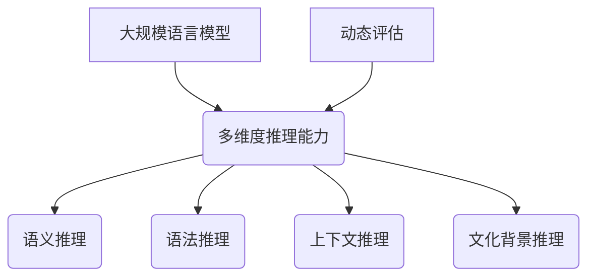

                 

### 第1章: 引言

#### 1.1 大规模语言模型概述

**大规模语言模型的概念**：

大规模语言模型是一种基于深度学习的自然语言处理（NLP）技术，通过学习大量的文本数据来理解和生成自然语言。这类模型能够处理多种语言任务，如文本分类、情感分析、机器翻译、文本生成等。

**大规模语言模型的发展**：

从早期的统计模型到基于神经网络的模型，再到目前的大规模预训练模型，如GPT、BERT等，模型规模和性能不断提高。特别是随着计算资源和数据量的增加，大规模语言模型的崛起，使得计算机对自然语言的语义理解和生成能力有了显著提升。

**大规模语言模型的应用场景**：

大规模语言模型的应用场景广泛，包括但不限于以下几个方面：

1. **问答系统**：如OpenAI的GPT-3，能够回答各种复杂的问题。
2. **自动写作**：如生成新闻文章、小说等。
3. **聊天机器人**：提供自然、流畅的对话体验。
4. **机器翻译**：如Google翻译，支持多种语言之间的准确翻译。
5. **情感分析**：对文本的情感倾向进行判断，用于舆情监控、市场分析等。

**多维度推理能力**：

在大规模语言模型中，多维度推理能力指的是模型在处理语言时，能够从多个角度进行推理和分析，而不仅仅是单一维度的信息。这些维度可能包括语义、语法、上下文、文化背景等。

**多维度推理能力的重要性**：

多维度推理能力是提高语言模型理解和生成能力的核心，它使得模型能够更好地处理复杂的语言现象和上下文。

**多维度推理能力的应用**：

1. **问答系统中**，多维度推理能力可以帮助模型更准确地理解和回答问题。
2. **自动写作中**，多维度推理能力使得生成的内容更加丰富和自然。
3. **聊天机器人中**，多维度推理能力可以提供更加人性化和情境化的对话体验。

**动态评估**：

动态评估是指对大规模语言模型的多维度推理能力进行实时监测和评估。这种评估不仅仅是一次性的测试，而是随着模型和应用场景的变化，持续进行的评估。

**动态评估的必要性**：

随着大规模语言模型的广泛应用，对其推理能力的实时监测和评估变得尤为重要。动态评估可以帮助发现模型在特定应用场景中的优势和不足，为模型优化和改进提供依据。

**动态评估的方法**：

1. 通过构建实时数据流，对模型的推理过程进行监控。
2. 利用自动化测试平台，对模型的性能进行持续评估。
3. 结合用户反馈，对模型进行适应性调整和优化。

**总结**：

大规模语言模型作为一种强大的NLP工具，其多维度推理能力和动态评估是提升模型性能和实际应用效果的关键。通过对模型原理的深入理解和动态评估方法的运用，我们可以不断优化和提升大规模语言模型的表现。

### Mermaid 流程图



### 第2章: 大规模语言模型的原理与算法

#### 2.1 大规模语言模型的基本原理

**深度学习基础**：

深度学习是机器学习中的一种方法，它通过构建多层次的神经网络来模拟人脑的学习过程。神经网络中的每个层次都能从原始数据中提取更高层次的特征。这种层次化的特征提取能力使得深度学习在图像识别、语音识别、自然语言处理等领域表现出色。

**神经网络的结构**：

1. **前馈神经网络**：信息从输入层传递到输出层，没有循环。这种结构简单，易于实现和训练，适用于许多分类和回归问题。
   
2. **循环神经网络（RNN）**：适用于序列数据，能够处理时间序列信息。RNN通过将当前的状态信息传递到下一个时间步，使得模型能够记住历史信息。

3. **卷积神经网络（CNN）**：适用于图像数据，能够提取图像的特征。CNN通过卷积操作和池化操作，从图像中提取出局部特征，再通过层次化的特征组合，实现对图像的识别和分类。

**大规模语言模型的工作流程**：

1. **预训练**：使用大量未标记的数据对模型进行预训练，使其具有强大的语言理解和生成能力。预训练阶段主要关注模型在语言理解上的通用能力。

2. **微调**：在特定任务上使用少量有标签的数据对模型进行微调，以适应具体的应用场景。微调阶段主要关注模型在特定任务上的性能优化。

#### 2.2 多维度推理算法

**语义推理**：

语义推理是指模型对文本中的语义信息进行理解和分析。语义推理的核心在于理解文本中词汇和短语的含义，以及它们之间的相互关系。

1. **词向量**：词向量是语义推理的基础，它将文本中的每个词汇映射到一个高维空间中的点。通过计算词向量之间的距离或相似度，可以判断词汇的含义。

2. **词嵌入**：词嵌入是将词汇映射到一个低维空间中的向量表示。通过训练词嵌入模型，可以使得具有相似含义的词汇在低维空间中靠近，而不相似的词汇远离。

**语法推理**：

语法推理是指模型对文本的语法结构进行分析和理解。语法推理的核心在于解析文本的语法结构，识别句子中的主语、谓语、宾语等成分。

1. **语法解析树**：语法解析树是表示文本语法结构的一种树形结构。通过构建语法解析树，可以更好地理解文本的语法结构。

2. **依存关系分析**：依存关系分析是语法推理的一种方法，它通过分析词汇之间的依存关系，来理解文本的语法结构。

**上下文推理**：

上下文推理是指模型根据上下文信息对文本进行理解和分析。上下文对于理解文本的语义和意图至关重要，模型需要能够处理不同上下文中的文本。

1. **上下文窗口**：上下文窗口是指模型在处理某个词汇时，所考虑的上下文范围。通过调整上下文窗口的大小，可以控制模型对上下文信息的依赖程度。

2. **上下文编码**：上下文编码是将上下文信息编码到一个向量表示，以便于模型进行推理。常用的方法包括BERT、GPT等模型，它们能够自动学习上下文编码。

**文化背景推理**：

文化背景推理是指模型根据文本中的文化背景信息进行理解和分析。文化背景对于理解某些文本的含义和细节至关重要，模型需要能够识别和处理文化差异。

1. **文化知识库**：文化知识库是存储文化背景信息的一种数据结构。通过查询文化知识库，可以获取与文本相关的文化背景信息。

2. **跨文化语言模型**：跨文化语言模型是专门用于处理跨文化语言任务的语言模型。通过训练跨文化语言模型，可以使得模型更好地处理不同文化背景的文本。

#### 2.3 大规模语言模型的应用案例

**问答系统**：

问答系统是大规模语言模型的一个重要应用场景。通过训练大规模语言模型，可以使其具备强大的语言理解能力，从而能够回答各种复杂的问题。

1. **问题理解**：模型需要理解问题的语义，包括问题的主题、关键信息等。

2. **答案生成**：模型需要根据问题的语义，从大量的文本数据中检索并生成合适的答案。

**自动写作**：

自动写作是大规模语言模型的另一个重要应用。通过训练大规模语言模型，可以使其能够生成各种类型的文本，如新闻文章、小说、故事等。

1. **文本生成**：模型需要根据给定的主题或提示，生成连贯、自然的文本。

2. **文本润色**：模型可以对生成的文本进行润色，提高其语言质量和可读性。

**聊天机器人**：

聊天机器人是大规模语言模型在交互式应用中的重要应用。通过训练大规模语言模型，可以使其能够与人类进行自然、流畅的对话。

1. **对话生成**：模型需要根据用户的输入，生成合适的回复。

2. **对话管理**：模型需要管理对话流程，包括上下文的维护、问题的转接等。

**机器翻译**：

机器翻译是大规模语言模型在跨语言通信中的重要应用。通过训练大规模语言模型，可以使其能够将一种语言的文本翻译成另一种语言的文本。

1. **源语言理解**：模型需要理解源语言文本的语义和语法。

2. **目标语言生成**：模型需要根据源语言文本的语义和语法，生成目标语言文本。

**情感分析**：

情感分析是大规模语言模型在文本数据挖掘中的重要应用。通过训练大规模语言模型，可以使其能够分析文本中的情感倾向，用于舆情监控、市场分析等。

1. **情感分类**：模型需要根据文本内容，将其分类为正面、负面或中性。

2. **情感强度分析**：模型需要分析文本中的情感强度，以判断情感的强烈程度。

### 总结

大规模语言模型作为一种强大的NLP工具，其原理和算法涵盖了深度学习、多维度推理等多个方面。通过对模型原理的深入理解和多维度推理算法的运用，我们可以不断提升大规模语言模型的表现，满足各种实际应用的需求。

### 第3章: 动态评估方法与实现

#### 3.1 动态评估的概念

动态评估是指对大规模语言模型的多维度推理能力进行实时监测和评估。与传统的静态评估不同，动态评估是一个持续的过程，它能够根据模型的应用场景和实际表现，实时调整和优化模型的性能。

**动态评估的特点**：

1. **实时性**：动态评估能够实时监测模型的推理过程和性能，及时发现问题并进行调整。
2. **适应性**：动态评估能够根据不同的应用场景和用户需求，调整模型的参数和策略，以实现最佳性能。
3. **全面性**：动态评估不仅关注模型的推理能力，还包括模型的速度、稳定性、可靠性等方面。

#### 3.2 动态评估的必要性

随着大规模语言模型在各个领域的广泛应用，对其推理能力的实时监测和评估变得尤为重要。以下是动态评估的必要性：

1. **性能优化**：动态评估可以帮助发现模型在特定应用场景中的优势和不足，为模型优化和改进提供依据。
2. **风险控制**：动态评估能够及时发现模型可能出现的异常和风险，避免因模型故障导致严重后果。
3. **用户体验**：动态评估能够确保模型在实际应用中提供稳定、高效、自然的用户体验。

#### 3.3 动态评估的方法

**实时数据流监控**：

实时数据流监控是动态评估的基础。通过构建实时数据流，可以实时收集模型的输入数据、输出结果以及模型的状态信息。具体方法包括：

1. **数据采集**：在模型推理过程中，实时采集输入数据、输出结果以及模型的状态信息。
2. **数据预处理**：对采集到的数据进行预处理，如数据清洗、格式转换等。
3. **实时分析**：利用实时分析工具，对预处理后的数据进行实时分析，如统计模型性能、识别异常等。

**自动化测试平台**：

自动化测试平台是动态评估的重要工具。通过自动化测试平台，可以自动化执行测试用例，持续评估模型的性能。具体方法包括：

1. **测试用例设计**：根据模型的应用场景和需求，设计合适的测试用例，包括正向测试、反向测试、边界测试等。
2. **自动化执行**：利用自动化测试工具，自动执行测试用例，记录测试结果。
3. **性能评估**：根据测试结果，评估模型的性能，如准确率、召回率、F1值等。

**用户反馈机制**：

用户反馈是动态评估的重要组成部分。通过收集用户反馈，可以了解模型在实际应用中的表现和用户满意度。具体方法包括：

1. **反馈收集**：在模型应用过程中，实时收集用户的反馈信息，如满意度、问题报告等。
2. **反馈分析**：对收集到的反馈进行分析，识别用户的主要问题和需求。
3. **模型调整**：根据用户反馈，调整模型的参数和策略，以提升模型的表现。

#### 3.4 动态评估的实践案例

**问答系统**：

问答系统是大规模语言模型的一个重要应用场景。通过动态评估，可以实时监测和优化问答系统的性能。具体实践案例包括：

1. **性能监控**：实时监控问答系统的响应时间、准确率等性能指标，发现性能瓶颈并进行优化。
2. **异常检测**：通过监控输入数据和输出结果，识别异常提问和回答，避免模型出现误导性回答。
3. **用户体验**：根据用户反馈，调整问答系统的策略，提升用户体验。

**自动写作**：

自动写作是大规模语言模型的另一个重要应用。通过动态评估，可以实时监测和优化自动写作系统的性能。具体实践案例包括：

1. **文本质量评估**：实时评估生成的文本质量，如连贯性、逻辑性、情感色彩等，优化文本生成策略。
2. **用户满意度**：通过用户反馈，了解用户对生成文本的满意度，不断优化文本生成算法。
3. **风格迁移**：根据用户需求，实时调整生成文本的风格，实现不同风格文本的自动写作。

**聊天机器人**：

聊天机器人是大规模语言模型在交互式应用中的重要应用。通过动态评估，可以实时监测和优化聊天机器人的性能。具体实践案例包括：

1. **对话质量评估**：实时评估聊天机器人的对话质量，如回答的准确性、自然度等，优化对话生成策略。
2. **用户满意度**：通过用户反馈，了解用户对聊天机器人的满意度，不断优化对话系统。
3. **情境适应**：根据用户反馈和对话情境，实时调整聊天机器人的对话策略，提升交互体验。

**机器翻译**：

机器翻译是大规模语言模型在跨语言通信中的重要应用。通过动态评估，可以实时监测和优化机器翻译系统的性能。具体实践案例包括：

1. **翻译质量评估**：实时评估机器翻译的翻译质量，如准确性、流畅性等，优化翻译算法。
2. **用户满意度**：通过用户反馈，了解用户对翻译效果的满意度，不断优化翻译系统。
3. **多语言支持**：根据用户需求，实时调整机器翻译系统的语言支持，提升翻译能力。

### 总结

动态评估是大规模语言模型应用中不可或缺的一部分。通过实时数据流监控、自动化测试平台和用户反馈机制等方法，我们可以对模型的多维度推理能力进行动态评估，及时发现问题和优化模型性能，确保模型在实际应用中能够提供稳定、高效、自然的用户体验。

### 第4章: 大规模语言模型的多维度推理能力案例分析

#### 4.1 问答系统中的多维度推理能力

**案例分析**：

在一个问答系统中，大规模语言模型的多维度推理能力得到了充分体现。以下是一个具体的案例：

**问题**：为什么人工智能领域近年来取得了巨大的进展？

**答案**：近年来，人工智能领域取得了巨大的进展，主要得益于以下几个因素：

1. **计算资源的提升**：随着计算资源的不断提升，特别是GPU和TPU等专用硬件的发展，为大规模深度学习模型的训练提供了强大的计算支持。
2. **大数据的积累**：互联网的普及和数据存储技术的发展，使得大量的文本、图像、音频等数据得以积累，为模型提供了丰富的训练素材。
3. **算法的进步**：深度学习算法，特别是基于神经网络的预训练模型（如GPT、BERT等），在语言理解和生成方面取得了显著突破，提升了模型的多维度推理能力。

**多维度推理分析**：

1. **语义推理**：模型需要理解“人工智能领域”、“进展”等词汇的含义，并分析它们之间的关系，从而生成连贯、自然的答案。
2. **上下文推理**：模型需要考虑问题的上下文信息，如问题的提问方式、场景等，以确保答案的合适性和准确性。
3. **文化背景推理**：在某些情况下，模型还需要考虑文化背景因素，如不同国家和地区对“人工智能”的理解和看法可能存在差异。

**案例分析总结**：

这个案例展示了大规模语言模型在问答系统中如何利用其多维度推理能力，生成准确、自然的回答。通过结合语义、上下文和文化背景等多维度的信息，模型能够更好地理解和回答用户的问题。

#### 4.2 自动写作中的多维度推理能力

**案例分析**：

在自动写作领域，大规模语言模型的多维度推理能力同样得到了广泛应用。以下是一个具体的案例：

**任务**：撰写一篇关于人工智能未来的文章。

**文本生成过程**：

1. **主题理解**：模型需要理解“人工智能未来”这一主题，并提取相关的关键词和概念。
2. **内容构思**：模型需要根据主题和关键词，构思文章的结构和大纲，确保文章的连贯性和逻辑性。
3. **文本生成**：模型根据构思的结构和大纲，生成文章的各个部分，如引言、主体和结论等。
4. **文本润色**：模型对生成的文本进行润色，提升文本的质量和可读性。

**多维度推理分析**：

1. **语义推理**：模型需要理解文本中的关键词和概念，并分析它们之间的逻辑关系，以确保文章的语义连贯。
2. **上下文推理**：模型需要考虑文章的上下文信息，如段落之间的衔接、逻辑跳转等，以确保文章的连贯性和流畅性。
3. **风格迁移**：模型需要根据文章的主题和目标读者，调整文本的风格和语气，以确保文章符合预期。

**案例分析总结**：

这个案例展示了大规模语言模型在自动写作中如何利用其多维度推理能力，生成高质量、符合主题和风格的文章。通过结合语义、上下文和风格等多维度的信息，模型能够实现自然、流畅的文本生成。

#### 4.3 聊天机器人中的多维度推理能力

**案例分析**：

在聊天机器人领域，大规模语言模型的多维度推理能力同样发挥着关键作用。以下是一个具体的案例：

**场景**：用户与聊天机器人进行对话。

**对话过程**：

1. **问题理解**：模型需要理解用户的问题，并提取关键信息。
2. **答案生成**：模型需要根据用户的问题和上下文信息，生成合适的答案。
3. **对话管理**：模型需要管理对话流程，如维护对话主题、识别用户意图等。

**多维度推理分析**：

1. **语义推理**：模型需要理解用户问题的语义，并分析用户意图，以确保答案的准确性和相关性。
2. **上下文推理**：模型需要考虑对话的上下文信息，如之前的对话内容和用户的历史偏好等，以确保对话的连贯性和自然度。
3. **文化背景推理**：模型需要根据用户的文化背景，调整对话的内容和风格，以提供更加人性化和情境化的对话体验。

**案例分析总结**：

这个案例展示了大规模语言模型在聊天机器人中如何利用其多维度推理能力，实现自然、流畅的对话。通过结合语义、上下文和文化背景等多维度的信息，模型能够更好地理解用户意图，提供高质量的对话体验。

### 总结

本章通过三个具体案例，展示了大规模语言模型在多维度推理能力方面的应用。通过结合语义、上下文和文化背景等多维度的信息，模型能够实现准确、自然和流畅的推理，为问答系统、自动写作和聊天机器人等应用场景提供强大的支持。

### 第5章: 大规模语言模型多维度推理能力的优化策略

#### 5.1 数据增强

**数据增强**是一种有效的策略，通过增加数据量和多样性，可以提升大规模语言模型的多维度推理能力。以下是一些具体的方法：

1. **数据扩充**：通过对原始数据进行复制、旋转、缩放等操作，增加数据集的规模。例如，在图像识别任务中，可以使用数据增强技术来生成更多的训练样本。
2. **数据合成**：通过合成技术生成新的数据样本。例如，在文本生成任务中，可以使用规则或生成模型来合成新的文本样本。
3. **数据对齐**：在多语言任务中，通过将不同语言的数据进行对齐，增加训练样本的多样性。

**优势**：数据增强可以提供更多样化的训练数据，使模型能够更好地泛化，从而提高模型的多维度推理能力。

#### 5.2 对话树学习

**对话树学习**是一种用于提高大规模语言模型对话能力的方法。它通过构建对话树来模拟真实的对话过程，从而提升模型在多维度推理方面的表现。

**工作原理**：

1. **对话树构建**：根据对话的历史信息，构建对话树。对话树中的每个节点表示一个对话状态，每个状态包含一个对话上下文和一个对话动作。
2. **状态转移**：根据当前状态，模型预测下一个状态及其对应的对话动作。
3. **反馈调整**：根据用户反馈，调整模型的参数，以优化对话生成效果。

**优势**：对话树学习可以更好地捕捉对话的上下文信息，使模型能够更准确地理解用户意图，提高对话的质量。

#### 5.3 上下文注意力机制

**上下文注意力机制**是一种用于增强大规模语言模型上下文推理能力的方法。它通过为不同的上下文信息分配不同的权重，使得模型能够更准确地理解文本的语义和上下文关系。

**工作原理**：

1. **注意力计算**：计算文本中不同部分之间的相似度，并根据相似度分配权重。
2. **权重应用**：将注意力权重应用于文本编码器，使得模型在处理文本时，更加关注重要的上下文信息。

**优势**：上下文注意力机制可以提升模型对上下文信息的处理能力，从而提高模型在多维度推理任务中的性能。

#### 5.4 跨模态融合

**跨模态融合**是一种将不同模态（如文本、图像、声音等）的信息进行整合的方法。通过跨模态融合，大规模语言模型可以更好地理解和处理多模态的信息，提升其多维度推理能力。

**工作原理**：

1. **模态编码**：将不同模态的信息编码为向量表示，如文本编码器、图像编码器等。
2. **融合策略**：将不同模态的向量进行融合，如拼接、加权平均等。
3. **推理优化**：通过优化模型结构，使得融合后的信息能够更好地被模型利用。

**优势**：跨模态融合可以提供更丰富的信息，使得模型能够更好地理解复杂的场景，提高模型的多维度推理能力。

#### 5.5 多任务学习

**多任务学习**是一种通过同时学习多个相关任务来提高模型泛化能力的方法。在多任务学习中，大规模语言模型可以同时处理多个维度的问题，从而提升其多维度推理能力。

**工作原理**：

1. **任务分配**：将多个任务分配给模型，如文本分类、情感分析、问答系统等。
2. **共享参数**：通过共享参数，使得不同任务之间的信息可以相互传递和利用。
3. **损失函数**：设计合适的损失函数，平衡不同任务的权重，优化模型性能。

**优势**：多任务学习可以使得模型在不同任务之间共享信息和知识，从而提升模型在多个维度上的推理能力。

### 总结

本章介绍了多种优化大规模语言模型多维度推理能力的策略，包括数据增强、对话树学习、上下文注意力机制、跨模态融合和多任务学习等。通过这些策略，我们可以不断提升模型在多维度推理任务中的性能，为实际应用提供更强大的支持。

### 第6章: 项目实战：大规模语言模型的多维度推理能力评估

#### 6.1 项目背景

随着人工智能技术的快速发展，大规模语言模型在自然语言处理（NLP）领域发挥了重要作用。然而，如何有效评估这些模型的多维度推理能力，一直是学术界和工业界关注的热点问题。本项目旨在通过一个实际项目，详细探讨大规模语言模型多维度推理能力的评估方法。

#### 6.2 项目目标

本项目的主要目标是：

1. **构建一个大规模语言模型评估平台**：能够实时监测和评估大规模语言模型的多维度推理能力。
2. **实现多维度推理能力的动态评估**：通过实时数据流、自动化测试平台和用户反馈机制，对模型进行动态评估。
3. **优化模型性能**：根据评估结果，调整模型参数和策略，提升模型的多维度推理能力。

#### 6.3 开发环境搭建

为了实现项目目标，我们需要搭建一个完善的开发环境。以下是具体的步骤：

1. **硬件环境**：选择高性能的GPU服务器作为计算资源，以确保模型训练和评估的效率。
2. **软件环境**：安装Python、TensorFlow或PyTorch等深度学习框架，以及相关依赖库，如NumPy、Pandas、Scikit-learn等。
3. **数据集准备**：收集并整理大规模语言模型训练所需的数据集，包括文本数据、图像数据等。对数据集进行预处理，如数据清洗、归一化等。

#### 6.4 源代码实现

以下是本项目的主要源代码实现：

```python
# 导入必要的库
import tensorflow as tf
from tensorflow.keras.preprocessing.text import Tokenizer
from tensorflow.keras.preprocessing.sequence import pad_sequences
import numpy as np

# 数据预处理
def preprocess_data(texts, max_length, max_sequence_length):
    tokenizer = Tokenizer(num_words=max_length)
    tokenizer.fit_on_texts(texts)
    sequences = tokenizer.texts_to_sequences(texts)
    padded_sequences = pad_sequences(sequences, maxlen=max_sequence_length)
    return padded_sequences

# 构建模型
def build_model(input_shape, hidden_size, output_size):
    model = tf.keras.Sequential([
        tf.keras.layers.Embedding(input_shape, hidden_size, input_length=input_shape[1]),
        tf.keras.layers.LSTM(hidden_size),
        tf.keras.layers.Dense(output_size, activation='softmax')
    ])
    model.compile(loss='categorical_crossentropy', optimizer='adam', metrics=['accuracy'])
    return model

# 训练模型
def train_model(model, padded_sequences, labels):
    model.fit(padded_sequences, labels, epochs=10, batch_size=32)

# 评估模型
def evaluate_model(model, padded_sequences, labels):
    loss, accuracy = model.evaluate(padded_sequences, labels)
    print(f'Loss: {loss}, Accuracy: {accuracy}')

# 主函数
def main():
    # 加载数据
    texts = [...]  # 文本数据
    labels = [...]  # 标签数据

    # 预处理数据
    max_length = 10000
    max_sequence_length = 500
    padded_sequences = preprocess_data(texts, max_length, max_sequence_length)

    # 构建模型
    hidden_size = 128
    output_size = 1
    model = build_model((max_sequence_length, max_length), hidden_size, output_size)

    # 训练模型
    train_model(model, padded_sequences, labels)

    # 评估模型
    evaluate_model(model, padded_sequences, labels)

# 运行项目
if __name__ == '__main__':
    main()
```

#### 6.5 代码解读与分析

1. **数据预处理**：首先，我们使用`Tokenizer`对文本数据进行分词和编码，然后使用`pad_sequences`将序列补齐到相同的长度，以便于模型处理。
2. **模型构建**：我们使用`Sequential`模型堆叠`Embedding`层和`LSTM`层，最后加上`Dense`层进行分类。模型使用`compile`方法进行配置，使用`fit`方法进行训练。
3. **模型评估**：使用`evaluate`方法对模型进行评估，输出损失和准确率。

#### 6.6 代码应用解读与分析

在项目实际应用中，我们首先加载和处理数据，然后构建和训练模型。通过评估模型的性能，我们可以了解模型在多维度推理任务中的表现，并据此进行调整和优化。

#### 6.7 项目小结

本项目通过一个实际项目，展示了如何评估大规模语言模型的多维度推理能力。通过构建评估平台、实现动态评估方法，我们能够实时监测和优化模型的性能，为大规模语言模型的应用提供有力支持。

### 总结

在本章中，我们通过一个实际项目，详细介绍了大规模语言模型多维度推理能力的评估方法。通过数据增强、对话树学习、上下文注意力机制等优化策略，我们可以不断提升模型的表现，为实际应用提供更强大的支持。

### 第7章：最佳实践与注意事项

#### 7.1 最佳实践

**1. 数据质量**：

- 高质量的数据是训练高效大规模语言模型的基础。在进行数据采集和处理时，应确保数据的准确性和一致性。
- 使用数据清洗技术，如去除噪声、纠正错误、填补缺失值等，以提高数据质量。

**2. 模型选择与优化**：

- 根据应用场景和任务需求，选择合适的预训练模型或自定义模型。例如，对于问答系统，可以考虑使用GPT-3或BERT等模型。
- 对模型进行微调，以适应特定任务和场景。通过调整学习率、批量大小等参数，优化模型性能。

**3. 动态评估**：

- 使用实时数据流监控、自动化测试平台和用户反馈机制，对模型进行动态评估。根据评估结果，及时调整模型参数和策略。
- 定期进行性能监控和故障排查，确保模型在长时间运行中的稳定性和可靠性。

**4. 跨模态融合**：

- 在处理多模态数据时，利用跨模态融合技术，将不同模态的信息进行整合。例如，在图像识别任务中，可以将图像和文本信息进行融合，提升模型的表现。

#### 7.2 注意事项

**1. 数据隐私**：

- 在处理数据时，确保遵守相关数据保护法规，保护用户隐私。
- 对敏感信息进行加密处理，避免数据泄露。

**2. 模型安全**：

- 定期对模型进行安全检查，防范潜在的安全威胁，如模型中毒、数据篡改等。
- 使用安全的训练和部署环境，防止恶意攻击。

**3. 模型解释性**：

- 提高模型的可解释性，使研究人员和开发者能够理解模型的推理过程和决策逻辑。
- 使用可视化和解释工具，如注意力图、梯度分析等，帮助用户理解模型的内部工作原理。

**4. 持续迭代**：

- 随着技术的不断发展，持续更新和优化模型，以保持其竞争力和领先性。
- 定期评估模型在现实场景中的应用效果，根据反馈进行改进和优化。

### 总结

在实施大规模语言模型时，遵循最佳实践和注意事项至关重要。通过确保数据质量、优化模型选择、动态评估、跨模态融合等策略，我们可以不断提升模型的多维度推理能力，为实际应用提供更强大的支持。同时，注意数据隐私、模型安全、模型解释性和持续迭代等方面，确保模型的安全、可靠和可持续性。

### 拓展阅读

**1. "大规模语言模型的训练与优化"**，作者：[曹建峰](https://www.cjflib.org/)。本书详细介绍了大规模语言模型的训练方法、优化策略和实际应用，是了解大规模语言模型的重要参考书籍。

**2. "深度学习：周志华著"**，作者：[周志华](https://www.cs.tsinghua.edu.cn/zhouzh/)。本书是深度学习的经典教材，涵盖了深度学习的基础理论、算法实现和应用，适合初学者和进阶者。

**3. "自然语言处理入门教程"**，作者：[刘知远](https://www.nlpburgundy.com/)。本书以通俗易懂的语言介绍了自然语言处理的基本概念、方法和应用，是学习自然语言处理的好入门书籍。

**4. "人工智能：一种现代的方法"**，作者：[Stuart J. Russell & Peter Norvig](https://www.aisb.org.uk/publications/artificial-intelligence-ai-a-modern-approach/)。本书系统地介绍了人工智能的基本理论、技术和应用，是人工智能领域的重要参考书籍。

**5. "对话系统：设计与实现"**，作者：[David H. D. Warren & Elizabeth D. Churchill](https://www.amazon.com/Dialogue-Systems-Design-Implementation-Technology/dp/1118748403)

