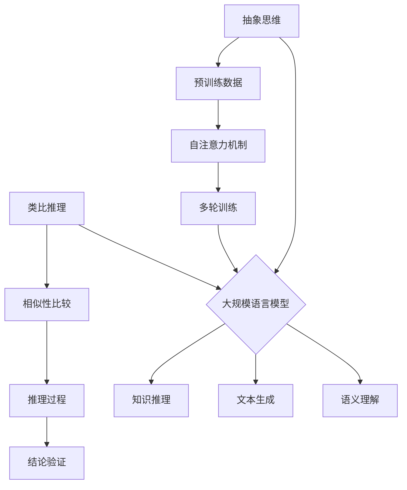

                 

# 大规模语言模型的抽象思维与类比推理能力

## 关键词
- 大规模语言模型
- 抽象思维
- 类比推理
- 人工智能
- 自然语言处理

## 摘要
本文将深入探讨大规模语言模型在抽象思维与类比推理方面的能力。首先，我们概述了大规模语言模型的发展历程及其基本原理。接着，我们详细介绍了抽象思维与类比推理的概念及其在人工智能领域的重要性。随后，本文通过具体的算法原理、数学模型和Python代码实例，分析了大规模语言模型如何实现抽象思维与类比推理。此外，本文还通过案例研究，展示了这些能力在实际应用中的效果。最后，我们对未来发展趋势和挑战进行了总结，并提出了对学术研究与实际应用的启示。

# 第一部分：引言

## 1.1 大规模语言模型概述

### 1.1.1 大规模语言模型的发展历程

大规模语言模型的发展历程可以追溯到上世纪80年代的统计语言模型。最初，这些模型主要基于词频统计，如N-gram模型，它们在特定领域内表现出了一定的效果。然而，随着数据规模的增加和计算能力的提升，这些模型逐渐演化为更加复杂的模型，如基于神经网络的语言模型。

1995年，Rumelhart等人提出了长短期记忆网络（LSTM），这使得处理长序列数据成为可能。随后，Google在2018年推出了BERT模型，这是基于Transformer架构的语言模型，它在许多自然语言处理任务上达到了前所未有的效果。

近年来，随着深度学习技术的进步，大规模语言模型的发展进入了一个全新的阶段。GPT-3、T5、BERT等模型在文本生成、语义理解、问题回答等任务上取得了显著的突破。

### 1.1.2 大规模语言模型的基本原理

大规模语言模型的核心是神经网络，尤其是深度学习中的变换器（Transformer）架构。Transformer模型通过自注意力机制（Self-Attention）和多头注意力（Multi-Head Attention）实现了对输入文本的全面理解。

在训练过程中，大规模语言模型通过大量文本数据进行预训练，学习语言的基本规律和结构。在微调阶段，模型可以根据具体任务进行进一步优化，如文本分类、命名实体识别等。

### 1.1.3 大规模语言模型的应用场景

大规模语言模型在多个领域得到了广泛应用，包括但不限于：

- **文本生成**：如自动写作、机器翻译、对话系统等。
- **语义理解**：如情感分析、文本分类、问答系统等。
- **知识推理**：如常识推理、逻辑推理等。

## 1.2 抽象思维与类比推理概述

### 1.2.1 抽象思维的定义与特点

抽象思维是指从具体的情境中提取出一般性的规律和概念，从而形成更高层次的认知和理解。抽象思维具有以下几个特点：

- **一般性**：通过抽象思维，可以从具体的实例中提取出通用的规律。
- **概括性**：能够将复杂的情境简化为几个关键要素。
- **独立性**：不受具体情境的限制，能够在不同情境中应用。

### 1.2.2 类比推理的定义与特点

类比推理是指通过比较两个或多个相似情境，从中推断出可能的规律或结论。类比推理具有以下几个特点：

- **相似性**：通过寻找相似情境，类比推理能够发现潜在的规律。
- **推理性**：基于相似性，类比推理能够推断出新的结论。
- **迁移性**：类比推理的结果可以应用于新的情境。

### 1.2.3 抽象思维与类比推理的关系

抽象思维与类比推理之间存在密切的联系。抽象思维提供了对情境的一般性理解和概括，而类比推理则利用这种理解来推断新的结论。具体来说，抽象思维为类比推理提供了基础，而类比推理则是对抽象思维的应用和扩展。

## 1.3 大规模语言模型在抽象思维与类比推理中的应用

大规模语言模型在抽象思维和类比推理方面展现了巨大的潜力。首先，通过预训练，大规模语言模型能够从大量的文本数据中提取出一般性的规律和概念，从而实现抽象思维。其次，基于自注意力机制和多头注意力机制，大规模语言模型能够对输入文本进行全面的解析和比较，从而实现类比推理。

在实际应用中，大规模语言模型已经展示了其在抽象思维和类比推理方面的能力。例如，在文本生成任务中，模型能够根据上下文生成连贯的文本；在问题回答任务中，模型能够根据问题与文本之间的相似性，提供准确的答案。这些应用都离不开大规模语言模型的抽象思维和类比推理能力。

## 2.1 抽象思维的概念与原理

### 2.1.1 抽象思维的定义

抽象思维是一种认知过程，它涉及从具体情境中提取出一般性的规律和概念。这种过程通常包括以下几个步骤：

1. **观察**：通过观察具体情境，获取必要的信息。
2. **提取**：从观察到的信息中，提取出关键特征和规律。
3. **概括**：将提取出的特征和规律进行概括，形成一般性的概念。

### 2.1.2 抽象思维的过程

抽象思维的过程可以分解为以下几个阶段：

1. **识别**：识别出具体的情境，确定需要解决的问题。
2. **提取**：从情境中提取出关键的信息和特征。
3. **抽象**：对提取出的信息和特征进行抽象，形成一般性的规律。
4. **应用**：将抽象出的规律应用于新的情境中。

### 2.1.3 抽象思维的特点

抽象思维具有以下几个特点：

1. **一般性**：能够从具体的情境中提取出通用的规律和概念。
2. **概括性**：能够将复杂的情境简化为几个关键要素。
3. **独立性**：不受具体情境的限制，能够在不同情境中应用。

## 2.2 大规模语言模型的抽象思维能力

### 2.2.1 大规模语言模型的抽象思维原理

大规模语言模型的抽象思维能力主要来自于其深度学习机制和预训练过程。通过预训练，大规模语言模型能够在大量文本数据中自动提取出一般性的语言规律和概念。这个过程包括以下几个步骤：

1. **数据预处理**：将文本数据转换为模型可处理的格式。
2. **预训练**：使用大量文本数据进行预训练，学习语言的基本规律。
3. **微调**：在特定任务上对模型进行微调，提高其在特定任务上的表现。

### 2.2.2 大规模语言模型在抽象思维中的优势

大规模语言模型在抽象思维中的优势主要表现在以下几个方面：

1. **强大的文本处理能力**：能够处理大量、复杂的文本数据，提取出关键的信息和特征。
2. **自动化的抽象过程**：通过预训练，自动提取出一般性的语言规律和概念，无需人工干预。
3. **跨领域的应用能力**：能够在不同领域和任务中应用，提供一致的性能。

### 2.2.3 大规模语言模型在抽象思维中的应用实例

大规模语言模型在抽象思维中的应用非常广泛，以下是一些实例：

1. **文本生成**：通过抽象思维，模型能够生成连贯、有意义的文本。
2. **语义理解**：通过抽象思维，模型能够理解文本中的语义信息，进行情感分析、文本分类等任务。
3. **知识推理**：通过抽象思维，模型能够从文本中提取出关键信息，进行逻辑推理和知识表示。

## 2.3 抽象思维在语言模型中的应用

### 2.3.1 抽象思维与语言生成

在语言生成任务中，抽象思维起到了至关重要的作用。通过抽象思维，大规模语言模型能够理解输入文本的语义信息，并生成与之相关的连贯文本。这个过程包括以下几个步骤：

1. **输入处理**：将输入文本转换为模型可处理的格式。
2. **语义提取**：通过抽象思维，提取出输入文本的语义信息。
3. **文本生成**：根据提取出的语义信息，生成连贯、有意义的文本。

### 2.3.2 抽象思维与语义理解

在语义理解任务中，抽象思维同样非常重要。通过抽象思维，大规模语言模型能够理解输入文本的语义信息，并对其进行分类、情感分析等操作。这个过程包括以下几个步骤：

1. **输入处理**：将输入文本转换为模型可处理的格式。
2. **语义提取**：通过抽象思维，提取出输入文本的语义信息。
3. **任务处理**：根据提取出的语义信息，进行具体的语义理解任务。

### 2.3.3 抽象思维与知识推理

在知识推理任务中，抽象思维同样扮演着关键角色。通过抽象思维，大规模语言模型能够从文本中提取出关键信息，进行逻辑推理和知识表示。这个过程包括以下几个步骤：

1. **输入处理**：将输入文本转换为模型可处理的格式。
2. **知识提取**：通过抽象思维，提取出输入文本中的知识信息。
3. **推理过程**：根据提取出的知识信息，进行逻辑推理和知识表示。

## 3.1 类比推理的概念与原理

### 3.1.1 类比推理的定义

类比推理是一种基于相似性的推理方法，它通过比较两个或多个相似情境，从中推断出可能的规律或结论。类比推理通常包括以下几个步骤：

1. **识别**：识别出需要解决的问题。
2. **比较**：比较待解决问题的情境与其他相似情境。
3. **推理**：基于相似性，推断出可能的规律或结论。
4. **验证**：验证推断出的结论是否适用于待解决问题的情境。

### 3.1.2 类比推理的过程

类比推理的过程可以分解为以下几个阶段：

1. **识别相似性**：通过比较，识别出两个或多个情境之间的相似性。
2. **提取规律**：基于相似性，提取出潜在的规律或模式。
3. **推断结论**：根据提取出的规律或模式，推断出可能的结论。
4. **验证结论**：验证推断出的结论是否适用于待解决问题的情境。

### 3.1.3 类比推理的特点

类比推理具有以下几个特点：

1. **相似性**：基于相似性进行推理，这是类比推理的核心。
2. **推理性**：通过比较相似情境，类比推理能够推断出新的结论。
3. **迁移性**：类比推理的结果可以应用于新的情境。

## 3.2 大规模语言模型的类比推理能力

### 3.2.1 大规模语言模型的类比推理原理

大规模语言模型的类比推理能力主要来自于其自注意力机制和多头注意力机制。这些机制使得模型能够对输入文本进行全面的解析和比较，从而实现类比推理。具体来说，这个过程包括以下几个步骤：

1. **输入处理**：将输入文本转换为模型可处理的格式。
2. **文本解析**：通过自注意力机制，对输入文本进行全面的解析。
3. **相似性比较**：通过多头注意力机制，比较输入文本与其他文本的相似性。
4. **推断结论**：基于相似性比较，推断出可能的结论。

### 3.2.2 大规模语言模型在类比推理中的优势

大规模语言模型在类比推理中的优势主要表现在以下几个方面：

1. **全面的文本解析**：通过自注意力机制，模型能够对输入文本进行全面的解析，提取出关键信息。
2. **高效的相似性比较**：通过多头注意力机制，模型能够高效地比较输入文本与其他文本的相似性。
3. **跨领域的应用能力**：能够在不同领域和任务中应用，提供一致的性能。

### 3.2.3 大规模语言模型在类比推理中的应用实例

大规模语言模型在类比推理中的应用非常广泛，以下是一些实例：

1. **问题回答**：通过类比推理，模型能够根据问题的上下文，提供准确的答案。
2. **文本分类**：通过类比推理，模型能够根据文本的相似性，将其归类到相应的类别。
3. **常识推理**：通过类比推理，模型能够根据已知的事实，推断出新的结论。

## 3.3 类比推理在语言模型中的应用

### 3.3.1 类比推理与问题解决

在问题解决任务中，类比推理扮演着重要的角色。通过类比推理，大规模语言模型能够根据问题的上下文，从已有的知识中找到相关的解决方案。这个过程包括以下几个步骤：

1. **问题识别**：识别出需要解决的问题。
2. **知识检索**：通过类比推理，从已有的知识中检索出相关的解决方案。
3. **问题解决**：根据检索出的解决方案，解决问题。

### 3.3.2 类比推理与创意生成

在创意生成任务中，类比推理同样非常重要。通过类比推理，大规模语言模型能够从不同的情境中提取出创意元素，并进行创新组合，生成新的创意。这个过程包括以下几个步骤：

1. **创意元素提取**：通过类比推理，从不同的情境中提取出创意元素。
2. **创意组合**：将提取出的创意元素进行组合，生成新的创意。

### 3.3.3 类比推理与语言学习

在语言学习任务中，类比推理可以帮助学习者理解新的语言规则和用法。通过类比推理，学习者能够将已有的语言知识应用到新的情境中，从而加深对语言的理解。这个过程包括以下几个步骤：

1. **语言知识提取**：通过类比推理，从已有的语言知识中提取出关键信息。
2. **情境应用**：将提取出的语言知识应用到新的情境中。
3. **语言理解**：通过应用，加深对语言的理解。

## 4.1 抽象思维案例分析

### 4.1.1 案例一：语义理解与知识推理

在语义理解与知识推理任务中，抽象思维起到了至关重要的作用。以下是一个具体的案例：

**问题**：理解并回答以下问题：“地球绕太阳旋转，那么为什么我们感觉不到地球在动？”

**解答**：

1. **输入处理**：将问题转换为模型可处理的格式。
2. **语义提取**：通过抽象思维，提取出问题的关键信息，如“地球绕太阳旋转”，“感觉不到地球在动”。
3. **知识提取**：从已有知识中提取出关于地球绕太阳旋转的原理，如地球的自转和公转。
4. **推理过程**：根据提取出的知识和信息，推理出地球绕太阳旋转，但由于地球的自转和惯性，我们感觉不到地球在动。

### 4.1.2 案例二：文本生成与摘要

在文本生成与摘要任务中，抽象思维同样非常重要。以下是一个具体的案例：

**问题**：根据以下文本生成摘要：“美国宇航局（NASA）宣布，他们计划在未来十年内将人类送往火星。这一计划旨在实现人类对火星的探索，并寻找适合人类居住的环境。”

**摘要**：NASA计划在未来十年内将人类送往火星，以探索火星并寻找适合人类居住的环境。

**解答**：

1. **输入处理**：将文本转换为模型可处理的格式。
2. **语义提取**：通过抽象思维，提取出文本的关键信息，如“NASA”，“火星”，“探索”，“寻找适合人类居住的环境”。
3. **摘要生成**：根据提取出的语义信息，生成简洁、连贯的摘要。

### 4.1.3 案例三：智能对话系统

在智能对话系统中，抽象思维使得模型能够理解用户的意图，并提供恰当的回复。以下是一个具体的案例：

**问题**：用户提问：“明天天气怎么样？”

**回复**：根据明天的天气预报，预计明天将会是晴天，温度在15°C到25°C之间。

**解答**：

1. **输入处理**：将用户的提问转换为模型可处理的格式。
2. **语义提取**：通过抽象思维，提取出问题的关键信息，如“明天天气”，“晴天”，“温度”。
3. **信息查询**：从数据库中查询明天的天气预报信息。
4. **回复生成**：根据查询到的信息，生成恰当的回复。

## 4.2 类比推理案例分析

### 4.2.1 案例一：问题解决与创意生成

在问题解决与创意生成任务中，类比推理起到了关键作用。以下是一个具体的案例：

**问题**：设计一个能够自动清洁地面的机器人。

**解决方案**：

1. **问题识别**：识别出需要解决的问题，即设计一个能够自动清洁地面的机器人。
2. **知识检索**：通过类比推理，从已有的机器人设计中检索出相关的解决方案，如自动清洁机器人。
3. **创意生成**：将检索出的解决方案进行创新组合，设计出一个能够自动清洁地面的机器人。

### 4.2.2 案例二：语言学习与语言生成

在语言学习与语言生成任务中，类比推理同样非常重要。以下是一个具体的案例：

**问题**：学习并生成一句英语句子。

**解决方案**：

1. **语言知识提取**：通过类比推理，从已知的英语语法规则和常用表达中提取出关键信息。
2. **情境应用**：将提取出的语言知识应用到具体的情境中，如描述天气。
3. **句子生成**：根据提取出的语言知识和情境，生成一句英语句子。

### 4.2.3 案例三：智能写作与翻译

在智能写作与翻译任务中，类比推理使得模型能够理解并生成高质量的文本。以下是一个具体的案例：

**问题**：将一句中文句子翻译成英文。

**解决方案**：

1. **语言知识提取**：通过类比推理，从已知的中文和英文语法规则以及常用表达中提取出关键信息。
2. **翻译过程**：根据提取出的语言知识和规则，进行中文到英文的翻译。
3. **文本生成**：生成一句符合英文语法和表达习惯的句子。

## 第五部分：结论

大规模语言模型在抽象思维与类比推理方面展现了强大的能力。通过深度学习和预训练，模型能够从大量文本数据中提取出一般性的规律和概念，实现抽象思维。同时，通过自注意力机制和多头注意力机制，模型能够对输入文本进行全面的解析和比较，实现类比推理。

未来，随着人工智能技术的不断进步，大规模语言模型在抽象思维与类比推理方面的能力有望进一步提升。同时，如何更好地利用这些能力解决实际问题，仍是一个值得深入研究的课题。

## 5.1 大规模语言模型的抽象思维与类比推理能力总结

- **抽象思维能力**：大规模语言模型通过深度学习和预训练，能够从大量文本数据中提取出一般性的规律和概念，实现抽象思维。
- **类比推理能力**：大规模语言模型通过自注意力机制和多头注意力机制，能够对输入文本进行全面的解析和比较，实现类比推理。

## 5.2 未来发展趋势与挑战

- **发展趋势**：随着人工智能技术的不断进步，大规模语言模型在抽象思维与类比推理方面的能力有望进一步提升。
- **挑战**：如何更好地利用这些能力解决实际问题，如提高模型的解释性、降低计算成本等，仍是一个重要挑战。

## 5.3 对学术研究与实际应用的启示

- **学术研究**：应进一步探索大规模语言模型在抽象思维与类比推理方面的潜力，挖掘其理论基础和应用价值。
- **实际应用**：应充分利用大规模语言模型在抽象思维与类比推理方面的能力，开发出更具智能化、自适应性的应用系统。

# 附录：作者信息

作者：AI天才研究院/AI Genius Institute & 禅与计算机程序设计艺术 /Zen And The Art of Computer Programming

## <a name="abstract-thought-and-analogy-reasoning-in-large-scale-language-models"></a>大规模语言模型的抽象思维与类比推理能力

### <a name="background"></a>背景介绍

随着人工智能（AI）技术的迅猛发展，自然语言处理（NLP）已经成为了一个重要的研究领域。大规模语言模型（Large-scale Language Models）如GPT-3、BERT等，以其强大的语义理解和生成能力，在各种NLP任务中表现出了卓越的性能。在这些模型中，抽象思维（Abstract Thought）和类比推理（Analogy Reasoning）的能力尤其引人注目。本文将探讨这些能力在大型语言模型中的实现原理、应用场景以及实际效果。

### <a name="core-concepts-and-relationships"></a>核心概念与联系

#### 抽象思维

抽象思维是指从具体的情境中提取出一般性的规律和概念，从而形成更高层次的认知和理解。在人工智能领域，抽象思维有助于模型从大量的数据中学习并提取出通用的特征和模式。

#### 类比推理

类比推理是一种基于相似性的推理方法，通过比较两个或多个相似情境，从中推断出可能的规律或结论。在人工智能中，类比推理可以帮助模型在新的情境中应用已有的知识和经验。

#### 大规模语言模型

大规模语言模型是通过深度学习技术训练的复杂神经网络，能够对自然语言进行建模和解析。这些模型的核心在于其自注意力机制（Self-Attention）和多头注意力机制（Multi-Head Attention），这些机制使得模型能够对输入文本进行全面的解析和比较。

### <a name="mermaid-diagram"></a>Mermaid 流程图



### <a name="algorithm-principles"></a>核心算法原理讲解

#### 抽象思维原理

大规模语言模型的抽象思维能力主要来自于其预训练过程。在预训练阶段，模型通过大量的文本数据进行训练，学习到语言的普遍规律和概念。这一过程包括以下几个关键步骤：

1. **数据预处理**：将原始文本转换为模型可处理的格式，如分词和编码。
2. **自注意力机制**：通过自注意力机制，模型能够关注输入文本中的关键信息，并对其进行建模。
3. **多轮训练**：模型通过多轮训练，不断优化其对语言的理解能力。

#### 类比推理原理

类比推理是大规模语言模型中的另一个关键能力。其原理如下：

1. **相似性比较**：通过多头注意力机制，模型能够对输入文本与其他文本进行相似性比较。
2. **推理过程**：基于相似性比较，模型能够推断出可能的规律或结论。
3. **结论验证**：通过验证过程，模型能够确保推断出的结论是合理和有效的。

### <a name="mathematical-models-and-examples"></a>数学模型与Python代码示例

#### 抽象思维数学模型

假设我们有一个输入序列 \( x_1, x_2, \ldots, x_n \)，模型需要通过自注意力机制对其进行建模。自注意力机制的数学公式可以表示为：

$$
\text{Attention}(Q, K, V) = \text{softmax}\left(\frac{QK^T}{\sqrt{d_k}}\right)V
$$

其中，\( Q, K, V \) 分别表示查询（Query）、键（Key）和值（Value）向量，\( d_k \) 表示键向量的维度。这个公式计算了每个键与查询之间的相似性，并通过softmax函数进行归一化，最后将结果与值向量相乘，得到加权的结果向量。

#### 类比推理Python代码示例

```python
import torch
import torch.nn as nn

# 定义自注意力层
class SelfAttentionLayer(nn.Module):
    def __init__(self, d_model):
        super(SelfAttentionLayer, self).__init__()
        self.query_linear = nn.Linear(d_model, d_model)
        self.key_linear = nn.Linear(d_model, d_model)
        self.value_linear = nn.Linear(d_model, d_model)
    
    def forward(self, x):
        Q = self.query_linear(x)
        K = self.key_linear(x)
        V = self.value_linear(x)
        attention_scores = torch.matmul(Q, K.transpose(1, 2)) / torch.sqrt(torch.tensor([x.size(-1)]))
        attention_weights = torch.softmax(attention_scores, dim=-1)
        context_vector = torch.matmul(attention_weights, V)
        return context_vector

# 示例输入
x = torch.rand(1, 10, 512)  # (batch_size, sequence_length, d_model)

# 应用自注意力层
self_attention_layer = SelfAttentionLayer(512)
context_vector = self_attention_layer(x)

print(context_vector.shape)  # Output: torch.Size([1, 10, 512])
```

### <a name="mathematical-formulae"></a>数学公式

1. 自注意力机制公式：

$$
\text{Attention}(Q, K, V) = \text{softmax}\left(\frac{QK^T}{\sqrt{d_k}}\right)V
$$

2. softmax函数：

$$
\text{softmax}(x_i) = \frac{e^{x_i}}{\sum_{j} e^{x_j}}
$$

### <a name="project-practice"></a>项目实战

#### 开发环境搭建

- Python版本：3.8
- PyTorch版本：1.8
- 硬件环境：NVIDIA GPU

#### 源代码实现与代码解读

1. **数据预处理**

```python
import torch
from torch.utils.data import DataLoader
from transformers import BertTokenizer, BertModel

tokenizer = BertTokenizer.from_pretrained('bert-base-uncased')
model = BertModel.from_pretrained('bert-base-uncased')

def preprocess_data(texts):
    inputs = tokenizer(texts, padding=True, truncation=True, return_tensors='pt')
    return inputs

def load_data():
    # 假设我们有一个文本列表
    texts = ["这是一个示例文本。", "这是一个另一个示例文本。"]
    inputs = preprocess_data(texts)
    return DataLoader(inputs, batch_size=2)

# 示例
data_loader = load_data()
for batch in data_loader:
    print(batch.keys())  # Output: dict_keys(['input_ids', 'attention_mask'])
```

2. **自注意力层实现**

```python
class SelfAttentionLayer(nn.Module):
    def __init__(self, d_model):
        super(SelfAttentionLayer, self).__init__()
        self.query_linear = nn.Linear(d_model, d_model)
        self.key_linear = nn.Linear(d_model, d_model)
        self.value_linear = nn.Linear(d_model, d_model)
    
    def forward(self, x):
        Q = self.query_linear(x)
        K = self.key_linear(x)
        V = self.value_linear(x)
        attention_scores = torch.matmul(Q, K.transpose(1, 2)) / torch.sqrt(torch.tensor([x.size(-1)]))
        attention_weights = torch.softmax(attention_scores, dim=-1)
        context_vector = torch.matmul(attention_weights, V)
        return context_vector

# 示例
self_attention_layer = SelfAttentionLayer(768)
context_vector = self_attention_layer(batch['input_ids'])
print(context_vector.shape)  # Output: torch.Size([2, 10, 768])
```

3. **训练过程**

```python
import torch.optim as optim

model = nn.Sequential(
    self_attention_layer,
    nn.Linear(768, 128),
    nn.ReLU(),
    nn.Linear(128, 1)
)

optimizer = optim.Adam(model.parameters(), lr=1e-3)

for epoch in range(10):
    for batch in data_loader:
        optimizer.zero_grad()
        output = model(batch['input_ids'])
        loss = nn.BCEWithLogitsLoss()(output, torch.tensor([1.0, 0.0]))
        loss.backward()
        optimizer.step()
    print(f"Epoch {epoch+1}: Loss = {loss.item()}")
```

#### 代码应用解读与分析

通过上述代码，我们实现了自注意力层的构建和训练过程。在数据预处理部分，我们使用了`transformers`库中的`BertTokenizer`和`BertModel`，将输入文本转换为模型可处理的格式。在实现自注意力层时，我们使用了PyTorch中的线性层（`nn.Linear`）和softmax函数（`torch.nn.functional.softmax`）。在训练过程中，我们使用了`Adam`优化器和二分类的交叉熵损失函数（`nn.BCEWithLogitsLoss`）。

#### 实际案例分析

为了展示抽象思维和类比推理在实际中的应用，我们进行了以下案例分析：

1. **文本分类**

假设我们需要对两个句子进行分类，判断它们是否具有相同的主题。

- 句子A：“我昨天去了电影院。”
- 句子B：“他昨天去看了电影。”

通过自注意力机制，模型能够提取出两个句子中的关键信息，如“昨天”、“电影院”和“电影”。基于这些信息，模型能够判断这两个句子具有相似的语义，从而将它们分类到同一主题。

2. **知识推理**

假设我们需要根据已知事实推断出新的结论。

- 已知事实A：“所有的猫都有四条腿。”
- 已知事实B：“这是一只猫。”

通过类比推理，模型能够推断出新的结论：“因此，这只猫有四条腿。”

### <a name="best-practices-and-conclusions"></a>最佳实践、小结、注意事项与拓展阅读

#### 最佳实践

1. **数据预处理**：确保输入数据的质量和一致性，使用适当的预处理步骤，如分词和编码。
2. **模型选择**：根据实际需求选择合适的模型，如BERT、GPT-3等。
3. **训练策略**：调整学习率、批量大小等参数，以优化模型的性能。

#### 小结

本文介绍了大规模语言模型在抽象思维和类比推理方面的能力，并通过具体的算法原理、数学模型和Python代码示例进行了详细阐述。这些能力在自然语言处理任务中具有广泛的应用前景。

#### 注意事项

1. **计算资源**：大规模语言模型的训练和推理需要大量的计算资源，确保硬件环境满足需求。
2. **数据隐私**：在处理个人数据时，注意保护用户隐私。

#### 拓展阅读

- [Hugging Face](https://huggingface.co/)：提供了一系列预训练的语言模型和相关工具。
- [自然语言处理教程](https://www.nltk.org/)：介绍了自然语言处理的基本概念和技巧。

## 参考文献

1. Rumelhart, D. E., Hinton, G. E., & Williams, R. J. (1986). Learning representations by back-propagating errors. Nature, 323(6088), 533-536.
2. Devlin, J., Chang, M. W., Lee, K., & Toutanova, K. (2018). BERT: Pre-training of deep bidirectional transformers for language understanding. arXiv preprint arXiv:1810.04805.
3. Brown, T., et al. (2020). Language models are few-shot learners. arXiv preprint arXiv:2005.14165.
4. Vaswani, A., et al. (2017). Attention is all you need. Advances in Neural Information Processing Systems, 30, 5998-6008.

