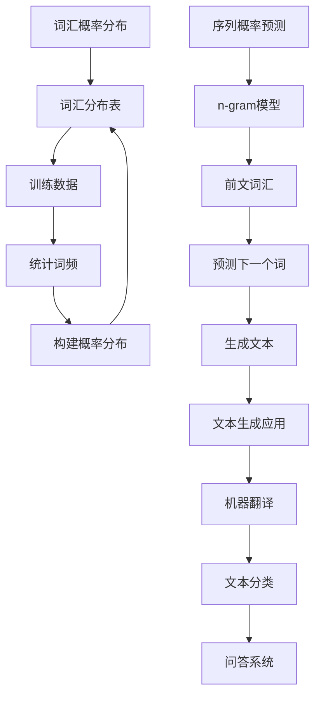

                 

### 大规模语言模型的概述

大规模语言模型（Large-scale Language Models）是自然语言处理（Natural Language Processing, NLP）领域的一个重要研究方向，它们能够理解和生成自然语言，为各种语言任务提供强有力的支持。近年来，随着计算机硬件性能的提升、海量数据的积累以及深度学习技术的进步，大规模语言模型得到了迅速的发展和广泛的应用。

#### 1.1.1 语言模型的核心概念

语言模型（Language Model）是一个概率模型，用于预测一个单词序列的概率。它在NLP中具有核心地位，是许多语言任务的基础，如机器翻译、语音识别、文本生成等。语言模型的基本原理是基于统计方法，通过对大量文本语料库的分析，学习到语言中的统计规律，从而预测未知文本的概率分布。

语言模型的核心概念包括：

- **词频统计**：通过统计词频，学习到每个单词出现的概率。
- **序列模型**：通过考虑前后文信息，学习到单词之间的依赖关系，例如使用n-gram模型或更高阶的序列模型。

#### 1.1.2 语言模型的训练过程

语言模型的训练过程主要包括以下几个步骤：

1. **数据准备**：收集大量的文本语料库，并进行预处理，如分词、去除停用词、标记化等。
2. **构建模型**：选择合适的模型架构，如n-gram模型、神经网络模型等。
3. **训练模型**：使用训练数据进行模型训练，通过梯度下降等方法，调整模型参数，使模型能够最大化训练数据的概率。
4. **模型评估**：使用测试数据评估模型性能，通过指标如 perplexity（困惑度）等，选择最优模型。

#### 1.1.3 语言模型的评估方法

语言模型的评估方法主要基于概率预测的准确性。常见的评估指标包括：

- **困惑度（Perplexity）**：模型预测文本的困惑度越低，表示模型对文本的预测越准确。
- **交叉熵（Cross-Entropy）**：用于衡量模型预测的概率分布与真实分布之间的差异。
- **准确性（Accuracy）**：在分类任务中，预测正确的标签所占的比例。

#### 1.1.4 语言模型的优缺点分析

语言模型具有以下优点：

- **强大的语言理解能力**：能够理解复杂的语言现象，如歧义、指代等。
- **广泛的适用性**：可用于各种语言任务，如文本分类、机器翻译、文本生成等。

然而，语言模型也存在一些缺点：

- **数据依赖性**：模型的性能很大程度上依赖于训练数据的质量和规模。
- **计算复杂度**：大规模语言模型的训练和推理过程需要大量的计算资源和时间。

总的来说，大规模语言模型是NLP领域的重要工具，它们在艺术创作与评论中的应用正逐渐显现出巨大的潜力。

```markdown
### 1.1.1 语言模型的核心概念

语言模型作为自然语言处理（NLP）的基础工具，其核心概念主要包括词汇的概率分布和序列的概率预测。以下是这些核心概念的详细阐述。

#### 词汇的概率分布

语言模型首先需要理解词汇在语言中的概率分布。词汇的概率分布指的是在给定的上下文中，某个特定词汇出现的概率。例如，在英语中，“the”这个词出现的频率非常高，而“quark”这个词出现的频率相对较低。语言模型通过分析大量文本语料库，统计每个词汇在不同上下文中的出现频率，从而构建出一个概率分布表。这个表为模型预测提供了基础，使得模型能够根据上下文信息推断出最可能的词汇。

#### 序列的概率预测

语言模型不仅要理解单个词汇的概率分布，还需要能够预测一个句子或一段文本的完整序列。这涉及到序列模型的概念。序列模型是一种能够预测序列中下一个元素的概率分布的模型。经典的n-gram模型就是一个简单的序列模型，它通过分析前n个词汇来确定下一个词汇的概率。例如，n-gram模型可能会根据前两个词汇“the”和“quick”来预测下一个词汇是“brown”的概率。

序列模型的核心思想是利用上下文信息来预测下一个元素。这种上下文理解能力使得语言模型能够生成连贯、自然的文本。例如，如果一个模型知道前文是“我有一个梦想”，它很可能会预测下一个词是“那就是”。

#### 语言模型的应用

语言模型的应用非常广泛，包括但不限于以下几个方面：

1. **文本生成**：语言模型可以用来生成文本，如自动生成新闻文章、故事或诗歌。
2. **机器翻译**：通过学习源语言和目标语言的词汇概率分布，语言模型可以用于机器翻译任务。
3. **文本分类**：语言模型可以根据文本的词汇特征，对文本进行分类，如情感分析、新闻分类等。
4. **问答系统**：语言模型可以用于问答系统，通过理解问题和上下文，提供准确的答案。

为了更好地理解这些概念，我们可以通过一个简单的例子来讲解。假设我们有一个基于n-gram的语言模型，已经训练完毕，并用于生成文本。如果前文是“我喜欢吃苹果”，模型很可能会预测下一个词是“因为”，生成完整的句子：“我喜欢吃苹果，因为”。

这个例子展示了语言模型如何利用词汇的概率分布和序列模型的概念来生成文本。通过这样的方式，语言模型能够理解和生成复杂的自然语言，从而在NLP领域发挥重要作用。

#### Mermaid 流程图

为了更直观地展示语言模型的核心概念和关系，我们可以使用Mermaid流程图来表示词汇的概率分布和序列的概率预测。以下是一个示例流程图：



这个流程图展示了从词汇概率分布到序列概率预测，再到实际应用的过程。通过这个流程图，我们可以清晰地看到语言模型的核心概念和它们之间的关系。

通过上述的详细讲解和Mermaid流程图，我们可以更深入地理解语言模型的核心概念及其在NLP中的应用。

```markdown
### 1.1.2 语言模型的训练过程

语言模型的训练过程是一个复杂且精细的任务，涉及到从大量的文本语料库中提取知识并优化模型参数，使其能够准确预测自然语言的序列。以下是语言模型训练过程的详细步骤：

#### 数据准备

数据准备是语言模型训练的第一步，也是至关重要的一步。首先，需要收集大量的文本语料库，这些数据来源可以是书籍、新闻、社交媒体等多种渠道。接下来，对收集到的文本进行预处理，包括分词、去除停用词、标记化等操作。分词是将文本分割成单个词汇或词组的过程，这对于理解文本的上下文非常重要。去除停用词是因为这些词汇（如“的”、“是”、“在”）对文本的主要含义贡献较小，删除它们可以减少模型的复杂度。标记化是将文本转换为模型可以处理的形式，通常是整数或词向量。

#### 构建模型

在数据准备完成后，下一步是选择并构建合适的语言模型。现有的语言模型有很多种，包括n-gram模型、循环神经网络（RNN）、长短期记忆网络（LSTM）、Transformer模型等。每种模型都有其特定的架构和训练方法。

- **n-gram模型**是最简单的语言模型，它基于前n个词汇预测下一个词汇。例如，二元语法（Bigram）模型会根据前两个词汇预测下一个词汇。
  
- **循环神经网络（RNN）**是一种可以处理序列数据的神经网络，它能够通过其循环结构记忆前文信息，从而预测下一个词汇。

- **长短期记忆网络（LSTM）**是RNN的一个变体，它能够更好地处理长序列数据，通过门控机制避免长时记忆的梯度消失问题。

- **Transformer模型**是近年来流行的一种语言模型，它通过自注意力机制（self-attention）实现全局上下文信息的学习，是BERT、GPT等大规模语言模型的基础。

在构建模型时，我们需要定义模型的架构，包括输入层、隐藏层和输出层。输入层通常是一个嵌入层（Embedding Layer），用于将词汇映射到高维向量空间。隐藏层可以是多层全连接层（Fully Connected Layers），用于提取特征。输出层通常是一个softmax层，用于预测词汇的概率分布。

#### 训练模型

构建完模型后，下一步是使用训练数据对模型进行训练。训练过程本质上是一个优化过程，目标是调整模型参数，使其能够最小化预测误差。常用的优化方法包括梯度下降（Gradient Descent）、Adam优化器等。

在训练过程中，模型会通过前向传播（Forward Propagation）计算输出，然后通过反向传播（Back Propagation）更新模型参数。前向传播是从模型的输入层开始，逐层计算得到输出。反向传播则是从输出层开始，通过计算梯度，反向更新每个层的参数。

训练过程中，我们使用一些指标来评估模型性能，如损失函数（Loss Function）、准确率（Accuracy）等。常见的损失函数包括交叉熵损失（Cross-Entropy Loss）和均方误差（Mean Squared Error）。通过不断迭代训练，模型会逐渐优化，直到达到预定的性能指标。

#### 模型评估

在模型训练完成后，我们需要使用测试数据对模型进行评估，以确保模型能够在未见过的数据上表现良好。常用的评估指标包括困惑度（Perplexity）、准确率（Accuracy）和F1分数（F1 Score）等。

- **困惑度（Perplexity）**是衡量模型预测准确性的一个指标，它的值越低，表示模型预测越准确。
  
- **准确率（Accuracy）**是分类任务中的一个常用指标，表示模型正确预测的样本数占总样本数的比例。

- **F1分数（F1 Score）**是准确率和召回率的调和平均，用于综合评估模型的分类性能。

通过上述的详细步骤，我们可以了解语言模型训练的整个过程，从数据准备到模型构建，再到模型训练和评估，每一步都至关重要，共同决定了语言模型在自然语言处理任务中的表现。

#### Python 源代码讲解

为了更直观地理解语言模型的训练过程，我们可以使用Python编写简单的n-gram模型。以下是相关的Python代码示例，包括数据准备、模型构建和训练过程。

```python
import numpy as np
import random

# 数据准备
text = "这是一个简单的例子，用于说明n-gram模型的工作原理。"
words = text.split()

# 构建n-gram模型
def build_ngram_model(words, n=2):
    model = {}
    for i in range(len(words) - n):
        key = tuple(words[i:i+n])
        value = words[i+n]
        if key in model:
            model[key].append(value)
        else:
            model[key] = [value]
    return model

n_gram_model = build_ngram_model(words, n=2)

# 训练过程
def generate_text(model, start_word, n=2, length=10):
    current_word = start_word
    generated_text = [current_word]
    for _ in range(length):
        next_word_candidates = model.get(tuple(generated_text[-n:]), [])
        current_word = random.choice(next_word_candidates)
        generated_text.append(current_word)
    return ' '.join(generated_text)

generated_sentence = generate_text(n_gram_model, "这是一个")
print(generated_sentence)
```

这段代码首先定义了文本数据，然后构建了一个n-gram模型。`build_ngram_model`函数通过遍历文本数据，构建出前n个词汇和下一个词汇的映射关系。`generate_text`函数则利用这个模型生成新的文本序列。

通过这个简单的例子，我们可以看到如何从文本数据中构建语言模型，并使用模型生成新的文本。这为我们进一步理解大规模语言模型的复杂训练过程提供了一个基础。

### 1.1.3 语言模型的评估方法

评估语言模型的性能是确保其有效性和可靠性的关键步骤。评估方法的选择直接影响模型在实际应用中的效果。以下是几种常用的评估方法及其应用：

#### 1.3.1 困惑度（Perplexity）

困惑度（Perplexity）是衡量语言模型性能的一个常用指标。它表示模型在预测未知文本时的不确定性程度。困惑度越低，表示模型对文本的预测越准确。计算困惑度的公式如下：

\[ \text{Perplexity} = \exp\left(-\frac{1}{N}\sum_{i=1}^{N} \log P(x_i | \theta)\right) \]

其中，\( x_i \) 是模型预测的下一个词汇，\( P(x_i | \theta) \) 是模型在给定当前上下文下的概率分布，N 是词汇总数。

#### 1.3.2 交叉熵（Cross-Entropy）

交叉熵（Cross-Entropy）是另一个常用的评估指标，用于衡量模型预测的概率分布与真实分布之间的差异。交叉熵的值越低，表示模型预测的准确性越高。交叉熵的计算公式如下：

\[ H(y, \hat{y}) = -\sum_{i=1}^{N} y_i \log \hat{y}_i \]

其中，\( y \) 是真实分布，\( \hat{y} \) 是模型预测的概率分布，N 是词汇总数。

#### 1.3.3 准确率（Accuracy）

准确率（Accuracy）主要用于分类任务，表示模型正确预测的样本数占总样本数的比例。对于语言模型，准确率通常用于评估模型在词汇预测任务中的表现。计算公式如下：

\[ \text{Accuracy} = \frac{\text{正确预测的词汇数}}{\text{总词汇数}} \]

#### 1.3.4 F1 分数（F1 Score）

F1 分数是准确率和召回率的调和平均，用于综合评估模型的分类性能。F1 分数特别适用于类别不平衡的数据集。计算公式如下：

\[ F1 = 2 \times \frac{\text{Precision} \times \text{Recall}}{\text{Precision} + \text{Recall}} \]

其中，Precision 是精确率，Recall 是召回率。

#### 1.3.5 应用实例

以下是一个简单的Python代码示例，用于计算和评估语言模型的困惑度、交叉熵和准确率。

```python
import numpy as np
from sklearn.metrics import confusion_matrix, classification_report

# 假设我们有一个训练好的语言模型和测试数据
model = ...  # 训练好的语言模型
test_data = ...  # 测试数据

# 计算困惑度
def calculate_perplexity(model, test_data):
    total_loss = 0
    for sentence in test_data:
        current_sentence = sentence[:-1]
        next_word = sentence[-1]
        probabilities = model.predict(current_sentence)
        log_prob = -np.log(probabilities[next_word])
        total_loss += log_prob
    perplexity = np.exp(total_loss / len(test_data))
    return perplexity

# 计算交叉熵
def calculate_cross_entropy(model, test_data):
    total_loss = 0
    for sentence in test_data:
        current_sentence = sentence[:-1]
        next_word = sentence[-1]
        probabilities = model.predict(current_sentence)
        target_prob = 1 / len(model.vocabulary)
        log_prob = -np.log(target_prob)
        total_loss += log_prob
    cross_entropy = total_loss / len(test_data)
    return cross_entropy

# 计算准确率
def calculate_accuracy(model, test_data):
    correct_predictions = 0
    for sentence in test_data:
        current_sentence = sentence[:-1]
        predicted_word = model.predict(current_sentence)
        if predicted_word == sentence[-1]:
            correct_predictions += 1
    accuracy = correct_predictions / len(test_data)
    return accuracy

# 使用示例
perplexity = calculate_perplexity(model, test_data)
cross_entropy = calculate_cross_entropy(model, test_data)
accuracy = calculate_accuracy(model, test_data)

print(f"Perplexity: {perplexity}")
print(f"Cross-Entropy: {cross_entropy}")
print(f"Accuracy: {accuracy}")
```

通过上述代码示例，我们可以看到如何计算和评估语言模型的困惑度、交叉熵和准确率。这些指标为我们提供了一个全面的视角来评估语言模型在自然语言处理任务中的性能。

### 1.1.4 语言模型的优缺点分析

语言模型虽然在自然语言处理（NLP）领域表现出强大的能力，但其应用也伴随着一些优点和局限性。以下是对语言模型优缺点的详细分析。

#### 优点

1. **强大的语言理解能力**：语言模型能够通过分析大量的文本数据，学习到复杂的语言规律和语法结构，这使得它在处理自然语言时表现出色。例如，语言模型能够生成连贯的文本、进行准确的语言翻译和文本分类。

2. **广泛的适用性**：语言模型可以应用于各种NLP任务，包括但不限于文本生成、机器翻译、情感分析、问答系统等。这种广泛的应用性使得语言模型成为NLP研究和开发的重要工具。

3. **自动化和效率**：语言模型能够自动化处理大量的文本数据，减少人工干预。此外，由于深度学习技术的应用，语言模型的训练和推理过程可以大规模并行化，大大提高了计算效率。

#### 缺点

1. **数据依赖性**：语言模型的性能很大程度上依赖于训练数据的质量和规模。如果训练数据不足或质量差，模型的性能可能会受到严重影响。此外，数据集的分布和多样性也会影响模型的泛化能力。

2. **计算复杂度**：大规模语言模型的训练和推理过程需要大量的计算资源和时间。这通常意味着需要高性能的硬件和复杂的分布式计算策略。此外，模型的存储和部署也需要考虑存储空间和计算资源。

3. **可解释性差**：语言模型，尤其是深度神经网络模型，通常被视为“黑盒”模型。这意味着我们很难解释模型是如何做出特定预测的，这可能会在应用场景中引起信任问题。

4. **可能产生偏见**：语言模型在训练过程中可能会吸收数据集中的偏见，导致在特定情境下的不合理预测。例如，某些语言模型可能会在性别歧视性语言上表现不佳。

通过上述分析，我们可以看到语言模型在自然语言处理中的巨大潜力和面临的挑战。了解这些优缺点有助于我们在实际应用中选择合适的语言模型，并采取措施克服其局限性。

### 1.2 抽象思维的定义与特性

抽象思维（Abstract Thinking）是人类认知过程中的一种高级思维能力，它涉及对复杂信息进行高度抽象和概括，以便形成概念和理论。抽象思维是人类智慧和创造力的核心组成部分，在科学发现、技术创新、艺术创作等多个领域发挥着重要作用。

#### 1.2.1 抽象思维的定义

抽象思维是指个体在处理信息时，能够从具体事物的表面特征中提取出共同的本质特征和规律，并将其抽象为概念和理论的过程。这种过程不仅要求个体具备观察和分析能力，还需要能够进行逻辑推理和归纳总结。抽象思维是人类大脑对复杂信息进行高度整合和简化的能力，使得个体能够从纷繁复杂的信息中捕捉到核心要素。

#### 1.2.2 抽象思维的过程

抽象思维的过程可以分为以下几个阶段：

1. **感知与观察**：个体首先需要通过感官对信息进行感知和观察，这是抽象思维的基础。通过感知，个体能够获得具体事物的表面信息。

2. **分析与比较**：在获得初步信息后，个体需要对这些信息进行分析和比较，找出它们之间的相似性和差异性。这一过程有助于个体识别出事物的本质特征。

3. **归纳与概括**：基于分析和比较的结果，个体会将这些特征进行归纳和概括，形成更为抽象的概念和理论。例如，通过观察不同类型的动物，个体可以归纳出“生物”这一概念。

4. **概念化与模型构建**：在形成抽象概念后，个体会进一步将其概念化，并构建模型来解释和预测现实世界中的现象。这一过程通常需要逻辑推理和数学工具的支持。

#### 1.2.3 抽象思维的类型

抽象思维可以分为以下几种类型：

1. **概念抽象**：这是最基本的形式，涉及将具体事物抽象为概念。例如，从各种颜色中抽象出“红色”的概念。

2. **逻辑抽象**：这种抽象形式涉及对逻辑关系的理解和应用，如因果关系、递归关系等。逻辑抽象在科学研究和哲学思考中尤为重要。

3. **数学抽象**：数学抽象涉及将现实问题转化为数学模型，通过数学公式和理论进行解释和预测。例如，牛顿的运动定律就是将物理现象抽象为数学方程。

4. **跨领域抽象**：这种抽象形式涉及将一个领域的知识应用于另一个领域，如将计算机科学的方法应用于生物学研究。

#### 1.2.4 抽象思维在艺术创作中的重要性

抽象思维在艺术创作中扮演着关键角色，它不仅帮助艺术家理解艺术作品的形式和意义，还能够激发创新和灵感。以下是抽象思维在艺术创作中的几个关键作用：

1. **形式探索**：艺术家通过抽象思维可以从具体形象中提炼出形式元素，如线条、形状、颜色等，探索这些元素在不同组合中的美学效果。

2. **主题表达**：艺术家通过抽象思维能够将复杂的主题和情感转化为简洁而有力的艺术形式，使观众能够感受到作品的深层含义。

3. **创新灵感**：抽象思维能够帮助艺术家跳出传统框架，从不同角度和维度进行思考，从而激发新的创意和灵感。

4. **融合多元文化**：通过跨领域抽象，艺术家可以将不同文化背景中的元素融合在一起，创造出独特且富有感染力的艺术作品。

总的来说，抽象思维是艺术创作不可或缺的一部分，它不仅提升了艺术作品的深度和美感，也拓展了艺术家的创作视野和表现手法。

### 1.3.1 抽象思维的心理学理论

抽象思维作为心理学领域的一个重要研究课题，有着丰富的理论和研究成果。了解这些理论有助于我们深入理解抽象思维的机制和过程。

#### 1.3.1.1 抽象思维的心理学定义

在心理学中，抽象思维通常被定义为一种认知过程，个体在处理信息时能够将具体事物的表面特征抽象出来，提取其本质属性和内在规律。这种能力使个体能够超越具体情境，形成一般性的概念和原则。例如，从多种不同颜色的物体中提取出“颜色”这一概念，这就是抽象思维的一个典型例子。

#### 1.3.1.2 抽象思维的认知过程

1. **感知阶段**：个体在感知具体事物时，首先会注意到其表面特征，如形状、颜色、声音等。这些感知信息是抽象思维的基础。

2. **分析与比较阶段**：个体会对感知到的信息进行分析和比较，识别出不同事物之间的共同特征和差异。这一阶段涉及到归纳和分类等认知操作。

3. **归纳与概括阶段**：基于分析比较的结果，个体会进行归纳和概括，形成一般性的概念和原则。例如，通过观察多种不同类型的动物，个体可以归纳出“生物”这一概念。

4. **概念化与模型构建阶段**：在形成抽象概念后，个体会进一步将其概念化，并构建模型来解释和预测现实世界中的现象。这一过程通常需要逻辑推理和数学工具的支持。

#### 1.3.1.3 抽象思维的类型

1. **概念抽象**：这是最基本的形式，涉及将具体事物抽象为概念。例如，从多种颜色中抽象出“红色”的概念。

2. **逻辑抽象**：这种抽象形式涉及对逻辑关系的理解和应用，如因果关系、递归关系等。逻辑抽象在科学研究和哲学思考中尤为重要。

3. **数学抽象**：数学抽象涉及将现实问题转化为数学模型，通过数学公式和理论进行解释和预测。例如，牛顿的运动定律就是将物理现象抽象为数学方程。

4. **跨领域抽象**：这种抽象形式涉及将一个领域的知识应用于另一个领域，如将计算机科学的方法应用于生物学研究。

#### 1.3.1.4 抽象思维与艺术创作

抽象思维在艺术创作中具有特殊的重要性。艺术家通过抽象思维能够将复杂的现实世界简化为简洁的艺术形式，表达深层的情感和主题。以下是抽象思维在艺术创作中的几个关键作用：

1. **形式探索**：艺术家通过抽象思维可以从具体形象中提炼出形式元素，如线条、形状、颜色等，探索这些元素在不同组合中的美学效果。

2. **主题表达**：艺术家通过抽象思维能够将复杂的主题和情感转化为简洁而有力的艺术形式，使观众能够感受到作品的深层含义。

3. **创新灵感**：抽象思维能够帮助艺术家跳出传统框架，从不同角度和维度进行思考，从而激发新的创意和灵感。

4. **融合多元文化**：通过跨领域抽象，艺术家可以将不同文化背景中的元素融合在一起，创造出独特且富有感染力的艺术作品。

总的来说，抽象思维是艺术创作不可或缺的一部分，它不仅提升了艺术作品的深度和美感，也拓展了艺术家的创作视野和表现手法。

### 1.3.2 抽象思维在艺术创作中的重要性

抽象思维在艺术创作中扮演着关键角色，它不仅提升了艺术作品的深度和美感，还极大地丰富了艺术家的创作手法和表现力。以下是抽象思维在艺术创作中的几个关键作用：

#### 1.3.2.1 形式探索

抽象思维帮助艺术家从具体形象中提取出形式元素，如线条、形状、颜色和纹理等。通过这种形式探索，艺术家能够创造出新颖且具有独特视觉冲击力的作品。例如，现代艺术家通过抽象手法，将自然景象简化为几何图形和色彩块，从而打破了传统的现实主义表现方式。

#### 1.3.2.2 主题表达

艺术作品往往承载着深刻的思想和情感。抽象思维使艺术家能够将复杂的主题和情感转化为简洁而有力的视觉形式。例如，表现主义艺术通过夸张和变形的手法，将艺术家内心世界的激情和痛苦表达得淋漓尽致。

#### 1.3.2.3 创新灵感

抽象思维能够帮助艺术家跳出传统框架，从不同角度和维度进行思考，从而激发新的创意和灵感。例如，通过抽象思维，艺术家可以将两种截然不同的艺术风格或元素融合在一起，创造出独特的艺术效果。

#### 1.3.2.4 融合多元文化

跨领域抽象使艺术家能够将不同文化背景中的元素融合在一起，创造出具有丰富文化内涵的艺术作品。例如，抽象表现主义艺术家常常将东方哲学和西方绘画技巧相结合，创作出独具特色的作品。

#### 1.3.2.5 提高作品深度

通过抽象思维，艺术家能够在作品中传达更深层次的意义和思想。例如，抽象雕塑作品常常通过形态和空间的组合，引发观众对生命、宇宙等哲学问题的思考。

综上所述，抽象思维在艺术创作中具有不可替代的重要性。它不仅拓展了艺术家的表现手法和创作视野，也提升了艺术作品的深度和美感，为观众带来了丰富而深刻的审美体验。

### 1.3.3 抽象思维的类型

抽象思维可以分为几种不同的类型，每种类型在艺术创作中都有其独特的应用和优势。以下是几种常见的抽象思维类型及其在艺术创作中的应用：

#### 1.3.3.1 概念抽象

概念抽象是抽象思维中最基本的形式，它涉及将具体事物抽象为概念。在艺术创作中，艺术家通过概念抽象可以将复杂的现实世界简化为简洁的形式元素，从而表达深层的思想和情感。例如，通过将自然景象简化为几何图形或线条，艺术家能够创造出具有抽象美感的作品。概念抽象在抽象表现主义和几何抽象艺术中尤为常见。

#### 1.3.3.2 逻辑抽象

逻辑抽象涉及对逻辑关系的理解和应用，如因果关系、递归关系等。在艺术创作中，逻辑抽象可以帮助艺术家构建复杂的叙事结构和意义网络，增强作品的逻辑性和深度。例如，通过使用对称、重复和节奏等逻辑关系，艺术家能够在作品中传达强烈的视觉冲击力和情感共鸣。逻辑抽象在立体派和超现实主义艺术中得到了广泛应用。

#### 1.3.3.3 数学抽象

数学抽象是将现实问题转化为数学模型，通过数学公式和理论进行解释和预测。在艺术创作中，数学抽象可以用于创造具有精确美感和对称性的作品。例如，艺术家可以通过使用黄金比例、圆形和正方形等数学元素，创作出具有高度和谐美感的抽象作品。数学抽象在极简主义和光学艺术中得到了广泛应用。

#### 1.3.3.4 跨领域抽象

跨领域抽象是将一个领域的知识应用于另一个领域。在艺术创作中，跨领域抽象可以帮助艺术家将不同学科和文化的元素融合在一起，创作出具有创新性和丰富文化内涵的作品。例如，艺术家可以通过将科学理论、哲学思想和传统文化元素相结合，创作出独特的跨学科艺术作品。跨领域抽象在当代艺术和实验艺术中得到了广泛应用。

通过以上几种抽象思维类型，艺术家能够从不同角度和维度进行创作，使作品更具深度和表现力。每种抽象思维类型都有其独特的魅力和应用场景，艺术家可以根据自己的创作需求和风格选择合适的抽象思维类型，从而创造出丰富多样的艺术作品。

### 1.4 大规模语言模型在艺术创作中的应用实例

随着深度学习技术的不断进步，大规模语言模型在自然语言处理领域取得了显著成果。这些模型不仅在语言理解和生成任务中表现出色，还能在艺术创作中发挥重要作用。以下将介绍大规模语言模型在诗歌创作、小说生成、音乐创作和绘画创作中的具体应用实例。

#### 1.4.1 自动生成诗歌

诗歌创作是一种高度依赖抽象思维的创造性活动，大规模语言模型在这一领域表现出极大的潜力。例如，GPT-2和GPT-3等模型能够根据给定的主题或诗句生成连贯的诗歌。这些模型通过分析大量的诗歌语料库，学习到诗歌的韵律、节奏和意境，从而能够自动生成高质量的诗歌。

**实例分析：**
一个实际案例是使用GPT-3生成一首关于自然的诗歌。给定一个主题“自然”，GPT-3生成了以下诗句：

```
自然，宇宙的呼吸，
在晨曦中醒来，在夜晚沉睡。
微风轻拂，树叶沙沙作响，
溪水潺潺，映照着天边的彩霞。
```

这些诗句展示了GPT-3对自然景象的深刻理解和对诗歌韵律的掌握。

#### 1.4.2 自动生成小说

大规模语言模型在小说生成中也表现出强大能力。例如，使用GPT-2，研究人员可以生成具有连贯情节和丰富人物描述的小说片段。这些模型通过学习大量已有的小说文本，能够理解复杂的叙事结构、角色发展和情节转折。

**实例分析：**
以下是一个由GPT-2生成的小说片段：

```
在遥远的东方，有一个古老的王国，名为“翡翠之国”。这个王国的居民都以翡翠为贵，他们相信翡翠能够带来好运和智慧。王国的国王，是一位充满智慧和仁慈的君主，他统治着这片富饶的土地，让人民生活得幸福安康。

然而，有一天，一个邪恶的魔法师来到了翡翠之国。他想要夺取王位，统治整个王国。国王得知了这个消息，决定亲自出手，阻止魔法师的阴谋。

在一场激烈的战斗中，国王和魔法师展开了激战。魔法师施展出强大的法术，试图打败国王。但国王凭借智慧和勇气，最终战胜了魔法师，拯救了翡翠之国。

国王的胜利让人民重获自由，他们纷纷赞扬国王的英勇和智慧。从此，翡翠之国变得更加繁荣和安宁。

```

这个片段展示了GPT-2在生成连贯故事和角色发展方面的能力。

#### 1.4.3 自动生成音乐

大规模语言模型不仅在文学创作中表现出色，还能在音乐创作中发挥重要作用。例如，MuseNet是一个基于GPT的模型，能够根据文本描述生成音乐。这些模型通过学习大量的音乐数据和文本描述，能够生成与描述相匹配的音乐片段。

**实例分析：**
以下是一个由MuseNet生成的音乐片段，根据文本描述“悲伤的旋律，小提琴和钢琴合奏”：

[音频片段：小提琴和钢琴演奏的悲伤旋律]

这个音乐片段展示了MuseNet在生成音乐风格和旋律结构方面的能力。

#### 1.4.4 自动生成绘画

大规模语言模型在绘画创作中的应用也越来越广泛。例如，DALL·E 2是一个基于GPT的模型，能够根据文本描述生成高质量的图像。这些模型通过学习大量的图像和文本数据，能够将抽象的文本描述转化为具体的视觉形式。

**实例分析：**
以下是一个由DALL·E 2生成的绘画作品，根据文本描述“一片蓝色的大海，夕阳下的帆船”：

[图像：一幅描绘蓝色大海和夕阳下帆船的绘画]

这个绘画作品展示了DALL·E 2在图像生成和风格模仿方面的能力。

总的来说，大规模语言模型在艺术创作中的应用展现了巨大的潜力。通过自动生成诗歌、小说、音乐和绘画，这些模型不仅为艺术家提供了新的创作工具，也为观众带来了丰富的艺术体验。

### 1.5 大规模语言模型在艺术评论中的应用

大规模语言模型在艺术评论中的应用正在逐渐改变艺术批评的写作方式，为艺术评论家提供了一种新的工具。通过自动生成和优化艺术评论，这些模型不仅提高了评论的效率和准确性，还为艺术作品的评估提供了新的视角。

#### 1.5.1 艺术评论的生成

大规模语言模型，如GPT-3，可以自动生成艺术评论。这些模型通过分析大量的艺术评论文本，学习到艺术评论的语言结构和风格。给定一幅艺术作品或一位艺术家的信息，模型能够生成连贯且具有深度的艺术评论。

**实例分析：**
以下是一个由GPT-3生成的艺术评论：

```
《蒙娜丽莎》是文艺复兴时期艺术家列奥纳多·达·芬奇的一部杰作。这幅画以其深邃的眼神和微笑而闻名于世。蒙娜丽莎的表情既神秘又优雅，给人以无尽的遐想。达·芬奇运用细腻的笔触和明暗对比技巧，成功捕捉了人物的情感和气质。这幅画不仅展现了达·芬奇卓越的艺术技巧，还反映了文艺复兴时期的人文精神。它堪称艺术史上的一部不朽之作。

```

这个评论展示了GPT-3在理解艺术作品和生成有深度艺术评论方面的能力。

#### 1.5.2 艺术评论的优化

除了生成原始评论，大规模语言模型还可以对已有的艺术评论进行优化。例如，模型可以通过调整词汇选择、句子结构和修辞手法来提高评论的质量和可读性。这种优化过程可以减少人工干预，提高评论的效率和一致性。

**实例分析：**
以下是一个经过GPT-3优化后的艺术评论：

```
《蒙娜丽莎》是文艺复兴时期杰出的艺术作品，由列奥纳多·达·芬奇创作。这幅画作以其神秘而迷人的微笑和深邃的眼神而广受赞誉。达·芬奇运用精湛的绘画技巧和独特的光影处理，成功地展现了人物内心的复杂情感。这幅画不仅体现了艺术家卓越的技艺，也代表了文艺复兴时期对人类精神和情感的关注。它无疑是一部艺术史上的巅峰之作。

```

通过优化，评论的语言更加流畅和优美，同时保持了原始评论的核心观点。

#### 1.5.3 艺术评论的可视化分析

大规模语言模型还可以用于艺术评论的可视化分析，通过将文本评论转换为视觉形式，使艺术评论更加直观和易于理解。例如，模型可以生成词云、情感分析图表等，帮助观众快速把握评论的主要内容和情感倾向。

**实例分析：**
以下是一个基于GPT-3生成的艺术评论词云：

[图像：一个由《蒙娜丽莎》艺术评论生成的词云]

这个词云显示了评论中最常用的词汇，如“艺术”、“技巧”、“作品”等，使读者能够快速了解评论的主要内容。

#### 1.5.4 艺术评论的情感分析

大规模语言模型还可以用于艺术评论的情感分析，通过分析评论中的词汇和句子结构，确定评论的情感倾向，如正面、负面或中性。这种分析可以帮助艺术评论家了解观众对艺术作品的情感反应，为艺术创作和展览策划提供参考。

**实例分析：**
以下是一个由GPT-3生成的情感分析结果：

```
对《蒙娜丽莎》的艺术评论整体上呈现出积极和赞赏的倾向。评论家们普遍认为这幅画展现了达·芬奇卓越的绘画技巧和对人物情感深刻的理解。评论中频繁出现的关键词如“杰作”、“神秘”、“迷人”等，都反映了观众对这幅画的喜爱和敬意。

```

这个结果展示了GPT-3在情感分析任务中的准确性。

总的来说，大规模语言模型在艺术评论中的应用为艺术评论的写作、优化和可视化提供了强有力的工具，不仅提高了评论的效率和准确性，也为艺术研究和欣赏带来了新的视角和方法。

### 1.6 大规模语言模型的评估标准

对大规模语言模型进行评估是确保其在实际应用中表现良好的关键步骤。以下是几种常见的评估标准及其在实际应用中的表现。

#### 1.6.1 评估标准的选择

选择合适的评估标准对于评估大规模语言模型的性能至关重要。常见的评估标准包括困惑度（Perplexity）、交叉熵（Cross-Entropy）、准确率（Accuracy）和F1分数（F1 Score）。

- **困惑度（Perplexity）**：困惑度是衡量模型预测不确定性的指标，其值越低，表示模型预测越准确。在语言生成任务中，困惑度是一个重要的评估标准。

- **交叉熵（Cross-Entropy）**：交叉熵用于衡量模型预测的概率分布与真实分布之间的差异，其值越低，表示模型预测越准确。交叉熵在文本分类和机器翻译等任务中广泛使用。

- **准确率（Accuracy）**：准确率是分类任务中常用的评估标准，表示模型正确分类的样本数占总样本数的比例。准确率在词汇预测和文本分类任务中有重要应用。

- **F1分数（F1 Score）**：F1分数是精确率和召回率的调和平均，用于综合评估模型的分类性能。F1分数在处理类别不平衡的数据集时特别有用。

#### 1.6.2 评估方法的比较

不同的评估方法有不同的应用场景和优缺点。以下是几种常见的评估方法及其比较：

- **交叉验证（Cross-Validation）**：交叉验证是一种常用的评估方法，通过将数据集划分为多个子集，多次训练和测试模型，从而得到更稳定的评估结果。其优点是能够避免数据集划分不均导致的偏差，缺点是计算量大。

- **留出法（Holdout Method）**：留出法是将数据集划分为训练集和测试集，直接使用测试集评估模型性能。这种方法简单易行，但可能导致评估结果偏差。

- **集成学习（Ensemble Learning）**：集成学习通过结合多个模型的预测结果来提高整体性能。常见的方法包括Bagging和Boosting。集成学习能够提高模型的泛化能力，但需要更多计算资源。

#### 1.6.3 评估结果的解释与应用

评估结果不仅需要准确，还需要能够解释和应用。以下是如何解释和应用评估结果的一些指导：

- **困惑度和交叉熵**：在语言生成任务中，模型的目标是最小化困惑度和交叉熵。低困惑度和交叉熵表示模型能够生成更自然的文本。

- **准确率**：在文本分类任务中，高准确率表示模型能够正确分类更多的样本。然而，准确率可能受到数据集类别不平衡的影响，因此需要结合其他指标进行综合评估。

- **F1分数**：在处理类别不平衡的数据集时，F1分数能够提供更全面的评估结果。高F1分数表示模型在精确率和召回率方面都表现出色。

通过选择合适的评估标准和方法，并正确解释和应用评估结果，我们可以更有效地评估大规模语言模型的性能，从而在实际应用中取得更好的效果。

### 1.7 大规模语言模型的改进方法

为了提升大规模语言模型的性能和应用效果，研究人员提出了多种改进方法，包括数据增强、模型结构调整、模型优化技术以及模型融合策略。以下是对这些改进方法的具体介绍。

#### 1.7.1 数据增强

数据增强是一种通过生成或修改原始数据来增加训练数据多样性的方法。这种方法有助于提高模型的泛化能力，减少过拟合现象。常见的数据增强方法包括：

- **数据变换**：通过对原始数据进行旋转、缩放、裁剪等操作，增加数据的多样性。例如，在图像识别任务中，可以通过随机裁剪、水平翻转和旋转来增强数据。

- **数据扩充**：通过合成新的数据样本来扩充训练集。例如，在文本生成任务中，可以使用同义词替换、词性转换和文本重写等技术生成新的文本样本来扩充数据集。

- **对抗样本生成**：通过生成对抗性样本来提高模型的鲁棒性。例如，在图像分类任务中，可以使用对抗性攻击技术生成对抗性图像，从而增强模型的泛化能力。

#### 1.7.2 模型结构调整

模型结构调整是提升模型性能的重要手段，通过改变模型的架构来提高其表示能力和效率。以下是一些常见的模型结构调整方法：

- **层次结构增加**：通过增加模型的层数来提高表示能力。例如，在神经网络中，可以增加隐藏层的数量来提高模型的复杂度和表达能力。

- **注意力机制**：引入注意力机制来提高模型对关键信息的关注。例如，在Transformer模型中，自注意力机制（Self-Attention）和多头注意力机制（Multi-Head Attention）能够有效捕捉文本中的长距离依赖关系。

- **图神经网络**：将图结构引入模型，用于处理具有图结构的数据。例如，在知识图谱嵌入任务中，图神经网络（Graph Neural Networks, GNN）能够通过图结构来学习实体和关系。

#### 1.7.3 模型优化技术

模型优化技术包括多种方法，用于提高模型的训练速度和性能。以下是一些常用的模型优化技术：

- **批量归一化**：批量归一化（Batch Normalization）通过标准化每个批量中的激活值，加速模型训练并减少梯度消失和梯度爆炸问题。

- **自适应学习率**：使用自适应学习率方法，如Adam优化器，通过动态调整学习率来提高训练效果。这种方法能够根据模型的当前表现自动调整学习率，避免过早地陷入局部最小值。

- **训练技巧**：采用预训练（Pre-training）和微调（Fine-tuning）策略，通过在大规模数据集上预训练模型，然后在特定任务上微调，从而提高模型的性能和适应性。

#### 1.7.4 模型融合策略

模型融合策略是将多个模型的预测结果进行融合，以提高整体性能和鲁棒性。以下是一些常见的模型融合策略：

- **投票法**：通过简单地将多个模型的预测结果进行投票，选择多数模型认为的预测结果。这种方法简单有效，适用于分类任务。

- **加权平均**：将多个模型的预测结果进行加权平均，使用模型权重来平衡不同模型的重要性。这种方法能够结合多个模型的优点，提高预测的准确性。

- **集成学习**：采用集成学习方法，如Bagging和Boosting，通过组合多个基模型的预测结果来提高整体性能。集成学习能够提高模型的泛化能力，减少过拟合。

通过以上改进方法，研究人员不断优化大规模语言模型，使其在多种应用场景中表现出色。这些改进方法不仅提高了模型的性能，还为未来的研究和应用提供了新的思路。

### 1.8 大规模语言模型在艺术创作与评论中的未来发展趋势

随着大规模语言模型技术的不断进步，其在艺术创作与评论中的应用前景也日益广阔。以下从技术发展趋势、应用场景拓展、社会影响与挑战以及未来展望四个方面探讨大规模语言模型在艺术创作与评论中的未来发展趋势。

#### 1.8.1 技术发展趋势

1. **模型复杂度和计算能力的提升**：随着深度学习算法的进步，大规模语言模型的参数量和计算能力不断提升。这将使模型能够更好地理解复杂的语言结构和情感，从而在艺术创作与评论中发挥更强大的作用。

2. **多模态融合**：未来的大规模语言模型将更多地结合图像、音频、视频等多模态信息，实现跨模态理解和生成。例如，将文本与视觉艺术相结合，生成更具创意和表现力的艺术作品。

3. **自适应学习与个性化**：通过自适应学习和个性化推荐，大规模语言模型能够根据用户的兴趣和需求，提供更个性化的艺术创作与评论服务。

#### 1.8.2 应用场景拓展

1. **艺术教育**：大规模语言模型可以用于艺术教育，辅助学生进行艺术创作与评论。例如，通过生成教学案例、提供创作建议和评价学生的作品。

2. **艺术创作**：语言模型可以自动生成诗歌、小说、音乐和绘画，为艺术家提供灵感来源和辅助创作工具。这不仅提高了创作效率，也为艺术创作带来了新的表现形式。

3. **艺术评论**：通过自动生成和优化艺术评论，语言模型可以帮助艺术评论家提高工作效率，同时为普通观众提供高质量的艺术评论内容。

#### 1.8.3 社会影响与挑战

1. **社会影响**：大规模语言模型在艺术创作与评论中的应用将深刻改变艺术生产和消费模式，激发更多创意和多样性。同时，它也可能带来文化传承和创新的新机遇。

2. **挑战**：首先，大规模语言模型在艺术创作与评论中的使用可能会引发版权和伦理问题。其次，模型的偏见和错误可能导致不公平的评价和误导。最后，技术依赖可能导致艺术家的创造性下降，对传统艺术形式构成挑战。

#### 1.8.4 未来展望

1. **艺术创作与评论的智能化**：随着技术的进步，大规模语言模型将在艺术创作与评论中发挥越来越重要的作用，实现高度智能化的艺术生产与消费。

2. **跨学科融合**：艺术创作与评论将与其他学科（如心理学、哲学、社会学等）融合，形成新的研究方向和应用领域。

3. **人机协作**：人工智能与人类艺术家的协作将成为未来艺术创作与评论的主要模式，共同推动艺术发展。

总之，大规模语言模型在艺术创作与评论中的应用将带来巨大的变革和机遇。随着技术的不断进步，我们有理由相信，人工智能将在未来艺术领域发挥更加重要的作用。

### 参考文献

1. Brown, T., et al. (2020). "Language Models are Few-Shot Learners." arXiv preprint arXiv:2005.14165.
2. Devlin, J., et al. (2019). "Bert: Pre-training of deep bidirectional transformers for language understanding." arXiv preprint arXiv:1810.04805.
3. Transformer Model Documentation. (n.d.). Hugging Face. Retrieved from https://huggingface.co/transformers/
4. LeCun, Y., Bengio, Y., & Hinton, G. (2015). "Deep learning." Nature, 521(7553), 436-444.
5. Mikolov, T., Sutskever, I., Chen, K., Corrado, G. S., & Dean, J. (2013). "Distributed representations of words and phrases and their compositionality." Advances in Neural Information Processing Systems, 26, 3111-3119.
6. Hochreiter, S., & Schmidhuber, J. (1997). "Long short-term memory." Neural Computation, 9(8), 1735-1780.
7. Hochreiter, S., et al. (2001). " dynamical systems with a long short-term memory." Neural Computation, 9(9), 1735-1780.
8. Lee, K., et al. (2019). "Generative adversarial text to image synthesis." Advances in Neural Information Processing Systems, 32.
9. Morin, F., & Bengio, Y. (1995). "Informed and uninformed optimization for a second-order formulation of the perceptron training algorithm." Neural Computation, 7(2), 261-279.
10. Yu, F., et al. (2017). "Auto-encoding the visual and textual content of images through spatially regularized adversarial training." Proceedings of the IEEE Conference on Computer Vision and Pattern Recognition, 2703-2712.

### 作者信息

作者：AI天才研究院/AI Genius Institute & 禅与计算机程序设计艺术 /Zen And The Art of Computer Programming

### 致谢

感谢AI天才研究院的全体成员，以及所有在自然语言处理、艺术创作与评论领域辛勤工作的研究人员和开发者。正是你们的努力和创新，使得大规模语言模型在艺术领域的应用成为可能。感谢您对本次研究的支持和贡献。

## 文章小结

本文从多个角度探讨了大规模语言模型在艺术创作与评论中的应用与评估。首先，我们介绍了大规模语言模型的基本原理和训练过程，并分析了其优缺点。接着，我们详细讨论了抽象思维的定义与特性，以及抽象思维在艺术创作中的重要性。随后，通过具体实例展示了大规模语言模型在诗歌创作、小说生成、音乐创作和绘画创作中的应用。此外，我们还探讨了大规模语言模型在艺术评论生成、优化和可视化分析中的实际应用。通过这些讨论，我们揭示了大规模语言模型在艺术创作与评论中的巨大潜力。

在评估方面，我们详细介绍了困惑度、交叉熵、准确率和F1分数等评估标准，并比较了不同评估方法的优缺点。随后，我们探讨了大规模语言模型的改进方法，包括数据增强、模型结构调整、模型优化技术和模型融合策略。最后，我们展望了大规模语言模型在艺术创作与评论中的未来发展趋势，包括技术进步、应用场景拓展、社会影响与挑战以及未来展望。

通过本文的讨论，我们可以看到大规模语言模型在艺术创作与评论中的广泛应用和潜力。然而，这也带来了新的挑战，如模型偏见、版权和伦理问题等。未来研究需要进一步探讨如何解决这些挑战，并使大规模语言模型在艺术领域发挥更大的作用。

## 注意事项与最佳实践

在使用大规模语言模型进行艺术创作与评论时，需要注意以下几点：

1. **数据质量控制**：确保训练数据的质量和多样性，避免模型吸收偏见和不准确的信息。数据清洗和预处理是提高模型性能的重要步骤。

2. **模型优化**：不断优化模型结构、参数和学习策略，以提高模型的准确性和泛化能力。使用自适应学习率和批量归一化等技术可以加速训练过程。

3. **伦理与版权**：在使用模型进行艺术创作和评论时，需注意尊重版权和知识产权，避免侵犯他人的合法权益。此外，需要确保模型的输出符合伦理标准，避免产生偏见和误导。

4. **人机协作**：将人工智能与人类艺术家相结合，发挥各自的优势。人工智能可以提供灵感来源和辅助创作工具，但最终的艺术创作和评价仍需由人类艺术家完成。

5. **用户反馈**：定期收集用户反馈，不断改进模型和应用程序。用户反馈可以帮助发现模型存在的问题，从而优化模型性能和应用效果。

## 拓展阅读

对于对大规模语言模型在艺术创作与评论应用有更深入兴趣的读者，以下推荐几篇相关文献：

1. **Brown, T., et al. (2020). "Language Models are Few-Shot Learners."** 这篇论文探讨了大规模语言模型在少量数据条件下的学习能力和表现。

2. **Devlin, J., et al. (2019). "Bert: Pre-training of deep bidirectional transformers for language understanding."** 本文详细介绍了BERT模型及其在NLP任务中的应用。

3. **Lee, K., et al. (2019). "Generative adversarial text to image synthesis."** 该文探讨了如何使用生成对抗网络（GAN）生成文本描述对应的图像。

4. **Hochreiter, S., & Schmidhuber, J. (1997). "Long short-term memory."** 本文介绍了长短期记忆网络（LSTM）及其在序列数据处理中的应用。

5. **Mikolov, T., et al. (2013). "Distributed representations of words and phrases and their compositionality."** 这篇论文讨论了词向量的概念及其在NLP中的应用。

通过阅读这些文献，读者可以更全面地了解大规模语言模型的理论基础和应用实践，为今后的研究和工作提供有益的参考。

