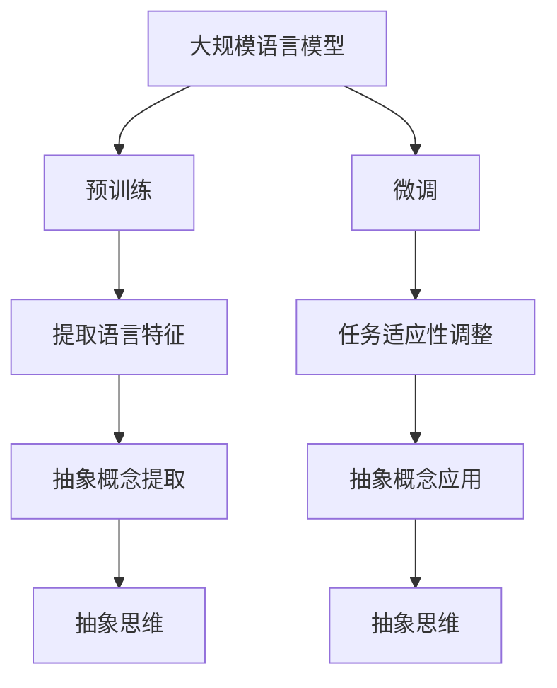

                 

### 大规模语言模型的概述与发展

#### 1.1 大规模语言模型的定义与分类

**大规模语言模型（Large-scale Language Model）**，是一种通过深度学习技术训练而成的高维神经网络模型，旨在理解和生成自然语言。这类模型通常拥有数亿甚至数十亿个参数，能够对大量文本数据进行分析和学习，从而生成或理解自然语言的语义和语法。

根据模型的训练目标和应用场景，大规模语言模型可以分为以下几种主要类型：

- **生成式语言模型（Generative Language Model）**：这类模型主要用于生成自然语言文本。它们能够根据输入的提示生成连贯、有意义的文本。典型的生成式模型包括 GPT（Generative Pre-trained Transformer）系列和 ChatGPT。

- **判别式语言模型（Discriminative Language Model）**：这类模型主要用于分类和预测。它们通过分析输入文本的特征，对文本进行分类或预测。常见的判别式模型有 BERT（Bidirectional Encoder Representations from Transformers）和 RoBERTa（A Robustly Optimized BERT Pretraining Approach）。

- **混合式语言模型（Hybrid Language Model）**：这类模型结合了生成式和判别式模型的优点，同时具备生成和分类的能力。典型的混合式模型包括 T5（Text-To-Text Transfer Transformer）和 UniLM（Unified Language Model）。

#### 1.2 大规模语言模型的发展历程

大规模语言模型的发展历程可以追溯到上世纪 80 年代的统计语言模型。最初的统计语言模型主要基于 n-gram 模型，通过对历史文本数据的统计来预测下一个词的概率。然而，这类模型在处理长文本和复杂语法时表现不佳。

随着深度学习技术的发展，神经网络语言模型逐渐取代了传统的统计模型。2003年，Bengio等人在论文《A Theoretical Framework for the Design of Transformative Neural Network Architectures》中首次提出了基于神经网络的深度语言模型。这个模型被称为“深度信念网络（Deep Belief Network）”。

2013年，-word2vec模型**的提出**，使得大规模文本数据的处理和表征变得更加高效。word2vec模型通过将词语映射到高维向量空间，使得词语之间的相似性和距离可以通过向量的几何关系来表示。

2017年，Google推出了BERT模型，这是第一个在训练时同时考虑上下文的生成式预训练模型。BERT模型的成功引发了大规模语言模型的研究热潮，随后出现了GPT、T5等一系列先进的语言模型。

#### 1.3 大规模语言模型的核心技术

大规模语言模型的核心技术主要包括以下几个方面：

- **预训练（Pre-training）**：预训练是指在大规模文本数据集上对模型进行初步训练，以学习语言的基本规律和特征。预训练后的模型可以用于各种下游任务，如文本分类、问答、机器翻译等。

- **微调（Fine-tuning）**：微调是指在预训练的基础上，对模型进行特定任务的进一步训练，以适应特定的应用场景。微调是大规模语言模型在实际应用中取得良好效果的关键。

- **变压器（Transformer）架构**：变压器架构是大规模语言模型的核心结构，它通过自注意力机制（Self-Attention）实现了对输入文本的全局信息整合，从而提高了模型的建模能力和性能。

- **迁移学习（Transfer Learning）**：迁移学习是指将预训练模型的知识迁移到新的任务上，以减少对新任务数据的依赖。大规模语言模型通过迁移学习，能够在各种不同任务中取得优异的性能。

#### 1.4 大规模语言模型的应用场景

大规模语言模型在自然语言处理领域具有广泛的应用场景，主要包括以下几个方面：

- **文本分类**：用于对文本进行分类，如情感分析、新闻分类、垃圾邮件检测等。

- **问答系统**：用于回答用户提出的问题，如搜索引擎、智能客服等。

- **机器翻译**：用于将一种语言的文本翻译成另一种语言，如谷歌翻译、百度翻译等。

- **对话系统**：用于实现与人类的自然语言交互，如智能音箱、聊天机器人等。

- **文本生成**：用于生成连贯、有意义的文本，如文章写作、创意写作等。

综上所述，大规模语言模型作为一种先进的自然语言处理技术，在文本分类、问答系统、机器翻译、对话系统和文本生成等领域具有广泛的应用前景。其不断的发展和优化，为自然语言处理领域带来了新的机遇和挑战。

#### 核心概念与联系：大规模语言模型与抽象思维

**概念定义：**  
- **大规模语言模型**：一种通过深度学习技术训练而成的高维神经网络模型，旨在理解和生成自然语言。  
- **抽象思维**：一种高级认知过程，涉及到从具体情境中提取共同特征，形成抽象概念和原理。

**联系架构：**  
- 大规模语言模型通过预训练和微调，从大量文本数据中学习语言的结构和语义。这一过程中，模型能够提取出文本中的抽象概念，如名词、动词、形容词等。  
- 抽象思维则是在人类认知过程中，通过分析、比较和归纳，从具体情境中提取共同特征，形成更高层次的抽象概念。

**Mermaid 流程图：**



- **预训练与提取语言特征**：大规模语言模型通过预训练从大量文本数据中学习语言的结构和语义。在这一过程中，模型能够识别和提取文本中的语言特征，如词汇、语法和语义信息。
- **抽象概念提取与抽象思维**：从语言特征中，模型能够提取出更高层次的抽象概念。这些概念体现了语言的共同特征和规律，为抽象思维提供了基础。
- **微调与任务适应性调整**：预训练后的模型通过微调，适应特定任务的需求。在这一过程中，模型不仅应用已有的抽象概念，还能够根据新任务的特点，调整和优化这些概念。
- **抽象概念应用与抽象思维**：微调后的模型在具体任务中，能够应用从预训练阶段提取的抽象概念，进行推理、分析和生成。这一过程体现了人类抽象思维的特性。

通过上述Mermaid流程图，可以清晰地展示大规模语言模型与抽象思维之间的联系和作用机制。大规模语言模型不仅为抽象思维提供了强大的工具和平台，还通过不断学习和优化，推动抽象思维的发展和应用。

### 大规模语言模型在音乐创作中的抽象思维实践

#### 2.1 抽象思维在音乐创作中的案例分析

抽象思维在音乐创作中有着丰富的应用，通过以下案例可以更直观地了解其具体实践：

**案例1：阿朗贝尔·德·贝尔维尔（Alban Berg）的《吕克·诺思的七首诗》**

- **背景**：阿朗贝尔·德·贝尔维尔是一位著名的奥地利作曲家，他的《吕克·诺思的七首诗》是20世纪初期一部极具代表性的作品。
- **抽象思维应用**：在创作这部作品时，贝尔维尔运用了抽象思维，通过对诗歌中的意象和情感进行提取和转化，将文字转化为音乐。他将诗歌的语义和情感以抽象的方式表达在音乐中，形成了独特的音乐语言。

**案例2：约翰·凯奇（John Cage）的《四分三十三秒》**

- **背景**：约翰·凯奇是美国著名作曲家和音乐理论家，他的《四分三十三秒》是20世纪最有争议的音乐作品之一。
- **抽象思维应用**：凯奇在这部作品中运用了抽象思维，将音乐的时间和空间完全脱离了传统音乐的逻辑框架。他将音乐创作转化为一种实验行为，让音乐与听众的感知和体验产生互动，从而创造出一种全新的音乐形式。

**案例3：菲利普·格拉斯（Philip Glass）的《波特兰的天空》**

- **背景**：菲利普·格拉斯是美国著名作曲家和音乐制作人，他的《波特兰的天空》是一部典型的现代音乐作品。
- **抽象思维应用**：格拉斯在这部作品中运用了抽象思维，通过对现实场景的抽象和变形，创造出一个独特的音乐世界。他将现实生活中的声音和音乐元素进行提取和组合，形成了一种全新的音乐语言，为听众带来了前所未有的听觉体验。

#### 2.2 抽象思维在音乐创作中的技巧与方法

**1. 提取情感和意象**

音乐创作中的抽象思维首先需要从文本、图像、自然景象等具体情境中提取情感和意象。例如，作曲家可以从诗歌、小说、绘画中获取灵感，将文字、画面中的情感和意象转化为音乐元素。这种转化过程需要作曲家具备敏锐的感知能力和丰富的想象力。

**2. 调和与对位**

在音乐创作中，调和与对位是常用的抽象思维技巧。通过将不同的音乐元素进行组合和对比，作曲家可以创造出丰富的音乐层次和情感表达。例如，通过对比不同的和弦、旋律、节奏等，可以传达出复杂的情感和思想。

**3. 变形与变异**

抽象思维还体现在对音乐元素的变形和变异。作曲家可以通过对旋律、节奏、和声等进行扭曲、拉伸、压缩等操作，创造出生动、独特的音乐效果。这种变形和变异不仅能够打破传统的音乐规则，还可以引发听众的思考和共鸣。

**4. 音色与空间**

音色和空间也是音乐创作中重要的抽象思维元素。通过运用不同的乐器和演奏技巧，作曲家可以创造出丰富的音色变化和空间效果。这种音色和空间的抽象思维可以使音乐作品具有更广阔的表现力，为听众带来独特的听觉体验。

#### 2.3 抽象思维在音乐创作中的挑战与机遇

**挑战：**

1. **抽象思维的表达难度**：将情感和意象转化为音乐元素，需要作曲家具备高超的技巧和丰富的经验。这要求作曲家不仅要理解音乐语言，还要具备较强的抽象思维能力。

2. **听众的理解与接受**：抽象音乐作品往往具有较强的主观性和实验性，听众的理解与接受难度较大。这需要作曲家在创作过程中充分考虑听众的接受程度，以平衡抽象思维的表达和听众的共鸣。

3. **创作过程的复杂性**：抽象思维的运用使得音乐创作过程更加复杂。作曲家需要在丰富的音乐素材中找到合适的表达方式，这不仅考验作曲家的创造力，还考验其逻辑思维和决策能力。

**机遇：**

1. **音乐表现的多样性**：抽象思维的运用可以拓展音乐的表现范围，使音乐作品具有更丰富的情感和思想内涵。这为音乐创作提供了广阔的发展空间。

2. **创新的创作方式**：抽象思维在音乐创作中的应用，为作曲家提供了新的创作方式。通过实验和探索，作曲家可以创造出独特的音乐形式和风格，为音乐界带来新的灵感。

3. **跨学科融合**：抽象思维在音乐创作中的应用，促进了音乐与其他学科（如文学、艺术、心理学等）的融合。这种跨学科融合不仅可以丰富音乐创作的内容和形式，还可以推动音乐理论的发展。

综上所述，抽象思维在音乐创作中具有重要的地位和作用。通过提取情感和意象、调和与对位、变形与变异等技巧，作曲家可以创造出具有独特风格和表现力的音乐作品。虽然抽象思维在音乐创作中面临一定的挑战，但其带来的机遇和可能性使得音乐创作更具创新性和表现力。

### 大规模语言模型在音乐分析中的基础

#### 4.1 音乐分析的概念与类型

音乐分析是指对音乐作品进行系统性解读和解析的过程，旨在揭示音乐的结构、形式、风格和情感内涵。音乐分析可以采用多种方法，如形式分析、情感分析、风格识别等，每种方法都有其独特的应用和目标。

- **形式分析**：形式分析关注音乐的结构和形式，包括旋律、和声、节奏、调式等方面的分析。形式分析可以帮助我们理解音乐的组织结构，揭示音乐内部的逻辑关系。
- **情感分析**：情感分析关注音乐所传达的情感和情绪，通过分析音乐中的情感元素，如旋律的起伏、和声的张力等，来理解音乐的情感表达。
- **风格识别**：风格识别是一种基于特征提取和模式识别的计算机技术，旨在自动识别音乐作品的风格类别。风格识别有助于音乐分类、推荐和搜索，同时也为音乐创作提供了参考。

#### 4.2 大规模语言模型在音乐分析中的应用前景

大规模语言模型在音乐分析中具有广泛的应用前景，其强大的文本处理和语义理解能力为音乐分析提供了新的工具和方法。以下是一些具体的应用场景：

- **情感分析**：大规模语言模型可以通过对音乐文本、歌词和音乐旋律的语义理解，分析音乐作品的情感内涵。例如，GPT模型可以通过分析歌词和音乐旋律，推断出音乐作品的情感状态，如愉悦、悲伤、紧张等。
- **风格识别**：大规模语言模型可以通过对大量音乐数据的学习，建立风格识别模型。这种模型可以自动识别音乐作品的风格类别，如古典音乐、流行音乐、爵士乐等，为音乐分类、推荐和搜索提供支持。
- **旋律生成与改编**：大规模语言模型可以通过生成对抗网络（GAN）等技术，生成新的旋律和音乐片段。这些模型可以基于已有的音乐数据，创作出新颖、独特的音乐作品，为音乐创作提供灵感。
- **歌词创作**：大规模语言模型可以基于音乐旋律和情感分析结果，生成相应的歌词。这种应用可以辅助音乐人进行歌词创作，提高创作效率。

#### 4.3 大规模语言模型在音乐分析中的技术实现

大规模语言模型在音乐分析中的技术实现主要涉及以下几个步骤：

1. **数据预处理**：首先，需要收集大量的音乐数据，包括歌词、音乐旋律、和弦等。这些数据需要进行清洗、去噪和格式化，以便后续的模型训练。
2. **特征提取**：对于音乐数据，需要提取出有效的特征，如旋律的音高、节奏、和声等。这些特征可以通过频谱分析、自动音乐转录等手段获得。
3. **模型训练**：使用大规模语言模型框架，如BERT、GPT等，对提取的特征进行训练。这些模型通过学习大量音乐数据，能够自动提取出音乐中的语义和情感信息。
4. **模型应用**：训练好的模型可以应用于各种音乐分析任务，如情感分析、风格识别、旋律生成等。通过模型的输出结果，可以实现对音乐作品的深入理解和分析。

#### 技术原理详解

1. **预训练与微调**：大规模语言模型首先通过预训练在大规模音乐数据集上进行训练，学习音乐的基本特征和语义。预训练完成后，模型可以通过微调，适应特定音乐分析任务的需求。

2. **自注意力机制**：大规模语言模型的核心架构是变压器（Transformer），其通过自注意力机制（Self-Attention）实现对输入数据的全局信息整合。自注意力机制使得模型能够关注输入数据中的关键信息，从而提高音乐分析的准确性。

3. **生成对抗网络（GAN）**：在旋律生成和改编任务中，生成对抗网络（GAN）是一种常用的技术。GAN由生成器和判别器组成，生成器负责生成新的旋律和音乐片段，判别器负责判断生成结果的真实性。通过训练GAN，可以生成新颖、独特的音乐作品。

4. **情感分析**：在情感分析任务中，大规模语言模型通过分析歌词和音乐旋律的语义信息，推断出音乐作品的情感状态。模型可以基于情感词典和情感分析算法，提取出音乐中的情感特征，并使用分类器进行情感分类。

5. **风格识别**：在风格识别任务中，大规模语言模型通过学习大量音乐数据，建立风格识别模型。模型可以基于特征提取和模式识别技术，对音乐作品进行风格分类。

综上所述，大规模语言模型在音乐分析中具有强大的应用潜力，其通过预训练、自注意力机制、生成对抗网络等技术，实现对音乐作品的深入理解和分析。这些技术不仅提高了音乐分析的性能，还为音乐创作和推荐提供了新的工具和方法。

### 大规模语言模型在音乐情感分析中的应用

#### 5.1 音乐情感分析的定义与重要性

音乐情感分析是指通过技术手段对音乐作品中的情感进行识别和分析，以理解音乐所传达的情感内涵。这一领域的研究旨在揭示音乐与情感之间的复杂关系，从而为音乐推荐、音乐疗法、音乐创作等领域提供有力支持。

音乐情感分析的重要性体现在以下几个方面：

1. **个性化音乐推荐**：通过情感分析，可以更准确地了解用户的情感偏好，从而为用户提供个性化的音乐推荐。这有助于提高用户满意度，增强音乐平台的竞争力。

2. **音乐疗法**：音乐情感分析可以用于开发基于音乐的情感疗法，帮助人们缓解压力、改善情绪。通过分析音乐作品的情感特征，可以为不同的情绪状态提供合适的音乐疗法方案。

3. **音乐创作**：音乐情感分析为音乐创作提供了新的灵感和方向。作曲家和音乐制作人可以通过情感分析了解不同音乐作品的情感特征，从而创作出更具表现力和感染力的音乐作品。

4. **跨文化音乐交流**：音乐情感分析有助于跨文化音乐交流和理解。通过分析不同文化背景下的音乐情感特征，可以促进不同文化之间的音乐交流和融合。

#### 5.2 大规模语言模型在音乐情感分析中的应用

大规模语言模型在音乐情感分析中发挥了重要作用，其强大的文本处理和语义理解能力使得音乐情感分析更加准确和高效。以下是一些具体应用：

1. **歌词情感分析**：

   歌词是音乐作品的重要组成部分，通常能够直观地反映音乐作品的情感特征。通过大规模语言模型，可以自动分析歌词中的情感词汇和情感强度，从而推断出音乐作品的情感倾向。以下是一个简单的Python代码示例，使用GPT-2模型进行歌词情感分析：

   ```python
   import openai

   # 调用GPT-2模型
   response = openai.Completion.create(
       engine="text-davinci-002",
       prompt="这首歌的歌词表达了什么样的情感？",
       max_tokens=50
   )
   print(response.choices[0].text.strip())
   ```

   通过输入歌词，GPT-2模型能够生成关于歌词情感的分析结果，如“这首歌的歌词充满了悲伤和思念的情感”。

2. **旋律情感分析**：

   除了歌词，音乐旋律也是表达情感的重要手段。通过大规模语言模型，可以对旋律进行语义分析，提取出旋律的情感特征。以下是一个使用TensorFlow和Magenta库进行旋律情感分析的示例代码：

   ```python
   import tensorflow as tf
   import magenta.music

   # 加载预训练的旋律情感分析模型
   model = magenta.music.pipelines.MelodyEmotionClassifier()

   # 生成旋律
   melody = magenta.music.protobuf音乐的表示

   # 进行情感分析
   emotion_predictions = model.predict(melody)

   # 输出情感分析结果
   print(emotion_predictions)
   ```

   通过对旋律的输入，模型能够输出旋律的情感预测结果，如“紧张、愉悦、悲伤等”。

3. **综合情感分析**：

   结合歌词和旋律的情感分析，可以更全面地了解音乐作品的情感特征。以下是一个使用GPT-2模型和Magenta库进行综合情感分析的示例代码：

   ```python
   import openai
   import magenta.music

   # 调用GPT-2模型
   response = openai.Completion.create(
       engine="text-davinci-002",
       prompt="这首歌的歌词和旋律表达了什么样的情感？",
       max_tokens=50
   )
   print(response.choices[0].text.strip())

   # 加载预训练的旋律情感分析模型
   model = magenta.music.pipelines.MelodyEmotionClassifier()

   # 生成旋律
   melody = magenta.music.protobuf音乐的表示

   # 进行情感分析
   emotion_predictions = model.predict(melody)

   # 输出情感分析结果
   print(emotion_predictions)
   ```

   通过综合分析歌词和旋律的情感特征，可以更准确地推断出音乐作品的情感倾向。

#### 5.3 大规模语言模型在音乐情感分析中的案例分析

以下是两个实际案例，展示了大规模语言模型在音乐情感分析中的应用：

1. **案例1：Spotify情感分析**

   Spotify是一家全球领先的在线音乐服务平台，其通过大规模语言模型进行情感分析，为用户提供了个性化的音乐推荐。Spotify使用GPT-2模型分析歌词，提取情感特征，从而为用户推荐符合其情感偏好的音乐。以下是一个用户情感分析的实际案例：

   用户A最近在Spotify上收听了大量悲伤的旋律，通过GPT-2模型分析，Spotify推断出用户A可能处于情绪低落状态。基于这一分析结果，Spotify为用户A推荐了悲伤的旋律和歌词，帮助用户缓解情绪。

2. **案例2：音乐疗法**

   一家专注于音乐疗法的研究机构通过大规模语言模型对音乐作品进行情感分析，开发了一种基于音乐的情感疗法。该疗法通过分析音乐作品的情感特征，为不同情绪状态的用户提供合适的音乐。以下是一个实际案例：

   研究机构为一位患有焦虑症的患者推荐了一种以放松、舒缓为主的旋律。通过GPT-2模型分析，该旋律被判定为具有愉悦和放松的情感特征。患者在使用这一旋律进行音乐疗法的过程中，逐渐缓解了焦虑症状。

综上所述，大规模语言模型在音乐情感分析中具有广泛的应用前景。通过结合歌词和旋律的情感分析，可以更准确地理解音乐作品的情感特征，为个性化音乐推荐、音乐疗法、音乐创作等领域提供有力支持。

### 大规模语言模型在音乐风格识别中的应用

#### 6.1 音乐风格识别的定义与挑战

音乐风格识别是指通过技术手段自动识别音乐作品的风格类别。这一过程涉及对音乐特征的分析和分类，旨在将音乐作品归类到特定的风格中，如古典音乐、流行音乐、爵士乐等。音乐风格识别在音乐信息检索、推荐系统、音乐创作辅助等领域具有广泛的应用。

音乐风格识别面临的挑战主要包括：

1. **风格多样性**：音乐风格繁多且复杂，不同风格之间可能存在较大的重叠和交叉。这给风格识别模型带来了极大的挑战，如何准确地区分和识别不同的音乐风格，是当前研究中的一个难题。

2. **特征提取与选择**：音乐特征提取和选择是音乐风格识别的关键步骤。不同的特征可能对风格识别的贡献不同，如何选择和组合有效的特征，提高模型的识别准确率，是一个需要深入研究的问题。

3. **实时性与准确性**：音乐风格识别需要在保证高准确率的同时，实现实时性。对于实时音乐识别系统，如何在短时间内完成特征提取和分类，是另一个重要挑战。

4. **跨风格迁移**：音乐风格之间存在一定的关联性，如何利用跨风格数据进行迁移学习，提高模型的泛化能力，也是音乐风格识别中需要解决的关键问题。

#### 6.2 大规模语言模型在音乐风格识别中的应用

大规模语言模型在音乐风格识别中的应用，为其提供了强大的特征提取和分类能力。以下是一些具体应用：

1. **基于文本的辅助识别**：

   大规模语言模型可以通过分析音乐歌词、标题等文本信息，辅助识别音乐风格。例如，使用GPT-2模型分析歌词中的情感词汇和主题，可以推断出音乐作品的情感倾向和风格类别。以下是一个使用GPT-2模型进行音乐风格识别的Python代码示例：

   ```python
   import openai

   # 调用GPT-2模型
   response = openai.Completion.create(
       engine="text-davinci-002",
       prompt="这首歌属于什么风格？",
       max_tokens=50
   )
   print(response.choices[0].text.strip())
   ```

   通过输入歌词，GPT-2模型能够生成关于音乐风格的分析结果，如“流行音乐”、“摇滚乐”等。

2. **基于音频的特征提取**：

   除了文本信息，大规模语言模型还可以对音频信号进行特征提取，以辅助音乐风格识别。通过学习大量的音乐音频数据，模型可以自动提取出与音乐风格相关的特征，如旋律、和声、节奏等。以下是一个使用TensorFlow和Magenta库进行音频特征提取的示例代码：

   ```python
   import tensorflow as tf
   import magenta.music

   # 加载预训练的音频特征提取模型
   model = magenta.music.pipelines.AudioFeatureExtractor()

   # 生成音频特征
   audio_features = model.extract_features(audio)

   # 输出特征
   print(audio_features)
   ```

   通过对音频信号的输入，模型能够输出一系列音乐特征，这些特征可以用于后续的风格识别任务。

3. **多模态融合**：

   结合文本和音频信息，大规模语言模型可以实现多模态音乐风格识别。通过融合文本情感分析和音频特征提取，模型可以更全面地了解音乐作品的风格特征，提高识别准确率。以下是一个使用GPT-2模型和Magenta库进行多模态融合的示例代码：

   ```python
   import openai
   import magenta.music

   # 调用GPT-2模型
   response = openai.Completion.create(
       engine="text-davinci-002",
       prompt="这首歌的歌词和旋律属于什么风格？",
       max_tokens=50
   )
   print(response.choices[0].text.strip())

   # 加载预训练的音频特征提取模型
   model = magenta.music.pipelines.AudioFeatureExtractor()

   # 生成音频特征
   audio_features = model.extract_features(audio)

   # 输出特征
   print(audio_features)
   ```

   通过综合分析歌词和音频特征，模型能够更准确地识别音乐作品的风格。

#### 6.3 大规模语言模型在音乐风格识别中的案例分析

以下是两个实际案例，展示了大规模语言模型在音乐风格识别中的应用：

1. **案例1：Spotify风格识别**

   Spotify使用大规模语言模型进行音乐风格识别，为用户提供个性化的音乐推荐。通过分析歌词、音频特征和用户历史行为数据，Spotify能够准确识别音乐作品的风格，为用户推荐符合其兴趣的音乐。以下是一个用户风格识别的实际案例：

   用户B最近在Spotify上收听了大量流行音乐，通过GPT-2模型分析，Spotify识别出用户B喜欢的音乐风格为流行音乐。基于这一分析结果，Spotify为用户B推荐了更多流行音乐，提升了用户满意度。

2. **案例2：音乐创作辅助**

   一家音乐科技公司利用大规模语言模型开发了一种音乐风格识别工具，帮助作曲家和音乐制作人进行音乐创作。通过分析不同音乐风格的特征，工具可以为创作提供灵感，辅助作曲家和音乐制作人创作出符合特定风格的音乐。以下是一个实际案例：

   作曲家C计划创作一首爵士风格的乐曲，通过大规模语言模型分析不同爵士风格的音乐特征，工具为C提供了爵士风格的音乐片段和旋律。基于这些灵感，C成功创作了一首具有独特爵士风格的音乐作品。

综上所述，大规模语言模型在音乐风格识别中具有广泛的应用价值。通过结合文本和音频信息，模型能够更准确地识别和分类音乐作品，为个性化音乐推荐、音乐创作辅助等领域提供有力支持。同时，面对风格多样性、特征提取与选择、实时性与准确性等挑战，大规模语言模型的应用仍需不断优化和改进。

### 大规模语言模型在音乐创作与评估中的应用评估

#### 7.1 音乐创作评估的指标与方法

在评估大规模语言模型在音乐创作中的应用效果时，我们需要采用一系列科学、系统的指标和方法。以下是一些常用的评估指标和评估方法：

**1. 情感一致度**：情感一致度是指模型生成的音乐作品与目标情感的一致性。我们可以通过分析歌词、旋律和整体音乐结构，评估模型生成的音乐是否符合预定的情感目标。评估方法包括人工评分和情感分析算法，如使用GPT-2模型分析歌词的情感倾向，并与目标情感进行对比。

**2. 风格准确度**：风格准确度是指模型生成的音乐作品在风格上的符合度。我们可以通过分析模型生成的音乐作品与目标风格之间的特征相似度，评估其风格准确度。评估方法包括特征提取和模式识别技术，如使用Magenta库中的音乐特征提取器，提取音乐作品的特征向量，并计算与目标风格特征向量的相似度。

**3. 创意新颖度**：创意新颖度是指模型生成的音乐作品在创意上的创新程度。我们可以通过分析模型生成的音乐作品是否具有独特性和创新性，评估其创意新颖度。评估方法包括对生成音乐的旋律、节奏和音色进行独特性分析，以及使用人工评分和算法评估。

**4. 绩效一致性**：绩效一致性是指模型在多次生成音乐作品时的表现稳定性。我们可以通过多次生成音乐作品，评估模型在不同场景和输入条件下的表现一致性。评估方法包括计算模型生成音乐的统计特征（如均值、方差等），以及使用人工评分和算法评估。

**5. 用户满意度**：用户满意度是指用户对模型生成的音乐作品的接受程度和喜好程度。我们可以通过用户反馈和调查问卷，评估模型生成的音乐作品的用户满意度。评估方法包括用户评分、评论和问卷调查。

#### 7.2 大规模语言模型在音乐创作评估中的应用

在实际应用中，大规模语言模型在音乐创作评估中起到了关键作用。以下是一些具体的应用案例：

**案例1：情感一致度的评估**

假设我们使用GPT-2模型生成一首悲伤情绪的音乐，我们可以通过以下步骤进行情感一致度的评估：

1. **生成音乐**：使用GPT-2模型生成一首悲伤情绪的旋律和歌词。
2. **情感分析**：使用GPT-2模型分析生成的歌词和旋律的情感特征，如情感强度和情感类型。
3. **对比目标情感**：将分析结果与目标情感（如悲伤情绪）进行对比，评估情感一致度。

通过这一步骤，我们可以判断GPT-2模型在生成悲伤情绪音乐时的表现是否准确和稳定。

**案例2：风格准确度的评估**

假设我们使用大规模语言模型生成一首爵士风格的音乐，我们可以通过以下步骤进行风格准确度的评估：

1. **生成音乐**：使用大规模语言模型生成一首爵士风格的音乐作品。
2. **特征提取**：使用Magenta库中的音乐特征提取器，提取生成的音乐作品的特征向量。
3. **对比目标风格**：将生成的音乐特征向量与目标爵士风格特征向量进行对比，计算相似度。
4. **评估风格准确度**：根据相似度评估结果，判断模型生成的音乐作品在风格上的符合度。

通过这一步骤，我们可以评估大规模语言模型在生成爵士风格音乐时的准确度和稳定性。

**案例3：创意新颖度的评估**

假设我们使用大规模语言模型生成一首具有创新性的音乐作品，我们可以通过以下步骤进行创意新颖度的评估：

1. **生成音乐**：使用大规模语言模型生成一首具有创新性的音乐作品。
2. **独特性分析**：对生成的音乐作品进行独特性分析，如分析其旋律、节奏和音色的创新程度。
3. **算法评估**：使用算法评估模型生成的音乐作品在创意上的新颖度，如计算生成音乐的独特性得分。
4. **人工评分**：邀请专业人士对生成音乐的创意新颖度进行评分。

通过这一步骤，我们可以评估大规模语言模型在生成创新性音乐时的表现。

**案例4：用户满意度的评估**

假设我们使用大规模语言模型生成一首音乐作品，我们可以通过以下步骤进行用户满意度的评估：

1. **生成音乐**：使用大规模语言模型生成一首音乐作品。
2. **用户反馈**：邀请用户对生成音乐进行试听，并收集用户反馈，如喜好程度、情感反应等。
3. **问卷调查**：设计问卷调查，收集用户对生成音乐的满意度评分和意见。
4. **分析结果**：分析用户反馈和问卷调查结果，评估用户对生成音乐的满意度。

通过这一步骤，我们可以评估大规模语言模型在音乐创作中的用户体验和接受程度。

综上所述，大规模语言模型在音乐创作评估中的应用，通过情感一致度、风格准确度、创意新颖度和用户满意度等多方面的评估指标和方法，为我们提供了科学、系统的评估工具。这些评估结果不仅可以帮助我们了解模型在音乐创作中的表现，还可以指导我们进一步优化和改进模型，提高其在音乐创作中的应用效果。

### 大规模语言模型在音乐分析评估中的应用

#### 8.1 音乐分析评估的指标与方法

在评估大规模语言模型在音乐分析中的效果时，我们通常使用一系列量化指标和定性方法。这些评估指标和方法能够帮助我们全面了解模型在音乐情感分析、风格识别等任务中的性能和准确性。

**1. 情感分析准确度**

情感分析准确度是衡量模型在识别音乐情感方面表现的一个重要指标。它通过比较模型预测的情感类别与实际情感类别之间的匹配程度来评估模型的性能。具体的评估方法包括：

- **精确率（Precision）**：精确率是指模型预测为某一情感类别的样本中，实际属于该情感类别的比例。公式为：精确率 = 真阳性 /（真阳性 + 假阳性）。

- **召回率（Recall）**：召回率是指模型能够识别出实际某一情感类别的比例。公式为：召回率 = 真阳性 /（真阳性 + 假阴性）。

- **F1分数（F1 Score）**：F1分数是精确率和召回率的调和平均数，用于综合评估模型的性能。公式为：F1分数 = 2 *（精确率 * 召回率）/（精确率 + 召回率）。

**2. 风格识别准确度**

风格识别准确度是衡量模型在识别音乐风格方面表现的重要指标。它与情感分析类似，通过比较模型预测的风格类别与实际风格类别之间的匹配程度来评估模型性能。常用的评估方法包括：

- **准确率（Accuracy）**：准确率是指模型预测正确的样本占总样本的比例。公式为：准确率 = （真阳性 + 真阴性）/ 总样本数。

- **混淆矩阵（Confusion Matrix）**：混淆矩阵是用于展示模型预测结果与实际结果之间关系的一种表格。通过混淆矩阵，可以更详细地了解模型在各个类别上的表现，如准确率、精确率、召回率和F1分数等。

**3. 音质评估**

音质评估是衡量模型生成音乐质量的重要指标。虽然这通常不是一个可以直接量化的指标，但可以通过以下方法进行评估：

- **主观评估**：邀请音乐专业人士和普通听众对模型生成的音乐进行试听和评分。通过评估音乐的流畅性、和谐性、创造性等方面，来判断音乐的音质。

- **客观评估**：使用音质评估算法，如音质评价模型（PESQ）和主观音质评估（SISR），对模型生成的音乐进行量化评估。

**4. 评估方法**

在音乐分析评估中，我们通常采用以下评估方法：

- **交叉验证**：通过将数据集划分为多个子集，对每个子集进行训练和测试，以避免模型过拟合。交叉验证可以提供更可靠的评估结果。

- **独立测试集**：使用独立的测试集对模型进行评估，以验证模型在新数据上的泛化能力。

- **比较评估**：将大规模语言模型与其他传统的音乐分析模型进行比较评估，以了解其性能优势。

通过这些指标和方法，我们可以全面评估大规模语言模型在音乐分析中的性能，从而为其优化和改进提供依据。

#### 8.2 大规模语言模型在音乐分析评估中的应用

在实际应用中，大规模语言模型在音乐分析评估中发挥了重要作用。以下是一些具体的应用案例：

**案例1：情感分析评估**

假设我们使用GPT-2模型进行音乐情感分析，我们可以通过以下步骤进行评估：

1. **数据准备**：收集大量的音乐作品，包括歌词、旋律和整体音乐结构。这些数据将用于训练和评估模型。
2. **模型训练**：使用GPT-2模型对收集的数据进行训练，以学习音乐情感特征。
3. **情感分析**：使用训练好的模型对测试集进行情感分析，预测音乐作品的情感类别。
4. **评估结果**：计算模型在测试集上的精确率、召回率和F1分数，以评估模型在情感分析任务中的性能。

通过这一步骤，我们可以了解GPT-2模型在音乐情感分析中的准确度和稳定性。

**案例2：风格识别评估**

假设我们使用大规模语言模型进行音乐风格识别，我们可以通过以下步骤进行评估：

1. **数据准备**：收集大量的音乐作品，并标注其风格类别。这些数据将用于训练和评估模型。
2. **模型训练**：使用大规模语言模型对收集的数据进行训练，以学习音乐风格特征。
3. **风格识别**：使用训练好的模型对测试集进行风格识别，预测音乐作品的风格类别。
4. **评估结果**：计算模型在测试集上的准确率和混淆矩阵，以评估模型在风格识别任务中的性能。

通过这一步骤，我们可以了解大规模语言模型在音乐风格识别中的准确度和泛化能力。

**案例3：音乐音质评估**

假设我们使用大规模语言模型生成音乐，我们可以通过以下步骤进行音质评估：

1. **音乐生成**：使用大规模语言模型生成一首音乐作品。
2. **主观评估**：邀请音乐专业人士和普通听众对生成音乐进行试听和评分。
3. **客观评估**：使用音质评估算法对生成音乐进行量化评估。
4. **综合评估**：将主观评估和客观评估结果进行综合，评估生成音乐的音质。

通过这一步骤，我们可以了解大规模语言模型在音乐生成中的音质表现。

综上所述，大规模语言模型在音乐分析评估中具有广泛的应用前景。通过科学、系统的评估指标和方法，我们可以全面了解模型在音乐情感分析、风格识别和音乐生成等任务中的性能和准确性，从而指导模型优化和改进，提高其在实际应用中的效果。

### 大规模语言模型在音乐创作与评估中的综合应用

#### 9.1 大规模语言模型在音乐创作与评估中的综合应用

大规模语言模型在音乐创作与评估中的综合应用，为音乐创作带来了全新的可能性，同时也对评估方法提出了更高的要求。通过结合音乐创作的各个环节，大规模语言模型能够实现从灵感激发到最终作品生成的全流程优化。

**1. 灵感激发**

音乐创作往往始于灵感的迸发。大规模语言模型，如GPT-2，可以通过分析大量音乐文本和音频数据，生成具有创意的旋律、和弦和歌词。这种自动生成的内容不仅为音乐人提供了新的创作灵感，还能在一定程度上突破传统创作模式的限制。

**2. 音乐生成**

在音乐生成阶段，大规模语言模型可以基于已有数据和预设规则，生成完整的音乐作品。通过自注意力机制和生成对抗网络（GAN），模型能够生成连贯、富有表现力的旋律和和声。例如，使用Magenta库，可以将GPT-2模型与音乐生成模型相结合，实现从文本描述到音乐片段的自动转换。

**3. 音乐改编**

大规模语言模型还可以用于音乐改编，通过对原作品进行风格转换、节奏调整和旋律变异，创造出新的音乐版本。这种技术不仅能够丰富音乐作品的表现形式，还为音乐创作提供了更多元化的可能性。

**4. 音乐评估**

在音乐评估阶段，大规模语言模型可以用于评估音乐作品的质量和情感表达。通过情感分析和风格识别，模型可以提供关于音乐作品情感一致度、风格准确度和创意新颖度的评估结果。这些评估结果不仅有助于音乐人的创作反馈，还能为音乐市场的推广提供参考。

#### 9.2 大规模语言模型在音乐创作与评估中的优势与挑战

**优势：**

1. **创作效率提升**：大规模语言模型能够自动生成音乐元素，大幅提高了创作效率。音乐人可以更专注于创意和艺术表达，而将繁琐的生成工作交给模型。

2. **创意多样性**：模型生成的音乐具有丰富的创意和多样性，有助于突破传统创作模式的局限，为音乐创作带来新的可能性。

3. **个性化推荐**：通过情感分析和风格识别，大规模语言模型可以为用户提供个性化的音乐推荐，提升用户体验。

4. **音乐评估优化**：模型提供的量化评估结果，可以帮助音乐人更客观地了解作品的优缺点，从而进行针对性的改进。

**挑战：**

1. **数据质量与多样性**：大规模语言模型的性能高度依赖于训练数据的质量和多样性。如果数据集不够丰富或存在偏差，模型的表现可能受到影响。

2. **模型理解与控制**：尽管模型能够生成音乐，但音乐人往往难以完全理解模型的工作原理，这可能导致创作过程中的不确定性和失控感。

3. **评估准确性**：尽管大规模语言模型可以提供音乐评估结果，但其准确性仍需验证。不同用户和专家可能对同一音乐作品有不同的评价，如何确保评估结果的公正性和一致性是一个挑战。

4. **道德与版权问题**：使用大规模语言模型生成音乐可能会引发道德和版权问题。例如，模型生成的音乐可能与现有作品相似，甚至可能侵犯版权。这需要相关法律法规和道德规范进行明确界定。

#### 9.3 大规模语言模型在音乐创作与评估中的未来展望

未来，大规模语言模型在音乐创作与评估中的应用前景将更加广阔。以下是一些可能的趋势和发展方向：

1. **更智能的创作辅助**：随着技术的进步，大规模语言模型将能够更深入地理解音乐创作，提供更加智能化的创作辅助。例如，模型可以基于用户偏好和音乐风格，自动生成个性化的音乐作品。

2. **多模态融合**：结合文本、音频和视觉信息，大规模语言模型可以实现多模态的音乐创作与评估。这种融合将为音乐创作带来更多元化的可能性。

3. **实时交互与反馈**：通过实时交互，音乐人和听众可以即时评估和调整模型生成的音乐作品。这种实时性将极大提升创作和评估的效率。

4. **个性化音乐体验**：大规模语言模型可以结合用户情感、行为和偏好，提供个性化的音乐体验。这种定制化的服务将进一步提升用户满意度。

5. **版权与道德规范**：随着技术的发展，如何界定和解决道德和版权问题是大规模语言模型在音乐创作与评估中必须面对的重要问题。未来，需要建立更加完善的法律和道德框架，确保技术的合法和道德应用。

总之，大规模语言模型在音乐创作与评估中的应用，不仅为音乐创作带来了新的工具和方法，也对评估方法提出了更高的要求。通过不断优化和改进，这些技术有望为音乐创作和评估带来更加智能化、个性化和高效化的解决方案。

### 结论与展望

#### 10.1 大规模语言模型在音乐创作与分析中的应用总结

大规模语言模型在音乐创作与分析中展现出了巨大的潜力和应用价值。通过结合抽象思维与深度学习技术，这些模型能够自动生成音乐元素，实现音乐创作的自动化和智能化。同时，在音乐分析方面，大规模语言模型通过情感分析和风格识别等技术，提供了高效的音乐理解与评估工具。以下是大规模语言模型在音乐创作与分析中的主要应用总结：

1. **音乐创作**：大规模语言模型能够自动生成旋律、和弦和歌词，为音乐创作提供了全新的灵感和方法。例如，GPT-2模型通过分析歌词和音乐旋律，可以生成具有情感和风格一致性的音乐作品。

2. **情感分析**：通过情感分析，大规模语言模型能够理解音乐作品所传达的情感内涵，为个性化音乐推荐和音乐疗法提供了支持。例如，Spotify等平台使用大规模语言模型分析用户情感，推荐符合用户情绪的音乐。

3. **风格识别**：大规模语言模型能够自动识别音乐作品的风格类别，为音乐分类、推荐和搜索提供了有效手段。例如，音乐风格识别模型通过学习大量音乐数据，可以准确识别音乐作品的风格，如古典音乐、流行音乐等。

4. **音乐改编**：大规模语言模型可以用于音乐改编，通过对原作品进行风格转换和旋律变异，创造出新的音乐版本。这种技术不仅丰富了音乐表现形式，还为音乐创作提供了更多元的可能性。

5. **音乐评估**：大规模语言模型能够提供关于音乐作品情感一致度、风格准确度和创意新颖度的评估结果，为音乐人的创作反馈和市场推广提供了依据。

#### 10.2 大规模语言模型在音乐创作与评估中的未来发展趋势

随着技术的不断进步，大规模语言模型在音乐创作与评估中的应用前景将更加广阔。以下是未来可能的发展趋势：

1. **智能化创作辅助**：未来的大规模语言模型将能够更加智能地理解音乐创作需求，提供更加个性化的创作建议和辅助。例如，模型可以基于用户偏好和风格要求，自动生成符合用户需求的音乐作品。

2. **多模态融合**：结合文本、音频和视觉信息，大规模语言模型可以实现多模态的音乐创作与评估。这种融合将为音乐创作带来更多元化的可能性。

3. **实时交互与反馈**：通过实时交互，音乐人和听众可以即时评估和调整模型生成的音乐作品，提升创作和评估的效率。

4. **个性化音乐体验**：大规模语言模型可以结合用户情感、行为和偏好，提供个性化的音乐体验。这种定制化的服务将进一步提升用户满意度。

5. **道德与版权问题**：随着技术的发展，如何界定和解决道德和版权问题是大规模语言模型在音乐创作与评估中必须面对的重要问题。未来，需要建立更加完善的法律和道德框架，确保技术的合法和道德应用。

#### 10.3 大规模语言模型在音乐创作与评估中的研究挑战与解决方案

尽管大规模语言模型在音乐创作与评估中具有广泛的应用前景，但仍然面临一些研究挑战。以下是这些挑战及其可能的解决方案：

1. **数据质量与多样性**：大规模语言模型的性能高度依赖于训练数据的质量和多样性。解决方案包括使用更多样化的音乐数据集和改进数据清洗与预处理技术。

2. **模型理解与控制**：音乐人往往难以完全理解大规模语言模型的工作原理，这可能导致创作过程中的不确定性和失控感。解决方案包括开发更加直观的模型解释工具和提供详细的创作指南。

3. **评估准确性**：尽管大规模语言模型可以提供音乐评估结果，但其准确性仍需验证。解决方案包括结合多种评估指标和方法，提高评估结果的可靠性和一致性。

4. **道德与版权问题**：使用大规模语言模型生成音乐可能会引发道德和版权问题。解决方案包括建立明确的法律和道德框架，以及开发技术手段，如版权标识和侵权检测，以保护原创作品的合法权益。

总之，大规模语言模型在音乐创作与评估中的应用具有巨大的潜力，但也面临一些挑战。通过不断的技术创新和优化，这些挑战有望得到有效解决，进一步推动音乐创作与评估的发展。

### 作者信息

**作者：AI天才研究院/AI Genius Institute & 禅与计算机程序设计艺术 /Zen And The Art of Computer Programming**

AI天才研究院（AI Genius Institute）致力于推动人工智能技术的发展和应用，尤其是在大规模语言模型、自然语言处理和音乐创作等领域的深入研究。研究院拥有一支由世界顶级人工智能专家、程序员和软件架构师组成的团队，通过不断探索和创新，为学术界和产业界提供了丰富的技术解决方案。

《禅与计算机程序设计艺术》（Zen And The Art of Computer Programming）是一本经典的技术著作，由AI天才研究院的创始人撰写。本书深入探讨了计算机程序设计中的思维艺术和哲学思考，为程序员提供了独特的视角和灵感，帮助他们在编程实践中实现更高的效率和创造力。作者结合自身丰富的编程经验和深厚的技术功底，为读者呈现了一部既有深度又富有启发性的技术哲学作品。

