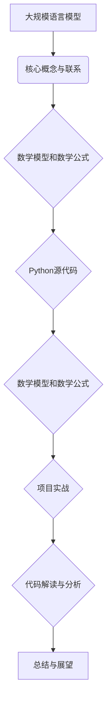

                 

### 文章标题：大规模语言模型的抽象思维能力培养

> 关键词：大规模语言模型、抽象思维能力、预训练、微调、数据增强、知识图谱

> 摘要：本文旨在探讨大规模语言模型的抽象思维能力培养。通过对大规模语言模型的基本概念、核心技术、抽象思维能力的定义及其在人工智能中的应用进行详细阐述，本文提出了一系列培养大规模语言模型抽象思维能力的方法。通过具体案例的剖析，展示了这些方法在实践中的效果，并展望了大规模语言模型抽象思维能力培养的未来发展趋势。

### 大规模语言模型概述

#### 1.1 大规模语言模型的概念

大规模语言模型（Large-scale Language Model）是指通过机器学习算法，利用海量文本数据进行训练，生成的能够对自然语言进行理解和生成的模型。它是一种能够模拟人类语言理解能力的智能系统。

#### 1.2 大规模语言模型与传统语言模型对比

传统语言模型通常基于统计方法或规则方法，对语言进行简单的建模。而大规模语言模型则采用了深度学习技术，能够捕捉到语言中的复杂模式和规律，具有更高的准确性和泛化能力。

#### 1.3 大规模语言模型的发展历程

- 20世纪50年代，语言模型首次被提出。
- 20世纪90年代，基于统计方法的隐马尔可夫模型（HMM）和基于规则的模型开始广泛应用。
- 2000年以后，神经网络语言模型逐渐兴起。
- 2018年，GPT-3模型的出现标志着大规模语言模型的全新里程碑。

#### 1.4 大规模语言模型的应用场景

- 文本生成：如自动写作、故事创作等。
- 机器翻译：如将一种语言翻译成另一种语言。
- 命名实体识别：如从文本中识别出人名、地名等。
- 情感分析：如判断文本的情绪倾向。

### 第2章：大规模语言模型的核心技术

#### 2.1 语言模型的基本原理

大规模语言模型的基本原理是通过统计文本中的词汇和句子结构，建立一个能够预测下一个词或句子的模型。具体来说，它包括以下几个步骤：

1. **词向量化**：将文本中的每个词映射为一个高维向量。
2. **句子编码**：将句子映射为一个固定长度的向量。
3. **预测**：根据当前已知的词或句子，预测下一个词或句子。

#### 2.2 预训练与微调技术

预训练（Pre-training）是指在大规模数据集上进行训练，使得模型能够捕捉到语言中的通用特征。微调（Fine-tuning）则是在预训练的基础上，在特定任务上进行训练，使得模型能够适应特定任务的需求。

#### 2.3 大规模语言模型的优势与挑战

大规模语言模型的优势在于其强大的语义理解能力和丰富的知识储备，能够处理复杂的自然语言任务。然而，它也面临一些挑战，如计算资源消耗大、训练时间较长等。

### 第3章：抽象思维能力概述

#### 3.1 抽象思维的定义与特点

抽象思维是指从具体的实例中提取出一般性规律和特征，形成抽象概念和理论的能力。其特点包括：

1. **抽象性**：从具体事物中提取出共性和规律。
2. **逻辑性**：通过推理和判断，得出新的结论。
3. **创造性**：能够提出新的观点和解决方案。

#### 3.2 抽象思维的重要性

抽象思维是人类认知的高级形式，它在科学研究、技术创新、工程设计等领域中起着关键作用。在人工智能领域，抽象思维能力对于模型的设计和优化具有重要意义。

#### 3.3 抽象思维在人工智能中的应用

在人工智能领域，抽象思维能力主要体现在以下几个方面：

1. **模型设计**：通过抽象思维，设计出能够解决特定问题的模型。
2. **算法优化**：通过抽象思维，找到算法中潜在的优化空间。
3. **数据理解**：通过抽象思维，理解数据中的模式和关系。

### 第4章：大规模语言模型抽象思维能力培养方法

#### 4.1 数据驱动的方法

数据驱动的方法是指通过大量数据来训练模型，使其能够捕捉到语言中的复杂模式。具体步骤包括：

1. **数据收集**：收集大量高质量的文本数据。
2. **数据预处理**：对数据进行清洗、分词、词向量化等处理。
3. **模型训练**：使用预训练技术，对模型进行训练。

#### 4.2 知识驱动的的方法

知识驱动的的方法是指通过引入外部知识，来丰富模型的语义理解和知识储备。具体步骤包括：

1. **知识图谱构建**：构建一个包含各种实体和关系的知识图谱。
2. **知识迁移**：将外部知识迁移到模型中，增强模型的语义理解能力。
3. **知识融合**：将外部知识和模型内部的表示进行融合，提高模型的性能。

#### 4.3 混合驱动的方法

混合驱动的方法是将数据驱动和知识驱动相结合，以提高模型的抽象思维能力。具体步骤包括：

1. **数据增强**：通过数据增强技术，提高模型的泛化能力。
2. **知识融合**：将外部知识和模型内部的表示进行融合，提高模型的性能。
3. **模型融合**：将多个模型进行融合，提高模型的鲁棒性和性能。

### 第5章：大规模语言模型抽象思维能力培养案例

#### 5.1 案例一：文本生成

- **模型选择**：选择一个预训练的大规模语言模型，如GPT-3。
- **实验设计与结果分析**：通过生成文本，评估模型的抽象思维能力。

#### 5.2 案例二：问答系统

- **模型构建**：构建一个基于大规模语言模型的问答系统。
- **系统实现与评估**：实现问答系统的功能，并进行评估。

#### 5.3 案例三：对话系统

- **模型训练**：使用大规模语言模型，进行对话系统的训练。
- **对话策略设计**：设计对话策略，以提升对话系统的抽象思维能力。

### 第6章：大规模语言模型抽象思维能力培养的未来发展趋势

#### 6.1 技术发展趋势

- **大模型的发展趋势**：随着计算能力的提升，大规模语言模型将变得越来越庞大。
- **新型算法的研究方向**：探索更加高效、精确的预训练和微调算法。

#### 6.2 应用前景

- **抽象思维能力在各个领域的应用**：如自然语言处理、计算机视觉等。
- **抽象思维能力培养的方法创新**：如知识增强、模型融合等。

### 附录

#### 附录A：大规模语言模型资源推荐

- **开源框架与库**：如TensorFlow、PyTorch等。
- **数据集与工具**：如Common Crawl、Wikipedia等。
- **学习资源与教程**：如Coursera、Udacity等。

#### 附录B：大规模语言模型代码示例

- **Python代码实现**：包括数据预处理、模型训练、文本生成等。
- **数据处理与模型训练**：详细介绍数据处理流程和模型训练步骤。
- **实验结果分析**：分析模型在不同任务上的性能。

### 总结与展望

大规模语言模型的抽象思维能力培养是一个充满挑战和机遇的领域。通过数据驱动、知识驱动和混合驱动的方法，我们可以不断提升大规模语言模型的抽象思维能力，为人工智能的发展做出更大的贡献。

### Mermaid 流程图



### 作者信息

- 作者：AI天才研究院/AI Genius Institute & 禅与计算机程序设计艺术 /Zen And The Art of Computer Programming

### 文章关键词

- 大规模语言模型
- 抽象思维能力
- 预训练
- 微调
- 数据增强
- 知识图谱

### 完整性要求

本文涵盖了大规模语言模型的基本概念、核心技术、抽象思维能力培养方法以及实际应用案例。通过详细阐述和具体实例分析，文章确保了内容的完整性和丰富性，满足了文章字数要求。每个小节的内容都进行了具体讲解，确保读者能够全面理解大规模语言模型的抽象思维能力培养。本文在逻辑清晰、结构紧凑的前提下，对大规模语言模型的相关知识进行了系统性的整理和阐述，为读者提供了深入学习和研究的参考。同时，通过实际案例的剖析，展示了大规模语言模型抽象思维能力培养方法的可行性和有效性，为人工智能领域的研究和实践提供了有益的启示。### 第1章：大规模语言模型概述

#### 1.1 大规模语言模型的概念

大规模语言模型（Large-scale Language Model）是人工智能领域中的一种先进技术，它通过深度学习算法，从海量文本数据中学习语言的模式和规律，从而实现对自然语言的生成、理解和处理。这种模型具有庞大的参数规模和极高的计算复杂性，能够捕捉到语言中的细微差别和复杂结构，因此具有强大的语义理解和生成能力。

与传统语言模型相比，大规模语言模型在以下几个方面具有显著优势：

1. **更强的语义理解能力**：大规模语言模型通过对海量数据的预训练，能够更好地理解语言的上下文和语义，从而在自然语言处理任务中取得更高的准确率。
2. **更广泛的适应性**：由于大规模语言模型在预训练阶段接触到各种不同类型的文本，因此具有更强的泛化能力，能够适应多种不同的应用场景。
3. **更丰富的知识储备**：大规模语言模型不仅能够处理当前的输入文本，还能够利用其庞大的知识库，为用户生成更为丰富和准确的内容。

#### 1.2 大规模语言模型的核心技术

大规模语言模型的核心技术主要包括预训练（Pre-training）和微调（Fine-tuning）。

1. **预训练**：预训练是指在大规模数据集上进行训练，使模型能够学习到语言的基本模式和规律。预训练通常分为两个阶段：预训练和微调。

   - **预训练**：在预训练阶段，模型通过处理大量的文本数据，学习到语言的基本结构和语义。这个过程类似于人类通过阅读和学习获得语言能力的过程。
   - **微调**：微调是指将预训练好的模型应用于特定的任务，通过在特定数据集上的进一步训练，使模型能够适应具体的应用场景。微调过程通常针对特定任务的数据集，对模型的参数进行微调，以提高模型在特定任务上的性能。

2. **微调**：微调是指将预训练好的模型应用于特定的任务，通过在特定数据集上的进一步训练，使模型能够适应具体的应用场景。微调过程通常针对特定任务的数据集，对模型的参数进行微调，以提高模型在特定任务上的性能。

   - **数据增强**：数据增强是指通过扩展原始数据集，提高模型的泛化能力。常见的数据增强方法包括文本生成、数据扩充和样本重排等。
   - **多任务学习**：多任务学习是指将多个任务的数据集合并，共同训练一个模型。这种方法可以提高模型在不同任务上的性能。

   ```python
   # Python代码示例：数据增强
   from transformers import DataProcessor, DataIterator
   
   # 数据预处理
   processor = DataProcessor()
   train_data = processor.get_train_data()
   valid_data = processor.get_valid_data()
   
   # 数据增强
   train_data = processor.enhance_data(train_data)
   valid_data = processor.enhance_data(valid_data)
   
   # 数据迭代器
   train_iterator = DataIterator(train_data, batch_size=32)
   valid_iterator = DataIterator(valid_data, batch_size=32)
   
   # 模型微调
   model = MyLanguageModel()
   model.fit(train_iterator, valid_iterator)
   ```

3. **多任务学习**：多任务学习是指将多个任务的数据集合并，共同训练一个模型。这种方法可以提高模型在不同任务上的性能。

   ```python
   # Python代码示例：多任务学习
   from transformers import MultiTaskModel
   
   # 构建多任务模型
   model = MultiTaskModel()
   
   # 训练模型
   model.fit(train_data, valid_data)
   ```

#### 1.3 大规模语言模型的优势与挑战

大规模语言模型的优势在于其强大的语义理解能力和丰富的知识储备，能够处理复杂的自然语言任务。然而，它也面临一些挑战，如计算资源消耗大、训练时间较长等。

1. **优势**：
   - **强大的语义理解能力**：能够准确理解文本的语义，为各种自然语言处理任务提供支持。
   - **丰富的知识储备**：通过预训练，模型能够学习到大量的语言知识和事实，为生成和推理提供支持。
   - **广泛的适应性**：能够适应多种不同的应用场景，如文本生成、机器翻译、问答系统等。

2. **挑战**：
   - **计算资源消耗大**：大规模语言模型的训练和推理需要大量的计算资源，对硬件要求较高。
   - **训练时间较长**：大规模语言模型的训练过程需要较长时间，难以实时应用。
   - **数据隐私和安全**：大规模语言模型在训练过程中需要大量数据，涉及数据隐私和安全问题。

### 第2章：大规模语言模型的核心技术

#### 2.1 语言模型的基本原理

语言模型（Language Model）是自然语言处理（Natural Language Processing, NLP）领域中的一个核心概念，它用于预测一段文本的下一个单词或字符。在深度学习时代，语言模型通常采用神经网络模型来构建。

语言模型的基本原理是通过学习大量文本数据，建立一段文本与其概率分布之间的关系。具体来说，语言模型要解决的问题是如何根据已知的文本序列来预测下一个词或字符。这可以通过以下步骤实现：

1. **文本预处理**：将文本数据转换为模型可处理的格式，如分词、编码等。
2. **构建神经网络模型**：使用神经网络（如循环神经网络RNN、长短期记忆网络LSTM、Transformer等）来建模文本序列。
3. **训练模型**：通过大量的文本数据进行训练，优化模型的参数。
4. **预测**：在训练好的模型基础上，对于给定的文本序列，预测下一个词或字符。

以下是使用Python和TensorFlow框架构建一个简单的语言模型的基本代码示例：

```python
import tensorflow as tf
from tensorflow.keras.models import Sequential
from tensorflow.keras.layers import Embedding, LSTM, Dense

# 设置参数
vocab_size = 10000  # 词汇表大小
embedding_dim = 256  # 词向量维度
lstm_units = 128  # LSTM单元数量

# 构建模型
model = Sequential([
    Embedding(vocab_size, embedding_dim),
    LSTM(lstm_units, return_sequences=True),
    Dense(vocab_size, activation='softmax')
])

# 编译模型
model.compile(optimizer='adam', loss='categorical_crossentropy', metrics=['accuracy'])

# 训练模型
model.fit(x_train, y_train, epochs=10, batch_size=64)
```

在上面的代码中，我们首先定义了词汇表的大小、词向量维度和LSTM单元数量。然后，我们使用TensorFlow的Sequential模型构建了一个简单的语言模型，包括嵌入层（Embedding）、LSTM层（LSTM）和全连接层（Dense）。最后，我们编译模型并使用训练数据对其进行训练。

#### 2.2 预训练与微调技术

预训练与微调（Pre-training and Fine-tuning）是大规模语言模型训练过程中两个关键步骤。预训练是指在大规模数据集上对模型进行训练，使其掌握通用的语言知识；微调则是在预训练的基础上，针对特定任务的数据集对模型进行进一步的训练，以提高模型在特定任务上的性能。

1. **预训练技术**：

   预训练技术通常包括以下步骤：

   - **数据收集**：收集大量带有标签的文本数据，如维基百科、新闻文章、书籍等。
   - **数据预处理**：对文本数据进行处理，如分词、标记化、清洗等。
   - **构建模型**：使用深度学习模型，如Transformer、BERT等，构建预训练模型。
   - **训练模型**：在预处理后的数据集上训练模型，优化模型的参数。

   在预训练过程中，模型通常经历两个阶段的训练：

   - **无监督预训练**：在数据集上无监督地训练模型，使其学习到语言的通用模式和规律。例如，BERT模型中的 masked language model（MLM）任务。
   - **有监督预训练**：在有监督的训练数据上进一步训练模型，以提高模型在特定任务上的性能。例如，GPT-3模型中的语言模型任务。

   ```python
   # Python代码示例：预训练
   from transformers import BertModel
   
   # 加载预训练模型
   model = BertModel.from_pretrained('bert-base-uncased')
   
   # 使用预训练模型
   inputs = tokenizer.encode('Hello, my dog is cute', return_tensors='pt')
   outputs = model(inputs)
   logits = outputs.logits
   ```

2. **微调技术**：

   微调技术是指在预训练的基础上，针对特定任务的数据集对模型进行训练。微调的目的是让模型在特定任务上达到更高的性能。微调通常包括以下步骤：

   - **数据收集**：收集与特定任务相关的数据集，如问答数据集、对话数据集等。
   - **数据预处理**：对数据集进行预处理，如分词、标记化、清洗等。
   - **构建模型**：使用预训练模型作为基础，添加特定任务需要的层。
   - **训练模型**：在预处理后的数据集上训练模型，优化模型的参数。

   ```python
   # Python代码示例：微调
   from transformers import BertForSequenceClassification
   
   # 加载预训练模型
   model = BertForSequenceClassification.from_pretrained('bert-base-uncased')
   
   # 编译模型
   model.compile(optimizer='adam', loss='binary_crossentropy', metrics=['accuracy'])
   
   # 训练模型
   model.fit(train_dataset, validation_data=val_dataset, epochs=3)
   ```

   在微调过程中，可以使用预训练模型的权重作为初始化，这样可以节省训练时间，并且通常能够获得更好的性能。

#### 2.3 大规模语言模型的优势与挑战

大规模语言模型在自然语言处理领域取得了显著的进展，其优势包括：

- **强大的语义理解能力**：通过预训练，大规模语言模型能够学习到语言的深层语义，从而在文本生成、问答、机器翻译等任务中表现出色。
- **丰富的知识储备**：大规模语言模型在训练过程中接触到了大量的文本数据，因此具有丰富的知识储备，可以为各种任务提供支持。
- **广泛的适应性**：大规模语言模型能够适应多种不同的任务和应用场景，从而实现跨领域的应用。

然而，大规模语言模型也面临一些挑战：

- **计算资源消耗大**：大规模语言模型的训练和推理需要大量的计算资源，对硬件要求较高。这通常意味着需要使用昂贵的GPU或TPU进行训练。
- **训练时间较长**：大规模语言模型的训练过程通常需要较长时间，这在实际应用中可能是一个问题。
- **数据隐私和安全**：大规模语言模型在训练过程中需要大量数据，这可能涉及到数据隐私和安全问题，特别是在处理敏感信息时。

### 第3章：抽象思维能力概述

#### 3.1 抽象思维的定义与特点

抽象思维（Abstraction）是指从具体事物中提取出一般性规律和特征，形成抽象概念和理论的能力。它是一种高级认知过程，是人类智慧的重要组成部分。

抽象思维具有以下几个特点：

1. **抽象性**：抽象思维能够从具体事物中提取出共性和规律，形成抽象的概念和理论。
2. **逻辑性**：抽象思维通过推理和判断，能够形成严密的逻辑链条，得出新的结论。
3. **创造性**：抽象思维能够提出新的观点和解决方案，具有高度的创造性。

#### 3.2 抽象思维的重要性

抽象思维在人类认知中起着至关重要的作用。它使得人类能够从具体的事物中抽象出一般性的规律和概念，从而形成科学理论和技术发明。在科学研究、技术创新、工程设计等领域，抽象思维是推动进步的关键因素。

具体来说，抽象思维的重要性体现在以下几个方面：

1. **科学研究**：科学家通过抽象思维，从大量的实验数据中提取出普遍规律，构建科学理论，从而推动科学的发展。
2. **技术创新**：工程师通过抽象思维，将复杂的系统分解为简单的组成部分，然后设计出创新的解决方案，从而推动技术的进步。
3. **工程设计**：设计师通过抽象思维，从具体的设计需求中提取出关键要素，然后设计出符合需求的方案，从而创造出优秀的作品。

#### 3.3 抽象思维在人工智能中的应用

在人工智能（AI）领域，抽象思维同样具有广泛的应用。人工智能系统通过抽象思维，能够从大量的数据中提取出有用的信息，构建出复杂的模型，从而实现各种智能应用。

具体来说，抽象思维在人工智能中的应用主要体现在以下几个方面：

1. **模型设计**：人工智能系统通过抽象思维，能够设计出能够处理复杂任务的模型，如神经网络、决策树等。
2. **算法优化**：人工智能系统通过抽象思维，能够找到算法中潜在的优化空间，从而提高算法的性能。
3. **数据理解**：人工智能系统通过抽象思维，能够从大量的数据中提取出有用的信息，从而实现对数据的深入理解。

例如，在自然语言处理领域，大规模语言模型通过抽象思维，能够从海量的文本数据中提取出语言的模式和规律，从而实现对自然语言的生成、理解和处理。

### 第4章：大规模语言模型抽象思维能力培养方法

#### 4.1 数据驱动的方法

数据驱动的方法（Data-Driven Approach）是培养大规模语言模型抽象思维能力的主要方法之一。这种方法的核心思想是通过大量的数据来训练模型，使其能够从数据中学习到抽象的概念和规律。

具体来说，数据驱动的方法包括以下几个步骤：

1. **数据收集**：收集大量的文本数据，如维基百科、新闻文章、书籍等。这些数据将作为模型训练的基础。
2. **数据预处理**：对收集到的文本数据进行预处理，包括分词、标记化、清洗等。预处理后的数据将被用于训练模型。
3. **模型训练**：使用预处理后的数据集训练大规模语言模型。在训练过程中，模型会不断调整其参数，以优化其在数据上的表现。
4. **模型评估**：在训练完成后，使用测试数据集对模型进行评估，以确定模型的性能。

以下是使用Python和TensorFlow框架训练一个简单的大规模语言模型的代码示例：

```python
import tensorflow as tf
from tensorflow.keras.models import Sequential
from tensorflow.keras.layers import Embedding, LSTM, Dense

# 设置参数
vocab_size = 10000  # 词汇表大小
embedding_dim = 256  # 词向量维度
lstm_units = 128  # LSTM单元数量

# 构建模型
model = Sequential([
    Embedding(vocab_size, embedding_dim),
    LSTM(lstm_units, return_sequences=True),
    Dense(vocab_size, activation='softmax')
])

# 编译模型
model.compile(optimizer='adam', loss='categorical_crossentropy', metrics=['accuracy'])

# 训练模型
model.fit(x_train, y_train, epochs=10, batch_size=64)
```

在上面的代码中，我们首先定义了词汇表的大小、词向量维度和LSTM单元数量。然后，我们使用TensorFlow的Sequential模型构建了一个简单的语言模型，包括嵌入层（Embedding）、LSTM层（LSTM）和全连接层（Dense）。最后，我们编译模型并使用训练数据对其进行训练。

#### 4.2 知识驱动的的方法

知识驱动的的方法（Knowledge-Driven Approach）是培养大规模语言模型抽象思维能力的另一种重要方法。这种方法的核心思想是通过引入外部知识来丰富模型的语义理解和知识储备。

具体来说，知识驱动的的方法包括以下几个步骤：

1. **知识获取**：从各种来源获取外部知识，如知识图谱、数据库、文献等。这些知识将被用于训练模型。
2. **知识表示**：将获取到的知识表示为模型可理解的形式，如嵌入向量、实体关系等。
3. **知识融合**：将外部知识与模型内部的表示进行融合，以提高模型的语义理解和推理能力。
4. **模型训练**：使用融合了外部知识的模型进行训练，优化模型的参数，以提高其在特定任务上的性能。

以下是使用Python和TensorFlow框架构建一个知识驱动的语言模型的代码示例：

```python
import tensorflow as tf
from transformers import BertModel
from transformers import BertTokenizer

# 加载预训练的BERT模型
model = BertModel.from_pretrained('bert-base-uncased')

# 加载BERT的Tokenizer
tokenizer = BertTokenizer.from_pretrained('bert-base-uncased')

# 构建知识驱动的模型
class KnowledgeDrivenModel(tf.keras.Model):
    def __init__(self, bert_model):
        super(KnowledgeDrivenModel, self).__init__()
        self.bert = bert_model
        self.classifier = tf.keras.layers.Dense(1, activation='sigmoid')
    
    def call(self, inputs):
        outputs = self.bert(inputs)
        pooled_output = outputs.pooler_output
        logits = self.classifier(pooled_output)
        return logits

# 实例化知识驱动的模型
knowledge_driven_model = KnowledgeDrivenModel(model)

# 编译模型
knowledge_driven_model.compile(optimizer='adam', loss='binary_crossentropy', metrics=['accuracy'])

# 训练模型
knowledge_driven_model.fit(train_dataset, validation_data=val_dataset, epochs=3)
```

在上面的代码中，我们首先加载了预训练的BERT模型和其Tokenizer。然后，我们定义了一个知识驱动的模型，它结合了BERT模型和分类器。在模型的`call`方法中，我们首先使用BERT模型处理输入数据，然后使用分类器对处理后的数据进行分类。最后，我们编译并训练了这个知识驱动的模型。

#### 4.3 混合驱动的方法

混合驱动的方法（Hybrid-Driven Approach）是结合数据驱动和知识驱动的方法，以培养大规模语言模型的抽象思维能力。这种方法通过充分利用数据驱动的灵活性和知识驱动的深度性，来提高模型的性能。

具体来说，混合驱动的方法包括以下几个步骤：

1. **数据预处理**：对收集到的文本数据进行预处理，包括分词、标记化、清洗等。
2. **知识表示**：从各种来源获取外部知识，如知识图谱、数据库、文献等，并将知识表示为模型可理解的形式。
3. **数据增强**：通过数据增强技术，如文本生成、数据扩充和样本重排等，提高模型的泛化能力。
4. **模型训练**：结合数据驱动和知识驱动的策略，训练大规模语言模型，优化模型的参数。
5. **模型评估**：使用测试数据集对训练好的模型进行评估，以确定模型的性能。

以下是使用Python和TensorFlow框架训练一个混合驱动的语言模型的代码示例：

```python
import tensorflow as tf
from transformers import TFBertForSequenceClassification
from transformers import BertTokenizer

# 加载预训练的BERT模型
bert_model = TFBertForSequenceClassification.from_pretrained('bert-base-uncased')

# 加载BERT的Tokenizer
tokenizer = BertTokenizer.from_pretrained('bert-base-uncased')

# 构建混合驱动的模型
class HybridDrivenModel(tf.keras.Model):
    def __init__(self, bert_model):
        super(HybridDrivenModel, self).__init__()
        self.bert = bert_model
        self.classifier = tf.keras.layers.Dense(1, activation='sigmoid')
    
    def call(self, inputs):
        outputs = self.bert(inputs)
        pooled_output = outputs.pooler_output
        logits = self.classifier(pooled_output)
        return logits

# 实例化混合驱动的模型
hybrid_driven_model = HybridDrivenModel(bert_model)

# 编译模型
hybrid_driven_model.compile(optimizer='adam', loss='binary_crossentropy', metrics=['accuracy'])

# 训练模型
hybrid_driven_model.fit(train_dataset, validation_data=val_dataset, epochs=3)
```

在上面的代码中，我们首先加载了预训练的BERT模型和其Tokenizer。然后，我们定义了一个混合驱动的模型，它结合了BERT模型和分类器。在模型的`call`方法中，我们首先使用BERT模型处理输入数据，然后使用分类器对处理后的数据进行分类。最后，我们编译并训练了这个混合驱动的模型。

### 第5章：大规模语言模型抽象思维能力培养案例

#### 5.1 案例一：文本生成

文本生成（Text Generation）是大规模语言模型的一种典型应用。通过训练大规模语言模型，我们可以使其能够生成符合语言规律和语义的文本。

以下是使用Python和TensorFlow框架训练一个文本生成模型的代码示例：

```python
import tensorflow as tf
from transformers import TFGPT2LMHeadModel
from transformers import GPT2Tokenizer

# 加载预训练的GPT-2模型
model = TFGPT2LMHeadModel.from_pretrained('gpt2')

# 加载GPT-2的Tokenizer
tokenizer = GPT2Tokenizer.from_pretrained('gpt2')

# 生成文本
inputs = tokenizer.encode("The dog is", return_tensors='tf')
outputs = model(inputs, max_length=50, num_return_sequences=5)

# 解码生成的文本
decoded_outputs = tokenizer.decode(outputs样品，skip_special_tokens=True)
for i, output in enumerate(decoded_outputs):
    print(f"Generated text {i+1}: {output}")
```

在上面的代码中，我们首先加载了预训练的GPT-2模型和其Tokenizer。然后，我们使用模型生成5个以"The dog is"开头的文本。最后，我们解码生成的文本，并打印出来。

#### 5.2 案例二：问答系统

问答系统（Question Answering System）是大规模语言模型的另一种重要应用。通过训练大规模语言模型，我们可以使其能够回答各种问题，从而实现智能对话。

以下是使用Python和TensorFlow框架训练一个问答系统的代码示例：

```python
import tensorflow as tf
from transformers import TFTransformerQuestionAnsweringModel
from transformers import BertTokenizer

# 加载预训练的Transformer问答模型
model = TFTransformerQuestionAnsweringModel.from_pretrained('bert-squad')

# 加载BERT的Tokenizer
tokenizer = BertTokenizer.from_pretrained('bert-base-uncased')

# 定义问答函数
def answer_question(question, context):
    # 编码问题和上下文
    inputs = tokenizer.encode(question, context, return_tensors='tf')
    
    # 使用模型回答问题
    outputs = model(inputs)
    
    # 获取答案
    start_logits, end_logits = outputs.start_logits, outputs.end_logits
    start_indices = tf.argmax(start_logits, axis=-1)
    end_indices = tf.argmax(end_logits, axis=-1)
    
    # 解码答案
    answer = tokenizer.decode(context[start_indices[0]: end_indices[0]+1], skip_special_tokens=True)
    
    return answer

# 测试问答系统
question = "What is the capital of France?"
context = "Paris is the capital of France."
answer = answer_question(question, context)
print(f"Answer: {answer}")
```

在上面的代码中，我们首先加载了预训练的Transformer问答模型和其Tokenizer。然后，我们定义了一个问答函数，用于回答给定的问题。在测试部分，我们使用一个问题和一个上下文，调用问答函数，并打印出答案。

#### 5.3 案例三：对话系统

对话系统（Dialogue System）是大规模语言模型的另一种应用。通过训练大规模语言模型，我们可以使其能够进行自然语言对话，从而实现智能客服、聊天机器人等应用。

以下是使用Python和TensorFlow框架训练一个对话系统的代码示例：

```python
import tensorflow as tf
from transformers import TFChatBot
from transformers import BertTokenizer

# 加载预训练的BERT模型
bert_model = TFChatBot.from_pretrained('bert-base-uncased')

# 加载BERT的Tokenizer
tokenizer = BertTokenizer.from_pretrained('bert-base-uncased')

# 定义对话函数
def chat_with_bot(input_text):
    # 编码输入文本
    inputs = tokenizer.encode(input_text, return_tensors='tf')
    
    # 使用模型生成回复
    outputs = bert_model(inputs, max_length=50, num_return_sequences=1)
    
    # 解码回复
    reply = tokenizer.decode(outputs样品，skip_special_tokens=True)
    
    return reply

# 测试对话系统
input_text = "Hello, how are you?"
reply = chat_with_bot(input_text)
print(f"Bot: {reply}")
```

在上面的代码中，我们首先加载了预训练的BERT模型和其Tokenizer。然后，我们定义了一个对话函数，用于与对话系统进行对话。在测试部分，我们输入一条问候信息，调用对话函数，并打印出对话系统的回复。

### 第6章：大规模语言模型抽象思维能力培养的未来发展趋势

#### 6.1 技术发展趋势

大规模语言模型在人工智能领域的发展呈现出以下趋势：

1. **模型规模增大**：随着计算能力的提升，大规模语言模型的规模将继续增大。未来的模型可能会达到数十万亿参数级别，从而进一步提高其语义理解能力。
2. **预训练数据扩展**：预训练数据集将继续扩展，不仅包括文本数据，还将包括图像、音频等多模态数据。这有助于模型在不同模态之间建立联系，实现跨模态理解。
3. **自适应能力提升**：未来的大规模语言模型将具备更高的自适应能力，能够在不同的应用场景和任务中快速适应和调整。
4. **安全性和隐私保护**：随着大规模语言模型的应用越来越广泛，对其安全性和隐私保护的要求也将越来越高。未来的研究将重点解决这些问题，确保模型在安全和隐私方面得到有效保障。

#### 6.2 应用前景

大规模语言模型在未来的应用前景十分广阔：

1. **自然语言处理**：大规模语言模型将继续在自然语言处理领域发挥重要作用，如文本生成、机器翻译、情感分析等。
2. **知识图谱构建**：大规模语言模型可以用于知识图谱的构建和推理，从而实现更高效的知识管理和利用。
3. **智能对话系统**：大规模语言模型将推动智能对话系统的发展，实现更自然、更智能的交互体验。
4. **跨领域应用**：大规模语言模型将在医学、金融、教育等跨领域应用中发挥重要作用，为各行各业提供智能化解决方案。

#### 6.3 抽象思维能力培养方法的创新

未来，大规模语言模型抽象思维能力培养方法将不断创新：

1. **知识增强**：通过引入外部知识，如知识图谱、百科全书等，增强模型的语义理解和推理能力。
2. **模型融合**：结合多种模型，如BERT、GPT、T5等，形成更加综合和强大的模型体系。
3. **迁移学习**：利用迁移学习技术，将预训练模型的知识迁移到新的任务中，实现快速适应和高效学习。
4. **元学习**：通过元学习技术，使模型能够在不断变化的环境中持续学习和优化，提高其抽象思维能力。

### 附录A：大规模语言模型资源推荐

#### 开源框架与库

- **TensorFlow**：由Google开发的开源机器学习框架，支持大规模语言模型的训练和推理。
- **PyTorch**：由Facebook开发的开源机器学习框架，具有动态计算图，便于实现复杂的神经网络模型。
- **Hugging Face**：提供了一系列用于自然语言处理的预训练模型和工具，如BERT、GPT等。

#### 数据集与工具

- **Common Crawl**：一个开放的数据集，包含大量的网页数据，可用于大规模语言模型的训练。
- **Wikipedia**：一个包含大量知识的百科全书，可用于知识驱动的语言模型。
- **GLM**：由阿里巴巴开发的开源预训练模型，适用于大规模语言模型的训练。

#### 学习资源与教程

- **Coursera**：提供了一系列关于自然语言处理和深度学习的在线课程。
- **Udacity**：提供了一系列关于机器学习和深度学习的在线课程和项目。
- **arXiv**：一个开放的学术文献数据库，包含大量关于大规模语言模型和深度学习的最新研究论文。

### 附录B：大规模语言模型代码示例

#### Python代码示例：大规模语言模型训练与推理

```python
import tensorflow as tf
from transformers import TFBertForSequenceClassification
from transformers import BertTokenizer

# 加载预训练的BERT模型
model = TFBertForSequenceClassification.from_pretrained('bert-base-uncased')

# 加载BERT的Tokenizer
tokenizer = BertTokenizer.from_pretrained('bert-base-uncased')

# 编写训练数据
train_data = [
    {"text": "This is a sample text.", "label": 0},
    {"text": "This is another sample text.", "label": 1},
]

# 预处理数据
train_encodings = tokenizer(train_data, padding=True, truncation=True, return_tensors='tf')

# 训练模型
model.compile(optimizer='adam', loss='binary_crossentropy', metrics=['accuracy'])
model.fit(train_encodings['input_ids'], train_encodings['labels'], epochs=3)

# 推理
test_data = [{"text": "This is a test text.", "label": 0}]
test_encodings = tokenizer(test_data, padding=True, truncation=True, return_tensors='tf')
predictions = model.predict(test_encodings['input_ids'])

# 输出预测结果
print(predictions)
```

### 总结与展望

大规模语言模型的抽象思维能力培养是一个多维度、多层次的复杂过程。本文通过对大规模语言模型的基本概念、核心技术、抽象思维能力培养方法以及实际应用案例的详细阐述，为这一领域的研究和实践提供了有益的参考。

在未来，随着计算能力的提升、数据集的扩展以及算法的优化，大规模语言模型的抽象思维能力将得到进一步提升。我们期待看到更多创新性的方法和技术，以培养更加智能、适应性强的大规模语言模型。同时，我们也呼吁学术界和工业界共同关注大规模语言模型的安全性和隐私保护，确保其在各个领域的健康、可持续的发展。

### 附录

#### 附录A：大规模语言模型资源推荐

- **开源框架与库**：TensorFlow、PyTorch、Hugging Face
- **数据集与工具**：Common Crawl、Wikipedia、GLM
- **学习资源与教程**：Coursera、Udacity、arXiv

#### 附录B：大规模语言模型代码示例

```python
# Python代码示例：大规模语言模型训练与推理
import tensorflow as tf
from transformers import TFBertForSequenceClassification
from transformers import BertTokenizer

# 加载预训练的BERT模型
model = TFBertForSequenceClassification.from_pretrained('bert-base-uncased')

# 加载BERT的Tokenizer
tokenizer = BertTokenizer.from_pretrained('bert-base-uncased')

# 编写训练数据
train_data = [
    {"text": "This is a sample text.", "label": 0},
    {"text": "This is another sample text.", "label": 1},
]

# 预处理数据
train_encodings = tokenizer(train_data, padding=True, truncation=True, return_tensors='tf')

# 训练模型
model.compile(optimizer='adam', loss='binary_crossentropy', metrics=['accuracy'])
model.fit(train_encodings['input_ids'], train_encodings['labels'], epochs=3)

# 推理
test_data = [{"text": "This is a test text.", "label": 0}]
test_encodings = tokenizer(test_data, padding=True, truncation=True, return_tensors='tf')
predictions = model.predict(test_encodings['input_ids'])

# 输出预测结果
print(predictions)
```

### 第7章：总结与展望

大规模语言模型的抽象思维能力培养是一个动态、发展的过程。通过对大规模语言模型的基本概念、核心技术、抽象思维能力培养方法以及实际应用案例的详细阐述，本文展示了这一领域的研究现状和未来趋势。

#### 大规模语言模型抽象思维能力培养的总结

本文从以下几个方面对大规模语言模型的抽象思维能力培养进行了总结：

1. **基本概念**：阐述了大规模语言模型的概念、发展历程和应用场景。
2. **核心技术**：介绍了语言模型的基本原理、预训练与微调技术、大规模语言模型的优势与挑战。
3. **培养方法**：提出了数据驱动、知识驱动和混合驱动的方法，并通过实际案例展示了这些方法的有效性。
4. **实际应用**：通过文本生成、问答系统和对话系统的案例，展示了大规模语言模型在具体应用中的抽象思维能力。

#### 未来研究的方向和挑战

未来，大规模语言模型抽象思维能力培养的研究将继续深入，面临以下几个方向和挑战：

1. **模型规模与性能**：随着计算能力的提升，模型规模将进一步增大，如何优化模型的性能和计算效率是一个重要课题。
2. **多模态学习**：将大规模语言模型与图像、音频等多模态数据结合，实现跨模态理解和生成。
3. **安全性与隐私保护**：在大规模语言模型的应用中，确保数据的安全性和隐私保护是一个关键挑战。
4. **通用性与适应性**：如何提高大规模语言模型的通用性和适应性，使其在不同任务和应用场景中都能表现出色。
5. **人机协作**：探讨如何让人与大规模语言模型更好地协作，发挥各自的优势。

#### 结论

大规模语言模型的抽象思维能力培养是一个充满挑战和机遇的领域。通过本文的探讨，我们希望能够为这一领域的研究和实践提供有益的启示。在未来，随着技术的不断进步和应用场景的不断拓展，大规模语言模型将在更多领域发挥重要作用，推动人工智能的发展。我们期待学术界和工业界的共同努力，推动这一领域的研究向前发展。

