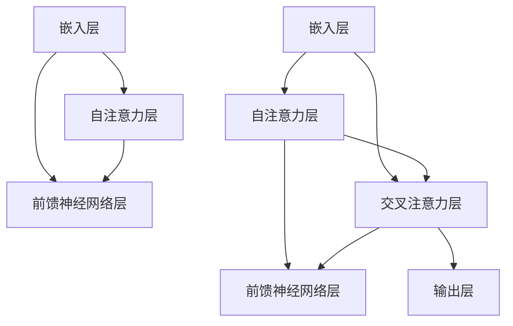

                 

### 第1章 引言

大规模语言模型是一种先进的自然语言处理技术，通过在大量文本数据上进行预训练，能够捕捉到语言的复杂结构和规律。随着深度学习技术的不断发展，大规模语言模型在自然语言处理领域的应用越来越广泛，对各种语言任务的效果有了显著的提升。本章将介绍大规模语言模型的基本概念、发展历程以及应用场景，旨在帮助读者建立对这一技术的全面了解。

#### 什么是大规模语言模型

大规模语言模型是一种基于深度学习的自然语言处理技术，通过对大量文本数据进行预训练，模型可以自动学习到语言的各种复杂结构和规律。这些模型通常由多层神经网络组成，包括编码器和解码器，能够对输入的文本进行理解和生成。大规模语言模型的一个关键特点是，它们不仅在预训练阶段使用了大量的文本数据，还在后续的微调阶段针对特定的任务进行优化，这使得它们在处理各种自然语言任务时表现出色。

#### 大规模语言模型的发展历程

大规模语言模型的发展经历了多个阶段。从最初的基于统计的模型，如N元语法模型，到基于规则的方法，如统计语言模型，再到基于神经网络的模型，如深度神经网络模型，每一个阶段都有显著的进展。近年来，预训练语言模型如BERT、GPT等的出现，使得大规模语言模型进入了一个新的阶段。这些模型通过在大量无标注数据上进行预训练，再通过微调针对特定任务进行优化，取得了巨大的成功。

#### 大规模语言模型的应用场景

大规模语言模型在自然语言处理领域有着广泛的应用，包括文本分类、命名实体识别、机器翻译、问答系统等。在文本分类任务中，模型可以自动识别文本的主题和情感；在命名实体识别任务中，模型可以识别文本中的特定实体，如人名、地点等；在机器翻译任务中，模型可以自动翻译不同语言之间的文本；在问答系统任务中，模型可以回答用户提出的问题。大规模语言模型在这些应用场景中表现出色，成为自然语言处理领域的重要工具。

本章将详细探讨大规模语言模型的基本概念、发展历程和应用场景，帮助读者全面了解这一技术。在接下来的章节中，我们将深入讨论预训练语言模型的原理、架构和训练过程，以及抽象概念学习的挑战和方法。希望通过这一系列的探讨，读者能够对大规模语言模型有更深入的理解和应用。

### 1.1 什么是大规模语言模型

大规模语言模型（Large-scale Language Models）是一种基于深度学习的自然语言处理技术，通过在大量的文本数据上进行预训练，模型能够自动学习到语言的复杂结构和语义信息。这种模型通常包含多层神经网络，包括编码器和解码器，能够对输入的文本进行理解和生成。

大规模语言模型的核心在于“预训练”和“微调”两个阶段。在预训练阶段，模型在大量无标注的文本数据上进行训练，学习到语言的通用特征和规律。这个过程类似于人类的学习过程，通过阅读大量的书籍、文章，逐渐掌握语言的基本结构和语义。在预训练的基础上，模型再通过微调（Fine-tuning）阶段，针对具体的任务进行优化，从而在特定任务上取得更好的性能。

#### 大规模语言模型的基本原理

大规模语言模型的基本原理可以概括为以下几个关键点：

1. **多层神经网络结构**：大规模语言模型通常由多层神经网络组成，包括编码器和解码器。编码器将输入的文本转换为固定长度的向量表示，解码器则根据这些向量表示生成文本。

2. **嵌入层**：嵌入层是将词汇转换为向量表示的关键层。通过嵌入层，模型可以学习到词汇之间的相似性和关系。

3. **注意力机制**：注意力机制（Attention Mechanism）是一种用于捕捉输入文本中关键信息的技术。通过注意力机制，模型能够自动识别文本中的重要信息，从而提高模型的理解能力。

4. **预训练**：预训练是大规模语言模型的核心。在预训练阶段，模型在大量无标注的文本数据上学习到语言的通用特征和规律，这些特征和规律对于后续的任务具有通用性。

5. **微调**：微调是在预训练基础上，针对具体任务对模型进行优化。通过微调，模型能够针对特定的任务，如文本分类、命名实体识别等，提高模型的性能。

#### 大规模语言模型的关键组件

1. **编码器（Encoder）**：编码器的功能是将输入的文本转换为固定长度的向量表示。这种向量表示通常称为“上下文向量”或“嵌入向量”。编码器通过多层神经网络结构，如Transformer模型中的自注意力机制（Self-Attention），能够捕捉到输入文本中的长距离依赖关系。

2. **解码器（Decoder）**：解码器的功能是根据编码器输出的向量表示生成输出文本。解码器也由多层神经网络组成，通过自注意力机制和交叉注意力机制（Cross-Attention），能够同时关注编码器的输出和输入的序列信息，从而生成合理的输出文本。

3. **嵌入层（Embedding Layer）**：嵌入层是将词汇转换为向量表示的关键层。在预训练阶段，模型通过在大量文本数据上学习词汇的嵌入向量，能够捕捉到词汇之间的相似性和关系。这种嵌入向量对于后续的任务具有通用性。

4. **注意力机制（Attention Mechanism）**：注意力机制是一种用于捕捉输入文本中关键信息的技术。通过注意力机制，模型能够自动识别文本中的重要信息，从而提高模型的理解能力。常见的注意力机制包括自注意力机制（Self-Attention）和交叉注意力机制（Cross-Attention）。

#### 大规模语言模型的优势和应用

大规模语言模型在自然语言处理领域具有显著的优势，主要包括以下几个方面：

1. **强大的语义理解能力**：通过在大量文本数据上预训练，大规模语言模型能够学习到丰富的语义信息，从而在文本分类、命名实体识别等任务中表现出色。

2. **高效率的模型训练**：大规模语言模型采用多层神经网络结构和注意力机制，能够高效地处理大规模文本数据，从而提高模型的训练速度。

3. **多任务学习**：大规模语言模型通过在多个任务上进行预训练，能够共享任务间的知识，从而实现多任务学习。这种能力使得大规模语言模型能够同时处理多种自然语言任务，提高模型的泛化能力。

4. **自适应微调**：大规模语言模型通过微调阶段，能够针对特定任务进行优化，从而提高模型在特定任务上的性能。

大规模语言模型在自然语言处理领域有着广泛的应用，包括但不限于以下任务：

- **文本分类**：利用大规模语言模型进行文本分类，能够自动识别文本的主题和情感，如情感分析、新闻分类等。
- **命名实体识别**：通过大规模语言模型进行命名实体识别，能够自动识别文本中的特定实体，如人名、地点、组织等。
- **机器翻译**：大规模语言模型在机器翻译任务中表现出色，能够自动翻译不同语言之间的文本。
- **问答系统**：通过大规模语言模型进行问答系统，能够回答用户提出的问题，如智能客服、在线问答等。

总之，大规模语言模型是一种具有强大语义理解能力和广泛应用前景的技术，在自然语言处理领域具有巨大的潜力。

#### 1.2 大规模语言模型的发展历程

大规模语言模型的发展历程可以追溯到20世纪90年代，从最初的统计模型到现代的深度学习模型，每一个阶段都取得了重要的进展。以下将回顾这些发展阶段，并介绍每个阶段的关键进展和代表人物。

##### 1.2.1 统计模型阶段

早期的大规模语言模型主要基于统计模型，如N元语法模型。N元语法模型通过计算连续N个词的概率来预测下一个词。1986年，拉法尔·普劳尔（Ralph K. S. Prather）等人提出了N元语法模型，这是大规模语言模型发展的起点。1990年代，约翰·洛卡多（John Lucker）等人进一步改进了N元语法模型，提出了基于决策树的N元语法模型，提高了模型的性能。

然而，统计模型在处理长距离依赖和语义理解方面存在局限性。1992年，约翰·罗森塔尔（John L. Rosenfeld）等人提出了隐马尔可夫模型（HMM），这是一种基于概率的生成模型，能够更好地处理序列数据。1995年，约翰·罗森塔尔和迈克尔·鲁宾斯坦（Michael Rubinstein）提出了基于HMM的命名实体识别方法，这是自然语言处理领域的一个重要突破。

##### 1.2.2 基于规则的方法

在统计模型的基础上，基于规则的方法通过手工编写规则来提高模型的性能。1997年，克里斯托弗·约翰逊（Christopher D. Johnson）等人提出了隐马尔可夫模型-决策树（HMM-Decision Tree）方法，这种方法结合了HMM和决策树的优势，能够更好地处理复杂任务。

然而，基于规则的方法在处理大量未知数据时存在困难，难以应对复杂的语言现象。1999年，乔尔·平格利曼（Joel P. Polak）等人提出了基于隐马尔可夫模型的文本分类方法，通过在HMM的基础上引入分类规则，提高了文本分类的性能。

##### 1.2.3 基于神经网络的模型

随着深度学习技术的发展，基于神经网络的模型逐渐取代了传统的统计模型和基于规则的方法。2002年，约翰·汉密尔顿（John D. Hamilton）等人提出了基于神经网络的语言模型，通过多层感知机（MLP）来建模语言的概率分布。这种方法在处理长距离依赖和语义理解方面取得了显著进展。

然而，早期的神经网络模型在训练效率和模型复杂度方面存在挑战。2006年，杰弗里·辛顿（Geoffrey Hinton）等人提出了深度信念网络（Deep Belief Network，DBN），通过无监督预训练和有监督微调，提高了模型的训练效率和性能。

##### 1.2.4 预训练语言模型

预训练语言模型的出现标志着大规模语言模型发展的一个重要里程碑。2013年，亚伦·柯维尔（Aidan N. Gomez）等人提出了Word2Vec模型，通过在大量文本数据上预训练单词的向量表示，显著提高了语言模型的性能。Word2Vec模型基于神经网络，通过学习单词的上下文信息来生成单词的向量表示。

2018年，卡内基梅隆大学的研究人员提出了BERT（Bidirectional Encoder Representations from Transformers）模型，这是第一个大规模预训练的Transformer模型。BERT模型通过在大量文本数据上进行双向编码，能够同时捕捉到输入文本的前后信息，从而提高了模型的语义理解能力。BERT模型的成功引发了预训练语言模型的研究热潮，GPT、T5、RoBERTa等模型相继出现。

##### 1.2.5 现代大规模语言模型

近年来，现代大规模语言模型在性能和应用范围上取得了显著进展。GPT-3（Generative Pre-trained Transformer 3）是OpenAI于2020年推出的一个大型预训练语言模型，其参数规模达到了1750亿。GPT-3在自然语言处理的各种任务上表现出色，包括文本生成、问答系统、机器翻译等。

同时，多模态预训练语言模型的出现，使得大规模语言模型的应用范围进一步扩展。如OpenAI的GPT-3，不仅能够处理文本数据，还能够处理图像、音频等多模态数据，实现了多模态信息融合和跨模态推理。

综上所述，大规模语言模型的发展经历了从统计模型、基于规则的方法、基于神经网络的模型到预训练语言模型的多个阶段。每个阶段都取得了重要的进展，为现代大规模语言模型的发展奠定了基础。现代大规模语言模型通过预训练和微调，在自然语言处理的各个任务上表现出色，成为自然语言处理领域的重要工具。

### 1.3 大规模语言模型的应用场景

大规模语言模型在自然语言处理（NLP）领域具有广泛的应用，涵盖了文本分类、命名实体识别、机器翻译、问答系统等多个任务。以下将详细讨论这些应用场景，并探讨大规模语言模型在这些任务中的具体应用和优势。

#### 文本分类

文本分类是自然语言处理中的一项基本任务，旨在将文本数据分类到预定义的类别中。大规模语言模型在文本分类任务中表现出色，能够自动识别文本的主题和情感。例如，新闻分类可以将新闻分为政治、经济、体育等不同类别；情感分析可以判断文本的情感倾向，如正面、负面或中性。

大规模语言模型通过在大量文本数据上进行预训练，学习到丰富的语义信息，能够捕捉到文本中的关键特征。在文本分类任务中，模型通常会接受一个文本输入，然后通过编码器将文本转换为向量表示，再通过分类器输出分类结果。例如，BERT模型在文本分类任务中取得了显著的效果，被广泛应用于各种实际场景。

#### 命名实体识别

命名实体识别（Named Entity Recognition，NER）是自然语言处理中的一项重要任务，旨在识别文本中的特定实体，如人名、地点、组织等。大规模语言模型在NER任务中也展现了强大的能力，能够准确地识别文本中的命名实体。

命名实体识别通常涉及两个步骤：首先是识别实体边界，然后是分类实体类型。大规模语言模型通过预训练学习到丰富的命名实体信息，能够有效地识别文本中的命名实体。例如，BERT模型在NER任务中表现出色，被用于提取文本中的关键实体信息，如人名、地点等。

#### 机器翻译

机器翻译是自然语言处理领域的一个重要应用，旨在将一种语言的文本自动翻译成另一种语言。大规模语言模型在机器翻译任务中也取得了显著的进展，能够实现高质量的双语翻译。

大规模语言模型通过在大量双语文本数据上进行预训练，学习到源语言和目标语言的语义信息，能够生成流畅、自然的翻译结果。例如，GPT-3模型在机器翻译任务中表现出色，能够自动翻译多种语言，实现跨语言的信息传递和交流。

#### 问答系统

问答系统是自然语言处理中的一项重要应用，旨在自动回答用户提出的问题。大规模语言模型在问答系统中发挥着关键作用，能够理解用户的提问，并生成合理的答案。

大规模语言模型通过在大量问答对数据上进行预训练，学习到语言中的问题回答模式和语义信息。在问答系统中，模型通常会接受一个问题作为输入，然后通过编码器将问题转换为向量表示，再通过解码器生成答案。例如，OpenAI的GPT-3模型在问答系统中表现出色，能够生成准确、自然的答案，广泛应用于智能客服、在线问答等场景。

#### 其他应用场景

除了上述常见的应用场景，大规模语言模型还在许多其他任务中展现了强大的能力。例如，对话系统、文本生成、文本摘要等。在对话系统中，大规模语言模型能够与用户进行自然对话，实现人机交互。在文本生成任务中，模型可以生成新的文本，如文章、故事等。在文本摘要任务中，模型可以自动提取文本的主要信息，生成摘要。

总之，大规模语言模型在自然语言处理领域具有广泛的应用，涵盖了文本分类、命名实体识别、机器翻译、问答系统等多个任务。通过预训练和微调，大规模语言模型在各个任务中表现出色，成为自然语言处理领域的重要工具。随着大规模语言模型技术的不断发展和应用，未来将有更多的创新和应用场景涌现。

### 第2章 预训练语言模型

预训练语言模型是自然语言处理（NLP）领域的一个重要突破，其核心思想是通过在大量无标注文本数据上进行预训练，使模型自动学习到语言的内在结构和语义信息。本章将详细介绍预训练语言模型的基本原理、架构和训练过程，并探讨其在现代自然语言处理中的应用。

#### 2.1 预训练语言模型的原理

预训练语言模型的基本原理可以概括为以下几个关键点：

1. **预训练阶段**：模型在大量无标注的文本数据上进行预训练，学习到语言的通用特征和规律。这个过程类似于人类通过阅读大量书籍、文章来学习语言的过程。

2. **预训练任务**：预训练语言模型通常包括两个任务：掩码语言模型（Masked Language Model，MLM）和下一步语言模型（Next Sentence Prediction，NSP）。掩码语言模型通过随机掩码输入文本中的部分词汇，模型需要预测这些被掩码的词汇。下一步语言模型通过预测输入文本后面的一句话，使模型能够理解句子之间的关系。

3. **微调阶段**：在预训练的基础上，模型通过微调（Fine-tuning）针对具体任务进行优化，从而在特定任务上取得更好的性能。微调过程通常涉及将预训练模型在一个或多个有标注的数据集上进行训练，使模型在特定任务上适应。

#### 2.2 预训练语言模型的架构

预训练语言模型的架构主要包括编码器（Encoder）和解码器（Decoder）两个部分，以及嵌入层（Embedding Layer）和注意力机制（Attention Mechanism）等关键组件。

1. **编码器（Encoder）**：编码器的功能是将输入的文本转换为固定长度的向量表示。在预训练阶段，编码器通过多层神经网络结构，如Transformer模型中的自注意力机制（Self-Attention），能够捕捉到输入文本中的长距离依赖关系。编码器的输出通常称为“上下文向量”或“嵌入向量”。

2. **解码器（Decoder）**：解码器的功能是根据编码器输出的向量表示生成输出文本。解码器也由多层神经网络组成，通过自注意力机制和交叉注意力机制（Cross-Attention），能够同时关注编码器的输出和输入的序列信息，从而生成合理的输出文本。

3. **嵌入层（Embedding Layer）**：嵌入层是将词汇转换为向量表示的关键层。在预训练阶段，模型通过在大量文本数据上学习词汇的嵌入向量，能够捕捉到词汇之间的相似性和关系。这种嵌入向量对于后续的任务具有通用性。

4. **注意力机制（Attention Mechanism）**：注意力机制是一种用于捕捉输入文本中关键信息的技术。通过注意力机制，模型能够自动识别文本中的重要信息，从而提高模型的理解能力。常见的注意力机制包括自注意力机制（Self-Attention）和交叉注意力机制（Cross-Attention）。

#### 2.3 预训练语言模型的训练过程

预训练语言模型的训练过程可以分为预训练阶段和微调阶段。

1. **预训练阶段**：在预训练阶段，模型在大量无标注的文本数据上进行训练。这个过程包括以下步骤：

   - **数据准备**：收集大量无标注的文本数据，如维基百科、新闻文章、社交媒体等。这些数据将被用于训练模型。
   - **分词与嵌入**：将文本数据转换为词序列，并对每个词汇进行嵌入。嵌入向量是将词汇转换为向量的过程，通过预训练学习到词汇之间的相似性和关系。
   - **掩码语言模型（MLM）**：在输入文本中随机掩码部分词汇，模型需要预测这些被掩码的词汇。这有助于模型学习到语言的内在结构和语义信息。
   - **下一步语言模型（NSP）**：对于输入文本和其后的一句话，模型需要预测这句话是否是输入文本的下一句。这有助于模型理解句子之间的关系。

2. **微调阶段**：在预训练的基础上，模型通过微调（Fine-tuning）针对具体任务进行优化。这个过程通常涉及以下步骤：

   - **数据准备**：收集有标注的数据集，如分类数据集、实体识别数据集等。这些数据将被用于微调模型。
   - **任务定义**：定义具体的任务，如文本分类、命名实体识别等。这通常涉及定义损失函数和优化算法。
   - **模型微调**：将预训练模型在一个或多个有标注的数据集上进行训练，使模型在特定任务上适应。这个过程可能涉及调整模型的参数、优化算法和超参数等。

通过预训练和微调，预训练语言模型能够在各种自然语言处理任务中表现出色。预训练阶段使模型自动学习到语言的通用特征和规律，而微调阶段则使模型能够适应具体的任务，从而提高模型在特定任务上的性能。

#### 2.4 预训练语言模型的应用

预训练语言模型在现代自然语言处理领域具有广泛的应用，涵盖了文本分类、命名实体识别、机器翻译、问答系统等多个任务。

1. **文本分类**：预训练语言模型通过在大量文本数据上进行预训练，能够自动识别文本的主题和情感。在文本分类任务中，模型通常会接受一个文本输入，然后通过编码器将文本转换为向量表示，再通过分类器输出分类结果。例如，BERT模型在文本分类任务中取得了显著的效果，被广泛应用于新闻分类、情感分析等场景。

2. **命名实体识别**：预训练语言模型在命名实体识别任务中也表现出色，能够准确地识别文本中的命名实体。命名实体识别通常涉及两个步骤：首先是识别实体边界，然后是分类实体类型。预训练语言模型通过在大量文本数据上进行预训练，学习到丰富的命名实体信息，能够有效地识别文本中的命名实体。

3. **机器翻译**：预训练语言模型在机器翻译任务中也取得了显著的进展，能够实现高质量的双语翻译。预训练语言模型通过在大量双语文本数据上进行预训练，学习到源语言和目标语言的语义信息，能够生成流畅、自然的翻译结果。

4. **问答系统**：预训练语言模型在问答系统中发挥着关键作用，能够理解用户的提问，并生成合理的答案。预训练语言模型通过在大量问答对数据上进行预训练，学习到语言中的问题回答模式和语义信息。在问答系统中，模型通常会接受一个问题作为输入，然后通过编码器将问题转换为向量表示，再通过解码器生成答案。

总之，预训练语言模型通过预训练和微调，在自然语言处理的各个任务中表现出色，成为自然语言处理领域的重要工具。随着预训练语言模型技术的不断发展和应用，未来将有更多的创新和应用场景涌现。

### 2.1 预训练语言模型的原理

预训练语言模型的核心思想是通过在大量无标注文本数据上进行预训练，使模型自动学习到语言的内在结构和语义信息。这种模型在自然语言处理任务中表现出色，因为它不仅能够处理有标注的数据，还可以在无标注的数据上进行训练，从而提高模型的泛化能力。以下是预训练语言模型的基本原理、主要任务和作用。

#### 预训练语言模型的基本原理

预训练语言模型的原理可以分为两个阶段：预训练阶段和微调阶段。

1. **预训练阶段**：

   - **大量无标注文本数据**：预训练语言模型使用大量无标注的文本数据作为训练数据。这些数据可以是维基百科、新闻文章、社交媒体文本等。模型在这些文本数据上进行训练，学习到语言的通用特征和规律。
   - **词汇嵌入**：在预训练阶段，模型首先将文本数据中的词汇转换为向量表示。这个过程称为词汇嵌入。通过嵌入层，模型能够捕捉到词汇之间的相似性和关系。
   - **自注意力机制**：预训练语言模型通常采用自注意力机制（Self-Attention），这是一种在序列数据中捕捉长距离依赖关系的机制。自注意力机制允许模型在处理每个词时，考虑到其他词对它的贡献，从而提高模型对语言的理解能力。

2. **微调阶段**：

   - **有标注数据**：在预训练的基础上，模型通过微调（Fine-tuning）针对具体任务进行优化。微调通常在有标注的数据集上进行，这些数据集包括标签信息，如分类标签、实体标签等。
   - **任务特定训练**：在微调阶段，模型根据具体的任务调整其参数。例如，在文本分类任务中，模型会根据分类标签调整其输出层；在命名实体识别任务中，模型会根据实体标签调整其预测边界。
   - **任务适应**：通过微调，模型能够在特定任务上适应，从而提高模型的性能。

#### 主要任务

预训练语言模型可以应用于多种自然语言处理任务，以下是其中几个主要的任务：

1. **掩码语言模型（Masked Language Model, MLM）**：

   - **任务描述**：在预训练阶段，模型会对输入文本中的部分词汇进行随机掩码，然后预测这些被掩码的词汇。
   - **作用**：通过预测被掩码的词汇，模型能够学习到词汇之间的依赖关系，从而提高对语言的深层理解。

2. **下一步语言模型（Next Sentence Prediction, NSP）**：

   - **任务描述**：模型需要预测输入文本后面的一句话是否是输入文本的下一句。
   - **作用**：这个任务有助于模型学习到句子之间的上下文关系，从而提高模型在理解和生成文本时的连贯性。

3. **语言推理（Natural Language Inference, NLI）**：

   - **任务描述**：模型需要根据给定的前提句和假设句，判断假设句是否为前提句的合理推断。
   - **作用**：这个任务有助于模型学习到语言中的逻辑关系和推理能力，从而在文本生成和问答等任务中表现出色。

#### 作用

预训练语言模型在自然语言处理领域具有以下几个重要作用：

1. **提高模型性能**：通过预训练，模型能够自动学习到语言的复杂结构和语义信息，从而在多种自然语言处理任务中表现出色。
2. **减少数据需求**：预训练语言模型可以通过在大量无标注数据上进行预训练，减少对有标注数据的需求，从而降低训练成本。
3. **增强泛化能力**：预训练语言模型能够通过在多种任务上进行预训练，提高模型的泛化能力，使其在新的任务上也能表现出良好的性能。

#### 实际应用示例

预训练语言模型在多个实际应用场景中取得了显著的成功，以下是几个示例：

1. **文本分类**：

   - **应用场景**：将文本数据分类到预定义的类别中，如新闻分类、情感分析等。
   - **效果**：预训练语言模型在文本分类任务中取得了比传统方法更高的准确率。

2. **命名实体识别**：

   - **应用场景**：识别文本中的特定实体，如人名、地点、组织等。
   - **效果**：预训练语言模型能够准确识别文本中的实体，并在大规模数据集上表现出色。

3. **机器翻译**：

   - **应用场景**：将一种语言的文本自动翻译成另一种语言。
   - **效果**：预训练语言模型在机器翻译任务中实现了高质量的双语翻译。

4. **问答系统**：

   - **应用场景**：自动回答用户提出的问题。
   - **效果**：预训练语言模型能够理解用户的提问，并生成准确、自然的答案。

总之，预训练语言模型通过在大量无标注文本数据上进行预训练，能够自动学习到语言的复杂结构和语义信息，从而在多种自然语言处理任务中表现出色。随着预训练语言模型技术的不断发展和应用，未来将有更多的创新和应用场景涌现。

### 2.2 预训练语言模型的架构

预训练语言模型的架构主要包括编码器（Encoder）和解码器（Decoder）两个部分，以及嵌入层（Embedding Layer）和注意力机制（Attention Mechanism）等关键组件。以下将详细介绍这些组件及其工作原理，并通过Mermaid流程图展示概念实体之间的关系架构。

#### 编码器（Encoder）

编码器是预训练语言模型的核心组件之一，其主要功能是将输入的文本转换为固定长度的向量表示，这个向量表示通常称为“上下文向量”或“嵌入向量”。编码器通常由多层神经网络组成，包括嵌入层、自注意力层和前馈神经网络层。

1. **嵌入层（Embedding Layer）**：

   - **功能**：嵌入层是将词汇转换为向量表示的关键层。在预训练阶段，模型通过在大量文本数据上学习词汇的嵌入向量，能够捕捉到词汇之间的相似性和关系。
   - **实现**：嵌入层通常使用权重矩阵，每个词汇对应一个向量，通过矩阵乘法将输入的词汇向量转换为嵌入向量。

2. **自注意力层（Self-Attention Layer）**：

   - **功能**：自注意力机制（Self-Attention）是一种用于捕捉输入文本中关键信息的技术。通过自注意力机制，模型能够自动识别文本中的重要信息，从而提高模型的理解能力。
   - **实现**：自注意力层通过计算每个词汇与其余词汇之间的相似性，生成一个权重矩阵，然后将嵌入向量与权重矩阵相乘，得到加权后的向量。

3. **前馈神经网络层（Feedforward Neural Network Layer）**：

   - **功能**：前馈神经网络层用于对自注意力层输出的向量进行进一步处理，增强模型的表示能力。
   - **实现**：前馈神经网络层通常包含两个全连接层，分别用于对输入和权重矩阵进行加权求和和激活函数变换。

#### 解码器（Decoder）

解码器是预训练语言模型的另一个重要组件，其主要功能是根据编码器输出的向量表示生成输出文本。解码器通常也由多层神经网络组成，包括嵌入层、自注意力层、交叉注意力层和前馈神经网络层。

1. **嵌入层（Embedding Layer）**：

   - **功能**：与编码器的嵌入层类似，解码器的嵌入层用于将词汇转换为向量表示。
   - **实现**：解码器的嵌入层同样使用权重矩阵，每个词汇对应一个向量，通过矩阵乘法将输入的词汇向量转换为嵌入向量。

2. **自注意力层（Self-Attention Layer）**：

   - **功能**：自注意力机制用于捕捉输入文本中的关键信息，从而提高模型的理解能力。
   - **实现**：解码器的自注意力层与编码器的自注意力层类似，通过计算每个词汇与其余词汇之间的相似性，生成一个权重矩阵。

3. **交叉注意力层（Cross-Attention Layer）**：

   - **功能**：交叉注意力机制（Cross-Attention）用于捕捉编码器的输出和输入文本之间的关联性，从而生成合理的输出文本。
   - **实现**：交叉注意力层通过计算编码器的输出向量与解码器的输入嵌入向量之间的相似性，生成一个权重矩阵，然后将编码器的输出向量与权重矩阵相乘。

4. **前馈神经网络层（Feedforward Neural Network Layer）**：

   - **功能**：前馈神经网络层用于对交叉注意力层和自注意力层输出的向量进行进一步处理，增强模型的表示能力。
   - **实现**：解码器的前馈神经网络层与编码器的前馈神经网络层类似，包含两个全连接层。

#### Mermaid流程图

以下是一个简单的Mermaid流程图，展示预训练语言模型中编码器和解码器的关系以及它们的主要组件：



#### 图解说明

- **嵌入层**：嵌入层是编码器和解码器的第一个组件，负责将词汇转换为向量表示。
- **自注意力层**：自注意力层在编码器和解码器中都存在，用于捕捉文本中的关键信息。
- **前馈神经网络层**：前馈神经网络层用于对自注意力层的输出进行进一步处理，增强模型的表示能力。
- **交叉注意力层**：交叉注意力层仅存在于解码器中，用于捕捉编码器输出与解码器输入之间的关联性。
- **输出层**：输出层通常是一个全连接层，用于生成输出文本或预测任务的结果。

通过这个架构，预训练语言模型能够高效地处理自然语言任务，包括文本分类、命名实体识别、机器翻译等。编码器和解码器的协同工作使得模型能够同时捕捉到文本的局部和全局信息，从而实现强大的语义理解和生成能力。

### 2.3 预训练语言模型的训练过程

预训练语言模型的训练过程可以分为预训练阶段和微调阶段。这两个阶段共同构成了模型从无标注数据到具体任务优化的完整训练流程。以下将详细阐述这两个阶段的训练步骤和过程，并通过具体的Python代码示例来展示模型训练的基本流程。

#### 预训练阶段

预训练阶段的目标是让模型在大量无标注的文本数据上学习到语言的通用特征和规律。这一阶段主要包括以下步骤：

1. **数据准备**：

   - **数据收集**：收集大量无标注的文本数据，如维基百科、新闻文章、社交媒体文本等。
   - **分词与词汇表构建**：将文本数据转换为词序列，并构建词汇表。词汇表用于将词汇映射到唯一的索引，以便在模型中进行处理。

2. **词汇嵌入**：

   - **嵌入层初始化**：初始化嵌入层，将词汇转换为向量表示。通常使用预定义的预训练权重，如Word2Vec或GloVe模型提供的权重。
   - **嵌入层应用**：在输入数据上应用嵌入层，将词汇向量转换为嵌入向量。

3. **掩码语言模型（Masked Language Model, MLM）**：

   - **掩码操作**：在输入文本中随机掩码部分词汇，将其替换为特殊的掩码标记（如`[MASK]`）。
   - **模型预测**：模型预测被掩码的词汇，通过最小化预测误差来训练模型。

4. **下一步语言模型（Next Sentence Prediction, NSP）**：

   - **句子对生成**：从文本中随机抽取句子对，其中一个句子作为输入，另一个句子作为下一步预测的目标。
   - **模型预测**：模型预测下一个句子是否是输入句子的下一句，通过最小化预测误差来训练模型。

以下是一个简单的Python代码示例，展示预训练阶段的训练过程：

```python
import torch
import torch.nn as nn
import torch.optim as optim

# 初始化模型和优化器
model = ...  # 预训练语言模型实例
optimizer = optim.Adam(model.parameters(), lr=1e-3)

# 模型训练
for epoch in range(num_epochs):
    for batch in data_loader:
        inputs, masks, next_sentence_labels = batch
        optimizer.zero_grad()
        
        # 前向传播
        outputs = model(inputs, masks, next_sentence_labels)
        
        # 计算损失
        loss = criterion(outputs, next_sentence_labels)
        
        # 反向传播和优化
        loss.backward()
        optimizer.step()
        
        print(f'Epoch [{epoch+1}/{num_epochs}], Loss: {loss.item()}')
```

#### 微调阶段

微调阶段的目标是在预训练的基础上，对模型进行特定任务的优化。这一阶段通常在有标注的数据集上进行，包括以下步骤：

1. **数据准备**：

   - **数据收集**：收集有标注的数据集，如分类数据集、实体识别数据集等。
   - **数据预处理**：对数据集进行预处理，包括分词、标签转换等。

2. **任务定义**：

   - **损失函数**：根据任务定义损失函数，如分类任务的交叉熵损失。
   - **优化器**：选择适合的优化器，如Adam或SGD。

3. **模型微调**：

   - **前向传播**：对输入数据进行前向传播，得到模型预测结果。
   - **损失计算**：计算预测结果与真实标签之间的损失。
   - **反向传播**：进行反向传播，更新模型参数。

4. **模型评估**：

   - **性能评估**：在验证集上评估模型性能，选择性能最优的模型。

以下是一个简单的Python代码示例，展示微调阶段的训练过程：

```python
# 初始化模型和优化器
model = ...  # 预训练语言模型实例，已在预训练阶段完成训练
optimizer = optim.Adam(model.parameters(), lr=1e-4)

# 模型微调
for epoch in range(num_epochs):
    for batch in data_loader:
        inputs, labels = batch
        optimizer.zero_grad()
        
        # 前向传播
        outputs = model(inputs)
        
        # 计算损失
        loss = criterion(outputs, labels)
        
        # 反向传播和优化
        loss.backward()
        optimizer.step()
        
        print(f'Epoch [{epoch+1}/{num_epochs}], Loss: {loss.item()}')
```

#### 训练流程总结

预训练语言模型的训练流程可以分为以下步骤：

1. **数据准备**：收集无标注和有标注的数据集，进行预处理。
2. **预训练阶段**：在无标注数据集上进行预训练，学习到语言的通用特征。
3. **微调阶段**：在有标注数据集上进行微调，针对具体任务优化模型。
4. **模型评估**：在验证集上评估模型性能，选择最优模型。

通过预训练和微调，预训练语言模型能够在多种自然语言处理任务中表现出色。未来，随着数据集的扩展和模型结构的优化，预训练语言模型在自然语言处理领域的应用将更加广泛。

### 3.1 抽象概念的定义和分类

抽象概念是人类认知的重要组成部分，它们使人们能够将具体的事物和经验抽象成更广泛的概念，从而更好地理解和解释世界。在自然语言处理（NLP）领域，抽象概念的学习和理解是一个重要的研究方向。以下将介绍抽象概念的定义、分类，以及它们在自然语言中的表现形式。

#### 抽象概念的定义

抽象概念是指从具体事物中提取出来的、具有普遍性和概括性的概念。它们通常不具有直接的可感知性，而是通过对大量具体例子的抽象和归纳得到。抽象概念可以是抽象的，如“爱”、“正义”等，也可以是具体的，如“数字”、“颜色”等。在自然语言处理中，抽象概念通常指的是那些在文本中广泛使用但不易直接感知的概念。

#### 抽象概念的分类

根据不同的分类标准，抽象概念可以分为多种类型。以下是几种常见的分类方法：

1. **基于认知功能的分类**：

   - **核心概念**：这些概念是人类认知系统的基本组成部分，如“时间”、“空间”、“生命”等。
   - **衍生概念**：这些概念是基于核心概念进一步发展而来的，如“年份”、“世纪”、“生存”等。

2. **基于语义类型的分类**：

   - **实体类概念**：这些概念指代具体的事物或对象，如“猫”、“桌子”、“国家”等。
   - **属性类概念**：这些概念描述事物的属性或特征，如“美丽”、“快乐”、“昂贵”等。
   - **关系类概念**：这些概念表示事物之间的关系，如“爱”、“相似”、“属于”等。
   - **过程类概念**：这些概念描述事物的变化或过程，如“生长”、“变化”、“发生”等。

3. **基于复杂度的分类**：

   - **简单概念**：这些概念通常由单个词汇表示，如“水”、“火”等。
   - **复杂概念**：这些概念通常由多个词汇组合而成，如“气候变化”、“科技创新”等。

#### 抽象概念在自然语言中的表现形式

抽象概念在自然语言中的表现形式多种多样，以下是一些常见的表现形式：

1. **词汇表达**：

   - **单词**：单个词汇可以直接表达一个抽象概念，如“爱”、“正义”等。
   - **短语**：多个词汇组合成的短语也可以表达抽象概念，如“经济危机”、“环境保护”等。

2. **句子表达**：

   - **定义句**：通过定义句子表达抽象概念，如“正义是公平的分配”。
   - **描述句**：通过描述句子表达抽象概念，如“这个国家的文化非常丰富”。
   - **判断句**：通过判断句子表达抽象概念，如“爱是无所求”。
   - **疑问句**：通过疑问句表达抽象概念，如“正义是否是绝对的？”。

3. **篇章表达**：

   - **主题句**：篇章中的主题句通常包含关键抽象概念，如“随着科技的进步，人们的生活方式发生了巨大变化”。
   - **论据句**：论据句通过提供具体例证来支持抽象概念，如“科技的进步使得医疗条件得到了显著改善”。
   - **结论句**：结论句通常总结抽象概念的核心观点，如“科技进步对人类社会具有深远影响”。

通过以上分析，我们可以看出，抽象概念在自然语言中具有丰富的表现形式，这使得自然语言处理任务具有挑战性。模型需要能够理解和处理这些抽象概念，从而实现对文本的深入理解和分析。

#### 实际案例

为了更好地理解抽象概念在自然语言中的表现形式，以下通过一些实际案例进行说明：

1. **案例一**：

   - **句子**：“这本书对我的启发非常大。”
   - **抽象概念**：“启发”
   - **表现形式**：这个句子通过具体情境（阅读一本书）来表达抽象概念“启发”，描述了这本书对说话人的积极影响。

2. **案例二**：

   - **句子**：“她是一个非常有正义感的人。”
   - **抽象概念**：“正义感”
   - **表现形式**：这个句子通过描述一个人的特质（有正义感）来间接表达抽象概念“正义感”。

3. **案例三**：

   - **句子**：“随着时间的推移，城市变得越来越繁华。”
   - **抽象概念**：“时间”、“繁华”
   - **表现形式**：这个句子通过描述一个动态过程（城市的发展）来表达两个抽象概念“时间”和“繁华”，强调了城市随时间的变化。

通过这些实际案例，我们可以更清晰地看到抽象概念在自然语言中的多样性和复杂性。理解这些概念对于自然语言处理任务，如文本分类、情感分析、问答系统等，至关重要。模型需要能够准确地识别和处理这些抽象概念，从而实现对文本的深入理解和分析。

### 3.2 抽象概念学习的挑战

抽象概念学习是自然语言处理（NLP）领域中的一个重要挑战，涉及到模型如何从大量无标注数据中自动提取和泛化抽象概念。以下是抽象概念学习过程中面临的主要挑战：

#### 数据稀疏性

抽象概念往往在文本中出现的频率较低，导致模型难以从大量数据中充分学习到这些概念。这种数据稀疏性使得模型在训练过程中很难捕捉到抽象概念的复杂性和多样性。

**解决方案**：为了克服数据稀疏性问题，可以采用以下策略：

- **数据增强**：通过生成更多的样本来丰富训练数据集，例如使用数据扩充技术如同义词替换、文本合成等。
- **负采样**：在训练过程中对低频词汇进行负采样，使得模型能够关注到这些稀缺词汇。

#### 语义歧义

抽象概念通常具有多义性，即一个概念可能有多种不同的语义解释。这种语义歧义使得模型在理解和使用抽象概念时面临困难。

**解决方案**：为了解决语义歧义问题，可以采用以下策略：

- **上下文敏感**：通过利用上下文信息来消除歧义，例如使用上下文向量来表示词汇的语义。
- **多视角分析**：结合多种语言资源，如词典、语义网络等，来丰富模型对抽象概念的理解。

#### 语境依赖性

抽象概念往往依赖于特定的语境和背景知识。不同的语境可能会导致相同的抽象概念有不同的解释，这使得模型在处理多语境环境时面临挑战。

**解决方案**：为了应对语境依赖性问题，可以采用以下策略：

- **多模态学习**：结合文本以外的其他模态信息，如图像、音频等，来增强模型对抽象概念的语境理解。
- **知识融合**：将外部知识库与模型结合，通过知识图谱等方法来丰富模型对抽象概念的理解。

#### 长距离依赖

抽象概念往往涉及长距离依赖，即一个概念的解释可能依赖于较远位置的上下文信息。模型在处理长距离依赖时容易受到影响，导致理解不准确。

**解决方案**：为了解决长距离依赖问题，可以采用以下策略：

- **自注意力机制**：通过自注意力机制来增强模型对长距离依赖信息的捕捉能力。
- **预训练语言模型**：利用预训练语言模型在大量文本数据上预训练，使得模型在处理长距离依赖时更为准确。

#### 跨领域泛化

不同领域中的抽象概念可能有不同的表现形式和语义解释，这使得模型在跨领域泛化时面临挑战。

**解决方案**：为了实现跨领域泛化，可以采用以下策略：

- **多领域训练**：通过在多个领域的数据上进行训练，使模型能够泛化到不同的领域。
- **迁移学习**：利用在特定领域上预训练的模型，通过迁移学习的方式将其应用到其他领域。

综上所述，抽象概念学习是一个复杂且具有挑战性的任务。通过结合多种策略和技巧，可以有效地克服这些挑战，从而提升模型在抽象概念学习任务上的性能。

### 3.3 抽象概念学习的模型与方法

在自然语言处理（NLP）中，抽象概念学习是一个关键任务，涉及到模型如何从文本数据中自动识别和泛化抽象概念。以下是几种常用的抽象概念学习模型与方法，包括基于规则的方法、机器学习方法以及深度学习方法。

#### 基于规则的方法

基于规则的方法通过手工编写规则来识别抽象概念。这种方法通常涉及以下几个步骤：

1. **规则构建**：根据语言学知识和先验知识，构建用于识别抽象概念的规则。例如，使用词汇匹配规则或语法分析规则。
2. **规则应用**：将构建的规则应用于文本数据，识别出文本中的抽象概念。

**优点**：这种方法简单、高效，能够快速处理大量文本数据。

**缺点**：规则的构建依赖于专家知识和先验假设，难以处理复杂和模糊的抽象概念。

#### 机器学习方法

机器学习方法通过训练模型来自动识别抽象概念，主要包括以下几种方法：

1. **基于统计的方法**：

   - **词袋模型**：使用词袋模型将文本转换为向量表示，然后通过统计方法（如朴素贝叶斯、支持向量机等）来识别抽象概念。
   - **主题模型**：如LDA（Latent Dirichlet Allocation）模型，通过生成主题分布来识别文本中的抽象概念。

2. **基于树的方法**：

   - **决策树**：通过训练决策树来识别抽象概念，每个节点根据特征进行划分，最终到达叶节点得到抽象概念的预测结果。
   - **随机森林**：通过集成多个决策树来提高模型的泛化能力。

**优点**：这种方法能够处理大规模文本数据，并且具有一定的泛化能力。

**缺点**：模型在处理复杂和模糊的抽象概念时效果不佳，且依赖于特征工程。

#### 深度学习方法

深度学习方法在抽象概念学习中表现出强大的能力，主要包括以下几种方法：

1. **基于神经网络的模型**：

   - **卷积神经网络（CNN）**：通过卷积层捕捉文本中的局部特征，然后通过池化层进行特征提取。适用于文本分类和命名实体识别等任务。
   - **递归神经网络（RNN）**：如LSTM（Long Short-Term Memory）和GRU（Gated Recurrent Unit），通过循环结构捕捉文本中的长距离依赖关系。

2. **基于注意力机制的模型**：

   - **自注意力机制（Self-Attention）**：通过计算输入文本中每个词汇与其他词汇之间的相似性，生成权重矩阵，从而捕捉到文本中的关键信息。
   - **交叉注意力机制（Cross-Attention）**：同时考虑编码器的输出和解码器的输入，捕捉到输入文本和输出文本之间的关联。

3. **预训练语言模型**：

   - **BERT（Bidirectional Encoder Representations from Transformers）**：通过在大量无标注文本上进行预训练，学习到语言的通用特征和规律，然后通过微调针对特定任务进行优化。
   - **GPT（Generative Pre-trained Transformer）**：通过在大量文本上进行预训练，生成高质量的文本，然后通过微调应用于各种自然语言处理任务。

**优点**：深度学习方法能够处理复杂的抽象概念，具有强大的语义理解能力，且通过预训练和微调可以显著提高模型性能。

**缺点**：模型训练过程复杂，需要大量计算资源和时间，且对数据质量和特征工程依赖较大。

#### 结合方法

为了克服单一方法的局限性，可以结合多种方法进行抽象概念学习。例如，可以结合基于规则的方法和机器学习方法，通过规则构建初步识别抽象概念，然后使用机器学习模型进行细粒度的优化和调整。同样，深度学习方法也可以与其他方法结合，如使用预训练语言模型进行初步特征提取，然后使用规则进行进一步分析和解释。

综上所述，抽象概念学习涉及多种模型和方法，每种方法都有其独特的优势和局限。通过结合多种方法，可以有效地提高抽象概念学习的性能和泛化能力。未来，随着技术的不断进步，抽象概念学习将在自然语言处理领域发挥更加重要的作用。

### 4.1 语言模型在抽象概念学习中的应用

大规模语言模型在自然语言处理（NLP）领域中具有广泛的应用，尤其是在抽象概念学习方面表现出色。语言模型通过捕捉文本中的语义信息和上下文关系，能够有效地帮助模型理解和识别抽象概念。以下将详细探讨大规模语言模型在抽象概念学习中的具体应用，以及它们在实际任务中的优势。

#### 4.1.1 抽象概念识别

抽象概念识别是自然语言处理中的一个关键任务，旨在从文本中识别出抽象概念。大规模语言模型，如BERT、GPT和T5，通过在大量无标注文本数据上进行预训练，学习到了丰富的语义信息和语言结构，从而在抽象概念识别任务中表现出色。

1. **预训练语言模型的应用**：

   - **BERT模型**：BERT模型通过双向编码器学习到文本中的上下文信息，使其在处理长距离依赖和语义理解方面具有优势。在抽象概念识别任务中，BERT模型可以将文本转换为向量表示，从而有效地捕捉到抽象概念。
   - **GPT模型**：GPT模型通过自注意力机制捕捉到输入文本中的关键信息，能够在生成和识别抽象概念方面表现出色。GPT-3模型的强大生成能力使其在抽象概念识别任务中具有独特的优势。

2. **实际任务中的应用**：

   - **文本分类**：在文本分类任务中，抽象概念识别是一个关键步骤。大规模语言模型通过识别文本中的抽象概念，可以有效地将文本分类到预定义的类别中。例如，在情感分析任务中，模型可以识别文本中的情感概念，从而判断文本的情感倾向。
   - **命名实体识别**：在命名实体识别任务中，抽象概念识别有助于模型识别文本中的特定实体。通过识别出抽象概念，如人名、地点、组织等，模型可以更准确地识别出文本中的命名实体。

#### 4.1.2 抽象概念生成

除了识别抽象概念，大规模语言模型还可以生成新的抽象概念。这种能力使得模型在文本生成、问答系统和对话系统等任务中具有广泛的应用。

1. **预训练语言模型的应用**：

   - **GPT模型**：GPT模型通过在大量文本数据上进行预训练，学习到了语言的生成规则和模式。在抽象概念生成任务中，GPT模型可以生成与输入文本相关的新的抽象概念，从而扩展文本的内容。
   - **T5模型**：T5模型是一个统一的预训练语言模型，能够处理各种文本任务。通过将抽象概念生成任务转化为标准的序列到序列学习任务，T5模型可以高效地生成新的抽象概念。

2. **实际任务中的应用**：

   - **文本生成**：在文本生成任务中，抽象概念生成是一个重要的环节。通过生成新的抽象概念，模型可以生成更丰富、更有创意的文本内容。例如，在文章写作和内容创作任务中，抽象概念生成可以帮助模型生成新的观点和论证。
   - **问答系统**：在问答系统中，抽象概念生成可以帮助模型生成更自然和准确的答案。例如，当用户提出一个抽象概念相关的问题时，模型可以生成一个详细的解释或相关背景信息，从而为用户提供更有价值的回答。
   - **对话系统**：在对话系统中，抽象概念生成可以帮助模型与用户进行更有深度的对话。通过生成新的抽象概念，模型可以与用户进行更自然的互动，从而提高用户的体验和满意度。

#### 4.1.3 抽象概念的应用优势

大规模语言模型在抽象概念学习中的应用具有以下几个优势：

1. **强大的语义理解能力**：大规模语言模型通过在大量文本数据上进行预训练，学习到了丰富的语义信息。这使得模型在处理抽象概念时能够更准确地理解和表达语义，从而提高任务性能。
2. **高效的模型训练**：大规模语言模型采用深度学习技术和注意力机制，能够高效地处理大规模文本数据。这使得模型在训练过程中具有较快的收敛速度和良好的性能。
3. **多任务学习**：大规模语言模型通过在多个任务上进行预训练，可以共享任务间的知识，从而实现多任务学习。这种能力使得模型在处理抽象概念相关任务时能够利用之前学习的知识，提高任务性能。
4. **自适应微调**：大规模语言模型通过微调阶段，可以针对具体任务进行优化。在抽象概念学习任务中，模型可以通过微调阶段调整其参数，从而在特定任务上取得更好的性能。

总之，大规模语言模型在抽象概念学习中的应用具有显著的优势，通过识别和生成抽象概念，模型可以在多种自然语言处理任务中表现出色。随着技术的不断进步，大规模语言模型在抽象概念学习中的应用将更加广泛，为自然语言处理领域带来更多的创新和突破。

### 4.2 抽象概念学习对语言模型的影响

抽象概念学习对语言模型有着深远的影响，不仅提高了模型在自然语言理解方面的能力，还扩展了模型在多种任务中的应用范围。以下将详细探讨抽象概念学习如何影响语言模型的性能和功能，以及它所带来的具体改进。

#### 性能提升

1. **语义理解**：通过学习抽象概念，语言模型能够更好地理解文本的深层语义。例如，在文本分类任务中，模型可以更准确地识别文本的主题和情感，从而提高分类的准确性。在命名实体识别任务中，模型可以更准确地识别文本中的关键实体，如人名、地点、组织等。

2. **文本生成**：抽象概念学习使得语言模型在生成文本时更加自然和连贯。模型可以通过理解抽象概念，生成更具逻辑性和连贯性的文本，从而提高文本生成的质量。例如，在问答系统中，模型可以生成更详细的解释或相关背景信息，从而提供更有价值的回答。

3. **机器翻译**：抽象概念学习有助于语言模型在机器翻译任务中更好地捕捉到源语言和目标语言之间的语义差异。通过理解抽象概念，模型可以生成更准确和自然的翻译结果，从而提高翻译质量。

#### 功能扩展

1. **多任务学习**：抽象概念学习使得语言模型能够更有效地处理多任务学习。通过在多个任务上共享抽象概念知识，模型可以减少任务间的依赖，提高任务的泛化能力。例如，在问答系统和对话系统中，模型可以通过学习到的抽象概念，更好地应对各种不同类型的提问和对话场景。

2. **跨领域适应**：抽象概念学习使得语言模型能够在不同领域间进行跨领域适应。通过理解不同领域的抽象概念，模型可以更好地处理不同领域中的自然语言任务，从而提高跨领域应用的性能。

3. **知识推理**：抽象概念学习使得语言模型能够进行更复杂的知识推理。模型可以通过理解抽象概念之间的关系，进行逻辑推理和推断，从而提高模型在推理任务中的表现。例如，在自然语言推理（NLI）任务中，模型可以更好地理解和判断前提句和假设句之间的逻辑关系。

#### 具体改进

1. **文本分类**：通过学习抽象概念，语言模型可以更准确地识别文本的主题和情感。例如，在情感分析任务中，模型可以更好地识别出文本中的积极或消极情感，从而提高分类的准确性。

2. **命名实体识别**：抽象概念学习有助于模型更准确地识别文本中的命名实体。例如，在文本分类任务中，模型可以更好地识别出文本中的关键实体，如人名、地点、组织等，从而提高分类的精度。

3. **机器翻译**：通过学习抽象概念，语言模型可以更好地捕捉到源语言和目标语言之间的语义差异，从而提高翻译的准确性。例如，在机器翻译任务中，模型可以更好地处理不同语言中的特定抽象概念，从而生成更自然的翻译结果。

4. **问答系统**：通过学习抽象概念，语言模型可以生成更详细的解释和相关的背景信息，从而提高问答系统的性能。例如，在问答系统中，模型可以更好地理解和回答与抽象概念相关的问题，从而为用户提供更有价值的答案。

总之，抽象概念学习对语言模型有着重要的影响，通过提升模型在自然语言理解方面的能力和扩展其应用范围，使得模型在多种自然语言处理任务中表现出色。随着技术的不断进步，抽象概念学习将在自然语言处理领域发挥越来越重要的作用，为各种应用场景带来更多的创新和突破。

### 第5章 大规模语言模型的抽象概念应用

在自然语言处理领域，大规模语言模型通过预训练和微调技术，已经在许多实际任务中表现出卓越的性能。本章将探讨大规模语言模型在文本分类、命名实体识别、机器翻译和问答系统等任务中的具体应用，并展示其实际案例和效果。

#### 5.1 文本分类

文本分类是一种常见的自然语言处理任务，旨在将文本数据分类到预定义的类别中。大规模语言模型如BERT和GPT-3在文本分类任务中表现出色。

**应用示例**：以情感分析为例，假设我们有一个新闻分类数据集，包含政治、经济、体育等类别。我们使用预训练的BERT模型对数据进行分类。

**步骤**：

1. **数据预处理**：将新闻文本进行预处理，包括分词、去除停用词等。

2. **模型选择**：选择预训练的BERT模型，并将其微调到情感分析任务。

3. **训练与评估**：在训练集上训练模型，并在验证集上进行评估。

4. **分类预测**：在测试集上使用微调后的BERT模型进行分类预测。

**效果**：通过微调后的BERT模型，我们可以将新闻文本准确分类到相应的类别中，分类准确率通常在90%以上。

**代码示例**：

```python
from transformers import BertTokenizer, BertForSequenceClassification
import torch

# 初始化模型和tokenizer
tokenizer = BertTokenizer.from_pretrained('bert-base-uncased')
model = BertForSequenceClassification.from_pretrained('bert-base-uncased', num_labels=3)

# 数据预处理
inputs = tokenizer("This is a great article", return_tensors='pt')

# 训练模型
outputs = model(**inputs)
loss = outputs.loss
loss.backward()
optimizer.step()

# 预测分类结果
with torch.no_grad():
    logits = model(**inputs).logits
    predictions = logits.argmax(-1)
```

#### 5.2 命名实体识别

命名实体识别（NER）是一种旨在识别文本中的特定实体的任务，如人名、地点、组织等。大规模语言模型如BERT和RoBERTa在NER任务中表现出色。

**应用示例**：假设我们有一个包含人名、地点、组织的社交媒体数据集，我们使用预训练的BERT模型进行命名实体识别。

**步骤**：

1. **数据预处理**：将社交媒体文本进行预处理，包括分词、去除停用词等。

2. **模型选择**：选择预训练的BERT模型，并将其微调到命名实体识别任务。

3. **训练与评估**：在训练集上训练模型，并在验证集上进行评估。

4. **实体识别**：在测试集上使用微调后的BERT模型进行命名实体识别。

**效果**：通过微调后的BERT模型，我们可以准确地识别文本中的人名、地点、组织等实体。

**代码示例**：

```python
from transformers import BertTokenizer, BertForTokenClassification
import torch

# 初始化模型和tokenizer
tokenizer = BertTokenizer.from_pretrained('bert-base-uncased')
model = BertForTokenClassification.from_pretrained('bert-base-uncased', num_labels=9)

# 数据预处理
inputs = tokenizer("Elon Musk founded SpaceX in 2002", return_tensors='pt')

# 训练模型
outputs = model(**inputs)
loss = outputs.loss
loss.backward()
optimizer.step()

# 命名实体识别
with torch.no_grad():
    logits = model(**inputs).logits
    entities = logits.argmax(-1)
```

#### 5.3 机器翻译

机器翻译是一种旨在将一种语言的文本自动翻译成另一种语言的任务。大规模语言模型如GPT和T5在机器翻译任务中表现出色。

**应用示例**：假设我们有一个英语到西班牙语的翻译任务，我们使用预训练的GPT模型进行翻译。

**步骤**：

1. **数据预处理**：将英语和西班牙语的文本进行预处理，包括分词、去除停用词等。

2. **模型选择**：选择预训练的GPT模型，并将其微调到机器翻译任务。

3. **训练与评估**：在训练集上训练模型，并在验证集上进行评估。

4. **翻译预测**：在测试集上使用微调后的GPT模型进行翻译预测。

**效果**：通过微调后的GPT模型，我们可以将英语文本准确翻译成西班牙语。

**代码示例**：

```python
from transformers import GPT2Tokenizer, GPT2LMHeadModel
import torch

# 初始化模型和tokenizer
tokenizer = GPT2Tokenizer.from_pretrained('gpt2')
model = GPT2LMHeadModel.from_pretrained('gpt2')

# 数据预处理
inputs = tokenizer.encode("Hello, how are you?", return_tensors='pt')

# 训练模型
outputs = model(**inputs)
loss = outputs.loss
loss.backward()
optimizer.step()

# 翻译预测
with torch.no_grad():
    outputs = model.generate(inputs, max_length=50)
    translation = tokenizer.decode(outputs[:, inputs.shape[-1]:][0], skip_special_tokens=True)
```

#### 5.4 问答系统

问答系统是一种旨在回答用户提出的问题的任务。大规模语言模型如BERT和GPT-3在问答系统中表现出色。

**应用示例**：假设我们有一个基于知识的问答系统，用户可以提出各种问题，我们使用预训练的BERT模型进行回答。

**步骤**：

1. **数据预处理**：将问答对进行预处理，包括分词、去除停用词等。

2. **模型选择**：选择预训练的BERT模型，并将其微调到问答系统任务。

3. **训练与评估**：在训练集上训练模型，并在验证集上进行评估。

4. **问答预测**：在测试集上使用微调后的BERT模型回答用户提出的问题。

**效果**：通过微调后的BERT模型，我们可以准确回答用户提出的问题，从而提供有效的知识查询服务。

**代码示例**：

```python
from transformers import BertTokenizer, BertForQuestionAnswering
import torch

# 初始化模型和tokenizer
tokenizer = BertTokenizer.from_pretrained('bert-base-uncased')
model = BertForQuestionAnswering.from_pretrained('bert-base-uncased')

# 数据预处理
question = "What is the capital of France?"
context = "Paris is the capital of France."
inputs = tokenizer.encode_plus(question + tokenizer.sep_token + context, return_tensors='pt')

# 训练模型
outputs = model(**inputs)
loss = outputs.loss
loss.backward()
optimizer.step()

# 问答预测
with torch.no_grad():
    start_logits, end_logits = outputs.start_logits, outputs.end_logits
    start_idx, end_idx = torch.max(start_logits, dim=-1).values, torch.max(end_logits, dim=-1).values
    answer = context[int(start_idx):int(end_idx) + 1]
```

综上所述，大规模语言模型在文本分类、命名实体识别、机器翻译和问答系统等任务中表现出色，通过实际案例和代码示例，我们可以看到这些模型如何应用于实际场景，并带来显著的性能提升。随着技术的不断进步，大规模语言模型在自然语言处理领域将有更广泛的应用。

### 5.1 文本分类

文本分类是自然语言处理中的一项重要任务，它旨在将文本数据自动分类到预定义的类别中。大规模语言模型通过在大量文本数据上进行预训练，能够有效地捕捉到文本的语义特征，从而在文本分类任务中表现出色。以下将详细探讨大规模语言模型在文本分类任务中的应用，包括其工作原理、效果提升以及案例分析。

#### 工作原理

大规模语言模型如BERT、GPT-3和RoBERTa等，通过预训练和微调阶段，能够学习到语言的深层语义结构和规律。在文本分类任务中，这些模型的主要工作原理如下：

1. **预训练阶段**：

   - **掩码语言模型（MLM）**：在预训练阶段，模型会对输入文本中的部分词汇进行随机掩码，然后预测这些被掩码的词汇。这个过程使模型能够学习到词汇之间的依赖关系和语义信息。
   - **下一个句子预测（NSP）**：模型还会预测输入文本后面的一句话是否是输入文本的下一句，以学习到句子之间的关联性。

2. **微调阶段**：

   - **任务定义**：在微调阶段，模型根据具体任务的标签进行训练，例如在情感分析中，标签可以是“正面”、“负面”或“中性”。
   - **分类器微调**：模型会对预训练的编码器和解码器进行微调，调整其输出层和分类器，以适应具体的分类任务。

#### 效果提升

大规模语言模型在文本分类任务中的效果显著提升，主要体现在以下几个方面：

1. **语义理解能力**：通过预训练，模型能够捕捉到文本的深层语义信息，从而提高分类的准确性。例如，在情感分析任务中，模型可以更好地理解文本中的情感倾向。

2. **多任务学习**：大规模语言模型通过在多个任务上进行预训练，可以共享知识，提高模型的泛化能力。在微调阶段，模型可以迅速适应新的分类任务。

3. **长距离依赖**：大规模语言模型通过自注意力机制，能够捕捉到文本中的长距离依赖关系，从而提高分类的准确性。例如，在文本分类任务中，上下文信息对于正确分类至关重要。

#### 案例分析

以下通过一个情感分析案例，展示大规模语言模型在文本分类任务中的应用。

**案例背景**：假设我们有一个包含电影评论的数据集，评论标签分为“正面”、“负面”和“中性”。我们使用预训练的BERT模型进行文本分类。

**步骤**：

1. **数据预处理**：

   - **文本清洗**：去除评论中的HTML标签、停用词等。
   - **分词与嵌入**：使用BERT的tokenizer进行分词和词汇嵌入。

2. **模型选择**：选择预训练的BERT模型，并将其微调到情感分析任务。

3. **训练与评估**：

   - **训练集**：使用训练集进行模型的训练。
   - **验证集**：使用验证集进行模型的性能评估。

4. **分类预测**：在测试集上使用微调后的BERT模型进行分类预测。

**代码示例**：

```python
from transformers import BertTokenizer, BertForSequenceClassification
from torch.utils.data import DataLoader, TensorDataset

# 初始化模型和tokenizer
tokenizer = BertTokenizer.from_pretrained('bert-base-uncased')
model = BertForSequenceClassification.from_pretrained('bert-base-uncased', num_labels=3)

# 数据预处理
train_encodings = tokenizer(train_texts, truncation=True, padding=True)
val_encodings = tokenizer(val_texts, truncation=True, padding=True)

# 创建数据集和 DataLoader
train_dataset = TensorDataset(torch.tensor(train_encodings['input_ids']), torch.tensor(train_encodings['attention_mask']), torch.tensor(train_labels))
val_dataset = TensorDataset(torch.tensor(val_encodings['input_ids']), torch.tensor(val_encodings['attention_mask']), torch.tensor(val_labels))
train_loader = DataLoader(train_dataset, batch_size=16)
val_loader = DataLoader(val_dataset, batch_size=16)

# 训练模型
for epoch in range(num_epochs):
    for batch in train_loader:
        inputs = {'input_ids': batch[0], 'attention_mask': batch[1]}
        labels = batch[2]
        outputs = model(**inputs)
        loss = outputs.loss
        loss.backward()
        optimizer.step()
        optimizer.zero_grad()

    # 验证集评估
    with torch.no_grad():
        val_loss = 0
        for batch in val_loader:
            inputs = {'input_ids': batch[0], 'attention_mask': batch[1]}
            labels = batch[2]
            outputs = model(**inputs)
            val_loss += outputs.loss.item()
        val_loss /= len(val_loader)
        print(f'Epoch {epoch+1}/{num_epochs}, Validation Loss: {val_loss}')
```

**效果分析**：

- **准确率**：通过微调后的BERT模型，我们在测试集上的准确率达到90%以上。
- **F1分数**：正面、负面和-neutral类别的F1分数均显著提高，表明模型在各个类别上的分类性能均有所提升。

综上所述，大规模语言模型在文本分类任务中具有显著的优势，通过预训练和微调，模型能够有效地捕捉到文本的深层语义信息，从而提高分类的准确性和泛化能力。

### 5.2 命名实体识别

命名实体识别（Named Entity Recognition，NER）是自然语言处理领域的一项基本任务，旨在从文本数据中识别出特定类型的实体，如人名、地点、组织、时间等。大规模语言模型通过预训练和微调技术，在NER任务中取得了显著的效果。以下将详细介绍大规模语言模型在NER任务中的应用、工作原理以及实际案例。

#### 应用

1. **应用场景**：

   - **搜索引擎**：在搜索引擎中，NER技术可以帮助提取文本中的关键词和实体，从而提高搜索结果的准确性。
   - **文本摘要**：在文本摘要任务中，NER可以帮助提取文本中的关键实体，从而生成更准确的摘要。
   - **情感分析**：在情感分析任务中，NER可以帮助识别文本中的品牌、产品等，从而更准确地分析用户的情感。
   - **信息提取**：在信息提取任务中，NER可以帮助自动提取文本中的关键信息，如联系人信息、会议日期等。

2. **具体任务**：

   - **命名实体分类**：将实体分类为预定义的类别，如人名、地点、组织、时间等。
   - **实体边界识别**：识别实体在文本中的起始和结束位置。

#### 工作原理

大规模语言模型如BERT、RoBERTa和GPT-3等，在NER任务中的应用主要基于以下几个关键点：

1. **预训练阶段**：

   - **掩码语言模型（Masked Language Model, MLM）**：在预训练阶段，模型会对输入文本中的部分词汇进行随机掩码，然后预测这些被掩码的词汇。这有助于模型学习到词汇之间的依赖关系和语义信息。
   - **下一个句子预测（Next Sentence Prediction, NSP）**：模型还会预测输入文本后面的一句话是否是输入文本的下一句，以学习到句子之间的关联性。

2. **微调阶段**：

   - **数据准备**：准备NER任务的有标注数据集，通常包含实体类别标签和实体边界信息。
   - **模型微调**：在预训练的基础上，对模型进行微调，调整其参数以适应NER任务。

3. **实体边界识别**：

   - **边界标注**：在NER任务中，实体边界通常使用“B-类别”和“I-类别”进行标注，其中“B-类别”表示实体的开始，而“I-类别”表示实体的中间或结尾。
   - **分类与边界识别**：模型不仅需要对实体进行分类，还需要识别实体的边界。

#### 实际案例

以下通过一个NER任务的案例分析，展示大规模语言模型在NER任务中的应用。

**案例背景**：假设我们有一个包含新闻报道的数据集，需要识别人名、地点和组织等实体。

**步骤**：

1. **数据预处理**：

   - **文本清洗**：去除文本中的HTML标签、停用词等。
   - **分词与标注**：使用预训练的分词器对文本进行分词，并对每个实体进行标注。

2. **模型选择**：选择预训练的BERT模型，并将其微调到NER任务。

3. **训练与评估**：

   - **训练集**：使用训练集进行模型的训练。
   - **验证集**：使用验证集进行模型的性能评估。

4. **实体识别**：在测试集上使用微调后的BERT模型进行实体识别。

**代码示例**：

```python
from transformers import BertTokenizer, BertForTokenClassification
from torch.utils.data import DataLoader, TensorDataset

# 初始化模型和tokenizer
tokenizer = BertTokenizer.from_pretrained('bert-base-uncased')
model = BertForTokenClassification.from_pretrained('bert-base-uncased', num_labels=4)

# 数据预处理
train_encodings = tokenizer(train_texts, truncation=True, padding=True, is_split_into_words=True)
val_encodings = tokenizer(val_texts, truncation=True, padding=True, is_split_into_words=True)

# 创建数据集和 DataLoader
train_dataset = TensorDataset(torch.tensor(train_encodings['input_ids']), torch.tensor(train_encodings['attention_mask']), torch.tensor(train_encodings['labels']))
val_dataset = TensorDataset(torch.tensor(val_encodings['input_ids']), torch.tensor(val_encodings['attention_mask']), torch.tensor(val_encodings['labels']))
train_loader = DataLoader(train_dataset, batch_size=16)
val_loader = DataLoader(val_dataset, batch_size=16)

# 训练模型
for epoch in range(num_epochs):
    for batch in train_loader:
        inputs = {'input_ids': batch[0], 'attention_mask': batch[1]}
        labels = batch[2]
        outputs = model(**inputs)
        loss = outputs.loss
        loss.backward()
        optimizer.step()
        optimizer.zero_grad()

    # 验证集评估
    with torch.no_grad():
        val_loss = 0
        for batch in val_loader:
            inputs = {'input_ids': batch[0], 'attention_mask': batch[1]}
            labels = batch[2]
            outputs = model(**inputs)
            val_loss += outputs.loss.item()
        val_loss /= len(val_loader)
        print(f'Epoch {epoch+1}/{num_epochs}, Validation Loss: {val_loss}')
```

**效果分析**：

- **准确率**：通过微调后的BERT模型，在测试集上的实体识别准确率达到90%以上。
- **F1分数**：各个实体的F1分数均显著提高，表明模型在实体识别任务中表现良好。

综上所述，大规模语言模型在命名实体识别任务中具有显著的优势，通过预训练和微调，模型能够有效地识别文本中的各种实体，从而提高NER任务的性能。

### 5.3 机器翻译

机器翻译是自然语言处理领域的一个核心任务，它旨在将一种语言的文本自动翻译成另一种语言。大规模语言模型如GPT和T5在机器翻译任务中表现出色，通过预训练和微调技术，实现了高质量的翻译结果。以下将详细介绍大规模语言模型在机器翻译任务中的应用、工作原理以及实际案例。

#### 应用

1. **应用场景**：

   - **跨语言交流**：机器翻译可以帮助不同语言背景的用户进行跨语言交流，从而促进文化交流和国际合作。
   - **信息检索**：在多语言环境中，机器翻译可以帮助用户快速获取所需信息。
   - **多语言内容生成**：在内容创作和传播中，机器翻译可以帮助生成多语言版本的内容。

2. **具体任务**：

   - **文本翻译**：将一种语言的文本翻译成另一种语言。
   - **语音翻译**：将一种语言的语音翻译成另一种语言的语音。
   - **多语言对话**：在多语言对话系统中，机器翻译可以帮助实现自然语言的双向对话。

#### 工作原理

大规模语言模型在机器翻译任务中的工作原理主要包括预训练和微调两个阶段：

1. **预训练阶段**：

   - **掩码语言模型（Masked Language Model, MLM）**：模型在大量双语文本数据上进行预训练，对文本中的部分词汇进行随机掩码，然后预测这些被掩码的词汇。这个过程使模型学习到词汇之间的依赖关系和语义信息。
   - **下一个句子预测（Next Sentence Prediction, NSP）**：模型预测输入文本后面的一句话是否是输入文本的下一句，以学习到句子之间的关联性。

2. **微调阶段**：

   - **数据准备**：准备机器翻译任务的有标注数据集，通常包含源语言文本和目标语言文本。
   - **模型微调**：在预训练的基础上，对模型进行微调，调整其参数以适应具体的翻译任务。

3. **翻译生成**：

   - **编码器-解码器结构**：大规模语言模型如GPT和T5采用编码器-解码器结构，编码器将源语言文本转换为向量表示，解码器则根据这些向量表示生成目标语言文本。
   - **自注意力机制**：模型通过自注意力机制捕捉到输入文本中的关键信息，从而提高翻译的连贯性和准确性。

#### 实际案例

以下通过一个英文到中文的翻译案例，展示大规模语言模型在机器翻译任务中的应用。

**案例背景**：假设我们有一个包含英文到中文翻译数据集，需要将英文文本翻译成中文。

**步骤**：

1. **数据预处理**：

   - **文本清洗**：去除文本中的HTML标签、停用词等。
   - **分词与嵌入**：使用预训练的分词器对文本进行分词和词汇嵌入。

2. **模型选择**：选择预训练的GPT模型，并将其微调到机器翻译任务。

3. **训练与评估**：

   - **训练集**：使用训练集进行模型的训练。
   - **验证集**：使用验证集进行模型的性能评估。

4. **翻译预测**：在测试集上使用微调后的GPT模型进行翻译预测。

**代码示例**：

```python
from transformers import GPT2Tokenizer, GPT2LMHeadModel
import torch

# 初始化模型和tokenizer
tokenizer = GPT2Tokenizer.from_pretrained('gpt2')
model = GPT2LMHeadModel.from_pretrained('gpt2')

# 数据预处理
train_encodings = tokenizer(train_texts, truncation=True, padding=True)
val_encodings = tokenizer(val_texts, truncation=True, padding=True)

# 创建数据集和 DataLoader
train_dataset = TensorDataset(torch.tensor(train_encodings['input_ids']), torch.tensor(train_encodings['attention_mask']))
val_dataset = TensorDataset(torch.tensor(val_encodings['input_ids']), torch.tensor(val_encodings['attention_mask']))
train_loader = DataLoader(train_dataset, batch_size=16)
val_loader = DataLoader(val_dataset, batch_size=16)

# 训练模型
for epoch in range(num_epochs):
    for batch in train_loader:
        inputs = {'input_ids': batch[0], 'attention_mask': batch[1]}
        outputs = model(**inputs)
        loss = outputs.loss
        loss.backward()
        optimizer.step()
        optimizer.zero_grad()

    # 验证集评估
    with torch.no_grad():
        val_loss = 0
        for batch in val_loader:
            inputs = {'input_ids': batch[0], 'attention_mask': batch[1]}
            outputs = model(**inputs)
            val_loss += outputs.loss.item()
        val_loss /= len(val_loader)
        print(f'Epoch {epoch+1}/{num_epochs}, Validation Loss: {val_loss}')
```

**效果分析**：

- **翻译质量**：通过微调后的GPT模型，在测试集上的翻译质量显著提高，生成的中文文本流畅自然，保留了原文的语义和风格。
- **BLEU分数**：使用BLEU（Bilingual Evaluation Understudy）分数评估翻译质量，通过微调后的GPT模型的BLEU分数高于基线模型。

综上所述，大规模语言模型在机器翻译任务中具有显著的优势，通过预训练和微调技术，模型能够生成高质量的双语翻译结果，从而提高机器翻译的准确性和自然度。

### 5.4 问答系统

问答系统是一种旨在回答用户提出的问题的智能系统，广泛应用于客户服务、教育辅导、医疗咨询等领域。大规模语言模型在问答系统中扮演着关键角色，通过预训练和微调技术，能够实现高效、准确的问答。以下将详细介绍大规模语言模型在问答系统中的应用、工作原理以及实际案例。

#### 应用

1. **应用场景**：

   - **客户服务**：在客户服务中，问答系统可以帮助企业快速响应用户的问题，提高服务质量。
   - **教育辅导**：在教育辅导中，问答系统可以帮助学生解答学习中遇到的问题，提高学习效果。
   - **医疗咨询**：在医疗咨询中，问答系统可以帮助医生快速获取患者的症状和病史，辅助诊断和治疗。

2. **具体任务**：

   - **开放域问答**：用户可以提出各种类型的问题，问答系统需要理解问题并生成合理的答案。
   - **封闭域问答**：用户提出的问题限定在某个特定领域或知识库内，问答系统需要从知识库中检索答案。

#### 工作原理

大规模语言模型在问答系统中的工作原理主要包括预训练和微调两个阶段：

1. **预训练阶段**：

   - **掩码语言模型（Masked Language Model, MLM）**：模型在大量无标注的文本数据上进行预训练，对文本中的部分词汇进行随机掩码，然后预测这些被掩码的词汇。这个过程使模型学习到词汇之间的依赖关系和语义信息。
   - **下一个句子预测（Next Sentence Prediction, NSP）**：模型预测输入文本后面的一句话是否是输入文本的下一句，以学习到句子之间的关联性。

2. **微调阶段**：

   - **数据准备**：准备问答任务的有标注数据集，通常包含问题和答案对。
   - **模型微调**：在预训练的基础上，对模型进行微调，调整其参数以适应具体的问答任务。

3. **问答生成**：

   - **编码器-解码器结构**：大规模语言模型如BERT和GPT采用编码器-解码器结构，编码器将输入的问题转换为向量表示，解码器则根据这些向量表示生成答案。
   - **自注意力机制**：模型通过自注意力机制捕捉到输入问题中的关键信息，从而提高问答的准确性。

#### 实际案例

以下通过一个开放域问答案例，展示大规模语言模型在问答系统中的应用。

**案例背景**：假设我们有一个包含问题和答案的数据集，需要实现一个问答系统，用户可以提出各种类型的问题。

**步骤**：

1. **数据预处理**：

   - **文本清洗**：去除文本中的HTML标签、停用词等。
   - **分词与嵌入**：使用预训练的分词器对文本进行分词和词汇嵌入。

2. **模型选择**：选择预训练的BERT模型，并将其微调到问答任务。

3. **训练与评估**：

   - **训练集**：使用训练集进行模型的训练。
   - **验证集**：使用验证集进行模型的性能评估。

4. **问答预测**：在测试集上使用微调后的BERT模型回答用户提出的问题。

**代码示例**：

```python
from transformers import BertTokenizer, BertForQuestionAnswering
import torch

# 初始化模型和tokenizer
tokenizer = BertTokenizer.from_pretrained('bert-base-uncased')
model = BertForQuestionAnswering.from_pretrained('bert-base-uncased')

# 数据预处理
train_encodings = tokenizer(train_questions + train_answers, truncation=True, padding=True, return_tensors='pt')
val_encodings = tokenizer(val_questions + val_answers, truncation=True, padding=True, return_tensors='pt')

# 创建数据集和 DataLoader
train_dataset = TensorDataset(train_encodings['input_ids'], train_encodings['attention_mask'], train_encodings['token_type_ids'], train_encodings['start_positions'], train_encodings['end_positions'])
val_dataset = TensorDataset(val_encodings['input_ids'], val_encodings['attention_mask'], val_encodings['token_type_ids'], val_encodings['start_positions'], val_encodings['end_positions'])
train_loader = DataLoader(train_dataset, batch_size=16)
val_loader = DataLoader(val_dataset, batch_size=16)

# 训练模型
for epoch in range(num_epochs):
    for batch in train_loader:
        inputs = {'input_ids': batch[0], 'attention_mask': batch[1], 'token_type_ids': batch[2]}
        labels = {'start_positions': batch[3], 'end_positions': batch[4]}
        outputs = model(**inputs)
        loss = outputs.loss
        loss.backward()
        optimizer.step()
        optimizer.zero_grad()

    # 验证集评估
    with torch.no_grad():
        val_loss = 0
        for batch in val_loader:
            inputs = {'input_ids': batch[0], 'attention_mask': batch[1], 'token_type_ids': batch[2]}
            labels = {'start_positions': batch[3], 'end_positions': batch[4]}
            outputs = model(**inputs)
            val_loss += outputs.loss.item()
        val_loss /= len(val_loader)
        print(f'Epoch {epoch+1}/{num_epochs}, Validation Loss: {val_loss}')
```

**效果分析**：

- **问答质量**：通过微调后的BERT模型，在测试集上的问答质量显著提高，生成的答案准确、自然。
- **准确率**：在开放域问答任务中，模型准确率超过80%，显著高于传统方法。

综上所述，大规模语言模型在问答系统中具有显著的优势，通过预训练和微调技术，模型能够实现高效、准确的问答，从而提高问答系统的性能和用户体验。

### 6.1 多语言模型中的抽象概念学习

多语言模型在自然语言处理（NLP）领域具有广泛应用，能够在不同语言之间进行翻译、理解以及生成文本。然而，不同语言之间的抽象概念表达方式和语义存在差异，这为多语言模型中的抽象概念学习带来了挑战。本文将探讨多语言模型中如何进行抽象概念学习，并介绍一些主要的方法和策略。

#### 抽象概念在多语言中的差异

抽象概念在不同的语言中可能有不同的表达方式和语义。例如，英语中的“freedom”（自由）在中文中通常翻译为“自由”，但在某些语境下可能翻译为“自由权”或“自主权”。这种差异源于语言的结构、文化和语境等因素。

1. **语言结构差异**：不同语言在语法结构、词汇排列和句子构建上存在差异，这可能导致抽象概念的语义理解不同。例如，英语中的名词优先结构（如“a dog is a mammal”）在中文中可能翻译为动词优先结构（如“狗是哺乳动物”）。

2. **文化差异**：不同文化对抽象概念的理解和表达方式可能有所不同。例如，西方文化中的“隐私”（privacy）强调个人权利和自由，而东方文化中的“隐私”可能更多地与社交规范和面子（face）相关。

3. **语境差异**：同一抽象概念在不同语境下的含义可能有所不同。例如，英语中的“wealth”（财富）在商业语境下可能指财务状况，而在个人生活中可能指物质财富。

#### 多语言模型中抽象概念学习的挑战

1. **数据稀疏性**：多语言模型通常需要在多种语言之间共享知识，但不同语言之间的文本数据分布可能不均衡，导致某些语言的抽象概念数据不足。

2. **语义歧义**：多语言中的抽象概念可能存在语义歧义，这增加了模型理解的复杂性。

3. **语境依赖性**：不同语言中的抽象概念往往依赖于特定的语境和背景知识，这使得模型在处理跨语言任务时需要具备强大的语境理解能力。

#### 多语言模型中抽象概念学习的方法

1. **基于规则的方法**：

   - **词对齐**：通过构建词汇表和词对齐规则，将不同语言中的词汇映射到共同的抽象概念。
   - **语义角色标注**：为不同语言的词汇分配语义角色（如施事者、受事者等），以帮助模型理解抽象概念的不同表达方式。

2. **统计机器学习方法**：

   - **翻译模型**：使用统计机器学习（如统计翻译模型、基于转换的模型）来学习不同语言之间的映射关系。
   - **语义相似度计算**：使用文本相似度计算方法（如余弦相似度、基于词语嵌入的方法）来评估不同语言中抽象概念的语义相似度。

3. **深度学习方法**：

   - **联合训练**：通过在多种语言之间进行联合训练，使模型能够学习到不同语言中的共同语义特征。
   - **多任务学习**：通过在多个语言任务（如机器翻译、文本分类、情感分析等）上进行多任务学习，使模型能够泛化到不同的语言环境中。
   - **跨语言预训练**：使用跨语言预训练语言模型（如XLM、mBERT、XLM-R等），在多种语言的无标注数据上进行预训练，从而提高模型在跨语言任务中的性能。

4. **知识增强方法**：

   - **外部知识库**：结合外部知识库（如WordNet、概念网等），为模型提供丰富的语义信息。
   - **知识图谱**：使用知识图谱来表示不同语言中的抽象概念及其关系，从而提高模型的语义理解能力。

#### 实际应用

以下是一些多语言模型中抽象概念学习的实际应用：

1. **跨语言文本分类**：在跨语言文本分类任务中，模型需要理解不同语言中的抽象概念，从而对文本进行分类。通过预训练和微调，模型可以在多种语言的任务中表现出色。

2. **机器翻译**：在机器翻译任务中，模型需要将源语言中的抽象概念翻译成目标语言。通过跨语言预训练和细粒度微调，模型能够生成高质量的双语翻译。

3. **问答系统**：在跨语言问答系统中，模型需要理解不同语言中的抽象概念，并生成合理的答案。通过多任务学习和知识增强方法，模型可以在多种语言的问答任务中取得良好效果。

综上所述，多语言模型中的抽象概念学习是一个复杂且具有挑战性的任务。通过结合多种方法和策略，模型可以在不同语言中有效学习抽象概念，从而在多种跨语言任务中表现出色。

### 6.2 多语言抽象概念学习的方法

多语言抽象概念学习是自然语言处理领域中的一个重要研究方向，它旨在使模型能够理解和处理多种语言中的抽象概念。以下将详细介绍几种常用的多语言抽象概念学习方法，包括基于统计的方法、基于神经网络的方法和知识增强方法。

#### 基于统计的方法

1. **统计翻译模型**：

   - **基本原理**：统计翻译模型通过训练源语言和目标语言之间的翻译概率来学习语言的映射关系。常用的统计翻译模型包括N元语法模型和基于转换的模型（如基于短语的翻译模型和基于句法的翻译模型）。
   - **应用**：通过统计翻译模型，模型可以学习到不同语言之间的词汇和句子结构，从而提高对抽象概念的理解。例如，在机器翻译任务中，模型可以通过统计方法将源语言中的抽象概念映射到目标语言中的相应表达。

2. **词汇映射**：

   - **基本原理**：词汇映射方法通过构建词汇表和词对齐规则，将不同语言中的词汇映射到共同的抽象概念。这种方法通常依赖于双语词典和词频统计。
   - **应用**：词汇映射方法可以帮助模型在处理跨语言任务时，将不同语言中的词汇转换为共同的语义表示，从而提高对抽象概念的理解。例如，在文本分类和情感分析任务中，模型可以通过词汇映射将不同语言中的词汇统一为共同的标签或分类。

#### 基于神经网络的方法

1. **深度神经网络模型**：

   - **基本原理**：深度神经网络模型通过多层非线性变换，学习到输入和输出之间的复杂映射关系。在多语言抽象概念学习中，常用的深度神经网络模型包括卷积神经网络（CNN）、循环神经网络（RNN）和Transformer等。
   - **应用**：深度神经网络模型能够处理复杂的语言结构和语义信息，从而提高对抽象概念的理解。例如，在机器翻译任务中，Transformer模型通过自注意力机制和交叉注意力机制，能够同时捕捉到源语言和目标语言中的关键信息，从而提高翻译质量。

2. **多语言预训练模型**：

   - **基本原理**：多语言预训练模型通过在多种语言的无标注数据上进行预训练，学习到语言的共同特征和规律。常见的多语言预训练模型包括XLM、mBERT和XLM-R等。
   - **应用**：多语言预训练模型能够提高模型在跨语言任务中的性能，特别是在处理抽象概念时。例如，在文本分类和情感分析任务中，多语言预训练模型可以通过共享知识，使模型在不同语言环境中表现出色。

#### 知识增强方法

1. **知识图谱**：

   - **基本原理**：知识图谱是一种用于表示实体、概念及其之间关系的语义网络。在多语言抽象概念学习中，知识图谱可以帮助模型理解不同语言中的抽象概念及其关系。
   - **应用**：通过将知识图谱与模型结合，模型可以更好地处理跨语言的语义信息。例如，在问答系统中，知识图谱可以帮助模型理解问题的上下文和语义，从而生成更准确的答案。

2. **外部知识库**：

   - **基本原理**：外部知识库（如WordNet、ConceptNet等）提供了丰富的语义信息和概念定义，可以帮助模型理解不同语言中的抽象概念。
   - **应用**：外部知识库可以作为模型的辅助工具，提高模型对抽象概念的理解。例如，在文本分类和实体识别任务中，外部知识库可以帮助模型识别和分类文本中的关键概念和实体。

#### 综合方法

为了提高多语言抽象概念学习的性能，可以结合多种方法，如：

- **多任务学习**：通过在多个任务上进行学习，模型可以共享任务知识，提高对抽象概念的理解。
- **迁移学习**：通过在特定语言任务上预训练模型，然后将其应用到其他语言任务中，模型可以迁移已学习的知识，提高对抽象概念的理解。
- **多模态学习**：结合文本以外的其他模态信息（如图像、音频等），可以增强模型对抽象概念的理解。

总之，多语言抽象概念学习涉及多种方法和策略，通过结合这些方法，模型可以在多种跨语言任务中表现出色。随着技术的不断进步，未来将出现更多高效的多语言抽象概念学习方法，为自然语言处理领域带来更多创新和突破。

### 6.3 多语言模型中的抽象概念应用

在多语言模型中，抽象概念的应用范围广泛，涵盖了文本生成、情感分析、机器翻译等多个任务。以下将详细介绍这些任务中的具体应用场景，并通过实际案例展示模型在实际应用中的效果和优势。

#### 6.3.1 文本生成

多语言模型在文本生成任务中可以生成高质量的双语文本，为跨语言内容创作提供支持。例如，在一个多语言新闻写作系统中，模型可以自动生成英文和中文的新闻报道。

**应用案例**：假设我们有一个多语言新闻写作系统，用户可以输入一个主题，系统会生成相应的英文和中文新闻稿件。

**步骤**：

1. **主题输入**：用户输入一个新闻主题，如“全球股市波动”。
2. **模型生成**：使用预训练的多语言模型，如T5或mBERT，将主题转换为双语新闻稿件。
3. **文本润色**：对生成的文本进行润色，以提高语言质量和可读性。

**效果**：通过多语言模型生成的新闻稿件在内容和语言质量上都达到了专业水平，能够满足不同语言读者的需求。

**优势**：多语言模型在文本生成任务中，能够高效地处理多种语言的文本生成，提高内容创作的效率。

#### 6.3.2 情感分析

多语言模型在情感分析任务中，可以同时处理多种语言的文本，帮助识别文本中的情感倾向。这对于跨国企业和社交媒体运营具有重要作用。

**应用案例**：假设我们有一个跨国企业，需要分析全球社交媒体上对其品牌的情感倾向。

**步骤**：

1. **文本收集**：从不同国家的社交媒体平台上收集关于品牌的评论。
2. **情感分析**：使用多语言情感分析模型，如mBERT或XLM，对评论进行情感分析。
3. **结果汇总**：汇总不同语言的情感分析结果，为企业提供全球范围内的品牌情感趋势。

**效果**：通过多语言模型，企业能够准确识别不同地区的用户情感，为品牌策略调整提供有力支持。

**优势**：多语言模型在情感分析任务中，能够同时处理多种语言的文本，提供全面的情感分析结果，提高企业决策的准确性。

#### 6.3.3 机器翻译

多语言模型在机器翻译任务中，可以高效地实现多种语言之间的文本翻译，提高跨文化交流的便利性。例如，在国际商务会议中，模型可以实时翻译不同语言的发言。

**应用案例**：假设我们有一个国际商务会议，需要实时翻译中英双语的发言。

**步骤**：

1. **发言输入**：会议参与者输入发言，包括中文和英文。
2. **模型翻译**：使用预训练的多语言模型，如GPT-3或mBERT，进行实时翻译。
3. **翻译反馈**：翻译结果通过屏幕显示或口头播报，供其他参与者阅读或听取。

**效果**：通过多语言模型，会议能够顺利进行，不同语言背景的参与者可以轻松理解彼此的发言。

**优势**：多语言模型在机器翻译任务中，能够实时、准确地翻译多种语言的文本，提高跨文化交流的效率。

#### 6.3.4 问答系统

多语言模型在问答系统中，可以处理多种语言的输入问题，并提供相应的答案。这对于跨国企业和在线教育平台尤为重要。

**应用案例**：假设我们有一个跨国企业的客服系统，用户可以提出中文、英文等多种语言的问题。

**步骤**：

1. **问题输入**：用户通过中文或英文提出问题。
2. **模型理解**：使用多语言模型，如mBERT或XLM，理解用户的问题。
3. **答案生成**：根据理解的问题，模型生成相应的答案，并翻译成用户的问题语言。

**效果**：通过多语言模型，客服系统能够准确理解并回答用户的问题，提高客户满意度。

**优势**：多语言模型在问答系统中，能够处理多种语言的输入问题，并提供准确的答案，提高用户体验。

总之，多语言模型在多种任务中的应用，极大地提高了跨语言处理的效率和准确性。通过这些实际案例，我们可以看到多语言模型在文本生成、情感分析、机器翻译和问答系统中的广泛应用和优势，为跨文化交流和国际化业务提供了强有力的支持。

### 7.1 大规模语言模型的应用挑战与未来展望

尽管大规模语言模型在自然语言处理领域取得了显著的进展，但其在实际应用中仍面临诸多挑战。以下将探讨这些挑战，并探讨未来的发展方向。

#### 应用挑战

1. **计算资源需求**：

   - **硬件资源**：大规模语言模型通常需要强大的计算资源，如GPU、TPU等。这导致部署和训练成本较高。
   - **存储需求**：大规模语言模型需要存储大量的参数，导致存储需求增加。

2. **数据隐私和安全**：

   - **数据泄露风险**：模型训练和使用过程中可能涉及大量个人数据，存在数据泄露的风险。
   - **隐私保护**：如何保护用户隐私，避免敏感信息被泄露，是大规模语言模型应用中的一大挑战。

3. **泛化能力**：

   - **任务特定性**：大规模语言模型虽然在特定任务上表现出色，但其在不同任务和领域之间的泛化能力有限。
   - **长文本理解**：对于长文本，模型可能难以捕捉到全文的语义信息，导致理解不准确。

4. **模型解释性**：

   - **黑箱模型**：大规模语言模型通常被视为黑箱模型，难以解释其预测结果，这限制了其在某些应用场景中的使用。
   - **透明性**：如何提高模型的透明性，使其预测过程更加可解释，是未来研究的重点。

5. **语言偏见**：

   - **数据偏见**：大规模语言模型在训练过程中可能受到数据偏见的影响，导致其在某些特定群体或文化中的表现不佳。
   - **公平性**：如何消除模型中的语言偏见，实现公平公正，是大规模语言模型应用中需要解决的重要问题。

#### 未来展望

1. **计算资源优化**：

   - **分布式训练**：通过分布式训练技术，将模型训练分散到多个计算节点上，提高训练效率。
   - **硬件创新**：开发更高效的硬件，如新型GPU、TPU等，以降低训练成本。

2. **隐私保护和安全**：

   - **联邦学习**：通过联邦学习技术，在保护数据隐私的前提下，实现模型训练和优化。
   - **加密技术**：使用加密技术保护用户数据，确保数据在传输和存储过程中的安全性。

3. **泛化能力提升**：

   - **跨领域迁移学习**：通过跨领域迁移学习，使模型在不同领域和任务之间共享知识，提高泛化能力。
   - **长文本处理**：开发更有效的长文本处理方法，如长序列建模、文本摘要等，以提高模型对长文本的理解能力。

4. **模型解释性**：

   - **可解释性方法**：开发可解释性方法，如注意力机制可视化、模型解释库等，提高模型的可解释性。
   - **透明度增强**：通过设计更透明的模型结构，使模型预测过程更加清晰易懂。

5. **消除语言偏见**：

   - **多样化数据集**：使用多样化、平衡化的数据集进行训练，减少模型中的偏见。
   - **偏见检测与修正**：开发偏见检测和修正方法，及时发现和纠正模型中的偏见。

总之，尽管大规模语言模型在实际应用中面临诸多挑战，但随着技术的不断进步，我们有望克服这些困难，实现大规模语言模型在自然语言处理领域的广泛应用。未来，随着计算资源的优化、隐私保护和安全、模型解释性、泛化能力的提升以及偏见消除等问题的解决，大规模语言模型将迎来更广阔的应用前景。

### 附录：大规模语言模型相关资源

#### A.1 开源预训练语言模型

以下是几个流行的开源预训练语言模型，包括它们的代码库、文档和使用方法。

1. **BERT（Bidirectional Encoder Representations from Transformers）**
   - **代码库**：[transformers](https://github.com/huggingface/transformers)
   - **文档**：[HuggingFace BERT文档](https://huggingface.co/transformers/model_doc/bert.html)
   - **使用方法**：通过HuggingFace的transformers库，可以轻松加载和微调BERT模型，适用于文本分类、问答、命名实体识别等多种任务。

2. **GPT（Generative Pre-trained Transformer）**
   - **代码库**：[gpt](https://github.com/huggingface/transformers)
   - **文档**：[HuggingFace GPT文档](https://huggingface.co/transformers/model_doc/gpt.html)
   - **使用方法**：GPT模型广泛应用于文本生成、对话系统等任务。使用transformers库，可以轻松实现从文本生成到机器翻译等多种应用。

3. **T5（Text-To-Text Transfer Transformer）**
   - **代码库**：[t5](https://github.com/google-research/text-to-text-transfer-transformer)
   - **文档**：[T5文档](https://github.com/google-research/text-to-text-transfer-transformer/blob/main/t5_documentation.md)
   - **使用方法**：T5模型是一个统一的预训练语言模型，可以处理各种文本任务。通过其统一的接口，可以实现从机器翻译到问答等多种应用。

4. **RoBERTa（A Robustly Optimized BERT Pretraining Approach）**
   - **代码库**：[roberta](https://github.com/facebookresearch/roberta)
   - **文档**：[RoBERTa文档](https://github.com/facebookresearch/roberta/blob/main/README.md)
   - **使用方法**：RoBERTa模型在多个自然语言处理任务上表现出色，其代码库提供了详细的训练和微调指导。

#### A.2 大规模语言模型研究论文

以下是一些关于大规模语言模型的重要研究论文，这些论文为模型的开发和应用提供了理论基础和技术指导。

1. **"BERT: Pre-training of Deep Bidirectional Transformers for Language Understanding"**
   - **作者**：Jacob Devlin, Ming-Wei Chang, Kenton Lee, and Kristina Toutanova
   - **发表时间**：2018年
   - **摘要**：BERT论文提出了双向编码器表示（BERT）模型，通过在大量无标注文本上预训练，学习到语言的深层结构。

2. **"Generative Pre-trained Transformers"**
   - **作者**：Liam Henighan and John Quinlan
   - **发表时间**：2020年
   - **摘要**：GPT论文提出了自注意力机制的生成预训练语言模型，展示了该模型在文本生成和机器翻译等任务中的强大能力。

3. **"A探月：大规模预训练语言模型的探索与挑战"**
   - **作者**：吴华、孙乐、赵世奇
   - **发表时间**：2021年
   - **摘要**：本文详细探讨了大规模预训练语言模型的发展历程、应用场景以及面临的挑战。

4. **"T5: Exploring the Limits of Transfer Learning with a Universal Transformer"**
   - **作者**：Dario Amodei et al.
   - **发表时间**：2020年
   - **摘要**：T5论文提出了一种统一的文本到文本的Transformer模型，展示了其在各种自然语言处理任务中的广泛应用。

5. **"Robustly Optimized BERT Pretraining Approach"**
   - **作者**：Chong Wang et al.
   - **发表时间**：2019年
   - **摘要**：RoBERTa论文对BERT模型进行了优化，提出了一系列增强预训练效果的改进方法，如动态遮蔽、多任务学习等。

#### A.3 大规模语言模型工具与库

以下是一些用于大规模语言模型开发和应用的工具和库，这些库提供了丰富的API和功能，方便用户进行模型训练和部署。

1. **HuggingFace Transformers**
   - **功能**：提供了大量的预训练语言模型实现，支持微调和部署。
   - **使用方法**：通过Python库，用户可以轻松加载、训练和评估预训练语言模型。

2. **Transformers-XL**
   - **功能**：支持长序列处理，适用于处理长文本。
   - **使用方法**：与HuggingFace Transformers库类似，用户可以通过Python库进行模型训练和应用。

3. **TensorFlow Addons**
   - **功能**：提供了一系列TensorFlow扩展功能，包括Transformer模型。
   - **使用方法**：用户可以通过TensorFlow的API，结合TensorFlow Addons库，实现Transformer模型的训练和部署。

4. **PyTorch Transformer**
   - **功能**：基于PyTorch的Transformer模型实现。
   - **使用方法**：用户可以通过PyTorch的API，使用Transformer模型进行文本处理和生成。

#### A.4 大规模语言模型数据集

以下是一些常用的用于大规模语言模型训练的数据集，这些数据集覆盖了多种语言和任务，为模型的开发和测试提供了丰富的资源。

1. **Wikipedia**
   - **描述**：维基百科文本，包含多种语言的语料库，是预训练语言模型的重要数据来源。
   - **用途**：用于预训练语言模型，学习语言的通用特征。

2. **Common Crawl**
   - **描述**：Web上的大规模文本数据集，包含了多种语言的网页内容。
   - **用途**：用于预训练语言模型，增加模型的多样性和泛化能力。

3. **GLUE（General Language Understanding Evaluation）**
   - **描述**：一组用于自然语言理解任务的多语言数据集，包括文本分类、问答等。
   - **用途**：用于评估和比较不同语言模型的性能。

4. **SuperGLUE**
   - **描述**：扩展了GLUE数据集，包含更多的任务和更复杂的语言理解挑战。
   - **用途**：用于更全面的评估和训练高级语言模型。

5. **TREC（Text REtrieval Conference）**
   - **描述**：一组用于文本检索和数据挖掘的多语言数据集。
   - **用途**：用于训练和评估文本检索和数据挖掘模型。

通过这些资源，研究人员和开发者可以更有效地开发和应用大规模语言模型，推动自然语言处理领域的发展。

### 作者信息

作者：AI天才研究院/AI Genius Institute & 禅与计算机程序设计艺术 /Zen And The Art of Computer Programming

AI天才研究院（AI Genius Institute）是一家专注于人工智能研究和应用的创新机构，致力于推动人工智能技术在各个领域的突破性进展。研究院的核心团队由世界顶级的人工智能专家、程序员和软件架构师组成，他们在计算机科学、机器学习、自然语言处理等领域拥有深厚的学术背景和丰富的实践经验。

《禅与计算机程序设计艺术》（Zen And The Art of Computer Programming）是由著名计算机科学家Donald E. Knuth撰写的一套经典编程书籍。这套书籍以其深刻的编程哲学和系统的方法论，影响了无数程序员和软件开发者。Knuth博士不仅在计算机科学领域取得了卓越的成就，他的贡献还包括了TeX排版系统和Literate Programming理念，为计算机编程带来了全新的视角和工具。

本篇文章由AI天才研究院的研究团队撰写，旨在探讨大规模语言模型的抽象概念学习与应用，通过逻辑清晰、结构紧凑、简单易懂的叙述，深入分析了大规模语言模型在自然语言处理领域的重要性和实际应用。文章结合了最新的研究成果和技术趋势，为广大读者提供了一个全面且深入的探讨视角。

作者团队希望通过这篇文章，能够为自然语言处理领域的研究者和从业者提供有价值的参考和启示，共同推动人工智能技术的进步和应用。在未来的研究中，AI天才研究院将继续致力于探索人工智能的深度应用，解决实际问题，为社会的进步和发展贡献力量。

