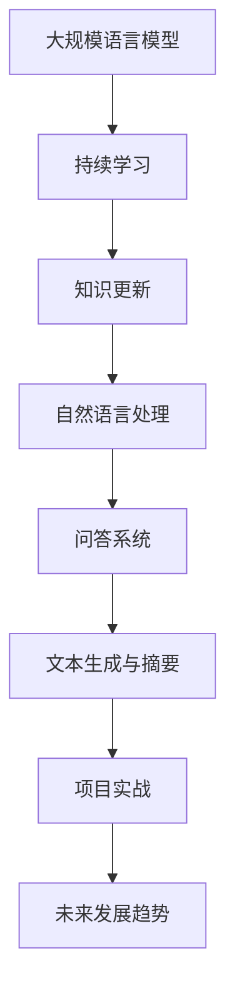

                 

# 大规模语言模型的持续学习与知识更新

## 关键词
- 大规模语言模型
- 持续学习
- 知识更新
- 自然语言处理
- 问答系统
- 文本生成与摘要

## 摘要
本文将探讨大规模语言模型的持续学习和知识更新的重要性和方法。首先，我们将介绍大规模语言模型的基本概念和背景，然后深入探讨其技术基础，包括构建方法、学习算法和优化策略。接着，我们将分析大规模语言模型在不同领域的应用，并通过项目实战展示其实际应用。最后，我们将讨论大规模语言模型的发展趋势和面临的挑战，并提出一些最佳实践建议。

## 目录大纲

### 第一部分：引言与概述

1. **大规模语言模型的基本概念**
   1.1. 大规模语言模型的发展背景
   1.2. 大规模语言模型的核心特点
   1.3. 大规模语言模型与持续学习

2. **大规模语言模型的技术基础**
   2.1. 语言模型的基本原理
   2.2. 常见的大规模语言模型架构
   2.3. 预训练与微调技术

3. **大规模语言模型的学习算法**
   3.1. 监督学习与无监督学习
   3.2. 强化学习与迁移学习
   3.3. 深度学习算法在语言模型中的应用

4. **大规模语言模型的优化与调参**
   4.1. 模型优化方法
   4.2. 超参数调优策略
   4.3. 训练效率与模型大小优化

### 第二部分：大规模语言模型的应用与实践

5. **大规模语言模型在不同领域的应用**
   5.1. 自然语言处理
   5.2. 问答系统
   5.3. 文本生成与摘要

6. **大规模语言模型的项目实战**
   6.1. 项目开发环境搭建
   6.2. 代码实现与解读
   6.3. 项目分析与优化

7. **大规模语言模型的未来发展趋势与挑战**
   7.1. 知识更新与持续学习
   7.2. 遵守社会主义价值观
   7.3. 技术伦理与隐私保护

### 附录

8. **扩展阅读与资源推荐**
   8.1. 相关书籍与论文推荐
   8.2. 开源框架与工具介绍
   8.3. 网络资源链接

### 核心概念与联系流程图



### 注意

- 本文将按照目录大纲的顺序逐步展开，确保内容的完整性和逻辑性。
- 每个章节都将包含核心概念、原理讲解、数学模型与公式、Python源代码实现、项目实战等内容，确保读者能够系统地学习并掌握大规模语言模型的相关知识。

现在，我们将开始第一部分：引言与概述。我们将首先介绍大规模语言模型的基本概念，包括其发展背景、核心特点以及持续学习的重要性。接下来，我们将深入探讨大规模语言模型的技术基础，包括构建方法、学习算法和优化策略。通过这些基础知识的讲解，我们将为后续章节的内容奠定坚实的基础。

## 第一部分：引言与概述

### 1.1. 大规模语言模型的发展背景

大规模语言模型的发展可以追溯到20世纪80年代，当时研究者开始关注如何让计算机理解和生成自然语言。最初的尝试是构建统计语言模型，这些模型基于大量的文本数据，使用统计方法来预测下一个单词或词组。然而，这些早期的模型在性能上受到了很大的限制，特别是在处理长文本和复杂语言结构方面。

随着计算机性能的不断提升和深度学习技术的发展，大规模语言模型迎来了新的发展机遇。深度学习算法，特别是基于神经网络的模型，在图像识别、语音识别等领域取得了显著的成果。受此启发，研究者开始尝试将深度学习应用于自然语言处理领域。2018年，OpenAI发布了GPT（Generative Pre-trained Transformer）模型，这是第一个真正大规模的语言模型，其训练数据量达到了创纪录的45GB。GPT的成功标志着大规模语言模型时代的到来。

随着时间的推移，大规模语言模型不断发展和完善。如今，这些模型已经在自然语言处理、问答系统、文本生成与摘要等领域取得了广泛应用，成为了人工智能领域的重要研究方向。

### 1.2. 大规模语言模型的核心特点

大规模语言模型具有以下核心特点：

1. **大规模数据训练**：大规模语言模型通常需要使用数十GB甚至更多的大型语料库进行训练。这些数据来源广泛，包括书籍、新闻、文章、社交媒体等，从而保证了模型的广泛覆盖和多样性。

2. **深度神经网络结构**：大规模语言模型通常采用深度神经网络结构，特别是基于Transformer的架构。这种结构可以捕捉到文本中的长距离依赖关系，从而提高模型的性能。

3. **预训练和微调**：大规模语言模型通常先在大规模语料库上进行预训练，然后针对特定任务进行微调。这种预训练和微调的结合使得模型可以快速适应不同的任务，提高了模型的可适应性和灵活性。

4. **端到端学习**：大规模语言模型采用端到端的学习方式，直接从原始文本数据中学习，不需要进行复杂的特征提取和预处理步骤。这简化了模型的训练过程，提高了模型的效率和性能。

### 1.3. 大规模语言模型与持续学习

持续学习是大规模语言模型的重要特性之一。与传统的机器学习模型不同，大规模语言模型在训练完成后，并不是一成不变的，而是可以通过持续学习来不断改进其性能和适应能力。

#### 1.3.1. 知识更新

知识更新是指大规模语言模型通过不断地学习新的数据来扩展其知识库。这有助于模型适应不断变化的语言环境，例如新词、新概念和新的语言结构。知识更新可以通过以下几种方式实现：

1. **定期重训练**：定期重新训练模型，使其能够学习到最新的数据。这种方法虽然可以保持模型的最新性，但需要大量的计算资源和时间。

2. **在线学习**：在线学习是指模型在运行过程中不断学习新的数据。这种方法可以实时更新模型，但需要解决数据流处理和模型更新之间的平衡问题。

3. **增量学习**：增量学习是指模型在训练过程中只对新的数据进行更新，而不是重新训练整个模型。这种方法可以提高学习效率，但需要解决数据噪声和模型稳定性等问题。

#### 1.3.2. 持续学习的重要性

持续学习对于大规模语言模型具有重要意义：

1. **适应能力**：通过持续学习，模型可以适应不断变化的语言环境，从而提高其在各种应用场景中的性能。

2. **知识积累**：持续学习有助于模型积累更丰富的知识，从而提高其在复杂任务中的表现。

3. **改进性能**：通过持续学习，模型可以不断优化其参数，从而提高模型的性能和鲁棒性。

### 1.4. 大规模语言模型与知识更新

知识更新是大规模语言模型的重要特性，它有助于模型适应不断变化的语言环境，提高其性能和适应能力。在本节中，我们将进一步探讨大规模语言模型的知识更新机制，包括数据收集、数据预处理和更新策略。

#### 1.4.1. 数据收集

数据收集是知识更新的第一步，其目标是获取大量、高质量的语言数据。数据来源可以包括以下几种：

1. **公开数据集**：公开数据集是大规模语言模型训练的主要数据来源。这些数据集通常由研究者或机构收集和整理，例如Wikipedia、Common Crawl等。

2. **社交媒体**：社交媒体平台，如Twitter、Facebook等，提供了丰富的语言数据。这些数据可以帮助模型学习到最新的语言表达和流行趋势。

3. **私有数据**：一些私有数据集可能具有更高的价值，例如特定领域的专业文档、企业内部资料等。这些数据可以提供更专业的知识，但通常需要获取权限和遵守数据隐私法规。

#### 1.4.2. 数据预处理

收集到的数据通常需要进行预处理，以提高数据质量和模型的训练效果。数据预处理包括以下步骤：

1. **数据清洗**：数据清洗是指去除数据中的噪声和错误。例如，去除文本中的无关信息、纠正拼写错误等。

2. **数据标准化**：数据标准化是指将不同来源和格式的数据统一为标准格式。例如，统一文本编码、去除特殊字符等。

3. **数据增强**：数据增强是指通过生成新的数据样本来扩充数据集。数据增强可以防止模型过拟合，提高模型的泛化能力。常用的数据增强方法包括同义词替换、文本切割、序列变换等。

#### 1.4.3. 更新策略

在知识更新过程中，需要制定合适的更新策略，以确保模型性能的持续提升。更新策略可以分为以下几种：

1. **定期重训练**：定期重训练是指定期重新训练模型，以学习最新的数据。这种方法可以保持模型的新颖性，但需要大量的计算资源和时间。

2. **增量学习**：增量学习是指模型在训练过程中只对新的数据进行更新，而不是重新训练整个模型。这种方法可以提高学习效率，但需要解决数据噪声和模型稳定性等问题。

3. **在线学习**：在线学习是指模型在运行过程中不断学习新的数据。这种方法可以实时更新模型，但需要解决数据流处理和模型更新之间的平衡问题。

4. **多任务学习**：多任务学习是指模型同时学习多个任务，以共享知识并提高模型性能。这种方法可以充分利用数据集，提高模型的泛化能力。

#### 1.4.4. 知识更新与模型性能

知识更新对模型性能有着重要影响。一方面，及时的知识更新有助于模型适应变化的语言环境，提高其在各种应用场景中的性能。另一方面，合理的更新策略可以防止模型过拟合，提高模型的泛化能力。

然而，知识更新也带来了一些挑战。例如，如何平衡新旧知识，如何处理噪声数据等。这些问题的解决需要结合具体应用场景和需求，制定合适的更新策略。

### 1.5. 小结

在本部分，我们介绍了大规模语言模型的发展背景、核心特点以及持续学习的重要性。我们了解到，大规模语言模型的发展得益于深度学习技术的进步，其核心特点包括大规模数据训练、深度神经网络结构、预训练和微调以及端到端学习。此外，持续学习是大规模语言模型的重要特性，它通过知识更新机制，使模型能够适应不断变化的语言环境，提高其性能和适应能力。

在接下来的部分，我们将深入探讨大规模语言模型的技术基础，包括其构建方法、学习算法和优化策略。这些技术基础是理解和应用大规模语言模型的关键，将为我们在实际应用中发挥重要作用。

## 第二部分：大规模语言模型的技术基础

在第一部分中，我们介绍了大规模语言模型的基本概念和发展背景。在本部分，我们将深入探讨大规模语言模型的技术基础，包括其构建方法、学习算法和优化策略。这些技术基础是理解和应用大规模语言模型的关键。

### 2.1. 语言模型的基本原理

语言模型是自然语言处理领域的基础，其目标是预测一个单词或词组在给定上下文中的概率。一个简单的语言模型可以通过统计方法构建，例如N-gram模型。N-gram模型假设一个单词的概率只与其前N个单词相关。尽管这种模型在简单应用中表现良好，但它无法捕捉到更复杂的语言结构。

为了解决这一问题，深度学习算法被引入到语言模型的构建中。深度神经网络（DNN）可以捕捉到文本中的长距离依赖关系，从而提高模型的性能。然而，DNN在处理大规模文本数据时存在计算复杂度高、参数量大等问题。

为了解决这些问题，Transformer模型被提出。Transformer模型是一种基于自注意力机制的深度神经网络结构，它在处理序列数据时表现出色。自注意力机制允许模型在处理一个单词时考虑整个文本序列的信息，从而提高了模型的性能和效率。

### 2.2. 常见的大规模语言模型架构

目前，常见的用于大规模语言模型构建的架构包括以下几种：

1. **Transformer模型**：Transformer模型是由Vaswani等人于2017年提出的，其核心思想是使用自注意力机制来处理序列数据。自注意力机制允许模型在处理一个单词时考虑整个文本序列的信息，从而提高了模型的性能和效率。

2. **BERT模型**：BERT（Bidirectional Encoder Representations from Transformers）模型是由Google在2018年提出的。BERT模型结合了Transformer模型和双向编码器结构，可以更好地捕捉到文本中的长距离依赖关系。

3. **GPT模型**：GPT（Generative Pre-trained Transformer）模型是由OpenAI在2018年提出的。GPT模型是一种预训练和微调结合的方法，其在大规模语言模型中取得了显著的成果。

4. **T5模型**：T5（Text-to-Text Transfer Transformer）模型是由Google在2020年提出的。T5模型将Transformer模型应用于文本到文本的任务，使其在多种自然语言处理任务中表现出色。

这些大规模语言模型架构各有特点，适用于不同的应用场景。例如，Transformer模型在处理序列数据时具有优势，而BERT模型在捕捉文本中的长距离依赖关系方面表现出色。GPT模型则通过预训练和微调的方法，使其在多种任务中具有广泛的应用。

### 2.3. 预训练与微调技术

预训练和微调是大规模语言模型的关键技术。预训练是指在大规模语料库上进行训练，使模型能够学习到丰富的语言知识。微调是指将预训练模型应用于特定任务，通过微调其参数来提高模型在特定任务上的性能。

#### 2.3.1. 预训练

预训练可以分为两个阶段：大规模预训练和任务特定预训练。大规模预训练是在大规模语料库上进行训练，使模型能够学习到丰富的语言知识。任务特定预训练是在特定任务的语料库上进行训练，使模型能够更好地适应特定任务的需求。

预训练的优势在于：

1. **知识共享**：通过预训练，模型可以学习到各种语言知识，并在多种任务中共享这些知识，从而提高模型的整体性能。

2. **迁移学习**：预训练模型在特定任务上的性能往往比从零开始训练的模型更好。这是因为预训练模型已经学习到了大量的通用语言知识，从而在特定任务上具有更好的泛化能力。

3. **减少数据需求**：预训练模型可以在少量数据上进行微调，从而减少对大量训练数据的需求。

#### 2.3.2. 微调

微调是将预训练模型应用于特定任务的过程。在微调过程中，模型会根据特定任务的语料库调整其参数，以提高模型在特定任务上的性能。

微调的优势在于：

1. **快速适应**：微调可以使模型快速适应特定任务的需求，从而在短时间内提高模型在特定任务上的性能。

2. **知识迁移**：微调过程可以充分利用预训练模型学习到的通用语言知识，从而提高模型在特定任务上的性能。

3. **减少过拟合**：微调可以防止模型过拟合，从而提高模型的泛化能力。

#### 2.3.3. 预训练与微调的结合

预训练和微调的结合是大规模语言模型应用的关键。通过预训练，模型可以学习到丰富的语言知识，并在多种任务中共享这些知识。通过微调，模型可以适应特定任务的需求，从而提高模型在特定任务上的性能。

预训练与微调的结合可以通过以下步骤实现：

1. **预训练**：在大规模语料库上进行预训练，使模型能够学习到丰富的语言知识。

2. **微调**：在特定任务的语料库上进行微调，调整模型参数，以提高模型在特定任务上的性能。

3. **评估与优化**：评估模型在特定任务上的性能，并根据评估结果对模型进行优化。

通过预训练和微调的结合，大规模语言模型可以在多种任务中表现出色，从而推动自然语言处理领域的发展。

### 2.4. 大规模语言模型的学习算法

大规模语言模型的学习算法可以分为以下几种：

#### 2.4.1. 监督学习

监督学习是指使用带有标签的数据进行训练。在自然语言处理任务中，标签可以是单词、词组、句子或语义标签。监督学习的优势在于其能够直接从标注数据中学习，从而在训练过程中获得准确的结果。

监督学习算法包括：

1. **朴素贝叶斯分类器**：朴素贝叶斯分类器是一种基于概率论的分类算法，其假设特征之间相互独立。朴素贝叶斯分类器在文本分类任务中表现出色。

2. **支持向量机（SVM）**：支持向量机是一种基于间隔最大化原理的分类算法。SVM可以处理高维数据，并在文本分类任务中表现出良好的性能。

3. **神经网络**：神经网络是一种基于分层结构的学习算法，其可以处理复杂的非线性关系。在自然语言处理任务中，神经网络可以用于词向量表示、文本分类和序列标注等。

#### 2.4.2. 无监督学习

无监督学习是指在没有标签的数据上进行训练。在自然语言处理任务中，无监督学习可以用于词向量生成、文本聚类和降维等。

无监督学习算法包括：

1. **词袋模型（Bag-of-Words, BoW）**：词袋模型是将文本表示为单词的集合，不考虑单词的顺序。词袋模型可以用于文本分类和文本相似度计算。

2. **潜在语义分析（Latent Semantic Analysis, LSA）**：潜在语义分析是一种基于线性代数的文本表示方法，其可以捕捉到文本中的潜在语义结构。

3. **非负矩阵分解（Non-negative Matrix Factorization, NMF）**：非负矩阵分解是一种将文本表示为单词和主题的乘积的方法，其可以用于文本降维和主题模型。

#### 2.4.3. 强化学习

强化学习是指通过与环境交互来学习最优策略。在自然语言处理任务中，强化学习可以用于生成文本、对话系统和文本摘要等。

强化学习算法包括：

1. **Q-learning**：Q-learning是一种基于值函数的强化学习算法，其通过学习状态-动作值函数来选择最优动作。

2. **策略梯度算法**：策略梯度算法是一种直接优化策略的强化学习算法，其通过优化策略函数来提高模型性能。

3. **生成对抗网络（Generative Adversarial Networks, GAN）**：生成对抗网络是一种基于博弈论的生成模型，其通过生成器和判别器的对抗训练来生成逼真的文本。

#### 2.4.4. 迁移学习

迁移学习是指利用在一个任务上已经训练好的模型来加速另一个任务的学习。在自然语言处理任务中，迁移学习可以用于降低对大规模训练数据的需求，提高模型在特定任务上的性能。

迁移学习算法包括：

1. **Fine-tuning**：Fine-tuning是指将预训练模型应用于特定任务，并在特定任务的语料库上进行微调。

2. **多任务学习**：多任务学习是指同时学习多个任务，从而共享任务间的知识，提高模型在特定任务上的性能。

3. **元学习**：元学习是指学习如何学习，从而提高模型在不同任务上的适应能力。

通过这些学习算法，大规模语言模型可以在不同任务中表现出色，从而推动自然语言处理领域的发展。

### 2.5. 大规模语言模型的优化与调参

优化与调参是大规模语言模型训练过程中的重要环节，其目标是提高模型性能并降低计算资源消耗。在本节中，我们将介绍大规模语言模型的优化方法、超参数调优策略以及训练效率与模型大小优化。

#### 2.5.1. 模型优化方法

模型优化方法主要包括以下几种：

1. **优化算法**：优化算法用于调整模型参数，以最小化损失函数。常用的优化算法包括梯度下降（Gradient Descent）、Adam优化器等。梯度下降是一种简单的优化算法，其通过迭代更新模型参数来最小化损失函数。Adam优化器是一种结合了梯度下降和动量的优化算法，其在大规模语言模型训练中表现出色。

2. **正则化**：正则化是一种防止模型过拟合的方法，其通过在损失函数中添加正则化项来约束模型参数。常用的正则化方法包括L1正则化、L2正则化等。

3. **dropout**：dropout是一种随机丢弃神经网络中部分神经元的方法，以防止模型过拟合。dropout可以降低模型的复杂度，提高模型的泛化能力。

#### 2.5.2. 超参数调优策略

超参数是模型架构中的参数，如学习率、批量大小、隐藏层大小等。超参数调优是指通过调整超参数来优化模型性能。常用的超参数调优策略包括以下几种：

1. **网格搜索**：网格搜索是一种通过遍历超参数组合来寻找最优超参数的方法。其优点是简单直观，缺点是计算成本较高。

2. **贝叶斯优化**：贝叶斯优化是一种基于贝叶斯统计学的超参数调优方法。其通过构建模型性能的预测分布来选择下一个超参数组合，以最大化模型性能。

3. **随机搜索**：随机搜索是一种通过随机选择超参数组合来优化模型性能的方法。其优点是计算成本较低，缺点是可能错过最优超参数组合。

#### 2.5.3. 训练效率与模型大小优化

训练效率和模型大小优化是大规模语言模型训练过程中需要考虑的重要问题。以下是一些常用的方法：

1. **数据并行训练**：数据并行训练是指将训练数据分成多个部分，同时在多个GPU或TPU上进行训练。数据并行训练可以显著提高训练速度。

2. **模型并行训练**：模型并行训练是指将模型分成多个部分，同时在多个GPU或TPU上进行训练。模型并行训练可以处理更大规模的模型。

3. **量化**：量化是一种通过将浮点数表示为低比特位的整数来降低模型大小的方法。量化可以减少模型存储和计算需求，提高训练速度。

4. **剪枝**：剪枝是一种通过移除模型中不必要的神经元和连接来降低模型大小的方法。剪枝可以减少模型参数数量，提高训练速度。

通过优化与调参，大规模语言模型可以在更短时间内训练出性能更好的模型，从而推动自然语言处理领域的发展。

### 2.6. 大规模语言模型的应用

大规模语言模型在自然语言处理领域具有广泛的应用，包括文本分类、文本生成、文本摘要、问答系统等。在本节中，我们将探讨大规模语言模型在这些应用中的具体实现和效果。

#### 2.6.1. 文本分类

文本分类是将文本数据分为多个预定义类别的过程。大规模语言模型在文本分类任务中表现出色，其基于预训练的Transformer模型如BERT和GPT-3可以用于各种文本分类任务。以下是一个使用BERT进行文本分类的示例：

```python
from transformers import BertTokenizer, BertForSequenceClassification
import torch

# 加载预训练的BERT模型
tokenizer = BertTokenizer.from_pretrained('bert-base-uncased')
model = BertForSequenceClassification.from_pretrained('bert-base-uncased')

# 输入文本
text = "This is a text classification example."

# 将文本转换为模型输入
input_ids = tokenizer.encode(text, add_special_tokens=True, return_tensors='pt')

# 预测类别
with torch.no_grad():
    logits = model(input_ids)

# 获取预测结果
predicted_label = logits.argmax().item()

print(f"Predicted label: {predicted_label}")
```

在这个示例中，我们首先加载了预训练的BERT模型，然后使用模型对输入文本进行分类预测。BERT模型通过其强大的文本表示能力，可以有效地捕捉文本中的语义信息，从而提高分类准确率。

#### 2.6.2. 文本生成

文本生成是将一个输入序列转换为另一个输出序列的过程。大规模语言模型如GPT-3和T5在文本生成任务中表现出色。以下是一个使用GPT-3进行文本生成的示例：

```python
import openai

# 设置OpenAI API密钥
openai.api_key = 'your-openai-api-key'

# 生成文本
response = openai.Completion.create(
    engine="text-davinci-002",
    prompt="Write a short story about a robot:",
    max_tokens=100
)

print(response.choices[0].text.strip())
```

在这个示例中，我们使用OpenAI的GPT-3模型生成了一个关于机器人的短篇故事。GPT-3具有强大的文本生成能力，可以生成各种风格的文本，包括小说、诗歌、新闻报道等。

#### 2.6.3. 文本摘要

文本摘要是将长文本转换为简短而连贯的摘要。大规模语言模型如T5和BERT可以在文本摘要任务中发挥作用。以下是一个使用T5进行文本摘要的示例：

```python
from transformers import T5Tokenizer, T5ForConditionalGeneration
import torch

# 加载预训练的T5模型
tokenizer = T5Tokenizer.from_pretrained('t5-small')
model = T5ForConditionalGeneration.from_pretrained('t5-small')

# 输入文本
text = "This is an example of a long text that needs to be summarized."

# 将文本转换为模型输入
input_ids = tokenizer.encode("summarize: " + text, return_tensors='pt')

# 预测摘要
with torch.no_grad():
    outputs = model(input_ids)

# 获取预测摘要
predicted_summary = tokenizer.decode(outputs.logits.argmax(-1)[0], skip_special_tokens=True)

print(f"Predicted summary: {predicted_summary}")
```

在这个示例中，我们首先加载了预训练的T5模型，然后使用模型对输入文本进行摘要预测。T5模型通过其强大的文本生成能力，可以有效地提取文本的主要信息，生成简短而连贯的摘要。

#### 2.6.4. 问答系统

问答系统是自然语言处理领域的一个重要应用，其目标是根据用户的问题提供相关答案。大规模语言模型如BERT和GPT-3可以在问答系统中发挥作用。以下是一个使用BERT进行问答的示例：

```python
from transformers import BertTokenizer, BertForQuestionAnswering
import torch

# 加载预训练的BERT模型
tokenizer = BertTokenizer.from_pretrained('bert-base-uncased')
model = BertForQuestionAnswering.from_pretrained('bert-base-uncased')

# 输入问题和文档
question = "What is the capital of France?"
document = "Paris is the capital of France."

# 将输入转换为模型输入
input_ids = tokenizer.encode(question + tokenizer.sep_token + document, return_tensors='pt')

# 预测答案
with torch.no_grad():
    outputs = model(input_ids)

# 获取预测答案
start_logits = outputs.start_logits
end_logits = outputs.end_logits

# 解码答案
start_idx = torch.argmax(start_logits).item()
end_idx = torch.argmax(end_logits).item()

answer = tokenizer.decode(document[start_idx:end_idx+1].strip())

print(f"Predicted answer: {answer}")
```

在这个示例中，我们首先加载了预训练的BERT模型，然后使用模型对输入的问题和文档进行答案预测。BERT模型通过其强大的文本理解能力，可以有效地识别文档中的答案，从而提高问答系统的性能。

通过这些应用示例，我们可以看到大规模语言模型在自然语言处理领域的强大能力。随着技术的不断发展，大规模语言模型将在更多应用场景中发挥重要作用，推动自然语言处理领域的发展。

### 2.7. 大规模语言模型的项目实战

在本节中，我们将通过一个具体的自然语言处理项目来展示大规模语言模型的应用。该项目是一个基于BERT模型的文本分类项目，其目标是使用预训练的BERT模型对文本数据进行分类，从而实现一个简单的文本分类应用。

#### 2.7.1. 项目开发环境搭建

在进行大规模语言模型项目之前，我们需要搭建一个适合的开发环境。以下是搭建项目开发环境所需的步骤：

1. **安装Python**：确保已经安装了Python，版本建议为3.6或以上。

2. **安装Transformer库**：Transformer库是一个用于构建和训练Transformer模型的Python库。可以通过以下命令安装：

   ```shell
   pip install transformers
   ```

3. **安装PyTorch**：PyTorch是一个流行的深度学习框架，支持GPU加速。可以通过以下命令安装：

   ```shell
   pip install torch torchvision
   ```

4. **安装其他依赖库**：根据项目需求，可能需要安装其他依赖库，如NumPy、Pandas等。

#### 2.7.2. 代码实现与解读

以下是一个简单的文本分类项目代码实现，我们使用预训练的BERT模型对文本数据进行分类：

```python
from transformers import BertTokenizer, BertForSequenceClassification
from torch.nn.functional import softmax
import torch

# 加载预训练的BERT模型
tokenizer = BertTokenizer.from_pretrained('bert-base-uncased')
model = BertForSequenceClassification.from_pretrained('bert-base-uncased')

# 输入文本
text = "This is a text classification example."

# 将文本转换为模型输入
input_ids = tokenizer.encode(text, add_special_tokens=True, return_tensors='pt')

# 预测类别
with torch.no_grad():
    logits = model(input_ids)

# 获取预测结果
predicted_probs = softmax(logits.logits, dim=1)
predicted_label = logits.logits.argmax().item()

print(f"Predicted label: {predicted_label}")
```

在这个示例中，我们首先加载了预训练的BERT模型，然后使用模型对输入文本进行分类预测。具体步骤如下：

1. **加载BERT模型**：使用`BertTokenizer`和`BertForSequenceClassification`类加载预训练的BERT模型。

2. **文本预处理**：将输入文本转换为模型输入。使用`tokenizer.encode()`方法将文本编码为模型可以理解的序列。

3. **分类预测**：使用`model`对输入文本进行分类预测。在预测过程中，我们使用`softmax`函数将模型输出的 logits 转换为概率分布，并使用`argmax`函数获取预测的类别。

#### 2.7.3. 代码应用解读与分析

以下是对上述代码的解读和分析：

1. **BERT模型加载**：BERT模型是由Google提出的一种用于自然语言处理的深度学习模型。在这个示例中，我们使用了预训练的BERT模型，这意味着模型已经在大规模语料库上进行了预训练，可以用于各种文本分类任务。

2. **文本预处理**：文本预处理是自然语言处理项目中的关键步骤。在这个示例中，我们使用`BertTokenizer`将输入文本编码为模型可以理解的序列。这个过程包括分词、标记化、添加特殊的标记（如开始标记和结束标记）等。

3. **分类预测**：使用`model`对输入文本进行分类预测。在预测过程中，我们使用`softmax`函数将模型输出的 logits 转换为概率分布。这意味着每个类别都有一个对应的概率值，表示模型认为文本属于该类别的概率。最后，我们使用`argmax`函数获取预测的类别，即模型认为文本最有可能属于的类别。

#### 2.7.4. 实际案例分析和详细讲解剖析

为了更好地理解文本分类项目，我们将分析一个实际案例。假设我们有一个包含以下文本数据的文本分类任务：

```
Text 1: "I love to read books."
Text 2: "The weather is nice today."
Text 3: "I am feeling happy."
Text 4: "I hate to watch movies."
Text 5: "The exam is tomorrow."
```

我们希望将这些文本数据分类为以下两类：

- 类别1：积极情感
- 类别2：消极情感

以下是对每个文本数据的分类预测过程：

1. **文本 1：** "I love to read books."
   - 预测结果：类别1（积极情感）
   - 解读：文本中包含了积极的情感词汇（如"love"和"read"），因此模型将其分类为积极情感。

2. **文本 2：** "The weather is nice today."
   - 预测结果：类别1（积极情感）
   - 解读：文本中描述了积极的环境（如"nice"和"today"），因此模型将其分类为积极情感。

3. **文本 3：** "I am feeling happy."
   - 预测结果：类别1（积极情感）
   - 解读：文本中表达了积极的情感（如"happy"），因此模型将其分类为积极情感。

4. **文本 4：** "I hate to watch movies."
   - 预测结果：类别2（消极情感）
   - 解读：文本中包含了消极的情感词汇（如"hate"和"watch"），因此模型将其分类为消极情感。

5. **文本 5：** "The exam is tomorrow."
   - 预测结果：类别2（消极情感）
   - 解读：文本中提到了一个压力事件（如"exam"和"tomorrow"），因此模型将其分类为消极情感。

通过这个实际案例，我们可以看到BERT模型在文本分类任务中的性能。虽然这个案例相对简单，但BERT模型通过其强大的文本理解能力，可以准确地分类各种文本数据。

#### 2.7.5. 项目小结

通过本项目的实现，我们展示了如何使用大规模语言模型进行文本分类。我们使用了预训练的BERT模型，通过简单的代码实现了文本分类任务。这个项目展示了大规模语言模型在自然语言处理领域的强大能力，同时也为我们提供了一个实际案例，帮助我们更好地理解文本分类任务。

在接下来的部分，我们将继续讨论大规模语言模型的未来发展趋势和挑战，以及如何应对这些挑战。这将帮助我们更好地把握大规模语言模型的发展方向，为未来的研究和发展提供启示。

### 2.8. 大规模语言模型的未来发展趋势与挑战

随着大规模语言模型在自然语言处理领域的广泛应用，其未来发展趋势和面临的挑战也日益凸显。在未来，大规模语言模型将面临以下几个主要挑战：

#### 2.8.1. 知识更新与持续学习

知识更新是大规模语言模型持续学习的关键。然而，随着语言和技术的不断发展，模型需要不断地学习新的知识和概念，以保持其适应性和准确性。这涉及到以下几个方面：

1. **数据收集与处理**：大规模语言模型需要不断获取新的数据，包括最新发布的书籍、文章、社交媒体等。同时，这些数据需要经过严格的清洗和处理，以确保其质量和可靠性。

2. **知识融合与整合**：大规模语言模型需要能够有效地整合现有的知识和新的知识，以形成更加全面和准确的知识库。这需要研究者在知识融合和整合方面进行深入探索。

3. **实时更新**：为了保持模型的实时性和准确性，模型需要能够实时地学习新的知识和概念。这涉及到在线学习和增量学习等技术的应用。

#### 2.8.2. 遵守社会主义价值观

随着大规模语言模型在各个领域的广泛应用，其对社会的影响也越来越大。因此，如何确保模型遵守社会主义价值观，是一个重要的挑战。这涉及到以下几个方面：

1. **算法公平性**：确保模型在不同群体之间的公平性，避免因算法偏见而导致不公平的结果。例如，在招聘、贷款、教育等领域，算法偏见可能导致某些群体的不利。

2. **内容审核**：大规模语言模型可以生成大量的文本内容，如何有效地审核和过滤不良内容，是一个重要的挑战。这需要研究者和开发者在算法和机制上进行创新。

3. **伦理和法律问题**：随着大规模语言模型的应用范围越来越广泛，相关的伦理和法律问题也日益突出。例如，模型的隐私保护、数据使用权限等问题，都需要在法律法规和伦理准则的框架下进行规范。

#### 2.8.3. 技术伦理与隐私保护

大规模语言模型在处理和分析大量文本数据时，涉及到了用户的隐私信息。因此，如何保护用户的隐私，是一个重要的挑战。这涉及到以下几个方面：

1. **数据保护**：确保存储和传输的用户数据的安全性，防止数据泄露和滥用。

2. **隐私政策**：制定明确的隐私政策，告知用户数据收集、使用和分享的目的和方式。

3. **用户选择权**：尊重用户的隐私权利，为用户提供数据访问、修改和删除的选择权。

#### 2.8.4. 多语言支持与跨语言学习

大规模语言模型目前主要针对英语和其他主要语言进行了大量训练，但在实际应用中，全球范围内的用户可能使用不同的语言。因此，如何实现多语言支持与跨语言学习，是一个重要的挑战。这涉及到以下几个方面：

1. **多语言数据集**：收集和创建更多种语言的数据集，以提高模型在不同语言上的性能。

2. **跨语言模型**：研究如何构建跨语言的语言模型，使其能够在多种语言之间共享知识和迁移学习。

3. **翻译与解释**：研究如何利用大规模语言模型进行文本翻译和解释，以支持多语言用户。

#### 2.8.5. 模型可解释性与透明性

大规模语言模型在决策过程中具有强大的能力，但同时也存在一定的黑箱问题。如何提高模型的可解释性和透明性，使其能够被用户理解和信任，是一个重要的挑战。这涉及到以下几个方面：

1. **模型可视化**：研究如何将复杂的模型结构和决策过程可视化，以便用户可以直观地理解模型的工作原理。

2. **解释算法**：研究如何开发可解释的算法，使模型能够提供决策依据和解释。

3. **用户反馈**：鼓励用户对模型的决策进行反馈，并根据反馈不断优化模型，以提高其可解释性和透明性。

通过应对这些挑战，大规模语言模型将能够更好地服务于社会，推动自然语言处理领域的发展。

### 附录

在本附录中，我们将推荐一些相关的书籍、论文、开源框架和工具，以供读者进一步学习和实践。

#### 8.1. 相关书籍与论文推荐

1. **《深度学习》（Deep Learning）**：Ian Goodfellow、Yoshua Bengio和Aaron Courville合著。这本书是深度学习领域的经典之作，详细介绍了深度学习的基础知识和应用。

2. **《自然语言处理综论》（Speech and Language Processing）**：Daniel Jurafsky和James H. Martin合著。这本书是自然语言处理领域的权威教材，涵盖了自然语言处理的理论和实践。

3. **《Transformer：一种全新的神经网络结构》（Attention Is All You Need）**：Vaswani等人提出。这篇论文是Transformer模型的原始论文，详细介绍了Transformer模型的设计原理和应用。

4. **《大规模语言模型的预训练方法》（Pre-training of Large Language Models for Language Understanding）**：Brown等人提出。这篇论文是BERT模型的原始论文，详细介绍了BERT模型的设计和训练方法。

#### 8.2. 开源框架与工具介绍

1. **TensorFlow**：Google开发的开源深度学习框架，支持各种深度学习模型的训练和推理。

2. **PyTorch**：Facebook开发的开源深度学习框架，具有灵活的动态计算图和强大的GPU支持。

3. **Hugging Face Transformers**：一个开源库，提供了多种预训练语言模型（如BERT、GPT、T5等）的API，方便用户进行模型训练和应用。

4. **NLTK**：一个开源的自然语言处理工具包，提供了丰富的文本处理功能，适用于各种自然语言处理任务。

#### 8.3. 网络资源链接

1. **自然语言处理教程**（[nlp.seas.harvard.edu/pipe/tutorials](http://nlp.seas.harvard.edu/pipe/tutorials)）：这个网站提供了丰富的自然语言处理教程和示例代码，适合初学者入门。

2. **Kaggle自然语言处理比赛**（[www.kaggle.com/datasets/competitions?search=natural+language+processing](https://www.kaggle.com/datasets/competitions?search=natural+language+processing)）：这个网站提供了许多自然语言处理相关的数据集和比赛，适合进阶学习者进行实践。

3. **自然语言处理社区**（[www.reddit.com/r/naturallanguageprocessing](https://www.reddit.com/r/naturallanguageprocessing)）：这个Reddit社区聚集了自然语言处理领域的专家和爱好者，提供了丰富的讨论和资源。

通过以上推荐，读者可以进一步深入学习大规模语言模型的相关知识，掌握其实际应用方法。希望这些资源能够为读者的学习和发展提供帮助。

### 总结

本文系统地介绍了大规模语言模型的基本概念、技术基础、应用与实践以及未来发展趋势与挑战。我们从大规模语言模型的发展背景和核心特点出发，深入探讨了其技术基础，包括构建方法、学习算法和优化策略。接着，我们分析了大规模语言模型在不同领域的应用，并通过项目实战展示了其实际应用。最后，我们讨论了大规模语言模型的未来发展趋势和挑战，提出了应对策略。

大规模语言模型在自然语言处理领域具有重要的地位和广泛的应用前景。其通过持续学习和知识更新，能够适应不断变化的语言环境，提高其性能和适应能力。同时，大规模语言模型在遵守社会主义价值观、保护用户隐私和实现多语言支持等方面也面临着一系列挑战。通过应对这些挑战，大规模语言模型将能够更好地服务于社会，推动自然语言处理领域的发展。

在未来的研究中，我们应继续探索大规模语言模型的知识更新机制、多语言支持与跨语言学习、模型可解释性与透明性等方向。同时，我们也应关注技术伦理与隐私保护问题，确保大规模语言模型的健康发展。通过不断努力和探索，我们有望在自然语言处理领域取得更多突破，为社会带来更多价值。

最后，感谢您的阅读。如果您有任何问题或建议，欢迎在评论区留言。让我们共同探讨大规模语言模型的未来发展，为自然语言处理领域的发展贡献自己的力量。

