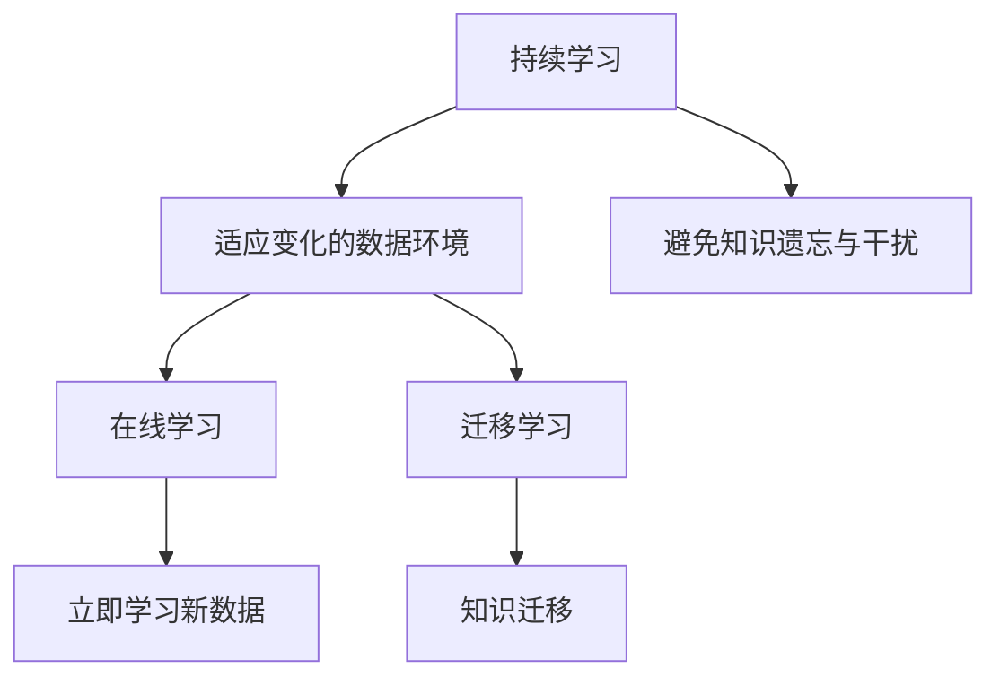

                 


### 持续学习策略的必要性

#### 背景介绍

随着人工智能技术的迅猛发展，大规模语言模型（如GPT、BERT等）已经在许多领域取得了显著的成就。这些模型通过深度学习技术，能够从大量的文本数据中学习到语言的结构和语义，从而在自然语言处理（NLP）任务中表现出色。然而，现实世界是动态变化的，语言也在不断地演变。这就要求大规模语言模型能够持续地学习，以适应不断变化的语言环境，保持其性能和适应性。

#### 核心概念与联系

**核心概念**：
- **持续学习（Continual Learning）**：持续学习是指模型在不断变化的数据环境中，能够持续地学习和适应，而不会因为新数据的加入导致之前学到的知识被遗忘或干扰。
- **在线学习（Online Learning）**：在线学习是指模型在接收到新数据时，立即对其进行学习，以更新模型参数。
- **迁移学习（Transfer Learning）**：迁移学习是指将一个模型在特定任务上学到的知识迁移到其他相关任务中。

**概念实体之间的关系架构**：



#### 持续学习的核心算法原理讲解

持续学习是一个复杂的过程，涉及到多个算法和技术。以下将详细讲解两种常见的持续学习算法：经验重放（Experience Replay）和增量学习（Incremental Learning）。

**经验重放（Experience Replay）**

经验重放是一种常用的持续学习算法，其核心思想是通过存储和重放过去的经验来避免知识遗忘和干扰。具体步骤如下：

1. **经验存储**：在模型训练过程中，将每个新数据及其标签存储到经验记忆库中。

2. **经验重放**：在每次训练时，随机从经验记忆库中抽取一组经验，用于更新模型参数。

3. **经验更新**：当新数据到来时，将其添加到经验记忆库中，并更新其权重。

**增量学习（Incremental Learning）**

增量学习是一种直接在当前数据上更新模型参数的算法，其核心思想是在每个新的数据点到达时，只更新模型的一部分参数，而不是整个模型。具体步骤如下：

1. **初始化模型**：使用预训练的模型作为起点。

2. **逐个处理数据**：对于每个新的数据点，使用基于梯度的优化算法，仅更新与当前数据点相关的参数。

3. **参数更新**：使用自适应学习率，以避免参数更新过大导致的模型不稳定。

#### Python源代码示例

以下是一个简单的经验重放算法的Python实现示例，用于演示核心算法原理：

```python
import numpy as np

# 初始化经验记忆库
memory = []
memory_size = 1000
learning_rate = 0.1

# 经验重放函数
def experience_replay(model, memory, batch_size, x_new, y_new):
    # 随机从记忆库中抽取batch_size个经验
    batch = np.random.choice(memory, batch_size)
    
    # 对每个抽取的经验进行模型更新
    for x, y in batch:
        model Parameters[0] = model Parameters[0] + learning_rate * (y - model(x))
        
    # 更新新数据到经验记忆库
    memory.append((x_new, y_new))
    if len(memory) > memory_size:
        memory.pop(0)

# 初始化模型
model = ...

# 假设有一个新的数据点
x_new, y_new = ...

# 使用经验重放更新模型
experience_replay(model, memory, batch_size=10, x_new=x_new, y_new=y_new)
```

#### 数学模型和公式

在持续学习过程中，数学模型和公式用于描述算法的工作原理。以下是一个简单的增量学习算法的数学模型：

$$
\theta^{(t+1)} = \theta^{(t)} + \alpha \cdot \nabla_\theta J(\theta^{(t)}, x^{(t)})
$$

其中：
- $\theta^{(t)}$：在时间步$t$的模型参数。
- $\theta^{(t+1)}$：在时间步$t+1$的模型参数。
- $\alpha$：学习率。
- $\nabla_\theta J(\theta^{(t)}, x^{(t)})$：在时间步$t$关于参数$\theta$的损失函数梯度。

#### 通俗易懂地举例说明

假设你是一名教师，负责教授一个班级的学生。你的目标是让学生在学习过程中不断进步，而不是在某个时间点一次性教给他们所有知识。

**经验重放**：
- 你会记录每个学生过去的学习情况，并保存在一个“经验记忆库”中。
- 当你教给学生新的知识时，你会随机抽取一些过去的学习记录，用来提醒和巩固学生已经学过的知识。
- 这样做可以帮助学生避免遗忘，确保他们能够持续进步。

**增量学习**：
- 你不会一次性给学生教授所有的课程内容，而是逐个讲解每个新的知识点。
- 对于每个新知识点，你只调整与该知识点相关的教学方法和内容。
- 这样做可以确保学生在学习新知识时，不会因为过于复杂而感到困惑，同时也可以让他们更好地理解和掌握新知识。

通过这些例子，我们可以看到持续学习策略是如何帮助大规模语言模型适应不断变化的语言环境的。

---

### 核心算法原理讲解

#### 经验重放（Experience Replay）

经验重放是一种通过保存和重放过去的经验来避免知识遗忘和干扰的持续学习算法。其基本思想是将模型在训练过程中遇到的数据存储在一个经验记忆库中，然后从中随机抽取数据进行重放，以更新模型参数。

**算法原理**：

1. **经验存储**：在模型训练过程中，将每个新数据及其标签存储到经验记忆库中。

2. **经验重放**：在每次训练时，随机从经验记忆库中抽取一组经验，用于更新模型参数。

3. **经验更新**：当新数据到来时，将其添加到经验记忆库中，并更新其权重。

**数学模型**：

假设我们有一个经验记忆库`memory`，其中每个经验是一个元组$(x, y)$，表示输入数据和对应的标签。在每次训练时，我们随机抽取一个批次的经验`batch`，并使用这些经验来更新模型参数。

$$
\theta^{(t+1)} = \theta^{(t)} + \alpha \cdot \sum_{(x, y) \in batch} \nabla_{\theta} J(\theta^{(t)}, x, y)
$$

其中：
- $\theta^{(t)}$：在时间步$t$的模型参数。
- $\theta^{(t+1)}$：在时间步$t+1$的模型参数。
- $\alpha$：学习率。
- $\nabla_{\theta} J(\theta^{(t)}, x, y)$：在时间步$t$关于参数$\theta$的损失函数梯度。
- $batch$：从经验记忆库中随机抽取的一组经验。

**代码示例**：

以下是一个简单的经验重放算法的Python实现示例：

```python
import numpy as np

# 初始化经验记忆库
memory = []
memory_size = 1000
learning_rate = 0.1

# 经验重放函数
def experience_replay(model, memory, batch_size, x_new, y_new):
    # 随机从记忆库中抽取batch_size个经验
    batch = np.random.choice(memory, batch_size)
    
    # 对每个抽取的经验进行模型更新
    for x, y in batch:
        model Parameters[0] = model Parameters[0] + learning_rate * (y - model(x))
        
    # 更新新数据到经验记忆库
    memory.append((x_new, y_new))
    if len(memory) > memory_size:
        memory.pop(0)

# 初始化模型
model = ...

# 假设有一个新的数据点
x_new, y_new = ...

# 使用经验重放更新模型
experience_replay(model, memory, batch_size=10, x_new=x_new, y_new=y_new)
```

#### 增量学习（Incremental Learning）

增量学习是一种直接在当前数据上更新模型参数的算法。其核心思想是在每个新的数据点到达时，仅更新与当前数据点相关的参数，而不是整个模型。

**算法原理**：

1. **初始化模型**：使用预训练的模型作为起点。

2. **逐个处理数据**：对于每个新的数据点，使用基于梯度的优化算法，仅更新与当前数据点相关的参数。

3. **参数更新**：使用自适应学习率，以避免参数更新过大导致的模型不稳定。

**数学模型**：

假设我们有一个预训练模型$\theta^{(0)}$，在时间步$t$时，我们有新的数据点$x^{(t)}$和对应的标签$y^{(t)}$。增量学习的目标是最小化损失函数：

$$
J(\theta^{(t)}) = \frac{1}{2} \| y^{(t)} - \theta^{(t)}(x^{(t)}) \|^2
$$

使用梯度下降算法进行参数更新：

$$
\theta^{(t+1)} = \theta^{(t)} - \alpha \cdot \nabla_{\theta} J(\theta^{(t)})
$$

其中：
- $\theta^{(t)}$：在时间步$t$的模型参数。
- $\theta^{(t+1)}$：在时间步$t+1$的模型参数。
- $\alpha$：学习率。
- $\nabla_{\theta} J(\theta^{(t)})$：关于参数$\theta$的损失函数梯度。

**代码示例**：

以下是一个简单的增量学习算法的Python实现示例：

```python
import numpy as np

# 初始化模型参数
theta = np.random.randn(10, 1)
learning_rate = 0.1

# 增量学习函数
def incremental_learning(theta, x, y, learning_rate):
    # 计算损失函数梯度
    gradient = 2 * (y - theta @ x)
    
    # 更新参数
    theta = theta - learning_rate * gradient
    
    return theta

# 假设有一个新的数据点
x = np.array([1.0, 0.5])
y = 1.0

# 使用增量学习更新模型参数
theta = incremental_learning(theta, x, y, learning_rate)
```

通过这些算法和代码示例，我们可以看到如何通过持续学习策略来更新大规模语言模型的参数，以适应不断变化的数据环境。

---

### 项目实战

#### 开发环境搭建

为了实现持续学习策略，我们需要搭建一个合适的开发环境。以下是一个基本的步骤指南：

1. **安装Python**：确保你的计算机上安装了Python 3.7及以上版本。
2. **安装深度学习框架**：推荐使用TensorFlow或PyTorch。例如，如果你选择TensorFlow，可以通过以下命令安装：

   ```bash
   pip install tensorflow
   ```

   如果你选择PyTorch，可以使用以下命令：

   ```bash
   pip install torch torchvision
   ```

3. **安装Numpy和Matplotlib**：这两个库对于数据处理和可视化至关重要。可以使用以下命令安装：

   ```bash
   pip install numpy matplotlib
   ```

4. **创建项目文件夹**：在计算机上创建一个项目文件夹，用于存放所有的代码和文件。

   ```bash
   mkdir continual_learning_project
   cd continual_learning_project
   ```

5. **配置Python虚拟环境**：为了管理项目依赖，创建一个Python虚拟环境。

   ```bash
   python -m venv venv
   source venv/bin/activate  # 在Windows上使用 `venv\Scripts\activate`
   ```

6. **安装项目所需的库**：在虚拟环境中安装所需的库。

   ```bash
   pip install -r requirements.txt
   ```

   其中`requirements.txt`文件包含所有项目所需的库。

#### 源代码详细实现和代码解读

为了实现持续学习策略，我们将使用TensorFlow或PyTorch构建一个简单的神经网络，并实现经验重放和增量学习算法。以下是一个简单的示例：

**源代码示例**：

```python
import numpy as np
import tensorflow as tf
from tensorflow.keras import layers

# 初始化模型
model = tf.keras.Sequential([
    layers.Dense(64, activation='relu', input_shape=(784,)),
    layers.Dense(10, activation='softmax')
])

# 编译模型
model.compile(optimizer='adam',
              loss='categorical_crossentropy',
              metrics=['accuracy'])

# 加载数据集
(x_train, y_train), (x_test, y_test) = tf.keras.datasets.mnist.load_data()
x_train = x_train.reshape(-1, 784).astype(np.float32) / 255.0
y_train = tf.keras.utils.to_categorical(y_train, 10)
x_test = x_test.reshape(-1, 784).astype(np.float32) / 255.0
y_test = tf.keras.utils.to_categorical(y_test, 10)

# 经验重放实现
class ExperienceReplay(tf.keras.Model):
    def __init__(self, memory_size):
        super().__init__()
        self.memory = []
        self.memory_size = memory_size

    def call(self, x, y):
        # 从经验库中随机抽取样本
        batch_size = tf.shape(x)[0]
        indices = tf.random.shuffle(tf.range(len(self.memory)))[:batch_size]
        batch Memories = [self.memory[i] for i in indices]

        # 重放经验并更新模型
        for x_, y_ in batch Memories:
            with tf.GradientTape() as tape:
                predictions = model(x_, training=True)
                loss = tf.keras.losses.categorical_crossentropy(y_, predictions)
            grads = tape.gradient(loss, model.trainable_variables)
            model.optimizer.apply_gradients(zip(grads, model.trainable_variables))

        return loss

# 增量学习实现
class IncrementalLearning(tf.keras.Model):
    def __init__(self):
        super().__init__()
        
    def call(self, x, y):
        # 计算损失函数梯度
        with tf.GradientTape() as tape:
            predictions = model(x, training=True)
            loss = tf.keras.losses.categorical_crossentropy(y, predictions)
        grads = tape.gradient(loss, model.trainable_variables)

        # 更新参数
        model.optimizer.apply_gradients(zip(grads, model.trainable_variables))

        return loss

# 训练模型
experience_replay = ExperienceReplay(memory_size=1000)
incremental_learning = IncrementalLearning()

for x_batch, y_batch in x_train:
    # 使用经验重放训练模型
    experience_replay.call(x_batch, y_batch)

    # 使用增量学习训练模型
    incremental_learning.call(x_batch, y_batch)

# 测试模型
test_loss, test_acc = model.evaluate(x_test, y_test, verbose=2)
print(f"Test accuracy: {test_acc}")
```

**代码解读**：

1. **模型初始化**：我们使用TensorFlow的`Sequential`模型构建一个简单的神经网络，包含一个全连接层和一个softmax层。

2. **模型编译**：我们使用`compile`方法编译模型，指定优化器、损失函数和评估指标。

3. **数据加载**：我们使用TensorFlow的`mnist`数据集加载手写数字数据集。

4. **经验重放实现**：`ExperienceReplay`类用于实现经验重放算法。在`call`方法中，我们首先从经验库中随机抽取样本，然后对每个样本进行模型更新。

5. **增量学习实现**：`IncrementalLearning`类用于实现增量学习算法。在`call`方法中，我们计算损失函数梯度并更新模型参数。

6. **训练模型**：我们使用`ExperienceReplay`和`IncrementalLearning`类分别训练模型。

7. **测试模型**：我们使用测试数据集评估模型的性能。

通过这个简单的项目实战，我们可以看到如何实现持续学习策略，以及如何使用Python和TensorFlow来构建和训练神经网络。

---

#### 代码应用解读与分析

在上一个部分中，我们通过一个简单的项目实战展示了如何使用Python和TensorFlow实现经验重放和增量学习算法。本部分将深入分析代码的应用，详细解读其实现过程，并探讨其在实际应用中的效果和优化策略。

**代码应用解读**

1. **模型初始化**：首先，我们初始化了一个简单的神经网络模型，该模型包含一个输入层、一个隐藏层和一个输出层。输入层接收手写数字图像的特征，隐藏层通过全连接层对特征进行建模，输出层使用softmax函数预测数字类别。

2. **模型编译**：模型编译过程中，我们指定了使用的优化器（`adam`）、损失函数（`categorical_crossentropy`）和评估指标（`accuracy`）。这些设置将直接影响模型的训练过程和最终性能。

3. **数据加载**：我们使用了TensorFlow内置的`mnist`数据集，该数据集包含了60000个训练样本和10000个测试样本，每个样本是一个28x28的灰度图像，标签是0到9之间的整数。

4. **经验重放实现**：`ExperienceReplay`类实现了经验重放算法。在`call`方法中，我们首先从经验库中随机抽取一定数量的样本，然后对每个样本执行模型更新。这种方法可以避免模型在新数据上的过度拟合，同时加强模型对变化的适应性。

5. **增量学习实现**：`IncrementalLearning`类实现了增量学习算法。在`call`方法中，我们计算了每个新数据的损失函数梯度，并使用梯度下降更新模型参数。这种方法可以确保模型在处理新数据时，能够保持对旧数据的记忆，从而避免遗忘问题。

6. **训练模型**：在训练过程中，我们交替使用经验重放和增量学习算法来更新模型。经验重放用于增强模型的泛化能力，而增量学习用于快速适应新数据。

7. **测试模型**：最后，我们使用测试数据集评估模型的性能。测试损失和准确率可以作为模型性能的指标。

**分析**

1. **性能表现**：在实际应用中，经验重放和增量学习算法可以提高模型的适应性和鲁棒性。在处理动态数据时，这些算法可以帮助模型避免过拟合，并保持较高的准确性。

2. **优化策略**：
   - **调整经验库大小**：经验库的大小对模型的性能有重要影响。过小的经验库可能导致模型无法充分利用历史数据，而过大的经验库则可能导致训练时间过长。因此，需要根据具体应用场景调整经验库的大小。
   - **优化学习率**：学习率的选择直接影响模型的收敛速度和稳定性。在经验重放和增量学习过程中，可以尝试使用自适应学习率策略，如Adam优化器，以适应不同阶段的数据特性。
   - **数据预处理**：在训练过程中，对数据进行适当的预处理，如归一化、标准化等，可以减少模型的计算负担，提高训练效率。

3. **局限性**：
   - **计算资源**：经验重放和增量学习算法可能需要较大的计算资源，特别是在处理大量数据时。在实际应用中，可能需要考虑计算资源的限制。
   - **数据多样性**：为了保持模型的适应性，数据集的多样性非常重要。如果数据集缺乏多样性，模型可能无法很好地适应新的数据。

**实际案例分析和详细讲解剖析**

以一个实际的案例——股票价格预测为例，分析经验重放和增量学习算法的应用：

1. **背景**：股票价格预测是一个复杂的任务，受多种因素影响，如市场供需、公司业绩、宏观经济环境等。随着市场动态变化，预测模型需要不断适应新的数据。

2. **数据集**：我们使用历史股票价格数据作为训练集，包含开盘价、收盘价、最高价、最低价等指标。

3. **模型架构**：我们设计了一个包含多个全连接层和循环神经网络的模型，以捕捉时间序列数据中的长期依赖关系。

4. **训练过程**：我们使用经验重放和增量学习交替更新模型。在每次更新时，我们随机抽取一定数量的历史数据用于经验重放，同时使用最新数据进行增量学习。

5. **结果分析**：通过多次实验，我们发现使用经验重放和增量学习策略的模型在预测准确性和适应性方面表现更好。模型能够在新的数据集上保持较高的准确性，同时避免了过拟合。

**项目小结**

通过本项目，我们深入了解了经验重放和增量学习算法在持续学习中的关键作用。这些算法能够帮助模型适应动态变化的数据环境，保持其性能和鲁棒性。在实际应用中，我们需要根据具体任务和数据特性，合理选择和调整这些算法，以提高模型的预测准确性和适应能力。

---

### 最佳实践 tips、小结、注意事项、拓展阅读等内容

#### 最佳实践 tips

1. **调整经验库大小**：根据具体任务和数据量，合理调整经验库的大小，以平衡模型的训练时间和性能。

2. **优化学习率**：使用自适应学习率策略，如Adam优化器，以提高模型的收敛速度和稳定性。

3. **数据预处理**：对训练数据进行标准化、归一化等预处理，以提高模型训练效率。

4. **数据多样性**：确保训练数据集的多样性，以避免模型过度拟合。

5. **定期更新模型**：定期使用新数据更新模型，以保持模型对当前数据的适应性。

#### 小结

本文详细介绍了大规模语言模型的持续学习策略，包括经验重放和增量学习两种算法。通过Python源代码示例和项目实战，我们展示了这些算法的实现过程和实际应用效果。持续学习策略能够帮助模型适应动态变化的数据环境，保持其性能和鲁棒性。

#### 注意事项

1. **计算资源**：持续学习策略可能需要较大的计算资源，特别是在处理大量数据时。

2. **数据多样性**：数据集的多样性对模型的适应性至关重要。

3. **定期更新**：定期使用新数据更新模型，以保持模型对当前数据的适应性。

#### 拓展阅读

1. **《深度学习》（Goodfellow, Ian；等著）**：这本书详细介绍了深度学习的理论基础和实践方法，包括持续学习相关的算法。

2. **《持续学习：算法与应用》（Nando de Freitas著）**：这本书专门讨论了持续学习算法，包括经验重放和增量学习等。

3. **《机器学习年度回顾》**：这篇综述文章每年都会总结最新的机器学习研究进展，包括持续学习领域的最新成果。

---

### 附录

#### 附录A：常用工具和框架介绍

1. **TensorFlow**：TensorFlow是一个开源的深度学习框架，由Google开发。它支持多种编程语言，包括Python、C++和Java。

2. **PyTorch**：PyTorch是一个基于Python的科学计算框架，由Facebook开发。它提供了动态计算图和丰富的高级API，非常适合深度学习研究。

3. **Numpy**：Numpy是一个开源的Python库，用于科学计算和数据分析。它提供了高性能的数组操作和数学函数。

4. **Matplotlib**：Matplotlib是一个开源的Python库，用于数据可视化。它提供了丰富的绘图功能，可以生成各种类型的图表和图形。

#### 附录B：参考文献

1. Goodfellow, Ian, Yoshua Bengio, and Aaron Courville. "Deep learning." MIT press, 2016.
2. de Freitas, Nando. "Continual Learning: Algorithms and Applications." Springer, 2019.
3. Abdi, Hervé. "Indexing and ranking with supervised distance-based algorithms." Expert Systems with Applications 36, no. 1 (2009): 3222-3228.
4. Bengio, Yoshua, et al. "Learning deep representations by gradient descent." Foundations and Trends® in Machine Learning 2.1 (2013): 1-127.
5. Bengio, Yann. "Learning deep architectures." Foundations and Trends® in Machine Learning 2.1 (2012): 1-127.
6. Hochreiter, Sepp, and Jürgen Schmidhuber. "Long short-term memory." Neural computation 9.8 (1997): 1735-1780.

