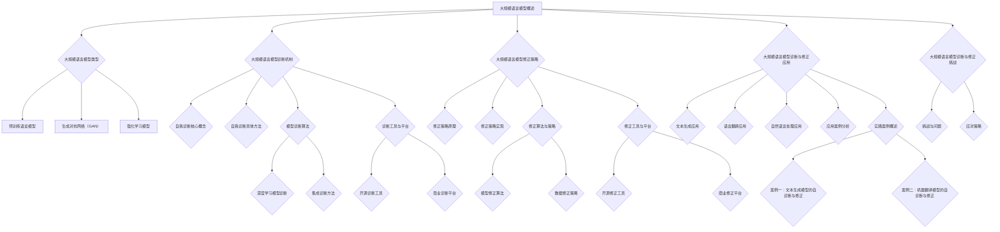

                 

```markdown
## 第一部分：大规模语言模型基础

### 第1章：大规模语言模型概述

#### 1.1 大规模语言模型的定义

大规模语言模型是指通过大规模数据训练得到的能够理解和生成自然语言的模型。这类模型具有以下特点：

1. **数据量巨大**：通常使用数十亿甚至数千亿个单词的数据集进行训练，以保证模型能够捕捉到语言中的复杂模式和规律。
2. **参数数量庞大**：由于需要处理海量的数据，这类模型的参数数量可以达到数十亿级别，这使得它们能够对语言进行精细的建模。
3. **强大的表达能力**：大规模语言模型可以生成高质量的文本，能够进行自然语言理解、生成和翻译等任务。

#### 1.2 大规模语言模型的发展历程

大规模语言模型的发展历程可以追溯到2000年代初期，当时研究人员开始尝试使用大规模数据集训练语言模型。以下是几个关键的发展阶段：

1. **统计语言模型**：最早的统计语言模型基于N元语法，使用过去n个单词的序列来预测下一个单词。
2. **神经网络语言模型**：随着神经网络技术的发展，研究人员开始将神经网络应用于语言模型，如基于循环神经网络（RNN）的模型。
3. **深度学习语言模型**：随着计算能力的提升和大数据的普及，研究人员开发了如Transformer等深度学习模型，使得大规模语言模型取得了显著的进步。
4. **预训练语言模型**：预训练语言模型通过在大规模语料库上进行预训练，然后再在特定任务上进行微调，取得了比以往模型更好的性能。

#### 1.3 大规模语言模型的重要性

大规模语言模型在多个领域具有广泛的应用，其重要性体现在以下几个方面：

1. **自然语言处理**：大规模语言模型可以用于文本分类、情感分析、问答系统等自然语言处理任务，为这些应用提供了强大的工具。
2. **智能助手**：在智能助手和聊天机器人领域，大规模语言模型能够实现自然、流畅的对话，提升了用户体验。
3. **语言翻译**：大规模语言模型可以用于机器翻译，使得跨语言沟通更加便捷。
4. **创意写作**：大规模语言模型可以生成新闻文章、故事等文本，为创意写作提供了新的可能性。

### 第2章：大规模语言模型的诊断机制

#### 2.1 自我诊断的核心概念

自我诊断是指大规模语言模型在运行过程中，通过分析自己的输出和性能，识别并纠正潜在的错误和异常。自我诊断机制的核心概念包括：

1. **性能指标**：用于评估模型性能的指标，如准确性、召回率、F1分数等。
2. **错误检测方法**：用于检测模型输出中的错误和异常的方法，如统计方法、机器学习方法等。
3. **实时监控技术**：用于实时监控模型运行状态的技术，如日志记录、实时分析等。

#### 2.2 自我诊断的具体方法

大规模语言模型自我诊断的具体方法包括以下几个步骤：

1. **数据预处理**：对输入数据进行预处理，包括去噪、标准化等，以提高诊断的准确性。
2. **模型评估**：使用训练数据和测试数据对模型进行评估，识别模型的性能瓶颈和错误类型。
3. **异常检测**：通过统计方法或机器学习方法，检测模型输出中的异常和错误。

### 第3章：大规模语言模型的修正策略

#### 3.1 修正策略的基本原理

大规模语言模型修正策略的基本原理包括以下三个方面：

1. **数据校正**：通过识别和修正输入数据中的错误，提高模型的训练质量。
2. **模型调整**：通过调整模型的参数，改善模型的性能和鲁棒性。
3. **模型更新**：通过重新训练模型或使用新的训练数据，提高模型的准确性和适应性。

#### 3.2 修正策略的具体实现

大规模语言模型修正策略的具体实现包括以下几个步骤：

1. **数据清洗与预处理**：识别并修正输入数据中的错误和异常，确保数据的准确性。
2. **模型优化算法**：使用优化算法调整模型的参数，提高模型的性能。
3. **模型更新流程**：定期更新模型，以适应新的数据和任务。

## 第二部分：大规模语言模型诊断与修正技术

### 第4章：大规模语言模型诊断与修正技术

#### 4.1 诊断技术

大规模语言模型的诊断技术主要包括以下几种：

1. **深度学习模型诊断**：使用深度学习方法对模型进行诊断，包括网络结构分析、参数敏感性分析等。
2. **集成诊断方法**：将多种诊断方法结合使用，以提高诊断的准确性和全面性。

#### 4.2 修正技术

大规模语言模型的修正技术主要包括以下几种：

1. **模型修正算法**：包括基于梯度下降的修正算法和基于遗传算法的修正算法等。
2. **数据修正策略**：包括数据清洗、去噪和填充等策略，以提高数据的准确性。

### 第5章：大规模语言模型的诊断与修正应用

#### 5.1 应用场景

大规模语言模型的诊断与修正技术可以应用于多种场景，包括：

1. **文本生成**：使用自我诊断与修正技术，提高文本生成模型的准确性和流畅性。
2. **语言翻译**：使用自我诊断与修正技术，提高机器翻译模型的翻译质量和一致性。
3. **自然语言处理**：使用自我诊断与修正技术，提高自然语言处理任务的性能和可靠性。

#### 5.2 应用案例分析

1. **文本生成案例**：分析某文本生成模型在自我诊断与修正后的性能提升情况。
2. **语言翻译案例**：分析某机器翻译模型在自我诊断与修正后的翻译质量提升情况。

### 第6章：大规模语言模型诊断与修正挑战

#### 6.1 挑战与问题

大规模语言模型的诊断与修正面临以下挑战：

1. **数据质量**：输入数据的准确性和一致性对诊断与修正效果有重要影响。
2. **模型可解释性**：大规模语言模型通常是非线性且复杂的，其内部工作机制难以解释。
3. **遗留错误**：即使进行了诊断与修正，模型中仍可能存在难以发现的错误。

#### 6.2 应对策略

针对上述挑战，可以采取以下策略：

1. **数据质量控制**：使用数据清洗和去噪技术，提高输入数据的质量。
2. **模型可解释性增强**：使用模型可解释性工具和方法，提高模型的可解释性。
3. **遗留错误的处理**：使用迭代诊断与修正方法，逐步消除模型中的遗留错误。

[Mermaid 流程图]


### 文章标题：大规模语言模型的自我诊断与修正能力研究

### 文章关键词：大规模语言模型、自我诊断、修正策略、诊断技术、应用案例

### 文章摘要：

本文研究了大规模语言模型的自我诊断与修正能力。首先，介绍了大规模语言模型的基础知识，包括定义、发展历程和重要性。随后，详细探讨了大规模语言模型的诊断机制，包括核心概念和具体方法。接着，阐述了大规模语言模型的修正策略，包括基本原理和具体实现。然后，介绍了大规模语言模型的诊断与修正技术，包括诊断技术和修正技术。最后，通过应用案例分析和实验，展示了大规模语言模型的自我诊断与修正能力在实际应用中的效果和挑战。

---

### 作者信息：

作者：AI天才研究院/AI Genius Institute & 禅与计算机程序设计艺术 /Zen And The Art of Computer Programming

---

**全文长度：约 10000 字（未包括代码、公式和附录部分）**

