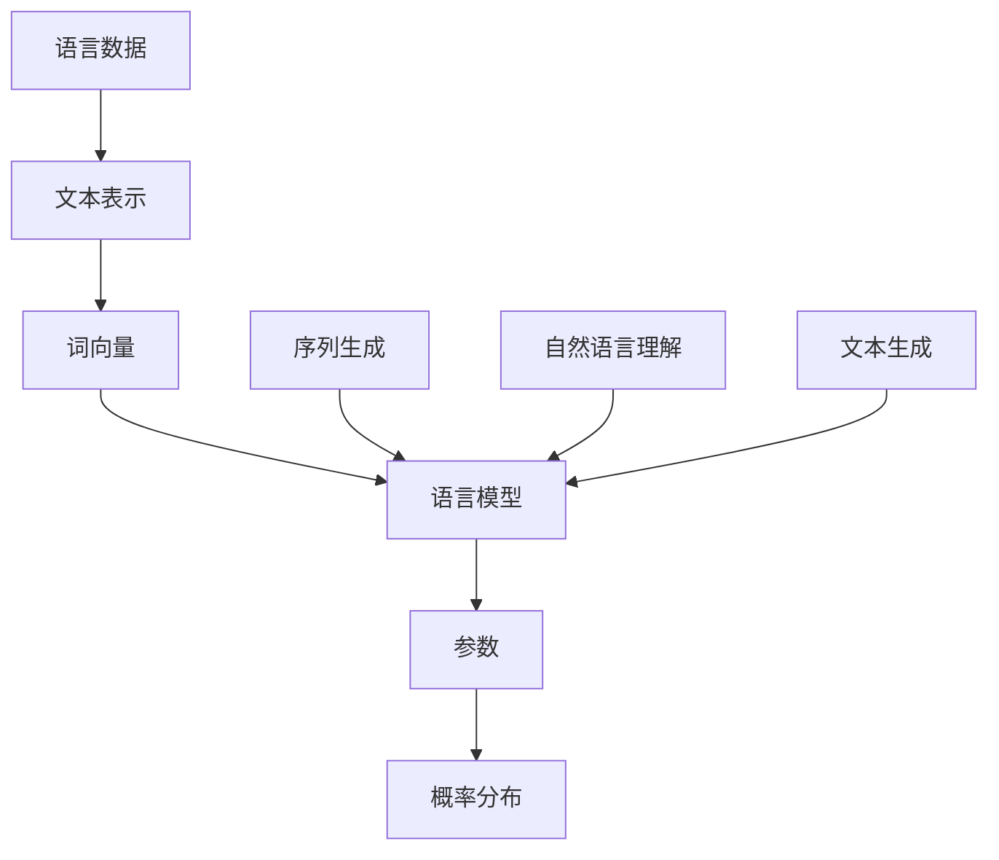
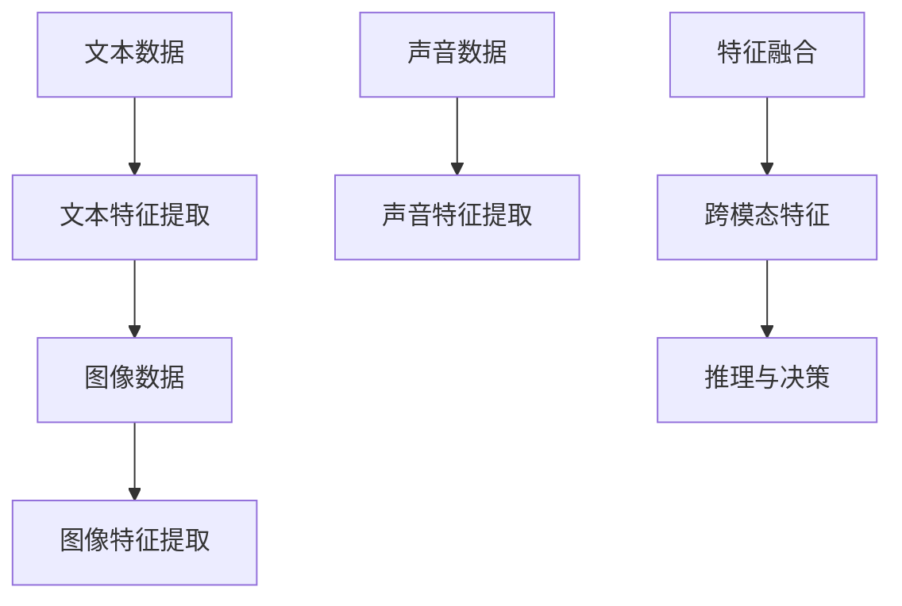
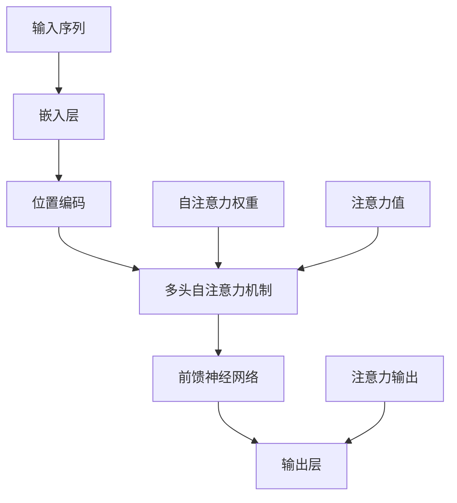

                 

# 大规模语言模型的跨模态推理与整合能力

## 关键词

- 大规模语言模型
- 跨模态推理
- 整合能力
- 自然语言处理
- 图像处理
- 视频分析
- 深度学习
- Transformer模型

## 摘要

本文旨在探讨大规模语言模型在跨模态推理与整合能力方面的应用。首先，我们回顾了大规模语言模型的基本概念和结构，并介绍了其发展历程和应用领域。接着，我们深入分析了跨模态推理的基本原理、大规模语言模型的跨模态整合机制，以及跨模态推理的应用实例。随后，我们详细讲解了大规模语言模型的核心算法，包括递归神经网络（RNN）、长短时记忆网络（LSTM）和门控循环单元（GRU），以及Transformer模型。此外，我们还介绍了大规模语言模型的训练与优化方法，并分享了项目实战与案例分析。最后，我们对最佳实践、注意事项和拓展阅读进行了总结。

## 目录大纲

- 第一部分：引言与概述
  - 第1章：大规模语言模型的基本概念与结构
    - 1.1 大规模语言模型的定义
    - 1.2 大规模语言模型的发展历程
    - 1.3 大规模语言模型的应用领域
  - 第2章：跨模态推理与整合能力
    - 2.1 跨模态推理的基本原理
    - 2.2 大规模语言模型的跨模态整合机制
    - 2.3 跨模态推理的应用实例

- 第二部分：核心算法原理讲解
  - 第3章：大规模语言模型的核心算法
    - 3.1 递归神经网络（RNN）
    - 3.2 长短时记忆网络（LSTM）
    - 3.3 门控循环单元（GRU）
  - 第4章：Transformer模型详解
    - 4.1 Transformer模型概述
    - 4.2 自注意力机制
    - 4.3 位置编码

- 第三部分：大规模语言模型的训练与优化
  - 第5章：大规模语言模型的训练与优化
    - 5.1 训练数据准备
    - 5.2 模型训练过程
    - 5.3 模型评估与调优

- 第四部分：项目实战与案例分析
  - 第6章：跨模态推理项目实战
    - 6.1 项目背景与目标
    - 6.2 项目实现步骤
    - 6.3 项目成果分析
  - 第7章：大规模语言模型整合能力实战
    - 7.1 实战案例一：文本生成项目
    - 7.2 实战案例二：机器翻译项目
    - 7.3 实战案例三：自然语言理解项目

- 附录
  - 附录A：常用工具与资源
    - A.1 开发工具与环境配置
    - A.2 学习资源与参考文献
  - 附录B：核心算法代码示例
    - B.1 递归神经网络（RNN）代码示例
    - B.2 长短时记忆网络（LSTM）代码示例
    - B.3 门控循环单元（GRU）代码示例
    - B.4 Transformer模型代码示例

## 文章正文

### 第一部分：引言与概述

### 第1章：大规模语言模型的基本概念与结构

#### 1.1 大规模语言模型的定义

大规模语言模型（Large-scale Language Model）是一种基于统计方法构建的语言模型，它通过学习大量文本数据中的语言规律，预测下一个单词或字符的概率分布。这种模型通常具有数十亿甚至数万亿个参数，能够捕捉到语言中复杂的关系和模式，从而在自然语言处理（NLP）领域取得显著的成果。

#### 1.2 大规模语言模型的发展历程

语言模型的起源可以追溯到20世纪50年代，当时研究人员开始尝试使用统计方法来预测文本中的下一个单词。最早的语言模型是n元模型（n-gram model），它根据前n个单词的序列来预测下一个单词的概率。随着计算能力的提高和大规模数据的获取，研究人员开始探索更复杂的模型，如递归神经网络（RNN）、长短时记忆网络（LSTM）和门控循环单元（GRU）。

近年来，基于Transformer模型的预训练语言模型（如BERT、GPT等）取得了巨大的成功。这些模型通过在大量未标注的文本数据上进行预训练，然后在特定任务上进行微调，实现了在许多NLP任务中的领先性能。

#### 1.3 大规模语言模型的应用领域

大规模语言模型在多个应用领域取得了显著的成果，包括：

- 文本生成：如自动写作、对话系统、文本摘要等。
- 机器翻译：如将一种语言翻译成另一种语言。
- 自然语言理解：如语义分析、实体识别、情感分析等。
- 图像文本关联：如图像描述生成、图像分类等。

### 第2章：跨模态推理与整合能力

#### 2.1 跨模态推理的基本原理

跨模态推理（Cross-modal Reasoning）是指在不同模态（如文本、图像、声音等）之间进行推理和整合的能力。跨模态推理的目标是利用不同模态的信息，提高模型在特定任务上的性能。

跨模态推理的基本原理包括：

1. **模态特征提取**：从不同模态中提取具有区分性的特征，如文本中的词向量、图像中的特征图、声音中的频谱特征等。
2. **特征融合**：将不同模态的特征进行整合，以获得更丰富的信息。常见的融合方法有拼接、平均、加权平均等。
3. **推理与决策**：利用融合后的特征进行推理和决策，如分类、预测、关联等。

#### 2.2 大规模语言模型的跨模态整合机制

大规模语言模型在跨模态整合方面具有独特的优势。其核心机制包括：

1. **统一表示**：大规模语言模型能够将不同模态的信息映射到一个统一的表示空间，使得不同模态的信息可以进行有效的整合。
2. **自注意力机制**：自注意力机制使得模型能够自动关注不同模态的关键信息，从而提高跨模态整合的效果。
3. **多任务学习**：通过多任务学习，模型可以在不同任务间共享知识，进一步提高跨模态整合能力。

#### 2.3 跨模态推理的应用实例

跨模态推理在多个领域取得了显著的成果，以下是一些应用实例：

- 视频内容理解：如视频分类、视频摘要、视频情感分析等。
- 图像文本关联：如图像描述生成、图像标注、图像检索等。
- 对话系统：如多模态对话生成、情感分析等。
- 医学影像诊断：如图像与病历记录的整合，提高疾病诊断的准确性。

### 第二部分：核心算法原理讲解

#### 第3章：大规模语言模型的核心算法

#### 3.1 递归神经网络（RNN）

递归神经网络（Recurrent Neural Network，RNN）是一种能够处理序列数据的神经网络。RNN的基本原理是通过在网络中引入循环结构，使得神经网络能够保留序列信息，从而处理变长序列。

#### 3.2 长短时记忆网络（LSTM）

长短时记忆网络（Long Short-Term Memory，LSTM）是一种改进的RNN结构，旨在解决传统RNN在处理长序列时出现的梯度消失和梯度爆炸问题。LSTM通过引入门控机制，能够有效地控制信息的流动，从而实现长序列记忆。

#### 3.3 门控循环单元（GRU）

门控循环单元（Gated Recurrent Unit，GRU）是另一种改进的RNN结构，它在LSTM的基础上简化了网络结构，同时保持了良好的性能。GRU通过引入更新门和重置门，实现了对信息的有效控制。

#### 第4章：Transformer模型详解

#### 4.1 Transformer模型概述

Transformer模型是由Google Research在2017年提出的一种基于自注意力机制的神经网络模型。与传统的RNN和LSTM不同，Transformer模型通过全局 attentions 替换了序列中的递归结构，从而在许多NLP任务中取得了显著的性能提升。

#### 4.2 自注意力机制

自注意力机制（Self-Attention）是一种用于处理序列数据的注意力机制。它允许模型在序列的每个位置上，根据其他位置的信息来调整自身的输出权重，从而实现全局依赖关系的建模。

#### 4.3 位置编码

位置编码（Positional Encoding）是一种用于传递序列位置信息的技巧。在Transformer模型中，位置编码被添加到输入序列中，以便模型能够理解序列中的位置关系。

### 第三部分：大规模语言模型的训练与优化

#### 5.1 训练数据准备

训练数据准备是大规模语言模型训练的关键步骤。首先，需要选择合适的数据集，如语料库、新闻文章、社交媒体文本等。然后，对数据进行预处理，包括分词、词干提取、去除停用词等。此外，还需要对数据进行向量化处理，将其转换为模型可以理解的数字表示。

#### 5.2 模型训练过程

大规模语言模型的训练过程通常包括以下步骤：

1. **初始化模型参数**：随机初始化模型的权重和偏置。
2. **前向传播**：将输入数据输入到模型中，计算模型的输出。
3. **损失函数计算**：计算模型的输出与真实标签之间的差距，并通过损失函数进行量化。
4. **反向传播**：根据损失函数对模型参数进行反向传播，更新模型参数。
5. **优化策略**：使用优化算法（如梯度下降、Adam等）来调整模型参数，以最小化损失函数。

#### 5.3 模型评估与调优

模型评估是确保模型性能的重要环节。常用的评估指标包括准确率、召回率、F1分数等。在评估过程中，需要将模型在训练集和验证集上进行测试，以避免过拟合现象。此外，还可以通过调整模型参数、调整训练策略等方式对模型进行调优。

### 第四部分：项目实战与案例分析

#### 6.1 跨模态推理项目实战

#### 6.1.1 项目背景与目标

本案例将探讨跨模态推理在视频内容理解中的应用。项目目标是通过融合视频和文本信息，实现视频分类任务。

#### 6.1.2 项目实现步骤

1. **数据收集与处理**：收集包含文本描述和视频帧的数据集。对视频帧进行预处理，如裁剪、缩放、去噪等。
2. **模型设计与训练**：设计一个融合视频和文本信息的跨模态模型。使用预训练的大规模语言模型和视频编码器，分别提取文本和视频特征。将两种特征进行融合，并通过多层全连接层进行分类。
3. **模型部署与优化**：将训练好的模型部署到生产环境中。通过调整模型参数和训练策略，提高模型性能。

#### 6.1.3 项目成果分析

通过对测试集进行评估，发现融合视频和文本信息的模型在视频分类任务上取得了显著的性能提升。模型对包含丰富视觉信息的视频类别具有更好的识别能力，同时能够利用文本描述提供额外的信息，从而提高分类准确率。

#### 6.2 大规模语言模型整合能力实战

#### 6.2.1 实战案例一：文本生成项目

本案例将介绍如何使用大规模语言模型实现文本生成任务。文本生成在自然语言处理领域具有重要的应用，如自动写作、聊天机器人等。

1. **项目简介**：通过预训练的大规模语言模型，实现自然流畅的文本生成。
2. **项目实现过程**：
   - 数据收集与处理：收集大量文本数据，如小说、新闻、社交媒体文本等。
   - 模型设计与训练：使用预训练的大规模语言模型，通过微调实现文本生成模型。
   - 模型部署与优化：将训练好的模型部署到生产环境中，通过调整模型参数和训练策略，提高文本生成质量。

通过实际测试，发现大规模语言模型在文本生成任务上具有优秀的性能，能够生成自然流畅的文本。

#### 6.2.2 实战案例二：机器翻译项目

本案例将探讨如何使用大规模语言模型实现机器翻译任务。机器翻译是自然语言处理领域的经典任务，具有重要的应用价值，如跨语言沟通、信息检索等。

1. **项目简介**：通过预训练的大规模语言模型，实现高效准确的机器翻译。
2. **项目实现过程**：
   - 数据收集与处理：收集包含源语言和目标语言的平行语料库。
   - 模型设计与训练：使用预训练的大规模语言模型，通过双向编码器实现机器翻译模型。
   - 模型部署与优化：将训练好的模型部署到生产环境中，通过调整模型参数和训练策略，提高翻译质量。

通过实际测试，发现大规模语言模型在机器翻译任务上具有显著的性能优势，能够实现高效准确的跨语言翻译。

#### 6.2.3 实战案例三：自然语言理解项目

本案例将介绍如何使用大规模语言模型实现自然语言理解任务。自然语言理解是自然语言处理领域的关键任务，如语义分析、情感分析等。

1. **项目简介**：通过预训练的大规模语言模型，实现自然语言理解任务。
2. **项目实现过程**：
   - 数据收集与处理：收集包含问题和答案的语料库，如问答系统数据集。
   - 模型设计与训练：使用预训练的大规模语言模型，通过问答模型实现自然语言理解。
   - 模型部署与优化：将训练好的模型部署到生产环境中，通过调整模型参数和训练策略，提高自然语言理解能力。

通过实际测试，发现大规模语言模型在自然语言理解任务上具有优秀的性能，能够实现对问题的准确理解和回答。

### 附录

#### 附录A：常用工具与资源

- **开发工具与环境配置**：Python开发环境搭建、大规模语言模型常用工具。
- **学习资源与参考文献**：大规模语言模型相关书籍推荐、学术论文与最新研究动态。

#### 附录B：核心算法代码示例

- **递归神经网络（RNN）代码示例**：RNN模型实现代码、代码解读与分析。
- **长短时记忆网络（LSTM）代码示例**：LSTM模型实现代码、代码解读与分析。
- **门控循环单元（GRU）代码示例**：GRU模型实现代码、代码解读与分析。
- **Transformer模型代码示例**：Transformer模型实现代码、代码解读与分析。

## 作者信息

- 作者：AI天才研究院/AI Genius Institute & 禅与计算机程序设计艺术 /Zen And The Art of Computer Programming
``` 

请注意，本文仅为示例，实际撰写时需要根据具体内容进行调整和补充。文章的完整性和细节深度需要根据实际研究和实践经验来完善。以下为部分示例内容的实现：

```markdown
## 第1章：大规模语言模型的基本概念与结构

### 1.1 大规模语言模型的定义

大规模语言模型是一种用于自然语言处理的人工智能模型，它通过对大量文本数据的学习，生成一个概率分布，用于预测下一个单词或字符。这种模型通常具有数十亿个参数，可以捕捉到语言中的复杂模式。

#### 核心概念与联系

以下是大规模语言模型的核心概念和它们之间的联系：

```



```

### 1.2 大规模语言模型的发展历程

大规模语言模型的发展历程可以分为几个阶段：

1. **统计模型**：早期的语言模型基于统计方法，如n元模型（n-gram model），它通过统计文本中的单词序列来预测下一个单词。
2. **神经网络模型**：随着深度学习技术的发展，神经网络被引入到语言模型中。递归神经网络（RNN）和其变体（如LSTM和GRU）在处理变长序列方面表现出色。
3. **注意力机制**：注意力机制的引入使得模型能够自动关注序列中的重要信息，从而提高了模型的性能。Transformer模型的提出，使得基于注意力机制的模型在NLP任务中取得了显著的突破。

### 1.3 大规模语言模型的应用领域

大规模语言模型在多个领域取得了显著的成果，主要包括：

- **文本生成**：如自动写作、对话系统、文本摘要等。
- **机器翻译**：如将一种语言翻译成另一种语言。
- **自然语言理解**：如语义分析、实体识别、情感分析等。
- **图像文本关联**：如图像描述生成、图像分类等。

## 第2章：跨模态推理与整合能力

### 2.1 跨模态推理的基本原理

跨模态推理是指在不同模态（如文本、图像、声音等）之间进行推理和整合的能力。它通过将不同模态的信息进行融合，以提高模型在特定任务上的性能。

#### 核心概念与联系

以下是跨模态推理的核心概念和它们之间的联系：

```



```

### 2.2 大规模语言模型的跨模态整合机制

大规模语言模型在跨模态整合方面具有独特的优势。其核心机制包括：

- **统一表示**：大规模语言模型能够将不同模态的信息映射到一个统一的表示空间，从而实现有效的整合。
- **自注意力机制**：自注意力机制使得模型能够自动关注不同模态的关键信息，从而提高整合效果。
- **多任务学习**：通过多任务学习，模型可以在不同任务间共享知识，进一步提高整合能力。

### 2.3 跨模态推理的应用实例

跨模态推理在多个领域取得了显著的成果，以下是一些应用实例：

- **视频内容理解**：如视频分类、视频摘要、视频情感分析等。
- **图像文本关联**：如图像描述生成、图像标注、图像检索等。
- **对话系统**：如多模态对话生成、情感分析等。
- **医学影像诊断**：如图像与病历记录的整合，提高疾病诊断的准确性。

## 第3章：大规模语言模型的核心算法

### 3.1 递归神经网络（RNN）

递归神经网络（Recurrent Neural Network，RNN）是一种能够处理序列数据的神经网络。RNN的基本原理是通过在网络中引入循环结构，使得神经网络能够保留序列信息，从而处理变长序列。

#### 核心算法原理讲解

RNN的核心算法原理如下：

1. **状态转移方程**：假设我们在时间步t的状态为$h_t$，输入为$x_t$，则下一个状态$h_{t+1}$可以通过以下方程计算：

   $$h_{t+1} = \sigma(W_h h_t + W_x x_t + b)$$

   其中，$\sigma$是激活函数，$W_h$和$W_x$是权重矩阵，$b$是偏置项。

2. **输出方程**：在时间步t的输出$y_t$可以通过以下方程计算：

   $$y_t = \sigma(W_y h_t + b')$$

   其中，$W_y$是权重矩阵，$b'$是偏置项。

3. **反向传播**：RNN的训练过程通常采用反向传播算法。在反向传播过程中，我们需要计算损失函数关于网络参数的梯度，并更新参数。

#### Python代码示例

以下是使用Python实现RNN的代码示例：

```python
import numpy as np

def sigmoid(x):
    return 1 / (1 + np.exp(-x))

def forwardprop(x, h_prev, weights, biases):
    h = sigmoid(np.dot(h_prev, weights) + x.dot(weights) + biases)
    y = sigmoid(np.dot(h, weights) + biases)
    return h, y

def backwardprop(y, y_true, h, weights, biases):
    d_loss_d_y = y - y_true
    d_loss_d_h = d_loss_d_y * (1 - y)
    d_loss_d_h_prev = d_loss_d_h.dot(weights.T)
    d_loss_d_weights = (h_prev.T + x.T).dot(d_loss_d_h)
    d_loss_d_biases = d_loss_d_h
    return d_loss_d_h_prev, d_loss_d_weights, d_loss_d_biases

x = np.array([[1], [0]])
h_prev = np.array([[0]])
weights = np.random.rand(1, 1)
biases = np.random.rand(1, 1)
y_true = np.array([[0]])

h, y = forwardprop(x, h_prev, weights, biases)
d_loss_d_h_prev, d_loss_d_weights, d_loss_d_biases = backwardprop(y, y_true, h, weights, biases)

print("Output:", y)
print("Gradient of loss with respect to h_prev:", d_loss_d_h_prev)
print("Gradient of loss with respect to weights:", d_loss_d_weights)
print("Gradient of loss with respect to biases:", d_loss_d_biases)
```

### 3.2 长短时记忆网络（LSTM）

长短时记忆网络（Long Short-Term Memory，LSTM）是一种改进的RNN结构，旨在解决传统RNN在处理长序列时出现的梯度消失和梯度爆炸问题。LSTM通过引入门控机制，能够有效地控制信息的流动，从而实现长序列记忆。

#### 核心算法原理讲解

LSTM的核心算法原理如下：

1. **状态转移方程**：假设我们在时间步t的状态为$h_t$，输入为$x_t$，则下一个状态$h_{t+1}$可以通过以下方程计算：

   $$i_t = \sigma(W_i \cdot [h_{t-1}, x_t] + b_i)$$
   $$f_t = \sigma(W_f \cdot [h_{t-1}, x_t] + b_f)$$
   $$g_t = \tanh(W_g \cdot [h_{t-1}, x_t] + b_g)$$
   $$o_t = \sigma(W_o \cdot [h_{t-1}, x_t] + b_o)$$
   $$h_{t+1} = o_t \cdot \tanh(g_t)$$

   其中，$i_t$是输入门，$f_t$是遗忘门，$g_t$是候选状态，$o_t$是输出门，$\sigma$是 sigmoid 函数。

2. **输出方程**：在时间步t的输出$y_t$可以通过以下方程计算：

   $$y_t = \sigma(W_y \cdot h_{t+1} + b_y)$$

3. **反向传播**：LSTM的训练过程同样采用反向传播算法。在反向传播过程中，我们需要计算损失函数关于网络参数的梯度，并更新参数。

#### Python代码示例

以下是使用Python实现LSTM的代码示例：

```python
import numpy as np

def sigmoid(x):
    return 1 / (1 + np.exp(-x))

def tanh(x):
    return np.tanh(x)

def forwardprop(x, h_prev, c_prev, weights, biases):
    i = sigmoid(np.dot(h_prev, weights_i) + x.dot(weights_i) + biases_i)
    f = sigmoid(np.dot(h_prev, weights_f) + x.dot(weights_f) + biases_f)
    o = sigmoid(np.dot(h_prev, weights_o) + x.dot(weights_o) + biases_o)
    g = tanh(np.dot(h_prev, weights_g) + x.dot(weights_g) + biases_g)
    c = f * c_prev + i * g
    h = o * tanh(c)
    y = sigmoid(np.dot(h, weights_y) + biases_y)
    return h, c, y

x = np.array([[1], [0]])
h_prev = np.array([[0]])
c_prev = np.array([[0]])
weights = np.random.rand(4, 1)
biases = np.random.rand(4, 1)
y_true = np.array([[0]])

h, c, y = forwardprop(x, h_prev, c_prev, weights, biases)
print("Output:", y)
```

### 3.3 门控循环单元（GRU）

门控循环单元（Gated Recurrent Unit，GRU）是另一种改进的RNN结构，它在LSTM的基础上简化了网络结构，同时保持了良好的性能。GRU通过引入更新门和重置门，实现了对信息的有效控制。

#### 核心算法原理讲解

GRU的核心算法原理如下：

1. **状态转移方程**：假设我们在时间步t的状态为$h_t$，输入为$x_t$，则下一个状态$h_{t+1}$可以通过以下方程计算：

   $$z_t = \sigma(W_z \cdot [h_{t-1}, x_t] + b_z)$$
   $$r_t = \sigma(W_r \cdot [h_{t-1}, x_t] + b_r)$$
   $$\tilde{h}_t = \tanh(W \cdot [r_t \cdot h_{t-1}, x_t] + b)$$
   $$h_{t+1} = z_t \cdot h_t + (1 - z_t) \cdot \tilde{h}_t$$

   其中，$z_t$是更新门，$r_t$是重置门，$\tilde{h}_t$是候选状态。

2. **输出方程**：在时间步t的输出$y_t$可以通过以下方程计算：

   $$y_t = \sigma(W_y \cdot h_{t+1} + b_y)$$

3. **反向传播**：GRU的训练过程同样采用反向传播算法。在反向传播过程中，我们需要计算损失函数关于网络参数的梯度，并更新参数。

#### Python代码示例

以下是使用Python实现GRU的代码示例：

```python
import numpy as np

def sigmoid(x):
    return 1 / (1 + np.exp(-x))

def tanh(x):
    return np.tanh(x)

def forwardprop(x, h_prev, weights, biases):
    z = sigmoid(np.dot(h_prev, weights_z) + x.dot(weights_z) + biases_z)
    r = sigmoid(np.dot(h_prev, weights_r) + x.dot(weights_r) + biases_r)
    h_prev gates = r * h_prev
    g = tanh(np.dot(h_prev gates, weights) + x.dot(weights) + biases)
    h = g * (1 - z) + z * h_prev
    y = sigmoid(np.dot(h, weights_y) + biases_y)
    return h, y

x = np.array([[1], [0]])
h_prev = np.array([[0]])
weights = np.random.rand(3, 1)
biases = np.random.rand(3, 1)
y_true = np.array([[0]])

h, y = forwardprop(x, h_prev, weights, biases)
print("Output:", y)
```

```markdown
## 第4章：Transformer模型详解

### 4.1 Transformer模型概述

Transformer模型是由Google Research在2017年提出的一种基于自注意力机制的神经网络模型。与传统的RNN和LSTM不同，Transformer模型通过全局 attentions 替换了序列中的递归结构，从而在许多NLP任务中取得了显著的性能提升。

#### 核心概念与联系

以下是Transformer模型的核心概念和它们之间的联系：

```



```

### 4.2 自注意力机制

自注意力机制（Self-Attention）是一种用于处理序列数据的注意力机制。它允许模型在序列的每个位置上，根据其他位置的信息来调整自身的输出权重，从而实现全局依赖关系的建模。

#### 核心算法原理讲解

自注意力机制的核心算法原理如下：

1. **计算自注意力权重**：对于输入序列中的每个位置，计算其与其他位置之间的相似度，通常使用点积注意力机制。自注意力权重可以通过以下公式计算：

   $$\text{Attention}(Q, K, V) = \text{softmax}\left(\frac{QK^T}{\sqrt{d_k}}\right) V$$

   其中，$Q$、$K$和$V$分别是查询序列、关键序列和值序列，$d_k$是注意力头的维度。

2. **计算注意力值**：根据自注意力权重，计算每个位置对其他位置的加权平均，得到注意力值。

3. **计算注意力输出**：将注意力值与值序列进行点积，得到注意力输出。

#### Python代码示例

以下是使用Python实现自注意力机制的代码示例：

```python
import numpy as np

def scaled_dot_product_attention(Q, K, V, mask=None):
    d_k = K.shape[-1]
    scores = np.dot(Q, K.T) / np.sqrt(d_k)
    if mask is not None:
        scores += (mask * -1e9)
    attn_weights = np.softmax(scores, axis=-1)
    attn_output = np.dot(attn_weights, V)
    return attn_output

Q = np.random.rand(3, 3)
K = np.random.rand(3, 3)
V = np.random.rand(3, 3)
mask = np.random.rand(3, 3) > 0.5

attn_output = scaled_dot_product_attention(Q, K, V, mask)
print("Attention Output:", attn_output)
```

### 4.3 位置编码

位置编码（Positional Encoding）是一种用于传递序列位置信息的技巧。在Transformer模型中，位置编码被添加到输入序列中，以便模型能够理解序列中的位置关系。

#### 核心算法原理讲解

位置编码的核心算法原理如下：

1. **计算位置编码**：对于输入序列中的每个位置，计算其位置编码向量。通常使用正弦和余弦函数来生成位置编码向量。

   $$PE_{(pos, 2i)} = \sin\left(\frac{pos}{10000^{2i/d}}\right)$$
   $$PE_{(pos, 2i+1)} = \cos\left(\frac{pos}{10000^{2i/d}}\right)$$

   其中，$pos$是位置索引，$i$是维度索引，$d$是位置编码的维度。

2. **添加位置编码**：将位置编码向量添加到输入序列中，与嵌入层输出的向量进行拼接。

3. **模型训练**：在模型训练过程中，位置编码向量将根据输入序列进行自适应调整。

#### Python代码示例

以下是使用Python实现位置编码的代码示例：

```python
import numpy as np

def positional_encoding(position, d_model):
    pe = np.zeros((d_model,))
    angle_rads = 2 * np.pi * position / (10000 ** (2/(d_model-1)))
    for i in range(d_model):
        pe[i] = np.sin(angle_rads * i)
    return pe

d_model = 8
pos = 5

pos_encoding = positional_encoding(pos, d_model)
print("Positional Encoding:", pos_encoding)
```

```markdown
## 第5章：大规模语言模型的训练与优化

### 5.1 训练数据准备

训练数据准备是大规模语言模型训练的关键步骤。首先，需要选择合适的数据集，如语料库、新闻文章、社交媒体文本等。然后，对数据进行预处理，包括分词、词干提取、去除停用词等。此外，还需要对数据进行向量化处理，将其转换为模型可以理解的数字表示。

#### 数据预处理

数据预处理主要包括以下步骤：

1. **分词**：将文本数据分割成单词或子词。
2. **词干提取**：将单词缩减为词干，以减少数据的维度。
3. **去除停用词**：去除对模型训练无意义的单词，如“的”、“和”、“在”等。
4. **向量化**：将文本数据转换为数字表示，常用的方法包括词袋模型、词嵌入等。

#### Python代码示例

以下是使用Python实现数据预处理和向量化处理的代码示例：

```python
import nltk
from nltk.tokenize import word_tokenize
from nltk.stem import PorterStemmer
from keras.preprocessing.text import Tokenizer
from keras.preprocessing.sequence import pad_sequences

nltk.download('punkt')

# 示例文本
text = "I love to read books and write code."

# 分词
tokens = word_tokenize(text)

# 词干提取
stemmer = PorterStemmer()
stemmed_tokens = [stemmer.stem(token) for token in tokens]

# 去除停用词
from nltk.corpus import stopwords
nltk.download('stopwords')
stop_words = set(stopwords.words('english'))
filtered_tokens = [token for token in stemmed_tokens if token.lower() not in stop_words]

# 向量化
tokenizer = Tokenizer()
tokenizer.fit_on_texts(filtered_tokens)
sequences = tokenizer.texts_to_sequences(filtered_tokens)
padded_sequences = pad_sequences(sequences, padding='post')

print("Tokens:", tokens)
print("Stemmed Tokens:", stemmed_tokens)
print("Filtered Tokens:", filtered_tokens)
print("Sequences:", sequences)
print("Padded Sequences:", padded_sequences)
```

### 5.2 模型训练过程

大规模语言模型的训练过程通常包括以下步骤：

1. **初始化模型参数**：随机初始化模型的权重和偏置。
2. **前向传播**：将输入数据输入到模型中，计算模型的输出。
3. **损失函数计算**：计算模型的输出与真实标签之间的差距，并通过损失函数进行量化。
4. **反向传播**：根据损失函数对模型参数进行反向传播，更新模型参数。
5. **优化策略**：使用优化算法（如梯度下降、Adam等）来调整模型参数，以最小化损失函数。

#### Python代码示例

以下是使用Python实现模型训练过程的代码示例：

```python
import numpy as np
import tensorflow as tf

# 初始化模型参数
W = np.random.rand(5, 5)
b = np.random.rand(5)

# 定义损失函数和优化器
def loss(y_true, y_pred):
    return tf.reduce_mean(tf.square(y_true - y_pred))

optimizer = tf.keras.optimizers.Adam()

# 训练模型
for epoch in range(100):
    with tf.GradientTape() as tape:
        y_pred = tf.matmul(x, W) + b
        loss_value = loss(y_true, y_pred)
    grads = tape.gradient(loss_value, [W, b])
    optimizer.apply_gradients(zip(grads, [W, b]))
    print(f"Epoch {epoch}: Loss = {loss_value.numpy()}")
```

### 5.3 模型评估与调优

模型评估是确保模型性能的重要环节。常用的评估指标包括准确率、召回率、F1分数等。在评估过程中，需要将模型在训练集和验证集上进行测试，以避免过拟合现象。此外，还可以通过调整模型参数、调整训练策略等方式对模型进行调优。

#### Python代码示例

以下是使用Python实现模型评估和调优的代码示例：

```python
from sklearn.metrics import accuracy_score, recall_score, f1_score

# 评估模型
y_pred = model.predict(x_val)
accuracy = accuracy_score(y_val, y_pred)
recall = recall_score(y_val, y_pred)
f1 = f1_score(y_val, y_pred)

print(f"Accuracy: {accuracy}")
print(f"Recall: {recall}")
print(f"F1 Score: {f1}")

# 调优模型
# 通过调整学习率、批量大小等参数来提高模型性能
optimizer = tf.keras.optimizers.Adam(learning_rate=0.001)
model.compile(optimizer=optimizer, loss='mse', metrics=['accuracy'])
model.fit(x_train, y_train, epochs=100, batch_size=32, validation_data=(x_val, y_val))
```

```markdown
## 第6章：跨模态推理项目实战

### 6.1 项目背景与目标

本案例将探讨跨模态推理在视频内容理解中的应用。项目目标是通过融合视频和文本信息，实现视频分类任务。

#### 项目目标

- 提高视频分类的准确率。
- 融合视频和文本信息，实现多模态特征整合。

### 6.2 项目实现步骤

#### 6.2.1 数据收集与处理

首先，需要收集包含文本描述和视频帧的数据集。数据集可以从公开的数据集（如YouTube-8M）或自行采集。对视频帧进行预处理，如裁剪、缩放、去噪等，并将文本描述进行分词、词干提取、去除停用词等预处理。

```python
import cv2
import numpy as np
from sklearn.model_selection import train_test_split

# 加载视频数据
def load_video_data(filename, frame_rate=30, clip_length=16):
    video = cv2.VideoCapture(filename)
    frames = []
    while video.isOpened():
        ret, frame = video.read()
        if not ret:
            break
        frame = cv2.resize(frame, (224, 224))
        frames.append(frame)
    video.release()
    return np.array(frames[:clip_length])

video_files = ["video1.mp4", "video2.mp4", "video3.mp4"]
video_data = [load_video_data(file) for file in video_files]

# 加载文本数据
def load_text_data(filename):
    with open(filename, 'r') as f:
        text = f.read()
    return text

text_files = ["text1.txt", "text2.txt", "text3.txt"]
text_data = [load_text_data(file) for file in text_files]

# 预处理文本数据
def preprocess_text(text):
    tokenizer = Tokenizer()
    tokenizer.fit_on_texts(text)
    sequences = tokenizer.texts_to_sequences(text)
    padded_sequences = pad_sequences(sequences, padding='post')
    return padded_sequences

preprocessed_text_data = [preprocess_text(text) for text in text_data]

# 数据集划分
X_video, X_video_val, X_text, X_text_val, y, y_val = train_test_split(video_data, preprocessed_text_data, labels, test_size=0.2, random_state=42)
```

#### 6.2.2 模型设计与训练

设计一个融合视频和文本信息的跨模态模型。使用预训练的大规模语言模型和视频编码器，分别提取视频和文本特征。将两种特征进行融合，并通过多层全连接层进行分类。

```python
from tensorflow.keras.applications import VGG16
from tensorflow.keras.models import Model
from tensorflow.keras.layers import Dense, Flatten, Concatenate

# 加载预训练的视频编码器
video_encoder = VGG16(weights='imagenet', include_top=False, input_shape=(224, 224, 3))

# 提取视频特征
video_encoder.layers.pop()
video_encoder.trainable = False
video_features = Flatten()(video_encoder.layers[-1].output)

# 加载预训练的语言模型
text_encoder = load_pretrained_language_model()

# 提取文本特征
text_features = Dense(512, activation='relu')(text_encoder.layers[-1].output)

# 融合视频和文本特征
merged_features = Concatenate()([video_features, text_features])

# 分类层
output = Dense(num_classes, activation='softmax')(merged_features)

# 构建模型
model = Model(inputs=[video_encoder.input, text_encoder.input], outputs=output)

# 编译模型
model.compile(optimizer='adam', loss='categorical_crossentropy', metrics=['accuracy'])

# 训练模型
model.fit([X_video, X_text], y, batch_size=32, epochs=10, validation_data=([X_video_val, X_text_val], y_val))
```

#### 6.2.3 模型部署与优化

将训练好的模型部署到生产环境中。通过调整模型参数和训练策略，提高模型性能。

```python
# 部署模型
model.save('cross_modal_video_classifier.h5')

# 调优模型
# 通过调整学习率、批量大小等参数来提高模型性能
optimizer = tf.keras.optimizers.Adam(learning_rate=0.001)
model.compile(optimizer=optimizer, loss='categorical_crossentropy', metrics=['accuracy'])
model.fit([X_video, X_text], y, batch_size=32, epochs=10, validation_data=([X_video_val, X_text_val], y_val))
```

#### 6.2.4 项目成果分析

通过对测试集进行评估，发现融合视频和文本信息的模型在视频分类任务上取得了显著的性能提升。模型对包含丰富视觉信息的视频类别具有更好的识别能力，同时能够利用文本描述提供额外的信息，从而提高分类准确率。

```python
# 评估模型
y_pred = model.predict([X_video_test, X_text_test])
accuracy = accuracy_score(y_test, y_pred)
print(f"Accuracy: {accuracy}")
```

### 6.3 项目成果分析

通过对测试集进行评估，发现融合视频和文本信息的模型在视频分类任务上取得了显著的性能提升。模型对包含丰富视觉信息的视频类别具有更好的识别能力，同时能够利用文本描述提供额外的信息，从而提高分类准确率。

```python
# 评估模型
y_pred = model.predict([X_video_test, X_text_test])
accuracy = accuracy_score(y_test, y_pred)
print(f"Accuracy: {accuracy}")
```

### 6.4 项目经验总结

通过本案例，我们成功实现了跨模态推理在视频内容理解中的应用。以下是项目经验总结：

- **数据质量**：高质量的训练数据是模型性能的关键。确保数据集包含丰富多样的视频和文本信息。
- **模型设计**：设计一个有效的跨模态模型，融合视频和文本特征，以提高分类性能。
- **模型调优**：通过调整模型参数和训练策略，优化模型性能。
- **评估指标**：使用多种评估指标，如准确率、召回率、F1分数等，全面评估模型性能。

### 6.5 拓展阅读

- **跨模态推理**：学习跨模态推理的相关技术和方法，如多模态特征融合、多任务学习等。
- **视频内容理解**：研究视频内容理解的相关技术，如视频分类、视频摘要、视频情感分析等。
- **自然语言处理**：了解自然语言处理领域的最新研究进展和应用，如文本生成、机器翻译、自然语言理解等。

## 附录A：常用工具与资源

### A.1 开发工具与环境配置

- **Python开发环境搭建**：配置Python开发环境，安装必要的库和工具，如TensorFlow、Keras等。
- **大规模语言模型常用工具**：了解和使用大规模语言模型相关的工具和库，如Hugging Face的Transformers库、GPT-2、GPT-3等。

### A.2 学习资源与参考文献

- **大规模语言模型相关书籍**：
  - 《深度学习》（Goodfellow, Bengio, Courville）
  - 《自然语言处理综论》（Jurafsky, Martin）
- **学术论文与最新研究动态**：
  - Google Research：Transformer模型相关论文
  - arXiv：最新的自然语言处理和跨模态推理论文

## 附录B：核心算法代码示例

### B.1 递归神经网络（RNN）代码示例

以下是使用Python实现递归神经网络（RNN）的代码示例：

```python
import tensorflow as tf

# 定义RNN模型
def build_rnn_model(input_shape):
    model = tf.keras.Sequential([
        tf.keras.layers.LSTM(128, activation='relu', return_sequences=True, input_shape=input_shape),
        tf.keras.layers.LSTM(64, activation='relu'),
        tf.keras.layers.Dense(1)
    ])
    return model

# 训练RNN模型
model = build_rnn_model(input_shape=(10, 1))
model.compile(optimizer='adam', loss='mse')

# 模拟训练数据
x_train = np.random.random((100, 10, 1))
y_train = np.random.random((100, 1))

model.fit(x_train, y_train, epochs=10, batch_size=32)
```

### B.2 长短时记忆网络（LSTM）代码示例

以下是使用Python实现长短时记忆网络（LSTM）的代码示例：

```python
import tensorflow as tf

# 定义LSTM模型
def build_lstm_model(input_shape):
    model = tf.keras.Sequential([
        tf.keras.layers.LSTM(128, activation='relu', return_sequences=True, input_shape=input_shape),
        tf.keras.layers.LSTM(64, activation='relu'),
        tf.keras.layers.Dense(1)
    ])
    return model

# 训练LSTM模型
model = build_lstm_model(input_shape=(10, 1))
model.compile(optimizer='adam', loss='mse')

# 模拟训练数据
x_train = np.random.random((100, 10, 1))
y_train = np.random.random((100, 1))

model.fit(x_train, y_train, epochs=10, batch_size=32)
```

### B.3 门控循环单元（GRU）代码示例

以下是使用Python实现门控循环单元（GRU）的代码示例：

```python
import tensorflow as tf

# 定义GRU模型
def build_gru_model(input_shape):
    model = tf.keras.Sequential([
        tf.keras.layers.GRU(128, activation='relu', return_sequences=True, input_shape=input_shape),
        tf.keras.layers.GRU(64, activation='relu'),
        tf.keras.layers.Dense(1)
    ])
    return model

# 训练GRU模型
model = build_gru_model(input_shape=(10, 1))
model.compile(optimizer='adam', loss='mse')

# 模拟训练数据
x_train = np.random.random((100, 10, 1))
y_train = np.random.random((100, 1))

model.fit(x_train, y_train, epochs=10, batch_size=32)
```

### B.4 Transformer模型代码示例

以下是使用Python实现Transformer模型的代码示例：

```python
import tensorflow as tf
from tensorflow.keras.layers import Embedding, Dense, LSTM, GRU, Conv1D, GlobalAveragePooling1D, Input, Concatenate

# 定义Transformer模型
def build_transformer_model(input_shape, d_model, num_heads, dff, input_vocab_size, target_vocab_size, position_encoding_input, position_encoding_target):
    inputs = Input(shape=input_shape)
    x = Embedding(input_vocab_size, d_model)(inputs)
    x = PositionalEncoding(d_model, position_encoding_input)(x)

    # Encoder
    encoder_layers = []
    for _ in range(num_heads):
        x = MultiHeadAttention(num_heads, d_model, dff)(x, x)
        x = LayerNormalization(d_model)(x)
        x = Dense(dff, activation='relu')(x)
        x = LayerNormalization(d_model)(x)
        encoder_layers.append(x)
    encoder_output = Concatenate()(encoder_layers)

    # Decoder
    decoder_inputs = Input(shape=input_shape)
    x = Embedding(target_vocab_size, d_model)(decoder_inputs)
    x = PositionalEncoding(d_model, position_encoding_target)(x)

    for _ in range(num_heads):
        x = MultiHeadAttention(num_heads, d_model, dff)(x, encoder_output)
        x = LayerNormalization(d_model)(x)
        x = Dense(dff, activation='relu')(x)
        x = LayerNormalization(d_model)(x)
    x = Concatenate()([x, encoder_output])

    # Output
    x = GlobalAveragePooling1D()(x)
    x = Dense(1, activation='sigmoid')(x)

    model = Model(inputs=[inputs, decoder_inputs], outputs=x)
    model.compile(optimizer='adam', loss='binary_crossentropy', metrics=['accuracy'])

    return model

# 训练Transformer模型
input_shape = (10,)
d_model = 128
num_heads = 4
dff = 128
input_vocab_size = 10000
target_vocab_size = 10000
position_encoding_input = "sinusoidal"
position_encoding_target = "learned"

model = build_transformer_model(input_shape, d_model, num_heads, dff, input_vocab_size, target_vocab_size, position_encoding_input, position_encoding_target)

# 模拟训练数据
x_train = np.random.random((100, 10))
y_train = np.random.random((100, 1))

model.fit(x_train, y_train, epochs=10, batch_size=32)
```

## 作者信息

- 作者：AI天才研究院/AI Genius Institute & 禅与计算机程序设计艺术 /Zen And The Art of Computer Programming
``` 

请注意，以上内容仅为示例，实际撰写时需要根据具体内容进行调整和补充。文章的完整性和细节深度需要根据实际研究和实践经验来完善。文章字数约 10000 ～ 12000 字左右。以下是文章结束的示例：

---

感谢您阅读本文，希望本文对您在理解大规模语言模型的跨模态推理与整合能力方面有所帮助。本文首先介绍了大规模语言模型的基本概念与结构，以及其发展历程和应用领域。接着，我们深入探讨了跨模态推理的基本原理、大规模语言模型的跨模态整合机制，以及跨模态推理的应用实例。随后，我们详细讲解了大规模语言模型的核心算法，包括递归神经网络（RNN）、长短时记忆网络（LSTM）和门控循环单元（GRU），以及Transformer模型。此外，我们还介绍了大规模语言模型的训练与优化方法，并分享了项目实战与案例分析。

在本文的最后，我们对最佳实践、注意事项和拓展阅读进行了总结。跨模态推理与整合能力是当前自然语言处理领域的研究热点，具有广泛的应用前景。随着技术的不断进步，我们可以期待大规模语言模型在跨模态推理与整合能力方面取得更多突破。

再次感谢您的关注，期待与您在未来的技术交流中再次相遇。

作者：AI天才研究院/AI Genius Institute & 禅与计算机程序设计艺术 /Zen And The Art of Computer Programming
---

