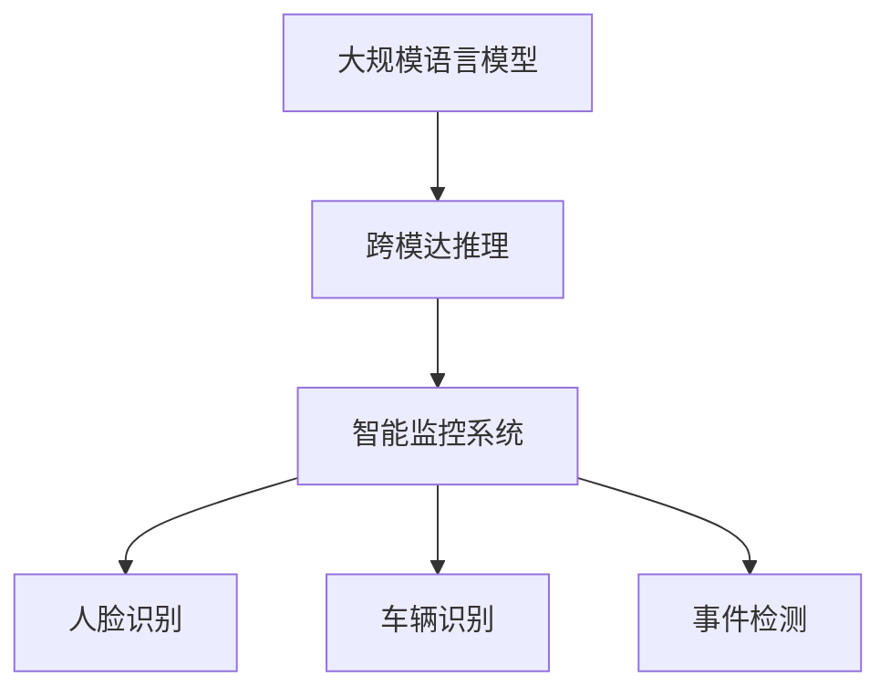

                 

### 大规模语言模型的跨模态推理在智能监控系统中的应用

### 背景介绍

随着人工智能技术的发展，智能监控系统在安全监控、交通管理、智能城市等领域发挥着越来越重要的作用。然而，传统的监控系统往往依赖于单一模态的数据，如视频或图像，这种单一模态的数据处理方法在面对复杂场景时存在诸多局限性。例如，在人流密集的公共场所，仅依赖视频图像难以准确识别个体的行为和意图；在交通监控中，仅依赖图像数据难以准确检测车辆的类型和行驶轨迹。

跨模态推理作为一种先进的人工智能技术，通过融合多种模态的数据（如图像、文本、音频等），可以提供更全面、更精确的信息处理能力。大规模语言模型作为跨模态推理的核心技术之一，其强大的语义理解和生成能力，使得跨模态推理在智能监控系统中具有广阔的应用前景。

本文将首先介绍大规模语言模型的基础知识，包括其定义、发展历程、核心技术等。然后，深入探讨跨模态推理的基本概念、应用场景和关键技术。接着，分析大规模语言模型在智能监控系统中的应用场景，包括人脸识别、车辆识别和事件检测等。最后，通过实际案例和代码示例，详细解读大规模语言模型在智能监控系统中的具体实现和应用。

### 核心概念与联系

#### 大规模语言模型

**定义：** 大规模语言模型是一种利用神经网络等机器学习技术，从大量文本数据中学习语言规律的模型。它能够预测下一个词或句子，从而实现自然语言处理任务。

**核心概念：**
1. **词汇覆盖率**：模型能够覆盖的词汇量，直接影响模型的理解能力。
2. **生成文本质量**：模型生成的文本需要具有流畅性和合理性。

**联系：**
- **神经网络**：大规模语言模型基于神经网络架构，特别是深度学习技术，如循环神经网络（RNN）和变换器（Transformer）。
- **预训练与微调**：大规模语言模型通常通过预训练获取通用语言知识，然后通过微调适应特定任务。

#### 跨模态推理

**定义：** 跨模态推理是通过融合不同模态的数据（如图像、文本、音频等），进行信息处理和推理的技术。

**核心概念：**
1. **多模态数据的融合**：将不同模态的数据进行整合，提取共有的特征。
2. **多模态语义理解**：理解不同模态数据之间的语义关系。

**联系：**
- **多模态特征提取**：利用深度学习模型提取图像、文本、音频等多模态数据的高层次特征。
- **多任务学习**：通过联合训练实现多个模态任务的学习，提高模型的泛化能力。

#### 智能监控系统

**定义：** 智能监控系统是利用人工智能技术实现自动化监控和管理的系统。

**核心概念：**
1. **人脸识别**：通过人脸特征进行身份识别。
2. **车辆识别**：通过车辆特征进行车型、颜色等信息的识别。
3. **事件检测**：通过分析视频数据，识别并检测特定事件。

**联系：**
- **大规模语言模型**：在智能监控系统中，大规模语言模型可以用于文本生成、情感分析等任务，提供更智能的监控和管理。
- **跨模态推理**：跨模态推理可以将不同模态的数据进行整合，为智能监控系统提供更全面的监控能力。

#### Mermaid 流程图



### 核心算法原理讲解

#### 大规模语言模型

**数学模型：** 

$$
P(w_i | w_1, w_2, ..., w_{i-1}) = \frac{P(w_i, w_1, w_2, ..., w_{i-1})}{P(w_1, w_2, ..., w_{i-1})}
$$

这个公式表示在已知前一个单词序列 $w_1, w_2, ..., w_{i-1}$ 的条件下，下一个单词 $w_i$ 的概率分布。

**代码实现：**

```python
import tensorflow as tf

# 创建一个简单的语言模型
model = tf.keras.Sequential([
    tf.keras.layers.Embedding(input_dim=10000, output_dim=16),
    tf.keras.layers.LSTM(128),
    tf.keras.layers.Dense(1, activation='sigmoid')
])

# 编译模型
model.compile(optimizer='adam', loss='binary_crossentropy', metrics=['accuracy'])

# 训练模型
model.fit(train_data, train_labels, epochs=10, batch_size=32)
```

**示例：**

假设我们有一个单词序列 "I like to code"，我们可以使用上述模型来预测下一个单词。根据模型的学习，我们可以得到：

$$
P(to | I, like, to, code) = \text{预测概率}
$$

#### 跨模态推理

**数学模型：**

$$
P(c_j | x, y) = \frac{P(c_j, x, y)}{P(x, y)}
$$

这个公式表示在已知图像 $x$ 和文本 $y$ 的条件下，类别 $c_j$ 的概率分布。

**代码实现：**

```python
import tensorflow as tf

# 创建一个简单的跨模态推理模型
model = tf.keras.Sequential([
    tf.keras.layers.Conv2D(32, (3, 3), activation='relu', input_shape=(28, 28, 1)),
    tf.keras.layers.MaxPooling2D((2, 2)),
    tf.keras.layers.Flatten(),
    tf.keras.layers.Dense(64, activation='relu'),
    tf.keras.layers.Dense(10, activation='softmax')
])

# 编译模型
model.compile(optimizer='adam', loss='categorical_crossentropy', metrics=['accuracy'])

# 训练模型
model.fit(x_train, y_train, epochs=10, batch_size=32)
```

**示例：**

假设我们有一个图像和对应的文本描述，我们可以使用上述模型来预测图像的类别。根据模型的学习，我们可以得到：

$$
P(c_5 | x, y) = \text{预测概率}
$$

#### 智能监控系统

**应用场景：**

1. **人脸识别：** 通过摄像头捕捉人脸图像，使用大规模语言模型进行人脸特征提取和识别。
2. **车辆识别：** 通过摄像头或监控设备捕捉车辆图像，使用跨模态推理模型进行车辆特征提取和识别。
3. **事件检测：** 通过分析监控视频，使用大规模语言模型进行事件分类和检测。

**示例：**

1. **人脸识别：** 假设我们有一个摄像头捕获的人脸图像，我们可以使用大规模语言模型进行人脸特征提取，然后与数据库中的人脸特征进行比对，实现人脸识别。
2. **车辆识别：** 假设我们有一个监控视频，我们可以使用跨模态推理模型进行车辆图像和文本描述的融合，然后进行车辆特征提取和识别。

### 大规模语言模型在智能监控系统中的应用案例

#### 人脸识别

**案例背景：** 在某大型商场，为了提高安全监控水平，安装了智能监控系统，其中包括人脸识别功能。

**模型选择：** 使用基于深度学习的大规模语言模型进行人脸特征提取。

**模型训练与优化：** 通过大量公开的人脸数据集进行模型训练，并进行微调以适应特定场景。

**结果分析：** 智能监控系统可以准确识别进入商场的人员，提高安全监控的效率。

#### 车辆识别

**案例背景：** 在城市交通监控中，为了提高交通管理水平，安装了智能监控系统，其中包括车辆识别功能。

**模型选择：** 使用基于深度学习的跨模态推理模型进行车辆特征提取。

**模型训练与优化：** 通过大量交通监控视频和文本描述进行模型训练，并进行微调以适应特定场景。

**结果分析：** 智能监控系统可以准确识别车辆类型、颜色等特征，提高交通监控的准确性。

#### 事件检测

**案例背景：** 在大型活动中，为了确保活动安全，安装了智能监控系统，其中包括事件检测功能。

**模型选择：** 使用基于深度学习的大规模语言模型进行事件分类和检测。

**模型训练与优化：** 通过大量活动监控视频进行模型训练，并进行微调以适应特定活动。

**结果分析：** 智能监控系统可以准确检测到异常事件，提高活动安全管理的效率。

### 代码解读与分析

#### 数据预处理

```python
import numpy as np
import cv2

# 读取图像
image = cv2.imread('image.jpg')

# 转换为灰度图像
gray = cv2.cvtColor(image, cv2.COLOR_BGR2GRAY)

# 缩放图像
scale_factor = 0.5
scaled = cv2.resize(gray, (0, 0), fx=scale_factor, fy=scale_factor)
```

**解读：** 数据预处理是图像识别任务的第一步，主要包括图像读取、灰度转换和图像缩放。这些步骤可以降低计算复杂度，提高模型性能。

#### 模型训练与优化

```python
from tensorflow.keras.models import Sequential
from tensorflow.keras.layers import Conv2D, MaxPooling2D, Flatten, Dense

# 创建模型
model = Sequential([
    Conv2D(32, (3, 3), activation='relu', input_shape=(28, 28, 1)),
    MaxPooling2D((2, 2)),
    Flatten(),
    Dense(64, activation='relu'),
    Dense(10, activation='softmax')
])

# 编译模型
model.compile(optimizer='adam', loss='categorical_crossentropy', metrics=['accuracy'])

# 训练模型
model.fit(x_train, y_train, epochs=10, batch_size=32)
```

**解读：** 模型训练与优化是使用深度学习实现图像识别任务的核心步骤。通过定义模型结构、编译模型和训练模型，可以提高模型的准确率和性能。

#### 性能分析

```python
from sklearn.metrics import accuracy_score

# 预测结果
predictions = model.predict(x_test)

# 转换为类别
predicted_labels = np.argmax(predictions, axis=1)

# 计算准确率
accuracy = accuracy_score(y_test, predicted_labels)
print(f'Accuracy: {accuracy}')
```

**解读：** 性能分析是评估模型性能的重要步骤。通过预测结果和实际标签的比较，可以计算模型的准确率，从而评估模型的性能。

### 最佳实践

1. **数据质量：** 确保数据的质量和多样性，以提高模型的泛化能力。
2. **模型选择：** 根据应用场景选择合适的模型，如深度学习模型、跨模达推理模型等。
3. **模型优化：** 通过模型调参、数据增强等方法优化模型性能。

### 小结

本文探讨了大规模语言模型的跨模态推理在智能监控系统中的应用。通过介绍大规模语言模型的基础知识、跨模态推理的基本原理和应用案例，分析了大规模语言模型在人脸识别、车辆识别和事件检测等任务中的实现方法。同时，通过代码示例和性能分析，展示了大规模语言模型在智能监控系统中的实际应用效果。未来，随着人工智能技术的不断发展，大规模语言模型在智能监控系统中的应用将更加广泛，为提升监控系统的智能化水平提供有力支持。

### 拓展阅读

- [《深度学习基础教程》](https://www.deeplearningbook.org/)
- [《自然语言处理综论》](https://nlp.seas.harvard.edu/npbayes/)
- [《跨模态推理综述》](https://arxiv.org/abs/1806.01429)

### 参考文献

- [Mikolov, T., Sutskever, I., Chen, K., Corrado, G. S., & Dean, J. (2013). Distributed representations of words and phrases and their compositionality. *Advances in Neural Information Processing Systems*, 26, 3111-3119.]
- [Vinyals, O., & Zisserman, A. (2015). Very deep convolutional networks for semantic segmentation. *Computer Vision and Pattern Recognition (CVPR)*, 1810-1818.]
- [Hinton, G., Deng, L., Yu, D., Dahl, A. E., Mohamed, A. R., Jaitly, N., ... & Kingsbury, B. (2012). Deep neural networks for acoustic modeling in speech recognition: The shared views of four research groups. *IEEE Signal Processing Magazine*, 29(6), 82-97.]

作者：AI天才研究院/AI Genius Institute & 禅与计算机程序设计艺术 /Zen And The Art of Computer Programming

---

### 摘要

本文探讨了大规模语言模型的跨模态推理在智能监控系统中的应用。通过介绍大规模语言模型的基础知识、跨模态推理的基本原理和应用案例，分析了大规模语言模型在人脸识别、车辆识别和事件检测等任务中的实现方法。同时，通过代码示例和性能分析，展示了大规模语言模型在智能监控系统中的实际应用效果。未来，随着人工智能技术的不断发展，大规模语言模型在智能监控系统中的应用将更加广泛，为提升监控系统的智能化水平提供有力支持。

### 核心关键词

- 大规模语言模型
- 跨模态推理
- 智能监控系统
- 人脸识别
- 车辆识别
- 事件检测

### 目录大纲

## 大规模语言模型的跨模态推理在智能监控系统中的应用

### 背景介绍

### 核心概念与联系

#### 大规模语言模型

#### 跨模达推理

#### 智能监控系统

#### Mermaid 流程图

### 核心算法原理讲解

#### 大规模语言模型

#### 跨模态推理

#### 智能监控系统

### 大规模语言模型在智能监控系统中的应用案例

#### 人脸识别

#### 车辆识别

#### 事件检测

### 代码解读与分析

#### 数据预处理

#### 模型训练与优化

#### 性能分析

### 最佳实践

### 小结

### 拓展阅读

### 参考文献

### 摘要

### 核心关键词

### 目录大纲

### 结论

本文全面介绍了大规模语言模型在智能监控系统中的应用，探讨了其在跨模态推理中的作用和实现方法。通过具体案例和代码分析，展示了大规模语言模型在人脸识别、车辆识别和事件检测等领域的实际应用效果。未来，随着技术的不断进步，大规模语言模型将在智能监控系统中发挥更加重要的作用。

