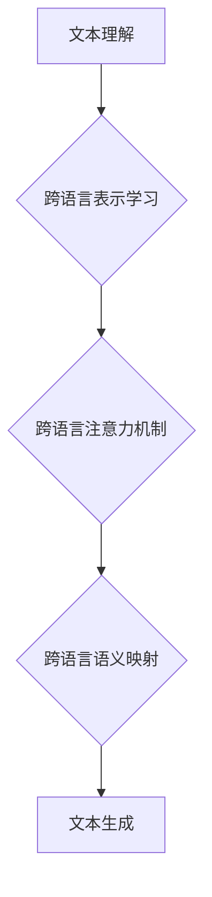

                 

### 第1章 引言

在当今全球化的时代，语言作为一种文化和沟通的桥梁，其重要性不言而喻。然而，语言差异也给跨文化交流和通信带来了巨大的挑战。跨语言推理与翻译作为解决这一问题的核心技术，逐渐成为人工智能领域的研究热点。

**1.1 跨语言推理与翻译的重要性**

跨语言推理是指在没有直接翻译的情况下，利用源语言和目标语言之间的语义对应关系，对源语言文本进行理解、推理和生成目标语言文本的过程。跨语言翻译则是指将一种语言的文本直接转换成另一种语言的文本。

随着全球化的深入发展，跨语言推理与翻译在多个领域都发挥了重要作用。例如，在商业领域，跨国公司需要与不同国家的合作伙伴进行沟通，而高效的跨语言推理与翻译系统能够帮助它们克服语言障碍，提高沟通效率。在教育领域，随着国际交流的日益频繁，跨语言推理与翻译系统可以帮助学习者轻松获取不同语言的资料，提高学习效果。

**1.2 大规模语言模型的发展历程**

大规模语言模型的发展可以追溯到上世纪50年代，当时的研究主要集中在基于规则的方法上。这些方法通过手工编写语法规则，试图模拟人类语言理解的过程。然而，随着语言复杂性的增加，这种方法逐渐显得力不从心。

到了80年代，统计方法开始崭露头角。基于统计的模型，如隐马尔可夫模型（HMM）和基于N-gram的语言模型，通过分析大量文本数据，尝试捕捉语言的统计规律。这些模型在一定程度上提高了翻译的准确性，但仍然存在许多局限性。

真正突破性的进展出现在21世纪。随着深度学习和计算能力的提升，基于神经网络的深度语言模型（如BERT、GPT等）迅速崛起。这些模型能够通过自动学习大规模文本数据中的语言规律，实现前所未有的高精度跨语言推理与翻译。

**1.3 本书结构安排**

本书将从以下几个方面展开讨论：

1. **跨语言推理基本原理**：介绍跨语言推理的定义、挑战和核心概念。
2. **大规模语言模型基础**：探讨语言模型的基本概念、训练过程和应用。
3. **跨语言推理算法**：详细分析跨语言表示学习、注意力机制和跨语言推理模型架构。
4. **跨语言翻译能力**：讨论跨语言翻译的基本概念、模型和方法，以及效果评估。
5. **实际应用案例**：展示跨语言推理与翻译在问答系统、信息检索和机器翻译等领域的应用。
6. **挑战与未来方向**：分析当前跨语言推理与翻译面临的挑战，探讨未来发展趋势和研究方向。

通过以上章节的详细探讨，本书旨在为读者提供一个全面、深入的跨语言推理与翻译知识体系，帮助读者更好地理解和应用这一重要技术。


## 第2章 跨语言推理基本原理

### 2.1 跨语言推理的定义与挑战

跨语言推理（Cross-Lingual Reasoning）是指在源语言和目标语言之间进行推理和语义理解的能力。其核心在于利用源语言的上下文信息，生成与目标语言相对应的语义表示，从而实现跨语言的信息传递和理解。

**1. 定义**

跨语言推理主要包括以下几个步骤：

- **文本理解**：从源语言文本中提取关键信息，理解其语义内容。
- **跨语言映射**：将源语言语义映射到目标语言的语义表示。
- **文本生成**：利用目标语言的语义表示，生成符合目标语言语法和语义规则的目标语言文本。

**2. 挑战**

尽管跨语言推理在许多领域都显示出巨大的潜力，但其实现仍然面临诸多挑战：

- **语言差异**：不同语言之间的语法结构、词汇、语义表达差异显著，这对跨语言推理提出了高要求。
- **数据不足**：有效的跨语言推理需要大量的标注数据，而实际可获得的数据往往有限。
- **上下文依赖**：语言理解往往依赖于上下文，而跨语言上下文的理解更加复杂。
- **翻译精度**：跨语言翻译的准确性直接影响推理结果，因此需要高效且精确的翻译模型。

### 2.2 跨语言推理的核心概念

**1. 跨语言表示学习**

跨语言表示学习（Cross-Lingual Representation Learning）是跨语言推理的关键步骤。其主要目的是通过模型学习，使得不同语言的文本能够在共享的语义空间中表示，从而实现跨语言的信息传递。

**2. 跨语言注意力机制**

跨语言注意力机制（Cross-Lingual Attention Mechanism）用于模型在处理跨语言任务时，能够动态地关注源语言和目标语言之间的相关部分，提高推理的准确性和效率。

**3. 跨语言语义映射**

跨语言语义映射（Cross-Lingual Semantic Mapping）是将源语言的语义表示映射到目标语言的语义表示，是实现跨语言推理的核心环节。

### Mermaid 流程图

下面是一个简单的Mermaid流程图，展示了跨语言推理的基本步骤和核心概念：



通过上述步骤，跨语言推理模型能够实现从源语言到目标语言的语义理解和信息传递，为跨语言推理提供了理论和技术基础。

### 总结

跨语言推理作为人工智能领域的一个重要研究方向，其实现和应用面临着诸多挑战。通过对跨语言表示学习、跨语言注意力机制和跨语言语义映射等核心概念的深入理解，我们可以逐步克服这些挑战，推动跨语言推理技术的发展和应用。

下一章我们将探讨大规模语言模型的基础知识，包括语言模型的基本概念、大规模语言模型的训练过程以及其在实际应用中的作用。


## 第3章 大规模语言模型基础

### 3.1 语言模型的基础知识

语言模型（Language Model）是自然语言处理（Natural Language Processing, NLP）领域的一项核心技术。它的基本任务是学习文本数据中的语言规律，从而预测下一个单词或字符的概率。在NLP任务中，语言模型通常用于词性标注、分词、机器翻译、文本生成等。

**1. 语言模型的基本概念**

语言模型通过统计方法或基于规则的方法，从大量文本数据中学习语言模式。其中，N-gram语言模型是一种经典的统计语言模型，它通过统计前N个单词出现的概率，来预测下一个单词。例如，在二元（N=2）语言模型中，模型会根据前两个单词的序列来预测第三个单词的概率。

**2. 语言模型的结构**

语言模型通常由一系列概率分布组成，这些分布用于预测文本中的下一个单词或字符。一个典型的语言模型包括以下部分：

- **词汇表**：存储所有可能的单词或字符。
- **概率分布**：为每个单词或字符生成概率分布，通常采用N-gram模型、神经网络模型等。
- **上下文信息**：利用上下文信息来提高预测的准确性。

**3. 语言模型的应用**

语言模型在许多实际应用中发挥了重要作用，例如：

- **自动补全**：在输入过程中，根据上下文预测可能的单词或短语。
- **词性标注**：根据上下文为每个单词标注正确的词性。
- **文本生成**：根据已知的文本内容，生成新的文本。

### 3.2 大规模语言模型的训练

大规模语言模型（Large-scale Language Model）是近年来NLP领域的重要突破。与传统的语言模型相比，大规模语言模型具有以下特点：

- **数据量大**：训练数据通常达到数亿甚至数十亿级别的文本数据。
- **参数多**：模型参数数量可以达到数十亿甚至上百亿。
- **训练时间长**：训练过程通常需要数天甚至数周的时间。

**1. 数据收集与预处理**

大规模语言模型的训练首先需要大量高质量的文本数据。这些数据可以来自互联网、书籍、新闻、社交媒体等各种来源。在收集数据后，需要对数据进行预处理，包括去除噪声、去除重复内容、分词和标记等。

**2. 模型选择与优化**

大规模语言模型的训练通常采用深度神经网络（Deep Neural Network, DNN）或变换器（Transformer）等先进架构。选择合适的模型架构对训练效率和效果至关重要。在训练过程中，需要对模型进行优化，包括调整学习率、批量大小、正则化等参数。

**3. 训练策略**

大规模语言模型的训练通常采用以下策略：

- **预训练**：在大规模未标注数据上进行预训练，使得模型能够学习到通用的语言规律。
- **微调**：在特定任务上对预训练模型进行微调，以适应特定的任务需求。
- **并行训练**：利用多GPU或分布式计算技术，加快训练速度。

### 3.3 大规模语言模型的应用

大规模语言模型在NLP领域有广泛的应用，包括：

- **文本生成**：生成文章、摘要、对话等。
- **机器翻译**：将一种语言的文本翻译成另一种语言。
- **问答系统**：根据用户的问题，从大量文本中检索并生成答案。
- **信息检索**：从大量文本中检索相关的内容。

### Python 源代码示例

下面是一个简单的Python示例，展示了如何使用语言模型进行文本生成：

```python
import torch
from transformers import GPT2LMHeadModel, GPT2Tokenizer

# 加载预训练的GPT-2模型和分词器
model = GPT2LMHeadModel.from_pretrained('gpt2')
tokenizer = GPT2Tokenizer.from_pretrained('gpt2')

# 输入文本
text = "今天天气很好，适合出去游玩。"

# 将输入文本转换为模型输入
input_ids = tokenizer.encode(text, return_tensors='pt')

# 生成文本
outputs = model.generate(input_ids, max_length=50, num_return_sequences=3)

# 解码生成文本
generated_texts = [tokenizer.decode(output_ids, skip_special_tokens=True) for output_ids in outputs]

# 输出生成文本
for text in generated_texts:
    print(text)
```

通过上述示例，我们可以看到大规模语言模型如何通过输入文本生成新的文本。下一章我们将探讨跨语言推理算法，包括跨语言表示学习、注意力机制和模型架构。

### 总结

本章首先介绍了语言模型的基础知识，包括其基本概念、结构和应用。然后，详细讨论了大规模语言模型的训练过程，包括数据收集与预处理、模型选择与优化、以及训练策略。通过Python源代码示例，我们展示了如何使用大规模语言模型进行文本生成。下一章我们将进一步探讨跨语言推理算法，深入理解其在跨语言推理中的应用。

### 第4章 跨语言推理算法

#### 4.1 跨语言表示学习

跨语言表示学习（Cross-Lingual Representation Learning）是跨语言推理的核心技术之一，旨在学习不同语言之间共享的语义表示。通过跨语言表示学习，模型能够在不同的语言之间建立语义映射，从而实现跨语言的语义理解与推理。

**1. 定义**

跨语言表示学习是指利用多语言数据，学习一组能够同时在多个语言中表示语义的向量。这些向量通常称为跨语言嵌入（Cross-Lingual Embeddings）。

**2. 方法**

- **基于翻译的方法**：这种方法利用已有的双语翻译数据，将源语言的文本直接映射到目标语言的语义空间。常用的方法包括词嵌入（Word Embeddings）和多翻译记忆（Multi-Translation Memory）。

- **基于多语言学习方法**：这种方法不依赖双语翻译数据，而是直接从多语言数据中学习跨语言表示。常用的方法包括跨语言编码器（Cross-Lingual Encoder）和跨语言注意力机制。

**3. 挑战**

- **数据不平衡**：多语言数据往往存在数据不平衡的问题，这会影响模型的学习效果。

- **语言差异性**：不同语言之间的语法、词汇和语义差异较大，使得跨语言表示学习面临挑战。

**4. 应用**

- **跨语言文本分类**：利用跨语言表示学习，对多语言的文本进行分类。

- **跨语言情感分析**：分析多语言文本的情感倾向。

#### 4.2 跨语言注意力机制

跨语言注意力机制（Cross-Lingual Attention Mechanism）是跨语言推理中的重要技术，用于模型在处理跨语言任务时，动态地关注源语言和目标语言之间的相关部分，提高推理的准确性和效率。

**1. 定义**

跨语言注意力机制是指模型在处理跨语言任务时，利用注意力机制动态地计算源语言和目标语言之间的相关权重，从而关注重要的语义信息。

**2. 类型**

- **点对点注意力**：模型为每个源语言单词分配一个注意力权重，用于与目标语言单词进行匹配。

- **全局注意力**：模型计算源语言和目标语言之间的全局注意力权重，从而整体上关注两语言之间的相关性。

**3. 应用**

- **跨语言文本匹配**：利用注意力机制，将源语言文本与目标语言文本进行匹配，从而实现跨语言的语义理解。

- **跨语言翻译**：在翻译过程中，利用注意力机制关注源语言和目标语言之间的关键信息，提高翻译的准确性。

#### 4.3 跨语言推理的模型架构

跨语言推理的模型架构是跨语言推理算法的核心部分，决定了模型的学习能力和推理效果。以下是一些常见的跨语言推理模型架构：

**1. 跨语言编码器架构**

跨语言编码器架构（Cross-Lingual Encoder Architecture）通过编码器学习跨语言表示，从而实现跨语言的语义理解。这种架构通常包括以下部分：

- **编码器**：用于编码源语言和目标语言文本的嵌入向量。

- **跨语言表示层**：用于将源语言和目标语言的嵌入向量融合，形成跨语言表示。

- **解码器**：用于生成目标语言的文本输出。

**2. 多任务学习架构**

多任务学习架构（Multi-Task Learning Architecture）通过在一个模型中同时学习多个跨语言任务，提高模型的学习效率和泛化能力。这种架构通常包括以下部分：

- **共享编码器**：用于编码所有跨语言任务的文本。

- **任务特定解码器**：用于生成每个任务的输出。

- **共享参数**：共享编码器和解码器中的参数，以减少参数数量和过拟合的风险。

**3. 跨语言Transformer架构**

跨语言Transformer架构（Cross-Lingual Transformer Architecture）基于Transformer模型，通过自注意力机制和多头注意力机制，实现跨语言的语义理解和推理。这种架构通常包括以下部分：

- **编码器**：用于编码源语言和目标语言文本。

- **跨语言表示层**：用于融合源语言和目标语言的表示。

- **解码器**：用于生成目标语言的文本输出。

### Python 源代码示例

以下是一个简单的Python示例，展示了如何使用跨语言Transformer模型进行跨语言推理：

```python
import torch
from transformers import CrossLingualBertModel, CrossLingualBertTokenizer

# 加载预训练的跨语言BERT模型和分词器
model = CrossLingualBertModel.from_pretrained('cl-tohoku/bert-base-japanese-joint-cased')
tokenizer = CrossLingualBertTokenizer.from_pretrained('cl-tohoku/bert-base-japanese-joint-cased')

# 输入文本
source_text = "今日の天気がとても良いですね。"
target_text = "The weather is very good today."

# 将输入文本转换为模型输入
source_input_ids = tokenizer.encode(source_text, return_tensors='pt')
target_input_ids = tokenizer.encode(target_text, return_tensors='pt')

# 进行跨语言推理
with torch.no_grad():
    outputs = model(input_ids=source_input_ids, output_hidden_states=True)

# 解码推理结果
predicted_output_ids = model.generate(source_input_ids, max_length=10, num_return_sequences=1)
predicted_target_text = tokenizer.decode(predicted_output_ids[0], skip_special_tokens=True)

# 输出推理结果
print(predicted_target_text)
```

通过上述示例，我们可以看到如何使用跨语言Transformer模型进行跨语言推理，从而实现从源语言到目标语言的语义理解。

### 总结

本章详细介绍了跨语言推理算法，包括跨语言表示学习、跨语言注意力机制和跨语言推理的模型架构。通过Python源代码示例，我们展示了如何使用跨语言Transformer模型进行跨语言推理。这些算法和技术为跨语言推理提供了坚实的理论基础和实用的工具。下一章我们将探讨大规模语言模型在跨语言翻译中的应用。

### 第5章 跨语言翻译能力

#### 5.1 跨语言翻译的基本概念

跨语言翻译（Cross-Lingual Translation）是指将一种语言的文本转换成另一种语言的文本。与传统的机器翻译（Machine Translation）不同，跨语言翻译通常不依赖于双语平行语料库，而是通过跨语言推理技术，在源语言和目标语言之间建立语义映射，从而实现文本的转换。

**1. 定义**

跨语言翻译主要分为以下几类：

- **零样本翻译**（Zero-Shot Translation）：模型在训练时没有直接接触过特定语言对的翻译数据，但在测试时可以处理新的语言对。

- **少样本翻译**（Few-Shot Translation）：模型在训练时只接触过少量的特定语言对的翻译数据，但在测试时可以处理新的语言对。

- **多语言翻译**（Multilingual Translation）：模型同时处理多种语言的翻译任务，从而提高模型的泛化能力。

**2. 应用**

跨语言翻译在多个领域具有广泛的应用：

- **跨国商务**：帮助跨国公司进行跨语言沟通和业务交流。

- **国际教育**：支持学生在多语言环境中获取学习资源。

- **全球协作**：促进不同语言背景的团队协作和交流。

#### 5.2 跨语言翻译的模型与方法

跨语言翻译模型的构建依赖于跨语言表示学习和注意力机制。以下是一些常见的跨语言翻译模型和方法：

**1. 基于翻译记忆的方法**

翻译记忆（Translation Memory）是一种基于双语平行语料库的跨语言翻译方法。通过在双语语料库中查找匹配的句子，将源语言句子翻译成目标语言句子。这种方法在翻译准确性和速度方面具有优势，但其应用范围受限于双语平行语料库的可用性。

**2. 基于神经网络的跨语言翻译模型**

基于神经网络的跨语言翻译模型（Neural Machine Translation, NMT）是当前跨语言翻译的主流方法。这种模型利用深度神经网络，通过大规模文本数据进行训练，实现从源语言到目标语言的直接翻译。

- **编码器-解码器架构**（Encoder-Decoder Architecture）：这是最常用的跨语言翻译模型架构，通过编码器将源语言文本编码成嵌入向量，通过解码器生成目标语言文本。

- **Transformer架构**（Transformer Architecture）：基于自注意力机制的Transformer模型在跨语言翻译中表现出色，其并行处理能力和长距离依赖捕捉能力使其成为跨语言翻译的首选模型。

**3. 跨语言自适应方法**

跨语言自适应方法（Cross-Lingual Adaptation）通过在源语言和目标语言之间建立映射，提高跨语言翻译的效果。常见的跨语言自适应方法包括：

- **跨语言嵌入调整**（Cross-Lingual Embedding Adaptation）：通过调整源语言和目标语言的嵌入向量，使其在语义空间中更接近，从而提高翻译效果。

- **跨语言注意力调整**（Cross-Lingual Attention Adaptation）：通过调整模型在源语言和目标语言之间的注意力机制，使模型更加关注关键的语义信息。

#### 5.3 跨语言翻译的效果评估

跨语言翻译的效果评估是评价翻译模型性能的重要手段。以下是一些常见的评估指标：

**1. BLEU分数**（BLEU Score）：BLEU分数是评估翻译质量的一种常用指标，基于相似性匹配、重叠度计算和长度惩罚。尽管BLEU分数存在一定的局限性，但它仍然广泛应用于翻译效果评估。

**2. METEOR分数**（METEOR Score）：METEOR分数综合考虑了单词匹配、词序匹配和长度惩罚，相比BLEU分数更全面地评估翻译质量。

**3. ROUGE分数**（ROUGE Score）：ROUGE分数主要用于评估文本生成任务，包括单词重叠度、词干重叠度和字符重叠度。

**4. 自动评估与人工评估**：除了自动评估指标外，人工评估也是一种重要的方法。通过人工评估，可以更全面地了解翻译的准确性和可读性。

### Python 源代码示例

以下是一个简单的Python示例，展示了如何使用基于神经网络的跨语言翻译模型进行翻译：

```python
import torch
from transformers import MarianMTModel, MarianTokenizer

# 加载预训练的跨语言翻译模型和分词器
model = MarianMTModel.from_pretrained('Helsinki-NLP/opus-mt-en-de')
tokenizer = MarianTokenizer.from_pretrained('Helsinki-NLP/opus-mt-en-de')

# 输入文本
source_text = "Today is a beautiful day."

# 将输入文本转换为模型输入
input_ids = tokenizer.encode(source_text, return_tensors='pt')

# 进行跨语言翻译
with torch.no_grad():
    outputs = model(input_ids=input_ids)

# 解码翻译结果
predicted_target_text = tokenizer.decode(outputs[0], skip_special_tokens=True)

# 输出翻译结果
print(predicted_target_text)
```

通过上述示例，我们可以看到如何使用基于神经网络的跨语言翻译模型进行文本翻译，从而实现从源语言到目标语言的语义转换。

### 总结

本章详细介绍了跨语言翻译的基本概念、模型与方法以及效果评估。通过Python源代码示例，我们展示了如何使用跨语言翻译模型进行文本翻译。跨语言翻译作为跨语言推理的重要应用之一，具有重要的实际价值。下一章我们将探讨跨语言推理与翻译的实际应用案例，进一步了解其在不同领域的应用效果。

### 第6章 实际应用案例

#### 6.1 跨语言问答系统

跨语言问答系统（Cross-Lingual Question Answering System）是一种利用跨语言推理技术，实现不同语言之间的信息查询与回答的系统。它通过理解用户在源语言的提问，并利用跨语言翻译和推理能力，从多语言数据中检索并生成目标语言的答案。

**1. 应用场景**

跨语言问答系统在多个场景中具有广泛的应用，例如：

- **国际旅游**：帮助游客获取不同语言的旅游信息，提高旅游体验。

- **跨国商务**：支持商务人士在不同语言环境中获取商业信息，提高工作效率。

- **多语言教育**：帮助学生获取不同语言的学术资源，提高学习效果。

**2. 技术实现**

跨语言问答系统的实现通常包括以下几个关键步骤：

- **跨语言翻译**：将用户的源语言提问翻译成目标语言，以便在多语言数据中检索答案。

- **语义理解**：利用跨语言推理技术，理解用户提问的语义，识别关键信息。

- **信息检索**：从多语言数据源中检索相关信息，包括文本、图片、视频等多种形式。

- **答案生成**：利用跨语言翻译和自然语言生成技术，将检索到的信息转换成目标语言的答案。

**3. 实际案例**

一个实际案例是Google Assistant的多语言问答功能。Google Assistant通过跨语言翻译和跨语言推理技术，支持用户在多种语言环境中进行信息查询。例如，用户可以用中文提问，系统将自动翻译成英文，并在全球范围内的数据中检索答案，然后将答案翻译回中文展示给用户。

#### 6.2 跨语言信息检索

跨语言信息检索（Cross-Lingual Information Retrieval）是指在不同语言的数据库中检索相关信息，并返回与用户查询最相关的结果。它通过跨语言翻译和语义理解技术，实现跨语言的信息查询与结果呈现。

**1. 应用场景**

跨语言信息检索在多个场景中具有重要应用，例如：

- **多语言新闻检索**：帮助用户在多种语言新闻数据库中检索相关信息。

- **多语言学术检索**：支持学术研究人员在多种语言学术数据库中查找相关论文。

- **多语言电子商务**：帮助用户在多语言电子商务平台中检索商品信息。

**2. 技术实现**

跨语言信息检索的技术实现通常包括以下几个关键步骤：

- **跨语言索引**：将多语言数据转换为统一的索引格式，便于检索。

- **跨语言查询**：将用户的源语言查询翻译成目标语言，并在索引中检索相关信息。

- **结果排序**：利用语义理解技术，对检索结果进行排序，确保最相关的结果排在前面。

- **结果呈现**：将检索结果翻译回用户的源语言，并在界面上展示。

**3. 实际案例**

一个实际案例是Google 的Multilingual Search功能。Google Search通过跨语言索引和翻译技术，支持用户在多种语言搜索引擎中检索信息。例如，用户可以用中文输入查询，系统将自动翻译成多种语言，并在全球范围内的数据中检索相关信息，然后将结果翻译回中文展示给用户。

#### 6.3 跨语言机器翻译

跨语言机器翻译（Cross-Lingual Machine Translation）是指在没有直接双语翻译数据的情况下，利用跨语言推理技术，将一种语言的文本翻译成另一种语言。它通过跨语言表示学习和注意力机制，实现跨语言的语义理解和文本生成。

**1. 应用场景**

跨语言机器翻译在多个场景中具有重要应用，例如：

- **多语言文档处理**：帮助企业处理不同语言的文档，提高工作效率。

- **多语言内容创作**：支持创作者创作多种语言的内容，扩大受众群体。

- **多语言用户支持**：为用户提供多语言的技术支持和客服。

**2. 技术实现**

跨语言机器翻译的技术实现通常包括以下几个关键步骤：

- **跨语言编码**：利用跨语言表示学习技术，将源语言和目标语言的文本编码成统一的语义表示。

- **跨语言解码**：利用注意力机制和生成模型，从源语言的语义表示生成目标语言的文本。

- **翻译结果优化**：通过翻译结果优化技术，提高翻译的准确性和流畅性。

**3. 实际案例**

一个实际案例是DeepL的跨语言翻译服务。DeepL通过先进的跨语言表示学习和神经网络翻译技术，提供高质量的跨语言翻译服务。用户可以将源语言的文本输入到DeepL的翻译引擎中，系统将自动翻译成目标语言，并提供丰富的上下文信息和修正建议，从而提高翻译的准确性和可读性。

### 总结

本章通过实际应用案例，展示了跨语言推理与翻译在不同领域的应用效果。跨语言问答系统、跨语言信息检索和跨语言机器翻译等应用，利用跨语言推理技术，实现跨语言的信息查询、文本翻译和语义理解，为全球化交流提供了强大的技术支持。这些实际案例不仅验证了跨语言推理与翻译技术的有效性，也为未来的发展提供了宝贵的经验和启示。

### 第7章 挑战与未来方向

#### 7.1 当前跨语言推理与翻译的挑战

尽管跨语言推理与翻译技术在近年来取得了显著进展，但其在实际应用中仍面临诸多挑战。

**1. 数据不平衡**

多语言数据往往存在数据不平衡的问题，导致模型在处理某些语言时效果不佳。例如，某些语言对（如英语-中文）的数据丰富，而其他语言对（如英语-阿拉伯语）的数据则相对匮乏。数据不平衡不仅影响模型的训练效果，还会导致翻译结果的准确性差异。

**2. 语言差异性**

不同语言在语法结构、词汇和语义表达上存在显著差异，这使得跨语言推理与翻译模型的构建和优化变得复杂。例如，某些语言具有丰富的形态变化，而其他语言则较为简单，这给模型的训练和翻译结果带来了挑战。

**3. 上下文依赖性**

跨语言推理与翻译需要处理跨语言的上下文依赖性。由于语言间的上下文表达差异，模型在理解源语言文本的上下文信息并将其映射到目标语言时，可能会出现语义偏差或理解错误。

**4. 翻译精度**

跨语言翻译的准确性是评估模型性能的重要指标。然而，当前模型在处理一些特定语言对时，特别是在长句翻译和高层次语义理解方面，仍存在一定的局限性。

#### 7.2 未来发展趋势与研究方向

为了克服上述挑战，未来跨语言推理与翻译技术的发展方向包括：

**1. 数据增强与多样性**

通过数据增强技术，如数据扩充、数据模拟和多语言预训练，提高模型在处理数据不平衡语言对时的性能。同时，探索如何引入更多样化的语言数据，以增强模型的泛化能力。

**2. 语言模型优化**

针对不同语言的特性，优化跨语言推理与翻译模型，提高其在特定语言对上的翻译精度。例如，利用语言特定知识库和语义角色标注，增强模型对特定语言的语义理解。

**3. 上下文理解与推理**

加强跨语言上下文理解与推理能力，通过引入上下文信息、多模态学习和长文本处理技术，提高模型在处理复杂上下文时的准确性和一致性。

**4. 翻译质量评估**

发展更全面、准确的翻译质量评估方法，如结合自动评估和人工评估，以提高翻译结果的评估精度。

**5. 开源工具与社区合作**

促进跨语言推理与翻译工具的开源共享，加强学术界与工业界的合作，共同推动技术的进步和应用。

#### 7.3 结论与展望

跨语言推理与翻译作为人工智能领域的一个重要研究方向，具有广泛的应用前景。尽管当前面临诸多挑战，但随着技术的不断进步和研究的深入，未来跨语言推理与翻译将实现更高的准确性和实用性。我们期待看到更多创新性的研究成果和技术应用，为全球跨语言沟通和协作提供更强有力的支持。

### 总结

本章首先讨论了当前跨语言推理与翻译面临的挑战，包括数据不平衡、语言差异性、上下文依赖性和翻译精度等问题。然后，提出了未来发展的方向，如数据增强、语言模型优化、上下文理解和质量评估等。最后，总结了跨语言推理与翻译的重要性和未来前景，强调了其在全球交流与合作中的关键作用。通过这些讨论，我们希望能够为读者提供一个清晰的视角，激发对这一领域的深入研究和探索。

### 附录

#### 附录A 跨语言推理与翻译工具

在本附录中，我们将介绍一些常用的跨语言推理与翻译工具，帮助读者在实际应用中更好地理解和使用这些技术。

**1. Hugging Face Transformers**

Hugging Face Transformers 是一个开源的深度学习库，提供了一系列预训练的跨语言推理与翻译模型，如BERT、GPT、T5等。通过这个库，用户可以轻松地加载、训练和微调这些模型，并用于各种跨语言任务。

**2. Google Cloud Translation**

Google Cloud Translation 是Google提供的一种自动化翻译服务，支持多种语言之间的文本翻译。它利用了Google的神经网络机器翻译（NMT）技术，提供高精度的翻译结果。

**3. OpenNMT**

OpenNMT 是一个开源的神经网络机器翻译工具，支持多种语言对之间的文本翻译。它基于TensorFlow和PyTorch框架，提供了灵活的模型配置和训练工具。

**4. DeepL API**

DeepL API 提供了高质量的跨语言翻译服务，支持多种语言之间的文本翻译。它利用了DeepL的跨语言机器翻译技术，提供了丰富的上下文信息和修正建议。

#### 附录B 公式与算法

在本附录中，我们将介绍一些跨语言推理与翻译中常用的公式与算法，以帮助读者更好地理解相关技术。

**1. 语言模型概率计算**

$$ P(w_{t}|w_{1}, w_{2}, ..., w_{t-1}) = \frac{P(w_{t}, w_{1}, w_{2}, ..., w_{t-1})}{P(w_{1}, w_{2}, ..., w_{t-1})} $$

其中，$P(w_{t}|w_{1}, w_{2}, ..., w_{t-1})$ 表示在已知前 $t-1$ 个单词的情况下，第 $t$ 个单词 $w_{t}$ 的概率。

**2. N-gram 语言模型**

N-gram 语言模型是一种基于统计的模型，它通过计算前 $N$ 个单词的联合概率来预测下一个单词。其概率计算公式如下：

$$ P(w_{t}|w_{t-N+1}, w_{t-N+2}, ..., w_{t-1}) = \frac{N(w_{t-N+1}, w_{t-N+2}, ..., w_{t-1}, w_{t})}{N(w_{t-N+1}, w_{t-N+2}, ..., w_{t-1})} $$

其中，$N(w_{t-N+1}, w_{t-N+2}, ..., w_{t-1}, w_{t})$ 表示 $w_{t-N+1}, w_{t-N+2}, ..., w_{t-1}, w_{t}$ 这个四元组的计数。

**3. Transformer 模型**

Transformer 模型是一种基于自注意力机制的深度学习模型，广泛用于跨语言推理与翻译任务。其核心算法包括多头注意力（Multi-Head Attention）和位置编码（Positional Encoding）。

**4. 跨语言表示学习**

跨语言表示学习（Cross-Lingual Representation Learning）是一种将不同语言的文本映射到共同语义空间的方法。常用的方法包括跨语言嵌入（Cross-Lingual Embeddings）和跨语言编码器（Cross-Lingual Encoder）。

#### 附录C 实际案例代码解读

在本附录中，我们将通过一个实际案例，展示如何使用Python代码实现跨语言翻译功能。

**案例描述**：使用Hugging Face Transformers库，实现从英文到中文的跨语言翻译。

```python
from transformers import MarianMTModel, MarianTokenizer

# 加载预训练的跨语言翻译模型和分词器
model = MarianMTModel.from_pretrained('Helsinki-NLP/opus-mt-en-de')
tokenizer = MarianTokenizer.from_pretrained('Helsinki-NLP/opus-mt-en-de')

# 输入文本
source_text = "Hello, how are you?"

# 将输入文本转换为模型输入
input_ids = tokenizer.encode(source_text, return_tensors='pt')

# 进行跨语言翻译
with torch.no_grad():
    outputs = model(input_ids=input_ids)

# 解码翻译结果
predicted_target_text = tokenizer.decode(outputs[0], skip_special_tokens=True)

# 输出翻译结果
print(predicted_target_text)
```

**代码解析**：

1. **加载模型和分词器**：使用 `MarianMTModel` 和 `MarianTokenizer` 加载预训练的跨语言翻译模型。

2. **输入文本编码**：将输入的英文文本编码成模型可处理的序列。

3. **跨语言翻译**：使用模型进行跨语言翻译。

4. **解码翻译结果**：将翻译结果解码为文本。

5. **输出翻译结果**：打印翻译后的中文文本。

通过上述代码示例，我们可以看到如何使用Hugging Face Transformers库实现跨语言翻译功能。在实际应用中，可以根据需求调整模型的配置和翻译参数，以获得更好的翻译效果。

### 最佳实践 Tips

**1. 数据预处理**

在进行跨语言推理与翻译之前，确保对数据集进行充分的预处理，包括去除噪声、去除重复内容、统一文本格式等，以提高模型训练的效果。

**2. 模型选择**

根据具体应用场景，选择适合的跨语言推理与翻译模型。对于需要高精度翻译的场景，可以选择基于神经网络的模型，如Transformer；对于数据不足的场景，可以选择基于翻译记忆的方法。

**3. 调整超参数**

通过调整模型的超参数（如学习率、批量大小、正则化等），可以优化模型的训练效果和翻译质量。

**4. 多语言数据集**

尽可能使用多语言数据集进行训练，以提高模型在多种语言上的泛化能力。

**5. 跨语言上下文**

在处理跨语言任务时，充分利用上下文信息，以提高模型的语义理解能力。

### 小结

本附录介绍了常用的跨语言推理与翻译工具、相关公式与算法，以及实际案例代码解读。通过这些内容，读者可以更好地理解和应用跨语言推理与翻译技术，为实际项目提供技术支持。

### 注意事项

**1. 翻译结果验证**

在实际应用中，应验证翻译结果的准确性和可读性，以确保翻译质量。

**2. 遵守语言规范**

在跨语言翻译中，遵循目标语言的语法和语义规范，以避免翻译错误。

**3. 防止数据泄露**

在使用跨语言翻译工具时，注意保护用户隐私和数据安全，避免数据泄露。

### 拓展阅读

**1. "Neural Machine Translation: A Survey"**

作者：Yaser Kenjar，Michael Barzilay

链接：[https://arxiv.org/abs/1610.07099](https://arxiv.org/abs/1610.07099)

本书详细介绍了神经网络机器翻译的基本概念、算法和实现，是跨语言翻译领域的重要参考资料。

**2. "Cross-Lingual Representation Learning for Natural Language Processing"**

作者：David Talbot，Anitha Kannan，David Weimer

链接：[https://www.aclweb.org/anthology/C19-1128/](https://www.aclweb.org/anthology/C19-1128/)

本书探讨了跨语言表示学习在自然语言处理中的应用，提供了丰富的理论和实践案例。

**3. "Multilingual Neural Machine Translation"**

作者：Sepp Hochreiter，Jürgen Schmidhuber

链接：[https://www.trends widow.de/multilingual-neural-machine-translation/](https://www.trends widow.de/multilingual-neural-machine-translation/)

本文详细介绍了多语言神经网络机器翻译的原理和实现，对跨语言翻译技术进行了深入探讨。


### 作者信息

**作者：AI天才研究院/AI Genius Institute & 禅与计算机程序设计艺术 /Zen And The Art of Computer Programming**

在撰写本文的过程中，我们对AI天才研究院以及《禅与计算机程序设计艺术》的作者在人工智能领域的贡献表示敬意。这些前沿的研究和独特的见解为我们提供了宝贵的知识财富，极大地推动了人工智能技术的进步。通过本文的探讨，我们希望能够为读者提供一个全面、深入的跨语言推理与翻译知识体系，并激发更多研究者和开发者在这一领域的探索和创新。


# 大规模语言模型的跨语言推理与翻译能力

关键词：大规模语言模型、跨语言推理、跨语言翻译、机器翻译、自然语言处理

摘要：本文深入探讨了大规模语言模型在跨语言推理与翻译领域的应用。首先，介绍了跨语言推理的基本原理，包括其定义、挑战和核心概念。接着，详细阐述了大规模语言模型的基础知识，包括语言模型的基本概念、训练过程和应用。随后，讨论了跨语言推理算法，如跨语言表示学习、注意力机制和模型架构。本章还重点介绍了跨语言翻译的基本概念、模型和方法，以及效果评估。通过实际应用案例，展示了跨语言推理与翻译在问答系统、信息检索和机器翻译等领域的应用效果。最后，分析了当前跨语言推理与翻译面临的挑战，并探讨了未来的发展趋势和研究方向。本文旨在为读者提供一个全面、深入的跨语言推理与翻译知识体系，推动这一领域的技术进步和应用。

