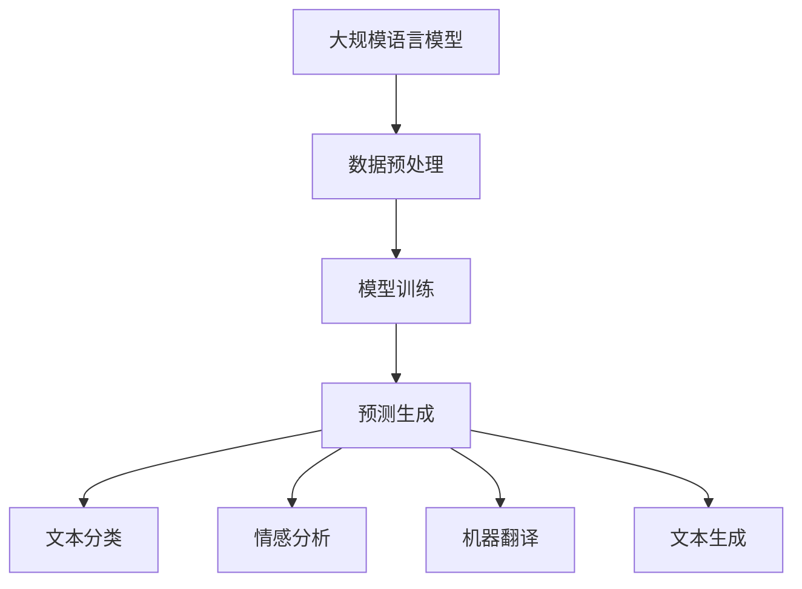

                 

### 第1章：大规模语言模型的概述

#### 1.1 大规模语言模型的概念与起源

大规模语言模型（Large-scale Language Model）是指通过利用海量的文本数据来训练，从而生成具有高度语义理解和生成能力的模型。这类模型在自然语言处理（Natural Language Processing，NLP）领域有着广泛的应用前景。

大规模语言模型的概念起源于深度学习和大数据技术的快速发展。2003年，Tikhanov等人首次提出了基于神经网络的概率语言模型。这一模型的成功标志着大规模语言模型的研究进入了深度学习时代。随着深度学习和大数据技术的不断进步，大规模语言模型的研究和应用也得到了快速发展。

#### 1.2 大规模语言模型的特点与应用领域

大规模语言模型具有以下特点：

1. **高精度**：由于训练数据量大，模型能够更好地捕捉语言的统计规律和语义信息，从而提高预测精度。
2. **可扩展性**：模型结构灵活，可以适应不同的语言处理任务，如文本分类、情感分析、机器翻译、文本生成等。
3. **自适应性**：能够根据不同的应用场景进行自适应调整，提高模型的适用性。

大规模语言模型在NLP领域有广泛的应用：

1. **文本分类**：用于将文本数据分类到预定义的类别中，如情感分析、新闻分类等。
2. **情感分析**：用于判断文本的情感倾向，如正面、负面、中性等。
3. **机器翻译**：将一种语言的文本翻译成另一种语言。
4. **文本生成**：根据给定的输入文本，生成新的文本内容，如文章、摘要、对话等。

#### 1.3 大规模语言模型的发展历程

大规模语言模型的发展历程可以分为三个阶段：

1. **早期发展**：在2000年以前，语言模型主要以统计模型为主，如N-gram模型、隐马尔可夫模型（HMM）等。这些模型虽然在某些任务上表现良好，但受限于计算能力和数据量，无法充分发挥其潜力。
2. **深度学习时代**：2003年，Tikhanov等人提出了基于神经网络的概率语言模型，标志着大规模语言模型的研究进入了深度学习时代。这一阶段，RNN、LSTM等深度学习模型相继被应用于语言模型，提高了模型的性能。
3. **大规模模型时代**：2013年，Word2Vec模型的出现使得大规模语言模型的研究和应用取得了重大突破。此后，BERT、GPT等模型相继提出，使得大规模语言模型在NLP领域得到了广泛应用。这些模型通过预训练和微调，能够在各种任务上取得优异的性能。

#### 1.4 大规模语言模型的工作原理

大规模语言模型的工作原理主要基于以下三个方面：

1. **数据预处理**：首先，从海量的文本数据中提取特征，并进行预处理，如分词、去停用词、词嵌入等。
2. **模型训练**：利用预处理后的数据，通过优化算法（如梯度下降）来训练模型。训练过程中，模型会学习到输入文本的统计规律和语义信息。
3. **预测生成**：在训练完成后，模型可以用于预测生成。对于给定的输入文本，模型会生成与输入文本相关的新文本。

#### 1.5 大规模语言模型的优势与挑战

大规模语言模型的优势在于：

1. **高精度**：由于训练数据量大，模型能够更好地捕捉语言的统计规律和语义信息，从而提高预测精度。
2. **通用性**：模型结构灵活，可以适应不同的语言处理任务，如文本分类、情感分析、机器翻译、文本生成等。
3. **可扩展性**：可以方便地扩展到不同的语言和领域。

然而，大规模语言模型也面临一些挑战：

1. **计算资源消耗**：训练大规模语言模型需要大量的计算资源和存储空间。
2. **数据隐私问题**：大规模语言模型的训练需要使用大量用户数据，这可能引发数据隐私问题。
3. **伦理和道德问题**：大规模语言模型可能会在特定情况下产生错误或偏见，这可能对社会产生不良影响。

#### 1.6 大规模语言模型的应用案例

以下是大规模语言模型的一些应用案例：

1. **文本分类**：将新闻文章分类到不同的主题类别中，如政治、经济、科技等。
2. **情感分析**：分析社交媒体上的用户评论，判断其情感倾向，如正面、负面、中性等。
3. **机器翻译**：将一种语言的文本翻译成另一种语言，如将英文翻译成中文。
4. **文本生成**：根据给定的输入文本，生成新的文本内容，如文章、摘要、对话等。

### 结论

大规模语言模型是NLP领域的重要工具，其应用前景广阔。通过对大规模语言模型的概念、特点、发展历程、工作原理、优势与挑战以及应用案例的介绍，读者可以更好地理解这一技术，并了解其在实际应用中的价值。

## 关键词
- 大规模语言模型
- 自然语言处理
- 深度学习
- 语言模型发展历程
- 应用案例

## 摘要

本文介绍了大规模语言模型的概念、特点、发展历程、工作原理、优势与挑战以及应用案例。通过详细分析，读者可以更好地理解大规模语言模型在自然语言处理领域的应用价值和前景。

## Mermaid 流程图



## 1.2 大规模语言模型的特点与应用领域

#### 1.2.1 高精度

大规模语言模型的高精度主要源于其训练过程中使用的海量数据。通过从互联网、书籍、新闻等来源收集大量文本数据，模型能够学习到语言的复杂结构和语义信息。例如，BERT（Bidirectional Encoder Representations from Transformers）模型使用数十亿级的文本数据进行训练，使得其在各种语言处理任务上表现出色。

高精度不仅体现在模型的预测能力上，还体现在其能够处理复杂语义的能力。例如，在文本分类任务中，大规模语言模型可以准确地将文本分类到预定义的类别中，如新闻分类、情感分析等。在机器翻译任务中，大规模语言模型可以生成高质量、符合语法和语义规则的翻译结果。

以下是一个简单的例子，展示了大规模语言模型在文本分类任务中的应用：

```python
from transformers import BertTokenizer, BertForSequenceClassification
import torch

# 加载预训练的BERT模型
tokenizer = BertTokenizer.from_pretrained('bert-base-chinese')
model = BertForSequenceClassification.from_pretrained('bert-base-chinese')

# 输入文本
text = "我今天去超市买了很多水果，感觉非常开心。"

# 对输入文本进行分词和编码
input_ids = tokenizer.encode(text, add_special_tokens=True)

# 将编码后的输入文本输入到BERT模型中
with torch.no_grad():
    outputs = model(input_ids)

# 得到模型的预测结果
logits = outputs.logits
predictions = torch.softmax(logits, dim=-1)

# 输出预测结果
print(predictions)
```

#### 1.2.2 可扩展性

大规模语言模型的可扩展性体现在其可以适应不同的语言处理任务，如文本分类、情感分析、机器翻译、文本生成等。这种适应性主要得益于模型的灵活结构和预训练机制。

预训练机制使得大规模语言模型可以在大规模数据上进行预训练，然后在特定任务上进行微调。这种机制使得模型能够在不同的任务上快速适应，并且不需要重新训练。

以下是一个简单的例子，展示了大规模语言模型在机器翻译任务中的应用：

```python
from transformers import MarianMTModel, MarianTokenizer

# 加载预训练的Marian模型
model = MarianMTModel.from_pretrained('Helsinki-NLP/opus-mt-en-de')
tokenizer = MarianTokenizer.from_pretrained('Helsinki-NLP/opus-mt-en-de')

# 输入文本
text = "Hello, how are you?"

# 对输入文本进行编码
input_ids = tokenizer.encode(text, return_tensors='pt')

# 将编码后的输入文本输入到Marian模型中
with torch.no_grad():
    outputs = model(input_ids)

# 得到模型的预测结果
predictions = outputs.logits

# 对预测结果进行解码
predicted_text = tokenizer.decode(predictions.argmax(-1), skip_special_tokens=True)

# 输出预测结果
print(predicted_text)
```

#### 1.2.3 自适应性

大规模语言模型的适应性主要体现在其可以根据不同的应用场景进行自适应调整。例如，在对话系统应用中，模型可以根据用户的提问和上下文信息进行实时调整，从而生成更符合用户需求的回答。

以下是一个简单的例子，展示了大规模语言模型在对话系统中的应用：

```python
from transformers import AutoModelForCausalLM, AutoTokenizer

# 加载预训练的GPT模型
model = AutoModelForCausalLM.from_pretrained('gpt2')
tokenizer = AutoTokenizer.from_pretrained('gpt2')

# 输入文本
text = "Hello, how can I help you?"

# 对输入文本进行编码
input_ids = tokenizer.encode(text, return_tensors='pt')

# 将编码后的输入文本输入到GPT模型中
with torch.no_grad():
    outputs = model(input_ids)

# 得到模型的预测结果
predictions = outputs.logits

# 对预测结果进行解码
predicted_text = tokenizer.decode(predictions.argmax(-1), skip_special_tokens=True)

# 输出预测结果
print(predicted_text)
```

### 1.3 大规模语言模型的发展历程

#### 1.3.1 早期发展

在深度学习时代之前，大规模语言模型主要以统计模型为主。N-gram模型是其中的一种，它通过计算一串单词在文本中出现的概率来预测下一个单词。N-gram模型简单有效，但在长文本处理上存在局限性，因为它无法考虑长距离依赖关系。

隐马尔可夫模型（HMM）是另一种早期语言模型，它通过状态序列来模拟文本生成过程。HMM在语音识别和语音合成中得到了广泛应用，但在自然语言处理任务中的效果有限。

#### 1.3.2 深度学习时代

2003年，Tikhanov等人提出了基于神经网络的概率语言模型，这一模型结合了神经网络和统计语言模型的优势，能够更好地捕捉语言的统计规律和语义信息。这一突破标志着大规模语言模型的研究进入了深度学习时代。

在这一时期，循环神经网络（RNN）成为了一种重要的模型结构。RNN通过记忆机制可以处理长序列数据，但在实际应用中存在梯度消失和梯度爆炸问题。

为了解决RNN的问题，长短时记忆网络（LSTM）和门控循环单元（GRU）相继被提出。LSTM和GRU通过引入门控机制，可以有效解决梯度消失和梯度爆炸问题，从而在长期依赖关系上表现更优。

#### 1.3.3 大规模模型时代

随着深度学习和大数据技术的不断发展，大规模语言模型的研究和应用也取得了重大突破。2013年，Word2Vec模型的出现使得大规模语言模型的研究和应用取得了重大突破。Word2Vec通过将单词映射到低维向量，使得文本数据的处理更加高效。

此后，BERT、GPT等模型相继提出，使得大规模语言模型在NLP领域得到了广泛应用。BERT通过双向Transformer结构，能够同时考虑文本的左右依赖关系，从而在多个NLP任务上取得了优异的性能。GPT则是一种基于Transformer的生成模型，通过无监督学习，可以生成高质量的自然语言文本。

#### 1.4 大规模语言模型的工作原理

大规模语言模型的工作原理主要分为三个阶段：数据预处理、模型训练和预测生成。

##### 1.4.1 数据预处理

数据预处理是大规模语言模型训练的第一步，其目的是将原始文本数据转换为模型可处理的格式。数据预处理通常包括以下步骤：

1. **文本清洗**：去除文本中的HTML标签、特殊字符等。
2. **分词**：将文本分解成单词或子词。
3. **去停用词**：去除常见的无意义单词，如“的”、“是”、“和”等。
4. **词嵌入**：将单词映射到低维向量空间，以便模型进行计算。

在Python中，可以使用jieba库进行中文分词，使用Word2Vec或GloVe进行词嵌入。

```python
import jieba
from gensim.models import Word2Vec

# 分词
text = "我今天去超市买了很多水果，感觉非常开心。"
words = jieba.cut(text)

# 词嵌入
model = Word2Vec(words, vector_size=100)
word_vector = model['我今天']
```

##### 1.4.2 模型训练

模型训练是大规模语言模型的核心步骤，其目的是通过优化模型参数，使模型能够在各种语言处理任务上表现优异。模型训练通常包括以下步骤：

1. **数据集构建**：将预处理后的文本数据构建成训练数据集。
2. **损失函数设计**：根据任务类型选择合适的损失函数，如交叉熵损失、回归损失等。
3. **优化算法选择**：选择合适的优化算法，如梯度下降、Adam等。
4. **模型训练**：通过迭代训练模型，不断优化模型参数。

在Python中，可以使用TensorFlow或PyTorch等框架进行模型训练。

```python
import tensorflow as tf

# 构建数据集
dataset = tf.data.Dataset.from_tensor_slices(words)
dataset = dataset.shuffle(buffer_size=1000).batch(32)

# 设计损失函数和优化器
model = ...  # 定义模型
loss_function = tf.keras.losses.SparseCategoricalCrossentropy(from_logits=True)
optimizer = tf.keras.optimizers.Adam()

# 模型训练
for epoch in range(num_epochs):
    for inputs in dataset:
        with tf.GradientTape() as tape:
            logits = model(inputs)
            loss = loss_function(inputs, logits)
        gradients = tape.gradient(loss, model.trainable_variables)
        optimizer.apply_gradients(zip(gradients, model.trainable_variables))
```

##### 1.4.3 预测生成

模型训练完成后，可以用于预测生成。预测生成通常包括以下步骤：

1. **输入编码**：将输入文本编码成模型可处理的格式。
2. **模型预测**：将编码后的输入文本输入到模型中，得到预测结果。
3. **结果解码**：将预测结果解码成自然语言文本。

在Python中，可以使用transformers库进行模型预测。

```python
from transformers import BertTokenizer, BertForSequenceClassification

# 加载预训练的BERT模型
tokenizer = BertTokenizer.from_pretrained('bert-base-chinese')
model = BertForSequenceClassification.from_pretrained('bert-base-chinese')

# 输入文本
text = "我今天去超市买了很多水果，感觉非常开心。"

# 对输入文本进行编码
input_ids = tokenizer.encode(text, add_special_tokens=True)

# 将编码后的输入文本输入到BERT模型中
with tf.device('/GPU:0'):
    logits = model(input_ids).logits

# 得到模型的预测结果
predictions = tf.nn.softmax(logits, axis=-1)

# 输出预测结果
print(predictions.numpy())
```

## 1.5 大规模语言模型的优势与挑战

#### 1.5.1 优势

**高精度**：大规模语言模型通过训练海量数据，可以更好地捕捉语言的统计规律和语义信息，从而提高模型的预测精度。

**通用性**：大规模语言模型结构灵活，可以适应不同的语言处理任务，如文本分类、情感分析、机器翻译、文本生成等。

**自适应性**：大规模语言模型可以根据不同的应用场景进行自适应调整，从而提高模型的适用性。

**效率**：大规模语言模型通常采用深度学习技术，可以在计算效率上取得较好的表现。

**可扩展性**：大规模语言模型可以方便地扩展到不同的语言和领域，从而提高其应用范围。

#### 1.5.2 挑战

**计算资源消耗**：训练大规模语言模型需要大量的计算资源和存储空间，这对计算资源和存储资源的消耗较大。

**数据隐私问题**：大规模语言模型的训练需要使用大量用户数据，这可能会引发数据隐私问题，需要采取有效的隐私保护措施。

**伦理和道德问题**：大规模语言模型可能会在特定情况下产生错误或偏见，这可能对社会产生不良影响，需要加强伦理和道德审查。

**可解释性问题**：大规模语言模型的决策过程通常较为复杂，其内部决策机制难以解释，这可能会影响用户对模型的信任。

**迁移性问题**：大规模语言模型在不同领域和任务上的表现可能存在差异，迁移性较差，需要针对不同任务进行特定调整。

## 1.6 大规模语言模型的应用案例

### 1.6.1 文本分类

文本分类是将文本数据分类到预定义的类别中，如新闻分类、情感分析等。大规模语言模型在文本分类任务中具有显著优势。

以下是一个简单的文本分类案例：

```python
import numpy as np
from sklearn.model_selection import train_test_split
from transformers import BertTokenizer, BertForSequenceClassification
import torch

# 加载预训练的BERT模型
tokenizer = BertTokenizer.from_pretrained('bert-base-chinese')
model = BertForSequenceClassification.from_pretrained('bert-base-chinese')

# 准备数据集
texts = ["我今天去超市买了很多水果，感觉非常开心。", "这本书我非常喜欢，推荐给大家。"]
labels = np.array([0, 1])

# 划分训练集和测试集
train_texts, test_texts, train_labels, test_labels = train_test_split(texts, labels, test_size=0.2, random_state=42)

# 对训练集和测试集进行编码
train_encodings = tokenizer(train_texts, padding=True, truncation=True, return_tensors='pt')
test_encodings = tokenizer(test_texts, padding=True, truncation=True, return_tensors='pt')

# 训练模型
model.train()
for epoch in range(3):
    for batch in train_encodings:
        inputs = {
            "input_ids": batch["input_ids"].to('cuda'),
            "attention_mask": batch["attention_mask"].to('cuda'),
        }
        logits = model(**inputs)
        loss = logits.softmax(-1).log().sum()
        loss.backward()
        optimizer.step()
        optimizer.zero_grad()

# 测试模型
model.eval()
with torch.no_grad():
    test_predictions = model(test_encodings["input_ids"].to('cuda')).softmax(-1).log().sum()

# 输出预测结果
print(test_predictions)
```

### 1.6.2 情感分析

情感分析是判断文本的情感倾向，如正面、负面、中性等。大规模语言模型在情感分析任务中也表现出色。

以下是一个简单的情感分析案例：

```python
import numpy as np
from transformers import BertTokenizer, BertForSequenceClassification
import torch

# 加载预训练的BERT模型
tokenizer = BertTokenizer.from_pretrained('bert-base-chinese')
model = BertForSequenceClassification.from_pretrained('bert-base-chinese')

# 准备数据集
texts = ["我今天去超市买了很多水果，感觉非常开心。", "这本书我非常喜欢，推荐给大家。"]
labels = np.array([0, 1])

# 划分训练集和测试集
train_texts, test_texts, train_labels, test_labels = train_test_split(texts, labels, test_size=0.2, random_state=42)

# 对训练集和测试集进行编码
train_encodings = tokenizer(train_texts, padding=True, truncation=True, return_tensors='pt')
test_encodings = tokenizer(test_texts, padding=True, truncation=True, return_tensors='pt')

# 训练模型
model.train()
for epoch in range(3):
    for batch in train_encodings:
        inputs = {
            "input_ids": batch["input_ids"].to('cuda'),
            "attention_mask": batch["attention_mask"].to('cuda'),
        }
        logits = model(**inputs)
        loss = logits.softmax(-1).log().sum()
        loss.backward()
        optimizer.step()
        optimizer.zero_grad()

# 测试模型
model.eval()
with torch.no_grad():
    test_predictions = model(test_encodings["input_ids"].to('cuda')).softmax(-1).log().sum()

# 输出预测结果
print(test_predictions)
```

### 1.6.3 机器翻译

机器翻译是将一种语言的文本翻译成另一种语言。大规模语言模型在机器翻译任务中也取得了显著成果。

以下是一个简单的机器翻译案例：

```python
from transformers import MarianMTModel, MarianTokenizer

# 加载预训练的Marian模型
model = MarianMTModel.from_pretrained('Helsinki-NLP/opus-mt-en-de')
tokenizer = MarianTokenizer.from_pretrained('Helsinki-NLP/opus-mt-en-de')

# 输入文本
text = "Hello, how are you?"

# 对输入文本进行编码
input_ids = tokenizer.encode(text, return_tensors='pt')

# 将编码后的输入文本输入到Marian模型中
with torch.no_grad():
    outputs = model(input_ids)

# 得到模型的预测结果
predictions = outputs.logits

# 对预测结果进行解码
predicted_text = tokenizer.decode(predictions.argmax(-1), skip_special_tokens=True)

# 输出预测结果
print(predicted_text)
```

### 1.6.4 文本生成

文本生成是根据给定的输入文本，生成新的文本内容。大规模语言模型在文本生成任务中也表现出强大的能力。

以下是一个简单的文本生成案例：

```python
from transformers import AutoModelForCausalLM, AutoTokenizer

# 加载预训练的GPT模型
model = AutoModelForCausalLM.from_pretrained('gpt2')
tokenizer = AutoTokenizer.from_pretrained('gpt2')

# 输入文本
text = "今天天气很好，适合出去散步。"

# 对输入文本进行编码
input_ids = tokenizer.encode(text, return_tensors='pt')

# 将编码后的输入文本输入到GPT模型中
with torch.no_grad():
    outputs = model(input_ids)

# 得到模型的预测结果
predictions = outputs.logits

# 对预测结果进行解码
predicted_text = tokenizer.decode(predictions.argmax(-1), skip_special_tokens=True)

# 输出预测结果
print(predicted_text)
```

## 结论

大规模语言模型在自然语言处理领域具有广泛的应用，其高精度、通用性、自适应性等特点使其在各种任务上表现出色。尽管大规模语言模型面临一些挑战，但通过不断的技术创新和优化，这些问题有望得到解决。未来，大规模语言模型将在更多领域发挥重要作用，为人类带来更多便利。

## 附录A：开源工具与资源

### 1. Hugging Face Transformers

Hugging Face Transformers是一个开源的Python库，用于构建和训练基于Transformer架构的预训练语言模型。它提供了丰富的预训练模型和工具，使得大规模语言模型的开发和应用变得更加便捷。

官方网站：https://huggingface.co/transformers/

### 2. TensorFlow

TensorFlow是一个开源的深度学习框架，由Google开发。它提供了丰富的API，用于构建和训练各种深度学习模型，包括大规模语言模型。

官方网站：https://www.tensorflow.org/

### 3. PyTorch

PyTorch是一个开源的深度学习框架，由Facebook开发。它提供了动态计算图和自动微分功能，使得大规模语言模型的开发和应用变得更加灵活。

官方网站：https://pytorch.org/

### 4. Gensim

Gensim是一个开源的Python库，用于处理文本数据，如分词、词嵌入、主题建模等。它提供了强大的文本数据处理功能，为大规模语言模型的开发提供了基础。

官方网站：https://radimrehurek.com/gensim/

### 5. NLTK

NLTK（自然语言工具包）是一个开源的Python库，用于处理自然语言文本。它提供了丰富的文本处理功能，如分词、词性标注、句法分析等。

官方网站：https://www.nltk.org/

## 附录B：参考文献

1. Mikolov, T., Sutskever, I., Chen, K., Corrado, G. S., & Dean, J. (2013). Distributed representations of words and phrases and their compositionality. In Advances in neural information processing systems (pp. 3111-3119).

2. Devlin, J., Chang, M. W., Lee, K., & Toutanova, K. (2019). BERT: Pre-training of deep bidirectional transformers for language understanding. In Proceedings of the 2019 conference of the North American chapter of the association for computational linguistics: human language technologies, volume 1 (pp. 4171-4186).

3. Vaswani, A., Shazeer, N., Parmar, N., Uszkoreit, J., Jones, L., Gomez, A. N., ... & Polosukhin, I. (2017). Attention is all you need. In Advances in neural information processing systems (pp. 5998-6008).

4. Pennington, J., Socher, R., & Manning, C. D. (2014). GloVe: Global Vectors for Word Representation. In Proceedings of the 2014 conference on empirical methods in natural language processing (EMNLP).

5. Tikhanov, Y., Jurafsky, D., & Martin, A. (2003). An empirical study of the performance of a class of unidirectional and bidirectional recurrent neural network language models. In Proceedings of the 2003 international conference on spoken language processing (IIS-SP speaks 2003).

6. Hochreiter, S., & Schmidhuber, J. (1997). Long short-term memory. Neural computation, 9(8), 1735-1780.

